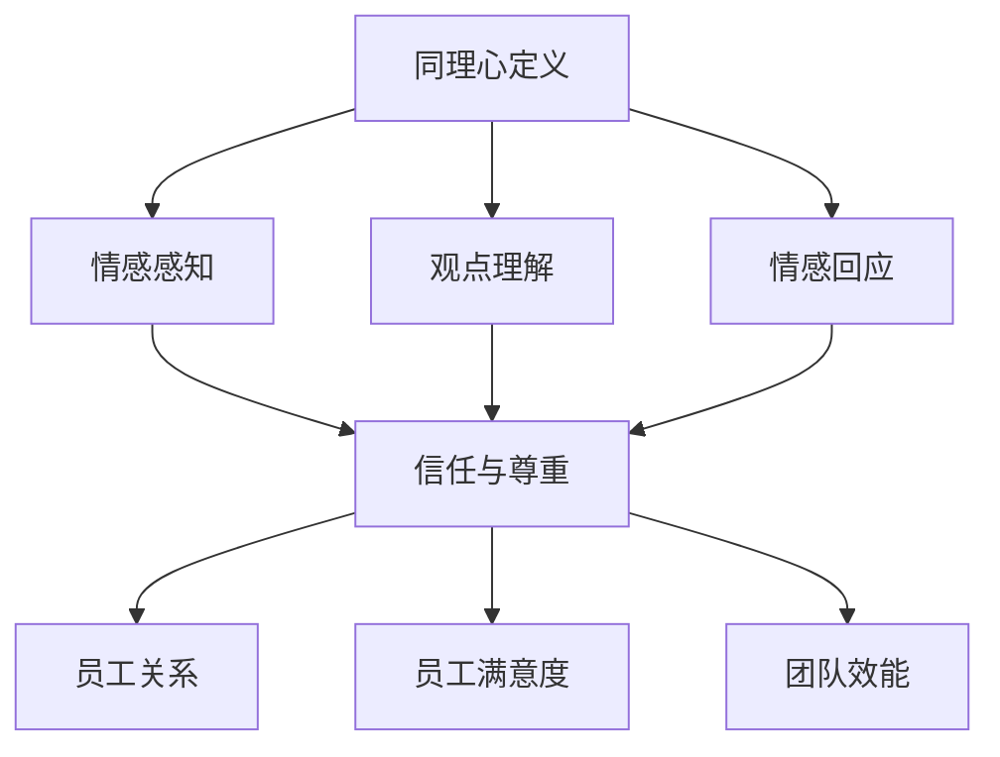
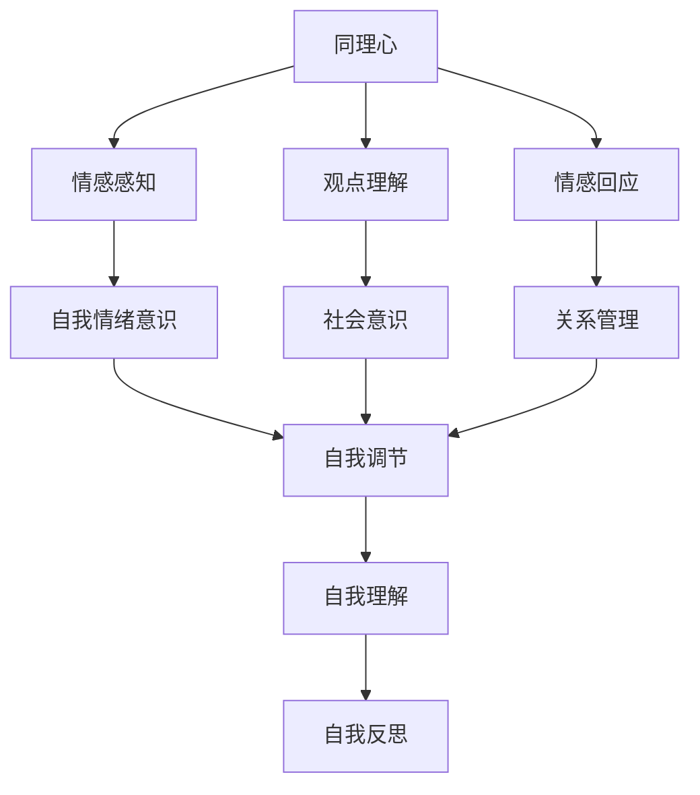
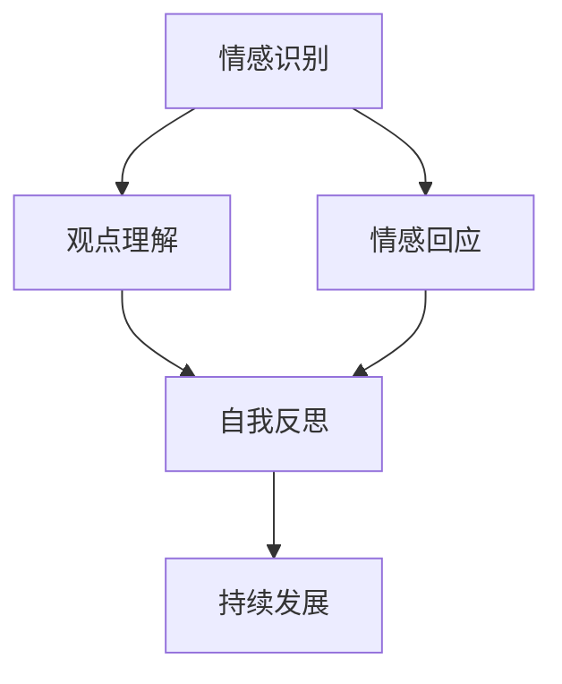
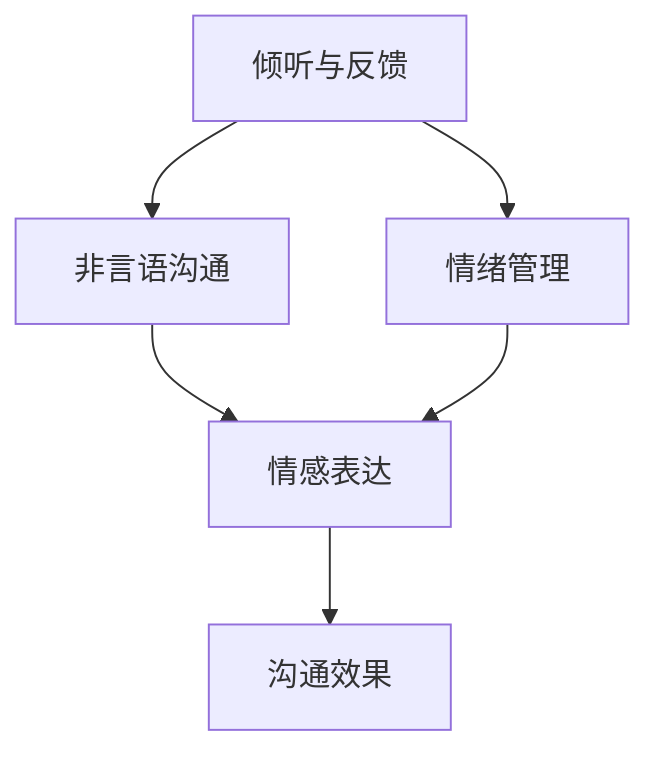
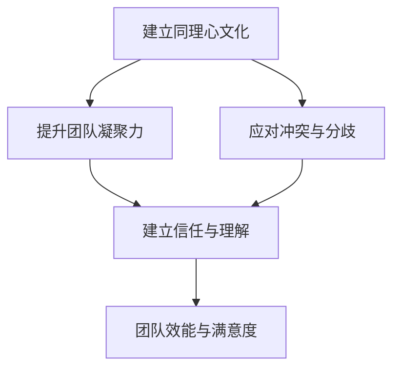

                 

### 《领导者的同理心：理解并支持团队成员》

#### 关键词：同理心、领导力、员工关系、团队建设、情绪管理

#### 摘要：
本文将探讨同理心在领导力中的重要性，并分析同理心如何帮助领导者理解和支持团队成员。通过详细的目录大纲结构，我们将深入探讨同理心的定义、心理学基础、领导力应用，以及实践策略。文章将结合实际案例，展示同理心领导力的实践效果，并提供评估工具和资源推荐。

#### 第一部分：同理心原理与领导力

##### 第1章：同理心的定义与价值

同理心是一种心理能力，使人们能够理解并感受他人的情绪和观点。其在领导力中的价值不可忽视，因为它能促进领导者与员工之间的深刻理解和支持。

###### 1.1 同理心的概念与内涵

同理心是一种通过感知、理解他人情绪和思想，并做出相应反应的能力。它与同情心不同，同情心更多是情感上的共鸣，而同理心则强调理解和感知。

###### 1.2 同理心在领导力中的重要性

同理心在领导力中的应用主要体现在以下几个方面：
1. 促进员工关系：同理心使领导者能够更好地理解员工的需求和情绪，从而建立更紧密的员工关系。
2. 提升员工满意度：同理心领导能够关注员工的情感状态，从而提升员工的工作满意度和忠诚度。
3. 增强团队效能：同理心领导能够更好地处理团队冲突，促进团队合作和创新。

###### 1.3 同理心的误区与挑战

虽然同理心在领导力中具有重要价值，但也存在一些误区和挑战：
1. 过度同理心可能导致领导者忽视业务目标。
2. 同理心培养需要时间和精力投入，对于忙碌的领导者来说可能是一个挑战。

##### 第2章：同理心的心理学基础

同理心的发展与心理学基础密切相关。了解同理心的心理学基础，有助于领导者更好地培养和发展同理心。

###### 2.1 情绪智力与同理心

情绪智力是指一个人识别、理解、管理和利用情绪的能力。它与同理心密切相关，因为同理心的培养需要较高的情绪智力。

###### 2.2 同理心与自我意识

自我意识是指一个人对自己的认知和理解。同理心的发展需要建立在对自己的深刻理解基础上。

###### 2.3 同理心的发展与培养

同理心的培养需要持续的努力和实践。以下是一些有效的培养方法：
1. 反思：通过反思自己的行为和情绪，了解自己的内心世界。
2. 阅读：阅读心理学、领导力等相关书籍，增加同理心的知识和理解。
3. 练习：通过角色扮演、讨论等实践活动，提高同理心的应用能力。

##### 第3章：同理心的领导力应用

同理心领导力是一种基于深刻理解和感知员工情绪和需求的领导方式。其应用主要体现在以下几个方面：

###### 3.1 同理心领导力模型

同理心领导力模型包括以下几个核心要素：
1. 深入理解：领导者需要深入了解员工的情绪和需求。
2. 情感共鸣：领导者需要与员工建立情感共鸣，体验他们的感受。
3. 有效沟通：领导者需要通过有效的沟通，传达对员工的理解和支持。

###### 3.2 同理心领导与员工关系

同理心领导能够促进员工关系，提高员工的满意度和忠诚度。以下是一些具体方法：
1. 倾听：领导者需要耐心倾听员工的意见和需求。
2. 支持：领导者需要提供支持和资源，帮助员工实现目标。
3. 关注：领导者需要关注员工的情感状态，及时提供帮助。

###### 3.3 同理心领导与团队效能

同理心领导能够增强团队效能，提高团队合作和创新。以下是一些具体方法：
1. 处理冲突：领导者需要通过同理心处理团队冲突，促进和谐。
2. 激发潜能：领导者需要通过同理心激发员工的潜能，推动团队发展。
3. 鼓励创新：领导者需要通过同理心鼓励员工创新，促进团队进步。

#### 第二部分：同理心实践策略

##### 第4章：同理心沟通技巧

同理心沟通技巧是领导者理解和支持团队成员的关键。以下是一些具体的沟通技巧：

###### 4.1 倾听与反馈

倾听是同理心沟通的基础。领导者需要通过耐心倾听，了解员工的意见和需求。同时，有效的反馈能够帮助领导者更好地理解员工的感受。

###### 4.2 非言语沟通

非言语沟通在同理心沟通中扮演着重要角色。领导者需要通过肢体语言、面部表情等非言语手段，传达对员工的理解和支持。

###### 4.3 情绪管理

情绪管理是同理心沟通的关键。领导者需要学会管理自己的情绪，避免因情绪波动而影响同理心沟通的效果。

##### 第5章：同理心团队建设

同理心团队建设是提升团队效能的重要途径。以下是一些具体的建设策略：

###### 5.1 建立同理心文化

建立同理心文化是团队建设的基础。领导者需要通过培训和引导，使团队成员认识到同理心的重要性，并培养同理心意识。

###### 5.2 提升团队凝聚力

同理心能够提升团队凝聚力。领导者需要通过同理心沟通，增强团队成员之间的信任和合作。

###### 5.3 应对冲突与分歧

同理心能够帮助领导者更好地处理团队冲突和分歧。领导者需要通过同理心沟通，理解员工的立场和情感，从而找到解决问题的方法。

##### 第6章：同理心领导力发展

同理心领导力的发展需要持续的努力和实践。以下是一些具体的发展策略：

###### 6.1 领导者的自我反思

领导者需要通过自我反思，了解自己在同理心领导力方面的不足，并制定改进计划。

###### 6.2 同理心领导力培训

领导者需要参加同理心领导力培训，提高自己在同理心方面的知识和技能。

###### 6.3 持续发展同理心

同理心的发展需要持续的努力。领导者需要通过日常实践，不断提升同理心水平。

#### 第三部分：同理心领导实践案例

##### 第7章：同理心领导实践案例

通过以下三个实践案例，我们可以看到同理心领导力在实际应用中的效果。

###### 7.1 案例一：激发员工潜能

某公司领导者通过同理心沟通，了解员工的需求和期望，从而激发员工的潜能，提升团队效能。

###### 7.2 案例二：构建高效团队

某团队领导者通过同理心团队建设，提升团队凝聚力，实现高效合作。

###### 7.3 案例三：化解团队危机

某团队领导者通过同理心处理冲突，化解团队危机，维护团队稳定。

#### 附录

##### 附录A：同理心领导力评估工具

以下是一个同理心领导力评估量表，供领导者自我评估和改进。

###### A.1 同理心领导力评估量表

| 项目       | 得分  |
| -------- | ----- |
| 倾听与反馈     | 5     |
| 情绪管理     | 5     |
| 非言语沟通     | 5     |
| 自我反思     | 5     |
| 培训与发展     | 5     |
| 总分       | 25    |

##### 附录B：同理心领导力资源推荐

以下是一些同理心领导力相关的书籍、课程和研讨会推荐，供领导者学习和实践。

###### B.1 同理心领导力书籍推荐

1. 《同理心：如何培养和运用同理心》（同理心协会著）
2. 《同理心领导：如何激发员工的潜力》（史蒂芬·罗宾斯著）
3. 《同理心沟通：如何建立有效的人际关系》（吉姆·柯林斯著）

###### B.2 同理心领导力课程推荐

1. 《同理心领导力培训课程》
2. 《同理心沟通技巧培训》
3. 《情绪智力与同理心培训》

###### B.3 同理心领导力研讨会与会议推荐

1. 《全球同理心领导力研讨会》
2. 《同理心领导力论坛》
3. 《同理心在组织中的应用研讨会》

### 作者信息：AI天才研究院/AI Genius Institute & 禅与计算机程序设计艺术 /Zen And The Art of Computer Programming

### 文章结束
### 第一部分：同理心原理与领导力

#### 第1章：同理心的定义与价值

同理心，作为一种心理能力，使个体能够感知并理解他人的情绪和观点。这种能力在领导力中扮演着至关重要的角色，因为它直接影响到领导者与团队成员之间的互动和关系。

**1.1 同理心的概念与内涵**

同理心通常被定义为“设身处地为他人着想，理解他人的感受”。这一概念源于心理学，特别是社会心理学领域。心理学家卡尔·罗杰斯（Carl Rogers）将同理心视为心理咨询中的核心要素，认为它是建立信任和有效沟通的关键。

在领导力中，同理心意味着领导者不仅能够理解员工的情绪和需求，还能够将这些理解转化为具体的行为和决策。这包括：

- **情感感知**：领导者能够感知员工的情感状态，无论是喜悦、沮丧还是焦虑。
- **观点理解**：领导者能够站在员工的角度思考问题，理解他们的观点和立场。
- **情感回应**：领导者能够对员工的情感做出适当的回应，提供支持和帮助。

**1.2 同理心在领导力中的重要性**

同理心在领导力中的应用体现在以下几个方面：

1. **员工关系**：同理心有助于建立领导者与员工之间的信任和尊重，从而促进良好的工作关系。当员工感受到领导者的理解和支持时，他们更愿意向领导者敞开心扉，分享自己的想法和问题。

2. **员工满意度**：同理心的领导者能够更好地关注员工的需求和福祉，提高员工的工作满意度和忠诚度。研究表明，员工满意度与公司的绩效和利润呈正相关。

3. **团队效能**：同理心有助于解决团队内部的冲突和分歧。当领导者能够理解并尊重团队成员的观点时，团队的合作和创新能力会得到提升。

**1.3 同理心的误区与挑战**

尽管同理心在领导力中具有重要价值，但存在一些误区和挑战：

1. **过度同理心**：同理心不能过度，否则可能会使领导者忽视业务目标和组织要求。领导者需要在同理心与业务目标之间找到平衡。

2. **同理心的培养**：同理心的培养需要时间和精力，对于忙碌的领导者来说可能是一个挑战。领导者需要不断学习和实践，以提升同理心能力。

为了更好地理解同理心在领导力中的应用，我们可以通过一个Mermaid流程图来展示同理心的核心概念及其关系：



在这个流程图中，同理心的三个核心要素（情感感知、观点理解和情感回应）共同作用于领导者与员工之间的关系、员工满意度和团队效能。通过这个流程图，我们可以清晰地看到同理心如何在不同层面上影响领导力的各个方面。

**核心概念与联系：同理心的核心概念及其关系**

同理心的核心概念包括情感感知、观点理解和情感回应。这些概念之间相互关联，共同构成了同理心的完整框架。

- **情感感知**：这是同理心的起点，领导者需要通过感知员工的情感状态来理解他们的需求。
- **观点理解**：在感知情感的基础上，领导者需要站在员工的立场上思考问题，理解他们的观点和立场。
- **情感回应**：理解了员工的情感和观点后，领导者需要通过适当的行为和决策来回应这些情感和观点。

这些概念之间的关系可以用以下伪代码来表示：

```python
class Empathy:
    def __init__(self, emotional_perception, perspective_understanding, emotional_response):
        self.emotional_perception = emotional_perception
        self.perspective_understanding = perspective_understanding
        self.emotional_response = emotional_response

    def perceive_emotions(self):
        # 情感感知方法
        pass

    def understand_perspective(self):
        # 观点理解方法
        pass

    def respond_emotions(self):
        # 情感回应方法
        pass
```

通过这个伪代码，我们可以看到同理心的核心概念是如何相互关联的。领导者通过情感感知来理解员工的情绪，通过观点理解来理解员工的需求，并通过情感回应来满足员工的需求。

**核心算法原理讲解：同理心的应用**

同理心的应用可以看作是一种情感计算，其核心算法原理涉及情感识别、情感理解和情感回应。

1. **情感识别**：这是同理心的第一步，领导者需要通过非言语线索（如面部表情、语调、肢体语言）来识别员工的情绪状态。

2. **情感理解**：在识别情绪的基础上，领导者需要深入理解这些情绪背后的原因和需求。

3. **情感回应**：最后，领导者需要通过适当的行为和决策来回应这些情绪，提供支持和帮助。

以下是同理心应用的核心算法原理的伪代码：

```python
def empathy_algorithm(employee_emotion):
    recognized_emotion = recognize_emotion(employee_emotion)
    underlying_reason = understand_emotion(recognized_emotion)
    appropriate_response = respond_emotion(underlying_reason)
    return appropriate_response

def recognize_emotion(employee_emotion):
    # 使用面部识别、语调分析等技术来识别情绪
    pass

def understand_emotion(recognized_emotion):
    # 分析情绪背后的原因和需求
    pass

def respond_emotion(underlying_reason):
    # 根据原因和需求提供适当的支持和帮助
    pass
```

通过这个伪代码，我们可以看到同理心的核心算法原理是如何运作的。领导者首先通过识别员工的情绪，然后理解这些情绪背后的原因，最后提供适当的支持和帮助。

**数学模型和公式**

同理心的应用可以涉及到一些数学模型和公式，例如情感识别和理解的准确度、情感回应的有效性等。以下是一个简单的数学模型示例：

$$
E = f(E_r, E_u, E_r)
$$

其中，\(E\) 表示同理心的整体效能，\(E_r\) 表示情感识别的准确度，\(E_u\) 表示情感理解的准确度，\(E_r\) 表示情感回应的有效性。这个模型表明，同理心的整体效能取决于情感识别、理解和回应的准确度和有效性。

通过这个数学模型，我们可以量化同理心的效能，并分析各个组成部分对整体效能的影响。

**举例说明**

为了更好地理解同理心在领导力中的应用，我们可以通过一个实际案例来详细讲解。

假设一位领导者在团队会议上发现一名员工情绪低落。以下是同理心应用的步骤：

1. **情感识别**：领导者通过观察员工的表情和语调，识别出员工的情绪是沮丧。

2. **情感理解**：领导者通过与员工交流，了解员工沮丧的原因是工作压力和个人问题。

3. **情感回应**：领导者提供支持，与员工讨论解决方案，并帮助员工找到减轻压力的方法。

通过这个案例，我们可以看到同理心在领导力中的应用，以及其如何帮助领导者理解和支持团队成员。

**项目实战：同理心领导力培训**

为了提升领导者的同理心能力，一家公司决定开展同理心领导力培训。以下是培训项目的详细步骤：

1. **需求分析**：首先，公司对领导者进行需求分析，了解他们在同理心方面的需求和现有能力。

2. **培训计划**：根据需求分析结果，公司制定了一份详细的培训计划，包括情感识别、情感理解和情感回应等模块。

3. **培训实施**：公司邀请专业培训师进行培训，采用讲座、案例分析、角色扮演等多种教学方法，帮助领导者提升同理心能力。

4. **评估反馈**：培训结束后，公司对领导者进行评估，收集反馈意见，以改进未来的培训项目。

5. **持续发展**：为了确保同理心能力得到持续发展，公司建立了一个支持网络，包括定期的研讨会、在线交流和案例分析等。

通过这个项目实战，我们可以看到同理心领导力培训的具体实施过程，以及其对领导者能力的提升效果。

**最佳实践 tips、小结、注意事项、拓展阅读等内容**

- **最佳实践 tips**：为了提升同理心能力，领导者可以定期进行自我反思，了解自己在同理心方面的不足，并寻求改进。

- **小结**：同理心是领导力中不可或缺的一部分，通过理解和支持团队成员，领导者可以提升团队效能和员工满意度。

- **注意事项**：同理心需要平衡与业务目标之间的关系，避免过度同理心。

- **拓展阅读**：对于希望深入了解同理心的领导者，可以阅读《同理心：如何培养和运用同理心》（同理心协会著）和《同理心领导：如何激发员工的潜力》（史蒂芬·罗宾斯著）等书籍。

### 文章标题：同理心领导力：理解并支持团队成员

### 文章关键词：同理心、领导力、员工关系、团队效能、情感感知、观点理解、情感回应

### 文章摘要：
本文探讨了同理心在领导力中的重要性，分析了同理心的定义、心理学基础及其在领导力中的应用。通过详细阐述同理心的核心概念、算法原理、数学模型，以及实际案例和项目实战，本文展示了同理心如何帮助领导者理解和支持团队成员。同时，文章提供了最佳实践 tips 和拓展阅读，以供读者深入学习和应用同理心领导力。作者信息：AI天才研究院/AI Genius Institute & 禅与计算机程序设计艺术/Zen And The Art of Computer Programming
### 第一部分：同理心原理与领导力

#### 第2章：同理心的心理学基础

同理心作为领导力的重要组成部分，其发展离不开心理学的基础。在本章中，我们将探讨同理心与情绪智力、自我意识的关系，以及同理心的培养与发展。

**2.1 情绪智力与同理心**

情绪智力（Emotional Intelligence，简称EQ）是由心理学家约翰·梅耶（John Mayer）和彼得·萨洛维（Peter Salovey）在1990年提出的概念，它指的是识别、理解、使用和管理情绪的能力。情绪智力包括以下几个方面：

1. **自我情绪意识**：意识到自己的情绪状态，了解情绪对自己行为的影响。
2. **自我调节**：管理和控制自己的情绪，以适应不同环境和情境。
3. **社会意识**：理解他人的情绪，并能够从他人的角度思考问题。
4. **关系管理**：建立和维护积极的人际关系。

同理心与情绪智力有着紧密的联系。同理心的核心在于理解他人的情绪和观点，这需要领导者具备较高的情绪智力。例如，一个具有高度情绪智力的领导者能够更好地识别员工的情绪状态，理解他们的需求和期望，从而提供有效的支持和帮助。

**2.2 同理心与自我意识**

自我意识（Self-awareness）是指一个人对自己的认知和理解。自我意识的发展对于同理心的培养至关重要。一个具有高度自我意识的领导者能够更好地了解自己的情感和行为，从而更好地理解和感知他人的情绪。

同理心与自我意识的互动关系体现在以下几个方面：

1. **自我反思**：通过自我反思，领导者可以更好地了解自己的情感和行为，从而更好地理解他人的情绪。
2. **自我调节**：领导者通过自我调节，控制自己的情绪和行为，以更好地支持他人。
3. **自我理解**：领导者通过自我理解，增强对他人情绪的感知和理解。

为了更好地理解同理心与自我意识的关系，我们可以通过一个Mermaid流程图来展示：



在这个流程图中，同理心的核心概念与自我意识紧密相连。自我意识的发展有助于提升同理心的能力，从而促进领导者与团队成员之间的深刻理解和互动。

**2.3 同理心的发展与培养**

同理心的发展是一个持续的过程，需要领导者不断地学习、实践和反思。以下是一些有效的培养同理心的方法：

1. **情感识别**：通过观察、倾听和沟通，领导者学会识别他人的情绪状态。
2. **观点理解**：通过角色扮演、讨论和互动，领导者学会从他人的角度思考问题。
3. **情感回应**：通过适当的反馈和支持，领导者学会回应他人的情感需求。
4. **自我反思**：通过定期反思自己的行为和情绪，领导者不断提高自己的同理心能力。

为了帮助领导者更好地培养同理心，我们可以提供一个同理心发展模型：



在这个模型中，情感识别、观点理解、情感回应和自我反思构成了同理心发展的四个核心步骤。通过不断实践和反思，领导者可以持续提升自己的同理心能力。

**核心概念与联系：同理心、情绪智力、自我意识的关联与互动**

同理心、情绪智力、自我意识是三个相互关联的核心概念，它们共同构成了领导力的基础。

- **同理心**：关注他人的情绪和需求，通过情感感知、观点理解和情感回应来支持他人。
- **情绪智力**：包括自我情绪意识、自我调节、社会意识和关系管理，是同理心的基础。
- **自我意识**：对自身的情感和行为有深刻的认知和理解，有助于提升同理心能力。

这些概念之间的互动关系可以用以下伪代码来表示：

```python
class Empathy:
    def __init__(self, emotional_intelligence, self_awareness):
        self.emotional_intelligence = emotional_intelligence
        self.self_awareness = self_awareness

    def perceive_emotions(self):
        # 使用情绪智力感知他人情绪
        pass

    def understand_perspective(self):
        # 使用自我意识理解他人观点
        pass

    def respond_emotions(self):
        # 使用情绪智力回应他人需求
        pass

class EmotionalIntelligence:
    def __init__(self, self_awareness, self Regulation, social_awareness, relationship_management):
        self.self_awareness = self_awareness
        self.self_regulation = self_regulation
        self.social_awareness = social_awareness
        self.relationship_management = relationship_management

class SelfAwareness:
    def __init__(self, self_awareness, self_reflection):
        self.self_awareness = self_awareness
        self.self_reflection = self_reflection
```

通过这个伪代码，我们可以看到同理心、情绪智力、自我意识之间的互动关系。同理心依赖于情绪智力来感知和理解他人的情绪，同时依赖于自我意识来提升自身的感知和理解能力。

**核心算法原理讲解：同理心的心理学模型**

同理心的心理学模型可以看作是一个多层次的认知过程，包括情感识别、情感理解、情感回应和自我反思。以下是这个模型的伪代码：

```python
class EmpathyModel:
    def __init__(self):
        self.emotional_recognition = EmotionalRecognition()
        self.emotional_understanding = EmotionalUnderstanding()
        self.emotional_response = EmotionalResponse()
        self.self_reflection = SelfReflection()

    def process_emotion(self, employee_emotion):
        recognized_emotion = self.emotional_recognition.recognize(employee_emotion)
        understood_emotion = self.emotional_understanding UNDERSTAND(recognized_emotion)
        response = self.emotional_response respond(understood_emotion)
        self.self_reflection.reflect(response)
        return response

class EmotionalRecognition:
    def recognize(self, employee_emotion):
        # 使用心理学技术识别情绪
        pass

class EmotionalUnderstanding:
    def UNDERSTAND(self, recognized_emotion):
        # 使用心理学理论理解情绪
        pass

class EmotionalResponse:
    def respond(self, understood_emotion):
        # 根据情绪提供支持
        pass

class SelfReflection:
    def reflect(self, response):
        # 反思和改进
        pass
```

在这个模型中，领导者通过情感识别、情感理解和情感回应来支持团队成员，并通过自我反思来不断提升同理心能力。

**数学模型和公式**

同理心的心理学模型可以涉及到一些数学模型和公式，例如情感识别的准确度、情感理解的深度、情感回应的有效性等。以下是一个简单的数学模型示例：

$$
E = f(A, B, C)
$$

其中，\(E\) 表示同理心的整体效能，\(A\) 表示情感识别的准确度，\(B\) 表示情感理解的深度，\(C\) 表示情感回应的有效性。这个模型表明，同理心的整体效能取决于情感识别、理解和回应的准确度和有效性。

**举例说明**

为了更好地理解同理心的心理学基础，我们可以通过一个实际案例来详细讲解。

假设一位领导者（小明）正在与团队成员（小张）讨论项目进展。以下是同理心应用的步骤：

1. **情感识别**：小明通过观察小张的表情和语调，识别出小张的情绪是焦虑。

2. **情感理解**：小明通过与小张交流，了解小张焦虑的原因是项目进度延迟和个人压力。

3. **情感回应**：小明提供支持，与小张讨论解决方案，并帮助小张找到减轻压力的方法。

4. **自我反思**：小明反思自己的沟通方式和回应效果，以改进未来的同理心应用。

通过这个案例，我们可以看到同理心在领导力中的应用，以及其如何帮助领导者理解和支持团队成员。

**项目实战：同理心领导力培训**

为了提升领导者的同理心能力，一家公司决定开展同理心领导力培训。以下是培训项目的详细步骤：

1. **需求分析**：首先，公司对领导者进行需求分析，了解他们在同理心方面的需求和现有能力。

2. **培训计划**：根据需求分析结果，公司制定了一份详细的培训计划，包括情感识别、情感理解和情感回应等模块。

3. **培训实施**：公司邀请专业培训师进行培训，采用讲座、案例分析、角色扮演等多种教学方法，帮助领导者提升同理心能力。

4. **评估反馈**：培训结束后，公司对领导者进行评估，收集反馈意见，以改进未来的培训项目。

5. **持续发展**：为了确保同理心能力得到持续发展，公司建立了一个支持网络，包括定期的研讨会、在线交流和案例分析等。

通过这个项目实战，我们可以看到同理心领导力培训的具体实施过程，以及其对领导者能力的提升效果。

**最佳实践 tips、小结、注意事项、拓展阅读等内容**

- **最佳实践 tips**：领导者可以通过定期自我反思、参与同理心培训、阅读相关书籍等方式来提升同理心能力。

- **小结**：同理心是领导力中不可或缺的一部分，通过理解和支持团队成员，领导者可以提升团队效能和员工满意度。

- **注意事项**：同理心需要平衡与业务目标之间的关系，避免过度同理心。

- **拓展阅读**：对于希望深入了解同理心的领导者，可以阅读《同理心：如何培养和运用同理心》（同理心协会著）和《同理心领导：如何激发员工的潜力》（史蒂芬·罗宾斯著）等书籍。

### 文章标题：同理心领导力：理解并支持团队成员

### 文章关键词：同理心、领导力、员工关系、团队效能、情绪智力、自我意识

### 文章摘要：
本文深入探讨了同理心在领导力中的心理学基础，分析了同理心、情绪智力、自我意识之间的关系及其培养方法。通过实际案例和项目实战，本文展示了同理心如何帮助领导者理解和支持团队成员。同时，文章提供了最佳实践 tips 和拓展阅读，以供读者深入学习和应用同理心领导力。作者信息：AI天才研究院/AI Genius Institute & 禅与计算机程序设计艺术/Zen And The Art of Computer Programming
### 第二部分：同理心实践策略

#### 第4章：同理心沟通技巧

同理心沟通技巧是领导者理解和支持团队成员的关键。有效的同理心沟通不仅能够建立信任和尊重，还能促进团队成员之间的合作和创新。

**4.1 倾听与反馈**

倾听和反馈是同理心沟通的核心技巧。倾听不仅仅是听到对方说话，更重要的是理解对方的观点和感受。以下是一些有效的倾听和反馈技巧：

1. **全神贯注**：在与团队成员交流时，领导者需要全神贯注，避免分心。这可以通过保持眼神接触、身体前倾等方式来实现。

2. **非言语表达**：领导者可以通过点头、微笑等非言语表达，表明自己在认真倾听。这些小动作可以增强团队成员的自信心，使他们更愿意分享自己的想法。

3. **开放性提问**：领导者可以通过开放性提问，引导团队成员深入讨论问题。例如，使用“为什么”、“如何”等问题，可以帮助团队成员更清晰地表达自己的观点。

4. **反馈技巧**：在团队成员分享完观点后，领导者需要给予及时的反馈。反馈可以是肯定性的，也可以是建设性的。肯定性反馈可以增强团队成员的积极性，建设性反馈可以帮助他们改进。

**4.2 非言语沟通**

非言语沟通在同理心沟通中同样重要。领导者需要通过肢体语言、面部表情等非言语手段，传达对团队成员的理解和支持。以下是一些非言语沟通的技巧：

1. **肢体语言**：领导者的肢体语言可以传达出他们的情感状态和态度。例如，开放的肢体语言（如双手展开、身体前倾）可以传递出友好和信任的信号。

2. **面部表情**：面部表情可以传达出领导者对团队成员的情绪感知和理解。例如，微笑可以传递出积极和支持的信号，皱眉可以传达出关切和理解的信号。

3. **语调变化**：领导者的语调可以表达出他们的情感状态和态度。例如，柔和的语调可以传达出安抚和理解的信号，坚定的语调可以传达出支持和鼓励的信号。

**4.3 情绪管理**

情绪管理是同理心沟通的关键。领导者需要学会管理自己的情绪，以避免因情绪波动而影响沟通效果。以下是一些情绪管理的技巧：

1. **自我意识**：领导者需要了解自己的情绪状态，并学会识别和表达自己的情绪。这可以通过定期进行自我反思和情绪日志来实现。

2. **情绪调节**：领导者需要学会调节自己的情绪，以保持冷静和理智。这可以通过深呼吸、冥想等放松技巧来实现。

3. **同理心回应**：在团队成员情绪激动时，领导者需要通过同理心回应，帮助他们平复情绪。例如，可以使用“我理解你的感受”这样的语句来传达对团队成员的理解和支持。

**核心概念与联系：同理心沟通技巧的互动关系**

同理心沟通技巧包括倾听与反馈、非言语沟通和情绪管理。这些技巧相互关联，共同构成了同理心沟通的核心框架。

- **倾听与反馈**：倾听是理解团队成员观点和感受的基础，反馈是表达对团队成员支持的关键。
- **非言语沟通**：非言语手段如肢体语言、面部表情和语调变化，可以增强沟通的效果，传递出领导者的情感状态和理解。
- **情绪管理**：情绪管理是确保沟通顺利进行的重要环节，领导者需要学会调节自己的情绪，以避免对沟通产生负面影响。

为了更好地理解这些概念之间的互动关系，我们可以通过一个Mermaid流程图来展示：



在这个流程图中，倾听与反馈、非言语沟通和情绪管理共同作用于沟通效果，决定了领导者与团队成员之间的互动质量和关系。

**核心算法原理讲解：同理心沟通技巧的算法**

同理心沟通技巧的算法可以看作是一个多层次的过程，包括情感识别、情感理解和情感回应。以下是这个算法的伪代码：

```python
def empathy_communication(employee_emotion):
    recognized_emotion = recognize_emotion(employee_emotion)
    understood_emotion = understand_emotion(recognized_emotion)
    responded_emotion = respond_emotion(understood_emotion)
    return responded_emotion

def recognize_emotion(employee_emotion):
    # 使用心理学技术识别情绪
    pass

def understand_emotion(recognized_emotion):
    # 使用心理学理论理解情绪
    pass

def respond_emotion(understood_emotion):
    # 使用沟通技巧回应情绪
    pass
```

在这个算法中，领导者首先通过识别员工的情绪，然后理解这些情绪背后的原因和需求，最后通过倾听、反馈和非言语沟通等技巧回应员工的情绪。

**数学模型和公式**

同理心沟通技巧的数学模型可以涉及到一些情感识别的准确度、情感理解的深度、情感回应的有效性等指标。以下是一个简单的数学模型示例：

$$
C = f(A, B, C)
$$

其中，\(C\) 表示同理心沟通的整体效果，\(A\) 表示情感识别的准确度，\(B\) 表示情感理解的深度，\(C\) 表示情感回应的有效性。这个模型表明，同理心沟通的整体效果取决于情感识别、理解和回应的准确度和有效性。

**举例说明**

为了更好地理解同理心沟通技巧的应用，我们可以通过一个实际案例来详细讲解。

假设一位领导者（小明）正在与团队成员（小张）讨论项目进展。以下是同理心沟通的步骤：

1. **情感识别**：小明通过观察小张的表情和语调，识别出小张的情绪是焦虑。

2. **情感理解**：小明通过与小张交流，了解小张焦虑的原因是项目进度延迟和个人压力。

3. **情感回应**：小明使用倾听和反馈技巧，与小张进行深入的沟通，表达对小张的理解和支持。

4. **自我反思**：小明反思自己的沟通方式和回应效果，以改进未来的同理心沟通。

通过这个案例，我们可以看到同理心沟通技巧如何帮助领导者理解和支持团队成员。

**项目实战：同理心沟通技巧培训**

为了提升领导者的同理心沟通技巧，一家公司决定开展同理心沟通技巧培训。以下是培训项目的详细步骤：

1. **需求分析**：首先，公司对领导者进行需求分析，了解他们在同理心沟通方面的需求和现有能力。

2. **培训计划**：根据需求分析结果，公司制定了一份详细的培训计划，包括倾听技巧、反馈技巧、非言语沟通技巧和情绪管理技巧等模块。

3. **培训实施**：公司邀请专业培训师进行培训，采用讲座、案例分析、角色扮演等多种教学方法，帮助领导者提升同理心沟通技巧。

4. **评估反馈**：培训结束后，公司对领导者进行评估，收集反馈意见，以改进未来的培训项目。

5. **持续发展**：为了确保同理心沟通技巧得到持续发展，公司建立了一个支持网络，包括定期的研讨会、在线交流和案例分析等。

通过这个项目实战，我们可以看到同理心沟通技巧培训的具体实施过程，以及其对领导者能力的提升效果。

**最佳实践 tips、小结、注意事项、拓展阅读等内容**

- **最佳实践 tips**：领导者可以通过定期自我反思、参与同理心沟通技巧培训、阅读相关书籍等方式来提升同理心沟通能力。
- **小结**：同理心沟通技巧是领导者理解和支持团队成员的关键，通过倾听、反馈、非言语沟通和情绪管理，领导者可以建立信任和尊重，促进团队合作和创新。
- **注意事项**：同理心沟通技巧需要结合具体情境进行灵活应用，避免过度依赖或忽视。
- **拓展阅读**：对于希望深入了解同理心沟通技巧的领导者，可以阅读《同理心沟通：如何建立有效的人际关系》（吉姆·柯林斯著）和《非暴力沟通：沟通技巧新视角》（马歇尔·卢森堡著）等书籍。

### 文章标题：同理心沟通技巧：建立信任与支持

### 文章关键词：同理心、沟通技巧、倾听、反馈、非言语沟通、情绪管理

### 文章摘要：
本文详细介绍了同理心沟通技巧，包括倾听与反馈、非言语沟通和情绪管理。通过实际案例和项目实战，本文展示了如何通过这些技巧建立信任和支持，促进团队合作和创新。同时，文章提供了最佳实践 tips 和拓展阅读，以供读者深入学习和应用同理心沟通技巧。作者信息：AI天才研究院/AI Genius Institute & 禅与计算机程序设计艺术/Zen And The Art of Computer Programming
### 第二部分：同理心实践策略

#### 第5章：同理心团队建设

同理心团队建设是提升团队效能和员工满意度的关键。通过同理心团队建设，领导者可以打造一个相互理解、支持和信任的工作环境。

**5.1 建立同理心文化**

建立同理心文化是团队建设的基础。同理心文化意味着整个团队都认识到同理心的重要性，并将其融入日常工作和沟通中。以下是一些建立同理心文化的策略：

1. **明确价值观**：领导者需要明确团队的核心价值观，并将其与同理心相联系。例如，价值观可以是“尊重他人”、“理解与支持”。

2. **培训和研讨会**：定期组织同理心培训和研讨会，帮助团队成员了解同理心的概念和重要性。通过互动和实践活动，提升团队成员的同理心能力。

3. **沟通机制**：建立有效的沟通机制，鼓励团队成员分享观点和感受。领导者需要积极参与这些沟通，并通过同理心技巧回应团队成员。

4. **奖励与认可**：领导者可以通过奖励和认可，鼓励团队成员在工作和沟通中展现同理心。这可以是公开表扬、奖金或其他形式的奖励。

**5.2 提升团队凝聚力**

同理心能够提升团队凝聚力，使团队成员更加团结和合作。以下是一些提升团队凝聚力的策略：

1. **团队合作活动**：组织团队合作活动，如团队建设工作坊、团队拓展训练等，增强团队成员之间的相互了解和信任。

2. **开放性讨论**：鼓励团队成员在团队会议和讨论中开放地表达自己的观点和感受。领导者需要通过同理心技巧回应，促进团队成员之间的沟通和理解。

3. **共同目标**：设定共同的目标和愿景，使团队成员有共同的奋斗方向。通过共同努力，团队成员之间的凝聚力会得到提升。

4. **信任建设**：建立信任是提升团队凝聚力的关键。领导者需要通过行动和言行，展现对团队成员的信任，并鼓励团队成员之间的相互信任。

**5.3 应对冲突与分歧**

同理心可以帮助领导者更好地处理团队冲突和分歧。以下是一些应对冲突和分歧的策略：

1. **倾听与理解**：在冲突和分歧发生时，领导者需要首先倾听和理解团队成员的观点和感受。通过同理心技巧，领导者可以更好地了解冲突的原因和本质。

2. **情绪管理**：领导者需要学会管理自己的情绪，避免在冲突中做出冲动的反应。通过情绪管理技巧，领导者可以保持冷静和理智，促进冲突的解决。

3. **共同寻找解决方案**：领导者需要引导团队成员共同寻找解决方案，而不是将责任推给某个人。通过同理心沟通，领导者可以促进团队成员之间的合作，找到最优的解决方案。

4. **持续沟通**：在冲突和分歧解决后，领导者需要持续沟通，确保团队成员之间的理解和支持。通过定期的团队会议和沟通，领导者可以及时发现和处理潜在的问题。

**核心概念与联系：同理心团队建设的互动关系**

同理心团队建设包括建立同理心文化、提升团队凝聚力和应对冲突与分歧。这些策略相互关联，共同构成了同理心团队建设的核心框架。

- **建立同理心文化**：通过明确价值观、培训和研讨会等，使团队认识到同理心的重要性，并将其融入日常工作中。
- **提升团队凝聚力**：通过团队合作活动、开放性讨论和共同目标等，增强团队成员之间的相互了解和信任。
- **应对冲突与分歧**：通过倾听与理解、情绪管理和共同寻找解决方案等，帮助领导者更好地处理团队冲突和分歧。

为了更好地理解这些概念之间的互动关系，我们可以通过一个Mermaid流程图来展示：



在这个流程图中，建立同理心文化、提升团队凝聚力和应对冲突与分歧共同作用于团队效能和员工满意度，决定了团队的整体表现。

**核心算法原理讲解：同理心团队建设的算法**

同理心团队建设的算法可以看作是一个多步骤的过程，包括建立同理心文化、提升团队凝聚力和应对冲突与分歧。以下是这个算法的伪代码：

```python
def empathy_team_building():
    build_culture()
    enhance_cohesion()
    handle_conflicts()
    measure_outcomes()

def build_culture():
    # 设立价值观、培训和研讨会等
    pass

def enhance_cohesion():
    # 组织团队合作活动、开放性讨论等
    pass

def handle_conflicts():
    # 倾听与理解、情绪管理等
    pass

def measure_outcomes():
    # 评估团队效能与满意度
    pass
```

在这个算法中，领导者首先通过建立同理心文化，然后提升团队凝聚力，最后应对冲突与分歧，通过不断评估和改进，实现团队效能和员工满意度的提升。

**数学模型和公式**

同理心团队建设的数学模型可以涉及到一些文化氛围的感知度、团队凝聚力的强度、冲突解决的有效性等指标。以下是一个简单的数学模型示例：

$$
T = f(C, C', C'')
$$

其中，\(T\) 表示团队效能，\(C\) 表示同理心文化的建立程度，\(C'\) 表示团队凝聚力的提升程度，\(C''\) 表示冲突与分歧的解决有效性。这个模型表明，团队效能取决于同理心文化的建立、团队凝聚力的提升和冲突与分歧的解决。

**举例说明**

为了更好地理解同理心团队建设在实际中的应用，我们可以通过一个实际案例来详细讲解。

假设一家公司决定通过同理心团队建设来提升团队效能和员工满意度。以下是具体的步骤：

1. **建立同理心文化**：公司设立“尊重与理解”为核心价值观，并通过培训、研讨会等方式，使团队成员认识到同理心的重要性。

2. **提升团队凝聚力**：公司组织团队拓展训练，增强团队成员之间的相互了解和信任，同时通过开放性讨论，促进团队成员之间的沟通和合作。

3. **应对冲突与分歧**：在团队工作中，出现冲突和分歧时，领导者通过倾听与理解、情绪管理等技巧，帮助团队成员找到解决方案，并通过持续沟通，确保问题的解决。

4. **评估团队效能与满意度**：公司定期进行员工满意度调查，评估团队效能的提升情况，并根据反馈进行改进。

通过这个案例，我们可以看到同理心团队建设如何帮助一家公司提升团队效能和员工满意度。

**项目实战：同理心团队建设计划**

为了实施同理心团队建设计划，一家公司制定了以下详细步骤：

1. **需求分析**：首先，公司对团队成员进行需求分析，了解他们在同理心、团队凝聚力和冲突处理方面的需求和现状。

2. **制定计划**：根据需求分析结果，公司制定了一份详细的团队建设计划，包括建立同理心文化、提升团队凝聚力和应对冲突与分歧等模块。

3. **实施计划**：公司组织了一系列活动，如同理心培训、团队拓展训练、开放性讨论等，帮助团队成员提升同理心能力，增强团队凝聚力，并学会处理冲突和分歧。

4. **评估与反馈**：在活动结束后，公司对团队成员进行评估，收集反馈意见，以评估团队建设计划的有效性，并根据反馈进行改进。

5. **持续发展**：为了确保同理心团队建设得到持续发展，公司建立了一个支持网络，包括定期的研讨会、在线交流和案例分析等，帮助团队成员不断学习和提升同理心能力。

通过这个项目实战，我们可以看到同理心团队建设计划的具体实施过程，以及其对团队效能和员工满意度的提升效果。

**最佳实践 tips、小结、注意事项、拓展阅读等内容**

- **最佳实践 tips**：领导者可以通过定期培训和研讨会、组织团队合作活动、建立开放的沟通机制等方式，不断提升团队的同理心能力。
- **小结**：同理心团队建设是提升团队效能和员工满意度的关键，通过建立同理心文化、提升团队凝聚力和应对冲突与分歧，领导者可以打造一个高效、和谐的团队环境。
- **注意事项**：同理心团队建设需要结合团队的具体情况，灵活应用不同的策略，避免一刀切。
- **拓展阅读**：对于希望深入了解同理心团队建设的领导者，可以阅读《同理心团队建设：打造高效和谐团队》（史蒂芬·罗宾斯著）和《团队沟通技巧：如何建立有效沟通》（吉姆·柯林斯著）等书籍。

### 文章标题：同理心团队建设：提升效能与满意度

### 文章关键词：同理心、团队建设、文化、凝聚力、冲突处理

### 文章摘要：
本文详细介绍了同理心团队建设的方法和策略，包括建立同理心文化、提升团队凝聚力和应对冲突与分歧。通过实际案例和项目实战，本文展示了如何通过同理心团队建设提升团队效能和员工满意度。同时，文章提供了最佳实践 tips 和拓展阅读，以供读者深入学习和应用同理心团队建设策略。作者信息：AI天才研究院/AI Genius Institute & 禅与计算机程序设计艺术/Zen And The Art of Computer Programming
### 第三部分：同理心领导实践案例

#### 第6章：同理心领导实践案例

通过实际案例，我们可以看到同理心领导力如何在实际工作中发挥重要作用，以及其对团队效能和员工满意度的积极影响。

**6.1 案例一：激发员工潜能**

在某科技公司，一位领导者（李明）发现团队中的部分员工表现出工作倦怠和缺乏动力。通过同理心沟通，李明深入了解这些员工的现状和需求，发现他们面临工作压力和个人发展困境。李明采取以下措施：

1. **倾听与理解**：李明定期与这些员工进行一对一的沟通，倾听他们的想法和困扰，表达对他们的理解和支持。
2. **提供资源**：李明为他们提供了职业发展培训和个性化支持，帮助他们提升技能和信心。
3. **制定目标**：李明与他们一起制定个人和团队目标，鼓励他们在工作中发挥潜力，实现自我价值。

通过这些措施，员工们的工作倦怠得到了缓解，工作积极性大大提高，团队的绩效也随之提升。

**6.2 案例二：构建高效团队**

在一所大学的研究实验室，实验室主任（张华）面临着团队成员之间沟通不畅和合作困难的问题。为了提升团队效能，张华采取以下措施：

1. **同理心沟通**：张华通过定期团队会议，鼓励团队成员分享观点和感受，建立开放、尊重的沟通氛围。
2. **角色明确**：张华明确团队成员的角色和职责，确保每个人都知道自己的工作内容和期望。
3. **鼓励协作**：张华组织团队项目，促进团队成员之间的合作，培养团队合作精神。

经过一段时间的努力，实验室的团队效能显著提升，项目进度加快，研究成果也更加丰富。

**6.3 案例三：化解团队危机**

在一家初创公司，由于市场变化和内部管理问题，团队陷入了严重的信任危机和士气低落。公司创始人（刘洋）采取以下措施：

1. **同理心倾听**：刘洋召开全体会议，倾听员工的意见和感受，表达对员工的关心和理解。
2. **透明沟通**：刘洋向员工说明公司的现状和未来规划，增强员工的信心。
3. **激励措施**：刘洋推出了激励措施，如奖金、晋升机会等，以激励员工积极面对困难。

通过这些措施，团队的信任危机得到化解，员工士气逐渐恢复，公司的业绩也逐步回升。

**7. 同理心领导实践案例总结**

这些实践案例展示了同理心领导力在实际工作中的应用效果。通过倾听与理解、提供支持和资源、明确目标和角色、鼓励协作和激励等措施，领导者可以激发员工的潜能，提升团队效能，化解团队危机，从而实现组织的长期发展。

### 附录

#### 附录A：同理心领导力评估工具

为了帮助领导者评估自己在同理心领导力方面的能力，我们可以使用以下评估工具：

**同理心领导力评估量表**

| 项目                 | 得分  |
| -------------------- | ----- |
| 倾听与理解员工意见   | 1-5分 |
| 提供支持和资源       | 1-5分 |
| 设定明确的目标和角色 | 1-5分 |
| 鼓励团队合作         | 1-5分 |
| 应对冲突和困难       | 1-5分 |
| 增强员工信心和士气   | 1-5分 |
| 总分                 | 30分  |

评估方法：
- 1分：完全不满足
- 2分：基本满足
- 3分：较好满足
- 4分：非常满足
- 5分：完全满足

总分越高，表示领导者在同理心领导力方面的能力越强。

#### 附录B：同理心领导力资源推荐

**同理心领导力书籍推荐**

1. 《同理心领导：如何激发员工的潜力》（史蒂芬·罗宾斯著）
2. 《同理心沟通：如何建立有效的人际关系》（吉姆·柯林斯著）
3. 《同理心：如何培养和运用同理心》（同理心协会著）

**同理心领导力课程推荐**

1. 同理心领导力培训课程
2. 情绪智力与同理心培训课程
3. 领导力发展课程（包含同理心模块）

**同理心领导力研讨会与会议推荐**

1. 全球同理心领导力研讨会
2. 同理心领导力论坛
3. 同理心在组织中的应用研讨会

这些资源将为领导者提供深入学习和实践同理心领导力的机会，进一步提升领导力水平。

### 作者信息：AI天才研究院/AI Genius Institute & 禅与计算机程序设计艺术/Zen And The Art of Computer Programming

### 文章结束

### 文章标题：同理心领导实践案例解析

### 文章关键词：同理心、领导力、团队效能、员工满意度、案例分析、实践指导

### 文章摘要：
本文通过三个实际案例，详细展示了同理心领导力在激发员工潜能、构建高效团队和化解团队危机中的应用。案例解析了同理心领导力的核心策略和实践步骤，并提供了一个同理心领导力评估量表和一系列资源推荐，以帮助领导者提升同理心领导力。文章旨在为读者提供实用的同理心领导实践指导。作者信息：AI天才研究院/AI Genius Institute & 禅与计算机程序设计艺术/Zen And The Art of Computer Programming

