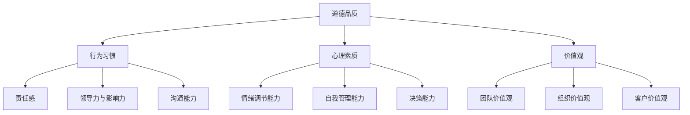

                 

## 文章标题

### 《领导者的品格塑造：赢得团队尊重与信任》

> **关键词**：领导者品格、团队尊重、信任、沟通能力、自我管理、决策执行力

> **摘要**：本文旨在深入探讨领导者品格的塑造，以及如何通过培养这些品格赢得团队的尊重和信任。文章从定义领导者的品格、核心概念、实践方法等多个维度，提供了一系列策略和技巧，帮助领导者建立高效团队，实现共同目标。

---

### 引言

在信息技术迅速发展的今天，领导者不仅是企业的决策者，更是团队的核心。领导者的品格，决定了团队的凝聚力、工作效率和创新力。一个优秀的领导者，不仅要具备卓越的技术能力和管理能力，更需要拥有良好的品格，包括诚实、公正、透明、负责任等。这些品格不仅能够赢得团队的尊重，更是建立信任的基础。

然而，品格塑造并非一朝一夕之事。领导者需要在日常工作中不断反思、学习和实践，逐步提升自己的品格。本文将围绕领导者品格的塑造，深入探讨其重要性、核心概念、实践方法，并分享一些实用的策略和技巧，帮助领导者建立高效团队，赢得团队的尊重和信任。

本文将分为以下几个部分：

1. **领导者的品格塑造基础**：介绍领导者的品格定义与价值，以及领导者品格的构成要素。
2. **领导者品格的核心概念与联系**：解析领导者品格的核心概念，并使用流程图展示其架构。
3. **领导者品格塑造的实践方法**：探讨如何建立信任与尊重，提升沟通与合作能力，进行自我管理与情绪调节，提高决策能力和执行力。
4. **领导力发展与实践**：分析领导力的发展路径，以及在实践中的挑战与应对。
5. **附录**：提供领导者品格塑造的工具与资源。

通过本文的阅读，希望能够帮助读者理解领导者品格的重要性，掌握塑造这些品格的方法和技巧，从而在团队中赢得尊重与信任，实现个人的职业发展和组织的长期目标。

---

## 第一部分：领导者的品格塑造基础

### 第1章：领导者的品格定义与价值

#### 1.1 领导者的品格定义与内涵

领导者的品格，是指在领导过程中表现出的道德品质、行为习惯和心理素质。这些品格不仅包括外在的行为规范，还涵盖了内在的价值观和信念。具体来说，领导者的品格主要包括以下几个方面：

1. **诚实与正直**：诚实是领导者最基本的品格，意味着对事实的真实陈述，不隐瞒、不歪曲。正直则是坚守道德原则，不做违背良心的事情。

2. **责任感**：领导者必须具备强烈的责任感，对团队、对组织、对客户承担责任。责任感使得领导者能够在面对挑战和困难时保持坚定和果断。

3. **公正与透明**：公正意味着在处理团队事务时，不偏袒、不歧视，给予每个人公平的机会。透明则是指领导者与团队成员之间的沟通要公开、透明，使团队成员了解组织的运作和决策过程。

4. **领导力与影响力**：领导者需要具备一定的领导力和影响力，能够引领团队朝着共同的目标前进，激励团队成员发挥最大潜力。

5. **自我管理能力**：自我管理能力包括情绪调节、时间管理、决策能力等。领导者需要能够自我调节情绪，合理安排时间，做出明智的决策。

#### 1.2 领导者品格在团队中的价值

领导者品格对于团队的影响是深远而广泛的。首先，良好的品格能够赢得团队成员的信任和尊重。信任是团队协作的基石，只有当团队成员信任领导者时，他们才会愿意追随和服从。而尊重则能够提升团队成员的工作积极性和归属感。

其次，领导者品格能够塑造团队的价值观和行为规范。一个拥有良好品格的领导者，能够在团队中树立榜样，引导团队成员遵守道德规范，形成积极向上的团队文化。

此外，领导者品格还能够提升团队的工作效率。当团队成员信任并尊重领导者时，他们更愿意积极参与团队工作，发挥自己的潜力。这不仅能够提升团队的整体效率，还能够激发团队的创造力和创新力。

最后，领导者品格对于组织的长期发展具有重要意义。一个拥有良好品格的领导者，能够带领团队实现长期目标，推动组织的持续发展。

#### 1.3 领导者品格的构成要素

领导者品格的构成要素主要包括以下几个方面：

1. **道德品质**：包括诚实、正直、公正、透明等。这些道德品质是领导者品格的核心，是领导者行为的基础。

2. **行为习惯**：包括责任感、领导力与影响力、沟通能力等。这些行为习惯是领导者品格的外在表现，直接影响团队成员对领导者的看法和态度。

3. **心理素质**：包括情绪调节能力、自我管理能力、决策能力等。这些心理素质是领导者品格的内在支撑，决定领导者如何应对挑战和压力。

4. **价值观**：包括对团队、组织、客户等的价值观。这些价值观是领导者品格的指引，决定领导者如何处理各种事务和决策。

#### 总结

领导者品格的塑造是领导力的核心组成部分，对于团队和组织的成功具有重要意义。通过了解领导者品格的定义与内涵，认识到其在团队中的价值，以及掌握其构成要素，领导者可以更好地提升自己的品格，赢得团队的尊重与信任，实现组织的长期发展。

---

### 第2章：领导者品格的核心概念与联系

#### 2.1 领导者品格的核心概念

在探讨领导者品格的核心概念时，我们需要关注几个关键要素：道德品质、行为习惯、心理素质和价值观。这些核心概念相互关联，共同构成了领导者品格的完整架构。

1. **道德品质**：这是领导者品格的基础，包括诚实、正直、公正、透明等。这些品质不仅体现在领导者个人的行为上，还体现在其决策和处理团队事务的方式上。

2. **行为习惯**：行为习惯是领导者品格的外在表现，包括责任感、领导力与影响力、沟通能力等。这些习惯直接影响团队成员对领导者的看法和团队的整体氛围。

3. **心理素质**：心理素质是领导者品格的内在支撑，包括情绪调节能力、自我管理能力、决策能力等。这些素质决定了领导者如何应对压力和挑战，以及如何在复杂环境中做出明智的决策。

4. **价值观**：价值观是领导者品格的指引，包括对团队、组织、客户等的价值观。这些价值观决定了领导者的行为准则和决策方向。

#### 2.2 领导者品格的架构与流程图

为了更直观地展示领导者品格的架构，我们可以使用Mermaid流程图来表示各个核心概念及其相互关系。

在这个流程图中，我们可以看到：

- 道德品质是领导者品格的核心，它直接影响到行为习惯、心理素质和价值观。
- 行为习惯包括责任感、领导力与影响力、沟通能力，这些习惯反映了领导者的外在表现。
- 心理素质包括情绪调节能力、自我管理能力、决策能力，这些素质决定了领导者的内在支撑。
- 价值观包括团队价值观、组织价值观、客户价值观，这些价值观为领导者的行为提供了指导。

#### 2.3 领导者品格的核心概念联系分析

领导者品格的核心概念之间存在着密切的联系。以下是这些概念之间的联系分析：

1. **道德品质与行为习惯**：道德品质是行为习惯的基础。一个道德品质高尚的领导者，更可能展现出责任感、领导力和影响力，以及有效的沟通能力。

2. **行为习惯与心理素质**：行为习惯是领导者品格的外在表现，而心理素质是这些行为的内在支撑。例如，一个有责任感的领导者，往往具备良好的情绪调节能力和自我管理能力，这使得他们能够在压力和挑战面前保持冷静和高效。

3. **心理素质与价值观**：心理素质决定了领导者如何理解和践行价值观。一个具备良好心理素质的领导者，能够更深刻地理解和尊重团队的价值观，从而在决策和行动中体现出这些价值观。

4. **价值观与道德品质**：价值观为领导者的道德品质提供了指导。一个拥有正确价值观的领导者，更可能坚持诚实、正直、公正和透明的原则，这些原则是道德品质的重要组成部分。

#### 2.4 核心概念联系总结

领导者品格的核心概念之间存在着紧密的联系，这些联系构成了领导者品格的完整架构。理解这些概念之间的关系，有助于领导者更好地塑造自己的品格，提升领导力，赢得团队的尊重和信任。

通过本章的讨论，我们不仅明确了领导者品格的核心概念，还展示了这些概念之间的联系。下一章，我们将进一步探讨领导者品格的核心概念，并分析其在领导过程中的具体应用。

---

### 第3章：建立信任与尊重

#### 3.1 信任的建立与维护

**3.1.1 信任的定义与重要性**

信任是一种心理状态，是指个体对他人行为的预期和依赖。在团队中，信任是成员之间合作和协作的基础。一个缺乏信任的团队，往往会在沟通、决策和执行方面遇到困难，影响整体工作效率和团队凝聚力。

信任的重要性在于：

1. **促进沟通**：信任使得团队成员更愿意分享信息，公开讨论问题，减少了信息不对称的情况。
2. **提高决策效率**：信任可以减少决策过程中的疑虑和争论，使团队能够更快地做出决策并执行。
3. **增强团队凝聚力**：信任使团队成员感受到彼此的尊重和支持，增强了团队的凝聚力。

**3.1.2 如何建立信任**

建立信任是一个持续的过程，需要领导者通过一系列行为和措施来逐步实现。以下是一些建立信任的方法：

1. **透明沟通**：领导者应保持信息的透明，及时向团队成员传达重要信息，避免信息滞后和误传。
2. **履行承诺**：领导者应言行一致，履行自己的承诺，即使遇到困难也要坚持原则，赢得团队成员的信任。
3. **公平对待**：领导者应公平对待每位团队成员，避免偏袒和歧视，使团队成员感受到公正。
4. **主动倾听**：领导者应主动倾听团队成员的意见和建议，给予足够的关注和反馈，增强成员的参与感和归属感。
5. **展现诚意**：领导者应展现真诚和诚意，对团队成员的问题和困难给予关注和支持，增强团队成员的安全感。

**3.1.3 如何维护信任**

建立信任后，领导者还需要通过持续的努力来维护信任。以下是一些维护信任的方法：

1. **持续透明**：保持信息的持续透明，确保团队成员能够及时了解团队动态和决策过程。
2. **及时反馈**：及时给予团队成员反馈，对于他们的工作表现和意见给予认可和鼓励，增强他们的自信心和信任感。
3. **公正处理**：在处理团队事务时，保持公正，不偏袒任何一方，使团队成员感受到公平和尊重。
4. **共同目标**：与团队成员共同设定目标，并通过共同努力实现这些目标，增强团队的凝聚力和信任感。

#### 3.2 尊重的培养与体现

**3.2.1 尊重的定义与作用**

尊重是一种基本的人际关系原则，意味着对他人的人格、意见和努力给予认可和重视。在团队中，尊重是建立和谐团队氛围的重要保障。

尊重的作用包括：

1. **增强团队凝聚力**：尊重使得团队成员感受到彼此的认可和尊重，增强了团队的凝聚力。
2. **提高工作积极性**：尊重可以激发团队成员的工作热情和创造力，提高工作效率。
3. **建立良好的工作关系**：尊重是建立良好工作关系的基础，有助于团队成员之间的和谐相处。

**3.2.2 如何表达尊重**

领导者可以通过以下方式表达对团队成员的尊重：

1. **倾听**：倾听是表达尊重的重要方式。领导者应耐心倾听团队成员的意见和想法，给予足够的重视和反馈。
2. **认可**：对团队成员的工作成绩和努力给予认可和赞扬，使成员感受到自己的价值。
3. **尊重意见**：尊重团队成员的意见和决策，即使意见不同，也要以尊重的态度进行讨论和协商。
4. **尊重差异**：尊重团队成员的个性和差异，避免歧视和偏见，为每个人提供公平的发展机会。

**3.2.3 如何在日常工作中体现尊重**

在日常工作中，领导者可以通过以下方式体现尊重：

1. **分配任务时公平公正**：在分配任务时，要考虑到团队成员的能力和兴趣，公平公正地分配任务。
2. **鼓励合作**：鼓励团队成员之间的合作与交流，营造一个开放、包容的工作氛围。
3. **关心团队成员**：关心团队成员的工作和生活，了解他们的需求和困扰，提供必要的帮助和支持。
4. **给予自主权**：给予团队成员一定的自主权，让他们在完成任务时有更多的发挥空间和创造力。

#### 3.3 信任与尊重的互动关系

信任与尊重之间存在着密切的互动关系。信任是尊重的基础，而尊重则能够进一步巩固信任。以下是信任与尊重的互动关系分析：

1. **信任促进尊重**：一个被信任的领导者更容易得到团队成员的尊重。当团队成员信任领导者时，他们更愿意尊重领导者的意见和决策。
2. **尊重巩固信任**：尊重使得团队成员感受到领导者的诚意和关心，增强了他们对领导者的信任。一个受到尊重的领导者，更容易在团队中建立信任。

#### 3.4 实践案例

**案例**：某技术团队的领导者在一次项目评估中，发现团队成员对项目进展有不同意见。领导者并没有直接批评或否定成员的观点，而是耐心倾听并尊重他们的意见，通过讨论和协商找到了一个共同的解决方案。这次事件不仅增强了团队成员之间的信任，也提升了领导者的人格魅力和团队凝聚力。

通过本章的讨论，我们认识到建立信任与尊重对于团队的重要性，并了解了如何通过具体的行为和措施来实现这一目标。信任与尊重不仅是领导者品格的重要组成部分，更是团队成功的关键因素。在下一章中，我们将探讨如何提升沟通与合作能力，进一步优化团队的工作氛围。

---

### 第4章：沟通与合作能力的提升

#### 4.1 沟通的重要性

**4.1.1 沟通的定义与类型**

沟通是信息传递和理解的过程，是团队协作中不可或缺的一部分。良好的沟通可以促进团队内部的协作和合作，提高工作效率和团队凝聚力。沟通可以分为以下几种类型：

1. **正式沟通**：通过正式的渠道进行的信息传递，如会议、报告、文件等。
2. **非正式沟通**：通过非正式的渠道进行的信息交流，如聊天、闲谈、社交媒体等。
3. **上行沟通**：团队成员向上级或领导传达信息的过程。
4. **下行沟通**：上级或领导向下级传达信息的过程。
5. **横向沟通**：团队成员之间的横向交流，如跨部门合作、项目组内的讨论等。

**4.1.2 沟通中的障碍与解决方法**

在沟通过程中，常常会遇到各种障碍，如信息失真、误解、沟通不畅等。以下是几种常见的沟通障碍及其解决方法：

1. **信息失真**：由于信息在传递过程中可能发生变形，导致接收者理解的信息与发送者意图的信息不一致。解决方法：确保信息的准确性和完整性，避免使用模糊或含糊不清的语言。

2. **误解**：由于个体差异、文化背景、价值观等因素，接收者可能会误解发送者的意图。解决方法：增加反馈环节，确保双方对信息的理解是一致的。

3. **沟通不畅**：由于缺乏有效的沟通渠道或沟通方式不当，导致信息无法有效传递。解决方法：建立畅通的沟通渠道，如定期的团队会议、工作汇报、邮件沟通等。

4. **文化差异**：不同文化背景下的人们可能在沟通中产生误解和障碍。解决方法：加强跨文化沟通培训，提高团队成员的文化敏感性和沟通技巧。

**4.1.3 高效沟通技巧**

为了实现高效的沟通，领导者需要掌握以下技巧：

1. **倾听**：积极倾听是有效沟通的关键。领导者应耐心倾听团队成员的意见和反馈，理解他们的需求和困扰。

2. **表达清晰**：领导者应确保自己的表达清晰、准确，避免使用专业术语或复杂句子，使团队成员易于理解。

3. **非语言沟通**：领导者应注重非语言沟通，如肢体语言、面部表情、眼神交流等，这些因素可以增强沟通效果。

4. **反馈**：及时给予反馈，对于团队成员的工作表现和意见给予认可和鼓励，增强他们的自信心和沟通积极性。

5. **建立信任**：建立信任是高效沟通的基础。领导者应通过透明沟通、履行承诺、公平对待等方式，赢得团队成员的信任。

#### 4.2 团队合作的培养

**4.2.1 团队合作的重要性**

团队合作是团队成功的关键。一个高效的团队可以通过成员之间的协作，实现共同的目标，提升整体工作效能。团队合作的重要性体现在以下几个方面：

1. **提高工作效率**：团队成员可以互相补充，发挥各自的优势，提高工作效率。

2. **激发创新力**：团队合作可以促进不同思维之间的碰撞，激发创新力和创造力。

3. **增强团队凝聚力**：团队合作可以增强成员之间的联系和信任，提升团队的凝聚力。

4. **实现共同目标**：团队合作有助于实现团队的长期目标和战略目标。

**4.2.2 如何建立高效的团队合作**

建立高效的团队合作需要以下措施：

1. **明确目标**：团队应明确共同的目标，确保每个成员都了解团队的目标和自己的责任。

2. **分工合作**：合理分配任务，确保每个成员都有明确的职责和任务。

3. **建立沟通机制**：建立有效的沟通机制，确保团队成员能够及时、畅通地交流信息和意见。

4. **培养团队文化**：培养积极向上的团队文化，鼓励团队成员互相支持、互相帮助。

5. **激励与反馈**：对团队成员的工作表现给予激励和反馈，增强他们的积极性和团队意识。

**4.2.3 团队合作中的冲突解决**

在团队合作过程中，冲突是不可避免的。有效的冲突解决机制可以帮助团队克服障碍，实现更好的合作。以下是解决团队冲突的方法：

1. **倾听与理解**：倾听各方的意见和观点，理解冲突的根源。

2. **理性分析**：从客观、理性的角度分析冲突的原因，找到解决问题的方法。

3. **协商解决**：通过协商和讨论，找到双方都能接受的解决方案。

4. **避免指责**：在解决冲突时，避免指责和攻击对方，而是关注问题的解决。

5. **持续改进**：在解决冲突后，对团队合作过程进行反思和改进，避免类似冲突的再次发生。

#### 4.3 实践案例

**案例**：某IT公司的项目经理，在项目推进过程中遇到了团队成员之间的沟通障碍和冲突。项目经理首先通过团队会议和个别谈话，了解团队成员的需求和问题。然后，他建立了定期的项目进度汇报和反馈机制，确保团队成员能够及时交流信息和反馈。同时，他鼓励团队成员积极参与决策，共同解决项目中遇到的问题。通过这些措施，项目团队的沟通障碍得到了有效解决，项目进展顺利，最终成功完成了任务。

通过本章的讨论，我们认识到沟通与合作在团队工作中的重要性，并了解了如何通过具体的方法和措施提升沟通与合作能力。良好的沟通和团队合作是团队成功的关键，领导者应不断学习和实践，提升自己的沟通与合作能力，为团队的成功奠定基础。

---

### 第5章：自我管理与情绪调节

#### 5.1 自我管理的重要性

自我管理是领导者品格的重要组成部分，也是领导者成功的关键因素。自我管理涉及多个方面，包括时间管理、情绪调节、决策能力等。以下是对自我管理的详细讨论。

**5.1.1 自我管理的定义与内容**

自我管理是指领导者通过自我监控、自我调节和自我激励，以达到高效工作和生活目标的能力。具体内容包括：

1. **时间管理**：有效安排和利用时间，确保工作与生活的平衡，提高工作效率。
2. **情绪调节**：管理自己的情绪，避免负面情绪对工作的影响，保持积极的心态。
3. **决策能力**：在复杂和不确定的环境中做出明智的决策，确保团队目标的实现。
4. **自我激励**：通过自我激励，保持对工作的热情和动力，持续提升个人能力。

**5.1.2 如何进行有效的自我管理**

为了进行有效的自我管理，领导者可以采取以下措施：

1. **设定目标**：明确个人的短期和长期目标，确保工作与个人目标的一致性。
2. **计划与优先级**：制定详细的工作计划，并根据优先级安排工作，避免时间浪费。
3. **时间记录**：记录每日的工作时间，分析时间利用情况，找出效率低下的环节。
4. **定期反思**：定期对自己的工作和行为进行反思，评估自我管理的效果，并根据反馈进行调整。
5. **培养良好的工作习惯**：建立良好的工作习惯，如早起、定期锻炼、保持良好的作息时间等，提高工作效率和生活质量。

**5.1.3 自我管理的误区与解决方法**

在自我管理过程中，领导者可能会遇到一些误区，以下是几种常见的误区及其解决方法：

1. **完美主义**：追求完美可能导致过度焦虑和拖延。解决方法：设定合理的期望值，接受“足够好”而非“完美”。
2. **时间管理工具依赖**：过度依赖工具可能忽视个人习惯的培养。解决方法：结合工具和习惯，培养高效的工作方式。
3. **忽视情绪管理**：负面情绪可能导致工作效果下降。解决方法：学会情绪调节技巧，如深呼吸、冥想、运动等，保持积极的心态。
4. **忽视自我激励**：缺乏自我激励可能导致动力不足。解决方法：设立激励机制，如奖励自己完成任务后的休息或奖励，提高工作积极性。

#### 5.2 情绪调节的方法

情绪调节是自我管理的重要方面，对于领导者的工作表现和团队氛围都有重要影响。以下是一些情绪调节的方法：

**5.2.1 情绪的定义与作用**

情绪是人的心理状态的一种表现，是对外界刺激的主观体验。情绪在人的心理和行为中扮演着重要角色：

1. **激励作用**：积极情绪可以激励人们采取行动，完成任务。
2. **调节作用**：情绪可以帮助人们调节心理状态，应对压力和挑战。
3. **社交作用**：情绪在人际交往中起到传递信息、建立关系的作用。

**5.2.2 如何识别与调节情绪**

领导者可以通过以下方法识别和调节情绪：

1. **自我观察**：通过观察自己的身体感受、思维模式和情绪反应，识别情绪的触发点和变化。
2. **情绪日记**：记录每日的情绪变化，分析情绪的规律和原因。
3. **情绪表达**：学会用适当的方式表达情绪，避免压抑或爆发。
4. **情绪调节技巧**：使用深呼吸、冥想、运动等技巧，调节情绪，保持冷静。

**5.2.3 情绪调节的技巧与应用**

以下是几种常用的情绪调节技巧及其应用：

1. **深呼吸**：深呼吸可以帮助放松身心，缓解紧张情绪。应用方法：在情绪紧张时，进行几次深呼吸，感受身体的变化。
2. **冥想**：冥想可以帮助领导者进入放松状态，提高情绪调节能力。应用方法：每天花几分钟时间进行冥想，专注于呼吸和当下的感受。
3. **运动**：运动可以释放压力，提升情绪。应用方法：定期进行有氧运动，如跑步、游泳等，提高身体的活力和情绪稳定性。
4. **正向思考**：通过改变思维模式，从积极的角度看待问题，调节情绪。应用方法：遇到问题时，尝试从多个角度分析，寻找积极的解决方案。

#### 5.3 实践案例

**案例**：某公司的项目经理，在项目遇到重大挑战时，感到压力巨大。他通过记录情绪日记，识别出情绪的触发点和变化，并采用深呼吸和冥想来调节情绪。他还定期进行运动，提升身体素质，保持积极的心态。通过这些方法，他成功应对了项目中的挑战，带领团队完成了任务。

通过本章的讨论，我们认识到自我管理与情绪调节对领导者的重要性，并了解了如何通过具体的方法和技巧进行自我管理和情绪调节。有效的自我管理和情绪调节不仅有助于提升领导者的个人素质和工作效率，还有助于营造积极向上的团队氛围，促进团队的成功。

---

### 第6章：决策能力与执行力提升

#### 6.1 决策能力的提升

**6.1.1 决策的定义与类型**

决策是领导者日常工作中必不可少的一部分，是指在多种选择中做出选择的过程。决策可以分为以下几种类型：

1. **程序性决策**：针对常见和重复性问题的决策，通常有固定的解决方案和流程。
2. **非程序性决策**：针对不常见或复杂问题的决策，通常需要创造新的解决方案。
3. **战略性决策**：涉及长期目标和资源分配的决策，影响组织的整体发展方向。
4. **战术性决策**：涉及短期目标和具体执行计划的决策，确保战略目标的实现。

**6.1.2 决策过程中的误区与解决方法**

在决策过程中，领导者常常会陷入一些误区，以下是一些常见的误区及其解决方法：

1. **过度依赖数据**：过分依赖数据分析可能导致忽视直觉和经验，解决方法是平衡数据分析和直觉。
2. **群体思维**：团队内部过度一致可能导致忽略不同的观点和意见，解决方法是鼓励多样性和开放的讨论。
3. **确认偏见**：倾向于接受符合预期的信息，忽视反面信息，解决方法是保持开放的心态，全面收集信息。
4. **短视决策**：只关注短期利益，忽视长期影响，解决方法是考虑长远利益，做出综合决策。

**6.1.3 决策能力提升的方法**

为了提升决策能力，领导者可以采取以下措施：

1. **增强信息收集能力**：广泛收集相关信息，确保决策基于充分的信息。
2. **培养批判性思维**：通过分析和评估信息，提高对信息的理解和判断能力。
3. **提高问题解决能力**：在面对复杂问题时，能够快速识别问题并提出解决方案。
4. **增强沟通能力**：确保团队成员能够充分表达意见，促进信息的有效传递和整合。
5. **学习与反思**：通过实践和学习，不断反思和总结决策过程中的经验，提升决策水平。

#### 6.2 执行力的提升

**6.2.1 执行力的定义与作用**

执行力是指将决策转化为行动的能力，是确保战略目标实现的关键。执行力强意味着团队能够高效、迅速地执行计划，确保目标的达成。执行力在以下方面起到重要作用：

1. **确保战略落地**：执行力是实现战略目标的重要保障，确保战略规划能够转化为实际行动。
2. **提高工作效率**：高效的执行力可以减少资源浪费，提高工作效率，缩短项目周期。
3. **增强团队凝聚力**：一致的执行力可以增强团队成员的协作和信任，提升团队的凝聚力。

**6.2.2 执行力不足的原因与解决方法**

执行力不足的原因多种多样，以下是一些常见的原因及其解决方法：

1. **目标不明确**：缺乏明确的目标和详细的行动计划，解决方法是明确目标和制定详细的执行计划。
2. **资源不足**：缺乏必要的资源支持，解决方法是确保资源的充足供应，包括人力、财力和技术资源。
3. **沟通不畅**：团队内部沟通不畅，导致信息传递不准确，解决方法是建立畅通的沟通机制，确保信息的有效传递。
4. **缺乏激励**：团队成员缺乏工作动力，解决方法是设置激励机制，提高团队成员的积极性和参与度。

**6.2.3 提高执行力的策略**

为了提升执行力，领导者可以采取以下策略：

1. **明确目标**：确保团队目标清晰明确，每个成员都了解自己的职责和目标。
2. **制定详细的执行计划**：制定详细的执行计划，包括时间表、任务分配和资源需求，确保执行过程的有序进行。
3. **建立跟踪和反馈机制**：建立跟踪和反馈机制，及时了解执行过程中的问题和进展，确保计划的顺利进行。
4. **提供必要的资源支持**：确保团队获得必要的资源支持，包括人力、财力和技术资源。
5. **培养团队协作精神**：通过团队活动和培训，培养团队协作精神，提高团队的执行力。

#### 6.3 实践案例

**案例**：某公司的研发团队在项目执行过程中遇到了执行力不足的问题，导致项目进度延误。领导者首先明确了项目目标，并制定了详细的执行计划。然后，他建立了跟踪和反馈机制，定期检查项目进度，及时发现并解决问题。同时，他提供了必要的资源支持，如额外的人力和技术支持，确保项目能够顺利进行。通过这些措施，研发团队的执行力得到了显著提升，项目最终按时完成。

通过本章的讨论，我们认识到决策能力和执行力对于领导者的重要性。领导者应通过提升决策能力，做出明智的决策，并通过提高执行力，确保决策能够得到有效执行。有效的决策和执行能力是领导者成功的关键，有助于实现团队的长期目标和发展。

---

### 第7章：领导力发展与实践

#### 7.1 领导力的发展路径

**7.1.1 领导力的定义与类型**

领导力是指个人或团队通过影响和激励他人，实现共同目标的能力。领导力可以分为以下几种类型：

1. **技术领导力**：基于个人的专业知识和技能，通过技术权威影响他人。
2. **变革领导力**：通过创新和改革，推动组织变革和发展。
3. **愿景领导力**：通过描绘未来愿景，激励团队成员为之努力。
4. **文化领导力**：通过塑造组织文化，影响团队成员的行为和价值观。

**7.1.2 领导力发展的阶段**

领导力发展是一个逐步深化的过程，通常可以分为以下几个阶段：

1. **自我认知阶段**：领导者需要认识自己，包括自己的优点和缺点，以及如何发挥个人优势。
2. **技能提升阶段**：在自我认知的基础上，领导者需要通过学习和实践提升专业技能和管理能力。
3. **影响力建立阶段**：领导者通过影响和激励他人，建立个人影响力和领导地位。
4. **战略思维阶段**：领导者需要具备战略思维，能够从全局和长远角度考虑问题，制定和实施战略规划。

**7.1.3 领导力发展的方法**

为了提升领导力，领导者可以采取以下方法：

1. **自我反思**：定期进行自我反思，评估自己的领导行为和效果，找到改进的方向。
2. **学习与培训**：参加相关的课程和培训，学习领导力理论和实践方法。
3. **阅读与实践**：阅读领导力相关书籍，并将所学知识应用于实际工作中。
4. **寻求反馈**：主动寻求团队成员和上级的反馈，了解自己的领导风格和效果。
5. **角色扮演**：通过角色扮演和模拟演练，提升领导能力和决策能力。

#### 7.2 实践中的领导力

**7.2.1 领导力在实践中的应用**

领导力在实践中体现在多个方面，包括以下几个方面：

1. **团队建设**：领导者通过团队建设活动，增强团队成员之间的信任和协作，提高团队的整体效能。
2. **目标设定**：领导者与团队成员共同设定明确的、可衡量的目标，确保团队的努力方向一致。
3. **决策与执行**：领导者通过科学决策和有效执行，确保团队目标的实现。
4. **激励与反馈**：领导者通过激励和反馈，提升团队成员的工作积极性和绩效。
5. **变革推动**：领导者通过推动变革，引领组织适应外部环境的变化，实现可持续发展。

**7.2.2 领导力实践中的挑战与应对**

在领导力实践中，领导者会面临多种挑战，以下是几种常见的挑战及其应对策略：

1. **团队冲突**：领导者需要通过有效的沟通和冲突解决策略，化解团队内部的矛盾和冲突。
2. **资源不足**：领导者需要通过资源优化和合理分配，确保团队获得必要的资源支持。
3. **沟通不畅**：领导者需要建立畅通的沟通渠道，确保信息的有效传递和团队的协作。
4. **组织变革**：领导者需要具备变革推动能力，通过改革和创新，带领组织走出困境。

**7.2.3 领导力实践的成功案例**

**案例**：某科技公司的CEO通过构建一个开放和包容的团队文化，鼓励员工提出创新想法，并建立了透明的沟通机制，确保信息在团队内部畅通无阻。他还通过定期的团队建设活动和员工反馈机制，增强了团队的凝聚力和工作积极性。在他的领导下，公司成功推出了一系列创新产品，市场份额大幅提升，实现了业务的快速增长。

通过本章的讨论，我们认识到领导力的发展是一个持续的过程，领导者需要通过不断学习和实践，提升自己的领导力，并在实际工作中应用这些能力。有效的领导力是团队成功和职业发展的关键，领导者应不断追求卓越，为团队和组织的发展贡献力量。

---

## 附录

### 附录 A：领导者品格塑造的工具与资源

#### A.1 常用领导力评估工具

为了帮助领导者评估和提升自己的品格，以下是一些常用的领导力评估工具：

1. **领导力360度评估**：这种评估方法通过收集团队成员、同事和上级的反馈，全面评估领导者的行为和风格。
2. **MBTI（Myers-Briggs Type Indicator）**：这是一种性格评估工具，帮助领导者了解自己的性格类型，以及如何与他人有效沟通和合作。
3. **DISC评估**：DISC评估是一种行为评估工具，用于分析个人的行为倾向，帮助领导者识别自己的优势和改进领域。
4. **领导力潜力评估**：这种评估工具专注于评估领导者的潜力和发展需求，为领导者的个人发展提供指导。

#### A.2 领导力培养的在线资源

以下是一些在线资源和平台，供领导者学习和发展领导力：

1. **哈佛商业评论**：提供丰富的领导力相关文章和案例分析。
2. **Coursera**：提供多种领导力相关的在线课程，涵盖理论、实践和技能提升。
3. **LinkedIn Learning**：提供专业的领导力课程和培训，帮助领导者提升技能和知识。
4. **TED Talks**：观看领导力和个人发展相关的TED演讲，启发思考和实践。

#### A.3 领导力相关书籍推荐

以下是几本对领导者品格塑造和领导力提升有深刻影响的书籍：

1. **《领导力的五个层次》**：作者：约翰·C·马克斯韦尔。本书探讨了领导力的五个层次，为领导者提供了实践指导。
2. **《高效能人士的七个习惯》**：作者：史蒂芬·柯维。本书介绍了高效能人士的七个习惯，帮助领导者提升个人素质和管理能力。
3. **《领导力：实战手册》**：作者：约翰·曼恩。本书通过实际的领导案例，提供实用的领导力策略和技巧。
4. **《变革之舞：领导与变革管理》**：作者：约翰·P·科特。本书详细阐述了领导者在推动组织变革过程中的角色和策略。

通过使用这些工具和资源，领导者可以更好地评估自己的品格，提升领导力，并在实际工作中应用这些知识和技能，赢得团队的尊重和信任，推动组织的持续发展。

---

### 总结

本文围绕领导者品格的塑造，从定义与价值、核心概念、实践方法等多个维度进行了深入探讨。我们了解到领导者品格的重要性，认识到其在团队中的价值，并掌握了如何通过建立信任与尊重、提升沟通与合作能力、进行自我管理与情绪调节、提高决策能力和执行力来塑造这些品格。

领导者品格不仅关乎个人的职业发展，更影响整个团队和组织的发展。一个具备优秀品格的领导者，能够赢得团队的信任与尊重，激发团队成员的潜能，推动组织实现长期目标。

本文提供了一系列实用的策略和技巧，包括透明沟通、公正对待、有效倾听、情绪调节、明确目标等。通过不断学习和实践，领导者可以逐步提升自己的品格，成为团队中的榜样和领导者。

未来的工作中，领导者应持续反思和改进，不断学习新知识和技能，提升自己的领导力。通过建立高效团队，实现共同目标，为组织的成功和发展贡献力量。

**作者：AI天才研究院/AI Genius Institute & 禅与计算机程序设计艺术 /Zen And The Art of Computer Programming**

