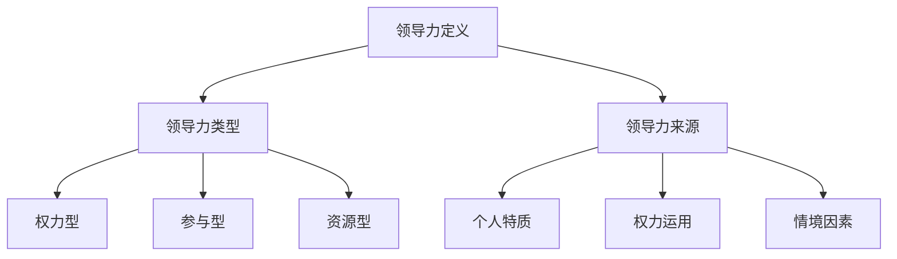
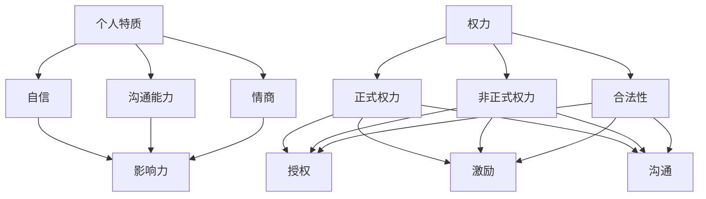
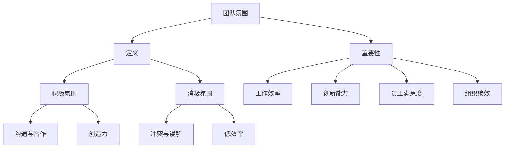
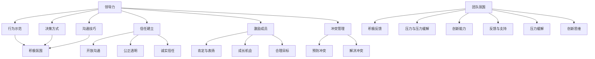
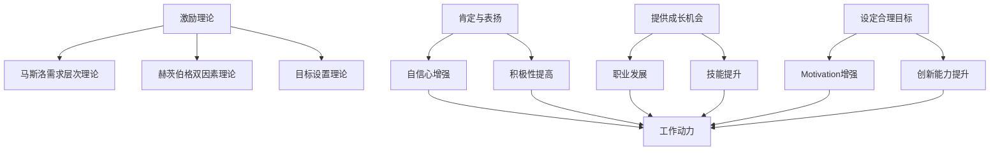
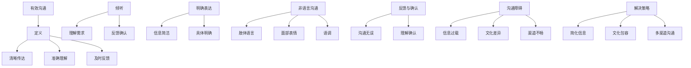
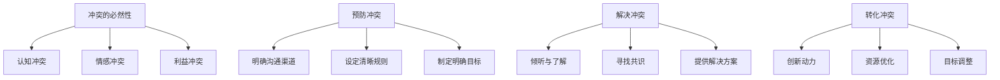
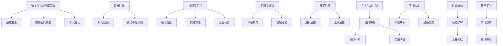
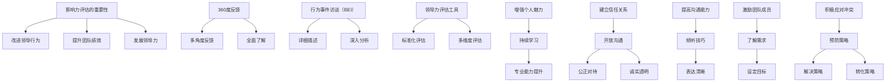

                 

### 文章标题

在当今快速变化且竞争激烈的技术环境中，领导者的影响力变得前所未有的重要。正如计算机编程中的函数和算法，领导者的作用在于引导团队朝着共同的目标高效前进，并创造出一种积极的团队氛围。《领导者的影响力：塑造积极的团队氛围》旨在深入探讨领导力这一核心概念，并阐述如何通过合理的策略和技巧，提升领导者的影响力，进而塑造一个充满活力和创造力的团队。

本文将通过一系列逻辑清晰、结构紧凑的章节，逐步分析领导力的定义、类型和来源，探讨团队氛围的重要性及其对领导力的影响，并提供具体的策略和实践方法，帮助领导者塑造积极的团队氛围。本文旨在成为一本实用的指南，帮助领导者更好地理解和运用自己的影响力，从而推动团队的发展和进步。

### 关键词

- 领导力
- 团队氛围
- 影响力
- 激励
- 沟通
- 冲突管理

### 摘要

本文聚焦于领导者如何通过其影响力来塑造积极的团队氛围。文章首先介绍了领导力的基本定义和类型，分析了领导者的影响力来源，包括个人特质和权力运用。接着，探讨了团队氛围的定义和重要性，并阐述了领导力与团队氛围之间的相互影响关系。随后，文章提供了具体的策略，如建立信任、激励团队成员和有效沟通，以及冲突管理，帮助领导者塑造一个积极的团队氛围。通过实践案例研究和影响力评估，文章总结了领导者的最佳实践，旨在为技术领域的领导者提供实用的指导。

### 第一部分：领导者的影响力概述

#### 第1章：领导力的定义与类型

**1.1 领导力的基本定义**

领导力是一个广泛讨论但定义多样的概念。从简单来说，领导力指的是领导者影响和激励他人共同达成目标的能力。它在不同的组织和文化背景下有着不同的表现形式，但核心在于领导者如何通过其行为、决策和沟通来影响团队成员。

在技术领域，领导力不仅仅是管理和协调项目，更涉及到激发团队的创造力和解决问题的能力。一个有效的领导者能够理解技术趋势，指导团队成员紧跟技术发展，并推动团队不断创新。

**1.2 领导力的类型**

领导力可以按照不同的维度进行分类，常见的类型包括：

- **权力型领导**：这种领导风格依赖于权威和命令来指导团队成员。领导者通过明确的角色分配和严格的管理制度来确保项目的顺利进行。

- **参与型领导**：参与型领导者鼓励团队成员参与决策过程，重视集体智慧。这种领导风格通常能够激发团队成员的积极性和创造力。

- **资源型领导**：资源型领导者擅长调动和分配资源，确保团队成员能够充分发挥潜力。他们通常具备丰富的行业经验和广泛的人际网络。

**1.3 领导力的来源**

领导力的来源可以是多种多样的，包括个人特质、权力运用和情境因素。以下是几个关键因素：

- **个人特质**：自信、沟通能力、情商等特质对于领导力至关重要。一个自信的领导者能够鼓舞团队成员，而良好的沟通能力和情商则有助于建立和维护团队关系。

- **权力运用**：领导者通过职位赋予的权力来影响团队。这种权力可以用来分配任务、做出决策和指导团队成员。

- **情境因素**：领导力在不同情境下会有不同的表现。领导者需要根据具体情境灵活调整自己的风格和策略。

**核心概念与联系**

为了更好地理解领导力的核心概念和它们之间的关系，我们可以使用Mermaid流程图来表示：

在技术领域，领导力不仅仅是管理，更是创造和激发团队创新。通过理解不同类型的领导力和其来源，领导者可以更好地发挥自己的影响力，推动团队朝着共同的目标前进。

#### 第2章：领导者的影响力来源

**2.1 个人特质与影响力**

个人特质是领导者影响力的一个重要来源。自信、沟通能力和情商等特质不仅有助于建立领导者与团队成员之间的信任，还能有效提升领导者的整体影响力。以下是几个关键个人特质：

- **自信**：一个自信的领导者能够更好地应对挑战和不确定性，从而赢得团队成员的信任和尊重。

- **沟通能力**：有效的沟通能力有助于领导者清晰地传达愿景和目标，减少误解和冲突。

- **情商**：情商较高的领导者能够更好地理解和管理团队成员的情绪，从而建立积极的团队氛围。

**2.2 权力与影响力**

权力是领导者在组织中发挥影响力的基础。权力可以通过多种方式获得和运用，包括职位赋予的正式权力和基于个人能力和人脉的非正式权力。以下是几种常见的权力来源：

- **职位赋予的权力**：正式职位赋予领导者决策、分配资源和指导团队成员的权力。

- **个人能力和人脉**：通过积累专业知识和建立广泛的人际网络，领导者可以获得更大的影响力。

- **合法性**：领导者的权力合法化对其影响力至关重要。合法的权力能够确保领导者做出的决策被广泛接受和执行。

**2.3 权力运用**

权力不仅仅是用来指导和控制，更是一种资源，需要合理运用才能最大化其影响力。以下是一些有效的权力运用策略：

- **授权**：通过授权，领导者可以赋予团队成员更多的责任和自主权，从而激发他们的创造力和责任感。

- **激励**：领导者可以通过激励来调动团队成员的积极性，例如提供奖励、认可和成长机会。

- **沟通**：有效的沟通是权力运用的关键。领导者需要通过清晰的沟通来确保团队成员理解任务和目标。

**核心概念与联系**

为了更好地理解个人特质、权力与领导力之间的关系，我们可以通过以下Mermaid流程图来表示：

通过合理运用个人特质和权力，领导者可以有效地提升自己的影响力，塑造积极的团队氛围。这不仅是技术领导者的职责，更是推动团队成功的关键。

### 第二部分：团队氛围与领导力

#### 第3章：团队氛围概述

**3.1 团队氛围的定义**

团队氛围是指团队内部成员之间互动和相互关系的总体感受和态度。它包括团队成员的情绪、态度、价值观和行为模式，是团队文化和精神状态的一种体现。团队氛围不仅影响团队成员的满意度和工作表现，还直接影响团队的协作效率和创新力。

在技术领域，一个积极的团队氛围能够促进团队成员之间的沟通与合作，提升问题解决能力，从而推动项目顺利进展。反之，消极的团队氛围则可能导致冲突、低效和项目延期。

**3.2 团队氛围的重要性**

团队氛围对团队和组织有着深远的影响，主要体现在以下几个方面：

- **工作效率**：一个积极的团队氛围能够提高团队成员的工作效率和生产力。团队成员之间的信任和协作使得工作更加顺畅，减少了不必要的摩擦和冲突。

- **创新能力**：积极、开放和创新的团队氛围有助于激发团队成员的创造力和创新能力，推动团队不断突破技术瓶颈。

- **员工满意度**：良好的团队氛围能够提升员工的工作满意度和忠诚度，从而降低员工流失率。

- **组织绩效**：团队氛围直接影响组织的整体绩效。一个充满活力和积极性的团队能够更好地实现组织目标，推动组织持续发展。

**3.3 团队氛围的类型**

团队氛围可以分为积极的和消极的两种类型：

- **积极氛围**：在积极氛围中，团队成员之间相互支持、尊重和信任。成员们愿意分享知识和经验，共同解决问题。这种氛围能够激发团队成员的积极性和创造力，提高团队整体绩效。

- **消极氛围**：消极氛围通常伴随着紧张、敌对和不信任。团队成员之间缺乏沟通和合作，容易产生冲突和误解。这种氛围会降低工作效率和创新能力，影响团队的整体发展。

**核心概念与联系**

为了更好地理解团队氛围的定义和重要性，我们可以使用以下Mermaid流程图来表示团队氛围的核心概念及其相互关系：

通过理解团队氛围的定义和类型，以及其重要性和影响，领导者可以更好地塑造和管理团队氛围，为团队的成功创造有利条件。

#### 第4章：领导力与团队氛围的关系

**4.1 领导力如何影响团队氛围**

领导力在塑造团队氛围中起着至关重要的作用。领导者的行为、决策和沟通方式直接决定了团队氛围的性质。以下是几个关键点：

- **行为示范**：领导者的行为是团队氛围的风向标。一个积极、正直和透明的领导者会带动整个团队形成积极向上的氛围。

- **决策方式**：领导者的决策方式会影响团队成员的参与度和满意度。参与型领导者和资源型领导者通常能够营造一个开放、合作和信任的团队氛围。

- **沟通技巧**：有效的沟通技巧是塑造积极团队氛围的关键。领导者需要倾听团队成员的意见，清晰地传达愿景和目标，确保信息透明和沟通畅通。

**4.2 团队氛围对领导力的影响**

团队氛围不仅受领导力影响，同时也对领导力产生重要反作用。以下是几个关键点：

- **反馈与支持**：一个积极向上的团队氛围能够为领导者提供积极的反馈和支持。团队成员的信任和协作能够帮助领导者更好地应对挑战和压力。

- **压力与压力缓解**：消极的团队氛围会给领导者带来额外的压力。在这种氛围中，领导者需要付出更多努力来缓解团队的紧张情绪和冲突。

- **创新能力**：积极的团队氛围有助于激发团队成员的创新思维。领导者可以从中获取灵感，推动团队不断创新和进步。

**4.3 领导者如何打造积极的团队氛围**

要打造一个积极的团队氛围，领导者需要采取一系列具体措施：

- **建立信任**：通过开放沟通、公正对待和诚实透明来建立信任，确保团队成员之间的相互信任和尊重。

- **激励团队成员**：通过肯定与表扬、提供成长机会和设定合理目标来激励团队成员，提升团队的整体动力和士气。

- **有效沟通**：通过倾听、明确表达和非语言沟通等技巧，确保团队内部的沟通畅通无阻，减少误解和冲突。

- **冲突管理**：及时识别和解决冲突，通过预防策略和解决策略来维护团队氛围的和谐。

**核心概念与联系**

为了更好地理解领导力与团队氛围之间的关系，我们可以使用以下Mermaid流程图来表示：

通过理解领导力与团队氛围之间的关系，以及领导者如何通过具体行动来塑造积极的团队氛围，领导者可以更有效地发挥自己的影响力，推动团队的发展和进步。

### 第三部分：塑造积极的团队氛围

#### 第5章：建立信任

**5.1 信任的重要性**

在团队中，信任是构建积极氛围的基石。信任不仅能够增强团队成员之间的相互依赖和合作，还能够提升团队的整体效能和创新能力。以下是信任在团队中的一些关键作用：

- **提高工作效率**：当团队成员相互信任时，他们更愿意分享信息和资源，这使得工作流程更加顺畅，减少了误解和重复劳动。

- **促进协作**：信任使团队成员更愿意互相帮助和支持，从而提高了团队的协作效率。在一个信任的氛围中，成员们更容易达成共识，共同解决问题。

- **增强创新能力**：信任鼓励团队成员提出新的想法和观点，因为在信任的环境中，他们不用担心这些想法会被批评或嘲笑。

- **提升员工满意度**：信任使得团队成员感到更加安全和被尊重，从而提升了他们的工作满意度和忠诚度。

**5.2 如何建立信任**

建立信任需要时间和持续的努力，以下是一些具体策略：

- **开放式沟通**：领导者应鼓励团队成员之间进行开放、坦诚的沟通。这包括鼓励团队成员分享想法、感受和问题，并确保这些沟通是双向的。

- **公正对待团队成员**：领导者应以公正的态度对待所有团队成员，确保每个人都有平等的机会和资源。

- **诚实与透明**：领导者应始终保持诚实和透明，在决策过程中公开信息，解释决策的原因和影响，减少信息不对称。

- **遵守承诺**：领导者应遵守自己的承诺，确保团队成员对其信任。即使是小承诺的履行，也能逐渐建立信任。

- **提供反馈和反馈**：领导者应定期提供建设性的反馈，帮助团队成员了解自己的表现，并鼓励他们改进。

**5.3 维护信任的策略**

信任一旦建立，就需要持续维护。以下是一些维护信任的策略：

- **持续沟通**：沟通是信任的润滑剂。领导者应保持与团队成员的定期沟通，了解他们的需求和困惑，并及时提供帮助。

- **解决冲突**：领导者应积极解决团队中的冲突，确保每个成员都感到被公平对待。这不仅有助于维护信任，还能防止冲突升级。

- **支持个人发展**：领导者应支持团队成员的个人发展，提供培训和学习机会，使他们感到自己在团队中得到了重视和发展。

- **鼓励自主性**：领导者应鼓励团队成员发挥自主性，让他们在项目中承担责任，从而增强他们的自我效能感。

**核心概念与联系**

为了更好地理解信任在团队中的核心概念及其相互关系，我们可以使用以下Mermaid流程图来表示：

```mermaid
graph TD
    A[信任] --> B[工作效率]
    A --> C[协作]
    A --> D[创新能力]
    A --> E[员工满意度]
    A --> F[相互依赖]
    G[开放式沟通] --> H[信任建立]
    G --> I[协作]
    G --> J[信息共享]
    K[公正对待] --> H
    K --> L[Moral Integrity]
    M[诚实透明] --> H
    M --> N[信息透明]
    M --> O[决策透明]
    P[遵守承诺] --> H
    P --> Q[信任维护]
    P --> R[承诺履行]
    S[提供反馈] --> H
    S --> T[持续改进]
    S --> U[自我发展]
    V[解决冲突] --> H
    V --> W[冲突管理]
    V --> X[关系维护]
    Y[支持个人发展] --> H
    Y --> Z[自我实现]
    Y --> AA[团队凝聚力]
    BB[鼓励自主性] --> H
    BB --> CC[责任承担]
    BB --> DD[自我效能]
```

通过建立和维持信任，领导者可以塑造一个更加积极、协作和高效的团队氛围。这不仅有助于实现团队目标，还能提升团队成员的满意度和忠诚度。

#### 第6章：激励团队成员

**6.1 激励理论概述**

激励是领导力中至关重要的一部分，它涉及到如何激发团队成员的内在动机，提高工作积极性和效率。了解激励理论对于领导者来说至关重要，以下是几个关键激励理论：

- **马斯洛的需求层次理论**：马斯洛的需求层次理论认为，人的需求可以分为五个层次：生理需求、安全需求、社交需求、尊重需求和自我实现需求。领导者应了解团队成员的不同需求层次，并采取相应的激励策略。

- **赫茨伯格的双因素理论**：赫茨伯格的双因素理论将工作激励因素分为两类：一类是内在激励因素，如成就感、认可和责任感；另一类是外在激励因素，如工资、福利和工作环境。领导者应同时关注这两类因素，以提高团队成员的激励水平。

- **目标设置理论**：目标设置理论认为，明确和有挑战性的目标能够有效激发团队成员的工作动机。领导者应设定具体、可衡量的目标，并确保团队成员了解这些目标及其重要性。

**6.2 如何激励团队成员**

为了有效激励团队成员，领导者可以采用以下策略：

- **肯定与表扬**：领导者应积极肯定团队成员的成就和努力。通过公开表扬和奖励，领导者可以增强团队成员的自信心和动力。

- **提供成长机会**：领导者应支持团队成员的职业发展和技能提升，提供培训、学习和成长的机会。这不仅可以满足团队成员的自我实现需求，还能提高他们的工作效率和满意度。

- **设定合理目标**：领导者应根据团队成员的能力和项目需求设定合理的目标。这些目标应具有挑战性，但同时也应可实现，从而激发团队成员的积极性和创造力。

**6.3 激励技巧应用**

以下是几种具体的激励技巧：

- **即时反馈**：领导者应及时给予团队成员反馈，认可他们的努力和成就。这种即时反馈可以增强团队成员的积极性和动力。

- **参与决策**：领导者应鼓励团队成员参与决策过程，使他们感到自己的意见和贡献被重视。这不仅可以提高团队成员的参与感，还能增强他们的责任感。

- **提供工作自主性**：领导者应给予团队成员一定的自主权，让他们在项目中发挥自己的专长和创造力。这种自主性可以激发团队成员的工作热情和动力。

**核心概念与联系**

为了更好地理解激励理论及其应用，我们可以使用以下Mermaid流程图来表示：

通过理解和应用这些激励理论，领导者可以更有效地激发团队成员的内在动机，提高团队的整体效率和绩效。

#### 第7章：有效沟通

**7.1 有效沟通的定义**

有效沟通是指能够清晰、准确、及时地传递信息、思想和情感的过程。它不仅包括口头和书面沟通，还涉及非语言沟通，如肢体语言、面部表情和语调。有效沟通是领导力的核心要素之一，它能够促进团队合作、提高工作效率和减少误解。

在技术领域，有效沟通尤为重要，因为项目往往涉及复杂的技术问题和多部门合作。领导者需要确保团队成员之间的沟通畅通无阻，以避免信息丢失和项目延误。

**7.2 有效沟通的技巧**

以下是一些提高沟通效果的关键技巧：

- **倾听**：倾听是有效沟通的重要部分。领导者应学会倾听团队成员的意见和反馈，理解他们的需求和困惑。通过倾听，领导者可以更好地了解团队动态，并及时调整策略。

- **明确表达**：领导者应确保自己的表达清晰、简洁和具体。避免使用模糊或含糊的语言，以免引起误解。在传达重要信息时，领导者可以采用“精简-清晰-明确”的原则，即先简明扼要地说明核心信息，然后详细解释，最后确认理解无误。

- **非语言沟通**：非语言沟通包括肢体语言、面部表情和语调等。领导者应学会通过这些非语言手段来增强自己的沟通效果。例如，保持眼神交流、微笑和开放的肢体姿态，可以传递出友好和信任的信号。

- **反馈与确认**：在沟通过程中，领导者应鼓励团队成员反馈，并确认对方是否理解了自己的意思。通过反复确认，可以减少误解和沟通障碍。

**7.3 沟通障碍与解决策略**

尽管领导者掌握了有效沟通的技巧，但仍然可能会遇到沟通障碍。以下是一些常见的沟通障碍及其解决策略：

- **信息过载**：当信息量过大时，团队成员可能会感到压力和困惑。解决策略包括简化信息、突出重点和限制信息传递频率。

- **文化差异**：跨文化团队中的文化差异可能导致沟通障碍。领导者应了解团队成员的文化背景，采用包容性和多样化的沟通方式。

- **沟通渠道不畅**：当沟通渠道不畅时，信息传递可能会延迟或失真。解决策略包括建立多种沟通渠道，如面对面会议、电子邮件和即时通讯工具，并确保这些渠道的畅通无阻。

**核心概念与联系**

为了更好地理解有效沟通的核心概念及其相互关系，我们可以使用以下Mermaid流程图来表示：

通过掌握有效沟通的技巧和解决沟通障碍的策略，领导者可以建立更加高效和和谐的团队氛围，推动项目的顺利进展。

#### 第8章：冲突管理

**8.1 冲突的必然性**

在团队中，冲突是不可避免的。冲突源于不同的观点、利益和目标，它们是团队成员在合作过程中不可避免的互动结果。冲突的存在并不意味着团队关系紧张或不和谐，相反，适度的冲突可以激发创新和改进。

在技术领域，冲突尤为常见，因为项目往往涉及复杂的技术问题和多变的业务需求。有效的冲突管理是领导者的一项重要职责，它能够帮助团队在冲突中找到解决问题的方法，从而推动项目进展和团队成长。

**8.2 冲突的类型**

冲突可以分为以下几种类型：

- **认知冲突**：由于对问题的理解或分析不同而产生的冲突。这种冲突通常与技术问题或策略选择有关。

- **情感冲突**：由于个人情绪或价值观的差异而产生的冲突。这种冲突可能源于团队成员之间的误解或个人问题。

- **利益冲突**：由于不同的利益需求或优先级差异而产生的冲突。这种冲突通常与资源分配或目标设定有关。

**8.3 冲突管理的策略**

为了有效管理冲突，领导者可以采取以下策略：

- **预防冲突**：通过建立明确的沟通渠道、设定清晰的规则和目标，领导者可以减少冲突的发生。例如，定期召开团队会议、制定详细的任务分配表和项目进度计划，都可以预防因信息不对称或目标不明而引发的冲突。

- **解决冲突**：当冲突发生时，领导者应采取积极的措施来解决。以下是一些解决冲突的具体策略：

  - **倾听和了解**：领导者应首先倾听冲突各方的意见，了解他们的需求和观点。这有助于领导者更全面地理解冲突的原因和性质。

  - **寻找共识**：领导者应努力找到冲突各方的共同点，从而达成共识。通过强调共同目标和利益，可以缓解冲突的紧张气氛。

  - **提供解决方案**：领导者可以提出具体的解决方案，帮助冲突各方找到解决问题的方法。这些方案应具有可行性和实用性，并且能够得到冲突各方的认可。

- **转化冲突**：有些冲突可以通过转化为积极因素来推动团队发展。例如，将认知冲突转化为创新的动力，将利益冲突转化为资源优化和目标调整的机会。

**核心概念与联系**

为了更好地理解冲突的类型及其管理策略，我们可以使用以下Mermaid流程图来表示：

通过理解和应用这些冲突管理策略，领导者可以有效地应对团队中的冲突，维护团队氛围的和谐，并推动项目的顺利进展。

### 第四部分：领导者的影响力实践

#### 第9章：领导力发展

**9.1 领导力发展的重要性**

领导力发展是每个领导者职业生涯中不可或缺的一部分。在快速变化的技术环境中，领导力不仅需要应对日常的业务挑战，还需要引领团队不断创新和进步。因此，领导力发展的重要性体现在以下几个方面：

- **适应变化**：技术领域的变化速度极快，领导者需要具备不断学习、适应和创新的能力，以应对不断变化的市场需求和业务环境。

- **提升团队效能**：领导力发展有助于领导者提高团队协作效率，增强团队凝聚力和创新力，从而推动项目的顺利进展。

- **个人成长**：领导力发展不仅关注团队绩效，还关注领导者的个人成长。通过不断学习和实践，领导者可以提升自己的专业能力和领导素质，实现个人价值。

**9.2 领导力发展的途径**

以下是领导者发展领导力的一些有效途径：

- **自我反思**：自我反思是领导力发展的基础。领导者应定期回顾自己的行为、决策和沟通方式，识别自身的优点和不足，并制定改进计划。

- **培训与学习**：参加领导力培训和研讨会是提升领导技能的重要途径。这些培训可以提供最新的领导理论、实践方法和行业动态。

- **实践与经验**：实际工作中的实践是领导者提升领导力的重要方式。通过参与项目和管理工作，领导者可以积累宝贵的经验，提高自己的领导能力。

- **寻求反馈**：领导者应主动寻求团队成员和上级的反馈，了解自己的领导风格和影响效果。通过反馈，领导者可以识别自身的不足，并采取改进措施。

**9.3 领导力发展的最佳实践**

为了更有效地发展领导力，领导者可以采取以下最佳实践：

- **制定个人发展计划**：领导者应根据自身的需求和目标，制定详细的个人发展计划。这个计划应包括具体的培训课程、阅读材料和实践项目。

- **建立学习社区**：与同行和专家建立学习社区，可以促进知识和经验的共享。通过交流和合作，领导者可以不断拓宽自己的视野和思路。

- **积极参与行业活动**：参加行业会议、研讨会和论坛等活动，可以了解行业最新动态和技术趋势，同时结识业界精英，拓宽人脉。

- **持续学习和实践**：领导力发展不是一蹴而就的，需要持续的努力和实践。领导者应保持学习的热情，不断探索新的领域和技能。

**核心概念与联系**

为了更好地理解领导力发展的核心概念和途径，我们可以使用以下Mermaid流程图来表示：

通过理解领导力发展的核心概念和途径，领导者可以更有针对性地提升自己的领导能力，为团队的成功和发展奠定坚实的基础。

#### 第10章：案例研究

**10.1 案例一：如何塑造积极的团队氛围**

案例背景：
某科技公司的一家研发团队在项目启动初期面临巨大的压力和挑战。团队成员来自不同的专业背景，沟通不畅，协作效率低下，导致项目进度频频延误。为了改变这一状况，团队领导决定采取一系列措施来塑造积极的团队氛围。

**解决方案：**
1. **建立信任**：领导者在项目启动会上，通过分享自己的经验和愿景，向团队成员展示了公司的目标和发展方向。同时，鼓励团队成员互相介绍，增强彼此之间的了解和信任。

2. **开放式沟通**：领导者定期组织团队会议，鼓励成员在会议上自由发言，分享自己的想法和建议。通过这种开放式沟通，团队成员之间的误解和冲突得到了及时解决。

3. **激励团队成员**：领导者根据团队成员的特长和兴趣，设定了具体且具有挑战性的目标，并通过定期的绩效评估和奖励机制来激励团队成员。这种激励措施不仅提高了团队成员的工作积极性，还增强了团队的凝聚力。

4. **有效沟通**：领导者通过明确传达项目目标和任务，确保团队成员对项目有清晰的认识。同时，采用多种沟通工具，如即时通讯软件和项目管理平台，以保持信息的透明和沟通的畅通。

**实施效果：**
经过几个月的努力，团队的协作效率显著提高，项目进度逐步恢复正常。团队成员之间的信任和沟通也变得更加顺畅，工作氛围逐渐从紧张转向积极和合作。这一案例表明，通过建立信任、开放式沟通、激励和有效沟通，领导者可以成功地塑造一个积极的团队氛围。

**10.2 案例二：领导者的激励技巧**

案例背景：
某互联网公司的产品开发团队在连续几次重要项目上线后，成员们感到疲惫和缺乏动力。领导者在观察到这种情况后，决定采取有效的激励措施来提升团队士气和工作效率。

**解决方案：**
1. **肯定与表扬**：领导者公开表扬团队成员在项目中的出色表现，并通过公司内部通讯平台分享这些成就。这种正面的反馈激励了团队成员，增强了他们的自信心和归属感。

2. **提供成长机会**：领导者为团队成员提供了职业发展和技能提升的机会，包括外部培训和内部技术分享会。这不仅帮助团队成员提升了技能，还增强了他们对公司的忠诚度。

3. **设定合理目标**：领导者根据团队成员的能力和项目需求，设定了具体、可衡量的目标，并在达成目标后给予相应的奖励。这种目标设定和奖励机制激发了团队成员的积极性和创造力。

4. **参与决策**：领导者邀请团队成员参与项目决策过程，使他们在项目中感到被重视和有影响力。这种参与感提升了团队成员的责任感和工作热情。

**实施效果：**
通过这些激励措施，团队成员的士气和动力得到了显著提升。工作效率提高，项目质量也有所提升。这一案例表明，领导者的激励技巧对于提升团队士气和效率具有重要作用。

**10.3 案例三：冲突管理实践**

案例背景：
某软件公司的一个开发团队在项目开发过程中，由于团队成员对技术方案和设计思路存在较大分歧，导致项目进度严重滞后。团队领导意识到，如果不及时解决这些冲突，项目将面临更大的风险。

**解决方案：**
1. **倾听和了解**：领导者首先与冲突各方进行了深入交流，了解了他们各自的立场和理由。通过倾听，领导者找到了冲突的核心问题。

2. **寻找共识**：领导者组织了一次团队讨论，让冲突双方表达自己的观点，并寻找共同点。通过这种方式，领导者找到了双方都可以接受的解决方案。

3. **提供解决方案**：领导者提出了一种折中的方案，既考虑到了技术方案的优势，又解决了设计思路上的问题。这个方案得到了双方的认可，并迅速付诸实施。

4. **转化冲突**：领导者将这次冲突转化为团队的创新动力，鼓励团队成员从不同的角度思考问题，提出新的解决方案。这种转化不仅解决了当前的冲突，还推动了团队的技术创新。

**实施效果：**
通过有效的冲突管理，团队恢复了正常的工作状态，项目进度也逐步回到正轨。团队成员之间的关系得到了改善，团队的凝聚力进一步增强。这一案例表明，领导者如何通过倾听、共识和转化冲突，可以有效地管理团队中的冲突，促进团队的发展。

这些案例研究展示了领导者如何通过建立信任、激励和冲突管理等实践，塑造积极的团队氛围。通过具体案例的分析，我们可以看到领导者影响力在实际操作中的应用和效果，这对于其他技术领域的领导者具有重要的借鉴意义。

### 第11章：领导者的影响力评估

**11.1 影响力评估的重要性**

领导者的影响力评估对于团队和组织的发展至关重要。通过评估领导者的影响力，可以识别其优势和不足，从而制定针对性的改进措施，提升领导者的领导效能。以下是一些关键原因：

- **改进领导行为**：影响力评估可以帮助领导者识别自己在领导行为中的不足，从而进行改进。例如，通过了解团队成员的反馈，领导者可以发现自己在沟通、决策和激励方面存在的问题，并采取相应的措施进行改进。

- **提升团队绩效**：领导者的影响力直接影响到团队的整体绩效。通过评估领导者的影响力，可以识别那些能够提升团队效率和绩效的领导行为，从而在团队中推广这些成功的做法。

- **发展领导力**：影响力评估是领导力发展的重要步骤。通过评估，领导者可以了解自己在领导力各方面的表现，明确未来的发展方向，从而制定个人发展计划。

**11.2 影响力评估的方法**

以下是几种常用的领导者影响力评估方法：

- **360度反馈**：360度反馈是一种通过团队成员、上级、下属和同级对领导者进行全方位评估的方法。这种方法可以提供多角度的反馈，帮助领导者了解自己的影响力在不同群体中的表现。

- **行为事件访谈（BEI）**：行为事件访谈是一种通过详细描述领导者过去的行为事件，评估其领导能力的方法。这种方法有助于深入了解领导者的实际表现，并提供具体的改进建议。

- **领导力评估工具**：如领导力问卷、领导力360度评估等，这些工具通过标准化的方法，评估领导者的不同维度，如决策能力、沟通能力和激励能力。

**11.3 提升影响力的策略**

为了提升领导者的影响力，以下是一些具体的策略：

- **增强个人魅力**：领导者应通过持续学习和自我提升，增强个人魅力和专业能力。这不仅可以提升领导者的权威性，还能赢得团队成员的尊重和信任。

- **建立信任关系**：信任是领导影响力的基石。领导者应通过开放沟通、公正对待和诚实透明来建立和维护信任关系。

- **提高沟通能力**：有效的沟通是领导者影响力的关键。领导者应提高自己的沟通技巧，包括倾听、明确表达和非语言沟通。

- **激励团队成员**：领导者应了解不同成员的需求和动机，通过肯定与表扬、提供成长机会和设定合理目标来激励团队成员。

- **积极应对冲突**：领导者应积极应对团队中的冲突，通过预防策略、解决策略和转化策略来维护团队氛围的和谐。

**核心概念与联系**

为了更好地理解领导者影响力评估的核心概念和提升策略，我们可以使用以下Mermaid流程图来表示：

通过影响力评估和具体的提升策略，领导者可以更好地发挥自己的影响力，推动团队和组织的发展。

### 附录

#### 附录A：领导者影响力评估问卷

以下是一个简单的领导者影响力评估问卷，用于评估领导者在不同方面的表现。问卷采用1-5分的评分制度，1分表示非常不同意，5分表示非常同意。

1. 我领导下的团队成员对公司的使命和目标有清晰的认识。
2. 我在决策过程中充分听取团队成员的意见。
3. 我能够公平地对待每个团队成员，不偏袒。
4. 我能够清晰地传达团队的目标和期望。
5. 我在团队中建立了相互信任的氛围。
6. 我能够有效地激励团队成员，提高他们的工作积极性。
7. 我定期与团队成员沟通，了解他们的需求和反馈。
8. 我能够积极解决团队中的冲突，维护团队的和谐。
9. 我的团队成员愿意追随我并支持我的决策。
10. 我能够通过反馈和培训帮助团队成员提升技能和绩效。

#### 附录B：相关工具与资源

- **领导力评估工具**：如360度反馈问卷、领导力行为事件访谈（BEI）等。
- **领导力培训课程**：提供各种领导力发展的在线和线下课程。
- **书籍**：《领导力》（作者：彼得·德鲁克）、《影响力》（作者：罗伯特·西奥迪尼）等。
- **在线社区和论坛**：如LinkedIn、Twitter等，可以与行业内的领导者交流经验和观点。

#### 附录C：推荐阅读

- DeMarco, T., & Lister, T. (2018). *The Deadline: A Novel About Project Management*. Pearson.
- Kotter, J. P. (1990). *Leadership: The Challenge of A Lifetime*. The Free Press.
- Northouse, P. G. (2018). *Introduction to Leadership: Concepts and Practice*. Sage Publications.

通过这些工具、资源和推荐书籍，领导者可以进一步深化对领导力和影响力理解，不断提升自己的领导能力。附录部分不仅为读者提供了实用的评估工具，也为他们提供了丰富的学习和成长资源。

### 总结与展望

通过对领导者影响力的深入探讨，我们可以看到，领导力不仅是技术领域的核心要素，更是塑造积极团队氛围的关键。领导者通过其行为、决策和沟通，直接影响团队的氛围和工作效率。本文详细介绍了领导力的定义、类型和来源，以及领导力与团队氛围之间的关系，提供了建立信任、激励团队成员和有效沟通等具体策略。通过这些策略，领导者可以塑造一个积极、协作和高效的团队氛围，推动团队和组织的发展。

展望未来，随着技术的发展和市场竞争的加剧，领导者的影响力将变得愈加重要。领导者需要不断学习和适应，掌握最新的领导理论和实践方法，提升自己的领导能力。同时，领导者应关注团队成员的个人发展和需求，建立开放、信任和创新的团队文化。

为了进一步提升读者对领导力的理解，我们建议读者进一步学习相关领导力书籍，参加领导力培训和研讨会，以及积极参与行业交流和互动。通过持续的学习和实践，领导者可以不断提升自己的影响力，为团队和组织创造更大的价值。

