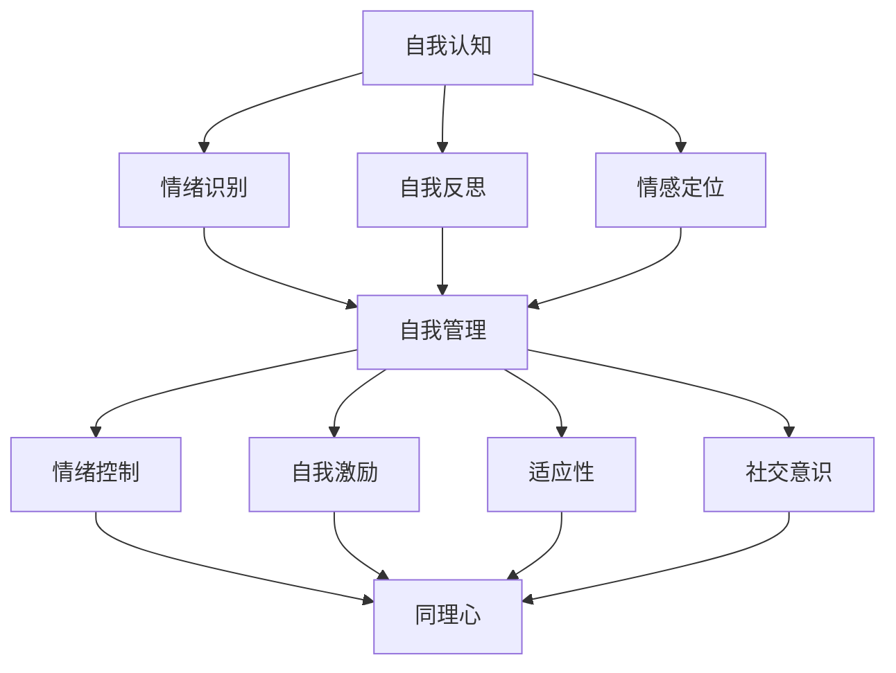

                 

### 文章标题：领导者的情商修炼：提升人际敏感度

> 关键词：情商、领导力、人际敏感度、自我认知、情绪管理

> 摘要：本文从情商的定义出发，深入探讨情商对领导者的重要性，以及如何通过提升自我认知和情绪管理能力，培养人际敏感度，从而在团队管理和领导力发展中取得成功。

### 第一部分：情商基础

#### 第1章：情商的定义与重要性

情商（Emotional Intelligence，简称EQ）是一种理解、管理自己情绪，并识别、理解他人情绪的能力。它由心理学家戈尔曼（Daniel Goleman）在1995年提出，包括自我认知、自我管理、社交意识和关系管理四个方面。情商的重要性体现在人际关系、领导力、情绪调节和职业发展等多个方面。

#### 1.1 情商的概念

情商的概念可以分为以下几个方面：

1. **自我认知**：了解自己的情绪，认识到情绪对个人行为和决策的影响。
   - **具体内容**：包括情绪识别、自我反思、情感定位等。
   - **提升方法**：通过自我观察、日记记录、情绪管理等方法来提高。

2. **自我管理**：有效地调节自己的情绪，保持冷静和专注。
   - **具体内容**：包括情绪控制、自我激励、适应性等。
   - **提升方法**：通过冥想、正面思考、目标设定等方法来提高。

3. **社交意识**：理解他人的情感和需求，并能够有效地建立和维护人际关系。
   - **具体内容**：包括同理心、社交技能、情感敏感性等。
   - **提升方法**：通过倾听、观察、情感反馈等方法来提高。

4. **关系管理**：建立和维护良好的人际关系，解决冲突，提高团队协作效率。
   - **具体内容**：包括沟通技巧、冲突解决、团队协作等。
   - **提升方法**：通过沟通训练、团队建设活动、协商技巧等方法来提高。

#### 1.2 情商的重要性

情商的重要性体现在以下几个方面：

1. **人际关系**：情商有助于建立和维护健康的人际关系。情商高的领导者更能理解团队成员的情感需求，有效解决冲突，提高团队协作效率。

2. **领导力**：情商是领导力的关键因素。情商高的领导者能够更好地激励和引导团队成员，提高团队的整体绩效。

3. **情绪调节**：情商有助于个人更好地调节自己的情绪，减少负面情绪对工作和生活的负面影响。

4. **职业发展**：情商高的个体更容易获得职业成功，因为他们能够更好地适应职场环境，处理工作压力，并在团队中发挥积极作用。

#### 1.3 情商的三个维度

情商的三个维度包括自我认知、自我管理和社交意识。

1. **自我认知**：了解自己的情绪，认识到情绪对个人行为和决策的影响。
   - **具体内容**：包括情绪识别、自我反思、情感定位等。
   - **提升方法**：通过自我观察、日记记录、情绪管理等方法来提高。

2. **自我管理**：有效地调节自己的情绪，保持冷静和专注。
   - **具体内容**：包括情绪控制、自我激励、适应性等。
   - **提升方法**：通过冥想、正面思考、目标设定等方法来提高。

3. **社交意识**：理解他人的情感和需求，并能够有效地建立和维护人际关系。
   - **具体内容**：包括同理心、社交技能、情感敏感性等。
   - **提升方法**：通过倾听、观察、情感反馈等方法来提高。

### 第2章：自我认知与情绪管理

#### 2.1 自我认知

自我认知是情商的基础，它包括以下几个方面：

1. **情绪识别**：能够准确地识别和理解自己的情绪。
   - **具体内容**：包括愤怒、快乐、悲伤等基本情绪。
   - **提升方法**：通过情绪日记、情感反馈等方法来提高。

2. **自我反思**：能够对自己的行为和决策进行反思，认识到情绪的影响。
   - **具体内容**：包括自我批评、自我肯定等。
   - **提升方法**：通过反思日记、心理咨询等方法来提高。

3. **情感定位**：能够将情绪与具体情境联系起来，理解情绪产生的原因。
   - **具体内容**：包括情感触发点、情境分析等。
   - **提升方法**：通过情境模拟、情感故事分享等方法来提高。

#### 2.2 情绪管理

情绪管理是情商的重要组成部分，它包括以下几个方面：

1. **情绪控制**：能够有效地调节自己的情绪，保持冷静和专注。
   - **具体内容**：包括情绪宣泄、情绪转化等。
   - **提升方法**：通过冥想、情绪调节训练等方法来提高。

2. **自我激励**：能够激发自己的内在动力，保持积极的心态。
   - **具体内容**：包括目标设定、自我奖励等。
   - **提升方法**：通过正面激励、自我肯定等方法来提高。

3. **适应性**：能够灵活应对各种情境，适应不同的情绪变化。
   - **具体内容**：包括情绪调节策略、情境适应能力等。
   - **提升方法**：通过情境模拟、适应性训练等方法来提高。

#### 2.3 提高自我认知和情绪管理能力的方法

提高自我认知和情绪管理能力的方法包括以下几个方面：

1. **自我观察**：通过观察自己的情绪和行为，了解自己的情绪变化规律。
   - **具体内容**：包括情绪日记、自我反思等。
   - **提升方法**：通过日记记录、心理咨询等方法来提高。

2. **情绪反馈**：通过他人的反馈来了解自己的情绪管理状况。
   - **具体内容**：包括情感反馈、团队反馈等。
   - **提升方法**：通过情感反馈机制、团队反馈会议等方法来提高。

3. **情绪调节**：通过训练和练习，提高情绪调节能力。
   - **具体内容**：包括情绪控制训练、冥想训练等。
   - **提升方法**：通过情绪控制训练、冥想课程等方法来提高。

### 第3章：同理心与人际沟通

#### 3.1 同理心

同理心是情商的重要组成部分，它包括以下几个方面：

1. **情感识别**：能够识别和理解他人的情感。
   - **具体内容**：包括同情、理解等。
   - **提升方法**：通过倾听、观察、情感反馈等方法来提高。

2. **情感表达**：能够表达自己的情感，与他人建立情感联系。
   - **具体内容**：包括沟通技巧、情感表达等。
   - **提升方法**：通过沟通训练、情感表达课程等方法来提高。

3. **情感共鸣**：能够与他人的情感产生共鸣，理解他人的需求。
   - **具体内容**：包括同理心、情感共鸣等。
   - **提升方法**：通过情感故事分享、情感共鸣练习等方法来提高。

#### 3.2 人际沟通技巧

人际沟通技巧是情商的重要组成部分，它包括以下几个方面：

1. **倾听**：能够主动倾听他人的意见和需求。
   - **具体内容**：包括倾听技巧、倾听态度等。
   - **提升方法**：通过倾听训练、倾听课程等方法来提高。

2. **表达**：能够清晰、准确地表达自己的意见和需求。
   - **具体内容**：包括表达技巧、表达态度等。
   - **提升方法**：通过表达训练、表达课程等方法来提高。

3. **反馈**：能够给予他人积极的反馈，促进双方的沟通。
   - **具体内容**：包括反馈技巧、反馈态度等。
   - **提升方法**：通过反馈训练、反馈课程等方法来提高。

#### 3.3 提高人际沟通能力的实践策略

提高人际沟通能力的实践策略包括以下几个方面：

1. **角色扮演**：通过角色扮演练习，提高沟通技巧。
   - **具体内容**：包括沟通模拟、角色扮演等。
   - **提升方法**：通过沟通模拟训练、角色扮演课程等方法来提高。

2. **情感对话**：通过情感对话，建立更深层次的人际关系。
   - **具体内容**：包括情感对话、深入沟通等。
   - **提升方法**：通过情感对话训练、深入沟通课程等方法来提高。

3. **情感反馈**：通过情感反馈，提高沟通效果。
   - **具体内容**：包括情感反馈、沟通效果评估等。
   - **提升方法**：通过情感反馈机制、沟通效果评估方法等方法来提高。

### 第4章：冲突解决与合作

#### 4.1 冲突解决

冲突解决是情商的重要组成部分，它包括以下几个方面：

1. **冲突识别**：能够识别和理解冲突的原因。
   - **具体内容**：包括冲突类型、冲突原因等。
   - **提升方法**：通过冲突识别训练、冲突分析等方法来提高。

2. **冲突管理**：能够有效地管理冲突，降低冲突对工作的影响。
   - **具体内容**：包括冲突管理技巧、冲突缓解等。
   - **提升方法**：通过冲突管理训练、冲突缓解课程等方法来提高。

3. **冲突解决**：能够通过有效的策略和沟通，解决冲突。
   - **具体内容**：包括冲突解决策略、沟通技巧等。
   - **提升方法**：通过冲突解决训练、沟通技巧课程等方法来提高。

#### 4.2 合作

合作是情商的重要组成部分，它包括以下几个方面：

1. **团队合作**：能够在团队中有效合作，共同完成任务。
   - **具体内容**：包括团队合作技巧、团队沟通等。
   - **提升方法**：通过团队合作训练、团队沟通课程等方法来提高。

2. **协作精神**：能够积极支持和配合他人，共同实现目标。
   - **具体内容**：包括协作精神、团队合作态度等。
   - **提升方法**：通过协作精神培养、团队合作态度培训等方法来提高。

3. **沟通协作**：能够通过有效的沟通和协作，提高团队效率。
   - **具体内容**：包括沟通协作技巧、协作沟通方法等。
   - **提升方法**：通过沟通协作训练、协作沟通课程等方法来提高。

#### 4.3 提高冲突解决和合作能力的方法

提高冲突解决和合作能力的方法包括以下几个方面：

1. **沟通技巧**：通过学习沟通技巧，提高沟通效果。
   - **具体内容**：包括沟通技巧、有效沟通等。
   - **提升方法**：通过沟通技巧培训、有效沟通课程等方法来提高。

2. **团队合作训练**：通过团队合作训练，提高团队合作能力。
   - **具体内容**：包括团队合作训练、团队活动等。
   - **提升方法**：通过团队合作训练、团队活动课程等方法来提高。

3. **冲突管理训练**：通过冲突管理训练，提高冲突解决能力。
   - **具体内容**：包括冲突管理训练、冲突解决策略等。
   - **提升方法**：通过冲突管理训练、冲突解决策略课程等方法来提高。

### 第二部分：情商在领导力中的应用

#### 第5章：情商在领导力中的角色

情商在领导力中扮演着至关重要的角色，它不仅影响着领导者的个人魅力和影响力，也直接关系到团队的整体绩效和组织的长远发展。

#### 5.1 情商与领导力的关系

情商与领导力之间存在着密切的联系，具体体现在以下几个方面：

1. **情商提升领导魅力**：情商高的领导者更能理解和管理自己和他人的情绪，展现出更高的个人魅力，从而吸引和激励团队成员。

2. **情商增强影响力**：情商高的领导者通过同理心和有效的沟通技巧，能够在团队中建立强大的影响力，引导团队成员朝着共同的目标努力。

3. **情商促进团队协作**：情商高的领导者能够更好地识别和解决团队成员之间的冲突，促进团队协作，提高团队的整体绩效。

#### 5.2 高情商领导者的特点

高情商领导者具备以下特点：

1. **自我认知**：高情商领导者能够深入了解自己的情绪和行为，认识到情绪对个人决策和领导效果的影响。

2. **情绪管理**：高情商领导者能够有效地调节自己的情绪，保持冷静和专注，以应对各种挑战和压力。

3. **同理心**：高情商领导者能够设身处地地理解他人的情感和需求，展现出高度的同情心和同理心。

4. **沟通技巧**：高情商领导者具备出色的沟通技巧，能够清晰、准确地表达自己的意见和需求，同时也能倾听和理解他人的观点。

5. **冲突解决**：高情商领导者能够有效地解决团队内部的冲突，维护团队的和谐与稳定。

#### 5.3 情商对领导成效的影响

情商对领导成效的影响可以从以下几个方面来分析：

1. **团队绩效**：情商高的领导者能够建立高效、协作的团队，提高团队的绩效和创新能力。

2. **员工满意度**：情商高的领导者能够更好地理解员工的需求，提高员工的工作满意度和忠诚度。

3. **领导影响力**：情商高的领导者通过同理心和有效的沟通，能够建立强大的领导影响力，推动组织的变革和发展。

4. **组织文化**：情商高的领导者能够积极塑造和传播组织文化，提升组织的凝聚力和向心力。

### 第6章：人际敏感度与团队管理

人际敏感度是情商的核心组成部分，对于领导者而言，人际敏感度的高低直接影响到团队管理的成效。在本章节中，我们将深入探讨人际敏感度的概念、团队管理中的挑战以及提升人际敏感度的实践策略。

#### 6.1 人际敏感度的概念

人际敏感度（Interpersonal Sensitivity）是指个体在社交互动中对于他人情感、需求、意图的感知和理解的敏感程度。人际敏感度高的个体能够敏锐地捕捉到他人的情感变化，并能够根据这些信息调整自己的行为和沟通方式。人际敏感度主要包括以下几个方面：

1. **情感感知**：能够准确感知他人的情感状态，包括快乐、悲伤、愤怒等。
2. **情感理解**：能够理解他人情感背后的原因和意图，进行深入的情感分析。
3. **情感反馈**：能够给予他人恰当的情感反馈，增强沟通的有效性。
4. **适应能力**：能够根据他人的情感变化灵活调整自己的行为，以适应不同的社交情境。

#### 6.2 团队管理中的挑战

在团队管理过程中，领导者面临的人际敏感度挑战主要包括以下几个方面：

1. **冲突处理**：团队成员之间可能会因为各种原因产生冲突，领导者需要具备高度的人际敏感度来识别冲突的根源，并采取合适的策略进行解决。

2. **员工关系**：领导者需要与团队成员建立良好的关系，了解他们的需求和期望，从而提供个性化的支持。

3. **沟通障碍**：由于文化差异、沟通方式不同等原因，团队内部可能会出现沟通障碍，领导者需要通过人际敏感度来识别并解决这些问题。

4. **团队协作**：在团队协作中，领导者需要激发团队成员的积极性，促进协作，这需要高度的的人际敏感度来理解和调动团队成员的情感。

#### 6.3 提升人际敏感度在团队管理中的应用

提升人际敏感度对团队管理有着重要的实际意义，以下是一些具体的应用策略：

1. **情感反馈**：领导者应该鼓励团队成员开放地表达自己的情感，并给予积极的情感反馈，帮助团队成员理解和应对自己的情感。

2. **倾听技巧**：领导者需要学会倾听，不仅仅是听对方说了什么，更重要的是理解对方在说什么，并能够从对方的情感角度出发进行沟通。

3. **情感共鸣**：领导者应该在与团队成员交流时，尝试从对方的角度出发，体验对方的情感，以建立更深厚的信任和共鸣。

4. **情境敏感**：领导者需要根据不同的团队情境，灵活调整自己的行为和沟通方式，以适应不同的团队需求和期望。

5. **冲突解决**：领导者应该具备识别和处理冲突的能力，通过有效的人际敏感度来分析冲突的原因，并采取适当的措施进行解决。

6. **团队建设**：领导者可以通过团队建设活动，如团建训练、情感分享会等，提高团队成员之间的人际敏感度，促进团队的整体协作和凝聚力。

### 第7章：情感领导力与组织文化

情感领导力是情商在领导力中的应用，它强调领导者不仅要有领导能力，还要有情感智慧，能够引导和管理团队成员的情感。组织文化是组织内部共享的价值观、信念和行为规范，它对员工的情感和态度有着深远的影响。在这一章节中，我们将探讨情感领导力的概念、组织文化的形成与作用，以及情感领导力对组织文化的影响。

#### 7.1 情感领导力的概念

情感领导力（Emotional Leadership）是指领导者通过情感智慧来引导和管理团队成员的情感，以实现组织目标的一种领导风格。情感领导力包括以下几个方面：

1. **情感智慧**：领导者需要具备识别、理解和管理自己和他人的情感的能力。
2. **情感共鸣**：领导者能够设身处地地理解团队成员的情感，与团队成员建立情感联系。
3. **情感激励**：领导者能够激发团队成员的积极情感，如激情、自信和归属感。
4. **情感引导**：领导者能够通过情感共鸣和激励，引导团队成员朝着共同的目标努力。

#### 7.2 组织文化的形成与作用

组织文化是组织在长期运营过程中形成的共享价值观、信念和行为规范。它对员工的行为、态度和工作方式有着深远的影响。组织文化的形成受到以下几个因素的影响：

1. **领导风格**：领导者的行为和价值观直接影响组织文化的形成。
2. **规章制度**：组织制定的规章制度和流程也会对组织文化产生影响。
3. **员工行为**：员工的共同行为和价值观也会塑造组织文化。
4. **外部环境**：组织的行业环境、市场环境和竞争环境也会对组织文化产生影响。

组织文化的作用主要包括：

1. **凝聚员工**：组织文化能够凝聚员工的共同价值观和目标，提高员工的归属感和忠诚度。
2. **指导行为**：组织文化为员工提供行为准则，帮助员工判断和处理工作中的问题。
3. **激励员工**：组织文化能够激励员工为实现组织目标而努力，提高员工的积极性和创造力。
4. **适应环境**：组织文化能够帮助组织适应外部环境的变化，保持组织的竞争力和可持续性。

#### 7.3 情感领导力对组织文化的影响

情感领导力对组织文化有着重要的影响，它能够：

1. **塑造积极的组织文化**：情感领导力能够引导员工建立积极的工作态度和价值观，塑造积极的组织文化。
2. **增强组织凝聚力**：情感领导力能够增强团队成员之间的情感联系，提高团队的凝聚力和协作效率。
3. **促进创新与变革**：情感领导力能够激发员工的创造力和创新精神，推动组织适应市场变化和实现持续发展。
4. **提高员工满意度**：情感领导力能够提高员工的工作满意度和幸福感，减少员工流失率，提高员工的绩效和生产力。

### 第8章：情商在领导力发展中的应用实践

#### 8.1 领导力发展的路径

领导力发展是一个持续的过程，涉及到自我认知、自我管理、社交意识和关系管理的多个方面。以下是领导力发展的主要路径：

1. **自我认知**：领导者需要深入了解自己的情感和行为模式，认识到情绪对领导行为和决策的影响。
   - **具体内容**：包括情感识别、自我反思、情感定位等。
   - **提升方法**：通过自我观察、日记记录、情绪管理等方法来提高。

2. **自我管理**：领导者需要学会有效地调节自己的情绪，保持冷静和专注，以应对各种挑战和压力。
   - **具体内容**：包括情绪控制、自我激励、适应性等。
   - **提升方法**：通过冥想、正面思考、目标设定等方法来提高。

3. **社交意识**：领导者需要提高对他人情感的敏感度，理解他人的需求，建立良好的人际关系。
   - **具体内容**：包括同理心、社交技能、情感敏感性等。
   - **提升方法**：通过倾听、观察、情感反馈等方法来提高。

4. **关系管理**：领导者需要学会建立和维护良好的人际关系，解决冲突，提高团队协作效率。
   - **具体内容**：包括沟通技巧、冲突解决、团队协作等。
   - **提升方法**：通过沟通训练、团队建设活动、协商技巧等方法来提高。

#### 8.2 情商培训与开发

情商培训与开发是领导力发展的重要组成部分，以下是一些具体的培训与开发方法：

1. **情商工作坊**：通过工作坊的形式，帮助领导者提升自我认知、情绪管理和人际沟通能力。
   - **具体内容**：包括情绪识别、自我反思、情感定位、情绪控制等。
   - **提升方法**：通过角色扮演、小组讨论、情境模拟等方法来提高。

2. **情感反馈**：建立情感反馈机制，鼓励团队成员为领导者提供情感反馈，帮助领导者了解自己的领导风格和影响力。
   - **具体内容**：包括情感反馈、沟通技巧、关系管理等。
   - **提升方法**：通过定期反馈会议、团队互动活动等方法来提高。

3. **情商教练**：聘请专业的情商教练，为领导者提供个性化的指导和支持，帮助他们提升情商。
   - **具体内容**：包括情感管理、人际沟通、领导力发展等。
   - **提升方法**：通过一对一辅导、情境模拟、实战训练等方法来提高。

#### 8.3 情商评估与反馈

情商评估与反馈是领导力发展的重要环节，以下是一些具体的评估与反馈方法：

1. **情商测评**：使用专业的情商测评工具，对领导者的情商水平进行评估，识别优势和劣势。
   - **具体内容**：包括自我认知、情绪管理、社交意识、关系管理等。
   - **提升方法**：通过测评报告、个性化反馈、改进计划等方法来提高。

2. **360度反馈**：收集来自上级、同事、下属的反馈，全面评估领导者的情商表现。
   - **具体内容**：包括沟通技巧、团队协作、领导风格等。
   - **提升方法**：通过反馈会议、改进计划、持续跟踪等方法来提高。

3. **持续反馈**：建立持续的反馈机制，定期评估领导者的情商水平，并提供反馈和改进建议。
   - **具体内容**：包括情感管理、人际沟通、领导力发展等。
   - **提升方法**：通过定期评估、反馈会议、改进计划等方法来提高。

### 第9章：提升人际敏感度的方法

#### 9.1 情商自我提升的方法

提升人际敏感度需要通过自我观察、学习和实践，以下是一些具体的自我提升方法：

1. **自我观察**：通过日记记录、情感分析等方式，深入了解自己的情绪和行为模式。
   - **具体内容**：包括情绪识别、自我反思、情感定位等。
   - **提升方法**：通过日记记录、情感分析软件等方法来提高。

2. **学习与阅读**：通过阅读相关书籍、参加培训课程等方式，获取情商知识和技巧。
   - **具体内容**：包括情商理论、人际沟通技巧、情感管理等。
   - **提升方法**：通过阅读书籍、参加培训课程、在线学习等方法来提高。

3. **实践与应用**：在实际工作和生活中，运用所学的情商技巧，提高人际敏感度。
   - **具体内容**：包括情感反馈、沟通技巧、团队协作等。
   - **提升方法**：通过角色扮演、情景模拟、实际操作等方法来提高。

#### 9.2 情商提升的技巧

以下是一些具体的情商提升技巧：

1. **积极倾听**：通过积极的倾听技巧，提高对他人情感的感知和理解。
   - **具体内容**：包括倾听姿势、肢体语言、情感反馈等。
   - **提升方法**：通过倾听训练、情感反馈练习等方法来提高。

2. **同理心训练**：通过同理心训练，提高对他人情感的敏感度和理解能力。
   - **具体内容**：包括情感共鸣、情境模拟、情感故事分享等。
   - **提升方法**：通过同理心训练课程、情感故事分享会等方法来提高。

3. **情绪调节**：通过情绪调节技巧，提高自我情绪管理能力，保持冷静和专注。
   - **具体内容**：包括情绪控制、自我激励、适应性等。
   - **提升方法**：通过冥想、情绪调节训练、正面思考等方法来提高。

#### 9.3 常见挑战与解决策略

在提升人际敏感度的过程中，可能会遇到以下常见挑战：

1. **情感盲点**：对某些情感缺乏敏感度，导致无法有效识别和理解他人的情感。
   - **解决策略**：通过自我反思、情感分析等方式，识别情感盲点，并采取相应的改进措施。

2. **沟通障碍**：由于文化差异、沟通方式不同等原因，导致沟通效果不佳。
   - **解决策略**：通过学习沟通技巧、加强文化敏感性等方式，提高沟通效果。

3. **情感冲突**：在团队管理和人际互动中，可能遇到情感冲突，影响团队和谐和合作。
   - **解决策略**：通过有效的情感反馈、冲突解决技巧等方式，解决情感冲突。

### 第10章：人际敏感度测试与评估

#### 10.1 人际敏感度测试

人际敏感度测试是一种有效的工具，用于评估个体在社交互动中对于他人情感、需求、意图的感知和理解的敏感程度。以下是一些常见的人际敏感度测试方法：

1. **自我评估问卷**：通过填写问卷，个体可以自我评估自己在人际敏感度方面的表现。
   - **具体内容**：包括情感识别、情感理解、情感反馈、适应能力等。
   - **提升方法**：通过定期自我评估、情感反思等方法来提高。

2. **情境模拟测试**：通过模拟不同的社交情境，评估个体在具体情境中的人际敏感度。
   - **具体内容**：包括沟通情境、冲突解决情境、团队合作情境等。
   - **提升方法**：通过情境模拟练习、情感反馈机制等方法来提高。

3. **360度反馈**：收集来自上级、同事、下属的反馈，全面评估个体的人际敏感度。
   - **具体内容**：包括沟通技巧、团队合作、领导风格等。
   - **提升方法**：通过反馈会议、改进计划、持续跟踪等方法来提高。

#### 10.2 评估结果的分析与应用

评估结果的分析和应用对于提升人际敏感度具有重要意义，以下是一些关键步骤：

1. **结果解读**：根据评估结果，对个体的人际敏感度进行详细解读，识别优势和劣势。
   - **具体内容**：包括情感感知、情感理解、情感反馈、适应能力等。
   - **提升方法**：通过个性化解读报告、情感反思等方式来提高。

2. **制定改进计划**：根据评估结果，制定针对性的改进计划，明确提升人际敏感度的具体方法和步骤。
   - **具体内容**：包括情感识别、自我反思、情感定位、情绪控制等。
   - **提升方法**：通过制定改进计划、情感反馈机制、持续培训等方法来提高。

3. **应用实践**：将评估结果应用于实际工作和生活中，通过实践和反馈，不断提高人际敏感度。
   - **具体内容**：包括情感反馈、沟通技巧、团队协作等。
   - **提升方法**：通过实践应用、情感反思、持续改进等方法来提高。

#### 10.3 基于评估结果的发展规划

基于评估结果，可以制定具体的发展规划，以提升人际敏感度和整体情商水平。以下是一些关键步骤：

1. **目标设定**：明确提升人际敏感度的具体目标和期望，如提高情感识别能力、增强同理心等。
   - **具体内容**：包括情感识别、情感理解、情感反馈、适应能力等。
   - **提升方法**：通过目标设定、情感反思、持续改进等方法来提高。

2. **行动规划**：制定详细的行动规划，明确提升人际敏感度的具体步骤和方法。
   - **具体内容**：包括自我观察、学习与阅读、实践与应用等。
   - **提升方法**：通过行动规划、情感反馈机制、持续培训等方法来提高。

3. **监督与反馈**：建立监督和反馈机制，定期检查进展情况，及时调整行动规划。
   - **具体内容**：包括定期评估、反馈会议、改进计划等。
   - **提升方法**：通过监督与反馈、情感反思、持续改进等方法来提高。

### 第11章：情商修炼与持续成长

#### 11.1 情商修炼的重要性

情商修炼对于个人和组织的成功至关重要。以下是一些关键点：

1. **个人成长**：情商修炼有助于个人更好地理解和管理自己的情绪，提高生活质量。
2. **职业发展**：情商修炼有助于提高职场竞争力，提升领导力和沟通能力。
3. **组织效能**：情商修炼有助于建立积极的组织文化，提高团队协作和整体绩效。

#### 11.2 持续成长的策略

持续成长是情商修炼的关键。以下是一些策略：

1. **自我反思**：定期进行自我反思，识别情绪和行为模式，寻找改进空间。
2. **学习与实践**：不断学习新的情商知识和技巧，通过实践应用来提升能力。
3. **反馈与改进**：通过反馈和评估，不断调整和改进情商修炼计划。

#### 11.3 成功案例分享

以下是几个成功案例，展示了情商修炼在个人和职业发展中的实际效果：

1. **案例一**：一位企业高管通过持续的学习和实践，显著提升了人际敏感度和团队领导力，带领团队取得了显著的成绩。
2. **案例二**：一位教师通过情商修炼，改善了与学生和家长的关系，提高了教学效果和学生的满意度。
3. **案例三**：一位创业者通过提升情商，建立了强大的社交网络，促进了业务发展和企业成长。

### 附录

#### 附录 A：情商提升资源

为了帮助读者进一步提升情商，以下是一些推荐的资源：

1. **书籍推荐**：
   - 《情商：为什么情商比智商更重要》
   - 《同理心：如何培养和运用同理心》
   - 《非暴力沟通：如何沟通情感和解决冲突》

2. **培训课程**：
   - 情商提升工作坊
   - 同理心训练课程
   - 领导力发展课程

3. **在线资源**：
   - EQ-I 2.0 情商测试
   - 情商博客和文章
   - 情商相关的在线课程

### 作者信息

作者：AI天才研究院/AI Genius Institute & 禅与计算机程序设计艺术 /Zen And The Art of Computer Programming

---

### 第1章：情商的定义与重要性

#### 情商的概念

情商（Emotional Intelligence，简称EQ）是一种理解、管理自己情绪，并识别、理解他人情绪的能力。它由心理学家戈尔曼（Daniel Goleman）在1995年提出，并指出情商对个人生活质量和职业成功具有重大影响。情商包括自我认知、自我管理、社交意识和关系管理四个方面。

**自我认知**是情商的基础，涉及了解自己的情绪状态，认识到情绪对个人行为和决策的影响。**自我管理**则包括情绪控制、自我激励和适应性等，帮助个人在面对压力和挑战时保持冷静和专注。**社交意识**是指理解他人的情感和需求，并能够有效地建立和维护人际关系。**关系管理**则涉及沟通技巧、冲突解决和团队协作等方面。

#### 情商的重要性

情商的重要性体现在多个方面：

1. **人际关系**：情商高的个体能够更好地理解和回应他人的情感，建立健康的人际关系。这对于领导者来说尤为重要，因为他们需要与团队成员、同事和客户建立良好的互动。

2. **领导力**：情商是领导力的关键因素。高情商的领导者能够更好地激励和引导团队成员，解决冲突，提高团队的整体绩效。

3. **情绪调节**：情商有助于个人更好地管理自己的情绪，减少负面情绪对工作和生活的影响。

4. **职业发展**：情商高的个体在职场中更容易获得认可和成功，因为他们能够更好地适应职场环境，处理工作压力，并在团队中发挥积极作用。

#### 情商的三个维度

情商的三个维度分别是自我认知、自我管理和社交意识。

1. **自我认知**

   - **情绪识别**：了解自己的情绪状态，能够识别出愤怒、焦虑、快乐等基本情绪。
   - **自我反思**：通过反思自己的行为和决策，认识到情绪对它们的影响。
   - **情感定位**：理解情绪与个人价值观和信念的关系，知道情绪是如何影响自己和他人的。

2. **自我管理**

   - **情绪控制**：学会控制自己的情绪，避免情绪波动对工作和生活的影响。
   - **自我激励**：激发自己的内在动力，保持积极的态度和目标导向。
   - **适应性**：在面对不同情境和压力时，能够灵活调整自己的情绪和行为。

3. **社交意识**

   - **同理心**：能够设身处地地理解他人的情感和需求，展现出高度的同情心。
   - **社交技能**：具备良好的沟通技巧，能够有效地与他人交流和建立关系。
   - **情感敏感性**：能够敏锐地捕捉到他人的情绪变化，并做出相应的反应。

#### 核心概念与联系

为了更好地理解情商的概念和重要性，我们可以使用Mermaid流程图来展示情商的三个维度及其相互关系：



这个流程图展示了情商的三个维度如何相互关联，并如何共同作用于个人的生活和职业发展。

### 第2章：自我认知与情绪管理

#### 2.1 自我认知

自我认知是情商的基础，它帮助我们理解自己的情绪、需求和动机。自我认知包括情绪识别、自我反思和情感定位三个关键方面。

1. **情绪识别**

   情绪识别是自我认知的第一步，它涉及到对自身情绪状态的感知和分类。这个过程可以通过以下步骤实现：

   - **观察情绪变化**：注意自己在不同情境下的情绪反应，例如在面对挑战时的焦虑感或取得成就时的喜悦。
   - **情绪分类**：将情绪分为基本情绪（如快乐、悲伤、愤怒等）和复杂情绪（如焦虑、沮丧、兴奋等）。
   - **情绪日记**：记录每天的情绪变化，帮助自己更好地理解情绪的触发点和频率。

   下面是一个情绪识别的伪代码示例：

   ```python
   # 情绪识别伪代码
   def recognize_emotions():
       current_emotion = get_current_emotion()
       if current_emotion == "happy":
           print("目前情绪：快乐")
       elif current_emotion == "sad":
           print("目前情绪：悲伤")
       else:
           print("目前情绪：未知")
   ```

2. **自我反思**

   自我反思是指对自身的情绪、行为和决策进行深入思考，以理解它们背后的动机和影响。这个过程可以通过以下步骤实现：

   - **反思日记**：每天花时间记录自己的反思，包括对当天情绪反应的思考、决策过程和结果。
   - **情境分析**：分析不同情境下情绪反应的原因，了解自己的情绪触发点和应对策略。
   - **自我评价**：定期对自己的情绪管理能力进行评价，识别需要改进的方面。

   下面是一个自我反思的伪代码示例：

   ```python
   # 自我反思伪代码
   def reflect_on_day():
       print("今天的反思：")
       print("情绪反应：", get_emotion_reactions())
       print("决策过程：", get_decision_process())
       print("结果分析：", get_result_analysis())
   ```

3. **情感定位**

   情感定位是指将情绪与个人价值观、信念和目标联系起来，理解情绪对我们的行为和决策的影响。这个过程可以通过以下步骤实现：

   - **价值观评估**：了解自己的核心价值观和信念，它们如何影响情绪和决策。
   - **目标设定**：明确个人目标，理解情绪是如何帮助或阻碍目标实现的。
   - **情绪目标匹配**：将情绪与目标联系起来，确保情绪与目标相一致。

   下面是一个情感定位的伪代码示例：

   ```python
   # 情感定位伪代码
   def align_emotions_with_goals():
       emotions = get_current_emotions()
       goals = get_goals()
       for emotion in emotions:
           if emotion Supports_goals(goals):
               print(f"{emotion}支持目标：", goals)
           else:
               print(f"{emotion}可能阻碍目标：", goals)
   ```

#### 2.2 情绪管理

情绪管理是自我认知的重要组成部分，它涉及到如何有效地调节和控制情绪，以保持积极的心态和行为。情绪管理包括情绪控制、自我激励和适应性三个方面。

1. **情绪控制**

   情绪控制是指在面对压力和挑战时，能够有效地调节情绪，避免情绪波动对工作和生活的影响。以下是一些情绪控制的策略：

   - **认知重构**：通过改变对情境的认知和解读，来调节情绪。例如，将失败视为学习机会而非灾难。
   - **情感宣泄**：通过适当的方式释放负面情绪，如运动、写日记或与朋友倾诉。
   - **放松训练**：通过冥想、深呼吸或瑜伽等放松技巧，减轻压力和焦虑。

   下面是一个情绪控制的伪代码示例：

   ```python
   # 情绪控制伪代码
   def control_emotions():
       stress_level = get_stress_level()
       if stress_level > threshold:
           print("压力过高，需要调节情绪")
           apply_cognitive_restructuring()
           release_emotions()
           practice_relaxation()
   ```

2. **自我激励**

   自我激励是指激发自己的内在动力，保持积极的心态和行为。以下是一些自我激励的策略：

   - **目标设定**：设定明确、具体和可衡量的目标，为自己的行为提供方向和动力。
   - **正面思考**：培养积极的思维方式，专注于解决问题的方法而非问题本身。
   - **自我奖励**：为自己的成就和进步设立奖励，提高自我激励的效果。

   下面是一个自我激励的伪代码示例：

   ```python
   # 自我激励伪代码
   def self_motivate():
       goals = get_goals()
       achievements = get_achievements()
       for achievement in achievements:
           if achievement == goals:
               print("目标达成，奖励自己！")
               reward_yourself()
   ```

3. **适应性**

   适应性是指在面对变化和不确定性时，能够灵活调整自己的情绪和行为。以下是一些适应性的策略：

   - **情境适应**：了解不同情境的特点和要求，调整自己的行为和心态以适应。
   - **灵活思考**：保持开放和灵活的思维方式，能够从不同角度看待问题。
   - **学习与成长**：不断学习新知识和技能，提高适应变化的能力。

   下面是一个适应性的伪代码示例：

   ```python
   # 适应性伪代码
   def adapt_to_changes():
       current_context = get_context()
       required_actions = get_required_actions(current_context)
       for action in required_actions:
           if action != previous_action:
               print("情境变化，调整行为：", action)
               update_actions(action)
   ```

#### 2.3 提高自我认知和情绪管理能力的方法

提高自我认知和情绪管理能力是一个持续的过程，以下是一些具体的方法：

1. **自我观察**

   自我观察是通过持续关注自己的情绪、行为和思维模式，以提高自我认知。以下是一些自我观察的方法：

   - **日记记录**：每天记录自己的情绪、行为和思考，分析它们之间的关系。
   - **情绪标签**：给自己的情绪贴上标签，例如“焦虑”、“愤怒”或“满足”，以更好地理解情绪。
   - **反思日志**：定期反思自己的行为和决策，思考它们的动机和影响。

2. **情绪反馈**

   情绪反馈是通过他人的反馈来了解自己的情绪管理状况，以提高情绪管理能力。以下是一些情绪反馈的方法：

   - **同事反馈**：向同事或上级寻求反馈，了解他们对自己情绪管理能力的看法。
   - **360度反馈**：通过多个角度收集反馈，包括同事、下属和客户，以获得更全面的评价。
   - **心理辅导**：寻求专业心理辅导，了解自己的情绪模式和如何改善。

3. **情绪调节**

   情绪调节是通过训练和练习，提高情绪管理能力。以下是一些情绪调节的方法：

   - **冥想**：通过冥想练习，提高情绪的稳定性和自我控制能力。
   - **情绪训练**：通过特定的训练，如情境模拟和角色扮演，提高应对不同情绪情境的能力。
   - **放松训练**：通过深呼吸、渐进性肌肉放松等技巧，减轻压力和焦虑。

通过以上方法，可以逐步提高自我认知和情绪管理能力，从而更好地应对生活中的各种挑战。

### 第3章：同理心与人际沟通

#### 3.1 同理心

同理心（Empathy）是情商的重要组成部分，它涉及到理解和感受他人情感的能力。同理心包括情感识别、情感理解、情感共鸣和情感表达等方面。

1. **情感识别**

   情感识别是指能够准确地识别他人的情绪状态，包括快乐、悲伤、愤怒等基本情绪。以下是情感识别的一些步骤和方法：

   - **倾听**：倾听他人的言语和非言语信号，如语气、表情和身体语言。
   - **观察**：观察他人的情绪表现，如面部表情、肢体动作和声音的变化。
   - **询问**：直接询问他人的感受，以获得更准确的情感信息。

   以下是情感识别的一个伪代码示例：

   ```python
   # 情感识别伪代码
   def recognize_emotions(person):
       speech = get_speech_from_person(person)
       expression = get_expression_from_person(person)
       emotions = analyze_speech(speech) + analyze_expression(expression)
       return emotions
   ```

2. **情感理解**

   情感理解是指深入理解他人情绪背后的原因和情境。以下是情感理解的一些步骤和方法：

   - **情境分析**：分析导致他人情绪的情境因素，如工作压力、家庭问题或人际关系。
   - **情感推理**：通过推理和推断，理解他人情绪的可能原因。
   - **情感故事**：通过分享和倾听情感故事，加深对他人情感的理解。

   以下是情感理解的一个伪代码示例：

   ```python
   # 情感理解伪代码
   def understand_emotions(person, emotion):
       context = get_context_of_person(person)
       possible_reasons = analyze_context(context)
       return possible_reasons
   ```

3. **情感共鸣**

   情感共鸣是指与他人的情感产生共鸣，体验他们的情感。以下是情感共鸣的一些步骤和方法：

   - **情感置换**：尝试从他人的角度体验情感，理解他们的感受。
   - **情感分享**：与他人分享自己的情感体验，以建立情感共鸣。
   - **情感反馈**：通过情感反馈，确认他人感受到的情感并与他们产生共鸣。

   以下是情感共鸣的一个伪代码示例：

   ```python
   # 情感共鸣伪代码
   def empathize_with_person(person, emotion):
       my_emotion = experience_emotion(emotion)
       share_emotion_with_person(person, my_emotion)
   ```

4. **情感表达**

   情感表达是指能够清晰、准确地表达自己的情感。以下是情感表达的一些步骤和方法：

   - **情感词汇**：学习和使用恰当的情感词汇，以准确地表达情感。
   - **情感沟通**：通过言语和非言语方式，如语气、表情和肢体语言，表达情感。
   - **情感反馈**：通过情感反馈，确认他人是否理解了自己的情感。

   以下是情感表达的一个伪代码示例：

   ```python
   # 情感表达伪代码
   def express_emotions(emotions):
       for emotion in emotions:
           say_emotion_in_speech(emotion)
           show_emotion_in_expression(emotion)
   ```

#### 3.2 人际沟通技巧

人际沟通技巧是同理心的体现，它包括倾听技巧、表达技巧和反馈技巧等方面。

1. **倾听技巧**

   倾听技巧是指能够有效地倾听他人的意见和需求，以下是一些倾听技巧：

   - **专注倾听**：在交流过程中，保持专注，避免分心和干扰。
   - **情感倾听**：不仅仅是听对方说了什么，更重要的是理解对方的情感和需求。
   - **开放式问题**：通过开放式问题，鼓励对方分享更多信息，以更全面地理解他们的观点。

   以下是倾听技巧的一个伪代码示例：

   ```python
   # 倾听技巧伪代码
   def active倾听技巧(person):
       while person_talking:
           listen_to_speech(person)
           analyze_expression(person)
           ask_open_questions(person)
   ```

2. **表达技巧**

   表达技巧是指能够清晰、准确地表达自己的意见和需求，以下是一些表达技巧：

   - **情感表达**：使用恰当的情感词汇和表达方式，清晰地传达情感。
   - **积极表达**：以积极的方式表达自己的观点，避免负面情绪的传递。
   - **非言语表达**：通过肢体语言、表情和声音，增强语言表达的效果。

   以下是表达技巧的一个伪代码示例：

   ```python
   # 表达技巧伪代码
   def express_ourselvesCLEARLY(person):
       use_calm_tone()
       use_appropriate_verbs()
       show_confidence_in_speech()
   ```

3. **反馈技巧**

   反馈技巧是指能够给予他人积极的反馈，促进双方的沟通，以下是一些反馈技巧：

   - **具体反馈**：提供具体的反馈，指出具体的行为或表现。
   - **积极反馈**：以积极的方式表达反馈，鼓励对方继续努力。
   - **建设性反馈**：提供建设性的反馈，帮助对方改进。

   以下是反馈技巧的一个伪代码示例：

   ```python
   # 反馈技巧伪代码
   def give_positive_feedback(person):
       acknowledge_achievements(person)
       provide_specific_feedback(person)
       encourage_future_progress(person)
   ```

通过以上同理心和人际沟通技巧，领导者可以更好地理解和回应团队成员的情感需求，建立更加和谐和高效的团队关系。

### 第4章：冲突解决与合作

#### 4.1 冲突解决

冲突解决是情商的重要组成部分，它涉及到识别、管理和解决团队内部冲突的方法和技巧。

1. **冲突识别**

   冲突识别是冲突解决的第一步，它涉及到如何发现和识别团队内部的冲突。以下是一些冲突识别的技巧：

   - **观察行为变化**：通过观察团队成员的行为变化，如情绪波动、沟通减少等，识别潜在的冲突。
   - **倾听团队成员的意见**：通过倾听团队成员的意见和抱怨，了解冲突的具体内容和原因。
   - **定期团队会议**：通过定期团队会议，提供团队成员表达意见和反馈的机会，识别冲突。

   以下是冲突识别的一个伪代码示例：

   ```python
   # 冲突识别伪代码
   def identify_conflicts():
       for member in team_members:
           if member exhibiting signs_of_conflict:
               record_conflict(member)
   ```

2. **冲突管理**

   冲突管理是指通过有效的方法和技巧，管理和控制冲突，以减少冲突对团队的影响。以下是一些冲突管理的技巧：

   - **沟通技巧**：通过有效的沟通技巧，如倾听、表达和反馈，解决冲突。
   - **中立调解**：在冲突双方之间充当中立调解者，帮助双方找到共同的解决方案。
   - **时间管理**：合理安排时间和资源，避免冲突的进一步扩大。

   以下是冲突管理的一个伪代码示例：

   ```python
   # 冲突管理伪代码
   def manage_conflicts(conflict):
       mediate_between_parties(conflict)
       encourage_open_communication(conflict)
       allocate_resources_to_solutions(conflict)
   ```

3. **冲突解决**

   冲突解决是指通过具体的策略和行动，解决团队内部的冲突，以下是一些冲突解决的技巧：

   - **问题解决会议**：组织专门的问题解决会议，让冲突双方坐下来共同讨论解决方案。
   - **协商谈判**：通过协商和谈判，让冲突双方找到共同的利益点，达成妥协。
   - **团队建设活动**：通过团队建设活动，增强团队成员之间的信任和合作，减少冲突。

   以下是冲突解决的一个伪代码示例：

   ```python
   # 冲突解决伪代码
   def resolve_conflicts(conflict):
       organize_solution_meeting(conflict)
       negotiate_with_parties(conflict)
       strengthen_team_belief(conflict)
   ```

#### 4.2 合作

合作是团队成功的关键，它涉及到团队成员之间的协作和共同努力，以实现共同的目标。

1. **团队合作**

   团队合作是指团队成员相互支持、共同努力，以实现团队目标的过程。以下是一些团队合作的关键要素：

   - **明确目标**：确保团队成员对团队目标有清晰的理解和共识。
   - **分工协作**：根据团队成员的技能和专长，合理分工，确保每个成员都有明确的职责和任务。
   - **有效沟通**：通过有效的沟通，确保团队成员之间的信息传递畅通无阻。

   以下是团队合作的一个伪代码示例：

   ```python
   # 团队合作伪代码
   def team_work():
       define_common_goals()
       assign_roles_to_members()
       communicate_easily()
   ```

2. **协作精神**

   协作精神是指团队成员愿意和支持与他人合作，共同实现团队目标的态度和行为。以下是一些协作精神的培养方法：

   - **鼓励分享**：鼓励团队成员分享知识和经验，促进团队整体能力的提升。
   - **相互尊重**：尊重团队成员的观点和贡献，建立相互信任和尊重的文化。
   - **团队合作奖励**：通过团队合作奖励，激励团队成员积极参与和合作。

   以下是协作精神的一个伪代码示例：

   ```python
   # 协作精神伪代码
   def promote_collaboration():
       encourage_sharing_of_ideas()
       respect_contributions_from_members()
       offer_team_based_incentives()
   ```

3. **沟通协作**

   沟通协作是指通过有效的沟通和协作，提高团队效率和成果。以下是一些沟通协作的技巧：

   - **定期会议**：定期召开团队会议，讨论项目进展、问题解决和团队协作。
   - **清晰沟通**：确保沟通内容清晰、准确，避免误解和混淆。
   - **合作工具**：使用适当的合作工具，如项目管理软件、协作平台等，提高团队协作效率。

   以下是沟通协作的一个伪代码示例：

   ```python
   # 沟通协作伪代码
   def collaborate_efficiently():
       schedule_regular_meetings()
       communicate_clarly()
       use_collaboration_tools()
   ```

通过冲突解决和合作的技巧，领导者可以有效地管理团队内部的冲突，促进团队成员之间的协作，从而实现团队的目标和提升团队的绩效。

### 第5章：情商在领导力中的角色

情商在领导力中扮演着至关重要的角色，它不仅影响到领导者的个人魅力和影响力，还直接关系到团队的整体绩效和组织的长远发展。

#### 5.1 情商与领导力的关系

情商与领导力之间存在着密切的联系，这种联系可以从以下几个方面来理解：

1. **情商提升领导魅力**：情商高的领导者能够更好地理解和管理自己和他人的情绪，展现出更高的个人魅力。这种个人魅力能够吸引和激励团队成员，增强团队凝聚力。

2. **情商增强影响力**：情商高的领导者通过同理心和有效的沟通技巧，能够在团队中建立强大的影响力。这种影响力不仅有助于推动团队朝着共同目标努力，还能在关键时刻引导团队走出困境。

3. **情商促进团队协作**：情商高的领导者能够更好地识别和解决团队成员之间的冲突，促进团队协作。这种协作精神有助于提高团队的整体绩效，实现组织目标。

4. **情商提升决策能力**：情商高的领导者能够更好地理解情绪对决策的影响，从而做出更明智的决策。这种决策能力有助于应对复杂多变的环境，确保组织的发展方向正确。

#### 5.2 高情商领导者的特点

高情商领导者具有以下特点：

1. **自我认知**：高情商领导者能够深入了解自己的情绪和行为，认识到情绪对个人决策和领导行为的影响。

2. **情绪管理**：高情商领导者能够有效地调节自己的情绪，保持冷静和专注，以应对各种挑战和压力。

3. **同理心**：高情商领导者能够设身处地地理解他人的情感和需求，展现出高度的同情心和同理心。

4. **沟通技巧**：高情商领导者具备出色的沟通技巧，能够清晰、准确地表达自己的意见和需求，同时也能倾听和理解他人的观点。

5. **冲突解决**：高情商领导者能够有效地解决团队内部的冲突，维护团队的和谐与稳定。

6. **适应性**：高情商领导者能够灵活应对各种情境，适应不同的情绪变化，以保持团队的高效运转。

#### 5.3 情商对领导成效的影响

情商对领导成效的影响可以从以下几个方面来分析：

1. **团队绩效**：情商高的领导者能够建立高效、协作的团队，提高团队的绩效和创新能力。

2. **员工满意度**：情商高的领导者能够更好地理解员工的需求，提高员工的工作满意度和忠诚度。

3. **领导影响力**：情商高的领导者通过同理心和有效的沟通，能够建立强大的领导影响力，推动组织的变革和发展。

4. **组织文化**：情商高的领导者能够积极塑造和传播组织文化，提升组织的凝聚力和向心力。

5. **决策质量**：情商高的领导者能够更好地理解情绪对决策的影响，从而做出更明智、更全面的决策。

6. **团队稳定性**：情商高的领导者能够有效地解决团队冲突，维护团队的稳定，减少人才流失。

#### 5.4 情商在领导力发展中的应用

情商在领导力发展中的应用主要体现在以下几个方面：

1. **自我认知与情绪管理**：领导者需要通过自我观察和反思，了解自己的情绪和行为模式，学会情绪管理，以保持冷静和专注。

2. **同理心与人际沟通**：领导者需要培养同理心，理解他人的情感和需求，通过有效的沟通技巧，建立良好的人际关系。

3. **冲突解决与合作**：领导者需要学会识别和解决团队内部的冲突，促进团队合作，提高团队的整体绩效。

4. **领导风格与影响策略**：领导者需要根据团队和环境的变化，灵活调整自己的领导风格和影响策略，以适应不同的情境和需求。

5. **情商培训与发展**：组织可以为领导者提供专门的情商培训和发展项目，帮助他们提升情商，增强领导力。

通过以上方法，领导者可以不断提升自己的情商，从而在领导力发展过程中取得更好的成效。

### 第6章：人际敏感度与团队管理

#### 6.1 人际敏感度的概念

人际敏感度是指个体在社交互动中对于他人情感、需求、意图的感知和理解的敏感程度。它是情商的重要组成部分，对于团队管理尤为重要。人际敏感度包括以下几个方面：

1. **情感感知**：个体能够敏锐地感知他人的情绪变化，如喜悦、愤怒、焦虑等。
2. **情感理解**：个体能够理解他人情感背后的原因和情境，进行深入的情感分析。
3. **情感反馈**：个体能够给予他人恰当的情感反馈，增强沟通的有效性。
4. **适应能力**：个体能够根据他人的情感变化灵活调整自己的行为和沟通方式。

#### 6.2 团队管理中的挑战

在团队管理过程中，领导者面临的人际敏感度挑战主要包括以下几个方面：

1. **冲突处理**：团队成员之间可能会因为工作理念、目标设定、任务分配等原因产生冲突，领导者需要具备高度的人际敏感度来识别冲突的根源，并采取合适的策略进行解决。
2. **员工关系**：领导者需要与团队成员建立良好的关系，了解他们的需求和期望，从而提供个性化的支持，这需要领导者具备高的人际敏感度。
3. **沟通障碍**：由于文化差异、沟通方式不同等原因，团队内部可能会出现沟通障碍，领导者需要通过人际敏感度来识别并解决这些问题。
4. **团队协作**：在团队协作中，领导者需要激发团队成员的积极性，促进协作，这需要高度的的人际敏感度来理解和调动团队成员的情感。

#### 6.3 提升人际敏感度的实践策略

提升人际敏感度对团队管理有着重要的实际意义，以下是一些具体的实践策略：

1. **情感反馈**：领导者应该鼓励团队成员开放地表达自己的情感，并给予积极的情感反馈，帮助团队成员理解和应对自己的情感。

   - **具体内容**：建立情感反馈机制，通过定期反馈会议或一对一沟通，让团队成员分享情感，领导者给予反馈。
   - **实施方法**：通过倾听、提问、确认情感等方式，确保反馈的真实性和有效性。

2. **倾听技巧**：领导者需要学会倾听，不仅仅是听对方说了什么，更重要的是理解对方在说什么，并能够从对方的情感角度出发进行沟通。

   - **具体内容**：通过开放性问题、倾听姿态、肢体语言等方式，提高倾听效果。
   - **实施方法**：定期进行倾听训练，模拟实际沟通场景，提升领导者的倾听能力。

3. **同理心训练**：领导者需要通过同理心训练，提高对他人情感的敏感度，理解他人的需求，建立更深层次的情感联系。

   - **具体内容**：通过角色扮演、情感故事分享、同理心工作坊等方式，培养领导者的同理心。
   - **实施方法**：组织同理心培训课程，提供实践机会，让领导者体验和理解同理心的应用。

4. **情境敏感**：领导者需要根据不同的团队情境，灵活调整自己的行为和沟通方式，以适应不同的团队需求和期望。

   - **具体内容**：通过情境模拟，让领导者了解不同情境下的应对策略。
   - **实施方法**：设计多种情境模拟场景，让领导者实际操作，提高情境敏感度。

5. **冲突解决**：领导者需要具备识别和处理冲突的能力，通过有效的人际敏感度来分析冲突的原因，并采取适当的措施进行解决。

   - **具体内容**：通过识别冲突信号、分析冲突原因、制定解决方案等方式，提高冲突解决能力。
   - **实施方法**：定期进行冲突解决培训，提供实战案例，让领导者学习并应用冲突解决技巧。

6. **团队建设**：领导者可以通过团队建设活动，如团建训练、情感分享会等，提高团队成员之间的人际敏感度，促进团队的整体协作和凝聚力。

   - **具体内容**：通过团队活动、情感交流、共同目标设定等方式，增强团队成员的情感联系。
   - **实施方法**：组织定期的团队建设活动，确保团队成员有时间和机会相互了解和交流。

通过以上实践策略，领导者可以逐步提升人际敏感度，从而在团队管理中更好地应对挑战，提高团队的整体绩效和员工满意度。

### 第7章：情感领导力与组织文化

#### 7.1 情感领导力的概念

情感领导力（Emotional Leadership）是指领导者通过情感智慧来引导和管理团队成员的情感，以实现组织目标的一种领导风格。情感领导力不仅仅是关注情绪的管理，更强调领导者如何通过情感共鸣、激励和引导，激发团队成员的积极性和创造力。

情感领导力包括以下几个方面：

1. **情感智慧**：领导者需要具备识别、理解和管理自己和他人的情感的能力，这是情感领导力的基础。

2. **同理心**：领导者需要能够设身处地地理解他人的情感和需求，建立深厚的信任关系。

3. **情感激励**：领导者需要能够激发团队成员的积极情感，如激情、自信和归属感，以推动团队朝着共同目标努力。

4. **情感引导**：领导者需要能够通过情感共鸣和激励，引导团队成员面对挑战和困难，保持积极的心态。

#### 7.2 组织文化的形成与作用

组织文化是指组织在长期运营过程中形成的共享价值观、信念和行为规范。它对员工的行为、态度和工作方式有着深远的影响。

组织文化的形成受到以下几个因素的影响：

1. **领导风格**：领导者的行为和价值观直接影响组织文化的形成。领导者的领导风格会影响员工的行为和价值观，进而塑造组织文化。

2. **规章制度**：组织制定的规章制度和流程也会对组织文化产生影响。规章制度不仅规范了员工的行为，也传递了组织的价值观和信念。

3. **员工行为**：员工的共同行为和价值观也会塑造组织文化。员工的行为模式会逐渐形成组织的行为准则和价值观。

4. **外部环境**：组织的行业环境、市场环境和竞争环境也会对组织文化产生影响。外部环境的变化可能会要求组织调整其文化，以适应新的挑战。

组织文化的作用主要包括：

1. **凝聚员工**：组织文化能够凝聚员工的共同价值观和目标，提高员工的归属感和忠诚度。

2. **指导行为**：组织文化为员工提供行为准则，帮助员工判断和处理工作中的问题。

3. **激励员工**：组织文化能够激励员工为实现组织目标而努力，提高员工的积极性和创造力。

4. **适应环境**：组织文化能够帮助组织适应外部环境的变化，保持组织的竞争力和可持续性。

#### 7.3 情感领导力对组织文化的影响

情感领导力对组织文化有着重要的影响，它能够：

1. **塑造积极的组织文化**：情感领导力能够引导员工建立积极的工作态度和价值观，塑造积极的组织文化。

2. **增强组织凝聚力**：情感领导力能够增强团队成员之间的情感联系，提高团队的凝聚力和协作效率。

3. **促进创新与变革**：情感领导力能够激发员工的创造力和创新精神，推动组织适应市场变化和实现持续发展。

4. **提高员工满意度**：情感领导力能够提高员工的工作满意度和幸福感，减少员工流失率，提高员工的绩效和生产力。

5. **塑造健康的工作环境**：情感领导力能够营造一个尊重、信任和支持的工作环境，提升员工的职业满意度和生活质量。

通过情感领导力，领导者能够积极塑造和传播组织文化，推动组织文化的变革和发展，从而实现组织的长期成功。

### 第8章：情商在领导力发展中的应用实践

#### 8.1 领导力发展的路径

领导力发展是一个持续的过程，涉及到自我认知、自我管理、社交意识和关系管理的多个方面。以下是领导力发展的主要路径：

1. **自我认知**：领导者需要深入了解自己的情感和行为模式，认识到情绪对领导行为和决策的影响。

2. **自我管理**：领导者需要学会有效地调节自己的情绪，保持冷静和专注，以应对各种挑战和压力。

3. **社交意识**：领导者需要提高对他人情感的敏感度，理解他人的需求，建立良好的人际关系。

4. **关系管理**：领导者需要学会建立和维护良好的人际关系，解决冲突，提高团队协作效率。

#### 8.2 情商培训与开发

情商培训与开发是领导力发展的重要组成部分，以下是一些具体的培训与开发方法：

1. **情商工作坊**：通过工作坊的形式，帮助领导者提升自我认知、情绪管理和人际沟通能力。

2. **情感反馈**：建立情感反馈机制，鼓励团队成员为领导者提供情感反馈，帮助领导者了解自己的领导风格和影响力。

3. **情商教练**：聘请专业的情商教练，为领导者提供个性化的指导和支持，帮助他们提升情商。

#### 8.3 情商评估与反馈

情商评估与反馈是领导力发展的重要环节，以下是一些具体的评估与反馈方法：

1. **情商测评**：使用专业的情商测评工具，对领导者的情商水平进行评估，识别优势和劣势。

2. **360度反馈**：收集来自上级、同事、下属的反馈，全面评估领导者的情商表现。

3. **持续反馈**：建立持续的反馈机制，定期评估领导者的情商水平，并提供反馈和改进建议。

### 第9章：提升人际敏感度的方法

#### 9.1 情商自我提升的方法

提升人际敏感度需要通过自我观察、学习和实践，以下是一些具体的自我提升方法：

1. **自我观察**：通过日记记录、情感分析等方式，深入了解自己的情绪和行为模式。

2. **学习与阅读**：通过阅读相关书籍、参加培训课程等方式，获取情商知识和技巧。

3. **实践与应用**：在实际工作和生活中，运用所学的情商技巧，提高人际敏感度。

#### 9.2 情商提升的技巧

以下是一些具体的情商提升技巧：

1. **积极倾听**：通过积极的倾听技巧，提高对他人情感的感知和理解。

2. **同理心训练**：通过同理心训练，提高对他人情感的敏感度和理解能力。

3. **情绪调节**：通过情绪调节技巧，提高自我情绪管理能力，保持冷静和专注。

#### 9.3 常见挑战与解决策略

在提升人际敏感度的过程中，可能会遇到以下常见挑战：

1. **情感盲点**：对某些情感缺乏敏感度，导致无法有效识别和理解他人的情感。

2. **沟通障碍**：由于文化差异、沟通方式不同等原因，导致沟通效果不佳。

3. **情感冲突**：在团队管理和人际互动中，可能遇到情感冲突，影响团队和谐和合作。

### 第10章：人际敏感度测试与评估

#### 10.1 人际敏感度测试

人际敏感度测试是一种有效的工具，用于评估个体在社交互动中对于他人情感、需求、意图的感知和理解的敏感程度。以下是一些常见的人际敏感度测试方法：

1. **自我评估问卷**：通过填写问卷，个体可以自我评估自己在人际敏感度方面的表现。

2. **情境模拟测试**：通过模拟不同的社交情境，评估个体在具体情境中的人际敏感度。

3. **360度反馈**：收集来自上级、同事、下属的反馈，全面评估个体的人际敏感度。

#### 10.2 评估结果的分析与应用

评估结果的分析和应用对于提升人际敏感度具有重要意义，以下是一些关键步骤：

1. **结果解读**：根据评估结果，对个体的人际敏感度进行详细解读，识别优势和劣势。

2. **制定改进计划**：根据评估结果，制定针对性的改进计划，明确提升人际敏感度的具体方法和步骤。

3. **应用实践**：将评估结果应用于实际工作和生活中，通过实践和反馈，不断提高人际敏感度。

#### 10.3 基于评估结果的发展规划

基于评估结果，可以制定具体的发展规划，以提升人际敏感度和整体情商水平。以下是一些关键步骤：

1. **目标设定**：明确提升人际敏感度的具体目标和期望，如提高情感识别能力、增强同理心等。

2. **行动规划**：制定详细的行动规划，明确提升人际敏感度的具体步骤和方法。

3. **监督与反馈**：建立监督和反馈机制，定期检查进展情况，及时调整行动规划。

### 第11章：情商修炼与持续成长

#### 11.1 情商修炼的重要性

情商修炼对于个人和组织的成功至关重要。通过情商修炼，个人可以更好地理解和管理自己的情绪，提高生活质量；在职场中，情商高的个体更容易获得认可和成功，因为他们能够更好地适应职场环境，处理工作压力，并在团队中发挥积极作用。

#### 11.2 持续成长的策略

持续成长是情商修炼的关键。以下是一些策略：

1. **自我反思**：定期进行自我反思，识别情绪和行为模式，寻找改进空间。

2. **学习与实践**：不断学习新的情商知识和技巧，通过实践应用来提升能力。

3. **反馈与改进**：通过反馈和评估，不断调整和改进情商修炼计划。

#### 11.3 成功案例分享

以下是几个成功案例，展示了情商修炼在个人和职业发展中的实际效果：

1. **案例一**：一位企业高管通过持续的学习和实践，显著提升了人际敏感度和团队领导力，带领团队取得了显著的成绩。

2. **案例二**：一位教师通过情商修炼，改善了与学生和家长的关系，提高了教学效果和学生的满意度。

3. **案例三**：一位创业者通过提升情商，建立了强大的社交网络，促进了业务发展和企业成长。

### 附录

#### 附录 A：情商提升资源

为了帮助读者进一步提升情商，以下是一些推荐的资源：

1. **书籍推荐**：
   - 《情商：为什么情商比智商更重要》
   - 《同理心：如何培养和运用同理心》
   - 《非暴力沟通：如何沟通情感和解决冲突》

2. **培训课程**：
   - 情商提升工作坊
   - 同理心训练课程
   - 领导力发展课程

3. **在线资源**：
   - EQ-I 2.0 情商测试
   - 情商博客和文章
   - 情商相关的在线课程

### 作者信息

作者：AI天才研究院/AI Genius Institute & 禅与计算机程序设计艺术 /Zen And The Art of Computer Programming

---

### 总结

情商在领导力中的重要性不容忽视。本文从情商的定义、情商的重要性、情商的三个维度，以及情商在领导力中的应用实践等多个方面进行了深入探讨。通过提升自我认知和情绪管理能力，领导者可以更好地理解和管理自己和他人的情绪，提高人际敏感度，从而在团队管理和领导力发展中取得成功。

### 呼吁行动

为了提升个人的情商，读者可以采取以下行动：

1. **自我反思**：定期进行自我反思，识别情绪和行为模式，找到改进的方向。
2. **学习与实践**：通过阅读相关书籍、参加培训课程等方式，学习情商知识和技巧，并在实际工作中加以应用。
3. **反馈与改进**：通过情感反馈和360度反馈，了解自己在人际敏感度方面的表现，并制定改进计划。
4. **情境模拟**：通过模拟不同的社交情境，提高对他人情感的感知和理解能力。

让我们一起行动起来，提升情商，成为更优秀的领导者！

