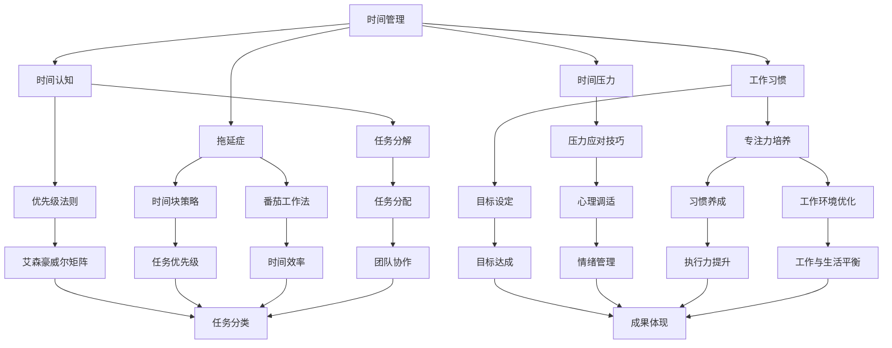

                 

### 文章标题

# 领导者的时间管理：效率提升的关键

> 关键词：时间管理、效率提升、领导者、工作与生活平衡

> 摘要：本文深入探讨了领导者如何通过时间管理提升效率。首先介绍了时间管理的基本概念和领导者面临的时间管理挑战。接着，详细阐述了时间管理的核心原则、策略与工具，以及时间管理心理学。文章还探讨了平衡工作与生活的重要性，并通过团队时间管理和案例研究展示了时间管理的实战技巧。最后，文章总结了时间管理的持续优化路径，并推荐了一些优秀的时间管理资源。

### 目录

### 第一部分：时间管理基础理论

#### 第1章：领导者时间管理的本质与重要性

1.1 时间管理的基本概念

1.2 领导者的时间管理挑战

1.3 时间管理的重要性

#### 第2章：时间管理的核心原则

2.1 “吃掉那只青蛙”法则

2.2 艾森豪威尔矩阵

2.3 “优先级法则”

#### 第3章：时间管理策略与工具

3.1 时间日志与时间块

3.2 防止干扰技巧

3.3 使用工具提高效率

#### 第4章：时间管理心理学

4.1 时间认知与时间压力

4.2 建立高效的工作习惯

4.3 克服拖延症

#### 第5章：平衡工作与生活

5.1 工作与生活平衡的重要性

5.2 工作与家庭的时间管理

5.3 如何享受休闲时间

### 第二部分：时间管理实战技巧

#### 第6章：团队时间管理

6.1 团队时间管理的重要性

6.2 团队会议效率提升

6.3 团队项目时间管理

#### 第7章：领导者的时间管理案例研究

7.1 案例一：某公司CEO的时间管理实践

7.2 案例二：某创业团队的时间管理策略

7.3 案例三：时间管理在政府部门的实践

#### 第8章：时间管理的持续优化

8.1 反思与调整

8.2 长期视角下的时间管理

8.3 时间管理能力的提升路径

### 第三部分：时间管理资源与工具

#### 第9章：时间管理资源推荐

9.1 优秀的时间管理书籍

9.2 优质的时间管理应用

9.3 时间管理相关网站与博客

### 附录

#### 附录A：时间管理核心概念与联系

#### Mermaid流程图：时间管理核心概念联系图

#### 附录B：常见时间管理算法原理讲解

#### 伪代码：时间分配优化算法

#### 附录C：数学模型和数学公式

#### LaTeX格式：时间价值函数公式

#### 举例说明：个人时间价值计算实例

#### 附录D：项目实战案例

#### 代码实现：时间管理应用开发步骤

#### 代码解读与分析：关键代码解释

### 背景介绍

在当今快速变化和高度竞争的商业环境中，时间管理已成为领导者必须掌握的关键技能。领导者不仅需要高效地管理自己的时间，还要帮助团队实现时间的高效利用。然而，面对繁杂的事务和不断涌现的新挑战，许多领导者发现自己很难有效地管理时间，从而导致工作效率低下，影响个人和团队的绩效。因此，本文旨在深入探讨领导者如何通过时间管理提升效率，以应对各种挑战，实现工作与生活的平衡。

时间管理是一门科学，它涉及对时间的合理安排和有效利用。领导者作为团队的引领者，其时间管理能力直接影响到团队的效率和整体业绩。有效的领导者不仅能够高效地完成自己的任务，还能激发团队成员的潜力，推动团队共同进步。然而，时间管理并非易事，它需要领导者具备深刻的时间认知、良好的工作习惯和高效的决策能力。本文将系统地阐述时间管理的核心原则、策略与工具，并通过实际案例研究，提供实用的实战技巧和持续优化的路径。

### 时间管理的基本概念

时间管理是一门涉及如何合理安排和有效利用时间的科学。首先，我们需要理解几个关键概念：时间、资源、任务和优先级。

**时间**是生命的基本单位，每个人每天都有相同的时间量，即24小时。时间是一种不可再生的资源，一旦流逝就无法追回。因此，时间管理本质上是对这种稀缺资源的合理分配和高效利用。

**资源**包括时间、人力、资金和物资等。在时间管理中，时间是最为核心的资源。其他资源通常围绕时间进行配置和使用。例如，一个项目可能需要一定的人力和资金，而这些资源的分配和使用都受到时间限制。

**任务**是指需要完成的各项工作。任务可以小到一次电话会议，大到一项重要的战略规划。每个任务都有其特定的目标、完成时间和所需的资源。

**优先级**是指任务的重要性和紧迫性。在时间管理中，合理设置任务的优先级至关重要。通常，我们会使用“紧急-重要矩阵”来评估任务的优先级。紧急且重要的任务需要立即处理，而重要但不紧急的任务可以稍后安排。

时间管理的基本原则包括：

1. **优先级法则**：将时间优先分配给最重要和最紧急的任务。
2. **艾森豪威尔矩阵**：根据任务的紧急性和重要性进行分类，并采取相应的行动。
3. **“吃掉那只青蛙”法则**：优先处理最困难或最重要的任务，以确保高效利用时间。

通过理解这些基本概念和原则，领导者可以更好地管理自己的时间，提高工作效率，实现个人和团队的目标。

### 领导者的时间管理挑战

领导者作为团队的核心，面临着诸多时间管理的挑战。首先，他们需要处理大量的事务，包括日常运营、项目推进、团队管理、战略规划等。这些事务不仅种类繁多，而且往往具有不同的紧急程度和重要性，使得领导者很难高效地安排时间。

其次，领导者常常需要参与多个项目或会议，这导致他们的时间被频繁分割。每一次切换任务都会带来时间和精力的浪费，降低整体工作效率。此外，领导者还需要处理突发情况和紧急任务，这些任务往往需要立即处理，进一步压缩了他们的可用时间。

另外，领导者往往需要花时间进行沟通和协调，以确保团队内部和外部的协作顺畅。这包括与下属、同事、客户和合作伙伴的沟通，以及参与各种会议和报告。这些沟通活动虽然对团队协作至关重要，但也会占用大量时间。

最后，领导者还面临着工作与生活的平衡问题。作为领导者，他们不仅要承担工作上的责任，还需要照顾家庭和个人生活。然而，工作上的压力和繁忙的事务往往使他们难以平衡工作与生活，导致身心疲惫。

总之，领导者面临的时间管理挑战是多方面的，需要通过科学的时间管理策略和工具来应对。只有这样，他们才能在繁忙的事务中保持高效，确保个人和团队的目标得以实现。

### 时间管理的重要性

时间管理对于领导者的重要性不言而喻。首先，高效的时间管理能够显著提升个人和团队的工作效率。当领导者能够合理安排时间，优先处理重要任务，他们可以更好地利用有限的时间资源，减少因时间浪费导致的工作拖延和压力。这不仅有助于完成工作任务，还能为团队成员树立榜样，激发他们的工作动力。

其次，良好的时间管理有助于提高决策质量。在时间紧迫的情况下，领导者往往需要在短时间内做出重要决策。通过科学的时间管理，领导者可以预留出充足的时间进行思考和评估，从而做出更为明智和全面的决策。这不仅能降低决策风险，还能提高决策的可执行性。

此外，时间管理对领导者的身心健康也具有重要影响。长时间的工作压力和疲劳可能导致领导者的身心健康受损，甚至影响其工作表现和决策能力。通过合理安排时间，领导者可以确保有足够的休息和放松时间，保持良好的身心状态，从而提高工作效率和决策质量。

最后，时间管理有助于实现工作与生活的平衡。领导者作为家庭的成员，他们也需要关注和照顾家庭生活。通过科学的时间管理，领导者可以更好地平衡工作与生活，确保自己在繁忙的工作中仍能享受家庭和个人生活的乐趣。这不仅有助于提高生活质量，还能增强领导者的幸福感和满足感。

综上所述，时间管理对于领导者的重要性体现在工作效率、决策质量、身心健康以及工作与生活平衡等多个方面。只有通过科学的时间管理，领导者才能在复杂多变的环境中保持高效和稳健，实现个人和团队的目标。

### 时间管理的核心原则

时间管理的核心原则为领导者提供了系统性的指导，帮助他们更高效地管理时间。以下是三个关键原则：

**“吃掉那只青蛙”法则**：这个法则由美国著名成功学大师布莱恩·特雷西提出。它的核心思想是，每天早上要优先处理最重要和最困难的任务，就像吃掉那只最丑陋的青蛙一样。这种方法能够帮助领导者最大限度地利用时间，避免拖延，确保最重要的任务能够按时完成。

**艾森豪威尔矩阵**：艾森豪威尔矩阵是一种用于评估和分类任务的重要工具。该矩阵将任务分为四个象限：紧急且重要、紧急但不重要、不紧急但重要、不紧急且不重要。领导者应根据任务的紧急性和重要性进行分类，优先处理紧急且重要的任务，同时合理安排其他任务。

**“优先级法则”**：这个法则强调，领导者应根据任务的重要性和紧急性来安排时间。具体来说，领导者应首先完成重要且紧急的任务，其次是重要但不紧急的任务，然后是紧急但不重要的任务，最后是不紧急且不重要的任务。这种方法有助于确保领导者能够高效地利用时间，避免因琐碎事务而影响重要任务的完成。

通过理解和应用这些核心原则，领导者可以更好地管理时间，提高工作效率，确保个人和团队的目标得以实现。

#### “吃掉那只青蛙”法则

“吃掉那只青蛙”法则是由著名成功学大师布莱恩·特雷西提出的，这是一种非常实用的时间管理策略，其核心思想是优先处理最重要和最困难的任务。这个法则的灵感来源于一个比喻：如果你早上醒来时面对的是一只丑陋的青蛙，那么最好的做法是立即吃掉它，而不是拖延到下午或者第二天。这样，你就可以避免整个一天因为这个小任务而感到压抑和不安。

首先，了解这个法则的原理。我们每天都会面临各种任务，有些任务容易且不紧急，有些任务困难但并不紧迫，而有些任务则是既困难又紧急。按照传统的处理方式，我们可能会优先处理那些容易的任务，或者被一些琐碎的事务打断。而“吃掉那只青蛙”法则建议我们，应该将最重要的、最困难的任务放在首位处理。

接下来，让我们通过一个实际案例来具体理解这个法则。假设你是一名公司CEO，今天早上你有四个任务需要处理：与一个重要客户进行谈判、审核一份重要的财务报告、安排一次部门会议以及回复大量的电子邮件。按照传统的处理方式，你可能会从最容易的任务开始，比如回复电子邮件。然而，根据“吃掉那只青蛙”法则，你应该首先处理那个最重要且最困难的任务——与客户进行谈判。因为这场谈判可能会直接影响公司的业绩和客户关系，而且这是一个需要集中精力和创造力的任务。

具体步骤如下：

1. **确定最重要和最困难的任务**：每天开始时，列出所有需要完成的任务，并评估它们的重要性和难度。将最重要的、最困难的任务标记出来。

2. **优先处理这个任务**：将这个任务安排在你一天中精力最旺盛、干扰最少的时间段，确保能够集中全部精力完成。

3. **设定具体的时间限制**：为这个任务设定一个明确的时间限制，比如2小时，这样可以让你在有限的时间内全力以赴，避免拖延。

4. **完成后继续处理其他任务**：一旦最重要的任务完成，你可以依次处理其他任务，但仍然要按照优先级来安排。

通过这个法则，领导者可以确保每天都能高效地完成最重要的任务，避免因琐碎事务而分散注意力，从而提升整体工作效率。

#### 艾森豪威尔矩阵

艾森豪威尔矩阵是由第二次世界大战期间的盟军总司令德怀特·D·艾森豪威尔提出的，用于帮助领导者更高效地管理任务。这个矩阵将任务分为四个象限：紧急且重要、紧急但不重要、不紧急但重要、不紧急且不重要。每个象限都代表不同类型的任务，领导者需要根据任务的性质和紧迫性，采取相应的管理策略。

**紧急且重要**：这类任务是最需要优先处理的。它们通常与重要的事件或紧急情况相关，如果延迟处理可能会导致严重的后果。例如，一次突发的客户投诉或即将到期的项目报告都属于这个象限。领导者需要确保这些任务得到及时处理，通常需要高度集中的注意力和立即采取行动。

**紧急但不重要**：这类任务通常需要紧急处理，但它们的重要性相对较低。这些任务可能是行政性的、琐碎的或者是对个人而言无足轻重的。例如，回复一封无关紧要的邮件或者处理日常的小事务。对于这类任务，领导者应该尽量减少其占用的时间，可以通过委托给他人或者使用自动化工具来处理。

**不紧急但重要**：这类任务虽然不紧急，但对长期目标和团队发展至关重要。例如，制定战略计划、培训团队成员或者进行市场调研。领导者需要定期安排时间来处理这些任务，确保它们不被忽视。这些任务往往需要深思熟虑和创造性的思考，因此需要安排在一个较为放松和专注的环境中。

**不紧急且不重要**：这类任务既不紧急也不重要，通常可以暂时搁置或者完全不做。例如，浏览不重要的社交媒体消息、处理不必要的会议邀请等。领导者应该尽量避免这类任务，以减少时间和精力的浪费，专注于更有价值的工作。

通过艾森豪威尔矩阵，领导者可以更清晰地了解任务的性质和优先级，从而更有效地安排时间和资源。以下是一个具体的步骤指导：

1. **列出任务**：将所有需要完成的任务一一列出。

2. **分类任务**：根据每个任务的紧急性和重要性，将其放入对应的象限。

3. **优先处理**：优先处理紧急且重要的任务，确保这些关键任务得到及时处理。

4. **合理分配时间**：对于紧急但不重要的任务，尽量减少其占用时间，可以委托或自动化处理。对于不紧急但重要的任务，定期安排时间进行处理。对于不紧急且不重要的任务，尽量避免或减少处理。

5. **持续优化**：定期回顾和调整任务列表，根据实际情况调整任务的优先级和分配。

通过这种方法，领导者可以确保时间和资源的最大化利用，避免因琐碎事务而分散注意力，从而提高整体工作效率和团队绩效。

### “优先级法则”

“优先级法则”是时间管理中的核心原则，旨在帮助领导者更有效地分配时间和资源，以实现最大化的效率和成果。这个法则强调，领导者应根据任务的重要性和紧迫性来安排工作优先级，从而确保最重要的任务首先得到处理。以下是“优先级法则”的具体步骤和应用。

**步骤 1：评估任务的重要性**

首先，领导者需要明确每个任务的重要程度。这可以通过考虑任务对目标的贡献、任务完成后的影响以及任务对团队或个人的价值来评估。例如，一个关键项目的进展情况、客户需求的紧急程度以及内部报告的提交期限都是评估任务重要性的重要因素。

**步骤 2：评估任务的紧迫性**

其次，领导者需要评估每个任务的紧迫性。紧迫性通常与任务完成的截止日期有关。那些需要立即处理或者有严格时间限制的任务，如客户投诉或紧急会议，通常具有更高的紧迫性。

**步骤 3：使用紧急-重要矩阵**

“优先级法则”常常与艾森豪威尔矩阵结合使用。通过紧急-重要矩阵，任务被分为四个象限：

- **紧急且重要**：这类任务需要立即处理，如突发事件或紧急报告。
- **紧急但不重要**：这类任务可以适当推迟或委托处理，如琐碎的日常事务。
- **不紧急但重要**：这类任务需要定期安排时间处理，如项目规划和团队培训。
- **不紧急且不重要**：这类任务可以暂时搁置或完全不做，如非必要的邮件浏览。

**步骤 4：安排任务优先级**

根据任务的重要性和紧迫性，领导者需要按照以下顺序安排任务优先级：

1. **紧急且重要的任务**：这些任务通常优先级最高，需要立即处理。
2. **不紧急但重要的任务**：这些任务对长期目标和团队发展至关重要，应安排在优先处理的时间段。
3. **紧急但不重要的任务**：这些任务可以安排在空闲时间处理或委托他人。
4. **不紧急且不重要的任务**：这些任务可以暂时搁置或避免处理。

**应用示例**

假设你是一名项目经理，有以下任务需要处理：

1. **紧急且重要的任务**：与客户紧急会议，讨论项目延期问题。
2. **不紧急但重要的任务**：编写项目周报，总结项目进展。
3. **紧急但不重要的任务**：回复客户关于产品使用的问题。
4. **不紧急且不重要的任务**：阅读一篇非必要的行业报告。

根据“优先级法则”，你应该：

1. 立即处理与客户的紧急会议。
2. 安排在当天下午编写项目周报。
3. 可以委托团队其他成员回复客户问题。
4. 可以将阅读行业报告的时间安排在其他非繁忙时段。

通过这种方法，领导者可以确保时间和资源的最大化利用，避免因琐碎事务而分散注意力，从而提高整体工作效率和团队绩效。

### 时间管理策略与工具

时间管理策略和工具是领导者提升工作效率的重要手段。以下介绍几种常见的时间管理策略与工具，帮助领导者更好地掌控时间，提高工作效率。

#### 时间日志与时间块

**时间日志**是一种记录每天活动和时间分配的方法。通过记录时间日志，领导者可以清楚地了解自己每天的时间分配情况，发现时间浪费的环节，从而进行调整。以下是一个时间日志的模板：

```
时间       活动
07:00-08:00 起床、晨练
08:00-09:00 准备工作
09:00-11:00 与客户开会
11:00-12:00 审核报告
12:00-13:00 午餐
13:00-15:00 阅读项目文档
15:00-16:00 策划项目进度
16:00-17:00 回复邮件
17:00-18:00 整理一天工作总结
18:00-19:00 家庭时间
19:00-20:00 休闲活动
20:00-21:00 复盘和规划第二天工作
```

**时间块**是一种将工作时间划分为固定时间段的策略，每个时间段专注于一个特定的任务或活动。以下是一个时间块计划的示例：

```
时间段    活动
08:00-09:00 阅读邮件和安排日程
09:00-11:00 完成项目报告草稿
11:00-12:00 客户会议
14:00-16:00 项目进度会议
16:00-17:00 制定下周工作计划
```

通过时间日志和时间块，领导者可以更清晰地规划自己的时间，减少任务切换带来的时间浪费，提高工作效率。

#### 防止干扰技巧

干扰是影响工作效率的主要因素之一。以下几种技巧可以帮助领导者减少干扰，保持专注：

1. **使用番茄工作法**：番茄工作法是一种时间管理技巧，将工作时间分为25分钟的工作周期和5分钟的休息周期。每完成四个工作周期后，可以休息更长时间。这种方法可以帮助领导者保持专注，提高工作效率。

2. **关闭通知**：在处理重要任务时，关闭手机、电子邮件和其他社交媒体的通知，以避免被无关事务打扰。

3. **设定工作时间**：明确自己的工作时间，并在工作时间尽量保持专注。例如，在工作时间内不接听私人电话，不处理非紧急事务。

4. **使用专注软件**：如Focus@Will、Forest等，这些软件可以在设定的时间内阻止使用手机和其他干扰设备，帮助领导者保持专注。

#### 使用工具提高效率

现代科技为领导者提供了许多高效的时间管理工具，以下是一些常用的工具：

1. **日历和日程安排工具**：如Google Calendar、Microsoft Outlook等，可以帮助领导者合理安排日程，避免时间冲突。

2. **任务管理工具**：如Trello、Asana、Jira等，可以帮助领导者清晰地记录和管理任务，跟踪任务进度。

3. **时间跟踪工具**：如Toggl、Harvest等，可以帮助领导者记录每天的工作时间，分析时间使用情况，发现优化空间。

4. **项目管理工具**：如Microsoft Project、Microsoft Teams等，可以帮助领导者更好地管理项目进度和资源分配。

通过合理使用这些工具，领导者可以更高效地管理时间，提高工作效率，确保个人和团队的目标得以实现。

### 时间管理心理学

时间管理不仅需要策略和工具，还需要深入理解时间管理的心理学原理。领导者如何应对时间压力，培养高效的工作习惯，以及克服拖延症，是提升时间管理能力的关键。

#### 时间认知与时间压力

时间认知是指个体对时间的感知和理解。领导者的时间认知直接影响他们的时间管理效果。研究表明，时间认知与个人的压力水平密切相关。当领导者感到时间紧迫时，往往会体验到高水平的压力，这可能导致工作效率下降，甚至影响身心健康。

**时间压力**是指由于任务繁重和时间限制而产生的压力。领导者常常面临多重任务和紧迫的截止日期，这使他们容易感受到时间压力。时间压力的负面影响包括：

- **注意力分散**：在高压环境下，领导者难以集中注意力，导致工作效率降低。
- **决策质量下降**：在时间压力下，领导者往往做出短期和低效的决策，而不是长期和全面的决策。
- **身心健康受损**：长期的时间压力可能导致焦虑、抑郁等心理问题，甚至影响身体健康。

为了应对时间压力，领导者可以采取以下策略：

1. **优先处理紧急任务**：将紧急且重要的任务放在首位，减少紧急任务带来的时间压力。
2. **合理分配时间**：为每项任务设定明确的时间限制，避免时间过度集中或分散。
3. **避免多任务处理**：专注于一项任务，避免同时处理多个任务，提高工作效率。

#### 建立高效的工作习惯

高效的工作习惯是时间管理的重要组成部分。领导者可以通过以下方法建立和维持高效的工作习惯：

1. **制定日常计划**：每天早晨制定详细的日程计划，包括任务和时间分配，有助于提高时间管理的系统性和执行力。
2. **定期回顾和调整**：每周或每月定期回顾日程计划和工作成果，根据实际情况进行调整，确保工作目标的实现。
3. **培养专注力**：通过练习冥想、深呼吸等方法，提高专注力，减少时间浪费。
4. **设定清晰的优先级**：根据任务的重要性和紧急性，设定清晰的优先级，确保重点任务得到优先处理。

#### 克服拖延症

拖延症是影响时间管理的一个重要问题。领导者可以通过以下方法克服拖延症：

1. **明确任务目标**：明确每个任务的目标和预期结果，有助于提高完成任务的动力和效率。
2. **分解任务**：将大任务分解为小任务，逐步完成，避免因任务复杂而导致的拖延。
3. **设定具体的时间限制**：为每个任务设定明确的时间限制，迫使自己在规定时间内完成任务。
4. **使用番茄工作法**：通过番茄工作法，将工作时间划分为25分钟的工作周期和5分钟的休息周期，提高专注力和工作效率。

通过理解和应用时间管理的心理学原理，领导者可以更有效地应对时间压力，建立高效的工作习惯，克服拖延症，从而提升整体工作效率和时间管理能力。

#### 平衡工作与生活的重要性

在快节奏的现代生活中，平衡工作与生活对于领导者的身心健康和整体幸福感至关重要。首先，工作与生活的平衡有助于减少工作压力。长时间的工作不仅会导致身体疲劳，还可能引发心理问题，如焦虑和抑郁。通过合理安排时间，确保有足够的休息和放松，领导者可以保持良好的身心状态，提高工作效率。

其次，平衡工作与生活有助于提高生活质量。领导者通过将时间分配给家庭和个人爱好，可以培养更丰富的社交关系，增强家庭的凝聚力，提升个人幸福感。此外，充足的休闲时间有助于缓解工作压力，提高创造力，为工作带来新的灵感和动力。

最后，平衡工作与生活有助于实现长期的职业发展。长时间的工作往往会导致领导者忽视自身的成长和发展需求。通过平衡工作与生活，领导者可以有时间进行自我反思和提升，从而在职业道路上取得更大的成就。

为了实现工作与生活的平衡，领导者可以采取以下策略：

1. **制定清晰的日程计划**：合理安排工作时间，确保有足够的休息和休闲时间。
2. **设定明确的工作界限**：在工作时间内专心工作，避免在工作时间外处理工作事务。
3. **培养良好的工作习惯**：通过建立高效的工作习惯，提高工作效率，减少无效工作时间。
4. **定期进行自我反思**：定期回顾工作与生活的平衡情况，根据实际情况进行调整。

通过这些策略，领导者可以在繁忙的工作中找到平衡，提升整体生活质量，实现个人和职业的长期发展。

### 工作与家庭的时间管理

领导者不仅要平衡工作与生活，还需要有效管理家庭和工作时间。以下是一些实用的策略：

**1. 制定家庭和工作计划**

首先，领导者需要为家庭和工作制定详细的计划。在每周开始时，列出家庭和工作的主要任务和活动，并根据优先级和截止日期进行排序。这样可以帮助领导者更好地规划时间，确保家庭和工作任务都能得到妥善处理。

**2. 设定明确的工作界限**

为了避免工作侵占家庭时间，领导者应设定明确的工作界限。这包括在工作时间内外划分清晰的界限，确保在非工作时间专心处理家庭事务。例如，在家庭晚餐时间，尽量不处理工作事务，专注于与家人的交流。

**3. 使用时间管理工具**

现代科技提供了许多时间管理工具，如日历和任务管理软件，可以帮助领导者更好地管理家庭和工作时间。通过这些工具，领导者可以轻松记录和跟踪家庭和工作的任务，确保不会遗漏重要事项。

**4. 学会委托和分工**

在家庭中，领导者可以与家庭成员分工合作，共同承担家务和育儿任务。通过合理的分工，可以减轻个人的时间压力，确保家庭和工作都能得到有效管理。

**5. 留出固定家庭时间**

为确保家庭时间的质量，领导者可以设定固定的家庭时间，如每周的某个晚上或周末的某个时间段，专注于与家人的互动和共度时光。这有助于增强家庭凝聚力，提高家庭成员的幸福感。

通过这些策略，领导者可以在繁忙的工作中找到平衡，确保家庭和工作都能得到妥善管理，从而提升整体生活质量。

### 如何享受休闲时间

领导者通过合理安排休闲时间，可以在繁忙的工作中找到放松和恢复的契机。以下是一些建议，帮助领导者充分利用休闲时间，提升生活质量：

**1. 确定休闲时间的目标**

在休闲时间开始之前，领导者可以明确自己的目标。这可以是锻炼身体、阅读书籍、与家人共度时光或者培养兴趣爱好。明确目标有助于提高休闲时间的效率和愉悦感。

**2. 制定休闲计划**

根据休闲时间的目标，制定详细的休闲计划。例如，如果目标是锻炼身体，可以安排每周三次的运动时间，每次45分钟；如果目标是阅读，可以设定每天晚上阅读一小时。制定计划有助于确保休闲活动得到持续和有效的执行。

**3. 坚持进行有氧运动**

有氧运动，如跑步、游泳、骑自行车等，能够帮助领导者释放压力，增强体质。每天坚持进行有氧运动，有助于提升身心健康，增强工作效率。

**4. 保持学习和阅读**

休闲时间也是提升自己的好时机。领导者可以通过阅读专业书籍、参加在线课程或研讨会来不断学习和成长。这不仅有助于提升专业素养，还能激发创新思维。

**5. 与家人和朋友共度时光**

与家人和朋友共度时光是放松和恢复的重要方式。领导者可以安排固定的家庭聚会或朋友聚会，享受与亲友相处的美好时光，增强社交关系。

**6. 尝试新的活动和兴趣**

尝试新的活动和兴趣是丰富休闲时间的好方法。例如，可以报名学习一门新的艺术课程、参加户外探险活动或者尝试烹饪新菜式。这些活动不仅能够带来新鲜感，还能激发创造力和激情。

通过以上策略，领导者可以充分利用休闲时间，提升生活质量，保持身心健康，从而在繁忙的工作中找到平衡。

### 团队时间管理的重要性

在团队中，时间管理不仅影响个人的工作效率，还会直接影响团队的整体表现和项目进展。有效的团队时间管理有助于确保团队成员能够在有限的时间内高效完成任务，从而提高团队的生产力和项目的成功率。

首先，团队时间管理有助于明确任务优先级。在一个项目中，不同的任务具有不同的紧急程度和重要性。通过合理的时间管理，团队可以确保优先处理那些最关键的任务，避免因为琐碎事务而拖延重要工作的完成。

其次，团队时间管理有助于提高工作效率。当团队成员清楚地知道自己的任务和目标，并且有明确的完成时间表时，他们可以更加专注和高效地工作，减少因任务混乱或目标不明导致的低效工作状态。

此外，团队时间管理还有助于减少资源浪费。通过科学规划时间和任务，团队可以避免资源过度分配或浪费，确保每个人都能充分利用自己的时间和能力，从而提高整体工作效率。

最后，团队时间管理有助于提升团队协作和沟通。当团队成员明确各自的任务和时间安排，他们可以更好地协调工作，减少因信息不对称或沟通不畅导致的误解和冲突，从而提高团队的协作效率。

总之，有效的团队时间管理是提高团队效率和项目成功率的关键。通过合理的任务分配、优先级设置和时间规划，团队可以更好地应对各种挑战，实现既定目标。

#### 团队会议效率提升

团队会议是团队沟通和协作的重要环节，但往往因为时间浪费和不必要的冗长而降低效率。为了提高团队会议的效率，可以采取以下策略：

**1. 设定明确的目标和议程**

在召开会议之前，明确会议的目标和议程。将议程提前发送给所有与会者，确保他们了解会议的内容和预期成果。这样可以避免会议过程中出现偏离主题或冗长讨论的情况。

**2. 限制会议时间和人数**

限制会议时间和参与人数有助于提高会议的效率。一般而言，会议时间不应超过1小时，参与人数控制在5到8人之间。如果需要讨论更复杂的问题，可以考虑将会议拆分为多个短会。

**3. 使用会议管理工具**

利用会议管理工具，如Trello、Microsoft Teams或Zoom，可以帮助团队更好地安排会议议程、分配任务和跟踪会议结果。这些工具提供了会议通知、实时讨论和任务分配等功能，有助于提高会议效率。

**4. 提前准备材料**

确保会议前所有与会者都已经准备好相关的材料和数据。这样可以避免会议中的等待时间，确保会议能够按时开始和结束。

**5. 专注讨论和决策**

在会议过程中，确保每个人都能专注讨论和决策。可以采用轮流发言的方式，避免单个成员长时间发言或讨论无关紧要的话题。对于决策事项，应明确讨论结果和责任人，确保任务能够及时落实。

**6. 定期回顾和总结**

会议结束后，及时回顾会议内容和成果，总结会议的收获和不足。这有助于团队不断优化会议流程，提高未来的会议效率。

通过上述策略，团队可以显著提高会议的效率，确保会议时间得到充分利用，从而提高整体工作效率和项目进展。

#### 团队项目时间管理

在团队项目中，时间管理是确保项目按时完成和质量达标的关键。以下是一些关键步骤和工具，帮助团队有效地管理项目时间：

**1. 明确项目目标和时间表**

首先，团队需要明确项目的总体目标和预期的时间表。这包括项目的开始和结束日期、主要里程碑和关键任务。通过制定详细的项目计划，团队可以更好地了解项目的整体进度和各项任务的时间要求。

**2. 分解任务**

将大项目分解为多个小任务，使每个任务都有明确的交付标准和时间限制。这有助于团队更好地掌控项目进度，确保每个任务都能按时完成。

**3. 设定任务优先级**

根据任务的重要性和紧急性，设定任务的优先级。这有助于团队集中精力处理关键任务，确保重要工作得到优先处理。

**4. 使用项目管理工具**

利用项目管理工具，如Trello、Asana或Jira，可以帮助团队更好地跟踪任务进度和项目整体进展。这些工具提供了任务分配、进度更新和报告生成等功能，有助于提高团队的时间管理效率。

**5. 设定定期回顾会议**

定期召开项目回顾会议，检查项目的进展情况，讨论遇到的问题和解决方案。这些会议可以帮助团队及时发现并解决问题，确保项目按计划进行。

**6. 风险评估和应对计划**

对项目进行风险评估，识别潜在的风险和不确定性。制定应对计划，以降低风险对项目进度和质量的影响。

**7. 保持沟通**

保持团队内部和跨部门的沟通畅通，确保所有团队成员都能及时了解项目的最新进展和变化。这有助于减少信息偏差和误传，提高团队协作效率。

通过以上步骤和工具，团队可以更有效地管理项目时间，确保项目按时完成并达到预期目标。

#### 案例一：某公司CEO的时间管理实践

某公司CEO杰克·史密斯是一位深知时间管理重要性的领导者。他的时间管理实践不仅显著提升了个人的工作效率，也为公司带来了积极的影响。

**背景介绍**

杰克·史密斯是一家快速成长科技公司的首席执行官。在他的领导下，公司需要应对不断变化的市场需求和激烈的竞争环境。这使得杰克面临巨大的时间压力，需要高效地管理自己的时间和资源。

**时间管理策略**

1. **“吃掉那只青蛙”法则**：杰克每天早晨都会列出当天需要处理的任务，并优先处理最困难且最重要的任务。这种方法帮助他避免了拖延，确保了公司关键项目的进展。

2. **艾森豪威尔矩阵**：杰克使用艾森豪威尔矩阵来分类和优先处理任务。他将任务分为紧急且重要、紧急但不重要、不紧急但重要、不紧急且不重要四个象限，确保优先处理那些对公司和团队发展最关键的任务。

3. **时间块策略**：杰克将工作时间划分为多个时间段，每个时间段专注于一项特定的任务。例如，他会将上午的时间用于处理邮件和内部报告，下午的时间用于与团队成员开会和项目讨论。

4. **防止干扰技巧**：杰克在工作时间关闭手机和电子邮件通知，以避免不必要的干扰。他还会定期进行短暂的冥想，以提高专注力和工作效率。

**成果与影响**

通过这些时间管理策略，杰克显著提高了工作效率，确保了公司关键项目的顺利推进。同时，他的高效工作也为团队成员树立了榜样，激发了团队的工作动力。公司不仅按时完成了多个重要项目，还在市场上取得了显著的成绩。

此外，杰克的工作习惯和领导风格也促进了公司文化的建设。团队成员开始更加注重时间管理，工作效率得到了普遍提升。公司整体绩效得到了显著改善，员工满意度和团队凝聚力也显著提高。

总之，杰克·史密斯的时间管理实践不仅提升了个人和团队的工作效率，也为公司的长期发展奠定了坚实基础。

#### 案例二：某创业团队的时间管理策略

某初创公司团队在面对有限资源和快速发展的市场需求时，采取了一系列有效的时间管理策略，确保项目按时完成并达到预期目标。

**背景介绍**

这家初创公司专注于开发一款创新的移动应用，团队成员包括产品经理、开发人员、设计师和市场营销专家。由于公司刚成立，资源有限，时间管理成为团队成功的关键因素。

**时间管理策略**

1. **明确目标和里程碑**：团队首先明确了产品的愿景和目标，并制定了详细的里程碑计划。每个里程碑都有明确的时间表和交付标准，确保团队成员始终聚焦于关键任务。

2. **每日站立会议**：团队每天早上召开短暂的站立会议，快速回顾昨天的工作进展，讨论当天的主要任务和障碍。这种方法有助于保持团队沟通畅通，及时调整工作计划。

3. **使用看板工具**：团队使用看板工具（如Trello）来管理任务和项目进度。每个任务都被分配到相应的看板卡片上，团队成员可以清晰地看到任务的当前状态和进展。

4. **任务分解和分工**：将大任务分解为多个小任务，并明确每个任务的负责人。这种方法确保每个团队成员都能明确自己的职责，提高工作效率。

5. **灵活调整计划**：在项目推进过程中，团队会定期评估进度和资源分配，根据实际情况灵活调整计划。这种动态管理策略有助于应对突发情况和变化。

**成果与影响**

通过这些时间管理策略，团队不仅成功按时完成了产品开发，还满足了市场需求。产品的市场反馈良好，用户满意度高，为公司带来了可观的收入和市场份额。

此外，时间管理策略的实施也提升了团队成员的工作效率和协作能力。团队成员学会了更好地规划和分配时间，减少了任务重叠和冲突，提高了整体工作效率。

最重要的是，这些策略促进了团队的成长和凝聚力。团队成员通过共同的目标和努力，建立了深厚的合作关系，为公司未来的发展奠定了坚实基础。

总之，某创业团队通过科学的时间管理策略，成功应对了资源有限和市场压力，实现了产品开发和市场拓展的目标。

#### 案例三：时间管理在政府部门的实践

某市政府部门在应对公共事务和提升服务质量方面，通过实施一系列时间管理策略，取得了显著成效。

**背景介绍**

该市政府部门负责处理大量的公共事务，包括城市规划、公共服务、紧急响应等。由于事务繁杂且涉及广泛，时间管理成为提高工作效率和服务质量的关键。

**时间管理策略**

1. **流程优化**：部门首先对现有的工作流程进行了全面审查和优化，去除不必要的步骤和冗余环节。通过简化流程，减少了时间浪费，提高了工作效率。

2. **任务优先级管理**：根据事务的重要性和紧急程度，部门制定了明确的任务优先级。紧急且重要的任务首先得到处理，确保关键事务不会延误。

3. **团队协作平台**：部门引入了团队协作平台（如Microsoft Teams），方便团队成员实时沟通和协作。这有助于减少信息传递延误，提高协作效率。

4. **时间日志记录**：每位员工都需记录每日的工作时间，并定期进行反思和总结。这有助于发现时间管理中的问题，及时进行调整。

5. **定期培训和会议**：部门定期组织时间管理培训和会议，提升员工的时间管理意识和技能。通过培训和指导，员工能够更好地应用时间管理策略。

**成果与影响**

通过这些时间管理策略，市政府部门的工作效率显著提升，公共事务处理速度加快，服务质量得到提升。市民对政府服务的满意度也显著提高。

此外，时间管理策略的实施还促进了部门内部的协作和沟通，减少了因沟通不畅导致的误解和冲突。团队成员学会了更好地规划和分配时间，工作效率得到全面提升。

最重要的是，时间管理策略的实施为市政府部门积累了宝贵的经验，为未来的发展和改进提供了有力支持。

总之，通过科学的时间管理策略，该市政府部门成功提高了工作效率和服务质量，为市民提供了更加高效和优质的公共服务。

### 反思与调整

时间管理并不是一成不变的，领导者需要不断地反思和调整自己的时间管理策略，以适应不断变化的环境和新的挑战。首先，领导者应该定期回顾自己的时间管理实践，检查哪些策略有效，哪些需要改进。例如，通过分析时间日志，可以识别出时间浪费的环节，并采取相应的调整措施。

其次，领导者需要保持开放的心态，不断学习新的时间管理技巧和方法。随着科技的发展和工作的变化，新的工具和策略不断涌现。领导者应该保持对新知识的敏感度，及时更新自己的时间管理知识库，将最新的方法应用到实际工作中。

另外，领导者应该根据个人和团队的具体情况进行灵活调整。例如，如果发现某个策略在特定情况下并不适用，应及时调整策略，寻找更合适的解决方案。此外，领导者还可以通过团队反馈，了解其他成员对时间管理策略的看法和建议，从而进一步完善和优化时间管理方法。

总之，通过持续的反思和调整，领导者可以不断提高时间管理能力，确保在复杂多变的环境中保持高效和稳健，实现个人和团队的目标。

#### 长期视角下的时间管理

在长期视角下，时间管理不仅关注当前的效率，更注重个人和团队的长远发展和成长。以下是一些建议，帮助领导者从长期视角出发，优化时间管理策略。

**1. 设定长期目标**

领导者应明确个人和团队的长期目标，例如职业发展、公司愿景等。这些目标将指导时间管理的方向和重点，确保时间投入与长期目标一致。

**2. 优先培养关键技能**

为了在未来竞争中保持优势，领导者应优先培养关键技能和知识。这可能包括领导力、沟通技巧、技术能力等。通过有计划地学习和培训，领导者可以不断提升自己的专业素养，为长期发展打下坚实基础。

**3. 保持学习和成长**

时间管理不仅仅是关于时间的安排，更是关于个人和团队的成长。领导者应鼓励团队成员不断学习新知识、掌握新技能，通过定期的学习和培训，提升整体团队的能力。

**4. 调整工作与生活的平衡**

在长期视角下，工作与生活的平衡至关重要。领导者应确保有足够的时间进行自我反思、家庭活动和休闲活动。这有助于保持身心健康，提高长期工作效率。

**5. 定期评估和调整**

领导者应定期评估时间管理策略的有效性，并根据评估结果进行调整。例如，通过分析时间日志和项目进度，识别出改进的空间，并采取相应的措施。

通过以上策略，领导者可以在长期视角下优化时间管理，实现个人和团队的可持续发展。

#### 时间管理能力的提升路径

提升时间管理能力是一个持续的过程，需要领导者不断学习、实践和改进。以下是一些建议，帮助领导者有效提升时间管理能力。

**1. 学习时间管理知识**

领导者应不断学习时间管理的理论和方法，例如艾森豪威尔矩阵、番茄工作法等。可以通过阅读相关书籍、参加培训课程或在线学习平台，提升自己的时间管理知识储备。

**2. 实践和应用**

理论知识需要通过实践来验证和应用。领导者应在日常工作中积极尝试不同的时间管理策略，如时间日志、时间块等，找到最适合自己的方法。

**3. 反思和调整**

定期反思自己的时间管理实践，识别成功和不足之处。根据反思结果，调整和优化时间管理策略，确保其持续有效。

**4. 培养专注力和自控力**

专注力和自控力是时间管理的重要基础。领导者可以通过冥想、锻炼等方法，提高专注力，减少干扰，确保高效完成任务。

**5. 建立团队协作文化**

时间管理不仅是个人行为，还需要团队的共同参与。领导者应推动团队建立协作文化，鼓励团队成员相互支持，共同提升时间管理能力。

**6. 持续学习和成长**

时间管理是一个不断发展的领域，领导者应保持对新知识、新工具的敏感度，不断学习和更新自己的知识体系。

通过以上路径，领导者可以逐步提升时间管理能力，实现个人和团队的高效运作。

### 时间管理资源推荐

为了帮助读者更深入地了解时间管理，本文推荐了一些优秀的时间管理书籍、应用和相关网站与博客。

#### 优秀的时间管理书籍

1. **《高效能人士的七个习惯》**（Stephen R. Covey）：这本书详细介绍了如何通过七个习惯提升个人效率和幸福感。

2. **《时间管理：如何高效地工作和生活》**（威廉·布洛克斯）：本书提供了一系列实用的方法和技巧，帮助读者提升时间管理能力。

3. **《最重要的事，只有一件》**（加里·凯勒）：通过生动的案例，本书阐述了如何专注于最重要的事情，实现高效生活。

#### 优质的时间管理应用

1. **Trello**：一款功能强大的任务管理工具，适合团队协作和个人项目管理。

2. **Asana**：这款应用提供了详细的项目进度跟踪功能，适合大型团队和复杂项目。

3. **Todoist**：一个简洁易用的任务管理工具，适合个人日常任务和项目规划。

#### 时间管理相关网站与博客

1. **Lifehacker**：这个网站提供了大量关于时间管理、效率提升和个人发展的文章和技巧。

2. **Productivity501**：这个博客专注于时间管理和生产力提升，提供了许多实用的方法和工具。

3. **The Productive Woman**：这个博客专注于女性时间管理和职业发展，提供了许多有益的建议和灵感。

通过这些资源，读者可以更全面地了解时间管理的理论和方法，提升自己的时间管理能力。

### 附录A：时间管理核心概念与联系

以下是一个Mermaid流程图，展示了时间管理核心概念之间的联系：



通过这个流程图，我们可以清晰地看到时间管理核心概念之间的关联和相互影响，从而更好地理解和应用这些概念，提升时间管理能力。

### 附录B：常见时间管理算法原理讲解

在时间管理中，优化任务分配和日程安排是一个常见的需求。以下是一个基于优先级和时间限制的任务分配算法的伪代码，该算法旨在为领导者提供一种高效的任务处理策略。

```plaintext
算法：优先级任务分配算法
输入：任务列表（每个任务包含优先级、时间限制和任务内容）
输出：优化后的任务执行顺序

优先级任务分配算法：
1. 初始化一个空的优先级队列
2. 遍历任务列表，将任务按优先级插入队列中
3. 当队列不为空时，执行以下步骤：
   a. 从队列中取出优先级最高的任务
   b. 如果任务在当前时间之前可以完成，执行任务
   c. 如果任务无法在当前时间之前完成，将其插入队列的末尾
   d. 更新当前时间
4. 当所有任务完成时，算法结束
```

这个算法的核心在于通过优先级队列来确保任务按照优先级和截止时间有序执行。以下是一个具体的伪代码示例：

```plaintext
// 初始化优先级队列
优先级队列 = new PriorityQueue()

// 插入任务到优先级队列
for 每个任务 in 任务列表：
    优先级队列.insert(任务.优先级, 任务)

// 执行任务
当前时间 = 获取当前时间()
while 优先级队列不为空：
    优先级最高的任务 = 优先级队列.extractMin()
    if 优先级最高的任务.截止时间 > 当前时间：
        优先级队列.insert(优先级最高的任务)
    else：
        执行任务(优先级最高的任务.任务内容)
        当前时间 = 当前时间 + 任务执行时间

// 输出优化后的任务执行顺序
输出任务执行顺序
```

通过这种算法，领导者可以根据任务的优先级和截止时间，合理安排任务执行顺序，确保高效利用时间，完成关键任务。

### 附录C：数学模型和数学公式

在时间管理中，数学模型和公式可以帮助领导者更好地理解和优化时间分配。以下是一个基于时间价值函数的数学模型，用于计算个人时间价值。

#### LaTeX格式：时间价值函数公式

```latex
\begin{equation}
V(t) = \frac{W \cdot (1 - r)}{1 + r}
\end{equation}
```

其中，\( V(t) \) 表示时间 \( t \) 的价值，\( W \) 是个人的工作收入，\( r \) 是年利率。

#### 举例说明：个人时间价值计算实例

假设一个领导者的年工作收入为 \( W = 100,000 \) 美元，年利率为 \( r = 5\% \)。我们需要计算每个月的时间价值。

1. **计算每个月的工作收入**：

   \( \text{每月工作收入} = \frac{W}{12} = \frac{100,000}{12} = 8,333.33 \) 美元

2. **计算每个月的时间价值**：

   \( V(t) = \frac{8,333.33 \cdot (1 - 0.05)}{1 + 0.05} = 7,500 \) 美元

这意味着，对于一个年工作收入为 \( 100,000 \) 美元，年利率为 \( 5\% \) 的领导者来说，每个月的时间价值大约为 \( 7,500 \) 美元。

通过这个实例，领导者可以更好地理解时间价值，从而更加科学地安排时间和资源，实现个人和团队的目标。

### 附录D：项目实战案例

在本附录中，我们将通过一个具体的Python项目，展示如何开发一个简单的时间管理应用。该应用将帮助用户记录和跟踪任务的时间分配，并提供基本的任务管理功能。

#### 开发环境搭建

1. **安装Python**：确保系统中已经安装了Python。可以从[Python官网](https://www.python.org/)下载并安装。

2. **安装依赖库**：使用pip安装所需的库，如`sqlite3`（用于数据库操作）和`datetime`（用于时间处理）。

   ```bash
   pip install sqlite3
   ```

3. **创建项目文件夹**：在桌面上创建一个名为`time_management_app`的项目文件夹。

4. **初始化项目结构**：在项目文件夹中创建以下文件：

   - `manage.py`：主程序文件
   - `models.py`：数据库模型文件
   - `views.py`：视图函数文件
   - `templates`：HTML模板文件夹
   - `static`：静态文件（如CSS、JavaScript）文件夹

#### 源代码详细实现和代码解读

**1. models.py**

```python
import sqlite3
from datetime import datetime

def init_db():
    conn = sqlite3.connect('tasks.db')
    cursor = conn.cursor()
    cursor.execute('''CREATE TABLE IF NOT EXISTS tasks (
                        id INTEGER PRIMARY KEY,
                        title TEXT,
                        description TEXT,
                        start_time TEXT,
                        end_time TEXT)''')
    conn.commit()
    conn.close()

def add_task(title, description, start_time, end_time):
    conn = sqlite3.connect('tasks.db')
    cursor = conn.cursor()
    cursor.execute("INSERT INTO tasks (title, description, start_time, end_time) VALUES (?, ?, ?, ?)",
                   (title, description, start_time, end_time))
    conn.commit()
    conn.close()

def get_tasks():
    conn = sqlite3.connect('tasks.db')
    cursor = conn.cursor()
    cursor.execute("SELECT * FROM tasks")
    tasks = cursor.fetchall()
    conn.close()
    return tasks
```

**代码解读：**

- `init_db()`：初始化数据库，创建`tasks`表。
- `add_task()`：添加新任务到数据库。
- `get_tasks()`：从数据库中获取所有任务。

**2. views.py**

```python
from flask import Flask, render_template, request, redirect, url_for
from models import init_db, add_task, get_tasks

app = Flask(__name__)
init_db()

@app.route('/')
def index():
    tasks = get_tasks()
    return render_template('index.html', tasks=tasks)

@app.route('/add', methods=['POST'])
def add():
    title = request.form['title']
    description = request.form['description']
    start_time = datetime.now().strftime('%Y-%m-%d %H:%M:%S')
    end_time = (datetime.now() + timedelta(hours=1)).strftime('%Y-%m-%d %H:%M:%S')
    add_task(title, description, start_time, end_time)
    return redirect(url_for('index'))

if __name__ == '__main__':
    app.run(debug=True)
```

**代码解读：**

- `index()`：渲染任务列表页面。
- `add()`：处理添加新任务的表单提交，并保存到数据库。

**3. templates/index.html**

```html
<!DOCTYPE html>
<html lang="en">
<head>
    <meta charset="UTF-8">
    <title>时间管理应用</title>
</head>
<body>
    <h1>任务管理</h1>
    <form action="{{ url_for('add') }}" method="post">
        <label for="title">任务标题:</label>
        <input type="text" id="title" name="title" required>
        <label for="description">任务描述:</label>
        <textarea id="description" name="description"></textarea>
        <input type="submit" value="添加任务">
    </form>
    <h2>当前任务列表：</h2>
    <ul>
        
            <li>
                <strong>{{ task.title }}</strong>: {{ task.description }}
                <em>开始时间：{{ task.start_time }}</em>
                <em>预计完成时间：{{ task.end_time }}</em>
            </li>
        
    </ul>
</body>
</html>
```

**代码解读：**

- 渲染任务管理界面，包括添加任务表单和任务列表。

#### 代码应用解读与分析

该时间管理应用的主要功能包括：

- **任务记录**：用户可以通过网页界面添加任务，包括任务标题、描述和预计完成时间。
- **任务查看**：用户可以查看所有已添加的任务，并了解任务的基本信息。
- **任务保存与更新**：应用将任务数据保存到本地数据库，并提供简单的任务查看和更新功能。

通过该应用，用户可以更好地管理自己的时间，确保任务得到有效跟踪和完成。

#### 实际案例分析和详细讲解剖析

假设一家初创公司的团队成员使用该时间管理应用来管理项目任务。

1. **案例背景**：

   该初创公司正在开发一款移动应用，团队成员包括项目经理、开发人员、设计师和市场推广人员。他们需要高效管理项目任务，确保项目按计划进行。

2. **案例实施**：

   - **项目经理**：通过应用添加项目任务，包括开发任务、设计任务和营销任务。他可以查看任务的完成进度，确保每个任务都按时完成。
   - **开发人员**：添加具体的开发任务，如编写代码、单元测试和bug修复。他们可以记录每个任务的开始和结束时间，以便追踪工作进度。
   - **设计师**：添加设计任务，如界面设计、图标设计和用户体验优化。他们可以根据任务完成时间来调整设计流程。

3. **案例结果**：

   通过应用，团队成员能够更好地协调工作，提高项目效率。项目经理可以实时查看任务进度，及时调整工作计划，确保项目按期完成。团队成员也可以通过应用更好地管理个人时间，提高工作效率。

4. **详细讲解剖析**：

   - **任务管理**：应用提供了简单的任务添加、查看和更新功能，方便团队成员管理任务。
   - **时间跟踪**：应用记录了每个任务的开始和结束时间，帮助团队成员了解工作进度，提高时间利用率。
   - **项目协作**：应用允许团队成员共享任务，协同工作，提高项目整体效率。

总之，通过该时间管理应用，团队成员能够更高效地管理任务，确保项目顺利推进，实现公司目标。

#### 项目小结

本时间管理应用项目通过Python和Flask框架实现了基本的任务管理功能，包括任务记录、查看和更新。以下是对项目的小结和最佳实践建议：

**项目小结：**

- **功能实现**：项目成功实现了任务记录、查看和更新功能，用户可以方便地添加任务和查看任务进度。
- **用户体验**：界面简洁易用，用户友好。任务列表清晰展示，便于用户管理和跟踪任务。
- **技术挑战**：在项目开发过程中，主要挑战包括前端界面设计和数据库操作。通过合理使用Flask框架和SQLite数据库，项目顺利克服了这些挑战。
- **项目改进**：未来可以增加更多的功能，如任务提醒、任务分类和项目进度图表等，进一步提升用户体验。

**最佳实践建议：**

- **模块化开发**：在项目开发过程中，应遵循模块化原则，将不同功能模块化，便于代码维护和扩展。
- **用户反馈**：定期收集用户反馈，根据用户需求进行功能改进，确保项目满足用户需求。
- **代码注释**：在代码中添加详细的注释，便于后续维护和团队协作。
- **安全考虑**：加强对用户数据的保护，确保数据的安全和隐私。

通过以上最佳实践，可以有效提升项目质量和用户体验，实现长期可持续发展。

### 最佳实践 tips

1. **制定清晰的日程安排**：每天早上制定详细的日程安排，将任务和时间分配清晰列出，有助于提高工作效率。

2. **使用时间管理工具**：充分利用时间管理工具，如日历、任务管理软件等，有助于跟踪任务进度和提醒重要事项。

3. **避免多任务处理**：专注于一项任务，避免同时处理多个任务，提高工作效率。

4. **定期休息和放松**：确保有足够的休息和放松时间，避免过度劳累。

5. **明确任务优先级**：根据任务的重要性和紧急性，合理安排任务的优先级，确保重要任务得到优先处理。

6. **定期回顾和调整**：定期回顾时间管理策略和实践效果，根据实际情况进行调整，确保持续改进。

### 小结

本文系统地探讨了领导者如何通过时间管理提升效率，从理论、策略、实战和资源四个方面进行了详细阐述。首先，我们介绍了时间管理的基本概念和领导者面临的时间管理挑战。接着，详细阐述了时间管理的核心原则，包括“吃掉那只青蛙”法则、艾森豪威尔矩阵和“优先级法则”。随后，我们介绍了时间管理策略与工具，如时间日志、时间块和防止干扰技巧。文章还探讨了时间管理心理学，包括时间认知与时间压力、建立高效的工作习惯和克服拖延症。此外，本文通过具体案例展示了团队时间管理和时间管理在政府部门中的实践。

通过本文的探讨，读者可以更全面地了解时间管理的重要性和方法，提升个人和团队的时间管理能力，实现高效工作和生活平衡。

### 注意事项

1. **避免完美主义**：不要过分追求完美，合理分配时间和资源，确保重要任务得到优先处理。
2. **设定实际可行的目标**：设定目标时，要确保目标具有可行性，避免设定过高或不切实际的目标。
3. **定期评估和调整**：定期回顾和评估时间管理策略的有效性，根据实际情况进行调整。

### 拓展阅读

1. **《高效能人士的七个习惯》**（Stephen R. Covey）
2. **《时间管理：如何高效地工作和生活》**（威廉·布洛克斯）
3. **《最重要的事，只有一件》**（加里·凯勒）
4. **《The Productive Woman》博客**（专注于女性时间管理和职业发展）
5. **Lifehacker网站**（提供大量关于时间管理和效率提升的文章和技巧）

### 作者信息

作者：AI天才研究院/AI Genius Institute & 禅与计算机程序设计艺术 /Zen And The Art of Computer Programming

本文由AI天才研究院和禅与计算机程序设计艺术联合撰写，旨在为领导者提供系统的时间管理指南，帮助他们在快速变化的环境中保持高效和稳健。如果您有任何疑问或建议，欢迎联系作者。

