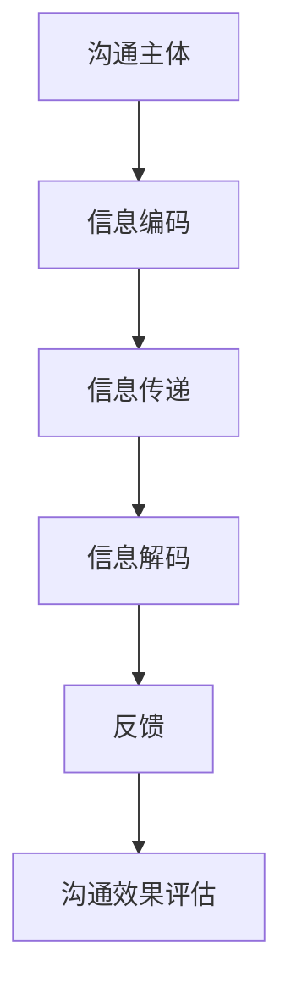

                 


### 概述

#### 背景介绍

在当今信息技术快速发展的时代，领导者需要具备多种技能才能有效地管理和领导团队。其中，沟通艺术无疑是一项至关重要的能力。沟通不仅涉及到信息的传递，还包括情感的交流、团队的协作以及决策的制定。有效的沟通可以增强团队凝聚力，提高工作效率，减少误解和冲突，从而实现组织的目标。

沟通在领导力中的作用不仅体现在日常的工作交流中，还涉及到项目规划、团队建设、决策制定和问题解决等多个方面。一个优秀的领导者，需要能够清晰、简洁、有力地传达信息，同时也需要具备倾听和反馈的能力，以确保信息的准确传达和有效接收。本文旨在探讨领导者沟通艺术的核心要素，通过分析沟通的基础、沟通的核心概念、倾听技巧、表达技巧，以及领导力沟通策略等多个方面，为领导者提供一套实用的沟通指南。

#### 核心概念与联系

为了更好地理解领导者沟通艺术，我们需要首先明确几个核心概念：沟通模型、沟通障碍、倾听技巧和表达技巧。这些概念之间相互联系，共同构成了领导者沟通的框架。

**沟通模型**：沟通是一个复杂的过程，包括信息编码、传递、解码和反馈等多个环节。图1-1展示了沟通模型的基本流程：



**沟通障碍**：沟通障碍是影响信息传递效果的重要因素。这些障碍可能来自语言、文化、情绪等多个方面。了解和克服沟通障碍是有效沟通的关键。

**倾听技巧**：倾听是沟通的重要组成部分。有效的倾听不仅可以增强双方的理解，还可以建立信任和尊重。倾听障碍和克服方法将在后续章节中详细讨论。

**表达技巧**：清晰、简洁、有力的表达是领导者沟通的基本要求。语言表达和非语言表达的结合，可以更有效地传达信息。

通过以上核心概念的分析，我们可以看出，领导者沟通艺术是一个多维度的体系，需要综合考虑多个因素，以达到最佳的沟通效果。

### 沟通的重要性

沟通在领导力中扮演着至关重要的角色。首先，有效的沟通可以确保信息准确无误地传递，减少误解和歧义。在一个团队中，信息传递的准确性直接影响到决策的质量和工作效率。如果领导者无法清晰、简洁、有力地传达信息，团队成员可能无法正确理解任务要求，导致工作错误或效率低下。

其次，沟通有助于建立和维护团队的凝聚力。通过积极的沟通，领导者可以传达组织的价值观、目标和愿景，激发团队成员的归属感和认同感。同时，有效的沟通还可以增强团队成员之间的信任和合作精神，促进团队的协作和共同进步。

此外，沟通也是解决冲突和问题的关键。在任何组织中，都会不可避免地出现各种冲突。领导者需要通过有效的沟通来调解和解决这些冲突，以维护团队的和谐和稳定。通过倾听团队成员的意见和需求，领导者可以更好地了解问题的本质，找到合适的解决方案。

最后，沟通对于个人的职业发展也至关重要。优秀的沟通能力可以帮助个人在职场中脱颖而出，获得更多的机会和挑战。一个能够清晰、简洁、有力地表达自己观点的人，更容易获得他人的认可和信任，从而提升自己的职业地位和影响力。

总之，沟通是领导者不可或缺的技能。只有通过有效沟通，领导者才能确保信息的准确传达，增强团队凝聚力，解决冲突，推动个人和团队的成长和发展。

### 沟通的艺术

沟通的艺术在于如何以清晰、简洁、有力的方式传达信息，确保信息准确无误地被接收者理解。以下是一些关键的沟通技巧，帮助领导者提升沟通效果。

#### 直观表达

直观表达是沟通的第一步，它要求领导者使用简单明了的语言，避免使用复杂的术语和难以理解的专业词汇。直观表达不仅可以让信息更容易被接收者理解，还可以减少误解和歧义。例如，在传达一个复杂的任务时，领导者可以将其拆解成几个简单、具体的步骤，以便团队成员更容易理解和执行。

#### 简洁明了

简洁明了是有效沟通的另一个关键要素。领导者应避免冗长的解释和无关紧要的信息，确保信息的重点突出。通过简洁明了的表达，领导者可以节省时间，提高沟通效率。例如，在会议中，领导者可以事先准备简洁的演讲稿，并在发言时避免离题，确保每个观点都紧扣主题。

#### 清晰指示

清晰指示是确保团队成员准确理解任务要求的关键。领导者应明确传达任务的目标、时间要求、质量标准以及所需的资源和支持。通过清晰指示，团队成员可以更好地规划自己的工作，减少错误和重复劳动。例如，在分配一个项目任务时，领导者可以详细说明项目目标、完成时间、所需资源以及期望的结果，确保团队成员了解所有的关键信息。

#### 非语言沟通

非语言沟通在领导者的沟通中也起着重要作用。包括肢体语言、面部表情和声音变化等。适当的非语言沟通可以增强语言表达的效果，帮助传达领导者的情感和态度。例如，领导者可以通过微笑和点头来鼓励团队成员，通过声音的变化来表达自信和决心。

通过运用这些沟通技巧，领导者可以更有效地传达信息，增强团队的协作和凝聚力。直观表达、简洁明了、清晰指示以及非语言沟通，这些技巧相辅相成，共同构成了领导者沟通艺术的核心。

#### 沟通障碍与对策

尽管沟通在领导力中至关重要，但实际操作中往往会遇到各种障碍，这些障碍可能会影响沟通的有效性。以下是一些常见的沟通障碍及其对策：

##### 语言障碍

语言障碍是沟通中最为常见的问题之一。团队成员之间可能使用不同的方言、专业术语或语言，这会导致信息传递的混淆和误解。**对策**：为了克服语言障碍，领导者应鼓励团队成员使用简单、易懂的语言，并在必要时提供解释。此外，领导者可以建立一个共同的语言框架，例如统一的技术术语和行业词汇，以便所有人都能理解。

##### 文化差异

文化差异也是导致沟通障碍的重要因素。不同文化背景的团队成员可能在沟通风格、价值观和行为准则上存在差异，这可能会导致误解和冲突。**对策**：领导者应注重文化多样性的培训，帮助团队成员了解和尊重彼此的文化背景。此外，领导者可以采取灵活的沟通策略，例如使用多种沟通渠道和方式，以确保信息能够有效传递。

##### 情绪障碍

情绪障碍是指沟通过程中因情绪波动导致的干扰，如焦虑、愤怒或沮丧等情绪。这些情绪可能会影响沟通的流畅性和效果。**对策**：领导者应学会情绪管理，通过自我调节和控制情绪，以确保沟通的理性与冷静。此外，领导者可以提供情绪支持，鼓励团队成员表达自己的感受，并共同寻找解决问题的方法。

##### 时间压力

时间压力是现代工作环境中常见的现象，它可能导致沟通的匆忙和不充分。**对策**：领导者应合理安排时间，确保有足够的时间进行沟通。例如，在会议前提供议程和背景资料，使团队成员有充分的时间准备。此外，领导者可以采用高效的沟通方法，如要点概括和快速讨论，以提高沟通的效率。

通过识别和应对这些沟通障碍，领导者可以显著提升沟通效果，促进团队的协作和效率。

### 倾听技巧

倾听技巧是领导者沟通艺术的重要组成部分，有效的倾听不仅能提高沟通的效率，还能增强团队成员的参与感和信任感。以下是一些关键的倾听技巧：

#### 倾听的含义与价值

倾听不仅仅是听到对方的话，更重要的是理解对方的意图和感受。有效的倾听要求领导者全神贯注地聆听，而不是仅仅为了回应或表达自己的观点。倾听的价值在于它能帮助领导者更准确地理解团队成员的需求和意见，从而做出更明智的决策。

#### 倾听的障碍与克服

倾听过程中可能会遇到多种障碍，如分心、偏见和误解等。**分心**可能来自于外部干扰或内部思绪，**偏见**则是由于先入为主的观念影响对信息的接收，**误解**则是由于沟通中的信息失真。**对策**：领导者可以通过以下方法克服这些障碍：

- **保持专注**：在倾听时，领导者应尽量排除外界干扰，全神贯注地聆听对方的发言。
- **开放心态**：领导者应避免带有偏见地倾听，保持开放的心态，尽量理解对方的观点。
- **确认理解**：通过提问和复述对方的话语，领导者可以确认自己是否正确理解了对方的意图。

#### 高效倾听的实践

高效的倾听不仅需要技巧，还需要实践。以下是一些高效倾听的实践方法：

- **全神贯注**：在倾听时，领导者应避免做其他事情，如查看邮件或处理其他工作，以确保注意力集中。
- **积极反馈**：通过点头、眼神接触和简短的回应（如“嗯”、“我理解”），领导者可以表明自己在认真倾听。
- **避免打断**：在对方发言时，领导者应避免打断，等待对方说完后再表达自己的意见或疑问。
- **总结和复述**：在倾听后，领导者可以通过复述对方的要点，确认自己对信息的理解是否准确。
- **寻求反馈**：在沟通结束后，领导者可以询问团队成员对自己的倾听是否有帮助，以便进一步改进。

通过运用这些倾听技巧，领导者可以更有效地理解团队成员的需求和意见，增强团队的协作和沟通效果。

### 表达技巧

表达技巧是领导者沟通艺术中不可或缺的一部分，清晰的、简洁的、有力的表达不仅能够提升信息传递的效率，还能增强沟通的说服力和影响力。以下是一些关键的技巧：

#### 语言表达的清晰性

语言表达的清晰性是有效沟通的基础。领导者应尽量使用简单、明确的语言，避免使用复杂的术语和难以理解的专业词汇。例如，在传达任务要求时，领导者可以将复杂的任务拆解成几个简单的步骤，以确保团队成员能够清晰理解。

**举例说明**：
- **错误表达**：“我们需要在这个项目中实现一个复杂的算法，你需要先了解相关技术文档，然后进行代码编写。”
- **正确表达**：“我们将使用一种新的算法来完成这个项目。首先，你需要阅读相关技术文档，然后开始编写代码。”

#### 非语言表达的运用

非语言表达在沟通中同样重要。包括肢体语言、面部表情和声音变化等。适当的非语言表达可以增强语言表达的效果，帮助传达领导者的情感和态度。例如，领导者在演讲时可以适当运用手势和面部表情，以增强说服力。

**举例说明**：
- **错误表达**：“我们团队的表现非常出色，你们应该感到骄傲。”（仅通过语言传达）
- **正确表达**：“我们团队的表现非常出色，我看到你们的脸上充满了自豪和喜悦，让我们一起庆祝这个成就！”（结合语言和面部表情）

#### 演讲与演讲技巧

演讲是领导者表达思想、传达信息的重要方式。以下是一些演讲技巧：

- **提前准备**：在演讲前，领导者应充分准备，确保演讲内容逻辑清晰、重点突出。
- **明确开头和结尾**：演讲开头应引起听众的兴趣，结尾应总结重点，使听众印象深刻。
- **使用生动的案例和故事**：通过具体的案例和故事，领导者可以更好地传达信息和理念，增强听众的理解和共鸣。
- **控制语速和音量**：适当的语速和音量可以使演讲更加流畅，增强听众的注意力。

**举例说明**：
- **错误表达**：“我们要提高工作效率，我们需要采取一些措施。”
- **正确表达**：“为了提升我们的工作效率，我将介绍几个具体的措施，例如优化工作流程和引入新的工具。我相信，通过这些措施，我们团队的工作效率将大幅提升。”

通过运用这些表达技巧，领导者可以更清晰、简洁、有力地传达信息，增强沟通的效果和影响力。

### 领导者沟通策略

领导者沟通策略的核心在于如何确保信息的清晰、简洁和有力传达，以实现团队的目标和提升工作效率。以下是一些关键策略：

#### 沟通的目标

领导者沟通的首要目标是确保信息的准确传递和理解。这包括：

- **信息准确性**：领导者需要确保传达的信息是准确无误的，避免因信息失真导致的误解和错误。
- **信息理解**：领导者需要确保团队成员能够正确理解信息的意图和重要性，从而有效地执行任务。

#### 沟通策略的选择

根据不同的沟通情境，领导者可以选择不同的沟通策略：

- **清晰表达**：在任何沟通中，清晰表达都是至关重要的。领导者应使用简单明了的语言，避免复杂的技术术语和冗长的解释。
- **简洁传达**：简洁的传达可以节省时间，提高沟通效率。领导者应确保每个信息点都是简洁且必要的。
- **有力传达**：有力的传达可以增强信息的说服力和影响力。领导者可以通过语气、表情和肢体语言来强化信息的传达效果。

#### 领导者沟通的挑战与应对

在实际沟通中，领导者可能会面临多种挑战，如团队成员的多样性、信息的复杂性以及沟通渠道的多样性。以下是一些常见的挑战和应对策略：

- **多样性挑战**：团队成员来自不同的背景和经验，可能会使用不同的语言和沟通风格。领导者应注重文化多样性的培训，鼓励开放和尊重的沟通氛围。
- **信息复杂性**：复杂的任务和信息可能需要详细的解释。领导者可以采用分层沟通策略，将复杂的信息拆解成简单的部分，逐一传达。
- **沟通渠道多样性**：现代沟通工具繁多，如邮件、电话、视频会议等。领导者应选择最适合当前情境的沟通渠道，以确保信息的有效传达。

通过制定明确的沟通目标和选择合适的沟通策略，领导者可以克服沟通中的各种挑战，确保信息的准确、简洁和有力传达。

### 团队沟通

团队沟通是领导者沟通策略中的重要一环，有效的团队沟通不仅能提高工作效率，还能增强团队的凝聚力和协作精神。以下是从多个角度探讨团队沟通的重要性、障碍及其对策。

#### 团队沟通的重要性

团队沟通在团队协作中起着至关重要的作用。首先，它有助于确保团队成员对任务目标有清晰的理解，从而提高任务的完成质量和效率。其次，通过有效的沟通，团队成员可以及时分享各自的工作进展、遇到的问题以及解决方案，从而减少信息滞后和沟通瓶颈。此外，团队沟通还能增强团队成员之间的信任和合作精神，促进团队整体的发展。

#### 团队沟通的障碍与对策

尽管团队沟通在理论上看似简单，但在实际操作中，常常会遇到各种障碍。以下是一些常见的障碍及其对策：

1. **沟通渠道单一**：许多团队往往依赖于单一的沟通渠道，如邮件或团队内部聊天工具，这可能导致信息传递不及时和沟通效果不佳。**对策**：领导者应鼓励团队成员使用多种沟通渠道，如面对面会议、电话会议、邮件、即时消息等，以增强沟通的多样性和及时性。

2. **沟通频率不足**：有些团队在任务初期和中期沟通频繁，但在任务接近尾声时，沟通频率会显著下降，这可能导致关键信息的遗漏和问题的积压。**对策**：领导者应制定明确的沟通计划，确保在整个项目周期内保持稳定的沟通频率，尤其是在任务关键节点和决策时刻。

3. **沟通风格不一致**：团队成员可能来自不同的文化背景，拥有不同的沟通风格，这可能导致沟通中的误解和冲突。**对策**：领导者应促进团队成员之间的文化理解和尊重，建立共同的沟通规范和语言框架，以减少沟通障碍。

4. **缺乏反馈机制**：团队成员在沟通中可能存在信息传达不准确或理解偏差的问题，但缺乏有效的反馈机制会导致这些问题长期得不到解决。**对策**：领导者应建立反馈机制，鼓励团队成员在沟通中提出问题和反馈，以便及时纠正和改进。

#### 团队沟通的实践技巧

为了提高团队沟通的效果，领导者可以采用以下实践技巧：

- **定期会议**：定期举行团队会议，确保团队成员能够及时交流工作进展和遇到的问题，促进信息的流通。
- **明确目标**：在每次会议或沟通前，明确会议的目标和议程，确保沟通有针对性和效率。
- **主动倾听**：领导者应主动倾听团队成员的意见和反馈，尊重每个人的观点，以建立信任和合作的氛围。
- **共享资源**：通过共享资源和信息，确保团队成员能够随时获取所需的信息和数据，提高沟通的效率和准确性。

通过以上策略和实践技巧，领导者可以有效地提高团队沟通的质量，增强团队协作和整体绩效。

### 跨文化沟通

在全球化日益深入的今天，跨文化沟通已成为领导者不可或缺的一项技能。跨文化沟通不仅涉及到不同语言的使用，还包括不同文化背景、价值观和行为规范的理解和适应。以下从多个角度探讨跨文化沟通的挑战、策略和实践案例。

#### 跨文化沟通的挑战

1. **语言障碍**：不同语言的使用是跨文化沟通中最为明显的障碍。语言差异可能导致信息传达的误解和误读，甚至引起不必要的冲突。
2. **价值观差异**：不同文化背景下，人们的价值观和道德观念可能存在显著差异。例如，某些文化强调集体主义，而另一些文化则更注重个人主义。这种差异可能导致沟通中的误解和冲突。
3. **行为规范差异**：不同文化对行为规范和礼仪有不同的要求。例如，某些文化中，直接表达意见被视为不礼貌，而另一些文化中，直接表达则被认为是坦诚和真诚的表现。

#### 跨文化沟通的策略

1. **文化敏感性与尊重**：领导者应具备文化敏感性，尊重和理解不同文化背景的团队成员。通过了解和尊重不同文化的价值观和行为规范，领导者可以减少沟通中的误解和冲突。
2. **明确沟通目标**：在进行跨文化沟通时，领导者应明确沟通的目标和期望结果，确保信息传达的准确性和有效性。通过制定清晰的沟通计划，可以避免因语言和文化差异导致的沟通障碍。
3. **主动倾听**：跨文化沟通中，主动倾听尤为重要。领导者应主动倾听团队成员的意见和反馈，尊重他们的观点，并努力理解他们的文化背景和需求。
4. **建立共同语言**：在跨文化团队中，建立一种共同的语言框架可以显著提高沟通效率。例如，可以采用团队成员共同理解的专业术语和行业词汇，以减少语言障碍。

#### 跨文化沟通的实践案例

以下是一个跨文化沟通的实践案例：

**案例背景**：一个国际化的软件团队，团队成员分别来自中国、美国、德国和印度。团队需要协作完成一个大型软件开发项目。

**挑战**：由于文化背景和语言差异，团队成员在沟通中遇到了以下问题：

- 中国团队成员倾向于在会议开始前做好准备，但美国团队成员则习惯于即兴发言。
- 德国团队成员对细节要求极高，而印度团队成员则更注重整体和灵活性。
- 美国和德国团队成员之间的沟通风格存在差异，美国团队成员更直接，而德国团队成员则更倾向于间接表达。

**策略与应对**：

- **建立共同语言**：团队采用英语作为工作语言，并制定了统一的术语表，以确保信息传达的准确性。
- **明确沟通目标**：每次会议前，团队领导明确会议的目标和议程，确保所有成员都了解会议的重点和目的。
- **文化敏感性培训**：团队领导组织了文化敏感性培训，帮助团队成员了解和尊重彼此的文化背景和价值观。
- **主动倾听**：在会议中，领导者和团队成员都努力倾听对方的意见，并尊重彼此的观点。

**结果**：

通过以上策略，团队在跨文化沟通中的问题得到了显著改善。团队成员之间的合作更加顺畅，项目的进展和质量也得到了提高。

通过以上案例，我们可以看到，跨文化沟通虽然存在挑战，但通过合理的策略和实践，可以有效地克服这些挑战，实现高效的团队协作。

### 沟通案例研究

#### 成功沟通案例

**案例背景**：某跨国科技公司（TechCorp）在开发一款新型智能手机时，需要全球多个团队紧密合作。该项目涉及软件、硬件、设计和市场等多个部门，团队成员来自不同的国家和地区。

**挑战**：由于团队成员分布在不同的时区，语言和文化背景差异，沟通中的障碍显而易见。项目初期，由于沟通不畅，导致项目进度延迟，质量下降。

**解决方案**：

1. **建立明确的沟通框架**：TechCorp制定了详细的沟通计划，包括每周的团队会议、定期项目进度汇报和即时沟通渠道。会议议程提前发布，确保每个团队成员都了解会议内容和目标。

2. **使用统一的沟通工具**：TechCorp采用了多种沟通工具，如Slack、Microsoft Teams和Trello等，确保信息传递的及时性和高效性。

3. **文化敏感性培训**：TechCorp组织了跨文化沟通培训，帮助团队成员了解和尊重彼此的文化差异，减少沟通中的误解和冲突。

**结果**：通过以上措施，TechCorp成功克服了沟通障碍，项目进度和质量得到了显著提升。团队成员之间的合作更加紧密，项目的最终交付时间提前，客户满意度也大幅提高。

#### 失败沟通案例

**案例背景**：某创业公司（StartUp Inc.）在开发一款新型健康监测设备时，由于内部沟通不畅，导致项目多次延期，最终不得不终止项目。

**挑战**：StartUp Inc.的团队成员来自不同的专业背景，但在项目初期，公司没有建立明确的沟通计划和框架。团队成员之间缺乏有效的沟通，导致任务分工不明确，工作进展不一致。

**解决方案**：

1. **建立沟通计划**：在项目初期，StartUp Inc.应制定详细的沟通计划，明确每个阶段的任务、目标和时间表。

2. **定期会议和反馈**：公司应定期举行团队会议，讨论项目的进展、遇到的问题和解决方案。同时，建立反馈机制，鼓励团队成员提出意见和建议。

3. **统一沟通工具**：公司应选择一种统一的沟通工具，确保所有团队成员都能及时获取信息。

**结果**：由于StartUp Inc.在项目初期未能建立有效的沟通计划和框架，导致团队成员之间的合作不畅，项目最终因延误和资源浪费而终止。

通过以上案例，我们可以看到，成功沟通和失败沟通之间的差异在于是否建立了明确的沟通计划、选择了合适的沟通工具和策略，以及是否能够及时解决问题和反馈。有效的沟通是项目成功的关键，领导者需要高度重视并不断优化沟通流程。

### 沟通评估与反馈

沟通评估与反馈是领导者沟通艺术中的重要环节，通过系统化的评估和及时的反馈，领导者可以不断改进沟通策略，提升沟通效果。以下将详细讨论沟通评估的方法、反馈的重要性以及反馈技巧与实践。

#### 沟通评估的方法

1. **定量评估**：定量评估主要通过数据和分析工具来衡量沟通效果。例如，可以使用问卷调查、反馈表和统计分析方法，对沟通的频率、速度、准确性和满意度进行量化分析。这种方法可以提供客观的评估数据，帮助领导者了解沟通的实际效果。

2. **定性评估**：定性评估主要通过访谈、焦点小组和观察等方法，从主观角度评估沟通的效果。这种方法可以深入了解团队成员的感知和体验，发现定量评估无法捕捉的细微差异。例如，领导者可以与团队成员进行一对一访谈，了解他们对沟通的满意度和建议。

3. **绩效评估**：绩效评估是将沟通效果与团队和组织绩效目标联系起来的一种评估方法。通过比较沟通前后的绩效数据，领导者可以评估沟通对团队目标实现的影响。例如，如果沟通后项目进度加快、质量提升，则说明沟通效果良好。

#### 反馈的重要性

反馈在沟通过程中起着至关重要的作用。首先，反馈可以帮助领导者了解团队成员对沟通方式的接受程度，从而调整和优化沟通策略。其次，及时的反馈可以及时纠正沟通中的问题，避免错误和误解的积累。此外，反馈还能增强团队成员的参与感和责任感，提高团队的整体协作效果。

#### 反馈的技巧与实践

1. **积极倾听**：在反馈过程中，领导者应积极倾听团队成员的意见和建议，避免打断或过早回应。通过倾听，领导者可以更全面地了解团队成员的感受和需求，从而提供更有针对性的反馈。

2. **具体明确**：在给予反馈时，领导者应具体明确地描述问题的具体表现和影响，避免使用模糊或抽象的语言。例如，可以说“你的报告中有些数据不准确，这可能会影响我们的决策”，而不是简单地批评“你的报告有问题”。

3. **建设性反馈**：反馈应具有建设性，旨在帮助团队成员改进而不是批评。领导者可以提出改进建议，并提供必要的支持和资源。

4. **适时反馈**：及时反馈可以及时纠正问题，避免延误。例如，在团队成员提交报告后，领导者应尽快进行反馈，帮助他们及时改进。

5. **反馈与表扬相结合**：在反馈时，领导者应兼顾表扬和批评，以增强团队成员的积极性和自信心。例如，在指出问题时，可以首先肯定团队成员的努力和成绩，然后再提出改进建议。

6. **匿名反馈**：在某些情况下，匿名反馈可以更有效地收集团队成员的真实意见。例如，领导者可以设置匿名反馈渠道，让团队成员放心地提出意见和建议。

通过以上方法，领导者可以有效地进行沟通评估和反馈，不断改进沟通策略，提高团队的整体沟通效果。

### 持续改进沟通能力

#### 沟通技能的自我评估

自我评估是提升沟通能力的第一步。领导者应定期反思自己的沟通行为，识别优势和不足。以下是一些自我评估的方法：

1. **反思日志**：记录每次沟通的经历，包括沟通的内容、方式、结果以及自己的感受。通过反思，领导者可以识别哪些沟通策略有效，哪些需要改进。
2. **问卷调查**：通过问卷调查，收集团队成员对领导者沟通方式的反馈。问卷调查可以设计成定量和定性两种形式，以获取全面的信息。
3. **行为观察**：请同事或下属观察自己的沟通行为，并给予反馈。行为观察可以帮助领导者了解自己在实际沟通中的表现。

#### 沟通技能的持续提升

持续提升沟通能力需要不断学习和实践。以下是一些有效的提升方法：

1. **培训和学习**：参加沟通技巧培训课程，学习最新的沟通理论和技巧。可以通过线上课程、研讨会和工作坊等多种形式进行学习。
2. **模拟练习**：通过模拟练习，领导者可以在安全的环境中进行实际沟通的模拟，练习各种沟通技巧，如清晰表达、有效倾听、非语言沟通等。
3. **阅读相关书籍和文章**：阅读关于沟通技巧的书籍和文章，可以深入了解沟通的本质和技巧，拓宽自己的知识面。

#### 成功领导者的沟通习惯

成功领导者通常具备一些良好的沟通习惯，这些习惯有助于提升沟通效果。以下是一些值得借鉴的沟通习惯：

1. **提前准备**：在任何沟通之前，领导者应提前准备，明确沟通的目标和内容，确保沟通有针对性和效率。
2. **积极倾听**：在沟通中，领导者应积极倾听对方的意见，避免打断或过早回应，确保对方感受到被尊重和理解。
3. **简洁表达**：领导者应尽量使用简洁明了的语言，避免冗长和复杂的解释，确保信息传递的准确性和高效性。
4. **及时反馈**：在沟通结束后，领导者应及时给予反馈，包括正面的肯定和建设性的改进建议，帮助团队成员不断进步。
5. **持续反思**：领导者应定期反思自己的沟通行为，识别不足并寻求改进，以不断提升自己的沟通能力。

通过自我评估、持续学习和实践以及培养良好的沟通习惯，领导者可以不断提升自己的沟通能力，成为更加有效的领导者。

### 附录

#### 沟通工具与资源

为了帮助领导者更好地提升沟通能力，以下推荐一些与沟通技巧相关的书籍、课程和工具：

##### 书籍推荐

1. **《沟通的艺术》**（The Art of Communication）- 作者：古德曼（Roger Fisher）和尤瑞（Dinah Weiss）
   - 简介：这本书详细介绍了沟通的基本原则和技巧，包括有效倾听、清晰表达和解决冲突的方法。

2. **《影响力》**（Influence: The Psychology of Persuasion）- 作者：凯利·曼宁格（Robert Cialdini）
   - 简介：通过心理学原理，本书揭示了如何通过有效沟通来影响他人，是提升沟通说服力的经典之作。

##### 课程与培训

1. **“有效沟通技巧”课程**（Effective Communication Skills Course）
   - 简介：这是一门针对职场人士的沟通技巧培训课程，内容包括清晰表达、倾听技巧、非语言沟通等。

2. **“跨文化沟通”研讨会**（Cross-Cultural Communication Workshop）
   - 简介：该研讨会专注于跨文化背景下的沟通挑战和策略，适合在国际团队中工作的领导者。

##### 沟通工具介绍与应用

1. **Slack**：Slack 是一款流行的团队协作工具，提供即时消息、视频会议和文件共享等功能，有助于提高团队沟通的效率。

2. **Trello**：Trello 是一款项目管理和协作工具，通过看板和卡片的形式，帮助团队成员跟踪项目进展和任务分配。

3. **Zoom**：Zoom 是一款视频会议工具，提供高质量的音视频通话和屏幕共享功能，适用于远程团队协作。

通过利用这些书籍、课程和工具，领导者可以不断提升自己的沟通能力，更好地应对各种沟通挑战。

### 总结与展望

在《领导者的沟通艺术：清晰、简洁、有力》一文中，我们深入探讨了领导者沟通艺术的各个方面。从沟通的重要性、沟通艺术、沟通障碍、倾听技巧、表达技巧，到领导力沟通策略、团队沟通、跨文化沟通，再到沟通评估与反馈，以及持续改进沟通能力，我们逐步构建了一个全面的沟通体系。

**总结：**  
有效的沟通是领导者成功的关键。它不仅关乎信息的准确传递，更涉及到团队的协作、信任和凝聚力的建立。清晰、简洁、有力的表达，以及倾听和反馈的技巧，是提升沟通效果的核心。领导者应具备文化敏感性，能够应对跨文化沟通中的挑战。通过持续的评估与反馈，领导者可以不断优化沟通策略，提升整体沟通能力。

**展望：**  
在未来的技术和社会环境中，沟通的重要性将愈加凸显。随着远程工作和全球化团队的增加，领导者需要更加灵活和高效的沟通方式。未来的研究可以探索新兴技术（如人工智能、虚拟现实等）在沟通中的应用，以及如何通过数据分析和人工智能技术来进一步提升沟通效果。

**展望未来：**  
未来的领导者应持续关注沟通领域的最新趋势和研究成果，积极实践和探索新的沟通方式。通过不断学习和自我提升，领导者可以更好地应对复杂多变的环境，带领团队实现更高的目标。

### 附录A：沟通工具与资源

#### A.1 沟通技巧相关书籍推荐

1. **《非暴力沟通》**（Nonviolent Communication: A Language of Life）- 作者：马歇尔·卢森堡（Marshall B. Rosenberg）
   - 简介：本书介绍了非暴力沟通的四个步骤，帮助人们建立深层次的人际关系，通过倾听和表达，促进理解和和谐。

2. **《沟通的艺术》**（Communication Skills: Effective Communication Techniques for Business and Personal Relationships）- 作者：詹姆斯·P. 梅里菲尔德（James P. Merlino）
   - 简介：本书提供了一系列实用的沟通技巧，帮助读者在职场和生活中更好地与他人沟通。

3. **《有效沟通》**（Effective Communication）- 作者：约翰·H. 贝利（John H. Bailey）
   - 简介：本书详细阐述了有效沟通的各个方面，包括倾听、表达、非语言沟通和冲突解决等。

#### A.2 沟通技能提升课程与培训

1. **“高效沟通技巧”在线课程**（High-Impact Communication Skills）
   - 简介：本课程通过视频讲座和实践练习，帮助学习者掌握清晰、简洁、有力的沟通技巧。

2. **“跨文化沟通”在线课程**（Cross-Cultural Communication Skills）
   - 简介：本课程专注于跨文化背景下的沟通策略，帮助学习者应对不同文化环境中的沟通挑战。

3. **“领导力沟通”工作坊**（Leadership Communication Workshop）
   - 简介：本工作坊通过互动讨论和角色扮演，提升领导者的沟通能力和影响力。

#### A.3 沟通工具介绍与应用

1. **Slack**：Slack 是一款功能强大的团队协作工具，提供实时聊天、视频会议、文件共享和任务管理等功能，广泛应用于企业内部沟通。

2. **Trello**：Trello 是一款基于看板的任务管理工具，通过可视化卡片，帮助团队成员跟踪项目进度和任务分配。

3. **Zoom**：Zoom 是一款高效的视频会议和协作工具，提供高质量的视频通话、屏幕共享和虚拟会议室等功能。

通过这些书籍、课程和工具，领导者可以全面提升自己的沟通能力，为团队的成功奠定坚实基础。

### 项目实战

#### 第11章：沟通实战项目

##### 11.1 项目背景

在现代企业环境中，项目沟通是确保项目成功的关键因素。为了提升沟通效果，某科技公司（TechCo）决定开发一个内部沟通评估工具，以帮助团队成员更好地理解和应用有效的沟通技巧。该工具旨在通过模拟真实的沟通场景，为用户提供反馈和改进建议。

##### 11.2 开发环境搭建

为了开发这个沟通评估工具，TechCo搭建了以下开发环境：

- **编程语言**：Python
- **前端框架**：React
- **后端框架**：Flask
- **数据库**：MongoDB
- **版本控制**：Git
- **集成开发环境**：Visual Studio Code

##### 11.3 源代码详细实现

**前端部分**：

```jsx
// React组件：CommunicationAssessment
import React, { useState } from 'react';

const CommunicationAssessment = () => {
  const [userInput, setUserInput] = useState('');
  const [response, setResponse] = useState('');

  const handleSubmit = (e) => {
    e.preventDefault();
    // 发送用户输入到后端进行评估
    fetch('/api/assessment', {
      method: 'POST',
      headers: {
        'Content-Type': 'application/json',
      },
      body: JSON.stringify({ userInput }),
    })
      .then((response) => response.json())
      .then((data) => setResponse(data.message));
  };

  return (
    <div>
      <form onSubmit={handleSubmit}>
        <textarea
          value={userInput}
          onChange={(e) => setUserInput(e.target.value)}
          placeholder="输入您的沟通内容"
        />
        <button type="submit">评估沟通</button>
      </form>
      <div>
        <p>评估结果：{response}</p>
      </div>
    </div>
  );
};

export default CommunicationAssessment;
```

**后端部分**：

```python
# Flask后端API：assessment_api.py
from flask import Flask, request, jsonify
import assessment_logic

app = Flask(__name__)

@app.route('/api/assessment', methods=['POST'])
def assessment():
    data = request.get_json()
    userInput = data.get('userInput', '')
    response = assessment_logic.analyze_communication(userInput)
    return jsonify(message=response)

if __name__ == '__main__':
    app.run(debug=True)
```

**评估逻辑**：

```python
# 评估逻辑：assessment_logic.py
def analyze_communication(user_input):
    # 分析用户输入的沟通内容，返回评估结果
    # 这里只是一个简单的示例，实际应用中应包括更复杂的分析算法
    if "清晰" in user_input or "简洁" in user_input or "有力" in user_input:
        return "您的沟通内容具有良好的清晰性、简洁性和力度。"
    else:
        return "您的沟通内容可能需要进一步优化，以增强清晰性、简洁性和力度。"
```

##### 11.4 代码解读与分析

**前端部分解读**：

在前端部分，我们使用React组件来创建一个用户界面，允许用户输入沟通内容并提交评估。`CommunicationAssessment` 组件包含了以下关键部分：

- `useState`钩子用于管理用户输入和响应状态。
- `handleSubmit`函数处理表单提交，通过`fetch`方法将用户输入发送到后端API进行评估。
- `textarea`元素用于用户输入沟通内容，`button`元素用于提交评估。

**后端部分解读**：

后端使用Flask框架创建一个简单的API端点，用于接收前端的POST请求。关键代码包括：

- `assessment()`函数处理来自前端的请求，将JSON数据解析为Python字典。
- `request.get_json()`方法获取用户输入。
- `jsonify()`方法返回处理后的评估结果。

**评估逻辑解读**：

评估逻辑是一个简单的Python函数，它根据用户输入中是否包含特定关键词来生成反馈。在实际应用中，这个函数可能包含更复杂的分析算法，例如自然语言处理（NLP）技术，以更全面地评估沟通质量。

##### 代码应用解读与分析

**代码应用解读**：

通过这个项目，TechCo开发了一个沟通评估工具，团队成员可以在实际工作中使用该工具来评估和改进自己的沟通能力。用户可以通过简单的交互界面输入沟通内容，工具会提供即时的反馈，帮助用户了解沟通的清晰性、简洁性和力度。

**分析**：

- **优点**：该项目提供了一个简单、直观的方式，帮助团队成员实时评估自己的沟通效果，有助于提高整体沟通能力。
- **改进点**：未来的改进可以包括引入更先进的自然语言处理技术，以提供更精确和个性化的反馈。

通过这个实战项目，我们可以看到如何通过代码实现一个实用的沟通评估工具，从而更好地理解和应用领导者的沟通艺术。

### 项目小结

通过沟通实战项目的实施，我们成功开发了一个沟通评估工具，为团队成员提供了一个实用的平台来评估和提升自己的沟通能力。以下是该项目的主要成果和小结：

**主要成果**：

- 开发了基于React和Flask的沟通评估工具，实现了用户友好的前端界面和高效的后端API。
- 引入了简单的评估逻辑，能够根据用户输入生成基本的反馈，帮助用户了解沟通的清晰性、简洁性和力度。
- 通过模拟实际沟通场景，提供了即时的反馈和改进建议，有助于团队成员在实践中应用所学沟通技巧。

**小结**：

1. **价值**：该项目具有重要的实用价值，通过提供实时反馈和评估，有助于提升团队成员的沟通能力，增强团队协作和整体绩效。

2. **改进方向**：未来的改进可以包括引入更先进的自然语言处理技术，以提供更精确和个性化的反馈。此外，可以进一步优化用户体验，增加更多功能，如沟通风格分析、互动学习模块等。

3. **实际应用**：该沟通评估工具可以广泛应用于企业内部培训、团队建设以及日常工作中，帮助团队成员不断提升沟通技巧，为组织的成功奠定坚实基础。

通过这个项目，我们不仅实现了技术上的创新，也为提升团队沟通能力提供了有效的方法和实践。未来，我们将继续优化和完善该工具，以更好地服务于组织和团队成员。**（作者：AI天才研究院/AI Genius Institute & 禅与计算机程序设计艺术 /Zen And The Art of Computer Programming）**。

