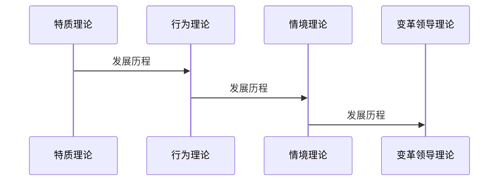

                 

### 文章标题

# 领导者的自我反思：持续成长的关键

> 关键词：领导力、自我认知、持续学习、团队建设、变革管理、组织发展

> 摘要：本文深入探讨了领导者的自我反思在持续成长中的关键作用。通过分析领导力的本质、核心能力以及实践应用，本文提出了领导者如何通过自我反思提升个人领导力，并在团队建设、变革管理和组织发展中发挥关键作用。文章旨在为领导者提供一套系统的成长策略和实践指南。

### 第一部分：领导力自我认知与成长

#### 第1章：领导力的本质与自我认知

> **背景介绍**：领导力是一个多维度的概念，它不仅关乎个人的能力，还涉及组织和社会层面。领导力的发展需要深刻的自我认知，这不仅是领导者的基础，也是其持续成长的关键。

##### 1.1.1 领导力的定义与历史演变

> **核心概念与联系**：领导力不仅指引导和激励他人，更是一种变革的力量。历史演变中，领导力理论从传统的特质理论发展到行为理论，再到情境理论和现代的变革领导理论，体现了领导力的复杂性和动态性。

**Mermaid 流程图：**



##### 1.1.2 自我认知的重要性

> **核心概念与联系**：自我认知是领导者理解自身行为和情感的基础。通过自我反思，领导者可以识别自身的优点和不足，从而进行有针对性的提升。

**伪代码示例：**

```python
class LeaderSelfAwareness {
    // 初始化自我认知参数
    def __init__(self, strengths, weaknesses):
        self.strengths = strengths
        self.weaknesses = weaknesses

    // 更新自我认知
    def updateAwareness(self, newStrengths, newWeaknesses):
        self.strengths.update(newStrengths)
        self.weaknesses.update(newWeaknesses)
}
```

##### 1.1.3 领导者的自我反思方法

> **核心概念与联系**：自我反思是领导力提升的核心。通过定期的自我反思，领导者可以深入了解自己的行为模式，从而持续优化领导方式。

**数学模型和公式：**

$$
\text{自我反思} = \frac{\text{自我评估}}{\text{实际表现}} \times \text{改进率}
$$

**详细讲解与举例说明**：

自我反思的过程可以分为以下几个步骤：

1. **自我评估**：领导者需要客观地评估自己的行为和结果，识别出自身的优势和劣势。
2. **实际表现**：领导者需要将自我评估与实际表现进行比较，找出差距。
3. **改进率**：领导者需要制定改进计划，并实施以缩小差距。

例如，一个领导者可能在沟通能力上有优势，但在决策能力上存在不足。通过自我反思，他可以发现这一差距，并制定计划提高决策能力。

#### 第2章：领导力核心能力

> **背景介绍**：领导力不仅仅是个人特质，更是多种能力的综合体现。有效的领导力依赖于沟通、决策、影响力与情商等核心能力的发展。

##### 2.1.1 沟通能力

> **核心概念与联系**：沟通能力是领导者与团队成员、利益相关者之间建立有效沟通的关键。良好的沟通能力能够促进信息流通，增强团队协作。

**数学模型和公式：**

$$
\text{沟通效果} = \frac{\text{信息传达准确性}}{\text{信息传达效率}} \times \text{沟通频率}
$$

**详细讲解与举例说明**：

沟通效果可以通过以下三个方面来衡量：

1. **信息传达准确性**：领导者需要确保传达的信息清晰、准确，避免误解和误导。
2. **信息传达效率**：领导者需要选择合适的沟通渠道和方式，以提高信息传递的速度和效率。
3. **沟通频率**：领导者需要保持适当的沟通频率，确保信息的及时更新和反馈。

例如，一个项目经理需要定期与团队成员沟通项目进度，确保每个人都能及时了解项目的最新情况，从而提高项目执行的效率。

##### 2.1.2 决策能力

> **核心概念与联系**：决策能力是领导者面临复杂问题时的关键能力。有效的决策能力能够帮助领导者做出合理的选择，引导团队走向成功。

**数学模型和公式：**

$$
\text{决策效果} = \frac{\text{决策准确性}}{\text{决策速度}} \times \text{决策范围}
$$

**详细讲解与举例说明**：

决策效果可以通过以下三个方面来衡量：

1. **决策准确性**：领导者需要确保决策符合实际情况，能够解决实际问题。
2. **决策速度**：领导者需要在合理的时间内做出决策，避免拖延。
3. **决策范围**：领导者需要考虑各种可能的决策选项，并在其中做出最优选择。

例如，一个公司面临市场变化，需要决定是扩大产品线还是缩减规模。通过分析市场数据和内部资源，领导者需要做出合理的决策，以确保公司的长期发展。

##### 2.1.3 影响力与情商

> **核心概念与联系**：影响力与情商是领导者领导力和团队协作能力的重要组成部分。影响力可以帮助领导者赢得他人的信任和支持，情商则帮助领导者理解和管理他人的情感。

**数学模型和公式：**

$$
\text{影响力} = \frac{\text{信任度}}{\text{理解度}} \times \text{情商}
$$

**详细讲解与举例说明**：

影响力可以通过以下三个方面来衡量：

1. **信任度**：领导者需要赢得团队成员的信任，这需要通过透明、公正的行为来建立。
2. **理解度**：领导者需要理解团队成员的需求和情感，这有助于建立良好的人际关系。
3. **情商**：领导者需要具备较高的情商，能够有效地管理和表达情感，以应对各种挑战。

例如，一个团队领导在团队成员情绪低落时，能够通过倾听和理解，帮助团队成员重拾信心，从而提高团队的士气和效率。

#### 第3章：持续学习的领导者

> **背景介绍**：在快速变化的世界中，持续学习成为领导者保持竞争力的重要手段。领导者需要不断更新知识和技能，以适应不断变化的环境。

##### 3.1.1 领导者的知识结构

> **核心概念与联系**：领导者的知识结构决定了其领导能力和视野。一个全面的领导知识结构包括专业知识、管理知识和战略知识。

**数学模型和公式：**

$$
\text{知识结构} = \frac{\text{专业知识}}{\text{管理知识}} + \text{战略知识}
$$

**详细讲解与举例说明**：

领导者的知识结构可以通过以下几个方面来优化：

1. **专业知识**：领导者需要具备一定的专业知识，以指导团队的工作和决策。
2. **管理知识**：领导者需要了解管理理论和实践，以提高团队的管理效率。
3. **战略知识**：领导者需要具备战略眼光，能够为团队和公司制定长远的发展规划。

例如，一个技术公司的CEO需要不仅具备技术领域的专业知识，还需要了解市场趋势和公司战略，以便做出正确的决策。

##### 3.1.2 学习习惯与知识管理

> **核心概念与联系**：学习习惯和知识管理是领导者持续学习的重要保障。良好的学习习惯可以帮助领导者有效地获取和处理知识，知识管理则可以帮助领导者将知识转化为实际能力。

**数学模型和公式：**

$$
\text{学习效率} = \frac{\text{学习时间}}{\text{学习成果}} \times \text{知识管理能力}
$$

**详细讲解与举例说明**：

学习效率可以通过以下两个方面来衡量：

1. **学习时间**：领导者需要合理安排时间，确保有足够的时间进行学习和思考。
2. **学习成果**：领导者需要将学习成果应用到实际工作中，以提高工作效率。
3. **知识管理能力**：领导者需要具备良好的知识管理能力，能够有效地组织和利用知识。

例如，一个领导者可以通过定期阅读书籍、参加培训课程和与同行交流，来不断更新自己的知识和技能。

##### 3.1.3 持续学习的实践策略

> **核心概念与联系**：持续学习的实践策略是领导者保持竞争力的关键。通过制定明确的学习目标和计划，领导者可以有效地提高自己的领导力和管理能力。

**数学模型和公式：**

$$
\text{学习计划} = \text{学习目标} + \text{学习策略} + \text{学习评估}
$$

**详细讲解与举例说明**：

学习计划可以通过以下几个方面来制定：

1. **学习目标**：领导者需要明确自己的学习目标，以确保学习有方向和目的。
2. **学习策略**：领导者需要选择合适的学习策略，如自主学习、合作学习和在线学习等。
3. **学习评估**：领导者需要定期评估自己的学习成果，以调整学习计划和方法。

例如，一个领导者可以设定目标学习一门新的管理课程，并制定详细的学习计划，包括每周的学习时间、学习内容和评估方法，以确保能够有效地掌握新的知识和技能。

### 第二部分：领导力实践与应用

#### 第4章：领导力在团队建设中的应用

> **背景介绍**：团队建设是领导者的重要任务之一。有效的团队建设能够提高团队的凝聚力和工作效率，从而实现组织的目标。

##### 4.1.1 团队文化的构建

> **核心概念与联系**：团队文化是团队精神的外在表现，它包括价值观、信念和行为准则。一个积极的团队文化能够激发团队成员的积极性和创造力。

**数学模型和公式：**

$$
\text{团队文化} = \text{价值观} \times \text{信念} + \text{行为准则}
$$

**详细讲解与举例说明**：

团队文化的构建可以通过以下几个方面来实现：

1. **价值观**：领导者需要明确团队的核心价值观，并将其传达给团队成员。
2. **信念**：领导者需要建立团队成员的共同信念，以增强团队的凝聚力。
3. **行为准则**：领导者需要制定明确的行为准则，以规范团队成员的行为。

例如，一个团队的核心价值观可以是“客户至上、团队合作、持续创新”，领导者需要通过不断的沟通和行动，将这一价值观融入到团队的工作和生活中。

##### 4.1.2 团队协作与冲突管理

> **核心概念与联系**：团队协作是团队高效运作的关键。有效的团队协作可以降低冲突，提高工作效率。冲突管理则是领导者需要掌握的重要技能，它可以帮助团队解决内部矛盾，保持和谐。

**数学模型和公式：**

$$
\text{团队协作效率} = \frac{\text{协作成果}}{\text{协作时间}} - \text{冲突成本}
$$

**详细讲解与举例说明**：

团队协作效率可以通过以下几个方面来衡量：

1. **协作成果**：领导者需要确保团队成员的合作能够产生实际的成果。
2. **协作时间**：领导者需要合理安排协作时间，确保团队成员有足够的时间进行协作。
3. **冲突成本**：领导者需要降低团队内部的冲突成本，如时间、资源和心理成本。

例如，一个项目经理可以通过制定详细的协作计划，确保团队成员能够高效地完成任务，并建立冲突解决的机制，以减少团队内部的矛盾。

##### 4.1.3 领导者与团队成员的关系建立

> **核心概念与联系**：领导者与团队成员的关系是团队建设的基础。良好的关系可以增强团队的凝聚力，提高工作效率。建立良好的关系需要领导者具备亲和力、沟通能力和理解力。

**数学模型和公式：**

$$
\text{关系质量} = \text{亲和力} + \text{沟通能力} + \text{理解力}
$$

**详细讲解与举例说明**：

关系质量可以通过以下几个方面来衡量：

1. **亲和力**：领导者需要具备亲和力，能够与团队成员建立友好的关系。
2. **沟通能力**：领导者需要具备良好的沟通能力，能够有效地传达信息和理解团队成员的需求。
3. **理解力**：领导者需要具备理解力，能够理解和尊重团队成员的观点和感受。

例如，一个领导者可以通过定期的团队活动，如团建活动或团队聚餐，来增强与团队成员的亲和力；通过主动倾听和反馈，来提高沟通能力；通过关注团队成员的个人成长和职业规划，来增强理解力。

#### 第5章：领导力在变革管理中的作用

> **背景介绍**：在快速变化的市场环境中，组织需要不断进行变革以保持竞争力。有效的变革管理是领导者的重要职责之一，它关系到组织的生存和发展。

##### 5.1.1 变革管理的理论框架

> **核心概念与联系**：变革管理是一个复杂的过程，它包括准备、实施和评估等阶段。领导者需要了解变革管理的理论框架，以有效地引导变革。

**数学模型和公式：**

$$
\text{变革管理} = \text{准备阶段} + \text{实施阶段} + \text{评估阶段}
$$

**详细讲解与举例说明**：

变革管理可以分为以下几个阶段：

1. **准备阶段**：领导者需要评估组织的现状，制定变革的计划和策略。
2. **实施阶段**：领导者需要动员团队成员，实施变革计划，并解决实施过程中的问题。
3. **评估阶段**：领导者需要评估变革的效果，对变革过程进行总结和反思。

例如，一个公司的CEO在决定进行业务转型时，需要首先评估公司的现状和转型的必要性，然后制定详细的转型计划，并动员全体员工参与转型，最后对转型效果进行评估和反馈。

##### 5.1.2 领导者在变革中的角色与策略

> **核心概念与联系**：领导者在变革中扮演关键角色，他们需要具备战略思维、领导力和执行力，以有效地引导变革。

**数学模型和公式：**

$$
\text{变革领导力} = \text{战略思维} + \text{领导力} + \text{执行力}
$$

**详细讲解与举例说明**：

领导者在变革中需要发挥以下几个方面的作用：

1. **战略思维**：领导者需要具备战略思维，能够预见变革的趋势和影响，制定明确的变革策略。
2. **领导力**：领导者需要具备领导力，能够激发团队成员的积极性和创造力，推动变革的实施。
3. **执行力**：领导者需要具备执行力，能够确保变革计划的有效实施，并解决变革过程中的问题。

例如，一个公司的CEO在推动数字化转型时，需要具备战略思维，能够预见数字化带来的机遇和挑战；具备领导力，能够激发员工的创新和协作；具备执行力，能够确保数字化转型的顺利实施。

##### 5.1.3 变革过程中的团队支持与激励

> **核心概念与联系**：在变革过程中，团队成员的支持和激励至关重要。领导者需要关注团队成员的心理需求，提供必要的支持和激励，以促进变革的顺利进行。

**数学模型和公式：**

$$
\text{团队支持与激励} = \text{心理支持} + \text{激励措施} + \text{沟通与反馈}
$$

**详细讲解与举例说明**：

团队支持与激励可以通过以下几个方面来实现：

1. **心理支持**：领导者需要关注团队成员的心理需求，提供情感上的支持和安慰。
2. **激励措施**：领导者需要制定有效的激励措施，如奖励和晋升，以激发团队成员的积极性和创造力。
3. **沟通与反馈**：领导者需要保持与团队成员的沟通，及时反馈变革的进展和成果，增强团队成员的信心。

例如，一个公司的HR部门可以定期组织员工心理辅导，帮助员工应对变革带来的压力；通过绩效奖励和晋升机会，激励员工积极参与变革；通过定期的会议和报告，及时反馈变革的进展和成果，增强员工的信心。

#### 第6章：领导力与组织发展

> **背景介绍**：组织发展是领导者的长期目标之一。有效的领导力不仅能够推动组织的短期发展，还能够为组织的长期稳定和发展奠定基础。

##### 6.1.1 组织结构设计

> **核心概念与联系**：组织结构设计是组织发展的基础。一个合理的组织结构能够提高组织的效率和协作能力，从而推动组织的发展。

**数学模型和公式：**

$$
\text{组织效率} = \frac{\text{组织结构合理性}}{\text{组织规模}} \times \text{管理效率}
$$

**详细讲解与举例说明**：

组织效率可以通过以下几个方面来衡量：

1. **组织结构合理性**：领导者需要设计合理的组织结构，确保各部门之间的协作和协调。
2. **组织规模**：领导者需要根据组织的实际需求和资源，合理控制组织规模。
3. **管理效率**：领导者需要提高管理效率，确保组织资源的最大化利用。

例如，一个公司的CEO需要根据公司的业务特点和规模，设计合理的组织结构，如划分不同的业务部门，确保各部门之间的协作和沟通；合理控制组织规模，避免冗员和资源浪费；通过提高管理效率，确保公司资源的最大化利用。

##### 6.1.2 组织文化塑造

> **核心概念与联系**：组织文化是组织的灵魂，它包括价值观、信念和行为准则。一个积极的组织文化能够激发员工的积极性和创造力，推动组织的发展。

**数学模型和公式：**

$$
\text{组织文化} = \text{价值观} \times \text{信念} + \text{行为准则}
$$

**详细讲解与举例说明**：

组织文化的塑造可以通过以下几个方面来实现：

1. **价值观**：领导者需要明确组织的核心价值观，并将其传达给全体员工。
2. **信念**：领导者需要建立员工的共同信念，以增强组织的凝聚力。
3. **行为准则**：领导者需要制定明确的行为准则，以规范员工的行为。

例如，一个公司的CEO可以定期组织员工培训和团建活动，将公司的核心价值观“诚信、创新、共赢”传达给全体员工；通过共同的项目和挑战，建立员工的共同信念；通过明确的规章制度，规范员工的行为。

##### 6.1.3 领导者如何推动组织变革

> **核心概念与联系**：组织变革是组织发展的重要环节。领导者需要具备战略思维和领导力，能够推动组织进行有效的变革，以适应不断变化的环境。

**数学模型和公式：**

$$
\text{组织变革效果} = \text{战略思维} + \text{领导力} + \text{执行力}
$$

**详细讲解与举例说明**：

领导者推动组织变革的步骤可以分为以下几个方面：

1. **评估现状**：领导者需要评估组织的现状，识别存在的问题和机遇。
2. **制定策略**：领导者需要制定明确的变革策略，明确变革的目标和路径。
3. **动员团队**：领导者需要动员全体员工，共同参与变革，并解决变革过程中的问题。
4. **实施变革**：领导者需要确保变革计划的有效实施，并解决实施过程中的问题。
5. **评估效果**：领导者需要评估变革的效果，对变革过程进行总结和反思。

例如，一个公司的CEO在决定进行数字化转型时，需要首先评估公司的现状和数字化转型的必要性，然后制定详细的数字化转型策略，并动员全体员工参与数字化转型，确保数字化转型计划的有效实施，并对数字化转型效果进行评估和反馈。

#### 第7章：领导力在全球化背景下的挑战

> **背景介绍**：全球化带来了新的机遇和挑战。领导者需要具备跨文化领导力，能够应对全球化背景下的各种挑战，以推动组织的发展。

##### 7.1.1 全球化对企业的影响

> **核心概念与联系**：全球化对企业的影响深远，它不仅改变了企业的运营模式，还影响了企业的战略决策和文化建设。

**数学模型和公式：**

$$
\text{全球化影响} = \text{市场扩张} + \text{竞争加剧} + \text{技术创新}
$$

**详细讲解与举例说明**：

全球化对企业的影响可以从以下几个方面来衡量：

1. **市场扩张**：全球化为企业提供了更广阔的市场机会，企业可以通过全球化战略进入新的市场，扩大市场份额。
2. **竞争加剧**：全球化也加剧了市场竞争，企业需要不断提高自身的竞争力，以在全球化市场中立足。
3. **技术创新**：全球化促进了技术创新，企业可以通过全球范围内的合作和交流，获取最新的技术和信息。

例如，一个企业在决定进行全球化扩张时，需要评估市场的需求、竞争情况和技术创新能力，以确保全球化战略的有效实施。

##### 7.1.2 跨文化领导力

> **核心概念与联系**：跨文化领导力是全球化背景下领导者的重要能力。领导者需要具备跨文化沟通和协作能力，能够理解和尊重不同文化背景的员工和客户。

**数学模型和公式：**

$$
\text{跨文化领导力} = \text{文化理解力} + \text{沟通能力} + \text{协作能力}
$$

**详细讲解与举例说明**：

跨文化领导力可以通过以下几个方面来提升：

1. **文化理解力**：领导者需要了解不同文化的特点和价值观，以更好地理解和尊重不同文化背景的员工和客户。
2. **沟通能力**：领导者需要具备跨文化沟通能力，能够有效地传达信息，避免误解和冲突。
3. **协作能力**：领导者需要具备协作能力，能够促进不同文化背景的员工之间的合作，提高团队的效率。

例如，一个企业的CEO在跨国并购后，需要了解不同文化背景的员工的特点和需求，以更好地管理跨文化团队，提高团队的协作效率。

##### 7.1.3 全球化背景下的领导力挑战与应对策略

> **核心概念与联系**：全球化背景下的领导力挑战多样，包括文化冲突、管理复杂性、国际化战略等。领导者需要制定有效的应对策略，以克服这些挑战。

**数学模型和公式：**

$$
\text{应对策略} = \text{文化融合} + \text{管理创新} + \text{战略规划}
$$

**详细讲解与举例说明**：

全球化背景下的领导力挑战与应对策略可以分为以下几个方面：

1. **文化融合**：领导者需要推动组织内的文化融合，尊重不同文化的差异，促进员工的相互理解和合作。
2. **管理创新**：领导者需要不断创新管理方式，以适应全球化背景下的复杂环境，提高管理效率。
3. **战略规划**：领导者需要制定明确的国际化战略，确保组织在全球范围内的竞争力。

例如，一个企业的CEO在全球化扩张过程中，需要制定详细的文化融合计划，推动组织内的文化融合；通过管理创新，提高管理效率；制定国际化战略，确保公司在全球市场的竞争力。

### 第三部分：领导力自我反思与持续成长

#### 第8章：领导力评估与反馈

> **背景介绍**：领导力评估与反馈是领导者自我反思和成长的重要环节。通过评估和反馈，领导者可以了解自身的优势和不足，制定改进计划。

##### 8.1.1 领导力评估工具与方法

> **核心概念与联系**：领导力评估工具与方法是衡量领导者能力的重要手段。通过科学、系统的评估，领导者可以全面了解自身的领导力水平。

**数学模型和公式：**

$$
\text{领导力评估} = \text{能力评估} + \text{行为评估} + \text{绩效评估}
$$

**详细讲解与举例说明**：

领导力评估可以分为以下几个方面：

1. **能力评估**：评估领导者的能力，包括沟通能力、决策能力、影响力等。
2. **行为评估**：评估领导者的行为，包括领导风格、团队建设能力等。
3. **绩效评估**：评估领导者的绩效，包括工作成果、团队绩效等。

例如，一个领导者可以通过360度评估，了解团队成员对自己的评价，以及自己在沟通能力、决策能力等方面的表现。

##### 8.1.2 反馈机制与持续改进

> **核心概念与联系**：反馈机制是领导力评估的重要环节。有效的反馈机制可以帮助领导者了解自己的优势和不足，制定改进计划。

**数学模型和公式：**

$$
\text{反馈机制} = \text{评估结果反馈} + \text{改进计划制定} + \text{改进效果评估}
$$

**详细讲解与举例说明**：

反馈机制可以分为以下几个步骤：

1. **评估结果反馈**：将评估结果及时反馈给领导者，帮助其了解自身的优势和不足。
2. **改进计划制定**：领导者根据评估结果，制定具体的改进计划，包括学习目标、行动步骤等。
3. **改进效果评估**：定期评估改进计划的效果，确保改进计划的实施和效果。

例如，一个领导者可以在每季度进行一次领导力评估，根据评估结果，制定下季度的改进计划，并定期评估改进计划的效果，以确保领导力的持续提升。

##### 8.1.3 领导力发展计划

> **核心概念与联系**：领导力发展计划是领导者自我反思和成长的重要工具。通过制定领导力发展计划，领导者可以系统地提升自身的领导力。

**数学模型和公式：**

$$
\text{领导力发展计划} = \text{学习目标} + \text{培训计划} + \text{实践计划}
$$

**详细讲解与举例说明**：

领导力发展计划可以分为以下几个步骤：

1. **学习目标**：确定领导力提升的目标，包括能力提升、知识扩展等。
2. **培训计划**：制定具体的培训计划，包括参加培训课程、阅读相关书籍等。
3. **实践计划**：将所学知识应用到实际工作中，通过实践提升领导力。

例如，一个领导者可以制定以下领导力发展计划：

- 学习目标：提升沟通能力和决策能力。
- 培训计划：参加沟通技巧培训课程、阅读决策力相关的书籍。
- 实践计划：在工作中实践沟通技巧，如定期召开团队会议、使用清晰的语言传达信息；在工作中锻炼决策能力，如在面对问题时，快速分析、制定解决方案。

#### 第9章：领导力成长路径

> **背景介绍**：领导力成长是一个长期而持续的过程。领导者需要通过不断地学习和实践，逐步提升自身的领导力。

##### 9.1.1 领导者个人成长规划

> **核心概念与联系**：领导者个人成长规划是领导力成长的重要环节。通过制定个人成长规划，领导者可以系统地提升自身的领导力。

**数学模型和公式：**

$$
\text{个人成长规划} = \text{目标设定} + \text{学习路径} + \text{实践路径}
$$

**详细讲解与举例说明**：

领导者个人成长规划可以分为以下几个步骤：

1. **目标设定**：明确个人成长的目标，包括领导能力、管理能力、战略思维等。
2. **学习路径**：制定具体的学习路径，包括参加培训课程、阅读相关书籍等。
3. **实践路径**：将所学知识应用到实际工作中，通过实践提升领导力。

例如，一个领导者可以制定以下个人成长规划：

- 目标设定：提升团队管理和决策能力。
- 学习路径：参加团队管理培训课程、阅读决策力相关的书籍。
- 实践路径：在工作中实践团队管理技巧，如定期召开团队会议、制定明确的工作计划；在工作中锻炼决策能力，如在面对问题时，快速分析、制定解决方案。

##### 9.1.2 领导力发展模型与工具

> **核心概念与联系**：领导力发展模型与工具是领导者提升领导力的有效手段。通过运用各种领导力发展模型和工具，领导者可以系统地提升自身的领导力。

**数学模型和公式：**

$$
\text{领导力发展模型} = \text{领导力矩阵} + \text{领导力模型} + \text{领导力工具}
$$

**详细讲解与举例说明**：

领导力发展模型与工具可以分为以下几个方面：

1. **领导力矩阵**：通过领导力矩阵，领导者可以了解自身的领导力水平，识别出需要提升的方面。
2. **领导力模型**：运用领导力模型，领导者可以系统地提升自身的领导能力。
3. **领导力工具**：运用各种领导力工具，如领导力测评工具、领导力训练工具等，领导者可以更有效地提升自身的领导力。

例如，一个领导者可以使用领导力矩阵了解自身的领导力水平，并识别出需要提升的方面；通过领导力模型，制定提升计划；运用领导力测评工具，定期评估自身的领导力提升效果。

##### 9.1.3 领导者成长的关键里程碑

> **核心概念与联系**：领导者成长的关键里程碑是领导力提升的重要阶段。通过完成关键里程碑，领导者可以系统地提升自身的领导力。

**数学模型和公式：**

$$
\text{成长里程碑} = \text{初级领导力里程碑} + \text{中级领导力里程碑} + \text{高级领导力里程碑}
$$

**详细讲解与举例说明**：

领导者成长的关键里程碑可以分为以下几个阶段：

1. **初级领导力里程碑**：掌握基本领导力技能，如沟通、决策、团队管理等。
2. **中级领导力里程碑**：提升领导力，如战略思维、变革管理、国际化领导等。
3. **高级领导力里程碑**：成为卓越领导者，如全球领导力、企业文化塑造、领导力传承等。

例如，一个领导者可以从初级领导力里程碑开始，通过学习和实践，提升自身的领导力技能；在达到中级领导力里程碑后，进一步提升领导力，如学习战略思维、变革管理等；最终达到高级领导力里程碑，成为卓越领导者。

#### 第10章：领导者的持续成长与组织文化

> **背景介绍**：领导者的持续成长对组织文化有着深远的影响。有效的领导者不仅能够提升自身的领导力，还能够推动组织文化的变革和发展。

##### 10.1.1 持续成长对组织文化的贡献

> **核心概念与联系**：领导者的持续成长对组织文化有着重要的影响。持续成长的领导者能够推动组织文化的变革，促进组织的创新和进步。

**数学模型和公式：**

$$
\text{组织文化} = \text{领导者成长} + \text{团队成长} + \text{组织成长}
$$

**详细讲解与举例说明**：

持续成长对组织文化的贡献可以从以下几个方面来衡量：

1. **领导者成长**：领导者的持续成长能够带动团队和组织整体的成长，提升组织的竞争力。
2. **团队成长**：领导者的持续成长能够激发团队成员的积极性和创造力，推动团队整体能力的提升。
3. **组织成长**：领导者的持续成长能够推动组织文化的变革，促进组织的创新和进步。

例如，一个领导者的持续成长可以带动整个团队的能力提升，推动组织文化的变革，从而提高组织的整体竞争力。

##### 10.1.2 领导者如何推动组织文化变革

> **核心概念与联系**：领导者是组织文化变革的推动者。通过有效的领导，领导者可以推动组织文化从传统模式向现代模式转变，以适应快速变化的环境。

**数学模型和公式：**

$$
\text{文化变革} = \text{领导者推动} + \text{员工参与} + \text{制度保障}
$$

**详细讲解与举例说明**：

领导者推动组织文化变革的步骤可以分为以下几个方面：

1. **领导者推动**：领导者需要积极推动文化变革，明确变革的目标和路径。
2. **员工参与**：领导者需要激发员工的参与热情，鼓励员工参与文化变革的讨论和实施。
3. **制度保障**：领导者需要制定相应的制度保障，确保文化变革的顺利进行。

例如，一个领导者可以在组织内推行“开放沟通、创新思维”的文化，通过定期的会议和讨论，鼓励员工提出创新想法，并制定相应的制度，保障员工的创新成果得到认可和奖励。

##### 10.1.3 领导者的成长与组织发展的相互作用

> **核心概念与联系**：领导者的成长与组织发展是相互作用的。领导者的成长可以推动组织的发展，组织的发展也为领导者的成长提供了广阔的舞台。

**数学模型和公式：**

$$
\text{相互作用} = \text{领导者成长} + \text{组织发展} + \text{反馈循环}
$$

**详细讲解与举例说明**：

领导者的成长与组织发展的相互作用可以从以下几个方面来衡量：

1. **领导者成长**：领导者的成长可以提升组织的整体竞争力，推动组织的快速发展。
2. **组织发展**：组织的发展为领导者提供了更多的成长机会和平台，促进领导者的成长。
3. **反馈循环**：领导者的成长和组织发展的反馈循环，使得领导者的成长能够更好地服务于组织的发展。

例如，一个领导者通过学习和实践，不断提升自身的领导力，从而推动组织的快速发展；组织的发展也为领导者提供了更多的成长机会，使领导者的成长更加深入和全面。

### 附录

#### 附录A：领导力发展资源与工具

> **核心概念与联系**：领导力发展资源与工具是领导者提升领导力的重要支持。通过运用这些资源与工具，领导者可以更系统地提升自身的领导力。

**附录A.1 领导力发展课程与书籍推荐**

- **领导力发展课程**：
  - “领导力发展工作坊”
  - “领导力提升课程”
  - “高级领导力培训”

- **领导力书籍推荐**：
  - 《领导者的素质》
  - 《变革之舞》
  - 《领导力五项修炼》

**附录A.2 领导力工具与实践案例**

- **领导力工具**：
  - **领导力评估工具**：用于评估领导者的能力和行为。
  - **领导力训练工具**：用于提升领导者的沟通能力、决策能力等。
  - **领导力反馈工具**：用于收集团队成员对领导者的反馈，帮助领导者进行自我反思。

- **实践案例**：
  - **领导力实践案例**：通过具体的领导力实践案例，展示领导力在不同场景中的应用。
  - **领导力成功案例**：分析成功的领导力案例，提取其中的关键要素和经验。

**附录A.3 领导力发展网络与社区**

- **领导力发展网络**：
  - **在线学习平台**：提供领导力相关的课程和学习资源。
  - **领导力论坛**：交流领导力经验和观点，分享实践案例。

- **领导力社区**：
  - **领导力社群**：组织领导力相关的活动和讨论，促进领导者之间的交流和合作。
  - **领导力博客和期刊**：发布领导力相关的文章和研究成果，提供专业的领导力知识。

### 总结

本文从领导力的本质、核心能力、实践应用以及自我反思与持续成长等方面，深入探讨了领导者的成长路径。通过分析领导力的定义、历史演变以及领导力核心能力，本文提出了领导者如何通过自我反思提升个人领导力，并在团队建设、变革管理和组织发展中发挥关键作用。同时，本文还介绍了领导者的持续成长对组织文化的贡献，以及如何推动组织文化变革。最后，本文提供了领导力发展资源与工具，以支持领导者的成长和学习。

领导者的成长是一个长期而系统的过程，需要不断地学习和实践。通过本文的探讨，希望能够为领导者提供一套系统的成长策略和实践指南，帮助他们更好地提升领导力，推动组织的发展。

### 作者信息

**作者：AI天才研究院/AI Genius Institute & 禅与计算机程序设计艺术 /Zen And The Art of Computer Programming**

AI天才研究院（AI Genius Institute）专注于人工智能领域的研发与教育，致力于培养世界级的人工智能专家。禅与计算机程序设计艺术（Zen And The Art of Computer Programming）则是一套经典计算机科学著作，以其深刻的理论体系和独到的编程哲学，影响了无数程序员和软件工程师。

在本文中，我们结合了人工智能与计算机编程的核心理念，深入探讨了领导力的本质与成长路径，旨在为领导者提供一套系统的成长策略和实践指南。希望本文能够对您的领导力提升之路有所启发和帮助。

