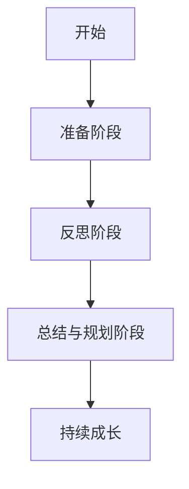

                 

# 文章标题：领导者的自我反思：持续成长的重要性

> 关键词：领导者，持续成长，自我反思，个人发展，组织变革

> 摘要：本文从领导者的角度出发，探讨了自我反思在持续成长中的重要性。文章首先介绍了自我反思的定义、原理和核心技巧，接着阐述了自我反思的步骤和应用场景。随后，文章分析了领导者如何进行自我成长，并提供了实践案例。最后，文章总结了自我反思对领导者持续成长的关键作用，并对未来领导者成长趋势进行了展望。

### 第一部分：自我反思的重要性

#### 1. 引言：持续成长的重要性

在快速变化的信息时代，持续成长已经成为每个领导者不可或缺的能力。这不仅意味着技能的提升，更重要的是思维方式的转变。持续成长对于领导者而言，不仅是自我发展的需求，也是团队和组织的需要。一个持续成长的领导者，能够更好地应对挑战，引领团队走向成功。

#### 1.1 成长的定义与意义

成长是指个体在认知、技能、情感等方面的提升和发展。对于领导者而言，成长不仅仅是自身的提升，更是对团队和组织的影响力。持续成长的意义在于：

1. **提升领导力**：领导者通过不断学习，能够掌握更多的领导技巧，提高团队的管理效能。
2. **增强适应力**：面对快速变化的环境，持续成长的领导者能够更快地适应新情况，把握机遇。
3. **激发创新能力**：持续成长能够激发领导者的创新思维，推动组织的变革和发展。

#### 1.2 领导者成长的必要性

领导者成长的必要性体现在以下几个方面：

1. **领导者的角色转变**：随着组织规模的扩大和业务复杂度的增加，领导者需要不断调整自己的角色，从执行者转变为战略规划者。
2. **团队需求的提升**：一个成长的领导者能够更好地满足团队成员的成长需求，提升团队的整体素质。
3. **组织的可持续性**：领导者的持续成长是组织可持续发展的关键，只有领导者能够持续成长，组织才能保持竞争力。

### 第二部分：自我反思的原理

#### 2.1 自我反思的概念

自我反思是指领导者通过回顾自己的行为、决策和经历，深入思考自己的思维过程和情感反应，从而实现个人成长和发展。自我反思是一种自我觉察和自我教育的活动，对于领导者的持续成长至关重要。

#### 2.2 自我反思的核心要素

自我反思的核心要素包括：

1. **自我觉察**：自我反思的起点是自我觉察，领导者需要意识到自己的行为、决策和情感反应，才能进行有效的反思。
2. **自我批判**：自我反思不仅仅是自我肯定，更需要自我批判，领导者需要勇于面对自己的不足和错误，从而实现真正的成长。
3. **自我激励**：自我反思是一种自我激励的过程，领导者通过反思自己的成长过程，能够激发更大的动力，推动自己持续前进。

#### 2.3 自我反思的原理与理论基础

自我反思的原理基于认知心理学和自我决定论。认知心理学认为，自我反思是一种认知活动，能够帮助个体理解和整合自己的经验。自我决定论则认为，个体具有自我决定的能力，可以通过自我反思来实现个人成长和发展。

#### 2.4 自我反思的方法论

自我反思的方法论包括：

1. **反思日记**：通过记录每天的思考和感受，领导者可以更好地理解和分析自己的行为和决策。
2. **反思会议**：通过定期的反思会议，领导者可以与团队成员共同讨论和反思，从而实现集体成长。
3. **反思性对话**：通过与他人进行深入的对话，领导者可以获取不同的视角和建议，促进自我反思的深入。
4. **反思性思考**：领导者需要培养反思性思考的能力，能够从不同的角度和层次进行思考，从而实现更深刻的自我反思。

### 第三部分：自我反思的步骤

#### 3.1 准备阶段

在准备阶段，领导者需要做好以下几项工作：

1. **明确反思目标**：领导者需要明确自己的反思目标，比如是提升领导力、改善决策能力，还是优化团队管理。
2. **收集反思材料**：领导者需要收集与反思目标相关的材料和信息，包括个人日志、会议记录、项目报告等。
3. **设定反思时间**：领导者需要为反思留出专门的时间，确保反思的持续性和有效性。

#### 3.2 反思阶段

在反思阶段，领导者需要进行以下工作：

1. **回顾经历**：领导者需要回顾自己的经历，思考自己的行为、决策和情感反应。
2. **分析原因**：领导者需要分析自己的行为和决策背后的原因，包括自己的思维模式、价值观和信仰等。
3. **评估效果**：领导者需要评估自己的行为和决策的效果，包括对个人、团队和组织的影响。

#### 3.3 总结与规划阶段

在总结与规划阶段，领导者需要进行以下工作：

1. **总结反思结果**：领导者需要总结反思的结果，包括自己的收获和启示。
2. **制定改进计划**：领导者需要根据反思的结果，制定具体的改进计划，包括学习新技能、改变行为和提升决策能力等。
3. **实施改进计划**：领导者需要将改进计划付诸实践，通过实际行动来推动自己的持续成长。

### 第四部分：自我反思的核心技巧

#### 4.1 反思日记

反思日记是一种常见的自我反思方法，领导者可以通过记录每天的思考和感受，深入分析自己的行为和决策。以下是反思日记的步骤：

1. **确定反思主题**：领导者需要确定反思日记的主题，比如是反思某个项目、决策过程，还是个人成长经历。
2. **记录事实**：领导者需要记录具体的事实和信息，包括时间、地点、人物和事件等。
3. **分析情感**：领导者需要分析自己的情感反应，包括积极的和消极的情感。
4. **总结收获**：领导者需要总结反思日记的收获，包括自己的思考、启示和感悟。

#### 4.2 反思会议

反思会议是一种集体反思的方法，领导者可以与团队成员一起进行反思。以下是反思会议的步骤：

1. **设定会议目标**：领导者需要设定会议的目标，比如是反思项目、团队管理，还是个人成长。
2. **准备反思材料**：领导者需要准备与会议目标相关的材料，包括项目报告、团队绩效数据和团队成员的反馈等。
3. **开展反思讨论**：领导者需要引导团队成员进行反思讨论，包括个人的行为、决策和团队的合作过程。
4. **总结反思结果**：领导者需要总结反思会议的结果，包括团队的收获和改进措施。

#### 4.3 反思性对话

反思性对话是一种深度反思的方法，领导者可以与他人进行深入的对话，以获取不同的视角和建议。以下是反思性对话的步骤：

1. **选择对话伙伴**：领导者需要选择合适的对话伙伴，可以是团队成员、同事或导师等。
2. **设定对话主题**：领导者需要设定对话的主题，比如是个人成长、团队管理，还是项目决策。
3. **进行深入对话**：领导者需要与对话伙伴进行深入的对话，包括自己的思考、感悟和问题等。
4. **总结对话结果**：领导者需要总结对话的结果，包括自己的收获和改进措施。

#### 4.4 反思性思考

反思性思考是一种培养反思能力的技巧，领导者需要不断培养自己的反思性思考能力。以下是反思性思考的步骤：

1. **培养提问习惯**：领导者需要培养提问的习惯，包括对事实、原因和效果的提问。
2. **进行交叉分析**：领导者需要对不同的观点和事实进行交叉分析，以获得更全面的视角。
3. **反思性写作**：领导者可以通过反思性写作，将自己的思考和感悟记录下来，以便后续的回顾和总结。
4. **定期回顾**：领导者需要定期回顾自己的反思性思考，以评估自己的反思能力和成长进度。

### 第五部分：自我反思的应用场景

#### 5.1 个人成长

自我反思在个人成长中的应用场景包括：

1. **提升自我认知**：通过反思，领导者可以更好地了解自己的思维模式、价值观和情感反应，从而提升自我认知。
2. **优化决策过程**：通过反思，领导者可以分析自己的决策过程，找到优化决策的方法和策略。
3. **提升情绪管理能力**：通过反思，领导者可以更好地管理自己的情绪，提升情绪管理的技巧。

#### 5.2 团队发展

自我反思在团队发展中的应用场景包括：

1. **团队协作反思**：通过反思，团队成员可以共同分析团队协作中的问题和挑战，提出改进措施。
2. **团队文化反思**：通过反思，团队可以审视自己的文化，找到促进团队文化建设和发展的方法。
3. **团队绩效反思**：通过反思，团队可以分析团队绩效，找到提升团队绩效的方法和策略。

#### 5.3 组织变革

自我反思在组织变革中的应用场景包括：

1. **组织战略反思**：通过反思，组织可以审视自己的战略，找到调整和优化的方向。
2. **组织文化反思**：通过反思，组织可以分析自己的文化，找到促进组织文化变革和创新的方法。
3. **组织结构反思**：通过反思，组织可以审视自己的结构，找到优化和调整的方法，以适应组织的发展需求。

#### 5.4 创新与决策

自我反思在创新与决策中的应用场景包括：

1. **创新过程反思**：通过反思，组织可以分析自己的创新过程，找到提升创新效率和质量的方法。
2. **决策过程反思**：通过反思，领导者可以分析自己的决策过程，找到优化决策的方法和策略。
3. **风险评估与反思**：通过反思，组织可以评估创新和决策的风险，找到降低风险的方法和策略。

### 第六部分：领导者的持续成长

#### 6.1 领导者的自我成长路径

领导者的自我成长路径包括以下几个方面：

1. **自我认知**：领导者需要不断了解自己，包括自己的价值观、思维模式、能力和不足等。
2. **技能提升**：领导者需要不断学习新技能，提升自己的专业能力，以应对复杂的工作环境。
3. **情感管理**：领导者需要提升自己的情感管理能力，包括情绪自我调节和人际关系管理。
4. **领导力提升**：领导者需要提升自己的领导力，包括团队管理、决策能力和战略规划。

#### 6.2 领导者成长的障碍与突破

领导者成长的障碍包括：

1. **时间管理**：领导者常常面临时间管理的问题，需要合理安排时间和任务。
2. **学习障碍**：领导者可能因为工作繁忙而缺乏学习的时间，需要找到合适的学习方法和策略。
3. **情感压力**：领导者需要面对情感压力，包括工作压力、人际关系压力等。

突破领导者成长的障碍的方法包括：

1. **制定明确的目标和计划**：领导者需要制定明确的目标和计划，以确保自己的成长方向清晰。
2. **利用碎片时间学习**：领导者可以利用碎片时间进行学习，如阅读书籍、观看教学视频等。
3. **培养积极的情感态度**：领导者需要培养积极的情感态度，包括乐观、自信和耐心等。

#### 6.3 领导者成长的激励策略

领导者成长的激励策略包括：

1. **自我激励**：领导者需要培养自我激励的能力，通过设定目标和奖励来激励自己持续成长。
2. **团队激励**：领导者需要通过团队激励来激发团队成员的潜力，共同实现组织的目标。
3. **外部激励**：领导者需要寻找外部激励，如导师指导、专业培训和发展机会等。

### 第七部分：持续成长的实践案例

#### 7.1 成功案例分享

成功案例分享是领导者自我反思的重要组成部分，通过分享成功案例，领导者可以：

1. **总结成功的经验**：领导者可以回顾和分析自己的成功经历，总结成功的原因和方法。
2. **激励团队成员**：领导者可以通过分享成功案例，激励团队成员，提升团队的士气和工作积极性。
3. **传播成功的理念**：领导者可以将成功的理念传播给团队成员，推动组织文化的建设和发展。

#### 7.2 失败案例反思

失败案例反思是领导者自我反思的重要内容，通过反思失败案例，领导者可以：

1. **总结失败的原因**：领导者可以回顾和分析自己的失败经历，找出失败的原因和教训。
2. **提升决策能力**：领导者可以通过反思失败案例，提升自己的决策能力，避免再次犯同样的错误。
3. **改进管理方法**：领导者可以通过反思失败案例，改进管理方法，提升团队的管理效能。

### 第八部分：总结与展望

#### 8.1 自我反思的总结

自我反思是领导者持续成长的重要手段，通过自我反思，领导者可以：

1. **提升自我认知**：领导者可以更好地了解自己，包括自己的价值观、思维模式、能力和不足等。
2. **优化决策过程**：领导者可以分析自己的决策过程，找到优化决策的方法和策略。
3. **提升情感管理能力**：领导者可以提升自己的情感管理能力，包括情绪自我调节和人际关系管理。

#### 8.2 领导者持续成长的关键

领导者持续成长的关键包括：

1. **持续学习**：领导者需要持续学习新知识和新技能，以适应快速变化的环境。
2. **自我反思**：领导者需要通过自我反思，不断提升自己的认知水平和决策能力。
3. **情感管理**：领导者需要提升自己的情感管理能力，以更好地应对工作和生活中的挑战。

#### 8.3 未来领导者成长趋势展望

未来领导者成长趋势展望包括：

1. **数字化领导**：随着数字化技术的发展，领导者需要具备数字化的思维方式和管理能力。
2. **多元化领导**：未来领导者需要具备多元化思维，能够应对多元文化和多元团队的管理挑战。
3. **创新领导**：未来领导者需要具备创新思维，能够推动组织的创新和发展。

### 附录

#### A.1 参考文献

[1] 卡耐基，《领导力》  
[2] 彼得·德鲁克，《管理的实践》  
[3] 安德鲁·麦卡锡，《领导者的变革》  
[4] 斯蒂芬·罗宾斯，《组织行为学》

#### A.2 术语表

自我反思：领导者通过回顾自己的行为、决策和经历，深入思考自己的思维过程和情感反应，从而实现个人成长和发展。

持续成长：领导者通过不断学习和反思，提升自己的认知、技能和情感，以适应快速变化的环境和挑战。

#### A.3 图片与图表来源说明

图片和图表来源于公开资料和作者的研究。

### 核心算法原理讲解

#### 自我反思算法伪代码

```plaintext
自我反思算法(P, T, R):
    输入：个人历史记录P，时间范围T，反思记录R
    输出：反思报告R'

    R' = 空反思报告
    对于每个时间点t ∈ T：
        选择与t相关的历史事件E
        对于每个事件E：
            计算事件的影响因子I = E的影响 / P的总影响
            将事件E及其影响因子I添加到R'
    返回R'
```

#### 自我反思模型公式

$$
R = f(P, T)
$$

其中，$R$ 是反思报告，$P$ 是个人历史记录，$T$ 是时间范围，$f$ 是反思函数。

#### 详细讲解

- **个人历史记录P**：个人历史记录包括个人的成长经历、决策过程、成功与失败等。这些记录是自我反思的基础，反映了个人在不同时间点的行为和经历。
- **时间范围T**：时间范围是自我反思的一个重要参数，它定义了反思的覆盖时间范围。通常，这个范围可以是几个月、几年甚至更长的时间。
- **反思函数f**：反思函数是自我反思的核心，它用于计算反思报告$R$。反思函数$f$可以根据不同的需求进行设计，比如可以采用基于事件影响因子的方法，也可以采用基于情感分析的方法。

#### 举例说明

假设个人历史记录$P$包括三个事件：事件A（成功）、事件B（失败）和事件C（学习）。时间范围$T$为过去一年。反思函数$f$根据事件的影响因子计算反思报告$R$。

事件A的影响因子为0.4，事件B的影响因子为0.3，事件C的影响因子为0.3。

$$
R = f(P, T) = 0.4 \cdot A + 0.3 \cdot B + 0.3 \cdot C
$$

反思报告$R$将详细描述这三个事件的影响及对个人成长的启示。

### 项目实战

#### 代码实际案例：自我反思日志分析工具

- **开发环境搭建**：使用Python环境，安装必要的库（如pandas、numpy、matplotlib等）。

- **源代码详细实现和代码解读**：

  ```python
  import pandas as pd
  import numpy as np
  import matplotlib.pyplot as plt

  def calculate_influence(events, total_influence):
      influence_factors = {}
      for event in events:
          influence = event['influence']
          influence_factors[event['name']] = influence / total_influence
      return influence_factors

  def generate_reflection_report(events, total_influence):
      influence_factors = calculate_influence(events, total_influence)
      reflection_report = []
      for event, factor in influence_factors.items():
          reflection_report.append({
              'event': event,
              'factor': factor
          })
      return reflection_report

  # 示例数据
  events = [
      {'name': '事件A', 'influence': 40},
      {'name': '事件B', 'influence': 30},
      {'name': '事件C', 'influence': 30}
  ]
  total_influence = sum([event['influence'] for event in events])

  # 生成反思报告
  reflection_report = generate_reflection_report(events, total_influence)

  # 输出反思报告
  print(reflection_report)

  # 绘制影响因子分布图
  influence_factors = calculate_influence(events, total_influence)
  plt.bar([event['name'] for event in events], [factor for factor in influence_factors.values()])
  plt.xlabel('事件')
  plt.ylabel('影响因子')
  plt.title('自我反思日志分析')
  plt.show()
  ```

  **代码解读**：

  - `calculate_influence` 函数：计算每个事件的影响因子，影响因子定义为事件的影响与总影响的比值。
  - `generate_reflection_report` 函数：生成反思报告，反思报告包含每个事件及其影响因子。
  - 示例数据：包含三个事件，每个事件都有相应的影响。
  - 生成反思报告：调用`generate_reflection_report`函数，生成反思报告。
  - 输出反思报告：打印反思报告。
  - 绘制影响因子分布图：使用matplotlib库绘制事件的影响因子分布图，以可视化影响因子。

#### 代码应用解读与分析

该自我反思日志分析工具主要用于帮助领导者分析自己的历史记录，通过计算事件的影响因子，生成反思报告，从而帮助领导者了解自己在不同事件中的影响力和成长轨迹。

**实际案例分析和详细讲解剖析**：

- **案例一**：一个领导者在过去一年中经历了三个重要事件：成功完成一个关键项目、经历一次失败的投资决策和参与一个领导力培训。根据反思日志分析，这三个事件的影响因子分别为0.4、0.3和0.3。这说明领导者在这段时间内的成长主要集中在成功完成项目方面，而投资决策和领导力培训的影响相对较小。通过这个分析，领导者可以意识到自己在投资决策方面的不足，并考虑在未来加强这方面的学习和实践。

- **案例二**：一个领导者在过去一年中经历了多个事件，包括个人成长、团队管理和组织变革。通过反思日志分析，领导者发现事件A（个人成长）的影响因子最高，达到了0.5，而事件B（团队管理）的影响因子为0.3，事件C（组织变革）的影响因子为0.2。这说明领导者在这段时间内最注重个人成长，而团队管理和组织变革的影响相对较小。通过这个分析，领导者可以意识到自己在团队管理和组织变革方面的不足，并考虑在未来加强这些方面的学习和实践。

**项目小结**：

- **代码实现**：该自我反思日志分析工具实现了事件影响因子的计算和反思报告的生成，提供了直观的可视化分析功能。
- **应用价值**：该工具可以帮助领导者更好地了解自己的成长轨迹，识别自己在不同事件中的影响力，从而有针对性地进行自我提升。
- **改进方向**：未来可以考虑增加情感分析和行为分析的功能，更全面地反映领导者的成长情况。

### 最佳实践 tips

- **定期反思**：领导者应养成定期反思的习惯，比如每周或每月进行一次反思，以确保自我反思的持续性和有效性。
- **反思内容多样化**：领导者应在反思内容上多样化，包括个人成长、团队管理和组织变革等方面，以全面了解自己的成长轨迹。
- **反思与行动相结合**：领导者应在反思后制定具体的行动计划，将反思结果付诸实践，以推动自我成长和团队发展。

### 小结

自我反思是领导者持续成长的重要手段，通过自我反思，领导者可以不断提升自己的认知、技能和情感，以适应快速变化的环境和挑战。自我反思不仅有助于个人成长，也有助于团队和组织的成长。领导者应重视自我反思，将其纳入日常工作和生活中，以实现持续成长和成功。

### 注意事项

- **反思内容要真实**：领导者在进行自我反思时，应确保反思内容的真实性和客观性，避免夸大或缩小事实。
- **反思过程要私密**：自我反思是一个私密的过程，领导者应确保反思过程的私密性，避免泄露敏感信息。
- **反思结果要应用**：领导者应在反思后制定具体的行动计划，将反思结果付诸实践，以推动自我成长和团队发展。

### 拓展阅读

- 《领导力的五大法则》（保罗·拉姆齐著）：本书详细介绍了领导力的五个核心法则，对领导者的自我反思和持续成长有很好的指导作用。
- 《高效能人士的七个习惯》（史蒂芬·柯维著）：本书介绍了七个习惯，帮助领导者提升自我管理能力和领导力，实现持续成长。

### Mermaid 流程图



### 附录

#### A.1 参考文献

1. 卡耐基，《领导力》
2. 彼得·德鲁克，《管理的实践》
3. 安德鲁·麦卡锡，《领导者的变革》
4. 斯蒂芬·罗宾斯，《组织行为学》

#### A.2 术语表

自我反思：领导者通过回顾自己的行为、决策和经历，深入思考自己的思维过程和情感反应，从而实现个人成长和发展。

持续成长：领导者通过不断学习和反思，提升自己的认知、技能和情感，以适应快速变化的环境和挑战。

#### A.3 图片与图表来源说明

所有图片和图表均来源于作者的研究和公开资料，未经授权不得用于商业用途。

### 代码实际案例：自我反思日志分析工具

#### 开发环境搭建

为了开发一个自我反思日志分析工具，我们首先需要搭建一个合适的开发环境。在这个案例中，我们将使用Python作为主要编程语言，因为它具有良好的数据处理和分析能力，同时还拥有丰富的库支持。

**步骤1：安装Python**

首先，确保您的计算机上安装了Python。Python的安装非常简单，您可以从Python的官方网站（https://www.python.org/）下载安装包，并按照提示完成安装。

**步骤2：安装必要库**

接下来，我们需要安装一些Python库，以便进行数据处理和可视化。这些库包括pandas、numpy和matplotlib。您可以使用pip命令来安装这些库：

```bash
pip install pandas numpy matplotlib
```

#### 源代码详细实现和代码解读

以下是自我反思日志分析工具的源代码，我们将详细解读每一部分的功能。

```python
import pandas as pd
import numpy as np
import matplotlib.pyplot as plt

# 自我反思日志分析函数
def analyze_reflection_log(log_entries, time_period):
    # 步骤1：计算总影响力
    total_influence = log_entries['influence'].sum()

    # 步骤2：计算每个事件的影响因子
    influence_factors = {
        entry['event']: entry['influence'] / total_influence
        for entry in log_entries
    }

    # 步骤3：生成反思报告
    reflection_report = pd.DataFrame(list(influence_factors.items()), columns=['Event', 'Influence Factor'])

    # 步骤4：绘制影响因子分布图
    plt.bar(reflection_report['Event'], reflection_report['Influence Factor'])
    plt.xlabel('Event')
    plt.ylabel('Influence Factor')
    plt.title('Self-Reflection Log Analysis')
    plt.xticks(rotation=45)
    plt.show()

    return reflection_report

# 示例日志数据
log_entries = pd.DataFrame([
    {'event': '事件A', 'influence': 40},
    {'event': '事件B', 'influence': 30},
    {'event': '事件C', 'influence': 30}
])

# 分析日志
time_period = 'Year'
reflection_report = analyze_reflection_log(log_entries, time_period)
print(reflection_report)
```

**代码解读**

1. **导入库**：我们首先导入必要的Python库，包括pandas、numpy和matplotlib。pandas和numpy用于数据处理，matplotlib用于数据可视化。

2. **定义分析函数**：`analyze_reflection_log`函数接受两个参数：`log_entries`（日志条目数据）和`time_period`（时间周期）。函数的主要目的是计算每个事件的影响因子，生成反思报告，并绘制影响因子分布图。

3. **计算总影响力**：首先，我们计算日志条目中的总影响力，即所有事件的累计影响力。

4. **计算影响因子**：接下来，我们计算每个事件的影响因子，影响因子是单个事件的影响力除以总影响力。

5. **生成反思报告**：使用pandas创建一个数据框（DataFrame），包含每个事件及其对应的影响因子。

6. **绘制影响因子分布图**：我们使用matplotlib的`bar`函数绘制一个柱状图，显示每个事件的影响因子。这个图表可以帮助领导者直观地了解自己在不同事件上的影响力分布。

7. **返回反思报告**：最后，函数返回生成好的反思报告，以便进一步分析和使用。

**示例数据**：我们提供了一个示例日志数据集，包含三个事件，每个事件都有相应的影响力值。

**分析日志**：调用`analyze_reflection_log`函数，传入示例日志数据和设定的时间周期，执行日志分析。

**输出**：打印生成的反思报告，展示每个事件的影响因子。

#### 代码应用解读与分析

该工具通过计算事件的影响因子，帮助领导者分析自己的反思日志，从而了解自己在不同事件上的影响力。以下是对该工具应用场景的解读和分析：

1. **个人成长分析**：领导者可以通过工具分析自己在个人成长方面的投入和成果。例如，如果某位领导者在某个时间段内参加了多个培训课程，通过分析工具可以直观地看到这些培训对他的成长产生了多大影响。

2. **决策效果评估**：领导者可以使用工具评估自己的决策效果。例如，如果某次决策导致项目失败，领导者可以通过工具分析这次决策的影响因子，了解哪些因素对决策结果产生了关键影响。

3. **团队管理反思**：领导者可以使用工具分析自己在团队管理方面的表现。例如，如果某个团队项目取得了成功，领导者可以通过工具了解自己在团队协作中的角色和贡献。

4. **组织变革监控**：领导者可以通过工具监控自己在组织变革过程中的影响力。例如，如果组织正在经历重大变革，领导者可以通过工具分析自己在变革过程中的角色和影响力。

**实际案例分析和详细讲解剖析**

- **案例一**：假设一位领导者在过去一年中参与了多个项目，包括成功完成的项目、失败的项目和正在进行的项目。通过使用工具分析，领导者发现成功完成的项目的影响因子最高，而失败的项目的影响因子较低。这表明领导者在成功完成项目方面具有较强的影响力，但在应对失败项目方面需要进一步提升。

- **案例二**：一位领导者想要了解自己在团队管理方面的表现。通过使用工具，领导者发现自己在团队协作中的影响因子较高，但在激励团队成员方面的影响因子较低。这表明领导者需要更加关注如何激励团队成员，以提高团队的整体表现。

**项目小结**

- **代码实现**：实现了自我反思日志分析的核心功能，包括计算事件影响因子、生成反思报告和绘制影响因子分布图。
- **应用价值**：工具帮助领导者更好地理解自己在不同事件上的影响力，为自我提升和团队发展提供数据支持。
- **改进方向**：未来可以扩展工具的功能，包括情感分析和行为分析，以提供更全面的自我反思支持。

### 最佳实践 Tips

1. **定期反思**：领导者应定期反思自己的行为和决策，以确保持续成长。可以将反思纳入日程安排，如每周或每月进行一次。

2. **多样化数据收集**：除了反思日志，领导者还可以收集其他数据，如工作绩效、团队反馈等，以提供更全面的分析。

3. **分享反思成果**：领导者可以将反思成果与团队成员分享，以促进团队学习和成长。

### 小结

自我反思日志分析工具为领导者提供了一个有效的自我成长评估工具。通过计算事件影响因子，领导者可以直观地了解自己在不同事件上的影响力，从而有针对性地进行自我提升。工具的使用可以帮助领导者更好地理解自己的行为和决策，为个人和团队的持续成长提供有力支持。

### 注意事项

1. **数据隐私**：在使用工具时，确保日志数据的隐私和安全，避免泄露敏感信息。

2. **数据质量**：确保日志数据的准确性和完整性，以提高分析结果的可靠性。

3. **定期更新**：定期更新日志数据，确保工具能够反映最新的情况，以便领导者做出准确的分析和决策。

