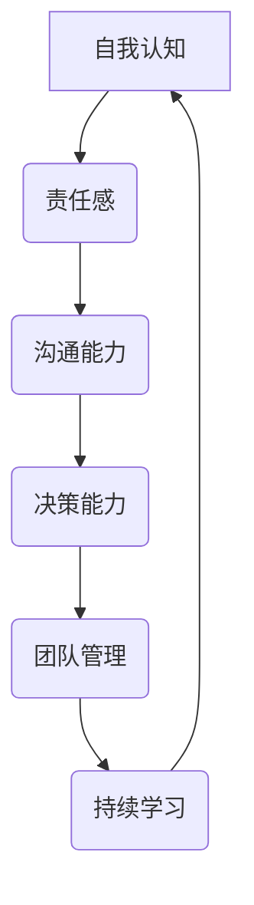

                 


## 领导者的自我成长：持续学习的重要性

### 关键词
- 持续学习
- 领导者成长
- 自我认知
- 学习策略
- 领导力提升

### 摘要
本文旨在探讨领导者自我成长的本质，特别是持续学习在这一过程中的核心作用。通过深入分析领导者的角色与责任，自我认知与提升的方法，持续学习的动力与障碍，以及实践中的学习策略和方法，本文为领导者提供了一个系统化的自我成长框架，以应对快速变化的技术环境和社会需求。

## 第1章 领导者的角色与责任

### 1.1 领导者的定义与特质

#### 领导者的定义
领导者是在组织中具有影响力，能够引导和激励团队成员实现共同目标的人。他们不仅是策略的制定者，更是团队成员的榜样和指导者。

**Mermaid 流程图：领导者特质的发展路径**


#### 领导者的特质
1. **自我认知**：领导者首先要了解自己的优点和不足，这有助于他们在团队中建立信任和权威。
2. **责任感**：领导者必须对团队和组织的目标负责，能够在关键时刻承担风险和责任。
3. **沟通能力**：良好的沟通能力是领导者的重要特质，它有助于有效地传达信息，协调团队工作。
4. **决策能力**：领导者需要具备快速决策和正确决策的能力，以确保团队朝着正确的方向前进。
5. **团队管理**：领导者要能够管理团队，激发成员的潜力，创造一个积极的工作环境。
6. **持续学习**：在快速变化的世界中，持续学习是领导者保持竞争力的关键。

### 1.2 领导者的三大责任

**核心算法原理讲解：领导者的三大责任模型**

```python
class LeadershipResponsibilities:
    def __init__(self):
        self.lead_team = True
        self.strategic_planning = True
        self.employee_development = True

    def lead_team(self):
        # 领导团队，确保团队目标明确，成员积极协作
        pass

    def strategic_planning(self):
        # 制定战略，规划发展方向，确保组织长远利益
        pass

    def employee_development(self):
        # 员工发展，培养人才，提升团队整体能力
        pass
```

#### 领导者的三大责任
1. **领导团队**：确保团队的目标明确，成员能够积极协作，共同实现目标。
2. **战略规划**：制定组织的长远发展策略，确保组织在竞争中保持优势。
3. **员工发展**：培养员工的能力，提升团队的整体素质，为组织的长期发展奠定基础。

### 1.3 领导者的核心能力

**数学模型：领导者核心能力的量化分析**

$$
能力得分 = （沟通能力得分 \times 0.4）+ （决策能力得分 \times 0.3）+ （团队管理能力得分 \times 0.3）
$$

**举例说明：**

- 沟通能力得分：85
- 决策能力得分：90
- 团队管理能力得分：88

$$
能力得分 = （85 \times 0.4）+ （90 \times 0.3）+ （88 \times 0.3）= 34 + 27 + 26.4 = 87.4
$$

## 第2章 自我认知与自我提升

### 2.1 自我认知的重要性

自我认知是领导者成长的第一步，它帮助领导者了解自己的优点和不足，从而更好地发挥自己的优势，改进不足。

**数学公式：自我认知度的计算公式**

$$
自我认知度 = \frac{实际自我认知得分}{理论最高自我认知得分} \times 100\%
$$

**举例说明：**

- 实际自我认知得分：75
- 理论最高自我认知得分：100

$$
自我认知度 = \frac{75}{100} \times 100\% = 75\%
$$

### 2.2 自我提升的方法与实践

领导者提升自我能力的方法包括：

1. **持续学习**：通过阅读、培训、交流等方式，不断学习新知识和技能。
2. **实践锻炼**：在实际工作中，通过解决问题和面对挑战来提升自我能力。
3. **反思总结**：定期反思自己的工作，总结经验教训，不断改进。

### 2.3 自我反思与持续改进

自我反思是领导者提升自我能力的重要方法。通过反思，领导者可以发现自己的不足，并制定改进计划。

**案例分享：**

某技术领导者通过自我反思，发现自己在项目管理方面存在不足。于是，他参加了项目管理培训，并在实际工作中应用所学知识，逐步提升了自己的项目管理能力。

## 第3章 持续学习的动力与障碍

### 3.1 持续学习的动力来源

持续学习的动力来源于领导者对自我成长的需求，对组织发展的责任感，以及对未来职业发展的期望。

### 3.2 持续学习中的障碍与解决

持续学习中可能会遇到的障碍包括：

1. **时间压力**：解决方法：合理安排时间，利用碎片时间学习。
2. **缺乏动力**：解决方法：设定明确的学习目标和奖励机制。
3. **信息过载**：解决方法：学会信息筛选，关注高质量的学习资源。

### 3.3 培养持续学习习惯的策略

1. **制定学习计划**：明确学习目标和时间安排。
2. **保持好奇心**：对未知保持好奇，积极探索新知识。
3. **定期复盘**：总结学习成果，反思学习过程。

## 第二部分：持续学习的实践方法

### 第4章：知识管理与信息筛选

### 4.1 知识管理的概念与作用

知识管理是指通过获取、创造、存储、共享和利用知识，以提高组织的效率和竞争力。

### 4.2 信息过载与筛选方法

在信息爆炸的时代，领导者需要学会筛选信息，关注高质量的知识源。

### 4.3 有效学习与高效工作

领导者需要平衡学习与工作，通过有效学习提高工作效率。

## 第5章：学习策略与技巧

### 5.1 学习策略的选择

领导者应根据个人需求和兴趣选择合适的 学习策略。

### 5.2 学习技巧的提高

领导者可以通过多种方式提高学习技巧，如：

1. **深度学习**：深入理解知识，建立知识体系。
2. **批判性思维**：培养独立思考能力，不盲从。

### 5.3 学习成果的评估与反馈

领导者应定期评估学习成果，并根据反馈进行调整。

## 第6章：跨界学习与知识整合

### 6.1 跨界学习的价值

跨界学习有助于领导者开拓视野，提升创新能力。

### 6.2 跨界学习的途径与方法

领导者可以通过参加跨学科课程、阅读跨学科书籍、参与跨领域讨论等方式进行跨界学习。

### 6.3 知识整合与创新

领导者应学会整合不同领域的知识，实现创新。

## 第三部分：持续学习在领导力提升中的应用

### 第7章：团队学习与领导力

### 7.1 团队学习的重要性

团队学习有助于提升团队的整体能力，增强团队凝聚力。

### 7.2 领导者如何推动团队学习

领导者可以通过以下方式推动团队学习：

1. **制定学习计划**：明确团队学习的目标和内容。
2. **鼓励分享与交流**：为团队成员提供分享和交流的平台。
3. **激励学习**：设立学习奖励机制，激发团队学习热情。

### 7.3 学习型组织的构建与维护

构建学习型组织需要：

1. **建立共同愿景**：明确组织的发展目标。
2. **营造学习氛围**：鼓励员工持续学习，创造良好的学习环境。
3. **完善学习机制**：建立完善的学习制度和流程。

## 第8章：持续学习与领导力发展

### 8.1 持续学习对领导力发展的作用

持续学习是领导者提升领导力的关键因素。

### 8.2 领导力发展的路径与实践

领导者可以通过以下路径和实践提升领导力：

1. **自我反思与成长**：通过反思和总结，不断提升自我。
2. **学习与实践相结合**：将所学知识应用于实际工作中。
3. **领导力培训与交流**：参加培训课程，与同行交流。

### 8.3 领导力发展的障碍与突破

领导力发展过程中可能遇到的障碍包括：

1. **认知局限**：突破方法：拓宽视野，学习新知识。
2. **时间压力**：突破方法：合理安排时间，提高工作效率。

## 第9章：持续学习与领导力的未来

### 9.1 持续学习与未来领导力的需求

未来领导力需要具备以下能力：

1. **创新思维**：领导者应具备创新思维，引领组织发展。
2. **跨领域知识**：领导者应具备跨领域知识，应对复杂问题。
3. **领导力新趋势**：关注领导力的新趋势，如数字化领导、全球化领导等。

### 9.2 未来领导力的培养与塑造

培养未来领导力需要：

1. **持续学习**：通过学习不断更新知识体系。
2. **实践锻炼**：通过实际工作锻炼领导能力。
3. **领导力培训**：参加专业的领导力培训课程。

### 9.3 领导者如何引领未来

领导者应：

1. **预见未来趋势**：关注行业发展趋势，引领组织变革。
2. **创新管理模式**：探索新的管理模式，提高组织竞争力。
3. **培养下一代领导者**：关注年轻人才的培养，为组织注入新鲜血液。

## 附录

### 附录A：持续学习资源推荐

#### A.1 在线学习平台介绍

- Coursera
- edX
- Udemy

#### A.2 经典学习书籍推荐

- 《高效能人士的七个习惯》
- 《深度工作》
- 《学习之道》

#### A.3 学习社区与交流平台

- LinkedIn Learning
- Reddit
- Quora

### 附录B：学习技巧与工具

#### B.1 学习工具的选择

- Notion
- Evernote
- Trello

#### B.2 学习笔记与总结技巧

- 康奈尔笔记法
- 复述法
- 画图法

#### B.3 学习计划的制定与执行

- 设定明确的学习目标
- 制定详细的学习计划
- 定期检查执行情况

## 作者

作者：AI天才研究院/AI Genius Institute & 禅与计算机程序设计艺术 /Zen And The Art of Computer Programming

----------------------------------------------

### 文章总结与展望

本文系统地探讨了领导者的自我成长，特别是持续学习在其中的重要性。通过分析领导者的角色与责任，自我认知与提升的方法，持续学习的动力与障碍，以及实践中的学习策略和方法，为领导者提供了一个全面的自我成长框架。持续学习不仅是领导者个人发展的关键，也是团队和组织成功的基石。

在未来的领导力发展中，领导者需要更加注重跨界学习和知识整合，以应对快速变化的世界。同时，领导者还应关注新兴的领导力趋势，如数字化领导、全球化领导等，不断提升自身能力，引领组织走向未来。

我们鼓励读者持续关注领导力的发展，积极实践所学知识，不断提升自我。希望本文能为您提供有价值的启示和帮助。

---

### 注意事项与拓展阅读

在撰写技术博客时，以下注意事项将有助于提升文章的质量：

1. **逻辑清晰**：确保文章结构合理，内容连贯，逻辑清晰。
2. **术语准确**：使用专业术语，确保准确性，避免使用模糊不清的表达。
3. **实例丰富**：提供具体实例，以加深读者对概念的理解。
4. **图表使用**：合理使用图表和流程图，有助于读者更好地理解复杂的概念。
5. **代码示例**：如有必要，提供代码示例，以便读者实践和验证。

拓展阅读推荐：

- 《领导力心理学》
- 《跨界创新》
- 《学习之道：如何掌握任何技能》

通过阅读这些书籍，您可以进一步深入了解领导力和学习策略的深度和实践方法。希望这些建议和资源能对您的学习和写作有所启发。

---

**作者：AI天才研究院/AI Genius Institute & 禅与计算机程序设计艺术 /Zen And The Art of Computer Programming**

----------------------------------------------

### 文章总结与展望

本文系统地探讨了领导者的自我成长，特别是持续学习在其中的重要性。通过分析领导者的角色与责任，自我认知与提升的方法，持续学习的动力与障碍，以及实践中的学习策略和方法，为领导者提供了一个全面的自我成长框架。持续学习不仅是领导者个人发展的关键，也是团队和组织成功的基石。

在未来的领导力发展中，领导者需要更加注重跨界学习和知识整合，以应对快速变化的世界。同时，领导者还应关注新兴的领导力趋势，如数字化领导、全球化领导等，不断提升自身能力，引领组织走向未来。

我们鼓励读者持续关注领导力的发展，积极实践所学知识，不断提升自我。希望本文能为您提供有价值的启示和帮助。

---

### 注意事项与拓展阅读

在撰写技术博客时，以下注意事项将有助于提升文章的质量：

1. **逻辑清晰**：确保文章结构合理，内容连贯，逻辑清晰。
2. **术语准确**：使用专业术语，确保准确性，避免使用模糊不清的表达。
3. **实例丰富**：提供具体实例，以加深读者对概念的理解。
4. **图表使用**：合理使用图表和流程图，有助于读者更好地理解复杂的概念。
5. **代码示例**：如有必要，提供代码示例，以便读者实践和验证。

拓展阅读推荐：

- 《领导力心理学》
- 《跨界创新》
- 《学习之道：如何掌握任何技能》

通过阅读这些书籍，您可以进一步深入了解领导力和学习策略的深度和实践方法。希望这些建议和资源能对您的学习和写作有所启发。

---

**作者：AI天才研究院/AI Genius Institute & 禅与计算机程序设计艺术 /Zen And The Art of Computer Programming**

