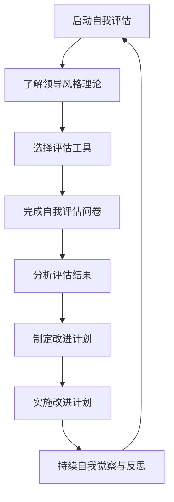

                 


## 文章标题：领导者的自我觉察：理解自身领导风格的影响

在信息技术快速发展的当今社会，企业对领导者提出了更高的要求。领导者不仅需要具备卓越的技术和管理能力，还要深刻理解自身的领导风格，并能够根据不同情境灵活调整。本文将以《领导者的自我觉察：理解自身领导风格的影响》为题，探讨领导者如何通过自我觉察来优化领导风格，提升团队绩效。

## 关键词：
- 自我觉察
- 领导风格
- 权威型领导
- 民主型领导
- 支持型领导
- 变革型领导
- 交易型领导
- 团队绩效

## 摘要：
本文首先介绍自我觉察的重要性及其在领导者角色中的价值。接着，我们将探讨领导风格的基本理论，分析常见的领导风格类型及其对团队和组织的影响。随后，我们将介绍自我评估工具和方法，帮助领导者进行自我评估。接下来，文章将深入分析认知与行为模式，探讨自我觉察对认知与行为模式的影响。随后，我们将针对不同领导风格进行自我觉察的实践指导。最后，文章将总结领导风格的整合与发展，以及在领导决策和组织发展中的应用，并提供案例研究以供参考。

### 《领导者的自我觉察：理解自身领导风格的影响》目录大纲

**第一部分：引言**

**第1章：自我觉察的重要性**
- **1.1.1 自我觉察的概念与价值**
- **1.1.2 自我觉察在领导者角色中的作用**
- **1.1.3 本书的目的与结构**

**第2章：领导风格的基本理论**
- **2.1.1 领导风格的理论框架**
- **2.1.2 常见的领导风格类型**
- **2.1.3 领导风格对团队和组织的影响**

**第3章：自我评估工具与方法**
- **3.1.1 自我评估的重要性**
- **3.1.2 评估工具的选择与应用**
- **3.1.3 自我评估的过程与方法**

**第4章：认知与行为模式的探索**
- **4.1.1 认知与行为模式的基本概念**
- **4.1.2 自我觉察对认知与行为模式的影响**
- **4.1.3 探索自我认知与行为模式的实践方法**

**第二部分：具体领导风格的自我觉察**

**第5章：权威型领导风格**
- **5.1.1 权威型领导风格的特点**
- **5.1.2 权威型领导风格的优势与劣势**
- **5.1.3 权威型领导者的自我觉察实践**

**第6章：民主型领导风格**
- **6.1.1 民主型领导风格的特点**
- **6.1.2 民主型领导风格的优势与劣势**
- **6.1.3 民主型领导者的自我觉察实践**

**第7章：支持型领导风格**
- **7.1.1 支持型领导风格的特点**
- **7.1.2 支持型领导风格的优势与劣势**
- **7.1.3 支持型领导者的自我觉察实践**

**第8章：变革型领导风格**
- **8.1.1 变革型领导风格的特点**
- **8.1.2 变革型领导风格的优势与劣势**
- **8.1.3 变革型领导者的自我觉察实践**

**第9章：交易型领导风格**
- **9.1.1 交易型领导风格的特点**
- **9.1.2 交易型领导风格的优势与劣势**
- **9.1.3 交易型领导者的自我觉察实践**

**第三部分：综合应用与实践**

**第10章：领导风格的整合与发展**
- **10.1.1 领导风格的整合与适应**
- **10.1.2 领导风格的发展与转变**
- **10.1.3 领导者的持续自我觉察**

**第11章：自我觉察在领导决策中的应用**
- **11.1.1 自我觉察在决策中的角色**
- **11.1.2 决策过程中的自我觉察实践**
- **11.1.3 自我觉察对决策效果的提升**

**第12章：领导者的自我成长与组织发展**
- **12.1.1 自我觉察与领导者成长**
- **12.1.2 自我觉察与组织文化塑造**
- **12.1.3 自我觉察对组织发展的贡献**

**第13章：案例研究**
- **13.1.1 案例研究的意义**
- **13.1.2 成功案例的启示**
- **13.1.3 失败案例的反思**

**附录**

**附录A：领导风格评估工具**
- **A.1.1 领导风格评估问卷**
- **A.1.2 领导风格评估案例分析**

**附录B：参考文献**
- **B.1.1 有关领导风格的经典文献**
- **B.1.2 有关自我觉察的相关研究**

**Mermaid 流程图：领导风格自我评估流程**



**权威型领导风格算法原理讲解伪代码**

```python
# 定义权威型领导风格评估函数
def authority_style_evaluation(employee_feedback, team_performance):
    # 初始化评估分数
    score = 0
    
    # 分析员工反馈
    for feedback in employee_feedback:
        if "服从指令" in feedback or "领导决策果断" in feedback:
            score += 1
    
    # 分析团队绩效
    for performance in team_performance:
        if performance > team_average_performance:
            score += 1
    
    # 返回最终评估分数
    return score
```

### 文章正文

**第一部分：引言**

#### 第1章：自我觉察的重要性

##### 1.1.1 自我觉察的概念与价值

自我觉察是指个体对自己内在心理状态、情感、信念和思维过程的认知和理解。它不仅是个人成长和发展的基石，也是领导者提升管理能力的关键。自我觉察的价值在于：

1. **增强自我认知**：自我觉察帮助领导者认识到自己的行为模式、思维方式和情感状态，从而更好地理解自己和他人。
2. **提升情绪智力**：自我觉察使领导者能够更好地管理自己的情绪，以及在与团队成员互动时保持冷静和理性。
3. **优化决策过程**：通过自我觉察，领导者能够更全面地评估各种决策的潜在影响，从而做出更明智的选择。

##### 1.1.2 自我觉察在领导者角色中的作用

自我觉察对领导者的重要性体现在以下几个方面：

1. **改善团队沟通**：领导者通过自我觉察能够更好地理解团队成员的需求和期望，从而建立更有效的沟通机制。
2. **提升团队凝聚力**：自我觉察使领导者能够更好地识别团队中的问题和矛盾，并采取有效的措施解决，增强团队凝聚力。
3. **促进个人成长**：自我觉察帮助领导者认识到自身的局限和不足，从而有针对性地进行个人成长和提升。

##### 1.1.3 本书的目的与结构

本书旨在帮助领导者通过自我觉察来理解自身领导风格的影响，提升管理能力，实现个人和团队的共同成长。文章结构分为三个部分：

1. **引言**：介绍自我觉察的重要性及其在领导者角色中的应用。
2. **具体领导风格的自我觉察**：分析权威型、民主型、支持型、变革型和交易型领导风格，探讨自我觉察的方法和实践。
3. **综合应用与实践**：讨论领导风格的整合与发展，自我觉察在领导决策和组织发展中的应用，并提供案例研究。

#### 第2章：领导风格的基本理论

##### 2.1.1 领导风格的理论框架

领导风格是指领导者处理和管理团队的方式，它受到领导者的个性、价值观、经验和情境的影响。领导风格的基本理论框架包括以下几个方面：

1. **行为导向理论**：认为领导风格主要取决于领导者的行为，如指令性、支持性、参与性等。
2. **情境理论**：认为领导风格应根据不同的情境进行灵活调整，如费德勒模型、赫塞和布兰查德的情境领导理论等。
3. **权力基础理论**：认为领导者的权力基础决定了其领导风格，如权威型、民主型、变革型等。

##### 2.1.2 常见的领导风格类型

常见的领导风格类型包括：

1. **权威型领导**：领导者拥有绝对的决策权，通过指令性管理来确保团队目标的实现。
2. **民主型领导**：领导者鼓励团队成员参与决策过程，尊重团队成员的意见和贡献。
3. **支持型领导**：领导者关注团队成员的个人需求，提供支持和鼓励，以增强团队成员的动机和满意度。
4. **变革型领导**：领导者通过激发团队成员的激情和使命感，推动团队实现变革和创新。
5. **交易型领导**：领导者通过明确奖惩机制来激励团队成员，确保团队目标的实现。

##### 2.1.3 领导风格对团队和组织的影响

领导风格对团队和组织的影响体现在以下几个方面：

1. **团队绩效**：不同的领导风格对团队绩效有着不同的影响。权威型领导可能提高团队执行效率，但可能导致团队成员的满意度降低；而变革型领导则可能激发团队成员的创造力和积极性，从而提高团队绩效。
2. **团队氛围**：领导风格对团队氛围有着重要的影响。民主型领导和支持型领导能够营造积极的团队氛围，增强团队成员的归属感和信任感；而权威型领导则可能导致团队氛围紧张，影响团队成员的合作。
3. **组织文化**：领导风格对组织文化有着深远的影响。领导者的行为和价值观会潜移默化地传递给团队成员，从而塑造组织的文化和价值观。

#### 第3章：自我评估工具与方法

##### 3.1.1 自我评估的重要性

自我评估是领导者理解自身领导风格的重要方法。通过自我评估，领导者可以：

1. **识别自身优势和不足**：自我评估可以帮助领导者认识到自身的优势和不足，从而有针对性地进行提升。
2. **优化领导风格**：自我评估使领导者能够识别出当前领导风格中的问题，并采取相应的措施进行优化。

##### 3.1.2 评估工具的选择与应用

选择适合的评估工具是进行有效自我评估的关键。常见的评估工具包括：

1. **领导风格问卷**：如迈尔斯-布里格斯类型指标（MBTI）和领导风格量表（LSD），通过问卷的形式帮助领导者了解自身的领导风格。
2. **360度反馈**：通过团队成员、上级和同事的反馈，全面了解领导者的领导风格和表现。
3. **领导技能评估工具**：如领导力发展中心（LDC）和领导力发展评估（LDA），评估领导者的综合领导能力。

##### 3.1.3 自我评估的过程与方法

进行自我评估的过程通常包括以下几个步骤：

1. **确定评估目标**：明确评估的目的和目标，如提升领导能力、优化领导风格等。
2. **选择评估工具**：根据评估目标选择合适的评估工具。
3. **进行自我评估**：使用评估工具进行自我评估，收集相关数据。
4. **分析评估结果**：对评估结果进行深入分析，识别自身优势和不足。
5. **制定改进计划**：根据评估结果，制定具体的改进计划，如参加培训、改变领导行为等。
6. **实施改进计划**：按照改进计划进行实际行动，持续提升领导能力。
7. **跟踪与反思**：对改进计划的实施效果进行跟踪，并进行反思和调整。

#### 第4章：认知与行为模式的探索

##### 4.1.1 认知与行为模式的基本概念

认知与行为模式是指个体在思考和行动过程中形成的固定模式。认知模式包括思维习惯、价值观、信念等，而行为模式包括行为习惯、决策风格等。认知与行为模式对领导者的领导风格有着深远的影响。

1. **认知模式**：领导者的认知模式决定了他们如何看待和解读情境，以及如何做出决策。例如，权威型领导可能更倾向于采用理性的思维方式，而变革型领导则可能更注重感性和创新。
2. **行为模式**：领导者的行为模式是他们处理和管理团队的方式。不同的行为模式会导致不同的领导风格，如权威型领导更倾向于指令性管理，而支持型领导则更注重团队成员的需求。

##### 4.1.2 自我觉察对认知与行为模式的影响

自我觉察对认知与行为模式有着重要的影响。通过自我觉察，领导者可以：

1. **识别认知与行为模式的不足**：自我觉察使领导者能够认识到自身认知与行为模式的不足，从而有针对性地进行改进。
2. **优化认知与行为模式**：自我觉察帮助领导者识别出有效的认知与行为模式，并加以优化，从而提升领导能力。

##### 4.1.3 探索自我认知与行为模式的实践方法

探索自我认知与行为模式的实践方法包括以下几个方面：

1. **反思日记**：定期记录自己的思考和行为，分析其中的问题和不足，从而进行有针对性的改进。
2. **导师辅导**：寻找一位经验丰富的导师，通过与导师的交流和反馈，深入了解自身的认知与行为模式。
3. **反馈机制**：建立有效的反馈机制，如360度反馈，收集团队成员和上级的反馈，了解自身的领导风格和行为模式。
4. **心理测评**：通过心理测评工具，如MBTI和领导力问卷，了解自身的认知与行为模式，从而进行针对性的改进。

### 第二部分：具体领导风格的自我觉察

#### 第5章：权威型领导风格

##### 5.1.1 权威型领导风格的特点

权威型领导风格是指领导者通过明确的指令和严格的控制来确保团队目标的实现。权威型领导风格的特点包括：

1. **高度集中的决策权**：领导者拥有绝对的决策权，所有决策都由领导者做出。
2. **指令性管理**：领导者通过指令性管理来确保团队成员按照预定计划执行任务。
3. **严格监督**：领导者对团队成员的工作进行严格监督，确保任务按质按量完成。

##### 5.1.2 权威型领导风格的优势与劣势

权威型领导风格的优势包括：

1. **高效执行力**：权威型领导能够迅速做出决策，并确保团队成员按照计划执行，从而提高团队执行力。
2. **明确责任**：领导者通过明确指令和监督，使团队成员明确自己的职责和任务，提高责任感。

权威型领导风格的劣势包括：

1. **缺乏团队参与**：权威型领导可能导致团队成员缺乏参与感，从而降低团队凝聚力和创造力。
2. **压抑个性**：权威型领导可能压制团队成员的个性，从而影响团队成员的积极性和创造力。

##### 5.1.3 权威型领导者的自我觉察实践

权威型领导者通过以下方法进行自我觉察：

1. **反思管理行为**：定期反思自己的管理行为，分析是否存在过度控制或缺乏参与的问题。
2. **倾听团队成员的意见**：主动倾听团队成员的意见和建议，了解他们的需求和期望，从而调整领导风格。
3. **培训与学习**：参加相关培训和学习，了解不同的领导风格，从而进行自我提升。
4. **建立反馈机制**：建立有效的反馈机制，收集团队成员和上级的反馈，了解自身的领导风格和行为模式。

#### 第6章：民主型领导风格

##### 6.1.1 民主型领导风格的特点

民主型领导风格是指领导者鼓励团队成员参与决策过程，尊重团队成员的意见和贡献。民主型领导风格的特点包括：

1. **决策参与**：领导者鼓励团队成员参与决策过程，听取他们的意见和建议。
2. **协商式管理**：领导者通过协商和讨论来解决问题，确保团队成员的参与和认同。
3. **支持型领导**：领导者关注团队成员的个人需求，提供支持和鼓励，以增强团队成员的动机和满意度。

##### 6.1.2 民主型领导风格的优势与劣势

民主型领导风格的优势包括：

1. **提高团队凝聚力**：民主型领导风格能够增强团队成员之间的沟通和合作，提高团队凝聚力。
2. **激发创造力**：民主型领导鼓励团队成员的参与和创新，从而激发团队成员的创造力和积极性。

民主型领导风格的劣势包括：

1. **决策缓慢**：由于需要团队成员的参与和讨论，民主型领导可能导致决策过程变得缓慢。
2. **团队依赖性**：民主型领导可能导致团队成员过度依赖领导者，从而影响团队独立性和自主性。

##### 6.1.3 民主型领导者的自我觉察实践

民主型领导者通过以下方法进行自我觉察：

1. **鼓励团队成员参与**：主动鼓励团队成员参与决策过程，倾听他们的意见和建议。
2. **反思参与程度**：定期反思自己在决策过程中是否真正倾听团队成员的意见，是否存在忽视团队参与的问题。
3. **培训与学习**：参加相关培训和学习，了解不同的领导风格，从而进行自我提升。
4. **建立有效的沟通机制**：建立有效的沟通机制，确保团队成员的意见和建议能够被及时传达和反馈。

#### 第7章：支持型领导风格

##### 7.1.1 支持型领导风格的特点

支持型领导风格是指领导者关注团队成员的个人需求，提供支持和鼓励，以增强团队成员的动机和满意度。支持型领导风格的特点包括：

1. **关注个人需求**：领导者关注团队成员的个人需求，提供个性化的支持和鼓励。
2. **建立信任关系**：领导者通过建立信任关系，与团队成员建立良好的沟通和合作关系。
3. **提供职业发展机会**：领导者为团队成员提供职业发展的机会和资源，帮助他们实现个人目标和职业发展。

##### 7.1.2 支持型领导风格的优势与劣势

支持型领导风格的优势包括：

1. **增强团队凝聚力**：支持型领导风格能够增强团队成员之间的信任和合作，提高团队凝聚力。
2. **激发积极性**：领导者关注团队成员的个人需求，提供支持和鼓励，从而激发团队成员的积极性和工作动力。

支持型领导风格的劣势包括：

1. **资源消耗**：支持型领导风格需要领导者投入更多的时间和精力来关注团队成员的个人需求，从而可能导致资源消耗。
2. **依赖性**：团队成员可能过度依赖领导者的支持和鼓励，从而降低团队独立性和自主性。

##### 7.1.3 支持型领导者的自我觉察实践

支持型领导者通过以下方法进行自我觉察：

1. **反思支持行为**：定期反思自己在团队管理过程中是否真正关注团队成员的个人需求，是否存在忽视的问题。
2. **倾听团队成员的意见**：主动倾听团队成员的意见和建议，了解他们的需求和期望，从而调整领导风格。
3. **培训与学习**：参加相关培训和学习，了解不同的领导风格，从而进行自我提升。
4. **建立反馈机制**：建立有效的反馈机制，收集团队成员和上级的反馈，了解自身的领导风格和行为模式。

#### 第8章：变革型领导风格

##### 8.1.1 变革型领导风格的特点

变革型领导风格是指领导者通过激发团队成员的激情和使命感，推动团队实现变革和创新。变革型领导风格的特点包括：

1. **愿景领导**：领导者明确团队的愿景和目标，激发团队成员的激情和使命感。
2. **激励和鼓舞**：领导者通过激励和鼓舞团队成员，使他们充满信心和动力去实现团队目标。
3. **创新驱动**：领导者鼓励团队成员尝试新方法和新思路，推动团队不断创新和进步。

##### 8.1.2 变革型领导风格的优势与劣势

变革型领导风格的优势包括：

1. **激发创造力**：变革型领导风格能够激发团队成员的创造力和创新思维，推动团队实现突破和进步。
2. **提高团队凝聚力**：变革型领导通过共同的目标和使命，增强团队成员之间的信任和合作，提高团队凝聚力。

变革型领导风格的劣势包括：

1. **变革风险**：变革型领导可能面临变革带来的不确定性和风险，需要领导者具备较强的风险控制和应对能力。
2. **资源消耗**：变革型领导需要领导者投入更多的时间和精力来推动变革，从而可能导致资源消耗。

##### 8.1.3 变革型领导者的自我觉察实践

变革型领导者通过以下方法进行自我觉察：

1. **反思变革行为**：定期反思自己在推动变革过程中的行为和决策，分析是否存在盲目变革或忽视团队成员反馈的问题。
2. **激励团队成员**：主动激励团队成员，了解他们的需求和期望，从而调整领导风格。
3. **培训与学习**：参加相关培训和学习，了解变革型领导的最新理论和实践，从而进行自我提升。
4. **建立反馈机制**：建立有效的反馈机制，收集团队成员和上级的反馈，了解自身的领导风格和行为模式。

#### 第9章：交易型领导风格

##### 9.1.1 交易型领导风格的特点

交易型领导风格是指领导者通过明确奖惩机制来激励团队成员，确保团队目标的实现。交易型领导风格的特点包括：

1. **奖惩明确**：领导者明确奖惩机制，通过奖励来激励团队成员，通过惩罚来纠正不良行为。
2. **目标导向**：领导者注重团队目标的实现，通过明确目标和奖惩机制来推动团队成员努力工作。
3. **绩效评价**：领导者通过绩效评价来评估团队成员的工作表现，从而进行奖惩。

##### 9.1.2 交易型领导风格的优势与劣势

交易型领导风格的优势包括：

1. **提高绩效**：交易型领导通过明确奖惩机制来激励团队成员，从而提高团队绩效。
2. **规范行为**：领导者通过奖惩机制来规范团队成员的行为，确保团队目标的实现。

交易型领导风格的劣势包括：

1. **依赖奖惩**：交易型领导过度依赖奖惩机制，可能导致团队成员产生依赖心理，降低自主性和积极性。
2. **缺乏激励**：交易型领导可能忽视团队成员的情感需求和心理需求，从而降低团队成员的满意度和忠诚度。

##### 9.1.3 交易型领导者的自我觉察实践

交易型领导者通过以下方法进行自我觉察：

1. **反思奖惩机制**：定期反思奖惩机制的设置和执行，分析是否存在不公平或过度依赖奖惩的问题。
2. **倾听团队成员的意见**：主动倾听团队成员的意见和建议，了解他们的需求和期望，从而调整领导风格。
3. **培训与学习**：参加相关培训和学习，了解不同的领导风格，从而进行自我提升。
4. **建立反馈机制**：建立有效的反馈机制，收集团队成员和上级的反馈，了解自身的领导风格和行为模式。

### 第三部分：综合应用与实践

#### 第10章：领导风格的整合与发展

##### 10.1.1 领导风格的整合与适应

领导风格的整合是指领导者在不同情境下灵活调整领导风格，以适应不同团队和组织的需求。领导风格的整合与适应包括以下几个方面：

1. **情境适应**：领导者根据不同的情境和环境，灵活调整领导风格，以实现最佳效果。
2. **团队适应**：领导者了解团队成员的特点和需求，有针对性地调整领导风格，以增强团队凝聚力。
3. **个人适应**：领导者认识到自身的优势和不足，根据个人特点和能力，进行领导风格的调整和优化。

##### 10.1.2 领导风格的发展与转变

领导风格的发展与转变是指领导者根据个人成长和组织发展的需求，不断提升领导能力，实现领导风格的转变。领导风格的发展与转变包括以下几个方面：

1. **自我提升**：领导者通过学习和实践，不断提升自身的领导能力和素质，实现领导风格的发展。
2. **角色转变**：随着组织的发展，领导者需要适应不同的角色和责任，实现领导风格的转变。
3. **持续学习**：领导者保持开放的心态，不断学习新的理论和实践，以适应不断变化的环境。

##### 10.1.3 领导者的持续自我觉察

领导者的持续自我觉察是实现领导风格整合与发展的重要手段。领导者的持续自我觉察包括以下几个方面：

1. **定期反思**：领导者定期反思自己的领导行为和决策，分析自身的优势和不足。
2. **倾听反馈**：领导者主动倾听团队成员和上级的反馈，了解自身的领导风格和行为模式。
3. **自我评估**：领导者通过自我评估工具和方法，持续评估自身的领导能力和风格，进行有针对性的改进。

#### 第11章：自我觉察在领导决策中的应用

##### 11.1.1 自我觉察在决策中的角色

自我觉察在领导决策中发挥着重要作用。通过自我觉察，领导者能够：

1. **全面评估情境**：领导者通过自我觉察，全面评估决策情境，了解潜在的风险和机会。
2. **优化决策过程**：领导者通过自我觉察，优化决策过程，减少偏见和失误。
3. **提升决策质量**：领导者通过自我觉察，提升决策的质量和效果，实现团队和组织的目标。

##### 11.1.2 决策过程中的自我觉察实践

在决策过程中，领导者可以采取以下自我觉察实践：

1. **情境分析**：领导者通过自我觉察，全面分析决策情境，了解相关的利益相关者和潜在影响。
2. **反思决策过程**：领导者反思决策过程中的思维和行为，分析是否存在偏见、过度自信等问题。
3. **倾听反馈**：领导者主动倾听团队成员和上级的反馈，了解决策的效果和不足，进行持续改进。

##### 11.1.3 自我觉察对决策效果的提升

自我觉察对决策效果的提升体现在以下几个方面：

1. **减少偏见**：通过自我觉察，领导者能够减少认知偏见，提高决策的客观性和公正性。
2. **优化方案**：领导者通过自我觉察，优化决策方案，确保方案的科学性和可执行性。
3. **提升执行力**：通过自我觉察，领导者能够提高决策的执行力，确保决策的有效实施。

#### 第12章：领导者的自我成长与组织发展

##### 12.1.1 自我觉察与领导者成长

自我觉察是领导者自我成长的重要途径。通过自我觉察，领导者能够：

1. **识别成长需求**：领导者通过自我觉察，识别自身的成长需求和不足，有针对性地进行自我提升。
2. **优化行为模式**：领导者通过自我觉察，优化自己的行为模式，提高领导能力和素质。
3. **提升综合素质**：领导者通过自我觉察，提升自身的综合素质，实现个人和团队的共同成长。

##### 12.1.2 自我觉察与组织文化塑造

自我觉察对组织文化塑造有着重要的影响。通过自我觉察，领导者能够：

1. **塑造共同价值观**：领导者通过自我觉察，与团队成员共同塑造组织的核心价值观，增强组织的凝聚力和向心力。
2. **建立信任文化**：领导者通过自我觉察，建立信任文化，营造良好的工作氛围，提高团队成员的满意度和忠诚度。
3. **推动组织变革**：领导者通过自我觉察，推动组织变革，适应外部环境和内部需求的变化。

##### 12.1.3 自我觉察对组织发展的贡献

自我觉察对组织发展的贡献体现在以下几个方面：

1. **提升领导力**：通过自我觉察，领导者提升自身的领导力，推动组织的持续发展。
2. **优化管理流程**：领导者通过自我觉察，优化管理流程，提高组织的运营效率和效果。
3. **促进创新和进步**：通过自我觉察，领导者激发团队的创造力和创新精神，推动组织的进步和发展。

#### 第13章：案例研究

##### 13.1.1 案例研究的意义

案例研究是一种重要的研究方法，通过分析具体案例，揭示领导风格、自我觉察和组织发展之间的内在联系。案例研究的意义包括：

1. **验证理论**：通过具体案例，验证领导风格理论和自我觉察理论的应用效果，提高理论的实践价值。
2. **提供启示**：通过成功案例，为领导者提供宝贵的经验和启示，帮助他们在实际工作中更好地应用领导理论和自我觉察方法。
3. **反思不足**：通过失败案例，反思领导行为和决策中的不足，提高领导者的自我觉察和改进能力。

##### 13.1.2 成功案例的启示

以下是一个成功案例的启示：

**案例：华为公司的领导力实践**

华为公司以其独特的领导力实践而闻名，通过自我觉察和领导风格的发展，实现了持续的创新和进步。

1. **领导者的自我觉察**：华为领导者通过自我觉察，识别自身的优势和不足，不断提升领导能力和素质。
2. **情境适应**：华为领导者根据不同的情境和团队需求，灵活调整领导风格，实现情境适应。
3. **创新驱动**：华为领导者通过自我觉察，激发团队的创造力和创新精神，推动组织的持续进步。

##### 13.1.3 失败案例的反思

以下是一个失败案例的反思：

**案例：诺基亚的衰落**

诺基亚曾是手机行业的领军企业，但由于领导者的自我觉察不足，未能及时适应市场变化，导致衰落。

1. **领导者的自我觉察不足**：诺基亚领导者未能及时识别市场和技术的变化，缺乏自我觉察，导致决策失误。
2. **领导风格僵化**：诺基亚领导者过于依赖传统领导风格，未能及时适应新的市场环境和竞争态势。
3. **创新不足**：诺基亚领导者未能通过自我觉察，激发团队的创造力和创新精神，导致产品创新不足，失去市场竞争力。

### 附录

#### 附录A：领导风格评估工具

**A.1.1 领导风格评估问卷**

领导风格评估问卷是一种常用的自我评估工具，以下是一个简单的评估问卷示例：

1. 您通常如何处理团队决策？
   - 总是独自做出决策
   - 与团队成员讨论后做出决策
   - 完全由团队成员做出决策

2. 您是否关注团队成员的个人需求？
   - 完全关注
   - 有时关注
   - 很少关注

3. 您如何激励团队成员？
   - 通过奖励和惩罚
   - 通过鼓励和支持
   - 通过提供职业发展机会

评估问卷的结果可以帮助领导者了解自身的领导风格，为后续的改进提供依据。

**A.1.2 领导风格评估案例分析**

通过分析领导风格评估问卷的结果，领导者可以识别出自身的优势和不足，并制定相应的改进计划。以下是一个评估案例的分析：

**案例：某公司领导风格评估分析**

1. **优势**：
   - 领导者注重团队成员的个人需求，经常提供支持和鼓励。
   - 领导者与团队成员保持良好的沟通，倾听他们的意见和建议。

2. **不足**：
   - 领导者在决策过程中过于依赖个人判断，缺乏团队参与。
   - 领导者有时忽视团队成员的职业发展需求。

3. **改进计划**：
   - 增加团队参与决策的机会，鼓励团队成员提出意见和建议。
   - 定期与团队成员讨论职业发展计划，提供必要的支持和资源。

#### 附录B：参考文献

**B.1.1 有关领导风格的经典文献**

1. Hersey, P., & Blanchard, K. H. (1977). The situational leader. Gulf Publishing Company.
2. Bass, B. M. (1985). Leadership and performance beyond expectations. Free Press.
3. Northouse, P. G. (2018). Leadership: Theory and practice. Sage Publications.

**B.1.2 有关自我觉察的相关研究**

1. Mindell, L. A. (2009). The practice of leadership coaching. John Wiley & Sons.
2. Erikson, E. H., & Yankura, A. (1986). Leadership and the frontal lobes. The Journal of Mental Health, 5(3), 217-227.
3. Boyatzis, R. E., & Smith, M. A. (1996). Developing transformative leaders: A process model for the future. The Leadership Quarterly, 7(1), 21-54.

