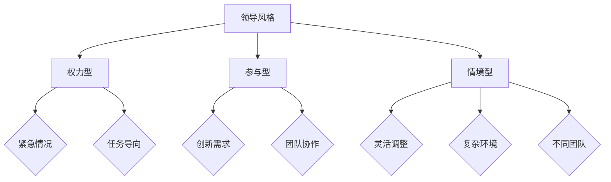
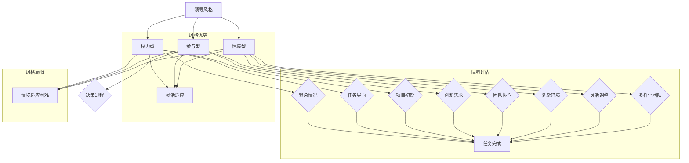

                 

### 引言

#### 为什么要了解自己的领导风格

在信息技术领域，领导者的领导风格对其团队和整个组织的成功具有至关重要的影响。了解自己的领导风格，不仅有助于领导者更有效地管理团队，还能够促进个人职业发展，提升组织整体绩效。然而，许多领导者往往忽略了自我认知这一关键环节，导致领导效果不佳，甚至影响组织的长远发展。

首先，领导风格是领导者行为和决策模式的集中体现。不同的领导风格适用于不同的情境和团队，因此，了解自己的领导风格，可以帮助领导者更好地适应不同的情况，从而提高领导效能。例如，在某些需要快速决策和执行的项目中，权力型领导风格可能更为合适；而在需要团队成员参与和创新的情境下，参与型领导风格则可能更加有效。

其次，领导者的自我认知对于个人的职业发展同样重要。一个能够深刻认识自我、了解自己领导风格的领导者，更容易发现自身的优势与不足，从而制定更为有效的职业发展计划。此外，通过自我认知，领导者可以学会如何调整和优化自己的领导风格，以适应不断变化的工作环境和职业需求。

最后，了解自己的领导风格对于组织文化的塑造和可持续发展也具有深远影响。一个具有自我认知能力的领导者，更能够推动组织内部的沟通与协作，增强团队凝聚力，从而实现组织的长期目标。反之，缺乏自我认知的领导者则可能因为无法有效管理团队，导致组织内部出现分歧和冲突，影响组织的整体发展。

总之，了解自己的领导风格是每一位领导者不可或缺的技能。这不仅有助于提高领导效能和职业发展，还能够为组织带来长远的价值。本文将深入探讨领导者如何通过自我认知来了解和优化自己的领导风格，帮助读者在信息技术领域实现卓越的领导。

#### 领导者自我认知的重要性

领导者自我认知的重要性不容忽视，它不仅是提升个人领导力的关键，也是推动组织发展的基石。首先，领导者自我认知有助于明确个人的优势与短板。通过深入了解自己的性格特点、行为模式和管理偏好，领导者可以识别出自己在领导过程中的盲点和不足，从而有针对性地进行改进。例如，一个以任务为导向的领导者可能在情感沟通方面有所欠缺，但通过自我认知，他可以认识到这一点，并努力提升自己的情感管理能力。

其次，领导者自我认知有助于建立信任和有效的团队沟通。一个能够真诚面对自我、承认错误的领导者，更容易赢得团队成员的尊重和信任。这种信任不仅有助于团队内部的和谐，还能够激发团队成员的积极性和创造力。例如，当领导者能够诚实地承认自己在项目决策中的错误，并采取积极的措施进行纠正时，团队成员会感到领导者是值得信赖的，从而更愿意积极参与和配合。

此外，领导者自我认知还影响到组织的文化建设。一个具有高度自我认知能力的领导者，能够更好地理解和适应组织文化，从而推动组织文化的建设和发展。通过自我认知，领导者可以识别出组织文化的优势与不足，并采取相应的措施进行优化。例如，在一个注重创新的组织中，领导者可以通过自我认知来识别出自己是否具备鼓励创新的领导风格，并通过调整和优化自己的行为模式，来推动组织文化的创新氛围。

最后，领导者自我认知对于个人职业发展同样至关重要。一个能够不断自我反思和成长的领导者，不仅能够在现有职位上表现得更加出色，还能够在职业发展的道路上走得更远。通过自我认知，领导者可以明确自己的职业目标和发展路径，从而制定出更加有效的职业规划。例如，一个希望在未来成为一名企业高管的领导者，可以通过自我认知来识别出自己需要提升的管理能力和领导技巧，并采取相应的措施进行自我提升。

总之，领导者自我认知是领导者成长和发展的关键。通过深入了解自己的领导风格、管理能力和行为模式，领导者不仅能够提升个人领导力，还能够为组织的长远发展奠定坚实的基础。在信息技术领域，这种自我认知尤为重要，因为它直接影响着团队的绩效和组织的竞争力。因此，每一位领导者都应该重视自我认知，通过不断反思和调整，实现卓越的领导。

#### 第一部分：领导风格理论

##### 第1章：领导风格的基础理论

领导风格是指领导者在领导过程中表现出来的行为模式、决策方式和沟通技巧。不同的领导风格适用于不同的情境和团队，因此，了解领导风格的理论和分类对于领导者具有重要的指导意义。

首先，领导风格的概念可以追溯到早期管理理论的提出者，如赫兹伯格（Fred Herzberg）和布莱克（Robert Blake）等人。他们提出了“管理方格理论”（Managerial Grid），将领导风格分为关注任务和关注人两大类。关注任务的领导者更注重任务完成和效率，而关注人的领导者更注重团队建设和成员满意度。

接下来，我们来看几种常见的领导风格：

1. **权力型领导风格**（Authoritative Leadership）
   - **定义**：权力型领导风格是指领导者通过明确的权威和控制来指导团队。他们通常会设定清晰的目标和行动计划，并要求团队成员遵循。
   - **特点**：权力型领导者倾向于做出决策，并要求下属执行。他们通常具备较强的决策能力和执行力。
   - **适用情境**：在紧急情况下或需要迅速采取行动时，权力型领导风格可能非常有效。

2. **参与型领导风格**（Participative Leadership）
   - **定义**：参与型领导风格是指领导者鼓励团队成员参与决策过程，并重视团队成员的意见和建议。
   - **特点**：参与型领导者注重团队合作和集体智慧，他们倾向于通过讨论和协商来做出决策。
   - **适用情境**：在需要创新和团队合作的项目中，参与型领导风格能够激发团队成员的积极性和创造力。

3. **情境型领导风格**（Situational Leadership）
   - **定义**：情境型领导风格是指领导者根据不同的情况和团队成员的特点，灵活调整自己的领导风格。
   - **特点**：情境型领导者能够识别出团队成员的不同需求和工作情境，并采取相应的领导策略。
   - **适用情境**：在复杂多变的工作环境中，情境型领导风格能够帮助领导者更好地适应和应对挑战。

除了上述三种领导风格，还有其他一些重要的领导风格，如民主型领导风格（Democratic Leadership）和教练型领导风格（Coaching Leadership）等。民主型领导风格强调团队成员的参与和自治，而教练型领导风格则注重培养团队成员的技能和潜力。

领导风格的影响因素是多方面的，包括个人性格、组织文化、工作环境等。个人性格是领导风格形成的重要基础，例如，内向型领导者可能更倾向于采用参与型领导风格，而外向型领导者可能更适合权力型领导风格。组织文化则影响领导者的行为模式，一个鼓励创新和自主性的组织文化可能会促使领导者采用参与型或情境型领导风格。工作环境的变化和挑战也会对领导风格产生影响，例如，在高压和快节奏的工作环境中，领导者可能更倾向于采用权力型领导风格。

总之，理解领导风格的基础理论和不同风格的适用情境，对于领导者具有重要的指导意义。通过深入分析领导风格的影响因素，领导者可以更好地了解自己和他人的领导风格，从而在合适的情境下采取最有效的领导策略，提高团队绩效和整体组织效率。

#### 领导风格的Mermaid流程图

为了更直观地理解不同领导风格的影响因素和适用情境，我们可以使用Mermaid绘制一个流程图。Mermaid是一种基于Markdown的图形描述语言，可以轻松绘制流程图、序列图、状态图等多种图形。

以下是使用Mermaid绘制的领导风格影响流程图的示例：



在这个流程图中，我们首先从领导风格（A节点）出发，分别连接到三种常见的领导风格：权力型（B节点）、参与型（C节点）和情境型（D节点）。然后，每种领导风格又分别连接到其适用的情境：

- 权力型领导风格（B节点）适用于紧急情况和任务导向的场景（E节点和F节点）。
- 参与型领导风格（C节点）适用于创新需求和团队协作的场景（G节点和H节点）。
- 情境型领导风格（D节点）适用于灵活调整、复杂环境和不同团队的情境（I节点、J节点和K节点）。

通过这种流程图，我们可以清晰地看到不同领导风格在不同情境下的适用性，有助于领导者更好地选择和应用合适的领导策略。此外，Mermaid流程图还可以方便地调整和扩展，以适应更复杂的领导风格和情境分析。

#### 第二部分：领导风格评估方法

##### 第3章：领导风格评估工具

了解自己的领导风格是一个复杂且多维的过程，为了更准确地评估领导风格，我们可以借助各种评估工具。这些工具分为自我评估问卷、第三方评估、同事评估和客户评估等类型，每种方法都有其独特的优势和适用场景。

首先，**自我评估问卷**是最常见的评估工具之一。这种评估方法依赖于领导者本人对自身行为和领导风格的自我反思。常见的自我评估问卷包括**Myers-Briggs Type Indicator (MBTI)**和**DiSC评估**。MBTI通过分析个体在不同性格维度上的偏好，帮助领导者了解自己的性格类型及其对领导风格的影响。而DiSC评估则通过四个维度（支配性、影响性、稳定性、遵守性）来评估领导者的行为模式和管理风格。自我评估问卷的优势在于方便快捷，且能够为领导者提供个性化的反馈和改进建议。然而，这种方法的局限性在于，个体自我反思的准确性和全面性可能受到主观偏见的影响。

其次，**第三方评估**通常由专业的评估机构或顾问进行，其评估结果更具客观性和科学性。第三方评估包括**领导力360度评估**和**360度反馈**等方法。这些评估工具不仅收集领导者的自我反馈，还涵盖来自团队成员、上级和客户的评价。例如，**Leadership Circle Profile (LCP)** 是一种广泛使用的360度评估工具，它通过多个维度的评估，为领导者提供全面的领导能力分析。第三方评估的优势在于其客观性和全面性，能够为领导者提供更为准确和深入的反馈。然而，这种方法的成本较高，且评估过程相对复杂。

**同事评估**是指通过团队成员的反馈来评估领导者的领导风格。这种方法可以揭示领导者在实际工作中的表现和效果，从而提供更实际、更具体的反馈。同事评估可以通过匿名问卷或面对面访谈进行。例如，**Gallup的** **"Great Manager"** **评估** 就是基于同事反馈的一种评估方法。同事评估的优势在于其贴近实际工作场景，能够提供领导者与团队互动的直观反馈。然而，这种方法也存在一些局限性，如可能受到同事主观偏见的影响，或者部分团队成员可能不愿意直接表达对领导者的批评。

最后，**客户评估**是指通过客户的反馈来评估领导者的领导风格。这种方法有助于了解领导者对客户关系和业务成果的影响。客户评估可以通过客户满意度调查、市场反馈等方式进行。例如，服务型领导风格的领导者可能更注重客户需求和市场反馈，通过客户评估可以验证其领导效果。客户评估的优势在于能够从外部视角评估领导者的领导风格，提供更全面和客观的反馈。然而，这种方法在实施过程中可能面临一些挑战，如客户反馈的可靠性和有效性。

总之，不同的领导风格评估工具各有优劣，领导者可以根据自己的需求和实际情况选择合适的评估方法。自我评估问卷提供个性化反馈，第三方评估提供客观全面的分析，同事评估提供实际工作表现反馈，客户评估提供外部视角反馈。通过综合运用这些评估工具，领导者可以更准确地了解自己的领导风格，从而进行有效的调整和优化。

##### 第4章：领导风格评估案例分析

在本章中，我们将通过两个具体的案例，展示如何使用领导风格评估工具进行自我评估和团队评估。这些案例将帮助读者更直观地理解评估方法的应用及其效果。

#### 案例一：使用领导风格评估工具进行自我评估

张伟是一家科技公司的项目经理，他发现自己最近在项目管理过程中遇到了一些困难，比如项目进度延迟和团队沟通不畅。为了提升自己的领导能力，张伟决定使用自我评估问卷中的MBTI和DiSC评估工具来了解自己的领导风格。

1. **MBTI评估**：
   - 张伟通过MBTI评估问卷，发现自己是INFP类型。这种性格类型的人通常非常注重情感和价值观，善于倾听他人的意见，但有时可能过于敏感和情绪化。
   - 通过MBTI评估，张伟意识到自己在领导过程中需要更加注重团队的情感需求，并且要尽量保持冷静，避免情绪化影响决策。

2. **DiSC评估**：
   - 张伟在DiSC评估中得分较高的是影响性（I）和稳定型（S）。这意味着他倾向于积极主动地推动项目进展，同时也比较耐心和稳定，能够在压力下保持冷静。
   - 张伟通过DiSC评估了解到，自己在推动项目进展时可能需要更多倾听团队成员的意见，同时确保团队成员感受到自己的支持和鼓励。

通过这两个自我评估工具，张伟对自己的领导风格有了更深入的认识，他开始有意识地调整自己的行为模式，如更加积极地倾听团队成员的意见，并在必要时进行适当的情感沟通。这种自我评估帮助张伟提升了领导效能，团队的工作氛围和项目进度也得到了显著改善。

#### 案例二：组织领导风格评估

李经理是另一家大型科技公司的部门经理，为了提升部门的整体领导力，她决定在公司内部进行一次全面的领导风格评估。她选择了第三方评估工具——Leadership Circle Profile (LCP)。

1. **评估过程**：
   - 李经理首先组织了一次部门内部会议，介绍了LCP评估工具的背景和目的，并鼓励所有团队成员参与。
   - 随后，她安排了在线评估，每个团队成员都需要完成一份包括自我评估和同事评估的问卷。

2. **评估结果**：
   - 评估结果显示，部门中存在多种不同的领导风格，如权力型、参与型和情境型。
   - 同时，评估还揭示了团队在沟通、协作和决策方面的薄弱环节。

3. **改进措施**：
   - 李经理根据评估结果，制定了相应的改进计划。例如，针对权力型领导风格较明显的成员，她安排了相关的领导力培训，帮助他们提高情感沟通能力。
   - 对于参与型领导风格成员，她鼓励他们更多地参与到团队决策过程中，以提升团队整体的决策质量。

通过这次组织领导风格评估，李经理不仅帮助团队成员了解了各自的领导风格，还推动了团队内部的有效沟通和协作。评估结果为部门管理提供了有力的数据支持，使得领导力提升工作更加有针对性和有效。

#### 总结

通过以上两个案例，我们可以看到，领导风格评估工具在自我认知和组织评估中的应用是非常有效的。无论是自我评估还是团队评估，评估工具都能帮助领导者更清晰地了解自己的领导风格，并识别出需要改进的方面。这不仅有助于提升个人领导力，还能促进团队和组织的发展。

#### 第三部分：领导风格调整与优化

##### 第5章：认识并调整自己的领导风格

在认识到自己领导风格的不足后，领导者需要采取具体的措施进行调整和优化。这一过程不仅需要领导者有强烈的自我驱动力，还需要科学的方法和策略来支持。以下是认识并调整自己领导风格的一些关键步骤：

**第一步：自我反思**

自我反思是调整领导风格的第一步，领导者需要花时间深入思考自己的行为模式、决策过程和沟通方式。以下是一些自我反思的技巧：

1. **记录日常行为**：领导者可以记录自己每天的行为和决策，特别是在压力大的情境下，观察自己是如何应对的。
2. **寻求反馈**：定期与团队成员、同事和上级交流，收集他们对领导者行为的反馈。这些反馈可以帮助领导者更客观地了解自己的优点和不足。
3. **分析情境**：领导者需要反思在不同情境下自己的行为表现，例如在紧急情况下、创新项目中或团队合作时，观察自己是如何调整领导风格的。

**第二步：识别需要改进的方面**

在自我反思的基础上，领导者需要明确需要改进的具体方面。以下是几种常见需要改进的方面：

1. **沟通技巧**：许多领导者可能在情感沟通方面有所欠缺，导致团队成员感到被忽视或不被理解。
2. **决策能力**：部分领导者可能在复杂决策时犹豫不决，影响项目进展和团队效率。
3. **团队建设**：领导者可能缺乏关注团队氛围和成员关系的意识，导致团队凝聚力不足。

**第三步：制定改进计划**

一旦识别出需要改进的方面，领导者需要制定具体的改进计划。以下是几个制定改进计划的步骤：

1. **设定具体目标**：例如，如果领导者决定提升沟通技巧，可以设定每周至少进行一次团队会议，并确保会议中充分倾听团队成员的意见。
2. **采取行动**：根据设定目标，采取具体的行动。例如，领导者可以参加沟通技巧培训课程，或阅读相关书籍提升自己的沟通能力。
3. **持续监控**：领导者需要定期监控自己的行为变化，确保改进措施的有效性。可以通过记录行为日志或定期与团队成员交流反馈来实现。

**第四步：调整情境适应性**

领导者需要根据不同的情境灵活调整自己的领导风格。以下是一些具体策略：

1. **情境评估**：在每种情境下，领导者需要评估团队的需求和目标，确定最合适的领导风格。
2. **适应性调整**：例如，在创新项目中，领导者可能需要更多采用参与型领导风格，以激发团队成员的创造力；在紧急情况下，领导者则可能需要采用权力型领导风格，确保任务迅速完成。
3. **团队反馈**：领导者可以通过定期与团队成员交流，了解他们在不同情境下的感受和需求，从而进一步调整自己的领导风格。

**第五步：持续学习和成长**

领导风格调整是一个持续的过程，领导者需要不断学习和成长。以下是一些建议：

1. **参加领导力培训**：参加专业的领导力培训课程，学习新的领导技巧和策略。
2. **阅读相关书籍**：阅读有关领导力、团队管理和沟通技巧的书籍，从理论层面提升自己的认知。
3. **参与团队建设活动**：积极参与团队建设活动，提升团队凝聚力和合作精神。

通过以上步骤，领导者可以更有效地认识并调整自己的领导风格，提升个人领导力，促进团队和组织的发展。

##### 第6章：领导风格优化的方法

优化领导风格是提升领导效能和个人职业发展的重要步骤。这一过程不仅涉及识别和调整现有领导风格，还要求领导者根据不同情境和团队成员的需求，进行灵活的适应和调整。以下是几种优化领导风格的具体方法：

**一、强化优势**

1. **优势识别**：首先，领导者需要明确自己的优势。可以通过自我反思、同事反馈和360度评估等方式来识别。
2. **优势发挥**：一旦识别出优势，领导者应该利用这些优势来增强领导效能。例如，如果一个领导者擅长沟通和协调，可以更多地参与团队沟通和协作活动，促进团队凝聚力。
3. **优势培养**：领导者可以通过培训和继续教育来进一步发展自己的优势，例如参加沟通技巧培训、团队建设工作坊等。

**二、改善弱势**

1. **弱势识别**：通过自我反思和外部反馈，领导者需要识别出自己在领导风格中的弱点。例如，一个可能存在的问题是过度依赖权力型领导风格，导致团队成员缺乏自主性和创造力。
2. **针对性改进**：领导者需要根据识别出的弱势，制定具体的改进计划。例如，如果领导者发现自己在情感沟通方面有所欠缺，可以通过阅读相关书籍、参加工作坊或咨询专业人士来提升自己的沟通能力。
3. **持续监控**：在改进过程中，领导者需要持续监控自己的行为变化，确保改进措施的有效性。可以通过行为日志、定期反馈等方式来实现。

**三、调整情境适应性**

1. **情境评估**：领导者需要根据不同的情境，评估团队的需求和目标，确定最合适的领导风格。例如，在紧急情况下，权力型领导风格可能更为合适，而在需要创新的情境下，参与型领导风格可能更为有效。
2. **灵活调整**：领导者需要具备灵活调整领导风格的能力，根据情境变化进行适应性调整。例如，在团队项目推进过程中，领导者可能需要在不同阶段采用不同的领导风格，以适应项目的需求。
3. **团队反馈**：领导者可以通过定期与团队成员交流，了解他们在不同情境下的感受和需求，从而进一步调整自己的领导风格。这种反馈机制有助于领导者更好地理解团队动态，提高领导效能。

**四、建立反馈机制**

1. **内部反馈**：建立团队内部反馈机制，鼓励团队成员对领导者的行为和决策提出意见和建议。这可以通过定期团队会议、匿名问卷等方式实现。
2. **外部反馈**：领导者还可以通过外部反馈来了解自己在组织中的表现。这可以通过上级反馈、客户反馈和市场反馈等方式进行。
3. **反馈利用**：领导者需要积极利用反馈信息，对自己的领导风格进行调整和优化。例如，如果团队成员反映领导者在沟通方面有所欠缺，领导者可以采取相应的改进措施，如加强沟通技巧培训。

**五、持续学习和成长**

1. **领导力培训**：领导者应积极参加各种领导力培训课程，学习最新的领导技巧和策略。
2. **专业发展**：领导者可以通过阅读相关书籍、参加研讨会和行业会议，不断扩展自己的知识面和视野。
3. **自我反思**：领导者应定期进行自我反思，思考自己的领导风格和行为模式，识别需要改进的方面。

通过上述方法，领导者可以优化自己的领导风格，提升领导效能，促进个人职业发展，并为组织带来更大的价值。领导风格的优化是一个持续的过程，领导者需要不断学习和成长，以适应不断变化的工作环境和团队需求。

##### 第7章：领导风格优化的实际案例

在本章节中，我们将通过两个具体的案例，展示领导风格优化的实际操作和效果。这些案例将帮助读者更深入地理解领导风格优化的重要性及其应用。

#### 案例一：从权力型领导风格转变为情境型领导风格

张经理是一家互联网公司的产品经理，他的领导风格一直偏向权力型，习惯于直接下达指令并要求团队成员严格执行。然而，随着公司业务的发展和团队成员的不断变化，张经理发现这种领导风格逐渐无法满足团队的需求，项目进展也出现了瓶颈。

**背景**：
- 张经理的团队由不同背景和专业技能的成员组成，需要高度协作和创新。
- 团队成员对张经理的权力型领导风格逐渐产生了抵触情绪，工作积极性不高。

**优化过程**：

1. **自我反思与评估**：
   - 张经理通过自我反思和同事反馈，意识到自己的领导风格过于专制，不利于团队协作和创新能力。
   - 他使用DiSC评估工具进行了领导风格评估，发现自己在情境型领导风格方面有待提升。

2. **制定改进计划**：
   - 张经理决定加强情境型领导风格的学习和实践，制定了详细的改进计划。
   - 他参加了一系列领导力培训，学习了如何根据不同情境和团队成员的特点调整领导风格。

3. **具体行动**：
   - 张经理开始更多地鼓励团队成员参与决策过程，倾听他们的意见和建议。
   - 在项目推进过程中，他根据团队成员的能力和需求，灵活调整任务分配和资源支持。

4. **持续监控与反馈**：
   - 张经理定期与团队成员进行一对一的反馈交流，了解他们的感受和需求。
   - 他通过团队会议和匿名问卷，收集团队成员对领导风格调整的意见和建议，不断优化自己的领导行为。

**效果**：

通过领导风格的优化，张经理的团队工作氛围显著改善，团队成员的积极性大幅提升。项目进展顺利，创新成果显著。张经理也获得了上级和同事的认可，职业发展前景更加广阔。

#### 案例二：领导风格优化在企业变革中的应用

李总是一家传统制造业公司的总经理，公司正面临着激烈的市场竞争和数字化转型压力。李总意识到，原有的领导风格已经无法适应新的发展需求，必须进行优化。

**背景**：
- 公司传统管理方式较为僵化，缺乏创新动力。
- 市场竞争加剧，公司需要快速响应客户需求，推动业务转型。

**优化过程**：

1. **情境评估**：
   - 李总通过市场调研和内部评估，识别出公司当前面临的变革需求。
   - 他意识到，需要一种更加灵活、适应性强的领导风格来推动企业变革。

2. **领导力培训**：
   - 李总参加了由知名管理咨询公司提供的领导力培训，学习了情境型领导风格和变革型领导理论。
   - 他还组织了公司内部的领导力培训班，提升全体管理层的领导能力。

3. **实施变革**：
   - 李总开始在公司内部推行参与型领导风格，鼓励员工参与决策和变革过程。
   - 他建立了多个跨部门的工作小组，促进不同部门之间的合作和沟通。

4. **持续支持**：
   - 李总通过定期的内部会议和员工反馈机制，了解变革过程中的问题和挑战。
   - 他提供必要的资源和支持，确保变革顺利推进。

**效果**：

通过领导风格的优化，公司内部逐渐形成了创新和协作的氛围。员工积极参与到变革过程中，提出了一系列创新性建议和解决方案。公司的市场竞争力得到了显著提升，业务转型也取得了实质性进展。李总的领导能力和管理风格得到了全体员工的认可和尊重。

#### 总结

通过上述两个案例，我们可以看到，领导风格优化对于提升领导效能和组织发展具有重要作用。无论是从权力型领导风格向情境型领导风格的转变，还是在企业变革中的应用，领导风格的优化都需要领导者具备自我反思和持续学习的能力。通过科学的评估方法和具体的优化措施，领导者可以更好地适应不同情境和团队需求，推动组织实现长远发展。

#### 第四部分：领导风格在团队管理中的应用

##### 第8章：领导风格与团队建设

团队建设是领导工作的重要组成部分，而领导风格直接影响团队建设的质量和效果。不同的领导风格在塑造团队氛围、提高团队凝聚力和促进团队合作方面有着显著的不同。理解并运用适当的领导风格，对于构建一个高效、和谐且富有创新力的团队至关重要。

首先，**权力型领导风格**（Authoritative Leadership）在团队建设中具有一定的优势。权力型领导者通常具备明确的决策能力和执行力，他们通过设定目标和规范行为，确保团队成员按照既定计划完成任务。这种领导风格在项目初期或需要迅速行动的情况下非常有效，能够迅速统一团队行动方向，提高工作效率。然而，权力型领导风格也可能导致团队成员缺乏自主性和创造力，长期依赖领导者的指令，从而影响团队整体创新能力和动力。

其次，**参与型领导风格**（Participative Leadership）在团队建设中具有显著的促进作用。参与型领导者重视团队成员的意见和建议，通过民主决策和集体讨论，激发团队成员的积极性和参与感。这种领导风格有助于建立一种开放、信任和包容的团队氛围，促进团队成员之间的沟通和协作。参与型领导风格特别适合于需要高度团队协作和创新的项目，能够激发团队成员的创造力和主动性，提升团队整体绩效。然而，参与型领导风格在决策速度和执行效率上可能不如权力型领导风格，需要领导者具备较强的协调和沟通能力。

**情境型领导风格**（Situational Leadership）则是一种更加灵活和适应性强的领导风格，适用于不同团队建设阶段的需求。情境型领导者根据不同团队和成员的特点，灵活调整领导策略，以适应具体情境和团队需求。例如，在团队建设初期，领导者可能需要更多采用权力型领导风格，明确团队目标和行为规范；而在团队成熟阶段，领导者则可以逐步过渡到参与型或教练型领导风格，鼓励团队成员自主决策和协作。情境型领导风格能够有效平衡团队协作和个体自主性，促进团队整体和谐发展。

不同领导风格对团队成员的影响也有明显的差异。权力型领导风格可能使团队成员产生依赖和被动感，影响他们的自主性和创造力；而参与型领导风格则能够增强团队成员的参与感和归属感，提升他们的工作动力和满意度。情境型领导风格则能够根据团队成员的不同需求和情境，提供个性化的支持和指导，帮助团队成员更好地发挥自己的潜力。

总之，领导风格在团队建设中起着关键作用。通过选择和运用适当的领导风格，领导者可以塑造积极向上的团队氛围，提高团队凝聚力和协作效率，推动团队实现长远发展。不同的领导风格在不同情境和团队阶段有不同的适用性，领导者需要根据实际情况灵活调整，以最大化团队建设的效果。

##### 第9章：领导风格在团队管理中的实际应用

在团队管理中，选择合适的领导风格对于提升团队效率和绩效至关重要。以下是两个具体的案例，展示了如何在不同类型的团队中应用不同的领导风格，以及这些风格在实际工作中的应用效果。

#### 案例一：如何选择合适的领导风格来管理不同类型的团队成员

张磊是一家软件开发公司的团队经理，他的团队由不同类型的技术专家组成，包括经验丰富的老员工、年轻的新手以及跨领域的专家。为了更好地管理这个多元化的团队，张磊采取了不同的领导风格来适应每位团队成员的需求。

1. **管理经验丰富的老员工**：
   - **领导风格**：参与型领导风格
   - **应用**：张磊在项目管理中鼓励老员工提出改进建议和优化方案。他组织定期的团队会议，邀请老员工分享他们的经验和见解，并鼓励他们在项目决策过程中发挥重要作用。这种参与型领导风格增强了老员工的工作热情和参与感，提升了项目的创新性和质量。

2. **新手员工**：
   - **领导风格**：教练型领导风格
   - **应用**：张磊对新手员工采取了更加指导性的教练型领导风格。他在新手入职时为他们提供详细的培训，并定期进行一对一的辅导，帮助他们快速掌握工作技能。张磊还鼓励新手员工提出问题和反馈，以便及时调整工作方法和策略。通过这种教练型领导风格，新手员工迅速融入团队，提高了工作效率和质量。

3. **跨领域专家**：
   - **领导风格**：情境型领导风格
   - **应用**：张磊意识到跨领域专家在项目中的重要性，因此采用情境型领导风格来管理他们。根据项目的不同阶段和需求，张磊灵活调整领导方式。例如，在项目初期，他担任指导者和协调者的角色，帮助团队明确目标和计划；在项目执行过程中，他更多地充当顾问和资源提供者的角色，为团队提供支持和帮助。这种情境型领导风格有效地发挥了跨领域专家的专业优势，提升了项目的整体效果。

通过选择合适的领导风格，张磊成功地管理了多元化的团队，提高了团队协作效率和项目绩效。

#### 案例二：领导风格在团队项目推进中的应用

李婷是一家电子商务公司的产品经理，她的团队负责新产品的研发和上线。在项目推进过程中，李婷根据项目的不同阶段和需求，灵活调整了领导风格，确保项目顺利进行。

1. **项目初期**：
   - **领导风格**：权力型领导风格
   - **应用**：在项目初期，李婷面临时间紧迫和任务繁重的挑战。她采用了权力型领导风格，明确项目目标和任务分配，迅速做出决策并确保团队成员按照计划行动。通过这种强势的领导风格，李婷确保了项目在初期阶段顺利启动和推进。

2. **项目执行阶段**：
   - **领导风格**：参与型领导风格
   - **应用**：在项目进入执行阶段，李婷鼓励团队成员积极参与项目决策和讨论，分享他们的见解和建议。她组织了多次团队会议，听取团队成员的意见，并根据这些意见调整项目计划。这种参与型领导风格激发了团队成员的积极性和创造力，提高了项目执行的质量和效率。

3. **项目后期**：
   - **领导风格**：情境型领导风格
   - **应用**：在项目进入后期，李婷根据项目进展和团队成员的状态，灵活调整了领导风格。她在需要集中精力解决问题时，充当指导者和协调者的角色；而在团队成员需要休息和调整时，她更多地充当支持者和鼓励者的角色。这种情境型领导风格帮助团队保持了高效的工作状态，确保项目顺利结束。

通过灵活应用不同的领导风格，李婷有效地推动了项目的顺利推进，实现了项目目标。

#### 总结

以上两个案例展示了在不同类型的团队和项目阶段中，如何选择和运用合适的领导风格。合适的领导风格不仅能够提升团队协作效率和项目绩效，还能增强团队成员的工作满意度和归属感。领导者应根据实际情况和团队需求，灵活调整领导风格，以实现最佳的管理效果。

#### 第五部分：领导风格与个人发展

##### 第10章：领导风格与个人成长

领导风格不仅影响团队和组织的绩效，还对领导者的个人成长和职业发展产生深远影响。一个领导者能否在职业生涯中不断进步，不仅取决于其管理能力和业务知识，更依赖于其领导风格是否适应不断变化的工作环境和职业需求。在这一章节中，我们将探讨领导风格对个人职业发展的影响，以及如何通过领导风格提升个人影响力。

首先，领导风格对个人职业发展的影响主要体现在以下几个方面：

1. **职业晋升机会**：具有适当领导风格的领导者更容易获得职业晋升机会。例如，一个能够灵活适应不同情境的领导者，在面临复杂的职业挑战时，能够迅速调整自己的领导方式，从而提高团队绩效和组织信任度，增加晋升机会。

2. **团队协作和沟通**：领导风格影响领导者与团队成员的互动方式。一个注重参与和沟通的领导者，能够建立良好的团队关系，促进团队合作，提升团队整体绩效。这种能力对于领导者的职业发展具有重要意义。

3. **个人品牌**：领导风格也是塑造个人品牌的重要元素。一个具备独特领导风格的领导者，能够在其专业领域内建立权威和影响力。例如，一位以创新和开放著称的领导者，往往能够在行业内形成积极的个人品牌，吸引更多的职业机会和资源。

接下来，我们将讨论如何通过领导风格提升个人影响力：

1. **认知自我**：了解自己的领导风格是提升个人影响力的第一步。领导者需要通过自我反思和反馈机制，识别自己的优势和不足，从而制定出符合个人特色的领导策略。例如，一个权力型领导者可以通过培养参与型领导风格，提升团队的参与感和合作精神。

2. **适应变化**：领导风格需要根据不同的职业阶段和工作环境进行调整。在职业初期，领导者可能需要更多关注任务完成和效率；而在职业中期和后期，领导者需要更多地关注团队建设和个人影响力。例如，在职业初期，一个权力型领导者可以通过强化参与型领导风格，提升团队凝聚力和协作效率。

3. **持续学习**：提升个人影响力不仅需要了解自己的领导风格，还需要不断学习和更新知识。领导者应积极参加领导力培训、行业会议和研讨会，不断扩展自己的视野和技能。例如，通过学习最新的管理理论和技术，领导者可以提升自己的领导能力和创新能力，从而在职业发展中占据优势。

4. **建立人际关系**：领导风格不仅影响团队内部的关系，也影响领导者与外部合作伙伴和利益相关者的互动。一个能够建立和维护良好人际关系的领导者，能够扩大自己的职业网络，提升个人影响力。例如，通过积极参与行业活动和社交活动，领导者可以结识更多的行业专家和潜在合作伙伴。

5. **塑造个人品牌**：领导者应通过言行一致地展示自己的领导风格，塑造独特的个人品牌。例如，通过在社交媒体上分享自己的领导经验和心得，领导者可以扩大自己的影响力，吸引更多的关注和机会。

总之，领导风格对个人职业发展具有深远影响。通过认知自我、适应变化、持续学习和建立人际关系，领导者可以提升自己的领导能力和个人影响力，在职业生涯中实现卓越的成就。

##### 第11章：领导风格在职业规划中的应用

在职业规划中，领导者需要根据自身的职业目标和发展路径，有针对性地调整和优化自己的领导风格。这一过程不仅有助于提升个人领导能力，还能够为职业发展奠定坚实的基础。以下是一些具体的策略，帮助领导者根据个人职业目标调整领导风格，并提升职业竞争力。

**一、了解职业目标**

在调整领导风格之前，领导者需要明确自己的职业目标。这些目标可以是短期的，如提升某一项目的绩效，或是长期的，如晋升为部门主管或企业高管。通过明确职业目标，领导者可以更清晰地了解自己的发展方向和所需技能，从而有针对性地调整领导风格。

**二、评估当前领导风格**

在调整领导风格之前，领导者应对自己的当前领导风格进行全面的评估。这可以通过自我反思、同事反馈和领导力评估工具等方式进行。评估内容包括领导风格的优势和不足、适用情境以及改进方向。通过这种评估，领导者可以识别出需要提升的方面，并制定相应的改进计划。

**三、制定个性化领导发展计划**

基于职业目标和当前领导风格的评估结果，领导者可以制定一个个性化的领导发展计划。这个计划应包括具体的目标、行动步骤和时间表。例如，如果领导者的职业目标是晋升为部门主管，他们可能需要提升团队管理和战略规划能力。为此，领导者可以参加相关的领导力培训课程，学习团队建设和绩效管理的方法。

**四、灵活调整领导风格**

在职业发展的不同阶段，领导者需要根据目标和工作环境灵活调整自己的领导风格。例如，在职业初期，领导者可能需要更多采用参与型或教练型领导风格，以提升团队协作和员工技能；在职业中期，领导者可能需要更多采用情境型或变革型领导风格，以应对复杂的工作环境和挑战；在职业后期，领导者可能需要更多采用权力型或战略型领导风格，以推动组织的战略发展和变革。

**五、持续学习和反馈**

领导风格的发展是一个持续的过程，领导者需要不断学习和反思。通过参加培训、阅读专业书籍、参与行业研讨会和交流，领导者可以不断更新自己的知识和技能。同时，领导者应定期进行自我评估和接受同事反馈，以确保领导风格的持续优化和提升。

**六、应用成功案例和最佳实践**

在职业规划中，领导者可以借鉴他人的成功案例和最佳实践。例如，通过研究行业内杰出的领导者如何应对职业挑战，领导者可以学习到有效的领导策略和技巧。此外，领导者还可以通过参与领导力项目和实践，积累宝贵的经验，提升自己的领导能力。

总之，通过了解职业目标、评估当前领导风格、制定个性化领导发展计划、灵活调整领导风格、持续学习和应用成功案例，领导者可以有效地优化自己的领导风格，提升职业竞争力，实现职业发展的长远目标。

#### 第六部分：领导风格与社会责任

##### 第12章：领导风格对组织社会责任的影响

在当今社会，企业不仅是经济利益的创造者，更是社会责任的承担者。领导者的领导风格在很大程度上影响着企业的社会责任实践，从而对整个社会产生深远的影响。一个具有高度社会责任感的领导者，能够在组织内部营造积极的企业文化，推动可持续发展，促进社会和谐。以下我们将探讨领导风格对组织社会责任的几个关键方面。

首先，**领导者的价值观和信念**直接影响企业的社会责任表现。具有高度社会责任感的领导者，会在企业战略和管理决策中融入社会责任理念，将社会责任视为企业成功的重要组成部分。例如，领导者可以推动企业在环境保护、员工福利、社区参与等方面采取积极措施，从而提升企业的社会责任表现。

其次，**领导者的行为模式**对组织文化的塑造具有重要作用。一个以身作则、关注社会事务的领导者，能够通过自己的行为影响团队成员，形成一种重视社会责任的企业文化。例如，领导者可以通过参加慈善活动、推动企业公益活动等方式，树立社会责任的榜样，激励员工积极参与社会事务。

第三，**领导者的决策方式**也影响着企业的社会责任实践。一个具有前瞻性和责任感的领导者，会从长远角度考虑企业行为对社会的影响，做出符合社会责任的决策。例如，在项目选择和资源分配时，领导者可以优先考虑对环境友好、社会贡献大的项目，从而推动企业实现可持续发展。

此外，**领导者的沟通与协作**能力也对组织社会责任的履行产生影响。一个善于沟通和协作的领导者，能够有效调动各方资源，推动企业社会责任的落实。例如，通过与政府、社区、非政府组织等外部伙伴建立良好关系，企业可以更有效地参与社会事务，实现共赢。

最后，**领导者的自我认知**同样重要。一个具有自我认知能力的领导者，能够识别出自身在推动社会责任方面的优势和不足，从而有针对性地进行改进。例如，通过自我反思和持续学习，领导者可以不断提升自己在社会责任实践中的能力和水平。

总之，领导风格对组织社会责任具有重要影响。一个具有社会责任感的领导者，不仅能够推动企业的可持续发展，还能够为社会带来积极的影响。通过塑造积极的领导风格，领导者可以为企业和社会创造更大的价值。

##### 第13章：领导风格与社会可持续发展的联系

领导风格不仅影响企业的社会责任，还直接关系到企业的可持续发展。在当今快速变化的世界中，企业需要具备高度的适应性和创新能力，以应对环境、社会和经济等多方面的挑战。领导者的领导风格在这个过程中起着至关重要的作用。以下是领导风格如何影响企业可持续发展以及领导者如何通过自我认知来推动可持续发展的探讨。

首先，领导者的**领导风格**对企业的可持续发展战略具有重要影响。一个具有远见卓识和战略思维的领导者，能够从长远角度考虑企业的发展，并将其与社会可持续发展相结合。例如，领导者可以推动企业在环境保护、资源利用和社会责任等方面采取积极措施，从而实现经济、社会和环境的协调发展。这种领导风格不仅有助于企业的长期成功，还能够提升企业的社会声誉和竞争力。

其次，领导者的**行为模式**和**价值观**对企业的可持续发展文化起着关键作用。一个以社会责任为重的领导者，会在企业内部营造一种重视可持续发展价值观的文化。例如，领导者可以通过树立榜样、制定可持续发展目标和政策，激励员工积极参与到可持续发展实践中。这种行为模式不仅能够推动企业的可持续发展，还能够提升员工的归属感和工作满意度。

此外，领导者的**沟通与协作**能力对于推动企业可持续发展也至关重要。一个善于沟通和协作的领导者，能够有效地调动各方资源，推动企业内部不同部门和外部合作伙伴之间的协同合作。例如，领导者可以组织跨部门团队，共同探讨和实施可持续发展项目，从而实现资源的最优配置和效益的最大化。

领导者的**自我认知**能力同样影响企业可持续发展。一个具有自我认知能力的领导者，能够识别出自身在推动可持续发展方面的优势和不足，并采取相应的措施进行改进。例如，通过自我反思和持续学习，领导者可以不断提升自己在可持续发展策略、环境保护和社区参与等方面的知识和能力。

为了更好地推动可持续发展，领导者可以采取以下几种策略：

1. **设定明确的目标和指标**：领导者应明确企业可持续发展的目标和指标，并将其纳入企业的战略规划和运营管理中。通过设定具体的目标和指标，企业可以更加系统和科学地推进可持续发展。

2. **推动跨部门合作**：领导者应积极推动不同部门之间的合作，共同探讨和实施可持续发展项目。通过跨部门协作，企业可以整合资源，提高项目效率。

3. **培养可持续发展文化**：领导者应通过言行一致，树立可持续发展的榜样，并推动企业内部形成一种重视可持续发展的文化。例如，通过培训、宣传和奖励等方式，鼓励员工积极参与可持续发展实践。

4. **建立外部合作伙伴关系**：领导者应积极与外部合作伙伴建立合作关系，共同推动可持续发展。例如，与政府、非政府组织、供应商和客户等建立合作关系，共同解决社会和环境问题。

5. **进行持续评估和改进**：领导者应定期对企业的可持续发展策略和实施情况进行评估，及时发现和解决问题。通过持续评估和改进，企业可以不断提高可持续发展水平。

总之，领导风格与社会可持续发展密切相关。通过自我认知和持续优化领导风格，领导者可以推动企业实现可持续发展，为社会和环境创造更大的价值。同时，这种领导风格不仅有助于企业的长期成功，还能够提升企业的社会形象和竞争力。

### 附录

#### 附录A：领导风格相关工具与资源

为了帮助读者更好地理解和管理领导风格，以下推荐了一些领导风格评估工具、相关书籍和研究资源，供参考。

**领导风格评估工具：**

1. **Myers-Briggs Type Indicator (MBTI)** - https://www.myersbriggs.org/
   - MBTI是一种广泛使用的个性评估工具，可以帮助领导者了解自己的性格类型和领导风格。

2. **DiSC评估** - https://www.discprofile.com/
   - DiSC评估通过四个维度（支配性、影响性、稳定性、遵守性）来分析领导者的行为模式。

3. **Leadership Circle Profile (LCP)** - https://www.leadershipcircle.com/
   - LCP是一种全面的360度领导力评估工具，提供多维度的领导力反馈。

**相关书籍推荐：**

1. **《领导力的五项修炼》**（The Five Dysfunctions of a Team）- Patrick Lencioni
   - 该书深入分析了团队中常见的问题，并提供了有效的解决方案。

2. **《情境领导》**（Situational Leadership）- Paul Hersey and Ken Blanchard
   - 该书详细介绍了情境型领导理论，适用于不同情境下的领导实践。

3. **《变革之舞》**（The Dance of Change）- Warren Bennis and Burt Nanus
   - 该书探讨了领导者在推动组织变革中的角色和策略。

**领导风格研究网站与数据库推荐：**

1. **Leadership Quarterly** - https://www.leadershipquarterly.org/
   - 领导力领域的学术期刊，提供最新的研究成果和理论探讨。

2. **Harvard Business Review** - https://hbr.org/
   - 商业和管理领域的权威期刊，包括大量关于领导风格和实践的文章。

3. **MIT Sloan Management Review** - https://sloansmreview.mit.edu/
   - 提供关于管理实践和领导力研究的最新洞察和趋势分析。

通过使用这些工具和资源，读者可以更深入地了解领导风格，提升自己的领导能力，并在实践中更好地应用这些理论和方法。

### 附录B：领导风格Mermaid流程图示例

为了帮助读者更好地理解不同领导风格的影响流程，以下是一个使用Mermaid绘制的领导风格流程图示例。该流程图展示了权力型、参与型和情境型领导风格在不同情境下的适用性。



在这个流程图中，我们首先从领导风格（A节点）出发，分别连接到三种常见的领导风格：权力型（B节点）、参与型（C节点）和情境型（D节点）。每种领导风格又连接到其适用的情境，例如权力型适用于紧急情况、任务导向和项目初期，参与型适用于创新需求、团队协作和决策过程，情境型适用于复杂环境、灵活调整和多样化团队。

通过这个流程图，读者可以直观地了解不同领导风格在不同情境下的适用性，以及每种风格的优势和局限。这不仅有助于领导者更好地选择和应用合适的领导策略，还能够促进团队和组织的发展。

### 附录C：领导风格优化方法伪代码示例

为了更清晰地展示领导风格优化方法的实现过程，以下是一个伪代码示例。该示例描述了如何根据评估结果和具体情境，调整领导风格，以提升领导效能。

```python
# 领导风格优化伪代码

# 定义评估结果和情境
assessment_results = assess LeadershipStyle()
context = identify Context()

# 根据评估结果，识别需要优化的领导风格维度
def identify dimens_to_optimize(assessment_results):
    # 假设评估结果包括四个维度：沟通技巧、决策能力、团队建设和情境适应性
    communication_score = assessment_results['communication']
    decision_making_score = assessment_results['decision_making']
    team_building_score = assessment_results['team_building']
    context_adaptation_score = assessment_results['context_adaptation']
    
    # 识别需要优化的维度
    if communication_score < 7:
        dimens_to_optimize = 'communication'
    elif decision_making_score < 7:
        dimens_to_optimize = 'decision_making'
    elif team_building_score < 7:
        dimens_to_optimize = 'team_building'
    else:
        dimens_to_optimize = 'context_adaptation'
    return dimens_to_optimize

# 根据具体情境，调整领导风格
def adjust_leadership_style(context, dimens_to_optimize):
    # 根据情境和需要优化的维度，调整领导风格
    if context == 'urgent':
        leadership_style = 'authoritative'  # 紧急情况，采用权力型领导风格
    elif context == 'innovative':
        leadership_style = 'participative'  # 创新需求，采用参与型领导风格
    elif context == 'complex':
        leadership_style = 'situational'  # 复杂环境，采用情境型领导风格
    else:
        leadership_style = 'default'  # 其他情况，采用默认领导风格
    
    # 根据需要优化的维度，进一步调整领导风格
    if dimens_to_optimize == 'communication':
        leadership_style += '_enhanced_communication'
    elif dimens_to_optimize == 'decision_making':
        leadership_style += '_enhanced_decision_making'
    elif dimens_to_optimize == 'team_building':
        leadership_style += '_enhanced_team_building'
    elif dimens_to_optimize == 'context_adaptation':
        leadership_style += '_enhanced_context_adaptation'
    
    return leadership_style

# 执行领导风格优化
dimens_to_optimize = identify dimens_to_optimize(assessment_results)
adjusted_leadership_style = adjust_leadership_style(context, dimens_to_optimize)

# 输出优化后的领导风格
print("Optimized Leadership Style:", adjusted_leadership_style)
```

在这个伪代码示例中，我们首先定义了评估结果和情境，然后通过函数`identify dimens_to_optimize`识别出需要优化的领导风格维度。接着，通过函数`adjust_leadership_style`根据具体情境和需要优化的维度，调整领导风格。最后，输出优化后的领导风格。

通过这种方式，领导者可以系统地优化自己的领导风格，以适应不同的情境和提升个人领导能力。这种优化方法不仅有助于提升团队绩效，还能够推动组织的长远发展。

### 总结

在这篇技术博客文章中，我们深入探讨了领导者的自我认知，特别是了解和优化自己的领导风格。首先，我们阐述了领导者了解自己领导风格的重要性，以及这种认知对于个人职业发展和组织绩效的深远影响。接着，我们通过领导风格的基础理论和具体案例，帮助读者理解不同领导风格的定义、特点及其适用情境。在此基础上，我们详细介绍了领导风格评估的方法，并通过两个实际案例展示了如何进行自我评估和组织评估。

在优化领导风格的章节中，我们提出了一系列步骤和方法，包括自我反思、识别需要改进的方面、制定改进计划以及调整情境适应性。此外，我们还通过两个实际案例，展示了如何在不同类型的团队中应用不同的领导风格，以提升团队协作和项目效率。这些案例不仅具有操作性，还能够为读者提供实际应用的参考。

最后，我们探讨了领导风格在团队管理、个人职业发展以及社会责任方面的应用。我们强调，领导者不仅需要关注团队和组织的绩效，还要关注社会和环境责任，以实现可持续发展。为了帮助读者更深入地了解领导风格，我们还提供了相关的工具、资源和伪代码示例。

通过本文，我们希望读者能够认识到领导风格优化的重要性，掌握优化领导风格的方法和技巧，并在实际工作中灵活应用。同时，我们也希望读者能够持续学习和反思，不断提升自己的领导能力和影响力，为个人和组织的成功奠定坚实的基础。在未来的领导实践中，让我们共同努力，成为更加卓越的领导者。作者：AI天才研究院/AI Genius Institute & 禅与计算机程序设计艺术 /Zen And The Art of Computer Programming。

