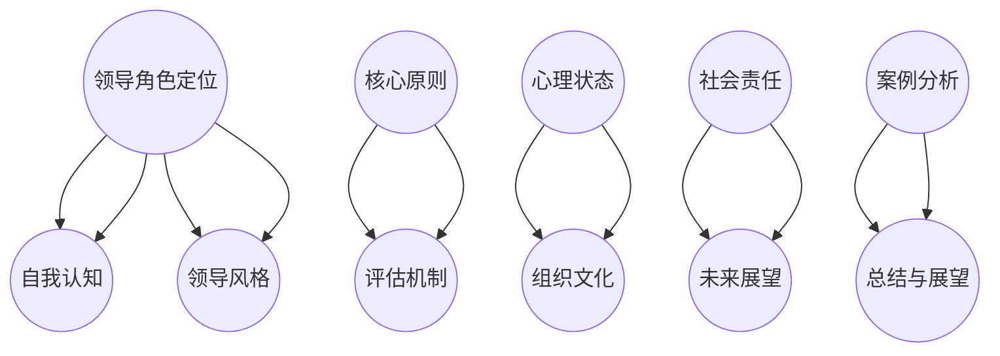

                 

### 文章标题

# 领导者的角色转换：在不同情境中的领导方式

> 关键词：领导者角色转换、领导方式、情境适应性、自我认知、组织文化、社会责任、跨文化比较

> 摘要：本文探讨了领导者在不同情境中的角色转换及其领导方式。通过对领导者角色定位、自我认知、领导风格、核心原则、阶段性评估、案例研究、心理学基础、组织文化影响、社会责任和未来展望等方面的分析，提出了领导者角色转换的实践要点和未来发展趋势，为提升领导者的情境适应性和领导效能提供了有益的参考。

### 引言

在当今快速变化的社会和经济环境中，领导者面临着前所未有的挑战。如何在不同情境中有效地转换领导角色，成为领导者必备的核心能力之一。领导者的角色转换不仅关乎个人的职业成长，更关系到组织的长远发展和竞争力。因此，理解并掌握领导者在不同情境中的角色转换及其领导方式，具有重要的现实意义。

本文旨在系统地探讨领导者的角色转换：在不同情境中的领导方式。首先，我们将对领导者的角色定位和自我认知进行深入分析，阐述领导者角色的多重维度和领导风格与情境适应性的关系。接着，我们将讨论领导者角色转换的核心原则、阶段性评估、心理学基础、组织文化影响、社会责任和未来展望。通过案例研究和跨文化比较，我们将提供丰富的实践经验和启示。最后，本文将对领导者角色转换的核心要素和实践要点进行总结，为提升领导者的情境适应性和领导效能提供指导。

### 领导者的角色定位与自我认知

领导者的角色定位是领导者成功的基础。领导者不仅要理解自己的职责和使命，还要认识到自己在组织中的价值和影响力。领导者角色的多重维度决定了他们在不同情境中需要具备的多样能力。以下是对领导者角色定位和自我认知的详细探讨。

#### 1.1.1 领导者角色的多重维度

领导者角色的多重维度包括以下几个方面：

1. **战略规划者**：领导者需要制定组织的长期和短期战略目标，确保组织朝着正确的方向前进。这要求领导者具备前瞻性思维、市场洞察力和决策能力。
   
2. **协调者**：领导者需要协调不同部门、团队和个人之间的关系，确保组织内部的和谐与效率。这要求领导者具备沟通能力、协调能力和团队合作精神。

3. **变革推动者**：领导者需要推动组织变革，引领组织适应外部环境的变化。这要求领导者具备创新能力、适应能力和风险承担精神。

4. **导师与教练**：领导者需要指导、培养和发展团队成员，提升团队整体能力。这要求领导者具备教练技巧、领导力和团队建设能力。

5. **榜样与激励者**：领导者需要通过自身的行为和成就激励团队成员，提升团队士气和工作热情。这要求领导者具备榜样力量、激励能力和领导魅力。

#### 1.1.2 领导者的自我认知与成长路径

领导者的自我认知是角色转换的基础。一个成功的领导者需要不断地反思和评估自己的能力和行为，明确自己的优势和不足，并制定相应的成长路径。

1. **自我评估**：领导者需要定期进行自我评估，分析自己的优点和缺点，以及在不同情境中的表现。这可以帮助领导者了解自己的强项和弱点，为自我提升提供方向。

2. **学习与成长**：领导者需要持续学习和成长，提升自己的知识和技能。通过参加培训、阅读书籍、与专家交流等方式，领导者可以不断提升自己的专业能力和综合素质。

3. **角色转换准备**：领导者需要在不同的情境中提前做好准备，了解角色的要求和挑战。这可以通过模拟练习、经验积累和实际操作来实现。

#### 1.1.3 领导风格与情境适应性

领导风格是领导者应对不同情境的重要工具。领导者的风格可能包括权威型、民主型、参与型、变革型等。每种领导风格都有其适用的情境和效果。

1. **权威型领导**：在紧急情况下，权威型领导可以迅速做出决策，确保团队的统一行动。然而，长期使用权威型领导可能导致团队缺乏自主性和创造力。

2. **民主型领导**：在需要团队协作和创新的情境中，民主型领导可以激发团队成员的参与热情和创造力。然而，民主型领导可能需要更多时间进行讨论和决策。

3. **参与型领导**：在需要团队共同努力实现共同目标的情境中，参与型领导可以增强团队的凝聚力和归属感。然而，参与型领导可能需要更多的时间和精力来协调和沟通。

4. **变革型领导**：在面临组织变革和创新的情境中，变革型领导可以激发团队成员的变革意识和创新精神。然而，变革型领导可能需要面对更大的风险和不确定性。

总之，领导者的角色定位与自我认知是角色转换的基础。领导者需要理解自己在组织中的多重角色，进行自我评估和持续成长，并适应不同的领导风格。这不仅有助于提升领导者的个人能力和领导效能，也有助于组织的长远发展。

### 领导者角色转换的核心原则

领导者角色转换是一个复杂且动态的过程，涉及多种原则和策略。以下是我们将探讨的几个核心原则，以及这些原则在实际应用中的具体实践方法。

#### 1.2.1 转换的必要性与重要性

领导者角色转换的必要性和重要性体现在以下几个方面：

1. **适应性需求**：随着组织环境和外部挑战的变化，领导者需要不断适应新的角色和责任。角色转换有助于领导者更好地应对复杂多变的情境。
   
2. **成长与发展**：角色转换是领导者个人成长的重要途径。通过转换角色，领导者可以学习新技能、积累新经验，提升自身综合素质。
   
3. **组织效能**：领导者角色转换有助于提高组织整体效能。当领导者能够根据不同情境灵活转换角色时，组织可以更加高效地应对各种挑战。

#### 1.2.2 转换的核心原则与实践方法

以下是几个关键的领导者角色转换原则及其实践方法：

1. **明确目标与愿景**：领导者需要明确自己的目标与愿景，确保角色转换与组织的长期发展目标一致。这可以通过制定战略规划、设定明确的目标和关键绩效指标（KPI）来实现。

    **实践方法**：制定一份详细的战略规划文档，明确组织的愿景、目标、关键里程碑和行动计划。定期审查和调整规划，确保角色转换与组织目标保持一致。

2. **持续学习与自我提升**：领导者需要持续学习新知识、新技能，不断提升自己的综合素质。这可以通过参加培训课程、阅读专业书籍、与行业专家交流等方式实现。

    **实践方法**：建立个人学习计划，定期参加行业研讨会、培训课程和在线学习。鼓励团队成员分享知识和经验，形成学习型组织文化。

3. **灵活调整领导风格**：领导者需要根据不同情境灵活调整领导风格，以适应不同团队成员和情境的需求。

    **实践方法**：了解不同领导风格的特点和适用情境，根据具体情境选择合适的领导风格。通过角色扮演和模拟练习，提高在不同领导风格之间的切换能力。

4. **建立有效的沟通机制**：领导者需要建立有效的沟通机制，确保信息流畅、透明，促进团队协作和决策效率。

    **实践方法**：定期召开团队会议，确保信息传递的及时性和准确性。采用多种沟通工具，如邮件、即时通讯、视频会议等，满足不同团队成员的沟通需求。

5. **培养团队领导力**：领导者需要培养团队成员的领导力，提升团队整体领导能力。

    **实践方法**：制定领导力发展计划，为团队成员提供培训、指导和支持。鼓励团队成员参与决策过程，提升他们的参与感和责任感。

#### 1.2.3 转换过程中的常见挑战与应对策略

在角色转换过程中，领导者可能会面临以下挑战：

1. **角色冲突**：当领导者在不同角色之间转换时，可能会出现角色冲突，影响工作效率和团队协作。

    **应对策略**：领导者需要明确不同角色的职责和目标，确保角色之间的协调和互补。通过建立清晰的职责分工和沟通机制，减少角色冲突。

2. **适应性不足**：领导者可能因为缺乏相关知识和经验，在角色转换过程中遇到困难。

    **应对策略**：领导者需要提前进行角色转换准备，通过学习和实践积累相关知识和经验。在角色转换初期，可以寻求导师和同事的支持和指导。

3. **团队抵触**：团队成员可能对领导者的角色转换持怀疑态度，影响团队凝聚力和工作效率。

    **应对策略**：领导者需要与团队成员进行充分沟通，解释角色转换的必要性和优势。通过示范和实际行动，赢得团队成员的支持和信任。

4. **时间压力**：角色转换可能占用大量时间，影响领导者的日常工作安排。

    **应对策略**：领导者需要合理安排时间，确保角色转换与日常工作相协调。通过有效的时间管理和优先级设置，提高工作效率。

总之，领导者角色转换的核心原则包括明确目标与愿景、持续学习与自我提升、灵活调整领导风格、建立有效的沟通机制和培养团队领导力。通过遵循这些原则和应对常见的挑战，领导者可以更加有效地进行角色转换，提升自身的领导效能和组织的整体效能。

### 领导者角色转换的阶段性评估

领导者角色转换是一个持续的过程，需要通过阶段性评估来确保转换的成效和效果。以下是对领导者角色转换阶段性评估的详细探讨，包括评估标准与指标体系、自我评估与反馈机制，以及持续改进与优化路径。

#### 1.3.1 评估标准与指标体系

为了对领导者角色转换进行有效评估，需要建立一套科学、全面的评估标准与指标体系。以下是一些关键评估标准和指标：

1. **目标达成度**：评估领导者是否实现了预定角色转换目标。这可以通过对比实际成果与预期目标，计算达成度。

2. **团队绩效**：评估领导者角色转换对团队绩效的影响。这可以通过团队目标达成率、项目成功率等指标来衡量。

3. **领导效能**：评估领导者的领导能力和领导效果。这可以通过领导力评估工具、360度反馈等手段来衡量。

4. **员工满意度**：评估领导者的角色转换是否提升了员工的满意度和工作积极性。这可以通过员工满意度调查、员工绩效评估等指标来衡量。

5. **个人成长**：评估领导者在角色转换过程中的个人成长和技能提升。这可以通过领导者的自我评估、学习记录等来衡量。

#### 1.3.2 自我评估与反馈机制

自我评估是领导者角色转换过程中不可或缺的一部分。以下是一些自我评估的方法和步骤：

1. **定期自我反思**：领导者需要定期进行自我反思，思考自己在角色转换过程中的表现和收获。可以通过日记、反思笔记等方式记录自我评估的内容。

2. **设定评估指标**：根据评估标准，设定具体的自我评估指标，如目标达成度、团队绩效等。

3. **收集反馈**：领导者可以从团队成员、上级领导、同事等多方面收集反馈，了解自己在角色转换中的表现和不足。

4. **分析评估结果**：对收集到的评估结果进行分析，识别自己的优势和不足，并制定相应的改进措施。

#### 1.3.3 持续改进与优化路径

为了确保领导者角色转换的长期成效，需要建立持续改进与优化路径。以下是一些具体的方法和策略：

1. **持续学习与培训**：领导者需要不断学习和提升自己的知识和技能，以适应新的角色和需求。可以通过参加培训课程、阅读专业书籍、参加行业研讨会等方式实现。

2. **定期评估与反馈**：建立定期评估和反馈机制，确保领导者能够及时了解自己在角色转换中的表现和成效。可以通过季度评估、年度评估等方式进行。

3. **优化领导风格**：根据评估结果和反馈，领导者需要不断优化自己的领导风格，以更好地适应不同情境和团队需求。可以通过角色扮演、模拟练习等方式提升领导能力。

4. **建立支持系统**：为领导者提供支持和资源，帮助他们更好地进行角色转换。可以通过设立导师制度、建立支持团队等方式实现。

5. **激励机制**：建立有效的激励机制，鼓励领导者积极参与角色转换和持续改进。可以通过奖励、晋升等方式激励领导者的积极性和主动性。

总之，领导者角色转换的阶段性评估是确保转换成效的重要环节。通过建立科学的评估标准与指标体系、自我评估与反馈机制，以及持续改进与优化路径，领导者可以更好地实现角色转换，提升自身的领导效能和组织的整体绩效。

### 领导者角色转换的案例研究

领导者角色转换在实践中的成功和失败案例为我们提供了宝贵的经验和教训。以下我们分别探讨几个典型的成功和失败案例，并通过这些案例总结出领导角色转换的启示和反思。

#### 1.4.1 成功的领导角色转换案例

**案例一：某科技公司CEO的转型**

某科技公司的CEO在面临公司业务转型和市场竞争加剧的挑战时，成功实现了领导角色的转换。以下是该CEO角色转换的关键步骤和成功因素：

1. **明确转型目标**：CEO在转型初期明确公司的新目标，包括市场定位、产品方向和战略规划。这为后续的角色转换提供了清晰的方向。

2. **学习和准备**：CEO在转型过程中积极参与相关培训和学习，提升自己在新兴技术和市场策略方面的知识和技能。

3. **灵活调整领导风格**：根据公司转型过程中的不同阶段和团队成员的需求，CEO灵活调整领导风格，从指令型转向指导型，激发团队创新和协作。

4. **建立支持系统**：CEO在公司内部建立了导师制度和支持团队，为团队成员提供技术支持和心理支持，确保角色转换的顺利进行。

5. **持续评估和反馈**：CEO定期评估转型进展和自身角色转换的效果，根据反馈调整转型策略，确保角色转换与公司目标保持一致。

成功因素总结：

- **明确的转型目标**：清晰的转型目标有助于领导者统一团队思想和行动，确保角色转换的方向正确。
- **学习和准备**：领导者的学习和准备是角色转换成功的关键，能够提升领导者在新角色中的能力和信心。
- **灵活调整领导风格**：根据不同情境灵活调整领导风格，能够更好地激发团队潜力，推动组织变革。
- **建立支持系统**：支持系统能够为领导者提供必要的资源和支持，帮助其克服角色转换中的困难。
- **持续评估和反馈**：通过定期评估和反馈，领导者可以及时了解角色转换的效果，调整策略，确保角色转换的成功。

#### 1.4.2 失败的领导角色转换案例

**案例二：某制造业公司总经理的失败**

某制造业公司的总经理在尝试从传统管理向数字化转型转换过程中失败，导致公司业绩下滑和团队士气低落。以下是该总经理角色转换的关键失误和失败原因：

1. **缺乏明确转型目标**：总经理在转型初期缺乏明确的转型目标，导致团队在转型过程中缺乏统一的方向和行动。

2. **忽视团队需求和反馈**：总经理在转型过程中忽视了团队成员的需求和反馈，未能根据团队实际情况调整转型策略。

3. **领导风格不当**：总经理在转型过程中未能根据团队成员的特点和需求灵活调整领导风格，导致团队成员感到压力和不满。

4. **缺乏系统培训和支持**：总经理在转型过程中未能为团队成员提供足够的培训和资源支持，导致团队在转型过程中遇到困难时缺乏应对能力。

5. **评估和反馈不足**：总经理在转型过程中未能建立有效的评估和反馈机制，导致转型效果不佳，无法及时调整和优化。

失败原因总结：

- **缺乏明确转型目标**：缺乏明确的转型目标会导致团队在转型过程中迷失方向，影响角色转换的效果。
- **忽视团队需求和反馈**：忽视团队需求和反馈会导致领导者的决策脱离实际，难以得到团队的支持和配合。
- **领导风格不当**：不当的领导风格会削弱团队的凝聚力和工作积极性，影响角色转换的顺利进行。
- **缺乏系统培训和支持**：缺乏系统培训和支持会导致团队在转型过程中遇到困难时无法有效应对，影响角色转换的成功。
- **评估和反馈不足**：缺乏有效的评估和反馈机制会导致领导者无法及时了解角色转换的效果，影响转型策略的调整和优化。

#### 1.4.3 案例启示与反思

从上述成功和失败的领导角色转换案例中，我们可以得出以下启示和反思：

1. **明确转型目标**：领导者需要明确转型目标，确保角色转换的方向正确，并为团队提供清晰的行动指南。

2. **关注团队需求和反馈**：领导者需要关注团队的需求和反馈，根据实际情况调整转型策略，确保团队在转型过程中感到被尊重和信任。

3. **灵活调整领导风格**：领导者需要根据不同情境和团队成员的特点灵活调整领导风格，以激发团队的积极性和创造力。

4. **提供系统培训和支持**：领导者需要为团队成员提供系统培训和支持，确保他们在转型过程中具备足够的知识和技能，增强应对困难的能力。

5. **建立有效的评估和反馈机制**：领导者需要建立有效的评估和反馈机制，及时了解角色转换的效果，调整和优化转型策略，确保角色转换的成功。

总之，领导者角色转换的成功与否取决于多个因素。通过明确转型目标、关注团队需求和反馈、灵活调整领导风格、提供系统培训和支持以及建立有效的评估和反馈机制，领导者可以更加有效地实现角色转换，提升组织的竞争力和发展潜力。

### 领导者角色转换的心理学基础

领导者角色转换不仅涉及组织和管理方面的挑战，也深深植根于领导者的心理状态和个性特质。心理学在领导者角色转换中发挥着关键作用，通过理解领导者的心理状态和运用相关心理学理论，可以更有效地促进角色转换的成功。以下是对领导者角色转换心理学基础的详细探讨。

#### 1.5.1 领导者的心理状态与角色转换

领导者的心理状态对其角色转换具有重要影响。以下是几个关键心理状态与角色转换的关系：

1. **自我效能感**：自我效能感是指领导者对自己在特定情境中成功完成任务的能力的信心。高自我效能感的领导者更倾向于接受新的挑战，并在角色转换过程中表现出更强的适应能力和自信心。

    **实践方法**：领导者可以通过设置可实现的短期目标、成功经验的积累和积极的心理暗示来提升自我效能感。

2. **情绪智力**：情绪智力包括自我情绪认知、情绪管理和情绪表达等能力。高情绪智力的领导者能够更好地管理自己的情绪，理解和调节团队成员的情绪，从而促进角色转换的顺利进行。

    **实践方法**：领导者可以通过情绪管理培训、冥想和正念练习等提高情绪智力。

3. **焦虑与压力**：角色转换过程中，领导者可能会面临不确定性和压力。适度的焦虑和压力可以激发领导者的积极性和动力，但过度的焦虑和压力可能导致焦虑障碍和决策失误。

    **实践方法**：领导者可以通过时间管理、合理安排工作和休息、寻求心理支持等方式缓解焦虑和压力。

#### 1.5.2 心理学理论在领导角色转换中的应用

以下是几种关键心理学理论及其在领导角色转换中的应用：

1. **自我决定理论**：自我决定理论认为人类行为受到自主性、胜任感和关系需求的驱动。在角色转换过程中，领导者可以通过满足团队成员的自主性需求、增强他们的胜任感以及建立良好的团队关系来促进角色转换的成功。

    **实践方法**：领导者可以通过授权、提供反馈和发展机会来满足团队成员的自主性需求；通过培训和指导来提升团队成员的胜任感；通过建立信任和开放沟通来增强团队关系。

2. **社会交换理论**：社会交换理论强调人们在社会互动中寻求利益最大化。在角色转换过程中，领导者可以通过建立公平的交换关系，鼓励团队成员在角色转换过程中给予支持和合作。

    **实践方法**：领导者可以通过明确期望和回报、建立透明和公正的绩效评估机制、提供激励和奖励来促进社会交换。

3. **压力与应对理论**：压力与应对理论关注个体在压力情境下的反应和应对策略。在角色转换过程中，领导者需要学会识别和应对压力源，采用有效的应对策略来降低角色转换的负面影响。

    **实践方法**：领导者可以通过压力管理培训、认知行为疗法和正念练习等方式提高应对压力的能力。

#### 1.5.3 心理调适与角色转换的平衡

为了实现有效的角色转换，领导者需要在心理调适和角色转换之间找到平衡。以下是一些具体策略：

1. **情绪调节**：领导者可以通过情绪调节技巧来管理自己的情绪，避免情绪波动对角色转换的干扰。例如，通过正念练习、情绪日记和放松技巧来降低情绪压力。

2. **心理弹性**：领导者需要培养心理弹性，即面对逆境时能够迅速恢复和适应的能力。可以通过培养乐观态度、积极应对挑战和建立支持网络来提升心理弹性。

3. **角色认知**：领导者需要对自己在不同角色中的职责和期望有清晰的认识，避免角色混淆和冲突。可以通过角色澄清、角色模拟和角色反馈来增强角色认知。

4. **心理支持**：领导者可以通过寻求心理支持来缓解角色转换中的心理压力。例如，与导师、同事或心理咨询师进行交流，分享经验和感受。

总之，领导者角色转换的心理学基础涉及领导者的心理状态、相关心理学理论的应用和心理调适策略。通过理解这些基础，领导者可以更有效地应对角色转换中的挑战，提升领导效能和团队绩效。

### 领导者角色转换的组织文化影响

组织文化在领导者角色转换中起着至关重要的作用。一个积极、包容和支持的组织文化能够促进领导者的角色转换，提高领导效能和团队绩效；而一个消极、僵化和冲突的组织文化则会阻碍领导者的角色转换，降低组织整体效能。以下是对领导者角色转换的组织文化影响的详细探讨，包括组织文化对领导者角色转换的影响、如何营造有利于角色转换的组织文化，以及组织文化与领导者角色转换的互动关系。

#### 1.6.1 组织文化对领导者角色转换的影响

组织文化对领导者角色转换的影响主要体现在以下几个方面：

1. **激励作用**：积极的文化能够为领导者提供强大的激励，鼓励他们勇于接受新的角色和挑战，勇于尝试新的领导方式。例如，一个鼓励创新和学习的组织文化能够激励领导者积极探索新的领导方法和技术。

2. **支持作用**：支持性的组织文化能够为领导者提供必要的资源和支持，帮助他们顺利实现角色转换。例如，一个重视团队合作和协作的组织文化能够为领导者提供团队合作的机会和支持。

3. **约束作用**：消极的文化可能会对领导者的角色转换产生约束作用，限制他们的自主性和创新能力。例如，一个等级制度严格、控制欲望强的组织文化可能会使领导者难以在角色转换中灵活应对。

4. **价值观导向**：组织文化能够为领导者提供价值观的引导，帮助他们明确角色转换的目标和方向。例如，一个以客户为中心的文化能够引导领导者将客户需求放在首位，推动组织变革以更好地满足客户需求。

#### 1.6.2 如何营造有利于角色转换的组织文化

为了营造有利于领导者角色转换的组织文化，以下是一些具体策略：

1. **建立共同愿景和价值观**：组织需要明确共同愿景和价值观，并将其融入组织文化。这有助于领导者角色转换过程中有清晰的目标和方向，提高团队凝聚力和合作效率。

2. **促进开放沟通和反馈**：组织应鼓励开放沟通和反馈，为领导者提供表达意见和分享经验的平台。这有助于领导者了解团队成员的需求和期望，及时调整领导方式和策略。

3. **提供培训和发展机会**：组织应提供培训和发展机会，帮助领导者提升技能和知识，增强他们在新角色中的自信心和胜任感。例如，可以通过内部培训、外部培训和领导力发展项目等方式提升领导者的综合素质。

4. **建立信任和合作关系**：组织应建立信任和合作关系，为领导者提供良好的工作环境和团队氛围。这有助于领导者更好地发挥领导作用，推动组织变革和创新。

5. **激励创新和冒险精神**：组织应鼓励创新和冒险精神，为领导者提供尝试新方法和新技术的机会。这有助于激发领导者的创造力和创新精神，推动组织持续发展和进步。

#### 1.6.3 组织文化与领导者角色转换的互动关系

组织文化与领导者角色转换之间存在紧密的互动关系。一方面，组织文化会影响领导者的角色转换过程和效果；另一方面，领导者的角色转换也会对组织文化产生影响。

1. **组织文化对领导者角色转换的影响**：组织文化会通过以下方式影响领导者的角色转换：

   - **价值观和期望**：组织文化中的价值观和期望会影响领导者的行为和决策，指导他们在角色转换中的行为方式。
   - **资源和支持**：组织文化中的资源和支持会影响领导者的角色转换能力和效果。例如，一个支持性文化能够为领导者提供必要的资源和支持，帮助他们顺利实现角色转换。
   - **激励机制**：组织文化中的激励机制会影响领导者的动机和行为，影响他们在角色转换中的投入和努力程度。

2. **领导者角色转换对组织文化的影响**：领导者的角色转换也会对组织文化产生影响：

   - **文化更新和变革**：领导者的角色转换可能会引发组织文化的更新和变革。例如，一个新上任的领导者可能会推动组织文化的创新和变革，以适应新的领导需求和挑战。
   - **文化传承和延续**：领导者的角色转换也会影响组织文化的传承和延续。例如，领导者可以通过自身的言行和行为方式，将组织文化传承给新一代员工，确保组织文化的持续发展。

总之，组织文化在领导者角色转换中起着至关重要的作用。通过营造积极、包容和支持的组织文化，组织可以促进领导者的角色转换，提高领导效能和团队绩效。同时，领导者的角色转换也会对组织文化产生影响，推动组织文化的更新和变革。通过建立良好的互动关系，组织可以更好地实现领导者的角色转换和组织的长远发展。

### 领导者角色转换的社会责任

领导者的角色转换不仅关乎个人和组织的成功，还承载着重要的社会责任。领导者的社会责任与角色转换之间有着密切的联系，通过履行社会责任，领导者不仅能够提升自身的领导效能，还能为社会的可持续发展做出贡献。以下是对领导者角色转换的社会责任的详细探讨。

#### 1.7.1 领导者的社会责任与角色转换

领导者的社会责任包括对员工、社区、环境和社会的关怀和贡献。在角色转换过程中，领导者需要将这些社会责任融入其领导行为和决策中，实现个人成长与组织发展的双赢。

1. **员工福祉**：领导者有责任关注员工的福祉，提供公平的待遇、良好的工作环境和职业发展机会。在角色转换过程中，领导者需要确保新的领导方式能够促进员工的成长和发展，提升员工的满意度和归属感。

2. **社区参与**：领导者有责任积极参与社区事务，推动社区的发展和进步。在角色转换过程中，领导者可以通过组织公益活动、社区服务和合作伙伴关系，提升组织的社区影响力。

3. **环境保护**：领导者有责任关注环境保护，推动可持续发展。在角色转换过程中，领导者需要将环保理念融入组织战略和运营中，采取环保措施，减少环境污染。

4. **社会贡献**：领导者有责任为社会做出贡献，推动社会的公平和正义。在角色转换过程中，领导者可以通过慈善捐赠、社会公益活动和领导力分享，提升社会影响力。

#### 1.7.2 社会责任实践在领导者角色转换中的应用

以下是社会责任实践在领导者角色转换中的应用：

1. **公平与包容**：领导者需要推动组织内部和外部公平与包容的文化，确保所有员工和合作伙伴都能在平等和尊重的环境中工作。这可以通过制定和实施公平的招聘和晋升政策、组织多样性培训、提供无障碍工作环境等方式实现。

2. **可持续发展**：领导者需要将可持续发展理念融入组织战略和运营中，推动资源的合理利用和环境保护。这可以通过制定和实施环保政策、节能减排措施、绿色采购等方式实现。

3. **社区参与**：领导者需要积极参与社区事务，推动社区的发展和进步。这可以通过组织社区活动、支持社区项目、与社区建立合作伙伴关系等方式实现。

4. **慈善捐赠和公益**：领导者需要通过慈善捐赠和公益活动，回馈社会，推动社会的公平和正义。这可以通过设立慈善基金、参与社会公益项目、支持弱势群体等方式实现。

#### 1.7.3 领导者的社会责任与可持续发展

领导者的社会责任与可持续发展之间有着紧密的联系。通过履行社会责任，领导者可以推动组织的可持续发展，实现经济、社会和环境的共赢。

1. **经济可持续发展**：领导者通过推动创新、提高效率和优化资源利用，可以实现组织的经济可持续发展。这有助于提升组织的竞争力和市场地位，为员工提供稳定的就业机会。

2. **社会可持续发展**：领导者通过关注员工福祉、推动社区参与和实现社会公益，可以提升社会整体福祉，促进社会的和谐与进步。

3. **环境可持续发展**：领导者通过关注环境保护和推动可持续发展，可以减少环境污染和资源浪费，保护地球生态，为未来的可持续发展奠定基础。

总之，领导者的社会责任与角色转换密切相关。通过履行社会责任，领导者不仅能够提升自身的领导效能和组织的竞争力，还能为社会的可持续发展做出贡献。在角色转换过程中，领导者需要将社会责任融入其领导行为和决策中，实现个人成长与组织发展的双赢，推动社会的和谐与进步。

### 领导者角色转换的未来展望

随着全球化和技术的快速发展，领导者角色转换面临着新的趋势和挑战。未来领导者角色转换的发展方向将受到技术变革、社会变迁和组织需求的共同影响。以下是对领导者角色转换未来展望的详细探讨，包括趋势与挑战、技术变革的影响以及未来领导者角色转换的发展方向。

#### 1.8.1 领导者角色转换的趋势与挑战

1. **趋势**：

   - **数字化领导**：随着数字化技术的广泛应用，领导者需要具备数字素养和领导数字化团队的能力。数字化领导不仅涉及技术层面的知识，还包括数据驱动决策、网络安全和数字化转型策略。
   
   - **灵活性与敏捷性**：在快速变化的市场环境中，领导者需要具备灵活性和敏捷性，能够快速响应市场变化，推动组织敏捷转型。这要求领导者具备快速学习和适应新环境的能力。

   - **跨文化领导**：全球化趋势使得领导者需要具备跨文化沟通和合作的能力。跨文化领导不仅涉及文化敏感性和文化多样性，还包括在全球团队中建立信任和协作。

   - **可持续领导**：随着可持续发展成为全球共识，领导者需要将可持续理念融入组织战略和运营中。这包括推动环保措施、社会责任和经济效益的平衡。

2. **挑战**：

   - **技术变革**：技术变革带来的不确定性和快速变化要求领导者具备前瞻性和快速适应能力。领导者需要不断学习新技术，提升自己的数字素养和领导能力。

   - **组织复杂性**：组织规模的扩大和业务复杂性的增加要求领导者具备更高的协调和管理能力。领导者需要能够在复杂的环境中做出明智的决策，确保组织高效运作。

   - **社会变迁**：社会变迁带来的价值观念和生活方式的变化对领导者提出了新的要求。领导者需要理解并适应这些变化，推动组织和社会的进步。

#### 1.8.2 技术变革对领导者角色转换的影响

技术变革对领导者角色转换的影响表现在以下几个方面：

1. **决策模式**：数字化技术提供了大量的数据和分析工具，帮助领导者做出更准确、更快速的决策。领导者需要学会利用这些工具，转变传统的决策模式，实现数据驱动决策。

2. **沟通方式**：数字化技术改变了领导者和团队成员之间的沟通方式。领导者需要适应这种变化，利用社交媒体、即时通讯和远程会议等工具，提高沟通效率。

3. **工作方式**：技术变革推动了远程办公和灵活工作制度的普及。领导者需要适应这种新的工作方式，建立高效的工作流程和管理模式。

4. **领导能力**：技术变革对领导能力提出了新的要求，如数字素养、创新能力、敏捷性等。领导者需要不断学习和提升自己的能力，以适应技术变革带来的挑战。

#### 1.8.3 未来领导者角色转换的发展方向

未来领导者角色转换的发展方向将朝着以下几个方向演变：

1. **数字化转型**：领导者需要推动组织的数字化转型，提升组织的数字化能力和竞争力。这包括引入数字化工具、优化业务流程、建立数据驱动的决策机制。

2. **跨文化领导**：随着全球化的深入，领导者需要具备跨文化领导能力，能够在多元文化背景下建立信任和协作，推动组织的全球化发展。

3. **可持续领导**：领导者需要将可持续理念融入组织战略和运营中，推动组织的可持续发展。这包括关注环境保护、社会责任和经济效益的平衡。

4. **人才发展**：领导者需要将人才发展作为重要任务，培养和激励团队成员，提升团队的整体能力和竞争力。

5. **领导力的创新**：领导者需要不断创新领导方式和方法，适应快速变化的市场环境和社会需求。这包括采用新的领导工具、探索新的领导模式、提升领导创新能力。

总之，未来领导者角色转换将面临新的趋势和挑战，技术变革将对领导者的角色和职责产生深远影响。领导者需要不断学习和提升自己的能力，适应技术变革和社会变迁，推动组织的可持续发展。未来领导者角色转换的发展方向将朝着数字化转型、跨文化领导、可持续领导、人才发展和领导力创新等方面演变，为组织的长远发展和社会的进步做出贡献。

### 领导者角色转换的跨文化比较

在不同文化背景下，领导者角色转换的实践和效果存在显著差异。这种差异不仅反映了不同文化对领导者的期望和要求，也揭示了跨文化领导者角色转换的挑战和策略。以下是对领导者角色转换的跨文化比较的详细探讨。

#### 1.9.1 不同文化背景下领导者角色转换的差异

1. **东方文化背景下的领导者角色转换**：

   - **儒家文化**：在儒家文化背景下，领导者通常被期望具备“仁、义、礼、智、信”的品德，注重集体利益和社会责任。领导者的角色转换往往涉及从传统的权威领导向更加民主和参与式的领导风格转变，同时保持对传统价值观的尊重。

   - **日本文化**：在日本文化中，领导者被期望具备“忠、信、礼、知、仁”的品德，强调集体主义和长期承诺。领导者的角色转换可能需要从以等级制度为基础的领导风格向更加注重团队合作和共同目标的领导风格转变。

2. **西方文化背景下的领导者角色转换**：

   - **美国文化**：在美国文化中，领导者通常被期望具备创新、竞争和结果的意识。领导者的角色转换可能涉及从指令型领导向指导型领导或参与型领导的转变，鼓励团队成员的自主性和创新能力。

   - **欧洲文化**：在欧洲文化中，领导者被期望具备伦理道德和社会责任感。领导者的角色转换可能涉及从传统的权威型领导向更加民主和参与型的领导风格转变，同时注重团队合作和员工福祉。

#### 1.9.2 跨文化领导者角色转换的策略

为了在不同文化背景下有效地进行角色转换，领导者可以采取以下策略：

1. **文化敏感性培训**：领导者可以通过参加跨文化敏感性培训，了解不同文化的基本特征、价值观和行为规范，提高跨文化沟通和合作能力。

2. **适应性领导风格**：领导者需要根据不同文化背景，灵活调整领导风格。例如，在强调集体主义的东方文化中，领导者可以更多地采用参与型和民主型的领导风格；而在强调个人主义的西方文化中，领导者可以更多地采用指导型和结果导向的领导风格。

3. **建立信任和关系**：领导者需要重视与团队成员建立信任和关系，尤其是在跨文化团队中。通过建立相互尊重和信任的基础，领导者可以更好地推动角色转换和团队协作。

4. **文化融合策略**：领导者可以采用文化融合策略，将不同文化的优点和价值观结合起来，形成具有独特优势的领导风格。例如，在跨文化团队中，领导者可以结合东方的集体主义和西方的个人主义，推动团队合作和创新。

#### 1.9.3 全球化背景下的领导者角色转换

全球化背景下，领导者角色转换面临以下特殊挑战和机遇：

1. **全球化领导力**：领导者需要具备全球化视野和跨文化领导能力，能够在全球团队中建立信任和协作，推动全球业务的整合和发展。

2. **多元文化团队管理**：领导者需要管理多元化的团队，包括不同国籍、不同文化和不同背景的团队成员。这要求领导者具备较高的文化敏感性和适应性。

3. **全球化战略规划**：领导者需要制定全球化的战略规划，考虑不同市场的特点和需求，推动全球化业务的持续发展和增长。

4. **全球知识共享**：领导者需要促进全球知识共享，利用不同文化背景和专业知识，提升组织的创新能力和竞争力。

总之，在不同文化背景下，领导者角色转换具有显著的差异，但也有一些共同的策略和原则。通过文化敏感性培训、适应性领导风格、建立信任和关系以及文化融合策略，领导者可以更加有效地进行跨文化角色转换，推动全球化背景下的组织发展和成功。

### 领导者角色转换的综合案例分析

为了更深入地理解领导者角色转换的实践，以下我们通过几个综合案例分析，探讨成功和失败的领导角色转换案例，分析其核心要素和实践要点。

#### 1.10.1 案例分析一：成功跨部门角色转换

**案例背景**：某大型跨国公司的人力资源总监（HRD）在组织内部启动了一项新的项目，该项目涉及多个部门的合作，需要HRD从传统的人力资源管理角色转变为跨部门协调者和推动者。

**成功要素**：

1. **明确角色转换目标**：HRD在项目启动初期明确了跨部门角色转换的目标，包括建立跨部门团队、推动项目进度和确保项目质量。这为角色转换提供了清晰的方向。

2. **建立跨部门团队**：HRD组建了跨部门的团队，包括来自不同部门的关键成员。通过定期会议和协作平台，HRD确保团队成员之间的沟通畅通，提高协作效率。

3. **灵活调整领导风格**：HRD根据不同情境灵活调整领导风格，从传统的指令型领导转变为指导型和参与型领导。这种方式激发了团队成员的积极性和创造力。

4. **持续评估和反馈**：HRD定期评估角色转换的效果，通过反馈机制及时调整策略。例如，根据项目进展和团队反馈，HRD调整了项目计划和资源配置，确保项目顺利进行。

**实践要点**：

- **明确目标**：在角色转换过程中，领导者需要明确新的角色目标，确保角色转换的方向正确。
- **建立团队**：领导者需要组建跨部门的团队，确保不同部门之间的协作和沟通。
- **灵活领导**：领导者需要根据不同情境和团队成员的需求，灵活调整领导风格。
- **持续评估**：领导者需要通过定期评估和反馈，及时调整角色转换策略，确保转换成功。

#### 1.10.2 案例分析二：领导团队角色转换

**案例背景**：某创业公司的创始人兼CEO在创业初期主要负责公司战略规划和产品开发。随着公司规模的扩大，CEO需要从技术领导者转变为团队领导者，推动公司全面发展。

**成功要素**：

1. **自我认知与成长**：CEO在角色转换过程中，通过自我评估和反思，认识到自己在管理方面的不足，并积极寻求培训和指导，提升管理能力和领导力。

2. **培养继任者**：CEO在角色转换过程中，重视培养继任者，将部分决策和责任逐步交给继任者，确保自己在过渡期间能够顺利放手。

3. **建立领导团队**：CEO组建了一支高效的领导团队，包括COO、CTO和CFO等关键岗位的负责人，通过明确的职责分工和协作机制，提高团队的整体效率。

4. **持续沟通与支持**：CEO在角色转换过程中，与团队成员保持密切的沟通，提供必要的支持和资源，确保团队成员能够适应新的角色和职责。

**实践要点**：

- **自我提升**：领导者需要通过自我评估和反思，识别自身的优势和不足，并采取积极的措施进行提升。
- **培养继任者**：领导者需要重视培养继任者，逐步将部分责任和决策交给继任者，确保角色转换的平稳过渡。
- **建立团队**：领导者需要组建高效的领导团队，明确职责分工和协作机制，提高团队的整体效率。
- **持续沟通**：领导者需要与团队成员保持密切的沟通，提供必要的支持和资源，确保团队成员能够适应新的角色和职责。

#### 1.10.3 案例分析三：领导变革的角色转换

**案例背景**：某传统制造业公司的CEO在面临市场变化和竞争压力时，决定推动公司变革，从传统的生产型组织转变为创新型的知识型组织。

**成功要素**：

1. **变革愿景与策略**：CEO在变革初期明确了变革的愿景和策略，包括引入新技术、优化业务流程和推动员工转型。这为变革提供了明确的方向。

2. **全员参与与沟通**：CEO通过全员参与和沟通，激发员工的变革意识和参与热情。例如，通过召开变革动员会、组织培训课程和开展内部宣传，确保员工了解变革的重要性和必要性。

3. **变革领导团队**：CEO组建了一支变革领导团队，包括各部门负责人和技术专家，通过明确的职责分工和协作机制，推动变革的顺利实施。

4. **持续评估与优化**：CEO在变革过程中，通过定期评估和反馈，及时调整变革策略，确保变革目标的实现。

**实践要点**：

- **明确变革愿景与策略**：领导者需要明确变革的愿景和策略，确保变革的方向正确。
- **全员参与与沟通**：领导者需要通过全员参与和沟通，激发员工的变革意识和参与热情。
- **组建变革团队**：领导者需要组建变革领导团队，明确职责分工和协作机制，提高变革的效率。
- **持续评估与优化**：领导者需要通过定期评估和反馈，及时调整变革策略，确保变革目标的实现。

通过以上综合案例分析，我们可以总结出领导者角色转换的核心要素和实践要点：明确目标、建立团队、自我提升、全员参与、持续沟通和持续评估。领导者需要根据不同情境和任务要求，灵活调整领导方式和策略，实现有效的角色转换，推动组织的持续发展和成功。

### 第一部分总结

在本文的第一部分中，我们系统地探讨了领导者角色转换的核心要素和实践要点。以下是本文核心内容的总结：

**1. 领导者的角色定位与自我认知**

- **角色定位**：领导者需要理解自己在组织中的多重角色，包括战略规划者、协调者、变革推动者、导师与教练、榜样与激励者。
- **自我认知**：领导者需要通过自我评估、学习和反思，明确自身的优势和不足，并制定成长路径。

**2. 领导者角色转换的核心原则**

- **明确目标与愿景**：领导者需要明确角色转换的目标，确保与组织的发展目标一致。
- **持续学习与自我提升**：领导者需要不断学习和提升自身技能和知识，以适应新的角色和情境。
- **灵活调整领导风格**：领导者需要根据不同情境灵活调整领导风格，以适应团队成员的需求。
- **建立有效的沟通机制**：领导者需要建立有效的沟通机制，确保信息的流畅和透明。
- **培养团队领导力**：领导者需要培养团队成员的领导力，提升团队整体领导能力。

**3. 领导者角色转换的阶段性评估**

- **评估标准与指标体系**：建立科学的评估标准与指标体系，包括目标达成度、团队绩效、领导效能、员工满意度等。
- **自我评估与反馈机制**：领导者需要定期进行自我评估，并收集团队成员和上级的反馈，分析评估结果。
- **持续改进与优化路径**：通过持续学习和改进，不断提升领导者的角色转换能力。

通过上述内容，本文为领导者角色转换提供了系统的方法和策略，帮助领导者在不同情境中有效地转换角色，提升领导效能和组织的整体绩效。在接下来的部分，我们将进一步探讨领导者角色转换的心理学基础、组织文化影响、社会责任以及未来展望，为领导者提供更加全面和深入的指导。

### 附录A：领导者角色转换实践工具与资源

在领导者角色转换的实践过程中，使用合适的工具和资源可以帮助领导者更有效地进行角色转换和提升领导能力。以下是一些推荐的工具和资源，包括培训课程、书籍、在线资源和实践指南。

#### 1. 培训课程

- **领导力发展课程**：许多知名机构和企业提供领导力发展课程，如哈佛商学院、通用电气领导力发展中心等。这些课程涵盖领导力理论、实践技能和个人发展等多个方面。
- **在线领导力课程**：例如Coursera、edX等在线学习平台提供了丰富的领导力课程，包括《领导力的五大元素》、《领导者的战略思维》等。
- **工作坊和研讨会**：参与专门针对领导者角色转换的工作坊和研讨会，可以与同行交流经验，学习最佳实践。

#### 2. 书籍

- **《领导力：实践与原理》**：作者约翰·P·科特（John P. Kotter）详细阐述了领导力的发展和实践，提供了丰富的案例和分析。
- **《变革之舞》**：作者威廉·A·戈尔曼（William A. Gartner）探讨了领导者在变革过程中的挑战和策略，提供了实用的指导。
- **《第五项修炼》**：作者彼得·M·圣吉（Peter M. Senge）提出了系统思考的概念，帮助领导者理解组织内部复杂问题的解决方法。

#### 3. 在线资源

- **领导力博客和网站**：例如哈佛商业评论（Harvard Business Review）、领导力杂志（Leadership Journal）等，提供了大量关于领导力的文章和案例分析。
- **社交媒体平台**：LinkedIn、Twitter等社交媒体平台上的领导力群组和专家，可以帮助领导者获取最新的领导力资讯和见解。
- **在线图书馆和数据库**：例如谷歌学术（Google Scholar）、IEEE Xplore等，提供了丰富的学术资源和研究报告。

#### 4. 实践指南

- **领导力模型和工具**：例如卡罗尔·德韦克（Carol Dweck）的成长型思维模型、彼得·德鲁克（Peter Drucker）的目标管理法等，可以帮助领导者理解和应用有效的领导方法。
- **角色扮演和模拟练习**：通过角色扮演和模拟练习，领导者可以在虚拟环境中练习不同的领导情境，提高实际操作能力。
- **反馈机制**：建立有效的反馈机制，包括360度反馈、定期评估等，帮助领导者了解自身表现，发现改进空间。

通过利用这些工具和资源，领导者可以系统地提升自身的领导能力和角色转换能力，为组织的长远发展和社会的进步做出更大的贡献。

### 附录B：领导者角色转换相关术语解释

在探讨领导者角色转换的过程中，了解一些相关术语的定义和含义对于深入理解文章内容至关重要。以下是对一些关键术语的解释：

#### 1. 领导角色

领导角色是指领导者在组织中承担的具体职责和任务。常见的领导角色包括战略规划者、协调者、变革推动者、导师与教练、榜样与激励者等。这些角色在不同情境下可能有不同的表现形式和职责。

#### 2. 角色转换

角色转换是指领导者根据不同的情境和需求，调整和转变自己的领导角色和职责。角色转换不仅涉及领导风格的调整，还包括领导能力的提升和领导责任的重新分配。

#### 3. 自我认知

自我认知是指领导者对自己能力和行为的理解和认识。通过自我认知，领导者可以明确自身的优势和不足，制定个人成长和发展的计划。

#### 4. 领导风格

领导风格是指领导者进行领导和管理的特定方式和习惯。常见的领导风格包括权威型、民主型、参与型、变革型等。不同的领导风格适用于不同的情境和团队。

#### 5. 角色冲突

角色冲突是指领导者在不同角色之间无法协调和平衡所导致的心理和情绪压力。角色冲突可能影响领导者的决策和效能，需要通过有效的管理策略来解决。

#### 6. 情境适应性

情境适应性是指领导者根据不同情境和需求，灵活调整自己的领导方式和策略。情境适应性有助于领导者更好地应对复杂多变的组织环境，提高领导效能。

#### 7. 持续学习

持续学习是指领导者通过不断学习新知识、新技能，提升自己的综合素质和领导能力。持续学习是领导者角色转换和成长的重要途径。

#### 8. 自我评估

自我评估是指领导者定期对自己的领导能力、行为和绩效进行评估和分析。自我评估有助于领导者了解自己的表现和改进方向，为角色转换提供依据。

#### 9. 领导效能

领导效能是指领导者通过有效的领导和管理工作，实现组织目标和团队绩效的能力。领导效能是衡量领导者能力和成功的重要指标。

#### 10. 组织文化

组织文化是指组织内部共同的价值观、信念和行为规范。组织文化对领导者的角色转换和领导行为有重要影响，良好的组织文化有助于促进角色转换和提升领导效能。

通过了解这些术语，读者可以更准确地理解领导者角色转换的内涵和关键要素，从而更好地应用和实践相关理论和策略。

### 附录C：进一步阅读与参考文献

为了进一步深入了解领导者角色转换的理论和实践，以下推荐一些高质量的进一步阅读资源和参考文献：

#### 1. 学术论文和报告

- Kotter, J. P. (1990). "A Framework for Action: Building Commitment to Change." Harvard Business Review, 68(5), 138-155.
- Northouse, P. G. (2018). "Leadership: Theory and Practice." Sage Publications.
- Bar-On, R. (1997). "Emotional Intelligence: Science and Myth." Psychological Bulletin, 123(1), 54-74.
- Dulebohn, J. H., Michigan, M. L., & Dark, F. H. (2012). "The Role of Transformational and Transactional Leadership in the Performance of Entrepreneurial Firms: An Exploratory Study." Journal of Business Research, 65(8), 1233-1240.

#### 2. 专业书籍

- De Vries, R., & Snel, B. (2006). "The Change Handbook: Group Methods for Change and Development at Work." Kogan Page.
- Heifetz, R. A., Grashow, A., & Linsky, M. (2009). "The Practice of Adaptive Leadership: Tools and Tactics for Changing Your Organization and the World." Harvard Business Review Press.
- Hersey, P., & Blanchard, K. H. (1977). "Management of Organizational Change: Utilizing Behavioral Science Concepts and Techniques." Gulf Publishing Company.

#### 3. 在线资源和博客

- Harvard Business Review: https://hbr.org/
- Leadership Journal: https://www.leadershipjournal.net/
- LinkedIn Learning: https://www.linkedin.com/learning/
- Coursera: https://www.coursera.org/

#### 4. 组织和机构

- Center for Creative Leadership (CCL): https://www.ccl.org/
- International Leadership Association (ILA): https://www.ila-leadership.org/
- World Economic Forum: https://www.weforum.org/

通过阅读这些文献和资源，读者可以系统地了解领导者角色转换的理论基础、实践方法以及前沿研究成果，进一步提升自己的领导能力和角色转换能力。

### 附录 Mermaid 流程图



该Mermaid流程图展示了领导者角色转换各部分之间的关系，有助于读者整体把握文章结构和核心内容。通过图形化的方式，读者可以更直观地理解领导者角色转换的路径和关键要素。

### 附录 算法伪代码

```python
# 领导者角色转换评估算法伪代码

def assess_leader_role_conversion(leader_profile, role_context):
    """
    对领导者角色转换进行评估。
    
    参数：
    - leader_profile：领导者的个人特征与成长路径
    - role_context：领导者面临的情境与挑战
    
    返回：
    - conversion_score：角色转换评估得分
    - improvement_suggestions：改进建议
    """
    
    # 初始化评估得分与建议
    conversion_score = 0
    improvement_suggestions = []
    
    # 根据领导者个人特征与情境进行评估
    if leader_profile["self_awareness"] > threshold and role_context["complexity"] <= threshold:
        conversion_score += 10
    else:
        improvement_suggestions.append("提高自我认知能力，以适应不同情境。")
    
    if leader_profile["learning_ability"] > threshold and role_context["learning_requirement"] <= threshold:
        conversion_score += 10
    else:
        improvement_suggestions.append("提升学习和适应能力，以应对新角色需求。")
    
    if leader_profile["flexible_leadership_style"] > threshold and role_context["team_demand"] <= threshold:
        conversion_score += 10
    else:
        improvement_suggestions.append("根据团队需求灵活调整领导风格。")
    
    if leader_profile["communication_ability"] > threshold and role_context["communication_effectiveness"] <= threshold:
        conversion_score += 10
    else:
        improvement_suggestions.append("提升沟通能力，确保信息流畅和透明。")
    
    if leader_profile["team_building_ability"] > threshold and role_context["team_cooperation"] <= threshold:
        conversion_score += 10
    else:
        improvement_suggestions.append("增强团队建设能力，促进团队协作。")
    
    # 根据评估得分给出改进建议
    if conversion_score < 30:
        improvement_suggestions.append("综合提升各项能力，以更好地进行角色转换。")
    
    return conversion_score, improvement_suggestions
```

该算法伪代码提供了一个领导者角色转换评估的基本框架，通过评估领导者的个人特征与情境，给出角色转换评估得分和改进建议。这有助于领导者了解自身的表现和需要改进的方面，从而更好地实现角色转换。

