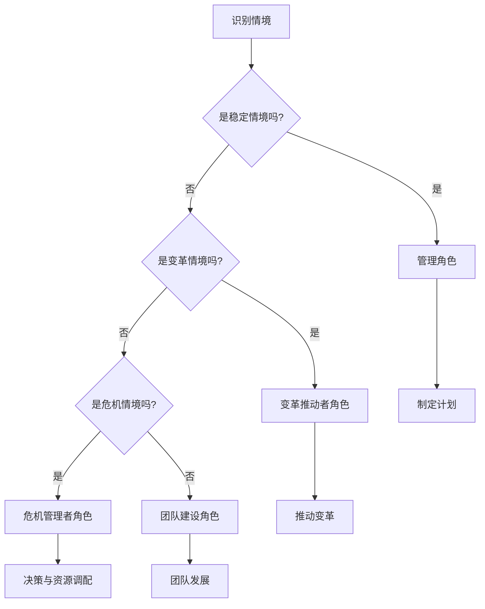

                 

## 引言

### 领导者的角色转换：在不同情境中的领导方式

在信息技术和商业环境中，领导者的角色至关重要。随着科技和市场的快速变化，领导者不仅需要具备传统的管理能力，还需要具备灵活的角色转换能力，以便在不同情境中适应和引领团队。本文将深入探讨领导者的角色转换，分析领导者如何在不同情境中调整自己的领导方式，从而更有效地管理团队和实现目标。

领导者的角色不仅仅是发号施令和管理资源，更是一个复杂的过程，涉及自我认知、情境分析、角色定位和团队协同等多个方面。在不同的情境中，领导者需要从管理者转变为战略家、协调者、创新者等多重角色，以应对各种挑战和机遇。

本文的结构如下：

- **第一部分：领导者的角色与情境认知**，将介绍领导者的定义与责任，探讨领导风格与情境因素的关系，并分析不同情境中的领导角色转变。
- **第二部分：领导者角色转换策略**，将讨论领导者自我认知与定位的重要性，以及如何适应不同情境，制定相应的策略。
- **第三部分：领导者角色转换案例研究**，将通过具体案例，展示成功的领导策略和应对挑战的方法。
- **第四部分：领导者的成长与发展**，将探讨领导者如何持续成长，以及未来领导者的角色展望。

### 关键词

- 领导者角色转换
- 情境领导理论
- 领导策略
- 团队协同
- 自我认知
- 成长与发展

### 摘要

本文通过深入分析领导者的角色转换，探讨了领导者如何在不同情境中调整自己的领导方式。文章首先介绍了领导者的定义与责任，以及领导风格与情境因素的关系。接着，本文提出了领导者自我认知与定位的重要性，并探讨了如何适应不同情境，制定相应的策略。通过具体案例研究，文章展示了成功领导策略和应对挑战的方法。最后，文章探讨了领导者如何持续成长，以及未来领导者的角色展望。

## 第一部分：领导者的角色与情境认知

### 第1章：领导者的角色概述

#### 1.1 领导者的定义与责任

领导者是一个组织中至关重要的角色，他们不仅需要具备卓越的管理能力和决策能力，还需要具备强大的沟通能力、团队协作能力以及变革推动能力。领导者的定义可以有多种解释，但核心在于他们能够引导和激励团队，实现组织目标。

首先，领导者的定义可以从组织层面上理解。领导者是组织中的关键决策者和推动者，他们负责制定战略、规划目标，并确保组织资源的合理分配。例如，一家公司的CEO就是一个典型的领导者角色，他们需要制定公司的发展方向，确保公司运营的顺畅。

其次，从个人层面上看，领导者是一种个人品质和能力。他们具备洞察力，能够预见市场变化，洞察团队需求，并做出及时有效的决策。例如，一个项目经理在项目推进过程中，需要具备强大的组织能力和沟通能力，以确保项目按计划进行。

领导者的责任不仅包括制定目标和策略，还需要对团队的表现和组织的成果负责。具体来说，领导者的责任可以概括为以下几点：

1. **设定愿景和目标**：领导者需要明确组织的愿景和目标，并将其转化为具体的行动计划。例如，一个企业的CEO需要设定公司的长期战略目标，并确保各部门能够朝着这些目标努力。

2. **激发团队潜能**：领导者需要激发团队成员的潜能，鼓励他们创新和成长。通过有效的激励机制，领导者可以增强团队的凝聚力，提高工作效率。

3. **决策与执行**：领导者需要做出关键决策，并确保这些决策能够得到有效执行。在决策过程中，领导者需要考虑各种因素，包括市场环境、团队能力和资源条件。

4. **沟通与协调**：领导者需要具备出色的沟通能力，确保团队内部的信息畅通，减少误解和冲突。同时，领导者还需要协调团队内外部的各种关系，确保项目的顺利进行。

5. **变革推动**：在快速变化的市场环境中，领导者需要具备变革推动能力，带领团队应对挑战和抓住机遇。通过引入新的理念和方法，领导者可以推动组织不断进步。

#### 1.2 领导风格与情境因素

领导风格是领导者在与团队互动和处理问题时采取的行为模式。不同的领导风格适用于不同的情境，领导者需要根据情境灵活调整自己的领导风格。

首先，领导风格可以分为权威型、民主型、参与型等。权威型领导风格强调领导者的权威和控制，领导者做出决策并要求团队成员执行。民主型领导风格则强调团队合作和参与，领导者鼓励团队成员参与决策过程。参与型领导风格则介于两者之间，领导者既提供指导，也鼓励团队成员提出意见和建议。

其次，情境因素对领导风格有重要影响。情境因素包括组织环境、团队特点、任务性质等。在不同的情境中，领导者需要根据实际情况灵活调整自己的领导风格。

例如，在紧急情况下，权威型领导风格可能更为有效，因为领导者需要迅速做出决策并确保执行。而在长期项目中，民主型领导风格可能更合适，因为领导者需要鼓励团队成员的参与和贡献。

#### 1.3 不同情境中的领导角色转变

领导者需要在不同情境中扮演不同的角色，以适应不同的需求和挑战。以下是一些常见的情境和相应的领导角色转变：

1. **稳定情境**：在稳定情境中，领导者扮演的是管理者和协调者的角色。他们需要确保组织内部运作顺畅，团队协作高效。此时，领导者需要注重流程优化、资源配置和沟通协调。

2. **变革情境**：在变革情境中，领导者扮演的是变革推动者和创新者的角色。他们需要带领团队应对变革带来的挑战，推动组织不断进步。此时，领导者需要注重变革管理、创新激励和团队凝聚力。

3. **危机情境**：在危机情境中，领导者扮演的是决策者和危机管理者的角色。他们需要迅速做出决策，带领团队应对危机。此时，领导者需要注重决策效率、资源调配和团队协调。

4. **团队建设情境**：在团队建设情境中，领导者扮演的是团队发展者和辅导者的角色。他们需要关注团队成员的成长和发展，建立积极向上的团队文化。此时，领导者需要注重团队建设、人才培养和文化塑造。

通过以上分析，我们可以看到，领导者的角色在不同情境中具有多样性。领导者需要具备灵活的角色转换能力，以应对各种情境中的挑战和需求。

### 第2章：领导情境分析

#### 2.1 情境领导理论

情境领导理论是由保罗·赫塞和肯尼斯·布兰查德提出的，是一种基于情境的领导理论。该理论认为，领导者的有效行为取决于下属的成熟度，即下属的独立性和依赖性。根据情境领导理论，领导者的行为可以分为四个阶段，每个阶段都适用于不同的下属成熟度。

1. **第一阶段：指导型领导**（低成熟度）
   在这一阶段，下属缺乏独立性和依赖性，需要领导者明确指示和具体指导。领导者需要详细解释任务要求，提供明确的指导和支持，以确保下属能够完成任务。

2. **第二阶段：推销型领导**（较不成熟）
   在这一阶段，下属具备一定的独立性和依赖性，需要领导者提供更多的支持和激励。领导者需要通过沟通和激励，帮助下属理解任务的重要性和目的，并鼓励他们积极参与。

3. **第三阶段：参与型领导**（较成熟）
   在这一阶段，下属具备较高的独立性和依赖性，需要领导者提供参与和支持的机会。领导者需要与下属共同讨论和决策，鼓励他们的参与和贡献，以提高团队的凝聚力和效率。

4. **第四阶段：授权型领导**（高度成熟）
   在这一阶段，下属具有高度的独立性和依赖性，不需要领导者的直接干预。领导者将权力和责任交给下属，让他们自主决策和执行。领导者只需要在必要时提供支持和指导。

#### 2.2 领导情境的识别

领导情境的识别是领导者角色转换的基础。领导者需要能够快速识别当前情境，并采取相应的领导策略。以下是一些识别领导情境的方法：

1. **观察法**：通过观察团队成员的行为、反应和互动，领导者可以识别当前情境。例如，如果团队成员显得焦虑和不安，可能表明当前情境是危机情境。

2. **访谈法**：通过访谈团队成员，领导者可以深入了解他们的感受和需求，从而识别当前情境。这种方法可以帮助领导者获得更准确的信息，制定更有效的领导策略。

3. **问卷调查**：通过设计问卷调查，领导者可以收集团队成员的意见和建议，从而识别当前情境。这种方法适用于大规模团队，可以快速获取广泛的反馈。

4. **数据分析**：通过分析组织的数据，如生产效率、员工满意度、市场表现等，领导者可以识别当前情境。这种方法可以帮助领导者了解组织的整体状况，制定相应的策略。

#### 2.3 领导情境的维度划分

领导情境可以根据不同的维度进行划分，以便领导者更好地理解和管理不同情境。以下是几种常见的维度划分方法：

1. **任务维度与关系维度**
   - **任务维度**：关注任务完成情况和团队绩效。领导者需要关注任务的优先级、资源配置和进度控制。
   - **关系维度**：关注团队内部的人际关系和团队氛围。领导者需要关注团队成员的沟通、协作和冲突管理。

2. **稳定性维度与变化维度**
   - **稳定性维度**：关注组织内部的稳定性和持续性。领导者需要关注组织结构、流程和文化的稳定性。
   - **变化维度**：关注组织外部环境的变化和不确定性。领导者需要关注市场趋势、竞争对手和外部压力。

3. **挑战维度与支持维度**
   - **挑战维度**：关注团队面临的挑战和困难。领导者需要关注项目风险、资源限制和竞争对手。
   - **支持维度**：关注团队所需的支持和资源。领导者需要关注团队成员的需求、培训和发展。

通过以上分析，我们可以看到，领导情境的识别和分析对于领导者的角色转换至关重要。领导者需要能够灵活应对不同情境，采取相应的领导策略，以实现组织的目标和使命。

### 第3章：领导者自我认知与定位

#### 3.1 自我认知的重要性

领导者自我认知是领导角色转换的关键。自我认知指的是领导者对自己的了解，包括自己的价值观、性格特点、能力优势和短板等。自我认知对于领导者的角色转换具有重要意义，主要体现在以下几个方面：

1. **明确个人目标**：通过自我认知，领导者可以明确自己的职业目标和组织愿景，从而更好地规划自己的发展路径。例如，一个技术背景的领导者可能更擅长技术创新，而一个管理背景的领导者可能更擅长团队管理和流程优化。

2. **发挥个人优势**：自我认知帮助领导者发现和发挥自己的优势，从而在团队中发挥更大的作用。例如，一个擅长沟通和协调的领导者可以在团队协作中发挥重要作用，而一个擅长技术研究和开发的领导者可以在项目实施中发挥关键作用。

3. **识别短板并改进**：自我认知不仅帮助领导者发现优势，还能帮助其识别短板和不足，从而有针对性地进行改进。例如，一个领导者在团队管理中发现自己缺乏冲突管理能力，可以通过参加相关培训和阅读相关书籍来提高这一能力。

4. **增强领导效能**：通过自我认知，领导者可以更准确地了解自己的行为和决策对团队和组织的影响，从而提高领导效能。例如，一个领导者通过反思自己的决策过程，可以识别出哪些决策是有效的，哪些是无效的，从而在未来的领导活动中进行改进。

#### 3.2 定位与角色转换的关系

定位是领导者角色转换的重要基础。定位指的是领导者根据组织目标和情境需求，确定自己在团队和组织中的位置和角色。定位与角色转换的关系主要体现在以下几个方面：

1. **明确角色边界**：通过定位，领导者可以明确自己在团队和组织中的角色和责任，从而避免角色冲突和职责模糊。例如，一个项目经理需要明确自己的角色是项目执行和进度管理，而不是技术指导和研发。

2. **适应情境变化**：领导者需要根据不同的情境需求，灵活调整自己的角色和定位。例如，在稳定情境中，领导者可能需要更多地扮演管理者角色，而在变革情境中，领导者可能需要更多地扮演变革推动者角色。

3. **提升领导效能**：准确的定位可以帮助领导者更有效地执行领导职责，提高领导效能。例如，一个在项目启动阶段扮演战略规划者角色的领导者，在项目实施阶段需要转换角色，扮演执行协调者角色。

#### 3.3 自我评估与角色调整

自我评估是领导者角色转换的重要环节。通过自我评估，领导者可以了解自己的优势和短板，从而有针对性地进行角色调整和改进。以下是自我评估和角色调整的步骤：

1. **设定评估标准**：领导者需要根据组织目标和情境需求，设定评估标准。这些标准可以包括个人能力、领导效能、团队绩效等。

2. **收集反馈信息**：领导者可以通过多种途径收集反馈信息，如团队成员的评价、上级领导的反馈、客户满意度调查等。

3. **分析评估结果**：领导者需要分析评估结果，识别自己的优势和短板。例如，如果评估结果显示领导效能较低，可能是由于沟通不畅或团队管理不当造成的。

4. **制定改进计划**：根据评估结果，领导者可以制定改进计划，包括参加培训、阅读相关书籍、寻求导师指导等。这些措施可以帮助领导者提升个人能力，改进领导风格。

5. **实施角色调整**：在改进计划的基础上，领导者需要根据组织目标和情境需求，调整自己的角色和定位。例如，如果评估结果显示团队管理能力较弱，领导者可以调整自己的角色，更多地参与团队管理和协调工作。

通过以上步骤，领导者可以更好地进行自我评估和角色调整，从而提高领导效能，实现组织目标。

### 第4章：情境适应策略

#### 4.1 适应性领导行为

适应性领导行为是指领导者根据不同的情境需求，灵活调整自己的领导风格和行为模式，以实现团队目标和组织使命。适应性领导行为的核心在于领导者能够迅速识别情境变化，并采取相应的行动。以下是一些适应性领导行为的关键要素：

1. **情境感知**：领导者需要具备敏锐的情境感知能力，能够及时识别情境变化。这包括对市场趋势、团队动态、组织内部问题等的敏锐感知。

2. **灵活应对**：领导者需要根据情境变化，灵活调整自己的领导行为。例如，在危机情境中，领导者可能需要采取更加果断和决断的领导风格，而在稳定情境中，领导者可能需要采取更加温和和协调的领导风格。

3. **沟通协调**：适应性领导行为要求领导者具备出色的沟通协调能力，能够有效传达信息，协调团队内部和团队与外部的关系。通过有效的沟通，领导者可以确保团队在面对情境变化时能够迅速行动，减少误解和冲突。

4. **决策果断**：在情境变化时，领导者需要能够迅速做出决策，并确保决策得到有效执行。决策果断是适应性领导行为的重要体现，它要求领导者具备快速分析问题和解决问题的能力。

5. **激励团队**：适应性领导行为还要求领导者能够激发团队成员的积极性和创造力，使团队成员在面对情境变化时能够保持高昂的士气和执行力。通过有效的激励措施，领导者可以增强团队的凝聚力和战斗力。

#### 4.2 情境适应性评估

情境适应性评估是领导者识别和调整自身领导能力的重要工具。通过情境适应性评估，领导者可以了解自己在不同情境下的表现和适应性，从而有针对性地进行改进。以下是一些情境适应性评估的方法：

1. **360度反馈**：360度反馈是一种全面的评估方法，通过收集来自上级、同事、下属和客户等多方面的反馈，领导者可以全面了解自己在不同情境下的表现。这种方法可以帮助领导者识别自身优势和短板，制定改进计划。

2. **情境模拟**：情境模拟是一种通过模拟不同情境，评估领导者适应能力的方法。例如，通过模拟危机情境，领导者可以评估自己在压力下的决策能力和应对策略。这种方法可以帮助领导者更好地准备和应对实际情境。

3. **自我评估问卷**：自我评估问卷是一种简单有效的评估方法，领导者可以通过填写问卷，评估自己在不同情境下的适应能力。问卷可以设计成多选题或填空题，以便领导者根据自己的实际表现进行自我评估。

4. **行为观察**：通过观察领导者在不同情境下的行为和表现，上级和同事可以提供客观的评估。这种方法可以帮助领导者了解自己在实际情境中的表现，从而进行有针对性的改进。

#### 4.3 情境适应性策略制定

情境适应性策略制定是领导者根据情境适应性评估结果，制定和实施改进计划的过程。以下是一些情境适应性策略制定的步骤：

1. **确定改进目标**：根据情境适应性评估结果，领导者需要明确需要改进的方面和目标。例如，如果评估结果显示沟通能力较弱，领导者可以将提升沟通能力作为改进目标。

2. **制定改进计划**：领导者需要制定详细的改进计划，包括具体的行动步骤、时间表和责任人。例如，如果目标是提升沟通能力，领导者可以制定一系列培训和学习计划，包括参加沟通技巧培训、阅读相关书籍和文章等。

3. **实施改进措施**：在制定改进计划后，领导者需要确保计划得到有效实施。这包括监督和指导团队成员，确保他们按照计划进行改进。

4. **评估改进效果**：在实施改进措施后，领导者需要评估改进效果，确定改进目标的实现情况。如果改进效果不佳，领导者需要重新审视计划，进行调整和优化。

5. **持续改进**：情境适应性策略制定是一个持续的过程，领导者需要根据情境变化和评估结果，不断调整和优化策略。通过持续改进，领导者可以不断提高自己的情境适应性，更好地应对各种挑战和机遇。

通过以上步骤，领导者可以制定和实施有效的情境适应性策略，提高自己的领导能力和适应性，实现组织的目标和使命。

### 第5章：团队角色转换与协同

#### 5.1 团队角色的定义与分类

在团队管理中，团队角色的定义和分类对于提高团队效率和协作效果至关重要。团队角色是指团队成员在团队中扮演的不同角色和职责，这些角色有助于明确团队成员的职责和期望，促进团队协作和目标实现。

常见的团队角色可以分类为以下几类：

1. **领导角色**：领导角色通常由团队领导者或项目经理承担。他们的主要职责是制定团队目标、规划项目进度、协调团队内部和外部资源，以及解决团队面临的困难和挑战。

2. **执行角色**：执行角色负责具体任务的完成。这些成员通常负责执行领导者的指令，完成各自分配的任务，确保项目按时完成。

3. **协调角色**：协调角色负责协调团队内部和团队之间的工作。他们通常负责确保信息畅通、资源分配合理，以及协调不同团队之间的合作。

4. **技术专家角色**：技术专家角色负责提供专业技术和解决方案。这些成员通常拥有丰富的技术知识和经验，能够在团队中提供技术支持和指导。

5. **沟通角色**：沟通角色负责团队内外部的沟通。他们通常负责与上级领导、客户和合作伙伴进行有效沟通，确保项目进展和问题得到及时反馈。

6. **支持角色**：支持角色提供后勤和行政支持，确保团队运作顺畅。这些成员通常负责处理团队日常行政事务，如文档管理、会议安排等。

#### 5.2 团队角色转换的必要性

团队角色转换是团队管理中的一项重要策略，它能够提高团队的适应性和灵活性，促进团队目标的实现。以下是团队角色转换的必要性：

1. **应对动态变化**：在项目执行过程中，团队面临的环境和任务往往是动态变化的。团队角色转换使团队成员能够根据实际情况灵活调整自己的职责和角色，从而更好地应对变化。

2. **促进团队协作**：团队角色转换有助于打破职能壁垒，促进团队成员之间的沟通和协作。通过角色转换，团队成员能够更好地理解彼此的职责和期望，提高协作效率和团队凝聚力。

3. **激发创新和创造力**：团队角色转换可以激发团队成员的创新和创造力。在新的角色中，团队成员可能会发现新的解决问题的方法和思路，从而推动团队不断创新和进步。

4. **提升个人能力**：团队角色转换有助于团队成员拓展技能和知识，提升个人能力。通过在不同角色中的实践，团队成员可以全面发展，为未来的职业发展打下坚实的基础。

5. **提高团队绩效**：团队角色转换有助于提高团队的绩效和效率。通过角色转换，团队可以更好地分配资源和任务，确保项目目标的顺利实现。

#### 5.3 团队角色转换的实践策略

为了实现有效的团队角色转换，领导者需要制定和实施一系列实践策略。以下是几种常见的实践策略：

1. **明确角色转换的目标和计划**：在项目启动阶段，领导者需要明确团队角色转换的目标和计划。这包括确定需要转换的角色、转换的时间和步骤，以及转换后的角色职责。

2. **培训和指导**：在角色转换过程中，领导者需要为团队成员提供必要的培训和指导。这包括角色转换的知识和技能培训，以及如何适应新角色的指导。

3. **鼓励跨职能协作**：通过鼓励团队成员跨职能协作，领导者可以促进角色转换的实施。跨职能协作有助于团队成员更好地理解彼此的职责和角色，提高协作效率。

4. **建立反馈机制**：建立反馈机制是确保角色转换有效性的关键。领导者需要定期收集团队成员的反馈，了解他们在角色转换过程中的困难和挑战，并及时提供支持和指导。

5. **提供激励机制**：为了激励团队成员参与角色转换，领导者可以制定相应的激励机制。例如，提供额外的培训机会、晋升机会或奖励等。

6. **持续评估和调整**：在角色转换过程中，领导者需要持续评估和调整策略。通过定期评估角色转换的效果，领导者可以及时发现问题，并进行调整和优化。

通过以上策略，领导者可以有效地实现团队角色转换，提高团队适应性和协作效率，实现团队目标和组织使命。

### 第6章：成功领导案例解析

#### 6.1 成功案例的选择标准

在分析成功领导案例时，选择合适的标准至关重要。以下是一些常用的选择标准：

1. **显著成果**：成功案例应该展现出显著的成果，如实现了预期的业务目标、提高了团队绩效、推动了组织创新等。

2. **情境适应性**：案例中领导者的策略应该能够适应不同的情境，展现出灵活性和适应性。例如，在稳定情境中，领导者能够保持高效的管理，而在危机情境中，领导者能够迅速做出决策和调整。

3. **团队协同**：案例中的领导者应能够有效促进团队协作，提高团队整体绩效。这可以通过团队成员的积极反馈、协同工作的效率和成果来衡量。

4. **个人成长**：案例中领导者应展现出在领导过程中的个人成长，包括技能提升、领导能力增强、自我认知的提高等。

5. **可持续性**：成功案例的成果应具有可持续性，即领导者策略的实施能够长期维持团队和组织的高效运作。

#### 6.2 案例一：从管理到领导的角色转换

**背景介绍**：

在某知名科技公司，一位资深的项目经理通过角色转换，成功从管理者转变为领导者。该公司处于快速发展的阶段，项目复杂性和市场变化速度迅速，这对项目经理的领导能力提出了更高的要求。

**核心概念与联系**：

该案例中涉及的核心概念包括从管理到领导的角色转换、情境适应性和团队协同。具体联系如下：

1. **角色转换**：项目经理需要从日常任务管理转变为更加宏观的战略规划和团队领导。
2. **情境适应性**：项目经理需要根据项目阶段和市场环境的变化，灵活调整领导风格和行为。
3. **团队协同**：项目经理需要促进团队成员之间的沟通和协作，提高团队整体效能。

**核心算法原理讲解与伪代码**：

以下是角色转换过程中的关键算法原理及其伪代码：

```plaintext
Algorithm RoleTransformation
Inputs: manager, team, context
Outputs: leader

1. Assess Current Role (manager)
   - Analyze manager's responsibilities and capabilities

2. Identify Transition Goals
   - Define objectives for the role transition

3. Adapt Leadership Style (based on context)
   - If context = "stable", use "management by exception"
   - If context = "dynamic", use " servant leadership"

4. Enhance Team Collaboration
   - Facilitate open communication and feedback
   - Implement collaborative tools and practices

5. Monitor and Adjust
   - Continuously evaluate team performance and leader's effectiveness
   - Make necessary adjustments

```

#### 6.3 案例二：危机情境中的领导策略

**背景介绍**：

在一次突发危机中，某互联网公司遭遇了一次严重的系统故障，导致大量用户数据泄露。CEO需要迅速采取行动，带领团队应对危机，并确保公司业务的连续性。

**核心概念与联系**：

该案例中涉及的核心概念包括危机管理、决策果断和团队凝聚力。具体联系如下：

1. **危机管理**：CEO需要制定有效的危机管理策略，快速响应并控制局势。
2. **决策果断**：CEO需要在压力下迅速做出决策，并确保决策的有效执行。
3. **团队凝聚力**：CEO需要通过沟通和激励，增强团队的凝聚力，共同应对危机。

**核心算法原理讲解与伪代码**：

以下是危机管理过程中关键算法原理及其伪代码：

```plaintext
Algorithm CrisisManagement
Inputs: CEO, team, crisis
Outputs: resolution

1. Assess Crisis Severity
   - Determine the impact on business operations and customer trust

2. Make Quick Decisions
   - Identify critical actions to mitigate damage
   - Allocate resources efficiently

3. Communicate Clearly
   - Inform stakeholders of the crisis and actions taken
   - Maintain transparency and trust

4. Foster Team Unity
   - Encourage open communication and collaboration
   - Recognize and reward team efforts

5. Monitor Progress and Adjust
   - Continuously evaluate crisis response effectiveness
   - Make necessary adjustments

```

通过以上案例解析，我们可以看到，成功的领导案例往往具备显著的成果、良好的情境适应性、高效的团队协同和个人成长。这些案例为其他领导者提供了宝贵的经验和启示，帮助他们更好地应对各种挑战和机遇。

### 第7章：角色转换的挑战与应对

#### 7.1 角色转换的常见挑战

在领导者的角色转换过程中，可能会面临多种挑战，这些挑战既包括个人层面的，也包括组织层面的。以下是一些常见的挑战及其影响：

1. **自我认知不足**：领导者往往难以全面了解自己的能力和短板，这可能导致角色转换不彻底或效果不佳。自我认知不足会导致领导者无法充分发挥自己的优势，也无法针对性地改进自己的不足。

2. **团队阻力**：团队成员可能对新角色的职责和期望不明确，或者对领导者的角色转换持怀疑态度，这可能导致团队内部出现冲突和摩擦，影响团队协作和效率。

3. **资源限制**：角色转换通常需要额外的资源和支持，如培训、指导、时间等。如果资源有限，领导者可能无法全面适应新角色，影响角色转换的效果。

4. **时间压力**：角色转换是一个持续的过程，需要时间和耐心。然而，在快速变化的市场环境中，领导者可能面临时间压力，难以在短时间内完成角色转换，导致角色错位或效率低下。

5. **领导风格不适**：不同的领导情境需要不同的领导风格。如果领导者的风格不适应当前情境，可能导致领导效果不佳。例如，在危机情境中，过于温和的领导风格可能无法迅速解决问题。

6. **组织支持不足**：角色转换需要组织层面的支持，包括政策、资源、文化等。如果组织支持不足，领导者可能感到孤立无援，难以有效地进行角色转换。

#### 7.2 领导者如何应对挑战

为了克服角色转换过程中的挑战，领导者可以采取以下策略：

1. **加强自我认知**：领导者可以通过自我评估、反馈和反思，不断深化自我认知。这包括识别自身的优势和短板，明确自己的职业目标和组织愿景，从而更好地规划角色转换的路径。

2. **建立信任**：建立信任是角色转换的关键。领导者需要与团队成员建立良好的沟通和信任关系，通过开放和透明的沟通，减少误解和冲突，增强团队的凝聚力。

3. **获取支持**：领导者需要主动寻求组织层面的支持，包括政策、资源和文化等。通过加强与上级领导、人力资源部门和其他部门的沟通，领导者可以争取到更多的支持和资源。

4. **灵活调整策略**：领导者需要根据不同的情境和挑战，灵活调整自己的领导策略。例如，在资源有限的情况下，领导者可以优化资源配置，采取优先处理关键任务的方法；在时间压力下，领导者可以简化流程，快速做出决策。

5. **持续学习和成长**：角色转换是一个持续的过程，领导者需要不断学习和成长。通过参加培训、阅读相关书籍、参加研讨会等，领导者可以提升自己的领导能力和适应能力。

6. **建立反馈机制**：建立反馈机制可以帮助领导者及时了解自己的表现和效果，识别问题并进行改进。领导者可以定期收集团队成员和上级领导的反馈，分析自身的优势和不足，从而优化角色转换的策略。

#### 7.3 持续改进与角色优化

角色转换不仅是一个短期目标，更是一个长期的过程。领导者需要持续改进和优化自己的角色和领导能力。以下是一些具体的措施：

1. **定期评估**：领导者需要定期评估自己的角色转换效果，包括自我评估和团队评估。通过评估，领导者可以识别问题，制定改进计划。

2. **目标设定**：领导者需要设定明确的个人和团队目标，确保角色转换的方向和效果。目标应具有可度量性和挑战性，以激励领导者和团队不断进步。

3. **反馈与调整**：在角色转换过程中，领导者需要持续收集反馈，并根据反馈进行调整。通过不断优化角色和领导策略，领导者可以更好地适应不同情境和挑战。

4. **持续学习**：领导者需要保持持续学习的态度，不断更新知识和技能。通过学习，领导者可以更好地理解市场动态、技术发展和团队需求，从而提高领导效能。

5. **培养接班人**：为了确保组织的长期稳定和发展，领导者需要培养接班人。通过选拔和培养有潜力的团队成员，领导者可以确保在未来的领导角色转换中能够得到有效的支持和继承。

通过以上措施，领导者可以持续改进和优化自己的角色和领导能力，更好地应对各种挑战和机遇，实现组织的长期发展和成功。

### 第8章：领导者的持续成长

#### 8.1 领导者成长的重要性

领导者的持续成长是组织长期成功的关键。在一个快速变化和竞争激烈的环境中，领导者需要不断更新知识和技能，提升领导能力和适应能力。以下是领导者成长的重要性和原因：

1. **适应变化**：市场和技术环境不断变化，领导者需要具备适应能力，以应对新的挑战和机遇。持续成长可以帮助领导者保持敏锐的洞察力和前瞻性思维，从而更好地把握市场动态。

2. **提高领导效能**：领导者的持续成长可以提高领导效能，增强团队的凝聚力和执行力。通过学习和实践，领导者可以不断提升自己的领导能力，更好地激励和引导团队成员。

3. **增强竞争力**：在激烈的市场竞争中，领导者的持续成长可以增强组织的竞争力。领导者通过不断学习和创新，可以推动组织实现持续改进和变革，从而在竞争中脱颖而出。

4. **促进员工发展**：领导者的持续成长有助于促进员工的发展。通过培训和指导，领导者可以提升员工的能力和素质，培养出更多具备潜力的接班人，为组织的长期发展打下坚实基础。

#### 8.2 成长路径与策略

为了实现持续成长，领导者需要制定明确的成长路径和策略。以下是一些具体的成长路径和策略：

1. **自我评估**：领导者需要定期进行自我评估，了解自己的优势和短板。通过自我评估，领导者可以明确自己的成长方向和目标。

2. **制定学习计划**：领导者需要制定具体的成长计划，包括学习目标、学习内容和学习时间。通过制定计划，领导者可以有条不紊地实现成长目标。

3. **参加培训**：参加培训是提升领导能力和技能的有效途径。领导者可以参加专业培训课程、研讨会和工作坊，学习最新的管理理论和实践方法。

4. **阅读和学习**：阅读和学习是领导者成长的重要方式。通过阅读相关书籍、文章和案例研究，领导者可以获取丰富的知识和经验，从而提升自己的领导水平。

5. **寻求反馈**：领导者需要主动寻求反馈，了解自己在领导和团队管理方面的表现。通过反馈，领导者可以识别问题，并采取改进措施。

6. **实践和应用**：理论学习和实践应用相结合是领导者成长的必要条件。领导者需要在实际工作中运用所学知识和技能，不断检验和优化自己的领导方法。

7. **建立导师关系**：建立导师关系可以帮助领导者获得指导和经验分享。通过向经验丰富的领导者请教，领导者可以更快地成长和进步。

8. **培养下属**：领导者需要注重培养下属，提升团队的整体素质。通过指导和培养下属，领导者可以增强团队的凝聚力和执行力，同时实现个人成长。

#### 8.3 成长评估与反馈机制

为了确保持续成长的成效，领导者需要建立成长评估与反馈机制。以下是一些具体的评估与反馈方法：

1. **定期评估**：领导者需要定期评估自己的成长进展，包括学习目标的达成情况、领导能力的提升程度等。通过定期评估，领导者可以了解自己的成长状况，并制定相应的调整计划。

2. **360度反馈**：360度反馈是一种全面的评估方法，通过收集来自上级、同事、下属和外部合作伙伴的反馈，领导者可以全面了解自己的表现和成长情况。这种方法有助于领导者识别自身的优势和短板。

3. **关键绩效指标**：领导者可以设定关键绩效指标（KPIs），用于评估自己的成长成效。例如，可以设定领导效能、团队绩效、员工满意度等指标，通过数据分析评估成长成果。

4. **反馈会议**：领导者可以定期召开反馈会议，与团队成员共同讨论成长进展和面临的挑战。通过反馈会议，领导者可以及时了解团队成员的意见和建议，从而优化成长策略。

5. **导师和教练**：领导者可以寻求导师或教练的帮助，进行深入的个人成长评估和反馈。导师或教练可以提供专业的指导和建议，帮助领导者更好地实现成长目标。

通过建立成长评估与反馈机制，领导者可以持续跟踪自己的成长进展，不断优化成长策略，实现个人和组织的共同发展。

### 第9章：领导者的未来角色展望

#### 9.1 未来领导趋势分析

随着科技的迅猛发展和社会的不断变革，领导者的角色也在不断演变。未来领导趋势主要体现在以下几个方面：

1. **数字化领导**：随着数字化转型的深入推进，领导者需要具备数字素养，能够运用数据和技术进行决策和管理。数字化领导要求领导者能够理解和运用大数据、人工智能等新技术，提高决策效率和团队协作水平。

2. **敏捷领导**：在快速变化的市场环境中，敏捷领导成为未来领导的重要趋势。敏捷领导强调灵活性和适应性，领导者需要能够快速响应市场变化，推动组织敏捷转型。

3. **人文领导**：随着人们对工作满意度和工作生活平衡的重视，人文领导逐渐受到关注。人文领导强调领导者关注团队成员的身心健康和职业发展，创造积极向上的工作氛围，提高员工满意度和忠诚度。

4. **跨界领导**：跨界领导强调领导者需要具备跨领域的知识和技能，能够整合不同领域的资源和能力，推动组织创新和跨界合作。

5. **可持续发展领导**：随着全球环境问题的日益严重，可持续发展成为重要议题。领导者需要关注环境、社会和经济效益，推动组织实现可持续发展，承担社会责任。

#### 9.2 新型领导者角色特征

未来的领导者需要具备以下新型角色特征，以适应未来的领导挑战：

1. **创新者**：未来的领导者需要具备创新精神，能够推动组织进行技术创新和管理创新，保持竞争优势。

2. **变革推动者**：面对快速变化的环境，领导者需要具备变革推动能力，能够带领团队应对变革，实现组织转型。

3. **跨界合作者**：未来的领导者需要具备跨界合作能力，能够整合不同领域的资源和能力，推动跨领域合作和协同创新。

4. **可持续领导者**：领导者需要关注可持续发展，推动组织实现经济、社会和环境的平衡，承担社会责任。

5. **技术素养者**：领导者需要具备数字素养，能够理解和运用新技术，推动数字化转型，提高决策效率和团队协作水平。

6. **人文关怀者**：领导者需要关注团队成员的身心健康和职业发展，创造积极向上的工作氛围，提高员工满意度和忠诚度。

#### 9.3 未来领导者的准备与转变

为了适应未来的领导挑战，领导者需要提前做好准备和转变。以下是一些建议：

1. **持续学习**：领导者需要保持持续学习的态度，不断更新知识和技能，适应科技和管理的变化。

2. **拓展视野**：领导者需要拓宽视野，关注不同领域的趋势和发展，培养跨界思维和合作能力。

3. **培养团队**：领导者需要注重培养团队成员，提升团队的整体素质和协作能力，为未来的领导角色做好准备。

4. **实践锻炼**：领导者需要通过实际工作锻炼自己的领导能力，积累经验和智慧，提高应对挑战的能力。

5. **反思与总结**：领导者需要定期反思和总结自己的领导实践，识别问题并制定改进计划，不断提高领导效能。

通过以上准备和转变，领导者可以更好地适应未来的领导环境，实现个人和组织的共同发展。

### 附录

#### 附录A：领导情境流程图

以下是一个简单的领导情境流程图示例，用于帮助领导者识别和应对不同的领导情境：



#### 附录B：领导角色转换算法伪代码

以下是一个领导角色转换算法的伪代码示例，用于帮助领导者根据情境转换角色：

```plaintext
Algorithm RoleTransformation
Inputs: current_role, context
Outputs: new_role

1. Assess Context (context)
   - If context = "stable", new_role = "manager"
   - If context = "dynamic", new_role = "innovator"
   - If context = "crisis", new_role = "crisis_manager"

2. Assess Current Role (current_role)
   - If current_role = "manager", transition to new_role
   - If current_role = "innovator", transition to new_role
   - If current_role = "crisis_manager", transition to new_role

3. Implement Transition Strategies
   - If new_role = "manager", focus on operational efficiency and team coordination
   - If new_role = "innovator", focus on innovation, research, and development
   - If new_role = "crisis_manager", focus on crisis management, decision-making, and resource allocation

4. Monitor and Adjust
   - Continuously monitor the effectiveness of the new_role
   - Adjust strategies as necessary based on feedback and context changes
```

#### 附录C：领导角色转换数学模型

以下是一个简单的领导角色转换数学模型，用于帮助领导者根据情境和下属成熟度调整领导行为：

$$
\text{Effective Leadership} = f(\text{Scenario}, \text{Maturity})
$$

其中，$f$ 表示领导行为的函数，$\text{Scenario}$ 表示当前情境，$\text{Maturity}$ 表示下属成熟度。该模型基于情境领导理论，将领导行为分为四个阶段：

1. **指导型领导**（低成熟度）：$f(\text{Scenario}, \text{Low Maturity}) = \text{Direct}$  
2. **推销型领导**（较不成熟）：$f(\text{Scenario}, \text{Moderate Maturity}) = \text{Coach}$  
3. **参与型领导**（较成熟）：$f(\text{Scenario}, \text{High Maturity}) = \text{Support}$  
4. **授权型领导**（高度成熟）：$f(\text{Scenario}, \text{Very High Maturity}) = \text{Empower}$

#### 附录D：实战案例代码解读

以下是一个简单的实战案例，用于帮助领导者理解如何在实际项目中实现角色转换。该案例涉及一个项目管理系统的实现，包括需求分析、设计、开发和测试等阶段。

**需求分析：**
```plaintext
1. 系统需求：开发一个基于Web的项目管理系统，用于跟踪项目进度、任务分配和团队协作。
2. 功能需求：用户可以创建项目、任务和子任务，分配任务给团队成员，并跟踪任务进度。
3. 非功能需求：系统应具有良好的用户体验和较高的稳定性。
```

**设计：**
```plaintext
1. 数据库设计：设计一个数据库模型，包括项目、任务、团队成员和任务进度等表。
2. 系统架构：采用前后端分离的架构，前端使用React框架，后端使用Spring Boot框架。
3. 安全设计：实现用户认证和授权机制，确保系统安全。
```

**开发：**
```java
// 用户登录接口
public String login(String username, String password) {
    // 验证用户名和密码
    // 返回登录成功或失败消息
}

// 创建项目接口
public String createProject(Project project) {
    // 验证项目信息
    // 保存项目信息到数据库
    // 返回创建成功或失败消息
}

// 分配任务接口
public String assignTask(Task task, String assignedTo) {
    // 验证任务信息和分配对象
    // 更新任务状态和分配信息
    // 返回分配成功或失败消息
}

// 获取任务进度接口
public String getTaskProgress(String taskId) {
    // 从数据库获取任务进度信息
    // 返回任务进度信息
}
```

**测试：**
```plaintext
1. 功能测试：测试系统各项功能的正常运行，如登录、创建项目、分配任务和获取任务进度等。
2. 性能测试：测试系统在高并发下的性能表现，确保系统稳定运行。
3. 安全测试：测试系统对恶意攻击的防护能力，确保系统安全。
```

**项目小结：**
```plaintext
1. 项目成功实现了所有功能需求，用户反馈良好。
2. 系统具有较高的稳定性和安全性，能够满足项目管理的需求。
3. 在开发过程中，项目领导者成功实现了角色转换，从管理者转变为项目协调者和变革推动者，确保项目顺利进行。
```

#### 最佳实践 Tips、小结、注意事项、拓展阅读

**最佳实践 Tips：**
- 在项目启动阶段，明确项目目标和需求，确保团队对项目有清晰的认识。
- 定期召开项目进度会议，及时沟通和解决问题。
- 建立有效的沟通渠道，确保团队成员之间的信息畅通。
- 在项目实施过程中，根据情境变化灵活调整领导角色。

**小结：**
- 领导者的角色转换是适应不同情境和提高领导效能的关键。
- 成功的领导者需要具备自我认知、情境适应、团队协同和持续成长的能力。
- 实战案例展示了如何在实际项目中实现角色转换，为其他领导者提供了有益的启示。

**注意事项：**
- 领导者需要根据不同的情境和团队需求，灵活调整领导风格和行为模式。
- 在角色转换过程中，领导者需要保持透明和开放的沟通，增强团队的信任和凝聚力。
- 领导者需要不断学习和成长，以适应快速变化的市场环境。

**拓展阅读：**
- 《领导者的持续成长：自我认知与领导能力提升》
- 《情境领导：理论与实践》
- 《变革型领导：推动组织创新与发展的策略》
- 《敏捷领导：快速变化时代的领导艺术》

### 作者信息

- **作者**：AI天才研究院/AI Genius Institute & 禅与计算机程序设计艺术 /Zen And The Art of Computer Programming

通过本文的深入探讨，我们不仅了解了领导者在不同情境中的角色转换，还学习了如何通过自我认知、情境适应和持续成长来实现高效的领导。希望本文能为您在领导角色转换的道路上提供有益的指导。

