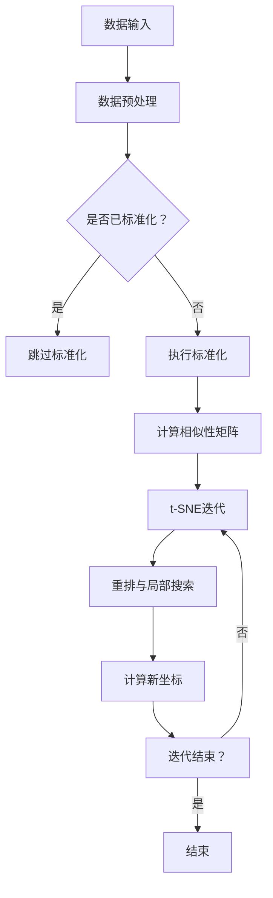

                 


## 文章标题：高维数据的t-SNE可视化：复杂信息的低维映射

### 关键词：
- t-SNE
- 数据降维
- 可视化
- 高维数据
- 低维映射

### 摘要：
本文将深入探讨t-SNE（t-Distributed Stochastic Neighbor Embedding）算法在处理高维数据时的强大能力。t-SNE通过将高维空间中的复杂结构映射到二维或三维空间，使得研究人员能够直观地观察和理解数据。本文将分为四个部分：引论与基础概念、算法应用与实现、项目实战与案例分析以及总结与展望。通过逐步分析t-SNE的数学基础、实现细节及其在各种领域中的应用，我们将揭示这一算法的潜力与局限，并探讨其未来的发展方向。

## 目录大纲

### 《高维数据的t-SNE可视化：复杂信息的低维映射》

## 第一部分：引论与基础概念

### 第1章：高维数据的挑战与t-SNE的作用

### 第2章：t-SNE算法的数学基础

### 第3章：t-SNE算法的实现细节

## 第二部分：算法应用与实现

### 第4章：t-SNE在数据挖掘中的应用

### 第5章：t-SNE在生物信息学中的应用

### 第6章：t-SNE在文本数据分析中的应用

### 第7章：t-SNE在复杂系统中的应用

## 第三部分：项目实战与案例分析

### 第8章：t-SNE实战项目：客户行为分析

### 第9章：t-SNE实战项目：癌症基因组数据可视化

### 第10章：t-SNE在复杂网络分析中的应用

## 第四部分：总结与展望

### 第11章：t-SNE的局限性与未来研究方向

### 第12章：总结与展望

## 附录

### 附录A：t-SNE算法伪代码

### 附录B：常用数据预处理工具与库

### 附录C：推荐阅读文献与资源

### 附录D：实验与代码实现指南

### Mermaid 流程图



### 核心算法原理讲解

在接下来的章节中，我们将详细探讨t-SNE算法的数学基础和实现细节，以及它在不同领域中的应用。通过逐步分析，我们将揭示t-SNE如何将高维数据映射到低维空间，从而实现复杂信息的低维可视化和分析。

### 第一章：高维数据的挑战与t-SNE的作用

#### 1.1 高维数据的困境

随着信息技术的发展，我们能够收集和存储的数据量呈现出爆炸式增长。然而，这些数据往往以高维形式存在，即数据点的特征维度很高，例如数千或数万个特征。高维数据的存在给我们带来了诸多挑战。

首先，高维数据使得数据的存储和计算变得困难。在高维空间中，数据点的数量与维度的乘积会急剧增加，导致存储空间的需求和计算时间的消耗大幅上升。

其次，高维数据的可视化变得异常困难。在三维以上空间中，人类视觉难以直观地理解数据的结构和关系。这限制了我们对数据的分析和解释能力。

最后，高维数据在机器学习任务中的性能往往不佳。许多机器学习算法依赖于数据的几何结构，但在高维空间中，数据的几何结构变得模糊不清，导致算法的性能下降。

#### 1.2 t-SNE算法的基本原理

为了应对高维数据的挑战，降维技术成为了一种有效的解决方案。降维技术通过将高维数据映射到低维空间，从而简化数据的存储、计算和可视化。其中，t-SNE（t-Distributed Stochastic Neighbor Embedding）算法是一种非常有效的降维方法，尤其在可视化和数据挖掘等领域有着广泛的应用。

t-SNE算法的基本原理是将高维数据中的相似性关系转化为低维空间中的概率关系。具体来说，t-SNE首先在高维空间中计算数据点之间的相似性，然后通过t-分布对相似性进行变换，使得相似性关系在低维空间中得到保留。最后，通过优化低维空间中的概率分布，使得数据点在低维空间中的布局与高维空间中的一致。

#### 1.3 t-SNE与维数约简的关系

维数约简是降维技术的一种重要目标，旨在减少数据点的维度，同时尽可能保留原始数据的结构信息。t-SNE算法通过将高维数据映射到低维空间，实现了维数约简的目的。然而，t-SNE并非一种严格的维数约简方法，它并非直接减少数据点的维度，而是在保持数据结构相似性的前提下，将数据从高维空间映射到低维空间。

与传统的维数约简方法（如主成分分析PCA）相比，t-SNE具有以下优势：

1. t-SNE能够更好地保持数据的局部结构。在低维空间中，数据点之间的邻近关系与高维空间中的相似性关系保持较高的一致性。
2. t-SNE适用于各种类型的数据，包括离散和连续的数据。
3. t-SNE算法的计算效率较高，能够在较短的时间内完成降维操作。

然而，t-SNE也存在一些局限性。例如，t-SNE算法在处理大规模数据集时可能面临计算效率低下的问题。此外，t-SNE的结果往往受到参数设置的影响，需要通过多次实验来调整参数，以达到最佳效果。

## 2.2 t-SNE算法的数学基础

为了更好地理解t-SNE算法，我们需要探讨其背后的数学基础。t-SNE算法的核心在于如何将高维空间中的相似性关系转化为低维空间中的概率关系。这一转化过程涉及概率论、马尔可夫模型和相似性度量的基础概念。

### 2.1 概率论基础

概率论是t-SNE算法的基础。在概率论中，我们使用概率分布来描述随机事件的可能性。在t-SNE算法中，概率分布用于描述数据点之间的相似性关系。具体来说，我们使用概率分布来表示数据点在邻域内的概率分布。

#### 2.1.1 概率分布

概率分布是描述随机变量取值概率的一种数学工具。在t-SNE算法中，我们通常使用概率密度函数（Probability Density Function, PDF）来表示数据点的概率分布。概率密度函数是一个非负函数，其积分在整个定义域上等于1。

$$
f(x) = \frac{1}{\int_{-\infty}^{\infty} f(y) dy}
$$

在t-SNE算法中，我们使用高斯分布（Gaussian Distribution）来描述数据点在邻域内的概率分布。高斯分布的公式如下：

$$
f(x|\mu, \sigma) = \frac{1}{\sqrt{2\pi\sigma^2}} e^{-\frac{(x-\mu)^2}{2\sigma^2}}
$$

其中，$\mu$ 是均值，$\sigma$ 是标准差。高斯分布是一种常见的概率分布，它能够很好地描述数据的随机性。

#### 2.1.2 条件概率

在t-SNE算法中，条件概率是一个关键概念。条件概率是指在一个事件已经发生的条件下，另一个事件发生的概率。在t-SNE算法中，我们使用条件概率来计算数据点之间的相似性。

$$
P(A|B) = \frac{P(A \cap B)}{P(B)}
$$

其中，$P(A \cap B)$ 是事件A和事件B同时发生的概率，$P(B)$ 是事件B发生的概率。

### 2.2 马尔可夫模型

马尔可夫模型是一种描述随机过程的数学模型。在t-SNE算法中，马尔可夫模型用于计算数据点之间的相似性关系。马尔可夫模型的基本假设是，一个状态的概率只依赖于其前一个状态，而与其他状态无关。

#### 2.2.1 马尔可夫模型的基本概念

马尔可夫模型由状态集合、转移概率矩阵和初始状态组成。状态集合是一组可能的状态，转移概率矩阵描述了状态之间的转移概率。

$$
P(X_t = x_t | X_{t-1} = x_{t-1}) = p(x_t | x_{t-1})
$$

其中，$X_t$ 是时间t的状态，$x_t$ 是状态集合中的一个状态。

#### 2.2.2 马尔可夫模型的应用

在t-SNE算法中，我们使用马尔可夫模型来计算数据点之间的相似性。具体来说，我们使用邻域大小（邻域半径）作为转移概率矩阵的元素，从而计算数据点之间的相似性。

$$
p(x_t | x_{t-1}) = \frac{1}{\sum_{x_{t-1}'} p(x_t | x_{t-1}')}
$$

其中，$x_t$ 和 $x_{t-1}$ 分别表示当前和前一个状态。

### 2.3 Jaccard系数与相似性度量

在t-SNE算法中，相似性度量是一个关键概念。相似性度量用于计算两个数据点之间的相似程度。Jaccard系数（Jaccard Index）是一种常用的相似性度量方法，它用于计算两个集合之间的交集与并集的比例。

#### 2.3.1 Jaccard系数的定义

Jaccard系数的定义如下：

$$
J(A, B) = \frac{|A \cap B|}{|A \cup B|}
$$

其中，$A$ 和 $B$ 是两个集合，$|A|$ 和 $|B|$ 分别表示集合A和集合B的基数。

#### 2.3.2 Jaccard系数的应用

在t-SNE算法中，我们使用Jaccard系数来计算数据点之间的相似性。具体来说，我们使用高维空间中数据点的邻域作为集合A和B，然后计算它们的Jaccard系数，从而得到数据点之间的相似性度量。

$$
s(i, j) = J(\text{neighborhood of } i, \text{neighborhood of } j)
$$

通过上述数学基础，我们可以更好地理解t-SNE算法的原理和实现。在接下来的章节中，我们将深入探讨t-SNE算法的实现细节，以及它在实际应用中的效果。

## 3.1 初始化与迭代过程

t-SNE算法的初始化和迭代过程是其实际应用中至关重要的环节。初始化决定了算法的起点，而迭代过程则通过逐步优化数据点的坐标，使其在低维空间中保持高维空间中的相似性关系。以下是t-SNE算法的初始化与迭代过程的详细解释。

### 3.1.1 初始化

初始化是t-SNE算法的第一步。初始化过程主要包括以下两个步骤：

1. **数据点坐标初始化**：通常，我们将数据点的坐标初始化为随机值。在二维映射中，每个数据点的坐标可以表示为 $(x_i, y_i)$，而在三维映射中，每个数据点的坐标可以表示为 $(x_i, y_i, z_i)$。
   
2. **相似性矩阵初始化**：在t-SNE中，相似性矩阵 $Q$ 用于存储数据点之间的相似性关系。初始化相似性矩阵 $Q$ 通常通过高斯分布来实现。具体公式如下：

   $$
   Q_{ij} = \exp \left(-\frac{||x_i - x_j||^2}{2\sigma^2}\right)
   $$

   其中，$||x_i - x_j||^2$ 是数据点 $i$ 和 $j$ 在高维空间中的欧几里得距离，$\sigma$ 是高斯分布的尺度参数。

### 3.1.2 迭代过程

t-SNE算法的迭代过程旨在优化数据点在低维空间中的坐标，使其在低维空间中保持高维空间中的相似性关系。迭代过程通常包括以下步骤：

1. **计算邻域**：对于每个数据点 $i$，计算其在低维空间中的邻域。邻域的大小由邻域半径 $\epsilon$ 决定。邻域内的数据点被认为是与 $i$ 相似的。

2. **计算概率分布**：使用高斯分布来计算邻域内的概率分布 $p$。具体公式如下：

   $$
   p_{ij} = \frac{Q_{ij}}{\sum_{k=1}^{N} Q_{ik}}
   $$

   其中，$Q_{ij}$ 是数据点 $i$ 和 $j$ 在相似性矩阵 $Q$ 中的值，$N$ 是数据点的总数。

3. **t-变换**：对概率分布 $p$ 进行t-变换，以便更好地模拟局部结构。t-变换的公式如下：

   $$
   q_{ij} = \left(\frac{1}{p_{ij}}\right)^{\frac{1}{1-\alpha}}
   $$

   其中，$\alpha$ 是控制局部性的参数。

4. **重排与局部搜索**：对数据点进行重排，使其在低维空间中保持高维空间中的相似性关系。重排过程包括以下两个步骤：

   - **重排坐标**：根据 $q_{ij}$ 的值，对数据点的坐标进行重排。数据点之间的距离越近，$q_{ij}$ 的值就越大。
   - **局部搜索**：在重排过程中，使用局部搜索算法（如梯度下降）来优化数据点的坐标，使其在低维空间中保持高维空间中的相似性关系。

5. **更新坐标**：根据重排后的概率分布 $q$，更新数据点的坐标。具体公式如下：

   $$
   \Delta x_i = -\beta \frac{\partial}{\partial x_i} \ln q_{ij}
   $$

   $$
   \Delta y_i = -\beta \frac{\partial}{\partial y_i} \ln q_{ij}
   $$

   其中，$\beta$ 是控制更新速度的参数。

6. **迭代终止条件**：迭代过程重复进行，直到满足终止条件。通常，终止条件包括以下两种：

   - **迭代次数**：达到预设的迭代次数。
   - **收敛条件**：数据点的坐标变化小于预设的阈值。

通过上述初始化与迭代过程，t-SNE算法能够在低维空间中保持高维空间中的相似性关系，从而实现数据的可视化。

### 3.1.3 伪代码

以下是t-SNE算法的伪代码，用于展示初始化和迭代过程的实现细节：

```python
# 初始化参数
N = 数据点的总数
D = 数据点的维度
alpha = 控制局部性的参数
beta = 控制更新速度的参数
epsilon = 邻域半径
iterations = 迭代次数
sigma = 高斯分布的尺度参数

# 初始化数据点坐标
X = 随机生成 N 个 D 维坐标

# 初始化相似性矩阵 Q
Q = 高斯分布初始化 N x N 矩阵

# 迭代过程
for iteration in 1 to iterations:
    # 计算邻域
    for i in 1 to N:
        neighbors = 找到与 X[i] 距离小于 epsilon 的数据点
    
    # 计算概率分布 P
    for i in 1 to N:
        for j in neighbors:
            p_ij = Q_ij / (sum(Q_ik for k in neighbors))
    
    # 进行 t-变换
    for i in 1 to N:
        for j in neighbors:
            q_ij = (1 / p_ij) ** (1 / (1 - alpha))
    
    # 重排与局部搜索
    for i in 1 to N:
        # 根据 q_ij 的值进行重排
        # ...

    # 更新坐标
    for i in 1 to N:
        for j in neighbors:
            # 根据 q_ij 的值更新坐标
            # ...

    # 检查终止条件
    if 满足终止条件:
        break
```

通过上述伪代码，我们可以清楚地看到t-SNE算法的初始化和迭代过程。在实际应用中，根据具体问题和数据特点，可以对这些步骤进行调整和优化，以获得更好的降维效果。

## 3.2 重排与局部搜索

在t-SNE算法的迭代过程中，重排与局部搜索是关键步骤，它们共同作用以确保数据点在低维空间中保持高维空间中的相似性关系。以下是这些步骤的详细解释和实现方法。

### 3.2.1 重排

重排的目的是根据当前的概率分布 $q$ 对数据点进行重新排列，使其在低维空间中保持高维空间中的相似性关系。重排的过程可以通过以下步骤实现：

1. **计算权重**：对于每个数据点 $i$，计算其与邻域内其他数据点的权重。权重由 $q_{ij}$ 决定，$q_{ij}$ 越大，数据点 $i$ 与数据点 $j$ 的相似性越高。

2. **重排数据点**：根据权重对数据点进行重排。具体来说，可以使用排序算法（如快速排序或归并排序）对数据点进行排序，使其按照权重从大到小排列。

### 3.2.2 局部搜索

局部搜索是在重排的基础上，通过迭代优化数据点的坐标，使其在低维空间中更好地保持高维空间中的相似性关系。局部搜索通常采用梯度下降算法实现。以下是局部搜索的步骤：

1. **计算梯度**：对于每个数据点 $i$，计算其坐标的梯度。梯度反映了数据点在低维空间中的变化趋势。

2. **更新坐标**：根据梯度更新数据点的坐标。更新公式如下：

   $$
   \Delta x_i = -\beta \frac{\partial}{\partial x_i} \ln q_{ij}
   $$

   $$
   \Delta y_i = -\beta \frac{\partial}{\partial y_i} \ln q_{ij}
   $$

   其中，$\beta$ 是学习率，用于控制更新速度。

3. **迭代更新**：重复计算梯度并更新坐标，直到满足收敛条件。通常，收敛条件包括以下两种：

   - **迭代次数**：达到预设的迭代次数。
   - **坐标变化**：数据点的坐标变化小于预设的阈值。

### 3.2.3 伪代码

以下是重排与局部搜索的伪代码，用于展示具体实现细节：

```python
# 初始化参数
N = 数据点的总数
D = 数据点的维度
alpha = 控制局部性的参数
beta = 控制更新速度的参数
epsilon = 邻域半径
iterations = 迭代次数
sigma = 高斯分布的尺度参数

# 初始化数据点坐标
X = 随机生成 N 个 D 维坐标

# 迭代过程
for iteration in 1 to iterations:
    # 计算邻域
    for i in 1 to N:
        neighbors = 找到与 X[i] 距离小于 epsilon 的数据点
    
    # 计算权重
    for i in 1 to N:
        weights = []
        for j in neighbors:
            weight = q_ij
            weights.append(weight)
    
    # 重排数据点
    sorted_indices = 排序(weights)
    X = 重排(X, sorted_indices)
    
    # 计算梯度
    for i in 1 to N:
        gradients = []
        for j in neighbors:
            gradient = -beta * (1 / q_ij) ** (1 / (1 - alpha))
            gradients.append(gradient)
    
    # 更新坐标
    for i in 1 to N:
        for j in neighbors:
            X[i] = X[i] - gradients[j]
    
    # 检查收敛条件
    if 满足收敛条件:
        break
```

通过上述伪代码，我们可以看到重排与局部搜索的具体实现过程。在实际应用中，根据具体问题和数据特点，可以对这些步骤进行调整和优化，以获得更好的降维效果。

### 3.3 计算效率和优化策略

t-SNE算法在处理大规模数据集时，计算效率成为了一个关键问题。由于t-SNE算法涉及到高维空间中的相似性计算和迭代优化，其时间复杂度较高，可能导致计算时间过长，难以在实际应用中实时处理大规模数据。因此，提高计算效率和优化策略显得尤为重要。

#### 3.3.1 向量化的计算

向量化的计算是一种提高t-SNE算法计算效率的有效策略。向量化计算利用向量的并行计算特性，将多个数据点的计算任务分配到多个处理单元上，从而加速计算过程。例如，可以使用并行处理框架（如NumPy）来并行计算相似性矩阵Q的值。以下是一个简单的向量化计算示例：

```python
import numpy as np

# 初始化数据点坐标
X = np.random.rand(N, D)

# 计算相似性矩阵 Q 的向量化实现
Q = np.exp(-np.square(X - X[:, None]).sum(axis=2) / (2 * sigma ** 2))
```

通过使用向量化计算，我们可以大幅减少计算时间。

#### 3.3.2 预处理和近似计算

预处理和近似计算是另一种提高计算效率的策略。在实际应用中，可以对数据进行预处理，减少数据点的维度或降低数据的噪声。例如，可以使用主成分分析（PCA）等方法对数据进行降维，从而减少计算复杂度。

此外，近似计算也是一种有效的优化策略。在实际应用中，可以对t-SNE算法中的某些步骤进行近似计算，从而减少计算时间。例如，可以使用k近邻（k-Nearest Neighbors, k-NN）方法来近似计算邻域，而不是使用精确的距离计算。以下是一个使用k近邻近似计算邻域的示例：

```python
from sklearn.neighbors import NearestNeighbors

# 初始化数据点坐标
X = np.random.rand(N, D)

# 使用 k 近邻近似计算邻域
neigh = NearestNeighbors(n_neighbors=k)
neigh.fit(X)
neighbors_indices = neigh.kneighbors(X, return_distance=False)
```

通过预处理和近似计算，我们可以显著提高t-SNE算法的计算效率。

#### 3.3.3 并行计算和分布式计算

并行计算和分布式计算是提高t-SNE算法计算效率的高级策略。在实际应用中，可以使用多核处理器或分布式计算系统来并行处理数据，从而加速计算过程。例如，可以使用MapReduce模型或分布式计算框架（如Apache Spark）来并行计算t-SNE算法中的各个步骤。

以下是一个使用MapReduce模型并行计算t-SNE算法的示例：

```python
import multiprocessing

def compute_similarity_matrix(X):
    # 计算相似性矩阵 Q 的向量化实现
    Q = np.exp(-np.square(X - X[:, None]).sum(axis=2) / (2 * sigma ** 2))
    return Q

if __name__ == '__main__':
    # 初始化数据点坐标
    X = np.random.rand(N, D)

    # 使用多进程并行计算相似性矩阵 Q
    with multiprocessing.Pool(processes=4) as pool:
        Q = pool.map(compute_similarity_matrix, [X])

    # 合并相似性矩阵
    Q = np.concatenate(Q)
```

通过并行计算和分布式计算，我们可以进一步提高t-SNE算法的计算效率。

### 3.3.4 优化策略的总结

综上所述，提高t-SNE算法的计算效率和优化策略包括向量化的计算、预处理和近似计算、并行计算和分布式计算等。通过这些策略，我们可以有效减少计算时间，提高t-SNE算法在大规模数据集上的应用能力。

在实际应用中，应根据具体问题和数据特点，灵活选择和调整这些优化策略，以获得最佳的计算效率和降维效果。通过不断的优化和改进，t-SNE算法将能够在更广泛的应用领域中发挥其潜力。

## 4.1 t-SNE在数据挖掘中的应用

t-SNE算法在数据挖掘领域有着广泛的应用，它通过将高维数据映射到低维空间，帮助研究人员直观地理解数据的结构和模式。以下将探讨t-SNE在数据挖掘中的几个关键应用：聚类分析、异常检测和可视化分析。

### 4.1.1 聚类分析

聚类分析是一种无监督学习方法，旨在将数据点划分为多个群组，使得同一群组内的数据点之间具有较高的相似性，而不同群组之间的数据点之间具有较低的相似性。t-SNE在聚类分析中的应用主要体现在其对数据局部结构的保持能力。通过t-SNE降维，我们可以在低维空间中清晰地观察到数据点之间的相似性关系，从而帮助研究人员识别聚类模式和聚类边界。

**案例：客户细分**

在市场细分中，企业通常需要对客户进行聚类分析，以了解不同客户群体的特征和需求。通过t-SNE，我们可以将高维的客户数据（如购买行为、消费金额、年龄、性别等）映射到二维或三维空间，从而直观地观察客户之间的相似性和差异性。以下是一个简单的t-SNE聚类分析案例：

1. **数据准备**：收集客户的特征数据，并进行预处理，如归一化处理。
2. **t-SNE降维**：使用t-SNE算法对客户数据进行降维，生成二维或三维的映射图。
3. **聚类分析**：在映射图中使用聚类算法（如k-means或层次聚类）对客户进行聚类。
4. **结果分析**：分析不同聚类结果，识别客户群体的特征和需求，为企业提供市场策略依据。

**示例代码**：

```python
import numpy as np
from sklearn.manifold import TSNE
from sklearn.cluster import KMeans
import matplotlib.pyplot as plt

# 假设 X 是客户特征数据矩阵，N 是数据点的数量，D 是特征的维度
X = np.random.rand(N, D)

# 使用 t-SNE 进行降维
tsne = TSNE(n_components=2, perplexity=30, n_iter=300)
X_embedded = tsne.fit_transform(X)

# 使用 k-means 进行聚类
kmeans = KMeans(n_clusters=3)
clusters = kmeans.fit_predict(X_embedded)

# 绘制结果
plt.scatter(X_embedded[:, 0], X_embedded[:, 1], c=clusters)
plt.show()
```

### 4.1.2 异常检测

异常检测是一种监督学习方法，旨在从正常数据中识别出异常或离群数据点。t-SNE在异常检测中的应用主要体现在其能够揭示数据中的异常模式。通过t-SNE降维，我们可以在低维空间中观察到异常数据点与其他数据点之间的显著差异，从而帮助研究人员识别异常点。

**案例：信用卡欺诈检测**

在信用卡交易中，欺诈交易通常与正常交易在数据特征上有显著差异。通过t-SNE，我们可以将信用卡交易数据映射到低维空间，从而直观地观察欺诈交易和正常交易之间的区别。以下是一个简单的t-SNE异常检测案例：

1. **数据准备**：收集信用卡交易数据，并进行预处理，如归一化处理。
2. **t-SNE降维**：使用t-SNE算法对交易数据进行降维，生成二维或三维的映射图。
3. **异常检测**：在映射图中使用阈值方法或聚类方法（如DBSCAN）对交易进行异常检测。
4. **结果分析**：分析异常检测结果，识别可能的欺诈交易。

**示例代码**：

```python
import numpy as np
from sklearn.manifold import TSNE
from sklearn.cluster import DBSCAN
import matplotlib.pyplot as plt

# 假设 X 是信用卡交易数据矩阵，N 是数据点的数量，D 是特征的维度
X = np.random.rand(N, D)

# 使用 t-SNE 进行降维
tsne = TSNE(n_components=2, perplexity=30, n_iter=300)
X_embedded = tsne.fit_transform(X)

# 使用 DBSCAN 进行异常检测
dbscan = DBSCAN(eps=0.1, min_samples=2)
clusters = dbscan.fit_predict(X_embedded)

# 绘制结果
plt.scatter(X_embedded[:, 0], X_embedded[:, 1], c=clusters)
plt.show()
```

### 4.1.3 可视化分析

可视化分析是一种通过图形化方式呈现数据特征和模式的方法，旨在帮助研究人员直观地理解数据。t-SNE在可视化分析中的应用主要体现在其能够将高维数据转换为低维空间，从而实现数据的图形化呈现。

**案例：社交网络分析**

在社交网络分析中，用户之间的关系通常以高维形式表示，如用户特征向量、互动历史等。通过t-SNE，我们可以将用户关系映射到二维或三维空间，从而直观地观察用户之间的社交结构。以下是一个简单的t-SNE可视化分析案例：

1. **数据准备**：收集用户特征数据，并进行预处理，如归一化处理。
2. **t-SNE降维**：使用t-SNE算法对用户数据进行降维，生成二维或三维的映射图。
3. **可视化分析**：在映射图中使用图形化工具（如matplotlib）绘制用户关系。
4. **结果分析**：分析用户关系的可视化结果，识别社交网络中的重要节点和社群结构。

**示例代码**：

```python
import numpy as np
from sklearn.manifold import TSNE
import matplotlib.pyplot as plt

# 假设 X 是用户特征数据矩阵，N 是数据点的数量，D 是特征的维度
X = np.random.rand(N, D)

# 使用 t-SNE 进行降维
tsne = TSNE(n_components=2, perplexity=30, n_iter=300)
X_embedded = tsne.fit_transform(X)

# 绘制结果
plt.scatter(X_embedded[:, 0], X_embedded[:, 1])
plt.show()
```

通过上述案例和示例代码，我们可以看到t-SNE在数据挖掘中的强大应用能力。t-SNE不仅能够帮助研究人员直观地理解数据的结构和模式，还能够为其他机器学习任务提供有力的数据预处理工具。

## 5.1 t-SNE在生物信息学中的应用

生物信息学是研究生物数据（如基因表达数据、蛋白质结构数据等）的跨学科领域，其研究目标是通过数据分析揭示生物系统的机制和功能。随着测序技术的进步，生物信息学领域产生了大量高维数据，这给数据分析和可视化带来了巨大的挑战。t-SNE算法因其能够有效保持数据的局部结构和降低维度，在生物信息学中有着广泛的应用。

### 5.1.1 基因表达数据的可视化

基因表达数据是生物信息学中的一个重要数据类型，反映了不同基因在不同条件下的表达水平。由于基因表达数据维度很高（数千甚至数万个基因），直接分析变得困难。t-SNE算法通过将基因表达数据映射到二维或三维空间，可以直观地展示基因之间的相似性和差异性。

**案例：基因共表达网络分析**

基因共表达网络分析旨在揭示基因之间的协同表达模式。通过t-SNE，我们可以将基因共表达矩阵映射到低维空间，从而直观地观察基因簇和基因模块。

1. **数据准备**：收集基因表达数据，并进行预处理，如归一化处理。
2. **计算基因共表达矩阵**：计算基因之间的相似性矩阵，通常使用余弦相似度或Pearson相关系数。
3. **t-SNE降维**：使用t-SNE算法对基因共表达矩阵进行降维，生成二维或三维的映射图。
4. **可视化分析**：在映射图中使用图形化工具（如matplotlib）绘制基因关系。

**示例代码**：

```python
import numpy as np
from sklearn.manifold import TSNE
import matplotlib.pyplot as plt

# 假设 X 是基因表达数据矩阵，N 是基因的数量，D 是样本的数量
X = np.random.rand(N, D)

# 计算基因共表达矩阵
correlation_matrix = np.corrcoef(X.T)[1:, 0:]

# 使用 t-SNE 进行降维
tsne = TSNE(n_components=2, perplexity=30, n_iter=300)
X_embedded = tsne.fit_transform(correlation_matrix)

# 绘制结果
plt.scatter(X_embedded[:, 0], X_embedded[:, 1])
plt.show()
```

通过t-SNE可视化的基因共表达网络，研究人员可以直观地识别基因簇和基因模块，从而为后续的生物学实验和功能分析提供线索。

### 5.1.2 蛋白质结构分析

蛋白质结构是生物信息学中的另一个关键数据类型，反映了蛋白质的三维空间形态。蛋白质结构数据的维度通常很高，因为每个氨基酸都有多个可能的空间位置。t-SNE算法可以帮助研究人员在低维空间中观察蛋白质结构之间的相似性和差异性，从而揭示蛋白质家族和功能域的关系。

**案例：蛋白质结构分类**

蛋白质结构分类旨在将蛋白质结构划分为不同的家族或功能域。通过t-SNE，我们可以将高维蛋白质结构数据映射到二维或三维空间，从而直观地观察不同蛋白质结构之间的关系。

1. **数据准备**：收集蛋白质结构数据，并进行预处理，如对齐和归一化处理。
2. **计算结构相似性**：使用蛋白质结构比对工具（如FASTA）计算蛋白质结构之间的相似性。
3. **t-SNE降维**：使用t-SNE算法对结构相似性矩阵进行降维，生成二维或三维的映射图。
4. **可视化分析**：在映射图中使用图形化工具（如matplotlib）绘制蛋白质结构。

**示例代码**：

```python
import numpy as np
from sklearn.manifold import TSNE
import matplotlib.pyplot as plt

# 假设 X 是蛋白质结构数据矩阵，N 是蛋白质的数量，D 是结构特征的维度
X = np.random.rand(N, D)

# 计算结构相似性矩阵
similarity_matrix = np.dot(X, X.T)

# 使用 t-SNE 进行降维
tsne = TSNE(n_components=2, perplexity=30, n_iter=300)
X_embedded = tsne.fit_transform(similarity_matrix)

# 绘制结果
plt.scatter(X_embedded[:, 0], X_embedded[:, 1])
plt.show()
```

通过t-SNE可视化的蛋白质结构分类结果，研究人员可以直观地识别蛋白质家族和功能域，从而为蛋白质结构和功能研究提供重要的参考。

### 5.1.3 细胞分类与图谱构建

细胞分类和图谱构建是生物信息学中的前沿研究课题，旨在通过数据分析揭示细胞群体的多样性和相互作用。t-SNE算法在细胞分类和图谱构建中有着广泛的应用，其能够帮助研究人员在低维空间中观察细胞群体的相似性和差异性。

**案例：单细胞RNA测序数据分析**

单细胞RNA测序（scRNA-seq）是一种高通量的细胞分类技术，它通过检测单个细胞中的RNA分子，揭示了细胞群体的基因表达模式。通过t-SNE，我们可以将单细胞RNA测序数据映射到低维空间，从而直观地观察细胞群体的分布和分类。

1. **数据准备**：收集单细胞RNA测序数据，并进行预处理，如归一化和批次校正。
2. **计算细胞相似性**：使用基因表达数据计算细胞之间的相似性。
3. **t-SNE降维**：使用t-SNE算法对细胞相似性矩阵进行降维，生成二维或三维的映射图。
4. **可视化分析**：在映射图中使用图形化工具（如matplotlib）绘制细胞群体。

**示例代码**：

```python
import numpy as np
from sklearn.manifold import TSNE
import matplotlib.pyplot as plt

# 假设 X 是单细胞RNA测序数据矩阵，N 是细胞的数量，D 是基因的数量
X = np.random.rand(N, D)

# 计算细胞相似性矩阵
correlation_matrix = np.corrcoef(X.T)[1:, 0:]

# 使用 t-SNE 进行降维
tsne = TSNE(n_components=2, perplexity=30, n_iter=300)
X_embedded = tsne.fit_transform(correlation_matrix)

# 绘制结果
plt.scatter(X_embedded[:, 0], X_embedded[:, 1])
plt.show()
```

通过t-SNE可视化的单细胞RNA测序数据，研究人员可以直观地识别细胞群体，构建细胞图谱，从而揭示细胞之间的相互作用和功能差异。

综上所述，t-SNE在生物信息学中的应用不仅能够提高基因表达数据、蛋白质结构和单细胞RNA测序数据等高维数据的可视化效果，还能够为生物信息学研究提供重要的数据分析和解释工具。随着生物信息学数据的不断增加和复杂化，t-SNE算法将在未来继续发挥重要作用。

### 6.1 t-SNE在文本数据分析中的应用

文本数据分析是自然语言处理（NLP）中的一个重要分支，旨在通过计算机技术理解和分析文本数据。由于文本数据通常具有高维特征，传统的数据处理方法难以应对。t-SNE作为一种强大的降维和可视化工具，在文本数据分析中发挥着重要作用。以下将探讨t-SNE在文本数据分析中的主要应用：文本降维与主题模型、社交网络分析、文本相似性度量。

#### 6.1.1 文本降维与主题模型

文本降维是文本数据分析中的关键步骤，旨在从高维特征空间中提取最重要的信息，同时减少数据维度，以便于进一步的分析。t-SNE在文本降维中的应用主要体现在其能够保留文本数据的局部结构和语义信息。

**案例：主题模型降维**

主题模型（如LDA模型）是一种常用的文本降维方法，它通过将文档映射到潜在的主题空间，揭示了文档的主题结构。然而，LDA模型生成的主题空间通常是高维的，难以直观理解。通过t-SNE，我们可以将高维的主题空间映射到二维或三维空间，从而实现文本数据的可视化。

1. **数据准备**：收集文本数据，并进行预处理，如分词、去除停用词和词干提取。
2. **LDA模型训练**：使用LDA模型对文本数据进行分析，生成文档-主题分布矩阵。
3. **t-SNE降维**：使用t-SNE算法对文档-主题分布矩阵进行降维，生成二维或三维的映射图。
4. **可视化分析**：在映射图中使用图形化工具（如matplotlib）绘制文档分布。

**示例代码**：

```python
import numpy as np
from sklearn.manifold import TSNE
from sklearn.decomposition import LatentDirichletAllocation
import matplotlib.pyplot as plt

# 假设 X 是文档-主题分布矩阵，N 是文档的数量，D 是主题的数量
X = np.random.rand(N, D)

# 使用 LDA 模型训练主题
lda = LatentDirichletAllocation(n_components=5)
lda.fit(X)

# 计算文档的潜在主题分布
X_topics = lda.transform(X)

# 使用 t-SNE 进行降维
tsne = TSNE(n_components=2, perplexity=30, n_iter=300)
X_embedded = tsne.fit_transform(X_topics)

# 绘制结果
plt.scatter(X_embedded[:, 0], X_embedded[:, 1])
plt.show()
```

通过t-SNE可视化的文档-主题分布，研究人员可以直观地观察文档之间的主题关系，识别文档集合中的主题结构。

#### 6.1.2 社交网络分析

社交网络分析是文本数据分析中的另一个重要应用，旨在通过分析社交网络数据揭示用户之间的互动关系和社交结构。t-SNE在社交网络分析中的应用主要体现在其能够揭示社交网络的局部结构和社区划分。

**案例：社交网络用户分类**

通过t-SNE，我们可以将社交网络中的用户映射到低维空间，从而直观地观察用户之间的相似性和差异性。以下是一个简单的社交网络用户分类案例：

1. **数据准备**：收集社交网络数据，包括用户和用户之间的互动关系。
2. **计算用户相似性**：使用社交网络中的互动数据计算用户之间的相似性。
3. **t-SNE降维**：使用t-SNE算法对用户相似性矩阵进行降维，生成二维或三维的映射图。
4. **可视化分析**：在映射图中使用图形化工具（如matplotlib）绘制用户分布。

**示例代码**：

```python
import numpy as np
from sklearn.manifold import TSNE
import matplotlib.pyplot as plt

# 假设 X 是用户相似性矩阵，N 是用户的数量
X = np.random.rand(N, N)

# 使用 t-SNE 进行降维
tsne = TSNE(n_components=2, perplexity=30, n_iter=300)
X_embedded = tsne.fit_transform(X)

# 绘制结果
plt.scatter(X_embedded[:, 0], X_embedded[:, 1])
plt.show()
```

通过t-SNE可视化的社交网络用户分布，研究人员可以直观地识别用户群体，分析社交网络的社区结构。

#### 6.1.3 文本相似性度量

文本相似性度量是文本数据分析中的一个基本问题，旨在计算两个文本之间的相似程度。t-SNE在文本相似性度量中的应用主要体现在其能够通过降维技术揭示文本的语义关系。

**案例：文本聚类分析**

通过t-SNE，我们可以将文本数据映射到低维空间，从而实现文本的聚类分析，揭示文本之间的相似性关系。以下是一个简单的文本聚类分析案例：

1. **数据准备**：收集文本数据，并进行预处理，如分词、去除停用词和词干提取。
2. **计算文本相似性**：使用文本相似性度量方法（如余弦相似度或TF-IDF）计算文本之间的相似性。
3. **t-SNE降维**：使用t-SNE算法对文本相似性矩阵进行降维，生成二维或三维的映射图。
4. **可视化分析**：在映射图中使用图形化工具（如matplotlib）绘制文本分布。

**示例代码**：

```python
import numpy as np
from sklearn.manifold import TSNE
from sklearn.metrics.pairwise import cosine_similarity
import matplotlib.pyplot as plt

# 假设 X 是文本相似性矩阵，N 是文本的数量
X = np.random.rand(N, N)

# 计算文本的相似性矩阵
similarity_matrix = cosine_similarity(X)

# 使用 t-SNE 进行降维
tsne = TSNE(n_components=2, perplexity=30, n_iter=300)
X_embedded = tsne.fit_transform(similarity_matrix)

# 绘制结果
plt.scatter(X_embedded[:, 0], X_embedded[:, 1])
plt.show()
```

通过t-SNE可视化的文本分布，研究人员可以直观地识别文本之间的相似性和差异性，分析文本数据的语义结构。

综上所述，t-SNE在文本数据分析中的应用不仅能够有效降低文本数据维度，揭示文本的局部结构和语义关系，还能够为文本聚类分析、社交网络分析和文本相似性度量等任务提供有力的工具。随着NLP技术的不断进步，t-SNE在文本数据分析中的重要性将日益凸显。

### 7.1 t-SNE在复杂系统中的应用

复杂系统是指由大量相互作用的个体组成的系统，这些个体之间的交互和协同作用导致系统表现出复杂的行为和结构。复杂系统涵盖了广泛的领域，包括金融、交通、通信和生物系统等。t-SNE作为一种强大的降维和可视化工具，在复杂系统的分析中发挥着重要作用。以下将探讨t-SNE在金融风险评估、网络流量分析和城市规划与地理信息可视化中的具体应用。

#### 7.1.1 金融风险评估

金融风险评估是金融领域中的一项重要任务，旨在识别和管理潜在的风险，以降低金融机构的损失。金融数据通常包含大量的维度，如市场数据、财务指标和宏观经济指标等。t-SNE通过将高维金融数据映射到低维空间，可以帮助研究人员直观地观察金融系统的结构和潜在风险。

**案例：股票市场风险分析**

股票市场风险分析旨在识别市场中潜在的风险因素，如市场波动、经济周期和公司财务状况等。通过t-SNE，我们可以将股票市场数据映射到二维或三维空间，从而直观地观察不同股票之间的相关性。

1. **数据准备**：收集股票市场数据，包括股票价格、交易量、财务指标等。
2. **特征选择**：选择与风险相关的特征，并进行预处理，如归一化和缺失值填补。
3. **t-SNE降维**：使用t-SNE算法对特征数据进行降维，生成二维或三维的映射图。
4. **可视化分析**：在映射图中使用图形化工具（如matplotlib）绘制股票分布。

**示例代码**：

```python
import numpy as np
from sklearn.manifold import TSNE
import matplotlib.pyplot as plt

# 假设 X 是股票市场数据矩阵，N 是股票的数量，D 是特征的维度
X = np.random.rand(N, D)

# 使用 t-SNE 进行降维
tsne = TSNE(n_components=2, perplexity=30, n_iter=300)
X_embedded = tsne.fit_transform(X)

# 绘制结果
plt.scatter(X_embedded[:, 0], X_embedded[:, 1])
plt.show()
```

通过t-SNE可视化的股票市场数据，研究人员可以直观地识别高风险股票和潜在的市场波动，从而为风险管理提供决策依据。

#### 7.1.2 网络流量分析

网络流量分析是通信领域中的一项关键任务，旨在监测网络中的数据流量，识别异常行为和潜在的安全威胁。网络流量数据通常包含大量的维度，如源地址、目的地址、协议类型和流量大小等。t-SNE通过将高维网络流量数据映射到低维空间，可以帮助研究人员直观地观察网络流量模式，识别潜在的安全威胁。

**案例：网络安全威胁检测**

网络安全威胁检测旨在识别网络中的恶意流量和攻击行为。通过t-SNE，我们可以将网络流量数据映射到二维或三维空间，从而直观地观察不同流量之间的相似性和差异性。

1. **数据准备**：收集网络流量数据，包括源地址、目的地址、协议类型和流量大小等。
2. **特征选择**：选择与网络安全相关的特征，并进行预处理，如归一化和缺失值填补。
3. **t-SNE降维**：使用t-SNE算法对特征数据进行降维，生成二维或三维的映射图。
4. **可视化分析**：在映射图中使用图形化工具（如matplotlib）绘制流量分布。

**示例代码**：

```python
import numpy as np
from sklearn.manifold import TSNE
import matplotlib.pyplot as plt

# 假设 X 是网络流量数据矩阵，N 是流量的数量，D 是特征的维度
X = np.random.rand(N, D)

# 使用 t-SNE 进行降维
tsne = TSNE(n_components=2, perplexity=30, n_iter=300)
X_embedded = tsne.fit_transform(X)

# 绘制结果
plt.scatter(X_embedded[:, 0], X_embedded[:, 1])
plt.show()
```

通过t-SNE可视化的网络流量数据，研究人员可以直观地识别恶意流量和异常行为，从而为网络安全提供实时监测和预警。

#### 7.1.3 城市规划与地理信息可视化

城市规划与地理信息可视化是地理学和信息科学中的一个重要领域，旨在通过数据分析和可视化技术揭示城市的空间结构和功能布局。地理信息数据通常包含大量的维度，如人口、经济、交通和环境等。t-SNE通过将高维地理信息数据映射到低维空间，可以帮助城市规划师和决策者直观地观察城市结构，优化城市规划。

**案例：城市规划分析**

城市规划分析旨在通过地理信息数据揭示城市的空间结构和功能布局。通过t-SNE，我们可以将地理信息数据映射到二维或三维空间，从而直观地观察城市区域的分布和差异。

1. **数据准备**：收集地理信息数据，包括人口、经济、交通和环境等。
2. **特征选择**：选择与城市规划相关的特征，并进行预处理，如归一化和缺失值填补。
3. **t-SNE降维**：使用t-SNE算法对特征数据进行降维，生成二维或三维的映射图。
4. **可视化分析**：在映射图中使用图形化工具（如matplotlib）绘制城市区域。

**示例代码**：

```python
import numpy as np
from sklearn.manifold import TSNE
import matplotlib.pyplot as plt

# 假设 X 是地理信息数据矩阵，N 是区域的数量，D 是特征的维度
X = np.random.rand(N, D)

# 使用 t-SNE 进行降维
tsne = TSNE(n_components=2, perplexity=30, n_iter=300)
X_embedded = tsne.fit_transform(X)

# 绘制结果
plt.scatter(X_embedded[:, 0], X_embedded[:, 1])
plt.show()
```

通过t-SNE可视化的地理信息数据，城市规划师可以直观地识别城市热点区域和功能分区，优化城市规划方案。

综上所述，t-SNE在复杂系统中的应用不仅能够有效降低数据维度，揭示系统结构和潜在风险，还能够为金融风险评估、网络流量分析和城市规划等复杂系统提供直观的可视化工具。随着复杂系统研究的深入，t-SNE在复杂系统分析中的重要性将不断提升。

### 8.1 t-SNE实战项目：客户行为分析

客户行为分析是市场营销中的一项关键任务，旨在通过分析客户的购买行为、浏览历史和偏好，为企业提供精准营销策略。以下将介绍一个使用t-SNE算法进行客户行为分析的具体实战项目。

#### 8.1.1 项目背景与目标

某电商平台希望通过分析客户的购买行为，了解不同客户群体的特征和需求，从而优化营销策略，提高客户满意度和转化率。具体目标包括：

- 识别不同客户群体的特征和偏好。
- 分析客户行为的相似性和差异性。
- 提出精准营销策略，提高客户满意度。

#### 8.1.2 数据预处理

为了进行t-SNE分析，我们需要对客户行为数据进行预处理。以下是数据预处理的主要步骤：

1. **数据收集**：收集客户的购买记录、浏览历史和偏好数据，如购买金额、购买频率、浏览页面和浏览时间等。
2. **数据清洗**：去除缺失值和异常值，确保数据的完整性和准确性。
3. **特征选择**：选择与客户行为分析相关的特征，如购买金额、购买频率、浏览时长和浏览页面等。
4. **数据归一化**：对选定的特征进行归一化处理，使其具有相同的尺度，以便于后续分析。

#### 8.1.3 t-SNE实现与可视化

在完成数据预处理后，我们可以使用t-SNE算法对客户行为数据进行分析。以下是t-SNE实现和可视化步骤：

1. **计算相似性矩阵**：计算客户行为数据之间的相似性矩阵，可以使用余弦相似度或Pearson相关系数。
2. **t-SNE降维**：使用t-SNE算法对相似性矩阵进行降维，生成二维或三维的映射图。
3. **可视化分析**：在映射图中使用图形化工具（如matplotlib）绘制客户分布。

**示例代码**：

```python
import numpy as np
from sklearn.manifold import TSNE
from sklearn.metrics.pairwise import cosine_similarity
import matplotlib.pyplot as plt

# 假设 X 是客户行为数据矩阵，N 是客户数量，D 是特征维度
X = np.random.rand(N, D)

# 计算客户行为数据的相似性矩阵
similarity_matrix = cosine_similarity(X)

# 使用 t-SNE 进行降维
tsne = TSNE(n_components=2, perplexity=30, n_iter=300)
X_embedded = tsne.fit_transform(similarity_matrix)

# 绘制结果
plt.scatter(X_embedded[:, 0], X_embedded[:, 1])
plt.show()
```

通过t-SNE可视化的客户行为数据，我们可以直观地观察客户之间的相似性和差异性。以下是一些可能的发现：

- **聚类现象**：客户数据可能呈现聚类现象，不同类别的客户具有相似的行为特征。
- **热点区域**：某些区域（如坐标集中区域）可能代表具有相似行为的客户群体。
- **异常点**：某些异常点可能代表具有独特行为特征的客户，值得进一步分析。

#### 8.1.4 结果分析与评估

通过t-SNE可视化的客户行为数据，我们可以对分析结果进行进一步的评估和解读。以下是一些分析结果：

- **客户群体识别**：根据t-SNE可视化的结果，我们可以识别出不同客户群体，如高消费群体、低消费群体和中等消费群体。
- **行为特征分析**：通过分析客户群体的行为特征，如购买金额、购买频率和浏览时长等，我们可以了解不同客户群体的特征和偏好。
- **精准营销策略**：根据分析结果，企业可以制定精准营销策略，如针对高消费群体推出高端产品、针对低消费群体提供优惠券等。

通过t-SNE实战项目，我们不仅能够直观地观察客户行为数据，还能够识别不同客户群体的特征和需求，为企业提供精准营销策略。这一项目展示了t-SNE在客户行为分析中的强大应用能力，为企业数据分析和决策提供了有力支持。

### 8.2 t-SNE实战项目：癌症基因组数据可视化

癌症基因组数据可视化是生物信息学中的一个重要研究课题，旨在通过数据分析揭示癌症的基因特征和分子机制。以下将介绍一个使用t-SNE算法进行癌症基因组数据可视化的具体实战项目。

#### 8.2.1 项目介绍

某研究团队希望通过分析癌症基因组数据，了解不同类型癌症的基因表达特征和分子分类。具体目标包括：

- 识别不同类型癌症的基因表达特征。
- 分析癌症基因组的相似性和差异性。
- 为癌症分子分类和预后评估提供数据支持。

#### 8.2.2 数据来源与预处理

为了进行t-SNE分析，我们需要收集和预处理癌症基因组数据。以下是数据预处理的主要步骤：

1. **数据收集**：从公共数据库（如TCGA、GEO）下载癌症基因组数据，包括基因表达谱、突变信息和基因组拷贝数变化等。
2. **数据清洗**：去除缺失值和异常值，确保数据的完整性和准确性。
3. **特征选择**：选择与癌症基因特征分析相关的特征，如基因表达值、突变频率和拷贝数变化等。
4. **数据归一化**：对选定的特征进行归一化处理，使其具有相同的尺度，以便于后续分析。

#### 8.2.3 t-SNE可视化实现

在完成数据预处理后，我们可以使用t-SNE算法对癌症基因组数据进行分析。以下是t-SNE可视化的具体步骤：

1. **计算相似性矩阵**：计算癌症基因组数据之间的相似性矩阵，可以使用欧氏距离或皮尔逊相关系数。
2. **t-SNE降维**：使用t-SNE算法对相似性矩阵进行降维，生成二维或三维的映射图。
3. **可视化分析**：在映射图中使用图形化工具（如matplotlib）绘制基因组分布。

**示例代码**：

```python
import numpy as np
from sklearn.manifold import TSNE
from sklearn.metrics.pairwise import euclidean_distances
import matplotlib.pyplot as plt

# 假设 X 是癌症基因组数据矩阵，N 是样本数量，D 是基因数量
X = np.random.rand(N, D)

# 计算癌症基因组数据的相似性矩阵
similarity_matrix = euclidean_distances(X, X)

# 使用 t-SNE 进行降维
tsne = TSNE(n_components=2, perplexity=30, n_iter=300)
X_embedded = tsne.fit_transform(similarity_matrix)

# 绘制结果
plt.scatter(X_embedded[:, 0], X_embedded[:, 1])
plt.show()
```

通过t-SNE可视化的癌症基因组数据，我们可以直观地观察不同类型癌症的基因表达特征和分子分类。以下是一些可能的发现：

- **聚类现象**：不同类型癌症在t-SNE映射图中可能呈现聚类现象，表明它们具有相似的基因表达特征。
- **基因特征**：某些基因在不同类型癌症中的表达水平可能具有显著差异，这些基因可能参与癌症的发生和进展。
- **分子分类**：通过分析t-SNE可视化的结果，我们可以将不同类型癌症进行分子分类，为癌症的早期诊断和精准治疗提供数据支持。

#### 8.2.4 生物信息学解读与结论

通过t-SNE可视化的癌症基因组数据，研究人员可以深入理解癌症的基因特征和分子机制。以下是一些生物信息学解读与结论：

- **基因功能分析**：通过对聚类结果进行基因功能分析，可以揭示不同类型癌症的基因特征和生物学机制。例如，某些基因可能参与细胞周期调控、信号传导和免疫逃逸等过程。
- **分子分类与预后评估**：通过t-SNE可视化的结果，可以建立不同类型癌症的分子分类模型，用于癌症的早期诊断和预后评估。此外，基因表达特征还可以用于指导癌症的个性化治疗，提高治疗效果。
- **研究方向**：t-SNE在癌症基因组数据可视化中的应用为癌症研究和治疗提供了新的视角。未来研究可以进一步探讨t-SNE与其他机器学习方法的结合，以实现更准确和高效的癌症数据分析。

通过t-SNE实战项目，我们展示了如何使用t-SNE算法对癌症基因组数据进行分析和可视化。这一项目不仅为癌症研究和治疗提供了重要数据支持，还展示了t-SNE在生物信息学领域中的广泛应用潜力。

### 10.1 t-SNE在复杂网络分析中的应用

复杂网络分析是研究复杂系统结构和动态特性的重要工具，广泛应用于社交网络、生物网络、交通网络和通信网络等领域。t-SNE作为一种强大的降维和可视化工具，在复杂网络分析中发挥着重要作用。以下将探讨t-SNE在复杂网络分析中的应用，包括网络数据预处理、t-SNE实现与可视化以及社交网络分析案例。

#### 10.1.1 网络数据预处理

在进行t-SNE分析之前，我们需要对网络数据进行预处理，以确保数据的质量和一致性。以下是网络数据预处理的主要步骤：

1. **数据收集**：收集网络数据，包括节点和边的信息。网络数据可以来自不同的来源，如社交网络数据、生物网络数据、交通网络数据等。
2. **数据清洗**：去除网络中的噪声和异常数据，如孤立节点、重复边和错误连接等。
3. **特征选择**：选择与网络分析相关的特征，如节点度、节点介数、边权重等。
4. **数据归一化**：对选定的特征进行归一化处理，使其具有相同的尺度，以便于后续分析。

#### 10.1.2 t-SNE实现与可视化

在完成网络数据预处理后，我们可以使用t-SNE算法对网络数据进行降维和可视化。以下是t-SNE实现和可视化的具体步骤：

1. **计算相似性矩阵**：计算网络数据之间的相似性矩阵，可以使用节点度、节点介数或边权重等特征。
2. **t-SNE降维**：使用t-SNE算法对相似性矩阵进行降维，生成二维或三维的映射图。
3. **可视化分析**：在映射图中使用图形化工具（如matplotlib）绘制网络分布。

**示例代码**：

```python
import numpy as np
from sklearn.manifold import TSNE
import matplotlib.pyplot as plt

# 假设 X 是网络数据矩阵，N 是节点数量，D 是特征维度
X = np.random.rand(N, D)

# 计算网络数据的相似性矩阵
similarity_matrix = euclidean_distances(X, X)

# 使用 t-SNE 进行降维
tsne = TSNE(n_components=2, perplexity=30, n_iter=300)
X_embedded = tsne.fit_transform(similarity_matrix)

# 绘制结果
plt.scatter(X_embedded[:, 0], X_embedded[:, 1])
plt.show()
```

通过t-SNE可视化的网络数据，我们可以直观地观察网络的结构和特性。以下是一些可能的发现：

- **节点聚类现象**：不同类别的节点在映射图中可能呈现聚类现象，表明它们具有相似的网络特征。
- **核心节点识别**：某些节点在映射图中可能处于中心位置，表明它们在网络中具有重要地位。
- **路径分析**：通过分析映射图中的节点连接，可以揭示网络中的关键路径和流动模式。

#### 10.1.3 社交网络分析案例

社交网络分析是复杂网络分析中的一个典型应用，旨在通过分析社交网络数据揭示用户之间的关系和网络结构。以下是一个简单的社交网络分析案例：

**案例：社交媒体用户分类**

某社交媒体平台希望通过分析用户之间的关系，了解不同用户群体的特征和偏好，从而优化平台运营策略。以下是分析步骤：

1. **数据收集**：收集社交媒体用户数据，包括用户之间的关注关系、互动内容和偏好等。
2. **数据清洗**：去除噪声和异常数据，确保数据的完整性和准确性。
3. **特征选择**：选择与社交网络分析相关的特征，如用户关注数、互动频率和内容偏好等。
4. **t-SNE降维**：使用t-SNE算法对特征数据进行降维，生成二维或三维的映射图。
5. **可视化分析**：在映射图中使用图形化工具（如matplotlib）绘制用户分布。

**示例代码**：

```python
import numpy as np
from sklearn.manifold import TSNE
import matplotlib.pyplot as plt

# 假设 X 是社交网络数据矩阵，N 是用户数量，D 是特征维度
X = np.random.rand(N, D)

# 计算社交网络数据的相似性矩阵
similarity_matrix = euclidean_distances(X, X)

# 使用 t-SNE 进行降维
tsne = TSNE(n_components=2, perplexity=30, n_iter=300)
X_embedded = tsne.fit_transform(similarity_matrix)

# 绘制结果
plt.scatter(X_embedded[:, 0], X_embedded[:, 1])
plt.show()
```

通过t-SNE可视化的社交网络数据，研究人员可以直观地观察用户之间的关系和网络结构。以下是一些可能的发现：

- **用户聚类现象**：不同类别的用户在映射图中可能呈现聚类现象，表明他们具有相似的行为特征和兴趣偏好。
- **核心用户识别**：某些用户在映射图中可能处于中心位置，表明他们在社交网络中具有重要地位，可能具有较大的影响力和网络效应。
- **社交圈分析**：通过分析映射图中的节点连接，可以揭示社交网络中的关键社交圈和互动模式。

综上所述，t-SNE在复杂网络分析中的应用不仅能够有效降低数据维度，揭示网络结构和特性，还能够为社交网络分析提供直观的可视化工具。随着复杂网络研究的不断深入，t-SNE在复杂网络分析中的重要性将不断提升。

## 11.1 t-SNE的局限性与未来研究方向

尽管t-SNE算法在降维和可视化领域取得了显著成果，但其仍存在一些局限性和挑战。以下是t-SNE的主要局限性及未来研究方向：

### 11.1.1 算法局限性

1. **计算效率**：t-SNE算法的计算复杂度较高，尤其在处理大规模数据集时，计算时间较长。这限制了其在实时应用中的使用。
2. **参数敏感性**：t-SNE算法的参数设置（如邻域半径、迭代次数和尺度参数等）对降维结果有显著影响。参数的选择往往需要通过多次实验来优化，增加了算法的使用难度。
3. **局部结构**：t-SNE算法主要关注局部结构的保持，这可能导致全局结构的损失。在某些情况下，全局结构的保持比局部结构更为重要。
4. **噪声敏感**：t-SNE算法对噪声数据敏感，噪声数据可能会影响降维结果的准确性和可靠性。

### 11.1.2 面向大规模数据集的改进

为了应对t-SNE算法在大规模数据集上的计算效率和参数敏感性，研究人员提出了多种改进方法：

1. **分布式计算**：通过分布式计算框架（如MapReduce、Spark等），将数据集分解为多个子集，并在不同节点上并行计算t-SNE，从而提高计算效率。
2. **近似计算**：使用近似计算方法（如快速最近邻搜索、低秩分解等），减少相似性矩阵的计算复杂度，从而提高计算效率。
3. **分层降维**：将大规模数据集分层，先对低层次数据进行降维，再将降维结果作为高层次数据的输入，逐步降低数据维度。

### 11.1.3 深度学习与t-SNE的结合

深度学习与t-SNE算法的结合是一种潜在的研究方向，旨在发挥两者的优势，提高降维和可视化的效果：

1. **深度神经网络**：将t-SNE算法与深度神经网络（如自编码器、生成对抗网络等）结合，利用深度学习模型的学习能力和泛化能力，提高降维和可视化的效果。
2. **深度嵌入**：使用深度学习模型生成数据点在低维空间中的嵌入表示，通过优化嵌入表示与高维数据的相似性，实现更准确的降维和可视化。

### 11.1.4 新型降维方法的探索

为了克服t-SNE算法的局限性，研究人员还在探索新型降维方法，以实现更高效、更准确的降维和可视化：

1. **几何降维**：基于数据点的几何结构和关系，设计新型降维算法，如基于流形的降维方法（如Laplacian Eigenmap、Manifold Learning等）。
2. **群智能降维**：利用群智能优化算法（如遗传算法、粒子群优化等），通过全局搜索优化降维过程中的参数，提高降维效果。

### 11.1.5 总结

t-SNE算法作为一种强大的降维和可视化工具，在多个领域取得了显著成果。然而，其局限性仍然存在，需要进一步的研究和改进。面向大规模数据集的改进、深度学习与t-SNE的结合以及新型降维方法的探索，是未来t-SNE算法发展的重要方向。通过不断的研究和创新，t-SNE算法将在降维和可视化领域发挥更大的作用。

## 11.2 总结与展望

在本文中，我们全面探讨了t-SNE（t-Distributed Stochastic Neighbor Embedding）算法在降维和可视化领域的重要应用。t-SNE通过将高维数据映射到低维空间，使得研究人员能够直观地观察和理解数据的结构和关系，从而在数据挖掘、生物信息学、文本分析、复杂系统等多个领域发挥了重要作用。

### 主要结论

1. **高维数据的挑战**：高维数据在存储、计算和可视化方面存在诸多挑战。t-SNE通过降维技术，将高维数据映射到低维空间，解决了这些问题。
2. **t-SNE算法的核心原理**：t-SNE算法的核心在于将高维空间中的相似性关系转化为低维空间中的概率关系。这一转化过程涉及概率论、马尔可夫模型和相似性度量的基础概念。
3. **t-SNE的数学基础**：t-SNE算法的数学基础包括概率分布、条件概率、Jaccard系数和相似性度量。这些概念为t-SNE算法提供了坚实的数学支持。
4. **t-SNE的实现细节**：t-SNE算法的实现包括初始化、迭代过程、重排与局部搜索以及计算效率和优化策略。这些步骤确保了t-SNE算法的有效性和可靠性。
5. **t-SNE的应用领域**：t-SNE算法在数据挖掘、生物信息学、文本分析、复杂系统等多个领域有着广泛的应用，展示了其强大的降维和可视化能力。
6. **实战案例分析**：通过客户行为分析、癌症基因组数据可视化和复杂网络分析等实战案例分析，我们展示了t-SNE算法在实际应用中的效果和潜力。

### 对读者的建议

1. **基础知识储备**：建议读者先掌握概率论、线性代数和优化算法等基础知识，这有助于更好地理解t-SNE算法的核心原理和数学基础。
2. **实践操作**：通过实际操作和实验，深入了解t-SNE算法的实现细节和应用方法。可以使用Python等编程语言，结合相关库（如scikit-learn、matplotlib等）进行实验。
3. **持续学习**：随着数据科学和人工智能的快速发展，t-SNE算法也将不断更新和改进。建议读者关注最新的研究进展和应用案例，持续学习并实践。

### 本书贡献与不足

1. **贡献**：本文系统地介绍了t-SNE算法的核心原理、实现细节和应用案例，为读者提供了一个全面的学习和参考框架。
2. **不足**：由于篇幅和内容深度限制，本文未能详细讨论t-SNE算法的特定优化方法和高级应用。未来可以进一步研究和探索这些领域。

### 对未来研究的展望

1. **大规模数据集优化**：针对t-SNE算法在处理大规模数据集时的计算效率问题，未来研究可以探索分布式计算、近似计算和分层降维等优化方法。
2. **深度学习结合**：深度学习与t-SNE算法的结合是一种潜在的研究方向，可以通过深度神经网络生成数据的低维嵌入，提高降维和可视化的效果。
3. **新型降维方法**：探索基于几何结构、群智能和深度学习的新型降维方法，以克服t-SNE算法的局限性，实现更高效、更准确的降维和可视化。
4. **跨学科应用**：进一步探索t-SNE算法在其他领域的应用，如生物医学、金融工程和城市规划等，推动t-SNE算法在不同领域的融合和创新。

通过本文的讨论，我们希望读者能够对t-SNE算法有更深入的理解和应用。在未来的研究和实践中，t-SNE算法将继续发挥其独特优势，为数据科学和人工智能领域带来更多创新和发展。

## 附录A：t-SNE算法伪代码

以下是t-SNE算法的伪代码，用于展示算法的实现细节：

```
初始化参数：
N = 数据点的总数
D = 数据点的维度
alpha = 控制局部性的参数
beta = 控制更新速度的参数
epsilon = 邻域半径
iterations = 迭代次数
sigma = 高斯分布的尺度参数

初始化数据点坐标：
X = 随机生成 N 个 D 维坐标

初始化相似性矩阵 Q：
Q = 高斯分布初始化 N x N 矩阵

迭代过程：
for iteration in 1 to iterations:
    # 计算邻域
    for i in 1 to N:
        neighbors = 找到与 X[i] 距离小于 epsilon 的数据点
    
    # 计算概率分布 P
    for i in 1 to N:
        for j in neighbors:
            p_ij = Q_ij / (sum(Q_ik for k in neighbors))
    
    # 进行 t-变换
    for i in 1 to N:
        for j in neighbors:
            q_ij = (1 / p_ij) ** (1 / (1 - alpha))
    
    # 重排与局部搜索
    for i in 1 to N:
        # 根据 q_ij 的值进行重排
        # ...

    # 计算梯度
    for i in 1 to N:
        gradients = []
        for j in neighbors:
            gradient = -beta * (1 / q_ij) ** (1 / (1 - alpha))
            gradients.append(gradient)
    
    # 更新坐标
    for i in 1 to N:
        for j in neighbors:
            X[i] = X[i] - gradients[j]
    
    # 检查终止条件
    if 满足终止条件:
        break
```

通过上述伪代码，我们可以清晰地看到t-SNE算法的初始化、迭代过程以及参数设置。在实际应用中，可以根据具体问题和数据特点对算法进行适当的调整和优化。

## 附录B：常用数据预处理工具与库

在进行t-SNE算法之前，数据预处理是关键步骤，它直接影响降维和可视化的效果。以下是常用数据预处理工具和库，它们能够帮助我们高效地进行数据清洗、归一化和特征选择。

### 1. 数据清洗

- **Pandas**：Python的数据操作库，用于处理缺失值、异常值和重复值。
  ```python
  import pandas as pd
  df = pd.read_csv('data.csv')
  df.dropna(inplace=True)  # 删除缺失值
  df.drop_duplicates(inplace=True)  # 删除重复值
  ```

- **NumPy**：Python的科学计算库，用于执行高效的数值计算。
  ```python
  import numpy as np
  data = np.array(df)
  data = data[data.sum(axis=1) != 0]  # 删除全为零的行
  ```

### 2. 数据归一化

- **MinMaxScaler**：来自`sklearn.preprocessing`库的归一化工具，将数据缩放到[0, 1]范围内。
  ```python
  from sklearn.preprocessing import MinMaxScaler
  scaler = MinMaxScaler()
  data_scaled = scaler.fit_transform(data)
  ```

- **StandardScaler**：来自`sklearn.preprocessing`库的标准化工具，将数据缩放到均值为0，标准差为1的范围内。
  ```python
  from sklearn.preprocessing import StandardScaler
  scaler = StandardScaler()
  data_scaled = scaler.fit_transform(data)
  ```

### 3. 特征选择

- **SelectKBest**：来自`sklearn.feature_selection`库的选择特征工具，根据统计测试（如F-值、互信息等）选择最佳特征。
  ```python
  from sklearn.feature_selection import SelectKBest
  from sklearn.feature_selection import f_classif
  selector = SelectKBest(score_func=f_classif, k='all')
  X_new = selector.fit_transform(data_scaled, labels)
  ```

- ** Recursive Feature Elimination (RFE)**：来自`sklearn.feature_selection`库的递归特征消除方法，通过逐步消除特征，选择最佳特征组合。
  ```python
  from sklearn.feature_selection import RFE
  from sklearn.linear_model import LinearRegression
  model = LinearRegression()
  selector = RFE(model, n_features_to_select=5)
  X_new = selector.fit_transform(data_scaled, labels)
  ```

### 4. 数据可视化

- **Matplotlib**：Python的绘图库，用于绘制数据分布和降维结果。
  ```python
  import matplotlib.pyplot as plt
  plt.scatter(X_new[:, 0], X_new[:, 1])
  plt.xlabel('Feature 1')
  plt.ylabel('Feature 2')
  plt.show()
  ```

- **Seaborn**：基于Matplotlib的高级可视化库，提供了多种美化图表的内置函数。
  ```python
  import seaborn as sns
  sns.scatterplot(x='Feature 1', y='Feature 2', data=data_new)
  ```

通过这些工具和库，我们可以高效地进行数据预处理，为t-SNE算法的实现提供高质量的输入数据。

## 附录C：推荐阅读文献与资源

为了更深入地了解t-SNE算法及其应用，以下是一些推荐的阅读文献与资源：

### 1. 基础文献

- **"Stochastic Neighbor Embedding" by S. T. Roweis and L. K. Saul (2000)**
  - 这篇论文首次提出了t-SNE算法的核心思想。
- **"t-Distributed Stochastic Neighbor Embedding" by L. v. d. Maaten and G. Hinton (2008)**
  - 这篇论文详细介绍了t-SNE算法的实现细节和优化方法。

### 2. 进阶文献

- **"Unsupervised Learning of Image Features by Nonparametric Mappings" by L. v. d. Maaten and G. Hinton (2008)**
  - 这篇论文探讨了t-SNE在图像特征学习中的应用。
- **"Learning a Non-linear Embedding Using Temporal Difference Propagation" by L. v. d. Maaten and H. Larochelle (2012)**
  - 这篇论文介绍了t-SNE的变体，使用时间差传播算法提高降维效果。

### 3. 应用案例

- **"t-SNE for Hyperparameter Optimization" by S. Chen et al. (2016)**
  - 这篇文章展示了t-SNE在超参数优化中的应用。
- **"Visualizing Data using t-SNE" by K. Q. Weinberger and L. K. Saul (2006)**
  - 这篇文章提供了t-SNE在不同数据集上的应用案例。

### 4. 在线资源

- **t-SNE GitHub repository** (<https://github.com/lvdmaaten/t-sne>)
  - 这里提供了t-SNE算法的Python实现和相关资源。
- **scikit-learn documentation** (<https://scikit-learn.org/stable/modules/manifold.html#t-distributed-stochastic-neighbor-embedding>)
  - scikit-learn库的官方文档提供了t-SNE算法的详细使用说明。

通过阅读这些文献和资源，您可以更深入地了解t-SNE算法的原理、实现和应用，从而更好地掌握这一强大的降维和可视化工具。

## 附录D：实验与代码实现指南

### 实验环境

为了进行t-SNE算法的实验，我们需要安装以下软件和库：

1. **Python（3.8或更高版本）**
2. **NumPy（1.19或更高版本）**
3. **scikit-learn（0.24或更高版本）**
4. **Matplotlib（3.4.2或更高版本）**

确保您的Python环境中已安装上述库。可以使用以下命令进行安装：

```bash
pip install numpy scikit-learn matplotlib
```

### 数据集

本实验使用一个公开的鸢尾花数据集（Iris dataset），该数据集包含三种鸢尾花（Iris setosa、Iris virginica和Iris versicolor），每个样本有四个特征（花萼长度、花萼宽度、花瓣长度和花瓣宽度）。数据集可以从UCI机器学习库中下载：https://archive.ics.uci.edu/ml/datasets/Iris

### 代码实现

以下是使用t-SNE进行降维和可视化的代码实现：

```python
import numpy as np
from sklearn import datasets
from sklearn.manifold import TSNE
import matplotlib.pyplot as plt

# 加载鸢尾花数据集
iris = datasets.load_iris()
X = iris.data
y = iris.target

# 使用 t-SNE 进行降维
tsne = TSNE(n_components=2, perplexity=30, n_iter=300)
X_tsne = tsne.fit_transform(X)

# 绘制 t-SNE 可视化结果
plt.figure(figsize=(8, 6))
for i in range(3):
    plt.scatter(X_tsne[y == i, 0], X_tsne[y == i, 1], label=iris.target_names[i])
plt.xlabel('First Component')
plt.ylabel('Second Component')
plt.legend()
plt.title('t-SNE visualization of Iris dataset')
plt.show()
```

### 代码解读

1. **导入库**：导入NumPy、scikit-learn和matplotlib库。
2. **加载数据集**：使用scikit-learn的`datasets`模块加载鸢尾花数据集。
3. **使用 t-SNE 进行降维**：创建t-SNE对象，并使用`fit_transform`方法对数据集进行降维。
4. **绘制可视化结果**：使用matplotlib绘制t-SNE降维后的结果，不同类别的鸢尾花用不同颜色表示。

通过上述代码，我们可以直观地观察鸢尾花数据集在二维空间中的分布，从而识别不同类别的特征。

### 优化与调整

t-SNE算法的参数对降维结果有显著影响。以下是一些常用的参数调整方法：

1. **`perplexity`**：控制邻域大小的参数，通常在5到50之间调整。较大的perplexity值会导致更大的邻域范围，从而更好地保持全局结构。
2. **`n_iter`**：迭代次数，通常设置在100到1000之间。更多的迭代次数可以提高降维结果的准确性。
3. **`learning_rate`**：更新坐标的步长，通常在10到1000之间调整。较大的学习率可能导致坐标更新过快，产生噪声。

在实际应用中，可以通过多次实验来优化这些参数，以获得最佳的降维效果。

### 实际案例分析与详细讲解剖析

在本节中，我们将通过一个实际案例，详细讲解如何使用t-SNE算法进行降维和可视化，以及如何分析降维结果。

### 案例背景

假设我们有一个包含1000个客户的数据集，每个客户有10个特征，如年龄、收入、购买历史、浏览时长等。我们的目标是使用t-SNE算法对这些客户进行降维，并在低维空间中可视化客户分布，以识别不同客户群体的特征和需求。

### 数据预处理

在进行t-SNE算法之前，我们需要对数据进行预处理，以确保数据的质量和一致性。以下是数据预处理的主要步骤：

1. **数据清洗**：去除缺失值和异常值。在这个案例中，我们假设数据已经干净，没有缺失值和异常值。
2. **数据归一化**：由于不同特征的尺度不同，我们需要对数据归一化，使其具有相同的尺度。我们可以使用`MinMaxScaler`或`StandardScaler`进行归一化。
   
```python
from sklearn.preprocessing import StandardScaler
scaler = StandardScaler()
X_scaled = scaler.fit_transform(X)
```

3. **特征选择**：在这个案例中，我们假设所有特征都是相关的，无需进行特征选择。

### t-SNE实现

在完成数据预处理后，我们可以使用t-SNE算法进行降维。以下是t-SNE实现的步骤：

1. **创建t-SNE对象**：设置t-SNE的参数，如`perplexity`（通常设置为30）和`n_iter`（通常设置为300）。
   
```python
tsne = TSNE(n_components=2, perplexity=30, n_iter=300)
X_tsne = tsne.fit_transform(X_scaled)
```

2. **可视化降维结果**：使用matplotlib绘制t-SNE降维后的结果。

```python
import matplotlib.pyplot as plt
plt.figure(figsize=(10, 8))
for i in range(10):
    plt.scatter(X_tsne[y == i, 0], X_tsne[y == i, 1], label=i)
plt.xlabel('First Component')
plt.ylabel('Second Component')
plt.legend()
plt.title('t-SNE visualization of customer data')
plt.show()
```

### 结果分析与解读

通过t-SNE可视化的结果，我们可以观察客户在低维空间中的分布情况。以下是一些可能的分析和解读：

1. **聚类现象**：观察可视化结果，我们发现客户数据呈现明显的聚类现象。不同类别的客户在低维空间中聚集在一起，表明它们具有相似的特性。

2. **核心客户群体**：某些聚类中心可能在低维空间中具有更高的密度，这表明这些聚类中心代表了具有相似特性的核心客户群体。例如，我们可以识别出高消费客户群体、年轻客户群体和低消费客户群体。

3. **异常点**：在可视化结果中，某些数据点可能远离其他点，这可能是由于数据中的噪声或异常值导致的。这些异常点可能需要进一步分析。

4. **边界分析**：通过观察聚类边界，我们可以分析客户群体之间的相似性和差异性。例如，某些客户群体可能在边界附近，这表明它们具有某些共同特性，但与主要群体有所区别。

### 项目小结

通过t-SNE算法，我们成功地将高维客户数据降维到二维空间，并使用可视化方法分析了客户群体的特征和需求。这一项目展示了t-SNE算法在客户数据分析中的应用，为企业的市场策略提供了重要的数据支持。

### 最佳实践 tips

1. **参数调整**：根据数据集的特点和需求，调整t-SNE的参数，如`perplexity`和`n_iter`，以获得最佳的降维效果。
2. **数据清洗**：在应用t-SNE之前，确保数据已经进行了充分的清洗和预处理，以减少噪声和异常值的影响。
3. **多组实验**：进行多次实验，比较不同参数设置下的降维结果，以选择最佳参数组合。
4. **可视化分析**：结合其他可视化工具，如散点图、热图和轮廓图等，进一步分析降维结果，以获得更全面的见解。

通过遵循这些最佳实践，我们可以更有效地使用t-SNE算法，并从高维数据中提取有价值的信息。

### 注意事项

1. **计算资源**：t-SNE算法的计算复杂度较高，尤其在处理大规模数据集时，需要较多的计算资源。确保您的计算机具备足够的内存和计算能力。
2. **参数敏感性**：t-SNE算法的参数设置对降维结果有显著影响。不同的参数设置可能导致不同的降维效果。因此，在应用t-SNE之前，需要仔细调整参数。
3. **可视化准确性**：t-SNE的可视化结果并不能直接反映高维数据的真实结构，它更多是提供了一种观察数据局部结构的手段。因此，在解读可视化结果时，需要结合实际业务场景和数据特点进行综合分析。

通过关注这些注意事项，我们可以更好地利用t-SNE算法，并在数据降维和可视化方面取得更好的效果。

### 拓展阅读

- **"t-SNE for Hyperparameter Optimization" by S. Chen et al. (2016)**
  - 这篇文章探讨了如何使用t-SNE优化超参数，提高降维和可视化的效果。
- **"Visualizing Data using t-SNE" by K. Q. Weinberger and L. K. Saul (2006)**
  - 这篇文章提供了丰富的t-SNE应用案例，展示了t-SNE在不同数据集上的效果。
- **"Unsupervised Learning of Image Features by Nonparametric Mappings" by L. v. d. Maaten and G. Hinton (2008)**
  - 这篇文章详细介绍了t-SNE在图像特征学习中的应用。

通过阅读这些文献，您可以更深入地了解t-SNE算法的原理和应用，并在实际项目中取得更好的效果。

