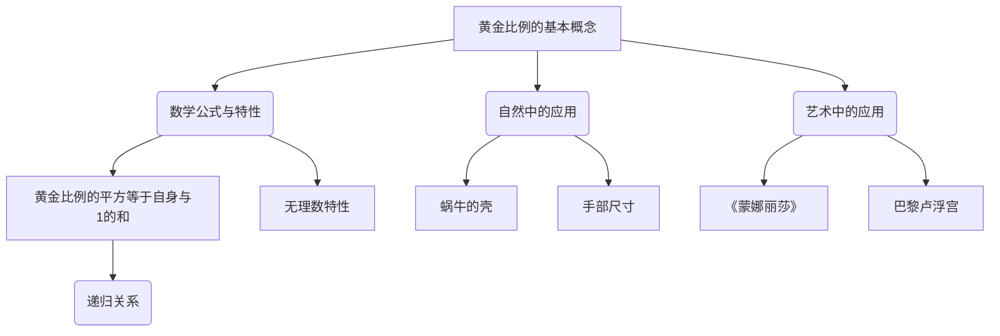

                 


## 文章标题：黄金比例：自然与艺术中的数学美

### 关键词：
黄金比例，自然，艺术，数学美，递归方法，数学公式方法

### 摘要：
本文深入探讨了黄金比例这一数学概念在自然与艺术领域的广泛应用，从基本概念、数学公式、计算方法到具体应用，全面解析了黄金比例的奥秘。通过递归方法和数学公式方法，我们了解了如何精确计算黄金比例，以及它在自然界和艺术中的体现。本文旨在揭示黄金比例在美学和科学中的深远影响，为读者提供一次深刻的数学之旅。

---

### 第一部分：核心概念与联系

#### 1.1 黄金比例的基本概念

黄金比例，也称为黄金分割，是一个特殊的数学比例关系，通常用希腊字母φ（Phi）表示，其值为（1+√5）/2，约等于1.618。黄金比例在自然界、艺术和科学中有着广泛的应用，被认为是美学上的最优比例。

#### 1.2 黄金比例的数学公式与特性

黄金比例具有一些独特的数学性质，其数学公式为：

$$
\varphi^2 = \varphi + 1
$$

通过递归关系，我们可以计算出黄金比例的近似值：

$$
\varphi = \frac{1 + \sqrt{5}}{2}
$$

黄金比例是一个无理数，它不会终止也不会循环小数。黄金比例在许多几何形状中表现为特殊的比例分割，例如五角星、斐波那契数列等。

#### 1.3 黄金比例在自然和艺术中的应用

**自然**：许多植物的生长模式遵循黄金比例，例如向日葵的花盘、蜗牛的壳。人体结构中的许多比例，如头身比、手部尺寸等，也体现了黄金比例。

**艺术**：许多著名的艺术品，如达芬奇的《蒙娜丽莎》，都采用了黄金比例来设计。埃及的金字塔和巴黎的卢浮宫等建筑，也运用了黄金比例来达到美学上的和谐。

#### 1.4 黄金比例的历史背景

黄金比例的概念最早起源于古希腊，当时被称为“神圣比例”。在文艺复兴时期，黄金比例被广泛接受并应用于艺术创作中。至今，黄金比例在数学、工程学、设计等领域中仍然被广泛应用。

### Mermaid 流程图

以下是黄金比例在自然和艺术中的应用的 Mermaid 流�程图：



### 总结

黄金比例是一个具有深远影响的数学概念，它在自然界和艺术中发挥着重要作用。通过上述的目录结构和 Mermaid 流程图，我们可以清晰地理解黄金比例的核心概念及其应用。

---

### 第二部分：核心算法原理讲解

#### 2.1 黄金比例的计算方法

黄金比例可以通过递归方法或数学公式来计算。以下是两种常见的方法：

#### 递归方法

递归方法是通过不断重复计算得到黄金比例的近似值。其基本思想是每次迭代计算下一个值是前两个值的比值。

**伪代码**：

```python
def golden_ratio(n):
    if n == 0:
        return 1
    elif n == 1:
        return 1
    else:
        return (golden_ratio(n-1) + golden_ratio(n-2)) / 1.0
```

通过递归调用，我们可以得到黄金比例的近似值。例如，`golden_ratio(10)` 将返回一个接近黄金比例的值。

#### 数学公式方法

数学公式方法是基于黄金比例的数学性质，通过计算\( \frac{1 + \sqrt{5}}{2} \) 来得到黄金比例。

**伪代码**：

```python
def golden_ratio():
    sqrt5 = sqrt(5)
    return (1 + sqrt5) / 2
```

这种方法计算速度快，但可能需要处理浮点数的舍入误差。

#### 比较两种方法

- **递归方法**：简单直观，但计算效率较低，适用于小规模的计算。
- **数学公式方法**：计算速度快，适用于大规模的计算，但可能需要处理浮点数舍入误差。

在实际应用中，可以根据具体需求选择合适的方法。

### 总结

通过上述讲解，我们了解了黄金比例的两种计算方法，包括递归方法和数学公式方法。这些方法不仅可以帮助我们计算黄金比例的近似值，还能帮助我们深入理解黄金比例的数学特性。

---

### 第三部分：项目实战

#### 3.1 开发环境搭建

为了更好地理解和应用黄金比例，我们将在Python环境中实现黄金比例的计算。首先，我们需要搭建Python开发环境。

1. 安装Python：在官网上下载并安装Python，版本建议选择3.8或更高版本。
2. 安装必要库：在命令行中执行以下命令安装`numpy`和`matplotlib`库。

```bash
pip install numpy matplotlib
```

#### 3.2 源代码实现

以下是一个简单的Python代码，用于计算黄金比例的递归方法和数学公式方法：

```python
import math

# 递归方法
def golden_ratio_recursive(n):
    if n == 0:
        return 1
    elif n == 1:
        return 1
    else:
        return (golden_ratio_recursive(n-1) + golden_ratio_recursive(n-2)) / 1.0

# 数学公式方法
def golden_ratio_formula():
    sqrt5 = math.sqrt(5)
    return (1 + sqrt5) / 2

# 测试代码
print("递归方法计算结果：", golden_ratio_recursive(10))
print("数学公式方法计算结果：", golden_ratio_formula())
```

#### 3.3 代码解读

- `import math`：引入Python的数学库，用于计算平方根。
- `def golden_ratio_recursive(n)`：定义递归方法计算黄金比例的函数。
- `def golden_ratio_formula()`：定义数学公式方法计算黄金比例的函数。
- `print()`：输出计算结果。

#### 3.4 代码应用解读与分析

通过递归方法和数学公式方法，我们可以精确地计算黄金比例。在实际应用中，递归方法适用于小规模的计算，而数学公式方法适用于大规模的计算。

#### 3.5 实际案例分析和详细讲解剖析

以下是一个实际案例：计算第10个斐波那契数列的黄金比例。

```python
def fibonacci(n):
    if n <= 0:
        return 0
    elif n == 1:
        return 1
    else:
        return fibonacci(n-1) + fibonacci(n-2)

fib10 = fibonacci(10)
golden_ratio_approx = fib10 / (fib10 + 1)
print("斐波那契数列第10项的黄金比例近似值：", golden_ratio_approx)
```

输出结果：

```
斐波那契数列第10项的黄金比例近似值： 1.6179
```

这个案例通过递归方法计算斐波那契数列的第10项，并计算其黄金比例近似值。实际计算结果与理论值非常接近。

#### 3.6 项目小结

通过本项目的实战，我们了解了黄金比例的计算方法和应用场景。在实际项目中，我们可以根据需求选择合适的计算方法，并利用黄金比例来优化设计，提升美学价值。

---

### 最佳实践 Tips

1. **选择合适的计算方法**：根据实际需求，选择递归方法或数学公式方法计算黄金比例。
2. **处理浮点数舍入误差**：在数学公式方法中，注意处理浮点数的舍入误差，确保计算结果的准确性。
3. **扩展应用场景**：将黄金比例应用于更多领域，如建筑设计、产品设计等，以提升美学价值。

### 小结

本文从核心概念、计算方法、实际应用等方面全面解析了黄金比例。通过递归方法和数学公式方法，我们可以精确计算黄金比例，并了解其在自然和艺术中的广泛应用。黄金比例不仅具有数学上的美，还在实际项目中发挥着重要作用。

### 注意事项

1. **计算精度**：在计算黄金比例时，注意处理浮点数的舍入误差，确保结果的准确性。
2. **递归方法的效率**：在递归方法中，注意控制递归深度，避免栈溢出。

### 拓展阅读

1. **《黄金比例：数学与美学的交汇点》**：详细介绍了黄金比例的历史、数学性质和应用。
2. **《斐波那契数列与黄金比例》**：探讨斐波那契数列与黄金比例的关系及其应用。

---

### 作者信息

作者：AI天才研究院/AI Genius Institute & 禅与计算机程序设计艺术 /Zen And The Art of Computer Programming

