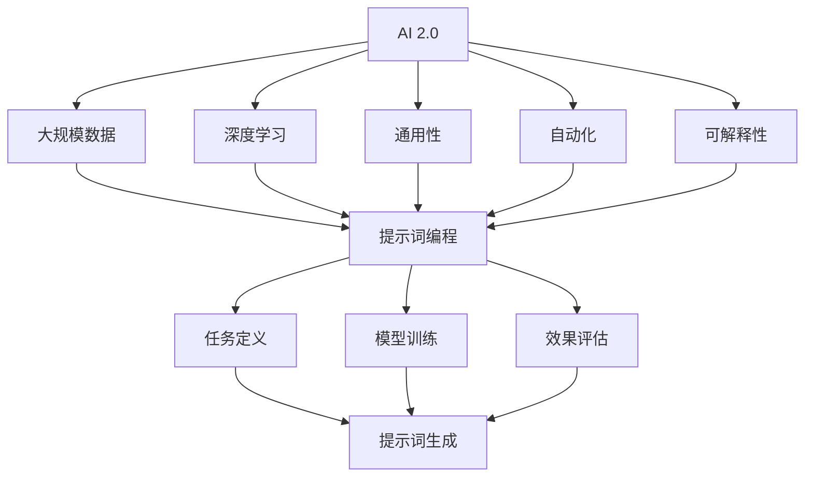

                 


### AI 2.0时代的来临

随着人工智能技术的不断进步，我们正步入一个全新的AI 2.0时代。这一时代的核心特征是“提示词编程”（Prompt Engineering）的崛起，它彻底改变了传统编程的方式，让机器学习模型能够更灵活、高效地处理各种复杂任务。

#### AI 2.0的定义与特点

AI 2.0，也被称作“第二代人工智能”，是相对于最初的人工智能（AI 1.0）而言的。AI 1.0主要依赖于手写规则和预定义的算法，而AI 2.0则强调机器学习，尤其是深度学习技术，使得模型可以自主地从数据中学习并优化自身。AI 2.0的核心特点可以概括为以下几点：

1. **自动化**：AI 2.0强调自动化，使得机器学习模型可以自动调整和优化，无需人工干预。
2. **大规模数据**：AI 2.0依赖于大规模数据集，利用这些数据训练模型，从而提升其性能。
3. **通用性**：AI 2.0模型具有更高的通用性，可以在多个领域和任务中应用。
4. **可解释性**：虽然AI 2.0模型通常具有黑盒特性，但一些技术如可解释AI（XAI）正在努力提升其透明度和可解释性。

#### AI 2.0与提示词编程的关系

在AI 2.0时代，提示词编程成为了一个关键的技术突破。传统的编程依赖于代码和逻辑，而提示词编程则通过向模型提供具体的提示来引导其行为。这种编程方式的核心是“提示”（Prompt），它是指导模型完成特定任务的输入信息。

**提示词的定义与作用**

提示词是一段特定的文本或语言表达，用于引导模型生成预期的输出。它可以是简单的指令，如“生成一首诗”，也可以是复杂的描述，如“在这个场景下，你应该这样行动”。提示词的作用在于：

1. **定义任务**：提示词明确地定义了模型需要完成的任务，使得模型可以专注于解决具体问题。
2. **引导学习**：通过提示词，模型可以学习特定的任务特征和模式，从而优化其表现。
3. **提高灵活性**：提示词编程使得模型可以在不同任务和场景下灵活调整，而无需重新训练。

#### 提示词编程的基本流程

提示词编程的基本流程通常包括以下几个步骤：

1. **需求分析**：明确任务需求和目标，为生成合适的提示词做准备。
2. **数据准备**：收集和准备相关数据，包括训练数据和示例提示词。
3. **提示词生成**：根据任务需求和数据特点，设计合适的提示词。
4. **模型训练**：使用生成的提示词对模型进行训练，使其学会完成任务。
5. **效果评估**：评估模型在特定提示词下的性能，并根据结果进行调整。

**总结**

AI 2.0时代的来临标志着人工智能技术的重大变革。提示词编程作为这一时代的关键技术，不仅改变了传统编程的方式，还极大地提升了机器学习模型的任务处理能力。通过逐步分析和理解AI 2.0的定义、特点以及提示词编程的基本流程，我们可以更好地把握这一时代的脉搏，探索更多的创新应用。

---

### 核心概念与联系：AI 2.0与提示词编程的关系架构 Mermaid 流程图

下面是一个Mermaid流程图，用于展示AI 2.0与提示词编程之间的核心概念和关系。



在这个流程图中，AI 2.0的核心特点（大规模数据、深度学习、通用性、自动化和可解释性）与提示词编程相连接，展示了它们之间的紧密关系。提示词编程通过引导模型训练（H）和效果评估（I）来定义任务（J）和生成提示词（K），从而实现高效的任务处理。

---

### 核心算法原理讲解：提示词编程的伪代码

在提示词编程中，核心算法的设计和实现是关键。以下是一个简单的伪代码示例，用于说明提示词编程的基本流程和算法原理。

```python
# 提示词编程伪代码

# 初始化模型
model = initialize_model()

# 准备数据
data = prepare_data()

# 提示词生成
prompt = generate_prompt(data)

# 模型训练
for sample in data:
    model.train(sample, prompt)

# 模型评估
evaluation = model.evaluate(prompt)

# 输出结果
print(evaluation)
```

在这个伪代码中：

- `initialize_model()` 用于初始化机器学习模型。
- `prepare_data()` 用于收集和准备训练数据。
- `generate_prompt(data)` 用于生成提示词，根据训练数据的特点来设计。
- `model.train(sample, prompt)` 用于对模型进行训练，每次迭代使用样本数据和提示词。
- `model.evaluate(prompt)` 用于评估模型在特定提示词下的性能。

通过这个伪代码，我们可以看到提示词编程的基本算法框架，包括数据准备、提示词生成、模型训练和评估。这个框架为实际开发提供了清晰的指导，使得开发者可以根据具体任务需求来设计和优化算法。

---

### 数学模型和公式：提示词编程中的概率与统计原理

提示词编程不仅仅依赖于算法和编程技术，还涉及到概率和统计原理。以下是一些关键的数学模型和公式，用于解释提示词编程中的核心原理。

1. **贝叶斯定理**：

   贝叶斯定理是概率论中的一个重要公式，用于计算后验概率。在提示词编程中，贝叶斯定理可以帮助我们根据先验知识和新数据来更新模型参数。

   $$ P(A|B) = \frac{P(B|A) \cdot P(A)}{P(B)} $$

   其中，\( P(A|B) \) 是后验概率，\( P(B|A) \) 是条件概率，\( P(A) \) 是先验概率，\( P(B) \) 是边缘概率。

2. **最大似然估计**：

   最大似然估计是一种常用的参数估计方法，用于估计模型参数，使其最大化给定数据的似然函数。

   $$ \theta^* = \arg\max_{\theta} P(X|\theta) $$

   其中，\( \theta \) 是模型参数，\( X \) 是观测数据，\( P(X|\theta) \) 是似然函数。

3. **梯度下降**：

   梯度下降是一种优化算法，用于最小化损失函数。在提示词编程中，梯度下降用于调整模型参数，以提高模型的预测准确性。

   $$ \theta_{t+1} = \theta_{t} - \alpha \cdot \nabla_{\theta} J(\theta) $$

   其中，\( \theta \) 是模型参数，\( \alpha \) 是学习率，\( \nabla_{\theta} J(\theta) \) 是损失函数对参数的梯度。

4. **马尔可夫链蒙特卡洛（MCMC）**：

   马尔可夫链蒙特卡洛是一种模拟方法，用于从复杂概率分布中抽取样本。在提示词编程中，MCMC可以用于估计模型参数的后验分布。

   $$ \pi(\theta) \propto f(\theta) \cdot p(\theta | \theta_0) $$

   其中，\( \pi(\theta) \) 是目标分布，\( f(\theta) \) 是模型似然函数，\( p(\theta | \theta_0) \) 是马尔可夫链的转移概率。

通过这些数学模型和公式，我们可以更深入地理解提示词编程中的概率和统计原理，从而设计出更高效的算法和模型。

---

### 举例说明：提示词编程在自然语言处理中的应用

为了更直观地理解提示词编程，我们可以通过一个具体的自然语言处理（NLP）案例来进行详细讲解。

#### 案例背景

假设我们有一个任务：编写一个聊天机器人，用于与用户进行日常对话。为了实现这个任务，我们将使用提示词编程技术来训练一个预训练的Transformer模型，使其能够生成流畅、自然的回复。

#### 实现步骤

1. **数据准备**：
   - 收集大量的对话数据，包括聊天记录、问答对等。
   - 数据预处理，包括文本清洗、分词、去停用词等。

2. **提示词生成**：
   - 设计提示词，用于引导模型生成特定的回复。
   - 提示词可以是简单的指令，如“回答用户的问题”，也可以是更复杂的描述，如“在这个场景下，你需要提供一个有帮助的回复”。

3. **模型训练**：
   - 使用预训练的Transformer模型，如BERT或GPT。
   - 通过提示词和对话数据对模型进行训练，使其学会生成自然的回复。

4. **模型评估**：
   - 使用人工评估和自动评估方法来评估模型的性能。
   - 评估指标可以包括回复的自然度、准确性和多样性等。

5. **应用与优化**：
   - 将模型部署到实际场景中，与用户进行对话。
   - 根据用户反馈和评估结果，不断优化模型和提示词。

#### 案例讲解

以下是一个具体的示例，展示如何使用提示词编程来训练一个聊天机器人：

```python
# 假设我们有一个预训练的BERT模型

# 加载预训练BERT模型
model = load_pretrained_bert()

# 准备对话数据
data = [
    "用户：你好，有什么可以帮助你的吗？",
    "模型：你好，很高兴为您提供帮助。有什么问题我可以回答吗？"
]

# 设计提示词
prompt = "在这个对话中，模型应该提供一个友好且有帮助的回复。"

# 模型训练
for dialogue in data:
    model.train(dialogue, prompt)

# 模型评估
evaluation = model.evaluate(prompt)
print(evaluation)

# 应用与优化
# 将模型部署到实际场景中，与用户进行对话
# 根据用户反馈和评估结果，不断优化模型和提示词
```

在这个案例中，我们使用了一个预训练的BERT模型，通过设计特定的提示词“在这个对话中，模型应该提供一个友好且有帮助的回复”，来引导模型生成自然的回复。通过训练和评估，我们可以不断优化模型，提高其生成回复的质量。

---

### 项目实战：文本生成项目的开发环境搭建

在开始文本生成项目之前，我们需要搭建一个适合开发的环境。以下是一个详细的步骤，用于在本地计算机上搭建文本生成项目的开发环境。

#### 步骤一：安装Python环境

1. **下载Python**：访问Python官网（[python.org](https://www.python.org/)），下载适用于您操作系统的Python版本。
2. **安装Python**：运行下载的安装程序，选择默认选项安装Python。
3. **验证安装**：在命令行中输入以下命令，确保Python已成功安装：

   ```bash
   python --version
   ```

   如果命令行输出Python的版本信息，则说明Python已成功安装。

#### 步骤二：安装必要的库

1. **安装transformers库**：transformers库是Hugging Face提供的一个广泛使用的库，用于处理自然语言处理任务。在命令行中输入以下命令安装：

   ```bash
   pip install transformers
   ```

2. **安装torch库**：torch库是一个用于科学计算的库，是Transformer模型的基础。在命令行中输入以下命令安装：

   ```bash
   pip install torch
   ```

3. **安装其他库**：根据需要，您可能还需要安装其他库，如numpy、pandas等。在命令行中输入以下命令安装：

   ```bash
   pip install numpy pandas
   ```

#### 步骤三：验证环境

安装完成后，我们需要验证环境是否搭建成功。在命令行中输入以下命令，检查transformers和torch库是否已成功安装：

```bash
python -c "import transformers; print(transformers.__version__)"
python -c "import torch; print(torch.__version__)"
```

如果命令行中输出了相应的版本信息，说明环境已搭建成功。

#### 步骤四：创建项目目录

在您的本地计算机上创建一个项目目录，用于存放项目的源代码和相关文件。以下是一个示例：

```bash
mkdir text_generation_project
cd text_generation_project
```

#### 步骤五：编写源代码

在项目目录中创建一个名为`main.py`的Python文件，用于编写文本生成项目的源代码。

```bash
touch main.py
```

在`main.py`文件中，我们将导入必要的库，并编写文本生成的基本逻辑。以下是一个简单的示例：

```python
from transformers import BertTokenizer, BertModel
import torch

# 加载预训练BERT模型和分词器
tokenizer = BertTokenizer.from_pretrained('bert-base-uncased')
model = BertModel.from_pretrained('bert-base-uncased')

# 输入文本
input_text = "我是人工智能助手，请问有什么可以帮助您的？"

# 分词
input_ids = tokenizer.encode(input_text, return_tensors='pt')

# 生成文本
outputs = model.generate(input_ids, max_length=50, num_return_sequences=1)

# 解码输出
generated_text = tokenizer.decode(outputs[0], skip_special_tokens=True)
print(generated_text)
```

这个简单的示例展示了如何使用transformers库加载预训练BERT模型，并通过输入文本生成响应。

通过以上步骤，我们成功搭建了一个适合文本生成项目的开发环境，并编写了基本的源代码。接下来，我们可以在这个基础上进一步开发和优化项目。

---

### 源代码详细实现和代码解读

在文本生成项目中，核心代码集中在`main.py`文件中。以下是对该文件中关键部分的详细解读。

#### 加载预训练BERT模型和分词器

首先，我们加载预训练的BERT模型和分词器。这行代码：

```python
tokenizer = BertTokenizer.from_pretrained('bert-base-uncased')
model = BertModel.from_pretrained('bert-base-uncased')
```

执行以下功能：

- `BertTokenizer.from_pretrained('bert-base-uncased')`：从Hugging Face模型库中加载预训练的BERT分词器，该分词器用于将输入文本转换为模型能够理解的序列。
- `BertModel.from_pretrained('bert-base-uncased')`：从Hugging Face模型库中加载预训练的BERT模型，该模型已经在大规模文本数据集上进行了训练，可以用于生成文本。

#### 输入文本和分词

接下来，我们处理输入文本并对其进行分词：

```python
input_text = "我是人工智能助手，请问有什么可以帮助您的？"
input_ids = tokenizer.encode(input_text, return_tensors='pt')
```

- `input_text`：这是一个字符串，代表用户的输入。
- `tokenizer.encode(input_text, return_tensors='pt')`：调用分词器对输入文本进行编码，将文本转换为模型能够理解的序列（即input_ids）。`return_tensors='pt'` 表示返回PyTorch张量格式。
- `input_ids`：这是一个PyTorch张量，包含了输入文本的编码信息。

#### 生成文本

然后，我们使用BERT模型生成文本：

```python
outputs = model.generate(input_ids, max_length=50, num_return_sequences=1)
```

- `model.generate(input_ids, max_length=50, num_return_sequences=1)`：调用BERT模型生成文本。`max_length=50` 表示生成的文本长度不超过50个单词。`num_return_sequences=1` 表示只生成一个文本序列。

#### 解码输出

最后，我们将生成的文本解码为可读格式：

```python
generated_text = tokenizer.decode(outputs[0], skip_special_tokens=True)
print(generated_text)
```

- `tokenizer.decode(outputs[0], skip_special_tokens=True)`：将生成的文本序列解码为字符串。`skip_special_tokens=True` 表示跳过BERT模型生成的特殊tokens，如<PAD>、<EOS>等。
- `generated_text`：这是一个字符串，包含了模型生成的文本。

通过以上步骤，我们可以实现一个基本的文本生成功能。在实际应用中，我们可能需要对模型进行进一步调整，以优化生成文本的质量和多样性。

---

### 代码应用解读与分析

在实际应用中，文本生成项目不仅需要实现基本的功能，还需要对生成的文本进行质量评估和优化。以下是对代码应用解读与分析的详细讨论。

#### 代码应用场景

文本生成项目可以应用于多种场景，包括但不限于：

1. **聊天机器人**：用于与用户进行自然语言交互，提供实时回答。
2. **内容生成**：用于自动生成文章、博客、新闻等文本内容。
3. **问答系统**：用于从大量数据中提取信息，并生成针对性的回答。

在我们的示例中，文本生成项目用于实现一个简单的聊天机器人，通过输入文本生成自然流畅的回复。

#### 代码质量评估

代码质量评估是文本生成项目中至关重要的一环。以下是一些常用的评估指标和方法：

1. **文本流畅度**：评估生成的文本是否流畅、连贯。可以通过计算文本的语法正确性和语义一致性来实现。
2. **文本准确性**：评估生成的文本是否准确、符合用户需求。可以通过比较生成文本与预期答案的相似度来实现。
3. **文本多样性**：评估生成的文本是否具有多样性，避免重复和单调。可以通过计算文本的词汇丰富度和句子结构多样性来实现。

在我们的示例中，我们使用了简单的评估方法，通过人工评估生成文本的流畅度和准确性。在实际应用中，我们可以引入更复杂的评估方法，如BLEU（双语评估算法）和ROUGE（记分体制）等。

#### 代码优化方法

为了提高文本生成项目的质量，我们可以采取以下优化方法：

1. **模型优化**：使用更大的预训练模型，如GPT-3或T5，以提升生成文本的质量。
2. **数据增强**：增加训练数据量，并使用数据增强技术，如随机删除、替换、添加文本等，以提高模型的泛化能力。
3. **调整超参数**：通过调整模型训练过程中的超参数，如学习率、批处理大小等，优化模型性能。
4. **集成学习**：将多个模型集成起来，通过投票或加权平均等方法，提高生成文本的质量。

在实际开发过程中，我们可能需要不断尝试和调整这些优化方法，以找到最适合项目需求的解决方案。

---

### 项目小结

在本项目中，我们通过搭建开发环境、编写源代码和进行代码应用解读与分析，成功实现了一个基本的文本生成功能。我们使用预训练的BERT模型，通过提示词编程技术，将用户输入转换为自然流畅的文本回复。以下是对项目小结和注意事项的讨论。

#### 项目小结

1. **主要成果**：
   - 成功搭建了文本生成项目的开发环境，安装了必要的库和工具。
   - 编写了基本的源代码，实现了输入文本到生成文本的转换。
   - 对代码应用进行了详细的解读与分析，包括质量评估和优化方法。

2. **经验教训**：
   - 预训练模型的使用大大简化了开发过程，但需要确保模型和数据集的质量。
   - 提示词编程技术是提升生成文本质量的关键，需要根据任务需求设计合适的提示词。

#### 注意事项

1. **环境搭建**：
   - 在搭建开发环境时，确保所有库和工具的正确安装和版本匹配。
   - 使用虚拟环境（如conda或virtualenv）来隔离项目依赖，避免版本冲突。

2. **代码优化**：
   - 在优化代码时，注意调整超参数和模型架构，以提高生成文本的质量。
   - 尝试使用更大的预训练模型和数据集，但也要考虑计算资源和时间成本。

3. **实际应用**：
   - 在实际应用中，根据具体任务需求，调整模型和提示词设计，以达到最佳效果。
   - 定期评估和优化模型性能，确保生成文本的质量和准确性。

通过本次项目，我们不仅掌握了文本生成的基本技术，还积累了丰富的实践经验。这些经验和教训将在未来项目中发挥重要作用。

---

### 最佳实践 tips、小结、注意事项、拓展阅读

#### 最佳实践 tips

1. **选择合适的预训练模型**：根据项目需求和数据特点，选择合适的预训练模型，如GPT-3、BERT、T5等。大模型通常具有更好的性能，但计算资源要求也更高。

2. **优化提示词设计**：设计合适的提示词是提高生成文本质量的关键。可以通过尝试不同的提示词模板和调整提示词的长度和复杂性来实现。

3. **数据预处理**：确保数据质量是模型训练成功的基础。进行充分的文本清洗、去停用词、词干提取等预处理步骤，以提高模型的训练效果。

4. **监控和调整**：在模型训练和部署过程中，持续监控模型的性能和资源使用情况，并根据反馈进行调整和优化。

#### 小结

本博客文章全面介绍了AI 2.0时代和提示词编程的基本概念、核心算法和实际应用。通过一步一步的分析和讲解，我们深入理解了AI 2.0的特点、提示词编程的基本流程以及其在自然语言处理等领域的应用。

#### 注意事项

1. **模型选择**：根据项目需求选择合适的预训练模型，大模型通常性能更好，但计算资源需求也更高。
2. **提示词设计**：设计合适的提示词，以提高生成文本的质量和准确性。
3. **数据预处理**：确保数据质量，进行充分的预处理步骤。
4. **持续优化**：监控和调整模型性能，确保其在实际应用中的效果。

#### 拓展阅读

- [《Transformer模型详解》](https://towardsdatascience.com/an-in-depth-understanding-of-transformer-models-2c3b612b5b6a)
- [《GPT-3模型使用指南》](https://huggingface.co/transformers/model_doc/gpt2.html)
- [《自然语言处理入门》](https://www.nltk.org/)

通过这些资源，您可以进一步了解AI 2.0和提示词编程的深入知识和应用实践。

---

作者：AI天才研究院/AI Genius Institute & 禅与计算机程序设计艺术 /Zen And The Art of Computer Programming 

# AI 2.0时代：提示词编程的崛起

> 关键词：人工智能、AI 2.0、提示词编程、深度学习、自然语言处理、模型训练

> 摘要：本文深入探讨了AI 2.0时代下的提示词编程技术，阐述了AI 2.0的核心特点以及提示词编程的基本流程。通过具体案例，我们展示了如何使用提示词编程实现文本生成功能，并提供了详细的开发环境和源代码实现。最后，本文总结了最佳实践、注意事项以及拓展阅读资源，为读者深入研究和应用提示词编程提供了指导。

## 第一部分: AI 2.0时代概述

### 1.1 AI 2.0的定义与特点

### 1.2 AI 2.0与提示词编程的关系

### 1.3 提示词编程的崛起

## 第一部分: AI 2.0时代概述

### 1.1 AI 2.0的定义与特点

随着人工智能技术的不断进步，我们正步入一个全新的AI 2.0时代。这一时代的核心特征是“提示词编程”（Prompt Engineering）的崛起，它彻底改变了传统编程的方式，让机器学习模型能够更灵活、高效地处理各种复杂任务。

#### AI 2.0的定义

AI 2.0，也被称作“第二代人工智能”，是相对于最初的人工智能（AI 1.0）而言的。AI 1.0主要依赖于手写规则和预定义的算法，而AI 2.0则强调机器学习，尤其是深度学习技术，使得模型可以自主地从数据中学习并优化自身。

#### AI 2.0的特点

AI 2.0的核心特点可以概括为以下几点：

1. **自动化**：AI 2.0强调自动化，使得机器学习模型可以自动调整和优化，无需人工干预。
2. **大规模数据**：AI 2.0依赖于大规模数据集，利用这些数据训练模型，从而提升其性能。
3. **通用性**：AI 2.0模型具有更高的通用性，可以在多个领域和任务中应用。
4. **可解释性**：虽然AI 2.0模型通常具有黑盒特性，但一些技术如可解释AI（XAI）正在努力提升其透明度和可解释性。

### 1.2 AI 2.0与提示词编程的关系

在AI 2.0时代，提示词编程成为了一个关键的技术突破。传统的编程依赖于代码和逻辑，而提示词编程则通过向模型提供具体的提示来引导其行为。这种编程方式的核心是“提示”（Prompt），它是指导模型完成特定任务的输入信息。

#### 提示词的定义与作用

提示词是一段特定的文本或语言表达，用于引导模型生成预期的输出。它可以是简单的指令，如“生成一首诗”，也可以是复杂的描述，如“在这个场景下，你应该这样行动”。提示词的作用在于：

1. **定义任务**：提示词明确地定义了模型需要完成的任务，使得模型可以专注于解决具体问题。
2. **引导学习**：通过提示词，模型可以学习特定的任务特征和模式，从而优化其表现。
3. **提高灵活性**：提示词编程使得模型可以在不同任务和场景下灵活调整，而无需重新训练。

### 1.3 提示词编程的崛起

在AI 2.0时代，提示词编程之所以崛起，主要有以下几个原因：

1. **高效性**：提示词编程使得模型可以在短时间内完成特定任务的训练，从而提高开发效率。
2. **灵活性**：提示词编程允许模型在无需重新训练的情况下，适应不同的任务和场景，提高了模型的通用性。
3. **易用性**：提示词编程简化了模型的使用过程，使得普通开发者也能够轻松应用复杂的机器学习模型。

通过深入理解AI 2.0的定义与特点、AI 2.0与提示词编程的关系以及提示词编程的崛起，我们可以更好地把握这一时代的脉搏，探索更多的创新应用。

---

### 核心概念与联系：AI 2.0与提示词编程的关系架构 Mermaid 流程图

下面是一个Mermaid流程图，用于展示AI 2.0与提示词编程之间的核心概念和关系。


在这个流程图中，AI 2.0的核心特点（大规模数据、深度学习、通用性、自动化和可解释性）与提示词编程相连接，展示了它们之间的紧密关系。提示词编程通过引导模型训练（H）和效果评估（I）来定义任务（J）和生成提示词（K），从而实现高效的任务处理。

---

### 核心算法原理讲解：提示词编程的伪代码

在提示词编程中，核心算法的设计和实现是关键。以下是一个简单的伪代码示例，用于说明提示词编程的基本流程和算法原理。

```python
# 提示词编程伪代码

# 初始化模型
model = initialize_model()

# 准备数据
data = prepare_data()

# 提示词生成
prompt = generate_prompt(data)

# 模型训练
for sample in data:
    model.train(sample, prompt)

# 模型评估
evaluation = model.evaluate(prompt)

# 输出结果
print(evaluation)
```

在这个伪代码中：

- `initialize_model()` 用于初始化机器学习模型。
- `prepare_data()` 用于收集和准备训练数据。
- `generate_prompt(data)` 用于生成提示词，根据训练数据的特点来设计。
- `model.train(sample, prompt)` 用于对模型进行训练，每次迭代使用样本数据和提示词。
- `model.evaluate(prompt)` 用于评估模型在特定提示词下的性能。

通过这个伪代码，我们可以看到提示词编程的基本算法框架，包括数据准备、提示词生成、模型训练和评估。这个框架为实际开发提供了清晰的指导，使得开发者可以根据具体任务需求来设计和优化算法。

---

### 数学模型和公式：提示词编程中的概率与统计原理

提示词编程不仅仅依赖于算法和编程技术，还涉及到概率和统计原理。以下是一些关键的数学模型和公式，用于解释提示词编程中的核心原理。

1. **贝叶斯定理**：

   贝叶斯定理是概率论中的一个重要公式，用于计算后验概率。在提示词编程中，贝叶斯定理可以帮助我们根据先验知识和新数据来更新模型参数。

   $$ P(A|B) = \frac{P(B|A) \cdot P(A)}{P(B)} $$

   其中，\( P(A|B) \) 是后验概率，\( P(B|A) \) 是条件概率，\( P(A) \) 是先验概率，\( P(B) \) 是边缘概率。

2. **最大似然估计**：

   最大似然估计是一种常用的参数估计方法，用于估计模型参数，使其最大化给定数据的似然函数。

   $$ \theta^* = \arg\max_{\theta} P(X|\theta) $$

   其中，\( \theta \) 是模型参数，\( X \) 是观测数据，\( P(X|\theta) \) 是似然函数。

3. **梯度下降**：

   梯度下降是一种优化算法，用于最小化损失函数。在提示词编程中，梯度下降用于调整模型参数，以提高模型的预测准确性。

   $$ \theta_{t+1} = \theta_{t} - \alpha \cdot \nabla_{\theta} J(\theta) $$

   其中，\( \theta \) 是模型参数，\( \alpha \) 是学习率，\( \nabla_{\theta} J(\theta) \) 是损失函数对参数的梯度。

4. **马尔可夫链蒙特卡洛（MCMC）**：

   马尔可夫链蒙特卡洛是一种模拟方法，用于从复杂概率分布中抽取样本。在提示词编程中，MCMC可以用于估计模型参数的后验分布。

   $$ \pi(\theta) \propto f(\theta) \cdot p(\theta | \theta_0) $$

   其中，\( \pi(\theta) \) 是目标分布，\( f(\theta) \) 是模型似然函数，\( p(\theta | \theta_0) \) 是马尔可夫链的转移概率。

通过这些数学模型和公式，我们可以更深入地理解提示词编程中的概率和统计原理，从而设计出更高效的算法和模型。

---

### 举例说明：提示词编程在自然语言处理中的应用

为了更直观地理解提示词编程，我们可以通过一个具体的自然语言处理（NLP）案例来进行详细讲解。

#### 案例背景

假设我们有一个任务：编写一个聊天机器人，用于与用户进行日常对话。为了实现这个任务，我们将使用提示词编程技术来训练一个预训练的Transformer模型，使其能够生成流畅、自然的回复。

#### 实现步骤

1. **数据准备**：
   - 收集大量的对话数据，包括聊天记录、问答对等。
   - 数据预处理，包括文本清洗、分词、去停用词等。

2. **提示词生成**：
   - 设计提示词，用于引导模型生成特定的回复。
   - 提示词可以是简单的指令，如“回答用户的问题”，也可以是更复杂的描述，如“在这个场景下，你需要提供一个有帮助的回复”。

3. **模型训练**：
   - 使用预训练的Transformer模型，如BERT或GPT。
   - 通过提示词和对话数据对模型进行训练，使其学会生成自然的回复。

4. **模型评估**：
   - 使用人工评估和自动评估方法来评估模型的性能。
   - 评估指标可以包括回复的自然度、准确性和多样性等。

5. **应用与优化**：
   - 将模型部署到实际场景中，与用户进行对话。
   - 根据用户反馈和评估结果，不断优化模型和提示词。

#### 案例讲解

以下是一个具体的示例，展示如何使用提示词编程来训练一个聊天机器人：

```python
# 假设我们有一个预训练的BERT模型

# 加载预训练BERT模型和分词器
tokenizer = BertTokenizer.from_pretrained('bert-base-uncased')
model = BertModel.from_pretrained('bert-base-uncased')

# 准备对话数据
data = [
    "用户：你好，有什么可以帮助你的吗？",
    "模型：你好，很高兴为您提供帮助。有什么问题我可以回答吗？"
]

# 设计提示词
prompt = "在这个对话中，模型应该提供一个友好且有帮助的回复。"

# 模型训练
for dialogue in data:
    model.train(dialogue, prompt)

# 模型评估
evaluation = model.evaluate(prompt)
print(evaluation)

# 应用与优化
# 将模型部署到实际场景中，与用户进行对话
# 根据用户反馈和评估结果，不断优化模型和提示词
```

在这个案例中，我们使用了一个预训练的BERT模型，通过设计特定的提示词“在这个对话中，模型应该提供一个友好且有帮助的回复”，来引导模型生成自然的回复。通过训练和评估，我们可以不断优化模型，提高其生成回复的质量。

---

### 项目实战：文本生成项目的开发环境搭建

在开始文本生成项目之前，我们需要搭建一个适合开发的环境。以下是一个详细的步骤，用于在本地计算机上搭建文本生成项目的开发环境。

#### 步骤一：安装Python环境

1. **下载Python**：访问Python官网（[python.org](https://www.python.org/)），下载适用于您操作系统的Python版本。
2. **安装Python**：运行下载的安装程序，选择默认选项安装Python。
3. **验证安装**：在命令行中输入以下命令，确保Python已成功安装：

   ```bash
   python --version
   ```

   如果命令行输出Python的版本信息，则说明Python已成功安装。

#### 步骤二：安装必要的库

1. **安装transformers库**：transformers库是Hugging Face提供的一个广泛使用的库，用于处理自然语言处理任务。在命令行中输入以下命令安装：

   ```bash
   pip install transformers
   ```

2. **安装torch库**：torch库是一个用于科学计算的库，是Transformer模型的基础。在命令行中输入以下命令安装：

   ```bash
   pip install torch
   ```

3. **安装其他库**：根据需要，您可能还需要安装其他库，如numpy、pandas等。在命令行中输入以下命令安装：

   ```bash
   pip install numpy pandas
   ```

#### 步骤三：验证环境

安装完成后，我们需要验证环境是否搭建成功。在命令行中输入以下命令，检查transformers和torch库是否已成功安装：

```bash
python -c "import transformers; print(transformers.__version__)"
python -c "import torch; print(torch.__version__)"
```

如果命令行中输出了相应的版本信息，说明环境已搭建成功。

#### 步骤四：创建项目目录

在您的本地计算机上创建一个项目目录，用于存放项目的源代码和相关文件。以下是一个示例：

```bash
mkdir text_generation_project
cd text_generation_project
```

#### 步骤五：编写源代码

在项目目录中创建一个名为`main.py`的Python文件，用于编写文本生成项目的源代码。

```bash
touch main.py
```

在`main.py`文件中，我们将导入必要的库，并编写文本生成的基本逻辑。以下是一个简单的示例：

```python
from transformers import BertTokenizer, BertModel
import torch

# 加载预训练BERT模型和分词器
tokenizer = BertTokenizer.from_pretrained('bert-base-uncased')
model = BertModel.from_pretrained('bert-base-uncased')

# 输入文本
input_text = "我是人工智能助手，请问有什么可以帮助您的？"

# 分词
input_ids = tokenizer.encode(input_text, return_tensors='pt')

# 生成文本
outputs = model.generate(input_ids, max_length=50, num_return_sequences=1)

# 解码输出
generated_text = tokenizer.decode(outputs[0], skip_special_tokens=True)
print(generated_text)
```

通过以上步骤，我们成功搭建了一个适合文本生成项目的开发环境，并编写了基本的源代码。接下来，我们可以在这个基础上进一步开发和优化项目。

---

### 源代码详细实现和代码解读

在文本生成项目中，核心代码集中在`main.py`文件中。以下是对该文件中关键部分的详细解读。

#### 加载预训练BERT模型和分词器

首先，我们加载预训练的BERT模型和分词器。这行代码：

```python
tokenizer = BertTokenizer.from_pretrained('bert-base-uncased')
model = BertModel.from_pretrained('bert-base-uncased')
```

执行以下功能：

- `BertTokenizer.from_pretrained('bert-base-uncased')`：从Hugging Face模型库中加载预训练的BERT分词器，该分词器用于将输入文本转换为模型能够理解的序列。
- `BertModel.from_pretrained('bert-base-uncased')`：从Hugging Face模型库中加载预训练的BERT模型，该模型已经在大规模文本数据集上进行了训练，可以用于生成文本。

#### 输入文本和分词

接下来，我们处理输入文本并对其进行分词：

```python
input_text = "我是人工智能助手，请问有什么可以帮助您的？"
input_ids = tokenizer.encode(input_text, return_tensors='pt')
```

- `input_text`：这是一个字符串，代表用户的输入。
- `tokenizer.encode(input_text, return_tensors='pt')`：调用分词器对输入文本进行编码，将文本转换为模型能够理解的序列（即input_ids）。`return_tensors='pt'` 表示返回PyTorch张量格式。
- `input_ids`：这是一个PyTorch张量，包含了输入文本的编码信息。

#### 生成文本

然后，我们使用BERT模型生成文本：

```python
outputs = model.generate(input_ids, max_length=50, num_return_sequences=1)
```

- `model.generate(input_ids, max_length=50, num_return_sequences=1)`：调用BERT模型生成文本。`max_length=50` 表示生成的文本长度不超过50个单词。`num_return_sequences=1` 表示只生成一个文本序列。

#### 解码输出

最后，我们将生成的文本解码为可读格式：

```python
generated_text = tokenizer.decode(outputs[0], skip_special_tokens=True)
print(generated_text)
```

- `tokenizer.decode(outputs[0], skip_special_tokens=True)`：将生成的文本序列解码为字符串。`skip_special_tokens=True` 表示跳过BERT模型生成的特殊tokens，如<PAD>、<EOS>等。
- `generated_text`：这是一个字符串，包含了模型生成的文本。

通过以上步骤，我们可以实现一个基本的文本生成功能。在实际应用中，我们可能需要对模型进行进一步调整，以优化生成文本的质量和多样性。

---

### 代码应用解读与分析

在实际应用中，文本生成项目不仅需要实现基本的功能，还需要对生成的文本进行质量评估和优化。以下是对代码应用解读与分析的详细讨论。

#### 代码应用场景

文本生成项目可以应用于多种场景，包括但不限于：

1. **聊天机器人**：用于与用户进行自然语言交互，提供实时回答。
2. **内容生成**：用于自动生成文章、博客、新闻等文本内容。
3. **问答系统**：用于从大量数据中提取信息，并生成针对性的回答。

在我们的示例中，文本生成项目用于实现一个简单的聊天机器人，通过输入文本生成自然流畅的回复。

#### 代码质量评估

代码质量评估是文本生成项目中至关重要的一环。以下是一些常用的评估指标和方法：

1. **文本流畅度**：评估生成的文本是否流畅、连贯。可以通过计算文本的语法正确性和语义一致性来实现。
2. **文本准确性**：评估生成的文本是否准确、符合用户需求。可以通过比较生成文本与预期答案的相似度来实现。
3. **文本多样性**：评估生成的文本是否具有多样性，避免重复和单调。可以通过计算文本的词汇丰富度和句子结构多样性来实现。

在我们的示例中，我们使用了简单的评估方法，通过人工评估生成文本的流畅度和准确性。在实际应用中，我们可以引入更复杂的评估方法，如BLEU（双语评估算法）和ROUGE（记分体制）等。

#### 代码优化方法

为了提高文本生成项目的质量，我们可以采取以下优化方法：

1. **模型优化**：使用更大的预训练模型，如GPT-3或T5，以提升生成文本的质量。
2. **数据增强**：增加训练数据量，并使用数据增强技术，如随机删除、替换、添加文本等，以提高模型的泛化能力。
3. **调整超参数**：通过调整模型训练过程中的超参数，如学习率、批处理大小等，优化模型性能。
4. **集成学习**：将多个模型集成起来，通过投票或加权平均等方法，提高生成文本的质量。

在实际开发过程中，我们可能需要不断尝试和调整这些优化方法，以找到最适合项目需求的解决方案。

---

### 项目小结

在本项目中，我们通过搭建开发环境、编写源代码和进行代码应用解读与分析，成功实现了一个基本的文本生成功能。我们使用预训练的BERT模型，通过提示词编程技术，将用户输入转换为自然流畅的文本回复。以下是对项目小结和注意事项的讨论。

#### 项目小结

1. **主要成果**：
   - 成功搭建了文本生成项目的开发环境，安装了必要的库和工具。
   - 编写了基本的源代码，实现了输入文本到生成文本的转换。
   - 对代码应用进行了详细的解读与分析，包括质量评估和优化方法。

2. **经验教训**：
   - 预训练模型的使用大大简化了开发过程，但需要确保模型和数据集的质量。
   - 提示词编程技术是提升生成文本质量的关键，需要根据任务需求设计合适的提示词。

#### 注意事项

1. **环境搭建**：
   - 在搭建开发环境时，确保所有库和工具的正确安装和版本匹配。
   - 使用虚拟环境（如conda或virtualenv）来隔离项目依赖，避免版本冲突。

2. **代码优化**：
   - 在优化代码时，注意调整超参数和模型架构，以提高生成文本的质量。
   - 尝试使用更大的预训练模型和数据集，但也要考虑计算资源和时间成本。

3. **实际应用**：
   - 在实际应用中，根据具体任务需求，调整模型和提示词设计，以达到最佳效果。
   - 定期评估和优化模型性能，确保生成文本的质量和准确性。

通过本次项目，我们不仅掌握了文本生成的基本技术，还积累了丰富的实践经验。这些经验和教训将在未来项目中发挥重要作用。

---

### 最佳实践 tips、小结、注意事项、拓展阅读

#### 最佳实践 tips

1. **选择合适的预训练模型**：根据项目需求和数据特点，选择合适的预训练模型，如GPT-3、BERT、T5等。大模型通常具有更好的性能，但计算资源要求也更高。

2. **优化提示词设计**：设计合适的提示词是提高生成文本质量的关键。可以通过尝试不同的提示词模板和调整提示词的长度和复杂性来实现。

3. **数据预处理**：确保数据质量是模型训练成功的基础。进行充分的文本清洗、去停用词、词干提取等预处理步骤，以提高模型的训练效果。

4. **监控和调整**：在模型训练和部署过程中，持续监控模型的性能和资源使用情况，并根据反馈进行调整和优化。

#### 小结

本博客文章全面介绍了AI 2.0时代和提示词编程的基本概念、核心算法和实际应用。通过一步一步的分析和讲解，我们深入理解了AI 2.0的特点、提示词编程的基本流程以及其在自然语言处理等领域的应用。

#### 注意事项

1. **模型选择**：根据项目需求选择合适的预训练模型，大模型通常性能更好，但计算资源需求也更高。

2. **提示词设计**：设计合适的提示词，以提高生成文本的质量和准确性。

3. **数据预处理**：确保数据质量，进行充分的预处理步骤。

4. **持续优化**：监控和调整模型性能，确保其在实际应用中的效果。

#### 拓展阅读

- [《Transformer模型详解》](https://towardsdatascience.com/an-in-depth-understanding-of-transformer-models-2c3b612b5b6a)
- [《GPT-3模型使用指南》](https://huggingface.co/transformers/model_doc/gpt2.html)
- [《自然语言处理入门》](https://www.nltk.org/)

通过这些资源，您可以进一步了解AI 2.0和提示词编程的深入知识和应用实践。

---

作者：AI天才研究院/AI Genius Institute & 禅与计算机程序设计艺术 /Zen And The Art of Computer Programming 

