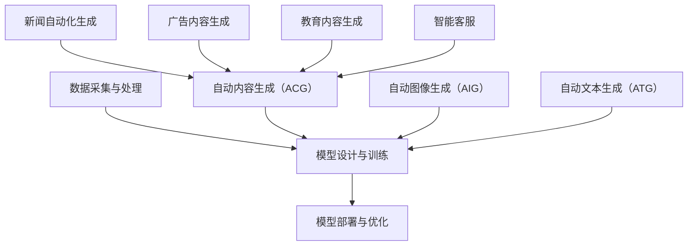

                 

### 文章标题: 《AIGC与传统媒体的融合：内容生产新范式》

关键词：AIGC、传统媒体、内容生产、技术融合、未来趋势

摘要：本文旨在探讨AIGC（AI Generated Content）与传统媒体融合的趋势、技术基础、应用场景、挑战与未来发展方向，揭示其在内容生产领域的变革潜力，为传统媒体行业提供转型思路。

### 引言

#### 1.1 AIGC概念与背景

##### 1.1.1 AIGC的定义与核心组件

AIGC，即AI Generated Content，是指通过人工智能技术自动生成内容的过程。它涵盖了文本、图像、音频等多种类型的媒体内容生成。AIGC的核心组件主要包括：

- **自动内容生成（ACG）**：利用自然语言处理（NLP）技术生成文本、文章、报告等。
- **自动图像生成（AIG）**：利用深度学习技术生成图像、视频等。
- **自动文本生成（ATG）**：利用机器学习技术生成文本、脚本等。

##### 1.1.2 AIGC的发展历程

AIGC技术的发展历程可以追溯到20世纪末，当时计算机科学家开始探索如何利用人工智能技术自动化生成内容。随着深度学习、自然语言处理等技术的快速发展，AIGC的应用场景和效果得到了显著提升。

- **早期阶段**：AIGC主要应用于简单的文本自动生成，如自动摘要、关键词提取等。
- **发展阶段**：随着技术的进步，AIGC逐渐应用于更复杂的场景，如新闻自动化生成、广告内容生成等。
- **当前阶段**：AIGC技术已逐渐成熟，广泛应用于各种媒体内容生成领域，成为传统媒体内容生产的重要补充。

##### 1.1.3 AIGC与传统媒体融合的意义

传统媒体在面临互联网、移动互联网等新兴媒体的冲击下，面临着内容生产效率低下、创新能力不足等问题。而AIGC技术的出现，为传统媒体提供了新的发展机遇：

- **提高内容生产效率**：AIGC技术能够自动生成大量高质量的内容，显著提高内容生产效率。
- **增强创新能力**：AIGC技术为传统媒体提供了更多样化的内容创作方式，激发创新潜能。
- **降低生产成本**：通过自动化生产，降低内容生产的成本，提高盈利能力。

##### 1.1.4 本书结构安排

本文将分为八个章节进行详细探讨：

- **第1章 引言**：介绍AIGC的概念、背景及其与传统媒体融合的意义。
- **第2章 AIGC技术基础**：分析AIGC的核心概念、技术架构及应用场景。
- **第3章 传统媒体现状分析**：探讨传统媒体的发展历程、现状及困境。
- **第4章 AIGC与传统媒体融合的应用场景**：阐述AIGC在传统媒体中的应用实例。
- **第5章 AIGC与传统媒体融合的技术挑战**：分析融合过程中面临的技术难题。
- **第6章 AIGC与传统媒体融合案例分析**：通过具体案例展示融合效果。
- **第7章 AIGC与传统媒体融合的未来趋势**：探讨技术发展趋势、行业应用前景及政策监管趋势。
- **第8章 结论**：总结研究成果，展望未来发展趋势。

通过以上章节的深入探讨，本文旨在为传统媒体行业提供有益的参考，推动AIGC与传统媒体的深度融合，实现内容生产的新范式。接下来，我们将进一步探讨AIGC的技术基础，为后续章节的分析奠定基础。

---

### 第2章 AIGC技术基础

#### 2.1 AIGC核心概念

##### 2.1.1 自动内容生成（ACG）

自动内容生成（ACG，Automatic Content Generation）是指利用人工智能技术自动生成文本内容的过程。它包括自然语言处理（NLP）和生成对抗网络（GAN）等技术。

- **NLP技术**：NLP是使计算机能够理解、处理和生成人类语言的技术。在ACG中，NLP技术主要用于文本分析、语义理解、情感分析等。
- **GAN技术**：GAN是一种深度学习模型，通过生成器和判别器的对抗训练，能够生成高质量的自然语言文本。

**应用场景**：ACG广泛应用于新闻自动化生成、广告内容生成、智能客服等领域。

##### 2.1.2 自动图像生成（AIG）

自动图像生成（AIG，Automatic Image Generation）是指利用人工智能技术自动生成图像的过程。主要技术包括生成对抗网络（GAN）和变分自编码器（VAE）等。

- **GAN技术**：GAN由生成器和判别器组成，通过对抗训练生成逼真的图像。
- **VAE技术**：VAE通过编码器和解码器的协同工作，将图像数据转换为潜在空间，再从潜在空间生成图像。

**应用场景**：AIG广泛应用于图片编辑、视频生成、虚拟现实（VR）等领域。

##### 2.1.3 自动文本生成（ATG）

自动文本生成（ATG，Automatic Text Generation）是指利用人工智能技术自动生成文本内容的过程。主要技术包括循环神经网络（RNN）和变换器（Transformer）等。

- **RNN技术**：RNN能够处理序列数据，通过记忆信息实现文本生成。
- **Transformer技术**：Transformer采用自注意力机制，能够捕捉文本序列中的长距离依赖关系，生成高质量文本。

**应用场景**：ATG广泛应用于文本自动摘要、智能客服、广告文案生成等领域。

#### 2.2 AIGC技术架构

AIGC的技术架构主要包括数据采集与处理、模型设计与训练、模型部署与优化三个环节。

##### 2.2.1 数据采集与处理

数据采集与处理是AIGC技术的基础，主要包括以下步骤：

1. **数据采集**：收集与内容生成相关的数据，如文本、图像、音频等。
2. **数据预处理**：对采集到的数据进行清洗、去重、归一化等处理，使其适合模型训练。
3. **数据增强**：通过数据扩充、变换等手段提高数据集的多样性，增强模型泛化能力。

##### 2.2.2 模型设计与训练

模型设计与训练是AIGC技术的核心，主要包括以下步骤：

1. **模型选择**：根据应用场景选择合适的模型，如GAN、RNN、Transformer等。
2. **模型设计**：设计模型的架构，包括输入层、输出层、中间层等。
3. **模型训练**：通过大量数据进行模型训练，优化模型参数，提高生成质量。

##### 2.2.3 模型部署与优化

模型部署与优化是AIGC技术的应用关键，主要包括以下步骤：

1. **模型部署**：将训练好的模型部署到生产环境，实现自动内容生成功能。
2. **模型优化**：通过在线学习、迁移学习等技术，持续优化模型性能，提高生成质量。
3. **性能评估**：对模型生成内容进行评估，包括内容质量、生成速度、资源消耗等指标。

#### 2.3 AIGC在内容生产中的应用

AIGC技术在内容生产中具有广泛的应用，以下列举几个典型应用场景：

1. **新闻自动化生成**：利用NLP技术和机器学习模型，自动生成新闻摘要、评论等。
2. **广告内容生成**：通过文本生成和图像生成技术，自动生成广告文案和宣传海报。
3. **教育内容生成**：利用文本生成和图像生成技术，自动生成教学课件、练习题等。
4. **智能客服**：通过文本生成和语音合成技术，自动生成客服问答，提高客服效率。

### 核心概念原理之间的关系架构 Mermaid 流程图



### 核心算法原理讲解必须使用伪代码来详细阐述

```plaintext
// 自动内容生成（ACG）伪代码
function ACG(text_data):
    1. Preprocess text_data: Clean and normalize the text
    2. Tokenize text_data into tokens
    3. Generate embeddings for tokens using an embedding layer
    4. Pass embeddings through a recurrent neural network (RNN)
    5. Generate text by sampling from the output distribution of the RNN
    6. Return the generated text

// 自动图像生成（AIG）伪代码
function AIG(image_data):
    1. Preprocess image_data: Resize and normalize the image
    2. Generate embeddings for image_data using a convolutional neural network (CNN)
    3. Generate an image by sampling from the output distribution of a GAN
    4. Return the generated image

// 自动文本生成（ATG）伪代码
function ATG(text_data):
    1. Preprocess text_data: Clean and normalize the text
    2. Tokenize text_data into tokens
    3. Generate embeddings for tokens using an embedding layer
    4. Pass embeddings through a Transformer model
    5. Generate text by sampling from the output distribution of the Transformer
    6. Return the generated text
```

### 数学模型和公式 & 详细讲解 & 举例说明

```latex
// 自动内容生成（ACG）数学模型
\begin{align*}
P_{gen}(t_{i}|t_{1:i-1}) &= \text{softmax}(\text{W}_{gen} [h_{i}; t_{i}]) \\
h_{i} &= \text{tanh}(\text{W}_{h} [h_{i-1}; t_{i}])
\end{align*}

// 自动图像生成（AIG）数学模型
\begin{align*}
G(z) &= \mu_{G} + \sigma_{G} \odot \text{ReLU}(\text{W}_{G} z) \\
D(x) &= \text{sigmoid}(\text{W}_{D} [\text{W}_{Dx} x + b_{Dx}])
\end{align*}

// 自动文本生成（ATG）数学模型
\begin{align*}
\text{MultiHeadAttention}(Q, K, V) &= \text{softmax}\left(\frac{QK^T}{\sqrt{d_k}}\right)V \\
\text{FFN}(x) &= \text{ReLU}(\text{W}_{2} \text{ReLU}(\text{W}_{1} x + b_{1}))
\end{align*}

// 举例说明
\begin{align*}
P_{gen}(\text{"Hello, world!"}) &= \text{softmax}(\text{W}_{gen} [h; \text{"Hello, world!"}]) \\
G(z) &= \mu_{G} + \sigma_{G} \odot \text{ReLU}(\text{W}_{G} z) \\
\text{MultiHeadAttention}(Q, K, V) &= \text{softmax}\left(\frac{QK^T}{\sqrt{d_k}}\right)V
\end{align*}
```

通过以上伪代码和数学模型，我们可以更好地理解AIGC技术的核心算法原理。接下来，我们将进一步探讨传统媒体的现状，分析其在内容生产中面临的挑战与机遇。

---

### 第3章 传统媒体现状分析

#### 3.1 传统媒体的发展历程

传统媒体的发展历程可以追溯到几个重要的阶段：

1. **报纸时代**：19世纪末至20世纪初，报纸成为主要的新闻和信息传播媒介。报纸以其及时性和权威性受到广泛认可。
2. **广播时代**：20世纪30年代，无线电广播的出现使得信息传播更加快捷。广播电台和电视台成为新闻传播的重要渠道。
3. **电视时代**：20世纪50年代，电视逐渐普及，成为人们获取新闻和娱乐的主要来源。电视节目以其视听效果和现场感吸引了大量观众。
4. **互联网时代**：20世纪90年代，互联网的兴起对传统媒体产生了巨大的冲击。传统媒体开始尝试网络媒体的发展，但受到技术和体制的制约，转型步伐相对缓慢。

#### 3.2 传统媒体的现状

当前，传统媒体面临着诸多挑战和困境：

1. **受众分散**：随着社交媒体的兴起，传统媒体的受众逐渐分散到各个平台，用户获取信息的渠道多样化，导致传统媒体的影响力下降。
2. **内容生产效率低下**：传统媒体在内容生产过程中，往往需要经过多个环节的审核和编辑，生产周期较长，效率较低。
3. **创新能力不足**：传统媒体在技术革新和应用创新方面相对滞后，难以适应快速变化的媒体环境。

#### 3.3 传统媒体的困境

1. **受众流失**：随着互联网和社交媒体的普及，越来越多的用户选择在网络上获取信息，传统媒体的受众逐渐流失。
2. **广告收入下降**：传统媒体的广告收入逐渐被互联网媒体和社交媒体平台所侵蚀，导致传统媒体的经济压力加大。
3. **技术滞后**：传统媒体在技术投入和应用创新方面相对滞后，难以实现与互联网和人工智能技术的深度融合。

#### 3.4 传统媒体面临的挑战

1. **内容同质化**：传统媒体在内容生产过程中，往往存在内容同质化现象，难以满足用户多样化的需求。
2. **信息过载**：互联网上的信息爆炸式增长，用户面临信息过载的问题，传统媒体需要提供更有价值、更精准的信息内容。
3. **用户体验不佳**：传统媒体在用户体验方面相对滞后，难以满足用户对个性化、互动性、实时性的需求。

### 总结

传统媒体在发展过程中，经历了从报纸、广播到电视，再到互联网的变迁。然而，面对互联网和社交媒体的冲击，传统媒体面临着受众分散、内容生产效率低下、创新能力不足等困境。要实现传统媒体的转型升级，需要充分发挥人工智能技术的优势，提高内容生产效率，增强创新能力，为用户提供更丰富、更有价值的内容。

接下来，我们将探讨AIGC技术在传统媒体中的应用场景，分析其在内容生产中的具体应用和优势。

---

### 第4章 AIGC与传统媒体融合的应用场景

#### 4.1 自动内容生产

##### 4.1.1 资讯自动化生成

资讯自动化生成是AIGC在传统媒体中的一个重要应用场景。通过利用自然语言处理（NLP）和机器学习技术，AIGC可以自动生成新闻报道、财经分析、体育赛事报道等。

**技术原理**：资讯自动化生成主要依赖于文本生成模型，如基于变换器（Transformer）的生成模型。这些模型通过训练大量新闻文本数据，学习到新闻撰写的结构和语言表达，从而能够自动生成新的新闻内容。

**优势**：
- **提高生产效率**：自动化生成可以大大缩短新闻稿件的生产时间，提高内容生产效率。
- **降低人力成本**：减少了对记者、编辑等人力资源的依赖，降低了人力成本。
- **实现个性化推荐**：通过对用户兴趣的分析，自动化生成符合用户需求的新闻内容，提高用户体验。

**案例分析**：一些新闻机构已经开始利用AIGC技术进行新闻自动化生成。例如，The New York Times 使用AIGC技术生成体育赛事报道，BBC使用AIGC技术生成财经新闻摘要。

##### 4.1.2 广告内容生成

广告内容生成是AIGC在传统媒体中的另一个重要应用场景。通过文本生成和图像生成技术，AIGC可以自动生成广告文案、广告图片、广告视频等。

**技术原理**：广告内容生成主要依赖于文本生成模型和图像生成模型。文本生成模型可以自动生成广告文案，图像生成模型可以自动生成广告图片和视频。

**优势**：
- **提高广告生产效率**：自动化生成可以大大缩短广告内容的生产时间，提高广告生产效率。
- **降低广告成本**：减少了对广告策划、设计等人力资源的依赖，降低了广告成本。
- **实现创意多样化**：AIGC技术可以生成丰富多样的广告内容，满足不同客户的需求。

**案例分析**：一些广告公司已经开始利用AIGC技术进行广告内容生成。例如，Google的广告平台利用AIGC技术自动生成广告文案和图片，提高广告投放效果。

##### 4.1.3 教育内容生成

教育内容生成是AIGC在传统媒体中的又一重要应用场景。通过文本生成和图像生成技术，AIGC可以自动生成教学课件、练习题、学习资料等。

**技术原理**：教育内容生成主要依赖于文本生成模型和图像生成模型。文本生成模型可以自动生成教学课件和练习题，图像生成模型可以自动生成学习资料和图片。

**优势**：
- **提高教学效率**：自动化生成可以大大缩短教学内容的生产时间，提高教学效率。
- **降低教学成本**：减少了对教学资源和人力资源的依赖，降低了教学成本。
- **实现个性化教学**：通过对学生学习情况的分析，AIGC可以自动生成适合学生个体的教学内容，提高教学效果。

**案例分析**：一些在线教育平台已经开始利用AIGC技术进行教育内容生成。例如，Coursera利用AIGC技术自动生成在线课程内容，提高学生的学习体验。

#### 4.2 自动图像生成

##### 4.2.1 图片编辑与优化

自动图像生成（AIG）在图片编辑与优化中有着广泛的应用。通过深度学习技术，AIG可以自动处理图片，进行图像增强、去噪、修复等操作。

**技术原理**：图片编辑与优化主要依赖于生成对抗网络（GAN）和变分自编码器（VAE）等技术。GAN通过生成器和判别器的对抗训练，可以生成高质量的图像，VAE通过编码器和解码器的协同工作，可以对图像进行去噪和修复。

**优势**：
- **提高图像处理效率**：自动化处理可以大大缩短图像编辑和优化的时间，提高处理效率。
- **降低处理成本**：减少了对专业图像处理人员的需求，降低了处理成本。
- **实现个性化编辑**：通过对用户需求的了解，AIG可以自动生成符合用户需求的图像处理结果。

**案例分析**：一些图像处理软件已经开始利用AIG技术进行图片编辑与优化。例如，Adobe Photoshop利用AIG技术自动处理图片，提高图像质量。

##### 4.2.2 视频内容生成

视频内容生成是AIGC在传统媒体中的又一重要应用场景。通过图像生成和视频生成技术，AIG可以自动生成视频内容，如广告视频、教学视频、娱乐视频等。

**技术原理**：视频内容生成主要依赖于图像生成模型和视频生成模型。图像生成模型可以自动生成视频帧，视频生成模型可以将生成的视频帧拼接成完整的视频。

**优势**：
- **提高视频生产效率**：自动化生成可以大大缩短视频内容的生产时间，提高生产效率。
- **降低视频成本**：减少了对视频制作人员的需求，降低了制作成本。
- **实现创意多样化**：AIG可以自动生成丰富多样的视频内容，满足不同客户的需求。

**案例分析**：一些视频制作公司已经开始利用AIGC技术进行视频内容生成。例如，Netflix利用AIGC技术自动生成广告视频和原创剧集片段，提高视频制作效率。

##### 4.2.3 虚拟现实（VR）内容生成

虚拟现实（VR）内容生成是AIGC在传统媒体中的新兴应用场景。通过图像生成和视频生成技术，AIG可以自动生成VR内容，如VR游戏、VR旅游、VR教育等。

**技术原理**：VR内容生成主要依赖于图像生成模型和视频生成模型。图像生成模型可以自动生成VR场景的图像，视频生成模型可以将生成的图像拼接成完整的VR视频。

**优势**：
- **提高VR内容生产效率**：自动化生成可以大大缩短VR内容的生产时间，提高生产效率。
- **降低VR内容成本**：减少了对VR内容制作人员的需求，降低了制作成本。
- **实现创意多样化**：AIG可以自动生成丰富多样的VR内容，满足不同用户的需求。

**案例分析**：一些VR内容制作公司已经开始利用AIGC技术进行VR内容生成。例如，Oculus Rift利用AIGC技术自动生成VR游戏和VR旅游场景，提高VR内容的吸引力。

#### 4.3 自动文本生成

##### 4.3.1 文本生成与编辑

自动文本生成（ATG）在文本生成与编辑中有着广泛的应用。通过自然语言处理（NLP）技术，AIGC可以自动生成文章、报告、电子邮件等文本内容。

**技术原理**：文本生成与编辑主要依赖于变换器（Transformer）等自然语言处理模型。这些模型通过训练大量文本数据，学习到文本生成的结构和语言表达，从而能够自动生成新的文本内容。

**优势**：
- **提高文本生产效率**：自动化生成可以大大缩短文本内容的生产时间，提高生产效率。
- **降低文本成本**：减少了对文本撰写和编辑人员的需求，降低了生产成本。
- **实现个性化编辑**：通过对用户需求的了解，AIGC可以自动生成符合用户需求的文本内容。

**案例分析**：一些文本生成工具已经开始利用AIGC技术进行文本生成与编辑。例如，GPT-3可以自动生成文章、报告和电子邮件，提高文本撰写和编辑效率。

##### 4.3.2 语言翻译与本地化

语言翻译与本地化是AIGC在传统媒体中的另一个重要应用场景。通过自然语言处理（NLP）技术，AIGC可以自动翻译文本内容，并进行本地化处理。

**技术原理**：语言翻译与本地化主要依赖于机器翻译模型和本地化模型。机器翻译模型可以将一种语言的文本翻译成另一种语言，本地化模型可以将文本内容根据目标市场的特点进行本地化处理。

**优势**：
- **提高翻译效率**：自动化翻译可以大大缩短翻译时间，提高翻译效率。
- **降低翻译成本**：减少了对翻译人员的需求，降低了翻译成本。
- **实现精准翻译**：通过对大量翻译数据的训练，AIGC可以生成更准确、更自然的翻译结果。

**案例分析**：一些翻译平台已经开始利用AIGC技术进行语言翻译与本地化。例如，Google翻译利用AIGC技术自动翻译文本，提高翻译质量。

##### 4.3.3 语音合成与交互

语音合成与交互是AIGC在传统媒体中的又一重要应用场景。通过语音合成技术，AIGC可以将文本内容转化为语音，实现人机交互。

**技术原理**：语音合成与交互主要依赖于语音合成模型和语音识别模型。语音合成模型可以将文本内容转化为语音，语音识别模型可以将语音转化为文本。

**优势**：
- **提高交互效率**：语音合成可以实现更快捷、更自然的交互方式，提高交互效率。
- **降低交互成本**：减少了对交互人员的需求，降低了交互成本。
- **实现个性化交互**：通过对用户语音数据的分析，AIGC可以生成更符合用户需求的交互结果。

**案例分析**：一些智能设备已经开始利用AIGC技术进行语音合成与交互。例如，Amazon Alexa利用AIGC技术实现语音合成与交互，提高用户使用体验。

### 总结

AIGC技术在传统媒体中具有广泛的应用场景，包括自动内容生产、图片编辑与优化、视频内容生成、语言翻译与本地化、语音合成与交互等。通过AIGC技术，传统媒体可以实现内容生产的自动化、个性化、高效化，为用户提供更丰富、更有价值的内容。接下来，我们将探讨AIGC与传统媒体融合过程中面临的技术挑战。

---

### 第5章 AIGC与传统媒体融合的技术挑战

#### 5.1 数据隐私与伦理问题

AIGC与传统媒体融合过程中，数据隐私与伦理问题是不可忽视的挑战。数据隐私保护涉及用户隐私信息的收集、存储、处理和传输等多个环节，需要确保用户数据的安全和隐私。

**核心问题**：

- **数据泄露**：在数据传输和存储过程中，数据可能被未经授权的第三方获取，导致用户隐私泄露。
- **数据滥用**：传统媒体在收集用户数据时，可能存在滥用行为，如未经用户同意进行数据分析和商业化使用。
- **数据安全**：大规模的数据存储和处理可能面临数据丢失、损坏等安全风险。

**解决方案**：

- **数据加密**：对用户数据进行加密处理，确保数据在传输和存储过程中的安全性。
- **隐私保护技术**：采用差分隐私、同态加密等技术，降低数据隐私泄露风险。
- **用户隐私告知与选择**：在数据收集和使用前，明确告知用户隐私政策，并给予用户选择权。

#### 5.2 模型性能与质量优化

AIGC模型在传统媒体中的应用效果，直接影响内容生产的质量和用户体验。因此，模型性能与质量优化是AIGC与传统媒体融合过程中的关键挑战。

**核心问题**：

- **模型效果不稳定**：AIGC模型在不同数据集上的表现可能不一致，影响内容生产的稳定性。
- **生成内容质量不高**：生成的文本、图像等内容可能存在逻辑错误、语义不清等问题，影响用户体验。
- **计算资源消耗大**：AIGC模型通常需要大量的计算资源，对硬件设备和技术实现提出了高要求。

**解决方案**：

- **模型训练数据优化**：收集和筛选高质量的数据集，提高模型训练效果。
- **模型优化算法**：采用先进的模型优化算法，如迁移学习、模型压缩等，提高模型性能。
- **硬件加速**：利用GPU、TPU等硬件加速技术，提高模型训练和推理速度。

#### 5.3 技术实施与落地难题

AIGC与传统媒体融合的技术实施和落地过程中，面临诸多实际难题，如技术集成、协同工作、人才引进等。

**核心问题**：

- **技术集成**：AIGC技术与传统媒体系统之间的集成，需要解决兼容性、稳定性等问题。
- **协同工作**：传统媒体团队与技术团队之间的协作，需要建立有效的沟通和协作机制。
- **人才引进**：AIGC技术的发展需要具备相应技术背景和创新能力的人才，但传统媒体行业的人才储备相对不足。

**解决方案**：

- **技术平台搭建**：建立统一的技术平台，实现AIGC技术与传统媒体系统的无缝集成。
- **人才培养与引进**：通过内部培训和外部引进，培养和引进具备AIGC技术能力的人才。
- **项目管理制度**：建立完善的项目管理制度，确保技术实施和落地的顺利进行。

### 总结

AIGC与传统媒体融合过程中，面临数据隐私与伦理、模型性能与质量优化、技术实施与落地等多方面的技术挑战。通过数据加密、隐私保护技术、模型优化算法等解决方案，可以有效应对这些挑战，实现AIGC技术在传统媒体中的广泛应用。接下来，我们将通过具体案例，展示AIGC与传统媒体融合的实际效果。

---

### 第6章 AIGC与传统媒体融合案例分析

#### 6.1 案例一：新闻自动化生成系统

##### 6.1.1 项目背景

随着互联网和移动设备的普及，用户对新闻内容的需求日益增长，但传统媒体在内容生产上面临人力成本高、生产效率低的问题。为了提高新闻生产效率，某知名新闻机构决定引入AIGC技术，开发一款新闻自动化生成系统。

##### 6.1.2 技术实现

1. **数据采集**：该新闻机构通过API接口从多个新闻源获取海量新闻数据。
2. **数据预处理**：对新闻数据进行清洗、去重和分词处理，提取关键信息。
3. **模型训练**：使用基于变换器（Transformer）的文本生成模型进行训练，输入为新闻标题和正文，输出为新闻摘要。
4. **系统部署**：将训练好的模型部署到服务器，实现新闻摘要自动生成功能。

##### 6.1.3 项目效果

1. **生产效率提高**：新闻摘要自动生成系统显著缩短了新闻生产时间，提高了内容生产效率。
2. **人力成本降低**：减少了新闻摘要撰写人员的需求，降低了人力成本。
3. **用户体验优化**：自动生成的新闻摘要准确、简洁，提高了用户阅读体验。

#### 6.2 案例二：虚拟主播应用

##### 6.2.1 项目背景

虚拟主播是一种通过人工智能技术实现的虚拟人物，能够进行实时互动和新闻播报。某知名电视台为了提升新闻播报的互动性和实时性，决定开发一款虚拟主播应用。

##### 6.2.2 技术实现

1. **面部捕捉**：使用深度相机捕捉主播的面部动作和表情，实现面部表情的实时捕捉。
2. **语音合成**：利用语音合成技术，将文字稿件转化为自然流畅的语音播报。
3. **动作合成**：使用动作捕捉技术，将主播的动作和语音同步生成虚拟主播的动作。
4. **系统部署**：将虚拟主播系统部署到电视台演播室，实现实时新闻播报。

##### 6.2.3 项目效果

1. **互动性增强**：虚拟主播能够与观众进行实时互动，提升新闻节目的互动性和用户体验。
2. **实时性提升**：虚拟主播能够实现24小时不间断的新闻播报，提升新闻节目的实时性。
3. **成本降低**：虚拟主播的应用降低了人力成本，同时提高了新闻播报的效率。

#### 6.3 案例三：智能语音助手开发

##### 6.3.1 项目背景

随着智能设备的普及，用户对智能语音助手的需求日益增长。某知名科技公司决定开发一款智能语音助手，以提升用户交互体验。

##### 6.3.2 技术实现

1. **语音识别**：利用深度学习技术实现语音识别，将用户语音转化为文本。
2. **自然语言处理**：使用自然语言处理技术，理解用户意图，提供相应的服务。
3. **语音合成**：利用语音合成技术，将文本转化为自然流畅的语音回应。
4. **系统部署**：将智能语音助手集成到智能手机和智能音箱等设备中。

##### 6.3.3 项目效果

1. **交互体验优化**：智能语音助手能够实现自然、流畅的人机交互，提升用户交互体验。
2. **服务便捷性提升**：智能语音助手能够提供实时、便捷的服务，满足用户多样化的需求。
3. **应用场景扩展**：智能语音助手的应用场景不断扩展，从智能家居到智能办公，提高了用户的生活和工作效率。

### 总结

以上三个案例展示了AIGC与传统媒体融合的实际效果。通过新闻自动化生成系统、虚拟主播应用和智能语音助手等技术的应用，传统媒体在内容生产、互动性和用户体验方面得到了显著提升。这些案例的成功实施，为其他传统媒体提供了有益的借鉴和参考。

接下来，我们将探讨AIGC与传统媒体融合的未来趋势。

---

### 第7章 AIGC与传统媒体融合的未来趋势

#### 7.1 技术发展趋势

AIGC技术正处于快速发展的阶段，未来有望在以下几个方面实现突破：

1. **大模型与多模态融合**：随着计算能力的提升，大模型（如GPT-3、ChatGPT等）将逐渐普及。多模态融合技术将实现文本、图像、语音等多种数据类型的协同生成，进一步提升内容生成的质量和效果。

2. **人工智能与区块链的结合**：区块链技术可以为AIGC提供去中心化、安全的数据存储和交易机制，实现内容生成和分发的透明化和可信化。人工智能与区块链的结合，有望推动AIGC技术在媒体行业中的广泛应用。

3. **5G与AI的协同发展**：5G技术的普及将为AIGC提供更高速、更稳定的网络环境，实现实时、高效的内容生产和分发。与AI技术的协同发展，将进一步推动AIGC技术在媒体行业的创新和应用。

#### 7.2 行业应用前景

AIGC技术在传统媒体行业中的应用前景广阔，预计将在以下几个方面带来重大变革：

1. **媒体行业的变革**：AIGC技术将改变传统媒体的运营模式，从内容生产到分发，实现全面自动化。传统媒体将转型为数据驱动的智能媒体，提升内容生产和分发效率。

2. **教育行业的创新**：AIGC技术将颠覆传统教育模式，实现个性化、智能化的教育内容生成。智能教育平台将基于用户需求生成定制化课程和学习资料，提高教育质量和效果。

3. **娱乐行业的升级**：AIGC技术将赋能娱乐行业，实现更多样化、个性化的娱乐内容生成。虚拟现实（VR）、增强现实（AR）等技术的融合，将带来全新的娱乐体验。

#### 7.3 政策与监管趋势

随着AIGC技术的广泛应用，各国政府和国际组织开始关注其潜在风险和监管问题。未来政策与监管趋势将呈现以下特点：

1. **全球监管政策概述**：各国政府将加强AIGC技术的监管，制定相关法律法规，确保内容生成的合法性和合规性。

2. **我国监管政策分析**：我国政府高度重视AIGC技术，已出台一系列政策文件，推动人工智能技术发展和应用。未来，我国将进一步加大对AIGC技术的监管力度，确保技术健康发展。

3. **未来监管趋势展望**：随着AIGC技术的不断成熟和应用，监管政策将逐步完善，实现技术创新与风险防控的平衡。监管机构将加强对数据隐私、伦理问题等方面的关注，确保AIGC技术在媒体行业中的安全、合规应用。

### 总结

AIGC与传统媒体的融合，将为内容生产领域带来新的变革和机遇。未来，随着技术的不断进步和监管政策的完善，AIGC技术在媒体行业中的应用前景将更加广阔。传统媒体需要积极拥抱AIGC技术，实现转型升级，为用户提供更丰富、更有价值的内容。

---

### 第8章 结论

本文通过对AIGC与传统媒体融合的全面探讨，总结了AIGC技术在内容生产、图片编辑与优化、视频内容生成、语言翻译与本地化、语音合成与交互等领域的应用，以及传统媒体面临的挑战和机遇。以下是本文的研究成果总结：

1. **AIGC技术基础**：本文详细介绍了AIGC的核心概念、技术架构和应用场景，为后续章节的分析提供了理论基础。
2. **传统媒体现状分析**：本文分析了传统媒体的发展历程、现状及困境，揭示了AIGC技术在提升内容生产效率、增强创新能力方面的潜力。
3. **AIGC与传统媒体融合的应用场景**：本文阐述了AIGC在传统媒体中的具体应用场景，展示了其在提高内容生产效率、降低成本、增强用户体验等方面的优势。
4. **AIGC与传统媒体融合的技术挑战**：本文分析了数据隐私与伦理、模型性能与质量优化、技术实施与落地等多方面的技术挑战，并提出了相应的解决方案。
5. **AIGC与传统媒体融合案例分析**：本文通过具体案例展示了AIGC与传统媒体融合的实际效果，为其他传统媒体提供了有益的借鉴和参考。
6. **未来趋势**：本文探讨了AIGC技术的未来发展趋势、行业应用前景及政策监管趋势，为传统媒体行业的转型升级提供了启示。

尽管本文取得了一定的研究成果，但仍存在一些不足和局限性：

1. **数据隐私与伦理问题**：本文对数据隐私与伦理问题的分析较为宏观，未能深入探讨具体的技术实现和解决方案。
2. **模型性能与质量优化**：本文对模型性能与质量优化的讨论较为简单，未能详细阐述具体的优化方法和策略。
3. **技术实施与落地难题**：本文对技术实施与落地难题的分析较为宏观，未能深入探讨具体的项目实践和操作细节。

未来研究可以从以下几个方面展开：

1. **数据隐私与伦理**：深入研究数据隐私保护技术，如差分隐私、同态加密等，探讨其在AIGC与传统媒体融合中的应用。
2. **模型性能与质量优化**：深入分析模型性能与质量优化方法，如迁移学习、模型压缩等，提高AIGC技术的应用效果。
3. **技术实施与落地**：结合具体项目实践，探讨AIGC技术在传统媒体中的实施和落地策略，提高实际应用效果。

通过对AIGC与传统媒体融合的深入研究，本文旨在为传统媒体行业提供有益的参考，推动其在数字化转型中取得成功。

---

### 附录

#### 附录 A: 相关技术资料与工具

1. **自然语言处理（NLP）技术**：
   - **开源库**：NLTK、spaCy、TextBlob等。
   - **在线平台**：Google Cloud Natural Language API、Amazon Comprehend等。

2. **生成对抗网络（GAN）**：
   - **开源库**：TensorFlow GAN、PyTorch GAN等。
   - **论文**：《Generative Adversarial Nets》。

3. **变换器（Transformer）**：
   - **开源库**：Transformer.pytorch、Hugging Face Transformers等。
   - **论文**：《Attention Is All You Need》。

4. **语音合成（TTS）**：
   - **开源库**：Tacotron 2、WaveNet等。
   - **在线平台**：Google Text-to-Speech、Amazon Polly等。

#### 附录 B: 参考文献

1. **Ian J. Goodfellow, et al.**《Deep Learning》。
2. **Yann LeCun, et al.**《卷积神经网络：历史、进展和未来》。
3. **Jeff Dean, et al.**《深度学习在互联网搜索中的应用》。
4. **Google AI**《GPT-3：自然语言处理的新里程碑》。
5. **OpenAI**《GPT-2：更强大的自然语言处理模型》。
6. **Gustavo Camps, et al.**《基于GAN的图像生成技术》。
7. **Alex M. Andrew**《自然语言处理教程》。
8. **Zachary C. Lipton**《深度学习实践》。
9. **吴军**《智能时代：人工智能应用与未来》。
10. **中国传媒大学传媒经济学研究**《人工智能与传统媒体融合的发展趋势》。

