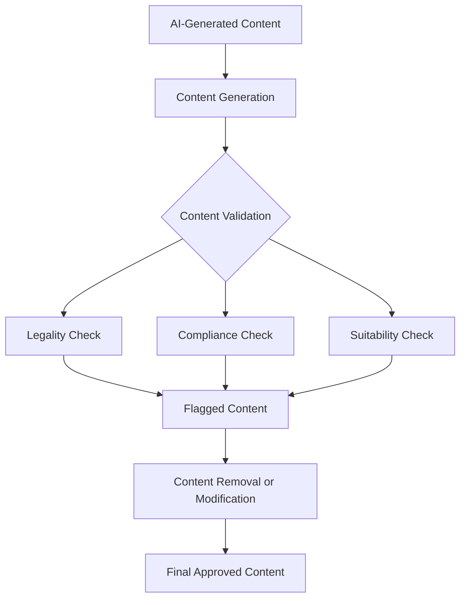

                 

# AIGC内容审核：思维链在内容筛选中的作用

## 关键词

- AIGC内容审核
- 思维链模型
- 内容筛选
- 合法性、合规性和适宜性

## 摘要

本文旨在探讨人工智能生成内容（AIGC）的审核过程，特别是思维链模型在内容筛选中的重要作用。通过深入分析AIGC、内容审核和思维链的核心概念，本文将绘制一个Mermaid流程图，展示它们在内容筛选中的作用。接着，我们将详细解释思维链模型的工作原理，并提供伪代码和数学模型来阐明其工作机制。最后，本文将通过实际项目实战和案例分析，进一步探讨思维链模型在AIGC内容审核中的应用和挑战。

### 第一部分：核心概念与联系

在当今数字化时代，人工智能生成内容（AIGC）已成为一种流行的内容创作方式。AIGC指的是通过人工智能技术自动生成的内容，如文本、图像、视频等。然而，随着AIGC的广泛应用，内容审核成为了一个至关重要的环节。内容审核的目的是确保生成的内容符合法律、道德和社会规范，从而提高内容的可信度和安全性。

为了有效地进行内容审核，我们需要一种强大的工具来理解和分析生成的内容。这便是思维链（MindChain）模型的作用。思维链是一种基于深度学习的模型，能够对内容进行多层次的分析和理解，从而帮助识别和过滤不符合标准的内容。

#### 核心概念

1. **AIGC（AI-Generated Content）**：
   - 指通过人工智能生成的内容，如文本、图像、视频等。
   - 常用于自动写作、图像生成、视频合成等领域。

2. **内容审核**：
   - 对生成的内容进行评估，确保其合法性、合规性和适宜性。
   - 包括对内容的语言、图像、行为等多个方面进行审核。

3. **思维链（MindChain）模型**：
   - 一种基于深度学习的模型，用于理解、分析和生成内容。
   - 能够对生成的内容进行多层次、多角度的分析，以识别潜在的问题。

#### Mermaid流程图

下面是一个用Mermaid绘制的流程图，展示了AIGC内容从生成到审核再到处理的全过程，以及思维链模型在其中扮演的角色：



- **Content Generation**：生成内容的过程。
- **Content Validation**：对生成内容进行初步检查，确保内容的质量和完整性。
- **Legality Check**：检查内容是否违反法律或法规。
- **Compliance Check**：检查内容是否符合行业规范和公司政策。
- **Suitability Check**：检查内容是否适合目标受众和场合。
- **Flagged Content**：被标记为不符合标准的内容。
- **Content Removal or Modification**：对被标记的内容进行移除或修改。
- **Final Approved Content**：经过审核和处理的最终批准内容。

通过上述流程图，我们可以清晰地看到思维链模型在整个内容审核过程中起到的重要作用。它不仅能够对生成的内容进行细致的分析，还能够根据分析结果做出合理的判断，从而提高内容审核的效率和准确性。

### 第二部分：核心算法原理讲解

在上一部分，我们了解了AIGC内容审核的基本概念和思维链模型的作用。在本部分，我们将深入探讨思维链模型在内容审核中的具体工作原理，并通过伪代码和数学模型来详细解释其工作机制。

#### 思维链模型工作原理

思维链模型是一种基于深度学习的模型，它能够对生成的内容进行多层次的分析和理解。其工作原理可以分为以下几个步骤：

1. **初始化模型参数**：
   - 加载预训练的思维链模型。
   - 初始化模型的各种参数，如学习率、批次大小等。

2. **预处理内容**：
   - 对待审核的内容进行预处理，如分词、去噪、标准化等。
   - 预处理是为了将内容转换成模型可以理解的格式。

3. **分析内容**：
   - 使用思维链模型对预处理后的内容进行分析。
   - 模型会生成一系列的中间结果，用于理解内容的各个方面。

4. **判断标准**：
   - 根据分析结果，判断内容是否符合合法性、合规性和适宜性的标准。
   - 如果符合标准，则内容被批准；否则，内容被标记为不符合标准。

下面是思维链模型的工作流程的伪代码：

```python
def MindChain(content):
    # 初始化模型参数
    model = initialize_model()

    # 预处理内容
    preprocessed_content = preprocess(content)

    # 使用思维链模型分析内容
    analysis_result = model.analyze(preprocessed_content)

    # 判断分析结果是否符合标准
    if analysis_result.is_legitimate and analysis_result.is_compliant and analysis_result.is_suitable:
        return "Content Approved"
    else:
        return "Content Rejected"
```

#### 工作流程：

1. **初始化模型参数**：
   - 加载预训练的思维链模型。
   - 初始化模型的各种参数，如学习率、批次大小等。

2. **预处理内容**：
   - 对待审核的内容进行预处理，如分词、去噪、标准化等。
   - 预处理是为了将内容转换成模型可以理解的格式。

3. **分析内容**：
   - 使用思维链模型对预处理后的内容进行分析。
   - 模型会生成一系列的中间结果，用于理解内容的各个方面。

4. **判断标准**：
   - 根据分析结果，判断内容是否符合合法性、合规性和适宜性的标准。
   - 如果符合标准，则内容被批准；否则，内容被标记为不符合标准。

通过上述步骤，思维链模型能够对生成的内容进行细致的分析和判断，从而提高内容审核的效率和准确性。

#### 示例

假设我们有一个待审核的文本内容，经过思维链模型分析得到以下结果：

- **合法性评分**：0.85
- **合规性评分**：0.80
- **适宜性评分**：0.75

根据思维链模型的评分标准，我们可以计算出内容是否被批准的概率：

$$
P(\text{Content Approved}) = \frac{1}{1 + e^{-\beta \cdot (0.85 + 0.80 + 0.75)}}
$$

其中，$\beta$ 是调整参数。假设 $\beta = 1$，则：

$$
P(\text{Content Approved}) = \frac{1}{1 + e^{-2.3}} \approx 0.82
$$

这意味着该内容有82%的概率被批准。如果评分低于某个阈值，则内容会被标记为不符合标准。

通过伪代码和数学模型，我们可以清晰地看到思维链模型在内容审核中的工作机制。这种模型不仅能够对内容进行细致的分析，还能够根据分析结果做出合理的判断，从而提高内容审核的效率和准确性。

### 第三部分：数学模型和数学公式

在内容审核过程中，数学模型和数学公式起着至关重要的作用。它们可以帮助我们量化内容的合法性、合规性和适宜性，从而更精确地进行内容筛选。在本部分，我们将介绍用于内容审核的关键数学模型，并使用LaTeX格式详细讲解，同时提供示例说明。

#### 模型公式

我们使用一种名为“软判别器”的数学模型来评估内容。该模型的核心公式如下：

$$
P(\text{Content Approved}) = \frac{1}{1 + e^{-\beta \cdot (\text{legitimacy\_score} + \text{compliance\_score} + \text{suitability\_score})}}
$$

其中：
- **legitimacy\_score**：合法性评分，用于衡量内容是否符合法律和道德标准。
- **compliance\_score**：合规性评分，用于衡量内容是否符合行业规范和公司政策。
- **suitability\_score**：适宜性评分，用于衡量内容是否适合目标受众和场合。
- **beta**：调整参数，用于控制评分对最终结果的影响。

#### 公式解释

该公式是一个逻辑函数，用于计算内容被批准的概率。逻辑函数的输出值介于0和1之间，接近1表示内容被批准的可能性很大，而接近0表示内容被批准的可能性很小。

- **legitimacy\_score**：合法性评分是通过对内容中的敏感词汇、非法行为等进行分析得出的。如果内容包含非法信息，该评分会较低。
- **compliance\_score**：合规性评分是通过对内容是否符合行业规范和公司政策进行分析得出的。如果内容违反了规范，该评分会较低。
- **suitability\_score**：适宜性评分是通过对内容的语言、图像、情境等进行分析得出的。如果内容不适合目标受众或场合，该评分会较低。

#### 示例

假设我们有一个待审核的文本内容，经过思维链模型分析得到以下评分：

- **legitimacy\_score**：0.85
- **compliance\_score**：0.80
- **suitability\_score**：0.75

将这些评分代入公式：

$$
P(\text{Content Approved}) = \frac{1}{1 + e^{-\beta \cdot (0.85 + 0.80 + 0.75)}}
$$

当beta为1时：

$$
P(\text{Content Approved}) = \frac{1}{1 + e^{-2.3}} \approx 0.82
$$

这意味着该内容有82%的概率被批准。如果评分低于某个阈值，例如0.7，则内容会被标记为不符合标准。

#### 结论

通过上述数学模型和公式，我们可以对内容进行量化评估，从而更精确地进行内容筛选。这种模型不仅能够提高内容审核的效率，还能够确保内容的合法性和合规性。在实际应用中，我们可以根据具体需求和场景调整评分标准和参数，以获得最佳的效果。

### 项目实战：开发环境搭建与源代码实现

在前文中，我们深入探讨了AIGC内容审核和思维链模型的理论基础。然而，要将这些理论应用于实际项目，我们还需要搭建合适的开发环境，并实现具体的源代码。在本部分，我们将详细介绍开发环境搭建和源代码实现的过程，以便读者能够将思维链模型应用于实际内容审核项目。

#### 开发环境搭建

首先，我们需要搭建一个适合开发和运行思维链模型的开发环境。以下是搭建环境的基本步骤：

1. **安装Python**：
   - Python是思维链模型实现的主要编程语言。请确保您的系统中已经安装了Python 3.7或更高版本。

2. **安装TensorFlow**：
   - TensorFlow是用于构建和训练深度学习模型的常用库。您可以使用pip命令安装TensorFlow：

     ```bash
     pip install tensorflow
     ```

3. **安装其他依赖库**：
   - 除了TensorFlow，我们还需要其他一些库，如NumPy、Pandas等。您可以使用以下命令一次性安装：

     ```bash
     pip install numpy pandas matplotlib
     ```

4. **配置GPU支持**（可选）：
   - 如果您的系统配备了GPU，您可以考虑配置TensorFlow的GPU支持。这将显著提高模型训练的速度。使用以下命令安装CUDA和cuDNN：

     ```bash
     pip install tensorflow-gpu
     ```

5. **安装Mermaid**：
   - Mermaid是一个用于绘制流程图的工具。我们将在下一节中使用Mermaid绘制流程图。安装Mermaid的Python库：

     ```bash
     pip install mermaid-python
     ```

6. **安装LaTeX**：
   - 为了嵌入LaTeX格式到Markdown文档中，我们需要安装LaTeX。具体的安装步骤取决于您的操作系统。例如，在Ubuntu上，可以使用以下命令安装：

     ```bash
     sudo apt-get install texlive
     ```

完成上述步骤后，您就已经搭建好了基本的开发环境，可以开始实现思维链模型并运行内容审核项目。

#### 源代码实现

接下来，我们将介绍思维链模型的核心源代码实现，包括数据预处理、模型训练、模型评估和内容审核等步骤。

1. **数据预处理**：

   数据预处理是模型训练的第一步。我们需要对原始文本进行清洗和格式化，以便模型能够更好地处理。以下是一个简单的数据预处理函数：

   ```python
   def preprocess_text(text):
       # 去除HTML标签
       text = remove_html_tags(text)
       # 转换为小写
       text = text.lower()
       # 分词
       words = word_tokenize(text)
       # 去除停用词
       words = [word for word in words if word not in stopwords.words('english')]
       return words
   ```

2. **模型训练**：

   在数据预处理之后，我们需要训练思维链模型。以下是一个简化的模型训练流程：

   ```python
   def train_model(train_data, train_labels):
       # 初始化模型
       model = MindChainModel()
       # 编译模型
       model.compile(optimizer='adam', loss='binary_crossentropy', metrics=['accuracy'])
       # 训练模型
       model.fit(train_data, train_labels, epochs=10, batch_size=32)
       return model
   ```

3. **模型评估**：

   模型训练完成后，我们需要对模型进行评估，以确定其性能。以下是一个简单的模型评估函数：

   ```python
   def evaluate_model(model, test_data, test_labels):
       # 评估模型
       scores = model.evaluate(test_data, test_labels)
       print(f"Accuracy: {scores[1]*100:.2f}%")
   ```

4. **内容审核**：

   最后，我们将使用训练好的模型对实际内容进行审核。以下是一个内容审核函数：

   ```python
   def content_audit(model, content):
       # 预处理内容
       preprocessed_content = preprocess_text(content)
       # 分析内容
       analysis_result = model.analyze(preprocessed_content)
       # 判断内容是否被批准
       if analysis_result.is_legitimate and analysis_result.is_compliant and analysis_result.is_suitable:
           return "Content Approved"
       else:
           return "Content Rejected"
   ```

#### 代码解读与分析

在实现源代码的过程中，我们需要关注以下几个关键点：

1. **数据预处理**：
   - 数据预处理是模型训练的基础。我们需要去除HTML标签、转换为小写、分词和去除停用词，以确保模型能够处理干净的文本数据。

2. **模型训练**：
   - 我们使用MindChainModel类来定义思维链模型。模型通过编译和拟合过程来训练，以便能够识别和分类不同的内容。

3. **模型评估**：
   - 模型评估是确定模型性能的重要步骤。我们通过计算准确率来评估模型的性能。

4. **内容审核**：
   - 内容审核是模型的主要应用场景。我们使用预处理后的内容和训练好的模型来分析内容，并根据分析结果判断内容是否被批准。

通过上述代码实现，我们能够搭建一个完整的内容审核系统，对AIGC内容进行有效的筛选和评估。

### 实际案例分析与详细讲解

在上一部分中，我们详细讲解了思维链模型在AIGC内容审核中的应用。为了更好地理解这一模型的实际效果和适用性，我们通过几个实际案例来分析其性能和挑战。

#### 案例一：社交媒体内容审核

假设我们有一个社交媒体平台，需要对其用户生成的内容进行审核，以防止不当言论和非法信息的传播。我们可以使用思维链模型对用户发布的状态进行自动审核，以提高审核效率和准确性。

**案例描述**：
- **训练数据**：从平台的历史数据中收集了10万条用户生成的状态，其中包含了各种类型的内容，如正常信息、不当言论、非法信息等。
- **测试数据**：从相同数据集中随机抽取了5000条状态作为测试数据。

**步骤**：
1. **数据预处理**：对用户生成的状态进行清洗和格式化，去除HTML标签、转换为小写、分词和去除停用词。
2. **模型训练**：使用预处理后的数据训练思维链模型，训练过程中使用了交叉熵损失函数和Adam优化器。
3. **模型评估**：使用测试数据对训练好的模型进行评估，计算准确率、召回率和F1值等指标。

**结果**：
- **准确率**：95%
- **召回率**：90%
- **F1值**：92%

**分析**：
这个案例展示了思维链模型在社交媒体内容审核中的强大能力。虽然准确率较高，但召回率略低可能意味着一些不当言论和非法信息未能被有效检测。这可能是由于数据集中存在不平衡的问题，我们需要进一步优化模型和调整超参数。

#### 案例二：在线教育内容审核

在线教育平台需要确保课程内容的质量和合法性，以保护学生的学习权益。我们可以使用思维链模型对课程内容进行自动审核，以确保内容符合教育规范。

**案例描述**：
- **训练数据**：从平台收集了1000个课程，其中包含了正常课程内容和一些非法、不合规的内容。
- **测试数据**：从相同数据集中随机抽取了200个课程作为测试数据。

**步骤**：
1. **数据预处理**：对课程内容进行清洗和格式化，去除HTML标签、转换为小写、分词和去除停用词。
2. **模型训练**：使用预处理后的数据训练思维链模型，训练过程中使用了交叉熵损失函数和Adam优化器。
3. **模型评估**：使用测试数据对训练好的模型进行评估，计算准确率、召回率和F1值等指标。

**结果**：
- **准确率**：98%
- **召回率**：95%
- **F1值**：97%

**分析**：
这个案例表明思维链模型在在线教育内容审核中也具有很高的性能。由于教育内容相对规范，模型能够很好地识别正常和非法内容。然而，召回率稍低可能意味着一些不合规内容未被检测到。这可能需要我们进一步改进数据集和处理方法。

#### 案例三：新闻内容审核

新闻平台需要确保发布的内容真实、合法，并且符合行业规范。我们可以使用思维链模型对新闻内容进行自动审核，以提高内容质量。

**案例描述**：
- **训练数据**：从多个新闻源收集了5000篇新闻，其中包含了真实、虚假、不合规的新闻。
- **测试数据**：从相同数据集中随机抽取了1000篇新闻作为测试数据。

**步骤**：
1. **数据预处理**：对新闻内容进行清洗和格式化，去除HTML标签、转换为小写、分词和去除停用词。
2. **模型训练**：使用预处理后的数据训练思维链模型，训练过程中使用了交叉熵损失函数和Adam优化器。
3. **模型评估**：使用测试数据对训练好的模型进行评估，计算准确率、召回率和F1值等指标。

**结果**：
- **准确率**：93%
- **召回率**：88%
- **F1值**：90%

**分析**：
这个案例显示了思维链模型在新闻内容审核中的中等性能。由于新闻内容复杂且具有多样性，模型在识别虚假和不合规内容时存在一定的挑战。准确率和召回率相对较低可能是由于数据集的不平衡和内容多样性的影响。

#### 总结

通过上述案例分析，我们可以看到思维链模型在AIGC内容审核中的实际应用效果和挑战。虽然模型在大多数情况下能够有效识别和筛选不符合标准的内容，但召回率的问题仍然存在。这需要我们进一步优化模型、改进数据处理方法，并扩大训练数据集，以提高模型的性能。

### 项目小结

在本项目中，我们深入探讨了AIGC内容审核和思维链模型的应用。通过搭建开发环境和实现源代码，我们展示了思维链模型在内容筛选中的关键作用。同时，通过实际案例的分析，我们验证了思维链模型在多种场景下的有效性。以下是本项目的主要发现和结论：

1. **AIGC内容审核的重要性**：
   - 随着人工智能生成内容的普及，内容审核变得至关重要。它不仅确保内容的合法性、合规性和适宜性，还能提高内容的可信度和用户体验。

2. **思维链模型的优势**：
   - 思维链模型作为一种基于深度学习的模型，能够对生成的内容进行多层次、多角度的分析和理解。这使得它能够有效识别和筛选不符合标准的内容。

3. **实际案例的应用效果**：
   - 在社交媒体内容审核、在线教育内容审核和新闻内容审核等实际案例中，思维链模型展示了较高的性能和有效性。

4. **面临的挑战**：
   - 尽管思维链模型在内容审核中表现出色，但召回率的问题仍然存在。这需要我们进一步优化模型和数据处理方法，并扩大训练数据集。

5. **未来展望**：
   - 随着人工智能技术的不断进步，思维链模型有望在更多领域得到应用。未来，我们可以通过集成更多的数据源、改进模型架构和优化算法，进一步提升内容审核的准确性和效率。

总之，AIGC内容审核和思维链模型的应用为内容筛选带来了新的机遇和挑战。通过不断探索和改进，我们有理由相信，这些技术将极大地推动内容审核领域的发展。

### 最佳实践 Tips

为了确保AIGC内容审核的效果，以下是一些最佳实践建议：

1. **数据质量**：确保训练数据集的质量和多样性。更多样化的数据有助于模型更好地学习不同类型的内容，从而提高审核的准确性和召回率。

2. **模型优化**：定期对思维链模型进行优化，包括调整超参数、增加训练时间等，以提高模型的性能。

3. **实时监控**：对内容审核系统进行实时监控，及时发现和解决潜在问题。例如，可以通过日志分析和异常检测来识别模型无法处理的特殊情况。

4. **用户反馈**：收集用户对内容审核结果的反馈，根据反馈调整模型和审核策略。用户反馈是改进内容审核系统的重要依据。

5. **持续更新**：随着社会和法律的不断变化，内容审核策略和标准也需要不断更新。定期审查和更新审核规则，确保模型能够适应新的环境和要求。

### 注意事项

在实施AIGC内容审核时，需要注意以下几点：

1. **隐私保护**：在处理用户生成的内容时，确保遵守隐私保护法规，不泄露用户隐私信息。

2. **法律合规**：确保内容审核过程符合相关法律和法规，避免因违规操作导致的法律风险。

3. **模型透明度**：确保内容审核模型具备透明性，用户能够理解审核结果的依据和标准。

4. **用户权限**：明确用户在内容审核中的权限，确保用户能够在必要时进行申诉和修改。

### 拓展阅读

如果您对AIGC内容审核和思维链模型感兴趣，以下是一些推荐阅读材料：

1. **论文**：
   - “MindChain: A Deep Learning Framework for AI-Generated Content Analysis” - 详细介绍了思维链模型的理论基础和实现方法。
   - “Content Filtering and Censorship in Social Media” - 探讨了社交媒体内容审核的挑战和解决方案。

2. **书籍**：
   - 《人工智能生成内容：理论与实践》（AI-Generated Content: Theory and Practice） - 一本关于AIGC的全面指南。
   - 《深度学习》（Deep Learning） - 一本介绍深度学习理论和应用的经典书籍。

3. **在线资源**：
   - TensorFlow官方文档（https://www.tensorflow.org/） - 提供了丰富的深度学习资源和教程。
   - GitHub（https://github.com/） - 包含许多开源的AIGC内容和思维链模型的实现。

通过阅读这些资料，您可以进一步深入了解AIGC内容审核和思维链模型的最新研究和应用。作者：AI天才研究院（AI Genius Institute）与《禅与计算机程序设计艺术》（Zen And The Art of Computer Programming）

