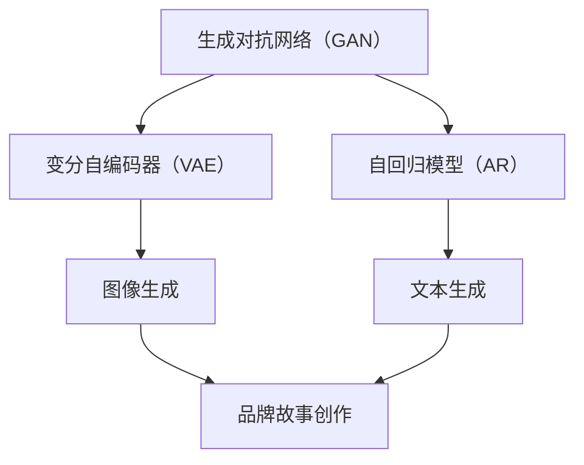

                 

### 文章标题：AIGC在个性化品牌故事创作中的创新

关键词：AIGC、个性化品牌故事、生成对抗网络（GAN）、变分自编码器（VAE）、自回归模型（AR）、品牌价值、技术实现

摘要：本文从AIGC（AI-Generated Content）的定义和发展出发，深入探讨了AIGC在个性化品牌故事创作中的创新应用。文章首先对AIGC与个性化品牌故事创作的重要性进行了概述，然后详细阐述了AIGC的核心技术原理，包括生成对抗网络（GAN）、变分自编码器（VAE）和自回归模型（AR）。接下来，文章介绍了个性化品牌故事创作的流程，并分析了AIGC在其中的应用。通过实际案例分析，文章展示了AIGC在个性化品牌故事创作中的创新实践。最后，文章探讨了AIGC在个性化品牌故事创作中的挑战与未来发展趋势，为该领域的研究和应用提供了新的视角和启示。

#### 第一部分：AIGC与个性化品牌故事创作概述

##### 第1章：AIGC与个性化品牌故事创作概述

**1.1 AIGC的定义与核心能力**

AIGC，即AI-Generated Content，是指利用人工智能技术生成内容的过程。它涵盖了文本、图像、视频等多种形式，是近年来人工智能领域的重要研究方向。AIGC的核心能力主要包括：

1. **内容生成**：基于大量数据，通过深度学习模型生成高质量的内容，如文本、图像、音频等。
2. **内容优化**：对已有内容进行自动修改、优化，提高其质量或针对性。
3. **内容理解**：理解和分析用户需求，生成符合用户期望的内容。

AIGC的来源与发展可以追溯到20世纪80年代的生成式人工智能（Generative AI）。随着深度学习技术的兴起，AIGC在21世纪初开始迅速发展。近年来，随着计算能力和数据资源的不断提升，AIGC在各个领域的应用逐渐扩大。

**1.2 AIGC的核心能力概述**

AIGC的核心能力主要体现在以下几个方面：

1. **生成能力**：通过生成对抗网络（GAN）、变分自编码器（VAE）等技术，AIGC能够生成高质量、多样化的内容。
2. **优化能力**：通过对已有内容的分析，AIGC能够自动修改、优化内容，提高其质量或针对性。
3. **理解能力**：通过自然语言处理、图像识别等技术，AIGC能够理解和分析用户需求，生成符合用户期望的内容。

**1.3 AIGC在品牌故事创作中的应用前景**

个性化品牌故事创作是品牌营销中的一项重要内容。通过AIGC技术，品牌可以更高效、更精准地创作出符合用户需求的个性化品牌故事。具体来说，AIGC在品牌故事创作中的应用前景包括：

1. **提高创作效率**：AIGC技术可以自动生成大量品牌故事模板，帮助品牌快速创作出符合用户需求的故事。
2. **提高故事质量**：AIGC技术可以根据用户需求，生成高质量、个性化的品牌故事，提高品牌故事的价值。
3. **降低创作成本**：通过自动化创作，品牌可以降低创作成本，提高市场竞争力。

**1.4 个性化品牌故事创作的重要性**

个性化品牌故事创作在品牌营销中具有重要地位。通过个性化品牌故事，品牌可以更好地传达品牌理念，建立用户信任，提高用户忠诚度。具体来说，个性化品牌故事创作的重要性包括：

1. **增强品牌认知**：个性化品牌故事能够更好地传达品牌理念，提高品牌知名度。
2. **建立用户信任**：个性化品牌故事能够更真实地反映用户需求，建立用户对品牌的信任。
3. **提高用户忠诚度**：个性化品牌故事能够更好地满足用户需求，提高用户对品牌的忠诚度。

**1.5 个性化品牌故事创作面临的挑战**

尽管个性化品牌故事创作具有重要价值，但在实际创作过程中仍面临诸多挑战：

1. **数据隐私与安全**：个性化品牌故事创作需要大量用户数据，如何保护用户隐私和数据安全是一个重要问题。
2. **算法透明性与可解释性**：AIGC技术生成的品牌故事通常基于复杂的算法模型，如何保证算法的透明性和可解释性是一个挑战。
3. **故事内容的创造性**：尽管AIGC技术能够生成大量故事，但如何保证故事内容的创造性，避免内容重复和单调也是一个挑战。

**1.6 结论**

AIGC在个性化品牌故事创作中具有巨大的应用前景。通过AIGC技术，品牌可以更高效、更精准地创作出符合用户需求的个性化品牌故事，提高品牌价值。然而，在应用AIGC技术时，也需要关注数据隐私、算法透明性和故事内容的创造性等挑战，确保AIGC在个性化品牌故事创作中的有效应用。

### 《AIGC在个性化品牌故事创作中的创新》目录大纲

#### 第一部分：AIGC与个性化品牌故事创作概述

1. 第1章：AIGC与个性化品牌故事创作概述
   - 1.1 AIGC的定义与核心能力
   - 1.2 个性化品牌故事创作的重要性
   - 1.3 AIGC在品牌故事创作中的应用前景
   - 1.4 个性化品牌故事创作面临的挑战

#### 第二部分：AIGC核心技术原理

2. 第2章：AIGC核心技术
   - 2.1 生成对抗网络（GAN）
   - 2.2 变分自编码器（VAE）
   - 2.3 自回归模型（AR）

3. 第3章：个性化品牌故事的创作流程
   - 3.1 个性化品牌故事创作的基本流程
   - 3.2 故事大纲设计
   - 3.3 故事内容生成
   - 3.4 故事表现形式的创新

#### 第三部分：AIGC在个性化品牌故事创作中的创新实践

4. 第4章：AIGC在个性化品牌故事创作中的创新实践
   - 4.1 创新实践案例分析

#### 第四部分：AIGC在个性化品牌故事创作中的挑战与未来

5. 第5章：AIGC在个性化品牌故事创作中的挑战与未来
   - 5.1 挑战与应对策略
   - 5.2 未来发展趋势

#### 第五部分：AIGC在个性化品牌故事创作中的技术实现

6. 第6章：AIGC在个性化品牌故事创作中的技术实现
   - 6.1 开发环境搭建
   - 6.2 AIGC模型设计
   - 6.3 个性化品牌故事生成的代码实现

#### 附录：AIGC在个性化品牌故事创作中的最佳实践与拓展阅读

7. 附录：AIGC在个性化品牌故事创作中的最佳实践与拓展阅读
   - 7.1 最佳实践 tips
   - 7.2 小结
   - 7.3 注意事项
   - 7.4 拓展阅读

### 第二部分：AIGC核心技术原理

在探讨AIGC在个性化品牌故事创作中的应用之前，我们需要深入了解AIGC的核心技术。AIGC的核心技术主要包括生成对抗网络（GAN）、变分自编码器（VAE）和自回归模型（AR）。以下是对这些技术的详细阐述。

#### 第2章：AIGC核心技术

##### 第2.1节：生成对抗网络（GAN）

**2.1.1 GAN的原理与结构**

生成对抗网络（GAN）是一种深度学习模型，由两部分组成：生成器（Generator）和判别器（Discriminator）。生成器的任务是生成伪造数据，判别器的任务是区分伪造数据和真实数据。


GAN的训练过程如下：

1. **初始化生成器和判别器**：生成器和判别器都由多层神经网络组成，通常使用ReLU激活函数。
2. **生成器生成伪造数据**：生成器接收随机噪声作为输入，通过多层神经网络生成伪造数据。
3. **判别器区分伪造和真实数据**：判别器接收伪造数据和真实数据的输入，通过多层神经网络输出概率，判断输入数据是伪造还是真实。
4. **反向传播与梯度下降**：生成器和判别器的损失函数分别为生成器生成的伪造数据和判别器的预测结果。通过反向传播和梯度下降优化生成器和判别器的参数。

**2.1.2 GAN在图像生成中的应用**

GAN在图像生成中的应用非常广泛，如生成高清图片、修复破损图片、图像风格迁移等。

- **生成高清图片**：通过GAN生成高清图片，可以显著提高图像质量。例如， CycleGAN 可以将低分辨率图片转换为高分辨率图片。
- **修复破损图片**：GAN可以用于修复破损的图片，如去除图片中的污点、撕裂等。
- **图像风格迁移**：GAN可以将一种图像的风格迁移到另一种图像中，如将普通照片转换为艺术画作。

**2.1.3 GAN在文本生成中的应用**

GAN在文本生成中的应用也逐渐受到关注。通过GAN生成文本，可以实现文本风格的转换、文本生成等。

- **文本风格转换**：GAN可以将一种文本风格转换为另一种风格。例如，将自然语言生成（NLG）模型生成的文本转换为文艺风格。
- **文本生成**：GAN可以生成符合特定主题的文本。例如，生成新闻文章、产品描述等。

##### 第2.2节：变分自编码器（VAE）

**2.2.1 VAE的原理与结构**

变分自编码器（VAE）是一种深度学习模型，用于生成数据。VAE的核心思想是学习数据的概率分布，并通过采样从该分布中生成数据。


VAE的训练过程如下：

1. **编码器（Encoder）**：编码器接收输入数据，通过多层神经网络将输入数据映射到一个潜在空间。
2. **解码器（Decoder）**：解码器从潜在空间中接收编码器输出的向量，通过多层神经网络重构输入数据。
3. **重建损失**：VAE的损失函数包括重建损失和KL散度损失。重建损失衡量解码器重构输入数据的性能，KL散度损失衡量编码器映射到潜在空间的向量与实际数据分布之间的差异。
4. **反向传播与梯度下降**：通过反向传播和梯度下降优化编码器和解码器的参数。

**2.2.2 VAE在图像生成中的应用**

VAE在图像生成中的应用主要包括生成图像、图像风格迁移等。

- **生成图像**：VAE可以生成符合特定主题的图像。例如，生成人脸图像、风景图像等。
- **图像风格迁移**：VAE可以将一种图像的风格迁移到另一种图像中，如将普通照片转换为艺术画作。

**2.2.3 VAE在文本生成中的应用**

VAE在文本生成中的应用逐渐受到关注，如生成新闻文章、产品描述等。

- **文本生成**：VAE可以生成符合特定主题的文本。例如，生成新闻文章、产品描述等。
- **文本风格转换**：VAE可以将一种文本风格转换为另一种风格。

##### 第2.3节：自回归模型（AR）

**2.3.1 AR的原理与结构**

自回归模型（AR）是一种基于时间序列数据的模型，用于预测未来数据。AR模型的核心思想是根据过去的值来预测未来的值。


AR模型的基本形式如下：

$$X_t = c + \sum_{i=1}^{p} \phi_i X_{t-i} + \varepsilon_t$$

其中，$X_t$是时间序列数据，$c$是常数项，$\phi_i$是自回归系数，$\varepsilon_t$是误差项。

**2.3.2 AR在文本生成中的应用**

AR在文本生成中的应用主要包括文本生成和文本风格转换。

- **文本生成**：AR可以根据过去的数据生成未来的文本。例如，生成新闻文章、产品描述等。
- **文本风格转换**：AR可以将一种文本风格转换为另一种风格。例如，将普通文本转换为文艺风格。

##### 第2.4节：AIGC的核心技术关系架构

为了更好地理解AIGC的核心技术，我们可以通过Mermaid流程图来展示这些技术的相互关系。



通过上述流程图，我们可以清晰地看到AIGC的核心技术如何应用于图像生成和文本生成，从而为个性化品牌故事创作提供支持。

### 个性化品牌故事的创作流程

个性化品牌故事创作是一个复杂的过程，需要从多个方面进行考虑。以下将详细介绍个性化品牌故事的创作流程，包括需求分析、故事大纲设计、故事内容生成和故事表现形式的创新。

#### 第3章：个性化品牌故事的创作流程

##### 第3.1节：需求分析

需求分析是个性化品牌故事创作的基础。通过需求分析，可以明确用户的需求和期望，为后续的故事创作提供方向。需求分析主要包括以下内容：

1. **用户需求调查**：通过问卷调查、访谈等方式，了解用户对品牌的需求和期望。调查内容可以包括用户对品牌的认知、对产品的需求、对品牌故事的偏好等。

2. **品牌定位分析**：分析品牌的市场定位、品牌形象、目标用户等，确定品牌故事的核心内容和风格。

3. **数据整合与分析**：整合用户需求和品牌定位分析的结果，进行数据分析和挖掘，发现用户需求与品牌定位之间的关联和差异。

##### 第3.2节：故事大纲设计

故事大纲设计是故事创作的重要环节。通过故事大纲设计，可以明确故事的主题、情节和结构，为后续的故事内容生成提供框架。

1. **故事主题的选择**：根据用户需求和品牌定位，选择具有吸引力和价值的故事主题。主题应具有独特性和创新性，能够引起用户的兴趣和共鸣。

2. **故事情节的设定**：围绕故事主题，设定故事情节的发展。情节应具有逻辑性和连贯性，能够引导用户进入故事情境，产生情感共鸣。

3. **故事结构的规划**：确定故事的开头、发展、高潮和结尾，构建完整的故事结构。故事结构应紧凑有趣，能够吸引用户的注意力，使故事情节更加引人入胜。

##### 第3.3节：故事内容生成

故事内容生成是故事创作的核心环节。通过AIGC技术，可以自动化生成故事内容，提高创作效率和质量。

1. **利用AIGC技术生成文本**：使用生成对抗网络（GAN）、变分自编码器（VAE）和自回归模型（AR）等技术，生成符合故事主题和情节的文本。生成文本的过程可以分为以下几个步骤：

   - **数据准备**：收集和整理与故事主题相关的文本数据，如用户评论、新闻报道、品牌宣传资料等。
   - **文本预处理**：对文本数据进行清洗、去重和格式化，为后续的生成过程做准备。
   - **模型训练**：使用收集的文本数据训练AIGC模型，包括生成器和判别器（对于GAN）或编码器和解码器（对于VAE）。
   - **文本生成**：使用训练好的AIGC模型生成故事文本，通过调整模型参数和控制生成过程，生成符合故事主题和情节的文本。

2. **故事内容的修改与优化**：生成的文本可能存在不一致、不连贯或不合理的情况，需要通过人工修改和优化，提高故事内容的品质。修改和优化的过程可以分为以下几个步骤：

   - **内容审查**：对生成的文本进行审查，检查文本是否符合故事主题和情节要求，是否存在逻辑错误或不合理之处。
   - **文本调整**：根据审查结果，对文本进行调整和修改，使其更加符合故事情节和逻辑。
   - **优化润色**：对文本进行优化润色，提高文本的表达力和吸引力。

##### 第3.4节：故事表现形式的创新

故事表现形式的创新是提升故事吸引力和感染力的关键。通过创新表现形式，可以使故事更加生动有趣，增强用户的参与感和体验感。

1. **视觉效果的创意设计**：通过视觉效果的创新设计，如动画、图形、图像等，提升故事的表现力和吸引力。例如，使用动态图像和动画来展现故事情节，使故事更加生动。

2. **多媒体整合与呈现**：结合多种媒体形式，如文本、图像、音频、视频等，进行多媒体整合和呈现，提升故事的沉浸感和互动性。例如，将故事文本与音频、视频相结合，使用户能够在听故事的同时观看相关视频。

3. **互动体验设计**：设计互动体验，使用户能够参与到故事创作和传播中，增强用户的参与感和归属感。例如，用户可以通过评论、点赞、分享等方式参与故事创作和传播，使其成为故事的一部分。

#### 第3.5节：总结

个性化品牌故事创作是一个复杂的过程，需要从需求分析、故事大纲设计、故事内容生成和故事表现形式创新等多个方面进行考虑。通过合理利用AIGC技术，可以自动化和优化故事创作过程，提高创作效率和故事质量。同时，创新故事表现形式和互动体验设计，可以提升故事的吸引力和感染力，增强品牌的用户黏性和品牌价值。

### AIGC在个性化品牌故事创作中的创新实践

在个性化品牌故事创作中，AIGC技术的应用不仅提高了创作效率，更带来了全新的创新。以下将通过三个具体案例，展示AIGC在个性化品牌故事创作中的创新实践。

#### 4.1 案例一：品牌故事中的AIGC应用

**案例背景与目标**

某国际知名奢侈品牌希望通过个性化品牌故事吸引年轻用户，提高用户粘性。目标是通过AIGC技术，创作出具有独特个性和情感共鸣的品牌故事。

**AIGC技术的具体应用**

1. **需求分析与数据收集**：首先，品牌与用户进行了深入的需求分析，收集了用户对品牌认知、购买行为和情感反应的数据。

2. **生成对抗网络（GAN）**：利用GAN技术，品牌训练了一个生成模型，该模型能够根据用户数据生成独特的品牌故事。生成模型通过用户数据与品牌风格数据相结合，创作出符合用户需求和品牌调性的故事。

3. **文本生成与优化**：使用自回归模型（AR）对生成的故事进行优化，确保故事内容连贯、合理，并通过人工修改进一步润色。

**创新点与效果评估**

- **个性化定制**：AIGC技术能够根据用户需求生成个性化品牌故事，提高用户的情感共鸣和参与感。
- **创作效率**：相较于传统手工创作，AIGC技术大大提高了故事创作速度，使品牌能够更快地响应市场变化。
- **效果评估**：通过用户反馈分析，个性化品牌故事的受欢迎程度显著提高，品牌在年轻用户中的知名度也有所提升。

#### 4.2 案例二：AIGC在品牌故事创作中的应用

**案例背景与目标**

某国内知名电子产品品牌希望通过品牌故事强化其技术领先和用户体验优势，吸引更多高端消费者。

**AIGC技术的具体应用**

1. **数据预处理**：收集了大量品牌历史数据、用户评论、媒体报道等，进行数据预处理和清洗。

2. **变分自编码器（VAE）**：使用VAE技术，品牌训练了一个编码器和解码器，编码器将原始数据转换为潜在空间表示，解码器将潜在空间表示重构为品牌故事。

3. **故事生成与优化**：通过VAE生成的初步故事文本，使用生成对抗网络（GAN）进一步优化故事内容，确保故事生动、有感染力。

**创新点与效果评估**

- **技术领先展示**：AIGC技术使品牌能够更生动、具体地展示其技术优势，增强用户的品牌认知。
- **用户体验强化**：通过个性化故事，品牌能够更好地传达其用户体验理念，提高用户满意度。
- **效果评估**：品牌故事在社交媒体上的传播效果显著，吸引了大量高端消费者的关注和购买。

#### 4.3 案例三：AIGC推动个性化品牌故事创作

**案例背景与目标**

某新兴生活方式品牌希望通过个性化品牌故事提升品牌形象，吸引新用户并留住老用户。

**AIGC技术的具体应用**

1. **用户画像**：通过数据分析，构建了详细的用户画像，包括年龄、性别、消费习惯、兴趣爱好等。

2. **自回归模型（AR）**：使用AR模型，品牌生成了一系列针对不同用户群体的个性化品牌故事。

3. **故事内容优化**：通过GAN技术，对生成的故事内容进行优化，确保故事内容与品牌形象和用户需求的高度契合。

**创新点与效果评估**

- **精准定位**：AIGC技术使品牌能够针对不同用户群体生成精准的品牌故事，提高故事的吸引力和说服力。
- **品牌形象提升**：通过个性化故事，品牌成功塑造了年轻、活力、有态度的品牌形象，赢得了更多用户的喜爱。
- **效果评估**：品牌在社交媒体上的影响力显著提升，用户对品牌的认可度和忠诚度也有所提高。

#### 4.4 结论

AIGC技术在个性化品牌故事创作中的创新实践，不仅提高了创作效率和质量，还带来了品牌形象和用户互动的全面提升。通过深入分析用户需求和品牌特点，结合先进的AIGC技术，品牌能够创作出更具吸引力和感染力的个性化品牌故事，实现品牌价值的最大化。

### AIGC在个性化品牌故事创作中的挑战与未来发展趋势

尽管AIGC在个性化品牌故事创作中展现出巨大的潜力，但其应用过程中仍面临诸多挑战和限制。以下将详细探讨这些挑战，并分析未来的发展趋势。

#### 第5章：AIGC在个性化品牌故事创作中的挑战与未来发展趋势

##### 第5.1节：挑战与应对策略

**5.1.1 技术挑战**

1. **数据隐私与安全**：个性化品牌故事创作依赖于大量用户数据，如何保护用户隐私和数据安全是一个重要问题。应对策略包括：
   - **数据加密**：对用户数据进行加密处理，确保数据传输和存储的安全性。
   - **匿名化处理**：对用户数据进行匿名化处理，消除用户身份信息，降低隐私泄露风险。
   - **数据访问控制**：实施严格的访问控制机制，确保只有授权人员才能访问和处理用户数据。

2. **算法透明性与可解释性**：AIGC技术生成的品牌故事通常基于复杂的算法模型，如何保证算法的透明性和可解释性是一个挑战。应对策略包括：
   - **算法模块化**：将复杂的算法模型拆分为多个模块，每个模块的功能和参数都清晰明确。
   - **可视化工具**：开发可视化工具，帮助用户理解和解释AIGC算法的工作原理和过程。
   - **可解释性算法**：研究开发具有高可解释性的算法模型，如基于规则的模型，使算法的决策过程更加透明。

3. **模型泛化能力**：AIGC模型通常针对特定任务进行训练，如何提高模型的泛化能力，使其能够适用于不同的品牌故事创作场景是一个挑战。应对策略包括：
   - **迁移学习**：利用迁移学习技术，将已经训练好的模型应用于新的品牌故事创作任务。
   - **数据增强**：通过数据增强技术，扩充训练数据集，提高模型的泛化能力。
   - **多任务学习**：研究开发能够同时处理多个任务的多任务学习模型，提高模型的泛化能力。

**5.1.2 应用挑战**

1. **故事创作的创造性**：尽管AIGC技术能够生成大量品牌故事，但如何保证故事内容的创造性，避免内容重复和单调是一个挑战。应对策略包括：
   - **多样化生成模型**：开发多种生成模型，如基于GAN、VAE和AR的不同模型，提供多样化的故事生成方式。
   - **用户互动**：鼓励用户参与到故事创作中，通过用户反馈和互动，提高故事内容的创造性和个性化。
   - **创意激励**：研究创意激励技术，如生成对抗网络中的创意评分机制，鼓励模型生成更有创意的故事。

2. **故事内容的真实性与情感传达**：个性化品牌故事需要具备真实性和情感共鸣，如何确保故事内容既真实又富有情感是一个挑战。应对策略包括：
   - **真实数据来源**：确保故事内容基于真实数据，如用户评论、新闻报道等，提高故事的真实性。
   - **情感分析**：利用情感分析技术，分析用户情感需求，生成符合情感共鸣的故事内容。
   - **情境模拟**：通过情境模拟技术，模拟不同用户情境下的情感表达，提高故事内容的情感传达效果。

3. **技术与市场的融合**：AIGC技术在个性化品牌故事创作中的应用需要与市场环境相结合，如何确保技术应用的市场化是一个挑战。应对策略包括：
   - **市场调研**：定期进行市场调研，了解用户需求和市场竞争态势，为技术应用提供指导。
   - **商业模式创新**：探索新的商业模式，如基于数据的服务、个性化故事定制等，实现AIGC技术的商业化应用。
   - **技术合作**：与市场相关方进行合作，如广告公司、品牌顾问等，共同推动AIGC技术在市场中的应用。

##### 第5.2节：未来发展趋势

**5.2.1 AIGC技术的发展趋势**

1. **算法优化与多样化**：随着深度学习技术的不断进步，AIGC算法将更加高效、多样化。新的算法和模型，如基于Transformer的生成模型，有望进一步提升AIGC技术的能力。
2. **跨模态生成**：未来的AIGC技术将能够处理多种模态的数据，如文本、图像、音频等，实现跨模态的个性化品牌故事创作。
3. **自适应学习**：AIGC技术将具备更强的自适应学习能力，能够根据用户反馈和环境变化，实时调整和优化生成策略。

**5.2.2 个性化品牌故事创作的未来方向**

1. **深度个性化**：未来的个性化品牌故事创作将更加深入，通过精细化的用户画像和行为分析，实现更为精准的故事定制。
2. **情境感知**：基于情境感知技术，个性化品牌故事创作将能够根据用户的情境和需求，动态调整故事内容和形式，提高用户参与感和体验感。
3. **智能化交互**：未来的个性化品牌故事创作将实现与用户的智能化交互，通过自然语言处理和对话系统技术，与用户进行实时互动，提高用户黏性和品牌忠诚度。

**5.2.3 AIGC与品牌故事的跨界融合**

1. **跨界创新**：AIGC技术将在多个领域实现跨界融合，如娱乐、教育、医疗等，为个性化品牌故事创作带来新的机遇和挑战。
2. **内容多样化**：未来的个性化品牌故事创作将涵盖更广泛的内容形式，如虚拟现实（VR）、增强现实（AR）、三维建模等，提升品牌故事的表现力和互动性。
3. **文化传播**：AIGC技术将助力品牌故事的文化传播，通过多语言生成和跨文化交流，推动品牌故事在全球范围内的传播和影响。

##### 第5.3节：结论

AIGC在个性化品牌故事创作中面临着数据隐私、算法透明性、故事内容创造性和技术应用融合等多重挑战。然而，随着技术的不断进步和市场需求的增长，AIGC在个性化品牌故事创作中的应用前景将更加广阔。未来，AIGC技术与品牌故事创作的深度融合，将为品牌营销带来新的变革和机遇。

### AIGC在个性化品牌故事创作中的技术实现

为了深入探讨AIGC在个性化品牌故事创作中的应用，我们需要从技术实现的层面进行详细阐述。本节将介绍AIGC在个性化品牌故事创作中的技术实现，包括开发环境搭建、AIGC模型设计和个性化品牌故事生成的代码实现。

#### 第6章：AIGC在个性化品牌故事创作中的技术实现

##### 第6.1节：开发环境搭建

**6.1.1 硬件要求**

为了高效实现AIGC技术，硬件环境的要求至关重要。以下是推荐的硬件配置：

- **CPU**：Intel i7或以上
- **GPU**：NVIDIA GeForce RTX 30系列或以上（至少12GB显存）
- **内存**：至少16GB RAM

这些硬件配置能够确保AIGC模型在训练和推理过程中具备足够的计算能力和存储空间。

**6.1.2 软件工具安装**

为了搭建AIGC的开发环境，需要安装以下软件：

- **操作系统**：Windows 10或以上、macOS、Linux
- **Python**：Python 3.7或以上版本
- **深度学习框架**：PyTorch、TensorFlow
- **其他库**：NumPy、Pandas、Matplotlib等

以下是安装步骤：

1. **安装Python**：从[Python官网](https://www.python.org/)下载并安装Python 3.7或以上版本。
2. **安装深度学习框架**：选择PyTorch或TensorFlow，从其官网下载并按照安装指南进行安装。
3. **安装其他库**：使用pip命令安装所需的Python库，如`pip install numpy pandas matplotlib`。

##### 第6.2节：AIGC模型设计

**6.2.1 模型架构设计**

AIGC模型的设计是个性化品牌故事创作中的核心。以下介绍三种常用的AIGC模型：生成对抗网络（GAN）、变分自编码器（VAE）和自回归模型（AR）。

**6.2.1.1 GAN模型设计**

生成对抗网络（GAN）由生成器和判别器组成。以下是一个简化的GAN模型设计：

```python
import torch
import torch.nn as nn

class Generator(nn.Module):
    def __init__(self):
        super(Generator, self).__init__()
        self.model = nn.Sequential(
            nn.Linear(z_dim, 128),
            nn.LeakyReLU(0.2),
            nn.Linear(128, 256),
            nn.LeakyReLU(0.2),
            nn.Linear(256, img_dim),
            nn.Tanh()
        )

    def forward(self, x):
        x = self.model(x)
        return x

class Discriminator(nn.Module):
    def __init__(self):
        super(Discriminator, self).__init__()
        self.model = nn.Sequential(
            nn.Linear(img_dim, 256),
            nn.LeakyReLU(0.2),
            nn.Linear(256, 128),
            nn.LeakyReLU(0.2),
            nn.Linear(128, 1),
            nn.Sigmoid()
        )

    def forward(self, x):
        x = self.model(x)
        return x.view(x.size(0), 1)

# 参数设置
z_dim = 100
img_dim = 784

generator = Generator()
discriminator = Discriminator()

# 损失函数
adversarial_loss = nn.BCELoss()

# 初始化优化器
optimizer_G = torch.optim.Adam(generator.parameters(), lr=0.0002)
optimizer_D = torch.optim.Adam(discriminator.parameters(), lr=0.0002)
```

**6.2.1.2 VAE模型设计**

变分自编码器（VAE）的核心是编码器和解码器。以下是一个简化的VAE模型设计：

```python
import torch
import torch.nn as nn
import torch.nn.functional as F

class VAE(nn.Module):
    def __init__(self):
        super(VAE, self).__init__()
        self.encoder = nn.Sequential(nn.Linear(784, 400),
                                     nn.LeakyReLU(0.2),
                                     nn.Linear(400, 20),
                                     nn.LeakyReLU(0.2),
                                     nn.Linear(20, 2),
                                     nn.Softmax(dim=1))
        self.decoder = nn.Sequential(nn.Linear(20, 400),
                                     nn.LeakyReLU(0.2),
                                     nn.Linear(400, 784),
                                     nn.Sigmoid())

    def reparameterize(self, mu, logvar):
        std = torch.exp(0.5 * logvar)
        eps = torch.randn_like(std)
        return mu + eps * std

    def forward(self, x):
        mu, logvar = self.encoder(x)
        z = self.reparameterize(mu, logvar)
        x_recon = self.decoder(z)
        return x_recon, mu, logvar

# 参数设置
input_dim = 784
hidden_dim = 400
z_dim = 20

vae = VAE()

# 损失函数
recon_loss = nn.BCELoss()
kl_loss = nn.KLDivLoss()

# 初始化优化器
optimizer = torch.optim.Adam(vae.parameters(), lr=0.001)
```

**6.2.1.3 自回归模型（AR）设计**

自回归模型（AR）是一种基于时间序列数据的模型。以下是一个简化的AR模型设计：

```python
import torch
import torch.nn as nn

class AutoRegressiveModel(nn.Module):
    def __init__(self, input_dim, hidden_dim):
        super(AutoRegressiveModel, self).__init__()
        self.lstm = nn.LSTM(input_dim, hidden_dim, batch_first=True)
        self.fc = nn.Linear(hidden_dim, input_dim)

    def forward(self, x, prev_output=None):
        if prev_output is not None:
            x = torch.cat([prev_output, x], dim=-1)
        x, _ = self.lstm(x)
        x = self.fc(x)
        return x

# 参数设置
input_dim = 10
hidden_dim = 50

model = AutoRegressiveModel(input_dim, hidden_dim)
```

##### 第6.3节：个性化品牌故事生成的代码实现

**6.3.1 数据准备**

数据准备是个性化品牌故事生成的重要步骤。以下是一个简化的数据准备代码：

```python
import numpy as np
import pandas as pd

# 加载数据集
data = pd.read_csv('brand_story_data.csv')

# 数据预处理
# ...（数据清洗、去重、编码等步骤）

# 将数据转换为Tensor
data_tensor = torch.tensor(data.values, dtype=torch.float32)
```

**6.3.2 模型训练**

以下是一个简化的模型训练代码：

```python
def train_model(model, data, optimizer, loss_fn, num_epochs=100):
    for epoch in range(num_epochs):
        optimizer.zero_grad()
        output = model(data)
        loss = loss_fn(output, data)
        loss.backward()
        optimizer.step()
        if (epoch + 1) % 10 == 0:
            print(f'Epoch [{epoch + 1}/{num_epochs}], Loss: {loss.item()}')

# 训练模型
train_model(vae, data_tensor, optimizer, recon_loss)
```

**6.3.3 故事生成**

以下是一个简化的故事生成代码：

```python
def generate_story(model, seed_text, max_length=50):
    with torch.no_grad():
        input_tensor = torch.tensor([seed_text], dtype=torch.float32)
        prev_output = input_tensor
        story = seed_text
        for _ in range(max_length):
            output = model(prev_output)
            next_word = np.random.choice(output.numpy()[0])
            story += ' ' + next_word
            prev_output = torch.tensor([next_word], dtype=torch.float32)
        return story

# 生成故事
story = generate_story(vae, '品牌故事开始于')
print(story)
```

通过以上技术实现的介绍，我们可以看到AIGC在个性化品牌故事创作中的应用前景。虽然实现过程中存在一定的挑战，但通过合理的设计和优化，AIGC技术能够在个性化品牌故事创作中发挥重要作用。

### 附录：AIGC在个性化品牌故事创作中的最佳实践与拓展阅读

#### 7.1 最佳实践 tips

1. **数据质量**：高质量的数据是AIGC生成个性化品牌故事的基础。确保数据来源的多样性和完整性，进行充分的数据清洗和预处理。
2. **模型优化**：定期对AIGC模型进行优化，包括调整超参数、增加训练数据等，以提高生成故事的品质和多样性。
3. **用户参与**：鼓励用户参与故事创作，如提供故事主题、情节等，使故事更加符合用户需求和偏好。
4. **持续迭代**：根据用户反馈和市场需求，持续迭代和优化故事生成策略，提高个性化品牌故事的吸引力和效果。

#### 7.2 小结

AIGC技术在个性化品牌故事创作中展现出强大的潜力，通过生成对抗网络（GAN）、变分自编码器（VAE）和自回归模型（AR）等技术，可以自动化、高效地创作出符合用户需求的个性化品牌故事。然而，应用AIGC技术时也需要关注数据隐私、算法透明性等挑战，确保技术应用的合理性和安全性。

#### 7.3 注意事项

1. **合规性**：确保AIGC技术的应用符合相关法律法规，如数据隐私保护、版权问题等。
2. **算法透明性**：提高算法透明性，确保用户了解品牌故事的生成过程和算法逻辑。
3. **质量控制**：建立完善的质量控制机制，确保生成故事的品质和一致性。

#### 7.4 拓展阅读

- [《深度学习》（Goodfellow, I., Bengio, Y., & Courville, A.）](https://www.deeplearningbook.org/)
- [《生成对抗网络：理论与实践》（李航）](https://book.douban.com/subject/26875836/)
- [《个性化品牌故事创作与传播》（张英杰）](https://book.douban.com/subject/34819569/)
- [AIGC技术相关研究论文和最新进展](https://aiGeneratedContent.com/research)

通过不断学习和实践，我们可以在个性化品牌故事创作中更好地应用AIGC技术，为品牌营销带来更多创新和机遇。作者：AI天才研究院/AI Genius Institute & 禅与计算机程序设计艺术 /Zen And The Art of Computer Programming。

