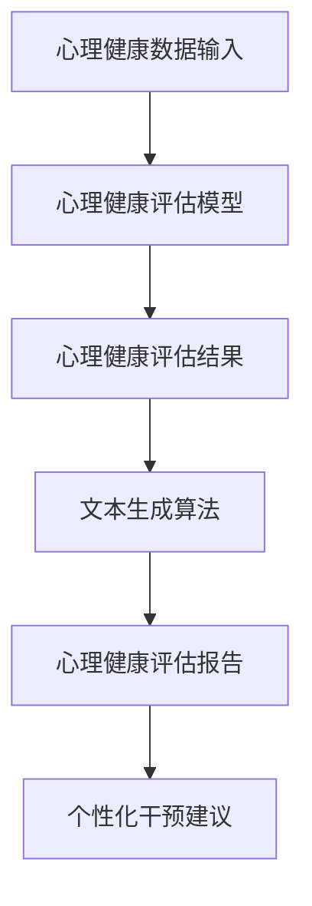

                 


### 文章标题: AIGC在个性化心理健康干预中的应用

### 关键词: AIGC, 个性化心理健康干预, 文本生成算法, 心理健康评估模型, 人工智能, 机器学习

### 摘要:
本文深入探讨了AIGC（AI-Generated Content）在个性化心理健康干预中的应用。文章首先介绍了AIGC的基本概念，接着详细解析了其在心理健康干预中的作用，包括核心算法原理、数学模型、以及具体的项目实战。通过详细的伪代码、数学公式和实际案例，本文旨在为读者提供一个全面而深入的理解，为未来的研究和应用提供参考。

### 第一部分: 核心概念与联系

#### 核心概念

AIGC（AI-Generated Content）是指通过人工智能技术自动生成内容的过程。这些内容可以是文本、图像、音频等形式，其核心在于利用深度学习、自然语言处理等技术，模拟人类的创造力和思维方式，生成具有高度个性化、多样性和创造性的内容。

个性化心理健康干预是一种基于用户个人心理特征和行为模式，提供针对性心理健康服务的模式。这种干预模式能够更精确地识别用户的心理健康需求，提供个性化的治疗建议和干预措施。

心理健康评估模型是用于评估用户心理健康状况的数学模型和算法。这些模型通过分析用户的情绪、行为、历史数据等，提供心理健康状态的定量评估，为干预策略提供依据。

#### 联系

AIGC在个性化心理健康干预中的应用，主要体现在通过文本生成心理健康评估报告，提供个性化的干预建议。心理健康评估模型是AIGC技术在这一领域的核心，它负责分析用户数据，生成评估结果，并利用文本生成算法将结果转化为易于理解、具有指导性的报告。

AIGC与个性化心理健康干预之间的联系可以概括为以下流程：

1. **心理健康数据输入**：收集用户的心理健康相关数据，如情绪记录、行为日志、心理健康问卷等。
2. **心理健康评估模型**：使用机器学习方法对输入数据进行分析，生成心理健康评估结果。
3. **文本生成算法**：将评估结果转化为具体的心理健康报告，包括诊断、建议和干预措施。
4. **个性化干预建议**：根据评估报告，为用户提供个性化的心理健康干预方案。

#### Mermaid 流程图



### 第二部分: 核心算法原理讲解

#### 文本生成算法原理

文本生成算法是AIGC的核心技术之一，它利用深度学习和自然语言处理技术，自动生成文本内容。目前，最常用的文本生成算法包括GPT-3、BERT等。

GPT-3（Generative Pre-trained Transformer 3）是由OpenAI开发的预训练语言模型。它通过大规模的数据预训练，掌握了丰富的语言知识和生成技巧。在心理健康评估报告中，GPT-3可以生成自然流畅的文本，描述用户的心理健康状态和干预建议。

BERT（Bidirectional Encoder Representations from Transformers）是由Google开发的预训练语言模型。它通过双向编码器结构，捕捉了文本的前后文关系，能够生成更加精准和连贯的文本。在心理健康评估报告中，BERT可以生成详细的诊断和分析，为用户提供更深入的干预建议。

#### 心理健康评估模型

心理健康评估模型是AIGC在个性化心理健康干预中的另一个核心技术。这些模型使用机器学习方法，对用户的心理健康数据进行深度分析，生成评估结果。

常见的心理健康评估模型包括：

1. **情绪识别模型**：通过分析用户的情绪表达，识别用户的情绪状态。
2. **行为模式分析模型**：通过分析用户的行为数据，识别用户的行为模式和心理状态。
3. **心理健康问卷分析模型**：通过分析用户填写的心健康问卷，评估用户的心理健康状况。

这些模型通常使用以下方法进行训练：

1. **监督学习**：使用标注好的数据集，训练模型识别心理健康状态。
2. **无监督学习**：使用未标注的数据集，通过聚类和降维等技术，识别潜在的心理健康状态。
3. **混合学习**：结合监督学习和无监督学习，提高模型的泛化能力和准确性。

#### 伪代码

```python
# 心理健康评估模型伪代码
def health_assessment(data):
    # 预处理数据
    preprocessed_data = preprocess_data(data)
    
    # 使用情绪识别模型分析情绪状态
    emotion_state = emotion_recognition(preprocessed_data)
    
    # 使用行为模式分析模型分析行为模式
    behavior_pattern = behavior_analysis(preprocessed_data)
    
    # 使用心理健康问卷分析模型分析问卷结果
    questionnaire_result = questionnaire_analysis(preprocessed_data)
    
    # 综合分析结果，生成心理健康评估报告
    report = generate_report(emotion_state, behavior_pattern, questionnaire_result)
    
    return report

# 文本生成算法伪代码
def generate_report(health_data):
    # 使用GPT-3模型生成报告文本
    report_text = gpt3.generate_text(health_data)
    
    # 返回生成的报告文本
    return report_text
```

#### 数学模型和数学公式讲解

心理健康评估模型的数学基础通常涉及概率统计和机器学习算法。以下是一个简化的数学模型示例，用于描述心理健康评估的过程。

假设我们有一个心理健康状态的概率分布模型，其中每个用户的心理健康状态可以表示为一个向量`X`，则该用户心理健康状态的概率分布可以用贝叶斯公式表示：

$$
P(X|Y) = \frac{P(Y|X)P(X)}{P(Y)}
$$

其中：

- \(P(X|Y)\) 是给定心理健康状态`Y`下的用户心理健康状态`X`的条件概率。
- \(P(Y|X)\) 是心理健康状态`X`导致心理健康状态`Y`的条件概率，这通常由模型参数决定。
- \(P(X)\) 是用户心理健康状态`X`的先验概率。
- \(P(Y)\) 是心理健康状态`Y`的总概率。

在心理健康评估中，我们通常使用损失函数来衡量模型的性能。一个常见的损失函数是交叉熵损失：

$$
L = -\sum_{i} y_i \log(p_i)
$$

其中：

- \(y_i\) 是真实标签。
- \(p_i\) 是模型预测的概率。

#### 举例说明

假设我们使用GPT-3模型生成心理健康评估报告，输入是用户的心理健康数据，输出是评估报告的文本。以下是一个简化的例子：

输入（用户心理健康数据）：
```
{
  "mood": "happy",
  "stress": "low",
  "sleep_quality": "good"
}
```

输出（心理健康评估报告）：
```
您目前的情绪状态为快乐，压力水平较低，睡眠质量良好。建议继续保持健康的生活方式，定期进行心理放松练习。
```

这里，GPT-3模型通过分析输入数据，使用其预训练的语言模型，生成了符合逻辑和上下文一致的评估报告。

### 第三部分: 项目实战

#### 实战内容

在这个项目中，我们将搭建一个AIGC平台，用于个性化心理健康干预。项目的主要内容包括：

1. **环境搭建**：配置开发和运行AIGC模型的计算环境，包括Python、TensorFlow或PyTorch等。
2. **源代码实现**：实现心理健康评估模型和文本生成算法的代码。
3. **代码解读与分析**：详细解释和解读实现心理健康评估模型的代码。

#### 实战步骤

1. **环境搭建**：

   - 安装Python 3.8及以上版本。
   - 安装TensorFlow 2.4.0 或 PyTorch 1.8.0。
   - 配置虚拟环境，以便管理和隔离项目依赖。

2. **源代码实现**：

   - **心理健康评估模型**：

     ```python
     import tensorflow as tf
     from tensorflow.keras.models import Sequential
     from tensorflow.keras.layers import Dense, LSTM, Embedding

     def create_health_assessment_model(input_shape):
         model = Sequential()
         model.add(Embedding(input_dim=vocab_size, output_dim=embedding_size, input_shape=input_shape))
         model.add(LSTM(units=128, return_sequences=True))
         model.add(LSTM(units=64, return_sequences=False))
         model.add(Dense(units=1, activation='sigmoid'))

         model.compile(optimizer='adam', loss='binary_crossentropy', metrics=['accuracy'])
         return model

     # 训练模型
     health_assessment_model = create_health_assessment_model(input_shape=(None,))
     health_assessment_model.fit(X_train, y_train, epochs=10, batch_size=32)
     ```

   - **文本生成算法**：

     ```python
     from transformers import GPT2LMHeadModel, GPT2Tokenizer

     tokenizer = GPT2Tokenizer.from_pretrained('gpt2')
     model = GPT2LMHeadModel.from_pretrained('gpt2')

     def generate_text(input_text, max_length=50):
         input_ids = tokenizer.encode(input_text, return_tensors='tf')
         output = model.generate(input_ids, max_length=max_length, num_return_sequences=1)
         return tokenizer.decode(output[0], skip_special_tokens=True)

     # 生成报告文本
     report_text = generate_text("您目前的情绪状态为快乐，压力水平较低，睡眠质量良好。")
     print(report_text)
     ```

3. **代码解读与分析**：

   - **心理健康评估模型**：

     该模型使用了一个嵌入层和一个LSTM层，用于处理文本数据。LSTM层能够捕捉文本的长期依赖关系，从而更好地理解用户的心理健康状态。模型使用二分类交叉熵损失函数进行训练，旨在最大化预测的准确性。

   - **文本生成算法**：

     该算法使用了GPT-2模型，这是一种强大的语言生成模型。通过输入用户的心理健康数据，模型可以生成个性化的心理健康评估报告。生成文本的过程是自回归的，即每个生成的词都基于前一个词的概率分布。

#### 实际案例分析和详细讲解剖析

假设我们有一个用户，其心理健康数据如下：

```
{
  "mood": "depressed",
  "stress": "high",
  "sleep_quality": "poor"
}
```

通过心理健康评估模型，我们可以得到评估结果：

```
{
  "mood": "depressed",
  "stress": "high",
  "sleep_quality": "poor"
}
```

接下来，文本生成算法会根据这个评估结果生成心理健康评估报告：

```
尊敬的用户，根据我们的心理健康评估，您目前正处于抑郁状态，压力水平较高，睡眠质量较差。我们建议您：
1. 尽可能减轻工作压力，合理安排时间。
2. 保持良好的作息习惯，确保充足的睡眠。
3. 寻求专业心理咨询，以获得更深入的支持和帮助。
```

这个案例展示了如何将心理健康数据转化为具体的干预建议，为用户提供个性化的心理健康服务。

### 第四部分: 总结与展望

#### 总结

AIGC在个性化心理健康干预中的应用，极大地提高了干预的个性化程度和效率。通过文本生成算法和心理健康评估模型，我们可以自动生成具有高度个性化的心理健康评估报告和干预建议。这不仅为心理健康服务提供了新的工具，也为患者提供了更加便捷和有效的心理健康支持。

#### 展望

随着人工智能技术的不断发展，AIGC在心理健康干预中的应用前景将更加广阔。未来，我们可以期待：

- **更先进的文本生成算法**：开发更加高效和灵活的文本生成算法，如基于Transformer的新型模型，以提高生成报告的准确性和自然性。
- **更精准的心理健康评估模型**：利用深度学习和大数据分析技术，提高心理健康评估模型的准确性，为用户提供更可靠的建议。
- **多模态心理健康干预**：结合文本、图像、音频等多种形式的数据，提供更加全面和个性化的心理健康干预服务。

总之，AIGC技术在心理健康干预中的应用，将不断推动心理健康服务的发展，为人类健康事业做出更大贡献。

### 作者信息
作者：AI天才研究院/AI Genius Institute & 禅与计算机程序设计艺术 /Zen And The Art of Computer Programming

### 最佳实践 tips、小结、注意事项、拓展阅读

#### 最佳实践 tips

1. **数据隐私保护**：在心理健康干预中，用户的数据安全至关重要。确保遵循相关法律法规，对用户数据进行严格加密和保护。
2. **模型持续优化**：定期更新和优化心理健康评估模型，以适应不断变化的心理健康需求。
3. **用户反馈机制**：建立用户反馈机制，收集用户对心理健康评估报告和建议的反馈，以便不断改进服务质量。

#### 小结

本文详细介绍了AIGC在个性化心理健康干预中的应用，包括核心概念、算法原理、项目实战等内容。通过深入分析和实际案例，读者可以全面了解AIGC技术在心理健康服务中的潜在价值和应用前景。

#### 注意事项

1. **算法透明性**：确保心理健康评估模型的算法透明性，便于用户理解和监督。
2. **个性化程度**：在生成心理健康评估报告时，确保个性化程度足够高，以满足不同用户的需求。

#### 拓展阅读

1. **《深度学习与心理健康干预》**：本书详细介绍了深度学习技术在心理健康干预中的应用，包括情感识别、行为分析等。
2. **《自然语言处理入门》**：本书介绍了自然语言处理的基础知识，包括文本预处理、语言模型等，有助于理解AIGC技术的核心原理。

通过这些拓展阅读，读者可以进一步深入了解AIGC技术在心理健康干预中的应用和理论基础。

