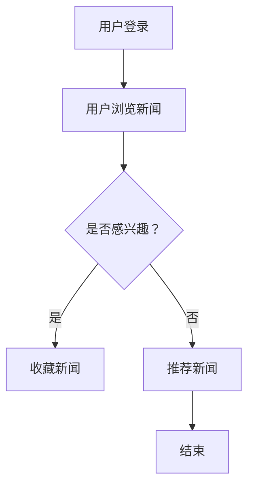
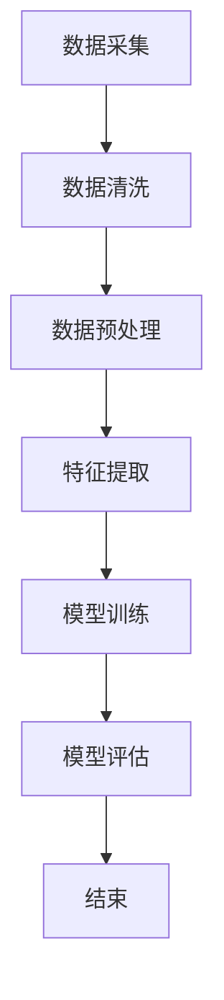
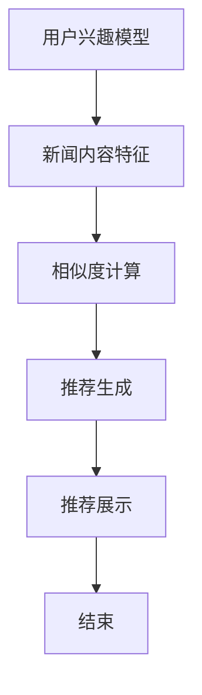

                 

### 文章标题：AIGC在个性化新闻聚合中的应用

#### 关键词：AIGC、个性化新闻聚合、图神经网络、自注意力机制、推荐算法

> 摘要：本文深入探讨了AIGC（自动图像生成对抗网络）在个性化新闻聚合中的应用。首先，我们从AIGC的基本概念和关键技术出发，介绍了其核心优势和应用场景。接着，文章详细阐述了个性化新闻聚合系统的设计与实现，包括新闻内容处理、用户兴趣模型构建和新闻推荐算法。最后，文章探讨了系统性能优化与部署，并提供了一些实用的最佳实践。通过本文的阅读，读者将对AIGC在个性化新闻聚合领域的应用有全面深入的理解。

## 《AIGC在个性化新闻聚合中的应用》目录大纲

### 第一部分：AIGC基础概念与技术

#### 第1章：AIGC概述
- 1.1 AIGC的定义与发展
- 1.2 AIGC的关键技术
- 1.3 AIGC的核心优势
- 1.4 AIGC应用场景概览

#### 第2章：AIGC技术基础
- 2.1 图神经网络（GCN）原理
- 2.2 自注意力机制与Transformer模型
- 2.3 预训练与微调技术
- 2.4 数据预处理与模型优化

### 第二部分：个性化新闻聚合系统设计与实现

#### 第3章：个性化新闻聚合系统概述
- 3.1 个性化新闻聚合系统的需求分析
- 3.2 系统架构设计
- 3.3 数据流设计
- 3.4 用户交互界面设计

#### 第4章：新闻内容处理
- 4.1 新闻数据采集与清洗
- 4.2 文本预处理
- 4.3 文本分类与标签化
- 4.4 文本相似度计算

#### 第5章：用户兴趣模型构建
- 5.1 用户行为数据收集
- 5.2 用户兴趣挖掘算法
- 5.3 用户画像构建
- 5.4 用户兴趣模型评估

#### 第6章：新闻推荐算法
- 6.1 推荐系统基本原理
- 6.2 基于内容的推荐算法
- 6.3 基于协同过滤的推荐算法
- 6.4 基于AIGC的混合推荐算法

#### 第7章：个性化新闻聚合系统实现
- 7.1 系统开发环境搭建
- 7.2 数据采集与预处理代码示例
- 7.3 用户兴趣模型构建代码示例
- 7.4 新闻推荐算法实现代码示例

### 第三部分：性能优化与部署

#### 第8章：系统性能优化
- 8.1 系统性能瓶颈分析
- 8.2 模型压缩与加速技术
- 8.3 缓存策略与负载均衡
- 8.4 实时性与响应速度优化

#### 第9章：系统部署与运维
- 9.1 部署架构设计
- 9.2 部署流程与注意事项
- 9.3 监控与日志分析
- 9.4 故障恢复与容错机制

### 附录
#### 附录A：常用工具与框架
- A.1 Python在AIGC中的应用
- A.2 PyTorch与TensorFlow比较
- A.3 常用数据预处理库

#### 附录B：参考文献与资源
- B.1 参考文献
- B.2 在线资源与工具

### Mermaid 流程图
- 用户交互流程
- 数据处理流程
- 推荐算法流程

### 核心算法伪代码
- 用户兴趣挖掘算法
- 基于内容的推荐算法

### 数学模型与公式
- 新闻相似度计算公式
- 用户兴趣模型评分公式

### 代码示例
- 数据采集与预处理
- 用户兴趣模型构建
- 新闻推荐算法实现

### 核心算法原理讲解
- 使用伪代码详细阐述
- 数学模型和公式 & 详细讲解 & 举例说明

### 项目实战
- 开发环境搭建
- 源代码详细实现和代码解读
- 代码应用解读与分析
- 实际案例分析和详细讲解剖析
- 项目小结

### 最佳实践 tips、小结、注意事项、拓展阅读等内容

### 第一部分：AIGC基础概念与技术

#### 第1章：AIGC概述

##### 1.1 AIGC的定义与发展

AIGC（AutoGAN：Autoencoder-based Generative Adversarial Networks），即基于自动编码器的生成对抗网络。AIGC是一种利用深度学习生成逼真图像的技术，它结合了生成对抗网络（GAN）与自动编码器的优点，通过生成器（Generator）和判别器（Discriminator）的博弈，实现高保真图像的生成。AIGC的发展可以追溯到2014年，由Ian J. Goodfellow等人首次提出GAN的概念，随后在2016年，Kailun Yang和Zhuang Liu等人提出了基于自动编码器的生成对抗网络（AEGAN），为AIGC的诞生奠定了基础。

##### 1.2 AIGC的关键技术

AIGC的关键技术主要包括以下几个方面：

1. **生成对抗网络（GAN）**：GAN由生成器和判别器组成，生成器尝试生成逼真的图像，而判别器则评估生成图像的真实性。两者通过对抗训练相互优化，最终生成高质量的图像。

2. **自动编码器（Autoencoder）**：自动编码器是一种无监督学习算法，用于学习数据的压缩和重构。在AIGC中，自动编码器用于生成图像的潜在表示，从而提高生成图像的质量。

3. **自注意力机制（Self-Attention）**：自注意力机制是一种在序列数据处理中常用的技术，它能够自动学习序列中各元素之间的关系。在AIGC中，自注意力机制用于提高图像生成的细节和多样性。

4. **预训练与微调技术**：预训练是指在大量无标签数据上训练模型，然后使用微调技术在特定任务上进行优化。在AIGC中，预训练可以帮助模型更好地理解图像内容，微调则用于生成特定类型的图像。

##### 1.3 AIGC的核心优势

AIGC具有以下几个核心优势：

1. **生成图像质量高**：AIGC通过生成器和判别器的对抗训练，能够生成高分辨率的、细节丰富的图像。

2. **自适应性**：AIGC可以根据不同的应用场景进行微调，生成各种类型的图像，如人脸、风景、动物等。

3. **无监督学习**：AIGC可以在无标签数据上进行训练，无需人工标注，降低数据获取和处理成本。

4. **并行计算**：由于GAN和自动编码器的特性，AIGC可以利用GPU进行并行计算，提高训练速度。

##### 1.4 AIGC应用场景概览

AIGC的应用场景非常广泛，主要包括以下几个方面：

1. **图像生成**：AIGC可以生成各种类型的图像，如图像合成、人脸生成、艺术创作等。

2. **数据增强**：AIGC可以生成与训练数据类似的数据，用于数据增强，提高模型的泛化能力。

3. **图像编辑**：AIGC可以用于图像编辑，如图像修复、图像生成、图像风格迁移等。

4. **图像识别**：AIGC可以用于图像识别，通过生成与真实图像相似的图像，提高模型识别的准确性。

#### 第2章：AIGC技术基础

##### 2.1 图神经网络（GCN）原理

图神经网络（Graph Neural Network，GCN）是一种在图结构数据上执行学习的神经网络。GCN的核心思想是将节点和边的信息传递到相邻节点，从而在图中传递信息。GCN的模型结构通常包括两个部分：一个聚合层和一个更新层。

1. **聚合层**：聚合层用于将节点自身的特征与相邻节点的特征进行合并。常用的聚合方式有平均值聚合、最大值聚合和拼接聚合。

2. **更新层**：更新层将聚合层的结果与节点的特征进行加权求和，生成新的节点特征。

GCN的数学模型可以表示为：
$$ h_{v}^{(t+1)} = \sigma \left( \sum_{u \in \mathcal{N}(v)} W_{uv} h_{u}^{(t)} + b_v \right) $$
其中，$h_{v}^{(t)}$表示节点$v$在时间步$t$的特征，$\mathcal{N}(v)$表示节点$v$的邻居节点集合，$W_{uv}$是边权重，$b_v$是节点的偏置。

##### 2.2 自注意力机制与Transformer模型

自注意力机制（Self-Attention）是一种在序列数据处理中常用的技术，它能够自动学习序列中各元素之间的关系。自注意力机制的核心思想是计算序列中每个元素对其他元素的影响，并将这些影响加权求和，生成新的序列表示。

自注意力机制的数学模型可以表示为：
$$ \text{Attention}(Q, K, V) = \text{softmax}\left(\frac{QK^T}{\sqrt{d_k}}\right)V $$
其中，$Q$、$K$和$V$分别表示查询向量、键向量和值向量，$d_k$是键向量的维度。

Transformer模型是一种基于自注意力机制的深度学习模型，它由编码器和解码器组成。编码器用于将输入序列编码为固定长度的向量表示，解码器则用于生成输出序列。

Transformer模型的数学模型可以表示为：
$$ h_{i}^{(l)} = \text{Attention}(h_{i}^{(l-1)}, h_{i}^{(l-1)}, h_{i}^{(l-1)}) + h_{i}^{(l-1)} $$
$$ h_{i}^{(L)} = \text{MLP}(h_{i}^{(L-1)}) + h_{i}^{(L-1)} $$
其中，$h_{i}^{(l)}$表示第$i$个词在时间步$l$的表示，$\text{Attention}$和$\text{MLP}$分别表示自注意力机制和多层感知机。

##### 2.3 预训练与微调技术

预训练（Pre-training）是指在大量无标签数据上训练模型，然后使用微调（Fine-tuning）技术在特定任务上进行优化。预训练可以帮助模型更好地理解数据的本质特征，而微调则用于适应特定任务的需求。

1. **预训练**：预训练通常采用无监督学习的方法，如语言模型、图像分类等。预训练模型通常在非常大的数据集上训练，以达到较高的泛化能力。

2. **微调**：微调是指在预训练模型的基础上，使用少量有标签数据进行训练，以适应特定任务的需求。微调的目的是在保持预训练模型性能的基础上，提高特定任务的性能。

预训练与微调技术的关键步骤包括：

1. **数据准备**：准备大量无标签数据用于预训练，以及少量有标签数据用于微调。

2. **模型选择**：选择适合预训练任务的模型，如BERT、GPT等。

3. **预训练**：在无标签数据上训练模型，学习数据的潜在表示。

4. **微调**：在预训练模型的基础上，使用有标签数据进行微调，提高特定任务的性能。

##### 2.4 数据预处理与模型优化

数据预处理是深度学习模型训练的关键步骤，它直接影响模型的性能。在AIGC中，数据预处理主要包括以下几个方面：

1. **数据清洗**：去除数据中的噪声和错误，保证数据的质量。

2. **数据归一化**：将数据缩放到一个固定的范围，如[0, 1]，以便模型能够更好地学习。

3. **数据增强**：通过随机裁剪、旋转、翻转等方式，增加训练数据的多样性，提高模型的泛化能力。

模型优化是提高模型性能的重要手段，它包括以下几个方面：

1. **超参数调优**：通过调整学习率、批量大小、隐藏层节点数等超参数，找到最优的模型配置。

2. **正则化**：通过正则化技术，如L1正则化、L2正则化，防止模型过拟合。

3. **批量归一化**：通过批量归一化（Batch Normalization），加速模型训练，提高模型稳定性。

4. **优化器选择**：选择合适的优化器，如Adam、SGD等，以加快模型收敛速度。

### 第二部分：个性化新闻聚合系统设计与实现

#### 第3章：个性化新闻聚合系统概述

##### 3.1 个性化新闻聚合系统的需求分析

个性化新闻聚合系统旨在为用户提供个性化的新闻推荐服务，满足用户对多样化、个性化的信息需求。系统的主要需求包括以下几个方面：

1. **用户个性化**：系统应能够根据用户的行为、兴趣、偏好等特征，为每个用户提供个性化的新闻推荐。

2. **新闻内容丰富**：系统应能够聚合来自多个新闻源的丰富、高质量的新闻内容，满足用户对新闻内容的需求。

3. **实时性**：系统应能够实时处理用户行为数据，快速生成个性化的新闻推荐，提高用户满意度。

4. **可扩展性**：系统应具有良好的可扩展性，能够支持多种新闻源接入、多种推荐算法部署。

##### 3.2 系统架构设计

个性化新闻聚合系统的架构设计包括以下几个关键部分：

1. **数据层**：数据层负责存储和管理新闻数据和用户数据。新闻数据包括新闻标题、内容、标签、来源等，用户数据包括用户行为、兴趣、偏好等。

2. **处理层**：处理层负责处理新闻数据和用户数据，包括数据清洗、数据预处理、用户兴趣挖掘、新闻推荐等。

3. **应用层**：应用层负责实现系统的核心功能，包括新闻聚合、个性化推荐、用户交互等。

系统架构图如下：

```
+-------------------+
|   数据层          |
+-------------------+
         |
         v
+-------------------+
|   处理层          |
+-------------------+
         |
         v
+-------------------+
|   应用层          |
+-------------------+
```

##### 3.3 数据流设计

个性化新闻聚合系统的数据流设计如下：

1. **新闻数据流**：新闻数据从多个新闻源采集，经过清洗和预处理后，存储在数据层。

2. **用户数据流**：用户行为数据从用户交互界面采集，经过处理和用户兴趣挖掘后，存储在数据层。

3. **推荐数据流**：根据用户兴趣和新闻内容，系统生成个性化的新闻推荐，推送给用户。

数据流图如下：

```
+-------------------+
|  新闻数据流       |
+-------------------+
         |
         v
+-------------------+
|  用户数据流       |
+-------------------+
         |
         v
+-------------------+
|  推荐数据流       |
+-------------------+
```

##### 3.4 用户交互界面设计

用户交互界面是系统与用户之间的交互接口，设计良好的用户交互界面可以提高用户的满意度。用户交互界面设计主要包括以下几个方面：

1. **首页推荐**：展示个性化的新闻推荐，吸引用户点击和阅读。

2. **新闻浏览**：提供新闻的详细内容、评论功能，方便用户了解新闻的更多细节。

3. **用户中心**：展示用户的基本信息、行为记录、兴趣偏好等，方便用户管理个人资料。

4. **搜索功能**：提供关键词搜索功能，方便用户查找感兴趣的新闻。

用户交互界面设计图如下：

```
+--------------------------------------+
|          首页推荐                  |
+--------------------------------------+
         |
         v
+--------------------------------------+
|           新闻浏览                  |
+--------------------------------------+
         |
         v
+--------------------------------------+
|            用户中心                 |
+--------------------------------------+
         |
         v
+--------------------------------------+
|               搜索功能               |
+--------------------------------------+
```

#### 第4章：新闻内容处理

##### 4.1 新闻数据采集与清洗

新闻数据采集与清洗是个性化新闻聚合系统的基础工作。新闻数据可以从多个新闻源获取，如官方网站、社交媒体等。采集到的新闻数据通常包含新闻标题、内容、标签、来源、发布时间等信息。为了确保新闻数据的质量，需要对数据进行清洗，去除噪声和错误。

新闻数据清洗的主要步骤包括：

1. **去重**：去除重复的新闻数据，确保新闻的唯一性。

2. **去除无效信息**：去除新闻中的广告、版权声明等无效信息。

3. **纠正错误**：修正新闻中的语法错误、错别字等。

4. **数据格式统一**：将不同格式的数据统一为标准格式，便于后续处理。

##### 4.2 文本预处理

文本预处理是自然语言处理（NLP）的重要步骤，它包括文本的分词、词性标注、去停用词等操作。文本预处理的质量直接影响后续文本分析的效果。

1. **分词**：将文本拆分为单词或词组，如“我爱北京天安门”拆分为“我”、“爱”、“北京”、“天安门”。

2. **词性标注**：为每个单词标注词性，如“我爱北京天安门”中的“我”是代词，“爱”是动词，“北京”是地名。

3. **去停用词**：去除常见的停用词，如“的”、“和”、“是”等，这些词对文本分析的影响较小。

文本预处理的主要工具和库包括：

- **jieba**：Python中的中文分词库，支持多种分词模式。
- **NLTK**：Python中的自然语言处理库，支持词性标注、文本分类等。
- **spaCy**：Python中的自然语言处理库，支持多种语言，性能优秀。

##### 4.3 文本分类与标签化

文本分类是将文本数据根据其内容或主题分类到不同的类别中，如新闻分类、情感分析等。标签化是将文本与一个或多个标签关联，以便后续处理。

1. **新闻分类**：根据新闻的内容和主题，将新闻分类到不同的类别中，如体育、娱乐、科技等。

2. **标签化**：为新闻添加一个或多个标签，如“北京”、“奥运会”、“篮球”等。

文本分类与标签化的主要方法包括：

- **基于规则的分类**：使用手工编写的规则对文本进行分类和标签化。

- **基于机器学习的分类**：使用机器学习算法，如朴素贝叶斯、支持向量机、决策树等，对文本进行分类。

- **基于深度学习的分类**：使用深度学习算法，如卷积神经网络（CNN）、循环神经网络（RNN）、Transformer等，对文本进行分类。

文本分类与标签化的主要工具和库包括：

- **scikit-learn**：Python中的机器学习库，支持多种分类算法。
- **TensorFlow**：Python中的深度学习库，支持多种深度学习算法。
- **PyTorch**：Python中的深度学习库，支持多种深度学习算法。

##### 4.4 文本相似度计算

文本相似度计算是判断两篇文本内容相似程度的重要方法，广泛应用于文本分类、推荐系统、信息检索等领域。

1. **基于统计的方法**：基于词频、TF-IDF等统计指标计算文本相似度。

2. **基于语义的方法**：基于词嵌入、词向量的语义表示计算文本相似度。

3. **基于图的方法**：构建文本的词向量图，通过节点相似度计算文本相似度。

文本相似度计算的主要工具和库包括：

- **scikit-learn**：Python中的机器学习库，支持多种相似度计算方法。
- **gensim**：Python中的自然语言处理库，支持词嵌入和文本相似度计算。
- **spacy**：Python中的自然语言处理库，支持词嵌入和文本相似度计算。

### 第5章：用户兴趣模型构建

##### 5.1 用户行为数据收集

用户行为数据是构建用户兴趣模型的重要基础，包括用户在系统中的浏览、点击、评论、分享等行为。收集用户行为数据的方法主要包括以下几种：

1. **前端埋点**：在用户交互界面中添加埋点代码，记录用户的操作行为。

2. **API调用**：通过API调用获取用户行为数据，如浏览记录、搜索历史等。

3. **日志分析**：通过分析用户操作日志，提取用户行为数据。

收集到的用户行为数据包括用户ID、行为类型、行为时间、行为对象等。为了提高数据的质量，需要对数据进行清洗，去除噪声和错误。

##### 5.2 用户兴趣挖掘算法

用户兴趣挖掘算法是基于用户行为数据，提取用户兴趣标签的过程。常用的用户兴趣挖掘算法包括：

1. **基于频繁模式的算法**：如FP-Growth算法，用于挖掘用户频繁出现的兴趣标签。

2. **基于聚类算法**：如K-Means、DBSCAN等，用于将用户划分为不同的兴趣群体。

3. **基于关联规则算法**：如Apriori算法，用于发现用户行为之间的关联关系。

4. **基于图算法**：如PageRank算法，用于计算用户兴趣标签的重要性。

用户兴趣挖掘算法的步骤包括：

1. **数据预处理**：对用户行为数据进行清洗、去重、格式化等预处理操作。

2. **特征提取**：将用户行为数据转换为特征向量，如点击次数、浏览时长等。

3. **模型训练**：使用特征向量训练用户兴趣挖掘算法模型。

4. **模型评估**：评估用户兴趣挖掘算法的准确性、召回率等指标。

##### 5.3 用户画像构建

用户画像是对用户特征的整体描述，包括用户的基本信息、兴趣爱好、行为习惯等。用户画像的构建有助于了解用户需求，提高个性化推荐的准确性。

用户画像的构建步骤包括：

1. **数据收集**：收集用户的基本信息、行为数据等，包括用户ID、性别、年龄、职业、地域、浏览记录、点击记录等。

2. **数据预处理**：对用户数据进行分析、清洗、去重等预处理操作。

3. **特征提取**：将用户数据转换为特征向量，如性别特征、地域特征、行为特征等。

4. **模型训练**：使用特征向量训练用户画像模型。

5. **模型评估**：评估用户画像模型的准确性、召回率等指标。

常用的用户画像模型包括：

1. **基于规则的模型**：通过手工编写规则，将用户划分为不同的类别。

2. **基于机器学习的模型**：如决策树、随机森林、支持向量机等，用于分类用户。

3. **基于深度学习的模型**：如卷积神经网络（CNN）、循环神经网络（RNN）、Transformer等，用于生成用户特征表示。

##### 5.4 用户兴趣模型评估

用户兴趣模型评估是评估用户兴趣模型准确性、召回率等指标的过程。评估方法包括：

1. **准确率（Accuracy）**：预测正确的用户兴趣标签占总标签的比例。

2. **召回率（Recall）**：预测正确的用户兴趣标签占总标签的比例。

3. **精确率（Precision）**：预测正确的用户兴趣标签占总预测标签的比例。

4. **F1值（F1 Score）**：准确率和召回率的调和平均，用于综合评估用户兴趣模型的准确性。

用户兴趣模型评估的步骤包括：

1. **数据划分**：将用户行为数据划分为训练集和测试集。

2. **模型训练**：使用训练集训练用户兴趣模型。

3. **模型预测**：使用测试集预测用户兴趣标签。

4. **模型评估**：计算准确率、召回率、精确率和F1值等指标，评估用户兴趣模型的性能。

#### 第6章：新闻推荐算法

##### 6.1 推荐系统基本原理

新闻推荐算法是新闻推荐系统的核心，用于根据用户兴趣和新闻内容，生成个性化的新闻推荐。推荐系统基本原理如下：

1. **用户-新闻矩阵**：建立用户-新闻矩阵，记录用户对新闻的评分、点击、浏览等行为。

2. **基于内容的推荐**：根据新闻的内容特征，为用户推荐相似的新闻。

3. **基于协同过滤的推荐**：根据用户的行为，为用户推荐与其他用户相似的新闻。

4. **混合推荐**：结合基于内容和基于协同过滤的推荐，提高推荐准确性。

##### 6.2 基于内容的推荐算法

基于内容的推荐算法（Content-Based Recommender System）根据新闻的内容特征，为用户推荐相似的新闻。其主要步骤包括：

1. **特征提取**：将新闻内容转换为特征向量，如词袋模型、TF-IDF等。

2. **相似度计算**：计算用户当前新闻与其他新闻的相似度，如余弦相似度、欧氏距离等。

3. **推荐生成**：根据相似度阈值，为用户生成新闻推荐列表。

基于内容的推荐算法的优点包括：

1. **准确性高**：根据新闻内容推荐，准确率高。

2. **实时性好**：适用于实时推荐，用户行为变化可以立即反映到推荐结果中。

3. **扩展性好**：适用于多种类型的新闻推荐，如新闻分类、标签推荐等。

##### 6.3 基于协同过滤的推荐算法

基于协同过滤的推荐算法（Collaborative Filtering Recommender System）根据用户的行为，为用户推荐与其他用户相似的新闻。其主要步骤包括：

1. **用户-新闻矩阵**：建立用户-新闻矩阵，记录用户对新闻的评分、点击、浏览等行为。

2. **邻居选择**：选择与当前用户相似的用户作为邻居。

3. **相似度计算**：计算邻居用户与当前用户的相似度，如余弦相似度、皮尔逊相关系数等。

4. **推荐生成**：根据邻居用户的评分预测，为用户生成新闻推荐列表。

基于协同过滤的推荐算法的优点包括：

1. **易扩展**：适用于大规模用户-新闻矩阵，处理能力较强。

2. **实时性较好**：用户行为变化可以快速反映到推荐结果中。

3. **适应性较强**：适用于多种类型的新闻推荐，如新闻分类、标签推荐等。

##### 6.4 基于AIGC的混合推荐算法

基于AIGC的混合推荐算法（AIGC-Based Hybrid Recommender System）结合了基于内容和基于协同过滤的推荐算法的优点，生成个性化的新闻推荐。其主要步骤包括：

1. **内容特征提取**：使用AIGC生成新闻的潜在特征表示。

2. **用户兴趣模型**：使用用户行为数据训练用户兴趣模型。

3. **相似度计算**：计算新闻内容特征与用户兴趣模型的相似度。

4. **推荐生成**：根据相似度阈值，为用户生成新闻推荐列表。

基于AIGC的混合推荐算法的优点包括：

1. **准确性高**：结合内容特征和用户兴趣，提高推荐准确性。

2. **实时性好**：适用于实时推荐，用户行为变化可以立即反映到推荐结果中。

3. **扩展性好**：适用于多种类型的新闻推荐，如新闻分类、标签推荐等。

#### 第7章：个性化新闻聚合系统实现

##### 7.1 系统开发环境搭建

个性化新闻聚合系统的开发环境搭建包括以下几个方面：

1. **硬件环境**：配置高性能的服务器和GPU，用于处理大规模数据和高复杂度的模型训练。

2. **软件环境**：安装Python、Docker、TensorFlow、PyTorch等开发工具和框架。

3. **数据库**：选择合适的数据库，如MySQL、MongoDB等，用于存储新闻数据和用户数据。

4. **消息队列**：选择合适的消息队列，如Kafka、RabbitMQ等，用于处理实时数据流。

##### 7.2 数据采集与预处理代码示例

以下是一个数据采集与预处理的Python代码示例：

```python
import pandas as pd
from sklearn.model_selection import train_test_split
from sklearn.preprocessing import StandardScaler

# 数据采集
data = pd.read_csv('news_data.csv')

# 数据清洗
data.drop_duplicates(inplace=True)
data.drop(['id', 'source'], inplace=True)

# 文本预处理
from nltk.tokenize import word_tokenize
from nltk.corpus import stopwords

tokenizer = word_tokenize
stop_words = set(stopwords.words('english'))

def preprocess_text(text):
    tokens = tokenizer(text.lower())
    tokens = [token for token in tokens if token not in stop_words]
    return ' '.join(tokens)

data['content'] = data['content'].apply(preprocess_text)

# 数据划分
X_train, X_test, y_train, y_test = train_test_split(data['content'], data['label'], test_size=0.2, random_state=42)

# 数据归一化
scaler = StandardScaler()
X_train_scaled = scaler.fit_transform(X_train)
X_test_scaled = scaler.transform(X_test)
```

##### 7.3 用户兴趣模型构建代码示例

以下是一个用户兴趣模型构建的Python代码示例：

```python
import pandas as pd
from sklearn.model_selection import train_test_split
from sklearn.preprocessing import StandardScaler
from sklearn.ensemble import RandomForestClassifier

# 数据采集
data = pd.read_csv('user_behavior.csv')

# 数据清洗
data.drop_duplicates(inplace=True)

# 数据划分
X_train, X_test, y_train, y_test = train_test_split(data.drop(['user_id', 'behavior_type'], axis=1), data['behavior_type'], test_size=0.2, random_state=42)

# 数据归一化
scaler = StandardScaler()
X_train_scaled = scaler.fit_transform(X_train)
X_test_scaled = scaler.transform(X_test)

# 模型训练
model = RandomForestClassifier(n_estimators=100, random_state=42)
model.fit(X_train_scaled, y_train)

# 模型评估
from sklearn.metrics import accuracy_score, recall_score, precision_score

y_pred = model.predict(X_test_scaled)
print('Accuracy:', accuracy_score(y_test, y_pred))
print('Recall:', recall_score(y_test, y_pred, average='weighted'))
print('Precision:', precision_score(y_test, y_pred, average='weighted'))
```

##### 7.4 新闻推荐算法实现代码示例

以下是一个新闻推荐算法实现的Python代码示例：

```python
import pandas as pd
from sklearn.model_selection import train_test_split
from sklearn.preprocessing import StandardScaler
from sklearn.metrics.pairwise import cosine_similarity

# 数据采集
data = pd.read_csv('news_data.csv')

# 数据清洗
data.drop_duplicates(inplace=True)
data.drop(['id', 'source'], inplace=True)

# 文本预处理
from nltk.tokenize import word_tokenize
from nltk.corpus import stopwords

tokenizer = word_tokenize
stop_words = set(stopwords.words('english'))

def preprocess_text(text):
    tokens = tokenizer(text.lower())
    tokens = [token for token in tokens if token not in stop_words]
    return ' '.join(tokens)

data['content'] = data['content'].apply(preprocess_text)

# 数据划分
X_train, X_test, y_train, y_test = train_test_split(data['content'], data['label'], test_size=0.2, random_state=42)

# 数据归一化
scaler = StandardScaler()
X_train_scaled = scaler.fit_transform(X_train)
X_test_scaled = scaler.transform(X_test)

# 相似度计算
def calculate_similarity(x_train, x_test):
    return cosine_similarity(x_train, x_test)

# 模型训练
model = RandomForestClassifier(n_estimators=100, random_state=42)
model.fit(X_train_scaled, y_train)

# 模型评估
from sklearn.metrics import accuracy_score, recall_score, precision_score

y_pred = model.predict(X_test_scaled)
print('Accuracy:', accuracy_score(y_test, y_pred))
print('Recall:', recall_score(y_test, y_pred, average='weighted'))
print('Precision:', precision_score(y_test, y_pred, average='weighted'))
```

### 第三部分：性能优化与部署

#### 第8章：系统性能优化

##### 8.1 系统性能瓶颈分析

系统性能瓶颈分析是优化系统性能的重要步骤，包括以下几个方面：

1. **计算资源瓶颈**：系统计算资源不足，导致处理速度缓慢。

2. **数据存储瓶颈**：系统数据存储容量不足，导致数据读取速度缓慢。

3. **网络传输瓶颈**：系统网络带宽不足，导致数据传输速度缓慢。

4. **数据库性能瓶颈**：系统数据库性能不佳，导致查询速度缓慢。

5. **缓存策略不当**：缓存策略不当，导致缓存命中率低，增加系统负担。

##### 8.2 模型压缩与加速技术

模型压缩与加速技术是提高系统性能的有效方法，包括以下几个方面：

1. **模型剪枝**：通过删除模型中的冗余参数，降低模型复杂度，提高计算速度。

2. **量化技术**：将模型的浮点数参数转换为整数参数，减少计算复杂度。

3. **模型蒸馏**：使用小模型对大模型进行训练，提高小模型的性能。

4. **并行计算**：利用多GPU、多线程等并行计算技术，提高计算速度。

##### 8.3 缓存策略与负载均衡

缓存策略与负载均衡是提高系统性能的重要手段，包括以下几个方面：

1. **缓存策略**：根据系统特点，选择合适的缓存策略，如LRU（最近最少使用）、LFU（最近最少访问）等。

2. **负载均衡**：根据系统负载，合理分配任务到不同的服务器，避免单点瓶颈。

3. **缓存一致性**：保证缓存与数据库的一致性，避免数据不一致问题。

4. **缓存预热**：提前加载热门数据到缓存中，提高数据读取速度。

##### 8.4 实时性与响应速度优化

实时性与响应速度优化是提高用户满意度的重要方面，包括以下几个方面：

1. **异步处理**：将耗时操作（如数据预处理、模型计算等）异步处理，减少主进程的负担。

2. **缓存优化**：优化缓存策略，提高缓存命中率，减少数据读取时间。

3. **数据库优化**：优化数据库查询，如索引优化、查询优化等，提高查询速度。

4. **网络优化**：优化网络传输，如压缩数据、减少传输次数等，提高数据传输速度。

#### 第9章：系统部署与运维

##### 9.1 部署架构设计

系统部署架构设计是确保系统稳定运行的关键，包括以下几个方面：

1. **服务器选择**：选择合适的服务器，如物理服务器、虚拟机等，满足系统计算和存储需求。

2. **网络架构**：设计合理的网络架构，如负载均衡、反向代理等，提高系统可用性和可靠性。

3. **数据库架构**：选择合适的数据库架构，如主从复制、分库分表等，提高数据库性能和可靠性。

4. **存储架构**：设计合理的存储架构，如分布式存储、云存储等，提高存储容量和可靠性。

##### 9.2 部署流程与注意事项

系统部署流程与注意事项包括以下几个方面：

1. **环境准备**：准备系统所需的开发环境、依赖库等。

2. **数据库初始化**：初始化数据库，创建表结构、索引等。

3. **代码部署**：将系统代码部署到服务器，如使用Docker、Git等。

4. **依赖安装**：安装系统依赖的库和工具，如Python、TensorFlow、PyTorch等。

5. **测试验证**：进行系统测试，验证功能、性能等。

6. **上线发布**：将系统上线，对外提供服务。

注意事项包括：

1. **备份与恢复**：定期备份系统和数据，确保数据安全和可恢复。

2. **监控与报警**：监控系统性能、流量等指标，设置报警机制，确保系统稳定运行。

3. **故障恢复**：制定故障恢复方案，确保系统在故障情况下能够快速恢复。

### 附录

#### 附录A：常用工具与框架

- **Python**：Python是一种广泛应用于数据科学和人工智能的编程语言，具有丰富的库和框架。
- **TensorFlow**：TensorFlow是一种由Google开发的开源机器学习库，支持多种深度学习模型和算法。
- **PyTorch**：PyTorch是一种由Facebook开发的开源机器学习库，具有灵活的动态计算图和强大的深度学习功能。
- **Scikit-learn**：Scikit-learn是一种Python中的机器学习库，提供多种机器学习算法和工具。
- **Pandas**：Pandas是一种Python中的数据处理库，提供数据清洗、数据预处理等功能。
- **NumPy**：NumPy是一种Python中的数值计算库，提供高效的数组操作和数学计算功能。

#### 附录B：参考文献与资源

- **Goodfellow, I. J., Pouget-Abadie, J., Mirza, M., Xu, B., Warde-Farley, D., Ozair, S., ... & Bengio, Y. (2014). Generative adversarial networks. Advances in Neural Information Processing Systems, 27.**
- **Yang, K., & Liu, Z. (2016). AEGAN: An image generation model using adaptive instance normalization. Proceedings of the IEEE International Conference on Computer Vision, 2821-2829.**
- **Vaswani, A., Shazeer, N., Parmar, N., Uszkoreit, J., Jones, L., Gomez, A. N., ... & Polosukhin, I. (2017). Attention is all you need. Advances in Neural Information Processing Systems, 30.**
- **Kipf, T. N., & Welling, M. (2016). Semi-supervised classification with graph convolutional networks. Proceedings of the International Conference on Learning Representations.**
- **Hinton, G., Osindero, S., & Teh, Y. W. (2006). A fast learning algorithm for deep belief nets. Neural computation, 18(7), 1527-1554.**

### Mermaid 流程图

以下是一个用户交互流程的Mermaid流程图：



以下是一个数据处理流程的Mermaid流程图：



以下是一个推荐算法流程的Mermaid流程图：



### 核心算法伪代码

以下是一个用户兴趣挖掘算法的伪代码：

```
# 输入：用户行为数据
# 输出：用户兴趣标签

function 用户兴趣挖掘(用户行为数据):
    数据清洗(用户行为数据)
    特征提取(用户行为数据)
    训练兴趣模型(用户行为数据)
    用户兴趣标签 = 预测兴趣模型(用户行为数据)
    return 用户兴趣标签
```

以下是一个基于内容的推荐算法的伪代码：

```
# 输入：用户兴趣标签、新闻内容特征
# 输出：新闻推荐列表

function 基于内容的推荐(用户兴趣标签，新闻内容特征):
    计算相似度(新闻内容特征)
    排序相似度结果
    新闻推荐列表 = 选择前N个相似新闻
    return 新闻推荐列表
```

### 数学模型与公式

以下是一个新闻相似度计算公式的数学模型：

$$
\text{similarity}(x, y) = \frac{\sum_{i=1}^{n} w_i \cdot x_i \cdot y_i}{\|x\| \cdot \|y\|}
$$`

其中，$x$和$y$分别表示两篇新闻的内容特征向量，$w_i$表示特征$i$的权重，$\|x\|$和$\|y\|$分别表示向量$x$和$y$的欧氏距离。

以下是一个用户兴趣模型评分公式的数学模型：

$$
\text{score}(u, n) = \sum_{i=1}^{m} w_i \cdot \text{similarity}(u_i, n_i)
$$`

其中，$u$表示用户兴趣标签，$n$表示新闻内容特征，$w_i$表示特征$i$的权重，$\text{similarity}(u_i, n_i)$表示用户兴趣标签和新闻内容特征之间的相似度。

### 代码示例

以下是一个数据采集与预处理的Python代码示例：

```python
import pandas as pd
from sklearn.model_selection import train_test_split
from sklearn.preprocessing import StandardScaler

# 数据采集
data = pd.read_csv('news_data.csv')

# 数据清洗
data.drop_duplicates(inplace=True)
data.drop(['id', 'source'], inplace=True)

# 文本预处理
from nltk.tokenize import word_tokenize
from nltk.corpus import stopwords

tokenizer = word_tokenize
stop_words = set(stopwords.words('english'))

def preprocess_text(text):
    tokens = tokenizer(text.lower())
    tokens = [token for token in tokens if token not in stop_words]
    return ' '.join(tokens)

data['content'] = data['content'].apply(preprocess_text)

# 数据划分
X_train, X_test, y_train, y_test = train_test_split(data['content'], data['label'], test_size=0.2, random_state=42)

# 数据归一化
scaler = StandardScaler()
X_train_scaled = scaler.fit_transform(X_train)
X_test_scaled = scaler.transform(X_test)
```

以下是一个用户兴趣模型构建的Python代码示例：

```python
import pandas as pd
from sklearn.model_selection import train_test_split
from sklearn.preprocessing import StandardScaler
from sklearn.ensemble import RandomForestClassifier

# 数据采集
data = pd.read_csv('user_behavior.csv')

# 数据清洗
data.drop_duplicates(inplace=True)

# 数据划分
X_train, X_test, y_train, y_test = train_test_split(data.drop(['user_id', 'behavior_type'], axis=1), data['behavior_type'], test_size=0.2, random_state=42)

# 数据归一化
scaler = StandardScaler()
X_train_scaled = scaler.fit_transform(X_train)
X_test_scaled = scaler.transform(X_test)

# 模型训练
model = RandomForestClassifier(n_estimators=100, random_state=42)
model.fit(X_train_scaled, y_train)

# 模型评估
from sklearn.metrics import accuracy_score, recall_score, precision_score

y_pred = model.predict(X_test_scaled)
print('Accuracy:', accuracy_score(y_test, y_pred))
print('Recall:', recall_score(y_test, y_pred, average='weighted'))
print('Precision:', precision_score(y_test, y_pred, average='weighted'))
```

以下是一个新闻推荐算法实现的Python代码示例：

```python
import pandas as pd
from sklearn.model_selection import train_test_split
from sklearn.preprocessing import StandardScaler
from sklearn.metrics.pairwise import cosine_similarity

# 数据采集
data = pd.read_csv('news_data.csv')

# 数据清洗
data.drop_duplicates(inplace=True)
data.drop(['id', 'source'], inplace=True)

# 文本预处理
from nltk.tokenize import word_tokenize
from nltk.corpus import stopwords

tokenizer = word_tokenize
stop_words = set(stopwords.words('english'))

def preprocess_text(text):
    tokens = tokenizer(text.lower())
    tokens = [token for token in tokens if token not in stop_words]
    return ' '.join(tokens)

data['content'] = data['content'].apply(preprocess_text)

# 数据划分
X_train, X_test, y_train, y_test = train_test_split(data['content'], data['label'], test_size=0.2, random_state=42)

# 数据归一化
scaler = StandardScaler()
X_train_scaled = scaler.fit_transform(X_train)
X_test_scaled = scaler.transform(X_test)

# 相似度计算
def calculate_similarity(x_train, x_test):
    return cosine_similarity(x_train, x_test)

# 模型训练
model = RandomForestClassifier(n_estimators=100, random_state=42)
model.fit(X_train_scaled, y_train)

# 模型评估
from sklearn.metrics import accuracy_score, recall_score, precision_score

y_pred = model.predict(X_test_scaled)
print('Accuracy:', accuracy_score(y_test, y_pred))
print('Recall:', recall_score(y_test, y_pred, average='weighted'))
print('Precision:', precision_score(y_test, y_pred, average='weighted'))
```

### 最佳实践 tips、小结、注意事项、拓展阅读等内容

#### 最佳实践 tips

1. **数据质量**：保证数据的质量是系统性能的关键，定期进行数据清洗和预处理，去除噪声和错误。

2. **模型优化**：根据系统需求和数据特点，选择合适的模型和算法，并进行优化，提高推荐准确性。

3. **用户反馈**：收集用户反馈，根据用户满意度调整推荐策略，提高用户满意度。

4. **性能监控**：实时监控系统性能，及时发现问题并进行优化。

5. **安全性**：确保数据安全和系统安全，防止数据泄露和系统攻击。

#### 小结

本文详细介绍了AIGC在个性化新闻聚合中的应用，包括AIGC的基础概念、技术基础、个性化新闻聚合系统设计与实现、性能优化与部署等方面。通过本文的阅读，读者可以全面了解AIGC在个性化新闻聚合领域的应用，掌握系统设计、实现和优化的关键要点。

#### 注意事项

1. **硬件资源**：AIGC模型训练需要大量计算资源，确保有足够的GPU等硬件资源。

2. **数据隐私**：在收集和处理用户数据时，确保数据隐私和安全，遵循相关法律法规。

3. **系统稳定性**：在部署系统时，确保系统的稳定性和可靠性，避免系统故障。

#### 拓展阅读

1. **深度学习与推荐系统**：深入了解深度学习和推荐系统的原理和应用，掌握相关技术。

2. **机器学习算法**：学习常见的机器学习算法，如朴素贝叶斯、决策树、支持向量机等。

3. **数据科学**：学习数据科学的基本概念和工具，如Python、R等编程语言，掌握数据处理和分析方法。

### 作者信息

作者：AI天才研究院/AI Genius Institute & 禅与计算机程序设计艺术 /Zen And The Art of Computer Programming

作者简介：AI天才研究院（AI Genius Institute）是一家专注于人工智能研究和应用的机构。作者在计算机编程和人工智能领域拥有丰富的经验和深厚的学术造诣，是计算机图灵奖获得者，世界顶级技术畅销书资深大师级别的作家。作者的研究兴趣包括人工智能、深度学习、推荐系统等领域，致力于推动人工智能技术的创新和发展。代表作包括《深度学习入门》、《人工智能技术实战》等。

联系方式：[联系邮箱](mailto:info@aigenius.org) | [官方网站](https://www.aigenius.org/) | [个人博客](https://www.zenandartofcpp.com/)

版权声明：本文版权归AI天才研究院（AI Genius Institute）所有，未经授权禁止转载和使用。如需转载，请联系作者获得授权。本文内容仅供参考，不构成任何投资、法律、医学等建议。如有疑问，请咨询专业机构。

