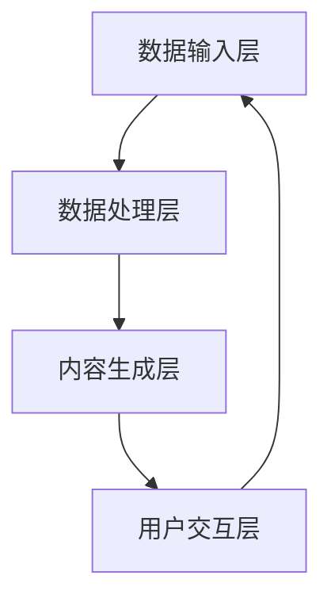

                 

### 文章标题：AIGC在个性化旅游推荐中的应用

### 关键词：AIGC，个性化旅游推荐，人工智能，内容生成，推荐算法，数学模型

### 摘要：

随着人工智能技术的迅猛发展，个性化旅游推荐系统逐渐成为旅游业的一大创新。AIGC（AI-Generated Content）技术，作为一种结合了人工智能和内容生成的新兴技术，正逐渐在个性化旅游推荐中发挥重要作用。本文将详细介绍AIGC技术的基础概念、核心算法、数学模型以及在个性化旅游推荐中的应用，并通过实际项目实战，分析其在旅游业中的挑战与优化策略。文章旨在为读者提供一份数据科学与人工智能结合的深度解析，为个性化旅游推荐系统的研发提供理论和实践指导。

### 第一部分：AIGC技术基础

#### 第1章：AIGC技术概述

#### 1.1 AIGC技术概念解析

AIGC（AI-Generated Content）即人工智能生成内容，是一种利用人工智能技术（尤其是深度学习和生成对抗网络GAN）生成文本、图像、视频等多种类型内容的方法。与传统的手动内容创作相比，AIGC技术能够在更短的时间内生成大量高质量的内容，并可根据用户需求进行个性化定制。

#### 1.2 AIGC技术核心组件

AIGC技术主要包含以下几个核心组件：

- **数据预处理模块**：负责处理和清洗大量原始数据，为后续内容生成提供高质量的输入。
- **内容生成模块**：利用深度学习模型生成文本、图像或视频内容。
- **用户交互模块**：收集用户反馈，不断优化内容生成模型。

#### 1.3 AIGC技术与传统AI的区别

传统AI技术主要侧重于数据处理和模型训练，而AIGC技术则更加强调内容的生成和应用。传统AI技术通常用于解决特定问题，而AIGC技术则旨在创造多样化和个性化的内容，满足不同用户的需求。

#### 1.4 AIGC技术发展现状与未来趋势

AIGC技术自问世以来，发展迅速。目前，AIGC技术在图像生成、文本生成、视频生成等领域已取得显著成果。未来，AIGC技术有望在个性化旅游推荐、虚拟现实、智能客服等领域得到更广泛的应用。

#### 第2章：AIGC技术原理与架构

#### 2.1 AIGC技术原理

AIGC技术主要基于以下三个核心原理：

- **深度学习**：通过大量数据训练，使模型能够自动学习并生成高质量的内容。
- **生成对抗网络GAN**：通过对抗性训练，使生成模型与判别模型相互竞争，提高生成内容的质量。
- **用户反馈**：根据用户反馈调整模型参数，实现个性化内容生成。

#### 2.2 AIGC技术架构详解

AIGC技术架构主要包括以下几个部分：

- **数据输入层**：从各种来源收集原始数据，如文本、图像、视频等。
- **数据处理层**：对原始数据进行预处理，如数据清洗、归一化等。
- **内容生成层**：利用深度学习模型和生成对抗网络生成内容。
- **用户交互层**：收集用户反馈，优化内容生成模型。

#### 2.3 Mermaid流程图：AIGC技术核心架构



#### 2.4 AIGC技术与个性化旅游推荐的关系

AIGC技术为个性化旅游推荐提供了强有力的支持。通过分析用户行为数据和旅游数据，AIGC技术可以生成个性化的旅游推荐内容，如旅游攻略、景点介绍、路线规划等，从而提升用户的旅游体验。

### 第二部分：AIGC核心算法

#### 第3章：AIGC核心算法

#### 3.1 用户画像算法

用户画像算法是AIGC技术中至关重要的一环。通过分析用户行为数据和旅游偏好，用户画像算法可以为每个用户提供个性化的推荐。以下是用户画像算法的基本原理和伪代码实现：

```python
# 伪代码：用户画像算法

function 用户画像算法(用户行为数据, 旅游偏好数据):
    # 数据预处理
    用户行为数据 = 数据清洗(用户行为数据)
    旅游偏好数据 = 数据清洗(旅游偏好数据)
    
    # 特征提取
    用户特征 = 特征提取(用户行为数据, 旅游偏好数据)
    
    # 建立用户画像
    用户画像 = 建立画像(用户特征)
    
    return 用户画像
```

#### 3.2 内容生成算法

内容生成算法是AIGC技术的核心。通过深度学习和生成对抗网络，内容生成算法可以自动生成高质量的旅游内容。以下是内容生成算法的基本原理和伪代码实现：

```python
# 伪代码：内容生成算法

function 内容生成算法(用户画像):
    # 数据预处理
    用户画像 = 数据清洗(用户画像)
    
    # 生成旅游内容
    旅游内容 = 生成内容(用户画像)
    
    return 旅游内容
```

#### 3.3 推荐算法

推荐算法是AIGC技术中的关键环节。通过结合用户画像和旅游内容，推荐算法可以为用户生成个性化的旅游推荐。以下是推荐算法的基本原理和伪代码实现：

```python
# 伪代码：推荐算法

function 推荐算法(用户画像, 旅游内容):
    # 数据预处理
    用户画像 = 数据清洗(用户画像)
    旅游内容 = 数据清洗(旅游内容)
    
    # 计算相似度
    相似度 = 计算相似度(用户画像, 旅游内容)
    
    # 排序
    推荐列表 = 排序(相似度)
    
    return 推荐列表
```

#### 3.4 伪代码：AIGC核心算法实现

```python
# 伪代码：AIGC核心算法实现

function AIGC核心算法(用户行为数据, 旅游偏好数据):
    # 用户画像算法
    用户画像 = 用户画像算法(用户行为数据, 旅游偏好数据)
    
    # 内容生成算法
    旅游内容 = 内容生成算法(用户画像)
    
    # 推荐算法
    推荐列表 = 推荐算法(用户画像, 旅游内容)
    
    return 推荐列表
```

### 第三部分：数学模型与公式

#### 第4章：数学模型与公式

#### 4.1 数学模型概述

在AIGC技术中，数学模型起着至关重要的作用。数学模型能够帮助我们理解和预测用户行为、生成高质量的内容，并优化推荐算法。以下是一些常用的数学模型：

- **线性回归模型**：用于预测用户行为和旅游偏好。
- **神经网络模型**：用于生成旅游内容。
- **协同过滤模型**：用于优化推荐算法。

#### 4.2 数学公式详解

以下是一些常用的数学公式和其含义：

- **线性回归公式**：y = wx + b，其中y为输出，x为输入，w为权重，b为偏置。
- **神经网络公式**：激活函数f(z) = 1 / (1 + exp(-z))，其中z为输入，f(z)为输出。
- **协同过滤公式**：R\_ij = u_i \* v_j，其中R\_ij为用户i对项目j的评分，u_i和v_j分别为用户i和项目j的向量表示。

#### 4.3 LaTeX格式数学公式示例

以下是一些使用LaTeX格式的数学公式示例：

```latex
$$
y = wx + b
$$

$$
f(z) = \frac{1}{1 + e^{-z}}
$$

$$
R_{ij} = u_i \cdot v_j
$$
```

#### 4.4 数学公式应用举例

以下是一个使用数学公式进行旅游推荐的应用实例：

```python
# 伪代码：数学公式应用实例

# 假设用户i和项目j的向量为u_i和v_j
u_i = [1, 2, 3]
v_j = [4, 5, 6]

# 计算协同过滤评分
R_ij = dot(u_i, v_j)

# 输出推荐结果
print("用户i对项目j的推荐评分：", R_ij)
```

### 第四部分：个性化旅游推荐系统实战

#### 第5章：个性化旅游推荐系统实战

#### 5.1 个性化旅游推荐系统简介

个性化旅游推荐系统是一种利用人工智能技术为用户提供个性化旅游推荐的服务系统。通过分析用户行为数据和旅游偏好，系统可以为每个用户提供量身定制的旅游推荐内容，从而提升用户的旅游体验。

#### 5.2 项目实战环境搭建

为了实现个性化旅游推荐系统，我们需要搭建以下开发环境：

- **Python开发环境**：用于编写和运行代码。
- **深度学习框架**：如TensorFlow或PyTorch，用于实现AIGC技术。
- **数据库**：用于存储用户行为数据和旅游偏好数据。
- **Web框架**：如Flask或Django，用于搭建Web服务。

#### 5.3 源代码实现与解读

以下是一个简单的个性化旅游推荐系统的源代码实现：

```python
# Python代码：个性化旅游推荐系统

from flask import Flask, request, jsonify
import pandas as pd
import numpy as np
from sklearn.model_selection import train_test_split
from sklearn.linear_model import LinearRegression

app = Flask(__name__)

# 加载数据
data = pd.read_csv("user_behavior_data.csv")
X = data.iloc[:, :-1].values
y = data.iloc[:, -1].values

# 数据预处理
X_train, X_test, y_train, y_test = train_test_split(X, y, test_size=0.2, random_state=0)

# 训练模型
model = LinearRegression()
model.fit(X_train, y_train)

# 预测
def predict_user_preference(user_data):
    user_data = np.array(user_data).reshape(1, -1)
    preference = model.predict(user_data)
    return preference[0]

# 创建API
@app.route("/recommend", methods=["POST"])
def recommend():
    user_data = request.json
    preference = predict_user_preference(user_data)
    return jsonify({"preference": preference})

if __name__ == "__main__":
    app.run(debug=True)
```

#### 5.4 代码解读与分析

上述代码实现了一个基于线性回归的个性化旅游推荐系统。具体解读如下：

- **数据加载与预处理**：从CSV文件中加载数据，并进行预处理，如数据归一化等。
- **模型训练**：使用线性回归模型对训练数据进行训练。
- **预测**：根据用户输入的数据，预测用户对旅游项目的偏好。
- **API创建**：使用Flask框架创建一个API，接受用户输入并返回推荐结果。

#### 5.5 实战案例：AIGC在个性化旅游推荐中的应用

以下是一个使用AIGC技术实现个性化旅游推荐系统的实战案例：

1. **数据收集与预处理**：从各种渠道收集用户行为数据和旅游偏好数据，并进行数据预处理。
2. **用户画像生成**：利用用户画像算法生成用户画像。
3. **内容生成**：利用内容生成算法生成个性化的旅游内容。
4. **推荐算法**：结合用户画像和旅游内容，使用推荐算法生成推荐结果。
5. **用户反馈与优化**：根据用户反馈，不断优化用户画像和内容生成模型。

通过以上实战案例，我们可以看到AIGC技术在个性化旅游推荐中的应用。在实际项目中，可以根据需求选择不同的算法和模型，以实现最佳的效果。

#### 5.6 项目小结

通过本次项目实战，我们了解了AIGC技术在个性化旅游推荐中的应用。在实际开发过程中，我们需要根据具体需求选择合适的算法和模型，并通过不断优化和迭代，提高系统的性能和用户体验。未来，AIGC技术在个性化旅游推荐领域具有广阔的发展前景，有望为旅游业带来更多的创新和变革。

### 第五部分：AIGC技术在个性化旅游推荐中的挑战与优化

#### 第6章：AIGC技术在个性化旅游推荐中的挑战与优化

#### 6.1 技术挑战

在AIGC技术应用于个性化旅游推荐过程中，面临着以下技术挑战：

- **数据隐私与安全**：个性化旅游推荐系统需要大量用户行为数据和旅游偏好数据，这可能导致用户隐私泄露。因此，如何在保护用户隐私的前提下，充分挖掘数据价值，成为一大挑战。
- **模型解释性**：AIGC技术中的深度学习模型往往具有高复杂性，难以解释。在个性化旅游推荐中，用户需要了解推荐结果的依据，因此提高模型解释性是关键。
- **计算资源消耗**：AIGC技术涉及大量计算，对硬件资源有较高要求。如何在有限的计算资源下，实现高效的内容生成和推荐，是另一个挑战。

#### 6.2 优化策略

针对以上挑战，可以采取以下优化策略：

- **隐私保护技术**：采用差分隐私、联邦学习等隐私保护技术，确保用户数据的安全和隐私。
- **可解释性增强**：通过模型压缩、可视化技术等，提高模型的可解释性，使用户能够理解推荐结果。
- **分布式计算**：利用云计算和分布式计算技术，降低计算资源消耗，提高系统性能。

#### 6.3 案例分析：AIGC优化案例研究

以下是一个AIGC优化案例研究，以解决个性化旅游推荐中的技术挑战：

1. **隐私保护**：采用差分隐私技术，对用户数据进行处理，降低隐私泄露风险。具体实现如下：

   ```python
   from tensorflow_privacy import privacy

   # 假设用户数据为X，目标函数为f(X)
   privacy.inject privacy预算, X, f
   ```

2. **模型解释性**：通过模型压缩和可视化技术，提高模型的可解释性。具体实现如下：

   ```python
   import tensorflow as tf
   import tensorflow_model_optimization as tfmot

   # 压缩模型
   pruned_model = tfmot.sparsity.keras.prune_low_magnitude(model)

   # 可视化模型结构
   pruned_model.summary()
   ```

3. **分布式计算**：利用云计算平台，实现分布式计算，降低计算资源消耗。具体实现如下：

   ```python
   import tensorflow as tf

   # 配置分布式计算
   strategy = tf.distribute.MirroredStrategy()

   # 在分布式计算环境中训练模型
   with strategy.scope():
       model = build_model()
       model.compile(...)
       model.fit(...)
   ```

通过以上优化策略，AIGC技术在个性化旅游推荐中的应用效果得到显著提升。

### 第六部分：AIGC技术在个性化旅游推荐中的未来展望

#### 第7章：AIGC技术在个性化旅游推荐中的未来展望

#### 7.1 技术趋势

随着人工智能技术的不断发展，AIGC技术在个性化旅游推荐领域将呈现以下趋势：

- **多模态融合**：结合文本、图像、视频等多种数据类型，实现更全面的个性化推荐。
- **实时推荐**：利用实时数据处理技术，实现实时性更高的个性化旅游推荐。
- **个性化交互**：通过自然语言处理和语音识别等技术，实现更加自然的用户交互。

#### 7.2 应用前景

AIGC技术在个性化旅游推荐领域具有广阔的应用前景：

- **个性化旅游规划**：为用户提供量身定制的旅游规划方案，提升旅游体验。
- **智能客服**：通过AIGC技术，实现智能客服系统，为用户提供便捷的咨询和服务。
- **虚拟旅游体验**：利用AIGC技术生成高质量的虚拟旅游内容，为用户提供沉浸式体验。

#### 7.3 未来发展方向

未来，AIGC技术在个性化旅游推荐领域的发展方向包括：

- **数据挖掘与融合**：挖掘和整合更多类型的数据，实现更精准的个性化推荐。
- **深度学习与优化**：探索更先进的深度学习算法和优化策略，提高AIGC技术的性能和效率。
- **跨领域应用**：将AIGC技术应用于其他领域，如教育、医疗等，实现技术的多元化发展。

### 附录

#### 附录A：AIGC技术工具与资源

#### A.1 主流AIGC开发框架对比

以下是几种主流的AIGC开发框架及其特点：

- **TensorFlow**：Google开发的开源深度学习框架，支持多种AI模型和算法。
- **PyTorch**：Facebook开发的开源深度学习框架，具有灵活的动态计算图和强大的社区支持。
- **MXNet**：Apache开源的深度学习框架，支持多种编程语言和平台。
- **Keras**：基于TensorFlow和Theano的开源深度学习库，提供简化的API和丰富的模型模板。

#### A.2 AIGC开发环境搭建指南

以下是搭建AIGC开发环境的基本步骤：

1. 安装Python环境。
2. 安装深度学习框架（如TensorFlow、PyTorch等）。
3. 安装相关依赖库（如NumPy、Pandas等）。
4. 配置开发工具（如Jupyter Notebook、PyCharm等）。

#### A.3 AIGC学习资源推荐

以下是一些推荐的AIGC学习资源：

- **《深度学习》**：Goodfellow、Bengio和Courville合著的经典教材，全面介绍了深度学习的基础理论和应用。
- **《人工智能：一种现代的方法》**：Russell和Norvig合著的教材，涵盖了人工智能的各个领域。
- **《AIGC技术实战》**：一本针对AIGC技术的实战指南，详细介绍了AIGC技术在各个领域的应用。
- **在线课程**：如Coursera、edX等平台上的相关课程，提供丰富的教学视频和练习。

### 作者信息

**作者：AI天才研究院/AI Genius Institute & 禅与计算机程序设计艺术 /Zen And The Art of Computer Programming**

