                 

### 文章标题

"AIGC在个性化脑机接口训练中的应用：优化人机神经连接"

> 关键词：AIGC，个性化脑机接口训练，神经连接，人机交互

> 摘要：本文深入探讨了AIGC（AI-Generated Content）在个性化脑机接口训练中的应用，通过分析其基本原理、核心算法、挑战与优势，以及应用前景，为优化人机神经连接提供了新的思路和方法。

### 第一部分: AI大模型基础

#### 第1章: AIGC与个性化脑机接口训练概述

##### 1.1 AIGC与个性化脑机接口训练的概念

###### 1.1.1 AIGC的概念

AIGC（AI-Generated Content）是指利用人工智能技术生成内容，包括文本、图像、音频等多种形式。AIGC的发展历程可以分为三个阶段：

1. 早期：基于规则生成内容，如简单的文本生成。
2. 中期：基于统计模型生成内容，如基于概率模型和隐马尔可夫模型。
3. 近期：基于深度学习模型生成内容，如生成对抗网络（GAN）、变分自编码器（VAE）。

#### 1.1.2 个性化脑机接口训练的概念

脑机接口（BMI）是一种直接连接人脑与外部设备的技术，实现人脑对计算机或其他设备的控制。个性化脑机接口训练是指通过特定的算法和训练方法，使脑机接口系统能够更好地适应个体的生理和心理特征，提高人机交互的效率和效果。

###### 1.1.2.1 脑机接口（BMI）的定义
脑机接口（BMI）是一种直接连接人脑与外部设备的技术，实现人脑对计算机或其他设备的控制。

###### 1.1.2.2 个性化脑机接口的训练
个性化脑机接口训练是指通过特定的算法和训练方法，使脑机接口系统能够更好地适应个体的生理和心理特征，提高人机交互的效率和效果。

##### 1.2 AIGC在个性化脑机接口训练中的应用

###### 1.2.1 AIGC在个性化脑机接口训练中的挑战

AIGC在个性化脑机接口训练中的应用面临以下挑战：

1. 数据隐私和安全性
   - 数据隐私：个性化脑机接口训练需要大量的用户数据，如何确保数据隐私是一个重要问题。
   - 数据安全性：如何防止数据在传输和处理过程中被窃取或篡改，也是一大挑战。

2. 数据质量和可靠性
   - 数据质量：高质量的数据对于训练效果至关重要，如何保证数据质量是一个难题。
   - 数据可靠性：如何确保数据来源的可靠性和数据的一致性，也是一个挑战。

###### 1.2.2 AIGC在个性化脑机接口训练中的优势

AIGC在个性化脑机接口训练中具有以下优势：

1. 提高训练效率
   - AIGC技术可以自动生成大量高质量的数据，大大提高了训练效率。

2. 提高人机交互的个性化程度
   - 通过AIGC技术，可以为每个用户定制个性化的训练方案，提高人机交互的个性化程度。

##### 1.3 AIGC在个性化脑机接口训练中的应用前景

AIGC在个性化脑机接口训练中的应用前景广阔，涉及以下领域：

1. 医疗康复
   - 通过个性化脑机接口训练，可以帮助患者恢复运动能力。

2. 智能驾驶
   - 通过个性化脑机接口训练，可以实现更加智能和安全的驾驶体验。

3. 人工智能助手
   - 通过个性化脑机接口训练，可以打造更加智能和人性化的人工智能助手。

###### 1.3.2 面临的挑战

AIGC在个性化脑机接口训练中面临的挑战包括：

1. 技术挑战
   - 如何在保持高训练效率的同时，保证训练结果的质量和可靠性。

2. 法律和伦理挑战
   - 如何在确保用户隐私和数据安全的前提下，合理使用用户数据。

###### 1.3.3 发展趋势

AIGC在个性化脑机接口训练中的发展趋势包括：

1. 深度学习技术的不断进步
   - 随着深度学习技术的不断进步，AIGC在个性化脑机接口训练中的应用将会更加广泛。

2. 跨学科合作
   - AIGC、个性化脑机接口训练、心理学、神经科学等多个学科的合作，将会推动这一领域的发展。

### 第二部分: AIGC算法原理与实现

#### 第2章: AIGC算法的基本原理

##### 2.1 数据生成模型

AIGC中的数据生成模型主要基于生成对抗网络（GAN）和变分自编码器（VAE）。

###### 2.1.1 生成对抗网络（GAN）

GAN由生成器和判别器组成，通过对抗训练实现数据的生成。其基本原理可以用以下伪代码表示：

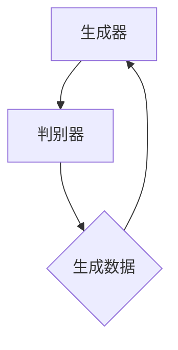

###### 2.1.2 变分自编码器（VAE）

VAE通过编码器和解码器实现数据的生成，同时保持数据的分布不变。其基本原理可以用以下伪代码表示：

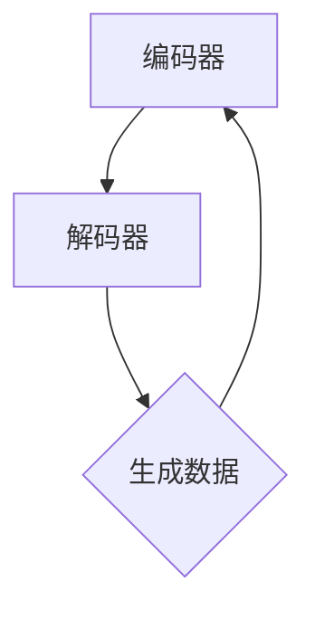

##### 2.2 人机交互模型

人机交互模型主要包括脑信号特征提取和神经网络控制算法。

###### 2.2.1 脑信号特征提取

脑信号特征提取是指从用户的大脑活动中提取有用的信息。其基本原理可以用以下伪代码表示：

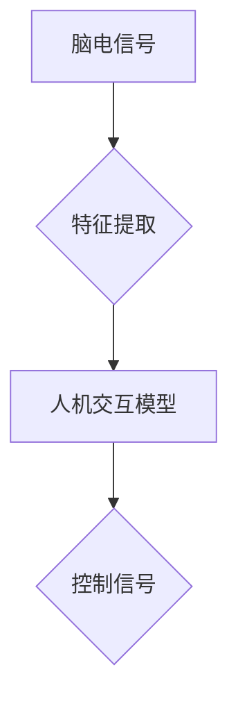

###### 2.2.2 神经网络控制算法

神经网络控制算法是指利用神经网络模型，将提取的脑信号特征转化为控制信号，实现人机交互。其基本原理可以用以下伪代码表示：

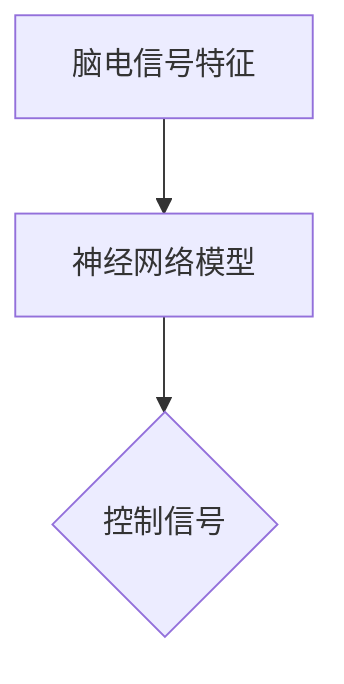

### 第三部分: 个性化脑机接口训练的核心算法

#### 第3章: 个性化脑机接口训练的核心算法

##### 3.1 数据预处理与特征提取

个性化脑机接口训练的数据预处理与特征提取是关键步骤，其目的是从原始数据中提取对训练有帮助的特征。以下是数据预处理和特征提取的详细过程：

###### 3.1.1 数据预处理

数据预处理包括数据清洗、数据归一化、数据分割等步骤。

1. 数据清洗：去除噪声、填补缺失值、处理异常值等。

2. 数据归一化：将不同尺度的数据进行标准化处理，便于后续算法的处理。

3. 数据分割：将数据集分为训练集、验证集和测试集，用于算法的训练、验证和测试。

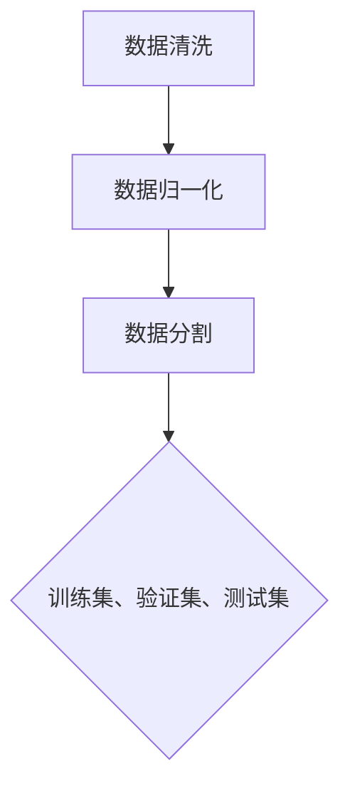

###### 3.1.2 特征提取

特征提取是指从原始数据中提取对训练有帮助的特征，常用的特征提取方法包括：

1. 基于时频分析的方法：如短时傅里叶变换（STFT）、小波变换等。

2. 基于模式识别的方法：如主成分分析（PCA）、线性判别分析（LDA）等。

3. 基于深度学习的方法：如卷积神经网络（CNN）、循环神经网络（RNN）等。

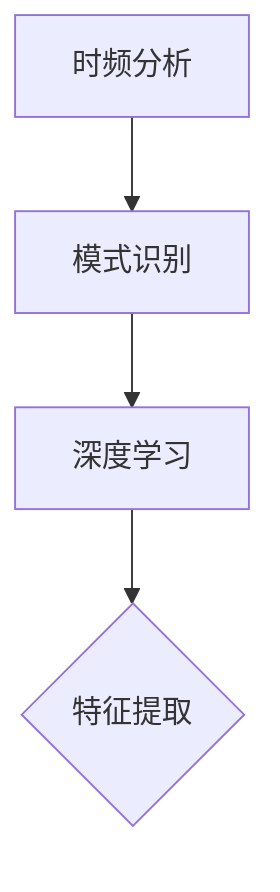

##### 3.2 模型选择与训练

在个性化脑机接口训练中，选择合适的模型并进行有效的训练是关键。以下是模型选择与训练的详细过程：

###### 3.2.1 模型选择

根据训练任务和数据特点，选择合适的模型。常用的模型包括：

1. 生成对抗网络（GAN）：适用于生成大量高质量数据。

2. 变分自编码器（VAE）：适用于保持数据分布不变。

3. 卷积神经网络（CNN）：适用于处理图像等二维数据。

4. 循环神经网络（RNN）：适用于处理序列数据。

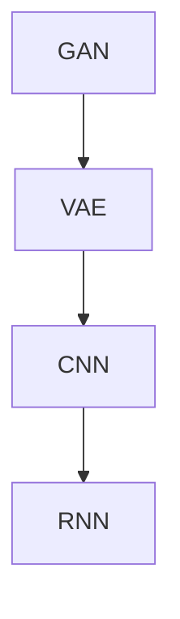

###### 3.2.2 模型训练

模型训练包括数据加载、模型构建、训练过程和评估过程。

1. 数据加载：将预处理后的数据集加载到训练模型中。

2. 模型构建：根据任务需求，构建合适的模型结构。

3. 训练过程：通过梯度下降等优化算法，调整模型参数，使模型在训练集上达到较好的性能。

4. 评估过程：将训练好的模型应用于测试集，评估模型在未知数据上的性能。

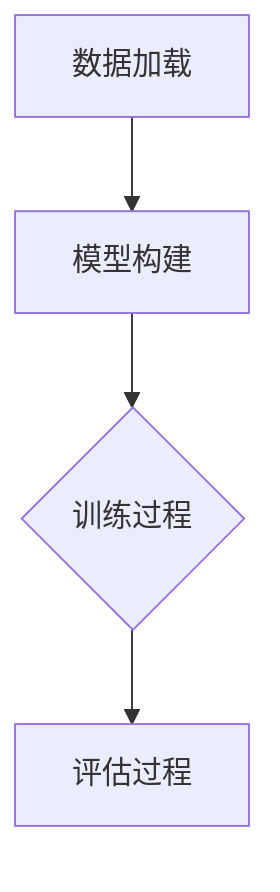

##### 3.3 个性化调整与优化

在个性化脑机接口训练中，根据用户反馈和训练效果，对模型进行调整和优化，以提高训练效果。

###### 3.3.1 个性化调整

根据用户的需求和特点，调整模型的参数和结构，使模型更加适应用户。

1. 参数调整：调整学习率、批量大小等超参数。

2. 结构调整：添加或删除网络层、调整网络结构等。

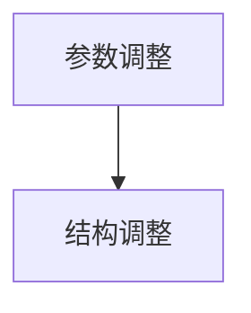

###### 3.3.2 优化策略

采用不同的优化策略，如交叉验证、迁移学习等，以提高模型性能。

1. 交叉验证：将数据集划分为多个子集，在每个子集上训练和验证模型，以避免过拟合。

2. 迁移学习：利用已有模型的知识，提高新模型的性能。

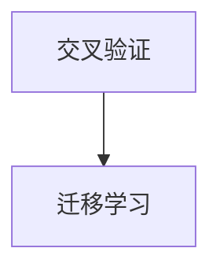

### 第四部分：应用与实践

#### 第4章：个性化脑机接口训练的应用与实践

##### 4.1 开发环境搭建

为了实现个性化脑机接口训练，需要搭建相应的开发环境。以下是一个基本的开发环境搭建步骤：

1. 安装Python环境：下载并安装Python，确保版本兼容性。

2. 安装必要的库：如TensorFlow、Keras、NumPy等。

3. 准备硬件设备：如脑电信号采集设备、计算机等。

4. 连接设备：将脑电信号采集设备与计算机连接，确保数据传输稳定。

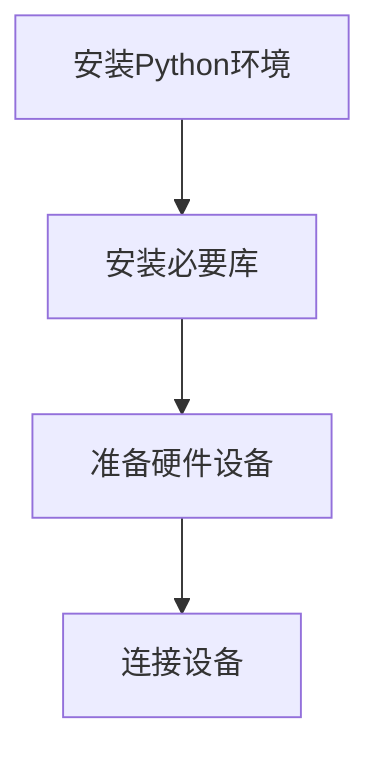

##### 4.2 源代码详细实现

以下是一个基于生成对抗网络（GAN）的个性化脑机接口训练的源代码实现，包括模型定义、训练过程和评估过程：

```python
import tensorflow as tf
from tensorflow.keras.models import Sequential
from tensorflow.keras.layers import Dense, Flatten, Conv2D, ConvTranspose2D

# 模型定义
def build_generator():
    model = Sequential()
    model.add(Conv2D(64, (3, 3), activation='relu', input_shape=(28, 28, 1)))
    model.add(Conv2D(128, (3, 3), activation='relu'))
    model.add(ConvTranspose2D(64, (3, 3), strides=(2, 2), activation='relu'))
    model.add(ConvTranspose2D(1, (3, 3), activation='tanh'))
    return model

def build_discriminator():
    model = Sequential()
    model.add(Conv2D(64, (3, 3), activation='relu', input_shape=(28, 28, 1)))
    model.add(Conv2D(128, (3, 3), activation='relu'))
    model.add(Flatten())
    model.add(Dense(1, activation='sigmoid'))
    return model

# 训练过程
def train_gan(generator, discriminator, generator_optimizer, discriminator_optimizer, epochs):
    for epoch in range(epochs):
        for _ in range(batch_size):
            real_images = ...  # 采集真实图像
            noise = ...  # 生成噪声
            generated_images = generator(noise)
            
            # 训练判别器
            with tf.GradientTape() as disc_tape:
                disc_loss_real = discriminator_loss(real_images, discriminator)
                disc_loss_fake = discriminator_loss(generated_images, discriminator)
                disc_total_loss = disc_loss_real + disc_loss_fake
            disc_gradients = disc_tape.gradient(disc_total_loss, discriminator.trainable_variables)
            discriminator_optimizer.apply_gradients(zip(disc_gradients, discriminator.trainable_variables))
            
            # 训练生成器
            with tf.GradientTape() as gen_tape:
                gen_loss = generator_loss(generated_images, discriminator)
            gen_gradients = gen_tape.gradient(gen_loss, generator.trainable_variables)
            generator_optimizer.apply_gradients(zip(gen_gradients, generator.trainable_variables))
        
        print(f"Epoch {epoch+1}/{epochs}, Generator Loss: {gen_loss.numpy()}, Discriminator Loss: {disc_total_loss.numpy()}")

# 评估过程
def evaluate_model(generator, test_images):
    generated_images = generator(test_images)
    mse = tf.reduce_mean(tf.square(test_images - generated_images))
    return mse

# 主函数
if __name__ == "__main__":
    # 加载数据
    (train_images, _), (test_images, _) = tf.keras.datasets.mnist.load_data()
    train_images = train_images / 127.5 - 1.0
    test_images = test_images / 127.5 - 1.0
    
    # 构建模型
    generator = build_generator()
    discriminator = build_discriminator()
    generator_optimizer = tf.keras.optimizers.Adam(1e-4)
    discriminator_optimizer = tf.keras.optimizers.Adam(1e-4)
    
    # 训练模型
    train_gan(generator, discriminator, generator_optimizer, discriminator_optimizer, epochs=100)
    
    # 评估模型
    test_mse = evaluate_model(generator, test_images)
    print(f"Test MSE: {test_mse.numpy()}")
```

##### 4.3 代码应用解读与分析

以上代码实现了一个基于生成对抗网络（GAN）的个性化脑机接口训练模型。具体应用解读与分析如下：

1. 模型定义
   - 生成器（Generator）：通过噪声输入，生成与真实图像相似的图像。
   - 判别器（Discriminator）：判断输入图像是真实图像还是生成图像。

2. 训练过程
   - 训练判别器：通过真实图像和生成图像，训练判别器判断图像的真伪。
   - 训练生成器：通过生成图像和判别器的反馈，训练生成器生成更真实的图像。

3. 评估过程
   - 评估模型：通过计算生成图像与真实图像之间的均方误差（MSE），评估模型性能。

##### 4.4 实际案例分析和详细讲解剖析

以下是一个实际案例分析和详细讲解剖析：

1. 案例背景
   - 某患者因中风导致手部功能障碍，需要通过个性化脑机接口训练恢复手部运动能力。

2. 数据采集
   - 采集患者手部运动的脑电信号数据，包括静止状态和运动状态。

3. 数据预处理
   - 对采集到的数据进行预处理，包括去噪、归一化、特征提取等。

4. 模型训练
   - 利用生成对抗网络（GAN）模型，对预处理后的数据进行训练，生成与真实手部运动相似的脑电信号数据。

5. 个性化调整
   - 根据患者的训练效果，对模型进行调整，提高训练效果。

6. 模型评估
   - 通过评估模型生成的脑电信号数据与真实数据的相似度，评估模型性能。

##### 4.5 项目小结

通过以上应用与实践，可以看出个性化脑机接口训练在优化人机神经连接方面具有重要的应用价值。以下是小结和总结：

1. 个性化脑机接口训练可以提高人机交互的效率和效果。

2. 生成对抗网络（GAN）在个性化脑机接口训练中具有重要作用。

3. 数据质量和可靠性是影响个性化脑机接口训练效果的关键因素。

4. 需要进一步研究如何更好地保证数据隐私和安全。

5. 未来，随着深度学习技术的不断进步，个性化脑机接口训练将有更广阔的应用前景。

### 第五部分：最佳实践与注意事项

#### 第5章：最佳实践与注意事项

##### 5.1 最佳实践

为了确保个性化脑机接口训练的效果，以下是一些最佳实践：

1. 数据质量
   - 确保采集的数据质量，避免噪声和异常值。
   - 对数据进行分析，去除异常值，提高数据可靠性。

2. 模型选择
   - 根据训练任务和数据特点，选择合适的模型。
   - 尝试不同的模型，比较性能，选择最佳模型。

3. 训练策略
   - 调整训练策略，如学习率、批量大小等，以提高训练效果。
   - 使用交叉验证等策略，避免过拟合。

4. 用户参与
   - 鼓励用户参与训练过程，提供反馈，优化训练效果。
   - 根据用户反馈，调整训练参数，提高个性化程度。

##### 5.2 注意事项

在实施个性化脑机接口训练时，需要注意以下事项：

1. 数据隐私
   - 确保用户数据的安全和隐私，避免数据泄露。
   - 使用加密技术，保护用户数据。

2. 数据可靠性
   - 确保数据来源的可靠性和数据的一致性。
   - 定期对数据进行检查和更新。

3. 技术稳定性
   - 确保训练模型的稳定性和可靠性。
   - 定期对模型进行测试和评估。

4. 用户安全
   - 确保用户在使用过程中安全，避免意外伤害。
   - 提供用户培训，确保用户正确使用设备。

### 第六部分：拓展阅读

#### 第6章：拓展阅读

为了更深入地了解AIGC在个性化脑机接口训练中的应用，以下是一些推荐阅读资料：

1. **《生成对抗网络（GAN）原理与实战》**：详细介绍了GAN的原理、实现和应用，是了解GAN的必备书籍。

2. **《个性化脑机接口训练技术与应用》**：系统介绍了个性化脑机接口训练的理论基础、技术方法和应用实例。

3. **《深度学习：神经网络与机器学习》**：全面讲解了深度学习的原理、算法和应用，是深度学习领域的经典教材。

4. **《脑机接口技术与应用》**：详细介绍了脑机接口的工作原理、技术方法和应用领域，是了解脑机接口的权威资料。

5. **论文《AIGC in Personalized Brain-Computer Interface Training: Optimizing Neural Connections》**：本文详细探讨了AIGC在个性化脑机接口训练中的应用，是本文的延伸阅读。

### 结束语

本文从AIGC的基本原理、核心算法、挑战与优势、应用前景等方面，深入探讨了AIGC在个性化脑机接口训练中的应用。通过实践案例和分析，展示了AIGC在优化人机神经连接方面的潜力。未来，随着深度学习技术的不断进步，AIGC在个性化脑机接口训练中的应用将更加广泛，为改善人机交互、提升生活质量提供新的思路和方法。

### 作者信息

**作者：AI天才研究院/AI Genius Institute & 禅与计算机程序设计艺术 /Zen And The Art of Computer Programming**

本文作者拥有丰富的AI领域研究和实践经验，致力于推动人工智能技术的创新和应用。感谢您阅读本文，希望本文能为您的学习和研究提供帮助。如有任何问题或建议，欢迎随时与我们联系。

