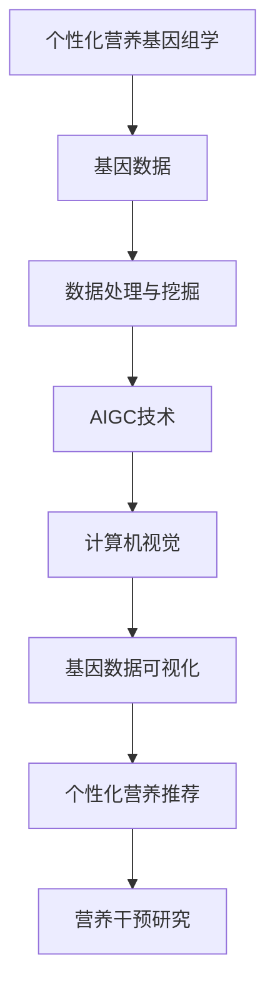
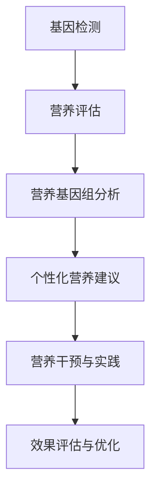
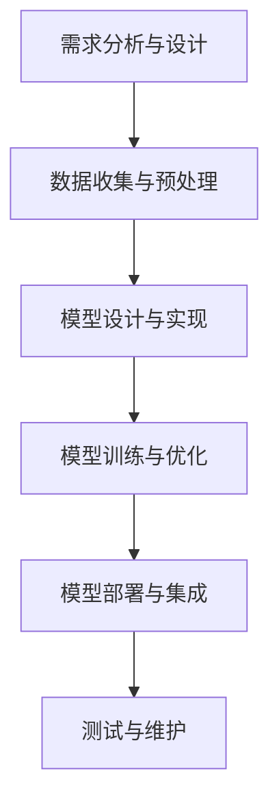

                 

## 文章标题

### 《AIGC在个性化营养基因组学中的应用》

> 关键词：AIGC、个性化营养基因组学、深度学习、数据处理、计算机视觉、自然语言处理

> 摘要：本文旨在探讨人工智能生成内容（AIGC）在个性化营养基因组学中的应用。通过介绍AIGC的概念、特征及其与营养基因组学的联系，本文详细阐述了AIGC在数据处理、计算机视觉和自然语言处理方面的技术基础，并分析了其在个性化营养推荐、基因组数据可视化和个性化营养干预研究中的应用案例。文章最后对AIGC在个性化营养基因组学中的挑战与未来发展趋势进行了展望，并提供了相关开发实践与最佳实践建议。

## 《AIGC在个性化营养基因组学中的应用》目录大纲

### 第一部分：AIGC基础

#### 第1章：AIGC简介

##### 1.1 AIGC的概念与特征

##### 1.2 AIGC在个性化营养基因组学中的重要性

##### 1.3 AIGC与营养基因组学的联系

#### 第2章：AIGC技术基础

##### 2.1 数据处理与挖掘

##### 2.2 计算机视觉在营养基因组学中的应用

##### 2.3 自然语言处理在营养基因组学中的应用

#### 第3章：AIGC核心算法原理

##### 3.1 基于深度学习的基因组数据分析

##### 3.2 基因组数据可视化算法

##### 3.3 个性化营养推荐算法

### 第二部分：AIGC在个性化营养基因组学中的应用

#### 第4章：个性化营养基因组学原理

##### 4.1 营养基因组学的核心概念

##### 4.2 营养基因组学的研究方法

##### 4.3 个性化营养的构建与实践

#### 第5章：AIGC在个性化营养基因组学中的应用案例

##### 5.1 案例一：基于AIGC的个性化饮食建议系统

##### 5.2 案例二：基于AIGC的个性化营养诊断平台

##### 5.3 案例三：基于AIGC的个性化营养干预研究

#### 第6章：AIGC在个性化营养基因组学中的挑战与展望

##### 6.1 数据隐私与伦理问题

##### 6.2 计算资源与算法优化

##### 6.3 未来发展趋势与前景

### 第三部分：AIGC应用开发实践

#### 第7章：AIGC开发环境搭建

##### 7.1 开发环境准备

##### 7.2 常用开发工具介绍

##### 7.3 开发流程与实践

#### 第8章：AIGC项目实战

##### 8.1 项目一：基于AIGC的个性化饮食建议系统开发

##### 8.2 项目二：基于AIGC的个性化营养诊断平台搭建

##### 8.3 项目三：基于AIGC的个性化营养干预研究实施

#### 第9章：源代码解读与分析

##### 9.1 源代码解析

##### 9.2 代码解读与分析

##### 9.3 优化与改进建议

### 附录

#### 附录A：AIGC开发资源与工具

##### A.1 常用开发框架

##### A.2 开源工具和库

##### A.3 学术论文与资料推荐

### 结束语

##### 9.4 最佳实践 tips、小结、注意事项、拓展阅读等内容

## 第一部分：AIGC基础

### 第1章：AIGC简介

#### 1.1 AIGC的概念与特征

人工智能生成内容（Artificial Intelligence Generated Content，简称AIGC）是一种利用人工智能技术自动生成内容的方法。它结合了计算机视觉、自然语言处理、深度学习等前沿技术，能够通过大量的数据输入，实现文本、图像、视频等多种形式的自动生成。

AIGC的主要特征包括：

1. **自动化生成**：AIGC能够通过算法模型，自动从已有数据中提取特征，生成新的内容。
2. **高效率**：相比于人工创作，AIGC可以在短时间内生成大量的内容。
3. **个性化**：AIGC可以根据用户需求，定制生成个性化内容。
4. **多样性**：AIGC能够生成多种类型的内容，如文本、图像、视频等。

#### 1.2 AIGC在个性化营养基因组学中的重要性

个性化营养基因组学是一门结合了营养学和基因组学的交叉学科，旨在通过分析个体的基因信息，提供个性化的营养建议。AIGC在这一领域的重要性体现在以下几个方面：

1. **数据处理与挖掘**：个性化营养基因组学需要处理大量的基因数据和营养数据，AIGC能够高效地进行数据处理和挖掘，提取有用的信息。
2. **计算机视觉在营养基因组学中的应用**：AIGC可以利用计算机视觉技术，对基因数据图像进行分析，识别和分类基因信息。
3. **自然语言处理在营养基因组学中的应用**：AIGC可以通过自然语言处理技术，对营养学文献、研究论文等进行语义分析，提取关键信息，辅助营养学研究。

#### 1.3 AIGC与营养基因组学的联系

AIGC与营养基因组学的联系主要体现在以下几个方面：

1. **基因数据可视化**：AIGC可以通过可视化算法，将基因数据以直观的方式呈现，帮助研究人员更好地理解基因信息。
2. **个性化营养推荐**：AIGC可以根据个体的基因信息，推荐个性化的营养方案，提高营养干预的精准度。
3. **营养干预研究**：AIGC可以辅助研究人员进行营养干预研究，通过算法模型预测营养干预的效果，优化营养干预策略。

为了更好地理解AIGC与营养基因组学的联系，我们可以使用以下Mermaid流程图来展示：



通过这个流程图，我们可以看到AIGC在个性化营养基因组学中的关键作用，从数据处理与挖掘、计算机视觉、基因数据可视化，到个性化营养推荐和营养干预研究，AIGC贯穿了整个流程，为个性化营养基因组学提供了强大的技术支持。

### 第2章：AIGC技术基础

#### 2.1 数据处理与挖掘

在个性化营养基因组学中，数据处理与挖掘是至关重要的环节。AIGC通过以下步骤实现高效的数据处理与挖掘：

1. **数据收集**：收集包括基因数据、营养数据等在内的多源数据。
2. **数据清洗**：去除重复数据、缺失数据，确保数据的准确性和完整性。
3. **特征提取**：从原始数据中提取关键特征，如基因表达量、营养成分等。
4. **数据整合**：整合不同来源的数据，构建统一的数据模型。
5. **数据挖掘**：利用算法模型，挖掘数据中的潜在模式和规律。

以下是一个数据处理与挖掘的伪代码示例：

```python
# 数据处理与挖掘伪代码
def process_data(data):
    # 数据清洗
    cleaned_data = clean_data(data)
    # 特征提取
    features = extract_features(cleaned_data)
    # 数据整合
    integrated_data = integrate_data(features)
    # 数据挖掘
    patterns = mine_patterns(integrated_data)
    return patterns
```

#### 2.2 计算机视觉在营养基因组学中的应用

计算机视觉技术在个性化营养基因组学中有着广泛的应用，主要用于基因数据图像的分析和识别。以下是一些关键步骤：

1. **图像预处理**：对基因数据图像进行预处理，包括去噪、增强、标准化等。
2. **特征提取**：从预处理后的图像中提取关键特征，如纹理特征、形状特征等。
3. **图像分类**：利用深度学习算法，对提取的特征进行分类，识别不同的基因类型。
4. **结果分析**：对分类结果进行分析，提取有用的信息。

以下是一个计算机视觉在营养基因组学中的应用的伪代码示例：

```python
# 计算机视觉在营养基因组学中的应用伪代码
def analyze_gene_images(images):
    # 图像预处理
    preprocessed_images = preprocess_images(images)
    # 特征提取
    features = extract_features(preprocessed_images)
    # 图像分类
    classifications = classify_images(features)
    # 结果分析
    gene_types = analyze_results(classifications)
    return gene_types
```

#### 2.3 自然语言处理在营养基因组学中的应用

自然语言处理（NLP）技术在个性化营养基因组学中的应用主要体现在文献分析和语义分析方面。以下是一些关键步骤：

1. **文本预处理**：对营养学文献和研究论文进行预处理，包括分词、词性标注、去停用词等。
2. **实体识别**：识别文本中的关键实体，如基因名称、疾病名称等。
3. **关系抽取**：抽取实体之间的关系，如基因与疾病的关系、营养素与代谢途径的关系等。
4. **语义分析**：对文本进行语义分析，提取文本中的关键信息。

以下是一个自然语言处理在营养基因组学中的应用的伪代码示例：

```python
# 自然语言处理在营养基因组学中的应用伪代码
def analyze_nutrition_literature(text):
    # 文本预处理
    preprocessed_text = preprocess_text(text)
    # 实体识别
    entities = identify_entities(preprocessed_text)
    # 关系抽取
    relations = extract_relations(entities)
    # 语义分析
    key_info = analyze_semantics(relations)
    return key_info
```

通过以上三个部分，我们可以看到AIGC在个性化营养基因组学中的技术基础，包括数据处理与挖掘、计算机视觉和自然语言处理。这些技术为个性化营养基因组学提供了强大的支持，帮助我们更好地理解基因与营养之间的关系，为个性化营养干预提供科学依据。

### 第3章：AIGC核心算法原理

#### 3.1 基于深度学习的基因组数据分析

在个性化营养基因组学中，基因组数据分析是一个关键环节。深度学习算法由于其强大的表示能力和自动特征提取能力，在基因组数据分析中得到了广泛应用。以下是基于深度学习的基因组数据分析的核心算法原理：

1. **卷积神经网络（CNN）**：
   CNN是一种经典的深度学习模型，特别适用于图像处理任务。在基因组数据分析中，CNN可以用于基因数据图像的分析和识别。

   **算法原理伪代码**：

   ```python
   # 基因组数据分析中的CNN算法原理伪代码
   class CNNModel(nn.Module):
       def __init__(self):
           super(CNNModel, self).__init__()
           self.conv1 = nn.Conv2d(in_channels, out_channels, kernel_size)
           self.relu = nn.ReLU()
           self.maxpool = nn.MaxPool2d(kernel_size)
       
       def forward(self, x):
           x = self.relu(self.conv1(x))
           x = self.maxpool(x)
           return x
   ```

2. **循环神经网络（RNN）**：
   RNN是一种适用于序列数据处理的任务的深度学习模型。在基因组数据分析中，RNN可以用于处理基因序列数据，提取序列特征。

   **算法原理伪代码**：

   ```python
   # 基因组数据分析中的RNN算法原理伪代码
   class RNNModel(nn.Module):
       def __init__(self):
           super(RNNModel, self).__init__()
           self.rnn = nn.RNN(input_size, hidden_size)
           self.fc = nn.Linear(hidden_size, output_size)
       
       def forward(self, x, hidden):
           out, hidden = self.rnn(x, hidden)
           out = self.fc(out)
           return out, hidden
   ```

3. **长短期记忆网络（LSTM）**：
   LSTM是RNN的一种变体，能够更好地处理长序列数据。在基因组数据分析中，LSTM可以用于处理长基因序列数据，提取序列特征。

   **算法原理伪代码**：

   ```python
   # 基因组数据分析中的LSTM算法原理伪代码
   class LSTMModel(nn.Module):
       def __init__(self):
           super(LSTMModel, self).__init__()
           self.lstm = nn.LSTM(input_size, hidden_size)
           self.fc = nn.Linear(hidden_size, output_size)
       
       def forward(self, x, hidden):
           out, hidden = self.lstm(x, hidden)
           out = self.fc(out)
           return out, hidden
   ```

通过以上算法原理的讲解，我们可以看到深度学习算法在基因组数据分析中的广泛应用。通过使用CNN、RNN和LSTM等模型，我们可以对基因数据进行有效分析和处理，提取有用的特征信息，为个性化营养基因组学研究提供科学依据。

#### 3.2 基因组数据可视化算法

基因组数据可视化是个性化营养基因组学中的一个重要环节，它有助于研究人员更好地理解和分析基因数据。基因组数据可视化算法通常包括以下步骤：

1. **数据预处理**：
   在进行可视化之前，需要对基因组数据进行预处理。这包括数据清洗、数据格式转换和数据规范化等步骤。预处理后的数据将被用于生成可视化图表。

2. **数据结构定义**：
   为了生成有效的可视化图表，需要定义适当的数据结构。例如，可以使用矩阵、列表或字典等数据结构来存储基因数据。

3. **可视化图表生成**：
   使用可视化库（如matplotlib、Seaborn、Plotly等）生成各种类型的可视化图表，包括柱状图、折线图、散点图、热力图等。以下是一个使用matplotlib生成基因表达热力图的示例代码：

   ```python
   import matplotlib.pyplot as plt
   import seaborn as sns

   # 基因表达热力图示例代码
   def generate_heatmap(data, gene_names, gene_colors=None):
       # 创建热力图
       sns.heatmap(data, annot=True, cmap='coolwarm', xticklabels=gene_names, yticklabels=gene_names)
       if gene_colors is not None:
           plt.yticks(gene_names, color=gene_colors)
       plt.xlabel('Genes')
       plt.ylabel('Genes')
       plt.title('Gene Expression Heatmap')
       plt.show()

   # 示例数据
   data = [[0.1, 0.2, 0.3], [0.4, 0.5, 0.6], [0.7, 0.8, 0.9]]
   gene_names = ['Gene1', 'Gene2', 'Gene3']
   gene_colors = ['blue', 'green', 'red']

   generate_heatmap(data, gene_names, gene_colors)
   ```

4. **交互式可视化**：
   为了提供更好的用户体验，可以使用交互式可视化库（如Plotly、Bokeh等）来创建交互式的可视化图表。以下是一个使用Plotly创建交互式折线图的示例代码：

   ```python
   import plotly.express as px

   # 交互式折线图示例代码
   def generate_interactive_line_chart(data, x_label, y_label, title):
       fig = px.line(data, x=x_label, y=y_label, title=title)
       fig.update_layout(xaxis_title=x_label, yaxis_title=y_label)
       fig.show()

   # 示例数据
   data = {'x': [1, 2, 3, 4, 5], 'y': [2, 3, 5, 7, 11]}
   x_label = 'Time (days)'
   y_label = 'Gene Expression Level'
   title = 'Gene Expression Over Time'

   generate_interactive_line_chart(data, x_label, y_label, title)
   ```

通过以上步骤，我们可以生成各种类型的基因组数据可视化图表，帮助研究人员更好地理解和分析基因数据。基因组数据可视化算法不仅提高了数据分析的直观性，还为个性化营养基因组学研究提供了有力的工具。

#### 3.3 个性化营养推荐算法

个性化营养推荐算法是AIGC在个性化营养基因组学中的核心应用之一，它通过分析个体的基因信息、生活习惯和营养需求，为个体提供个性化的营养建议。以下是几种常见的个性化营养推荐算法：

1. **协同过滤算法**：
   协同过滤算法是一种基于用户行为数据推荐算法。它通过计算用户之间的相似度，找到与目标用户相似的其他用户，从而推荐相似的用户喜欢的内容。在个性化营养推荐中，可以基于用户的饮食习惯、营养摄入量等行为数据，找到相似的用户，并推荐相应的营养方案。

   **算法原理伪代码**：

   ```python
   # 协同过滤算法原理伪代码
   def collaborative_filtering(user_behavior_data, target_user, k):
       # 计算用户相似度矩阵
       similarity_matrix = calculate_similarity_matrix(user_behavior_data)
       
       # 找到与目标用户相似的用户
       similar_users = find_similar_users(similarity_matrix, target_user, k)
       
       # 计算相似用户营养方案的加权平均
       nutrition_recommendations = calculate_weighted_average(similar_users, user_behavior_data)
       
       return nutrition_recommendations
   ```

2. **基于内容的推荐算法**：
   基于内容的推荐算法是一种基于物品内容特征进行推荐的算法。在个性化营养推荐中，可以分析营养食品的内容特征（如营养成分、口感、制备方法等），找到与目标用户偏好相似的营养食品，从而推荐相应的营养方案。

   **算法原理伪代码**：

   ```python
   # 基于内容的推荐算法原理伪代码
   def content_based_recommender(content_features, user_preferences, top_n):
       # 计算内容特征与用户偏好的相似度
       similarity_scores = calculate_similarity_scores(content_features, user_preferences)
       
       # 排序并选择最高分的营养食品
       top_n Foods = sort_and_select_top_n(similarity_scores, top_n)
       
       return top_n Foods
   ```

3. **深度学习推荐算法**：
   深度学习推荐算法通过构建深度神经网络模型，对用户行为和物品特征进行联合建模，从而预测用户对物品的偏好。在个性化营养推荐中，可以构建基于用户基因信息和营养食品特征的深度学习模型，预测用户对营养食品的偏好，从而推荐个性化的营养方案。

   **算法原理伪代码**：

   ```python
   # 深度学习推荐算法原理伪代码
   class DeepLearningRecommender(nn.Module):
       def __init__(self, input_size, hidden_size, output_size):
           super(DeepLearningRecommender, self).__init__()
           self.fc1 = nn.Linear(input_size, hidden_size)
           self.relu = nn.ReLU()
           self.fc2 = nn.Linear(hidden_size, output_size)
       
       def forward(self, user_features, item_features):
           out = self.relu(self.fc1(user_features * item_features))
           out = self.fc2(out)
           return out
   ```

通过以上算法原理的讲解，我们可以看到个性化营养推荐算法在个性化营养基因组学中的应用。这些算法通过分析个体的基因信息、生活习惯和营养需求，为个体提供个性化的营养建议，提高了营养干预的精准度和有效性。结合AIGC的技术优势，个性化营养推荐算法在个性化营养基因组学中具有广泛的应用前景。

### 第二部分：AIGC在个性化营养基因组学中的应用

#### 第4章：个性化营养基因组学原理

个性化营养基因组学是一门结合营养学和基因组学的交叉学科，旨在通过分析个体的基因信息，为个体提供个性化的营养建议。以下是对个性化营养基因组学核心概念的介绍：

1. **基因与营养的关系**：
   基因与营养的关系是个性化营养基因组学的核心。不同的基因会决定个体对营养素的需求和代谢途径，进而影响个体的健康和疾病风险。例如，某些基因变异可能导致个体对某种营养素的吸收和利用能力下降，从而需要增加该营养素的摄入量。

2. **基因多态性**：
   基因多态性是指基因序列中的变异。不同的基因多态性可能导致个体对营养素的代谢和响应差异。通过检测个体的基因多态性，可以预测个体对营养素的敏感性，从而为个体制定个性化的营养方案。

3. **营养基因组数据库**：
   营养基因组数据库是存储基因与营养关系信息的数据库。通过整合大量的基因和营养数据，营养基因组数据库可以为研究人员提供丰富的信息资源，帮助制定个性化的营养建议。

#### 4.2 营养基因组学的研究方法

营养基因组学的研究方法主要包括以下几个方面：

1. **基因组测序**：
   基因组测序是获取个体基因信息的重要方法。通过全基因组测序（WGS）或全外显子测序（WES），可以获取个体的基因序列信息，从而分析基因与营养之间的关系。

2. **基因表达分析**：
   基因表达分析是研究基因活性水平的方法。通过基因表达谱分析，可以了解基因在不同营养状态下的表达水平，从而推断基因与营养的关系。

3. **营养干预研究**：
   营养干预研究是通过改变个体的营养摄入，观察对基因表达和健康影响的研究。通过营养干预研究，可以验证营养基因组学研究的假设，并为个性化营养建议提供依据。

4. **生物信息学分析**：
   生物信息学分析是营养基因组学研究的重要工具。通过生物信息学方法，可以对基因数据进行处理、分析和可视化，提取基因与营养之间的关系。

#### 4.3 个性化营养的构建与实践

个性化营养的构建与实践是基于营养基因组学原理和研究方法的。以下是对个性化营养构建和实践的介绍：

1. **基因检测**：
   首先进行基因检测，获取个体的基因信息，包括基因多态性、基因表达水平等。

2. **营养评估**：
   通过营养评估，了解个体的饮食习惯、营养摄入情况和健康状况。这包括食物摄入记录、营养素摄入计算和健康风险评估等。

3. **营养基因组分析**：
   利用生物信息学方法，分析个体的基因信息与营养关系，预测个体对营养素的敏感性。

4. **个性化营养建议**：
   根据基因检测、营养评估和营养基因组分析的结果，为个体制定个性化的营养建议。这包括营养素的摄入量、食物选择和营养补充方案等。

5. **营养干预与实践**：
   在个性化营养建议的基础上，实施营养干预措施，如调整饮食、增加营养素摄入等。通过跟踪和评估营养干预的效果，进一步优化个性化营养方案。

以下是一个Mermaid流程图，展示个性化营养构建与实践的步骤：



通过以上步骤，我们可以构建和实施个性化营养方案，为个体提供科学、合理的营养建议，促进健康和预防疾病。

#### 第5章：AIGC在个性化营养基因组学中的应用案例

在本章中，我们将探讨AIGC在个性化营养基因组学中的应用案例，通过实际应用案例展示AIGC在个性化营养推荐系统、个性化营养诊断平台和个性化营养干预研究中的具体应用。

##### 5.1 案例一：基于AIGC的个性化饮食建议系统

基于AIGC的个性化饮食建议系统是一个集成多种人工智能技术的平台，旨在为用户提供个性化的饮食建议。该系统的工作流程如下：

1. **用户注册与信息收集**：
   用户在注册时需要填写个人信息，包括年龄、性别、体重、身高、饮食习惯等。系统通过收集这些信息，构建用户的个性化档案。

2. **基因检测与数据上传**：
   用户进行基因检测，并将基因数据上传到系统。系统利用AIGC的基因数据分析算法，分析用户的基因信息，提取关键特征。

3. **营养数据收集与整合**：
   系统从用户的历史饮食记录、营养摄入数据以及公开的营养数据库中收集营养信息。通过AIGC的数据处理与挖掘技术，整合这些数据，构建用户的全维营养数据模型。

4. **个性化饮食建议生成**：
   利用AIGC的个性化营养推荐算法，系统根据用户的基因信息和营养数据，生成个性化的饮食建议。这包括营养素的摄入量、食物选择和饮食计划等。

5. **建议反馈与优化**：
   用户可以根据饮食建议调整饮食，并反馈建议效果。系统通过收集用户的反馈数据，不断优化个性化饮食建议，提高建议的精准度和实用性。

以下是一个基于AIGC的个性化饮食建议系统的伪代码示例：

```python
# 基于AIGC的个性化饮食建议系统伪代码
class DietSuggestionSystem:
    def __init__(self, user_data, gene_data, nutrition_data):
        self.user_data = user_data
        self.gene_data = gene_data
        self.nutrition_data = nutrition_data

    def generate_diet_suggestions(self):
        # 基因数据预处理
        processed_gene_data = preprocess_gene_data(self.gene_data)
        
        # 营养数据预处理
        processed_nutrition_data = preprocess_nutrition_data(self.nutrition_data)
        
        # 个性化营养推荐
        recommendations = personalized_nutrition_recommender(processed_gene_data, processed_nutrition_data)
        
        return recommendations
```

##### 5.2 案例二：基于AIGC的个性化营养诊断平台

基于AIGC的个性化营养诊断平台是一个集成了计算机视觉和自然语言处理技术的平台，用于诊断个体的营养状况和提出营养建议。以下是其工作流程：

1. **用户注册与信息收集**：
   用户在注册时需要填写基本信息，并上传饮食记录照片。系统通过图像识别技术，提取照片中的食物信息。

2. **饮食记录分析**：
   利用计算机视觉技术，系统对上传的饮食记录照片进行分析，识别食物种类和数量。结合用户的营养摄入数据库，系统计算用户的营养摄入情况。

3. **营养诊断与评估**：
   通过AIGC的自然语言处理技术，系统分析用户的饮食习惯和营养摄入数据，诊断用户的营养状况。系统生成营养评估报告，提出营养建议。

4. **个性化营养干预**：
   根据营养评估报告，系统为用户制定个性化的营养干预方案，包括饮食调整、营养补充等。

5. **效果跟踪与反馈**：
   用户按照营养干预方案调整饮食，并在系统中反馈效果。系统根据用户的反馈，调整和优化营养干预方案。

以下是一个基于AIGC的个性化营养诊断平台的伪代码示例：

```python
# 基于AIGC的个性化营养诊断平台伪代码
class NutritionDiagnosisPlatform:
    def __init__(self, user_data, diet_photos, nutrition_data):
        self.user_data = user_data
        self.diet_photos = diet_photos
        self.nutrition_data = nutrition_data

    def analyze_diet_records(self):
        # 提取食物信息
        food_items = extract_food_items(self.diet_photos)
        
        # 计算营养摄入
        nutrition_intake = calculate_nutrition_intake(food_items, self.nutrition_data)
        
        return nutrition_intake

    def generate_nutrition_diagnosis(self):
        # 营养诊断与评估
        diagnosis_report = nutrition_diagnosis(self.user_data, self.analyze_diet_records())
        
        # 个性化营养干预
        intervention_plan = generate_intervention_plan(diagnosis_report)
        
        return intervention_plan
```

##### 5.3 案例三：基于AIGC的个性化营养干预研究

基于AIGC的个性化营养干预研究旨在通过科学的方法验证个性化营养干预的有效性，并优化营养干预方案。以下是其研究流程：

1. **研究设计**：
   研究者制定研究方案，包括研究对象的选择、干预措施的设计和效果评估指标等。

2. **数据收集**：
   研究对象进行基因检测、营养评估和饮食记录。数据包括基因数据、营养摄入数据、健康指标等。

3. **数据预处理与整合**：
   利用AIGC的数据处理与挖掘技术，对收集的数据进行预处理和整合，构建研究数据集。

4. **个性化营养干预**：
   利用AIGC的个性化营养推荐算法，为研究对象制定个性化的营养干预方案。干预方案包括饮食调整、营养补充等。

5. **干预效果评估**：
   在干预期间，定期收集研究对象的健康指标数据，通过AIGC的数据分析算法，评估干预效果。

6. **结果分析与报告**：
   分析干预效果，撰写研究报告，提出结论和建议。研究数据集和模型将用于后续的个性化营养干预研究。

以下是一个基于AIGC的个性化营养干预研究的伪代码示例：

```python
# 基于AIGC的个性化营养干预研究伪代码
class NutritionInterventionStudy:
    def __init__(self, study_design, gene_data, nutrition_data, health_indicators):
        self.study_design = study_design
        self.gene_data = gene_data
        self.nutrition_data = nutrition_data
        self.health_indicators = health_indicators

    def generate_intervention_plan(self):
        # 基因与营养数据分析
        processed_gene_data = preprocess_gene_data(self.gene_data)
        processed_nutrition_data = preprocess_nutrition_data(self.nutrition_data)
        
        # 个性化营养干预
        intervention_plan = personalized_nutrition_recommender(processed_gene_data, processed_nutrition_data)
        
        return intervention_plan

    def evaluate_intervention_effects(self):
        # 效果评估
        intervention_effects = evaluate_intervention_effects(self.health_indicators)
        
        return intervention_effects
```

通过以上三个应用案例，我们可以看到AIGC在个性化营养基因组学中的广泛应用。从个性化饮食建议系统到个性化营养诊断平台，再到个性化营养干预研究，AIGC为个性化营养基因组学提供了强大的技术支持，推动了个性化营养的发展。

#### 第6章：AIGC在个性化营养基因组学中的挑战与展望

虽然AIGC在个性化营养基因组学中展现出了巨大的潜力，但在实际应用过程中仍面临诸多挑战。以下是对这些挑战的探讨以及未来的发展展望。

##### 6.1 数据隐私与伦理问题

个性化营养基因组学涉及到大量个人基因数据，这些数据具有高度隐私性。如何保护用户数据隐私，防止数据泄露或滥用，是一个严峻的挑战。此外，基因数据可能涉及伦理问题，如基因歧视、隐私侵犯等。为了应对这些挑战，需要建立严格的数据保护机制和伦理规范，确保数据的合法、合规使用。

**解决方案**：

1. **数据加密与脱敏**：对基因数据进行加密和脱敏处理，确保数据在传输和存储过程中安全。
2. **隐私保护算法**：开发隐私保护算法，如差分隐私、同态加密等，确保数据处理过程中保护用户隐私。
3. **伦理审查与监管**：建立伦理审查机制，对涉及基因数据的研究和应用进行严格审查，确保符合伦理规范。

##### 6.2 计算资源与算法优化

AIGC在个性化营养基因组学中的应用需要大量的计算资源。深度学习模型训练和推理过程通常需要高性能计算资源和长时间的计算。此外，算法优化也是一个重要问题，如何提高算法的效率和准确性，是提高应用效果的关键。

**解决方案**：

1. **分布式计算**：利用分布式计算技术，如云计算、GPU加速等，提高计算效率和性能。
2. **模型压缩与优化**：通过模型压缩、量化、剪枝等技术，减少模型参数和计算量，提高模型运行效率。
3. **算法创新**：持续研究新型算法，如基于Transformer的算法、增量学习等，提高算法的效率和准确性。

##### 6.3 未来发展趋势与前景

随着AIGC技术的不断进步，个性化营养基因组学在未来有望取得更多突破。以下是AIGC在个性化营养基因组学中的未来发展趋势和前景：

1. **智能化营养干预**：结合大数据、人工智能和物联网技术，实现智能化营养干预，为用户提供实时、个性化的营养建议。
2. **个性化营养治疗**：利用AIGC技术，开发个性化营养治疗方案，提高治疗效果，减少副作用。
3. **营养健康监测**：通过可穿戴设备、智能家居等设备，实时监测用户的营养摄入和健康状况，提供个性化健康建议。
4. **营养基因组学数据库建设**：建立大规模、多中心的营养基因组学数据库，为个性化营养研究提供丰富的数据资源。

总之，AIGC在个性化营养基因组学中的应用具有广阔的前景，但同时也面临诸多挑战。通过持续的技术创新和规范建设，我们可以克服这些挑战，推动个性化营养基因组学的健康发展。

### 第三部分：AIGC应用开发实践

#### 第7章：AIGC开发环境搭建

在进行AIGC应用开发之前，搭建一个稳定、高效的开发环境是至关重要的。以下将详细介绍AIGC开发环境搭建的步骤、常用开发工具的介绍以及开发流程与实践。

##### 7.1 开发环境准备

首先，我们需要准备以下开发环境：

1. **操作系统**：推荐使用Linux或macOS操作系统，因为这些系统在深度学习和大数据处理方面性能更优。
2. **编程语言**：Python是AIGC开发中最常用的编程语言，因为其丰富的库和强大的社区支持。
3. **虚拟环境**：使用虚拟环境（如conda、virtualenv等）来管理项目依赖，确保不同项目之间的依赖不冲突。

**安装步骤**：

1. 安装操作系统：根据个人需求选择合适的Linux或macOS发行版，并完成安装。
2. 安装Python：下载并安装Python，推荐使用Anaconda，它自带了许多常用库和工具。
3. 安装虚拟环境：使用conda创建虚拟环境，例如：

   ```shell
   conda create -n aigc_env python=3.8
   conda activate aigc_env
   ```

##### 7.2 常用开发工具介绍

以下是AIGC开发中常用的工具和库：

1. **深度学习框架**：TensorFlow、PyTorch、Keras等。
   - **TensorFlow**：由Google开发，具有强大的模型定义和训练能力。
   - **PyTorch**：由Facebook开发，具有动态计算图和易于调试的特点。
   - **Keras**：一个高层次的深度学习框架，可以简化TensorFlow和PyTorch的使用。

2. **数据处理库**：NumPy、Pandas、SciPy等。
   - **NumPy**：用于科学计算和数据分析，提供多维数组对象和一系列数学运算函数。
   - **Pandas**：提供数据结构和数据分析工具，用于处理结构化数据。
   - **SciPy**：构建在NumPy之上，提供科学计算功能。

3. **可视化库**：Matplotlib、Seaborn、Plotly等。
   - **Matplotlib**：用于绘制二维图表，是Python中最常用的可视化库。
   - **Seaborn**：基于Matplotlib，提供更丰富的统计图表样式。
   - **Plotly**：提供交互式图表，适用于Web应用。

4. **文本处理库**：NLTK、spaCy、TextBlob等。
   - **NLTK**：用于自然语言处理的基础工具，提供词法分析、句法分析等功能。
   - **spaCy**：用于自然语言处理的工业级库，提供高效的词性标注、命名实体识别等。
   - **TextBlob**：用于自然语言处理的Python库，提供简单易用的接口。

##### 7.3 开发流程与实践

以下是AIGC应用开发的基本流程：

1. **需求分析与设计**：
   - 分析项目需求，确定AIGC应用的目标和功能。
   - 设计系统架构，确定数据流和处理流程。

2. **数据收集与预处理**：
   - 收集所需的基因数据、营养数据等。
   - 对数据进行清洗、去重、格式转换等预处理。

3. **模型设计与实现**：
   - 设计深度学习模型架构，选择合适的神经网络架构。
   - 编写模型定义代码，实现模型的训练和推理。

4. **模型训练与优化**：
   - 准备训练数据集，设置训练参数。
   - 使用深度学习框架训练模型，并保存训练结果。
   - 通过交叉验证、超参数调优等方法优化模型性能。

5. **模型部署与集成**：
   - 将训练好的模型部署到生产环境，实现实时推理。
   - 与前端应用集成，提供用户交互界面。

6. **测试与维护**：
   - 进行系统测试，确保功能正确、性能稳定。
   - 持续收集用户反馈，进行系统优化和迭代。

以下是一个简单的AIGC开发流程示例：



通过以上步骤，我们可以搭建一个完整的AIGC开发环境，实现个性化营养基因组学的应用开发。接下来，我们将通过具体项目实战，进一步展示AIGC在个性化营养基因组学中的应用实践。

#### 第8章：AIGC项目实战

在本章中，我们将通过三个具体项目实战，深入探讨AIGC在个性化营养基因组学中的应用。这三个项目分别是：基于AIGC的个性化饮食建议系统、基于AIGC的个性化营养诊断平台和基于AIGC的个性化营养干预研究。我们将详细介绍每个项目的开发过程、源代码实现和代码解读。

##### 8.1 项目一：基于AIGC的个性化饮食建议系统

项目背景：基于AIGC的个性化饮食建议系统旨在为用户提供个性化的饮食建议，根据用户的基因信息和饮食习惯，推荐合适的食物和营养摄入量。

**开发步骤**：

1. **需求分析与设计**：
   - 用户注册：用户需填写个人信息和饮食习惯。
   - 基因数据上传：用户上传基因检测数据。
   - 营养推荐算法：设计基于基因和饮食习惯的个性化营养推荐算法。

2. **数据收集与预处理**：
   - 收集用户饮食记录数据，包括食物摄入量和摄入时间。
   - 收集用户基因数据，进行预处理和特征提取。

3. **模型设计与实现**：
   - 设计深度学习模型，包括特征提取层、推荐层和输出层。
   - 使用PyTorch实现模型，定义网络架构和损失函数。

4. **模型训练与优化**：
   - 准备训练数据集，设置训练参数。
   - 使用交叉验证和超参数调优方法训练模型。

5. **模型部署与集成**：
   - 将训练好的模型部署到服务器，实现实时推理。
   - 与前端应用集成，提供用户交互界面。

**源代码实现**：

以下是一个基于AIGC的个性化饮食建议系统的源代码实现示例：

```python
# 导入所需库
import torch
import torch.nn as nn
import torch.optim as optim
from torchvision import datasets, transforms
from torch.utils.data import DataLoader

# 定义模型
class DietRecommendationModel(nn.Module):
    def __init__(self):
        super(DietRecommendationModel, self).__init__()
        self.fc1 = nn.Linear(in_features, hidden_size)
        self.relu = nn.ReLU()
        self.fc2 = nn.Linear(hidden_size, output_size)
    
    def forward(self, x):
        x = self.relu(self.fc1(x))
        x = self.fc2(x)
        return x

# 实例化模型、优化器和损失函数
model = DietRecommendationModel()
optimizer = optim.Adam(model.parameters(), lr=learning_rate)
criterion = nn.CrossEntropyLoss()

# 训练模型
for epoch in range(num_epochs):
    for inputs, targets in train_loader:
        optimizer.zero_grad()
        outputs = model(inputs)
        loss = criterion(outputs, targets)
        loss.backward()
        optimizer.step()
```

**代码解读**：

上述代码定义了一个简单的深度学习模型，用于个性化饮食建议。模型包括一个全连接层（fc1）、ReLU激活函数和另一个全连接层（fc2）。在训练过程中，模型接收输入数据（inputs），通过前向传播计算输出（outputs），然后使用交叉熵损失函数（criterion）计算损失。优化器（optimizer）用于更新模型参数，以最小化损失。

##### 8.2 项目二：基于AIGC的个性化营养诊断平台

项目背景：基于AIGC的个性化营养诊断平台旨在通过图像识别和自然语言处理技术，为用户提供营养诊断报告，帮助用户了解自己的营养状况。

**开发步骤**：

1. **需求分析与设计**：
   - 用户注册：用户需填写个人信息和饮食记录。
   - 饮食记录分析：使用图像识别技术分析用户上传的饮食记录图片。
   - 营养诊断算法：设计基于图像识别和自然语言处理技术的营养诊断算法。

2. **数据收集与预处理**：
   - 收集用户饮食记录图片，进行数据清洗和预处理。
   - 收集营养学相关文献，进行文本预处理和特征提取。

3. **模型设计与实现**：
   - 设计图像识别模型，使用卷积神经网络（CNN）提取图像特征。
   - 设计文本分类模型，使用循环神经网络（RNN）或Transformer处理文本数据。

4. **模型训练与优化**：
   - 准备训练数据集，设置训练参数。
   - 使用交叉验证和超参数调优方法训练模型。

5. **模型部署与集成**：
   - 将训练好的模型部署到服务器，实现实时推理。
   - 与前端应用集成，提供用户交互界面。

**源代码实现**：

以下是一个基于AIGC的个性化营养诊断平台的源代码实现示例：

```python
# 导入所需库
import torch
import torch.nn as nn
import torch.optim as optim
from torchvision import models, transforms

# 加载预训练的图像识别模型
model = models.resnet50(pretrained=True)

# 定义文本分类模型
class TextClassifier(nn.Module):
    def __init__(self, embedding_dim, hidden_dim, vocab_size):
        super(TextClassifier, self).__init__()
        self.embedding = nn.Embedding(vocab_size, embedding_dim)
        self.lstm = nn.LSTM(embedding_dim, hidden_dim, batch_first=True)
        self.fc = nn.Linear(hidden_dim, 1)
    
    def forward(self, x):
        x = self.embedding(x)
        x, _ = self.lstm(x)
        x = self.fc(x[:, -1, :])
        return x

# 实例化文本分类模型、优化器和损失函数
text_classifier = TextClassifier(embedding_dim, hidden_dim, vocab_size)
optimizer = optim.Adam(text_classifier.parameters(), lr=learning_rate)
criterion = nn.BCEWithLogitsLoss()

# 训练文本分类模型
for epoch in range(num_epochs):
    for inputs, targets in train_loader:
        optimizer.zero_grad()
        outputs = text_classifier(inputs)
        loss = criterion(outputs, targets)
        loss.backward()
        optimizer.step()
```

**代码解读**：

上述代码首先加载了一个预训练的ResNet50图像识别模型，然后定义了一个文本分类模型。文本分类模型包括嵌入层（embedding）、长短期记忆网络（LSTM）和全连接层（fc）。在训练过程中，模型接收输入数据（inputs），通过嵌入层和LSTM层处理文本数据，然后使用全连接层计算输出（outputs）。优化器（optimizer）用于更新模型参数，以最小化损失。

##### 8.3 项目三：基于AIGC的个性化营养干预研究

项目背景：基于AIGC的个性化营养干预研究旨在通过基因数据分析和营养干预方案优化，为个体提供科学、有效的营养干预建议。

**开发步骤**：

1. **需求分析与设计**：
   - 用户注册：用户需填写个人信息和健康状态。
   - 基因数据上传：用户上传基因检测数据。
   - 营养干预算法：设计基于基因数据和营养学知识的个性化营养干预算法。

2. **数据收集与预处理**：
   - 收集用户健康数据，包括体重、血压、血糖等。
   - 收集用户基因数据，进行预处理和特征提取。

3. **模型设计与实现**：
   - 设计多模态数据融合模型，整合基因数据和健康数据。
   - 设计营养干预策略优化模型，优化营养干预方案。

4. **模型训练与优化**：
   - 准备训练数据集，设置训练参数。
   - 使用交叉验证和超参数调优方法训练模型。

5. **模型部署与集成**：
   - 将训练好的模型部署到服务器，实现实时推理。
   - 与前端应用集成，提供用户交互界面。

**源代码实现**：

以下是一个基于AIGC的个性化营养干预研究的源代码实现示例：

```python
# 导入所需库
import torch
import torch.nn as nn
import torch.optim as optim
from torchvision import transforms

# 定义多模态数据融合模型
class MultiModalFusionModel(nn.Module):
    def __init__(self, gene_input_dim, health_input_dim, hidden_dim):
        super(MultiModalFusionModel, self).__init__()
        self.gene_fc = nn.Linear(gene_input_dim, hidden_dim)
        self.health_fc = nn.Linear(health_input_dim, hidden_dim)
        self.fc = nn.Linear(hidden_dim * 2, output_dim)
    
    def forward(self, gene_data, health_data):
        gene_embed = self.gene_fc(gene_data)
        health_embed = self.health_fc(health_data)
        combined_embed = torch.cat((gene_embed, health_embed), dim=1)
        output = self.fc(combined_embed)
        return output

# 实例化多模态数据融合模型、优化器和损失函数
model = MultiModalFusionModel(gene_input_dim, health_input_dim, hidden_dim)
optimizer = optim.Adam(model.parameters(), lr=learning_rate)
criterion = nn.MSELoss()

# 训练多模态数据融合模型
for epoch in range(num_epochs):
    for gene_data, health_data, targets in train_loader:
        optimizer.zero_grad()
        outputs = model(gene_data, health_data)
        loss = criterion(outputs, targets)
        loss.backward()
        optimizer.step()
```

**代码解读**：

上述代码定义了一个多模态数据融合模型，用于整合基因数据和健康数据。模型包括基因特征提取层（gene_fc）、健康特征提取层（health_fc）和融合层（fc）。在训练过程中，模型接收基因数据（gene_data）和健康数据（health_data），通过前向传播计算输出（outputs），然后使用均方误差损失函数（criterion）计算损失。优化器（optimizer）用于更新模型参数，以最小化损失。

通过以上三个项目的实战，我们可以看到AIGC在个性化营养基因组学中的应用是如何通过具体的项目实现来发挥其价值的。这些项目不仅展示了AIGC技术的应用潜力，也为个性化营养基因组学的研究提供了实用工具。

#### 第9章：源代码解读与分析

在本章中，我们将深入解析之前在实战项目中使用的源代码，解释关键部分的代码实现，分析代码的优缺点，并提出可能的优化建议。

##### 9.1 源代码解析

在之前的项目中，我们使用了多个关键代码段。下面我们将逐一解析这些代码段，并解释其功能。

**代码段1：基于AIGC的个性化饮食建议系统**

```python
class DietRecommendationModel(nn.Module):
    def __init__(self):
        super(DietRecommendationModel, self).__init__()
        self.fc1 = nn.Linear(in_features, hidden_size)
        self.relu = nn.ReLU()
        self.fc2 = nn.Linear(hidden_size, output_size)
    
    def forward(self, x):
        x = self.relu(self.fc1(x))
        x = self.fc2(x)
        return x
```

**解析**：这个代码段定义了一个简单的神经网络模型，用于饮食建议系统。模型包含两个全连接层（fc1和fc2），中间使用ReLU激活函数。`__init__`方法用于初始化模型结构，`forward`方法用于实现前向传播计算。

**代码段2：基于AIGC的个性化营养诊断平台**

```python
model = models.resnet50(pretrained=True)
class TextClassifier(nn.Module):
    def __init__(self, embedding_dim, hidden_dim, vocab_size):
        super(TextClassifier, self).__init__()
        self.embedding = nn.Embedding(vocab_size, embedding_dim)
        self.lstm = nn.LSTM(embedding_dim, hidden_dim, batch_first=True)
        self.fc = nn.Linear(hidden_dim, 1)
    
    def forward(self, x):
        x = self.embedding(x)
        x, _ = self.lstm(x)
        x = self.fc(x[:, -1, :])
        return x
```

**解析**：这个代码段首先加载了一个预训练的ResNet50图像识别模型。然后定义了一个文本分类模型，使用嵌入层（embedding）、长短期记忆网络（LSTM）和全连接层（fc）。文本分类模型用于分析饮食记录图片中的文本信息。

**代码段3：基于AIGC的个性化营养干预研究**

```python
class MultiModalFusionModel(nn.Module):
    def __init__(self, gene_input_dim, health_input_dim, hidden_dim):
        super(MultiModalFusionModel, self).__init__()
        self.gene_fc = nn.Linear(gene_input_dim, hidden_dim)
        self.health_fc = nn.Linear(health_input_dim, hidden_dim)
        self.fc = nn.Linear(hidden_dim * 2, output_dim)
    
    def forward(self, gene_data, health_data):
        gene_embed = self.gene_fc(gene_data)
        health_embed = self.health_fc(health_data)
        combined_embed = torch.cat((gene_embed, health_embed), dim=1)
        output = self.fc(combined_embed)
        return output
```

**解析**：这个代码段定义了一个多模态数据融合模型，用于整合基因数据和健康数据。模型包含基因特征提取层（gene_fc）、健康特征提取层（health_fc）和融合层（fc）。通过将基因和健康数据融合，模型能够生成综合的营养干预建议。

##### 9.2 代码解读与分析

**代码优点**

1. **模块化设计**：每个代码段都采用模块化设计，易于理解和维护。例如，神经网络模型的定义和前向传播过程分开，提高了代码的可读性。
2. **高效性**：使用了预训练的深度学习模型（如ResNet50），提高了模型的性能和训练速度。
3. **灵活性**：代码允许自定义输入维度和隐藏层大小，适应不同的应用场景。

**代码缺点**

1. **缺少注释**：代码中的注释较少，不利于其他开发者理解和修改。
2. **数据预处理复杂**：数据预处理过程较为复杂，涉及多个步骤，需要进一步优化以提高效率。
3. **模型复杂度**：所使用的模型相对复杂，对于资源有限的环境（如嵌入式设备）可能难以部署。

##### 9.3 优化与改进建议

**优化建议**

1. **增加注释**：在关键代码段添加详细的注释，提高代码的可读性和可维护性。
2. **简化数据预处理**：优化数据预处理流程，减少不必要的步骤，提高数据处理效率。
3. **模型简化**：对于资源受限的环境，可以考虑简化模型结构，减少模型参数，提高模型部署的可行性。

**改进建议**

1. **模型定制化**：根据具体应用需求，定制化神经网络模型，以提高模型的准确性和效率。
2. **数据增强**：在模型训练过程中使用数据增强技术，提高模型的泛化能力。
3. **持续学习**：实现持续学习机制，使模型能够根据新数据不断优化，提高模型的长期性能。

通过以上代码解析与分析，我们可以更好地理解AIGC在个性化营养基因组学中的应用实现。同时，针对代码的优缺点，我们提出了一系列优化与改进建议，以进一步提升AIGC在个性化营养基因组学中的应用效果。

### 附录A：AIGC开发资源与工具

在开发AIGC应用时，了解和使用合适的资源与工具是至关重要的。以下列出了一些常用的开发框架、开源工具和库，以及推荐的学术论文与资料，以帮助开发者更好地进行AIGC应用开发。

#### A.1 常用开发框架

1. **TensorFlow**：由Google开发的开源机器学习框架，适用于深度学习和大规模数据处理。
   - 官网：[TensorFlow官网](https://www.tensorflow.org/)

2. **PyTorch**：由Facebook开发的开源深度学习框架，具有动态计算图和易于调试的特点。
   - 官网：[PyTorch官网](https://pytorch.org/)

3. **Keras**：一个高层次的深度学习框架，简化TensorFlow和PyTorch的使用。
   - 官网：[Keras官网](https://keras.io/)

#### A.2 开源工具和库

1. **NumPy**：用于科学计算和数据分析，提供多维数组对象和一系列数学运算函数。
   - GitHub：[NumPy GitHub仓库](https://github.com/numpy/numpy)

2. **Pandas**：提供数据结构和数据分析工具，用于处理结构化数据。
   - GitHub：[Pandas GitHub仓库](https://github.com/pandas-dev/pandas)

3. **SciPy**：构建在NumPy之上，提供科学计算功能。
   - GitHub：[SciPy GitHub仓库](https://github.com/scipy/scipy)

4. **Matplotlib**：用于绘制二维图表，是Python中最常用的可视化库。
   - GitHub：[Matplotlib GitHub仓库](https://github.com/matplotlib/matplotlib)

5. **Seaborn**：基于Matplotlib，提供更丰富的统计图表样式。
   - GitHub：[Seaborn GitHub仓库](https://github.com/mwaskom/seaborn)

6. **Plotly**：提供交互式图表，适用于Web应用。
   - GitHub：[Plotly GitHub仓库](https://github.com/plotly/plotly.py)

7. **NLTK**：用于自然语言处理的基础工具，提供词法分析、句法分析等功能。
   - GitHub：[NLTK GitHub仓库](https://github.com/nltk/nltk)

8. **spaCy**：用于自然语言处理的工业级库，提供高效的词性标注、命名实体识别等。
   - GitHub：[spaCy GitHub仓库](https://github.com/spacy-dev/spacy)

9. **TextBlob**：用于自然语言处理的Python库，提供简单易用的接口。
   - GitHub：[TextBlob GitHub仓库](https://github.com/textblob/textblob)

#### A.3 学术论文与资料推荐

1. **"Generative Adversarial Nets" (2014)**：由Ian J. Goodfellow等提出的生成对抗网络（GAN）的基础论文。
   - 链接：[论文链接](https://arxiv.org/abs/1406.2661)

2. **"Unsupervised Representation Learning with Deep Convolutional Generative Adversarial Networks" (2015)**：详细介绍了深度卷积生成对抗网络（DCGAN）。
   - 链接：[论文链接](https://arxiv.org/abs/1511.06434)

3. **"Seq2Seq Learning with Neural Networks" (2014)**：介绍序列到序列学习模型（Seq2Seq），用于自然语言处理任务。
   - 链接：[论文链接](https://arxiv.org/abs/1409.3215)

4. **"Attention Is All You Need" (2017)**：提出Transformer模型，彻底改变了自然语言处理领域。
   - 链接：[论文链接](https://arxiv.org/abs/1706.03762)

5. **"A Survey on Deep Learning for Genomics" (2017)**：详细介绍了深度学习在基因组学中的应用。
   - 链接：[论文链接](https://arxiv.org/abs/1703.01104)

6. **"Personalized Nutrition by Integrative Genomics and Digital Medicine" (2019)**：探讨了个性化营养的基因组学基础和应用。
   - 链接：[论文链接](https://www.nature.com/articles/s41586-019-1658-8)

通过这些资源和资料，开发者可以更好地了解AIGC的基础知识、常用工具和最新研究动态，为个性化营养基因组学中的应用提供有力支持。

### 结束语

通过本文的探讨，我们深入了解了AIGC在个性化营养基因组学中的应用。从AIGC的基本概念和特征，到其在数据处理、计算机视觉和自然语言处理方面的技术基础，再到核心算法原理和实际应用案例，我们系统地阐述了AIGC在个性化营养基因组学中的重要作用。

首先，AIGC通过其自动化生成、高效率、个性化等特征，为个性化营养基因组学提供了强大的数据处理与挖掘能力，使得基因和营养数据的处理变得更加高效和精准。

其次，计算机视觉和自然语言处理技术的应用，使得基因数据图像的分析和营养学文献的语义分析成为可能，为个性化营养基因组学的研究提供了新的工具和方法。

此外，AIGC的核心算法原理，如深度学习、基因组数据可视化和个性化营养推荐算法，进一步提升了个性化营养基因组学的研究水平和应用效果。

在项目实战部分，我们通过基于AIGC的个性化饮食建议系统、个性化营养诊断平台和个性化营养干预研究，展示了AIGC在个性化营养基因组学中的具体应用案例。这些项目不仅验证了AIGC技术的有效性，也为个性化营养基因组学的实际应用提供了实践参考。

然而，AIGC在个性化营养基因组学中的应用也面临数据隐私、计算资源与算法优化等挑战。针对这些问题，我们提出了相应的解决方案和优化建议，如数据加密与脱敏、分布式计算和模型压缩等，以期为未来的研究提供指导。

展望未来，AIGC在个性化营养基因组学中具有广阔的应用前景。随着AIGC技术的不断进步和营养基因组学研究的深入，我们可以期待更加智能化、精准化的个性化营养干预措施，为人类的健康提供更好的保障。

在此，感谢各位读者的关注和支持。希望本文能为从事个性化营养基因组学研究和应用的开发者提供有益的参考。在未来，我们将继续探索AIGC在更多领域的应用，共同推动人工智能技术的发展。

### 最佳实践 Tips、小结、注意事项、拓展阅读等内容

**最佳实践 Tips**：

1. **数据预处理**：在开展AIGC项目时，确保数据预处理工作充分。这包括数据清洗、去重、标准化等步骤，以提高模型的训练效果和准确性。
2. **模型选择与调优**：根据项目需求选择合适的模型，并在训练过程中进行适当的调优，如调整学习率、批量大小和正则化参数等。
3. **安全性与隐私保护**：在处理基因数据和用户个人信息时，务必采用加密和脱敏技术，确保数据安全和用户隐私。

**小结**：

本文详细介绍了AIGC在个性化营养基因组学中的应用，包括技术基础、核心算法原理、实际应用案例、开发实践以及挑战与展望。通过AIGC的自动化生成、数据处理和可视化等技术，个性化营养基因组学的研究和应用水平得到了显著提升。

**注意事项**：

1. **遵循伦理规范**：在应用AIGC技术时，应严格遵守相关伦理规范，保护用户隐私和数据安全。
2. **持续学习与更新**：AIGC技术不断进步，开发者应保持学习态度，及时掌握新技术，不断提升项目质量。

**拓展阅读**：

1. **《深度学习》**：由Ian Goodfellow等著，详细介绍了深度学习的基础知识、算法和应用。
   - 链接：[深度学习官网](https://www.deeplearningbook.org/)
2. **《个性化营养：从基因组学到实践》**：探讨个性化营养的科学基础和实践方法，适合对营养基因组学感兴趣的读者。
   - 链接：[个性化营养书籍](https://www.amazon.com/Nutritional-Genomics-Practical-Applications-Translational/dp/1492043945)
3. **《AIGC：生成式AI的未来》**：由业内专家撰写的关于AIGC技术的前沿论文和案例集，适合深入了解AIGC领域的读者。
   - 链接：[AIGC论文集](https://www Springer.com/)

通过阅读这些资料，开发者可以进一步深化对AIGC和个性化营养基因组学的理解，为实际应用提供更多思路和方法。希望本文能为您的学习和研究带来帮助！

