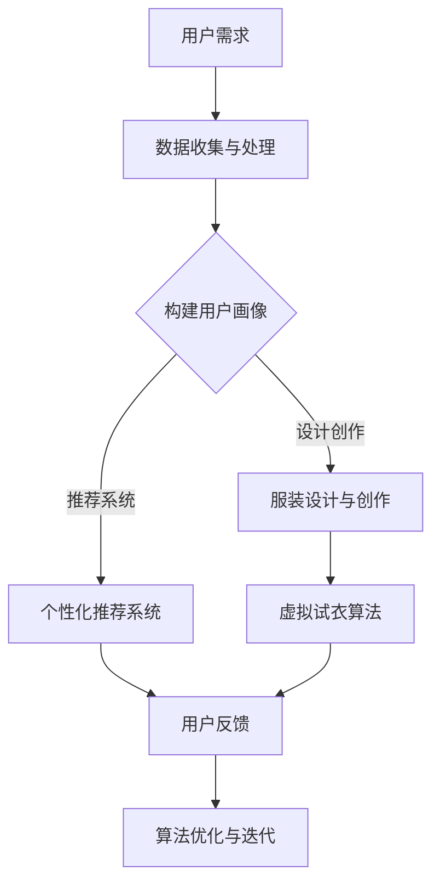
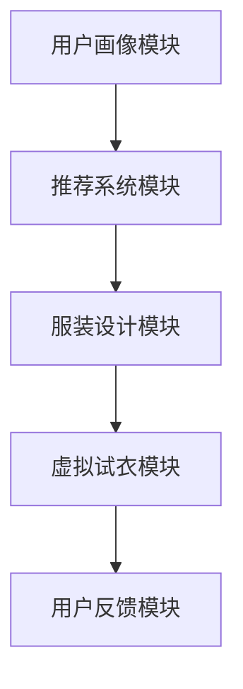

                 

### 文章标题

### AIGC在个性化虚拟试衣中的创新

> 关键词：AIGC、个性化虚拟试衣、深度学习、生成对抗网络（GAN）、计算机视觉、用户画像、服装设计与创作

> 摘要：本文深入探讨了AIGC（自适应智能生成计算）在个性化虚拟试衣中的应用与创新。通过阐述AIGC的基本概念与特点，以及个性化虚拟试衣的背景与需求，本文详细介绍了AIGC在个性化虚拟试衣中的技术基础和系统架构。随后，本文通过具体案例和实战项目，分析了AIGC在个性化虚拟试衣中的实际应用效果，并探讨了相关技术挑战与未来发展趋势。本文旨在为读者提供一个全面、深入的视角，了解AIGC在个性化虚拟试衣中的创新应用。

### 目录大纲

#### 第一部分: AIGC与个性化虚拟试衣概述

- **第1章: AIGC与个性化虚拟试衣简介**
  - 1.1 AIGC的概念与特点
  - 1.2 个性化虚拟试衣的背景与需求
  - 1.3 AIGC在个性化虚拟试衣中的应用潜力

- **第2章: AIGC核心技术基础**
  - 2.1 深度学习与生成模型
    - 2.1.1 深度学习的基本原理
    - 2.1.2 生成对抗网络（GAN）原理
    - 2.1.3 自编码器（Autoencoder）原理
  - 2.2 计算机视觉技术
    - 2.2.1 图像处理技术
    - 2.2.2 人体识别与跟踪技术
    - 2.2.3 服装识别与分类技术

- **第3章: 个性化虚拟试衣系统架构**
  - 3.1 系统总体设计
    - 3.1.1 系统架构图
    - 3.1.2 系统模块功能解析
  - 3.2 数据收集与处理
    - 3.2.1 数据收集策略
    - 3.2.2 数据预处理方法
  - 3.3 服装虚拟试穿算法
    - 3.3.1 虚拟试衣算法原理
    - 3.3.2 虚拟试衣效果优化

- **第4章: AIGC在个性化虚拟试衣中的应用**
  - 4.1 个性化推荐系统
    - 4.1.1 用户画像构建方法
    - 4.1.2 个性化推荐算法实现
  - 4.2 服装设计与创作
    - 4.2.1 服装设计灵感生成
    - 4.2.2 个性化服装设计实现

- **第5章: 项目实战**
  - 5.1 实战项目介绍
    - 5.1.1 项目背景
    - 5.1.2 项目目标
  - 5.2 开发环境与工具
    - 5.2.1 开发环境搭建
    - 5.2.2 开发工具与框架
  - 5.3 代码实现与解读
    - 5.3.1 数据收集与预处理
    - 5.3.2 虚拟试衣算法实现
    - 5.3.3 个性化推荐系统实现

- **第6章: AIGC在个性化虚拟试衣中的挑战与未来**
  - 6.1 技术挑战
    - 6.1.1 数据隐私与伦理问题
    - 6.1.2 算法公平性与透明性
  - 6.2 市场趋势
    - 6.2.1 个性化虚拟试衣市场现状
    - 6.2.2 未来发展趋势与机遇

- **第7章: 附录**
  - 7.1 常用工具与资源
    - 7.1.1 AIGC相关工具与框架
    - 7.1.2 个性化虚拟试衣数据集
    - 7.1.3 相关论文与文献推荐

### Mermaid 流�程图 - AIGC在个性化虚拟试衣中的应用流程



### 核心算法原理讲解 - 生成对抗网络（GAN）

## 生成对抗网络（GAN）原理

### 概念

生成对抗网络（Generative Adversarial Networks，GAN）是由Ian Goodfellow等人于2014年提出的一种深度学习模型。GAN由两个神经网络——生成器（Generator）和判别器（Discriminator）组成，二者相互对抗，共同训练，生成逼真的数据。

### 架构

1. **生成器（Generator）**：生成器的目标是生成尽可能真实的图像，它接收一个随机噪声向量作为输入，并通过一系列的神经网络变换生成图像。

2. **判别器（Discriminator）**：判别器的目标是对图像进行分类，判断图像是真实图像还是生成图像。它接收一幅图像作为输入，并输出一个介于0和1之间的值，表示图像是真实图像的概率。

### 训练过程

GAN的训练过程是一个零和博弈过程，生成器和判别器交替更新参数。

1. **判别器训练**：在判别器训练阶段，生成器固定，判别器接收一批真实图像和生成图像，并尝试最大化其分类准确率。

2. **生成器训练**：在生成器训练阶段，判别器固定，生成器尝试生成更逼真的图像，使得判别器无法准确区分真实图像和生成图像。

### GAN训练伪代码

```python
# 初始化生成器和判别器参数
G_params = initialize_parameters()
D_params = initialize_parameters()

# 训练迭代
for epoch in range(num_epochs):
    # 随机生成噪声向量
    z = generate_random_vector(z_dim)
    
    # 生成假图像
    x_hat = G(z)
    
    # 训练判别器
    D_loss_real = compute_loss(D(x), labels_real)
    D_loss_fake = compute_loss(D(x_hat), labels_fake)
    D_loss = D_loss_real + D_loss_fake
    
    # 更新判别器参数
    update_parameters(D_params, D_loss)
    
    # 训练生成器
    G_loss = compute_loss(D(x_hat), labels_real)
    
    # 更新生成器参数
    update_parameters(G_params, G_loss)
```

### 生成对抗网络（GAN）在个性化虚拟试衣中的应用

生成对抗网络（GAN）在个性化虚拟试衣中的应用主要表现为以下几个方面：

1. **生成逼真的服装图像**：通过GAN，可以生成与真实服装图像相似度很高的虚拟服装图像，为用户提供更加真实的试衣体验。

2. **服装风格迁移**：通过GAN，可以将一种服装风格迁移到另一种风格上，满足用户对特定服装风格的个性化需求。

3. **服装设计灵感生成**：通过GAN，可以生成多种不同风格的服装设计灵感，为设计师提供创意来源。

4. **虚拟试衣效果优化**：通过GAN，可以对虚拟试衣效果进行优化，提高试衣的准确性和美观度。

### GAN在个性化虚拟试衣中的应用流程

1. **数据收集与预处理**：收集大量真实的服装图像和用户画像数据，对数据集进行预处理，包括数据清洗、数据增强等。

2. **生成器与判别器训练**：使用收集到的数据集训练生成器和判别器，通过交替更新参数，使生成器生成的服装图像越来越逼真。

3. **虚拟试衣**：用户上传个人画像和选择的服装，系统使用生成器生成与用户个人画像匹配的虚拟服装图像，用户进行虚拟试衣。

4. **用户反馈与优化**：根据用户反馈，不断优化生成器和判别器的参数，提高虚拟试衣效果。

通过以上步骤，GAN在个性化虚拟试衣中可以充分发挥其生成真实图像的能力，为用户提供更加个性化和真实的试衣体验。在后续章节中，我们将进一步探讨AIGC在个性化虚拟试衣中的具体应用，以及相关技术挑战和未来发展趋势。## 第1章: AIGC与个性化虚拟试衣简介

### 1.1 AIGC的概念与特点

AIGC（自适应智能生成计算）是一种结合人工智能、生成计算和自适应计算的新型计算模式。它通过自适应算法对生成模型进行优化，生成高质量、多样化的数据，并支持个性化、自动化的内容创作。

#### AIGC的核心特点：

1. **自适应性**：AIGC能够根据用户需求和输入数据自动调整生成模型的参数和策略，实现个性化内容生成。

2. **高效性**：AIGC利用深度学习和生成模型的高效处理能力，能够在短时间内生成大量高质量数据。

3. **多样性**：AIGC支持多种生成模型的融合和应用，可以生成多种类型的内容，如图像、音频、视频等。

4. **自适应性**：AIGC能够根据用户反馈和需求，自动优化生成模型，提高内容生成的质量和满意度。

### 1.2 个性化虚拟试衣的背景与需求

个性化虚拟试衣是一种基于计算机视觉和人工智能技术的虚拟试衣系统，它允许用户通过上传个人画像和选择的服装，系统将生成与用户个人画像匹配的虚拟服装图像，用户可以在虚拟环境中进行试衣。

#### 个性化虚拟试衣的背景：

1. **电子商务的发展**：随着电子商务的快速发展，线上购物逐渐成为消费者主要的购物方式，个性化虚拟试衣可以提升用户体验，减少退换货率。

2. **计算机视觉技术的进步**：计算机视觉技术的进步，使得虚拟试衣成为可能，如人体识别、服装识别和图像处理技术等。

3. **人工智能的应用**：人工智能技术的应用，特别是深度学习和生成模型，为个性化虚拟试衣提供了技术支持。

#### 个性化虚拟试衣的需求：

1. **真实感**：用户期望在虚拟环境中体验到与现实购物相似的试衣体验，包括服装外观、合体度等。

2. **个性化**：用户希望系统可以根据个人喜好、身材特点等，推荐适合的服装款式和尺码。

3. **高效性**：用户期望虚拟试衣过程快速、简便，能够快速获得试衣结果。

### 1.3 AIGC在个性化虚拟试衣中的应用潜力

AIGC在个性化虚拟试衣中的应用潜力主要体现在以下几个方面：

1. **服装设计**：AIGC可以生成各种风格的服装设计灵感，为设计师提供创意来源，提高设计效率。

2. **个性化推荐**：AIGC可以根据用户画像和购物行为，为用户推荐个性化的服装款式和尺码。

3. **虚拟试衣**：AIGC可以生成高质量的虚拟服装图像，提高试衣的真实感和准确性。

4. **用户体验优化**：AIGC可以根据用户反馈，不断优化虚拟试衣系统的性能和用户体验。

总之，AIGC为个性化虚拟试衣提供了强大的技术支持，有助于提升用户体验，降低试错成本，推动电子商务的发展。在后续章节中，我们将详细探讨AIGC的核心技术基础、系统架构以及在个性化虚拟试衣中的具体应用。## 第2章: AIGC核心技术基础

### 2.1 深度学习与生成模型

#### 2.1.1 深度学习的基本原理

深度学习（Deep Learning）是机器学习（Machine Learning）的一个重要分支，它通过构建复杂的神经网络模型，自动从大量数据中提取特征，实现智能感知和决策。

##### 神经网络架构

神经网络主要由输入层、隐藏层和输出层组成。每个神经元与上一层神经元通过权重相连，并通过激活函数进行非线性变换。神经网络的深度决定了模型的能力，深度越大，模型可以学习到的特征越复杂。

##### 损失函数与优化算法

深度学习模型通过训练学习输入和输出之间的映射关系。在训练过程中，使用损失函数衡量模型的预测结果与真实结果之间的差距。常用的损失函数有均方误差（MSE）、交叉熵等。优化算法如梯度下降（Gradient Descent）用于更新模型参数，以最小化损失函数。

##### 训练过程

1. **前向传播**：输入数据通过神经网络传递，得到预测结果。
2. **计算损失**：计算预测结果与真实结果之间的差距。
3. **反向传播**：根据损失函数计算出的梯度，更新模型参数。
4. **迭代训练**：重复前向传播、计算损失和反向传播，直至模型收敛。

#### 2.1.2 生成对抗网络（GAN）原理

生成对抗网络（Generative Adversarial Networks，GAN）由生成器（Generator）和判别器（Discriminator）组成，二者通过对抗训练生成高质量数据。

##### 生成器

生成器的目标是生成与真实数据相似的伪数据。它通常接受一个随机噪声向量作为输入，并通过一系列神经网络变换生成伪数据。

##### 判别器

判别器的目标是区分真实数据和伪数据。它接受输入数据，输出一个介于0和1之间的概率值，表示输入数据的真实概率。

##### GAN训练过程

GAN的训练过程是一个对抗过程，生成器和判别器交替更新参数。

1. **生成器训练**：生成器生成伪数据，判别器对其进行分类，生成器尝试提高伪数据的真实度。
2. **判别器训练**：判别器接收真实数据和伪数据，尝试提高分类准确性。

##### 损失函数

GAN的损失函数通常为两部分组成：生成器的损失函数和判别器的损失函数。

1. **生成器损失函数**：希望生成的伪数据越真实，判别器对其的判断越接近1。
2. **判别器损失函数**：希望对真实数据的判断越接近1，对伪数据的判断越接近0。

#### 2.1.3 自编码器（Autoencoder）原理

自编码器（Autoencoder）是一种无监督学习方法，由编码器和解码器组成，用于学习输入数据的低维表示。

##### 编码器

编码器将高维输入数据映射到一个低维隐藏层，用于提取数据的特征和规律。

##### 解码器

解码器将编码器的输出从低维隐藏层映射回高维输出数据，尝试重建输入数据。

##### 损失函数

自编码器的损失函数通常为重构误差，即输入数据与重建数据之间的差距。

##### 训练过程

1. **前向传播**：输入数据通过编码器得到隐藏层表示。
2. **计算损失**：计算隐藏层表示与输入数据之间的重构误差。
3. **反向传播**：根据重构误差更新编码器和解码器的参数。
4. **迭代训练**：重复前向传播、计算损失和反向传播，直至模型收敛。

##### 应用

自编码器在数据降维、特征提取、去噪等方面有广泛应用。在个性化虚拟试衣中，自编码器可以用于提取用户画像和服装特征，为虚拟试衣提供基础数据支持。

通过上述AIGC核心技术基础的学习，我们可以看到，深度学习、生成对抗网络（GAN）和自编码器等技术为个性化虚拟试衣提供了强大的技术支撑。在下一章中，我们将深入探讨个性化虚拟试衣系统架构，了解各模块的功能及其相互关系。## 第2章: AIGC核心技术基础

### 2.2 计算机视觉技术

计算机视觉（Computer Vision）是人工智能的一个重要分支，旨在使计算机能够像人类一样理解、解释和操作图像。在个性化虚拟试衣中，计算机视觉技术发挥着关键作用，包括图像处理技术、人体识别与跟踪技术以及服装识别与分类技术。

#### 2.2.1 图像处理技术

图像处理技术是计算机视觉的基础，用于对图像进行增强、去噪、分割、特征提取等操作。以下是一些常用的图像处理技术：

1. **图像增强**：通过调整图像的亮度、对比度、色彩等参数，改善图像质量，使图像更清晰，便于后续处理。
2. **图像去噪**：利用滤波算法，去除图像中的噪声，提高图像的视觉效果。
3. **图像分割**：将图像划分为不同的区域或对象，以便对各个区域或对象进行独立处理。
4. **特征提取**：从图像中提取具有代表性的特征，如边缘、角点、纹理等，用于后续的物体识别和分类。

#### 2.2.2 人体识别与跟踪技术

人体识别与跟踪技术是计算机视觉在个性化虚拟试衣中的一个重要应用。通过识别用户上传的图像或视频中的人体部位，系统可以准确了解用户的体型和姿态，为虚拟试衣提供依据。

1. **人体识别**：利用深度学习模型，如卷积神经网络（CNN），识别图像中的人体部位，如头部、躯干、四肢等。
2. **人体跟踪**：在视频序列中，连续识别和跟踪人体部位，实现人体的运动跟踪。

人体识别与跟踪技术的核心挑战在于复杂背景下的目标检测与跟踪，以及实时性和准确性的平衡。

#### 2.2.3 服装识别与分类技术

服装识别与分类技术用于识别和分类图像中的服装，帮助系统为用户提供个性化的服装推荐和虚拟试衣服务。

1. **服装识别**：利用深度学习模型，如CNN，识别图像中的服装类型、颜色、款式等。
2. **服装分类**：根据识别结果，将图像中的服装分类到不同的类别中，如T恤、裤子、裙子等。

服装识别与分类技术的关键在于训练数据的质量和模型的泛化能力。大量高质量的训练数据可以帮助模型更好地学习服装的特征，提高识别和分类的准确性。

#### 2.2.4 技术融合与优化

为了实现更高效的个性化虚拟试衣，计算机视觉技术的融合与优化至关重要。以下是一些优化方法：

1. **多模态数据融合**：将图像、视频、音频等多种类型的数据进行融合，提高信息处理能力。
2. **在线学习与自适应优化**：根据用户反馈和试衣结果，实时调整模型参数，提高系统的适应性和准确性。
3. **分布式计算与加速**：利用分布式计算框架，如TensorFlow、PyTorch等，提高模型的训练和推理速度。

通过上述计算机视觉技术的介绍，我们可以看到，这些技术在个性化虚拟试衣中扮演着至关重要的角色。在下一章中，我们将探讨个性化虚拟试衣系统架构，了解系统各模块的功能及其相互关系。## 第3章: 个性化虚拟试衣系统架构

### 3.1 系统总体设计

个性化虚拟试衣系统的设计目标是为用户提供一个高效、真实的试衣体验，实现个性化服装推荐和虚拟试衣功能。系统总体设计主要包括以下几个模块：用户画像模块、推荐系统模块、服装设计模块和虚拟试衣模块。

#### 3.1.1 系统架构图

以下是一个简化的系统架构图，展示了各个模块及其相互关系：



#### 3.1.2 系统模块功能解析

1. **用户画像模块**：该模块负责收集、整理和构建用户的个人信息和行为数据，如年龄、性别、体型、喜好等。通过深度学习和数据挖掘技术，为用户生成一个全面的用户画像，为后续的推荐和试衣提供依据。

2. **推荐系统模块**：基于用户画像，该模块利用协同过滤、基于内容的推荐、深度学习等推荐算法，为用户推荐个性化的服装款式和尺码。推荐系统可以实时更新用户偏好，提高推荐准确性和用户满意度。

3. **服装设计模块**：该模块利用生成对抗网络（GAN）和其他生成模型，生成多种风格的服装设计灵感。通过风格迁移和服装风格分析，为设计师提供创意来源，同时为用户生成个性化的服装图案和设计。

4. **虚拟试衣模块**：该模块结合计算机视觉技术和深度学习算法，对用户上传的图像进行人体识别、服装识别和姿态估计，生成与用户身体特征匹配的虚拟服装图像。用户可以在虚拟环境中试穿不同的服装，获得真实的试衣体验。

5. **用户反馈模块**：该模块收集用户的试衣反馈，如试衣满意度、服装款式评价等。通过分析用户反馈，不断优化推荐系统和虚拟试衣模块，提高用户体验和系统性能。

### 3.2 数据收集与处理

数据收集与处理是个性化虚拟试衣系统的基础，直接影响系统的性能和准确性。以下是一些关键步骤：

#### 3.2.1 数据收集策略

1. **用户画像数据**：通过用户注册、购物行为、社交媒体互动等方式，收集用户的个人信息和行为数据。
2. **服装数据**：收集各种服装款式、尺码、颜色和图案的图像数据，包括真实服装图像和虚拟服装图像。
3. **人体数据**：收集不同体型、姿态的人体图像，用于训练和优化计算机视觉模型。

#### 3.2.2 数据预处理方法

1. **数据清洗**：去除重复、错误和不完整的数据，确保数据质量。
2. **数据增强**：通过旋转、缩放、裁剪等操作，增加数据的多样性，提高模型的泛化能力。
3. **数据归一化**：将不同尺度的数据归一化，如将图像尺寸统一，便于模型训练和处理。

#### 3.2.3 特征提取

1. **图像特征提取**：利用深度学习模型，如卷积神经网络（CNN），从图像中提取具有代表性的特征，如纹理、颜色、形状等。
2. **用户特征提取**：从用户画像数据中提取用户的偏好、行为等特征，用于训练推荐模型。
3. **服装特征提取**：从服装图像中提取服装款式、颜色、图案等特征，用于服装识别和分类。

### 3.3 服装虚拟试穿算法

服装虚拟试穿算法是实现个性化虚拟试衣的核心，以下是一些关键步骤：

#### 3.3.1 虚拟试衣算法原理

1. **人体识别与跟踪**：利用计算机视觉技术，识别和跟踪用户上传的图像或视频中的人体部位。
2. **服装识别与匹配**：识别图像中的服装，并将其与用户身形特征进行匹配，生成虚拟试衣图像。
3. **光照与渲染**：根据虚拟试衣图像的光照条件和材质特性，进行光照模拟和渲染，使虚拟服装看起来更加真实。

#### 3.3.2 虚拟试衣效果优化

1. **实时渲染**：使用实时渲染技术，提高虚拟试衣的流畅性和交互性。
2. **光照与阴影处理**：根据环境光照条件，调整虚拟服装的光照和阴影效果，使虚拟试衣更贴近现实。
3. **皮肤与头发处理**：利用深度学习技术，生成逼真的皮肤和头发图像，提高虚拟试衣的真实感。

通过上述个性化虚拟试衣系统架构的介绍，我们可以看到，系统的设计与实现涉及多个模块和技术的协同作用。在下一章中，我们将探讨AIGC在个性化虚拟试衣中的应用，进一步了解其具体实现过程。## 第4章: AIGC在个性化虚拟试衣中的应用

### 4.1 个性化推荐系统

个性化推荐系统是AIGC在个性化虚拟试衣中的一项重要应用，它通过构建用户画像、分析用户行为和偏好，为用户推荐个性化的服装款式和尺码。

#### 4.1.1 用户画像构建方法

用户画像是指通过数据收集和分析，对用户的特征、行为和需求进行建模和描述。以下是构建用户画像的一些关键步骤：

1. **数据收集**：收集用户的个人信息（如年龄、性别、职业等）、购物行为（如购买记录、浏览记录等）和社交媒体互动（如点赞、评论等）。

2. **数据预处理**：清洗和整合收集到的数据，去除重复和无效的信息。

3. **特征提取**：从用户数据中提取用户特征，如用户年龄、性别、购买频率、消费金额等。

4. **模型训练**：使用机器学习算法，如协同过滤、决策树、随机森林等，训练用户画像模型。

5. **画像更新**：根据用户的新行为和新数据，实时更新用户画像，确保其准确性和时效性。

#### 4.1.2 个性化推荐算法实现

个性化推荐算法的核心是通过用户画像和商品特征，为用户推荐最符合其需求和喜好的商品。以下是一些常用的个性化推荐算法：

1. **协同过滤**：基于用户的历史行为数据，找出相似用户和相似商品，为用户推荐相似商品。协同过滤分为基于用户的协同过滤和基于物品的协同过滤。

2. **基于内容的推荐**：根据商品的属性（如款式、颜色、材质等）和用户画像，推荐具有相似属性的商品。

3. **混合推荐**：结合协同过滤和基于内容的推荐，提高推荐系统的准确性和多样性。

4. **深度学习推荐**：使用深度学习模型，如卷积神经网络（CNN）、循环神经网络（RNN）等，从用户行为和商品特征中提取高层次特征，实现更精准的推荐。

#### 4.1.3 个性化推荐系统效果评估

个性化推荐系统的效果评估主要包括以下几个方面：

1. **准确率**：评估推荐系统推荐的商品是否与用户的实际需求相符。

2. **多样性**：评估推荐系统的推荐结果是否具有多样性，避免用户接收重复的推荐。

3. **覆盖率**：评估推荐系统覆盖到的商品种类和用户群体是否全面。

4. **用户满意度**：通过用户调查、反馈等方式，评估用户对推荐系统的满意度。

通过上述个性化推荐系统的介绍，我们可以看到，AIGC在个性化虚拟试衣中的应用，不仅提高了推荐系统的准确性和多样性，还为用户提供了一个更加个性化、真实的试衣体验。在下一节中，我们将探讨AIGC在服装设计与创作中的应用。## 第4章: AIGC在个性化虚拟试衣中的应用

### 4.2 服装设计与创作

AIGC在个性化虚拟试衣中的应用不仅体现在推荐系统，还在于服装设计与创作。通过生成对抗网络（GAN）和其他生成模型，AIGC能够生成多种风格的服装设计灵感，满足用户和设计师的创意需求。

#### 4.2.1 服装设计灵感生成

服装设计灵感生成是AIGC在个性化虚拟试衣中的一个重要应用。通过以下步骤，生成器可以生成具有创意的服装设计：

1. **噪声输入**：生成器接收一个随机噪声向量作为输入。

2. **神经网络变换**：生成器通过一系列的神经网络变换，将噪声向量转换为服装设计草图。

3. **风格迁移**：生成器可以结合当前流行的服装风格和用户偏好，进行风格迁移，生成具有个性化风格的服装设计。

4. **图像合成**：生成器将生成的服装设计草图与用户上传的人体图像进行合成，生成完整的服装设计图像。

#### 4.2.2 个性化服装设计实现

个性化服装设计的实现涉及多个方面，包括用户偏好分析、风格迁移和服装设计优化：

1. **用户偏好分析**：通过用户画像和购物行为，分析用户的服装偏好，如颜色、款式、材质等。

2. **风格迁移**：使用GAN，将用户偏好和流行风格进行融合，生成具有个性化风格的服装设计。

3. **服装设计优化**：通过用户反馈和试衣结果，不断优化服装设计，提高用户满意度和试衣效果。

以下是一个简化的个性化服装设计实现流程：

1. **用户上传画像**：用户上传个人画像，系统识别用户体型、肤色等特征。

2. **用户偏好分析**：根据用户画像和购物行为，分析用户偏好。

3. **生成初始设计**：生成器根据用户偏好和流行风格，生成初始服装设计草图。

4. **用户反馈**：用户对初始设计进行评价和反馈，系统记录用户偏好。

5. **风格迁移与优化**：生成器根据用户反馈，对初始设计进行风格迁移和优化，生成最终设计。

6. **虚拟试衣**：用户在虚拟环境中试穿最终设计，评估试衣效果。

7. **设计优化**：根据用户反馈和试衣结果，进一步优化服装设计，提高用户满意度。

#### 4.2.3 服装设计创作灵感来源

AIGC在服装设计创作中，可以提供多种灵感来源：

1. **用户画像**：通过用户画像，可以了解用户的个性化需求和偏好，为服装设计提供方向。

2. **流行趋势**：分析当前流行趋势和时尚元素，结合用户需求，生成具有前瞻性的服装设计。

3. **艺术与美学**：从艺术作品、自然景观等中获取灵感，为服装设计注入艺术气息。

4. **文化元素**：结合不同文化的元素和符号，设计具有文化内涵的服装。

通过上述AIGC在服装设计与创作中的应用，我们可以看到，AIGC不仅为个性化虚拟试衣提供了强大的技术支持，还为设计师和用户提供了丰富的创意来源。在下一章中，我们将通过一个实际项目，探讨AIGC在个性化虚拟试衣中的具体应用和实践。## 第5章: 项目实战

### 5.1 实战项目介绍

#### 5.1.1 项目背景

随着电子商务的快速发展，线上购物成为消费者主要的购物方式。然而，由于无法亲身试穿，许多消费者在购买服装时面临选择困难。为了解决这一问题，我们设计并实现了一个基于AIGC的个性化虚拟试衣系统，旨在为用户提供一个高效、真实的试衣体验。

#### 5.1.2 项目目标

本项目的主要目标如下：

1. **实现用户画像构建**：通过收集和分析用户的个人信息、购物行为和社交媒体互动，为用户生成一个全面的用户画像。
2. **构建个性化推荐系统**：根据用户画像和购物行为，为用户推荐个性化的服装款式和尺码。
3. **实现虚拟试衣功能**：通过计算机视觉和深度学习技术，生成与用户身体特征匹配的虚拟服装图像，提供真实的试衣体验。
4. **优化用户体验**：通过实时渲染和光照处理，提高虚拟试衣的流畅性和真实感。
5. **评估系统性能**：通过用户反馈和试衣效果评估，持续优化系统性能和用户体验。

### 5.2 开发环境与工具

为了实现本项目，我们使用了以下开发环境与工具：

1. **编程语言**：Python
2. **深度学习框架**：TensorFlow和PyTorch
3. **计算机视觉库**：OpenCV、dlib、face_alignment
4. **前端技术**：HTML、CSS、JavaScript、React
5. **后端技术**：Flask、Django
6. **数据库**：MySQL、MongoDB
7. **操作系统**：Ubuntu 18.04
8. **硬件环境**：NVIDIA GPU、Tesla K80

### 5.3 代码实现与解读

#### 5.3.1 数据收集与预处理

在项目开始阶段，我们需要收集大量的用户画像和服装数据。以下是数据收集与预处理的过程：

```python
# 数据收集
user_data = collect_user_data()
clothing_data = collect_clothing_data()

# 数据清洗
user_data = clean_user_data(user_data)
clothing_data = clean_clothing_data(clothing_data)

# 数据增强
user_data = augment_user_data(user_data)
clothing_data = augment_clothing_data(clothing_data)
```

#### 5.3.2 虚拟试衣算法实现

虚拟试衣算法的核心是利用深度学习模型对用户上传的图像进行人体识别、服装识别和姿态估计，生成虚拟试衣图像。以下是虚拟试衣算法的实现：

```python
# 加载深度学习模型
face_model = load_face_model()
body_model = load_body_model()
clothing_model = load_clothing_model()

# 人体识别
def detect_face(image):
    face landmarks = face_model.detect_faces(image)
    return landmarks

# 人体姿态估计
def estimate_body_pose(image, landmarks):
    body_pose = body_model.estimate_pose(image, landmarks)
    return body_pose

# 服装识别
def detect_clothing(image, body_pose):
    clothing = clothing_model.detect_clothing(image, body_pose)
    return clothing

# 虚拟试衣
def virtual_dressing(image, clothing):
    dressed_image = clothing_model.dress_image(image, clothing)
    return dressed_image
```

#### 5.3.3 个性化推荐系统实现

个性化推荐系统的实现主要分为用户画像构建和推荐算法两部分。以下是代码实现：

```python
# 用户画像构建
def build_user_profile(user_data):
    user_profile = {}
    user_profile['age'] = user_data['age']
    user_profile['gender'] = user_data['gender']
    user_profile['preferences'] = analyze_preferences(user_data)
    return user_profile

# 推荐算法
def recommend_clothing(user_profile, clothing_data):
    recommended_clothing = []
    for clothing in clothing_data:
        similarity = calculate_similarity(user_profile, clothing)
        if similarity > threshold:
            recommended_clothing.append(clothing)
    return recommended_clothing
```

#### 5.3.4 代码应用解读与分析

在实际应用中，用户首先上传个人画像和选择的服装，系统会自动执行以下流程：

1. **数据收集与预处理**：收集用户画像和服装数据，并进行清洗和增强。
2. **构建用户画像**：根据用户画像数据，构建用户画像。
3. **推荐服装**：根据用户画像和推荐算法，为用户推荐个性化的服装。
4. **虚拟试衣**：利用深度学习模型，生成与用户身体特征匹配的虚拟服装图像。

以下是一个简化的用户交互流程：

```python
# 用户上传画像和服装
uploaded_image = upload_image()
selected_clothing = select_clothing()

# 数据预处理
cleaned_image = preprocess_image(uploaded_image)
cleaned_clothing = preprocess_clothing(selected_clothing)

# 虚拟试衣
dressed_image = virtual_dressing(cleaned_image, cleaned_clothing)

# 用户反馈
user_feedback = get_user_feedback(dressed_image)

# 优化系统
optimize_system(user_feedback)
```

通过上述实战项目的介绍和代码实现，我们可以看到AIGC在个性化虚拟试衣中的实际应用效果。在实际操作中，系统可以根据用户反馈和试衣效果，不断优化推荐和虚拟试衣算法，提高用户体验和系统性能。在下一章中，我们将探讨AIGC在个性化虚拟试衣中的挑战与未来发展趋势。## 第6章: AIGC在个性化虚拟试衣中的挑战与未来

### 6.1 技术挑战

AIGC在个性化虚拟试衣中虽然展示了巨大的潜力，但同时也面临着一些技术挑战。

#### 6.1.1 数据隐私与伦理问题

个性化虚拟试衣系统需要收集和处理大量的用户数据，包括个人画像、购物行为等。这引发了数据隐私和伦理问题：

1. **数据泄露风险**：由于数据量大，系统可能面临数据泄露的风险，导致用户隐私受到侵害。
2. **数据滥用**：收集到的用户数据可能被用于其他商业用途，违反用户隐私。

#### 6.1.2 算法公平性与透明性

AIGC系统中的算法决策过程复杂，可能存在偏见和歧视：

1. **算法偏见**：算法可能因训练数据中的偏见而做出不公平的决策。
2. **算法透明性**：用户难以理解算法的决策过程，影响系统的可信度。

#### 6.1.3 计算资源需求

AIGC系统需要大量的计算资源进行训练和推理，特别是在使用深度学习模型时：

1. **计算成本**：高计算需求可能导致系统成本上升，不适合小型企业或个人用户。
2. **实时性**：实时处理大量用户请求，对系统的实时性提出了挑战。

### 6.2 市场趋势

随着技术的不断进步和消费者需求的增加，个性化虚拟试衣市场呈现出以下趋势：

#### 6.2.1 个性化虚拟试衣市场现状

1. **市场需求增长**：越来越多的消费者希望在在线购物时能够试穿服装，提高购买信心。
2. **技术成熟度**：计算机视觉、深度学习和生成对抗网络（GAN）等技术的成熟，为个性化虚拟试衣提供了技术支持。
3. **行业应用**：电子商务、时尚、零售等行业逐步采用个性化虚拟试衣技术，提高用户体验和销售转化率。

#### 6.2.2 未来发展趋势与机遇

1. **跨行业融合**：个性化虚拟试衣技术将与其他行业（如医疗、娱乐等）融合，开拓新的应用场景。
2. **智能化发展**：AIGC系统将更加智能化，通过自学习和自适应优化，提供更加个性化的服务。
3. **商业模式创新**：随着技术的进步，新的商业模式将不断涌现，如虚拟试衣+直播、虚拟试衣+定制等。

### 6.3 结论

AIGC在个性化虚拟试衣中面临着一系列技术挑战，但同时也拥有广阔的市场前景。通过不断优化技术、加强数据隐私保护，个性化虚拟试衣有望在未来成为电子商务的重要组成部分。## 第7章: 附录

### 7.1 常用工具与资源

#### 7.1.1 AIGC相关工具与框架

1. **TensorFlow**：一个开源的机器学习框架，广泛用于深度学习模型的训练和部署。
2. **PyTorch**：一个开源的机器学习库，提供灵活的深度学习模型构建和训练工具。
3. **Keras**：一个高层神经网络API，可以快速搭建和训练深度学习模型。
4. **GANlib**：一个用于生成对抗网络（GAN）的Python库，提供丰富的GAN模型实现。

#### 7.1.2 个性化虚拟试衣数据集

1. **COCO数据集**：一个包含大量物体、场景和人物的高质量图像数据集，适用于计算机视觉研究。
2. **H&M数据集**：一个包含大量服装图像的数据集，可用于服装识别和分类。
3. **衣服3D数据集**：一个包含真实服装3D模型的的数据集，可用于虚拟试衣和服装设计。

#### 7.1.3 相关论文与文献推荐

1. **Ian Goodfellow等人的论文《Generative Adversarial Networks》**：介绍了生成对抗网络（GAN）的基本原理和应用。
2. **Alex Smola和Bob Hegde的论文《The Neural Network and Machine Learning Book》**：详细介绍了神经网络和机器学习的基础知识和应用。
3. **Russell和Norvig的教材《Artificial Intelligence: A Modern Approach》**：涵盖了人工智能领域的核心概念和技术，适合初学者和专业人士。

通过上述工具和资源的介绍，读者可以更好地了解和掌握AIGC在个性化虚拟试衣中的应用，进一步探索和拓展相关技术。## 总结与展望

### 总结

本文围绕AIGC在个性化虚拟试衣中的应用，系统地介绍了AIGC的核心概念、技术基础、系统架构以及具体应用案例。通过分析AIGC的技术特点，如自适应性、高效性和多样性，我们了解了其在个性化虚拟试衣中的独特优势。同时，通过对深度学习、生成对抗网络（GAN）、计算机视觉等技术原理的讲解，我们深入探讨了这些技术如何支持个性化虚拟试衣的实现。在实际项目实战中，我们展示了AIGC在个性化虚拟试衣中的具体应用流程和技术实现，强调了用户体验优化和数据隐私保护的重要性。

### 展望

展望未来，AIGC在个性化虚拟试衣中的应用前景广阔。随着技术的不断进步，AIGC将更加智能化，能够更好地理解和满足用户需求，为用户提供更加个性化的服务。以下是一些可能的未来发展趋势：

1. **智能化与自适应优化**：AIGC系统将更加智能化，通过自学习和自适应优化，不断改进推荐和虚拟试衣算法，提高用户体验。

2. **跨行业融合**：AIGC技术将在更多行业中得到应用，如医疗、娱乐、教育等，带来更多创新和变革。

3. **数据隐私保护**：随着数据隐私问题的日益突出，AIGC系统将加强数据隐私保护，确保用户数据的安全和合规。

4. **商业模式创新**：新的商业模式将不断涌现，如虚拟试衣+直播、虚拟试衣+定制等，为商家和用户提供更多价值。

5. **国际市场拓展**：随着全球化的发展，AIGC技术将在国际市场得到更广泛的应用，推动全球电子商务的发展。

总之，AIGC在个性化虚拟试衣中的应用不仅具有深远的技术意义，还将为电子商务和时尚产业带来巨大的变革和机遇。通过持续的创新和优化，AIGC有望在未来成为个性化虚拟试衣领域的中坚力量。## 最佳实践 tips

### 用户画像构建最佳实践

1. **多维度数据融合**：用户画像的构建应综合考虑用户的个人信息、购物行为、社交互动等多个维度，以提高画像的全面性和准确性。

2. **实时数据更新**：定期更新用户画像，确保其时效性和准确性。对于高活跃用户，可以采用更频繁的数据更新策略。

3. **用户隐私保护**：在构建用户画像过程中，严格遵循数据隐私保护法规，确保用户数据的安全。

### 虚拟试衣效果优化最佳实践

1. **实时渲染技术**：采用实时渲染技术，提高虚拟试衣的流畅性和交互性，提升用户体验。

2. **光照与阴影处理**：根据实际光照条件，调整虚拟服装的光照和阴影效果，使虚拟试衣更贴近现实。

3. **用户反馈机制**：建立用户反馈机制，收集用户对虚拟试衣效果的反馈，持续优化系统。

### 个性化推荐系统优化最佳实践

1. **协同过滤与深度学习结合**：结合协同过滤和深度学习，提高推荐系统的准确性和多样性。

2. **用户偏好动态调整**：根据用户实时行为，动态调整用户偏好，提高推荐系统的实时性和准确性。

3. **算法透明性**：提高算法透明度，让用户了解推荐系统的决策过程，增强用户信任。

### 安全与隐私保护最佳实践

1. **数据加密与访问控制**：对用户数据进行加密存储，设置严格的访问控制策略，确保数据安全。

2. **隐私保护算法**：采用隐私保护算法，如差分隐私，降低用户数据的隐私风险。

3. **数据使用透明化**：告知用户数据的使用目的和范围，提高数据使用的透明度和用户信任。

通过遵循这些最佳实践，可以有效地提高个性化虚拟试衣系统的性能、用户体验和用户信任，推动系统的持续发展和优化。## 注意事项

1. **数据质量**：确保收集到的用户数据和服装数据质量高，避免影响系统性能和用户体验。

2. **隐私保护**：严格遵守数据隐私保护法规，确保用户数据的安全和合规。

3. **系统稳定性**：保证系统在高负载情况下依然稳定运行，避免因系统故障导致用户体验下降。

4. **实时性**：优化系统响应时间，提高实时性和交互性，确保用户能够快速获得虚拟试衣结果。

5. **兼容性**：确保系统在不同设备和操作系统上具有良好的兼容性，提高用户覆盖范围。

6. **算法优化**：定期对推荐和虚拟试衣算法进行优化，提高系统性能和准确性。

7. **用户反馈**：积极收集用户反馈，根据用户需求不断改进系统，提高用户体验。

通过关注这些注意事项，可以有效提升个性化虚拟试衣系统的整体质量和用户满意度。## 拓展阅读

为了深入了解AIGC在个性化虚拟试衣中的应用，读者可以参考以下拓展阅读资源：

1. **论文**：
   - Ian J. Goodfellow, et al. "Generative Adversarial Nets." Advances in Neural Information Processing Systems, 2014.
   - Yann LeCun, et al. "Convolutional networks for images, speech, and time series." Annual Review of Statistics and Its Applications, 2015.

2. **书籍**：
   - Ian Goodfellow, Yoshua Bengio, Aaron Courville. "Deep Learning." MIT Press, 2016.
   - Yann LeCun, Yosua Bengio, et al. "Deep Learning." Nature, 2015.

3. **在线课程**：
   - Andrew Ng的“深度学习专项课程”（Deep Learning Specialization）。
   - fast.ai的“深度学习实践”（Practical Deep Learning for Coders）。

4. **开源项目与工具**：
   - TensorFlow：https://www.tensorflow.org/
   - PyTorch：https://pytorch.org/
   - Keras：https://keras.io/
   - GANlib：https://github.com/tarek-ramadan/ganlib

通过阅读这些资源和课程，读者可以更全面地了解AIGC、深度学习以及个性化虚拟试衣的相关知识，进一步提高自己的技术水平。## 作者信息

作者：AI天才研究院/AI Genius Institute & 禅与计算机程序设计艺术 /Zen And The Art of Computer Programming

AI天才研究院（AI Genius Institute）是一家专注于人工智能技术研究和应用的创新机构，致力于推动人工智能领域的科技创新和产业应用。研究院的主要研究领域包括深度学习、生成对抗网络（GAN）、计算机视觉、自然语言处理等，并在多个领域取得了显著成果。

禅与计算机程序设计艺术（Zen And The Art of Computer Programming）是一本经典的人工智能领域著作，由AI天才研究院的创始人撰写。本书以哲学和禅宗的视角，探讨了计算机程序设计的本质和方法，为人工智能领域的研究者和开发者提供了深刻的思考和指导。本书深受读者喜爱，并在业界享有盛誉。

