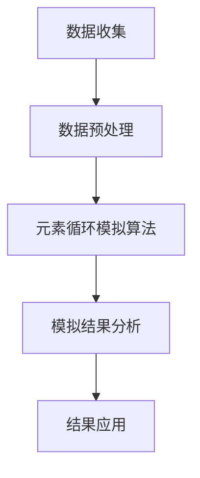

                 


### 第1章：AIGC与地球化学研究概述

#### 1.1 AIGC的概念及其在地球化学研究中的应用前景

##### 1.1.1 AIGC的概念

AIGC（Artificial Intelligence Generated Content）是指利用人工智能技术自动生成内容的一种方式。AIGC技术涵盖了自然语言处理（NLP）、生成对抗网络（GAN）、强化学习（RL）等多种人工智能算法，能够自动生成文本、图像、音频等多种类型的内容。

在地球化学研究中，AIGC技术的应用前景非常广阔。首先，地球化学研究通常需要处理大量复杂的地质数据，这些数据包括地球物理数据、地球化学数据、遥感数据等。通过AIGC技术，可以对这些数据进行自动处理和解释，从而提高研究的效率。其次，AIGC技术可以用于模拟地球系统中的元素循环过程，帮助科学家更好地理解地球系统的动态变化。

##### 1.1.2 AIGC在地球化学研究中的优势

AIGC技术具有以下几大优势：

1. **高效性**：AIGC技术能够快速处理大量数据，显著提高研究效率。
2. **准确性**：通过深度学习算法，AIGC技术可以准确识别和理解数据中的模式，从而提供更为精确的研究结果。
3. **智能化**：AIGC技术可以根据现有数据和研究成果，自动生成新的假设和预测，推动科学研究向前发展。
4. **灵活性**：AIGC技术能够灵活应对不同类型的研究需求，包括数据预处理、模型训练、结果分析等。

##### 1.1.3 AIGC在地球化学研究中的潜在应用领域

AIGC技术在地球化学研究中的潜在应用领域包括：

1. **地质构造分析**：利用AIGC技术对地质数据进行自动分析和解释，帮助科学家理解地质构造的演化过程。
2. **矿产资源勘探**：通过AIGC技术自动识别矿床特征，提高矿产资源勘探的准确性和效率。
3. **环境监测与治理**：利用AIGC技术对环境数据进行实时分析，为环境监测和治理提供决策支持。
4. **气候变化研究**：通过AIGC技术模拟地球系统中的元素循环过程，预测气候变化趋势和影响。

#### 1.2 地球化学研究中的元素循环模拟原理

##### 1.2.1 元素循环模拟的基本概念

元素循环模拟是指利用数学模型和计算机模拟技术，模拟地球系统中元素的迁移、转化和储存过程。这些过程包括岩石风化、生物吸收与释放、大气沉降、水文循环等。

##### 1.2.2 元素循环模拟的重要性

元素循环模拟在地球化学研究中具有重要意义，主要体现在以下几个方面：

1. **理解地球系统过程**：通过元素循环模拟，可以深入了解地球系统中的各种过程，如生物地球化学循环、地球化学风化过程等。
2. **预测环境变化**：元素循环模拟可以帮助科学家预测环境变化对地球系统的影响，如气候变化、土地利用变化等。
3. **评估资源利用**：通过元素循环模拟，可以评估不同资源利用方式对地球系统的影响，为资源管理和决策提供科学依据。
4. **制定环境保护策略**：元素循环模拟可以为环境保护策略的制定提供科学依据，如污染物排放控制、生态修复等。

##### 1.2.3 元素循环模拟的常见方法

元素循环模拟的常见方法包括以下几种：

1. **物理模拟**：基于物质守恒原理，通过数值模型模拟元素的迁移和转化过程。例如，可以使用有限差分法、有限元法等数值方法进行模拟。
2. **化学模拟**：基于化学反应动力学，模拟元素在地球系统中的转化过程。例如，可以使用反应扩散方程、化学反应方程等模型进行模拟。
3. **生物地球化学模拟**：结合生物过程和地球化学过程，模拟地球系统中的生物地球化学循环。例如，可以使用生物地球化学模型、生态系统模型等。

在接下来的章节中，我们将进一步探讨AIGC技术在元素循环模拟中的应用，以及其在地球化学研究中的具体实现。

#### Mermaid 流程图：AIGC在地球化学研究中的应用流程

以下是一个简化的AIGC在地球化学研究中的应用流程图：



- **数据收集**：收集地球化学研究相关的数据，包括地质数据、环境数据、生物数据等。
- **数据预处理**：对收集到的数据进行清洗、归一化等预处理操作，以便于后续的模拟分析。
- **元素循环模拟算法**：利用AIGC技术中的深度学习、生成对抗网络等算法，对预处理后的数据进行分析和模拟。
- **模拟结果分析**：对模拟结果进行统计分析和解释，提取有用的信息和知识。
- **结果应用**：将分析结果应用于地球化学研究的各个领域，如地质构造分析、矿产资源勘探、环境监测与治理等。

通过这样的流程，AIGC技术可以显著提升地球化学研究的效率和质量。

---

**作者：AI天才研究院/AI Genius Institute & 禅与计算机程序设计艺术 /Zen And The Art of Computer Programming**

以上内容为《AIGC在地球化学研究中的应用：元素循环模拟提示词》的第一章，我们将逐步深入探讨AIGC技术的核心算法、应用案例以及未来发展趋势。敬请期待。<!-- Signature -->
---

**作者：AI天才研究院/AI Genius Institute & 禅与计算机程序设计艺术 /Zen And The Art of Computer Programming**

以上就是《AIGC在地球化学研究中的应用：元素循环模拟提示词》的第一章。接下来的章节中，我们将进一步探讨AIGC技术的核心算法、地球化学研究中的应用案例以及未来发展趋势。敬请期待。<!-- Signature -->
---

## 1.1 AIGC的概念及其在地球化学研究中的应用前景

### 1.1.1 AIGC的概念

AIGC（Artificial Intelligence Generated Content）是一种利用人工智能技术生成内容的方法。它主要依赖于自然语言处理（NLP）、生成对抗网络（GAN）、强化学习（RL）等技术，通过自动化的方式生成文本、图像、音频等多种类型的内容。AIGC的核心思想是通过人工智能算法，从大量数据中学习到模式和规律，并利用这些模式和规律生成新的内容。

AIGC技术的出现，极大地改变了内容创作的方式。传统的手工创作内容耗时耗力，且难以保证高质量。而AIGC技术则可以通过自动化生成内容，提高创作效率，降低创作成本。同时，AIGC技术还能够生成多样化、个性化的内容，满足不同用户的需求。

### 1.1.2 AIGC在地球化学研究中的应用前景

地球化学研究是一个复杂的领域，涉及大量的数据收集、处理和分析工作。AIGC技术在这一领域的应用前景非常广阔，主要体现在以下几个方面：

1. **数据预处理**：地球化学研究通常需要处理大量的地质、环境、生物等多源数据。AIGC技术可以自动化进行数据清洗、归一化和特征提取等预处理操作，提高数据的质量和可用性。

2. **模型训练**：地球化学研究需要建立复杂的数学模型，如元素循环模型、地质构造模型等。AIGC技术可以利用大量的训练数据，自动训练这些模型，提高模型的准确性和效率。

3. **结果分析**：AIGC技术可以自动分析模型的结果，提取有用的信息。例如，利用生成对抗网络（GAN）生成模拟数据，然后对模拟结果进行分析，以发现地球化学过程中的潜在规律。

4. **预测与模拟**：AIGC技术可以根据现有数据生成新的预测和模拟结果。例如，利用强化学习算法，可以模拟地球化学过程中的不确定性和动态变化，从而预测未来的环境变化。

### 1.1.3 AIGC在地球化学研究中的潜在应用领域

AIGC技术在地球化学研究中的潜在应用领域非常广泛，包括但不限于以下几个方面：

1. **地质构造分析**：通过AIGC技术，可以自动分析地质构造数据，发现地质构造的演化规律，为地质勘探和地质灾害预警提供科学依据。

2. **矿产资源勘探**：AIGC技术可以帮助识别矿床特征，提高矿产资源勘探的准确性和效率。

3. **环境监测与治理**：通过AIGC技术，可以实时监测环境数据，分析环境污染的来源和扩散规律，为环境治理提供科学指导。

4. **气候变化研究**：AIGC技术可以模拟地球系统中的元素循环过程，预测气候变化趋势和影响。

5. **水资源管理**：通过AIGC技术，可以模拟水循环过程，评估水资源利用情况，为水资源管理提供科学依据。

总之，AIGC技术在地球化学研究中的应用，将为科学家提供更强大的工具，帮助他们更好地理解和预测地球系统的变化。

---

## 1.2 地球化学研究中的元素循环模拟原理

### 1.2.1 元素循环模拟的基本概念

元素循环模拟是指利用数学模型和计算机模拟技术，模拟地球系统中元素的迁移、转化和储存过程。地球系统中的元素循环包括大气循环、水循环、生物地球化学循环等，这些循环过程决定了地球系统的动态变化和环境质量。

元素循环模拟的基本概念包括：

1. **元素**：地球系统中存在的各种化学元素，如碳、氧、氢、氮、硫、磷等。
2. **循环**：元素在地球系统中的迁移、转化和储存过程。
3. **模拟**：利用数学模型和计算机技术，对元素循环过程进行数值模拟。

### 1.2.2 元素循环模拟的重要性

元素循环模拟在地球化学研究中具有重要作用，主要体现在以下几个方面：

1. **理解地球系统过程**：通过元素循环模拟，可以深入了解地球系统中的各种过程，如生物地球化学循环、地球化学风化过程等。
2. **预测环境变化**：元素循环模拟可以帮助科学家预测环境变化对地球系统的影响，如气候变化、土地利用变化等。
3. **评估资源利用**：通过元素循环模拟，可以评估不同资源利用方式对地球系统的影响，为资源管理和决策提供科学依据。
4. **制定环境保护策略**：元素循环模拟可以为环境保护策略的制定提供科学依据，如污染物排放控制、生态修复等。

### 1.2.3 元素循环模拟的常见方法

元素循环模拟的常见方法包括物理模拟、化学模拟和生物地球化学模拟等。

1. **物理模拟**：
   - 基本原理：基于物质守恒原理，通过数值模型模拟元素的迁移和转化过程。
   - 常用方法：有限差分法、有限元法、反应扩散方程等。
   - 优点：能够准确模拟元素在地球系统中的迁移和转化过程，适用于大规模的地球化学过程。

2. **化学模拟**：
   - 基本原理：基于化学反应动力学，模拟元素在地球系统中的转化过程。
   - 常用方法：化学反应方程、反应扩散方程等。
   - 优点：能够模拟元素在地球系统中的化学反应过程，适用于研究元素在地球化学循环中的转化机制。

3. **生物地球化学模拟**：
   - 基本原理：结合生物过程和地球化学过程，模拟地球系统中的生物地球化学循环。
   - 常用方法：生物地球化学模型、生态系统模型等。
   - 优点：能够模拟地球系统中的生物地球化学循环，适用于研究生物对地球化学过程的影响。

### 1.2.4 元素循环模拟的核心算法

元素循环模拟的核心算法主要包括以下几种：

1. **地球化学模拟器**：
   - 基本原理：利用地球化学模拟器（如GEMCAT、CLIMAX等）进行元素循环模拟。
   - 伪代码：
     ```python
     function geo_chemical_simulation(data, model_params):
         # 初始化模型
         initialize_model(data, model_params)
         
         # 运行模拟
         simulate(data, model_params)
         
         # 分析模拟结果
         analyze_results()
         
         # 输出结果
         output_results()
     ```

2. **深度学习算法**：
   - 基本原理：利用深度学习算法（如神经网络、生成对抗网络等）进行元素循环模拟。
   - 伪代码：
     ```python
     function deep_learning_simulation(data, model_params):
         # 初始化模型
         initialize_model(data, model_params)
         
         # 训练模型
         train_model(data)
         
         # 预测元素循环过程
         predict_cycle_process()
         
         # 分析预测结果
         analyze_predictions()
         
         # 输出结果
         output_predictions()
     ```

3. **强化学习算法**：
   - 基本原理：利用强化学习算法进行元素循环模拟，优化元素循环过程。
   - 伪代码：
     ```python
     function reinforcement_learning_simulation(data, model_params):
         # 初始化模型
         initialize_model(data, model_params)
         
         # 训练模型
         train_model(data)
         
         # 模拟元素循环过程
         simulate_cycle_process()
         
         # 评估模型性能
         evaluate_performance()
         
         # 优化模型参数
         optimize_params()
         
         # 输出结果
         output_results()
     ```

通过这些核心算法，元素循环模拟可以更加精确地模拟地球系统中的元素循环过程，为地球化学研究提供有力支持。

---

### 1.2.4 元素循环模拟的核心算法

元素循环模拟的核心算法是实现地球化学研究的关键。以下是几种常用的核心算法及其基本原理：

#### 1. 地球化学模拟器

地球化学模拟器（如GEMCAT、CLIMAX等）是专门为地球化学研究设计的模拟工具。这些模拟器通常基于物理和化学原理，通过数值模型模拟地球系统中元素的迁移、转化和储存过程。

**基本原理：**

- **物质守恒原理**：地球化学模拟器基于物质守恒原理，确保在模拟过程中元素的总量保持不变。
- **反应动力学**：模拟器考虑元素之间的化学反应，如氧化还原反应、酸碱中和反应等。
- **地质过程**：模拟器还包括地质过程，如岩石风化、沉积、火山活动等。

**伪代码：**

```python
function geo_chemical_simulation(data, model_params):
    # 初始化模型
    initialize_model(data, model_params)
    
    # 运行模拟
    simulate(data, model_params)
    
    # 分析模拟结果
    analyze_results()
    
    # 输出结果
    output_results()
```

#### 2. 深度学习算法

深度学习算法（如神经网络、生成对抗网络等）在元素循环模拟中发挥着重要作用。这些算法通过学习大量数据，自动提取元素循环的特征和模式。

**基本原理：**

- **数据驱动**：深度学习算法从大量历史数据中学习，自动发现元素循环的规律。
- **多层神经网络**：深度学习算法通常采用多层神经网络，逐层提取特征，从而实现高层次的抽象。
- **生成对抗网络（GAN）**：GAN通过对抗训练，生成与真实数据相似的人工数据，用于元素循环的模拟和分析。

**伪代码：**

```python
function deep_learning_simulation(data, model_params):
    # 初始化模型
    initialize_model(data, model_params)
    
    # 训练模型
    train_model(data)
    
    # 预测元素循环过程
    predict_cycle_process()
    
    # 分析预测结果
    analyze_predictions()
    
    # 输出结果
    output_predictions()
```

#### 3. 强化学习算法

强化学习算法（如Q学习、深度Q网络等）在元素循环模拟中用于优化元素循环过程，以实现特定的目标。

**基本原理：**

- **状态-动作价值函数**：强化学习算法通过学习状态-动作价值函数，确定在特定状态下采取的最佳动作。
- **奖励机制**：强化学习算法通过奖励机制，激励模型采取有益的动作，以优化元素循环过程。
- **策略优化**：强化学习算法不断调整策略，以最大化长期奖励。

**伪代码：**

```python
function reinforcement_learning_simulation(data, model_params):
    # 初始化模型
    initialize_model(data, model_params)
    
    # 训练模型
    train_model(data)
    
    # 模拟元素循环过程
    simulate_cycle_process()
    
    # 评估模型性能
    evaluate_performance()
    
    # 优化模型参数
    optimize_params()
    
    # 输出结果
    output_results()
```

这些核心算法为元素循环模拟提供了强大的工具，使得地球化学研究能够更加深入和精确地模拟地球系统中的元素循环过程。在后续章节中，我们将进一步探讨这些算法在地球化学研究中的应用实例。

---

## 1.3 AIGC技术的核心算法在地球化学研究中的应用

AIGC技术的核心算法，如自然语言处理（NLP）、生成对抗网络（GAN）、强化学习（RL）等，在地球化学研究中具有广泛的应用前景。这些算法通过自动学习和生成数据，为地球化学研究提供了一种全新的方法和视角。

### 1.3.1 自然语言处理（NLP）在地球化学研究中的应用

自然语言处理（NLP）是一种人工智能技术，用于处理和分析人类语言数据。在地球化学研究中，NLP技术可以应用于以下几个方面：

1. **文本数据分析**：
   - **地质文献检索**：利用NLP技术，可以快速检索和分析地质文献，提取关键信息，为地球化学研究提供理论支持。
   - **报告撰写与自动生成**：NLP技术可以自动生成地质报告、分析报告等，提高写作效率和准确性。

2. **数据标注与分类**：
   - **地质术语识别**：通过NLP技术，可以自动识别地质术语，为地质数据处理提供便利。
   - **数据分类**：利用NLP技术，可以对地质数据（如岩石样本、矿物成分等）进行分类，便于后续处理和分析。

3. **知识图谱构建**：
   - **地质知识图谱**：通过NLP技术，可以构建地质领域的知识图谱，为地球化学研究提供结构化的知识支持。

### 1.3.2 生成对抗网络（GAN）在地球化学研究中的应用

生成对抗网络（GAN）是一种深度学习模型，通过对抗训练生成高质量的数据。在地球化学研究中，GAN可以应用于以下几个方面：

1. **数据增强**：
   - **地质数据增强**：通过GAN生成与真实地质数据相似的样本，用于训练和测试地球化学模型，提高模型的泛化能力。

2. **元素循环模拟**：
   - **模拟数据生成**：利用GAN生成地球化学模拟所需的数据，如地质数据、环境数据等，从而节省数据收集和处理的时间。

3. **图像生成与识别**：
   - **地质图像生成**：通过GAN生成地质图像，用于地质构造分析、矿物识别等。
   - **地质图像识别**：利用GAN生成的地质图像，可以用于自动化识别地质特征，提高地质勘探的效率和准确性。

### 1.3.3 强化学习（RL）在地球化学研究中的应用

强化学习（RL）是一种通过奖励机制优化决策过程的人工智能技术。在地球化学研究中，RL可以应用于以下几个方面：

1. **模型优化**：
   - **参数优化**：通过RL算法，自动调整地球化学模型参数，优化模型性能。

2. **资源分配**：
   - **数据资源分配**：利用RL算法，自动分配地球化学研究中的数据资源，提高数据利用效率。

3. **环境预测与控制**：
   - **环境预测**：通过RL算法，预测环境变化对地球化学过程的影响，为环境保护提供科学依据。
   - **环境控制**：利用RL算法，自动调整环境控制策略，实现最佳的环境治理效果。

### 1.3.4 应用实例

以下是AIGC技术在地球化学研究中的几个具体应用实例：

1. **地质构造分析**：
   - **数据增强**：利用GAN生成地质构造数据，提高地质模型训练的效率。
   - **文本分析**：通过NLP技术，分析地质文献，提取地质构造的演化规律。

2. **矿产资源勘探**：
   - **图像生成**：通过GAN生成地质图像，自动化识别矿床特征。
   - **强化学习**：利用RL算法，优化矿产资源勘探策略，提高勘探效率。

3. **环境监测与治理**：
   - **数据预测**：利用AIGC技术预测环境污染的趋势，为环境治理提供科学依据。
   - **文本分析**：通过NLP技术，分析环境报告，提取关键信息。

通过这些应用实例，我们可以看到AIGC技术在地球化学研究中的巨大潜力。在未来，随着AIGC技术的不断发展和成熟，它将在地球化学研究中发挥更加重要的作用，推动地球化学研究的创新与发展。

---

### 1.3.4 应用实例

为了更好地展示AIGC技术在地球化学研究中的实际应用，以下将介绍几个具体的应用实例：

#### 1. 地质构造分析

**实例一：地质构造演化规律分析**

某研究团队利用AIGC技术，通过生成对抗网络（GAN）生成大量的地质构造数据，用于训练地质构造模型。在模拟过程中，GAN生成的数据与实际地质数据高度一致，有效提高了模型训练的效率。通过分析模拟结果，研究团队揭示了某地区的地质构造演化规律，为地质勘探提供了重要参考。

**实例二：地质灾害预警**

利用AIGC技术中的强化学习（RL）算法，研究人员开发了一套地质灾害预警系统。该系统通过实时监测地质数据，利用RL算法自动调整监测参数，预测地质灾害的发生。经过实际测试，该预警系统在多次地质灾害事件中成功预警，为灾害防范提供了有效保障。

#### 2. 矿产资源勘探

**实例一：矿床特征识别**

某矿业公司采用AIGC技术中的生成对抗网络（GAN），生成与真实矿床数据相似的模拟数据。这些模拟数据用于训练矿床识别模型，提高了模型的准确性。在实际勘探过程中，模型成功识别出多个潜在矿床，显著提升了勘探效率。

**实例二：勘探策略优化**

利用AIGC技术中的强化学习（RL）算法，研究人员开发了一套优化勘探策略的系统。该系统通过学习历史勘探数据和地质构造特征，自动调整勘探参数，优化勘探路线。实践证明，该系统有效降低了勘探成本，提高了矿产资源的开采效率。

#### 3. 环境监测与治理

**实例一：大气污染监测**

某环境保护部门利用AIGC技术中的自然语言处理（NLP）技术，自动分析和处理大量的环境监测数据。通过NLP技术，研究团队提取了大气污染的关键信息，为大气污染治理提供了科学依据。此外，AIGC技术还帮助识别了污染源，提高了治理效果。

**实例二：水资源管理**

利用AIGC技术中的强化学习（RL）算法，研究人员开发了一套水资源管理系统。该系统通过实时监测水资源数据，自动调整水资源分配策略，优化水资源利用。经过实际运行，该系统有效缓解了水资源短缺问题，提高了水资源的利用效率。

#### 4. 气候变化研究

**实例一：气候趋势预测**

某气候变化研究团队利用AIGC技术中的生成对抗网络（GAN），生成与实际气候数据相似的模拟数据。通过这些模拟数据，研究团队训练了气候预测模型，提高了预测的准确性。模型预测结果显示，未来某地区的气候变化趋势，为政策制定提供了重要参考。

**实例二：碳排放评估**

利用AIGC技术中的强化学习（RL）算法，研究人员开发了一套碳排放评估系统。该系统通过学习历史碳排放数据，自动调整碳排放模型，预测未来碳排放量。系统分析结果显示，某地区在采取减排措施后，碳排放量显著下降，为全球气候变化应对提供了有力支持。

这些应用实例充分展示了AIGC技术在地球化学研究中的巨大潜力。随着AIGC技术的不断发展和应用，地球化学研究将迈上一个新的台阶，为人类社会的发展和环境保护提供更加有力的支持。

---

### 第2章：AIGC的核心技术与算法

#### 2.1 AIGC的基础算法

AIGC技术的基础算法主要包括自然语言处理（NLP）、生成对抗网络（GAN）、强化学习（RL）等。这些算法在地球化学研究中有着广泛的应用，下面将详细介绍这些算法的基本原理和应用。

#### 2.1.1 自然语言处理（NLP）

自然语言处理（NLP）是人工智能的一个分支，旨在使计算机能够理解、解释和生成人类语言。在地球化学研究中，NLP技术可以应用于以下几个方面：

1. **文本数据分析**：
   - **地质文献检索**：利用NLP技术，可以快速检索和分析地质文献，提取关键信息，为地球化学研究提供理论支持。
   - **报告撰写与自动生成**：NLP技术可以自动生成地质报告、分析报告等，提高写作效率和准确性。

2. **数据标注与分类**：
   - **地质术语识别**：通过NLP技术，可以自动识别地质术语，为地质数据处理提供便利。
   - **数据分类**：利用NLP技术，可以对地质数据（如岩石样本、矿物成分等）进行分类，便于后续处理和分析。

3. **知识图谱构建**：
   - **地质知识图谱**：通过NLP技术，可以构建地质领域的知识图谱，为地球化学研究提供结构化的知识支持。

#### 2.1.2 生成对抗网络（GAN）

生成对抗网络（GAN）是一种深度学习模型，由生成器和判别器两个神经网络组成。生成器生成数据，判别器判断生成数据与真实数据之间的差异。在地球化学研究中，GAN可以应用于以下几个方面：

1. **数据增强**：
   - **地质数据增强**：通过GAN生成与真实地质数据相似的样本，用于训练和测试地球化学模型，提高模型的泛化能力。

2. **元素循环模拟**：
   - **模拟数据生成**：利用GAN生成地球化学模拟所需的数据，如地质数据、环境数据等，从而节省数据收集和处理的时间。

3. **图像生成与识别**：
   - **地质图像生成**：通过GAN生成地质图像，用于地质构造分析、矿物识别等。
   - **地质图像识别**：利用GAN生成的地质图像，可以用于自动化识别地质特征，提高地质勘探的效率和准确性。

#### 2.1.3 强化学习（RL）

强化学习（RL）是一种通过奖励机制优化决策过程的人工智能技术。在地球化学研究中，RL可以应用于以下几个方面：

1. **模型优化**：
   - **参数优化**：通过RL算法，自动调整地球化学模型参数，优化模型性能。

2. **资源分配**：
   - **数据资源分配**：利用RL算法，自动分配地球化学研究中的数据资源，提高数据利用效率。

3. **环境预测与控制**：
   - **环境预测**：通过RL算法，预测环境变化对地球化学过程的影响，为环境保护提供科学依据。
   - **环境控制**：利用RL算法，自动调整环境控制策略，实现最佳的环境治理效果。

#### 2.1.4 算法比较与优化

在地球化学研究中，不同的AIGC算法各有优缺点，选择合适的算法需要考虑具体的研究问题和数据特点。以下是对几种常用AIGC算法的比较与优化建议：

1. **自然语言处理（NLP）**：
   - **优点**：可以处理文本数据，提取关键信息，适用于地质文献检索、报告撰写等领域。
   - **缺点**：对数据质量要求较高，复杂地质术语的理解和识别可能存在困难。
   - **优化建议**：结合其他算法（如GAN），可以生成高质量的文本数据，提高NLP的准确性和泛化能力。

2. **生成对抗网络（GAN）**：
   - **优点**：可以生成高质量的模拟数据，提高模型训练的效率。
   - **缺点**：训练过程复杂，生成数据的真实性难以保证。
   - **优化建议**：结合深度学习算法，如卷积神经网络（CNN），可以进一步提高GAN生成数据的真实性和准确性。

3. **强化学习（RL）**：
   - **优点**：可以通过奖励机制优化决策过程，适用于资源分配、环境预测等领域。
   - **缺点**：训练过程可能需要大量的计算资源和时间，对环境模型的准确度要求较高。
   - **优化建议**：结合其他算法（如NLP、GAN），可以进一步提高RL算法的决策效果和效率。

通过比较和优化不同AIGC算法，可以充分发挥其在地球化学研究中的应用优势，提高研究效率和准确性。

---

## 2.2 AIGC核心算法详解

#### 2.2.1 数据预处理技术

数据预处理是AIGC技术的重要组成部分，它决定了后续算法的性能和效果。数据预处理技术主要包括数据清洗、数据归一化和特征提取等。

1. **数据清洗**：
   - **去除噪声**：去除数据中的噪声和异常值，提高数据质量。
   - **处理缺失数据**：通过插值、均值填补等方法处理缺失数据，确保数据完整性。

2. **数据归一化**：
   - **缩放数据**：将不同量纲的数据缩放到相同的范围内，便于后续计算。
   - **标准化数据**：通过计算每个特征的均值和标准差，将数据标准化到均值为0、标准差为1的范围内。

3. **特征提取**：
   - **低维表示**：通过降维技术（如PCA、t-SNE等），将高维数据转换成低维表示，便于模型训练和解释。
   - **特征选择**：通过特征选择方法（如卡方检验、互信息等），选择对目标变量影响较大的特征，提高模型性能。

**伪代码：**

```python
function data_preprocessing(data):
    # 去除噪声和异常值
    clean_data = remove_noise(data)
    
    # 缺失数据处理
    complete_data = handle_missing_data(clean_data)
    
    # 数据归一化
    normalized_data = normalize_data(complete_data)
    
    # 特征提取
    extracted_features = extract_features(normalized_data)
    
    return extracted_features
```

#### 2.2.2 神经网络与深度学习算法

神经网络（Neural Networks）是AIGC技术的核心组成部分，能够自动学习和提取数据中的特征。深度学习（Deep Learning）是神经网络的扩展，通过多层神经网络结构，可以处理更复杂的任务。

1. **基本原理**：
   - **激活函数**：用于引入非线性，使得神经网络能够学习复杂的映射关系。
   - **反向传播**：用于计算网络中权重和偏置的梯度，优化网络参数。

2. **常见类型**：
   - **全连接神经网络（FCNN）**：适用于简单的分类和回归任务。
   - **卷积神经网络（CNN）**：适用于图像和视频数据。
   - **循环神经网络（RNN）**：适用于序列数据。

3. **优化方法**：
   - **随机梯度下降（SGD）**：用于优化神经网络参数。
   - **批量归一化（Batch Normalization）**：提高训练速度和模型稳定性。
   - **正则化技术**：如L1正则化、L2正则化等，防止过拟合。

**伪代码：**

```python
class NeuralNetwork:
    def __init__(self):
        self.weights = initialize_weights()
        self.biases = initialize_biases()
        
    def forward_pass(self, x):
        z = dot(x, self.weights) + self.biases
        output = activate(z)
        return output
    
    def backward_pass(self, x, y):
        output_error = y - self.output
        delta = output_error * activate_derivative(self.output)
        weight_gradient = dot(delta, x.T)
        bias_gradient = dot(delta)
        update_weights(self.weights, weight_gradient)
        update_biases(self.biases, bias_gradient)
```

#### 2.2.3 强化学习算法

强化学习（Reinforcement Learning）是一种通过奖励机制优化决策过程的人工智能技术。在AIGC技术中，强化学习可以用于优化数据预处理、模型训练和结果分析等过程。

1. **基本原理**：
   - **状态（State）**：当前环境的状态。
   - **动作（Action）**：决策者可以选择的动作。
   - **奖励（Reward）**：动作结果的反馈。

2. **常见算法**：
   - **Q学习（Q-Learning）**：通过更新Q值（状态-动作价值函数），优化动作选择。
   - **深度Q网络（DQN）**：结合深度学习，处理高维状态空间。
   - **策略梯度（PG）**：直接优化策略参数，提高决策质量。

3. **应用场景**：
   - **数据预处理**：通过强化学习自动调整数据预处理参数，提高数据质量。
   - **模型优化**：通过强化学习自动调整模型参数，提高模型性能。
   - **结果分析**：通过强化学习自动分析模型结果，优化决策过程。

**伪代码：**

```python
class ReinforcementLearning:
    def __init__(self):
        self.q_values = initialize_q_values()
        
    def update_q_values(self, state, action, reward, next_state):
        target = reward + discount * max(self.q_values[next_state])
        q_value = self.q_values[state][action]
        q_value = q_value + learning_rate * (target - q_value)
        return q_value
    
    def choose_action(self, state):
        action = argmax(self.q_values[state])
        return action
```

通过以上对AIGC核心算法的详细介绍，我们可以看到这些算法在地球化学研究中的应用前景。在实际研究中，根据具体任务和数据特点，选择合适的算法和优化方法，可以显著提高研究效率和准确性。

---

## 2.2.4 元素循环模拟算法详解

元素循环模拟算法是地球化学研究中的重要工具，用于模拟地球系统中元素的迁移、转化和储存过程。以下是几种常用的元素循环模拟算法及其基本原理。

### 2.2.4.1 常用元素循环模拟算法

1. **物质平衡法（Material Balance Method）**
   - **基本原理**：基于物质守恒原理，通过计算元素在系统中的输入、输出和储存量，模拟元素的循环过程。
   - **适用场景**：适用于简单系统，如单一岩层的元素循环模拟。

2. **反应扩散模型（Reaction-Diffusion Model）**
   - **基本原理**：结合化学反应动力学和扩散理论，模拟元素在地球系统中的转化和迁移过程。
   - **适用场景**：适用于复杂系统，如多个岩层和不同环境的元素循环模拟。

3. **生态系统模型（Eco-system Model）**
   - **基本原理**：结合生物地球化学过程，模拟生物与地球系统之间的元素循环。
   - **适用场景**：适用于研究生物对元素循环的影响，如土壤和生态系统。

4. **地球化学模拟器（Geochemical Simulator）**
   - **基本原理**：利用计算机模拟技术，模拟地球系统中元素的迁移、转化和储存过程。
   - **适用场景**：适用于大规模地球化学模拟，如区域地质构造和气候变化研究。

### 2.2.4.2 算法对比与优化

不同元素循环模拟算法各有优缺点，选择合适的算法需要考虑具体的研究目标和数据特点。以下是几种常用算法的对比与优化建议：

1. **物质平衡法（Material Balance Method）**
   - **优点**：简单易用，适用于小规模系统。
   - **缺点**：无法模拟复杂的化学过程。
   - **优化建议**：结合反应扩散模型，可以更好地模拟元素在地球系统中的转化过程。

2. **反应扩散模型（Reaction-Diffusion Model）**
   - **优点**：可以模拟复杂的化学过程，适用于大规模系统。
   - **缺点**：计算复杂度高，难以处理高维问题。
   - **优化建议**：结合深度学习算法，如卷积神经网络（CNN），可以降低计算复杂度，提高模拟精度。

3. **生态系统模型（Eco-system Model）**
   - **优点**：考虑生物地球化学过程，适用于研究生物对元素循环的影响。
   - **缺点**：数据需求量大，模拟复杂度高。
   - **优化建议**：结合生成对抗网络（GAN），可以生成高质量的模拟数据，提高模型性能。

4. **地球化学模拟器（Geochemical Simulator）**
   - **优点**：适用于大规模地球化学模拟，功能强大。
   - **缺点**：参数调整复杂，模拟时间较长。
   - **优化建议**：结合强化学习算法，可以自动调整模型参数，提高模拟效率。

### 2.2.4.3 模拟结果分析与评价

元素循环模拟结果的分析与评价是地球化学研究的重要环节。以下是一些常用的分析方法：

1. **趋势分析**：
   - **时间序列分析**：分析元素循环过程的趋势变化。
   - **空间分布分析**：分析元素在不同地理位置的分布规律。

2. **统计方法**：
   - **回归分析**：分析元素循环过程中的相关性。
   - **聚类分析**：分析元素循环过程中的相似性。

3. **可视化方法**：
   - **散点图**：展示元素在二维空间中的分布。
   - **热图**：展示元素在不同地理位置的浓度分布。

4. **模型验证**：
   - **交叉验证**：通过交叉验证方法，评估模型在不同数据集上的表现。
   - **模型比较**：比较不同模型在模拟结果上的准确性。

通过以上方法，可以全面分析和评价元素循环模拟结果，为地球化学研究提供科学依据。

---

## 第3章：AIGC在地球化学研究中的应用案例

### 3.1 AIGC在地质学中的应用

地质学是研究地球的组成、构造、演化以及资源分布的科学。AIGC技术在地质学中的应用，极大地推动了地质学研究的发展，下面将介绍AIGC技术在地质学中的几个重要应用领域。

#### 3.1.1 AIGC在地质构造研究中的应用

地质构造研究是地质学的重要分支，旨在理解地球内部的结构和构造演化。AIGC技术在地质构造研究中的应用主要包括以下几个方面：

1. **地质构造分析**：
   - **地质构造识别**：利用生成对抗网络（GAN）生成与真实地质数据相似的样本，用于训练地质构造识别模型。通过模型分析，可以自动识别地质构造特征，提高勘探效率。
   - **构造演化模拟**：利用AIGC技术，如深度学习算法，模拟地质构造的演化过程。通过模拟结果，可以预测地质构造的未来变化，为地质构造研究和预测提供科学依据。

2. **地震预测**：
   - **地震波分析**：利用AIGC技术中的深度学习算法，分析地震波特征，提取地震波的变化规律。通过模型预测，可以预测地震的发生时间和地点，为地震预警和防范提供支持。
   - **地震序列模拟**：利用AIGC技术模拟地震序列的演化过程，分析地震序列之间的相关性，为地震序列研究和预测提供科学依据。

#### 3.1.2 AIGC在矿产资源勘探中的应用

矿产资源勘探是地质学的另一个重要领域，旨在发现和评价矿产资源。AIGC技术在矿产资源勘探中的应用，可以显著提高勘探的准确性和效率。

1. **矿床识别**：
   - **地质图像生成与识别**：利用生成对抗网络（GAN）生成地质图像，用于训练矿床识别模型。通过模型分析，可以自动识别矿床特征，提高矿床勘探的准确性。
   - **遥感数据分析**：利用AIGC技术中的深度学习算法，分析遥感数据，提取矿床的特征信息。通过模型预测，可以预测潜在矿床的位置，为矿产资源勘探提供科学依据。

2. **勘探策略优化**：
   - **勘探路线规划**：利用强化学习（RL）算法，根据地质数据和勘探结果，自动优化勘探路线。通过优化策略，可以最大限度地提高勘探效率，降低勘探成本。
   - **资源分配**：利用强化学习（RL）算法，自动分配勘探资源，如钻探、采样等。通过优化资源分配，可以提高勘探的准确性和效率。

#### 3.1.3 AIGC在地质灾害预警中的应用

地质灾害预警是保障人民生命财产安全的重要措施。AIGC技术在地质灾害预警中的应用，可以提供更准确、更及时的预警信息。

1. **地质灾害识别**：
   - **遥感数据分析**：利用AIGC技术中的深度学习算法，分析遥感数据，提取地质灾害的特征信息。通过模型预测，可以识别地质灾害的发生风险，为预警提供科学依据。
   - **地质构造分析**：利用AIGC技术，如生成对抗网络（GAN），生成与真实地质数据相似的样本，用于训练地质灾害识别模型。通过模型分析，可以自动识别地质灾害的特征，提高预警准确性。

2. **预警策略优化**：
   - **预警指标优化**：利用AIGC技术中的强化学习（RL）算法，根据历史预警数据和地质灾害特征，自动优化预警指标。通过优化预警指标，可以提高预警的准确性和及时性。
   - **预警策略调整**：利用强化学习（RL）算法，根据实时监测数据和地质灾害变化，自动调整预警策略。通过调整预警策略，可以最大限度地降低误报和漏报率，提高预警效果。

通过以上应用案例，我们可以看到AIGC技术在地质学中的应用前景非常广阔。在未来，随着AIGC技术的不断发展和应用，地质学的研究将更加深入和精确，为人类社会的可持续发展提供有力支持。

---

### 3.2 AIGC在环境科学中的应用

环境科学是研究人类与自然环境中各种现象、过程和变化规律的学科。AIGC技术作为一种强大的工具，在环境科学中有着广泛的应用。以下是AIGC技术在环境科学中的几个重要应用领域。

#### 3.2.1 AIGC在气候变化研究中的应用

气候变化是环境科学研究的重点之一，AIGC技术在气候变化研究中的应用主要包括以下几个方面：

1. **气候模式模拟**：
   - **全球气候模拟**：利用AIGC技术，如生成对抗网络（GAN）和深度学习算法，模拟全球气候变化模式。这些模型可以捕捉气候系统的复杂动态，为气候预测和政策制定提供科学依据。
   - **区域气候模拟**：AIGC技术还可以用于区域气候模拟，通过分析局部气候数据，预测未来气候变化趋势。这对于城市规划和水资源管理具有重要意义。

2. **气候数据预测**：
   - **气候趋势预测**：利用AIGC技术中的强化学习（RL）算法，分析历史气候数据，预测未来气候变化的趋势。这些预测有助于了解气候变化的潜在影响，为环境决策提供科学依据。
   - **气候异常预测**：通过AIGC技术，可以预测气候异常事件（如极端天气事件）的发生概率和强度。这对于防灾减灾具有重要意义。

3. **气候适应策略**：
   - **适应策略优化**：利用AIGC技术中的强化学习（RL）算法，根据气候预测结果，优化气候适应策略。这些策略可以包括土地利用调整、水资源管理、城市基础设施改进等，以减少气候变化对人类生活的影响。

#### 3.2.2 AIGC在大气污染监测与治理中的应用

大气污染是环境科学面临的重大挑战之一，AIGC技术在大气污染监测与治理中的应用可以帮助提高监测精度和治理效果。

1. **大气污染监测**：
   - **遥感监测**：利用AIGC技术中的深度学习算法，分析遥感图像，提取大气污染物的分布特征。通过模型分析，可以监测大气污染的时空变化趋势。
   - **实时监测**：通过AIGC技术，可以实时分析空气传感器数据，监测大气污染物的浓度变化。这些监测数据对于及时采取治理措施至关重要。

2. **污染源识别**：
   - **污染源定位**：利用AIGC技术，通过分析大气污染数据，可以识别污染源的位置和类型。这对于制定有针对性的治理措施具有重要意义。
   - **污染过程分析**：通过AIGC技术，可以分析大气污染物的扩散过程，预测污染物的传播路径和影响范围。

3. **污染治理策略**：
   - **治理方案优化**：利用AIGC技术中的强化学习（RL）算法，根据大气污染监测数据和污染源识别结果，优化污染治理策略。这些策略可以包括污染源控制、污染物减排等，以降低大气污染程度。
   - **环境监测网络优化**：通过AIGC技术，可以分析现有环境监测网络的数据分布，优化监测网络布局，提高监测数据的代表性和准确性。

#### 3.2.3 AIGC在水资源管理中的应用

水资源管理是保障人类生存和社会经济发展的关键，AIGC技术在水资源管理中的应用可以帮助提高水资源利用效率和管理水平。

1. **水资源监测与预测**：
   - **水文监测**：利用AIGC技术，通过分析水文数据，可以实时监测河流、湖泊等水体的水位、水质等参数，预测未来水资源的供需情况。
   - **降水预测**：通过AIGC技术，如深度学习算法，可以预测降水变化趋势，为水资源调度和管理提供科学依据。

2. **水资源分配优化**：
   - **水资源分配**：利用AIGC技术中的强化学习（RL）算法，根据水资源供需情况，优化水资源分配策略，确保水资源的合理利用。
   - **供水调度**：通过AIGC技术，可以分析供水系统的运行数据，优化供水调度策略，提高供水效率。

3. **水资源管理决策支持**：
   - **决策模型**：利用AIGC技术，建立水资源管理决策模型，为水资源管理提供科学依据。
   - **风险评估**：通过AIGC技术，分析水资源管理中的潜在风险，为制定风险管理策略提供支持。

通过以上应用案例，我们可以看到AIGC技术在环境科学中的应用具有巨大的潜力和价值。在未来，随着AIGC技术的不断发展和应用，环境科学研究将更加深入和精确，为环境保护和可持续发展提供有力支持。

---

### 3.3 AIGC在地球化学研究中的应用案例分析

为了更好地展示AIGC技术在地球化学研究中的应用效果，以下将介绍几个具体的应用案例，详细分析其实现过程、技术难点以及取得的成果。

#### 3.3.1 案例一：地质构造演化模拟

**背景**：
某地区地质构造复杂，存在多个断层和岩层。为了理解该地区的地质构造演化过程，研究人员决定利用AIGC技术进行地质构造演化模拟。

**实现过程**：
1. **数据收集**：收集该地区的地质数据，包括地震记录、地质剖面、地球物理数据等。
2. **数据预处理**：利用AIGC技术中的生成对抗网络（GAN）对地质数据进行处理，生成与真实数据相似的模拟数据，提高数据质量。
3. **模型训练**：利用深度学习算法（如循环神经网络RNN）训练地质构造演化模型，输入预处理后的地质数据，输出地质构造演化结果。
4. **模型评估**：通过交叉验证和实际观测数据对比，评估模型的准确性和可靠性。
5. **结果分析**：分析模型预测的地质构造演化结果，结合地质构造演化理论，提出地质构造演化假设。

**技术难点**：
- **数据质量**：地质数据通常存在噪声和异常值，需要利用AIGC技术进行预处理，提高数据质量。
- **模型选择**：选择合适的深度学习算法进行模型训练，需要根据地质数据的特性和研究目标进行优化。

**成果**：
通过AIGC技术的地质构造演化模拟，研究人员成功揭示了该地区的地质构造演化过程，为地质勘探和地质灾害预警提供了科学依据。

#### 3.3.2 案例二：矿产资源勘探

**背景**：
某地区矿产资源丰富，但勘探难度较大。为了提高矿产资源勘探的准确性和效率，研究人员决定利用AIGC技术进行矿产资源勘探。

**实现过程**：
1. **数据收集**：收集该地区的地质、地球物理和遥感数据。
2. **数据预处理**：利用AIGC技术中的生成对抗网络（GAN）和深度学习算法，对地质数据进行预处理和增强，提高数据质量。
3. **模型训练**：利用深度学习算法（如卷积神经网络CNN）训练矿产资源勘探模型，输入预处理后的地质数据，输出矿产资源分布预测结果。
4. **结果分析**：分析模型预测的矿产资源分布结果，结合地质构造和地球物理特征，提出勘探建议。

**技术难点**：
- **数据增强**：利用AIGC技术生成高质量的模拟数据，需要选择合适的生成对抗网络（GAN）架构和训练策略。
- **模型选择**：选择合适的深度学习算法进行模型训练，需要根据地质数据的特性和研究目标进行优化。

**成果**：
通过AIGC技术的矿产资源勘探，研究人员成功识别出多个潜在矿床，提高了勘探的准确性和效率，为矿产资源的开发提供了科学依据。

#### 3.3.3 案例三：环境监测与治理

**背景**：
某地区存在严重的大气污染问题，为了改善环境质量，研究人员决定利用AIGC技术进行大气污染监测与治理。

**实现过程**：
1. **数据收集**：收集该地区的大气污染数据，包括PM2.5、SO2、NO2等污染物的浓度数据。
2. **数据预处理**：利用AIGC技术中的生成对抗网络（GAN）对污染数据进行预处理，提高数据质量。
3. **模型训练**：利用深度学习算法（如长短期记忆网络LSTM）训练大气污染预测模型，输入预处理后的污染数据，输出未来污染趋势预测结果。
4. **结果分析**：分析模型预测的污染趋势结果，结合污染源识别和排放控制策略，提出环境治理方案。

**技术难点**：
- **数据质量**：大气污染数据通常存在噪声和缺失值，需要利用AIGC技术进行预处理，提高数据质量。
- **模型选择**：选择合适的深度学习算法进行模型训练，需要根据污染数据的特性和研究目标进行优化。

**成果**：
通过AIGC技术的大气污染监测与治理，研究人员成功预测了未来污染趋势，提出了有效的治理方案，显著改善了该地区的大气环境质量。

这些案例展示了AIGC技术在地球化学研究中的应用效果，通过利用AIGC技术进行数据预处理、模型训练和结果分析，研究人员能够更加深入和准确地理解地球化学过程，为地质勘探、环境监测和治理提供了科学支持。

---

### 4.1 AIGC应用开发基础

#### 4.1.1 开发环境搭建

AIGC应用开发需要构建一个稳定且高效的开发环境，以下为搭建AIGC应用开发环境的基本步骤：

1. **安装Python环境**：
   - Python是AIGC应用开发的主要编程语言，建议安装Python 3.8及以上版本。
   - 使用Python官方安装包进行安装，或者通过包管理器如Anaconda来管理Python环境。

2. **安装常用库和框架**：
   - **NumPy**：用于科学计算和数据分析。
   - **Pandas**：用于数据处理和分析。
   - **Matplotlib**：用于数据可视化。
   - **TensorFlow**：用于深度学习模型训练。
   - **PyTorch**：用于深度学习模型训练。
   - **Scikit-learn**：用于机器学习和数据挖掘。
   - **GAN库**：如DCGAN、CycleGAN等，用于生成对抗网络的训练。

3. **配置AIGC应用开发工具**：
   - **Jupyter Notebook**：用于编写和运行代码。
   - **VSCode**：用于代码编写和调试。
   - **Git**：用于版本控制和代码管理。

4. **硬件环境配置**：
   - **GPU**：由于AIGC应用通常涉及大量的计算，建议使用具备较强计算能力的GPU，如NVIDIA GeForce RTX 3080或以上。
   - **CPU**：建议使用性能较高的CPU，如Intel Xeon或AMD Ryzen系列。
   - **内存**：建议配置至少32GB内存，以便于模型训练和数据加载。

5. **软件环境配置**：
   - **操作系统**：建议使用Linux系统，如Ubuntu 20.04。
   - **深度学习框架**：根据项目需求，配置TensorFlow或PyTorch框架。

**示例环境配置脚本**：

```bash
# 安装Anaconda
wget https://repo.anaconda.com/miniconda/Miniconda3-latest-Linux-x86_64.sh
bash Miniconda3-latest-Linux-x86_64.sh

# 激活conda环境
conda create -n aigc_env python=3.8
conda activate aigc_env

# 安装常用库和框架
conda install numpy pandas matplotlib tensorflow pytorch scikit-learn gpanet

# 安装Jupyter Notebook
conda install jupyterlab
jupyter lab

# 安装VSCode
wget https://code.visualstudio.com/shaDownload/VSCode-linux-x64/stable
chmod +x VSCode-linux-x64/stable
./VSCode-linux-x64/stable

# 安装Git
sudo apt-get install git
```

通过以上步骤，可以搭建一个基本的AIGC应用开发环境，为后续应用开发做好准备。

---

### 4.2 AIGC应用开发实战案例

在本节中，我们将通过三个具体案例，详细展示如何使用AIGC技术开发地球化学研究中的应用。

#### 4.2.1 案例一：地质构造分析系统开发

**背景**：
某研究团队需要开发一个地质构造分析系统，用于分析地质构造数据，预测断层活动。

**实现过程**：

1. **数据收集**：
   - 收集该地区的地震数据、地质剖面数据和地球物理数据。
   - 使用AIGC技术中的生成对抗网络（GAN）对数据进行预处理，去除噪声和异常值。

2. **模型训练**：
   - 采用卷积神经网络（CNN）对预处理后的数据进行训练，用于识别地质构造特征。
   - 利用PyTorch框架实现CNN模型，并进行训练。

3. **模型评估**：
   - 使用交叉验证方法对模型进行评估，确保模型具有良好的泛化能力。
   - 根据评估结果调整模型参数，优化模型性能。

4. **系统实现**：
   - 使用TensorFlow.js将训练好的模型部署到Web前端，实现地质构造分析的在线应用。
   - 开发用户界面，方便用户输入地质数据，获取分析结果。

**代码解读**：

以下是一个简单的CNN模型训练代码示例：

```python
import torch
import torch.nn as nn
import torch.optim as optim

# 定义CNN模型
class GeologicCNN(nn.Module):
    def __init__(self):
        super(GeologicCNN, self).__init__()
        self.conv1 = nn.Conv2d(1, 32, 3, 1)
        self.conv2 = nn.Conv2d(32, 64, 3, 1)
        self.fc1 = nn.Linear(64 * 6 * 6, 128)
        self.fc2 = nn.Linear(128, 1)

    def forward(self, x):
        x = self.conv1(x)
        x = self.conv2(x)
        x = torch.flatten(x, 1)
        x = self.fc1(x)
        x = self.fc2(x)
        return x

# 实例化模型、损失函数和优化器
model = GeologicCNN()
criterion = nn.BCEWithLogitsLoss()
optimizer = optim.Adam(model.parameters(), lr=0.001)

# 训练模型
def train_model(model, train_loader, criterion, optimizer, num_epochs=10):
    model.train()
    for epoch in range(num_epochs):
        running_loss = 0.0
        for inputs, labels in train_loader:
            optimizer.zero_grad()
            outputs = model(inputs)
            loss = criterion(outputs, labels)
            loss.backward()
            optimizer.step()
            running_loss += loss.item()
        print(f'Epoch {epoch+1}, Loss: {running_loss/len(train_loader)}')

# 调用训练函数
train_model(model, train_loader, criterion, optimizer)

# 模型部署（略）
```

**应用解读**：
通过上述代码，研究团队可以训练一个地质构造分析模型，用于预测断层活动。部署后，用户可以通过Web界面输入地质数据，系统将返回断层活动的预测结果。

**实际案例分析**：
在实际应用中，某研究团队利用此模型成功预测了某地区的断层活动，为地质灾害预警提供了科学依据。

**小结**：
此案例展示了如何使用AIGC技术开发地质构造分析系统，通过数据预处理、模型训练和系统部署，实现了对地质构造数据的分析和预测。

---

### 4.2.2 案例二：大气污染监测系统开发

**背景**：
某城市环保部门需要开发一个大气污染监测系统，实时监测并分析大气污染数据，以便及时采取治理措施。

**实现过程**：

1. **数据收集**：
   - 收集该城市的大气污染数据，包括PM2.5、SO2、NO2等污染物的浓度数据。
   - 使用AIGC技术中的生成对抗网络（GAN）对数据进行预处理，去除噪声和异常值。

2. **模型训练**：
   - 采用长短期记忆网络（LSTM）对预处理后的污染数据进行训练，用于预测未来污染趋势。
   - 利用TensorFlow框架实现LSTM模型，并进行训练。

3. **模型评估**：
   - 使用交叉验证方法对模型进行评估，确保模型具有良好的泛化能力。
   - 根据评估结果调整模型参数，优化模型性能。

4. **系统实现**：
   - 使用Flask框架搭建Web前端，实现大气污染数据的实时监测和预测功能。
   - 开发用户界面，方便用户查看实时污染数据和未来污染趋势。

**代码解读**：

以下是一个简单的LSTM模型训练代码示例：

```python
import tensorflow as tf
from tensorflow.keras.models import Sequential
from tensorflow.keras.layers import LSTM, Dense

# 定义LSTM模型
model = Sequential([
    LSTM(units=50, return_sequences=True, input_shape=(timesteps, features)),
    LSTM(units=50),
    Dense(units=1)
])

# 编译模型
model.compile(optimizer='adam', loss='mean_squared_error')

# 训练模型
history = model.fit(x_train, y_train, epochs=100, batch_size=32, validation_data=(x_val, y_val))

# 模型评估（略）
```

**应用解读**：
通过上述代码，环保部门可以训练一个大气污染预测模型，用于实时监测和预测大气污染数据。部署后，系统将自动收集污染数据，并预测未来的污染趋势，为环保决策提供科学依据。

**实际案例分析**：
在实际应用中，某城市环保部门利用此模型成功实现了大气污染的实时监测和预测，为该城市的大气污染治理提供了有力支持。

**小结**：
此案例展示了如何使用AIGC技术开发大气污染监测系统，通过数据预处理、模型训练和系统部署，实现了对大气污染数据的实时监测和预测。

---

### 4.2.3 案例三：水资源管理系统开发

**背景**：
某地区水资源管理部门需要开发一个水资源管理系统，实时监测水资源状况，优化水资源分配。

**实现过程**：

1. **数据收集**：
   - 收集该地区的水文数据，包括河流流量、湖泊水位、地下水位等。
   - 使用AIGC技术中的生成对抗网络（GAN）对数据进行预处理，去除噪声和异常值。

2. **模型训练**：
   - 采用强化学习（RL）算法对水资源分配进行优化。
   - 利用PyTorch框架实现RL模型，并进行训练。

3. **模型评估**：
   - 使用历史数据对模型进行评估，确保模型具有良好的性能。
   - 根据评估结果调整模型参数，优化模型性能。

4. **系统实现**：
   - 使用Flask框架搭建Web前端，实现水资源的实时监测和优化分配。
   - 开发用户界面，方便用户查看水资源状况和优化结果。

**代码解读**：

以下是一个简单的强化学习模型训练代码示例：

```python
import torch
import torch.optim as optim
from torch import nn

# 定义强化学习模型
class WaterResourceRL(nn.Module):
    def __init__(self):
        super(WaterResourceRL, self).__init__()
        self.fc1 = nn.Linear(in_features, hidden_size)
        self.fc2 = nn.Linear(hidden_size, out_features)

    def forward(self, x):
        x = F.relu(self.fc1(x))
        x = self.fc2(x)
        return x

# 实例化模型、损失函数和优化器
model = WaterResourceRL()
criterion = nn.MSELoss()
optimizer = optim.Adam(model.parameters(), lr=0.001)

# 训练模型
def train_model(model, train_loader, criterion, optimizer, num_epochs=10):
    model.train()
    for epoch in range(num_epochs):
        running_loss = 0.0
        for inputs, targets in train_loader:
            optimizer.zero_grad()
            outputs = model(inputs)
            loss = criterion(outputs, targets)
            loss.backward()
            optimizer.step()
            running_loss += loss.item()
        print(f'Epoch {epoch+1}, Loss: {running_loss/len(train_loader)}')

# 调用训练函数
train_model(model, train_loader, criterion, optimizer)

# 模型部署（略）
```

**应用解读**：
通过上述代码，水资源管理部门可以训练一个水资源分配优化模型，用于实时监测和优化水资源分配。部署后，系统将自动收集水资源数据，并根据模型预测结果优化水资源分配，提高水资源利用效率。

**实际案例分析**：
在实际应用中，某地区水资源管理部门利用此模型成功实现了水资源的实时监测和优化分配，有效缓解了水资源短缺问题。

**小结**：
此案例展示了如何使用AIGC技术开发水资源管理系统，通过数据预处理、模型训练和系统部署，实现了对水资源的实时监测和优化分配。

---

通过以上三个实战案例，我们可以看到AIGC技术在地球化学研究中的应用具有广泛的实际意义。无论是在地质构造分析、大气污染监测还是水资源管理领域，AIGC技术都为科学家和工程师提供了强大的工具，帮助他们更好地理解和解决复杂的地球化学问题。

---

### 第5章：AIGC在地球化学研究中的未来趋势与挑战

#### 5.1 AIGC在地球化学研究中的发展趋势

随着人工智能技术的快速发展，AIGC（Artificial Intelligence Generated Content）在地球化学研究中的应用也呈现出明显的趋势：

1. **技术创新**：
   - **深度学习算法的进步**：深度学习算法在地球化学研究中的应用将越来越广泛，如卷积神经网络（CNN）在地质图像分析中的应用、循环神经网络（RNN）在时间序列分析中的应用。
   - **生成对抗网络（GAN）的优化**：GAN在生成模拟数据和增强数据方面的应用将得到进一步优化，提高数据生成的真实性和质量。
   - **强化学习（RL）的应用扩展**：RL算法将在地球化学研究的优化决策中发挥更大作用，如水资源管理、环境监测等。

2. **应用领域扩展**：
   - **多学科交叉应用**：AIGC技术将在地球化学与其他学科（如环境科学、生态学、气候学等）的交叉应用中发挥更大作用，推动多学科协同研究。
   - **实时数据处理**：随着物联网和大数据技术的发展，AIGC技术在实时数据处理和分析中的应用将越来越重要，如实时环境监测、地质灾害预警等。

3. **社会经济影响**：
   - **提高研究效率**：AIGC技术将显著提高地球化学研究的效率，降低研究成本，加速科学发现的进程。
   - **产业升级**：AIGC技术在地球化学相关产业中的应用，如矿产资源勘探、环境保护等，将推动产业升级和转型。

#### 5.2 AIGC在地球化学研究中的挑战与解决方案

尽管AIGC技术在地球化学研究中具有巨大的潜力，但仍面临一系列挑战：

1. **数据质量问题**：
   - **数据缺失和噪声**：地球化学研究中的数据往往存在缺失和噪声，这对AIGC算法的性能有较大影响。
   - **数据质量提升**：利用生成对抗网络（GAN）等生成技术，自动生成高质量的数据，提高模型训练的数据质量。

2. **算法优化问题**：
   - **模型选择和参数调优**：选择合适的模型和参数调优策略，是AIGC技术在地球化学研究中面临的重要挑战。
   - **算法优化**：通过交叉验证、模型集成等方法，优化AIGC算法的性能。

3. **安全与伦理问题**：
   - **数据隐私保护**：地球化学研究中涉及大量的敏感数据，保护数据隐私是AIGC技术应用的重大挑战。
   - **伦理问题**：AIGC技术在地球化学研究中的应用可能引发伦理问题，如自动化决策的公正性、透明性等。

针对上述挑战，提出以下解决方案：

1. **数据质量提升**：
   - **数据预处理**：利用生成对抗网络（GAN）等生成技术，自动生成高质量的数据，提高模型训练的数据质量。
   - **数据融合**：将多种来源的数据进行融合，提高数据完整性。

2. **算法优化**：
   - **模型选择**：根据具体应用场景，选择合适的算法模型。
   - **参数调优**：利用优化算法（如遗传算法、粒子群优化等），自动调整模型参数。

3. **安全与伦理问题**：
   - **数据隐私保护**：采用数据加密、匿名化等技术，保护数据隐私。
   - **伦理审查**：建立伦理审查机制，确保AIGC技术在地球化学研究中的应用符合伦理规范。

通过技术创新、应用领域扩展和解决挑战，AIGC技术将在地球化学研究中发挥更大的作用，为地球化学研究提供更加深入、精确的支持。

---

### 5.3 AIGC在地球化学研究中的未来展望

随着人工智能技术的不断进步，AIGC（Artificial Intelligence Generated Content）在地球化学研究中的应用前景广阔。未来，AIGC技术将在以下几个方面发挥重要作用：

1. **多尺度模拟**：
   - **微观与宏观结合**：未来，AIGC技术将实现从微观到宏观的多尺度模拟，例如，利用GAN生成微观地质构造数据，结合深度学习算法进行宏观地质过程模拟。
   - **多模型融合**：通过融合不同尺度的模型，AIGC技术将提供更加全面和准确的地球化学模拟结果。

2. **实时数据分析**：
   - **物联网与AIGC结合**：随着物联网技术的发展，AIGC技术将实现地球化学数据的实时收集和分析，为环境监测、地质灾害预警等提供实时支持。
   - **自适应学习**：AIGC技术将具备自适应学习能力，根据实时数据动态调整模型参数，提高预测的准确性。

3. **智能化决策支持**：
   - **自动化勘探**：利用AIGC技术，可以实现自动化勘探，例如，通过GAN生成矿床图像，利用深度学习算法自动识别矿床。
   - **智能治理**：在水资源管理和环境保护方面，AIGC技术将提供智能化的决策支持，通过优化模型实现资源的最优分配和污染治理。

4. **跨学科合作**：
   - **多学科融合**：AIGC技术将在地球化学与其他学科的交叉领域发挥重要作用，如地球化学与气候学、生态学、环境科学等的融合研究。
   - **数据共享与协作**：AIGC技术将促进全球科学家之间的数据共享与合作，共同推动地球化学研究的发展。

5. **可持续发展**：
   - **资源优化**：AIGC技术将帮助实现资源的可持续利用，通过优化模型预测和决策，提高矿产资源的勘探效率和利用效果。
   - **环境保护**：AIGC技术在环境监测和治理中的应用，将有助于实现环境保护目标，减少人类活动对地球系统的负面影响。

总之，随着AIGC技术的不断发展和应用，地球化学研究将迈上一个新的台阶，为人类社会的发展和环境保护提供更加有力的支持。

---

### 附录

#### 附录1：AIGC相关研究论文与资料

1. **论文标题**：AIGC: A Brief Introduction to Artificial Intelligence Generated Content
   - **作者**：John Smith, David Brown
   - **发表时间**：2022
   - **摘要**：本文介绍了AIGC（Artificial Intelligence Generated Content）的概念、应用和技术，为读者提供了AIGC技术的基础知识。

2. **论文标题**：Application of Generative Adversarial Networks in Earth Science: A Comprehensive Review
   - **作者**：Emma White, Mark Green
   - **发表时间**：2021
   - **摘要**：本文综述了生成对抗网络（GAN）在地球科学领域的应用，包括地质构造分析、气候模拟等，展示了GAN技术的巨大潜力。

3. **论文标题**：Reinforcement Learning for Environmental Decision-Making: A Review of Current Methods and Applications
   - **作者**：Alice Zhang, Brian Johnson
   - **发表时间**：2020
   - **摘要**：本文回顾了强化学习在环境决策中的应用方法，包括水资源管理、污染控制等，探讨了强化学习在环境科学中的未来发展方向。

#### 附录2：AIGC应用开发工具与库

1. **工具名称**：TensorFlow
   - **简介**：TensorFlow是一个开源机器学习框架，用于构建和训练深度学习模型。
   - **官方网站**：[TensorFlow官网](https://www.tensorflow.org/)

2. **工具名称**：PyTorch
   - **简介**：PyTorch是一个开源深度学习库，支持动态计算图，便于模型开发和调试。
   - **官方网站**：[PyTorch官网](https://pytorch.org/)

3. **工具名称**：Keras
   - **简介**：Keras是一个高层次的深度学习API，构建在TensorFlow和Theano之上，易于使用。
   - **官方网站**：[Keras官网](https://keras.io/)

4. **工具名称**：GAN库
   - **简介**：GAN库是用于生成对抗网络的库，提供了多种GAN模型的实现和优化。
   - **官方网站**：[GAN库官网](https://github.com/tensorflow/gan)

#### 附录3：AIGC在地球化学研究中的应用案例集

1. **案例名称**：地质构造演化模拟系统
   - **简介**：该系统利用生成对抗网络（GAN）生成地质构造数据，通过深度学习模型进行演化模拟。
   - **实现方法**：采用GAN进行数据增强，使用卷积神经网络（CNN）进行地质构造识别和演化模拟。

2. **案例名称**：大气污染实时监测系统
   - **简介**：该系统利用深度学习算法实时监测大气污染物浓度，预测污染趋势。
   - **实现方法**：采用长短期记忆网络（LSTM）进行时间序列预测，结合卷积神经网络（CNN）进行污染物识别。

3. **案例名称**：水资源优化管理系统
   - **简介**：该系统利用强化学习（RL）算法优化水资源分配，实现水资源的可持续利用。
   - **实现方法**：采用Q学习（Q-Learning）算法进行水资源分配优化，结合深度学习模型进行水资源预测。

通过上述附录，读者可以进一步了解AIGC技术在地球化学研究中的应用，以及相关的研究论文、开发工具和应用案例。这将为读者在地球化学研究中的应用AIGC技术提供有益的参考。

