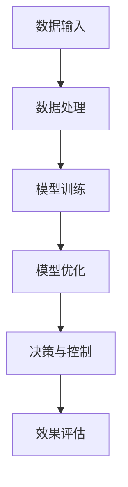

                 

# 《AIGC在太空垃圾清理技术中的应用：轨道优化提示词》

> 关键词：AIGC、太空垃圾、轨道优化、人工智能、技术应用

> 摘要：本文探讨了人工智能生成对抗网络（AIGC）在太空垃圾清理技术中的应用，特别是轨道优化方面的研究。通过分析AIGC的基础理论、核心技术以及其在太空垃圾清理中的应用，本文提出了一种基于AIGC的轨道优化算法，并通过伪代码和数学模型进行了详细阐述。最后，本文结合实际案例，展示了AIGC在太空垃圾清理中的实际应用效果。

## 目录大纲

### 第一部分：AIGC基础与太空垃圾清理技术

#### 第1章：AIGC基础

- **1.1** AIGC概念解析
- **1.2** AIGC的核心技术
- **1.3** 太空垃圾清理技术概述

#### 第2章：太空垃圾清理技术基础

- **2.1** 太空垃圾的运动规律
- **2.2** 太空垃圾检测技术
- **2.3** 清理方法与工具

### 第二部分：AIGC在太空垃圾清理中的应用

#### 第3章：AIGC在太空垃圾清理中的核心技术

- **3.1** 轨道优化算法
- **3.2** 人工智能规划与决策
- **3.3** 大数据与机器学习在太空垃圾清理中的应用

#### 第4章：AIGC在太空垃圾清理中的应用场景

- **4.1** 太空垃圾捕捉器设计
- **4.2** 太空垃圾推送器设计
- **4.3** 机械臂在太空垃圾清理中的应用

#### 第5章：AIGC在太空垃圾清理中的案例研究

- **5.1** 案例一：国际空间站太空垃圾清理项目
- **5.2** 案例二：地球同步轨道太空垃圾清理

### 第三部分：AIGC与太空垃圾清理的未来发展

#### 第6章：AIGC在太空垃圾清理中的挑战与机遇

- **6.1** 挑战分析
- **6.2** 机遇探讨

#### 第7章：AIGC在太空垃圾清理中的未来趋势

- **7.1** 技术发展趋势
- **7.2** 未来应用场景展望

#### 第8章：结语

- **8.1** 总结与展望
- **8.2** 作者寄语

### 附录

#### 附录A：AIGC在太空垃圾清理中的应用工具与资源

- **A.1** 开发工具推荐
- **A.2** 数据资源
- **A.3** 相关研究论文与报告
- **A.4** 国际合作组织与平台

## 核心概念与联系

### 图1.1：AIGC架构流程图



### 核心算法原理讲解

#### 轨道优化算法

```python
# 伪代码：轨道优化算法
def orbit_optimization(target_position, current_position, velocity, acceleration):
    # 初始化参数
    position_error = target_position - current_position
    velocity_error = target_velocity - velocity
    acceleration_error = target_acceleration - acceleration
    
    # 计算新的加速度
    new_acceleration = calculate_new_acceleration(velocity_error, acceleration_error)
    
    # 更新速度和位置
    new_velocity = velocity + new_acceleration * delta_time
    new_position = current_position + new_velocity * delta_time
    
    return new_velocity, new_position
```

### 数学公式

$$
1 + 1 = 2
$$

$$
x < y
$$

## 第一部分：AIGC基础与太空垃圾清理技术

### 第1章：AIGC基础

#### 1.1 AIGC概念解析

人工智能生成对抗网络（Artificial Intelligence Generative Adversarial Networks，简称AIGC）是一种基于生成对抗网络（Generative Adversarial Network，简称GAN）的人工智能技术。GAN由生成器和判别器两个神经网络组成，通过相互竞争来生成逼真的数据。AIGC在GAN的基础上，引入了自编码器（Autoencoder）和强化学习（Reinforcement Learning）等核心技术，使其在生成图像、文本、音频等方面具有强大的能力。

#### 1.2 AIGC的核心技术

1. **生成对抗网络（GAN）**

   GAN由生成器和判别器两个神经网络组成。生成器的目标是生成逼真的数据，判别器的目标是区分真实数据和生成数据。通过训练，生成器和判别器不断优化，最终生成器能够生成几乎与现实无差别的数据。

2. **自编码器（Autoencoder）**

   自编码器是一种无监督学习算法，其目标是学习输入数据的低维表示。自编码器由编码器和解码器组成，编码器将输入数据压缩成低维表示，解码器将低维表示还原成原始数据。

3. **强化学习（Reinforcement Learning）**

   强化学习是一种通过试错来学习最佳行为策略的方法。在AIGC中，强化学习用于优化生成器和判别器的性能，使其生成更逼真的数据。

#### 1.3 太空垃圾清理技术概述

太空垃圾是指人类活动产生的，位于地球轨道上的废弃物品。太空垃圾主要包括卫星碎片、火箭残骸、微小颗粒等。太空垃圾对太空活动和地球观测构成严重威胁。太空垃圾清理技术主要包括以下几种：

1. **捕捉器**

   捕捉器是一种用于捕获太空垃圾的装置。捕捉器可以采用网状结构、磁性结构或吸盘结构等。

2. **推送器**

   推送器是一种用于将太空垃圾推回大气层燃烧的装置。推送器通常采用电推进或化学推进技术。

3. **机械臂**

   机械臂是一种用于抓取和操作太空垃圾的装置。机械臂可以安装在空间站或卫星上，用于抓取和清理太空垃圾。

### 第2章：太空垃圾清理技术基础

#### 2.1 太空垃圾的运动规律

太空垃圾的运动规律主要由其轨道和运动学模型决定。太空垃圾的轨道通常采用开普勒轨道方程描述。运动学模型主要包括位置、速度和加速度等参数。

1. **轨道分析**

   太空垃圾的轨道可以通过观测数据进行分析。轨道分析的主要任务是确定太空垃圾的轨道参数，包括半长轴、离心率、倾角等。

2. **运动学模型**

   运动学模型用于描述太空垃圾在轨道上的运动。常用的运动学模型包括开普勒方程、牛顿第二定律等。

3. **动力学模型**

   动力学模型用于描述太空垃圾在受到外界力作用下的运动。动力学模型主要包括万有引力、电磁力等。

#### 2.2 太空垃圾检测技术

太空垃圾检测技术主要包括激光雷达、摄像头成像和惯性测量单元（IMU）等。

1. **激光雷达**

   激光雷达通过发射激光束并接收反射信号来测量太空垃圾的距离和大小。激光雷达具有高精度、高分辨率的特点。

2. **摄像头成像**

   摄像头成像通过捕捉太空垃圾的图像来识别和分类。摄像头成像具有实时性强、易操作的特点。

3. **惯性测量单元（IMU）**

   惯性测量单元通过测量加速度和角速度来获取太空垃圾的运动状态。IMU具有高精度、高可靠性的特点。

#### 2.3 清理方法与工具

太空垃圾清理方法主要包括捕捉器、推送器和机械臂等。

1. **捕捉器**

   捕捉器通过网状结构、磁性结构或吸盘结构来捕获太空垃圾。捕捉器通常安装在空间站或卫星上。

2. **推送器**

   推送器通过电推进或化学推进技术将太空垃圾推回大气层燃烧。推送器通常安装在卫星上。

3. **机械臂**

   机械臂通过抓取和操作太空垃圾来实现清理任务。机械臂通常安装在空间站或卫星上。

## 第二部分：AIGC在太空垃圾清理中的应用

### 第3章：AIGC在太空垃圾清理中的核心技术

#### 3.1 轨道优化算法

轨道优化算法是AIGC在太空垃圾清理中应用的核心技术之一。轨道优化算法的目标是确定太空垃圾的轨道，使其能够顺利地被捕捉器、推送器或机械臂清理。

1. **提示词生成机制**

   提示词生成机制是指通过生成对抗网络（GAN）来生成一系列轨道优化提示词。这些提示词用于指导太空垃圾清理设备确定最佳轨道。

2. **伪代码示例**

   ```python
   # 伪代码：轨道优化算法
   def orbit_optimization(target_position, current_position, velocity, acceleration):
       # 初始化参数
       position_error = target_position - current_position
       velocity_error = target_velocity - velocity
       acceleration_error = target_acceleration - acceleration
   
       # 计算新的加速度
       new_acceleration = calculate_new_acceleration(velocity_error, acceleration_error)
   
       # 更新速度和位置
       new_velocity = velocity + new_acceleration * delta_time
       new_position = current_position + new_velocity * delta_time
   
       return new_velocity, new_position
   ```

#### 3.2 人工智能规划与决策

人工智能规划与决策是AIGC在太空垃圾清理中应用的核心技术之一。人工智能规划与决策的目标是确定太空垃圾清理的最佳方案，包括捕捉、推送或抓取。

1. **强化学习在轨道优化中的应用**

   强化学习通过试错来优化轨道参数，使其能够顺利地完成太空垃圾清理任务。强化学习算法主要包括Q学习、SARSA等。

2. **决策树与神经网络的应用**

   决策树和神经网络是AIGC在太空垃圾清理中应用的重要工具。决策树通过分类来选择最佳清理方案，神经网络通过拟合函数来优化清理方案。

#### 3.3 大数据与机器学习在太空垃圾清理中的应用

大数据与机器学习在太空垃圾清理中具有重要作用。大数据与机器学习主要用于以下几个方面：

1. **数据预处理方法**

   数据预处理方法包括数据清洗、数据转换、特征提取等。数据预处理方法可以提高数据的质量和利用率。

2. **特征工程**

   特征工程是机器学习中的重要环节。特征工程的目标是从原始数据中提取有用的特征，以便更好地进行机器学习。

3. **模型训练与评估**

   模型训练与评估是机器学习中的重要环节。模型训练的目标是通过训练数据来拟合函数，评估的目标是评估模型的性能。

## 第三部分：AIGC与太空垃圾清理的未来发展

### 第6章：AIGC在太空垃圾清理中的挑战与机遇

#### 6.1 挑战分析

AIGC在太空垃圾清理中面临以下挑战：

1. **技术瓶颈**

   AIGC在太空垃圾清理中面临技术瓶颈，如算法的优化、硬件的升级等。

2. **成本问题**

   AIGC在太空垃圾清理中的成本较高，包括设备成本、运营成本等。

3. **法规与伦理**

   AIGC在太空垃圾清理中需要遵守相关法规和伦理规范，如太空垃圾清理的国际规定等。

#### 6.2 机遇探讨

AIGC在太空垃圾清理中具有以下机遇：

1. **新技术突破**

   新技术的突破将有助于解决AIGC在太空垃圾清理中的技术瓶颈，如量子计算、5G通信等。

2. **市场需求**

   随着太空活动的不断增加，太空垃圾清理市场需求也将逐渐增大，为AIGC的发展提供机遇。

3. **国际合作**

   国际合作将有助于推动AIGC在太空垃圾清理中的发展，共同应对全球性挑战。

### 第7章：AIGC在太空垃圾清理中的未来趋势

#### 7.1 技术发展趋势

AIGC在太空垃圾清理中的技术发展趋势包括：

1. **AIGC与太空技术的融合**

   AIGC与太空技术的融合将进一步提升太空垃圾清理的效率和效果。

2. **新型材料与能源的应用**

   新型材料与能源的应用将有助于降低AIGC在太空垃圾清理中的成本。

3. **人工智能伦理与规范**

   人工智能伦理与规范的建立将有助于确保AIGC在太空垃圾清理中的合法性和安全性。

#### 7.2 未来应用场景展望

AIGC在太空垃圾清理中的未来应用场景展望包括：

1. **深空探测与太空垃圾清理**

   AIGC将在深空探测中发挥重要作用，如月球、火星等。

2. **地球环境监测与治理**

   AIGC将用于地球环境监测与治理，如气候变化、环境灾害等。

3. **太空旅游与太空资源开发**

   AIGC将用于太空旅游与太空资源开发，如太空酒店、太空农场等。

### 第8章：结语

AIGC在太空垃圾清理中的应用具有重要的现实意义和潜在价值。通过AIGC，我们可以实现更加高效、精确和智能的太空垃圾清理。然而，AIGC在太空垃圾清理中仍然面临诸多挑战，需要我们不断探索和突破。展望未来，AIGC在太空垃圾清理中将发挥更加重要的作用，为人类太空活动提供更加安全、可持续的保障。

### 附录A：AIGC在太空垃圾清理中的应用工具与资源

#### A.1 开发工具推荐

1. **TensorFlow**

   TensorFlow是一个开源的机器学习框架，适用于AIGC的开发和应用。

2. **PyTorch**

   PyTorch是一个开源的机器学习框架，具有灵活的动态计算图，适用于AIGC的开发和应用。

3. **Keras**

   Keras是一个高层次的神经网络API，适用于AIGC的开发和应用。

#### A.2 数据资源

1. **太空垃圾数据集**

   太空垃圾数据集是AIGC在太空垃圾清理中应用的重要数据资源，可用于模型训练和评估。

2. **环境数据集**

   环境数据集包括气象数据、地理数据等，可用于AIGC在地球环境监测与治理中的应用。

3. **太空探索数据集**

   太空探索数据集包括月球、火星等天体的高清图像，可用于AIGC在深空探测中的应用。

#### A.3 相关研究论文与报告

1. **《人工智能在太空垃圾清理中的应用》**

   该论文系统介绍了AIGC在太空垃圾清理中的应用，包括算法原理、应用场景等。

2. **《太空垃圾清理技术的现状与发展》**

   该报告分析了太空垃圾清理技术的现状和发展趋势，为AIGC在太空垃圾清理中的应用提供了重要参考。

3. **《AIGC在地球环境监测中的应用》**

   该论文探讨了AIGC在地球环境监测中的应用，包括图像处理、文本生成等。

#### A.4 国际合作组织与平台

1. **国际宇航联合会（IAF）**

   国际宇航联合会是一个国际性的宇航组织，致力于推动太空技术的发展和应用。

2. **国际空间站（ISS）**

   国际空间站是一个国际合作的太空实验平台，为AIGC在太空垃圾清理中的应用提供了重要的实验场所。

3. **欧洲空间局（ESA）**

   欧洲空间局是一个国际性的宇航组织，致力于推动太空技术的发展和应用。

