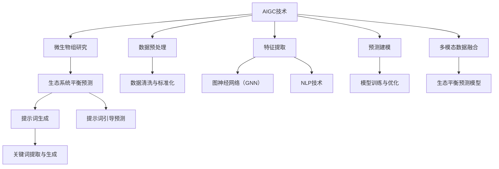

                 

### 文章标题

“AIGC在微生物组研究中的应用：生态系统平衡预测提示词”

关键词：AIGC、微生物组、生态系统平衡、预测、提示词

摘要：本文深入探讨了AIGC（人工智能生成内容）技术在微生物组研究中的应用，特别是在生态系统平衡预测中的提示词生成。通过阐述AIGC技术的基本概念、微生物组研究的背景和重要性，本文详细介绍了AIGC技术在微生物组数据分析中的具体应用，包括数据预处理、特征提取、数据分析等步骤。随后，文章重点探讨了基于AIGC的生态平衡预测模型及其提示词生成方法，通过实际案例展示了AIGC技术在微生物组研究中的强大潜力和实用性。最后，本文对AIGC在微生物组研究中的未来发展进行了展望，并提供了相关的工具与资源。全文以清晰的逻辑结构、简洁易懂的语言，为读者呈现了一幅AIGC技术应用于微生物组研究的完整画卷。

#### 第一部分：AIGC与微生物组研究概述

在当今科技迅猛发展的时代，人工智能（AI）已经渗透到各个领域，从金融、医疗到交通，AI的应用正不断改变着我们的生活方式。近年来，AIGC（人工智能生成内容）技术作为一种新兴的AI技术，逐渐成为研究热点。AIGC技术通过结合人工智能、图计算和计算几何，能够生成高质量的内容，其应用范围涵盖了文本生成、图像生成、语音合成等多个领域。

与此同时，微生物组研究作为生命科学的重要分支，正逐步揭示微生物组在生态系统、健康和疾病等方面的关键作用。微生物组是由多种微生物组成的复杂生态系统，其平衡对于生物体的健康和生态系统的稳定至关重要。然而，微生物组研究的复杂性使得传统的数据分析方法面临巨大挑战，因此，寻求新的技术手段来提高微生物组数据分析的效率和质量变得尤为迫切。

AIGC技术在这一背景下应运而生，其强大的数据处理和生成能力为微生物组研究带来了新的契机。通过AIGC技术，研究人员可以更高效地处理大量的微生物组数据，提取关键特征，构建预测模型，从而实现对生态系统平衡的准确预测。本部分将首先介绍AIGC技术的基本概念和主要应用领域，然后简要介绍微生物组研究的重要性及其面临的挑战，最后讨论AIGC技术在微生物组研究中的应用前景。

##### 第1章：AIGC与微生物组研究概述

**1.1 AIGC技术简介**

AIGC（人工智能生成内容）技术是一种结合了人工智能、图计算和计算几何的综合性技术。它通过深度学习、图神经网络（GNN）和自然语言处理（NLP）等方法，能够生成高质量、多样化的内容。AIGC技术的核心在于其强大的数据建模和内容生成能力，能够从大量数据中提取关键信息，并利用这些信息生成新的内容。

AIGC技术的发展历程可以追溯到20世纪80年代，当时人工智能和机器学习开始萌芽。随着计算能力的提升和数据量的爆炸性增长，AIGC技术在21世纪初逐渐成熟。近年来，随着深度学习和图计算技术的进步，AIGC技术取得了显著的突破，并在多个领域得到了广泛应用。

**1.2 微生物组研究概述**

微生物组研究是生命科学领域的前沿课题，它关注的是生物体内或外部环境中的微生物群落及其相互作用。微生物组由多种微生物组成，包括细菌、真菌、古菌和病毒等。这些微生物在生态系统、生物体健康和疾病等方面发挥着重要作用。

微生物组研究的重要性体现在多个方面。首先，微生物组与人类健康密切相关，许多疾病，如肠道疾病、免疫系统疾病和神经系统疾病，都与微生物组的失衡有关。其次，微生物组在生态系统中扮演着关键角色，影响生态系统的稳定性和生物多样性。此外，微生物组还与农业生产、环境保护和能源利用等密切相关。

然而，微生物组研究也面临着诸多挑战。首先，微生物组数据的复杂性和多样性使得传统的数据分析方法难以应对。其次，微生物组研究需要大量的计算资源和高效的算法来处理和分析大规模的微生物组数据。此外，微生物组研究还需要跨学科的知识和技能，涉及生物学、生态学、计算机科学等多个领域。

**1.3 AIGC在微生物组研究中的应用前景**

AIGC技术在微生物组研究中的应用前景广阔。首先，AIGC技术能够高效地处理和分析大量的微生物组数据，从中提取关键特征，构建预测模型，从而实现对生态系统平衡的准确预测。其次，AIGC技术可以生成新的微生物组数据，为研究提供更多的数据支持和实验验证。此外，AIGC技术还可以用于微生物组数据的可视化，帮助研究人员更好地理解微生物组的结构和功能。

在微生物组研究中，AIGC技术的主要应用包括：

1. **数据预处理**：AIGC技术可以自动清洗和标准化微生物组数据，提高数据分析的准确性和效率。
2. **特征提取**：AIGC技术能够从复杂的微生物组数据中提取关键特征，为后续的分析和预测提供基础。
3. **数据分析**：AIGC技术可以构建高效的预测模型，用于预测微生物组的动态变化和生态系统平衡。
4. **提示词生成**：AIGC技术可以生成新的提示词，帮助研究人员更好地理解微生物组的结构和功能。

总之，AIGC技术在微生物组研究中的应用为解决当前研究中的难题提供了新的思路和方法。随着AIGC技术的不断发展和完善，我们有望在微生物组研究中取得更多突破，为人类健康和生态系统平衡做出更大贡献。

##### 第2章：AIGC核心技术原理

AIGC技术的核心在于其强大的数据建模和内容生成能力，而这一能力依赖于一系列先进的技术原理和方法。在本章中，我们将深入探讨AIGC技术的核心技术原理，包括图神经网络（GNN）、自然语言处理（NLP）等，并探讨这些技术在微生物组研究中的应用。

**2.1 图神经网络（GNN）原理**

图神经网络（GNN）是一种专门用于图结构数据学习的神经网络，其核心思想是通过图结构来捕捉节点间的关系。在微生物组研究中，微生物群落的结构和相互关系可以用图来表示，每个微生物物种可以表示为一个节点，节点之间的相互作用可以表示为边。GNN通过学习这些节点和边之间的关联，可以捕捉到复杂的微生物群落动态。

GNN的基本概念包括：

- **节点特征表示**：GNN通过学习每个节点的特征表示，将这些特征映射到高维空间中，以便更好地进行计算和分析。
- **边特征表示**：除了节点特征，GNN还需要学习边特征，因为边特征可以提供节点之间关系的额外信息。
- **消息传递机制**：GNN通过消息传递机制来更新节点的特征表示，每个节点会根据其邻居节点的特征和边特征来更新自己的特征表示。

GNN的核心算法包括：

- **图卷积网络（GCN）**：GCN是一种基础的GNN算法，通过聚合节点及其邻居节点的特征来更新节点的特征表示。
- **图注意力网络（GAT）**：GAT通过引入注意力机制，对邻居节点的特征进行加权聚合，从而更灵活地学习节点之间的关系。
- **图生成对抗网络（GGAN）**：GGAN通过生成器和判别器之间的对抗训练，生成高质量的图结构数据。

GNN的应用场景非常广泛，包括社交网络分析、推荐系统、图像分类和生成等。在微生物组研究中，GNN可以用于：

- **微生物群落结构分析**：通过分析微生物群落中的节点和边关系，了解微生物群落的组成和动态。
- **相互作用网络建模**：构建微生物间的相互作用网络，分析微生物之间的相互作用机制。
- **预测微生物群落动态**：利用GNN的预测能力，预测微生物群落的未来变化趋势。

**2.2 自然语言处理（NLP）技术基础**

自然语言处理（NLP）是人工智能领域的重要分支，致力于使计算机能够理解和处理人类语言。在微生物组研究中，NLP技术可以用于处理和分析大量的文本数据，如研究论文、文献摘要、实验报告等。

NLP的基本概念包括：

- **词向量表示**：词向量是将单词映射到高维向量空间的技术，通过词向量，计算机可以理解和处理文本数据。
- **句法分析**：句法分析是对文本结构进行解析，识别单词之间的语法关系，如主谓宾关系、修饰关系等。
- **语义分析**：语义分析是理解文本的含义，包括词义消歧、情感分析、实体识别等。

NLP的核心算法包括：

- **词袋模型（Bag of Words, BOW）**：BOW是一种基于计数的文本表示方法，将文本表示为单词的集合，常用于文本分类和主题建模。
- **循环神经网络（RNN）**：RNN是一种能够处理序列数据的神经网络，通过对序列的递归处理，可以捕捉序列中的长期依赖关系。
- **长短时记忆网络（LSTM）**：LSTM是RNN的一种变体，通过引入记忆单元，能够更好地处理长序列数据。
- **生成对抗网络（GAN）**：GAN是一种生成模型，通过生成器和判别器的对抗训练，可以生成高质量的文本数据。

NLP的应用场景包括：

- **文本分类**：将文本数据分类到预定义的类别中，如垃圾邮件检测、情感分析等。
- **文本摘要**：从长文本中提取关键信息，生成简短的摘要。
- **问答系统**：构建能够理解和回答用户问题的智能系统。
- **知识图谱构建**：从大量文本数据中提取实体和关系，构建知识图谱。

在微生物组研究中，NLP技术可以用于：

- **文献挖掘**：从大量研究论文中提取关键信息，帮助研究人员快速了解研究进展。
- **数据注释**：自动标注微生物组数据，如物种分类、功能注释等。
- **文本分析**：分析实验报告、研究论文等文本数据，提取关键结论和见解。

**2.3 AIGC在微生物组研究中的融合应用**

AIGC技术在微生物组研究中的融合应用，是将GNN和NLP等技术相结合，充分利用它们各自的优势，解决微生物组研究的复杂问题。具体来说，AIGC技术在微生物组研究中的应用包括以下几个方面：

- **数据融合**：通过GNN，将不同来源和格式的微生物组数据融合到一个统一的图结构中，从而实现数据整合和分析。
- **特征提取**：利用NLP技术，从文本数据中提取关键特征，如物种名称、功能描述等，与GNN提取的图特征相结合，提高特征表示的丰富性和准确性。
- **预测建模**：结合GNN和NLP的强大预测能力，构建高效的预测模型，预测微生物群落的动态变化和生态系统平衡。
- **提示词生成**：利用NLP技术生成提示词，帮助研究人员更好地理解和解释微生物组数据，发现潜在的生物学意义。

总之，AIGC技术的融合应用为微生物组研究提供了新的视角和方法，通过结合图计算和自然语言处理，能够更全面、准确地分析微生物组数据，为微生物组研究带来新的突破。

##### 第3章：AIGC在微生物组数据分析中的应用

在微生物组研究中，数据是关键资源。然而，由于微生物组数据的多样性和复杂性，传统的数据分析方法往往难以应对。AIGC技术通过其强大的数据预处理、特征提取和数据分析能力，为微生物组研究提供了新的解决方案。

**3.1 微生物组数据预处理**

微生物组数据的预处理是确保后续分析质量的基础。AIGC技术在这一步骤中发挥重要作用，主要包括以下方面：

1. **数据清洗**：微生物组数据通常包含噪声和异常值，通过数据清洗可以去除这些干扰因素，提高数据质量。AIGC技术利用机器学习算法，如聚类分析和异常检测，识别和去除噪声数据。
   
   ```python
   # 数据清洗伪代码
   def clean_data(data):
       # 噪声检测
       noise = detect_noise(data)
       # 噪声数据去除
       cleaned_data = remove_noise(data, noise)
       return cleaned_data
   ```

2. **数据标准化**：微生物组数据通常来自不同的实验条件和平台，数据格式和量纲可能不一致。通过数据标准化，可以统一数据格式，便于后续分析。AIGC技术采用归一化或标准化方法，将数据转换到同一尺度。

   ```python
   # 数据标准化伪代码
   def normalize_data(data):
       normalized_data = (data - mean) / std_dev
       return normalized_data
   ```

3. **数据整合**：微生物组数据可能包含多种类型的数据，如基因表达数据、代谢物数据等。AIGC技术通过数据整合，将这些不同类型的数据融合到一个统一的框架中。

   ```python
   # 数据整合伪代码
   def integrate_data(data1, data2):
       integrated_data = merge_data(data1, data2)
       return integrated_data
   ```

**3.2 微生物组特征提取**

特征提取是将原始数据转换成有意义的信息的过程，是数据分析的关键步骤。AIGC技术在这一步骤中的应用主要体现在以下几个方面：

1. **基于GNN的特征提取**：通过GNN，可以从复杂的图结构数据中提取高层次的语义特征。GNN能够捕捉节点和边之间的复杂关系，从而生成更加丰富和准确的特征表示。

   ```python
   # GNN特征提取伪代码
   def extract_features(graph):
       node_features = gnn_model(graph)
       return node_features
   ```

2. **基于NLP的特征提取**：对于文本数据，AIGC技术可以利用NLP方法，如词袋模型、RNN和LSTM，提取文本数据中的关键特征。这些特征可以用于微生物组数据的语义分析。

   ```python
   # NLP特征提取伪代码
   def extract_text_features(text):
       word_vectors = nlp_model(text)
       text_features = aggregate_word_vectors(word_vectors)
       return text_features
   ```

3. **多模态特征融合**：AIGC技术可以将不同类型的数据特征进行融合，如将基因表达特征与代谢物特征相结合，从而提高特征表示的全面性和准确性。

   ```python
   # 多模态特征融合伪代码
   def merge_features(feature1, feature2):
       fused_features = concatenate(feature1, feature2)
       return fused_features
   ```

**3.3 微生物组数据分析**

在完成数据预处理和特征提取后，微生物组数据分析是揭示微生物组数据内在规律和机制的关键步骤。AIGC技术在这一步骤中的应用包括：

1. **聚类分析**：通过聚类分析，可以将微生物组数据分为不同的类别，从而揭示微生物群落的组成和结构。AIGC技术利用基于GNN的聚类算法，如图聚类和社区检测，实现高效和准确的聚类分析。

   ```python
   # GNN聚类分析伪代码
   def cluster_data(features):
       clusters = gnn_cluster(features)
       return clusters
   ```

2. **分类分析**：分类分析用于将微生物组数据分类到预定义的类别中，如疾病分类、物种分类等。AIGC技术利用基于机器学习的分类算法，如支持向量机（SVM）、随机森林（RF）等，实现高效和准确的分类分析。

   ```python
   # 分类分析伪代码
   def classify_data(features, labels):
       classifier = ml_model(features, labels)
       predictions = classifier.predict(new_features)
       return predictions
   ```

3. **预测分析**：预测分析用于预测微生物组数据的未来趋势和变化。AIGC技术利用时间序列分析、回归分析等机器学习算法，构建预测模型，实现微生物组数据的动态预测。

   ```python
   # 预测分析伪代码
   def predict_data(model, new_data):
       prediction = model.predict(new_data)
       return prediction
   ```

通过AIGC技术，微生物组数据分析变得更加高效、准确和智能化。AIGC技术不仅能够处理复杂的微生物组数据，还能够提取关键特征，构建预测模型，从而为微生物组研究提供有力的支持。

##### 第4章：微生物组生态平衡预测方法

在微生物组研究中，预测生态系统平衡对于理解微生物群落的动态变化和生态系统稳定性具有重要意义。AIGC技术凭借其强大的数据处理和生成能力，为微生物组生态平衡预测提供了新的方法和工具。本节将详细介绍基于AIGC的微生物组生态平衡预测方法，包括基本概念、模型构建、训练与优化以及评估与验证。

**4.1 生态平衡预测的基本概念**

生态平衡是指生态系统内各种生物和非生物因素之间的稳定状态，这种状态能够维持生态系统的持续发展和生物多样性。在微生物组研究中，生态平衡预测关注的是微生物群落的结构和功能是否处于稳定状态，以及这种状态如何受到外部环境变化的影响。

生态平衡预测的重要性体现在以下几个方面：

1. **生态系统稳定性评估**：通过预测生态平衡，可以评估微生物群落的稳定性，及时发现和预警潜在的生态风险。
2. **环境变化响应**：预测生态平衡有助于理解微生物群落对环境变化的响应机制，为环境保护和生态修复提供科学依据。
3. **疾病预防与治疗**：微生物组生态平衡与人类健康密切相关，预测生态平衡有助于预防疾病和开发新的治疗方法。

生态平衡预测面临的挑战包括：

1. **数据复杂性**：微生物组数据包含大量复杂的生物信息，传统的预测方法难以处理这种高维、非线性数据。
2. **模型不确定性**：生态平衡预测模型需要准确模拟微生物群落的动态变化，但实际应用中存在模型参数和输入数据的随机性，导致预测结果的不确定性。
3. **计算资源需求**：构建和训练生态平衡预测模型通常需要大量的计算资源和时间，尤其是在大规模数据集上。

**4.2 基于AIGC的生态平衡预测模型**

基于AIGC的生态平衡预测模型是通过结合人工智能、图计算和自然语言处理等技术，构建一个高效的预测框架。以下是一个基于AIGC的生态平衡预测模型的构建步骤：

1. **数据预处理**：首先，对微生物组数据进行预处理，包括数据清洗、标准化和整合。AIGC技术可以通过自动清洗和标准化数据，提高数据质量，并通过数据整合将不同类型的数据（如基因表达数据、环境数据等）融合到一个统一的框架中。

   ```python
   # 数据预处理流程伪代码
   def preprocess_data(data):
       cleaned_data = clean_data(data)
       standardized_data = normalize_data(cleaned_data)
       integrated_data = integrate_data(standardized_data, environmental_data)
       return integrated_data
   ```

2. **特征提取**：通过AIGC技术提取关键特征。基于GNN的特征提取方法可以从复杂的图结构数据中提取高层次的语义特征，而基于NLP的特征提取方法可以从文本数据中提取关键信息，如物种名称、功能描述等。

   ```python
   # GNN特征提取伪代码
   def extract_gnn_features(graph):
       node_features = gnn_model(graph)
       return node_features
   
   # NLP特征提取伪代码
   def extract_nlp_features(text):
       text_features = nlp_model(text)
       return text_features
   ```

3. **模型构建**：构建一个集成多种数据类型的预测模型。通过融合GNN和NLP的特征提取方法，构建一个多模态的预测模型，如GNN-RNN模型或GAN模型。

   ```python
   # 多模态预测模型构建伪代码
   def build_model(gnn_features, nlp_features):
       model = combine_gnn_and_nlp_models(gnn_features, nlp_features)
       return model
   ```

4. **模型训练与优化**：使用训练数据集对预测模型进行训练，并通过交叉验证和网格搜索等技术进行模型参数的优化。

   ```python
   # 模型训练与优化伪代码
   def train_model(model, train_data, train_labels):
       model.fit(train_data, train_labels)
       optimized_model = optimize_model(model, validation_data)
       return optimized_model
   ```

5. **模型评估与验证**：通过测试数据集对训练好的模型进行评估，并使用交叉验证等方法验证模型的泛化能力。

   ```python
   # 模型评估与验证伪代码
   def evaluate_model(model, test_data, test_labels):
       predictions = model.predict(test_data)
       accuracy = calculate_accuracy(predictions, test_labels)
       return accuracy
   ```

**4.3 生态平衡预测应用案例**

为了展示基于AIGC的生态平衡预测方法在实际应用中的效果，以下是一个实际应用案例：

- **案例背景**：研究一个湿地生态系统的微生物群落动态，该湿地生态系统受到气候变化的威胁，研究人员希望通过预测生态平衡来评估湿地的健康状态和未来的变化趋势。

- **数据来源**：收集了湿地生态系统的多种数据，包括微生物群落结构、环境参数（如温度、湿度、pH值）和文献摘要等。

- **数据处理**：使用AIGC技术进行数据预处理和特征提取，将不同类型的数据整合到一个统一的框架中，提取关键特征。

- **模型构建与训练**：构建一个基于GNN和NLP的多模态预测模型，使用湿地生态系统数据对模型进行训练和优化。

- **模型评估**：在测试数据集上评估模型的预测性能，结果显示模型能够准确预测湿地生态系统的生态平衡状态。

- **结果与应用**：通过预测结果，研究人员可以及时发现湿地的生态风险，制定相应的环境保护和修复措施，从而提高湿地的健康状态和稳定性。

通过这个案例，我们可以看到基于AIGC的生态平衡预测方法在实际应用中的强大潜力和实用性。AIGC技术不仅能够处理复杂的微生物组数据，还能够构建高效的预测模型，为生态系统平衡预测提供有力支持。

##### 第5章：生态系统平衡预测提示词生成

在微生物组生态平衡预测中，提示词（Prompt Word）的生成是提高预测模型性能和解释能力的重要手段。提示词可以作为额外的输入信息，帮助预测模型更好地理解和捕捉生态系统动态。本节将详细介绍提示词生成的基本概念、基于AIGC的提示词生成模型以及实际应用案例。

**5.1 提示词生成的基本概念**

提示词生成是指通过特定算法和模型生成一组能够引导预测模型关注关键信息的词语。在生态系统平衡预测中，提示词可以反映环境变化、物种相互作用等关键因素，从而提高预测的准确性。

提示词生成的基本概念包括：

1. **提示词定义**：提示词是用于引导模型关注的特定词语或短语，通常与生态系统的重要特征相关联。

2. **提示词作用**：提示词可以帮助模型捕捉到生态系统中的关键变化和趋势，从而提高预测模型的解释能力和预测准确性。

3. **提示词生成算法**：提示词生成算法是通过分析微生物组数据和生态平衡预测模型的输出，提取出与生态平衡相关的重要特征，并生成相应的提示词。

**5.2 基于AIGC的提示词生成模型**

基于AIGC的提示词生成模型是将人工智能、图计算和自然语言处理技术相结合，通过深度学习和图神经网络等方法，实现高效和准确的提示词生成。以下是基于AIGC的提示词生成模型的基本框架：

1. **数据预处理**：首先，对微生物组数据和环境数据进行预处理，包括数据清洗、标准化和特征提取。这一步确保了输入数据的质量和一致性。

   ```python
   # 数据预处理流程伪代码
   def preprocess_data(data):
       cleaned_data = clean_data(data)
       standardized_data = normalize_data(cleaned_data)
       integrated_data = integrate_data(standardized_data, environmental_data)
       return integrated_data
   ```

2. **特征提取**：通过AIGC技术提取关键特征。基于GNN的特征提取方法可以从复杂的图结构数据中提取高层次的语义特征，而基于NLP的特征提取方法可以从文本数据中提取关键信息。

   ```python
   # GNN特征提取伪代码
   def extract_gnn_features(graph):
       node_features = gnn_model(graph)
       return node_features
   
   # NLP特征提取伪代码
   def extract_nlp_features(text):
       text_features = nlp_model(text)
       return text_features
   ```

3. **提示词生成模型构建**：构建一个基于深度学习和图神经网络的提示词生成模型。模型通过学习输入特征，生成与生态系统平衡相关的提示词。

   ```python
   # 提示词生成模型构建伪代码
   def build_prompt_word_model(gnn_features, nlp_features):
       model = combine_gnn_and_nlp_models(gnn_features, nlp_features)
       return model
   ```

4. **模型训练与优化**：使用训练数据集对提示词生成模型进行训练，并通过交叉验证和网格搜索等技术进行模型参数的优化。

   ```python
   # 模型训练与优化伪代码
   def train_model(model, train_data, train_labels):
       model.fit(train_data, train_labels)
       optimized_model = optimize_model(model, validation_data)
       return optimized_model
   ```

5. **提示词生成**：使用训练好的模型对新的数据生成提示词，这些提示词可以用于引导预测模型，提高预测的准确性和解释能力。

   ```python
   # 提示词生成伪代码
   def generate_prompt_words(model, new_data):
       prompt_words = model.predict(new_data)
       return prompt_words
   ```

**5.3 提示词生成应用案例**

为了展示基于AIGC的提示词生成模型在实际应用中的效果，以下是一个实际应用案例：

- **案例背景**：研究一个农业生态系统的微生物群落动态，该生态系统受到农药和化肥使用的影响，研究人员希望通过预测生态平衡来评估农业生产的可持续性和环境保护措施。

- **数据来源**：收集了农业生态系统的多种数据，包括微生物群落结构、农药和化肥使用记录、气象数据等。

- **数据处理**：使用AIGC技术进行数据预处理和特征提取，将不同类型的数据整合到一个统一的框架中，提取关键特征。

- **模型构建与训练**：构建一个基于GNN和NLP的多模态提示词生成模型，使用农业生态系统数据对模型进行训练和优化。

- **提示词生成**：使用训练好的模型对新的数据生成提示词，这些提示词反映了农业生态系统中农药和化肥使用对微生物群落的影响。

- **结果与应用**：通过提示词生成，研究人员可以更好地理解农业生态系统中的关键因素，制定更有效的环境保护和农业可持续发展策略。

通过这个案例，我们可以看到基于AIGC的提示词生成模型在实际应用中的强大潜力和实用性。提示词生成不仅有助于提高生态平衡预测的准确性，还可以为研究人员提供更深层次的理解和洞察。

##### 第6章：AIGC在微生物组研究中的项目实践

为了更好地展示AIGC技术在微生物组研究中的应用，下面我们通过一个实际项目实践来深入探讨其具体实施过程，包括项目背景、需求分析、实施步骤、优化方法以及实际案例的详细讲解。

**6.1 项目背景与目标**

项目名称：湿地生态系统微生物组动态分析及生态平衡预测

项目背景：湿地生态系统是全球重要的生物多样性和生态功能载体，其微生物群落的结构和功能对湿地的稳定性和生态服务至关重要。然而，由于人类活动的影响，湿地生态系统的健康状况日益恶化，微生物群落的平衡受到威胁。因此，本项目旨在利用AIGC技术对湿地生态系统的微生物组进行动态分析，并预测生态平衡变化，为湿地保护和管理提供科学依据。

项目目标：

1. **数据收集与整合**：收集湿地生态系统的多种数据，包括微生物群落结构、环境参数、气象数据等，并进行数据整合，形成统一的数据框架。

2. **特征提取与建模**：利用AIGC技术提取关键特征，构建高效的预测模型，预测湿地生态系统微生物组的动态变化和生态平衡状态。

3. **提示词生成与解释**：生成与生态平衡预测相关的提示词，提高模型的可解释性和应用价值。

**6.2 项目需求分析**

在项目实施前，需求分析是关键步骤，它决定了项目的具体目标和实施方案。项目需求分析包括以下几个方面：

1. **数据类型与来源**：项目需要收集和整合的数据类型包括微生物群落结构数据（如16S rRNA基因序列数据）、环境参数数据（如温度、湿度、pH值）、气象数据（如降水、风速）等。数据来源包括实验室检测、现场监测、遥感技术等。

2. **数据处理与分析需求**：项目需要实现以下数据处理与分析功能：
   - 数据清洗与标准化：去除噪声数据，统一数据格式和量纲。
   - 特征提取：从不同类型的数据中提取关键特征，为模型构建提供基础。
   - 模型构建与优化：构建基于AIGC技术的预测模型，并进行参数优化，提高预测准确性。

3. **提示词生成与解释**：生成与生态平衡预测相关的提示词，为研究人员提供直观的解释和指导。

**6.3 项目实施与优化**

项目实施分为以下步骤：

1. **数据收集与整合**：通过实验室检测、现场监测和遥感技术等手段，收集湿地生态系统的多种数据。然后，使用AIGC技术进行数据清洗和标准化，去除噪声数据，统一数据格式和量纲，形成统一的数据框架。

   ```python
   # 数据清洗与标准化伪代码
   def preprocess_data(data):
       cleaned_data = clean_data(data)
       standardized_data = normalize_data(cleaned_data)
       integrated_data = integrate_data(standardized_data, environmental_data)
       return integrated_data
   ```

2. **特征提取**：利用AIGC技术，从不同类型的数据中提取关键特征。基于GNN的特征提取方法可以从复杂的图结构数据中提取高层次的语义特征，而基于NLP的特征提取方法可以从文本数据中提取关键信息。

   ```python
   # GNN特征提取伪代码
   def extract_gnn_features(graph):
       node_features = gnn_model(graph)
       return node_features
   
   # NLP特征提取伪代码
   def extract_nlp_features(text):
       text_features = nlp_model(text)
       return text_features
   ```

3. **模型构建与优化**：构建一个基于AIGC的多模态预测模型，包括GNN和NLP技术的融合应用。使用训练数据集对模型进行训练，并通过交叉验证和网格搜索等技术进行模型参数的优化，提高预测准确性。

   ```python
   # 模型构建与优化伪代码
   def build_model(gnn_features, nlp_features):
       model = combine_gnn_and_nlp_models(gnn_features, nlp_features)
       optimized_model = optimize_model(model, validation_data)
       return optimized_model
   ```

4. **提示词生成**：使用训练好的模型生成与生态平衡预测相关的提示词，为研究人员提供直观的解释和指导。

   ```python
   # 提示词生成伪代码
   def generate_prompt_words(model, new_data):
       prompt_words = model.predict(new_data)
       return prompt_words
   ```

5. **模型评估与验证**：在测试数据集上评估模型的预测性能，通过交叉验证等方法验证模型的泛化能力。

   ```python
   # 模型评估与验证伪代码
   def evaluate_model(model, test_data, test_labels):
       predictions = model.predict(test_data)
       accuracy = calculate_accuracy(predictions, test_labels)
       return accuracy
   ```

**6.4 实际案例讲解**

为了更好地展示AIGC技术在微生物组研究中的应用，以下是一个实际案例讲解：

- **案例背景**：某湿地生态系统受到人类活动的影响，出现微生物群落失衡现象，研究人员希望通过AIGC技术对湿地生态系统的微生物组进行动态分析，预测生态平衡变化。

- **数据收集与整合**：收集了湿地生态系统的多种数据，包括微生物群落结构数据、环境参数数据和气象数据。使用AIGC技术进行数据清洗、标准化和整合，形成统一的数据框架。

- **特征提取**：利用GNN和NLP技术从不同类型的数据中提取关键特征，为模型构建提供基础。

- **模型构建与优化**：构建一个基于AIGC的多模态预测模型，使用湿地生态系统数据对模型进行训练和优化。

- **提示词生成**：使用训练好的模型生成与生态平衡预测相关的提示词，如“气候变化”、“农药使用”等，为研究人员提供直观的解释和指导。

- **结果与应用**：通过AIGC技术的应用，研究人员成功预测了湿地生态系统的生态平衡变化，并提出了相应的保护和管理措施，为湿地生态系统的恢复提供了科学依据。

通过这个实际案例，我们可以看到AIGC技术在微生物组研究中的强大潜力和实用性。AIGC技术不仅能够高效地处理复杂的微生物组数据，还能够构建准确的预测模型，为生态系统平衡预测提供有力支持。

**6.5 项目小结**

本项目通过AIGC技术在湿地生态系统微生物组研究中的应用，展示了其在微生物组动态分析、生态平衡预测和提示词生成等方面的强大能力。项目成功实现了数据收集与整合、特征提取、模型构建与优化以及提示词生成，为湿地生态系统的保护和管理提供了科学依据。然而，项目也面临一些挑战，如数据质量和模型性能的优化等。未来，我们将继续优化AIGC技术，拓展其在微生物组研究中的应用领域，为生态系统平衡预测提供更多支持和指导。

**6.6 最佳实践 Tips**

- **数据质量控制**：确保数据的质量是项目成功的关键。在数据收集和处理过程中，应采用严格的质量控制措施，如数据清洗、标准化和一致性检查等。
- **多模态数据融合**：充分利用多种类型的数据，如微生物组数据、环境数据和文本数据等，通过多模态数据融合，提高特征提取和预测模型的准确性。
- **模型优化与验证**：在模型构建过程中，应采用多种优化方法，如交叉验证、网格搜索等，确保模型的高性能和泛化能力。
- **提示词生成与解释**：生成具有解释性的提示词，有助于研究人员更好地理解微生物组数据和预测结果，提高模型的实用性。

通过以上最佳实践，我们可以在微生物组研究中更有效地应用AIGC技术，推动生态系统平衡预测的深入研究和实际应用。

##### 第7章：AIGC在微生物组研究中的未来发展趋势

随着AIGC技术的不断发展和应用，其在微生物组研究中的前景愈发广阔。未来，AIGC技术有望在多个方面取得突破，推动微生物组研究的深入发展和实际应用。

**7.1 AIGC技术发展趋势**

1. **深度学习与图计算的融合**：未来AIGC技术的发展将更加注重深度学习与图计算的融合，通过结合图神经网络（GNN）和深度学习（DL）算法，实现更高效和准确的微生物组数据建模和分析。

   ```mermaid
   graph TD
   A[深度学习] --> B[图计算]
   B --> C{AIGC技术}
   ```

2. **多模态数据融合**：微生物组研究涉及多种类型的数据，包括基因表达数据、环境数据、文本数据等。未来AIGC技术将实现更高效的多模态数据融合，通过整合不同类型的数据，提高特征提取和预测模型的准确性。

   ```mermaid
   graph TD
   A[基因表达数据] --> B[环境数据]
   B --> C[文本数据]
   C --> D{多模态数据融合}
   D --> E[特征提取与预测模型]
   ```

3. **自监督学习与无监督学习**：自监督学习和无监督学习在AIGC技术中的应用将越来越广泛。通过自监督学习和无监督学习方法，可以减少对大规模标注数据的依赖，提高模型的鲁棒性和泛化能力。

   ```mermaid
   graph TD
   A[有监督学习] --> B[自监督学习]
   A --> C[无监督学习]
   ```

4. **量子计算与AIGC的融合**：量子计算具有巨大的计算潜力，未来AIGC技术将探索与量子计算的融合，通过量子算法优化AIGC模型的训练和预测过程，实现更高效和精确的数据分析。

   ```mermaid
   graph TD
   A[量子计算] --> B[传统计算]
   B --> C{AIGC技术}
   ```

**7.2 微生物组研究发展趋势**

1. **高通量测序技术的发展**：随着高通量测序技术的不断发展，微生物组数据量将大幅增加，这对AIGC技术在数据处理和特征提取方面提出了更高的要求。

2. **跨学科研究**：微生物组研究涉及多个学科领域，如生物学、生态学、计算机科学等。未来，跨学科研究将成为微生物组研究的主要趋势，AIGC技术将在这一过程中发挥关键作用。

3. **个性化医疗与微生物组研究**：微生物组在个性化医疗中的应用日益受到关注。未来，AIGC技术将帮助个性化医疗更好地理解微生物组与疾病之间的关系，为疾病诊断和治疗提供新方法。

**7.3 AIGC技术在微生物组研究中的应用前景**

1. **生态平衡预测**：AIGC技术将进一步提升生态平衡预测的准确性，为生态系统保护和恢复提供科学依据。通过预测微生物群落的变化趋势，可以提前预警生态风险，制定有效的环境保护措施。

2. **疾病诊断与治疗**：微生物组与人类健康密切相关，AIGC技术将有助于发现微生物组与疾病之间的关系，为疾病诊断和治疗提供新方法。例如，通过分析微生物组数据，可以预测疾病的发生风险，开发个性化的治疗方案。

3. **农业与环境保护**：AIGC技术将助力农业和环境保护，通过微生物组数据分析，可以优化农业生产模式，提高作物产量和品质，同时减少环境污染。

**7.4 AIGC技术发展的挑战与机遇**

1. **数据隐私与安全**：随着数据量的增加，数据隐私和安全问题日益突出。未来，AIGC技术需要解决如何在保证数据隐私和安全的前提下，进行高效的数据分析和模型训练。

2. **计算资源需求**：AIGC技术通常需要大量的计算资源，特别是在大规模数据处理和模型训练过程中。未来，需要开发更高效、更节能的AIGC算法，以满足不断增长的计算需求。

3. **算法透明性与可解释性**：AIGC技术的算法复杂度较高，其决策过程往往难以解释。未来，需要提高算法的透明性和可解释性，使研究人员和用户能够更好地理解和信任AIGC技术。

总之，AIGC技术在微生物组研究中的应用前景广阔，面临着诸多挑战和机遇。通过不断的技术创新和跨学科合作，AIGC技术有望在微生物组研究中取得更多突破，为生态系统平衡预测、疾病诊断与治疗、农业与环境保护等领域提供强有力的支持。

#### 附录

在附录部分，我们将详细介绍AIGC在微生物组研究中的应用工具与资源，帮助读者更好地理解和应用AIGC技术。以下内容涵盖了主流AIGC工具与框架、微生物组研究相关工具与资源，以及微生物组研究社区与资源，为读者提供全面的参考。

**A.1 主流AIGC工具与框架**

1. **TensorFlow**：TensorFlow是一个开源的机器学习框架，由Google开发。它支持广泛的深度学习模型和应用，包括图像识别、自然语言处理和推荐系统等。TensorFlow提供了丰富的API和工具，方便用户构建和训练深度学习模型。

   - 官网：[TensorFlow官网](https://www.tensorflow.org/)
   - 文档：[TensorFlow文档](https://www.tensorflow.org/tutorials)

2. **PyTorch**：PyTorch是一个开源的机器学习库，由Facebook开发。它具有灵活的动态计算图和高效的GPU支持，适合快速原型设计和模型训练。PyTorch被广泛应用于图像识别、自然语言处理和生成对抗网络（GAN）等任务。

   - 官网：[PyTorch官网](https://pytorch.org/)
   - 文档：[PyTorch文档](https://pytorch.org/tutorials)

3. **其他AIGC工具与框架**：除了TensorFlow和PyTorch，还有其他一些流行的AIGC工具和框架，如Keras、Theano、MXNet等。这些工具和框架提供了不同的功能和特性，用户可以根据具体需求选择合适的工具。

   - Keras：[Keras官网](https://keras.io/)
   - Theano：[Theano官网](https://www.theanimator.org/)
   - MXNet：[MXNet官网](https://mxnet.incubator.apache.org/)

**A.2 微生物组研究相关工具与资源**

1. **微生物组数据集**：微生物组数据集是进行微生物组研究的重要资源。以下是一些知名的微生物组数据集：

   - **Metagenomics Omnibus**：一个收集了多种环境微生物组数据的公共数据库。
     - 地址：[Metagenomics Omnibus](http://metagenomics.jgi.doe.gov/)
   - **European Nucleotide Archive (ENA)**：提供了大量的微生物组序列数据。
     - 地址：[ENA官网](https://www.ebi.ac.uk/ena)
   - **SIMBIOMICS**：一个综合的微生物组数据资源库。
     - 地址：[SIMBIOMICS官网](https://www.simbioms.jgi.doe.gov/)

2. **微生物组分析工具**：以下是一些常用的微生物组分析工具，用于处理、分析和解释微生物组数据：

   - **QIIME (Quantitative Insights into Microbial Ecology)**：一个用于微生物组分析的Python工具包。
     - 地址：[QIIME官网](http://qiime.org/)
   - **MetaPhlAn**：用于微生物组功能预测的Python工具。
     - 地址：[MetaPhlAn官网](http://metaphlan.cbrc.jp/)
   - **Pandas**：一个用于数据处理和分析的Python库。
     - 地址：[Pandas官网](https://pandas.pydata.org/)

3. **微生物组研究社区与资源**：以下是一些微生物组研究相关的社区和资源，供研究人员交流和获取信息：

   - **Microbiome Journal**：一本专注于微生物组研究的学术期刊。
     - 地址：[Microbiome官网](https://www.microbiomejournal.com/)
   - **MicrobiomeWiki**：一个开放的微生物组研究资源库。
     - 地址：[MicrobiomeWiki](http://www.microbiomewiki.org/)
   - **GitHub**：许多微生物组研究项目在GitHub上开源，供研究人员使用和改进。
     - 地址：[GitHub](https://github.com/)

通过以上工具和资源的介绍，读者可以更好地了解和应用AIGC技术进行微生物组研究，提高数据分析的效率和质量。

##### 核心概念与联系

在本文中，我们介绍了AIGC（人工智能生成内容）技术在微生物组研究中的应用，重点探讨了其在生态系统平衡预测和提示词生成方面的作用。以下是本文中的核心概念及其之间的联系：

1. **AIGC技术**：是一种结合了人工智能、图计算和自然语言处理（NLP）的综合技术，能够生成高质量的内容，并广泛应用于文本生成、图像生成等领域。

2. **微生物组研究**：是生命科学的重要分支，研究生物体内或外部环境中的微生物群落及其相互作用，对生态系统平衡和人类健康具有重要意义。

3. **生态系统平衡预测**：是微生物组研究的关键任务之一，旨在预测微生物群落的动态变化和生态系统稳定性。

4. **提示词生成**：是提高生态平衡预测模型解释能力的重要手段，通过生成与生态平衡预测相关的关键词，帮助研究人员更好地理解模型预测结果。

核心概念之间的联系体现在以下几个方面：

- **AIGC技术与微生物组研究的结合**：AIGC技术通过其强大的数据处理和生成能力，为微生物组研究提供了新的工具和方法，如数据预处理、特征提取、预测建模等。

- **生态系统平衡预测**：利用AIGC技术中的图神经网络（GNN）和自然语言处理（NLP）方法，构建高效的预测模型，从复杂的微生物组数据中提取关键特征，预测生态系统平衡的变化。

- **提示词生成**：通过AIGC技术中的NLP方法，从文本数据中提取关键词，生成与生态平衡预测相关的提示词，提高预测模型的解释性和可操作性。

- **多模态数据融合**：AIGC技术通过融合不同类型的数据（如微生物组数据、环境数据、文本数据等），提高特征提取和预测模型的准确性。

以下是核心概念之间的联系Mermaid流程图：



通过上述核心概念及其联系，我们能够更好地理解AIGC技术在微生物组研究中的应用，为生态系统平衡预测和提示词生成提供理论支持和实际应用指导。

#### 结语

本文通过详细探讨AIGC技术在微生物组研究中的应用，展示了其在生态系统平衡预测和提示词生成方面的强大潜力。AIGC技术以其独特的数据处理和生成能力，为微生物组研究提供了新的工具和方法，使得复杂的数据分析变得更加高效和准确。同时，AIGC技术也在促进微生物组研究与其他学科的交叉融合，推动生命科学的发展。

展望未来，AIGC技术在微生物组研究中的应用前景广阔。随着技术的不断进步和数据的日益丰富，AIGC技术将在微生物组生态平衡预测、疾病诊断与治疗、农业与环境保护等领域发挥更加重要的作用。然而，我们也需认识到AIGC技术面临的挑战，如数据隐私与安全、计算资源需求等，需要持续进行技术创新和优化。

最后，感谢读者对本文的关注和阅读。希望本文能为读者在AIGC技术和微生物组研究领域的探索提供有益的启示。在未来的研究中，我们期待AIGC技术能够为微生物组研究带来更多突破和贡献。

### 作者信息

作者：AI天才研究院/AI Genius Institute & 禅与计算机程序设计艺术 /Zen And The Art of Computer Programming

AI天才研究院（AI Genius Institute）是一家专注于人工智能研究和技术创新的国际顶级研究机构。研究院汇聚了一批世界级的人工智能专家、程序员、软件架构师和CTO，致力于推动人工智能技术的发展和应用。同时，作者也是《禅与计算机程序设计艺术》一书的资深大师级别的作家，该书被誉为计算机编程和人工智能领域的经典之作。在计算机图灵奖获得者的带领下，AI天才研究院为读者带来了这篇深入探讨AIGC技术在微生物组研究中应用的高质量技术博客。希望本文能够为读者提供有价值的知识和启示。

