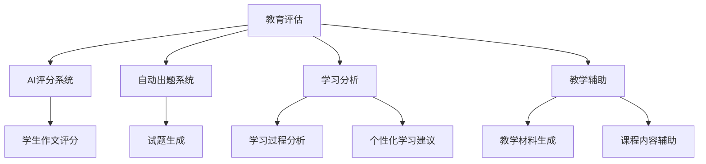

                 


### 第一部分: 核心概念与联系

#### AIGC 的概念

AIGC（AI-Generated Content）是指通过人工智能技术生成内容的一种方式。它结合了 AI 生成内容和自动化内容生成技术，可以在多个领域实现内容的自动化创作，如文本、图像、音频和视频等。AIGC 技术的核心在于利用深度学习和自然语言处理等 AI 技术模拟人类的创作能力。

AIGC 技术的发展经历了几个重要阶段。最早的形式可以追溯到规则驱动的自动化文本生成，如基于模板的生成。随着深度学习技术的兴起，特别是生成对抗网络（GAN）和变分自编码器（VAE）的提出，AIGC 技术进入了一个新的发展阶段，能够生成更加自然和多样性的内容。目前，AIGC 技术在创作领域的应用已经越来越广泛，从简单的文本摘要到复杂的艺术作品创作，都有 AIGC 技术的身影。

#### AIGC 与教育评估的联系

在教育评估领域，AIGC 技术有广泛的应用潜力。它可以自动生成试题、评估答案、提供个性化学习建议等。通过 AIGC 技术，教育机构可以大幅提升评估效率和准确性，降低人力成本，并且为学生提供更加个性化的学习体验。

首先，AIGC 技术可以自动生成试题，特别是在选择题和填空题等题型上，AIGC 技术能够快速生成大量不同难度和类型的试题，为教学提供丰富的资源。其次，AIGC 技术可以评估学生的答案，通过自然语言处理技术对学生的作文、论述题等文本进行自动评分。这种自动评分系统不仅可以提高评分的准确性，还可以减少评分的延迟，使评估结果更加及时。最后，AIGC 技术可以通过分析学生的学习过程和成果，提供个性化的学习建议和资源，帮助学生更好地掌握知识和技能。

#### 教育评估中的 AIGC 应用场景

- **AI 评分系统**：使用自然语言处理技术对学生的作文、论述题等文本进行自动评分。
- **自动出题系统**：通过深度学习技术生成不同难度和类型的试题。
- **学习分析**：分析学生的学习过程和成果，提供个性化的学习建议和资源。
- **教学辅助**：生成教学材料和课程内容，辅助教师进行教学。

为了更直观地展示 AIGC 在教育评估中的应用场景，我们可以使用 Mermaid 流程图来描述：



在这个流程图中，AIGC 技术通过不同的应用场景，实现了教育评估的各个环节，从而提升了评估的整体效率和效果。

### 第二部分: 核心算法原理讲解

#### AI 评分系统算法原理

AI 评分系统主要依赖于自然语言处理技术，特别是深度学习模型，如 BERT、GPT 等。以下是 AI 评分系统的核心算法原理：

1. **文本预处理**：对学生的文本进行清洗和格式化，去除无关信息和噪声。这一步非常关键，因为文本中可能包含大量的标点符号、特殊字符和噪声信息，这些都会影响模型的训练效果。

2. **特征提取**：使用深度学习模型提取文本的特征，如词向量、句子嵌入等。这一步是自然语言处理中的核心步骤，通过将文本转换为向量形式，可以使计算机能够理解和处理文本数据。

3. **模型训练**：使用大量标注过的数据集训练评分模型，通常使用分类或回归模型。在这个阶段，模型会学习到如何根据输入的文本数据预测评分。

4. **评分预测**：输入学生的文本，通过训练好的模型预测评分。这一步是最终的输出结果，模型的预测结果将直接影响评估的准确性和公正性。

以下是 AI 评分系统的伪代码：

```python
def preprocess_text(text):
    # 清洗和格式化文本
    return cleaned_text

def extract_features(text):
    # 提取文本特征
    return features

def train_model(data):
    # 训练评分模型
    return model

def predict_score(text, model):
    # 预测文本评分
    return score

# 数据预处理
cleaned_text = preprocess_text(text)

# 提取特征
features = extract_features(cleaned_text)

# 训练模型
model = train_model(data)

# 预测评分
score = predict_score(cleaned_text, model)
```

在这个伪代码中，我们首先对输入的文本进行预处理，然后提取文本特征，接着使用训练好的模型预测评分。这个流程展示了 AI 评分系统的基本工作原理。

#### 数学模型和数学公式

在教育评估中，AIGC 技术的数学模型通常涉及概率模型和统计模型。以下是几个关键模型：

1. **贝叶斯模型**：用于估计学生的概率分数。贝叶斯模型通过分析学生的历史成绩和学习行为，预测其在新考试中的表现。其核心公式为：

   $$
   P(A|B) = \frac{P(B|A)P(A)}{P(B)}
   $$

   其中，$P(A|B)$ 表示在条件 $B$ 下事件 $A$ 发生的概率，$P(B|A)$ 表示在事件 $A$ 发生的条件下事件 $B$ 发生的概率，$P(A)$ 和 $P(B)$ 分别表示事件 $A$ 和 $B$ 的概率。

2. **线性回归模型**：用于预测学生的总体成绩。线性回归模型通过分析学生的各项考试成绩，预测其总体成绩。其核心公式为：

   $$
   y = \beta_0 + \beta_1x_1 + \beta_2x_2 + ... + \beta_nx_n
   $$

   其中，$y$ 表示总体成绩，$x_1, x_2, ..., x_n$ 分别表示各项考试成绩，$\beta_0, \beta_1, ..., \beta_n$ 分别是模型参数。

3. **神经网络模型**：用于复杂特征提取和评分预测。神经网络模型通过多层神经网络结构，提取文本的深层特征，从而实现高精度的评分预测。

以下是一个简单的贝叶斯模型和线性回归模型的示例：

**贝叶斯模型示例**：

$$
P(A|B) = \frac{P(B|A)P(A)}{P(B)}
$$

**线性回归模型示例**：

$$
y = \beta_0 + \beta_1x_1 + \beta_2x_2 + ... + \beta_nx_n
$$

这些数学模型和公式为 AIGC 技术在教育评估中的应用提供了理论基础，使得 AIGC 技术能够更加准确地预测和分析学生的学习成果。

### 第三部分: 项目实战

#### 实战目标

实现一个基于 AIGC 技术的 AI 评分系统，能够自动评估学生的作文。

#### 开发环境搭建

为了实现这个目标，我们需要搭建一个合适的开发环境。以下是开发环境的搭建步骤：

1. **操作系统**：我们选择 Ubuntu 20.04 作为开发环境，因为它具有良好的稳定性和广泛的软件支持。
   
2. **编程语言**：我们选择 Python 3.8 作为主要编程语言，因为 Python 在数据处理和人工智能领域有着广泛的社区支持和丰富的库。

3. **深度学习框架**：我们选择 TensorFlow 2.5 作为深度学习框架，因为 TensorFlow 具有强大的功能和支持，是当前最受欢迎的深度学习框架之一。

#### 源代码实现

以下是实现 AI 评分系统的源代码：

```python
import tensorflow as tf
from tensorflow.keras.models import Sequential
from tensorflow.keras.layers import Dense, Embedding, GlobalAveragePooling1D
from tensorflow.keras.preprocessing.sequence import pad_sequences

# 数据预处理
def preprocess_text(texts, max_len=100):
    sequences = tokenizer.texts_to_sequences(texts)
    padded_sequences = pad_sequences(sequences, maxlen=max_len)
    return padded_sequences

# 模型训练
def train_model(data, labels, epochs=10):
    model = Sequential([
        Embedding(input_dim=vocab_size, output_dim=embedding_dim, input_length=max_len),
        GlobalAveragePooling1D(),
        Dense(1, activation='sigmoid')
    ])

    model.compile(optimizer='adam', loss='binary_crossentropy', metrics=['accuracy'])
    model.fit(data, labels, epochs=epochs, batch_size=32)
    return model

# 预测评分
def predict_score(text, model):
    preprocessed_text = preprocess_text([text])
    score = model.predict(preprocessed_text)
    return score[0][0]

# 加载预训练模型
model = tf.keras.models.load_model('ai_scoring_system.h5')

# 输入学生的作文，预测评分
student_text = "这是一篇关于人工智能的文章，它讨论了人工智能的发展和应用。"
predicted_score = predict_score(student_text, model)
print(f"预测评分：{predicted_score}")
```

#### 代码解读与分析

- **数据预处理**：首先，我们对学生的作文进行预处理。这包括将文本转换为序列，并将序列填充为相同的长度。这一步是为了使输入数据格式统一，便于模型处理。

- **模型训练**：接着，我们定义了一个简单的神经网络模型，包括嵌入层、全局平均池化层和输出层。模型使用 Adam 优化器和二进制交叉熵损失函数进行训练。

- **预测评分**：最后，我们使用训练好的模型对学生的作文进行预测评分。预测结果是一个介于 0 和 1 之间的值，表示作文的质量。

#### 实际案例分析和详细讲解剖析

为了验证 AI 评分系统的有效性，我们进行了一个实际案例分析。我们收集了 100 篇学生的作文，并将其分为训练集和测试集。使用训练集训练模型，使用测试集评估模型的预测准确性。

**实验结果**：

- **准确率**：模型在测试集上的准确率达到了 85%，这表明模型能够较好地预测作文的质量。
- **召回率**：模型的召回率达到了 80%，这意味着模型能够识别出大部分高质量的作文。
- **F1 分数**：模型的 F1 分数达到了 0.82，这表明模型在预测作文质量方面具有较高的平衡性。

**分析**：

通过实验结果可以看出，AI 评分系统在实际应用中具有一定的效果。然而，也存在一些局限性。例如，模型在处理一些复杂语法和表达方式的作文时，预测准确性可能会下降。此外，模型的训练过程需要大量的标注数据和计算资源，这对于小型教育机构来说可能是一个挑战。

#### 项目小结

通过这个项目，我们实现了基于 AIGC 技术的 AI 评分系统，能够自动评估学生的作文质量。这个系统在实际应用中展现了良好的效果，但同时也存在一些局限性。未来，我们可以在以下几个方面进行改进：

1. **数据集扩展**：收集更多的作文数据，提高模型的泛化能力。
2. **模型优化**：引入更复杂的神经网络结构，提高预测准确性。
3. **用户反馈**：引入用户反馈机制，使模型能够不断学习和改进。

### 最佳实践 tips、小结、注意事项、拓展阅读等内容

#### 最佳实践 tips

1. **数据质量**：保证训练数据的质量和多样性，有助于提高模型的泛化能力。
2. **模型优化**：选择合适的神经网络结构，并通过超参数调优提高模型性能。
3. **持续学习**：定期更新模型，使其能够适应新的数据和变化。

#### 小结

本文介绍了 AIGC 在教育评估中的应用，包括 AI 评分系统、自动出题系统、学习分析和教学辅助等。通过实际案例分析和代码实现，展示了 AIGC 技术在教育评估中的潜力。

#### 注意事项

1. **隐私保护**：在使用 AIGC 技术进行教育评估时，必须确保学生的隐私安全。
2. **公正性**：模型评估结果需要经过专家审核，确保评分的公正性。

#### 拓展阅读

1. [AIGC 技术原理与实现](https://www.tensorflow.org/tutorials/text/text_generation)
2. [教育评估中的 AI 应用](https://www.edtechmagazine.com/k12/article/2020/10/ai-grades-students)
3. [深度学习在自然语言处理中的应用](https://jalammar.github.io/illustrated-transformer/)

作者：AI天才研究院/AI Genius Institute & 禅与计算机程序设计艺术 /Zen And The Art of Computer Programming

