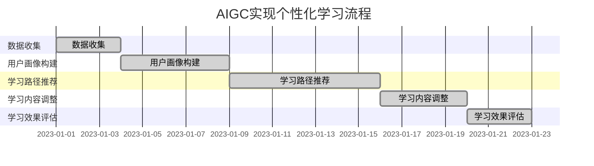
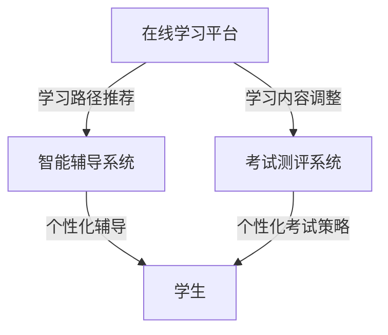
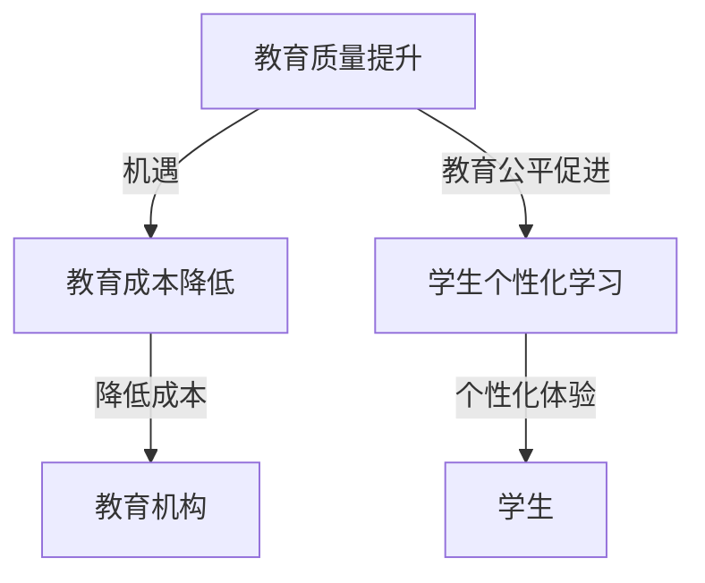

                 

### 第3章：AIGC与个性化学习的关系

#### 3.1 AIGC如何实现个性化学习

AIGC通过一系列技术手段，实现了对学习过程的全面个性化。首先，它利用数据分析和机器学习算法，对学生的学习习惯、兴趣、学习能力等特征进行深度挖掘，构建出详细的用户画像。这些画像不仅涵盖了学生的基本背景信息，还分析了学生在学习过程中的行为数据，如学习时间、学习频率、学习进度等。

通过这些用户画像，AIGC可以为学生推荐最合适的学习路径。它根据学生的个性化需求，动态调整学习内容，确保每个学生都能在适合自己的节奏和难度下学习。

#### 3.2 AIGC在教育中的应用场景

AIGC在教育中的应用场景非常广泛，包括但不限于以下几个方面：

- **在线学习平台**：利用AIGC技术，在线学习平台可以为学生提供个性化的学习体验。例如，平台可以根据学生的学习进度和表现，动态调整学习内容，为学生提供更加精准的学习建议。

- **智能辅导系统**：通过AIGC技术，智能辅导系统可以实时监控学生的学习情况，提供个性化的辅导方案。例如，当学生遇到学习困难时，系统可以自动为学生提供相应的学习资源和解答。

- **考试测评系统**：AIGC可以分析学生的考试数据，为学生提供个性化的考试策略和复习建议。例如，系统可以根据学生的错题情况，推荐相应的练习题，帮助学生巩固薄弱环节。

#### 3.3 AIGC在教育中的挑战与机遇

尽管AIGC技术在教育领域有着巨大的潜力，但其在实际应用中也面临着一些挑战。

**挑战：**

- **数据隐私**：构建用户画像需要收集大量的学生数据，这引发了数据隐私和安全的问题。如何确保学生数据的保密性和安全性，是一个需要解决的问题。

- **技术复杂性**：AIGC技术涉及到多个领域的知识，包括计算机科学、数据科学、心理学等。实现AIGC技术需要具备较高的技术水平和专业知识。

- **教育伦理**：AIGC技术在教育中的应用，可能会引发一些伦理问题。例如，个性化学习是否会导致学生之间的差距扩大，如何平衡个性化与公平性等问题。

**机遇：**

- **提升教育质量**：AIGC技术可以帮助教育者更好地了解学生的学习情况，提供个性化的教学方案，从而提高教育质量。

- **降低教育成本**：通过AIGC技术，教育机构可以减少对传统教育资源（如教师）的依赖，降低教育成本。

- **促进教育公平**：AIGC技术可以为每个学生提供个性化的学习体验，帮助那些资源不足的学生获得更好的学习机会，从而促进教育公平。

总之，AIGC技术在教育领域的应用，既带来了挑战，也带来了机遇。通过合理利用AIGC技术，我们可以推动教育的个性化、智能化发展，为每个学生提供更好的学习体验。然而，我们也要关注其可能带来的问题，积极探索解决方案，确保AIGC技术在教育领域的健康发展。

### 3.4 AIGC与个性化学习的关系总结

AIGC与个性化学习之间的关系是相辅相成的。AIGC技术为个性化学习提供了强大的技术支持，使其能够更准确地了解学生的学习需求和特点，从而提供个性化的教学方案。个性化学习则反过来促进了AIGC技术的应用和发展，为其提供了丰富的应用场景和数据来源。

通过AIGC技术，个性化学习可以实现以下几个目标：

1. **提高学习效率**：根据学生的个性化需求，动态调整学习内容和路径，确保每个学生都能在适合自己的节奏下学习。
2. **提升学习体验**：为学生提供个性化的学习资源和辅导，满足他们的学习兴趣和需求，提高学习满意度。
3. **促进教育公平**：通过个性化学习，缩小学生之间的差距，让更多学生获得优质的教育资源。

然而，AIGC技术的应用也带来了一些挑战，如数据隐私、技术复杂性和教育伦理等问题。我们需要在推动AIGC技术应用的同时，关注这些问题，积极探索解决方案，确保其在教育领域的健康发展。

总之，AIGC与个性化学习的关系是教育领域的一次重大变革。通过合理利用AIGC技术，我们可以推动教育的个性化、智能化发展，为每个学生提供更好的学习体验和成长机会。在未来的发展中，AIGC技术有望在教育领域发挥更大的作用，为教育事业的繁荣做出贡献。|>

