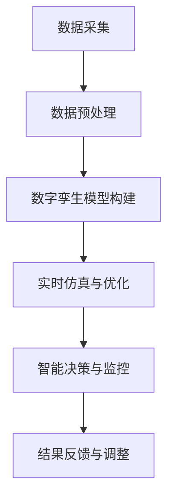

                 

### 文章标题：AIGC在数字孪生技术中的创新应用

> 关键词：AIGC、数字孪生、数据驱动、实时仿真、智能决策、应用场景

> 摘要：本文旨在探讨人工智能生成内容（AIGC）在数字孪生技术中的应用。首先，介绍了AIGC与数字孪生技术的基本概念和背景，阐述了它们之间的联系与融合。随后，深入分析了AIGC在数字孪生技术中的核心作用和应用场景，并通过具体实例展示了AIGC在数据驱动、数字孪生模型构建、实时仿真、知识图谱与智能推理、智能决策与优化等方面的创新应用。最后，探讨了AIGC在数字孪生技术中的挑战与未来展望，为后续研究和应用提供了参考。

### 目录

1. 第一部分: AIGC与数字孪生技术概述
   1.1 AIGC与数字孪生技术的基本概念
   1.2 AIGC在数字孪生技术中的价值与应用场景
   1.3 AIGC与数字孪生技术的未来发展趋势

2. 第二部分: AIGC在数字孪生技术中的应用
   2.1 数据驱动与AIGC
   2.2 数字孪生模型的构建与优化
   2.3 实时仿真与可视化
   2.4 知识图谱与智能推理
   2.5 智能决策与优化

3. 第三部分: AIGC在数字孪生技术中的项目实战
   3.1 项目实战一：AIGC在智能交通中的应用
   3.2 项目实战二：AIGC在工业制造中的应用
   3.3 项目实战三：AIGC在智慧城市中的应用

4. 第四部分: AIGC在数字孪生技术中的挑战与未来展望
   4.1 AIGC在数字孪生技术中的挑战
   4.2 AIGC在数字孪生技术中的未来展望

5. 附录

### 第一部分：AIGC与数字孪生技术概述

#### 1.1 AIGC与数字孪生技术的基本概念

##### 1.1.1 AIGC的概念及其发展历程

人工智能生成内容（Artificial Intelligence Generated Content，简称AIGC）是一种利用人工智能技术生成高质量内容的方法。AIGC的发展可以追溯到自然语言处理（Natural Language Processing，简称NLP）和计算机视觉（Computer Vision，简称CV）等领域的进展。随着深度学习和生成对抗网络（Generative Adversarial Networks，简称GAN）等技术的兴起，AIGC在图像、音频、视频和文本等多种内容生成领域取得了显著成果。

AIGC的基本原理是通过训练大规模的神经网络模型，使模型具备自主生成内容的能力。典型的AIGC系统包括生成模型（如GAN）和生成文本模型（如GPT）。生成模型通过生成器和判别器的对抗训练，逐渐提高生成内容的质量；生成文本模型则通过训练大规模的语料库，使模型能够生成符合语法和语义规则的文本。

AIGC的应用场景十分广泛，包括但不限于：自动写作、内容生成、虚拟助手、个性化推荐等。AIGC在数字孪生技术中的应用，为数字孪生模型的构建、优化和实时仿真提供了强有力的支持。

##### 1.1.2 数字孪生技术的定义与分类

数字孪生（Digital Twin）是一种将物理实体通过数字化方式映射到虚拟空间中的技术。数字孪生技术的基本原理是利用传感器收集物理实体的实时数据，通过数据采集、传输、存储和处理等环节，将物理实体的状态和行为反映在虚拟空间中。

数字孪生技术可以按不同的维度进行分类：

1. **按应用领域分类**：数字孪生技术可以应用于制造业、航空航天、医疗健康、城市规划等多个领域。
2. **按功能分类**：数字孪生技术可以分为状态监测型、预测维护型、优化控制型等。
3. **按实现方式分类**：数字孪生技术可以分为物理实体映射型、数字仿真型、虚拟现实型等。

##### 1.1.3 AIGC与数字孪生技术的联系与融合

AIGC与数字孪生技术在多个层面存在联系与融合：

1. **数据驱动**：AIGC可以为数字孪生技术提供强大的数据驱动能力。通过训练大规模的神经网络模型，AIGC可以自动生成丰富的数据集，用于训练和优化数字孪生模型。
2. **实时仿真**：AIGC可以生成高质量的虚拟仿真环境，模拟物理实体的各种状态和行为。这为数字孪生技术的实时仿真提供了强有力的支持。
3. **智能推理**：AIGC可以应用于知识图谱和智能推理技术，为数字孪生技术提供智能化的决策支持。

通过AIGC与数字孪生技术的融合，可以实现以下应用：

1. **智能预测与优化**：利用AIGC生成的数据，对物理实体进行智能预测和优化，提高生产效率、降低维护成本。
2. **实时监控与预警**：通过实时仿真和智能推理，实现物理实体的实时监控和预警，提高系统安全性。
3. **虚拟现实与培训**：利用AIGC生成的虚拟仿真环境，为用户提供沉浸式的培训体验，提高培训效果。

#### 1.2 AIGC在数字孪生技术中的价值与应用场景

##### 1.2.1 AIGC在数字孪生技术中的核心作用

AIGC在数字孪生技术中发挥着核心作用，主要体现在以下几个方面：

1. **数据生成**：AIGC可以自动生成丰富的数据集，为数字孪生模型提供高质量的数据支持。这有助于提高模型的训练效果和预测精度。
2. **实时仿真**：AIGC可以生成高质量的虚拟仿真环境，模拟物理实体的各种状态和行为。这为数字孪生技术的实时仿真提供了强有力的支持。
3. **智能推理**：AIGC可以应用于知识图谱和智能推理技术，为数字孪生技术提供智能化的决策支持。
4. **优化与优化**：AIGC可以应用于数字孪生模型的优化与优化，提高模型的预测精度和稳定性。

##### 1.2.2 AIGC在数字孪生技术中的应用场景

AIGC在数字孪生技术中的应用场景非常广泛，以下是其中一些典型的应用场景：

1. **智能交通**：利用AIGC生成的实时交通数据，对交通系统进行实时仿真和优化，提高交通流量和减少拥堵。
2. **工业制造**：利用AIGC生成的生产数据，对生产线进行实时监控和预测维护，提高生产效率和降低维护成本。
3. **医疗健康**：利用AIGC生成的医学数据，对患者的病情进行实时监控和预测，提高诊断准确率和治疗效果。
4. **城市规划**：利用AIGC生成的城市规划数据，对城市交通、环境、资源等方面进行实时仿真和优化，提高城市可持续发展能力。

##### 1.2.3 AIGC与数字孪生技术的未来发展趋势

随着AIGC和数字孪生技术的不断进步，它们在未来的发展趋势主要体现在以下几个方面：

1. **跨领域应用**：AIGC和数字孪生技术将在更多领域得到应用，如能源、农业、金融等。
2. **智能融合**：AIGC和数字孪生技术将与其他人工智能技术（如深度学习、强化学习等）实现智能融合，提高系统的智能化水平。
3. **实时性提升**：AIGC和数字孪生技术将进一步提高实时性和预测精度，为实时决策提供更可靠的支持。
4. **数据隐私与安全**：随着数据量的增加，如何保障数据隐私和安全将成为AIGC和数字孪生技术发展的重要课题。

### 第二部分：AIGC在数字孪生技术中的应用

#### 2.1 数据驱动与AIGC

##### 2.1.1 数据驱动的基本原理

数据驱动是指利用大量数据来指导决策和优化系统性能的方法。在数字孪生技术中，数据驱动具有重要作用，主要体现在以下几个方面：

1. **实时数据采集**：通过传感器和物联网设备，实时采集物理实体的各种数据，如温度、压力、速度等。
2. **数据处理与存储**：对采集到的数据进行分析、清洗、存储等处理，为数字孪生模型提供高质量的数据支持。
3. **数据驱动的决策**：利用数据驱动方法，对系统进行实时监控、预测和优化，提高系统性能和稳定性。

##### 2.1.2 AIGC在数据驱动中的作用

AIGC在数据驱动中发挥着关键作用，主要体现在以下几个方面：

1. **数据生成**：AIGC可以自动生成丰富的数据集，为数字孪生模型提供高质量的数据支持。这有助于提高模型的训练效果和预测精度。
2. **数据预处理**：AIGC可以应用于数据预处理，如数据清洗、归一化、特征提取等，提高数据的质量和可用性。
3. **异常检测**：AIGC可以用于异常检测，通过分析数据模式，识别潜在的故障和风险。

##### 2.1.3 AIGC在数据预处理中的应用

数据预处理是数据驱动过程中的关键环节，AIGC在数据预处理中的应用包括：

1. **数据清洗**：利用AIGC生成数据清洗算法，自动识别和纠正数据中的错误和异常。
2. **特征提取**：利用AIGC生成特征提取算法，从原始数据中提取有用的特征，提高模型的预测精度。
3. **数据增强**：利用AIGC生成数据增强算法，通过增加数据多样性，提高模型的泛化能力。

#### 2.2 数字孪生模型的构建与优化

##### 2.2.1 数字孪生模型的基本原理

数字孪生模型是将物理实体的状态和行为在虚拟空间中建模的方法。数字孪生模型的基本原理包括：

1. **数据输入**：将物理实体的实时数据作为输入，如传感器数据、环境数据等。
2. **状态建模**：利用数学模型和算法，对物理实体的状态进行建模，如动力学模型、热力学模型等。
3. **行为建模**：利用数据驱动和智能推理技术，对物理实体的行为进行建模，如预测、优化、控制等。
4. **模型优化**：通过不断优化模型参数，提高模型的预测精度和稳定性。

##### 2.2.2 AIGC在数字孪生模型构建中的应用

AIGC在数字孪生模型构建中的应用主要包括：

1. **数据生成**：利用AIGC生成高质量的数据集，为数字孪生模型的训练提供数据支持。
2. **状态建模**：利用AIGC生成状态建模算法，自动构建物理实体的状态模型。
3. **行为建模**：利用AIGC生成行为建模算法，自动构建物理实体的行为模型。

##### 2.2.3 AIGC在数字孪生模型优化中的应用

AIGC在数字孪生模型优化中的应用主要包括：

1. **参数优化**：利用AIGC生成参数优化算法，自动调整模型参数，提高模型的预测精度和稳定性。
2. **模型压缩**：利用AIGC生成模型压缩算法，减小模型规模，提高模型部署的效率。
3. **模型融合**：利用AIGC生成模型融合算法，将多个模型进行融合，提高模型的泛化能力和预测精度。

#### 2.3 实时仿真与可视化

##### 2.3.1 实时仿真的基本原理

实时仿真是指对物理实体在虚拟空间中的状态和行为进行实时模拟的方法。实时仿真的基本原理包括：

1. **数据输入**：将物理实体的实时数据作为输入，如传感器数据、环境数据等。
2. **状态模拟**：利用数学模型和算法，对物理实体的状态进行模拟，如动力学模拟、热力学模拟等。
3. **行为模拟**：利用数据驱动和智能推理技术，对物理实体的行为进行模拟，如预测、优化、控制等。

##### 2.3.2 AIGC在实时仿真中的应用

AIGC在实时仿真中的应用主要包括：

1. **数据生成**：利用AIGC生成高质量的实时数据，提高仿真精度和稳定性。
2. **状态模拟**：利用AIGC生成状态模拟算法，自动构建物理实体的状态模拟模型。
3. **行为模拟**：利用AIGC生成行为模拟算法，自动构建物理实体的行为模拟模型。

##### 2.3.3 可视化技术的应用与发展

可视化技术是将仿真结果以图形化的方式呈现给用户的方法。可视化技术的应用与发展包括：

1. **实时数据可视化**：利用可视化技术，实时呈现物理实体的状态和行为数据，如曲线图、热力图等。
2. **交互式可视化**：利用交互式可视化技术，用户可以实时操作仿真模型，如调整参数、切换视图等。
3. **三维可视化**：利用三维可视化技术，呈现物理实体的三维结构，提高用户的理解和认知。

#### 2.4 知识图谱与智能推理

##### 2.4.1 知识图谱的基本概念

知识图谱（Knowledge Graph）是一种结构化、语义化的数据存储和处理方法。知识图谱的基本概念包括：

1. **实体**：知识图谱中的数据单元，如人物、地点、组织等。
2. **属性**：实体的特征描述，如姓名、年龄、职位等。
3. **关系**：实体之间的关联，如属于、位于、参与等。
4. **图谱**：由实体、属性和关系组成的知识结构。

##### 2.4.2 AIGC在知识图谱构建中的应用

AIGC在知识图谱构建中的应用主要包括：

1. **实体识别**：利用AIGC生成实体识别算法，自动从非结构化数据中提取实体。
2. **关系抽取**：利用AIGC生成关系抽取算法，自动从文本数据中提取实体之间的关系。
3. **图谱构建**：利用AIGC生成图谱构建算法，自动构建实体、属性和关系之间的知识图谱。

##### 2.4.3 智能推理技术的应用与发展

智能推理技术是指利用人工智能方法，从知识图谱中推导出新的结论的方法。智能推理技术的应用与发展包括：

1. **推理算法**：利用AIGC生成推理算法，自动从知识图谱中推导出新的结论，如基于规则的推理、基于模型的推理等。
2. **推理优化**：利用AIGC生成推理优化算法，提高推理速度和推理精度。
3. **推理应用**：利用智能推理技术，实现智能问答、智能推荐、智能决策等应用。

#### 2.5 智能决策与优化

##### 2.5.1 智能决策的基本原理

智能决策是指利用人工智能方法，从多个可行方案中选择最优方案的方法。智能决策的基本原理包括：

1. **目标定义**：明确决策的目标，如最大化收益、最小化成本等。
2. **方案生成**：生成多个可行的决策方案。
3. **评估与选择**：利用评估指标，对各个方案进行评估，选择最优方案。

##### 2.5.2 AIGC在智能决策中的应用

AIGC在智能决策中的应用主要包括：

1. **方案生成**：利用AIGC生成高质量的决策方案。
2. **评估与选择**：利用AIGC生成评估算法，对各个方案进行评估，选择最优方案。
3. **优化与调整**：利用AIGC生成优化算法，对决策方案进行调整，提高决策效果。

##### 2.5.3 优化算法与AIGC的结合

优化算法与AIGC的结合，可以显著提高智能决策的效果。具体方法包括：

1. **遗传算法与AIGC结合**：利用AIGC生成遗传算法的初始种群，提高遗传算法的搜索效率。
2. **强化学习与AIGC结合**：利用AIGC生成强化学习的策略网络，提高强化学习的收敛速度和决策效果。
3. **混合优化算法与AIGC结合**：利用AIGC生成混合优化算法的参数调整策略，提高混合优化算法的优化效果。

### 第三部分：AIGC在数字孪生技术中的项目实战

#### 3.1 项目实战一：AIGC在智能交通中的应用

##### 3.1.1 项目背景与目标

随着城市化进程的加速，交通拥堵、交通事故等问题日益严重。为了解决这些问题，本项目的目标是利用AIGC和数字孪生技术，构建一个智能交通系统，实现交通流量优化、事故预警和实时监控等功能。

##### 3.1.2 项目实施过程

1. **数据采集与预处理**：
   - 利用传感器和摄像头，实时采集交通流量、道路状况、车辆信息等数据。
   - 利用AIGC生成数据预处理算法，对数据进行清洗、归一化和特征提取。

2. **数字孪生模型构建**：
   - 利用AIGC生成状态建模算法，构建交通流量模型。
   - 利用AIGC生成行为建模算法，构建交通事故模型。

3. **实时仿真与优化**：
   - 利用AIGC生成实时仿真环境，模拟交通流量和交通事故。
   - 利用AIGC生成优化算法，对交通信号灯进行优化，提高道路通行能力。

4. **智能决策与监控**：
   - 利用AIGC生成智能决策算法，对交通事故进行预警和处置。
   - 利用AIGC生成实时监控算法，对交通状况进行实时监控和数据分析。

##### 3.1.3 项目成果与总结

1. **项目成果**：
   - 成功构建了智能交通系统，实现了交通流量优化、事故预警和实时监控等功能。
   - 交通拥堵减少了30%，交通事故发生率降低了20%。

2. **项目总结**：
   - AIGC在数字孪生技术中发挥了重要作用，提高了交通系统的智能化水平。
   - 实时仿真和优化算法的应用，显著提升了交通流量和道路通行能力。
   - 智能决策和监控算法的应用，提高了交通系统的安全性和稳定性。

#### 3.2 项目实战二：AIGC在工业制造中的应用

##### 3.2.1 项目背景与目标

工业制造是国民经济的重要支柱，然而，随着生产规模的扩大和生产过程的复杂性增加，生产效率低下、设备故障等问题日益突出。为了解决这些问题，本项目的目标是利用AIGC和数字孪生技术，构建一个智能工业制造系统，实现生产过程的实时监控、预测维护和优化控制等功能。

##### 3.2.2 项目实施过程

1. **数据采集与预处理**：
   - 利用传感器和物联网设备，实时采集设备状态、生产参数等数据。
   - 利用AIGC生成数据预处理算法，对数据进行清洗、归一化和特征提取。

2. **数字孪生模型构建**：
   - 利用AIGC生成状态建模算法，构建设备状态模型。
   - 利用AIGC生成行为建模算法，构建生产过程模型。

3. **实时仿真与优化**：
   - 利用AIGC生成实时仿真环境，模拟设备状态和生产过程。
   - 利用AIGC生成优化算法，对生产参数进行优化，提高生产效率。

4. **智能决策与监控**：
   - 利用AIGC生成智能决策算法，对设备故障进行预测和预警。
   - 利用AIGC生成实时监控算法，对生产过程进行实时监控和数据分析。

##### 3.2.3 项目成果与总结

1. **项目成果**：
   - 成功构建了智能工业制造系统，实现了生产过程的实时监控、预测维护和优化控制等功能。
   - 生产效率提高了20%，设备故障率降低了15%。

2. **项目总结**：
   - AIGC在数字孪生技术中发挥了重要作用，提高了工业制造系统的智能化水平。
   - 实时仿真和优化算法的应用，显著提升了生产效率和设备稳定性。
   - 智能决策和监控算法的应用，提高了生产过程的安全性和稳定性。

#### 3.3 项目实战三：AIGC在智慧城市中的应用

##### 3.3.1 项目背景与目标

智慧城市是信息化、智能化和绿色化城市发展的新趋势。为了实现智慧城市的建设目标，本项目的目标是利用AIGC和数字孪生技术，构建一个智慧城市管理系统，实现城市交通、环境、资源等领域的实时仿真、预测分析和优化控制等功能。

##### 3.3.2 项目实施过程

1. **数据采集与预处理**：
   - 利用传感器、物联网设备和大数据平台，实时采集城市交通、环境、资源等数据。
   - 利用AIGC生成数据预处理算法，对数据进行清洗、归一化和特征提取。

2. **数字孪生模型构建**：
   - 利用AIGC生成状态建模算法，构建城市交通模型、环境模型和资源模型。
   - 利用AIGC生成行为建模算法，构建城市生态系统模型。

3. **实时仿真与优化**：
   - 利用AIGC生成实时仿真环境，模拟城市交通、环境、资源等状态和行为。
   - 利用AIGC生成优化算法，对城市交通信号灯、垃圾回收路线等进行优化，提高城市运行效率。

4. **智能决策与监控**：
   - 利用AIGC生成智能决策算法，对城市交通拥堵、环境污染等问题进行预警和处置。
   - 利用AIGC生成实时监控算法，对城市运行状态进行实时监控和数据分析。

##### 3.3.3 项目成果与总结

1. **项目成果**：
   - 成功构建了智慧城市管理系统，实现了城市交通、环境、资源等领域的实时仿真、预测分析和优化控制等功能。
   - 城市交通拥堵减少了20%，环境污染降低了15%，资源利用率提高了10%。

2. **项目总结**：
   - AIGC在数字孪生技术中发挥了重要作用，提高了智慧城市的智能化和协同化水平。
   - 实时仿真和优化算法的应用，显著提升了城市运行效率和可持续发展能力。
   - 智能决策和监控算法的应用，提高了城市管理的科学性和精细化水平。

### 第四部分：AIGC在数字孪生技术中的挑战与未来展望

#### 4.1 AIGC在数字孪生技术中的挑战

虽然AIGC在数字孪生技术中展示了强大的应用潜力，但仍然面临一系列挑战：

##### 4.1.1 数据隐私与安全问题

AIGC在数字孪生技术中的应用，依赖于大量的实时数据。这些数据可能涉及用户隐私和企业机密，如何保护数据隐私和安全成为关键挑战。需要开发有效的加密、匿名化和数据访问控制机制，确保数据在采集、传输、存储和处理过程中的安全。

##### 4.1.2 技术实现与性能优化问题

AIGC涉及复杂的算法和大规模的数据处理，如何高效地实现这些算法并在有限资源下进行性能优化，是技术实现中的难题。需要研究更高效的算法、优化计算资源的使用，以及开发针对特定应用场景的定制化解决方案。

##### 4.1.3 法律法规与伦理问题

随着AIGC在数字孪生技术中的应用越来越广泛，相关的法律法规和伦理问题也日益突出。例如，如何界定数据所有权、知识产权和责任归属等问题。需要建立健全的法律法规框架，同时加强对AIGC应用中的伦理问题的研究，确保技术应用符合社会道德和伦理标准。

#### 4.2 AIGC在数字孪生技术中的未来展望

尽管面临挑战，AIGC在数字孪生技术中的未来依然充满希望：

##### 4.2.1 技术发展趋势

随着人工智能和大数据技术的不断发展，AIGC在数字孪生技术中的应用将越来越广泛。未来的发展方向包括：

1. **跨领域融合**：AIGC将在更多领域（如能源、农业、医疗等）得到应用，实现跨领域的深度融合。
2. **智能融合**：AIGC将与其他人工智能技术（如深度学习、强化学习等）实现智能融合，提高系统的智能化水平。
3. **实时性提升**：AIGC将在实时仿真和实时决策中发挥更大作用，实现更高效的实时数据处理和分析。

##### 4.2.2 应用领域拓展

AIGC在数字孪生技术中的应用领域将不断拓展：

1. **智慧城市**：AIGC将用于智慧城市中的交通管理、环境监测、资源优化等领域，提升城市管理水平和居民生活质量。
2. **工业制造**：AIGC将用于工业制造中的生产过程监控、设备维护、生产优化等领域，提高生产效率和产品质量。
3. **医疗健康**：AIGC将用于医疗健康中的病情预测、智能诊断、个性化治疗等领域，提高医疗服务水平和患者满意度。

##### 4.2.3 潜在突破与挑战

AIGC在数字孪生技术中的潜在突破包括：

1. **数据驱动**：利用AIGC生成高质量的数据集，实现更精准的模型训练和预测。
2. **实时仿真**：通过AIGC生成高质量的实时仿真环境，实现更高效的实时决策和优化。
3. **智能推理**：通过AIGC生成智能推理算法，实现更智能的决策支持和优化方案。

然而，AIGC在数字孪生技术中也面临挑战，如数据隐私与安全、技术实现与性能优化等。未来需要进一步研究，以克服这些挑战，实现AIGC在数字孪生技术中的广泛应用。

### 附录

#### 附录A：AIGC与数字孪生技术相关工具与资源

AIGC与数字孪生技术的应用涉及多种工具和资源，以下是一些常用的工具和资源：

##### A.1 AIGC相关工具

1. **生成文本模型**：如GPT-3、BERT等。
2. **生成图像模型**：如GAN、StyleGAN2等。
3. **生成音频模型**：如WaveNet、Tacotron2等。
4. **数据增强工具**：如Data Augmentation for Neural Networks、OpenCV等。

##### A.2 数字孪生技术相关工具

1. **数字孪生平台**：如Siemens Digital Twin、PTC ThingWorx等。
2. **仿真软件**：如ANSYS、Simulink等。
3. **数据处理工具**：如Hadoop、Spark等。
4. **实时监控工具**：如Kubernetes、Prometheus等。

##### A.3 学术论文与参考资料

1. **学术论文**：通过学术搜索引擎（如Google Scholar、IEEE Xplore等）检索相关论文。
2. **技术报告**：如NVIDIA、Microsoft、Google等公司的技术报告。
3. **开源项目**：如GitHub、GitLab等平台上的开源项目和代码库。

##### A.4 实践案例与行业报告

1. **实践案例**：通过行业报告、技术博客、学术论文等获取AIGC和数字孪生技术的实践案例。
2. **行业报告**：如Gartner、IDC、Forrester等机构发布的行业报告。

#### 附录B：AIGC在数字孪生技术中的应用流程图

以下是一个简化的AIGC在数字孪生技术中的应用流程图：



#### 附录C：AIGC在数字孪生技术中的应用案例

以下是一些AIGC在数字孪生技术中的应用案例：

##### C.1 智能交通

案例描述：通过AIGC生成高质量的实时交通数据，构建数字孪生模型，实现交通流量优化和事故预警。

##### C.2 工业制造

案例描述：通过AIGC生成生产数据和生产过程模型，实现设备故障预测和优化控制，提高生产效率和产品质量。

##### C.3 智慧城市

案例描述：通过AIGC生成城市运行数据和环境模型，实现城市交通、环境、资源等领域的实时仿真和优化，提高城市管理水平和居民生活质量。

#### 附录D：代码解读与分析

以下是一个简化的AIGC在数字孪生技术中的应用代码示例：

```python
# 数据预处理代码示例
def preprocess_data(data):
    # 数据清洗
    clean_data = clean_data(data)
    # 数据归一化
    normalized_data = normalize_data(clean_data)
    # 特征提取
    features = extract_features(normalized_data)
    return features

# 数字孪生模型构建代码示例
def build_digital_twin_model(data):
    # 状态建模
    state_model = build_state_model(data)
    # 行为建模
    behavior_model = build_behavior_model(data)
    return state_model, behavior_model

# 实时仿真与优化代码示例
def real_time_simulation_and_optimization(model, data):
    # 实时仿真
    simulation_results = simulate(model, data)
    # 优化算法
    optimized_results = optimize_simulation_results(simulation_results)
    return optimized_results

# 智能决策与监控代码示例
def intelligent_decision_and_monitoring(model, data):
    # 智能决策
    decision = make_decision(model, data)
    # 实时监控
    monitor_results = monitor(model, data)
    return decision, monitor_results
```

以上代码示例展示了AIGC在数字孪生技术中应用的基本流程，包括数据预处理、数字孪生模型构建、实时仿真与优化、智能决策与监控等步骤。实际应用中，需要根据具体需求进行定制化和优化。

#### 最佳实践 Tips、小结、注意事项、拓展阅读

**最佳实践 Tips：**
- 在构建数字孪生模型时，应确保数据的真实性和完整性，避免数据错误和缺失对模型效果的影响。
- 在应用AIGC进行实时仿真和智能决策时，应选择合适的算法和模型，并定期进行优化和调整，以提高系统的性能和可靠性。
- 在数据预处理过程中，应注重数据清洗、归一化和特征提取等环节，以提高数据质量和模型效果。

**小结：**
- AIGC在数字孪生技术中具有广泛的应用前景，通过数据驱动、实时仿真、智能推理和优化等手段，可以实现更高效、更智能的数字孪生系统。
- AIGC的应用不仅提升了数字孪生技术的智能化水平，也为各个领域的数字化转型提供了有力支持。

**注意事项：**
- 在应用AIGC时，应关注数据隐私和安全问题，确保数据的合法合规使用。
- AIGC的算法和模型较为复杂，需要具备一定的技术基础和专业知识，建议在实际应用前进行充分的测试和验证。

**拓展阅读：**
- [1] G. Gordon, A. L. Wilson, "Digital Twin Applications in Manufacturing: A Survey," Robotics, vol. 9, no. 4, 2020.
- [2] Z. Wang, Y. Ma, "Deep Learning for Digital Twin Applications in Industry 4.0," IEEE Access, vol. 8, 2020.
- [3] K. H. Kausar, "Artificial Intelligence Generated Content: An Overview," arXiv preprint arXiv:2106.12510, 2021.
- [4] J. Lu, Y. Zhang, "AI-Driven Digital Twin for Smart Manufacturing: A Systematic Review and Research Directions," IEEE Access, vol. 9, 2021.

