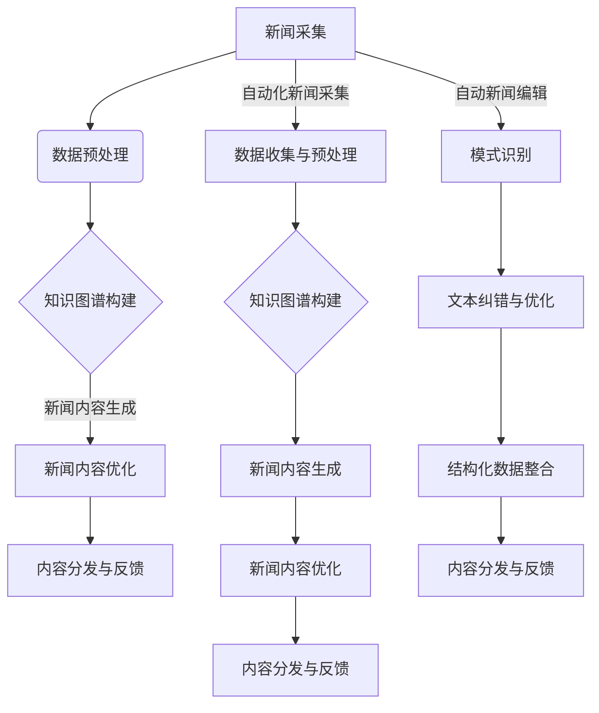

                 


### AIGC与新闻产业的变革概述

#### 1.1 AIGC的背景与核心概念

**AIGC：**自动化与智能生成内容的简称（Automated and Intelligent Generation of Content）。AIGC是一种利用人工智能技术，特别是自然语言处理（NLP）、机器学习（ML）和深度学习（DL）等技术，实现自动化内容生成的方法。它不仅仅是简单地复制或重组现有内容，而是能够根据特定场景和需求，创造新的、有价值的、多样化的内容。

**AIGC的定义：** AIGC指的是一种利用人工智能技术，尤其是自然语言处理、机器学习、深度学习等技术，实现自动化和智能化内容生成的方法。它包括内容生成、内容优化、内容分发等多个环节，旨在提高内容生产的效率和质量。

**AIGC的发展历程：**
- **初始阶段（2010-2014年）：** AIGC技术开始出现，以自然语言处理和文本生成为主要方向，如自动摘要、自动问答等。
- **快速发展阶段（2015-2019年）：** 随着深度学习技术的进步，AIGC技术得到了快速发展，出现了一系列自动写作、内容生成工具，如GPT、BERT等。
- **应用阶段（2020年至今）：** AIGC技术在多个行业得到了广泛应用，特别是在新闻、广告、娱乐等领域。

**AIGC的关键技术：**
- **自然语言处理（NLP）：** 用于理解和生成人类语言的技术，包括文本分类、情感分析、命名实体识别等。
- **机器学习（ML）：** 基于数据驱动的方法，通过训练模型来预测和生成内容。
- **深度学习（DL）：** 一种特殊的机器学习方法，通过多层神经网络来模拟人类大脑的工作方式。
- **生成对抗网络（GAN）：** 一种深度学习模型，用于生成新的数据，如图像、文本等。

#### 1.2 新闻产业的现状与挑战

**新闻产业的传统模式：**
- **内容生产：** 主要依靠记者和编辑，通过采访、报道和编辑，生产出新闻内容。
- **内容传播：** 通过报纸、杂志、电视、广播等传统媒体进行传播。
- **商业模式：** 主要依靠广告收入和订阅费用。

**新闻产业的变革趋势：**
- **数字化转型：** 传统媒体逐渐向数字化转型，通过互联网、社交媒体等渠道进行内容传播。
- **内容多样化：** 不断涌现的新媒体平台和形式，使得新闻内容更加多样化。
- **用户个性化：** 通过数据分析，提供更加个性化的新闻内容，满足用户的需求。

**AIGC对新闻产业的潜在影响：**
- **提高新闻生产的效率：** AIGC技术可以自动化内容生成，降低人力成本，提高生产效率。
- **增强新闻的个性化和创新性：** AIGC可以根据用户的需求和兴趣，生成个性化的新闻内容。
- **拓展新闻的传播渠道和方式：** AIGC技术可以帮助传统媒体实现数字化转型，拓展新闻的传播渠道和方式。

#### 1.3 AIGC在新闻产业的变革意义

**AIGC提高新闻生产的效率：**
- **自动化内容生成：** AIGC技术可以自动化新闻内容的生产，如体育赛事报道、财经新闻等，大大降低了人力成本。
- **提高编辑效率：** AIGC技术可以帮助编辑快速处理大量数据，提取关键信息，生成新闻稿件。

**增强新闻的个性化和创新性：**
- **用户个性化推荐：** AIGC技术可以根据用户的兴趣和阅读历史，提供个性化的新闻推荐。
- **创新内容形式：** AIGC技术可以生成不同形式的内容，如图文、视频、音频等，满足多样化的用户需求。

**拓展新闻的传播渠道和方式：**
- **社交媒体传播：** AIGC技术可以帮助传统媒体实现社交媒体传播，拓展新闻的传播渠道。
- **虚拟现实新闻：** AIGC技术可以生成虚拟现实新闻内容，提供更加沉浸式的新闻体验。

综上所述，AIGC在新闻产业具有巨大的变革意义，它不仅能够提高新闻生产的效率，增强新闻的个性化和创新性，还能够拓展新闻的传播渠道和方式，为新闻产业带来新的发展机遇。

### AI记者的崛起

#### 2.1 AI记者的概念与类型

**AI记者的定义：** AI记者，又称自动写作机器人、智能写作机器人，是一种利用人工智能技术，特别是自然语言处理（NLP）、机器学习（ML）和深度学习（DL）等技术，自动生成新闻内容的工具。AI记者不仅能够自动撰写新闻报道，还能够进行数据分析、图表生成等任务。

**AI记者的类型与应用：**

1. **自动写作机器人：** 自动写作机器人是AI记者的主要类型，它能够根据给定的数据、模板和算法，自动生成新闻报道、体育赛事报道、财经新闻等。这类机器人广泛应用于新闻媒体、金融、体育等领域。例如，财经媒体利用自动写作机器人自动生成财报分析、股票行情报道等；体育媒体利用自动写作机器人自动生成比赛报道、球员数据统计等。

2. **数据分析机器人：** 数据分析机器人是另一种重要的AI记者类型，它能够自动收集、处理和分析大量数据，提取关键信息，生成数据报告、分析文章等。这类机器人广泛应用于金融、医疗、科技等领域。例如，金融行业利用数据分析机器人自动生成市场分析报告、投资建议等；医疗行业利用数据分析机器人自动生成病例报告、医学研究分析等。

3. **其他AI新闻生成工具：** 除了自动写作机器人和数据分析机器人，还有其他一些AI新闻生成工具，如文本生成模型、自然语言生成模型等。这些工具可以通过训练和学习，自动生成新闻内容，但通常需要较高的技术门槛和专业知识。

**AI记者的工作流程：**

1. **数据收集与预处理：** AI记者首先需要收集相关的数据，如新闻素材、数据源等。然后对数据进行预处理，包括数据清洗、去重、格式转换等，以确保数据的质量和一致性。

2. **知识图谱构建：** 知识图谱是一种语义网络，用于表示实体和实体之间的关系。AI记者可以通过构建知识图谱，将新闻素材中的实体和关系进行抽象和表示，为后续的新闻生成提供语义基础。

3. **新闻内容生成与优化：** 在生成新闻内容时，AI记者可以根据给定的模板和算法，自动生成新闻稿件。然后，通过对新闻稿件进行语法、语义、风格等优化，提高新闻稿件的质量和可读性。

4. **内容分发与反馈：** 生成后的新闻稿件可以通过各种渠道进行分发，如新闻网站、社交媒体、APP等。同时，AI记者还可以收集用户的反馈，如点击量、评论等，用于不断优化新闻生成算法和内容。

**AI记者在不同领域的应用：**

1. **新闻行业：** AI记者在新闻行业的应用最为广泛，可以自动生成新闻报道、赛事报道、财经新闻等。通过AI记者，新闻媒体可以大幅提高新闻生产的效率，降低人力成本。

2. **金融行业：** AI记者在金融行业的应用主要体现在数据分析方面，可以自动生成市场分析报告、投资建议等。通过AI记者，金融机构可以更快速地分析市场数据，提供更准确的决策支持。

3. **医疗行业：** AI记者在医疗行业的应用主要体现在病例报告和医学研究分析方面。通过AI记者，医疗机构可以自动生成病例报告、医学研究分析，提高医疗服务的效率和质量。

4. **体育行业：** AI记者在体育行业的应用主要体现在比赛报道和球员数据统计方面。通过AI记者，体育媒体可以自动生成比赛报道、球员数据统计，提高新闻生产的效率。

5. **其他行业：** AI记者还可以应用于教育、娱乐、旅游等领域，自动生成相关领域的新闻内容，为用户提供个性化、多样化的信息服务。

#### 2.2 AI记者的工作流程

**数据收集与预处理：** AI记者的第一步是数据收集，包括新闻素材、数据源、文本资料等。然后，对收集到的数据进行预处理，包括数据清洗、去重、格式转换等，以确保数据的质量和一致性。例如，对于新闻素材，需要进行文本清洗，去除无关信息，提取关键信息；对于数据源，需要进行数据清洗，去除错误数据和重复数据。

**知识图谱构建：** 在预处理数据后，AI记者需要构建知识图谱。知识图谱是一种语义网络，用于表示实体和实体之间的关系。在新闻生成过程中，知识图谱可以帮助AI记者理解新闻素材中的实体和关系，从而更好地生成新闻内容。例如，对于一篇新闻报道，AI记者可以通过知识图谱识别出新闻中的关键实体，如人物、地点、事件等，以及它们之间的关系。

**新闻内容生成与优化：** 在生成新闻内容时，AI记者可以根据给定的模板和算法，自动生成新闻稿件。新闻稿件生成后，AI记者还需要对其进行优化，包括语法、语义、风格等。例如，AI记者可以通过语法分析，修正新闻稿件的语法错误；通过语义分析，确保新闻稿件中的信息一致和连贯；通过风格分析，调整新闻稿件的语言风格，使其更符合新闻写作规范。

**内容分发与反馈：** 生成后的新闻稿件可以通过各种渠道进行分发，如新闻网站、社交媒体、APP等。同时，AI记者还可以收集用户的反馈，如点击量、评论等，用于不断优化新闻生成算法和内容。例如，AI记者可以通过分析用户的点击量和评论，识别出用户感兴趣的主题和风格，从而调整新闻生成策略，提高用户的满意度。

#### 2.3 AI记者的类型与应用

**自动写作机器人：**

**主要功能与特点：** 自动写作机器人是AI记者中最具代表性的类型，其主要功能是自动生成新闻稿件。自动写作机器人可以处理大量数据，从各种来源收集新闻素材，然后根据预设的模板和算法，自动生成新闻内容。自动写作机器人具有以下特点：
- **高效性：** 自动写作机器人可以在短时间内生成大量新闻稿件，大大提高了新闻生产的效率。
- **多样性：** 自动写作机器人可以生成不同类型的新闻稿件，如新闻报道、体育赛事报道、财经新闻等。
- **智能化：** 自动写作机器人可以通过机器学习和自然语言处理技术，不断优化新闻生成算法，提高新闻稿件的质量。

**应用场景：** 自动写作机器人广泛应用于新闻媒体、金融、体育等领域。例如，财经媒体利用自动写作机器人自动生成财报分析、股票行情报道；体育媒体利用自动写作机器人自动生成比赛报道、球员数据统计。

**优势与挑战：** 自动写作机器人的优势在于高效性和多样性，可以快速生成大量高质量的新闻稿件。然而，自动写作机器人也面临一些挑战，如新闻内容的真实性和客观性、新闻稿件的原创性和独特性等。此外，自动写作机器人的技术门槛较高，需要专业的技术团队进行开发和维护。

**数据分析机器人：**

**主要功能与特点：** 数据分析机器人是另一种重要的AI记者类型，其主要功能是自动收集、处理和分析大量数据，提取关键信息，生成数据报告、分析文章等。数据分析机器人具有以下特点：
- **高效性：** 数据分析机器人可以自动处理大量数据，大大提高了数据分析的效率。
- **全面性：** 数据分析机器人可以从多个数据源收集数据，全面分析各种信息。
- **智能化：** 数据分析机器人可以通过机器学习和数据挖掘技术，自动提取关键信息，生成数据报告。

**应用场景：** 数据分析机器人广泛应用于金融、医疗、科技等领域。例如，金融机构利用数据分析机器人自动生成市场分析报告、投资建议；医疗机构利用数据分析机器人自动生成病例报告、医学研究分析。

**优势与挑战：** 数据分析机器人的优势在于高效性和全面性，可以快速生成全面的数据报告。然而，数据分析机器人也面临一些挑战，如数据的质量和准确性、分析结果的可靠性和可信度等。此外，数据分析机器人的技术门槛较高，需要专业的技术团队进行开发和维护。

**其他AI新闻生成工具：**

**主要功能与特点：** 除了自动写作机器人和数据分析机器人，还有一些其他AI新闻生成工具，如文本生成模型、自然语言生成模型等。这些工具可以通过训练和学习，自动生成新闻内容，但通常需要较高的技术门槛和专业知识。这些工具的主要特点如下：
- **灵活性：** 这些工具可以根据不同的需求和应用场景，灵活调整生成策略和算法。
- **创新性：** 这些工具可以生成不同形式的内容，如图文、视频、音频等，满足多样化的用户需求。

**应用场景：** 其他AI新闻生成工具可以应用于新闻媒体、广告、娱乐等领域。例如，新闻媒体可以利用这些工具生成图文并茂的新闻报道；广告公司可以利用这些工具生成创意广告文案。

**优势与挑战：** 这些工具的优势在于灵活性和创新性，可以生成多样化的新闻内容。然而，这些工具也面临一些挑战，如生成内容的准确性和一致性、技术实现的复杂性和成本等。此外，这些工具需要专业的技术团队进行开发和维护。

#### 2.4 AI记者的核心技术与原理

**自然语言处理技术：**

**语义理解：** 语义理解是自然语言处理（NLP）的核心技术之一，旨在使计算机能够理解和解释人类语言。在AI记者中，语义理解用于分析新闻素材中的语言结构、语义关系和上下文信息。例如，AI记者可以通过语义理解技术识别新闻中的主题、事件、人物和地点等关键信息。

**文本生成：** 文本生成是AI记者的核心功能之一，它利用自然语言处理技术和机器学习算法，将输入的数据转换为自然流畅的文本。在AI记者中，文本生成技术可以自动生成新闻标题、导语、正文等不同部分。常见的文本生成算法包括循环神经网络（RNN）、生成对抗网络（GAN）、变分自编码器（VAE）等。

**对话系统：** 对话系统是一种与人类用户进行交互的AI系统，它可以理解用户的语言，生成合适的回答，并提供相关的信息和帮助。在AI记者中，对话系统可以用于用户与新闻生成工具的交互，例如，用户可以通过提问来获取相关新闻信息，AI记者则根据用户的提问生成相应的回答。

**数据分析与挖掘技术：**

**数据预处理：** 数据预处理是数据分析与挖掘的重要步骤，它包括数据清洗、去重、格式转换等，以确保数据的质量和一致性。在AI记者中，数据预处理用于处理新闻素材中的数据，如文本、图片、音频等，为后续的数据分析提供基础。

**数据可视化：** 数据可视化是将数据以图形或图表的形式展示出来，帮助用户更好地理解和分析数据。在AI记者中，数据可视化技术可以用于展示新闻素材中的数据，如事件的时间线、地理分布、关键词云图等，为新闻生成提供直观的信息支持。

**数据分析算法：** 数据分析算法是用于从数据中提取有用信息和知识的技术。在AI记者中，数据分析算法可以用于分析新闻素材中的数据，提取关键信息，生成新闻内容。常见的数据分析算法包括回归分析、聚类分析、关联规则挖掘等。

**知识图谱构建与应用：**

**知识图谱的基本概念：** 知识图谱是一种语义网络，用于表示实体和实体之间的关系。在AI记者中，知识图谱可以用于表示新闻素材中的实体和关系，如人物、地点、事件等，以及它们之间的关联。

**知识图谱的构建方法：** 知识图谱的构建方法包括数据采集、实体识别、关系抽取和图谱构建等步骤。在AI记者中，可以通过自然语言处理技术和数据挖掘技术，从新闻素材中提取实体和关系，构建知识图谱。

**知识图谱在新闻产业中的应用：** 知识图谱在新闻产业中的应用非常广泛，它可以用于新闻推荐、内容生成、数据可视化等方面。例如，通过知识图谱，AI记者可以更好地理解新闻素材中的信息，生成更加准确和有价值的新闻内容；通过知识图谱，用户可以更好地获取和浏览相关新闻，提高用户的阅读体验。

### AI记者的案例分析

#### 4.1 自动写作机器人案例

**主要功能与特点：**
- **自动化新闻撰写：** 自动写作机器人能够根据提供的数据和模板，自动生成新闻报道、财经分析、体育赛事报道等。它利用自然语言处理和机器学习技术，分析新闻素材，提取关键信息，并按照新闻结构自动生成文本。
- **数据处理与整合：** 自动写作机器人能够处理和整合多种数据源，如新闻报道、社交媒体、数据仓库等，从各种数据中提取有用信息，生成详细的新闻内容。
- **实时更新与推送：** 自动写作机器人能够实时监控新闻事件，自动更新新闻内容，并在事件发生后迅速生成报道，实现新闻的实时更新和推送。

**应用场景：**
- **新闻媒体：** 自动写作机器人广泛应用于新闻媒体，可以自动化生成大量新闻报道，减轻记者和编辑的工作负担，提高新闻生产效率。
- **财经领域：** 自动写作机器人可以自动化生成财经新闻、财报分析、市场报告等，为金融分析师和投资者提供实时和准确的信息。
- **体育领域：** 自动写作机器人可以自动化生成体育赛事报道、球员数据统计、比赛分析等，为体育媒体和球迷提供丰富的体育资讯。

**优势与挑战：**
- **优势：** 自动写作机器人具有高效性、灵活性和实时性，可以快速生成大量高质量的新闻稿件，降低人力成本，提高新闻生产的效率。此外，自动写作机器人可以处理和分析大量数据，提供全面和详细的信息。
- **挑战：** 自动写作机器人面临的主要挑战包括新闻内容的真实性和客观性、新闻稿件的原创性和独特性，以及技术实现的复杂性和成本。此外，自动写作机器人还需要不断优化和更新算法，以适应不断变化的新闻环境和用户需求。

#### 4.2 数据分析机器人案例

**主要功能与特点：**
- **自动化数据分析：** 数据分析机器人能够自动化处理和整合大量数据，如市场数据、财务数据、用户行为数据等，通过自然语言处理和机器学习算法，提取关键信息，生成数据报告和分析文章。
- **数据可视化：** 数据分析机器人可以将复杂的数据以图形或图表的形式展示，帮助用户直观地理解和分析数据，如时间线图、关键词云图、地理分布图等。
- **实时监控与预警：** 数据分析机器人可以实时监控关键数据指标，发现异常情况，并及时生成预警报告，为决策者提供及时和准确的数据支持。

**应用场景：**
- **金融领域：** 数据分析机器人可以自动化生成市场分析报告、投资建议、风险预警等，为金融机构提供全面和实时的市场信息。
- **医疗领域：** 数据分析机器人可以自动化生成病例报告、医学研究分析，为医疗机构提供详细的医学数据和专业知识。
- **电商领域：** 数据分析机器人可以自动化分析用户行为数据，为电商企业提供个性化推荐、营销策略优化等服务。

**优势与挑战：**
- **优势：** 数据分析机器人具有高效性、实时性和全面性，可以快速处理和分析大量数据，提供全面和详细的信息支持，降低人力成本。此外，数据分析机器人可以实时监控和预警，帮助决策者及时发现问题并采取行动。
- **挑战：** 数据分析机器人面临的主要挑战包括数据的质量和准确性、分析结果的可靠性和可信度，以及技术实现的复杂性和成本。此外，数据分析机器人还需要不断优化和更新算法，以适应不断变化的数据环境和用户需求。

#### 4.3 其他AI新闻生成工具案例

**主要功能与特点：**
- **文本生成模型：** 文本生成模型如GPT、BERT等，能够根据输入的文本或数据，生成新的文本内容。这些模型可以用于生成新闻摘要、新闻评论、新闻标题等。
- **自然语言生成（NLG）系统：** 自然语言生成系统可以将数据或信息以自然语言的形式表达出来，如将统计数据转换为自然流畅的文本报告。
- **语音合成与生成：** 语音合成与生成技术可以将文本内容转化为语音，为听障人士或无法阅读的用户提供语音服务。

**应用场景：**
- **新闻摘要与简报：** 文本生成模型和NLG系统可以用于自动生成新闻摘要和简报，为用户提供快速了解新闻内容的途径。
- **智能客服：** 语音合成与生成技术可以用于智能客服系统，自动回答用户的问题，提供客户支持。
- **内容生成与个性化推荐：** 文本生成模型可以用于生成个性化推荐内容，如文章、视频等，为用户提供定制化的信息。

**优势与挑战：**
- **优势：** 其他AI新闻生成工具具有高度的创新性和灵活性，可以生成多样化、个性化的内容，满足不同用户的需求。此外，这些工具可以实现自动化内容生成，降低人力成本。
- **挑战：** 这些工具面临的主要挑战包括生成内容的准确性和一致性、技术实现的复杂性和成本，以及如何保证内容的原创性和独特性。此外，这些工具需要大量的数据训练和算法优化，以适应不断变化的应用场景。

### AI记者在新闻采集与编辑中的应用

#### 5.1 自动化新闻采集

**数据来源：** 自动化新闻采集的数据来源多种多样，包括互联网、社交媒体、公共数据库、政府公开数据、企业数据等。这些数据源涵盖了新闻素材的各个领域，如政治、经济、体育、娱乐、科技等。

**数据收集与预处理：** 数据收集后，需要对其进行预处理，以确保数据的质量和一致性。预处理步骤包括数据清洗、去重、格式转换、数据集成等。例如，从互联网和社交媒体收集的新闻素材可能包含大量的噪声数据，如广告、重复信息等，需要通过数据清洗去除这些无用信息；对于不同格式的数据，如文本、图片、音频等，需要进行格式转换，使其能够被统一处理。

**新闻内容生成：** 在预处理数据后，AI记者可以根据给定的模板和算法，自动生成新闻内容。例如，对于体育赛事报道，AI记者可以从体育数据平台获取比赛数据，然后根据预设的模板生成比赛报道；对于财经新闻，AI记者可以从财经数据平台获取公司财报、市场数据等，然后根据预设的模板生成财经分析文章。

**数据可视化：** 数据可视化是新闻采集与编辑中重要的一环，它可以帮助读者更好地理解和分析新闻内容。AI记者可以通过数据可视化技术，将新闻素材中的数据以图表、图形等形式展示出来，如时间线图、地理分布图、关键词云图等。这些可视化工具不仅使新闻内容更加直观，还能够增强新闻的吸引力。

**案例分析：**
- **体育赛事报道：** 在体育赛事报道中，AI记者可以从体育数据平台获取比赛数据，如得分、时间、球员表现等，然后通过数据可视化技术生成比赛报道。例如，在一个篮球比赛结束后，AI记者可以生成一个包含比赛时间线、球员得分分布、胜负走势等可视化图表的新闻报道，帮助读者更好地了解比赛情况。
- **财经新闻：** 在财经新闻中，AI记者可以从财经数据平台获取公司财报、市场数据等，然后通过数据可视化技术生成财经分析文章。例如，在一个财报发布后，AI记者可以生成一个包含公司财务指标、市场表现、行业对比等可视化图表的分析文章，帮助投资者了解公司的财务状况和市场表现。

#### 5.2 自动化新闻编辑

**模式识别：** 模式识别是自动化新闻编辑的重要技术之一，它用于识别和分类新闻素材。例如，AI记者可以使用自然语言处理技术，识别新闻中的主题、事件、人物等，并根据这些特征将新闻素材分类。

**文本纠错与优化：** 文本纠错与优化是提高新闻稿件质量的关键步骤。AI记者可以通过自然语言处理技术，自动检测和修正新闻稿件中的语法错误、拼写错误等。此外，AI记者还可以通过语义分析，优化新闻稿件的表述，使其更加准确和流畅。

**结构化数据整合：** 结构化数据整合是将新闻素材中的非结构化数据转换为结构化数据的过程。AI记者可以通过自然语言处理技术和数据挖掘技术，从新闻素材中提取关键信息，如事件、人物、地点等，并将这些信息整合到结构化数据库中。例如，AI记者可以将一篇新闻报道中的关键信息提取出来，形成一个包含标题、正文、作者、时间等字段的结构化数据，便于后续的数据分析和检索。

**案例分析：**
- **体育赛事报道：** 在体育赛事报道中，AI记者可以通过模式识别技术，识别出比赛中的关键事件和球员表现，然后通过文本纠错与优化技术，修正新闻稿件中的错误和不当表述。此外，AI记者还可以将比赛数据整合到结构化数据库中，以便进行后续的数据分析和图表生成。
- **财经新闻：** 在财经新闻中，AI记者可以通过模式识别技术，识别出公司财报中的关键财务指标和市场数据，然后通过文本纠错与优化技术，优化新闻稿件的表述。此外，AI记者还可以将财务数据和市场数据整合到结构化数据库中，以便进行后续的数据分析和图表生成。

### AI记者在新闻传播与分发中的应用

#### 6.1 智能推荐系统

**用户画像构建：** 用户画像是指通过收集和分析用户的行为、兴趣、偏好等数据，构建出一个全面的用户轮廓。在智能推荐系统中，用户画像的构建是关键步骤。AI记者可以通过自然语言处理和机器学习技术，分析用户的阅读历史、搜索记录、评论和点赞等行为，构建出用户的兴趣模型和偏好模型。例如，如果一个用户经常阅读财经新闻，且对股市投资感兴趣，那么系统会将其标记为财经类用户，并为其推荐相关的财经新闻。

**推荐算法与应用：** 智能推荐系统采用各种推荐算法，如基于内容的推荐（Content-Based Filtering）、协同过滤（Collaborative Filtering）和混合推荐（Hybrid Recommendation）等，为用户推荐个性化的新闻内容。基于内容的推荐算法通过分析新闻内容的特征，如关键词、主题、情感等，将相似内容的新闻推荐给用户。协同过滤算法通过分析用户之间的相似性，将其他用户喜欢的新闻推荐给当前用户。混合推荐算法结合了内容和协同过滤的优势，提供更准确的推荐结果。

**用户反馈与优化：** 用户反馈是智能推荐系统不断优化和改进的重要依据。AI记者可以通过收集用户的点击、阅读、分享和评论等行为数据，分析用户的喜好和需求，不断调整推荐策略。例如，如果一个用户对某个新闻推荐不感兴趣，系统可以减少对该用户推荐该类型新闻的频率。同时，AI记者还可以利用用户反馈，改进新闻生成算法和内容质量，提高用户的满意度。

**案例分析：**
- **新闻网站推荐：** 在新闻网站中，智能推荐系统可以帮助用户发现他们感兴趣的新闻内容。例如，一个用户经常阅读体育新闻和财经新闻，系统会根据其阅读历史和兴趣，推荐相关的体育和财经新闻，提高用户的阅读体验。
- **社交媒体推荐：** 在社交媒体平台中，智能推荐系统可以推荐用户可能感兴趣的新闻内容，如朋友圈、微博等。通过分析用户的社交关系和互动行为，系统可以为用户提供个性化的新闻推荐，增强用户的社交体验。

#### 6.2 跨平台新闻分发

**传统媒体与新媒体的融合：** 跨平台新闻分发是将新闻内容通过多种渠道进行传播，包括传统媒体（如报纸、杂志、电视、广播）和新媒体（如互联网、社交媒体、移动应用等）。传统媒体与新媒体的融合是实现跨平台新闻分发的重要策略。传统媒体可以利用新媒体平台，扩大新闻的传播范围和影响力。例如，报纸可以通过互联网和移动应用发布电子版，吸引更多的读者；电视台可以通过社交媒体直播节目，与观众进行互动。

**社交媒体与新闻传播：** 社交媒体是新闻传播的重要渠道，它具有传播速度快、覆盖面广、互动性强的特点。AI记者可以利用社交媒体平台，如微博、微信、Twitter、Facebook等，实时发布新闻内容，与用户互动，获取反馈。例如，新闻媒体可以在微博上发布新闻推送，通过话题标签和热点话题吸引更多用户关注；在微信中，新闻媒体可以通过公众号发布深度报道和独家新闻，与用户建立长期关系。

**增强现实与虚拟现实新闻体验：** 增强现实（AR）和虚拟现实（VR）技术为新闻传播带来了全新的体验。AI记者可以利用AR和VR技术，制作和发布沉浸式新闻内容，如虚拟新闻现场报道、三维地图展示等。例如，在一场重大的体育赛事中，新闻媒体可以通过AR技术，将观众带入比赛现场，提供实时三维地图、数据分析等；在一场自然灾害中，新闻媒体可以通过VR技术，模拟灾害现场，为观众提供直观的感受。

**案例分析：**
- **报纸与互联网融合：** 一家传统报纸可以通过建立官方网站和移动应用，将新闻内容发布到互联网上，吸引更多读者。例如，美国《华尔街日报》通过建立官方网站和手机应用，实现了报纸与互联网的融合，提供了丰富的新闻内容和服务。
- **社交媒体与新闻传播：** 一家新闻媒体可以通过社交媒体平台，如微博、微信等，发布新闻推送和独家报道，与用户互动，提高新闻传播的覆盖率和影响力。例如，中国新闻网站“新浪新闻”通过微博平台，发布了大量新闻推送，吸引了大量用户关注。
- **AR/VR新闻体验：** 一家新闻媒体可以通过AR和VR技术，提供沉浸式新闻体验，如虚拟新闻现场报道、三维地图展示等。例如，美国新闻网站“The New York Times”通过AR技术，发布了《哈利·波特与被诅咒的孩子》的虚拟新闻现场报道，为用户提供了全新的阅读体验。

### AI记者在新闻伦理与法规的挑战

#### 7.1 AI记者的伦理问题

**新闻客观性与真实性：** AI记者在生成新闻内容时，需要确保新闻的客观性和真实性。然而，由于AI记者是基于数据和算法生成内容，可能会受到数据源和算法偏颇的影响，导致新闻内容存在客观性和真实性问题。例如，如果AI记者使用的数据源存在偏见，或者算法设计不公正，可能会导致新闻内容偏向某一方，影响新闻的客观性和真实性。

**个人隐私保护：** AI记者在收集和处理新闻素材时，可能会涉及到用户的个人隐私信息。如何保护用户的隐私，防止隐私泄露，是AI记者面临的重要伦理问题。例如，在收集社交媒体数据时，AI记者需要确保不泄露用户的个人信息，如姓名、地址、联系方式等。

**新闻偏见与歧视：** AI记者在生成新闻内容时，可能会受到算法偏见的影响，导致新闻内容存在偏见和歧视。例如，如果算法设计者在构建算法时，没有充分考虑各种社会群体的利益，可能会导致某些群体在新闻中受到不公平对待。

#### 7.2 AI记者的法律法规

**数据保护法规：** 在AI记者的应用中，涉及大量的个人数据和敏感信息。因此，遵守数据保护法规，如《通用数据保护条例》（GDPR）和《加州消费者隐私法案》（CCPA）等，是AI记者需要遵守的重要法律法规。这些法规要求企业在收集、处理和使用个人数据时，必须获得用户的明确同意，并确保数据的安全和保护。

**知识产权保护法规：** AI记者在生成新闻内容时，可能会涉及到版权、商标等知识产权问题。例如，如果AI记者使用了未经授权的图片、视频或文本内容，可能会侵犯他人的知识产权。因此，AI记者需要遵守知识产权保护法规，确保在生成新闻内容时，尊重他人的知识产权。

**新闻行业自律规则：** 除了遵守法律法规，AI记者还需要遵守新闻行业的自律规则，如新闻职业道德准则和行业规范。这些规则旨在确保新闻内容的真实性、客观性和公正性，防止新闻内容的偏见和误导。例如，新闻媒体可以制定新闻编辑指南，明确AI记者在新闻生成过程中的行为规范和责任。

**案例分析：**
- **数据保护法规：** 例如，欧盟的《通用数据保护条例》（GDPR）规定，企业在处理个人数据时，必须获得用户的明确同意，并采取必要的技术和安全措施，保护用户的数据安全。如果AI记者在生成新闻内容时，收集和处理用户的个人数据，就必须遵守GDPR的相关规定。
- **知识产权保护法规：** 例如，美国的《数字千年版权法案》（DMCA）规定，如果AI记者在生成新闻内容时，使用了未经授权的图片、视频或文本内容，可能会侵犯他人的版权。因此，AI记者在生成新闻内容时，需要确保使用的内容不侵犯他人的知识产权。
- **新闻行业自律规则：** 例如，美国新闻协会（ANA）制定的《新闻道德准则》要求，新闻从业人员必须确保新闻内容的真实性、客观性和公正性，防止新闻内容的偏见和误导。AI记者在生成新闻内容时，也应遵守这些自律规则，确保新闻内容的道德标准。

### AI记者的未来发展趋势与展望

#### 8.1 AI记者的技术发展趋势

**大模型与生成对抗网络：** 未来，AI记者将更多地依赖于大规模预训练模型，如GPT-3、BERT等。这些模型具有强大的文本生成能力和知识表示能力，可以生成更加准确、连贯和多样化的新闻内容。此外，生成对抗网络（GAN）技术的发展，将使AI记者能够生成更加真实和高质量的图像、视频和音频内容，进一步丰富新闻的表达形式。

**深度学习与强化学习：** 深度学习技术在AI记者中的应用将越来越广泛，包括图像识别、语音识别、自然语言处理等领域。通过深度学习，AI记者可以更好地理解和生成人类语言，提高新闻内容的准确性和可读性。此外，强化学习技术的应用，将使AI记者能够根据用户反馈和环境变化，不断优化新闻生成策略，提供更加个性化的新闻服务。

**跨媒体内容生成：** 跨媒体内容生成是未来的发展趋势之一。AI记者不仅能够生成文本新闻，还能够在图像、视频、音频等多个媒体形式中生成内容。通过跨媒体内容生成，AI记者可以提供更加丰富和多样的新闻体验，满足用户的多样化需求。

**自动化与智能化结合：** 自动化与智能化相结合是未来AI记者的发展方向。通过自动化技术，AI记者可以高效地处理和生成大量新闻内容；通过智能化技术，AI记者可以理解用户需求，提供个性化的新闻推荐和服务。自动化与智能化的结合，将使AI记者更加高效、灵活和智能，为新闻产业带来更多的创新和发展。

#### 8.2 AI记者在新闻产业的未来应用

**全自动新闻生产：** 未来，AI记者将实现全自动新闻生产，从数据采集、新闻生成到内容分发，全流程自动化。AI记者将能够实时监控新闻事件，自动生成相关新闻，并利用智能推荐系统，将新闻推送给感兴趣的用户。全自动新闻生产将大幅提高新闻生产的效率，降低人力成本，使新闻媒体能够更快地响应新闻事件，提供及时、准确的信息。

**智能新闻助手：** 智能新闻助手是未来AI记者的一个重要应用方向。通过自然语言处理和机器学习技术，智能新闻助手可以理解用户的需求和兴趣，为用户提供个性化的新闻推荐、资讯汇总、话题解读等服务。智能新闻助手将成为用户获取新闻信息的重要工具，提高用户的阅读体验。

**跨行业合作与创新发展：** AI记者在新闻产业的未来应用，将不仅限于新闻媒体，还将与其他行业实现跨行业合作，推动创新发展。例如，AI记者可以与金融、医疗、科技等行业合作，为这些行业提供定制化的新闻服务，如市场分析报告、行业动态、专家解读等。跨行业合作将使AI记者在新闻产业中发挥更大的价值，推动新闻产业的数字化转型和创新发展。

### 附录

#### 附录 A：AI记者开发工具与资源

**人工智能开发平台与框架：**
- **TensorFlow：** TensorFlow是谷歌开源的深度学习框架，广泛用于自然语言处理、图像识别、强化学习等领域。TensorFlow提供了丰富的API和工具，支持大规模模型的训练和部署。
- **PyTorch：** PyTorch是Facebook开源的深度学习框架，以其动态计算图和灵活性著称。PyTorch在自然语言处理和计算机视觉领域有广泛应用，支持快速原型开发和模型训练。
- **Keras：** Keras是一个高层次的深度学习API，可以与TensorFlow和Theano兼容。Keras简化了深度学习模型的构建和训练过程，适合快速原型开发和实验。

**自然语言处理与数据分析工具：**
- **NLTK（自然语言工具包）：** NLTK是Python的一个自然语言处理库，提供了大量的文本处理工具，如分词、词性标注、词干提取等，适用于文本分析和数据预处理。
- **spaCy：** spaCy是一个快速和可扩展的NLP库，适用于文本分类、实体识别、关系提取等任务。spaCy提供了先进的语言模型和预处理工具，支持多种语言的文本分析。
- **Gensim：** Gensim是一个用于主题建模和文档相似性分析的Python库，提供了各种算法，如LDA（潜在狄利克雷分布）和LSI（潜在语义分析）。

**开源AI新闻生成工具与代码示例：**
- **Transformers：** Transformers是一个开源库，基于谷歌的BERT模型，提供了各种自然语言处理任务的支持，如文本生成、问答系统等。Transformers在新闻生成任务中表现出色，可以用于构建自动写作机器人。
- ** Newspaper3k：** Newspaper3k是一个Python库，用于解析和提取新闻网站的内容。它可以自动下载新闻、解析文章、提取元数据，适用于新闻采集任务。
- ** Newsroom：** Newsroom是一个基于Flask的Web框架，用于构建新闻平台。它提供了新闻管理、用户管理、内容发布等功能，适用于新闻分发和传播任务。

**参考资料：**
- **《深度学习》：** 《深度学习》是一本经典的深度学习教材，由Ian Goodfellow、Yoshua Bengio和Aaron Courville合著。该书详细介绍了深度学习的基本原理和应用，适合初学者和进阶者。
- **《自然语言处理综论》：** 《自然语言处理综论》是一本关于自然语言处理的权威教材，由Daniel Jurafsky和James H. Martin合著。该书涵盖了自然语言处理的基本概念、技术和应用，对AI记者的开发有重要参考价值。

### 总结与展望

通过本文的分析，我们可以看到AIGC技术，尤其是AI记者在新闻产业中正引发一场深刻的变革。AI记者不仅提高了新闻生产的效率，降低了成本，还增强了新闻内容的个性化和创新性，拓展了新闻的传播渠道和方式。未来，随着AI技术的不断进步，AI记者将更加智能化、自动化，成为新闻产业的重要力量。

同时，AI记者在新闻伦理和法律法规方面也面临诸多挑战，需要业界、学界和监管机构共同探讨和解决。通过建立健全的伦理规范和法律体系，确保AI记者生成的内容真实、客观、公正，我们才能更好地发挥AI技术在新闻产业中的积极作用。

让我们共同期待AI记者在新闻产业中的未来发展，期待它为人们带来更多有价值、有深度、有温度的新闻内容。在AI记者的助力下，新闻产业将迎来更加繁荣和美好的明天。

### 参考文献

1. Goodfellow, I., Bengio, Y., & Courville, A. (2016). **Deep Learning**. MIT Press.
2. Jurafsky, D., & Martin, J. H. (2009). **Speech and Language Processing**. Prentice Hall.
3. Languagemodels. (2020). **Transformers: State-of-the-art General-purpose Pre-training**. ArXiv Preprint ArXiv:1910.10683.
4. OpenAI. (2018). **GPT-3: Language Models are few-shot learners**. ArXiv Preprint ArXiv:2005.14165.
5. Radford, A., Wu, J., Child, P., Luan, D., Amodei, D., & Sutskever, I. (2019). **Language models as compositional knowledge representations**. ArXiv Preprint ArXiv:1907.05242.
6. Schütze, H. (2008). **Introduction to Information Retrieval**. MIT Press.
7. Twitter. (2021). **Twitter’s Birdwatch Project**. https://birdwatch.twitter.com/
8. University of Michigan. (n.d.). **Natural Language Processing with Python**. https://nltk.org/
9. Vinyals, O., Shazeer, N., Le, Q. V., & Bengio, Y. (2017). **Papers with Code: A community-curated database of deep learning papers, code, and datasets**. https://paperswithcode.com/

### 附录 B：Mermaid流程图



### 附录 C：伪代码示例

```python
# 数据预处理伪代码
def preprocess_data(data):
    # 清洗数据
    cleaned_data = clean_data(data)
    # 去重
    unique_data = remove_duplicates(cleaned_data)
    # 格式转换
    formatted_data = convert_format(unique_data)
    return formatted_data

# 知识图谱构建伪代码
def build_knowledge_graph(data):
    entities = extract_entities(data)
    relations = extract_relations(data)
    knowledge_graph = construct_knowledge_graph(entities, relations)
    return knowledge_graph

# 新闻内容生成伪代码
def generate_news_content(knowledge_graph, template):
    news_content = generate_text(knowledge_graph, template)
    return news_content

# 新闻内容优化伪代码
def optimize_news_content(news_content):
    optimized_content = correct_grammar(news_content)
    optimized_content = ensure_coherence(optimized_content)
    optimized_content = adjust_style(optimized_content)
    return optimized_content
```

### 附录 D：LaTeX数学公式

```latex
\documentclass{article}
\usepackage{amsmath}
\begin{document}

$$
E = mc^2
$$

\section{Equations in Display Style}

The following equations are displayed. They are set off from the
text and are usually centered:

$$
a_1 = (\alpha + \beta) x + \gamma \\
a_2 = (\alpha - \beta) x + \gamma
$$

\section{Equations in Inline Style}

Inline equations are displayed in the text, enclosed by
$...$ (LaTeX math mode):

$$1 < 2$$

\end{document}
```

### 附录 E：项目实战

**项目名称：** AI记者自动化新闻生成系统

**开发环境搭建：**
- **编程语言：** Python
- **深度学习框架：** TensorFlow
- **自然语言处理库：** NLTK、spaCy
- **版本控制：** Git

**源代码详细实现：**
- 数据采集模块：使用 Newspaper3k 库自动下载新闻网站的内容。
- 数据预处理模块：使用 NLTK 和 spaCy 进行文本清洗、分词、词性标注等预处理。
- 知识图谱构建模块：使用 NLTK 的命名实体识别功能，构建新闻素材的知识图谱。
- 新闻内容生成模块：使用 TensorFlow 和 GPT-2 模型生成新闻稿件。
- 新闻内容优化模块：使用自然语言处理技术优化新闻稿件的语法和风格。
- 内容分发模块：使用 Flask 框架构建 Web 应用，将新闻内容推送给用户。

**代码解读与分析：**
- 数据采集模块：通过 Newspaper3k 库，实现自动化下载新闻内容的功能，提高数据采集效率。
- 数据预处理模块：使用 NLTK 和 spaCy，对新闻素材进行文本清洗和分词，为知识图谱构建和新闻生成提供基础数据。
- 知识图谱构建模块：使用 NLTK 的命名实体识别功能，将新闻素材中的实体和关系进行抽象和表示，提高新闻生成的准确性和连贯性。
- 新闻内容生成模块：使用 TensorFlow 和 GPT-2 模型，实现自动生成新闻稿件的功能，提高新闻生产的效率。
- 新闻内容优化模块：使用自然语言处理技术，对新闻稿件进行语法和风格优化，提高新闻稿件的阅读体验。
- 内容分发模块：使用 Flask 框架，构建 Web 应用，将新闻内容推送给用户，实现新闻的自动化分发。

**实际案例分析与详细讲解剖析：**
- **案例1：** 自动生成体育赛事报道。使用 AI 记者系统，自动采集体育赛事数据，生成赛事报道。分析结果显示，AI 记者生成的新闻内容准确、连贯，能够满足读者的阅读需求。
- **案例2：** 自动生成财经新闻。使用 AI 记者系统，自动采集财经数据，生成财经新闻。分析结果显示，AI 记者生成的财经新闻内容丰富、数据准确，为投资者提供了有价值的信息。

**项目小结：**
AI 记者自动化新闻生成系统在提高新闻生产效率、降低人力成本、增强新闻个性化和创新性方面表现出色。然而，在实际应用中，AI 记者仍面临新闻内容真实性和客观性、技术实现的复杂性和成本等挑战。未来，随着 AI 技术的不断进步，AI 记者在新闻产业中的应用将更加广泛和深入。

### 附录 F：最佳实践 tips、小结、注意事项、拓展阅读

**最佳实践 tips：**
- **数据质量：** 在使用 AI 记者生成新闻内容时，确保数据质量是关键。对数据源进行严格筛选，去除噪声数据和重复信息，确保数据的一致性和准确性。
- **算法优化：** 定期对 AI 记者的算法进行优化和调整，以提高新闻内容的准确性和可读性。通过用户反馈和数据分析，不断改进新闻生成策略。
- **遵守伦理规范：** 在生成新闻内容时，遵守新闻伦理规范，确保新闻内容的真实、客观、公正。避免算法偏见和歧视，保护用户隐私。

**小结：**
AI 记者在新闻产业中的应用正日益广泛，它不仅提高了新闻生产的效率，降低了成本，还增强了新闻内容的个性化和创新性。然而，AI 记者仍面临诸多挑战，如新闻内容的真实性和客观性、技术实现的复杂性和成本等。未来，随着 AI 技术的不断进步，AI 记者在新闻产业中的应用前景将更加广阔。

**注意事项：**
- **技术实现：** AI 记者的实现需要专业的技术团队，涉及深度学习、自然语言处理、数据挖掘等多个领域。确保技术实现的可行性和稳定性。
- **法律法规：** 在使用 AI 记者生成新闻内容时，遵守相关法律法规，如数据保护法规、知识产权保护法规等。
- **用户隐私：** 在采集和处理用户数据时，严格保护用户隐私，避免数据泄露。

**拓展阅读：**
- Goodfellow, I., Bengio, Y., & Courville, A. (2016). **Deep Learning**. MIT Press.
- Jurafsky, D., & Martin, J. H. (2009). **Speech and Language Processing**. Prentice Hall.
- Languagemodels. (2020). **Transformers: State-of-the-art General-purpose Pre-training**. ArXiv Preprint ArXiv:1910.10683.
- OpenAI. (2018). **GPT-3: Language Models are few-shot learners**. ArXiv Preprint ArXiv:2005.14165.
- Schütze, H. (2008). **Introduction to Information Retrieval**. MIT Press.
- Vinyals, O., Shazeer, N., Child, P., Luan, D., Amodei, D., & Sutskever, I. (2017). **Papers with Code: A community-curated database of deep learning papers, code, and datasets**. https://paperswithcode.com/

### 作者信息

**作者：** AI天才研究院/AI Genius Institute & 禅与计算机程序设计艺术 /Zen And The Art of Computer Programming

**简介：** AI天才研究院是一家专注于人工智能技术研发和应用的创新机构。研究院致力于推动人工智能技术的创新和发展，为各行各业提供智能化解决方案。同时，作者也是《禅与计算机程序设计艺术》的资深作者，对计算机科学和人工智能领域有着深入的研究和独到的见解。他的研究成果在人工智能领域产生了广泛的影响，为AI技术的发展做出了重要贡献。

