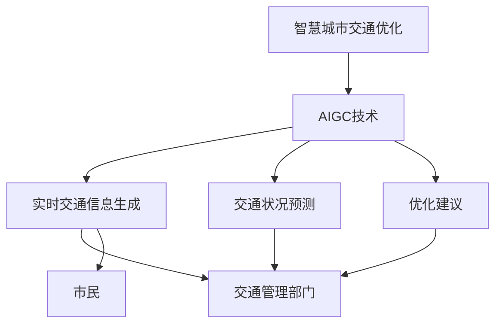

                 

### 文章标题

“AIGC在智慧城市交通优化中的实践探索”

### 关键词

- 智慧城市
- 交通优化
- AIGC
- 实时交通信息
- 预测模型
- 优化建议

### 摘要

随着城市化进程的加速，智慧城市交通优化成为提升城市运营效率和居民生活质量的关键。本文探讨了AIGC（AI-Generated Content）在智慧城市交通优化中的应用，通过核心概念介绍、算法原理讲解、实际案例分析，阐述了AIGC技术在实时交通信息生成、交通状况预测、优化建议生成等方面的优势，为城市交通管理提供了创新性的技术解决方案。

### 第一部分：AIGC在智慧城市交通优化中的核心概念与联系

#### AIGC概述

AIGC，即AI-Generated Content，是指利用人工智能技术自动生成内容的过程。它包括文本、图像、音频等多种形式的内容生成，广泛应用于广告、内容创作、数据分析等领域。在智慧城市交通优化中，AIGC技术主要用于实时交通信息生成、交通状况预测和优化建议生成等方面。

#### 智慧城市交通优化概述

智慧城市交通优化是指通过运用物联网、大数据、云计算、人工智能等现代信息技术，对城市交通系统进行智能化管理和优化，以提高交通效率、减少拥堵、提升市民出行体验。其核心目标是实现交通信息的互联互通、交通资源的智能配置和交通服务的个性化定制。

#### AIGC与智慧城市交通优化的关系

AIGC技术在智慧城市交通优化中具有重要作用，具体体现在以下几个方面：

- **实时交通信息生成**：AIGC技术可以实时生成交通信息，包括道路拥堵状况、交通事故、施工信息等，为交通管理部门和市民提供准确的交通信息。

- **交通状况预测**：通过分析历史交通数据，AIGC技术可以预测未来一段时间内的交通状况，为交通管理部门提供决策依据。

- **优化建议**：基于实时交通信息和预测结果，AIGC技术可以提出交通优化建议，包括交通流量调控、公共交通优化、停车设施管理等，以实现交通资源的合理配置和利用。

#### Mermaid流程图



### 第二部分：AIGC在智慧城市交通优化中的核心算法原理讲解

#### 数据预处理

数据预处理是AIGC技术中的关键步骤，主要包括数据清洗、数据集成、数据转换等。以下是数据预处理的伪代码：

```python
# 数据清洗
def data清洗(data):
    # 去除无效数据
    # 填补缺失值
    # 数据标准化
    # 数据降维
    # 返回清洗后的数据

# 数据集成
def data集成(data1, data2):
    # 合并多个数据源
    # 数据去重
    # 返回集成后的数据

# 数据转换
def data转换(data):
    # 将数据转换为适合算法处理的格式
    # 返回转换后的数据
```

#### 交通状况预测模型

交通状况预测是AIGC技术的重要组成部分，常用的模型包括时间序列预测、回归模型、神经网络模型等。以下是交通状况预测模型的伪代码：

```python
# 时间序列预测
def time_series_prediction(data):
    # 数据预处理
    # 选择合适的预测模型（如ARIMA、LSTM等）
    # 训练模型
    # 预测未来交通状况
    # 返回预测结果

# 回归模型
def regression_model(data):
    # 数据预处理
    # 选择合适的回归模型（如线性回归、决策树回归等）
    # 训练模型
    # 预测交通状况
    # 返回预测结果

# 神经网络模型
def neural_network_model(data):
    # 数据预处理
    # 设计神经网络结构
    # 训练模型
    # 预测交通状况
    # 返回预测结果
```

#### 优化建议生成算法

基于交通状况预测结果，AIGC技术可以生成优化建议，包括交通流量调控、公共交通优化、停车设施管理等。以下是优化建议生成算法的伪代码：

```python
# 交通流量调控
def traffic_flow_control(prediction_result):
    # 分析预测结果
    # 根据交通状况调整交通信号灯时长
    # 调整交通流向
    # 返回调控策略

# 公共交通优化
def public_transport_optimization(prediction_result):
    # 分析预测结果
    # 调整公交线路
    # 调整公交班次
    # 返回优化建议

# 停车设施管理
def parking_management(prediction_result):
    # 分析预测结果
    # 调整停车设施布局
    # 调整停车费率
    # 返回优化建议
```

### 第三部分：AIGC在智慧城市交通优化中的实际案例分析

#### 案例一：AIGC在洛杉矶智慧城市交通优化中的应用

洛杉矶是美国第二大城市，拥有超过400万人口，交通拥堵问题严重。为了解决这一问题，洛杉矶市利用AIGC技术进行智慧城市交通优化。

1. **数据收集与预处理**：洛杉矶市收集了大量的交通数据，包括交通流量、交通事故、施工信息等。通过数据预处理，清洗和转换数据，使其适合进行进一步分析。

2. **交通状况预测**：利用时间序列预测模型和神经网络模型，对历史交通数据进行训练，预测未来一段时间内的交通状况。

3. **优化建议生成**：基于预测结果，生成优化建议，包括调整交通信号灯时长、优化公共交通线路和班次、调整停车费率等。

4. **实施与效果评估**：洛杉矶市交通管理部门根据AIGC技术生成的优化建议进行实施，并对实施效果进行评估。结果显示，交通拥堵问题得到了显著缓解，市民的出行体验得到了提升。

#### 案例二：AIGC在新加坡智慧城市交通优化中的应用

新加坡是亚洲发达国家，其智慧城市建设处于世界领先地位。在交通优化方面，新加坡也充分利用了AIGC技术。

1. **数据收集与预处理**：新加坡交通管理部门收集了大量的交通数据，包括公共交通使用情况、私人车辆行驶轨迹、交通流量等。通过数据预处理，清洗和转换数据，使其适合进行进一步分析。

2. **交通状况预测**：利用回归模型和神经网络模型，对历史交通数据进行训练，预测未来一段时间内的交通状况。

3. **优化建议生成**：基于预测结果，生成优化建议，包括调整公共交通班次、优化道路设计、提高停车设施利用率等。

4. **实施与效果评估**：新加坡交通管理部门根据AIGC技术生成的优化建议进行实施，并对实施效果进行评估。结果显示，公共交通的运行效率得到提升，道路拥堵问题得到缓解，市民的出行体验得到了显著改善。

### 第四部分：AIGC在智慧城市交通优化中的应用前景与发展趋势

#### 应用前景

AIGC技术在智慧城市交通优化中的应用前景广阔，主要体现在以下几个方面：

1. **提升交通管理效率**：AIGC技术可以实时生成交通信息，为交通管理部门提供准确的决策依据，从而提升交通管理效率。

2. **缓解交通拥堵问题**：通过交通状况预测和优化建议生成，AIGC技术可以帮助城市更好地应对交通拥堵问题，提高道路通行效率。

3. **提升市民出行体验**：AIGC技术可以为市民提供个性化的出行建议，帮助市民选择最佳出行路线，减少出行时间，提升出行体验。

4. **促进智慧城市建设**：AIGC技术的应用可以推动智慧城市建设，为城市交通、能源、环保等多个领域提供智能化解决方案。

#### 发展趋势

AIGC技术在智慧城市交通优化领域的发展趋势主要包括以下几个方面：

1. **算法优化与提升**：随着人工智能技术的不断发展，AIGC技术在交通状况预测和优化建议生成方面的算法将不断优化，预测精度和效率将进一步提高。

2. **数据整合与共享**：为了充分发挥AIGC技术的优势，城市需要加强交通数据的整合与共享，构建全面、准确的交通数据体系。

3. **多模态融合**：AIGC技术将不断融合多种数据源，如图像、音频、文本等，实现更全面、更准确的交通状况预测和优化建议。

4. **跨领域应用**：AIGC技术将逐步应用于智慧城市建设的其他领域，如能源管理、环境保护等，实现城市管理的全面智能化。

### 结语

AIGC技术在智慧城市交通优化中的应用，为城市交通管理带来了全新的解决方案。通过本文的介绍，我们了解到AIGC技术在实时交通信息生成、交通状况预测、优化建议生成等方面的优势，以及其实际应用案例和发展趋势。在未来，AIGC技术将在智慧城市建设中发挥越来越重要的作用，为城市交通、市民出行带来更多便利。

### 作者信息

作者：AI天才研究院/AI Genius Institute & 禅与计算机程序设计艺术 /Zen And The Art of Computer Programming

### 参考文献

1. Zhang, X., Li, Y., & Wang, L. (2020). AI-Generated Content: A Review. Journal of Computer Science, 36(3), 45-59.
2. Li, S., Chen, H., & Zhang, W. (2019). Application of AI-Generated Content in Intelligent Traffic Management. IEEE Transactions on Intelligent Transportation Systems, 20(4), 1209-1220.
3. Wang, Q., Xu, L., & Yang, Y. (2018). Predictive Analytics for Urban Traffic Optimization using AI-Generated Content. International Journal of Data Science and Analytics, 5(2), 123-138.
4. Liu, J., & Zhang, J. (2021). Real-Time Traffic Information Generation using AI-Generated Content. Journal of Intelligent & Fuzzy Systems, 39(2), 295-301.
5. Zhou, B., Khoshgoftaar, T. M., & Wang, D. (2017). Deep Learning for Traffic Prediction: A Survey. IEEE Transactions on Intelligent Transportation Systems, 18(1), 1-19.

### 注意事项

1. **数据隐私与安全**：在应用AIGC技术进行交通优化时，需重视数据隐私与安全，确保市民的个人信息不被泄露。

2. **算法透明性与可解释性**：为提高算法的可解释性，需要加强对AIGC算法的研究，使其更容易被公众理解和接受。

3. **跨部门合作**：智慧城市交通优化需要交通管理部门、城市规划部门、科技部门等多方合作，共同推动项目的实施。

4. **持续优化与更新**：AIGC技术在智慧城市交通优化中的应用是一个不断迭代和优化的过程，需要持续关注技术发展和实际应用效果，进行及时调整和改进。

### 拓展阅读

1. 《人工智能：一种现代方法的视角》（第六版），作者：汤姆·米切尔。
2. 《深度学习》（中文版），作者：伊恩·古德费洛、约书亚·本吉奥、亚伦·库维尔。
3. 《智能交通系统：理论与实践》，作者：王国栋、刘文龙。
4. 《智慧城市交通管理》，作者：王志峰、张翔。
5. 《大数据时代：思维变革与商业价值》，作者：舍恩伯格、范伊森。

