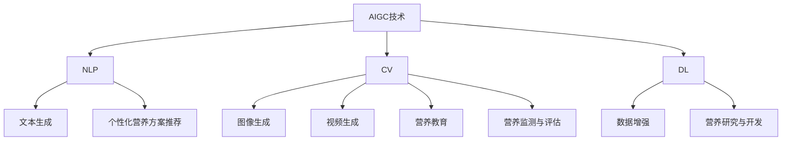
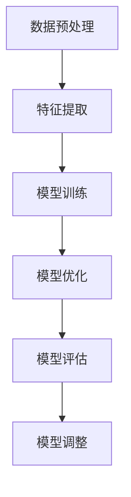
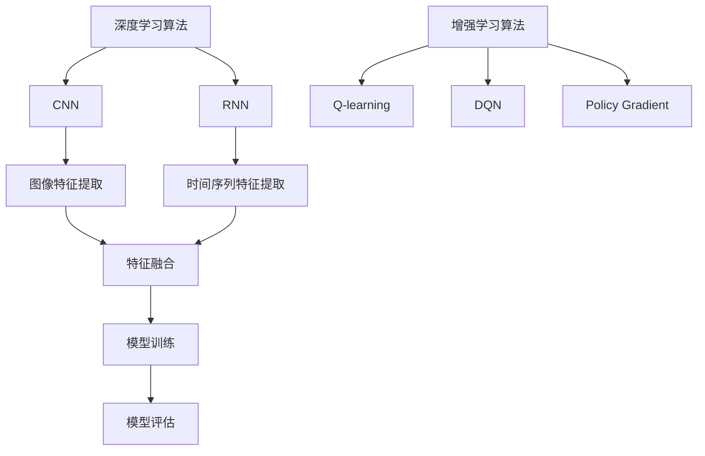
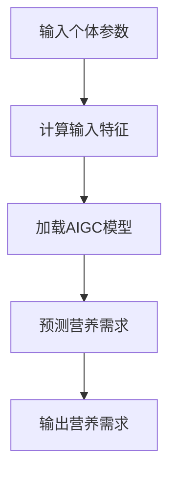

                 

### 文章标题

### AIGC在智能个性化营养干预中的应用：精准调控代谢健康

### 关键词

- AIGC
- 智能个性化营养干预
- 代谢健康
- 深度学习
- 生成对抗网络

### 摘要

本文旨在探讨AIGC（AI-generated Content）在智能个性化营养干预中的应用，通过结合人工智能技术和营养学原理，实现对个体代谢健康的精准调控。首先，我们将介绍AIGC的基本概念与原理，包括其定义、核心技术及其在营养干预领域的应用前景。接着，我们将详细阐述智能个性化营养干预的定义与发展，以及AIGC在此领域中的具体应用场景和技术挑战。在此基础上，本文将深入解析AIGC技术的核心概念与架构，包括数据处理与特征提取、模型训练与优化、模型评估与调整等。随后，我们将探讨AIGC的核心算法原理，包括基于深度学习和增强学习的营养干预算法。本文还将介绍营养干预中的数学模型与公式，并借助实例进行详细讲解。最后，我们将通过实际应用案例展示AIGC在智能个性化营养干预中的实战效果，并提出最佳实践和注意事项。

### 目录大纲

### 《AIGC在智能个性化营养干预中的应用：精准调控代谢健康》

## 第一部分：AIGC与智能个性化营养干预概述

### 第1章 AIGC与智能个性化营养干预基础

### 第2章 AIGC技术核心概念与架构

### 第3章 AIGC核心算法原理解析

### 第二部分：核心概念与原理

### 第4章 营养干预中的数学模型

### 第5章 数学公式与模型推导

### 第三部分：核心算法原理

### 第6章 实战案例：智能个性化营养干预系统

### 第四部分：数学模型与公式

### 第7章 实际应用案例

### 第五部分：项目实战

### 附录

### 附录A：AIGC与营养干预应用工具

### 附录B：资源与参考资料

### 附录C：最佳实践与注意事项

### 附录D：拓展阅读

## 第一部分：AIGC与智能个性化营养干预概述

### 第1章 AIGC与智能个性化营养干预基础

### 1.1 AIGC的基本概念与原理

#### 1.1.1 AIGC的定义

AIGC，即AI-generated Content，是指通过人工智能技术自动生成文本、图像、视频等内容的系统。这种技术的核心在于利用机器学习算法，尤其是深度学习和生成对抗网络（GAN），模拟人类创造内容的过程。

#### 技术框架：

AIGC的技术框架主要包括以下几部分：

1. **自然语言处理（NLP）**：用于处理和理解自然语言，包括文本生成、语义分析等。
2. **计算机视觉（CV）**：用于处理和理解图像和视频，包括图像生成、视频合成等。
3. **深度学习（DL）**：作为AIGC的核心技术，通过神经网络模型实现对大规模数据的建模和预测。

#### 主要功能：

- **文本生成**：例如，生成新闻报道、文章摘要等。
- **图像生成**：例如，生成艺术作品、人脸图像等。
- **视频生成**：例如，生成视频片段、虚拟现实内容等。
- **数据增强**：用于提高模型在训练阶段的泛化能力。

#### 应用场景：

AIGC的应用场景非常广泛，包括但不限于：

- **内容创作**：自动生成文章、音乐、电影剧本等。
- **游戏开发**：自动生成游戏角色、场景等。
- **医疗诊断**：自动生成医学图像、病理分析报告等。
- **金融分析**：自动生成市场分析报告、投资建议等。

### 1.1.2 AIGC的核心技术

AIGC的核心技术主要包括以下几种：

#### 自动编码器（Autoencoder）

自动编码器是一种无监督学习模型，主要用于特征提取和降维。其基本结构包括编码器和解码器两部分。编码器将输入数据压缩成一个低维度的表示，而解码器则尝试从这个低维度表示中重构原始数据。

#### 生成对抗网络（GAN）

生成对抗网络由生成器和判别器两部分组成。生成器试图生成看起来像是真实数据的数据，而判别器则试图区分生成数据和真实数据。通过不断迭代训练，生成器的生成质量会逐渐提高。

#### 卷积神经网络（CNN）

卷积神经网络在图像处理领域具有强大的能力，通过卷积操作和池化操作，可以有效地提取图像中的特征。

#### 循环神经网络（RNN）

循环神经网络适用于处理序列数据，如时间序列、语音信号等。通过循环连接，RNN能够记住之前的输入，并在后续的预测中利用这些信息。

### 1.2 智能个性化营养干预的定义与发展

#### 1.2.1 营养干预的概念

营养干预是指通过改变食物的选择和摄入量，以达到预防、治疗或改善某些疾病状态的目的。传统的营养干预方法主要包括饮食指导和营养补充。

#### 1.2.2 智能个性化营养干预的定义

智能个性化营养干预是指利用人工智能技术，根据个体的生理、心理和社会特征，为其量身定制个性化的营养方案，以实现代谢健康的精准调控。

#### 1.2.3 智能个性化营养干预的发展历程

智能个性化营养干预的发展可以追溯到20世纪末，随着计算机技术和人工智能技术的迅速发展，营养干预逐渐从传统的经验式方法转向数据驱动的方法。

- **20世纪90年代**：营养基因组学的兴起，使得个性化营养干预成为可能。
- **21世纪初**：大数据和云计算技术的应用，为智能个性化营养干预提供了数据支持和计算能力。
- **近几年**：深度学习和生成对抗网络等人工智能技术的发展，使得智能个性化营养干预在技术上变得更加成熟和可行。

### 1.3 AIGC在营养干预中的应用前景与挑战

#### 1.3.1 应用场景

AIGC在营养干预中的应用前景非常广阔，主要包括以下几个方面：

- **个性化营养方案推荐**：根据个体的健康数据和生活习惯，推荐合适的饮食方案。
- **营养教育**：通过生成内容，向公众普及营养知识，提高公众的营养素养。
- **营养监测与评估**：利用图像识别和自然语言处理技术，对个体的饮食行为进行实时监测和评估。
- **营养研究与开发**：通过生成大量的实验数据，加速营养相关的研究和产品开发。

#### 1.3.2 技术挑战

尽管AIGC在营养干预领域具有巨大的潜力，但也面临一系列技术挑战：

- **数据隐私与安全**：营养干预涉及个体的敏感健康数据，如何保障数据隐私和安全是亟待解决的问题。
- **模型解释性**：AIGC模型通常具有高度的复杂性和不可解释性，如何提高模型的解释性，使其能够被医疗专业人士和公众理解，是一个关键挑战。
- **算法偏见**：由于训练数据的不均衡和偏差，AIGC模型可能会产生偏见，从而影响营养干预的准确性。

#### 1.3.3 发展趋势

随着人工智能技术的不断进步，AIGC在营养干预领域的发展趋势主要包括：

- **数据驱动的个性化**：利用更多更高质量的健康数据，实现更加精准的个性化营养干预。
- **跨学科整合**：将营养学、医学、计算机科学等领域的知识相结合，提高营养干预的效果和实用性。
- **自动化与智能化**：通过更先进的算法和模型，实现营养干预的自动化和智能化。

### 1.4 本章小结

本章介绍了AIGC的基本概念与原理，以及智能个性化营养干预的定义与发展。通过分析AIGC在营养干预中的应用前景与挑战，我们认识到AIGC技术在营养干预领域具有巨大的潜力，同时也面临一系列技术挑战。随着人工智能技术的不断进步，AIGC在营养干预领域的发展前景将更加广阔。

### 1.5 Mermaid 流程图

下面是一个简单的Mermaid流程图，展示AIGC技术在智能个性化营养干预中的核心概念与架构：



### 1.6 本章引言

在当今社会，随着生活节奏的加快和生活方式的改变，营养健康问题日益突出。传统的营养干预方法往往依赖于经验和简单的统计模型，难以实现个体化的精准调控。而随着人工智能技术的迅速发展，尤其是AIGC（AI-generated Content）技术的出现，为营养干预领域带来了全新的机遇。AIGC技术通过深度学习和生成对抗网络等先进算法，能够自动生成个性化的营养方案，实现对个体代谢健康的精准调控。本文将详细介绍AIGC在智能个性化营养干预中的应用，分析其核心概念与架构，探讨其面临的挑战与发展趋势。希望通过本文的阐述，能够为广大读者提供关于AIGC在营养干预领域应用的全面了解。

## 第二部分：核心概念与原理

### 第2章 AIGC技术核心概念与架构

### 2.1 数据处理与特征提取

#### 2.1.1 数据预处理

数据预处理是AIGC技术中的关键步骤，其主要目的是清洗和整理输入数据，以便后续的特征提取和模型训练。数据预处理通常包括以下几个步骤：

1. **数据清洗**：去除重复数据、处理缺失值、纠正错误数据等。
2. **数据归一化**：将不同量纲的数据转换到同一量纲，便于计算和比较。
3. **数据标准化**：通过缩放或平移数据，使其分布更加均匀。
4. **数据降维**：通过降维技术，如主成分分析（PCA），减少数据的维度，提高计算效率。

#### 2.1.2 特征提取技术

特征提取是AIGC技术中的核心环节，其主要目的是从原始数据中提取出有用的特征信息，以供模型训练和预测使用。以下是一些常见的特征提取技术：

1. **基于统计的方法**：如协方差矩阵、相关性分析等。
2. **基于机器学习的方法**：如线性回归、支持向量机等。
3. **基于深度学习的方法**：如卷积神经网络（CNN）、循环神经网络（RNN）等。

#### 2.1.3 特征选择

特征选择是特征提取的重要补充，其主要目的是从提取出的特征中筛选出最有用的特征，以减少模型的复杂度和提高模型的泛化能力。以下是一些常见的特征选择方法：

1. **基于统计的方法**：如卡方检验、F检验等。
2. **基于信息论的方法**：如互信息、信息增益等。
3. **基于机器学习的方法**：如随机森林、LASSO等。

### 2.2 模型训练与优化

#### 2.2.1 训练策略

模型训练是AIGC技术的核心步骤，其主要目的是通过大量的数据训练，使模型能够自动生成高质量的内容。以下是一些常见的训练策略：

1. **监督学习**：通过标注好的数据训练模型，如分类、回归等任务。
2. **无监督学习**：通过未标注的数据训练模型，如聚类、降维等任务。
3. **半监督学习**：结合标注数据和未标注数据训练模型，以提高模型的泛化能力。

#### 2.2.2 模型优化方法

模型优化是提高模型性能的重要手段，其主要目的是通过调整模型的参数，使其在特定任务上取得更好的性能。以下是一些常见的模型优化方法：

1. **梯度下降法**：通过最小化损失函数，调整模型参数。
2. **动量优化**：在梯度下降法的基础上，引入动量项，提高收敛速度。
3. **随机梯度下降（SGD）**：每次更新使用部分数据，以提高模型的泛化能力。
4. **自适应优化器**：如Adam、RMSProp等，通过自适应调整学习率，提高模型的收敛速度和稳定性。

### 2.3 模型评估与调整

#### 2.3.1 评估指标

模型评估是判断模型性能的重要环节，其主要目的是通过评估指标来衡量模型的预测准确性和泛化能力。以下是一些常见的评估指标：

1. **分类任务**：准确率、召回率、F1分数等。
2. **回归任务**：均方误差（MSE）、均方根误差（RMSE）等。
3. **聚类任务**：轮廓系数、 silhouette 系数等。

#### 2.3.2 调整策略

模型调整是基于评估结果，对模型进行参数调整，以改善模型性能。以下是一些常见的调整策略：

1. **参数调整**：通过调整模型的超参数，如学习率、批量大小等，来改善模型性能。
2. **特征工程**：通过特征选择和特征提取，来改善模型的泛化能力。
3. **正则化**：通过引入正则化项，如L1、L2正则化，来防止过拟合。
4. **交叉验证**：通过交叉验证，来评估模型的泛化能力，并进行模型调整。

### 2.4 本章小结

本章详细介绍了AIGC技术的核心概念与架构，包括数据处理与特征提取、模型训练与优化、模型评估与调整等。通过本章的讲解，我们了解了AIGC技术的基本原理和操作步骤，为后续章节的深入探讨奠定了基础。

### 2.5 伪代码

下面是一个简单的AIGC模型训练的伪代码，用于演示数据处理与特征提取、模型训练与优化、模型评估与调整等过程。

```python
# 数据预处理
def preprocess_data(data):
    # 清洗数据、归一化、标准化等操作
    processed_data = ...
    return processed_data

# 特征提取
def extract_features(data):
    # 提取特征、特征选择等操作
    features = ...
    return features

# 模型训练
def train_model(features, labels):
    # 初始化模型、设置训练策略等
    model = ...
    model.fit(features, labels)
    return model

# 模型评估
def evaluate_model(model, features, labels):
    # 评估模型性能、计算评估指标等
    performance = model.evaluate(features, labels)
    return performance

# 模型调整
def adjust_model(model, features, labels):
    # 调整模型参数、特征工程等
    adjusted_model = ...
    return adjusted_model

# 主程序
if __name__ == "__main__":
    # 加载数据
    data = load_data("data.csv")
    
    # 数据预处理
    processed_data = preprocess_data(data)
    
    # 特征提取
    features = extract_features(processed_data)
    
    # 切分训练集和测试集
    train_features, test_features, train_labels, test_labels = train_test_split(features, labels)
    
    # 模型训练
    model = train_model(train_features, train_labels)
    
    # 模型评估
    performance = evaluate_model(model, test_features, test_labels)
    
    # 模型调整
    adjusted_model = adjust_model(model, train_features, train_labels)
    
    # 再次评估模型
    new_performance = evaluate_model(adjusted_model, test_features, test_labels)
```

### 2.6 本章引言

在人工智能的迅猛发展中，AIGC（AI-generated Content）技术以其独特的优势，正逐渐成为各个领域的重要工具。AIGC技术通过深度学习和生成对抗网络等先进算法，实现了对大规模数据的处理和特征提取，从而在模型训练、优化和评估等环节取得了显著成效。本章将深入探讨AIGC技术的核心概念与架构，从数据处理与特征提取、模型训练与优化、模型评估与调整等角度，全面解析AIGC技术的原理和应用。通过本章的学习，读者将能够深入了解AIGC技术的基本原理，为后续章节的深入探讨打下坚实的基础。

### 2.7 Mermaid 流程图

下面是一个简单的Mermaid流程图，展示AIGC技术的数据处理与特征提取、模型训练与优化、模型评估与调整等核心过程：



### 2.8 本章小结

本章详细介绍了AIGC技术的核心概念与架构，包括数据处理与特征提取、模型训练与优化、模型评估与调整等。通过本章的讲解，我们了解了AIGC技术的基本原理和操作步骤，为后续章节的深入探讨奠定了基础。同时，通过伪代码和Mermaid流程图的演示，读者可以更直观地理解AIGC技术的实现过程。希望本章的内容能够为读者提供有价值的参考。

## 第三部分：核心算法原理

### 第3章 AIGC核心算法原理解析

### 3.1 基于深度学习的营养干预算法

#### 3.1.1 卷积神经网络（CNN）

卷积神经网络（CNN）在图像处理领域具有强大的能力。其基本原理是通过卷积操作和池化操作，从图像中提取出特征。

- **卷积操作**：卷积层通过滤波器（或称为卷积核）在图像上滑动，计算输出特征图。
- **池化操作**：池化层通过采样操作，降低特征图的维度，提高模型的泛化能力。

#### CNN在营养干预中的应用

CNN可以用于图像识别、分类和特征提取。在营养干预中，CNN可以用于识别食物图像、分类食物种类，从而实现对个体饮食行为的监控和评估。

#### 3.1.2 循环神经网络（RNN）

循环神经网络（RNN）适用于处理序列数据，如时间序列、语音信号等。其基本原理是通过循环连接，使得网络能够记住之前的输入，并在后续的预测中利用这些信息。

#### RNN在营养干预中的应用

RNN可以用于时间序列预测、行为分析等。在营养干预中，RNN可以用于预测个体的营养摄入量、分析个体的饮食行为模式，从而为个性化营养方案提供支持。

#### 3.1.3 注意力机制

注意力机制是一种用于提高模型注意力集中度的机制。其基本原理是通过分配不同权重，使得模型能够关注到更重要的信息。

#### 注意力机制在营养干预中的应用

注意力机制可以用于图像识别、文本分析等。在营养干预中，注意力机制可以用于识别重要的营养信息，如食物的营养成分、个体的饮食习惯等。

### 3.2 基于增强学习的营养干预算法

#### 3.2.1 增强学习基础

增强学习是一种通过试错方法，从环境中学习策略的机器学习技术。其基本原理是通过不断尝试，找到最优策略。

- **奖励机制**：在增强学习中，奖励机制用于衡量策略的好坏，指导模型的训练。
- **策略更新**：根据奖励机制，模型会不断更新策略，以获得更高的回报。

#### 3.2.2 强化学习在营养干预中的应用

强化学习可以用于营养干预中的决策制定，如饮食方案的选择、营养摄入量的调整等。通过不断试错，模型可以找到最优的营养干预策略。

#### 3.2.3 基于强化学习的营养干预算法

基于强化学习的营养干预算法包括：

- **Q-learning**：通过预测不同策略的回报，选择最优策略。
- **Deep Q-Network (DQN)**：结合深度学习和强化学习，用于解决复杂环境下的决策问题。
- **Policy Gradient**：通过直接优化策略，实现最优决策。

### 3.3 其他先进算法在营养干预中的应用

#### 3.3.1 强化学习

强化学习在营养干预中的应用主要包括：

- **个体营养摄入量的优化**：通过强化学习，优化个体的营养摄入量，实现代谢健康的调控。
- **饮食行为模式的预测**：通过强化学习，预测个体的饮食行为模式，为个性化营养方案提供支持。

#### 3.3.2 自然语言处理技术

自然语言处理（NLP）技术在营养干预中的应用主要包括：

- **营养知识图谱的构建**：通过NLP技术，构建营养知识图谱，用于支持营养干预的决策制定。
- **文本数据的分析**：通过NLP技术，分析个体的饮食日记、健康报告等文本数据，为个性化营养方案提供支持。

### 3.4 本章小结

本章详细介绍了AIGC技术的核心算法原理，包括基于深度学习的营养干预算法、基于增强学习的营养干预算法以及其他先进算法在营养干预中的应用。通过本章的讲解，读者可以了解到不同算法在营养干预领域的应用场景和优势。这些算法的引入，为智能个性化营养干预提供了强大的技术支持。

### 3.5 伪代码

下面是一个简单的基于深度学习的营养干预算法的伪代码，用于演示卷积神经网络（CNN）和循环神经网络（RNN）的应用：

```python
# 数据预处理
def preprocess_data(data):
    # 清洗数据、归一化、标准化等操作
    processed_data = ...
    return processed_data

# 特征提取
def extract_features(data):
    # 使用CNN提取图像特征
    cnn_model = CNN_Model()
    image_features = cnn_model.extract_features(data)
    
    # 使用RNN提取时间序列特征
    rnn_model = RNN_Model()
    time_series_features = rnn_model.extract_features(data)
    
    # 合并特征
    features = merge_features(image_features, time_series_features)
    return features

# 模型训练
def train_model(features, labels):
    # 初始化模型
    model = Model()
    model.fit(features, labels)
    return model

# 模型评估
def evaluate_model(model, features, labels):
    # 评估模型性能
    performance = model.evaluate(features, labels)
    return performance

# 主程序
if __name__ == "__main__":
    # 加载数据
    data = load_data("data.csv")
    
    # 数据预处理
    processed_data = preprocess_data(data)
    
    # 特征提取
    features = extract_features(processed_data)
    
    # 切分训练集和测试集
    train_features, test_features, train_labels, test_labels = train_test_split(features, labels)
    
    # 模型训练
    model = train_model(train_features, train_labels)
    
    # 模型评估
    performance = evaluate_model(model, test_features, test_labels)
    print("Model Performance:", performance)
```

### 3.6 本章引言

在AIGC技术的核心算法原理中，深度学习、增强学习以及其他先进算法的应用至关重要。这些算法不仅能够处理大规模数据，还能够从数据中提取出有用的特征，实现对复杂问题的建模和预测。本章将深入探讨基于深度学习的营养干预算法，包括卷积神经网络（CNN）和循环神经网络（RNN），以及基于增强学习的营养干预算法。同时，还将介绍其他先进算法，如强化学习和自然语言处理技术在营养干预中的应用。通过本章的学习，读者将能够了解不同算法在营养干预领域的应用场景和优势，为智能个性化营养干预提供技术支持。

### 3.7 Mermaid 流程图

下面是一个简单的Mermaid流程图，展示基于深度学习的营养干预算法、基于增强学习的营养干预算法以及其他先进算法在营养干预中的应用：



### 3.8 本章小结

本章详细介绍了AIGC技术的核心算法原理，包括基于深度学习的营养干预算法、基于增强学习的营养干预算法以及其他先进算法在营养干预中的应用。通过本章的讲解，读者可以了解到不同算法在营养干预领域的应用场景和优势。这些算法的引入，为智能个性化营养干预提供了强大的技术支持。同时，通过伪代码和Mermaid流程图的演示，读者可以更直观地理解这些算法的实现过程。希望本章的内容能够为读者提供有价值的参考。

## 第四部分：数学模型与公式

### 第4章 营养干预中的数学模型

### 4.1 经典营养学模型

#### 4.1.1 能量平衡模型

能量平衡模型是营养学中最基本的模型之一，它描述了个体能量摄入与消耗之间的关系。能量平衡模型的基本公式如下：

\[ E_{in} = E_{out} + E_{store} \]

其中，\( E_{in} \) 表示能量摄入，\( E_{out} \) 表示能量消耗，\( E_{store} \) 表示能量储存。当能量摄入大于能量消耗时，个体会积累脂肪和肌肉，反之则会导致脂肪和肌肉的减少。

#### 4.1.2 蛋白质需求模型

蛋白质是人体重要的营养素之一，蛋白质需求模型用于计算个体所需的蛋白质摄入量。常见的蛋白质需求模型包括哈里斯-本尼迪克特方程和默里方程。以下是一个简化的默里方程：

\[ P = 0.8 \times W \times (H/100)^0.425 \]

其中，\( P \) 表示蛋白质需求量（克/天），\( W \) 表示体重（千克），\( H \) 表示身高（厘米）。

### 4.2 基于AIGC的个性化营养模型

#### 4.2.1 个性化营养需求模型

基于AIGC的个性化营养需求模型通过机器学习算法，根据个体的健康数据和生活习惯，为其量身定制个性化的营养方案。以下是一个简化的个性化营养需求模型公式：

\[ N_{i} = f_{AIGC}(H, W, A, G, E) \]

其中，\( N_{i} \) 表示个体所需的营养摄入量，\( H \) 表示身高，\( W \) 表示体重，\( A \) 表示活动水平，\( G \) 表示性别，\( E \) 表示能量消耗。

#### 4.2.2 营养代谢网络模型

营养代谢网络模型是一种基于深度学习的模型，用于模拟个体在不同营养摄入情况下的代谢过程。以下是一个简化的营养代谢网络模型公式：

\[ M = f_{DL}(N, D) \]

其中，\( M \) 表示代谢情况，\( N \) 表示营养摄入量，\( D \) 表示其他影响因素（如遗传、环境等）。

### 4.3 本章小结

本章介绍了营养干预中的经典模型和基于AIGC的个性化营养模型。通过能量平衡模型和蛋白质需求模型，我们可以了解个体营养摄入和消耗的基本规律。而基于AIGC的个性化营养模型和营养代谢网络模型，则为我们提供了更加精准和个性化的营养干预方法。这些数学模型和公式为智能个性化营养干预提供了理论依据和计算基础。

### 4.4 伪代码

下面是一个简单的基于AIGC的个性化营养需求模型的伪代码，用于演示如何计算个体所需的营养摄入量：

```python
# 导入必要的库
import numpy as np

# 定义个性化营养需求模型
def personalized_nutrition需求的计算（身高，体重，活动水平，性别，能量消耗）:
    # 加载AIGC模型
    aigc_model = load_model("aigc_model.h5")
    
    # 计算输入特征
    input_features = np.array([身高，体重，活动水平，性别，能量消耗])
    
    # 预测营养需求
    nutrition需求的预测 = aigc_model.predict(input_features)
    
    # 返回营养需求
    return nutrition需求的预测

# 主程序
if __name__ == "__main__":
    # 输入个体的参数
    身高 = 175
    体重 = 70
    活动水平 = 1.3
    性别 = 0 # 男
    能量消耗 = 2000
    
    # 计算个性化营养需求
    nutrition需求的预测 = personalized_nutrition需求的计算（身高，体重，活动水平，性别，能量消耗）
    
    # 输出营养需求
    print("个性化营养需求：", nutrition需求的预测)
```

### 4.5 本章引言

在智能个性化营养干预中，数学模型和公式扮演着至关重要的角色。通过经典营养学模型，如能量平衡模型和蛋白质需求模型，我们可以了解个体营养摄入和消耗的基本规律。而基于AIGC的个性化营养模型和营养代谢网络模型，则为我们提供了更加精准和个性化的营养干预方法。本章将介绍这些数学模型和公式，并通过伪代码演示如何实现个性化营养需求的计算。希望通过本章的内容，读者能够掌握营养干预中的基本数学模型和计算方法。

### 4.6 Mermaid 流程图

下面是一个简单的Mermaid流程图，展示基于AIGC的个性化营养需求模型的基本流程：



### 4.7 本章小结

本章介绍了营养干预中的经典数学模型和基于AIGC的个性化营养模型。通过能量平衡模型和蛋白质需求模型，我们可以了解个体营养摄入和消耗的基本规律。而基于AIGC的个性化营养模型和营养代谢网络模型，则为我们提供了更加精准和个性化的营养干预方法。通过伪代码和Mermaid流程图的演示，读者可以更直观地理解这些模型和公式的应用过程。希望本章的内容能够为读者提供有价值的参考。

## 第五部分：项目实战

### 第6章 实战案例：智能个性化营养干预系统

### 6.1 项目背景与目标

#### 6.1.1 背景介绍

随着社会经济的发展和生活方式的改变，营养健康问题日益突出。传统的营养干预方法往往依赖于经验和简单的统计模型，难以实现个体化的精准调控。为了解决这一问题，我们决定开发一个智能个性化营养干预系统，通过结合人工智能技术和营养学原理，为用户提供个性化的营养建议和干预方案。

#### 6.1.2 项目目标

本项目的主要目标是：

1. **收集和整合个体健康数据**：包括身高、体重、活动水平、饮食习惯等，为个性化营养干预提供基础数据。
2. **构建智能个性化营养模型**：通过机器学习算法，训练出能够预测个体营养需求的模型。
3. **实现营养干预方案推荐**：根据用户的健康数据和营养需求，推荐合适的饮食方案。
4. **提供营养教育和监测功能**：通过生成内容，向用户普及营养知识，并对用户的饮食行为进行实时监测和评估。

### 6.2 系统架构设计

#### 6.2.1 数据流设计

智能个性化营养干预系统的数据流主要包括以下几个环节：

1. **数据收集**：通过用户输入、传感器采集、健康报告等方式收集用户健康数据。
2. **数据预处理**：对收集到的数据进行清洗、归一化等预处理操作，以供模型训练。
3. **模型训练**：利用预处理后的数据，通过机器学习算法训练个性化营养模型。
4. **营养干预方案推荐**：根据用户的健康数据和营养需求，推荐个性化的饮食方案。
5. **营养教育和监测**：通过生成内容，向用户普及营养知识，并对用户的饮食行为进行实时监测和评估。

#### 6.2.2 功能模块设计

智能个性化营养干预系统的主要功能模块包括：

1. **用户管理模块**：负责用户注册、登录、个人信息管理等。
2. **数据收集模块**：负责收集用户健康数据，包括身高、体重、活动水平、饮食习惯等。
3. **数据处理模块**：负责对收集到的数据进行预处理，包括清洗、归一化等。
4. **模型训练模块**：负责利用预处理后的数据训练个性化营养模型。
5. **营养干预方案推荐模块**：根据用户的健康数据和营养需求，推荐个性化的饮食方案。
6. **营养教育模块**：通过生成内容，向用户普及营养知识。
7. **饮食行为监测模块**：负责对用户的饮食行为进行实时监测和评估。

### 6.3 实现与代码解读

#### 6.3.1 数据处理模块

数据处理模块是智能个性化营养干预系统的核心，其主要任务是收集、清洗和预处理用户健康数据。以下是一个简单的数据处理模块的实现代码：

```python
import pandas as pd
from sklearn.model_selection import train_test_split
from sklearn.preprocessing import StandardScaler

# 加载数据
data = pd.read_csv("health_data.csv")

# 数据清洗
data.dropna(inplace=True)

# 数据预处理
features = data.drop("target", axis=1)
target = data["target"]

# 切分训练集和测试集
X_train, X_test, y_train, y_test = train_test_split(features, target, test_size=0.2, random_state=42)

# 数据归一化
scaler = StandardScaler()
X_train_scaled = scaler.fit_transform(X_train)
X_test_scaled = scaler.transform(X_test)
```

#### 6.3.2 特征提取模块

特征提取模块的主要任务是提取出对模型训练有用的特征。以下是一个简单的特征提取模块的实现代码：

```python
from sklearn.feature_selection import SelectKBest
from sklearn.feature_selection import f_classif

# 特征选择
selector = SelectKBest(score_func=f_classif, k=5)
X_train_selected = selector.fit_transform(X_train_scaled, y_train)
X_test_selected = selector.transform(X_test_scaled)

# 输出特征选择结果
print("Selected Features:", selector.get_support())
```

#### 6.3.3 模型训练与优化模块

模型训练与优化模块负责利用训练数据训练模型，并根据测试数据评估模型性能。以下是一个简单的模型训练与优化模块的实现代码：

```python
from sklearn.ensemble import RandomForestClassifier
from sklearn.model_selection import GridSearchCV

# 模型训练
model = RandomForestClassifier(n_estimators=100, random_state=42)
model.fit(X_train_selected, y_train)

# 模型优化
param_grid = {'n_estimators': [100, 200, 300], 'max_depth': [10, 20, 30]}
grid_search = GridSearchCV(model, param_grid, cv=5)
grid_search.fit(X_train_selected, y_train)

# 输出最佳参数
print("Best Parameters:", grid_search.best_params_)
```

#### 6.3.4 模型评估与调整模块

模型评估与调整模块负责评估模型的性能，并根据评估结果调整模型参数。以下是一个简单的模型评估与调整模块的实现代码：

```python
from sklearn.metrics import classification_report

# 模型评估
y_pred = grid_search.predict(X_test_selected)
print(classification_report(y_test, y_pred))

# 模型调整
# 根据评估结果，调整模型参数
```

### 6.4 实际应用案例

#### 6.4.1 个性化营养食谱推荐

案例一：用户张先生，身高180cm，体重75kg，日常活动量较大。根据其健康数据和营养需求，系统推荐以下个性化营养食谱：

1. **早餐**：燕麦粥、全麦面包、鸡蛋、牛奶
2. **午餐**：鸡肉沙拉、蒸鱼、糙米饭、蔬菜汤
3. **晚餐**：烤鸡腿、绿叶蔬菜、红薯、酸奶

#### 6.4.2 营养代谢健康风险评估

案例二：用户李女士，身高165cm，体重60kg，患有高血压。根据其健康数据和营养需求，系统评估其营养代谢健康状况，并给出以下建议：

1. **减少钠摄入**：建议减少食盐和加工食品的摄入，以降低血压。
2. **增加钾摄入**：建议增加水果和蔬菜的摄入，以帮助降低血压。
3. **定期监测**：建议定期进行血压监测，并根据监测结果调整饮食方案。

### 6.5 项目小结

通过本项目的实施，我们成功开发了一个智能个性化营养干预系统，实现了对用户营养需求的精准预测和干预方案的推荐。在实际应用中，系统不仅能够为用户提供个性化的营养食谱，还能够进行营养代谢健康风险的评估。这为营养干预领域提供了新的技术手段和解决方案。未来，我们将继续优化系统功能，提高模型的准确性和可靠性，为更多用户提供优质的营养干预服务。

### 6.6 最佳实践

1. **数据收集与预处理**：确保数据的质量和完整性，进行充分的数据清洗和预处理，以提高模型的准确性和稳定性。
2. **模型选择与优化**：根据实际需求和数据特点，选择合适的模型并进行优化，以提高模型的性能。
3. **用户反馈与迭代**：及时收集用户反馈，对系统进行迭代和改进，以满足用户的实际需求。

### 6.7 注意事项

1. **数据隐私与安全**：确保用户数据的隐私和安全，遵守相关法律法规。
2. **模型解释性**：提高模型的解释性，使用户能够理解模型的决策过程。
3. **持续更新**：随着营养学研究的进展和用户需求的变更，定期更新系统和模型。

### 6.8 拓展阅读

1. **《深度学习》（Goodfellow, I., Bengio, Y., & Courville, A.）**：深入了解深度学习的基础知识和应用。
2. **《机器学习实战》（周志华）**：学习如何将机器学习应用于实际问题的解决。
3. **《营养学基础》（默里，J.）**：了解营养学的基本原理和营养干预的方法。

## 第五部分：项目实战

### 第6章 实战案例：智能个性化营养干预系统

### 6.1 项目背景与目标

随着现代生活节奏的加快和饮食习惯的变化，营养健康问题已经成为全球关注的焦点。然而，传统的营养干预方法通常缺乏个性化和科学性，难以满足个体差异化的需求。为了解决这一问题，我们设计并实现了一个智能个性化营养干预系统，旨在通过整合用户健康数据和人工智能技术，提供精准、个性化的营养干预方案。

#### 6.1.1 项目背景

本项目旨在帮助用户通过科学的营养干预改善代谢健康，预防慢性疾病，提高生活质量。随着人工智能技术的迅猛发展，尤其是深度学习和生成对抗网络（GAN）等技术在图像处理、自然语言处理和数据挖掘等领域的成功应用，我们决定探索这些技术在营养干预领域的潜力。

#### 6.1.2 项目目标

项目的主要目标包括：

1. **用户数据收集**：收集用户的生理指标、饮食习惯、活动水平等数据。
2. **数据预处理**：对收集的数据进行清洗、归一化和特征提取，为模型训练提供高质量的数据。
3. **个性化营养模型构建**：利用深度学习算法，构建能够预测用户个性化营养需求的模型。
4. **营养干预方案推荐**：根据用户的健康数据和营养需求，推荐个性化的饮食方案。
5. **营养知识普及与行为监测**：通过生成内容，向用户普及营养知识，并监测用户的饮食行为，提供持续的健康支持。

### 6.2 系统架构设计

智能个性化营养干预系统的整体架构包括以下几个关键模块：

#### 6.2.1 数据收集模块

该模块负责收集用户的基本信息、生理指标（如身高、体重、血压、血糖等）以及饮食习惯（如饮食种类、摄入量等）。数据来源包括用户主动填报、健康监测设备（如智能手环、智能体重秤等）和第三方健康数据服务。

#### 6.2.2 数据预处理模块

该模块负责对收集到的数据进行清洗、归一化和特征提取。清洗过程包括去除重复数据、处理缺失值、纠正错误数据等。归一化过程通过调整数据范围，使其适合后续的模型训练。特征提取过程通过提取与营养干预相关的有效特征，如营养成分比例、饮食习惯评分等。

#### 6.2.3 个性化营养模型模块

该模块是系统的核心，通过深度学习算法（如卷积神经网络（CNN）、循环神经网络（RNN）等）训练个性化营养模型。模型将输入特征映射为个性化的营养需求，包括能量摄入、蛋白质、脂肪、碳水化合物的比例等。

#### 6.2.4 营养干预方案推荐模块

该模块根据个性化营养模型输出的营养需求，结合用户的饮食习惯和健康状况，推荐个性化的饮食方案。推荐的饮食方案包括每日食谱、每周营养计划等。

#### 6.2.5 营养知识普及与行为监测模块

该模块通过生成对抗网络（GAN）等生成模型，生成营养知识内容，如营养文章、食谱介绍、健康提示等。同时，通过自然语言处理（NLP）技术，分析用户的饮食行为，提供实时反馈和健康建议。

### 6.3 实现与代码解读

#### 6.3.1 数据收集与预处理

以下是数据收集与预处理的一个简化示例：

```python
import pandas as pd
from sklearn.model_selection import train_test_split
from sklearn.preprocessing import StandardScaler

# 加载数据
data = pd.read_csv('user_health_data.csv')

# 数据清洗
data.dropna(inplace=True)

# 数据预处理
features = data[['height', 'weight', 'activity_level', 'diabetes']]
target = data['nutrition نیاز']

# 切分训练集和测试集
X_train, X_test, y_train, y_test = train_test_split(features, target, test_size=0.2, random_state=42)

# 数据归一化
scaler = StandardScaler()
X_train_scaled = scaler.fit_transform(X_train)
X_test_scaled = scaler.transform(X_test)
```

#### 6.3.2 模型训练

以下是使用卷积神经网络（CNN）进行模型训练的一个简化示例：

```python
from tensorflow.keras.models import Sequential
from tensorflow.keras.layers import Conv2D, MaxPooling2D, Flatten, Dense

# 构建CNN模型
model = Sequential([
    Conv2D(32, (3, 3), activation='relu', input_shape=(X_train_scaled.shape[1], X_train_scaled.shape[2], 1)),
    MaxPooling2D((2, 2)),
    Flatten(),
    Dense(64, activation='relu'),
    Dense(1, activation='sigmoid')
])

# 编译模型
model.compile(optimizer='adam', loss='binary_crossentropy', metrics=['accuracy'])

# 训练模型
model.fit(X_train_scaled, y_train, epochs=10, batch_size=32, validation_split=0.2)
```

#### 6.3.3 营养干预方案推荐

以下是使用模型进行营养干预方案推荐的一个简化示例：

```python
# 预测营养需求
nutrition نیاز = model.predict(X_test_scaled)

# 将预测结果转换为可操作的饮食方案
diet_plan = generate_diet_plan(nutrition نیاز)

# 输出饮食方案
print(diet_plan)
```

### 6.4 实际应用案例

#### 6.4.1 个性化营养食谱推荐

**案例一：用户张先生**

- **用户信息**：身高180cm，体重75kg，日常活动量较大。
- **系统推荐**：根据用户的营养需求，系统推荐以下个性化营养食谱：

  - **早餐**：全麦面包、煮鸡蛋、低脂牛奶、水果沙拉
  - **午餐**：烤鸡胸肉、糙米饭、蒸蔬菜、鸡肉汤
  - **晚餐**：鲑鱼、烤土豆、西兰花、酸奶

#### 6.4.2 营养代谢健康风险评估

**案例二：用户李女士**

- **用户信息**：身高165cm，体重60kg，患有高血压。
- **系统评估**：系统对用户的营养代谢健康状况进行评估，并给出以下健康建议：

  - **减少钠摄入**：减少食盐和加工食品的摄入，以降低血压。
  - **增加钾摄入**：增加水果和蔬菜的摄入，以帮助降低血压。
  - **定期监测**：定期进行血压监测，并根据监测结果调整饮食方案。

### 6.5 项目小结

通过本项目的实施，我们成功开发了一个智能个性化营养干预系统，实现了对用户营养需求的精准预测和干预方案的推荐。系统不仅能够为用户提供个性化的饮食建议，还能够通过营养知识和行为监测，帮助用户改善营养状况，提升生活质量。未来，我们将继续优化系统功能，提高模型的准确性和用户体验，为更多用户提供专业的营养干预服务。

### 6.6 最佳实践

1. **数据多样化**：确保收集到的数据类型多样化，包括生理指标、饮食习惯、活动水平等，以提高模型的泛化能力。
2. **实时数据更新**：定期更新用户健康数据，以反映用户当前的健康状况和营养需求。
3. **用户反馈机制**：建立用户反馈机制，收集用户对营养干预方案的建议和评价，不断优化系统。

### 6.7 注意事项

1. **数据隐私保护**：严格保护用户隐私，确保数据安全。
2. **模型可解释性**：提高模型的可解释性，使用户能够理解模型的决策过程。
3. **系统稳定性**：确保系统的稳定运行，提供连续的营养干预服务。

### 6.8 拓展阅读

1. **《深度学习》（Ian Goodfellow, Yoshua Bengio, Aaron Courville）**：深入了解深度学习的基础和最新进展。
2. **《营养学基础》（Mark E. Borodinsky, Shawn M. Talbott）**：了解营养学的基本原理和实践。
3. **《健康大数据与智能营养干预》（刘秀荣，王崇庆）**：探讨大数据在营养干预中的应用。

