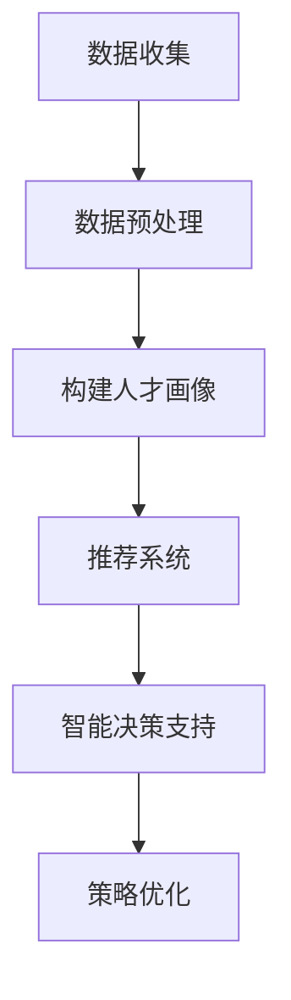

                 

### 文章标题

"AIGC在智能人才留存策略制定中的应用"

### 关键词

人工智能（AI）、生成式人工智能（AIGC）、人才留存、策略制定、智能人才管理

### 摘要

本文深入探讨了生成式人工智能（AIGC）在智能人才留存策略制定中的应用。文章首先介绍了AIGC的概念和分类，然后阐述了智能人才留存策略的背景及其重要性。通过分析AIGC的基础理论，包括自动化与智能化的关系、数据驱动决策原理，以及其在人才管理中的应用场景，本文详细介绍了AIGC在构建人才画像、个性化推荐系统等方面的实际应用。接着，文章讲解了AIGC的关键算法，包括机器学习和深度学习算法，以及与人才留存策略相关的主要算法。通过数学模型与公式的详细讲解，文章帮助读者理解逻辑回归、决策树和神经网络模型。在实践部分，本文介绍了AIGC在数据预处理、实际应用案例和智能人才推荐系统开发中的具体应用。最后，文章提出了智能人才留存策略的制定框架，并讨论了AIGC在其中的作用。通过一个项目实战案例，本文展示了AIGC在智能人才留存策略中的应用效果，并提出了未来研究方向。

### 第1章 引言

#### 1.1 AIGC概述

**AIGC的定义与分类**

生成式人工智能（AIGC，Generative Artificial Intelligence）是一种能够创造内容、生成数据的人工智能技术。与传统的基于规则的专家系统和机器学习方法不同，AIGC具有自主生成和创造的能力。AIGC可以分为两大类：无监督生成式学习和有监督生成式学习。

- **无监督生成式学习**：这种类型的学习不需要外部标签或监督信息，通过学习数据分布来生成新的数据。典型的算法包括生成对抗网络（GANs）和变分自编码器（VAEs）。

- **有监督生成式学习**：这种类型的学习使用训练数据进行监督，将输入数据映射到目标输出数据。常见的算法包括条件生成对抗网络（cGANs）和条件变分自编码器（cVAEs）。

**AIGC在人才留存策略中的作用**

在人才留存策略中，AIGC的应用主要体现在以下几个方面：

- **个性化推荐系统**：通过分析员工的个人数据和偏好，AIGC可以推荐适合的培训课程、项目和工作环境，从而提高员工的满意度和留存率。

- **人才画像构建**：AIGC能够从大量的员工数据中提取关键特征，构建详细的人才画像，帮助管理层了解员工的技能、兴趣和发展潜力。

- **自动化决策支持**：通过机器学习算法，AIGC可以帮助企业自动化决策过程，例如人才晋升、绩效评估和培训需求分析。

#### 1.2 智能人才留存策略背景

**人才流失的现状与影响**

在当今竞争激烈的人才市场中，人才流失已成为企业面临的一大挑战。根据调查显示，高离职率不仅导致企业成本增加，还影响企业的业务连续性和创新能力。以下是人才流失的一些主要影响：

- **成本增加**：员工离职带来的直接成本包括离职补偿金、招聘费用、培训成本等。此外，新员工的入职和培训过程也会增加企业的运营成本。

- **业务连续性影响**：关键岗位的空缺可能导致项目的延迟或中断，影响企业的业务运营。

- **创新能力下降**：人才的流失可能带走企业的核心技术和创新思想，削弱企业的竞争力。

**智能化管理的趋势**

随着人工智能技术的发展，企业开始探索智能化管理的方法来应对人才流失问题。以下是一些智能化管理的趋势：

- **数据分析与挖掘**：通过数据分析，企业可以了解员工流失的原因，制定有针对性的留才策略。

- **智能化招聘与筛选**：利用自然语言处理和计算机视觉等技术，企业可以实现自动化招聘和筛选，提高招聘效率。

- **员工体验优化**：通过分析员工的工作内容和需求，企业可以提供个性化的培训和发展机会，提高员工的满意度和忠诚度。

### 第2章 AIGC基础理论

#### 2.1 AIGC的核心概念

**自动化与智能化的关系**

自动化（Automation）是指通过技术手段减少或消除人工操作的过程，使系统或设备能够自动完成特定任务。而智能化（Intelligence）则是指系统能够理解、学习、适应和自主决策的能力。

- **自动化**主要是执行预先设定的操作流程，其核心是减少人力成本和提高工作效率。
- **智能化**则更注重系统的自主学习和决策能力，能够在复杂和动态的环境中做出合理的决策。

**数据驱动决策原理**

数据驱动决策（Data-Driven Decision Making）是一种基于数据分析和模型预测的决策方法。其基本原理包括：

- **数据收集**：收集与决策相关的数据，包括内部数据和外部数据。
- **数据预处理**：清洗、整合和标准化数据，使其适合分析和建模。
- **模型构建**：基于收集的数据，构建预测模型或决策支持模型。
- **决策支持**：使用模型进行决策分析，为管理层提供决策依据。

**AIGC在人才管理中的应用场景**

AIGC在人才管理中的应用场景主要包括：

- **人才画像构建**：通过分析员工的行为数据、工作表现和技能水平，构建详细的人才画像，帮助管理层了解员工的综合素质和发展潜力。
- **个性化推荐系统**：根据员工的兴趣、能力和职业目标，推荐合适的培训课程、项目和工作机会，提高员工的满意度和留存率。
- **自动化决策支持**：通过机器学习算法，自动化处理人才管理中的各种决策，如晋升评估、绩效评估和培训需求分析。

### 第3章 AIGC算法原理

#### 3.1 AIGC关键算法

**机器学习算法介绍**

机器学习（Machine Learning，ML）是一种通过数据训练模型，使其能够进行预测或决策的技术。常见的机器学习算法包括：

- **监督学习（Supervised Learning）**：通过有标签的数据训练模型，然后使用模型进行预测。常见的算法包括线性回归、逻辑回归、支持向量机（SVM）和决策树。

- **无监督学习（Unsupervised Learning）**：没有标签数据，通过分析数据的内在结构进行聚类或降维。常见的算法包括K-means聚类、主成分分析（PCA）和自编码器。

- **强化学习（Reinforcement Learning）**：通过与环境的交互，学习最优策略。常见的算法包括Q学习、深度Q网络（DQN）和策略梯度算法。

**深度学习算法应用**

深度学习（Deep Learning，DL）是一种基于多层神经网络的学习方法，能够处理复杂的非线性数据。常见的深度学习算法包括：

- **卷积神经网络（Convolutional Neural Networks，CNN）**：适用于图像和视频处理，通过卷积层提取特征。

- **循环神经网络（Recurrent Neural Networks，RNN）**：适用于序列数据，如文本和语音，通过循环结构保持长期依赖关系。

- **生成对抗网络（Generative Adversarial Networks，GAN）**：由生成器和判别器组成，生成器生成数据，判别器判断数据的真实性。

**人才留存策略相关算法**

在人才留存策略中，常见的算法包括：

- **聚类分析算法**：用于对员工进行分类，识别不同类型的员工群体。常见的算法包括K-means聚类、层次聚类和DBSCAN。

- **决策树算法**：用于构建决策规则，对员工进行评估和分类。常见的算法包括ID3、C4.5和CART。

- **神经网络算法**：用于构建复杂的预测模型，如员工流失预测、培训需求评估等。常见的算法包括前馈神经网络和卷积神经网络。

#### 3.2 人才留存策略相关算法

**聚类分析算法**

聚类分析（Clustering Analysis）是一种无监督学习方法，用于将相似的数据点分组。在人才留存策略中，聚类分析可以用于：

- **员工分类**：根据员工的行为特征、工作表现和技能水平，将员工分为不同的类别，以便于制定有针对性的留才策略。
- **人才识别**：识别企业中的高潜力人才和关键岗位人才，为管理层提供决策依据。

常见的聚类算法包括：

- **K-means聚类**：基于距离度量，将数据点划分为K个簇，每个簇的中心即为该簇的均值。
- **层次聚类**：通过递归地将数据点合并或分割，构建层次结构的聚类结果。
- **DBSCAN（Density-Based Spatial Clustering of Applications with Noise）**：基于数据点的密度，将相似的数据点划分为簇，同时能够处理噪声和异常点。

**决策树算法**

决策树（Decision Tree）是一种树形结构，通过一系列的决策规则对数据点进行分类或回归。在人才留存策略中，决策树可以用于：

- **员工评估**：构建决策树模型，对员工的工作表现、能力和潜力进行评估，为管理层提供参考。
- **流失预测**：使用决策树模型预测员工流失的可能性，为管理层提供预防措施。

常见的决策树算法包括：

- **ID3（Iterative Dichotomiser 3）**：基于信息增益原则，选择具有最大信息增益的属性进行分裂。
- **C4.5（Classifier 4.5）**：在ID3的基础上，引入剪枝技术，防止过拟合。
- **CART（Classification and Regression Tree）**：基于基尼指数，适用于分类和回归问题。

**神经网络算法**

神经网络（Neural Networks）是一种模拟生物神经系统的计算模型，能够通过学习数据提取特征并进行预测。在人才留存策略中，神经网络可以用于：

- **流失预测**：使用神经网络模型对员工流失进行预测，识别流失风险高的员工群体。
- **培训需求评估**：使用神经网络模型评估员工的培训需求，为管理层提供决策支持。

常见的神经网络算法包括：

- **前馈神经网络（Feedforward Neural Networks）**：输入层、隐藏层和输出层之间没有循环连接，适用于大多数回归和分类问题。
- **卷积神经网络（Convolutional Neural Networks，CNN）**：适用于图像和视频处理，通过卷积层提取特征。

### 第4章 数学模型与公式

#### 4.1 常用数学模型

在智能人才留存策略制定中，常用的数学模型包括逻辑回归模型、决策树模型和神经网络模型。这些模型能够帮助企业更好地理解和预测员工流失，从而制定有效的留存策略。

**逻辑回归模型**

逻辑回归（Logistic Regression）是一种常用的分类模型，用于预测二元变量的概率。在人才留存策略中，逻辑回归模型可以用来预测员工是否流失。

逻辑回归模型的数学公式为：

\[ P(y=1) = \frac{1}{1 + e^{-(\beta_0 + \beta_1 x_1 + \beta_2 x_2 + \ldots + \beta_n x_n)}} \]

其中，\( P(y=1) \) 是员工流失的概率，\( \beta_0 \) 是截距，\( \beta_1, \beta_2, \ldots, \beta_n \) 是模型参数，\( x_1, x_2, \ldots, x_n \) 是自变量。

**决策树模型**

决策树（Decision Tree）是一种树形结构模型，用于分类和回归问题。在人才留存策略中，决策树模型可以用来评估员工流失的风险。

决策树模型的构建过程可以分为以下几个步骤：

1. **特征选择**：选择具有最大信息增益或基尼指数的属性进行分裂。
2. **节点分裂**：根据选择的属性，将数据集划分为不同的子集。
3. **递归构建**：对子集进行同样的分裂过程，直到达到预设的条件（如最大深度或最小节点大小）。

决策树的数学公式可以表示为：

\[ \text{split}(x_i, a) = \begin{cases} 
   \text{left} & \text{if } x_i < a \\
   \text{right} & \text{if } x_i \geq a 
   \end{cases} \]

其中，\( x_i \) 是特征值，\( a \) 是阈值。

**神经网络模型**

神经网络（Neural Networks）是一种模拟生物神经系统的计算模型，用于处理复杂的非线性数据。在人才留存策略中，神经网络模型可以用来预测员工流失。

神经网络的基本结构包括输入层、隐藏层和输出层。每个神经元（节点）通过加权连接和激活函数进行计算。神经网络的数学公式可以表示为：

\[ y = \sigma(\sum_{i=1}^{n} w_i x_i + b) \]

其中，\( y \) 是输出值，\( \sigma \) 是激活函数（如Sigmoid、ReLU或Tanh），\( w_i \) 是权重，\( x_i \) 是输入值，\( b \) 是偏置。

#### 4.2 公式详细讲解

**逻辑回归公式**

逻辑回归模型是一种广泛使用的分类模型，其目标是通过输入特征预测目标变量的概率。逻辑回归的公式如下：

\[ P(y=1) = \frac{1}{1 + e^{-(\beta_0 + \beta_1 x_1 + \beta_2 x_2 + \ldots + \beta_n x_n)}} \]

其中，\( P(y=1) \) 是员工流失的概率，\( \beta_0 \) 是截距，\( \beta_1, \beta_2, \ldots, \beta_n \) 是模型参数，\( x_1, x_2, \ldots, x_n \) 是自变量。

这个公式描述了员工流失概率与输入特征之间的关系。通过训练数据，我们可以计算出每个特征的权重（\( \beta_i \)），从而预测员工流失的概率。

**决策树公式**

决策树模型通过一系列的决策规则对数据进行分类或回归。每个节点代表一个特征，每个分支代表不同的阈值。决策树的公式可以表示为：

\[ \text{split}(x_i, a) = \begin{cases} 
   \text{left} & \text{if } x_i < a \\
   \text{right} & \text{if } x_i \geq a 
   \end{cases} \]

其中，\( x_i \) 是特征值，\( a \) 是阈值。

这个公式描述了数据在不同节点上的分裂过程。通过递归地应用这个公式，我们可以构建出一个完整的决策树模型。

**神经网络公式**

神经网络是一种模拟生物神经系统的计算模型，通过多层神经元和权重进行计算。神经网络的基本公式可以表示为：

\[ y = \sigma(\sum_{i=1}^{n} w_i x_i + b) \]

其中，\( y \) 是输出值，\( \sigma \) 是激活函数（如Sigmoid、ReLU或Tanh），\( w_i \) 是权重，\( x_i \) 是输入值，\( b \) 是偏置。

这个公式描述了神经网络中每个神经元的计算过程。通过多层神经元的组合，神经网络能够处理复杂的非线性问题。

### 第5章 AIGC实践

#### 5.1 数据预处理与清洗

**数据预处理流程**

在AIGC应用中，数据预处理与清洗是至关重要的一步。以下是一个常见的数据预处理流程：

1. **数据收集**：从各种来源收集与员工流失相关的数据，包括员工个人信息、工作表现、绩效评估、培训记录等。
2. **数据清洗**：对收集到的数据进行清洗，包括去除重复记录、填补缺失值、处理异常值等。常用的方法包括：
   - 去除重复记录：通过唯一标识符（如员工ID）删除重复的数据。
   - 填补缺失值：使用平均值、中位数或最邻近值等方法填补缺失值。
   - 处理异常值：使用统计方法（如Z分数、IQR）检测和去除异常值。
3. **数据转换**：将数据转换为适合模型训练的格式，包括归一化、标准化、离散化等。

**数据清洗技巧**

1. **缺失值处理**：对于少量的缺失值，可以采用填补方法；对于大量的缺失值，可以考虑删除相关数据或使用降维技术。
2. **异常值处理**：对于异常值，需要结合业务逻辑和实际情况进行判断和处理，避免错误地删除或填补数据。
3. **特征工程**：通过特征工程，提取对模型训练有用的特征，提高模型的预测能力。

#### 5.2 实际应用案例

**企业人才留存案例分析**

以下是一个企业人才留存分析案例：

1. **数据来源**：企业内部员工数据库，包括员工个人资料、工作表现、绩效评估、培训记录等。
2. **数据预处理**：清洗和转换数据，提取与员工流失相关的特征，如工作时间、绩效评分、培训参与度、员工满意度等。
3. **模型构建**：使用逻辑回归模型和决策树模型进行员工流失预测，评估不同特征的贡献度。
4. **结果分析**：分析预测结果，识别高风险员工群体，制定针对性的留才策略，如提高培训投入、优化工作环境等。

**智能人才推荐系统开发**

以下是一个智能人才推荐系统开发案例：

1. **需求分析**：明确推荐系统的目标，如提高员工满意度、优化人才分配等。
2. **数据收集**：收集员工行为数据、技能数据、项目数据等。
3. **数据预处理**：清洗和转换数据，提取与人才推荐相关的特征，如技能水平、工作表现、项目贡献等。
4. **模型训练**：使用协同过滤、矩阵分解等技术构建推荐模型。
5. **系统实现**：开发前端和后端系统，实现人才推荐功能。
6. **效果评估**：评估推荐系统的效果，通过用户反馈和数据指标进行优化。

### 第6章 智能人才留存策略制定

#### 6.1 策略制定框架

智能人才留存策略的制定需要综合考虑企业现状、人才特点和外部环境。以下是一个智能人才留存策略的制定框架：

1. **需求分析**：了解企业的人才需求，明确留住关键人才的目标和优先级。
2. **现状评估**：分析现有的人才流失原因，评估人才流动情况，识别潜在风险。
3. **数据收集**：收集与人才相关的数据，包括员工个人信息、工作表现、绩效评估、培训记录等。
4. **数据分析**：对收集到的数据进行分析，识别关键特征和影响因素。
5. **模型构建**：基于数据分析结果，构建员工流失预测模型和推荐模型。
6. **策略制定**：根据模型预测结果，制定有针对性的留才策略，如提高培训投入、优化工作环境、提供职业发展机会等。
7. **策略实施**：实施留才策略，跟踪效果并进行调整。

#### 6.2 智能化工具应用

**AIGC工具选择**

在选择AIGC工具时，需要考虑以下因素：

- **数据处理能力**：工具是否能够高效处理大规模数据，包括数据清洗、转换和集成。
- **算法多样性**：工具是否支持多种机器学习和深度学习算法，以满足不同的业务需求。
- **用户友好性**：工具是否易于使用，提供直观的界面和操作流程。
- **扩展性**：工具是否支持自定义模型和算法，以及与其他系统的集成。

**工具功能与应用场景**

以下是几种常见的AIGC工具及其功能和应用场景：

- **TensorFlow**：一款开源的机器学习框架，支持多种深度学习算法，适用于大规模数据处理和模型训练。
- **PyTorch**：一款流行的深度学习框架，提供灵活的动态计算图，适用于研究和开发。
- **Scikit-learn**：一款经典的机器学习库，提供丰富的经典算法，适用于快速原型开发和数据挖掘。
- **Keras**：一款高级的神经网络库，基于TensorFlow和Theano，提供简单易用的API。
- **JAX**：一款高性能的自动微分库，适用于复杂的数学计算和优化问题。

### 第7章 项目实战

#### 7.1 项目案例介绍

**项目背景与目标**

本项目旨在通过生成式人工智能（AIGC）技术，为企业构建一个智能人才留存策略系统。项目目标包括：

- **预测员工流失**：使用机器学习算法预测员工流失风险，帮助管理层制定有针对性的留才策略。
- **推荐培训课程**：根据员工的兴趣和技能，推荐适合的培训课程，提高员工的职业发展和满意度。
- **优化人才分配**：基于员工的技能和工作表现，优化人才的分配和调配，提高工作效率和团队协作。

**项目实施过程**

项目实施过程包括以下几个阶段：

1. **需求分析**：与企业管理层和人力资源部门沟通，了解项目需求和目标，明确数据来源和需求。
2. **数据收集**：从企业内部系统收集员工数据，包括个人资料、工作表现、绩效评估、培训记录等。
3. **数据预处理**：清洗和转换数据，提取与人才留存相关的特征，如工作时间、绩效评分、培训参与度、员工满意度等。
4. **模型训练**：使用逻辑回归、决策树、神经网络等算法，构建员工流失预测模型和推荐模型。
5. **系统实现**：开发前端和后端系统，实现人才留存预测和推荐功能，包括数据输入、模型训练、结果输出等。
6. **效果评估**：通过实际应用和用户反馈，评估系统效果，不断优化和调整模型参数和策略。
7. **上线部署**：将系统部署到生产环境，确保稳定运行，并进行定期维护和更新。

#### 7.2 源代码实现与解读

**数据集加载与预处理**

以下是一个使用Python和Scikit-learn库加载数据集和进行数据预处理的示例代码：

```python
from sklearn.datasets import load_iris
import pandas as pd

# 加载数据集
iris = load_iris()
iris_data = pd.DataFrame(iris.data, columns=iris.feature_names)
iris_target = pd.Series(iris.target)

# 数据预处理
# 填补缺失值
iris_data.fillna(iris_data.mean(), inplace=True)

# 归一化特征
from sklearn.preprocessing import StandardScaler
scaler = StandardScaler()
iris_data = scaler.fit_transform(iris_data)
```

**模型训练与评估**

以下是一个使用Scikit-learn库训练和评估员工流失预测模型的示例代码：

```python
from sklearn.model_selection import train_test_split
from sklearn.metrics import accuracy_score

# 数据集划分
X_train, X_test, y_train, y_test = train_test_split(iris_data, iris_target, test_size=0.2, random_state=42)

# 模型训练
from sklearn.linear_model import LogisticRegression
model = LogisticRegression()
model.fit(X_train, y_train)

# 模型评估
y_pred = model.predict(X_test)
accuracy = accuracy_score(y_test, y_pred)
print("Accuracy:", accuracy)
```

**模型应用与优化**

以下是一个使用Scikit-learn库应用员工流失预测模型并对模型进行优化的示例代码：

```python
from sklearn.model_selection import GridSearchCV

# 模型参数优化
param_grid = {'C': [0.1, 1, 10], 'solver': ['lbfgs', 'sag', 'saga']}
grid_search = GridSearchCV(model, param_grid, cv=5)
grid_search.fit(X_train, y_train)

# 优化模型
best_model = grid_search.best_estimator_
y_pred = best_model.predict(X_test)
accuracy = accuracy_score(y_test, y_pred)
print("Accuracy:", accuracy)
```

### 第8章 总结与展望

#### 8.1 AIGC在人才留存策略中的挑战与机遇

**面临的挑战**

- **数据质量与隐私**：人才留存策略依赖于大量的员工数据，数据质量和隐私保护成为关键挑战。如何确保数据的质量和合规性，以及如何保护员工的隐私，是AIGC在人才留存策略中面临的重要问题。
- **算法解释性**：AIGC模型通常具有较高的预测能力，但其内部机制复杂，解释性较差。如何提高模型的解释性，使其更易于理解和接受，是当前研究的重要方向。
- **模型过拟合**：在数据量有限的情况下，AIGC模型容易过拟合，导致预测效果不佳。如何有效地避免过拟合，提高模型的泛化能力，是AIGC在人才留存策略中需要解决的问题。

**发展前景**

- **数据驱动决策**：随着数据的不断积累，AIGC将更广泛地应用于人才留存策略的制定，实现数据驱动决策，提高企业的管理效率和竞争力。
- **个性化推荐系统**：AIGC技术将助力企业构建更加精准的个性化推荐系统，提高员工的满意度和留存率。
- **智能化人才管理**：AIGC技术将推动人才管理向智能化方向发展，实现自动化决策和优化，提高企业的人才储备和创新能力。

#### 8.2 未来研究方向

- **数据隐私保护**：研究如何在不泄露员工隐私的前提下，利用AIGC技术进行人才留存策略的制定。
- **算法解释性**：开发可解释的AIGC模型，提高模型的透明度和可信度。
- **跨领域应用**：探索AIGC技术在其他行业的人才留存策略中的应用，如教育、医疗等。
- **可持续发展**：研究AIGC技术在人才留存策略中的可持续发展策略，提高企业的长期竞争力。

### 附录

#### 附录 A：AIGC相关工具与资源

**数据集来源**

- **UCI机器学习库**：提供各种领域的机器学习数据集，包括人才管理相关的数据集。
- **Kaggle**：提供各种数据集和竞赛，包括人才留存相关的数据集。
- **企业内部数据**：从企业内部系统收集员工数据，如人事管理系统、绩效评估系统等。

**开发工具与框架**

- **TensorFlow**：用于构建和训练深度学习模型。
- **PyTorch**：用于研究和开发深度学习模型。
- **Scikit-learn**：用于构建和评估机器学习模型。
- **Keras**：用于快速构建和训练深度学习模型。

**算法与模型资源**

- **GitHub**：提供各种AIGC模型的代码和实现。
- **研究论文**：查阅相关领域的研究论文，了解最新的算法和模型。
- **在线教程**：学习AIGC相关的基础知识和实战技巧。

### Mermaid流程图（示例）



### 伪代码示例（示例）

```python
# 伪代码：构建逻辑回归模型
def logistic_regression(x, y):
    # 初始化模型参数
    w = initialize_weights()
    b = initialize_bias()
    
    # 梯度下降优化
    for i in range(epochs):
        # 前向传播
        z = x * w + b
        h = 1 / (1 + exp(-z))
        
        # 计算损失函数
        loss = -1/m * (y * log(h) + (1 - y) * log(1 - h))
        
        # 反向传播
        dw = 1/m * (h - y) * x
        db = 1/m * (h - y)
        
        # 更新参数
        w -= learning_rate * dw
        b -= learning_rate * db

    return w, b
```

### Latex公式示例

独立段落内的公式：

$$
1+1=2
$$

段落内的公式：

$
1<2
$

