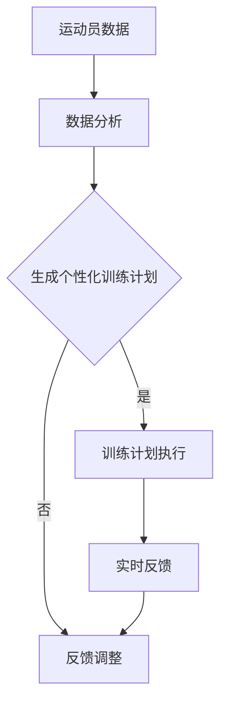

                 

### 文章标题

"AIGC在智能体育训练中的应用：AI教练的崛起"

### 关键词

- AIGC
- 智能体育训练
- AI教练
- 个性化训练
- 数据分析

### 摘要

随着人工智能技术的不断发展，智能体育训练逐渐成为体育领域的热点。本文旨在探讨自适应智能生成计算（AIGC）在智能体育训练中的应用，特别是AI教练的崛起。文章将详细介绍AIGC的基本概念及其在智能体育训练中的应用，分析AI教练的功能和优势，并通过流程图、伪代码和数学模型，深入讲解AIGC在智能体育训练中的实际应用。最后，本文将对未来AIGC在智能体育训练中的发展方向进行展望。

### 第一部分：AIGC在智能体育训练中的应用

#### 第1章：AIGC与智能体育训练概述

##### 1.1 AIGC的基本概念与智能体育训练

AIGC（自适应智能生成计算）是近年来人工智能领域的一个重要研究方向，它利用人工智能技术，特别是生成对抗网络（GAN）、自然语言处理（NLP）和强化学习（RL）等方法，生成和优化数据、模型和应用。AIGC在智能体育训练中的应用，主要是通过以下几个方面实现的：

- **生成对抗网络（GAN）**：GAN是一种由生成器和判别器组成的对抗性神经网络模型，通过训练生成逼真的数据，从而帮助运动员提高训练效果。例如，生成虚拟训练场景，模拟不同比赛环境，提高运动员的适应能力。

- **自然语言处理（NLP）**：NLP技术使计算机能够理解、解释和生成人类语言，这在智能体育训练中有着广泛的应用。例如，通过分析运动员的训练日志，生成个性化的训练计划，或者通过实时语音交互，为运动员提供实时指导。

- **强化学习（RL）**：强化学习通过与环境的交互来学习策略，优化行为。在智能体育训练中，强化学习可以用于训练AI教练，使其能够根据运动员的表现和需求，自动调整训练计划。

智能体育训练的核心在于提高运动员的竞技水平，主要包括以下几个方面：

- **个性化训练**：根据运动员的能力、表现和历史数据，生成个性化的训练计划，使训练更加高效。

- **实时反馈**：通过分析运动员的实时数据，提供即时反馈，帮助运动员调整策略。

- **模拟训练**：利用虚拟环境模拟不同比赛场景，提高运动员的应变能力。

##### 1.2 AI教练的崛起

AI教练是指利用人工智能技术，特别是AIGC方法，对运动员进行全方位训练的智能系统。AI教练具有以下功能：

- **数据分析**：收集和分析运动员的身体数据、训练数据等，为教练提供决策支持。

- **训练计划生成**：根据运动员的表现和需求，生成个性化的训练计划。

- **实时反馈**：对运动员的训练过程进行实时监测，并提供即时反馈。

AI教练的优势主要体现在以下几个方面：

- **高效性**：通过实时分析和反馈，提高训练效率。

- **个性化**：根据运动员的特点，提供定制化的训练计划。

- **数据驱动**：基于大量数据，帮助教练做出更加科学的决策。

#### Mermaid流程图



#### 伪代码

```python
def analyzeAthleteData(data):
    # 数据预处理
    processed_data = preprocess(data)
    
    # 特征提取
    features = extractFeatures(processed_data)
    
    # 模型训练
    model = trainModel(features)
    
    # 预测
    prediction = model.predict(new_data)
    
    return prediction

def generateTrainingPlan(athlete_data):
    # 分析数据
    analysis = analyzeAthleteData(athlete_data)
    
    # 生成计划
    plan = createPlan(analysis)
    
    return plan

def executeTrainingPlan(plan, athlete_data):
    # 执行计划
    execute(plan, athlete_data)
    
    # 获取反馈
    feedback = getFeedback(athlete_data)
    
    return feedback

def adjustTrainingPlan(plan, feedback):
    # 调整计划
    adjusted_plan = adjust(plan, feedback)
    
    return adjusted_plan
```

#### 数学模型和数学公式

##### 回归模型

$$ y = \beta_0 + \beta_1 \cdot x + \epsilon $$

其中，\( y \) 是因变量，\( x \) 是自变量，\( \beta_0 \) 和 \( \beta_1 \) 是回归系数，\( \epsilon \) 是误差项。

##### 逻辑回归模型

$$ P(y=1) = \frac{1}{1 + e^{-(\beta_0 + \beta_1 \cdot x)}} $$

其中，\( P(y=1) \) 是因变量为1的概率，\( \beta_0 \) 和 \( \beta_1 \) 是回归系数。

通过以上内容，我们对AIGC在智能体育训练中的应用有了初步的了解。接下来，我们将进一步深入探讨AIGC在智能体育训练中的应用，包括AI教练的具体实现、数据驱动训练计划生成方法、实时反馈机制等。同时，我们将通过实际案例，展示AIGC在智能体育训练中的实际效果，为读者提供更加直观的认识。

