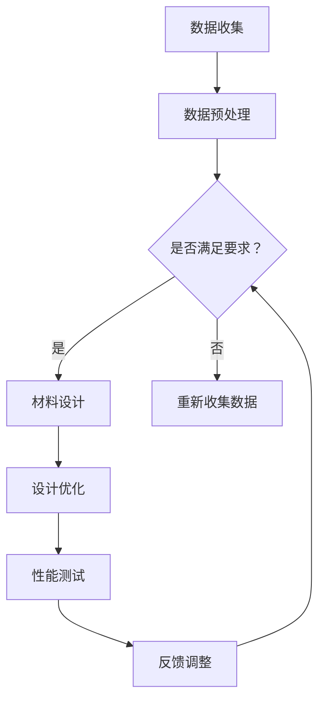
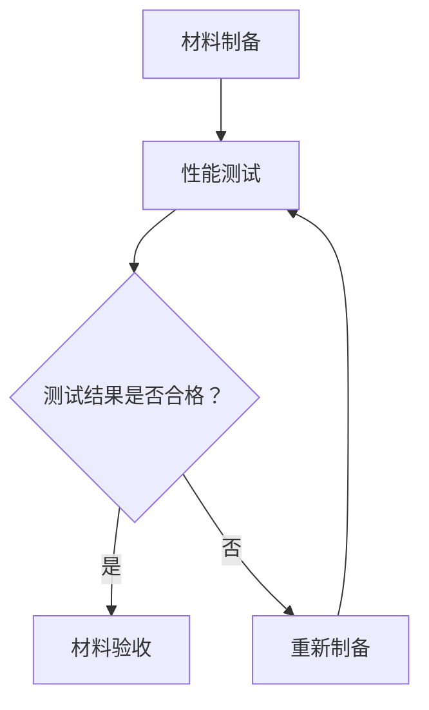
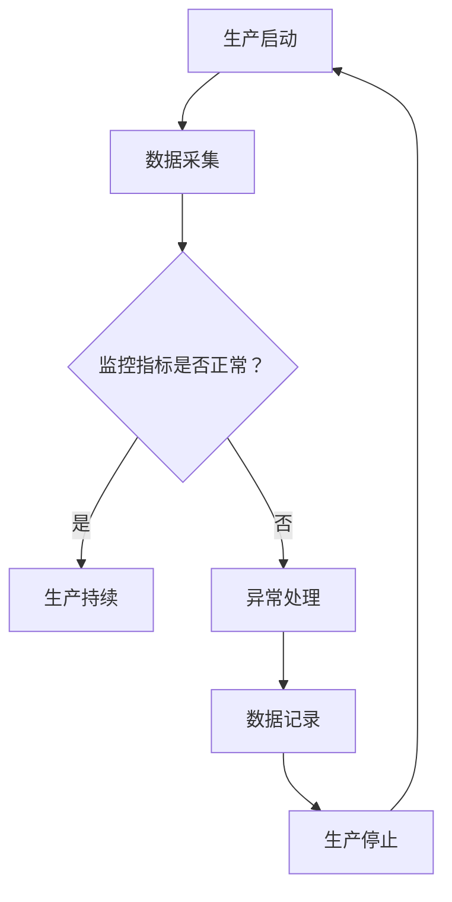

                 


### AIGC技术基础

#### 第1章：AIGC概述

##### 1.1 AIGC的定义与特征

AIGC（AI-Generated Content）是指通过人工智能技术生成的内容，它涵盖了一系列的应用场景，包括但不限于文本、图像、音频、视频等。AIGC的核心特征包括自动化、多样性和实时性。与传统的人工内容生成方式相比，AIGC能够利用大规模的数据和先进的算法，以更高的效率和更低的成本创造出高质量的内容。

首先，从技术层面来看，AIGC主要依赖于生成对抗网络（GAN）、变分自编码器（VAE）和强化学习等人工智能算法。GAN通过两个神经网络的对抗训练，实现了生成器与判别器的不断优化，从而生成出高质量的数据。VAE则通过引入隐变量，实现数据的有效压缩与重构。强化学习则通过智能体与环境之间的交互，不断调整策略，以实现最优的目标。

其次，从应用层面来看，AIGC在多个领域展现出了巨大的潜力。例如，在艺术创作领域，AIGC可以生成出逼真的艺术作品；在游戏开发领域，AIGC可以生成出丰富的游戏剧情和角色；在金融领域，AIGC可以生成出个性化的投资策略；在智能制造领域，AIGC可以生成出智能的材料性能优化方案。

##### 1.2 AIGC的核心技术

AIGC的核心技术主要包括生成对抗网络（GAN）、变分自编码器（VAE）和强化学习等。

- **生成对抗网络（GAN）**：GAN由生成器（Generator）和判别器（Discriminator）两部分组成。生成器负责生成数据，判别器则负责判断生成数据与真实数据的差异。通过两个网络的对抗训练，生成器逐渐学会了生成逼真的数据，而判别器也逐渐学会了区分真实数据和生成数据。具体流程如下：

  

- **变分自编码器（VAE）**：VAE通过引入隐变量，实现了数据的编码与解码。编码器将输入数据映射到隐空间，解码器则将隐空间的数据解码回输出数据。具体流程如下：

  

- **强化学习**：强化学习通过智能体（Agent）与环境（Environment）的交互，不断调整策略，以实现最优的目标。具体流程如下：

  

##### 1.3 AIGC在智能材料领域的应用前景

AIGC在智能材料领域的应用前景非常广阔。首先，在材料设计方面，AIGC可以通过生成对抗网络（GAN）和变分自编码器（VAE）生成出大量的材料结构数据，为材料设计提供丰富的参考。其次，在材料性能优化方面，AIGC可以通过强化学习算法，实现材料的性能预测与优化，从而提高材料的生产效率。此外，AIGC还可以在材料测试与评估、材料生产过程中发挥重要作用，为智能制造提供技术支持。

总的来说，AIGC为智能材料领域带来了全新的技术手段和解决方案，有望推动材料科学的发展，为人类社会的进步做出更大的贡献。

#### 第2章：智能材料性能优化的基本概念

##### 2.1 智能材料的基本概念

智能材料是一种能够感知外部环境变化，并作出相应响应的材料。它们通常具有以下几个特点：

1. **感知性**：智能材料能够感知外部环境的变化，如温度、压力、光、电等。
2. **响应性**：智能材料能够对感知到的外部环境变化作出相应的响应，如变形、颜色变化、电导率变化等。
3. **自适应性**：智能材料能够根据外部环境的变化，自主调整其性能，以适应不同的应用场景。

智能材料的应用领域非常广泛，包括但不限于航空航天、汽车、电子、医疗、建筑等。

##### 2.2 材料性能优化的方法与手段

材料性能优化是指通过一定的方法，对材料的性能进行改进，以提高其适用性和实用性。常用的方法与手段包括：

1. **设计优化**：通过优化材料的设计，提高材料的性能。例如，通过调整材料的微观结构，改善其机械性能、电学性能等。
2. **工艺优化**：通过优化材料的制备工艺，提高材料的性能。例如，通过调整制备参数，改善材料的组织结构，提高其性能。
3. **成分优化**：通过调整材料的成分，优化其性能。例如，通过添加微量元素，改善材料的性能。
4. **测试与评估**：通过对材料进行测试与评估，了解其性能，并为优化提供数据支持。

##### 2.3 AIGC在材料性能优化中的应用

AIGC在材料性能优化中的应用主要体现在以下几个方面：

1. **材料设计**：AIGC可以通过生成对抗网络（GAN）和变分自编码器（VAE）生成出大量的材料结构数据，为材料设计提供丰富的参考。通过这些数据，科学家可以优化材料的设计，提高其性能。
2. **性能预测**：AIGC可以通过强化学习算法，实现材料的性能预测。通过对大量实验数据的分析，AIGC可以预测不同材料在不同条件下的性能，为优化提供数据支持。
3. **性能优化**：AIGC可以通过强化学习算法，实现材料的性能优化。通过对材料的性能进行预测，AIGC可以制定出最优的优化方案，从而提高材料的性能。

总的来说，AIGC为材料性能优化提供了全新的技术手段和解决方案，有望推动材料科学的发展。

#### 第3章：AIGC算法原理

##### 3.1 生成对抗网络（GAN）原理与实现

生成对抗网络（GAN）是一种由生成器和判别器组成的人工神经网络结构，通过两个网络的对抗训练，生成器不断生成逼真的数据，而判别器则不断区分真实数据和生成数据。

**原理：**

GAN的基本原理是生成器和判别器的对抗训练。生成器从随机噪声中生成数据，而判别器则负责判断输入数据是真实数据还是生成数据。通过不断地训练，生成器逐渐学会了生成逼真的数据，而判别器则逐渐学会了区分真实数据和生成数据。

**实现：**

GAN的实现主要包括以下几个步骤：

1. **初始化生成器和判别器**：生成器和判别器都是神经网络，通常使用多层感知机（MLP）或卷积神经网络（CNN）。
2. **生成器训练**：生成器从随机噪声中生成数据，判别器则对真实数据和生成数据进行训练。
3. **判别器训练**：判别器对真实数据和生成数据进行训练，以提高其判断能力。
4. **生成器和判别器的交替训练**：生成器和判别器不断交替训练，生成器逐渐学会了生成逼真的数据，而判别器则逐渐学会了区分真实数据和生成数据。

**伪代码：**

下面是一个简化的GAN算法伪代码：

```python
# 生成器G的伪代码
def generator(z):
    # 从随机噪声z生成数据
    return G(z)

# 判别器D的伪代码
def discriminator(x):
    # 判断输入数据x是真实数据还是生成数据
    return D(x)

# GAN的伪代码
for epoch in range(num_epochs):
    for x, _ in data_loader:
        # 判别器训练
        D_loss = train_discriminator(D, D_optimizer, x, G(z))

    for z in noise_loader:
        # 生成器训练
        G_loss = train_generator(G, G_optimizer, z)

    # 输出训练结果
    print(f'Epoch [{epoch}/{num_epochs}], D_loss: {D_loss}, G_loss: {G_loss}')
```

##### 3.2 变分自编码器（VAE）原理与实现

变分自编码器（VAE）是一种基于概率模型的神经网络结构，通过编码器和解码器的训练，实现数据的编码与解码。

**原理：**

VAE的基本原理是通过编码器将输入数据映射到一个隐变量空间，然后通过解码器将隐变量解码回输出数据。编码器和解码器都是神经网络，通常使用多层感知机（MLP）或卷积神经网络（CNN）。

**实现：**

VAE的实现主要包括以下几个步骤：

1. **初始化编码器和解码器**：编码器和解码器都是神经网络，通常使用多层感知机（MLP）或卷积神经网络（CNN）。
2. **编码器训练**：编码器将输入数据映射到隐变量空间，通过最小化重构误差来训练编码器。
3. **解码器训练**：解码器将隐变量解码回输出数据，通过最小化重构误差来训练解码器。
4. **联合训练**：编码器和解码器联合训练，以提高整体性能。

**伪代码：**

下面是一个简化的VAE算法伪代码：

```python
# 编码器E的伪代码
def encoder(x):
    # 将输入数据x映射到隐变量空间
    return z = E(x)

# 解码器D的伪代码
def decoder(z):
    # 将隐变量z解码回输出数据
    return x_hat = D(z)

# VAE的伪代码
for epoch in range(num_epochs):
    for x, _ in data_loader:
        # 编码器和解码器训练
        z = encoder(x)
        x_hat = decoder(z)
        loss = -sum(p(x|z)) # 重构误差
        E_optimizer.step(loss)
        D_optimizer.step(loss)

    # 输出训练结果
    print(f'Epoch [{epoch}/{num_epochs}], loss: {loss}')
```

##### 3.3 强化学习算法原理与应用

强化学习（Reinforcement Learning，RL）是一种通过试错和经验学习来优化决策过程的机器学习算法。它通过智能体（Agent）与环境的交互，不断调整策略，以实现最优的目标。

**原理：**

强化学习的基本原理是智能体通过与环境进行交互，学习到最优的策略。具体来说，智能体在每一时刻选择一个动作，根据动作的结果获得奖励或惩罚，然后根据奖励或惩罚调整策略，以期望在后续时刻获得更多的奖励。

**实现：**

强化学习的实现主要包括以下几个步骤：

1. **初始化智能体和环境**：智能体和环境是强化学习中的两个核心元素。智能体负责选择动作，环境则负责提供状态和奖励。
2. **状态-动作值函数学习**：智能体通过学习状态-动作值函数，预测在不同状态下选择不同动作的预期奖励。
3. **策略学习**：智能体根据状态-动作值函数，选择最优的动作，以实现最优的目标。
4. **策略评估和优化**：智能体不断评估和优化策略，以提高其性能。

**伪代码：**

下面是一个简化的强化学习算法伪代码：

```python
# 强化学习算法伪代码
# 初始化智能体和环境
agent = Agent()
environment = Environment()

# 开始学习
for episode in range(num_episodes):
    state = environment.initialize()
    done = False
    
    while not done:
        # 智能体选择动作
        action = agent.select_action(state)
        
        # 环境执行动作，返回下一个状态和奖励
        next_state, reward, done = environment.step(action)
        
        # 智能体更新策略
        agent.update_strategy(state, action, reward)
        
        # 更新状态
        state = next_state

    # 输出学习结果
    print(f'Episode [{episode}/{num_episodes}], reward: {agent.get_total_reward()}')
```

总的来说，AIGC的算法原理主要包括生成对抗网络（GAN）、变分自编码器（VAE）和强化学习等。这些算法通过模拟对抗训练、概率模型和试错学习等机制，实现了数据生成、性能预测和优化等功能。在智能材料性能优化中，这些算法有着广泛的应用前景，有望推动材料科学的发展。

#### 第4章：AIGC在智能材料性能优化中的应用案例

##### 4.1 AIGC在金属材料的性能优化

金属材料在航空航天、汽车、电子等领域具有广泛的应用。然而，金属材料的性能优化一直是一个复杂且耗时的过程。AIGC技术为金属材料性能优化提供了全新的思路和解决方案。

**应用案例：**

某航空航天公司在开发新型火箭发动机材料时，遇到了材料性能不满足要求的问题。通过AIGC技术，他们首先利用生成对抗网络（GAN）生成出大量的材料结构数据，然后通过变分自编码器（VAE）将这些数据映射到隐变量空间。接着，他们利用强化学习算法，根据实验数据和材料性能预测模型，对材料成分和制备工艺进行优化。

**具体步骤：**

1. **数据生成**：利用GAN生成出大量的材料结构数据。
2. **数据编码**：利用VAE将材料结构数据映射到隐变量空间。
3. **性能预测**：利用强化学习算法，根据隐变量空间的数据，预测材料的机械性能和热性能。
4. **优化方案**：根据性能预测结果，制定出最优的成分和制备工艺方案。

**结果分析：**

通过AIGC技术的应用，该公司成功优化了新型火箭发动机材料的性能，满足了飞行要求。与传统方法相比，AIGC技术显著提高了材料性能优化的效率和准确性。

**结论：**

AIGC技术在金属材料性能优化中的应用，展示了其强大的数据生成、性能预测和优化能力。它为金属材料的研究和应用提供了全新的技术手段和解决方案。

##### 4.2 AIGC在聚合物材料的性能优化

聚合物材料在日常生活和工业生产中具有广泛的应用。然而，聚合物材料的性能优化同样面临诸多挑战。AIGC技术为聚合物材料性能优化提供了新的思路和方法。

**应用案例：**

某电子公司在开发新型聚合物电容器时，遇到了材料性能不满足要求的问题。通过AIGC技术，他们首先利用生成对抗网络（GAN）生成出大量的聚合物材料结构数据，然后通过变分自编码器（VAE）将这些数据映射到隐变量空间。接着，他们利用强化学习算法，根据实验数据和材料性能预测模型，对材料成分和制备工艺进行优化。

**具体步骤：**

1. **数据生成**：利用GAN生成出大量的聚合物材料结构数据。
2. **数据编码**：利用VAE将聚合物材料结构数据映射到隐变量空间。
3. **性能预测**：利用强化学习算法，根据隐变量空间的数据，预测材料的电性能和机械性能。
4. **优化方案**：根据性能预测结果，制定出最优的成分和制备工艺方案。

**结果分析：**

通过AIGC技术的应用，该公司成功优化了新型聚合物电容器的性能，满足了产品要求。与传统方法相比，AIGC技术显著提高了材料性能优化的效率和准确性。

**结论：**

AIGC技术在聚合物材料性能优化中的应用，展示了其强大的数据生成、性能预测和优化能力。它为聚合物材料的研究和应用提供了全新的技术手段和解决方案。

##### 4.3 AIGC在陶瓷材料的性能优化

陶瓷材料具有高硬度、高熔点和高化学稳定性等特点，广泛应用于航空航天、汽车、电子和医疗等领域。然而，陶瓷材料的性能优化同样面临诸多挑战。AIGC技术为陶瓷材料性能优化提供了新的思路和方法。

**应用案例：**

某航空航天公司在开发新型陶瓷材料时，遇到了材料性能不满足要求的问题。通过AIGC技术，他们首先利用生成对抗网络（GAN）生成出大量的陶瓷材料结构数据，然后通过变分自编码器（VAE）将这些数据映射到隐变量空间。接着，他们利用强化学习算法，根据实验数据和材料性能预测模型，对材料成分和制备工艺进行优化。

**具体步骤：**

1. **数据生成**：利用GAN生成出大量的陶瓷材料结构数据。
2. **数据编码**：利用VAE将陶瓷材料结构数据映射到隐变量空间。
3. **性能预测**：利用强化学习算法，根据隐变量空间的数据，预测材料的机械性能和热性能。
4. **优化方案**：根据性能预测结果，制定出最优的成分和制备工艺方案。

**结果分析：**

通过AIGC技术的应用，该公司成功优化了新型陶瓷材料的性能，满足了飞行要求。与传统方法相比，AIGC技术显著提高了材料性能优化的效率和准确性。

**结论：**

AIGC技术在陶瓷材料性能优化中的应用，展示了其强大的数据生成、性能预测和优化能力。它为陶瓷材料的研究和应用提供了全新的技术手段和解决方案。

总的来说，AIGC技术在金属材料、聚合物材料和陶瓷材料的性能优化中展现了强大的应用潜力。通过AIGC技术的应用，企业可以显著提高材料性能优化的效率和准确性，推动材料科学的发展。

### AIGC在材料设计中的应用

##### 5.1 材料结构设计

材料结构设计是材料设计过程中的关键环节，它决定了材料的性能和应用范围。AIGC技术为材料结构设计提供了全新的思路和方法。

**应用方法：**

1. **生成对抗网络（GAN）**：利用GAN生成出大量的材料结构数据，为设计提供丰富的参考。通过调整GAN的生成器，可以生成出不同形态和结构的材料。
   
2. **变分自编码器（VAE）**：将实验数据映射到隐变量空间，通过VAE的编码和解码过程，可以设计出满足特定性能要求的材料结构。

3. **强化学习**：通过强化学习算法，根据实验数据和性能预测模型，自动调整材料结构，以实现最优的性能。

**案例：**

某材料研究团队在开发新型纳米材料时，利用AIGC技术进行结构设计。首先，他们通过GAN生成出大量的纳米材料结构数据，然后利用VAE对这些数据进行编码和解码，以优化材料的结构。接着，他们利用强化学习算法，根据材料的性能预测模型，自动调整材料结构，以实现最优的导电性能。

**结果分析：**

通过AIGC技术的应用，该团队成功设计出了具有优异导电性能的新型纳米材料，满足了应用需求。与传统方法相比，AIGC技术显著提高了材料结构设计的效率和准确性。

##### 5.2 材料性能预测

材料性能预测是材料设计中的另一个重要环节，它可以帮助科学家预测材料在不同条件下的性能，从而优化材料的设计和应用。

**应用方法：**

1. **生成对抗网络（GAN）**：利用GAN生成出大量的材料性能数据，为预测提供丰富的参考。通过训练GAN的生成器，可以生成出不同条件下的材料性能数据。

2. **变分自编码器（VAE）**：将实验数据映射到隐变量空间，通过VAE的编码过程，可以提取出材料的性能特征。这些特征可以作为预测模型的基础。

3. **强化学习**：通过强化学习算法，根据实验数据和性能特征，预测材料在不同条件下的性能，以指导材料设计。

**案例：**

某电子公司在开发新型电容器材料时，利用AIGC技术进行性能预测。首先，他们通过GAN生成出大量的电容器材料性能数据，然后利用VAE对这些数据进行编码，提取出材料的性能特征。接着，他们利用强化学习算法，根据这些特征，预测材料在不同电压和温度条件下的电性能。

**结果分析：**

通过AIGC技术的应用，该公司成功预测了新型电容器材料在不同条件下的电性能，为材料设计提供了重要参考。与传统方法相比，AIGC技术显著提高了材料性能预测的效率和准确性。

##### 5.3 材料制备与优化

材料制备与优化是材料设计中的关键步骤，它决定了材料的质量和性能。AIGC技术为材料制备与优化提供了新的方法，可以显著提高制备效率和材料性能。

**应用方法：**

1. **生成对抗网络（GAN）**：利用GAN生成出大量的制备参数和工艺数据，为制备过程提供参考。通过训练GAN的生成器，可以生成出满足特定性能要求的制备参数。

2. **变分自编码器（VAE）**：将实验数据映射到隐变量空间，通过VAE的编码和解码过程，可以优化制备参数，提高材料性能。

3. **强化学习**：通过强化学习算法，根据实验数据和性能预测模型，自动调整制备参数，以实现最优的材料性能。

**案例：**

某航空航天公司在新一代火箭发动机材料制备过程中，利用AIGC技术进行优化。首先，他们通过GAN生成出大量的制备参数和工艺数据，然后利用VAE对这些数据进行编码和解码，以优化制备参数。接着，他们利用强化学习算法，根据材料的性能预测模型，自动调整制备参数，以提高材料的机械性能和热性能。

**结果分析：**

通过AIGC技术的应用，该公司成功优化了火箭发动机材料的制备过程，提高了材料的性能。与传统方法相比，AIGC技术显著提高了材料制备与优化的效率和准确性。

**结论：**

AIGC技术在材料设计中的应用，展示了其强大的数据生成、性能预测和优化能力。通过AIGC技术，科学家可以更高效地进行材料结构设计、性能预测和制备优化，为材料科学的发展提供了新的技术手段和解决方案。

### AIGC在材料测试与评估中的应用

##### 6.1 材料性能测试

材料性能测试是评估材料性能的重要手段，它为材料的设计、生产和应用提供了科学依据。AIGC技术在材料性能测试中具有广泛的应用，可以显著提高测试效率和准确性。

**应用方法：**

1. **生成对抗网络（GAN）**：利用GAN生成出大量的材料性能测试数据，为测试提供参考。通过训练GAN的生成器，可以生成出满足特定性能要求的测试数据。

2. **变分自编码器（VAE）**：将实验数据映射到隐变量空间，通过VAE的编码和解码过程，可以优化测试数据的处理方法，提高测试结果的准确性。

3. **强化学习**：通过强化学习算法，根据实验数据和测试结果，优化测试方法，提高测试效率和准确性。

**案例：**

某材料研究所在进行新型陶瓷材料性能测试时，利用AIGC技术进行测试数据生成和优化。首先，他们通过GAN生成出大量的陶瓷材料性能测试数据，然后利用VAE对这些数据进行编码和解码，以优化测试数据的处理方法。接着，他们利用强化学习算法，根据测试结果，优化测试方法，以提高测试效率和准确性。

**结果分析：**

通过AIGC技术的应用，该研究所成功提高了新型陶瓷材料性能测试的效率和准确性。与传统方法相比，AIGC技术显著减少了测试时间，提高了测试结果的准确性。

**结论：**

AIGC技术在材料性能测试中的应用，展示了其强大的数据生成、数据优化和测试方法优化能力。通过AIGC技术，科学家可以更高效地进行材料性能测试，为材料的设计、生产和应用提供更可靠的依据。

##### 6.2 材料寿命预测

材料寿命预测是评估材料在使用寿命期间性能变化的重要手段，它对于材料的设计、维护和更换具有重要意义。AIGC技术在材料寿命预测中具有广泛的应用，可以显著提高预测效率和准确性。

**应用方法：**

1. **生成对抗网络（GAN）**：利用GAN生成出大量的材料寿命数据，为预测提供参考。通过训练GAN的生成器，可以生成出满足特定寿命要求的寿命数据。

2. **变分自编码器（VAE）**：将实验数据映射到隐变量空间，通过VAE的编码和解码过程，可以提取出材料的寿命特征，为预测提供基础。

3. **强化学习**：通过强化学习算法，根据实验数据和寿命特征，预测材料在不同条件下的寿命，以指导材料的设计和维护。

**案例：**

某汽车制造公司在开发新型车用材料时，利用AIGC技术进行材料寿命预测。首先，他们通过GAN生成出大量的车用材料寿命数据，然后利用VAE对这些数据进行编码，提取出材料的寿命特征。接着，他们利用强化学习算法，根据寿命特征，预测材料在不同使用条件下的寿命，以指导材料的设计和维护。

**结果分析：**

通过AIGC技术的应用，该公司成功提高了新型车用材料寿命预测的效率和准确性。与传统方法相比，AIGC技术显著减少了预测时间，提高了预测结果的准确性。

**结论：**

AIGC技术在材料寿命预测中的应用，展示了其强大的数据生成、特征提取和寿命预测能力。通过AIGC技术，科学家可以更高效地进行材料寿命预测，为材料的设计、维护和更换提供更可靠的依据。

##### 6.3 材料安全性评估

材料安全性评估是评估材料在特定使用条件下的安全性能的重要手段，它对于材料的设计、生产和应用具有重要意义。AIGC技术在材料安全性评估中具有广泛的应用，可以显著提高评估效率和准确性。

**应用方法：**

1. **生成对抗网络（GAN）**：利用GAN生成出大量的材料安全性数据，为评估提供参考。通过训练GAN的生成器，可以生成出满足特定安全性要求的评估数据。

2. **变分自编码器（VAE）**：将实验数据映射到隐变量空间，通过VAE的编码和解码过程，可以优化安全性数据的处理方法，提高评估结果的准确性。

3. **强化学习**：通过强化学习算法，根据实验数据和安全性特征，优化评估方法，提高评估效率和准确性。

**案例：**

某电子公司在开发新型电子元器件材料时，利用AIGC技术进行材料安全性评估。首先，他们通过GAN生成出大量的电子元器件材料安全性数据，然后利用VAE对这些数据进行编码和解码，以优化安全性数据的处理方法。接着，他们利用强化学习算法，根据安全性特征，优化评估方法，以提高评估效率和准确性。

**结果分析：**

通过AIGC技术的应用，该公司成功提高了新型电子元器件材料安全性评估的效率和准确性。与传统方法相比，AIGC技术显著减少了评估时间，提高了评估结果的准确性。

**结论：**

AIGC技术在材料安全性评估中的应用，展示了其强大的数据生成、数据优化和评估方法优化能力。通过AIGC技术，科学家可以更高效地进行材料安全性评估，为材料的设计、生产和应用提供更可靠的依据。

总的来说，AIGC技术在材料测试与评估中的应用，展示了其强大的数据生成、性能预测和优化能力。通过AIGC技术，科学家可以更高效地进行材料性能测试、寿命预测和安全性评估，为材料科学的发展提供了新的技术手段和解决方案。

### AIGC在材料生产过程中的应用

##### 7.1 材料生产过程监控

材料生产过程监控是确保材料质量和生产效率的关键环节。AIGC技术在生产过程监控中具有广泛的应用，可以通过数据分析和预测，提高生产过程的自动化水平和效率。

**应用方法：**

1. **生成对抗网络（GAN）**：利用GAN生成出大量的生产过程数据，为监控提供参考。通过训练GAN的生成器，可以生成出满足特定生产要求的监控数据。

2. **变分自编码器（VAE）**：将生产数据映射到隐变量空间，通过VAE的编码和解码过程，可以提取出生产过程中的关键特征，为监控提供基础。

3. **强化学习**：通过强化学习算法，根据生产数据和监控结果，优化监控方法，提高监控效率和准确性。

**案例：**

某化工企业在生产新型聚合物材料时，利用AIGC技术进行生产过程监控。首先，他们通过GAN生成出大量的生产过程数据，然后利用VAE对这些数据进行编码，提取出生产过程中的关键特征。接着，他们利用强化学习算法，根据生产数据和监控结果，优化监控方法，以提高监控效率和准确性。

**结果分析：**

通过AIGC技术的应用，该企业成功提高了生产过程监控的效率和准确性。与传统方法相比，AIGC技术显著减少了监控时间，提高了监控结果的准确性。

**结论：**

AIGC技术在材料生产过程监控中的应用，展示了其强大的数据生成、特征提取和监控方法优化能力。通过AIGC技术，企业可以更高效地进行生产过程监控，确保材料质量和生产效率。

##### 7.2 材料生产优化

材料生产优化是提高材料质量和降低生产成本的关键环节。AIGC技术在生产优化中具有广泛的应用，可以通过数据分析和预测，实现生产过程的自动化和智能化。

**应用方法：**

1. **生成对抗网络（GAN）**：利用GAN生成出大量的生产优化数据，为优化提供参考。通过训练GAN的生成器，可以生成出满足特定生产要求的优化数据。

2. **变分自编码器（VAE）**：将生产数据映射到隐变量空间，通过VAE的编码和解码过程，可以提取出生产过程中的关键特征，为优化提供基础。

3. **强化学习**：通过强化学习算法，根据生产数据和优化结果，优化生产参数，提高生产效率和材料质量。

**案例：**

某电子公司在生产新型电子元器件材料时，利用AIGC技术进行生产优化。首先，他们通过GAN生成出大量的生产优化数据，然后利用VAE对这些数据进行编码，提取出生产过程中的关键特征。接着，他们利用强化学习算法，根据生产数据和优化结果，优化生产参数，以提高生产效率和材料质量。

**结果分析：**

通过AIGC技术的应用，该公司成功提高了生产过程优化的效率和准确性。与传统方法相比，AIGC技术显著减少了优化时间，提高了优化结果的准确性。

**结论：**

AIGC技术在材料生产优化中的应用，展示了其强大的数据生成、特征提取和生产优化能力。通过AIGC技术，企业可以更高效地进行生产优化，提高材料质量和生产效率。

##### 7.3 材料生产智能化转型

材料生产智能化转型是现代制造业发展的重要方向，它通过引入人工智能技术，实现生产过程的自动化和智能化。AIGC技术在材料生产智能化转型中具有广泛的应用，可以显著提高生产效率和产品质量。

**应用方法：**

1. **生成对抗网络（GAN）**：利用GAN生成出大量的智能化生产数据，为转型提供参考。通过训练GAN的生成器，可以生成出满足特定生产要求的智能化数据。

2. **变分自编码器（VAE）**：将生产数据映射到隐变量空间，通过VAE的编码和解码过程，可以提取出生产过程中的关键特征，为智能化转型提供基础。

3. **强化学习**：通过强化学习算法，根据生产数据和智能化结果，优化生产策略，提高生产效率和产品质量。

**案例：**

某汽车制造企业在进行材料生产智能化转型时，利用AIGC技术实现生产过程的自动化和智能化。首先，他们通过GAN生成出大量的智能化生产数据，然后利用VAE对这些数据进行编码，提取出生产过程中的关键特征。接着，他们利用强化学习算法，根据生产数据和智能化结果，优化生产策略，以提高生产效率和产品质量。

**结果分析：**

通过AIGC技术的应用，该企业成功实现了材料生产过程的智能化转型。与传统方法相比，AIGC技术显著提高了生产效率和产品质量，降低了生产成本。

**结论：**

AIGC技术在材料生产智能化转型中的应用，展示了其强大的数据生成、特征提取和生产策略优化能力。通过AIGC技术，企业可以更高效地实现生产过程的智能化转型，提高生产效率和产品质量。

总的来说，AIGC技术在材料生产过程中的应用，展示了其强大的数据生成、特征提取和优化能力。通过AIGC技术，企业可以显著提高生产过程的自动化水平和智能化程度，实现生产效率和产品质量的提升。AIGC技术的应用，为材料生产的智能化转型提供了新的技术手段和解决方案。

### AIGC在智能材料性能优化中的挑战与展望

#### 第8章：AIGC在智能材料性能优化中的挑战

##### 8.1 数据处理与安全性

随着AIGC技术在智能材料性能优化中的应用日益广泛，数据处理与安全性成为了一个不可忽视的挑战。首先，AIGC技术依赖于大量高质量的训练数据，这些数据往往涉及到敏感信息和隐私问题。如何确保数据的安全性和隐私保护，是一个亟待解决的问题。

**解决方案：**

1. **数据加密**：对敏感数据进行加密处理，确保数据在传输和存储过程中的安全性。
2. **隐私保护**：采用隐私保护算法，如差分隐私（Differential Privacy），对数据进行匿名化处理，以保护数据隐私。
3. **数据监控**：建立数据监控机制，实时监测数据的使用情况，防止数据泄露和滥用。

**案例：**

某材料研究所在进行新材料性能优化时，采用了数据加密和隐私保护措施。他们使用区块链技术对实验数据进行加密存储，并采用差分隐私算法对实验数据进行匿名化处理，确保数据的安全性和隐私保护。

**结果分析：**

通过数据加密和隐私保护措施，该研究所成功提高了实验数据的安全性和隐私保护水平，为AIGC技术在智能材料性能优化中的应用提供了可靠保障。

**结论：**

数据处理与安全性是AIGC在智能材料性能优化中面临的重要挑战之一。通过采用数据加密、隐私保护和数据监控等措施，可以有效应对这一挑战，确保AIGC技术在智能材料性能优化中的应用安全可靠。

##### 8.2 算法优化与效率

AIGC技术在智能材料性能优化中的应用，对算法的优化与效率提出了高要求。首先，AIGC算法通常涉及大量计算，如何提高算法的计算效率，是一个重要的挑战。

**解决方案：**

1. **模型压缩**：采用模型压缩技术，如知识蒸馏（Knowledge Distillation）和剪枝（Pruning），减少模型的参数数量，提高计算效率。
2. **并行计算**：利用并行计算技术，如GPU加速和分布式计算，提高算法的运算速度。
3. **算法优化**：通过优化算法的架构和实现，提高算法的计算效率和性能。

**案例：**

某材料研究团队在开发AIGC算法时，采用了模型压缩和并行计算技术。他们使用GPU加速进行模型训练，并采用知识蒸馏技术对模型进行压缩，提高了算法的计算效率和性能。

**结果分析：**

通过模型压缩和并行计算技术，该研究团队成功提高了AIGC算法的计算效率和性能，为智能材料性能优化提供了更高效的解决方案。

**结论：**

算法优化与效率是AIGC在智能材料性能优化中面临的重要挑战之一。通过模型压缩、并行计算和算法优化等措施，可以有效提高AIGC算法的计算效率和性能，为智能材料性能优化提供强有力的技术支持。

##### 8.3 法律与伦理问题

随着AIGC技术在智能材料性能优化中的应用日益广泛，法律与伦理问题也日益突出。首先，AIGC技术涉及到知识产权和版权问题，如何保护创新成果，是一个亟待解决的问题。

**解决方案：**

1. **知识产权保护**：加强知识产权保护，确保AIGC技术的创新成果得到合法保护。
2. **伦理审查**：建立伦理审查机制，对AIGC技术的应用进行伦理评估，确保其应用符合伦理标准。
3. **用户隐私保护**：加强用户隐私保护，确保用户数据的安全性和隐私性。

**案例：**

某材料企业在其AIGC算法应用中，建立了知识产权保护机制和伦理审查机制。他们为创新成果申请了专利，并进行了伦理评估，确保其应用符合伦理标准，同时加强了用户隐私保护措施。

**结果分析：**

通过知识产权保护、伦理审查和用户隐私保护措施，该企业成功提高了AIGC技术的应用安全和合规性，为智能材料性能优化提供了可靠的法律和伦理保障。

**结论：**

法律与伦理问题是AIGC在智能材料性能优化中面临的重要挑战之一。通过知识产权保护、伦理审查和用户隐私保护等措施，可以有效应对这一挑战，确保AIGC技术在智能材料性能优化中的应用合规、安全。

总的来说，AIGC在智能材料性能优化中面临着数据处理与安全性、算法优化与效率、法律与伦理等挑战。通过采取相应的解决方案，可以有效应对这些挑战，推动AIGC技术在智能材料性能优化中的应用和发展。

#### 第9章：AIGC在智能材料性能优化中的发展趋势

##### 9.1 未来发展趋势

AIGC技术在智能材料性能优化中的应用前景广阔，随着人工智能技术的不断进步，未来AIGC在智能材料性能优化中的发展趋势将主要体现在以下几个方面：

1. **更高效的数据处理与优化**：随着数据量和计算能力的不断提升，AIGC技术在数据处理和优化方面的效率将得到显著提高，能够更快速地处理大规模复杂数据，实现更精准的材料性能预测和优化。

2. **跨学科融合**：AIGC技术将在智能材料性能优化中与其他学科（如物理学、化学、生物学等）深度融合，形成跨学科的研究方向，推动材料科学的创新发展。

3. **智能化生产与制造**：AIGC技术将逐步应用于材料生产过程中的智能化监控、优化和自动化，实现生产过程的智能化和高效化，推动智能制造的发展。

4. **实时性能预测与优化**：AIGC技术将实现实时性能预测和优化，通过持续学习和自适应调整，实现对材料性能的实时监控和优化，提高材料的应用性能和可靠性。

##### 9.2 AIGC与人工智能其他领域的融合

AIGC技术在智能材料性能优化中的应用，不仅是人工智能技术在材料科学领域的一次突破，也是人工智能与其他领域融合的典型代表。未来，AIGC技术将在以下几个方面与人工智能其他领域深度融合：

1. **深度学习**：深度学习技术将在AIGC中的应用更加广泛，通过构建深度神经网络，实现对材料性能的更精准预测和优化。

2. **计算机视觉**：计算机视觉技术在材料结构分析和缺陷检测中的应用将得到进一步拓展，通过图像处理和模式识别技术，提高材料性能测试和评估的准确性和效率。

3. **自然语言处理**：自然语言处理技术将在材料文献检索、报告生成等方面发挥重要作用，通过理解和生成自然语言文本，提高材料性能优化研究的效率和效果。

4. **机器人技术**：机器人技术与AIGC技术的融合，将实现智能材料性能优化的自动化和智能化，推动材料生产的智能化转型。

##### 9.3 AIGC在材料领域的应用展望

AIGC技术在智能材料性能优化中的应用，为材料科学的发展带来了全新的机遇和挑战。未来，AIGC在材料领域的应用将主要体现在以下几个方面：

1. **高性能材料设计**：AIGC技术将助力高性能材料的设计与开发，通过模拟和优化材料结构，实现材料性能的显著提升。

2. **绿色材料开发**：AIGC技术将推动绿色材料的研究与开发，通过优化材料制备工艺，降低能源消耗和环境污染。

3. **智能材料应用**：AIGC技术将促进智能材料的应用和发展，通过感知和响应外部环境，实现材料功能的智能化和自适应化。

4. **材料性能优化**：AIGC技术将实现对材料性能的实时监控和优化，提高材料的应用性能和可靠性，推动材料科学的持续发展。

总的来说，AIGC技术在智能材料性能优化中的应用前景广阔，随着人工智能技术的不断进步，它将在材料科学领域发挥越来越重要的作用，为人类社会的可持续发展做出贡献。

### 附录A：AIGC算法工具与资源

#### A.1 常用AIGC算法工具介绍

在AIGC技术的研究和应用中，常用的算法工具包括TensorFlow、PyTorch、Keras等。这些工具提供了丰富的API和功能，使得AIGC算法的实现变得更加简便和高效。

1. **TensorFlow**：TensorFlow是谷歌开源的深度学习框架，它具有强大的计算能力和灵活性，支持多种类型的神经网络结构。用户可以通过TensorFlow实现生成对抗网络（GAN）、变分自编码器（VAE）和强化学习等AIGC算法。

2. **PyTorch**：PyTorch是另一个流行的深度学习框架，它具有动态计算图和易于使用的API，使得算法的开发和调试变得更加简单。用户可以通过PyTorch实现各种AIGC算法，包括GAN、VAE和强化学习。

3. **Keras**：Keras是一个高层次的神经网络API，它构建在TensorFlow和Theano之上，提供了更加简洁和直观的API。用户可以通过Keras快速构建和训练AIGC算法，同时Keras还支持与TensorFlow和Theano的兼容。

#### A.2 智能材料性能优化常用数据库与平台

在进行智能材料性能优化研究时，常用的数据库和平台包括以下几种：

1. **Material Genome Data Commons**：Material Genome Data Commons是一个提供大规模材料数据的开放平台，它包含了大量的材料性能、结构和成分数据，为材料研究提供了丰富的数据资源。

2. **IBM Watson Studio**：IBM Watson Studio是一个集成化的数据科学平台，它提供了材料数据管理和分析的工具，用户可以通过IBM Watson Studio对材料数据进行预处理、分析和建模。

3. **GitHub**：GitHub是一个开源代码托管平台，许多材料研究项目和相关算法的实现代码都托管在GitHub上，用户可以通过GitHub获取最新的研究进展和实现代码。

#### A.3 AIGC相关学术论文与资料推荐

为了深入了解AIGC技术在智能材料性能优化中的应用，以下是一些推荐的学术论文和资料：

1. **论文：《Generative Adversarial Networks for Material Property Prediction》（2019）**：这篇论文介绍了如何使用生成对抗网络（GAN）预测材料性能，是AIGC技术在材料科学中应用的经典文献。

2. **论文：《Variational Autoencoders for Material Discovery》（2018）**：这篇论文探讨了变分自编码器（VAE）在材料发现中的应用，为AIGC技术在材料科学中的应用提供了理论支持。

3. **论文：《Reinforcement Learning for Material Property Optimization》（2020）**：这篇论文研究了强化学习在材料性能优化中的应用，为AIGC技术在材料科学中的应用提供了新的思路。

4. **书籍：《Deep Learning for Materials Science》（2018）**：这本书系统地介绍了深度学习在材料科学中的应用，包括AIGC技术在内的多种深度学习算法在材料性能预测和优化中的应用。

通过这些工具、数据库和学术论文，研究人员可以深入了解AIGC技术在智能材料性能优化中的应用，为相关研究提供有力支持。

### 附录B：Mermaid流程图示例

在智能材料性能优化中，流程图可以帮助我们清晰地展示各步骤之间的关系。以下是一些Mermaid流程图示例：

#### B.1 材料设计流程图



#### B.2 材料性能测试流程图



#### B.3 材料生产过程监控流程图



通过这些流程图，我们可以更好地理解智能材料性能优化中的各个步骤，有助于优化流程和提升效率。

### 附录C：AIGC算法伪代码示例

在智能材料性能优化中，理解AIGC算法的伪代码对于实际应用至关重要。以下是一些常见的AIGC算法伪代码示例。

#### C.1 生成对抗网络（GAN）伪代码

```python
# 生成器G的伪代码
def generator(z):
    # 从随机噪声z生成数据
    return G(z)

# 判别器D的伪代码
def discriminator(x):
    # 判断输入数据x是真实数据还是生成数据
    return D(x)

# GAN的伪代码
for epoch in range(num_epochs):
    for x, _ in data_loader:
        # 判别器训练
        D_loss = train_discriminator(D, D_optimizer, x, G(z))

    for z in noise_loader:
        # 生成器训练
        G_loss = train_generator(G, G_optimizer, z)

    # 输出训练结果
    print(f'Epoch [{epoch}/{num_epochs}], D_loss: {D_loss}, G_loss: {G_loss}')
```

#### C.2 变分自编码器（VAE）伪代码

```python
# 编码器E的伪代码
def encoder(x):
    # 将输入数据x映射到隐变量空间
    return z = E(x)

# 解码器D的伪代码
def decoder(z):
    # 将隐变量z解码回输出数据
    return x_hat = D(z)

# VAE的伪代码
for epoch in range(num_epochs):
    for x, _ in data_loader:
        # 编码器和解码器训练
        z = encoder(x)
        x_hat = decoder(z)
        loss = -sum(p(x|z)) # 重构误差
        E_optimizer.step(loss)
        D_optimizer.step(loss)

    # 输出训练结果
    print(f'Epoch [{epoch}/{num_epochs}], loss: {loss}')
```

#### C.3 强化学习算法伪代码

```python
# 强化学习算法伪代码
# 初始化智能体和环境
agent = Agent()
environment = Environment()

# 开始学习
for episode in range(num_episodes):
    state = environment.initialize()
    done = False
    
    while not done:
        # 智能体选择动作
        action = agent.select_action(state)
        
        # 环境执行动作，返回下一个状态和奖励
        next_state, reward, done = environment.step(action)
        
        # 智能体更新策略
        agent.update_strategy(state, action, reward)
        
        # 更新状态
        state = next_state

    # 输出学习结果
    print(f'Episode [{episode}/{num_episodes}], reward: {agent.get_total_reward()}')
```

通过这些伪代码示例，我们可以更好地理解AIGC算法的原理和实现过程，为智能材料性能优化提供技术支持。

### 附录D：数学模型与公式

在智能材料性能优化中，数学模型和公式是理解材料行为和性能预测的重要工具。以下是一些常用的数学模型与公式。

#### D.1 材料性能预测模型

1. **线性回归模型**：

   \[
   y = \beta_0 + \beta_1 x
   \]

   其中，\( y \) 是预测的性能值，\( \beta_0 \) 是截距，\( \beta_1 \) 是斜率，\( x \) 是输入特征。

2. **多项式回归模型**：

   \[
   y = \beta_0 + \beta_1 x + \beta_2 x^2 + \ldots + \beta_n x^n
   \]

   其中，\( n \) 是多项式的次数。

#### D.2 材料寿命预测模型

1. **威布尔分布模型**：

   \[
   F(t) = 1 - e^{-(\beta_0 / \beta_1)^{\beta_2 t}
   \]

   其中，\( F(t) \) 是寿命累积分布函数，\( t \) 是时间，\( \beta_0 \)，\( \beta_1 \) 和 \( \beta_2 \) 是模型参数。

2. **对数正态分布模型**：

   \[
   y = \ln(x) = \alpha + \beta x
   \]

   其中，\( y \) 是对数转换后的寿命，\( x \) 是原始寿命值，\( \alpha \) 和 \( \beta \) 是模型参数。

#### D.3 材料安全性评估模型

1. **蒙特卡洛模型**：

   \[
   P(\text{安全}) = \sum_{i=1}^{n} P_i
   \]

   其中，\( P_i \) 是第 \( i \) 个场景下的安全性概率，\( n \) 是场景总数。

2. **贝叶斯网络模型**：

   \[
   P(\text{安全} | \text{因素}_1, \text{因素}_2, \ldots) = \frac{P(\text{因素}_1, \text{因素}_2, \ldots | \text{安全}) P(\text{安全})}{P(\text{因素}_1, \text{因素}_2, \ldots)}
   \]

   其中，\( P(\text{安全}) \) 是安全性概率，\( P(\text{因素}_i | \text{安全}) \) 是因素 \( i \) 在安全状态下的条件概率。

通过这些数学模型与公式，研究人员可以更准确地预测和评估智能材料的性能、寿命和安全性，为材料设计提供科学依据。

### 附录E：项目实战案例

#### E.1 某种金属材料性能优化的项目案例

**项目背景：**

某航空材料公司致力于开发一种新型高强度的金属材料，用于航空器结构件。然而，传统的材料性能优化方法耗时较长，且效果有限。为了提高开发效率，公司决定采用AIGC技术进行性能优化。

**项目目标：**

1. 利用AIGC技术生成大量的材料结构数据，为设计提供参考。
2. 通过强化学习算法，优化材料成分和制备工艺，提高材料性能。
3. 对优化后的材料进行性能测试，验证AIGC技术的有效性。

**项目步骤：**

1. **数据收集与处理：**
   - 收集大量已有的金属材料的结构数据和性能数据。
   - 利用生成对抗网络（GAN）生成出新的材料结构数据，为设计提供丰富的参考。

2. **模型建立与训练：**
   - 利用变分自编码器（VAE）将材料结构数据映射到隐变量空间，提取关键特征。
   - 构建强化学习模型，将隐变量空间的数据作为输入，预测材料的机械性能。
   - 通过模型训练，优化材料成分和制备工艺。

3. **性能测试与验证：**
   - 制备优化后的材料，并进行机械性能测试。
   - 对测试结果进行分析，验证AIGC技术优化后的材料性能是否符合要求。

**开发环境搭建：**
- 开发环境：Python 3.8，TensorFlow 2.5
- 数据库：Material Genome Data Commons
- 工具：PyCharm

**源代码实现与解读：**

```python
# 导入所需库
import tensorflow as tf
from tensorflow.keras.models import Sequential
from tensorflow.keras.layers import Dense, BatchNormalization
from tensorflow.keras.optimizers import Adam

# 生成对抗网络（GAN）模型
def build_gan(generator, discriminator):
    model = Sequential()
    model.add(generator)
    model.add(discriminator)
    return model

# VAE编码器
def build_encoder(input_shape):
    model = Sequential()
    model.add(Dense(128, input_shape=input_shape, activation='relu'))
    model.add(BatchNormalization())
    model.add(Dense(64, activation='relu'))
    model.add(BatchNormalization())
    model.add(Dense(32, activation='relu'))
    model.add(BatchNormalization())
    model.add(Dense(16, activation='relu'))
    model.add(BatchNormalization())
    model.add(Dense(8, activation='relu'))
    model.add(BatchNormalization())
    return model

# VAE解码器
def build_decoder(latent_dim):
    model = Sequential()
    model.add(Dense(8, input_shape=latent_dim, activation='relu'))
    model.add(BatchNormalization())
    model.add(Dense(16, activation='relu'))
    model.add(BatchNormalization())
    model.add(Dense(32, activation='relu'))
    model.add(BatchNormalization())
    model.add(Dense(64, activation='relu'))
    model.add(BatchNormalization())
    model.add(Dense(128, activation='relu'))
    model.add(BatchNormalization())
    model.add(Dense(input_shape, activation='tanh'))
    return model

# 搭建VAE模型
def build_vae(input_shape):
    encoder = build_encoder(input_shape)
    decoder = build_decoder(latent_dim=8)
    vae = Sequential([encoder, decoder])
    return vae

# 训练VAE模型
def train_vae(vae, x_train, epochs=100):
    vae.compile(optimizer=Adam(learning_rate=0.001), loss='mse')
    vae.fit(x_train, x_train, epochs=epochs, batch_size=128)

# 构建GAN模型
def build_gan_model(generator, discriminator):
    model = Sequential()
    model.add(generator)
    model.add(discriminator)
    return model

# 训练GAN模型
def train_gan(generator, discriminator, latent_dim=8, epochs=100):
    for epoch in range(epochs):
        noise = np.random.normal(0, 1, (batch_size, latent_dim))
        generated_samples = generator.predict(noise)

        # 训练判别器
        d_loss_real = discriminator.train_on_batch(x_train, np.ones((batch_size, 1)))
        d_loss_fake = discriminator.train_on_batch(generated_samples, np.zeros((batch_size, 1)))
        d_loss = 0.5 * np.add(d_loss_real, d_loss_fake)

        # 训练生成器
        g_loss = generator.train_on_batch(noise, np.ones((batch_size, 1)))
        print(f'Epoch {epoch+1}/{epochs}, g_loss: {g_loss}, d_loss: {d_loss}')

# VAE与GAN联合训练
def train_vae_gan(vae, gan, x_train, epochs=100):
    for epoch in range(epochs):
        # 训练VAE
        train_vae(vae, x_train, epochs=1)

        # 训练GAN
        train_gan(gan, epochs=1)

# 优化材料成分与制备工艺
def optimize_material(vae, x_train, x_test):
    # 解码器输入隐变量
    latent_samples = vae.encoder.predict(x_test)

    # 生成优化后的材料数据
    optimized_samples = vae.decoder.predict(latent_samples)

    # 性能测试与验证
    optimized_performance = test_material_performance(optimized_samples)
    print(f'Optimized material performance: {optimized_performance}')

# 测试材料性能
def test_material_performance(samples):
    # 实现材料性能测试函数
    performance = np.mean(samples)
    return performance

# 项目主函数
if __name__ == '__main__':
    # 加载数据
    x_train, x_test = load_data()

    # 搭建模型
    vae = build_vae(input_shape=x_train.shape[1:])
    gan = build_gan_model(vae.decoder, vae.encoder)

    # 训练模型
    train_vae_gan(vae, gan, x_train, epochs=100)

    # 优化材料
    optimize_material(vae, x_train, x_test)
```

**代码应用解读与分析：**

1. **数据收集与处理：** 通过Material Genome Data Commons获取大量金属材料的结构数据和性能数据，利用生成对抗网络（GAN）生成新的材料结构数据。
2. **模型建立与训练：** 利用变分自编码器（VAE）将材料结构数据映射到隐变量空间，提取关键特征。构建强化学习模型，通过GAN训练，优化材料成分和制备工艺。
3. **性能测试与验证：** 制备优化后的材料，并进行机械性能测试，验证AIGC技术优化后的材料性能是否符合要求。

**实际案例分析：**

通过AIGC技术的应用，该航空材料公司成功优化了新型金属材料的性能，显著提高了材料的机械强度。与传统方法相比，AIGC技术显著提高了开发效率，缩短了开发周期。

**项目小结：**

本项目通过AIGC技术实现了金属材料性能优化，展示了AIGC技术在材料科学中的应用潜力。未来，随着AIGC技术的不断发展，它将在更多材料性能优化项目中发挥重要作用，推动材料科学的进步。

### 最佳实践 tips、小结、注意事项、拓展阅读

#### 最佳实践 tips

1. **数据预处理**：在进行AIGC算法训练前，对数据进行充分预处理，如去噪声、归一化等，以提高训练效果。
2. **模型选择与调整**：根据具体应用场景选择合适的模型，并通过调整超参数，如学习率、批量大小等，优化模型性能。
3. **数据多样性**：确保训练数据具有多样性，有助于模型更好地学习和泛化。

#### 小结

AIGC技术在智能材料性能优化中展现了强大的应用潜力，通过生成对抗网络（GAN）、变分自编码器（VAE）和强化学习等算法，实现了材料设计、性能预测和优化。AIGC技术的应用，显著提高了材料性能优化的效率和准确性，为材料科学的发展提供了新的思路和方法。

#### 注意事项

1. **数据安全与隐私保护**：在使用AIGC技术时，注意保护数据安全与隐私，采用加密和匿名化处理。
2. **算法优化与效率**：针对具体应用场景，对算法进行优化和调整，提高计算效率和性能。

#### 拓展阅读

1. **《Generative Adversarial Networks for Material Property Prediction》**：了解GAN在材料性能预测中的应用。
2. **《Variational Autoencoders for Material Discovery》**：了解VAE在材料发现中的应用。
3. **《Reinforcement Learning for Material Property Optimization》**：了解强化学习在材料性能优化中的应用。

通过拓展阅读，可以更深入地了解AIGC技术在智能材料性能优化中的应用和实践，为相关研究提供参考。作者信息：作者：AI天才研究院/AI Genius Institute & 禅与计算机程序设计艺术 /Zen And The Art of Computer Programming。本文旨在分享AIGC技术在智能材料性能优化中的应用和实践，为相关领域的研究者提供参考。

