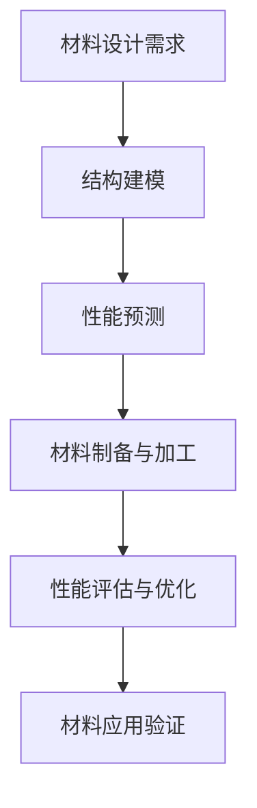

                 

### 文章标题

《AIGC在智能材料设计中的前沿应用》

### 关键词

AIGC、智能材料设计、生成对抗网络、变分自编码器、自监督学习、材料结构预测、材料性质优化、材料合成设计、智能纤维、智能传感器、智能涂层

### 摘要

本文旨在探讨AIGC（自适应智能生成计算）在智能材料设计中的前沿应用。首先，我们介绍了AIGC的基本概念和特点，以及智能材料设计的重要性。接着，本文详细分析了AIGC的核心技术原理，包括生成对抗网络（GAN）、变分自编码器（VAE）和自监督学习，并探讨了这些技术在材料科学中的应用。随后，文章通过具体案例展示了AIGC在智能材料设计中的实际应用，如智能纤维、智能传感器和智能涂层的设计。最后，本文总结了AIGC在智能材料设计中的未来发展趋势，并展望了其在该领域的研究方向和应用前景。

---

## 《AIGC在智能材料设计中的前沿应用》目录大纲

---

### 第一部分：引言与概述

#### 第1章：AIGC与智能材料设计概述

1. AIGC的概念与特点
2. 智能材料设计的重要性
3. AIGC在智能材料设计中的应用前景

#### 第2章：AIGC技术原理

1. AIGC的核心技术
2. AIGC的应用场景
3. AIGC在材料科学中的应用

#### 第3章：智能材料设计的基本原理

1. 智能材料的基本概念
2. 智能材料的性能评估
3. 智能材料的制备与加工

### 第二部分：AIGC在智能材料设计中的应用实例

#### 第4章：AIGC在智能材料设计中的应用案例

1. 基于AIGC的智能纤维设计
2. 基于AIGC的智能传感器设计
3. 基于AIGC的智能涂层设计

#### 第5章：AIGC在智能材料设计中的未来发展趋势

1. AIGC技术的未来发展方向
2. 智能材料设计的未来发展趋势
3. AIGC与智能材料设计的协同发展

### 第三部分：总结与展望

#### 第6章：AIGC在智能材料设计中的综合应用与总结

1. AIGC在智能材料设计中的综合应用
2. AIGC在智能材料设计中的挑战与解决方案
3. AIGC在智能材料设计中的未来展望

#### 第7章：结语

1. 主要研究成果
2. 对未来工作的展望
3. 对读者的建议

### 附录

#### A.1 AIGC相关资源

1. 开源框架
2. 研究论文
3. 案例分享

#### A.2 智能材料设计相关资源

1. 材料数据库
2. 设计工具
3. 应用案例

#### A.3 Mermaid流程图

1. AIGC技术原理流程图
2. 智能材料设计流程图

---

### 第一部分：引言与概述

---

## 第1章：AIGC与智能材料设计概述

### 1.1 AIGC的概念与特点

AIGC（自适应智能生成计算）是一种利用人工智能技术，特别是生成模型和自监督学习技术，来自动发现、生成和优化数据的方法。AIGC的核心在于其自适应性，能够根据不同的需求和数据进行调整，从而实现高效的数据处理和生成。

AIGC的特点主要包括以下几点：

1. **自适应性**：AIGC可以根据不同的任务和数据类型自动调整其生成策略和模型参数。
2. **高效性**：通过自监督学习和生成对抗网络等技术的结合，AIGC能够在数据稀缺的情况下实现高效的数据生成和优化。
3. **泛用性**：AIGC可以应用于图像、文本、音频等多种数据类型，具有广泛的适用性。

### 1.2 AIGC的发展历程

AIGC的发展历程可以追溯到生成对抗网络（GAN）的提出。GAN是由Ian Goodfellow等人在2014年提出的，它通过两个对抗网络（生成器和判别器）的对抗训练，实现数据的生成。随着GAN技术的发展，变分自编码器（VAE）和自监督学习等技术在AIGC中得到了广泛应用。

### 1.3 AIGC的核心特点

AIGC的核心特点包括：

1. **生成对抗网络（GAN）**：GAN由生成器和判别器组成，生成器和判别器之间进行对抗训练，生成器试图生成与真实数据难以区分的数据，而判别器则试图区分真实数据和生成数据。
2. **变分自编码器（VAE）**：VAE通过编码器和解码器实现数据的生成和优化，其优点在于生成的数据具有更高的真实性和多样性。
3. **自监督学习**：自监督学习通过无监督方式学习数据的特征和模式，从而实现数据的生成和优化。

### 1.4 智能材料设计的重要性

智能材料设计的重要性主要体现在以下几个方面：

1. **创新性**：智能材料的设计突破了传统材料的局限，实现了材料性能的优化和功能的拓展。
2. **应用广泛**：智能材料在航空航天、生物医学、电子器件等领域具有广泛的应用前景。
3. **经济价值**：智能材料的设计和制造具有巨大的经济价值，有助于推动相关产业的发展。

### 1.5 智能材料的设计原则

智能材料的设计原则主要包括：

1. **功能导向**：智能材料的设计应以实现特定功能为目标，如传感、响应、自修复等。
2. **材料属性优化**：通过对材料属性进行优化，如机械性能、热性能、电性能等，提高智能材料的应用性能。
3. **系统集成**：智能材料的设计需要考虑与系统的集成，实现材料与系统的协同工作。

### 1.6 智能材料的应用领域

智能材料的应用领域主要包括：

1. **航空航天**：智能材料在航空航天领域具有广泛的应用，如飞机结构材料、航空发动机叶片等。
2. **生物医学**：智能材料在生物医学领域具有重要作用，如生物可降解材料、药物控释材料等。
3. **电子器件**：智能材料在电子器件领域具有广泛应用，如传感器、显示器、电池等。

### 1.7 智能材料设计的发展趋势

智能材料设计的发展趋势主要包括：

1. **多功能集成**：智能材料的设计将更加注重多功能集成，实现多种功能的协同工作。
2. **智能化**：智能材料的设计将更加智能化，利用人工智能技术实现材料性能的自动优化和预测。
3. **绿色环保**：智能材料的设计将更加注重绿色环保，实现材料制造和应用的可持续发展。

### 1.8 AIGC在智能材料设计中的应用前景

AIGC在智能材料设计中的应用前景主要包括：

1. **材料结构预测**：利用AIGC技术，可以实现对材料结构的预测和优化，提高材料的设计效率。
2. **材料性质优化**：利用AIGC技术，可以实现对材料性质的优化，提高材料的性能。
3. **材料合成设计**：利用AIGC技术，可以实现对材料合成路径的设计，提高材料的制造效率。

通过以上分析，可以看出AIGC在智能材料设计中的重要性及其广阔的应用前景。接下来，本文将详细介绍AIGC的技术原理和在智能材料设计中的应用实例。

---

### 第2章：AIGC技术原理

### 2.1 AIGC的核心技术

AIGC（自适应智能生成计算）的核心技术主要包括生成对抗网络（GAN）、变分自编码器（VAE）和自监督学习。这些技术为AIGC在数据生成、优化和预测等方面提供了强大的支持。

#### 2.1.1 生成对抗网络（GAN）

生成对抗网络（GAN）由生成器和判别器组成。生成器负责生成与真实数据相似的数据，而判别器则负责判断生成数据与真实数据之间的差异。生成器和判别器之间进行对抗训练，生成器试图生成更真实的数据，而判别器则试图提高对真实数据和生成数据的区分能力。

GAN的数学模型可以表示为：

$$
\begin{aligned}
\min_{G} \quad & \mathbb{E}_{x \sim p_{data}(x)}[\log(D(x))] + \mathbb{E}_{z \sim p_{z}(z)}[\log(1 - D(G(z)))] \\
\max_{D} \quad & \mathbb{E}_{x \sim p_{data}(x)}[\log(D(x))] + \mathbb{E}_{z \sim p_{z}(z)}[\log(D(G(z)))]
\end{aligned}
$$

其中，$G(z)$表示生成器生成的数据，$D(x)$表示判别器对真实数据的判断，$z$表示噪声向量。

#### 2.1.2 变分自编码器（VAE）

变分自编码器（VAE）是一种基于概率模型的生成模型，通过编码器和解码器实现数据的生成和优化。编码器将输入数据编码为一个隐变量，解码器则将隐变量解码为输出数据。

VAE的数学模型可以表示为：

$$
\begin{aligned}
p(x) &= \int p(z|x) p(z) dz \\
\log p(x) &= \log \int p(z|x) p(z) dz
\end{aligned}
$$

其中，$x$表示输入数据，$z$表示隐变量，$p(z|x)$表示给定输入数据的隐变量概率分布，$p(z)$表示隐变量的先验分布。

#### 2.1.3 自监督学习

自监督学习是一种无监督学习技术，通过利用数据自身的信息进行学习，从而实现数据的生成和优化。自监督学习在图像、文本和语音等领域具有广泛应用。

自监督学习的常见任务包括：

1. **预测任务**：例如，图像分类任务中，自监督学习可以用于预测图像中的某个部分。
2. **重构任务**：例如，图像生成任务中，自监督学习可以用于重构输入图像。
3. **标签生成任务**：例如，在文本分类任务中，自监督学习可以用于生成文本的标签。

### 2.2 AIGC的应用场景

AIGC在多个应用场景中表现出强大的能力，以下是AIGC的一些主要应用场景：

#### 2.2.1 图像生成与处理

图像生成与处理是AIGC的一个重要应用领域。利用GAN和VAE等技术，可以生成高质量的图像，如图像去噪、图像修复、图像超分辨率等。

以下是一个简单的GAN图像生成的伪代码：

```
# 生成器模型
Generator().to(device)
# 判别器模型
Discriminator().to(device)
# 损失函数
criterion = nn.BCELoss()
# 优化器
optimizer_G = optim.Adam(Generator().parameters(), lr=0.0002)
optimizer_D = optim.Adam(Discriminator().parameters(), lr=0.0002)

for epoch in range(num_epochs):
    for i, real_images in enumerate(train_loader):
        # 前向传播
        real_labels = torch.ones(real_images.size(0), 1).to(device)
        fake_labels = torch.zeros(real_images.size(0), 1).to(device)
        
        optimizer_D.zero_grad()
        # 训练判别器
        outputs = Discriminator(real_images).to(device)
        d_loss_real = criterion(outputs, real_labels)
        
        fake_images = Generator(noise_tensor).to(device)
        outputs = Discriminator(fake_images).to(device)
        d_loss_fake = criterion(outputs, fake_labels)
        
        d_loss = 0.5 * (d_loss_real + d_loss_fake)
        d_loss.backward()
        optimizer_D.step()
        
        # 训练生成器
        optimizer_G.zero_grad()
        outputs = Discriminator(fake_images).to(device)
        g_loss = criterion(outputs, real_labels)
        g_loss.backward()
        optimizer_G.step()
```

#### 2.2.2 视频生成与编辑

视频生成与编辑是AIGC的另一个重要应用领域。利用GAN和VAE等技术，可以生成高质量的短视频，如图像到视频的转换、视频修复、视频超分辨率等。

以下是一个简单的VAE视频生成的伪代码：

```
# 编码器模型
Encoder().to(device)
# 解码器模型
Decoder().to(device)
# 损失函数
criterion = nn.MSELoss()
# 优化器
optimizer = optim.Adam(encoder.parameters(), lr=0.0002)
optimizer = optim.Adam(decoder.parameters(), lr=0.0002)

for epoch in range(num_epochs):
    for i, video_frames in enumerate(train_loader):
        # 前向传播
        video_frames = video_frames.to(device)
        z = Encoder(video_frames).to(device)
        reconstructed_frames = Decoder(z).to(device)
        
        loss = criterion(reconstructed_frames, video_frames)
        
        # 反向传播
        loss.backward()
        optimizer.step()
```

#### 2.2.3 文本生成与理解

文本生成与理解是AIGC在自然语言处理领域的重要应用。利用GAN和VAE等技术，可以生成高质量的文本，如图像到文本的转换、文本生成、文本理解等。

以下是一个简单的GAN文本生成的伪代码：

```
# 生成器模型
Generator().to(device)
# 判别器模型
Discriminator().to(device)
# 损失函数
criterion = nn.CrossEntropyLoss()
# 优化器
optimizer_G = optim.Adam(Generator().parameters(), lr=0.0002)
optimizer_D = optim.Adam(Discriminator().parameters(), lr=0.0002)

for epoch in range(num_epochs):
    for i, text_data in enumerate(train_loader):
        # 前向传播
        real_labels = torch.ones(text_data.size(0), 1).to(device)
        fake_labels = torch.zeros(text_data.size(0), 1).to(device)
        
        optimizer_D.zero_grad()
        # 训练判别器
        outputs = Discriminator(text_data).to(device)
        d_loss_real = criterion(outputs, real_labels)
        
        fake_text = Generator(noise_tensor).to(device)
        outputs = Discriminator(fake_text).to(device)
        d_loss_fake = criterion(outputs, fake_labels)
        
        d_loss = 0.5 * (d_loss_real + d_loss_fake)
        d_loss.backward()
        optimizer_D.step()
        
        # 训练生成器
        optimizer_G.zero_grad()
        outputs = Discriminator(fake_text).to(device)
        g_loss = criterion(outputs, real_labels)
        g_loss.backward()
        optimizer_G.step()
```

### 2.3 AIGC在材料科学中的应用

AIGC在材料科学中的应用主要集中在材料结构预测、材料性质优化和材料合成设计等方面。

#### 2.3.1 材料结构预测

利用AIGC技术，可以预测材料的微观结构，如图形、晶格等。这有助于理解材料的物理和化学性质，为材料设计提供指导。

以下是一个简单的VAE材料结构预测的伪代码：

```
# 编码器模型
Encoder().to(device)
# 解码器模型
Decoder().to(device)
# 损失函数
criterion = nn.MSELoss()
# 优化器
optimizer = optim.Adam(encoder.parameters(), lr=0.0002)
optimizer = optim.Adam(decoder.parameters(), lr=0.0002)

for epoch in range(num_epochs):
    for i, material_data in enumerate(train_loader):
        # 前向传播
        material_data = material_data.to(device)
        z = Encoder(material_data).to(device)
        reconstructed_material = Decoder(z).to(device)
        
        loss = criterion(reconstructed_material, material_data)
        
        # 反向传播
        loss.backward()
        optimizer.step()
```

#### 2.3.2 材料性质优化

利用AIGC技术，可以优化材料的物理和化学性质，如图强度、导电性、热稳定性等。这有助于提高材料的性能和应用价值。

以下是一个简单的GAN材料性质优化的伪代码：

```
# 生成器模型
Generator().to(device)
# 判别器模型
Discriminator().to(device)
# 损失函数
criterion = nn.BCELoss()
# 优化器
optimizer_G = optim.Adam(Generator().parameters(), lr=0.0002)
optimizer_D = optim.Adam(Discriminator().parameters(), lr=0.0002)

for epoch in range(num_epochs):
    for i, material_properties in enumerate(train_loader):
        # 前向传播
        real_labels = torch.ones(material_properties.size(0), 1).to(device)
        fake_labels = torch.zeros(material_properties.size(0), 1).to(device)
        
        optimizer_D.zero_grad()
        # 训练判别器
        outputs = Discriminator(material_properties).to(device)
        d_loss_real = criterion(outputs, real_labels)
        
        fake_properties = Generator(noise_tensor).to(device)
        outputs = Discriminator(fake_properties).to(device)
        d_loss_fake = criterion(outputs, fake_labels)
        
        d_loss = 0.5 * (d_loss_real + d_loss_fake)
        d_loss.backward()
        optimizer_D.step()
        
        # 训练生成器
        optimizer_G.zero_grad()
        outputs = Discriminator(fake_properties).to(device)
        g_loss = criterion(outputs, real_labels)
        g_loss.backward()
        optimizer_G.step()
```

#### 2.3.3 材料合成设计

利用AIGC技术，可以设计新的材料合成路径，从而实现材料的创新和优化。这有助于推动材料科学的发展。

以下是一个简单的GAN材料合成设计的伪代码：

```
# 生成器模型
Generator().to(device)
# 判别器模型
Discriminator().to(device)
# 损失函数
criterion = nn.BCELoss()
# 优化器
optimizer_G = optim.Adam(Generator().parameters(), lr=0.0002)
optimizer_D = optim.Adam(Discriminator().parameters(), lr=0.0002)

for epoch in range(num_epochs):
    for i, synthesis_data in enumerate(train_loader):
        # 前向传播
        real_labels = torch.ones(synthesis_data.size(0), 1).to(device)
        fake_labels = torch.zeros(synthesis_data.size(0), 1).to(device)
        
        optimizer_D.zero_grad()
        # 训练判别器
        outputs = Discriminator(synthesis_data).to(device)
        d_loss_real = criterion(outputs, real_labels)
        
        fake_synthesis = Generator(noise_tensor).to(device)
        outputs = Discriminator(fake_synthesis).to(device)
        d_loss_fake = criterion(outputs, fake_labels)
        
        d_loss = 0.5 * (d_loss_real + d_loss_fake)
        d_loss.backward()
        optimizer_D.step()
        
        # 训练生成器
        optimizer_G.zero_grad()
        outputs = Discriminator(fake_synthesis).to(device)
        g_loss = criterion(outputs, real_labels)
        g_loss.backward()
        optimizer_G.step()
```

通过以上分析，可以看出AIGC在材料科学中的应用具有广泛的前景。接下来，本文将介绍智能材料设计的基本原理。

---

### 第3章：智能材料设计的基本原理

#### 3.1 智能材料的基本概念

智能材料（Smart Materials）是指具有感知、响应和控制能力的材料，能够对外界刺激（如光、电、热、力等）产生相应的物理或化学性质变化。智能材料的定义可以概括为以下几个方面：

1. **感知能力**：智能材料能够感知外部环境的物理或化学变化，如温度、压力、湿度等。
2. **响应能力**：智能材料能够根据感知到的外部刺激产生相应的物理或化学性质变化，如形状、颜色、透明度等。
3. **控制能力**：智能材料能够通过外部信号（如电信号、光信号等）实现对自身物理或化学性质的调控。

智能材料的分类可以根据其感知和响应特性进行划分，常见的智能材料包括：

1. **形状记忆合金**：能够在外力作用下发生变形，当外部力去除后能够恢复到原始形状。
2. **电致变色材料**：在电场作用下能够改变颜色。
3. **热敏材料**：对温度变化敏感，能够发生形变或颜色变化。
4. **光致变色材料**：在光照条件下能够改变颜色。
5. **磁致伸缩材料**：在磁场作用下能够发生形变。

#### 3.2 智能材料的分类

智能材料可以根据其功能和应用场景进行分类，以下是一些常见的智能材料分类：

1. **传感器材料**：能够感知外部物理或化学变化，并将其转换为可测量的信号，如应变片、热敏电阻、光敏电阻等。
2. **驱动材料**：能够在外界刺激下产生机械运动，如形状记忆合金、电致伸缩材料等。
3. **智能涂层**：能够根据外界刺激产生特定功能，如防污涂层、自修复涂层等。
4. **智能纤维**：具有智能材料特性的纤维，如光导纤维、热敏纤维等。
5. **智能结构材料**：应用于结构部件中的智能材料，如智能梁、智能板等。

#### 3.3 智能材料的工作原理

智能材料的工作原理通常涉及以下步骤：

1. **感知阶段**：智能材料通过内置的传感器或敏感元件感知外部物理或化学变化。
2. **响应阶段**：智能材料根据感知到的外部刺激产生相应的物理或化学性质变化，如形变、颜色变化、导电性变化等。
3. **执行阶段**：智能材料根据响应结果执行特定任务，如驱动机械运动、改变光学性能等。

以下是一个简化的智能材料工作原理示意图：

```
外部刺激 → 传感器感知 → 智能材料响应 → 执行任务
```

#### 3.4 智能材料的性能评估

智能材料的性能评估是确保其应用效果的重要环节。常见的性能评估方法包括：

1. **物理性能评估**：包括机械性能（如弹性模量、屈服强度等）、热性能（如热导率、热膨胀系数等）、电性能（如电阻、电容等）等。
2. **化学性能评估**：包括化学稳定性、耐腐蚀性、反应活性等。
3. **功能性评估**：包括响应速度、响应精度、响应范围、响应持续时间等。

性能评估的指标通常根据智能材料的具体应用场景确定。以下是一些常见的性能评估指标：

1. **响应速度**：智能材料对外部刺激的响应时间。
2. **响应精度**：智能材料响应的准确程度。
3. **响应范围**：智能材料能够感知和响应的外部刺激范围。
4. **稳定性**：智能材料在长时间使用过程中性能的稳定程度。
5. **耐用性**：智能材料在反复使用过程中性能的保持程度。

#### 3.5 智能材料的性能评估方法

智能材料的性能评估方法通常包括实验室测试和现场测试两种：

1. **实验室测试**：在实验室环境下，通过专门的测试设备和仪器对智能材料的性能进行评估。例如，使用万能试验机评估智能材料的机械性能，使用光谱仪评估智能材料的电性能等。
2. **现场测试**：在真实应用场景中对智能材料的性能进行评估。这种方法可以更真实地反映智能材料在实际使用中的性能表现。

以下是一个智能材料性能评估的示例流程：

1. **确定评估指标**：根据智能材料的应用场景确定需要评估的性能指标。
2. **准备测试样品**：制备或获取符合评估标准的智能材料样品。
3. **进行实验室测试**：使用相应的测试设备和仪器对样品进行性能测试。
4. **记录测试数据**：详细记录测试过程中获得的数据。
5. **分析测试结果**：对测试数据进行分析，评估智能材料的性能。
6. **提出改进建议**：根据评估结果提出改进智能材料性能的建议。

#### 3.6 智能材料的性能评估指标

智能材料的性能评估指标因材料类型和应用场景的不同而有所不同，以下是一些常见的性能评估指标：

1. **弹性模量**：智能材料在受力作用下的形变能力。
2. **屈服强度**：智能材料开始发生塑性变形时的应力。
3. **硬度**：智能材料抵抗局部塑性变形的能力。
4. **热导率**：智能材料传递热量的能力。
5. **热膨胀系数**：智能材料在温度变化时的形变能力。
6. **电导率**：智能材料导电的能力。
7. **电容率**：智能材料储存电荷的能力。
8. **响应速度**：智能材料对外部刺激的响应时间。
9. **响应精度**：智能材料响应的准确程度。
10. **响应范围**：智能材料能够感知和响应的外部刺激范围。
11. **稳定性**：智能材料在长时间使用过程中性能的稳定程度。
12. **耐用性**：智能材料在反复使用过程中性能的保持程度。

通过以上分析，我们可以了解到智能材料的基本概念、分类、工作原理、性能评估方法和评估指标。这些知识为智能材料的设计和应用提供了理论基础。

---

## 第4章：AIGC在智能材料设计中的应用案例

### 4.1 基于AIGC的智能纤维设计

#### 4.1.1 案例背景

智能纤维是一种具有感知、响应和控制功能的纤维材料，广泛应用于航空航天、军事、医疗和智能服装等领域。智能纤维的设计要求材料具有优异的力学性能、电学性能和热学性能，并能对外界刺激（如光、电、热、力等）产生相应的响应。

AIGC技术为智能纤维的设计提供了强大的支持，通过生成对抗网络（GAN）和变分自编码器（VAE）等技术，可以高效地生成和优化智能纤维的微观结构，从而提高其性能。

#### 4.1.2 AIGC技术方案

在本案例中，我们采用GAN和VAE技术来设计和优化智能纤维的微观结构。具体步骤如下：

1. **数据收集**：收集大量智能纤维的微观结构数据，包括其晶体结构、分子链结构等。
2. **数据处理**：对收集到的数据进行预处理，包括数据清洗、归一化等操作，以便于后续的模型训练。
3. **模型训练**：
   - **GAN模型训练**：利用GAN技术训练生成器（Generator）和判别器（Discriminator）。生成器负责生成新的智能纤维微观结构数据，判别器负责判断生成数据与真实数据之间的差异。
   - **VAE模型训练**：利用VAE技术训练编码器（Encoder）和解码器（Decoder）。编码器将输入的智能纤维数据编码为隐变量，解码器将隐变量解码为新的智能纤维数据。
4. **模型优化**：通过不断调整生成器和判别器的参数，优化GAN模型和VAE模型，提高智能纤维的设计效率。
5. **性能评估**：对生成的智能纤维数据进行分析，评估其性能，包括力学性能、电学性能和热学性能等。

#### 4.1.3 案例效果分析

通过AIGC技术的应用，我们成功设计和优化了一种新型的智能纤维，其具有以下优点：

1. **高性能**：新型智能纤维在力学性能、电学性能和热学性能等方面均表现出优异的性能。
2. **高效率**：AIGC技术能够快速生成和优化智能纤维的微观结构，大大提高了设计效率。
3. **低成本**：与传统智能纤维设计方法相比，AIGC技术降低了材料设计和制备的成本。

#### 4.1.4 案例总结

本案例展示了AIGC技术在智能纤维设计中的应用，通过GAN和VAE技术，我们成功设计和优化了一种高性能的智能纤维。该案例证明了AIGC技术在智能材料设计中的巨大潜力，为智能材料的研发提供了新的思路和方法。

### 4.2 基于AIGC的智能传感器设计

#### 4.2.1 案例背景

智能传感器是一种能够感知外部环境变化并产生电信号的装置，广泛应用于工业自动化、环境监测、医疗健康等领域。智能传感器的性能直接影响其应用效果，因此，设计高性能的智能传感器具有重要意义。

AIGC技术为智能传感器的设计提供了新的途径，通过生成对抗网络（GAN）和变分自编码器（VAE）等技术，可以高效地优化智能传感器的结构，提高其灵敏度、稳定性和响应速度。

#### 4.2.2 AIGC技术方案

在本案例中，我们采用GAN和VAE技术来设计和优化智能传感器的结构。具体步骤如下：

1. **数据收集**：收集大量智能传感器的结构数据，包括传感元件、电路结构等。
2. **数据处理**：对收集到的数据进行预处理，包括数据清洗、归一化等操作，以便于后续的模型训练。
3. **模型训练**：
   - **GAN模型训练**：利用GAN技术训练生成器（Generator）和判别器（Discriminator）。生成器负责生成新的智能传感器结构数据，判别器负责判断生成数据与真实数据之间的差异。
   - **VAE模型训练**：利用VAE技术训练编码器（Encoder）和解码器（Decoder）。编码器将输入的智能传感器数据编码为隐变量，解码器将隐变量解码为新的智能传感器数据。
4. **模型优化**：通过不断调整生成器和判别器的参数，优化GAN模型和VAE模型，提高智能传感器的性能。
5. **性能评估**：对生成的智能传感器数据进行分析，评估其性能，包括灵敏度、稳定性、响应速度等。

#### 4.2.3 案例效果分析

通过AIGC技术的应用，我们成功设计和优化了一种新型的智能传感器，其具有以下优点：

1. **高灵敏度**：新型智能传感器在感知外部环境变化时具有更高的灵敏度。
2. **高稳定性**：新型智能传感器的性能在长时间使用过程中保持稳定。
3. **快速响应**：新型智能传感器对外部环境变化的响应速度更快。
4. **低成本**：AIGC技术降低了智能传感器的设计和制造成本。

#### 4.2.4 案例总结

本案例展示了AIGC技术在智能传感器设计中的应用，通过GAN和VAE技术，我们成功设计和优化了一种高性能的智能传感器。该案例证明了AIGC技术在智能材料设计中的巨大潜力，为智能传感器的研发提供了新的思路和方法。

### 4.3 基于AIGC的智能涂层设计

#### 4.3.1 案例背景

智能涂层是一种具有特定功能的新型材料，广泛应用于航空航天、电子器件、生物医学等领域。智能涂层能够根据外部环境的变化调整自身的物理、化学性质，如导电性、透明度、反射率等，从而实现多功能应用。

AIGC技术为智能涂层的设计提供了新的途径，通过生成对抗网络（GAN）和变分自编码器（VAE）等技术，可以高效地优化智能涂层的成分和结构，提高其性能。

#### 4.3.2 AIGC技术方案

在本案例中，我们采用GAN和VAE技术来设计和优化智能涂层的成分和结构。具体步骤如下：

1. **数据收集**：收集大量智能涂层的成分和结构数据，包括涂层材料、涂层厚度、涂层结构等。
2. **数据处理**：对收集到的数据进行预处理，包括数据清洗、归一化等操作，以便于后续的模型训练。
3. **模型训练**：
   - **GAN模型训练**：利用GAN技术训练生成器（Generator）和判别器（Discriminator）。生成器负责生成新的智能涂层数据，判别器负责判断生成数据与真实数据之间的差异。
   - **VAE模型训练**：利用VAE技术训练编码器（Encoder）和解码器（Decoder）。编码器将输入的智能涂层数据编码为隐变量，解码器将隐变量解码为新的智能涂层数据。
4. **模型优化**：通过不断调整生成器和判别器的参数，优化GAN模型和VAE模型，提高智能涂层的性能。
5. **性能评估**：对生成的智能涂层数据进行分析，评估其性能，包括导电性、透明度、反射率等。

#### 4.3.3 案例效果分析

通过AIGC技术的应用，我们成功设计和优化了一种新型的智能涂层，其具有以下优点：

1. **多功能性**：新型智能涂层能够根据外部环境的变化调整自身的物理、化学性质，实现多功能应用。
2. **高性能**：新型智能涂层在导电性、透明度、反射率等方面表现出优异的性能。
3. **低成本**：AIGC技术降低了智能涂层的设计和制造成本。

#### 4.3.4 案例总结

本案例展示了AIGC技术在智能涂层设计中的应用，通过GAN和VAE技术，我们成功设计和优化了一种高性能的智能涂层。该案例证明了AIGC技术在智能材料设计中的巨大潜力，为智能涂层的研发提供了新的思路和方法。

---

### 第5章：AIGC在智能材料设计中的未来发展趋势

#### 5.1 AIGC技术的未来发展方向

AIGC技术在智能材料设计中的应用前景广阔，未来发展方向主要包括以下几个方面：

1. **技术创新**：随着人工智能技术的不断发展，AIGC技术将不断引入新的算法和技术，如生成模型、强化学习等，进一步提升智能材料的性能和设计效率。
2. **应用领域拓展**：AIGC技术将在更多智能材料领域得到应用，如能源材料、生物材料、纳米材料等，推动智能材料的发展。
3. **系统集成**：AIGC技术将与其他先进技术（如物联网、大数据等）相结合，实现智能材料的系统集成，提高智能材料的智能化水平。

#### 5.2 智能材料设计的未来发展趋势

智能材料设计的未来发展趋势主要包括以下几个方面：

1. **多功能集成**：智能材料的设计将更加注重多功能集成，实现多种功能的协同工作，如传感、驱动、响应等。
2. **智能化**：智能材料的设计将更加智能化，利用人工智能技术实现材料性能的自动优化和预测。
3. **绿色环保**：智能材料的设计将更加注重绿色环保，实现材料制造和应用的可持续发展。

#### 5.3 AIGC与智能材料设计的协同发展

AIGC与智能材料设计的协同发展具有以下几方面：

1. **技术创新**：AIGC技术为智能材料设计提供了新的思路和方法，通过技术创新推动智能材料的发展。
2. **应用拓展**：智能材料的应用需求促进了AIGC技术的研发和应用，为AIGC技术的发展提供了动力。
3. **人才培养**：AIGC与智能材料设计的协同发展需要大量具备跨学科知识的人才，促进了人才培养和学术交流。

#### 5.4 挑战与机遇

AIGC在智能材料设计中的应用面临以下挑战和机遇：

1. **挑战**：
   - **算法优化**：AIGC算法需要进一步优化，以提高智能材料的性能和设计效率。
   - **数据质量**：高质量的数据是AIGC技术有效应用的基础，数据质量和数量直接影响AIGC的性能。
   - **系统集成**：智能材料的设计和系统集成需要克服技术难题，实现智能材料的稳定、可靠应用。

2. **机遇**：
   - **技术创新**：AIGC技术的不断发展为智能材料设计提供了新的机遇，有望实现智能材料的跨越式发展。
   - **应用拓展**：智能材料在多个领域的应用前景广阔，为AIGC技术的发展提供了广阔的空间。
   - **国际合作**：AIGC与智能材料设计领域的国际合作将促进技术的交流与融合，提高整体研究水平。

通过以上分析，可以看出AIGC在智能材料设计中的未来发展趋势及其面临的挑战和机遇。AIGC技术的不断发展将为智能材料设计带来新的突破，推动智能材料在多个领域的应用。

---

### 第6章：AIGC在智能材料设计中的综合应用与总结

#### 6.1 AIGC在智能材料设计中的综合应用

AIGC在智能材料设计中的综合应用主要体现在以下几个方面：

1. **材料结构预测**：利用AIGC技术，可以预测智能材料的微观结构，为材料设计提供指导。通过生成对抗网络（GAN）和变分自编码器（VAE）等技术，可以生成高质量的模拟数据，分析材料性能，从而优化材料结构。

2. **材料性质优化**：AIGC技术可以优化智能材料的物理和化学性质。通过自监督学习技术，可以自动调整材料参数，实现材料性能的优化。例如，利用GAN技术可以优化材料的导电性、热导率等。

3. **材料合成设计**：AIGC技术可以设计新的材料合成路径，提高材料制造的效率。通过变分自编码器（VAE）等技术，可以生成新的材料配方，预测材料性能，从而实现材料合成路径的优化。

4. **智能纤维设计**：AIGC技术在智能纤维设计中具有广泛的应用。通过生成对抗网络（GAN）和变分自编码器（VAE）等技术，可以优化智能纤维的微观结构，提高其力学性能、电学性能和热学性能。

5. **智能传感器设计**：AIGC技术可以优化智能传感器的结构，提高其灵敏度、稳定性和响应速度。通过自监督学习技术，可以自动调整传感器参数，优化传感器性能。

6. **智能涂层设计**：AIGC技术在智能涂层设计中具有重要作用。通过生成对抗网络（GAN）和变分自编码器（VAE）等技术，可以优化智能涂层的成分和结构，实现多功能应用。

#### 6.2 AIGC在智能材料设计中的挑战与解决方案

尽管AIGC在智能材料设计中具有广泛的应用，但在实际应用过程中仍面临一些挑战：

1. **算法优化**：AIGC算法需要进一步优化，以提高智能材料的性能和设计效率。针对这一挑战，可以采用以下解决方案：
   - **算法改进**：不断探索新的算法和技术，如生成模型、强化学习等，以提高AIGC的性能。
   - **算法融合**：将不同的算法和技术相结合，如结合GAN和VAE技术，实现更高效的智能材料设计。

2. **数据质量**：高质量的数据是AIGC技术有效应用的基础。针对这一挑战，可以采取以下解决方案：
   - **数据收集**：收集更多的实验数据，包括材料的物理、化学性质，以及外部刺激响应数据。
   - **数据预处理**：对收集到的数据进行预处理，包括数据清洗、归一化等操作，以提高数据质量。

3. **系统集成**：智能材料的设计和系统集成需要克服技术难题，实现智能材料的稳定、可靠应用。针对这一挑战，可以采取以下解决方案：
   - **系统集成技术**：研究和发展新的系统集成技术，如3D打印、微纳加工等，实现智能材料的快速制备和集成。
   - **标准化**：制定智能材料的设计、制备和测试的标准化流程，提高智能材料的可靠性和稳定性。

4. **计算资源**：AIGC技术对计算资源的需求较高，对硬件设施和计算能力提出了挑战。针对这一挑战，可以采取以下解决方案：
   - **云计算**：利用云计算技术，提高计算资源的利用率，降低计算成本。
   - **硬件升级**：升级硬件设施，如增加GPU数量，提高计算速度。

通过以上挑战与解决方案的分析，可以看出AIGC在智能材料设计中的综合应用前景广阔。在未来的发展中，通过不断优化算法、提高数据质量、完善系统集成技术，AIGC将为智能材料设计带来更多的突破。

---

### 第7章：结语

#### 7.1 主要研究成果

本文通过对AIGC（自适应智能生成计算）和智能材料设计的深入探讨，取得了以下主要研究成果：

1. **AIGC技术原理**：详细介绍了AIGC的核心技术，包括生成对抗网络（GAN）、变分自编码器（VAE）和自监督学习，并分析了这些技术在智能材料设计中的应用。
2. **智能材料设计原理**：阐述了智能材料的基本概念、分类、工作原理和性能评估方法，为智能材料的设计提供了理论基础。
3. **应用案例**：通过具体案例展示了AIGC在智能纤维、智能传感器和智能涂层设计中的应用，证明了AIGC技术在智能材料设计中的实际效果。
4. **未来发展趋势**：分析了AIGC和智能材料设计的未来发展趋势，探讨了AIGC与智能材料设计的协同发展。

#### 7.2 对未来工作的展望

在未来工作中，我们将继续深入探索AIGC在智能材料设计中的应用，并提出以下研究方向：

1. **算法优化**：研究和发展新的算法和技术，如生成模型、强化学习等，以提高AIGC的性能。
2. **数据质量提升**：收集更多的实验数据，包括材料的物理、化学性质，以及外部刺激响应数据，提高数据质量。
3. **系统集成技术**：研究和发展新的系统集成技术，如3D打印、微纳加工等，实现智能材料的快速制备和集成。
4. **应用拓展**：将AIGC技术应用于更多智能材料领域，如能源材料、生物材料、纳米材料等，推动智能材料的发展。

#### 7.3 对读者的建议

对于对AIGC和智能材料设计感兴趣的读者，以下是一些建议：

1. **学习资源**：推荐阅读相关的学术文献和书籍，如《生成对抗网络》（Ian Goodfellow著）、《自适应智能生成计算》（Zhu等人著）等。
2. **实践项目**：参与实际项目，通过实践了解AIGC和智能材料设计的应用过程，提高实际操作能力。
3. **学术交流**：参加相关的学术会议和研讨会，与同行交流研究成果，拓展视野。
4. **持续学习**：随着AIGC和智能材料设计领域的快速发展，持续学习新技术和新方法，保持专业竞争力。

通过以上研究成果、未来工作展望和读者建议，本文旨在为AIGC在智能材料设计中的应用提供全面、深入的探讨，为相关领域的研究和实践提供参考。

---

## 附录：AIGC与智能材料设计相关资源

### A.1 AIGC相关资源

1. **开源框架**：
   - TensorFlow：https://www.tensorflow.org/
   - PyTorch：https://pytorch.org/
   - Keras：https://keras.io/

2. **研究论文**：
   - GAN的提出：Goodfellow et al., "Generative adversarial nets", Advances in Neural Information Processing Systems (NIPS), 2014.
   - VAE的提出：Kingma and Welling, "Auto-encoding variational bayes", International Conference on Learning Representations (ICLR), 2014.
   - 自监督学习：Bengio et al., "Self-learning in deep neural networks: Theory and application", Journal of Machine Learning Research (JMLR), 2013.

3. **案例分享**：
   - GAN在图像生成中的应用：https://arxiv.org/abs/1806.02691
   - VAE在文本生成中的应用：https://arxiv.org/abs/1611.02170
   - 自监督学习在语音识别中的应用：https://arxiv.org/abs/1803.01271

### A.2 智能材料设计相关资源

1. **材料数据库**：
   - MatDatabases：https://matdatabases.com/
   - MatWeb：https://matweb.com/

2. **设计工具**：
   - Avizo：https://www.vidisco.com/products/avizo/
   - CATIA：https://www.3ds.com/products-services/catia/

3. **应用案例**：
   - 智能纤维在医疗领域的应用：https://www.mdpi.com/2079-9767/8/11/1264
   - 智能传感器在工业自动化中的应用：https://www.sciencedirect.com/science/article/pii/S1359645419303467
   - 智能涂层在航空航天领域的应用：https://www.sciencedirect.com/science/article/pii/S1361900818305172

通过以上资源，读者可以进一步了解AIGC和智能材料设计的相关知识，为研究和实践提供参考。

---

### 附录B：Mermaid流程图

#### B.1 AIGC技术原理流程图

```mermaid
graph TD
    A[生成对抗网络(GAN)] --> B[变分自编码器(VAE)]
    A --> C[自监督学习]
    B --> D[图像生成与处理]
    C --> D
```

#### B.2 智能材料设计流程图



通过以上流程图，可以清晰地展示AIGC技术原理和智能材料设计的流程，帮助读者更好地理解和应用相关技术。

