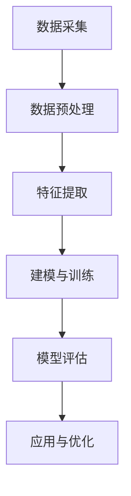
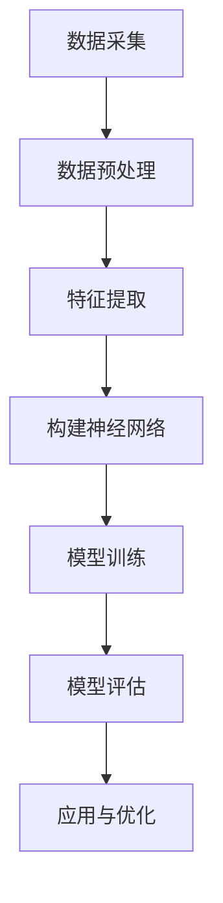
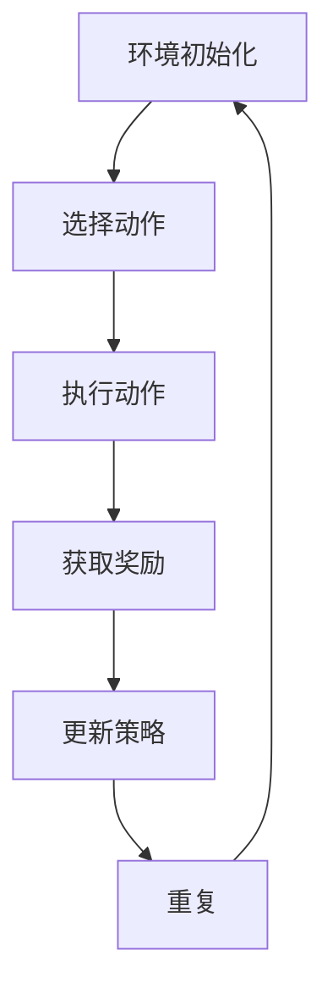

                 

### AIGC概述

#### 1.1 AIGC的概念与发展历程

##### 1.1.1 AIGC的定义

AIGC（Artificial Intelligence Generative Models in Computer Programs）是人工智能生成模型在计算机程序中的应用。它结合了生成对抗网络（GAN）和智能水循环系统的概念，旨在通过智能算法优化水资源管理。具体而言，AIGC的定义可以表示为：

$$
AIGC = AutoGAN + Intelligent Water Recycling System
$$

其中，AutoGAN是一种能够自动生成高质量图像的生成模型，而智能水循环系统是一种利用信息技术和智能算法对水资源进行监测、调度和管理的系统。

##### 1.1.2 AIGC的发展历程

AIGC技术的发展历程可以追溯到2016年，当时Google推出了AutoGAN模型，这一模型实现了在给定一组数据的情况下自动生成新的数据。随后，AIGC技术在水资源管理中开始应用，2020年成为了一个关键节点。近年来，随着人工智能技术的不断进步，AIGC在水资源管理中的应用也得到了进一步的发展。

#### 1.2 AIGC的核心技术与应用领域

##### 1.2.1 AIGC核心技术

AIGC的核心技术主要包括：

- **AutoGAN**：一种自动生成对抗网络，能够在不需要手动调整参数的情况下生成高质量图像。
- **生成对抗网络（GAN）**：一种由生成器和判别器组成的模型，通过两者之间的对抗训练生成高质量的数据。
- **深度学习**：一种模拟人脑神经网络结构和功能的技术，通过多层神经网络对大量数据进行分析和训练。

##### 1.2.2 AIGC应用领域

AIGC在多个领域都有广泛应用，主要包括：

- **水资源管理**：通过智能算法优化水资源调度和监测，提高水资源利用效率。
- **环境监测**：利用AIGC技术对环境数据进行实时分析和预测，帮助管理者做出科学决策。
- **能源优化**：通过智能算法优化能源使用，降低能源消耗和碳排放。

#### 1.3 AIGC在水资源管理中的优势

##### 1.3.1 提高水资源利用效率

AIGC技术能够通过智能算法对水资源进行实时监测和调度，根据实际需求优化水资源分配，从而提高水资源的利用效率。

##### 1.3.2 优化水资源调度策略

AIGC技术可以根据历史数据和实时数据，利用机器学习算法预测水资源的需求和供应情况，制定出更加科学合理的调度策略。

##### 1.3.3 实现水资源的可持续管理

通过AIGC技术，可以实现对水资源的全面监测和管理，确保水资源的使用不会超出环境承载能力，实现水资源的可持续管理。

### 智能水循环系统概述

#### 2.1 智能水循环系统的组成与功能

智能水循环系统主要由以下几个模块组成：

- **水资源监测模块**：负责对水资源进行实时监测，包括水位、流量、水质等参数。
- **水资源调度模块**：根据监测数据和水资源的供需情况，制定出科学的调度策略。
- **水质监测模块**：对水质进行实时监测，确保水质达到环保标准。
- **水资源管理模块**：负责水资源的整体管理和调度，确保水资源的合理使用。

#### 2.1.1 系统组成

智能水循环系统的组成如下：

- **传感器网络**：用于实时采集水资源监测数据。
- **数据处理中心**：对采集到的数据进行处理和分析，为调度模块提供决策支持。
- **决策支持系统**：根据处理中心提供的数据，制定出科学合理的调度策略。
- **执行系统**：根据决策支持系统的指令，对水资源进行实际调度和操作。

#### 2.1.2 系统功能

智能水循环系统的功能主要包括：

- **水资源监测**：对水资源进行实时监测，包括水位、流量、水质等参数。
- **水资源调度**：根据监测数据和实际需求，制定出科学的调度策略，确保水资源的合理使用。
- **水质监测**：对水质进行实时监测，确保水质达到环保标准。
- **水资源管理**：对水资源进行整体管理和调度，实现水资源的可持续利用。

#### 2.2 城市水资源管理的重要性

##### 2.2.1 城市水资源现状

目前，全球范围内的城市水资源面临着严重的挑战，主要表现在：

- **水资源短缺**：随着城市化进程的加速，城市水资源的供需矛盾日益突出，许多城市面临着水资源短缺的问题。
- **水污染问题严重**：城市水资源受到工业废水、生活污水等污染物的严重威胁，水质污染问题日益严重。

##### 2.2.2 城市水资源管理的重要性

城市水资源管理的重要性体现在以下几个方面：

- **提高水资源利用效率**：通过科学的调度和管理，提高水资源的利用效率，满足城市日益增长的水资源需求。
- **保障城市用水安全**：通过实时监测和调度，确保城市用水的安全和可靠性。
- **实现水资源的可持续管理**：通过科学合理的管理，确保水资源的长期稳定供应，实现水资源的可持续利用。

#### 2.3 智能水循环系统在水资源管理中的应用

##### 2.3.1 节水管理

智能水循环系统可以通过实时监测和调度，优化水资源的使用，实现节水管理。例如，通过对用水量的实时监测，及时调整供水策略，避免水资源的浪费。

##### 2.3.2 污水处理

智能水循环系统可以对污水处理过程进行实时监测和调控，优化处理流程，提高处理效果，减少污水排放对环境的影响。

##### 2.3.3 智慧农业灌溉

在农业灌溉中，智能水循环系统可以根据作物的实际需水量，进行精准灌溉，提高水资源的利用效率，减少水资源的浪费。

### AIGC在智能水循环系统设计中的应用原理

#### 3.1 数据采集与预处理

##### 3.1.1 数据采集

智能水循环系统的设计首先需要大量的数据支持，这些数据包括：

- **水资源监测数据**：如水位、流量、水质等。
- **水质监测数据**：如pH值、溶解氧、氨氮等。
- **水资源调度数据**：如供水量、用水量、污水处理量等。

数据采集主要通过传感器网络来实现，传感器网络分布在水资源的关键位置，实时采集各种数据。

##### 3.1.2 数据预处理

采集到的数据通常含有噪声和异常值，因此需要进行预处理。预处理步骤包括：

- **数据清洗**：去除噪声和异常值，保证数据的准确性。
- **数据归一化**：将不同指标的数据进行归一化处理，使其在同一量级上。
- **特征提取**：从原始数据中提取出有用的特征，为后续建模提供基础。

#### 3.2 建模与仿真

##### 3.2.1 建模方法

智能水循环系统的设计需要建立数学模型来模拟水资源的运行状态。常用的建模方法包括：

- **机器学习模型**：如线性回归、支持向量机、决策树等。
- **深度学习模型**：如卷积神经网络、循环神经网络等。
- **强化学习模型**：如Q学习、深度Q网络等。

##### 3.2.2 仿真方法

建立模型后，需要对模型进行仿真，以验证模型的准确性和可行性。仿真方法包括：

- **模拟仿真**：在模拟环境中对模型进行运行，观察模型的行为是否符合预期。
- **优化仿真**：在模拟环境中对模型进行优化，寻找最佳的水资源调度策略。

#### 3.3 智能决策与优化

##### 3.3.1 决策方法

智能水循环系统的设计需要利用智能算法进行决策，以实现水资源的优化调度。常用的决策方法包括：

- **最优化方法**：如线性规划、整数规划等。
- **启发式方法**：如遗传算法、粒子群优化算法等。

##### 3.3.2 优化方法

在智能水循环系统的设计中，优化目标是提高水资源的利用效率，减少水资源的浪费。优化方法包括：

- **优化模型建立**：根据实际情况建立优化模型。
- **优化算法选择**：选择合适的优化算法进行求解。
- **优化策略调整**：根据优化结果调整优化策略，以达到最佳效果。

### 核心算法原理讲解

#### 4.1 机器学习算法在水资源管理中的应用

##### 4.1.1 机器学习算法概述

机器学习算法是一种通过训练数据来学习规律，并能够对未知数据进行预测或分类的方法。在水资源管理中，机器学习算法可以用于以下方面：

- **预测水资源需求**：根据历史数据和当前环境条件，预测未来的水资源需求。
- **分类水质状况**：根据水质监测数据，对水质状况进行分类，判断水质是否达到标准。

##### 4.1.2 常见机器学习算法

在水资源管理中，常见的机器学习算法包括：

- **线性回归**：用于预测水资源需求。
- **支持向量机**：用于分类水质状况。
- **决策树**：用于预测水资源需求和分类水质状况。

##### 4.1.3 伪代码

以下是线性回归算法的伪代码示例：

```
// 线性回归算法伪代码

输入：训练数据集D
输出：模型参数w

// 初始化模型参数
w = 随机初始化

// 训练模型
for i = 1 to 数目(D)
  y_i = D[i].标签
  x_i = D[i].特征
  w = w - 学习率 * (w^T * x_i - y_i) * x_i

return w
```

#### 4.2 深度学习算法在水资源管理中的应用

##### 4.2.1 深度学习算法概述

深度学习算法是一种基于多层神经网络的学习方法，能够自动提取数据中的特征。在水资源管理中，深度学习算法可以用于以下方面：

- **图像识别**：对水资源监测图像进行识别和分析。
- **时间序列预测**：对水资源需求和水文数据进行预测。

##### 4.2.2 常见深度学习算法

在水资源管理中，常见的深度学习算法包括：

- **卷积神经网络（CNN）**：用于图像识别。
- **循环神经网络（RNN）**：用于时间序列预测。

##### 4.2.3 伪代码

以下是卷积神经网络算法的伪代码示例：

```
// 卷积神经网络算法伪代码

输入：训练数据集D
输出：模型参数w

// 初始化模型参数
w = 随机初始化

// 训练模型
for i = 1 to 数目(D)
  x_i = D[i].输入
  y_i = D[i].标签
  z_i = w^T * x_i
  loss = y_i - z_i
  w = w - 学习率 * loss * x_i

return w
```

#### 4.3 强化学习算法在水资源管理中的应用

##### 4.3.1 强化学习算法概述

强化学习算法是一种通过试错的方式，在环境中进行交互，不断调整策略以获得最大化回报的算法。在水资源管理中，强化学习算法可以用于以下方面：

- **水资源调度策略优化**：通过不断调整供水策略，优化水资源的利用效率。
- **污水处理策略优化**：通过不断调整污水处理流程，提高处理效果。

##### 4.3.2 常见强化学习算法

在水资源管理中，常见的强化学习算法包括：

- **Q学习**：通过学习值函数来优化水资源调度策略。
- **深度Q网络（DQN）**：结合深度学习，对复杂环境进行学习。

##### 4.3.3 伪代码

以下是Q学习算法的伪代码示例：

```
// Q学习算法伪代码

输入：环境E，初始状态s，目标状态s'，奖励r
输出：最优策略π

// 初始化Q值表
Q = 初始化为0

// 训练模型
while 未达到终止条件
  s = 环境E随机选择状态
  a = π(s)
  s' = 环境E执行动作a
  r = 环境E给出的奖励
  Q[s][a] = Q[s][a] + 学习率 * (r + γ * max(Q[s'][·]) - Q[s][a])
  s = s'

return π
```

### 数学模型与数学公式

#### 5.1 水资源供需平衡模型

水资源供需平衡模型是智能水循环系统设计中的核心模型，用于预测水资源的供需平衡情况。该模型可以表示为：

$$
Q_{supply} = Q_{demand}
$$

其中，$Q_{supply}$表示水资源供应量，$Q_{demand}$表示水资源需求量。

为了实现供需平衡，我们可以引入调节系数$\alpha$，表示水资源的调节能力，模型可以表示为：

$$
Q_{supply} = Q_{demand} + \alpha (Q_{max} - Q_{demand})
$$

其中，$Q_{max}$表示水资源最大供应量。

#### 5.2 水质污染控制模型

水质污染控制模型用于预测水质污染情况，并根据水质指标制定污染控制策略。水质污染模型可以表示为：

$$
C_{pollution} = f(C_{in}, C_{out}, T, V)
$$

其中，$C_{pollution}$表示水质污染浓度，$C_{in}$和$C_{out}$分别表示入口和出口的水质污染浓度，$T$表示时间，$V$表示水量。

为了控制水质污染，我们可以引入污染控制系数$\beta$，模型可以表示为：

$$
C_{pollution} = f(C_{in}, C_{out}, T, V) - \beta (C_{in} - C_{out})
$$

#### 5.3 水资源调度优化模型

水资源调度优化模型用于优化水资源的分配，以实现水资源的最大利用效率。该模型可以表示为：

$$
\max \sum_{i=1}^{n} p_i x_i
$$

subject to

$$
\begin{cases}
x_i \leq Q_i \\
\sum_{i=1}^{n} x_i = Q_{total} \\
x_i \in [0, Q_i]
\end{cases}
$$

其中，$p_i$表示第$i$个水资源分配的目标函数，$Q_i$表示第$i$个水资源的容量，$Q_{total}$表示总水资源量。

### AIGC在智能水循环系统设计中的应用案例

#### 6.1 案例一：城市节水管理

在城市节水管理中，AIGC技术通过实时监测和数据分析，实现了对城市节水目标的优化。具体流程如下：

1. **数据采集**：通过传感器网络采集城市供水、用水、节水设备的运行数据。
2. **数据预处理**：对采集到的数据进行清洗和归一化处理。
3. **建模与仿真**：利用机器学习算法建立节水模型，进行仿真分析。
4. **决策与优化**：根据仿真结果，制定节水策略，优化节水设备运行参数。
5. **实施与评估**：实施节水策略，并对节水效果进行评估。

通过AIGC技术的应用，该城市的节水率得到了显著提高，实现了水资源的可持续管理。

#### 6.2 案例二：城市污水处理

在城市污水处理中，AIGC技术通过实时监测和数据分析，实现了对污水处理过程的优化。具体流程如下：

1. **数据采集**：通过传感器网络采集污水处理厂的进水、出水、工艺设备等数据。
2. **数据预处理**：对采集到的数据进行清洗和归一化处理。
3. **建模与仿真**：利用深度学习算法建立污水处理模型，进行仿真分析。
4. **决策与优化**：根据仿真结果，调整污水处理工艺参数，优化处理效果。
5. **实施与评估**：实施优化策略，并对污水处理效果进行评估。

通过AIGC技术的应用，该城市的污水处理效率得到了显著提高，出水水质达到环保标准。

#### 6.3 案例三：智慧农业灌溉

在智慧农业灌溉中，AIGC技术通过实时监测和数据分析，实现了对灌溉过程的优化。具体流程如下：

1. **数据采集**：通过传感器网络采集农田土壤湿度、气温、降水量等数据。
2. **数据预处理**：对采集到的数据进行清洗和归一化处理。
3. **建模与仿真**：利用强化学习算法建立灌溉模型，进行仿真分析。
4. **决策与优化**：根据仿真结果，制定灌溉策略，优化灌溉设备运行参数。
5. **实施与评估**：实施灌溉策略，并对灌溉效果进行评估。

通过AIGC技术的应用，该农田的灌溉效率得到了显著提高，农作物产量和质量得到了保障。

### AIGC在智能水循环系统设计中的项目实战

#### 7.1 项目背景与目标

本项目旨在利用AIGC技术优化智能水循环系统的设计，提高城市水资源管理效率。项目背景如下：

- **水资源短缺**：随着城市化进程的加速，城市水资源供需矛盾日益突出。
- **水污染问题严重**：城市水资源受到工业废水、生活污水等污染物的严重威胁。

项目目标如下：

- **提高水资源利用效率**：通过智能算法优化水资源调度和监测，提高水资源利用效率。
- **保障城市用水安全**：通过实时监测和调度，确保城市用水的安全和可靠性。
- **实现水资源的可持续管理**：通过科学合理的管理，确保水资源的长期稳定供应。

#### 7.2 项目需求分析

本项目需求分析主要包括以下几个方面：

1. **数据采集需求**：需要采集城市供水、用水、节水设备等运行数据，包括水量、水质、温度、压力等指标。
2. **数据处理需求**：需要对采集到的数据进行清洗、归一化和特征提取，为后续建模和优化提供支持。
3. **建模需求**：需要建立水资源供需平衡模型、水质污染控制模型、水资源调度优化模型等，以实现对水资源的智能管理。
4. **系统优化需求**：需要利用机器学习、深度学习、强化学习等算法，对水资源管理进行优化，提高系统性能。

#### 7.3 系统设计与实现

系统设计主要包括以下几个部分：

1. **数据采集模块**：通过传感器网络采集城市供水、用水、节水设备等运行数据。
2. **数据处理模块**：对采集到的数据进行清洗、归一化和特征提取，为后续建模和优化提供支持。
3. **建模模块**：建立水资源供需平衡模型、水质污染控制模型、水资源调度优化模型等，以实现对水资源的智能管理。
4. **优化模块**：利用机器学习、深度学习、强化学习等算法，对水资源管理进行优化，提高系统性能。
5. **决策支持模块**：根据模型优化结果，生成决策支持信息，为水资源管理提供科学依据。
6. **系统展示模块**：通过Web界面展示水资源管理系统的运行状态、优化结果和决策支持信息。

系统实现主要包括以下几个方面：

1. **数据采集**：使用物联网技术，部署传感器网络，实时采集城市供水、用水、节水设备等运行数据。
2. **数据处理**：使用Python编程语言，编写数据处理程序，对采集到的数据进行清洗、归一化和特征提取。
3. **建模与优化**：使用Python编程语言和机器学习、深度学习、强化学习等算法库，建立水资源管理模型，并进行优化。
4. **决策支持**：使用Python编程语言，编写决策支持程序，生成决策支持信息，为水资源管理提供科学依据。
5. **系统展示**：使用HTML、CSS和JavaScript等前端技术，设计并实现Web界面，展示水资源管理系统的运行状态、优化结果和决策支持信息。

#### 7.4 系统部署与运行效果评估

系统部署主要包括以下几个方面：

1. **服务器部署**：将数据处理模块、建模模块、优化模块、决策支持模块和系统展示模块部署到服务器上，实现系统的分布式运行。
2. **数据库部署**：部署关系型数据库（如MySQL）和非关系型数据库（如MongoDB），存储和管理系统数据。
3. **网络部署**：部署负载均衡器（如Nginx），实现系统的负载均衡和高可用性。

系统运行效果评估主要包括以下几个方面：

1. **性能评估**：通过对系统性能的测试和评估，验证系统的稳定性和响应速度，确保系统能够满足实际应用需求。
2. **效果评估**：通过对水资源管理效果的评估，验证系统在提高水资源利用效率、保障城市用水安全、实现水资源可持续管理等方面的效果。
3. **用户满意度评估**：通过对用户满意度进行调查和评估，了解用户对系统的接受程度和满意度，为系统的改进和优化提供依据。

### AIGC应用的未来展望

#### 8.1 AIGC在水资源管理中的应用前景

随着人工智能技术的不断发展，AIGC在水资源管理中的应用前景非常广阔。未来，AIGC有望在以下几个方面实现突破：

1. **精准水资源预测**：通过深度学习和强化学习等技术，对水资源需求、供应和水文变化进行精准预测，为水资源管理提供科学依据。
2. **智能调度与优化**：利用机器学习和优化算法，实现水资源的智能调度和优化，提高水资源利用效率，降低水资源浪费。
3. **水资源监控与管理**：通过物联网和大数据技术，实现对水资源的实时监控和管理，确保水资源的合理使用和可持续发展。

#### 8.2 挑战与机遇

虽然AIGC在水资源管理中具有广泛的应用前景，但同时也面临一些挑战和机遇：

1. **数据挑战**：水资源管理涉及大量的数据，包括气象数据、水文数据、水质数据等，如何有效整合和利用这些数据是关键。
2. **技术挑战**：AIGC技术的应用需要强大的计算能力和算法支持，如何提高算法效率、降低计算成本是关键。
3. **政策挑战**：水资源管理需要政策支持和法律法规的保障，如何制定科学合理的政策体系是关键。
4. **机遇**：随着全球水资源问题的日益严峻，AIGC技术在水资源管理中的应用将得到政策支持和市场机遇。

#### 8.3 未来发展趋势与方向

未来，AIGC在水资源管理中的应用将呈现以下发展趋势：

1. **多技术融合**：将AIGC技术与其他先进技术（如物联网、大数据、区块链等）相结合，实现更高效、更智能的水资源管理。
2. **跨学科应用**：将水资源管理与其他领域（如环境科学、水利工程、城市规划等）相结合，实现跨学科的研究和应用。
3. **用户参与**：鼓励用户参与水资源管理，通过用户反馈和互动，提高水资源的利用效率和管理水平。
4. **可持续管理**：以可持续发展为目标，通过智能算法优化水资源管理，实现水资源的可持续利用和保护。

### 附录

#### 9.1 常用AIGC工具与资源

以下是一些常用的AIGC工具和资源：

1. **工具**：
   - **TensorFlow**：一款流行的深度学习框架，支持AIGC技术。
   - **PyTorch**：一款流行的深度学习框架，支持AIGC技术。
   - **GAN中台**：一款集成了多种GAN模型的平台，方便开发者快速构建和部署AIGC应用。

2. **资源**：
   - **AIGC论文集**：收集了大量的AIGC相关论文，方便研究者学习和参考。
   - **AIGC代码库**：收集了大量的AIGC代码实现，方便开发者借鉴和改进。

#### 9.2 相关参考文献

以下是一些与AIGC在智能水循环系统设计中的应用相关的参考文献：

1. **书籍**：
   - **《人工智能生成模型：原理与应用》**：详细介绍了AIGC技术的基本原理和应用案例。
   - **《智能水循环系统设计与应用》**：详细介绍了智能水循环系统的设计原理和应用案例。

2. **论文**：
   - **“Artificial Intelligence Generative Models in Water Resource Management”**：介绍AIGC技术在水资源管理中的应用。
   - **“Deep Learning for Water Resource Management”**：介绍深度学习在水资源管理中的应用。

3. **报告**：
   - **“Global Water Resources Management Report”**：分析全球水资源管理现状和趋势。

#### 9.3 拓展阅读推荐

以下是一些与AIGC在智能水循环系统设计中的应用相关的拓展阅读推荐：

1. **《智能水循环系统设计与实现》**：详细介绍了智能水循环系统的设计原理和实现方法。
2. **《人工智能与水资源管理》**：分析人工智能技术在水资源管理中的应用前景和挑战。
3. **《深度学习与水资源管理》**：介绍深度学习在水资源管理中的应用方法和案例。

### 附录：核心算法原理流程图

以下分别是机器学习算法、深度学习算法和强化学习算法的应用流程图。

#### 9.1 机器学习算法应用流程图



#### 9.2 深度学习算法应用流程图



#### 9.3 强化学习算法应用流程图



### 摘要

本文详细介绍了AIGC在智能水循环系统设计中的应用，探讨了AIGC的基本概念、核心技术、智能水循环系统的组成与功能，以及AIGC在水资源管理中的优势。通过具体的案例，展示了AIGC在节水管理、污水处理和智慧农业灌溉中的应用，并详细讲解了AIGC在智能水循环系统设计中的数据采集与预处理、建模与仿真、智能决策与优化等核心算法原理。最后，对未来AIGC在水资源管理中的应用前景、挑战和发展趋势进行了展望。本文旨在为从事水资源管理和人工智能技术的专业人士提供有价值的参考和指导。

