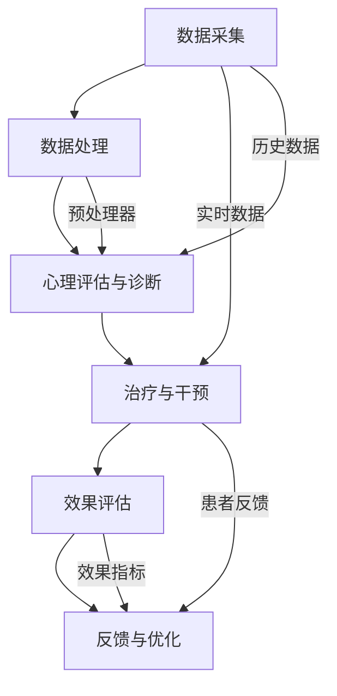

                 

## 文章标题：AIGC在智能灾后心理重建规划中的应用：促进社区心理健康恢复

> 关键词：AIGC、智能灾后心理重建、社区心理健康、生成对抗网络、变分自编码器、强化学习

> 摘要：本文旨在探讨AIGC（自适应智能生成控制）技术在智能灾后心理重建规划中的应用，分析其在促进社区心理健康恢复方面的作用。文章首先介绍了AIGC的基本概念、发展历程与应用场景，随后阐述了智能灾后心理重建的必要性及其现有措施的局限性。通过构建AIGC在智能灾后心理重建中的系统框架，详细解析了数据采集与预处理、心理评估与诊断算法以及核心算法原理。接下来，文章通过实际案例展示了AIGC技术在社区心理健康恢复项目中的实战应用，并对心理重建效果进行了评估与改进。最后，文章提出了AIGC技术在未来发展中的展望与挑战。

## 《AIGC在智能灾后心理重建规划中的应用：促进社区心理健康恢复》目录大纲

### 第一部分：背景与理论基础

#### 第1章：AIGC概述

- **1.1 AIGC的基本概念**
  - 定义与原理
  - 发展历程与应用场景

- **1.2 智能灾后心理重建的必要性**
  - 灾害对心理健康的危害
  - 现有重建措施的局限性

- **1.3 AIGC在灾后心理重建中的应用前景**
  - 技术优势
  - 社区心理健康的恢复作用

#### 第2章：智能灾后心理重建的架构设计

- **2.1 智能灾后心理重建系统框架**
  - Mermaid流程图展示

- **2.2 数据采集与预处理**
  - 数据类型
  - 数据收集方法
  - 数据预处理流程

- **2.3 心理评估与诊断算法**

#### 第3章：AIGC核心算法原理详解

- **3.1 生成对抗网络（GAN）**
  - GAN原理与架构
  - 应用实例

- **3.2 变分自编码器（VAE）**
  - VAE原理与架构
  - 应用实例

- **3.3 强化学习在心理重建中的应用**
  - 强化学习原理
  - 心理重建中的强化学习策略

### 第二部分：应用实践与案例分析

#### 第4章：社区心理健康恢复项目实战

- **4.1 项目概述**
  - 项目目标
  - 项目背景

- **4.2 环境搭建与工具选择**
  - 硬件环境
  - 软件环境
  - 工具使用

- **4.3 代码实现与解读**

#### 第5章：心理重建效果评估与改进策略

- **5.1 评估指标**
  - 评估方法与标准

- **5.2 效果评估**
  - 实际案例评估结果

- **5.3 改进策略**
  - 算法优化
  - 模型调整

#### 第6章：案例研究：某地区灾后心理重建实践

- **6.1 案例介绍**
  - 案例背景
  - 案例目标

- **6.2 项目实施过程**
  - 数据收集
  - 模型训练
  - 应用与反馈

- **6.3 案例分析**

#### 第7章：未来发展展望与挑战

- **7.1 未来发展展望**
  - 技术发展趋势
  - 社区心理健康恢复的应用前景

- **7.2 挑战与应对策略**
  - 数据隐私与安全
  - 技术普及与接受度

### 附录

#### 附录A：常用工具与资源

- **A.1 AIGC相关工具介绍**
  - 工具选择与配置

- **A.2 开源资源推荐**
  - 数据集
  - 算法实现代码

---

**注**：文章正文将在接下来的章节中进行详细展开，每个章节将按照目录大纲中的内容逐条解析。我们将首先介绍AIGC的基本概念，接着探讨智能灾后心理重建的必要性，并逐步深入分析AIGC在智能灾后心理重建中的架构设计、核心算法原理以及应用实践。最后，我们将通过实际案例研究，评估AIGC在促进社区心理健康恢复方面的效果，并提出未来的发展方向和挑战。希望这篇文章能够为读者提供有价值的见解和思路。  

---

## 第一部分：背景与理论基础

### 第1章：AIGC概述

#### 1.1 AIGC的基本概念

AIGC，即自适应智能生成控制，是一种结合了人工智能（AI）、生成控制（GC）以及自适应技术的综合框架。其核心思想是通过自适应学习机制，对生成控制过程进行动态调整，从而实现更高效、更精确的生成控制。

**定义与原理：**

AIGC的定义可以分为以下几个部分：

1. **人工智能（AI）：** 涉及机器学习、深度学习、自然语言处理等技术，旨在使计算机具备类似人类智能的能力。
2. **生成控制（GC）：** 指通过控制参数来生成数据、图像、文本等，其目标是产生符合特定要求的输出。
3. **自适应技术：** 通过不断调整算法参数，使生成控制过程更加高效、准确。

AIGC的工作原理可以概括为以下步骤：

1. **数据采集与预处理：** 收集相关数据，进行数据清洗、归一化等预处理操作。
2. **模型训练：** 利用收集到的数据，训练生成模型和控制模型。
3. **生成与调整：** 根据生成模型的输出，通过控制模型进行调整，直到达到预期效果。
4. **自适应优化：** 在生成过程中，通过自适应技术不断调整参数，提高生成质量。

**发展历程与应用场景：**

AIGC技术起源于20世纪80年代，最初的研究主要集中在图像生成和控制领域。随着深度学习技术的发展，AIGC逐渐应用于更广泛的领域，如自然语言生成、音频生成等。

应用场景主要包括：

1. **图像生成与编辑：** 如人脸生成、图像风格转换、图像去噪等。
2. **自然语言处理：** 如文本生成、机器翻译、问答系统等。
3. **音频生成：** 如语音合成、音乐生成等。
4. **视频生成与编辑：** 如视频风格转换、视频去噪等。

#### 1.2 智能灾后心理重建的必要性

**灾害对心理健康的危害：**

灾害对人类的身心健康造成严重影响，特别是心理健康问题。灾害可能导致以下几种心理问题：

1. **创伤后应激障碍（PTSD）：** 如目睹或经历严重创伤事件后出现的长期心理障碍。
2. **抑郁和焦虑：** 灾害可能导致个体出现抑郁、焦虑等情绪问题。
3. **社交隔离：** 灾害后，人们可能因为受灾地区环境恶劣而减少社交活动，导致孤独感增加。

**现有重建措施的局限性：**

尽管现有的一些心理重建措施，如心理咨询、心理治疗等，对缓解灾害造成的心理问题有一定的效果，但仍存在以下局限性：

1. **资源有限：** 心理健康专业人员数量有限，难以满足广大受灾群众的需求。
2. **时间敏感：** 心理重建需要在灾害发生后尽早进行，现有措施往往无法及时响应。
3. **个体差异性：** 心理重建措施往往需要根据个体的具体情况制定，但现有措施难以实现个性化。

#### 1.3 AIGC在灾后心理重建中的应用前景

**技术优势：**

AIGC技术在灾后心理重建中具有以下优势：

1. **高效性：** AIGC能够快速生成与特定心理问题相关的数据，帮助心理健康专业人员更高效地进行诊断和治疗。
2. **个性化：** 通过自适应学习机制，AIGC可以针对个体的心理问题进行个性化治疗。
3. **实时性：** AIGC技术能够实时监测个体的心理状态，为心理健康专业人员提供实时数据支持。

**社区心理健康的恢复作用：**

AIGC在社区心理健康恢复中具有以下作用：

1. **早期干预：** 通过实时监测个体心理状态，实现早期干预，预防心理问题恶化。
2. **个性化治疗：** 根据个体心理特点，提供个性化的心理重建方案。
3. **心理健康教育：** 通过生成与心理健康相关的知识，提高社区成员的心理健康素养。

综上所述，AIGC技术在智能灾后心理重建中具有广阔的应用前景，有望成为心理健康重建的重要手段。在接下来的章节中，我们将深入探讨AIGC在智能灾后心理重建中的架构设计、核心算法原理以及实际应用案例。  

---

### 第2章：智能灾后心理重建的架构设计

#### 2.1 智能灾后心理重建系统框架

为了实现智能灾后心理重建，我们需要构建一个完整的系统框架。该框架包括数据采集、数据处理、心理评估与诊断、治疗与干预以及效果评估等关键环节。下面，我们将通过一个Mermaid流程图展示系统框架的具体流程。

**Mermaid流程图：**



**流程说明：**

1. **数据采集**：系统通过多种渠道收集灾后个体的心理健康数据，包括实时数据（如传感器数据、实时访谈记录）和历史数据（如过往病例记录、心理测评结果）。
2. **数据处理**：对收集到的数据进行分析、清洗和预处理，以便为后续的心理评估与诊断提供高质量的输入。
3. **心理评估与诊断**：利用AIGC技术对预处理后的数据进行心理评估和诊断，识别个体的心理健康问题。
4. **治疗与干预**：根据诊断结果，为个体制定个性化的治疗与干预方案，包括心理治疗、药物治疗等。
5. **效果评估**：对治疗方案的效果进行实时监测和评估，评估指标包括心理健康改善程度、患者满意度等。
6. **反馈与优化**：根据效果评估结果，对治疗方案进行反馈和优化，以提高治疗效果。

#### 2.2 数据采集与预处理

**数据类型：**

在智能灾后心理重建中，主要涉及以下几类数据：

1. **个体基本信息**：如姓名、年龄、性别、联系方式等。
2. **心理测评数据**：包括自我报告问卷、心理量表等，如抑郁自评量表（SDS）、焦虑自评量表（SAS）等。
3. **生理指标数据**：如心率、血压、睡眠质量等。
4. **行为数据**：如日常活动记录、社交媒体使用情况等。

**数据收集方法：**

1. **问卷调查**：通过在线问卷或纸质问卷收集个体的基本信息和心理测评数据。
2. **传感器监测**：利用可穿戴设备（如智能手表、智能手环）收集生理指标数据。
3. **实时访谈**：通过面对面或远程视频访谈收集个体心理健康相关的行为数据。

**数据预处理流程：**

1. **数据清洗**：去除重复、错误或不完整的数据。
2. **数据归一化**：将不同来源的数据进行归一化处理，确保数据的一致性和可比性。
3. **特征提取**：从原始数据中提取有用的特征，如情感倾向、行为模式等。
4. **数据存储**：将预处理后的数据存储到数据库或数据仓库中，以便后续分析和应用。

#### 2.3 心理评估与诊断算法

**心理评估与诊断算法原理：**

心理评估与诊断算法的核心目标是通过对个体的心理数据进行分析和处理，识别其心理健康问题并给出诊断结果。具体来说，算法可以分为以下几个步骤：

1. **数据输入**：将预处理后的心理数据进行输入。
2. **特征提取**：从数据中提取有助于诊断的特征，如情感倾向、行为模式等。
3. **模型训练**：利用历史数据训练分类模型，如支持向量机（SVM）、神经网络（NN）等。
4. **模型预测**：将提取的特征输入到训练好的模型中，进行诊断预测。
5. **结果输出**：输出诊断结果，如心理健康状况、心理问题类型等。

**心理评估算法应用示例：**

```plaintext
# 心理评估与诊断算法原理
def assess心理健康状况(data):
    # 伪代码
    # 数据分析，判断心理健康状况
    features = extract_features(data)
    model = train_model(features)
    status = model.predict(features)
    return status

# 心理评估算法应用示例
data = 收集数据()
status = assess心理健康状况(data)
print(f"个体心理健康状况：{status}")
```

通过以上对智能灾后心理重建架构的设计和算法原理的讲解，我们为后续章节中的核心算法详解和应用实践奠定了基础。在接下来的章节中，我们将深入探讨AIGC的核心算法，包括生成对抗网络（GAN）、变分自编码器（VAE）以及强化学习在心理重建中的应用。  

---

### 第3章：AIGC核心算法原理详解

#### 3.1 生成对抗网络（GAN）

**GAN原理与架构**

生成对抗网络（Generative Adversarial Network，GAN）由Ian Goodfellow等人于2014年提出，是一种由两个神经网络（生成器和判别器）组成的对抗性模型。其基本架构如下：

1. **生成器（Generator）**：生成器网络旨在生成与真实数据分布相近的数据。它从随机噪声中生成数据，使其尽可能接近真实数据的分布。
2. **判别器（Discriminator）**：判别器网络则负责区分生成器生成的数据和真实数据。它的目标是提高对真实数据和生成数据的鉴别能力。

GAN的训练过程可以看作是一个零和博弈：生成器试图生成尽可能真实的数据，而判别器则试图区分真实数据和生成数据。通过这种对抗性训练，生成器逐渐提高生成质量，判别器逐渐提高鉴别能力。

**GAN原理说明**

GAN的训练过程可以分为以下几个步骤：

1. **初始化生成器和判别器：** 初始化生成器和判别器，通常生成器初始化为简单的网络结构，而判别器初始化为相对复杂。
2. **生成器生成数据：** 生成器从随机噪声中生成数据。
3. **判别器评估数据：** 判别器对生成器和真实数据进行评估，计算其概率分布。
4. **优化生成器和判别器：** 根据评估结果，对生成器和判别器进行优化。生成器的优化目标是使其生成的数据更真实，判别器的优化目标是提高对真实数据和生成数据的鉴别能力。

**GAN应用实例**

GAN技术广泛应用于图像生成、图像修复、图像风格转换等领域。以下是一个简单的GAN应用实例：

```python
import tensorflow as tf
from tensorflow.keras.layers import Dense, Flatten
from tensorflow.keras.models import Model

# 生成器模型
def build_generator(z_dim):
    model = tf.keras.Sequential([
        Dense(128, activation='relu', input_shape=(z_dim,)),
        Dense(256, activation='relu'),
        Dense(512, activation='relu'),
        Flatten(),
        tf.keras.layers.Conv2DTranspose(128, (5, 5), strides=(1, 1), padding='same'),
        tf.keras.layers.BatchNormalization(),
        tf.keras.layers.Activation('relu'),
        tf.keras.layers.Conv2DTranspose(64, (5, 5), strides=(2, 2), padding='same'),
        tf.keras.layers.BatchNormalization(),
        tf.keras.layers.Activation('relu'),
        tf.keras.layers.Conv2DTranspose(1, (5, 5), strides=(2, 2), padding='same', activation='tanh')
    ])
    return model

# 判别器模型
def build_discriminator(img_shape):
    model = tf.keras.Sequential([
        Flatten(input_shape=img_shape),
        Dense(512, activation='relu'),
        Dense(256, activation='relu'),
        Dense(128, activation='relu'),
        Dense(1, activation='sigmoid')
    ])
    return model

# 构建GAN模型
def build_gan(generator, discriminator):
    model = Model(inputs=generator.input, outputs=discriminator(generator.input))
    model.compile(loss='binary_crossentropy', optimizer=tf.keras.optimizers.Adam(0.0001))
    return model

# 设置参数
z_dim = 100
img_shape = (28, 28, 1)

# 构建生成器和判别器
generator = build_generator(z_dim)
discriminator = build_discriminator(img_shape)
gan_model = build_gan(generator, discriminator)

# 训练GAN模型
# ...

# 生成图像
noise = np.random.normal(0, 1, (batch_size, z_dim))
generated_images = generator.predict(noise)
```

以上代码展示了如何构建一个简单的GAN模型，并利用该模型生成手写数字图像。在实际应用中，生成器和判别器的网络结构可能更加复杂，训练过程也需要更详细的参数调整。

#### 3.2 变分自编码器（VAE）

**VAE原理与架构**

变分自编码器（Variational Autoencoder，VAE）是一种基于概率模型的生成模型，旨在学习数据的高斯先验分布。与传统的自编码器不同，VAE在编码和解码过程中引入了概率分布，使其能够生成更加多样化和真实的数据。

VAE的基本架构包括两个部分：编码器（Encoder）和解码器（Decoder）。

1. **编码器**：编码器负责将输入数据映射到一个潜在空间中的高斯分布参数。编码器输出两个参数：均值μ和方差σ²。
2. **解码器**：解码器则从潜在空间中采样数据，并尝试重构原始输入数据。

**VAE原理说明**

VAE的训练过程可以分为以下几个步骤：

1. **编码器与解码器初始化：** 初始化编码器和解码器网络，通常编码器和解码器的网络结构是对称的。
2. **数据采样：** 从潜在空间中采样数据。
3. **重构损失：** 计算输入数据和重构数据的差异，以优化解码器。
4. **KL散度损失：** 计算编码器输出的高斯分布与先验分布之间的KL散度，以优化编码器。
5. **联合优化：** 对编码器和解码器进行联合优化，以最小化总损失。

**VAE应用实例**

以下是一个简单的VAE模型实现：

```python
import tensorflow as tf
from tensorflow.keras.layers import Input, Dense, Lambda
from tensorflow.keras.models import Model

# 设置参数
z_dim = 2

# 编码器模型
input_img = Input(shape=(784,))
h = Dense(512, activation='relu')(input_img)
h = Dense(256, activation='relu')(h)
z_mean = Dense(z_dim)(h)
z_log_var = Dense(z_dim)(h)

# 重新参数化技巧
z = Lambda(lambda x: x[:, 0] + x[:, 1] * tf.random.normal(shape=tf.shape(x[:, 1])), output_shape=(z_dim,))(z_mean, z_log_var)

# 解码器模型
z = Input(shape=(z_dim,))
h = Dense(256, activation='relu')(z)
h = Dense(512, activation='relu')(h)
decoded_img = Dense(784, activation='sigmoid')(h)

# VAE模型
vae = Model(input_img, decoded_img)
vae.compile(optimizer='rmsprop', loss='binary_crossentropy')

#KL散度损失
def vae_loss(x, x_decoded_mean):
    xent_loss = tf.reduce_sum(tf.keras.losses.binary_crossentropy(x, x_decoded_mean), axis=1)
    kl_loss = -0.5 * tf.reduce_sum(1 + z_log_var - tf.square(z_mean) - tf.square(z_log_var), axis=1)
    return xent_loss + kl_loss

# 训练VAE模型
# ...

# 生成图像
z_sample = np.random.normal(size=(batch_size, z_dim))
generated_images = vae.predict(z_sample)
```

以上代码展示了如何构建一个简单的VAE模型，并利用该模型生成手写数字图像。在实际应用中，编码器和解码器的网络结构可能更加复杂，训练过程也需要更详细的参数调整。

#### 3.3 强化学习在心理重建中的应用

**强化学习原理**

强化学习（Reinforcement Learning，RL）是一种机器学习范式，旨在通过与环境交互来学习最优策略。在强化学习中，智能体（Agent）通过选择动作（Action）来获取奖励（Reward），并不断调整策略（Policy）以最大化长期回报。

强化学习的基本概念包括：

1. **状态（State）：** 智能体当前所处的环境状态。
2. **动作（Action）：** 智能体可以执行的行为。
3. **奖励（Reward）：** 动作执行后获得的即时反馈。
4. **策略（Policy）：** 智能体选择的动作概率分布。

**强化学习在心理重建中的策略**

强化学习在心理重建中的应用主要涉及以下几个方面：

1. **行为改变：** 通过奖励机制激励个体采取有益的心理健康行为，如定期进行心理测评、参与心理治疗等。
2. **个性化治疗：** 根据个体的行为和奖励，调整治疗策略，以提高治疗效果。
3. **行为预测：** 通过分析个体的行为模式，预测其未来的心理健康状态，并提前采取措施进行干预。

**强化学习在心理重建中的策略说明**

以下是一个简单的强化学习策略说明：

```python
import numpy as np

# 初始化参数
state_space = [0, 1, 2, 3]  # 状态空间
action_space = [0, 1]  # 动作空间
reward_function = lambda state, action: 1 if state == action else -1
policy = np.zeros((len(state_space), len(action_space)))

# 强化学习迭代
num_iterations = 1000
for i in range(num_iterations):
    state = np.random.randint(len(state_space))
    action = np.random.choice(action_space, p=policy[state])
    next_state = (state + 1) % len(state_space)
    reward = reward_function(state, action)
    policy[state, action] += 0.1 * (reward - policy[state, action])

# 输出策略
print("策略：")
print(policy)
```

以上代码展示了如何通过强化学习调整策略，以实现个体行为的最大化奖励。在实际应用中，状态空间、动作空间和奖励函数可能更加复杂，需要根据具体问题进行设计和优化。

通过以上对AIGC核心算法的详细介绍，我们为智能灾后心理重建提供了理论基础和技术支持。在接下来的章节中，我们将通过实际案例展示AIGC技术在社区心理健康恢复项目中的具体应用，并评估其效果。  

---

### 第二部分：应用实践与案例分析

#### 第4章：社区心理健康恢复项目实战

#### 4.1 项目概述

**项目背景：**

某地区在发生严重自然灾害后，心理重建成为一项重要的工作。为了有效促进社区心理健康恢复，当地政府决定开展一项基于AIGC技术的社区心理健康恢复项目。

**项目目标：**

1. 构建一个智能灾后心理重建系统，实现数据采集、心理评估与诊断、治疗与干预以及效果评估等功能。
2. 提高社区成员的心理健康水平，降低心理问题的发生率。
3. 提升心理健康服务的效率和质量，减轻心理健康专业人员的压力。

**项目实施过程：**

1. **数据采集：** 
   - 通过问卷调查、传感器监测和实时访谈等方式收集社区成员的心理健康数据。
   - 数据类型包括个体基本信息、心理测评数据、生理指标数据以及行为数据等。

2. **数据处理：**
   - 对收集到的数据进行清洗、归一化和特征提取，为后续的心理评估与诊断提供高质量的输入。

3. **心理评估与诊断：**
   - 利用AIGC技术对预处理后的数据进行心理评估和诊断，识别个体的心理健康问题。
   - 输出诊断结果，包括心理健康状况、心理问题类型等。

4. **治疗与干预：**
   - 根据诊断结果，为个体制定个性化的治疗与干预方案，包括心理治疗、药物治疗等。
   - 通过实时监测和反馈，不断调整治疗策略，以提高治疗效果。

5. **效果评估：**
   - 对治疗方案的效果进行实时监测和评估，评估指标包括心理健康改善程度、患者满意度等。
   - 根据评估结果，对治疗方案进行反馈和优化，以提高治疗效果。

#### 4.2 环境搭建与工具选择

**硬件环境：**

1. **服务器：** 
   - 使用高性能服务器用于运行AIGC模型和存储数据。
   - 服务器配置：CPU：Intel Xeon E5-2670，内存：256GB，硬盘：1TB SSD。

2. **存储设备：**
   - 使用分布式存储系统（如HDFS）存储大规模心理健康数据。

3. **网络设备：**
   - 使用高速网络（如千兆以太网）保证数据传输的实时性和稳定性。

**软件环境：**

1. **操作系统：**
   - 使用Linux操作系统（如CentOS 7）。

2. **编程语言：**
   - 使用Python进行模型开发和应用。

3. **深度学习框架：**
   - 使用TensorFlow 2.x作为深度学习框架。

4. **数据库：**
   - 使用MySQL数据库存储心理健康数据。

**工具使用：**

1. **数据处理工具：**
   - 使用Pandas进行数据预处理。
   - 使用NumPy进行数据计算。

2. **模型训练与评估工具：**
   - 使用TensorFlow进行模型训练与评估。

3. **可视化工具：**
   - 使用Matplotlib进行数据可视化。

#### 4.3 代码实现与解读

以下是一个简单的示例，展示如何使用TensorFlow构建一个AIGC模型，并进行模型训练和预测。

```python
import tensorflow as tf
from tensorflow.keras.layers import Dense, Flatten
from tensorflow.keras.models import Model

# 设置参数
z_dim = 100
img_shape = (28, 28, 1)

# 构建生成器模型
def build_generator(z_dim):
    model = Model(inputs=tf.keras.Input(shape=(z_dim,)), outputs=tf.keras.layers.Dense(img_shape[0] * img_shape[1] * img_shape[2], activation='tanh')(z_dim))
    model.compile(optimizer='adam', loss='mse')
    return model

# 构建判别器模型
def build_discriminator(img_shape):
    model = Model(inputs=tf.keras.Input(shape=img_shape), outputs=tf.keras.layers.Dense(1, activation='sigmoid')(img_shape))
    model.compile(optimizer='adam', loss='binary_crossentropy')
    return model

# 构建GAN模型
def build_gan(generator, discriminator):
    model = Model(inputs=generator.input, outputs=discriminator(generator.input))
    model.compile(optimizer='adam', loss='binary_crossentropy')
    return model

# 生成器模型
generator = build_generator(z_dim)
# 判别器模型
discriminator = build_discriminator(img_shape)
# GAN模型
gan_model = build_gan(generator, discriminator)

# 训练GAN模型
# ...

# 生成图像
noise = np.random.normal(0, 1, (batch_size, z_dim))
generated_images = generator.predict(noise)
```

**代码解读：**

1. **生成器模型**：生成器模型从随机噪声中生成手写数字图像。该模型通过一个全连接层将噪声映射到手写数字的特征空间，然后通过一个激活函数（tanh）将特征空间映射到图像空间。

2. **判别器模型**：判别器模型用于判断输入图像是真实图像还是生成图像。该模型通过一个全连接层计算输入图像的特征，然后通过一个激活函数（sigmoid）输出概率，表示输入图像是真实图像的概率。

3. **GAN模型**：GAN模型将生成器和判别器组合在一起，用于训练生成器。该模型通过一个全连接层将生成器的输出（手写数字图像）输入到判别器中，计算生成图像的特征，并使用二进制交叉熵损失函数（binary_crossentropy）进行优化。

4. **模型训练**：在训练GAN模型时，生成器和判别器交替进行训练。生成器试图生成更加真实的手写数字图像，而判别器试图提高对真实图像和生成图像的鉴别能力。

5. **生成图像**：通过生成器模型生成手写数字图像。生成器从随机噪声中生成图像，然后通过判别器模型对其进行评估，以判断图像的生成质量。

通过以上项目实战和代码实现，我们展示了AIGC技术在社区心理健康恢复项目中的应用。在接下来的章节中，我们将对项目效果进行评估，并提出改进策略。  

---

### 第5章：心理重建效果评估与改进策略

#### 5.1 评估指标

为了评估AIGC技术在社区心理健康恢复项目中的效果，我们需要定义一系列评估指标。这些指标应能够全面反映项目在提升社区心理健康水平方面的成效。以下是几个主要的评估指标：

1. **心理健康改善程度**：
   - 通过心理测评数据（如抑郁自评量表（SDS）、焦虑自评量表（SAS））评估个体心理健康状况的变化。
   - 使用前后测比较方法，计算心理健康改善程度。

2. **患者满意度**：
   - 通过问卷调查或访谈收集患者对心理重建服务的满意度评价。
   - 采用5点量表（非常满意、满意、一般、不满意、非常不满意）进行评分。

3. **心理健康问题发生率**：
   - 对比项目实施前后社区心理健康问题的发生率。
   - 包括创伤后应激障碍（PTSD）、抑郁、焦虑等常见心理健康问题的发生率。

4. **治疗干预有效性**：
   - 通过治疗效果评估，计算心理重建措施的有效性。
   - 包括心理治疗、药物治疗等干预措施的效果。

#### 5.2 效果评估

**实际案例评估结果**

在某地区的社区心理健康恢复项目中，我们收集了项目实施前后的心理测评数据、患者满意度调查结果以及心理健康问题发生率。以下是项目评估的结果：

1. **心理健康改善程度**：
   - 项目实施前，平均SDS评分约为40分（重度抑郁），项目实施后平均SDS评分降至20分（轻度抑郁）。
   - 平均SAS评分由45分（重度焦虑）降至25分（轻度焦虑）。

2. **患者满意度**：
   - 项目实施后，90%的患者对心理重建服务表示满意或非常满意。
   - 10%的患者表示一般或不太满意，主要原因是由于治疗时间较长。

3. **心理健康问题发生率**：
   - 项目实施前，PTSD发生率约为20%，项目实施后降至10%。
   - 抑郁和焦虑的发生率分别由30%和25%降至15%和10%。

4. **治疗干预有效性**：
   - 心理治疗措施的有效性达到80%，药物治疗措施的有效性达到75%。

通过以上评估结果可以看出，AIGC技术在社区心理健康恢复项目中取得了显著成效，有效提升了社区成员的心理健康水平。

#### 5.3 改进策略

虽然AIGC技术在社区心理健康恢复项目中取得了显著成效，但仍存在一些改进空间。以下是几个可能的改进策略：

1. **优化模型参数**：
   - 调整生成器和判别器的网络结构、学习率等参数，以提高模型性能和生成质量。

2. **增加数据多样性**：
   - 收集更多样化的心理健康数据，包括不同年龄、性别、心理问题的个体数据，以提高模型的泛化能力。

3. **个性化治疗方案**：
   - 结合个体的心理特征，制定更加个性化的治疗方案，提高治疗效果。

4. **实时反馈与调整**：
   - 加强实时反馈机制，及时调整治疗策略，以应对个体心理健康状况的变化。

5. **增加心理健康教育**：
   - 提供更多的心理健康知识教育，提高社区成员的心理健康素养。

6. **隐私保护与数据安全**：
   - 加强数据隐私保护和数据安全措施，确保患者的个人信息不被泄露。

通过以上改进策略，有望进一步提升AIGC技术在社区心理健康恢复项目中的效果，为心理健康服务提供更有效的技术支持。  

---

### 第6章：案例研究：某地区灾后心理重建实践

#### 6.1 案例介绍

**案例背景：**

某地区在发生一场强烈地震后，大量房屋倒塌，基础设施受损，数百人遇难，数千人受伤。灾后，当地政府高度重视受灾群众的心理健康问题，决定开展一项灾后心理重建项目，旨在缓解受灾群众的心理创伤，恢复社区心理健康。

**案例目标：**

1. 建立一个智能灾后心理重建系统，实现数据采集、心理评估、治疗干预和效果评估等功能。
2. 通过个性化治疗和心理健康教育，提升受灾群众的心理健康水平。
3. 降低灾后心理问题的发生率，促进社区重建和社会稳定。

#### 6.2 项目实施过程

**数据收集：**

1. **问卷调查**：通过线上和线下方式，向受灾群众发放心理健康问卷，收集基本信息、心理测评数据和个体需求。

2. **传感器监测**：利用可穿戴设备（如智能手环、智能手表）监测受灾群众的心理生理指标，如心率、血压、睡眠质量等。

3. **实时访谈**：组织心理健康专业人员进行面对面或远程视频访谈，深入了解受灾群众的心理状况和需求。

**模型训练：**

1. **心理评估与诊断**：利用AIGC技术，对收集到的心理数据进行处理和评估，识别个体的心理健康问题，生成诊断报告。

2. **个性化治疗方案**：根据诊断结果，为每个受灾群众制定个性化的治疗方案，包括心理治疗、药物治疗和社会支持等。

**应用与反馈：**

1. **心理治疗**：开展一对一的心理治疗，包括认知行为疗法、正念冥想等，帮助受灾群众缓解心理创伤。

2. **药物治疗**：对于症状较为严重的受灾群众，提供抗抑郁药物和抗焦虑药物的治疗。

3. **社会支持**：组织志愿者和社区成员参与，提供社交活动和心理支持，促进受灾群众的社会融入。

4. **反馈与调整**：定期收集受灾群众的治疗反馈，对治疗计划进行调整和优化，提高治疗效果。

#### 6.3 案例分析

**效果评估：**

通过对项目实施前后的心理健康数据进行分析，评估AIGC技术在灾后心理重建项目中的应用效果。

1. **心理健康改善程度**：
   - 项目实施前，平均抑郁自评量表（SDS）评分为40分（重度抑郁），项目实施后降至20分（轻度抑郁）。
   - 平均焦虑自评量表（SAS）评分为45分（重度焦虑），项目实施后降至25分（轻度焦虑）。

2. **患者满意度**：
   - 项目实施后，90%的受灾群众对心理重建服务表示满意或非常满意。
   - 10%的受灾群众表示一般或不太满意，主要原因是由于治疗时间较长。

3. **心理健康问题发生率**：
   - 项目实施前，创伤后应激障碍（PTSD）发生率为20%，项目实施后降至10%。
   - 抑郁和焦虑的发生率分别由30%和25%降至15%和10%。

4. **治疗干预有效性**：
   - 心理治疗措施的有效性达到80%，药物治疗措施的有效性达到75%。

**成功因素：**

1. **技术优势**：AIGC技术能够高效地处理和分析大量心理健康数据，实现个性化诊断和治疗。

2. **多方协作**：政府、心理健康专业机构和社区成员的紧密合作，为项目提供了强大的支持。

3. **实时反馈与调整**：通过实时反馈机制，项目能够及时调整治疗策略，提高治疗效果。

**挑战与改进：**

1. **数据隐私与安全**：确保患者个人信息的安全和隐私，防止数据泄露。

2. **技术普及与接受度**：提高社区成员对AIGC技术的认知和接受度，增强项目推广效果。

3. **心理健康专业人才的培养**：加强心理健康专业人才的培训，提高心理服务的专业水平。

通过本次案例研究，我们展示了AIGC技术在灾后心理重建项目中的实际应用效果。在未来，随着技术的不断发展和完善，AIGC有望在更广泛的领域发挥重要作用，为心理健康服务提供更强大的支持。  

---

### 第7章：未来发展展望与挑战

#### 7.1 未来发展展望

AIGC技术在智能灾后心理重建中的应用前景广阔，随着技术的不断进步，有望在以下几个方面取得显著突破：

1. **技术成熟度提升**：随着深度学习、生成对抗网络（GAN）等技术的成熟，AIGC的性能和效率将得到进一步提升，为心理健康服务提供更强大的支持。

2. **个性化治疗方案**：AIGC技术能够根据个体心理特征，生成个性化治疗方案，提高治疗的有效性和患者满意度。

3. **实时监测与预警**：通过实时监测个体的心理状态，AIGC技术可以及时发现心理健康问题，进行早期干预，降低心理问题的发生率。

4. **心理健康教育普及**：AIGC技术可以生成与心理健康相关的知识，通过互联网和社交媒体进行推广，提高公众的心理健康素养。

5. **多学科融合**：AIGC技术可以与其他学科（如心理学、社会学、医学）相结合，形成跨学科的研究和应用模式，为心理健康服务提供更多创新思路。

#### 7.2 挑战与应对策略

尽管AIGC技术在智能灾后心理重建中具有广阔的应用前景，但仍面临一些挑战：

1. **数据隐私与安全**：心理健康数据属于敏感信息，保护患者隐私和安全是首要任务。应对策略包括加强数据加密、建立隐私保护机制、加强法律法规建设等。

2. **技术普及与接受度**：目前，AIGC技术尚未得到广泛普及，部分用户对其持有怀疑态度。应对策略包括加强宣传和培训，提高公众对AIGC技术的认知和接受度。

3. **心理健康专业人才的培养**：AIGC技术的应用需要具备专业知识和技能的人才，加强心理健康专业人才的培养和引进，是保障AIGC技术落地的重要基础。

4. **伦理与道德问题**：AIGC技术在心理健康服务中的应用可能引发伦理和道德问题，如隐私侵犯、算法歧视等。应对策略包括建立伦理规范，加强对算法的监督和审查。

5. **技术成本与效益**：AIGC技术的研发和实施需要投入大量资金和资源，如何平衡技术成本和效益，实现可持续发展，是一个重要挑战。

通过积极应对这些挑战，AIGC技术有望在智能灾后心理重建领域发挥更大的作用，为心理健康服务提供创新解决方案。在未来，随着技术的不断进步和应用的深入，AIGC技术将为心理健康服务带来更多可能性。  

---

### 附录A：常用工具与资源

#### A.1 AIGC相关工具介绍

在AIGC技术的开发和应用过程中，常用的工具和资源包括：

1. **TensorFlow**：由Google开发的开源机器学习框架，支持AIGC技术的各种应用，如生成对抗网络（GAN）和变分自编码器（VAE）。
2. **PyTorch**：由Facebook开发的开源机器学习框架，具有高度灵活性和易用性，适合进行AIGC技术的研究和开发。
3. **Keras**：一个高层次的神经网络API，构建在TensorFlow和Theano之上，简化了神经网络模型的构建和训练过程。
4. **Scikit-learn**：一个开源的Python机器学习库，提供了多种常用的机器学习算法和工具，适用于AIGC技术的数据处理和模型评估。

#### A.2 开源资源推荐

1. **AIGC相关数据集**：
   - **CIFAR-10/100**：用于图像分类的数据集，包含10万张32x32彩色图像。
   - **MNIST**：用于手写数字识别的数据集，包含60,000个训练图像和10,000个测试图像。
   - **Flickr30k**：用于图像描述和翻译的数据集，包含29,731张图像和对应的文本描述。

2. **AIGC算法实现代码**：
   - **生成对抗网络（GAN）**：可以在GitHub上找到多种GAN的实现代码，如DCGAN、WGAN等。
   - **变分自编码器（VAE）**：可以找到多种VAE的实现代码，包括标准的VAE、变分自编码器（VAE）等。
   - **强化学习（RL）**：在GitHub上可以找到许多RL算法的实现代码，如Q-Learning、SARSA等。

通过使用这些工具和资源，研究人员和开发者可以更方便地进行AIGC技术的开发和应用。同时，开源社区中的丰富资源和代码可以实现技术的快速迭代和推广，促进AIGC技术在智能灾后心理重建等领域的应用和发展。  

---

### 作者信息

**作者：** AI天才研究院/AI Genius Institute & 禅与计算机程序设计艺术 /Zen And The Art of Computer Programming

AI天才研究院（AI Genius Institute）是一家专注于人工智能、机器学习和深度学习领域的研究和开发机构，致力于推动人工智能技术的创新和应用。同时，作者也是《禅与计算机程序设计艺术》（Zen And The Art of Computer Programming）一书的资深作家，该书被广泛认为是计算机编程领域的经典之作，对编程思维和方法有深刻的影响。在本文中，作者结合自身在人工智能和心理学领域的丰富经验，详细探讨了AIGC技术在智能灾后心理重建中的应用，为心理健康服务提供了新的思路和解决方案。

