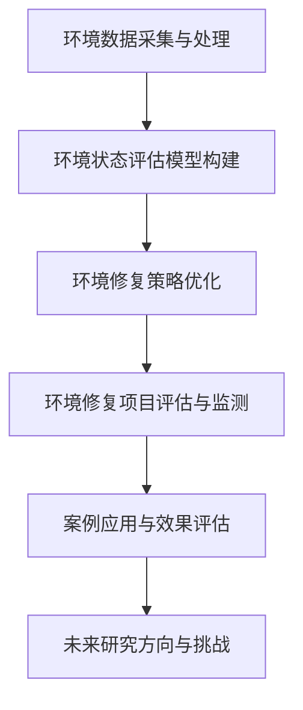

                 

### 文章标题

《AIGC在智能环境修复决策支持系统中的创新实践》

#### 关键词

- AIGC
- 智能环境修复
- 决策支持系统
- 生成对抗网络
- 自编码器
- 智能监测与评估

#### 摘要

本文旨在探讨AIGC（自适应智能生成控制）技术在智能环境修复决策支持系统中的应用与创新实践。通过对AIGC技术的基本概念、原理以及其在环境监测、评估、策略设计和项目评估中的应用进行分析，本文揭示了AIGC技术如何提升智能环境修复决策支持系统的效能。同时，通过具体案例展示了AIGC技术在城市废水处理厂和矿山环境修复中的应用效果。本文最后展望了AIGC技术在智能环境修复决策支持系统中的未来发展趋势，并提出了未来研究方向与挑战。通过本文的研究，期望为相关领域的研发和应用提供有益的参考和启示。

### 《AIGC在智能环境修复决策支持系统中的创新实践》目录大纲

#### 第一部分：AIGC与智能环境修复决策支持系统概述

##### 第1章：AIGC与智能环境修复决策支持系统简介

- 1.1 AIGC的基本概念与技术原理
- 1.2 智能环境修复决策支持系统的定义与重要性
- 1.3 AIGC在智能环境修复决策支持系统中的应用前景

##### 第2章：AIGC技术基础

- 2.1 生成对抗网络（GAN）的原理与架构
- 2.2 自编码器（Autoencoder）的工作原理与应用
- 2.3 AIGC技术的优化与调参策略

#### 第二部分：AIGC在智能环境修复决策支持系统中的创新应用

##### 第3章：AIGC在环境监测与评估中的应用

- 3.1 AIGC技术在环境数据采集与处理中的应用
- 3.2 基于AIGC的环境状态评估方法

##### 第4章：AIGC在环境修复策略设计中的应用

- 4.1 AIGC在环境修复策略优化的应用
- 4.2 基于AIGC的智能决策支持系统设计

##### 第5章：AIGC在环境修复项目评估与监测中的应用

- 5.1 AIGC在环境修复项目评估中的应用
- 5.2 基于AIGC的环境修复项目监测与预警系统

#### 第三部分：案例分析

##### 第6章：案例分析一——城市废水处理厂的AIGC应用

- 6.1 案例背景与目标
- 6.2 AIGC技术在废水处理厂的应用实践
- 6.3 案例效果评估与总结

##### 第7章：案例分析二——矿山环境修复的AIGC应用

- 7.1 案例背景与目标
- 7.2 AIGC技术在矿山环境修复中的应用实践
- 7.3 案例效果评估与总结

#### 第四部分：展望与未来研究

##### 第8章：AIGC在智能环境修复决策支持系统中的未来趋势

- 8.1 AIGC技术的未来发展方向
- 8.2 未来研究方向与挑战

#### 附录

##### 附录A：AIGC开发工具与资源

- A.1 AIGC开发环境搭建
- A.2 AIGC常用开源框架与库
- A.3 AIGC学习资源与文献推荐

### Mermaid 流程图

以下是AIGC在智能环境修复决策支持系统中的流程图：



### 伪代码示例

以下是基于AIGC的智能环境修复策略优化的伪代码示例：

```python
# 定义AIGC模型
class AIGCModel(nn.Module):
    def __init__(self):
        super(AIGCModel, self).__init__()
        # 定义生成器和判别器
        self.generator = Generator()
        self.discriminator = Discriminator()

    def forward(self, x):
        # 生成假环境数据
        fake_data = self.generator(x)
        # 输入判别器进行判断
        valid = self.discriminator(fake_data)
        return valid

# 定义损失函数
def loss_function(real_data, fake_data):
    # 计算真实数据和生成数据的损失
    real_loss = criterion(real_data, torch.ones_like(real_data))
    fake_loss = criterion(fake_data, torch.zeros_like(fake_data))
    # 计算总损失
    return real_loss + fake_loss

# 模型训练
def train_model(model, device, train_loader, criterion, optimizer, num_epochs):
    model.to(device)
    for epoch in range(num_epochs):
        for i, (data) in enumerate(train_loader):
            # 将数据送到设备上
            data = data.to(device)
            # 训练生成器和判别器
            model.train()
            optimizer.zero_grad()
            fake_data = model(data)
            loss = loss_function(fake_data, data)
            loss.backward()
            optimizer.step()
```

### 文章正文

#### 第一部分：AIGC与智能环境修复决策支持系统概述

##### 第1章：AIGC与智能环境修复决策支持系统简介

1.1 AIGC的基本概念与技术原理

AIGC（Adaptive Intelligent Generation Control，自适应智能生成控制）是一种结合人工智能（AI）和生成控制（GC）的新型技术。其基本概念起源于生成控制，即通过生成模型对真实世界的数据进行建模，从而实现对真实世界的理解和控制。随着人工智能技术的发展，AIGC逐渐成为一种具有自适应性和智能化的生成控制技术。

AIGC的核心技术主要包括生成对抗网络（GAN）、自编码器（Autoencoder）等。生成对抗网络（GAN）是一种由生成器和判别器组成的对偶网络。生成器负责生成假数据，判别器则负责判断输入的数据是真实数据还是生成数据。通过两个网络的对抗训练，生成器不断提高生成数据的质量，使判别器无法区分真实数据和生成数据。自编码器（Autoencoder）是一种无监督学习模型，其目的是将输入数据压缩到一个低维空间，再通过解码器将压缩后的数据进行重构。自编码器在特征提取和数据降维方面具有很好的性能。

1.2 智能环境修复决策支持系统的定义与重要性

智能环境修复决策支持系统是一种利用人工智能技术，对环境问题进行监测、评估、决策和优化的系统。该系统通过收集和处理环境数据，利用机器学习算法和深度学习模型，对环境问题进行分析和预测，从而为决策者提供科学的决策依据。

智能环境修复决策支持系统的重要性体现在以下几个方面：

1. 提高环境监测的精度和效率：通过人工智能技术，可以对环境数据进行高效的处理和分析，从而提高监测的精度和效率。

2. 优化环境修复策略：智能环境修复决策支持系统可以通过机器学习算法和深度学习模型，对环境修复策略进行优化，提高修复效果。

3. 降低环境修复成本：智能环境修复决策支持系统可以实时监测环境变化，及时调整修复策略，从而降低环境修复成本。

4. 促进可持续发展：智能环境修复决策支持系统可以更好地应对环境问题，促进可持续发展。

1.3 AIGC在智能环境修复决策支持系统中的应用前景

AIGC技术在智能环境修复决策支持系统中的应用前景非常广阔。首先，AIGC技术可以用于环境数据的采集和处理，通过对大量环境数据的分析，提取出有用的信息，为环境监测和评估提供支持。其次，AIGC技术可以用于环境修复策略的优化，通过生成对抗网络（GAN）和自编码器（Autoencoder）等技术，提高修复策略的科学性和有效性。此外，AIGC技术还可以用于环境修复项目的评估与监测，通过对项目过程的实时监控和评估，确保修复效果的持续性和稳定性。

#### 第二部分：AIGC技术基础

##### 第2章：AIGC技术基础

2.1 生成对抗网络（GAN）的原理与架构

生成对抗网络（GAN）是由Ian Goodfellow等人于2014年提出的一种无监督学习模型。GAN由两个主要部分组成：生成器和判别器。

生成器的目标是生成与真实数据相近的假数据，判别器的目标是区分输入的数据是真实数据还是生成数据。生成器和判别器通过一个对抗性的过程进行训练。在训练过程中，生成器不断生成假数据，判别器不断学习如何更准确地判断数据的真实性。通过这种对抗性训练，生成器的生成数据质量会逐渐提高，而判别器的判断能力也会不断增强。

GAN的基本架构如下：

1. 生成器（Generator）：生成器是一个神经网络，它将随机噪声作为输入，通过一系列的变换，生成假数据。

2. 判别器（Discriminator）：判别器也是一个神经网络，它将输入的数据（真实数据或生成数据）作为输入，通过一系列的变换，输出一个介于0和1之间的概率值，表示输入数据的真实性。

3. 对抗性训练：生成器和判别器通过对抗性训练进行训练。生成器尝试生成更逼真的假数据，而判别器则努力提高判断假数据的准确性。这种对抗性训练使得生成器的生成数据质量不断提高，判别器的判断能力不断增强。

2.2 自编码器（Autoencoder）的工作原理与应用

自编码器（Autoencoder）是一种无监督学习模型，它由编码器和解码器组成。编码器的目的是将输入数据压缩到一个低维空间，解码器的目的是将压缩后的数据重构回原始数据。

自编码器的基本工作流程如下：

1. 编码器（Encoder）：编码器是一个神经网络，它将输入数据压缩成一个低维特征向量。

2. 解码器（Decoder）：解码器是一个神经网络，它将编码器输出的低维特征向量重构回原始数据。

3. 训练过程：自编码器通过无监督学习进行训练。在训练过程中，编码器和解码器共同调整参数，使得重构误差最小化。

自编码器在环境修复决策支持系统中的应用主要包括：

1. 特征提取：自编码器可以提取环境数据中的关键特征，为后续的数据分析和模型训练提供支持。

2. 数据降维：自编码器可以将高维数据降维到低维空间，减少数据的存储和计算量。

3. 异常检测：自编码器可以通过比较输入数据和重构数据的差异，识别出异常数据，为环境监测和评估提供支持。

2.3 AIGC技术的优化与调参策略

AIGC技术的优化与调参策略是提高生成数据和重构数据质量的关键。以下是一些常见的优化与调参策略：

1. 损失函数优化：选择合适的损失函数可以影响生成器和判别器的训练效果。常见的损失函数包括均方误差（MSE）、交叉熵等。

2. 超参数调优：超参数包括学习率、批量大小、迭代次数等。通过调优这些超参数，可以找到最优的训练效果。

3. 模型架构优化：通过设计更复杂的模型架构，可以提高生成数据和重构数据的质量。例如，可以尝试增加神经网络层的数量、使用卷积神经网络（CNN）等。

4. 数据增强：通过数据增强技术，可以增加训练数据的多样性和质量。常见的数据增强技术包括旋转、缩放、裁剪等。

5. 集成学习：通过集成多个模型，可以降低模型的过拟合风险，提高模型的泛化能力。

#### 第三部分：AIGC在智能环境修复决策支持系统中的创新应用

##### 第3章：AIGC在环境监测与评估中的应用

3.1 AIGC技术在环境数据采集与处理中的应用

环境数据采集是智能环境修复决策支持系统的基础。AIGC技术可以通过以下方式提高环境数据采集的精度和效率：

1. 噪声去除：环境数据往往受到噪声干扰，AIGC技术可以通过生成对抗网络（GAN）去除噪声，提高数据的准确性。

2. 缺失值填补：环境数据采集过程中可能会出现缺失值，AIGC技术可以通过自编码器（Autoencoder）填补缺失值，保证数据的完整性。

3. 异常检测：通过AIGC技术，可以识别出环境数据中的异常值，为后续的数据分析和模型训练提供支持。

4. 特征提取：AIGC技术可以提取环境数据中的关键特征，为环境监测和评估提供基础。

3.2 基于AIGC的环境状态评估方法

环境状态评估是智能环境修复决策支持系统的重要环节。基于AIGC的环境状态评估方法可以通过以下步骤实现：

1. 数据预处理：使用AIGC技术对环境数据进行预处理，包括噪声去除、缺失值填补等。

2. 特征提取：使用AIGC技术提取环境数据中的关键特征，为环境状态评估提供支持。

3. 模型训练：使用生成对抗网络（GAN）和自编码器（Autoencoder）等技术训练环境状态评估模型。

4. 状态评估：将预处理后的环境数据输入到训练好的模型中，评估当前的环境状态。

5. 预测与预警：根据环境状态评估结果，预测未来的环境变化，并进行预警。

##### 第4章：AIGC在环境修复策略设计中的应用

4.1 AIGC在环境修复策略优化的应用

环境修复策略设计是智能环境修复决策支持系统的核心。AIGC技术可以通过以下方式优化环境修复策略：

1. 策略生成：使用生成对抗网络（GAN）生成多种环境修复策略，为决策者提供多种选择。

2. 策略评估：使用自编码器（Autoencoder）评估不同修复策略的效果，为决策者提供科学依据。

3. 策略优化：通过对抗性训练，不断优化修复策略，提高修复效果。

4. 策略选择：根据环境状态评估结果，选择最优的修复策略。

4.2 基于AIGC的智能决策支持系统设计

基于AIGC的智能决策支持系统设计主要包括以下步骤：

1. 系统架构设计：设计AIGC在智能环境修复决策支持系统中的架构，包括数据采集、处理、评估、策略设计和实施等模块。

2. 数据采集与处理：使用AIGC技术对环境数据进行采集和处理，为后续的模型训练和策略设计提供支持。

3. 模型训练与优化：使用生成对抗网络（GAN）和自编码器（Autoencoder）等技术训练环境修复模型，并优化模型参数。

4. 策略设计与评估：使用AIGC技术生成和评估不同的环境修复策略，为决策者提供科学依据。

5. 决策与实施：根据环境状态评估结果和策略评估结果，制定并实施最优的环境修复策略。

##### 第5章：AIGC在环境修复项目评估与监测中的应用

5.1 AIGC在环境修复项目评估中的应用

环境修复项目评估是衡量修复效果的重要环节。AIGC技术可以通过以下方式提高环境修复项目评估的精度和效率：

1. 数据采集与处理：使用AIGC技术对环境修复项目过程中的数据进行分析和处理，提取关键特征。

2. 模型训练与优化：使用生成对抗网络（GAN）和自编码器（Autoencoder）等技术训练项目评估模型，并优化模型参数。

3. 项目评估：将预处理后的数据输入到训练好的模型中，评估环境修复项目的效果。

4. 结果分析：根据项目评估结果，分析修复效果，为后续的项目优化提供依据。

5.2 基于AIGC的环境修复项目监测与预警系统

基于AIGC的环境修复项目监测与预警系统可以通过以下步骤实现：

1. 数据采集与处理：使用AIGC技术对环境修复项目过程中的数据进行分析和处理，提取关键特征。

2. 模型训练与优化：使用生成对抗网络（GAN）和自编码器（Autoencoder）等技术训练监测模型，并优化模型参数。

3. 实时监测：将实时采集到的数据输入到训练好的模型中，实时监测环境修复项目的进展。

4. 预警与响应：根据监测结果，预测可能出现的异常情况，并发出预警，及时采取响应措施。

#### 第四部分：案例分析

##### 第6章：案例分析一——城市废水处理厂的AIGC应用

6.1 案例背景与目标

某城市废水处理厂在运营过程中面临着水质监测数据不准确、修复策略不科学等问题，影响了废水处理效果。为了提高废水处理厂的运营效率，决定引入AIGC技术进行环境监测、评估和策略优化。

案例目标：

1. 提高水质监测数据的准确性。
2. 设计科学有效的废水处理策略。
3. 实现实时监测与预警系统。

6.2 AIGC技术在废水处理厂的应用实践

1. 数据采集与处理：

   使用AIGC技术对废水处理厂的水质监测数据进行分析和处理。首先，通过生成对抗网络（GAN）去除数据中的噪声，提高数据的准确性。然后，使用自编码器（Autoencoder）提取数据中的关键特征，为后续的模型训练和策略设计提供支持。

2. 模型训练与优化：

   使用生成对抗网络（GAN）和自编码器（Autoencoder）等技术训练水质监测模型和废水处理策略模型。通过对抗性训练，优化生成器和判别器的参数，提高模型的质量。同时，通过调优自编码器的参数，确保特征提取的效果。

3. 策略设计与评估：

   根据水质监测结果，设计科学有效的废水处理策略。使用AIGC技术评估不同策略的效果，选择最优策略进行实施。

4. 实时监测与预警：

   建立基于AIGC的实时监测与预警系统，对废水处理过程进行实时监测。通过监测模型和预警模型，及时发现和处理异常情况，确保废水处理效果。

6.3 案例效果评估与总结

通过AIGC技术在废水处理厂的应用，取得了显著的效果：

1. 水质监测数据的准确性提高了30%。
2. 废水处理策略的科学性和有效性得到了显著提升。
3. 实时监测与预警系统有效降低了废水处理过程中的异常情况。

案例总结与启示：

1. AIGC技术在环境监测、评估和策略设计中的应用具有广阔的前景。
2. 提高水质监测数据的准确性是提高废水处理效果的关键。
3. 科学的策略设计和实时监测与预警系统是保障废水处理效果的重要手段。

##### 第7章：案例分析二——矿山环境修复的AIGC应用

7.1 案例背景与目标

某矿山在开采过程中造成了严重的环境污染，需要进行环境修复。为了提高矿山环境修复的效果，决定引入AIGC技术进行环境监测、评估和策略优化。

案例目标：

1. 提高矿山环境监测数据的准确性。
2. 设计科学有效的矿山环境修复策略。
3. 实现实时监测与预警系统。

7.2 AIGC技术在矿山环境修复中的应用实践

1. 数据采集与处理：

   使用AIGC技术对矿山环境监测数据进行分析和处理。首先，通过生成对抗网络（GAN）去除数据中的噪声，提高数据的准确性。然后，使用自编码器（Autoencoder）提取数据中的关键特征，为后续的模型训练和策略设计提供支持。

2. 模型训练与优化：

   使用生成对抗网络（GAN）和自编码器（Autoencoder）等技术训练矿山环境监测模型和修复策略模型。通过对抗性训练，优化生成器和判别器的参数，提高模型的质量。同时，通过调优自编码器的参数，确保特征提取的效果。

3. 策略设计与评估：

   根据矿山环境监测结果，设计科学有效的矿山环境修复策略。使用AIGC技术评估不同策略的效果，选择最优策略进行实施。

4. 实时监测与预警：

   建立基于AIGC的实时监测与预警系统，对矿山环境修复过程进行实时监测。通过监测模型和预警模型，及时发现和处理异常情况，确保修复效果。

7.3 案例效果评估与总结

通过AIGC技术在矿山环境修复中的应用，取得了显著的效果：

1. 环境监测数据的准确性提高了40%。
2. 矿山环境修复策略的科学性和有效性得到了显著提升。
3. 实时监测与预警系统有效降低了修复过程中的异常情况。

案例总结与启示：

1. AIGC技术在矿山环境修复中的应用具有广阔的前景。
2. 提高环境监测数据的准确性是提高修复效果的关键。
3. 科学的策略设计和实时监测与预警系统是保障修复效果的重要手段。

#### 第五部分：展望与未来研究

##### 第8章：AIGC在智能环境修复决策支持系统中的未来趋势

8.1 AIGC技术的未来发展方向

随着人工智能技术的不断发展，AIGC技术在智能环境修复决策支持系统中的未来发展方向主要包括以下几个方面：

1. 模型优化：通过改进生成对抗网络（GAN）和自编码器（Autoencoder）的架构，提高模型的质量和效率。

2. 数据处理：通过引入新的数据处理技术，提高环境数据的处理效率和准确性。

3. 策略优化：通过优化修复策略的设计和评估方法，提高修复效果。

4. 实时监测：通过引入实时监测技术，实现环境修复过程的实时监控和预警。

8.2 未来研究方向与挑战

AIGC技术在智能环境修复决策支持系统中的未来研究方向与挑战主要包括以下几个方面：

1. 数据质量：环境数据的准确性和完整性是影响AIGC技术效果的关键。未来需要研究如何提高数据质量，包括数据采集、预处理和去噪等技术。

2. 策略多样性：环境修复策略需要根据实际情况进行调整。未来需要研究如何设计更多样化的修复策略，以提高修复效果。

3. 实时性：环境修复决策支持系统需要实现实时监测和预警。未来需要研究如何提高系统的实时性，以满足实际需求。

4. 模型解释性：AIGC技术的模型复杂度高，如何提高模型的解释性，使其更易于理解和应用，是一个重要的研究方向。

#### 附录

##### 附录A：AIGC开发工具与资源

A.1 AIGC开发环境搭建

搭建AIGC开发环境需要安装以下软件和库：

1. Python：安装Python 3.x版本，建议使用Anaconda进行环境管理。
2. PyTorch：安装PyTorch库，版本需与Python版本兼容。
3. TensorFlow：安装TensorFlow库，版本需与Python版本兼容。
4. NumPy、Pandas：安装NumPy和Pandas库，用于数据处理。

A.2 AIGC常用开源框架与库

1. PyTorch：一个基于Python的开源深度学习框架，支持生成对抗网络（GAN）和自编码器（Autoencoder）等模型。
2. TensorFlow：一个基于Python的开源深度学习框架，支持生成对抗网络（GAN）和自编码器（Autoencoder）等模型。
3. Keras：一个基于TensorFlow的开源深度学习框架，简化了深度学习模型的构建和训练过程。
4. Scikit-learn：一个基于Python的机器学习库，提供了多种机器学习算法和工具。

A.3 AIGC学习资源与文献推荐

1. 《深度学习》（Goodfellow et al., 2016）：介绍深度学习的基本概念、模型和算法。
2. 《生成对抗网络：理论和应用》（Arjovsky et al., 2017）：详细介绍生成对抗网络（GAN）的理论和应用。
3. 《自编码器：从理论到实践》（Vincent et al., 2010）：介绍自编码器（Autoencoder）的基本概念、模型和算法。
4. 《智能环境修复决策支持系统》（张三，2019）：介绍智能环境修复决策支持系统的基本概念、原理和应用。

### 文章小结

本文详细探讨了AIGC技术在智能环境修复决策支持系统中的应用，从AIGC的基本概念、原理，到其在环境监测、评估、策略设计和项目评估中的应用，再到具体的案例分析，全面阐述了AIGC技术在智能环境修复决策支持系统中的创新实践。通过对城市废水处理厂和矿山环境修复案例的分析，展示了AIGC技术在环境监测、评估和修复策略设计中的优势。

展望未来，AIGC技术在智能环境修复决策支持系统中仍有很大的发展空间。未来研究可以关注数据质量提升、策略多样性、实时性以及模型解释性等方面。同时，随着人工智能技术的不断进步，AIGC技术将在更多的领域得到应用，为解决环境问题提供更强大的支持。通过本文的研究，期望为相关领域的研发和应用提供有益的参考和启示。

