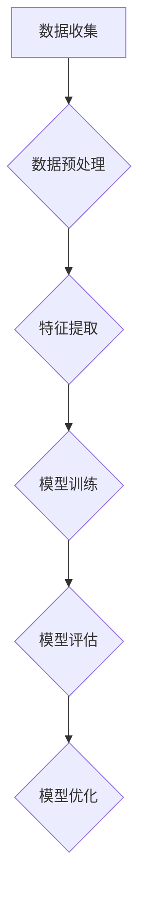
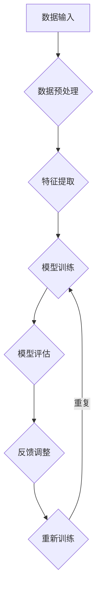
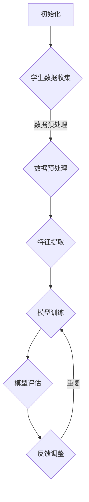

                 

### AIGC概述

#### 1.1 AIGC的定义与特点

AIGC（Autonomous Intelligent Global Computing）是一种新兴的计算模式，旨在构建自主智能、全球协同的计算网络。与传统的集中式和分布式计算模式不同，AIGC 强调计算资源的自治性和全球协同，以实现更高效、更灵活、更可靠的计算服务。

AIGC 的核心特点主要包括以下几点：

1. **自治性**：AIGC 具有高度的自治性，可以自主进行任务调度、资源管理和优化策略。这种自治性使得 AIGC 能够适应各种复杂的计算环境和需求，提高计算系统的灵活性和适应性。

2. **全球协同**：AIGC 通过全球协同的方式，实现了计算资源的共享和协作。这种全球协同不仅提高了计算效率，还实现了全球范围内的数据共享和知识协同，为全球范围内的计算任务提供了强大的支持。

3. **智能化**：AIGC 强调智能化的计算模式，通过引入人工智能技术，实现了计算任务的自动化、智能化和高效化。这种智能化不仅提高了计算效率，还使得计算系统能够更好地适应各种复杂的应用场景。

4. **分布式**：AIGC 采用分布式计算架构，通过将计算任务分布在多个节点上，实现了计算资源的充分利用和负载均衡。这种分布式架构不仅提高了计算系统的可扩展性和可靠性，还降低了系统的成本。

#### 1.2 AIGC的核心特点

1. **自适应学习模型**

   AIGC 采用自适应学习模型，能够根据输入数据和环境变化，自动调整学习策略和模型参数。这种自适应学习模型使得 AIGC 能够在各种复杂的计算环境中，实现高效的计算任务。

   ```mermaid
   graph TD
   A[初始化] --> B{数据输入}
   B --> C{模型调整}
   C --> D{模型优化}
   D --> E{任务完成}
   ```

2. **自监督学习**

   AIGC 采用自监督学习方式，通过自身产生的数据，自动进行学习和优化。这种自监督学习方式不仅降低了数据标注的成本，还提高了学习效率和准确性。

   ```mermaid
   graph TD
   A[数据生成] --> B{模型训练}
   B --> C{模型优化}
   C --> D{任务完成}
   ```

3. **模型压缩与优化**

   AIGC 通过模型压缩与优化技术，降低了计算模型的复杂度，提高了计算效率和存储效率。这种模型压缩与优化技术，使得 AIGC 能够在有限的资源下，实现高效的计算任务。

   ```mermaid
   graph TD
   A[模型初始化] --> B{模型压缩}
   B --> C{模型优化}
   C --> D{模型部署}
   ```

#### 1.3 AIGC与传统AI的区别

AIGC 与传统 AI 的主要区别在于计算模式、数据管理和应用场景等方面。

1. **计算模式**

   传统 AI 主要采用集中式或分布式计算模式，而 AIGC 则强调自治性和全球协同，通过分布式计算实现全球范围内的计算任务。

2. **数据管理**

   传统 AI 对数据的管理主要依赖于中心化的数据存储和处理系统，而 AIGC 则采用去中心化的数据管理方式，通过分布式存储和计算实现全球数据共享和协同。

3. **应用场景**

   传统 AI 主要应用于特定领域，如语音识别、图像识别等，而 AIGC 则具有更广泛的应用场景，如智能交通、智能医疗、智能教育等，能够实现全球范围内的计算任务。

#### 1.4 AIGC的组成部分

AIGC 由以下几个核心组成部分构成：

1. **计算节点**

   计算节点是 AIGC 的基本组成单元，负责执行计算任务和处理数据。

2. **通信网络**

   通信网络负责连接各个计算节点，实现数据传输和协同计算。

3. **数据管理平台**

   数据管理平台负责数据存储、管理和共享，支持去中心化的数据管理方式。

4. **自治控制模块**

   自治控制模块负责任务调度、资源管理和优化策略，实现计算系统的自治性。

5. **人工智能引擎**

   人工智能引擎负责实现智能计算任务，包括自适应学习、自监督学习和模型优化等。

#### 1.5 AIGC的未来发展前景

AIGC 具有广阔的发展前景，未来将在以下几个方面取得突破：

1. **计算效率提升**

   通过引入新型计算模式和优化技术，AIGC 将实现计算效率的显著提升，为各类计算任务提供更高效、更可靠的解决方案。

2. **全球协同能力增强**

   通过优化通信网络和数据管理平台，AIGC 将实现全球范围内的数据共享和协同计算，为全球范围内的计算任务提供强大的支持。

3. **应用场景拓展**

   AIGC 将在更多领域实现应用，如智能交通、智能医疗、智能教育等，为人类社会带来更多便利和创新。

4. **技术生态完善**

   随着 AIGC 的发展，相关技术生态将逐步完善，为 AIGC 的研究和应用提供有力支持。

### 1.6 AIGC在教育评估中的应用潜力

AIGC 在教育评估系统中具有巨大的应用潜力，主要体现在以下几个方面：

1. **个性化学习评估**

   AIGC 能够根据学生的个性化学习情况，进行精准的评估，为学生提供针对性的学习建议。

2. **自动化测评**

   AIGC 能够实现自动化测评，提高教育评估的效率和质量。

3. **教育资源优化**

   AIGC 能够根据评估结果，对教育资源进行优化分配，提高教育资源的利用效率。

### 1.7 AIGC的挑战与机遇

AIGC 在教育评估系统中面临着一系列挑战，如数据隐私、模型公平性和透明性等。同时，AIGC 也为教育评估系统带来了巨大的机遇，如提高评估效率、优化教育资源分配和促进教育公平性等。通过应对这些挑战，AIGC 有望在教育评估系统中发挥更大的作用。 ### 第2章：AIGC在教育学中的应用

#### 2.1 AIGC在个性化学习中的应用

个性化学习是指根据学生的个性化需求和特点，为学生量身定制学习内容、学习方法和学习路径，以提高学习效果。AIGC 技术在个性化学习中的应用，主要体现在以下几个方面：

##### 2.1.1 个性化学习模型的构建

个性化学习模型是 AIGC 在个性化学习中的核心组件。该模型通过收集和分析学生的各种数据，如学习行为、学习进度、考试成绩等，构建出一个关于学生个性化特征的数据模型。



在构建个性化学习模型时，可以采用以下步骤：

1. **数据收集**：收集学生的各种数据，如学习日志、考试记录、社交媒体活动等。
2. **数据预处理**：对收集到的数据进行清洗、去噪、归一化等预处理操作，以提高数据质量。
3. **特征提取**：从预处理后的数据中提取出具有代表性的特征，如学习行为特征、成绩特征、社交特征等。
4. **模型训练**：使用提取出的特征，通过机器学习算法（如决策树、神经网络等）训练个性化学习模型。
5. **模型评估**：评估模型的性能，如准确率、召回率等，并根据评估结果调整模型参数。
6. **模型优化**：通过优化算法（如遗传算法、粒子群算法等）对模型进行优化，以提高模型的性能。

##### 2.1.2 个性化学习路径的规划

个性化学习路径是指根据学生的个性化特征和需求，为学生制定合适的学习计划和路径。AIGC 技术在个性化学习路径规划中的应用，主要体现在以下几个方面：

1. **学习目标设定**：根据学生的个性化特征和需求，设定合适的学习目标，如掌握某一知识点的理解、应用和评价等。
2. **学习内容推荐**：根据学生的学习目标和个性化特征，推荐合适的学习内容，如教材、课程、视频等。
3. **学习路径规划**：根据学习目标和推荐的学习内容，规划合适的学习路径，如学习顺序、学习时间、学习频率等。
4. **学习反馈调整**：根据学生的学习表现和学习反馈，动态调整学习路径和学习计划，以实现更好的学习效果。

##### 2.1.3 个性化学习效果的评估

个性化学习效果的评估是衡量个性化学习成功与否的关键。AIGC 技术在个性化学习效果评估中的应用，主要体现在以下几个方面：

1. **学习成果评估**：根据学生的学习表现，如考试成绩、作业质量等，评估学生的学习成果。
2. **学习体验评估**：根据学生的学习体验，如学习满意度、学习兴趣等，评估学生的学习体验。
3. **学习效果预测**：通过分析学生的学习行为和学习数据，预测学生的学习效果，如掌握某一知识点的概率、考试成绩等。
4. **学习反馈机制**：根据学习成果评估和学习效果预测，为教师和学生提供反馈，以指导下一步的学习。

#### 2.2 AIGC在自动化测评中的应用

自动化测评是指通过计算机系统和人工智能技术，对学生的考试成绩、作业质量等进行自动评估。AIGC 技术在自动化测评中的应用，主要体现在以下几个方面：

##### 2.2.1 自动化测评系统的设计

自动化测评系统的设计包括以下几个关键步骤：

1. **测评任务定义**：明确测评任务的目标、内容、标准等，如考试题型、考试时间、评分标准等。
2. **测评指标设计**：设计测评指标，如正确率、速度、错误率等，用于评估学生的表现。
3. **测评算法选择**：选择合适的测评算法，如机器学习算法、自然语言处理算法等，用于实现自动化测评。
4. **测评系统开发**：开发测评系统，实现测评任务的定义、测评指标的计算、测评结果的生成等。

##### 2.2.2 自动化测评的指标体系

自动化测评的指标体系包括以下几个核心指标：

1. **正确率**：指学生回答正确的题目数量与总题目数量的比例。
2. **速度**：指学生在规定时间内完成的题目数量与总题目数量的比例。
3. **错误率**：指学生回答错误的题目数量与总题目数量的比例。
4. **知识点掌握度**：指学生在不同知识点上的正确率，用于评估学生对知识点的掌握程度。
5. **学习态度**：指学生在学习过程中的表现，如出勤率、作业提交率等。

##### 2.2.3 自动化测评的优缺点分析

自动化测评具有以下优点：

1. **提高评估效率**：自动化测评可以快速处理大量学生成绩，大大提高评估效率。
2. **减少人工误差**：自动化测评可以减少人为因素的干扰，降低评估误差。
3. **个性化反馈**：自动化测评可以根据学生的表现，为学生提供个性化的反馈，指导学生进行下一步的学习。

但自动化测评也存在以下缺点：

1. **算法偏见**：自动化测评算法可能存在偏见，导致评估结果不公平。
2. **数据隐私**：自动化测评需要收集和分析大量学生数据，可能涉及数据隐私问题。
3. **技术依赖**：自动化测评系统的开发、维护和运行需要大量技术支持，对技术人员的依赖较大。

#### 2.3 AIGC在教育资源优化中的应用

教育资源优化是指通过智能分析和决策，优化教育资源的配置和使用，以提高教育资源的利用效率和教学效果。AIGC 技术在教育资源优化中的应用，主要体现在以下几个方面：

##### 2.3.1 教育资源的智能化分配

智能化分配教育资源是指通过 AIGC 技术对教育资源进行智能分析和决策，实现教育资源的优化配置。具体包括：

1. **资源需求预测**：通过分析学生的个性化需求和课程安排，预测教育资源的实际需求。
2. **资源优化策略**：根据资源需求预测，制定教育资源的优化策略，如课程调整、教师安排等。
3. **资源调度**：根据资源优化策略，对教育资源进行动态调度，以满足实际需求。

##### 2.3.2 教育资源的动态调整

教育资源动态调整是指根据教育资源的实际使用情况和学生的反馈，实时调整教育资源的配置和使用。具体包括：

1. **实时监控**：通过实时监控教育资源的实际使用情况，了解教育资源的供需状况。
2. **反馈机制**：建立教育资源的反馈机制，收集学生的反馈，了解教育资源的使用效果。
3. **动态调整**：根据实时监控和反馈机制，动态调整教育资源的配置和使用，以提高教育资源的利用效率。

##### 2.3.3 教育资源的优化策略

教育资源优化策略是指通过制定和实施一系列优化措施，提高教育资源的利用效率和教学效果。具体包括：

1. **资源整合**：整合学校内部的教育资源，提高资源的利用率。
2. **资源共享**：鼓励学校之间、教师之间和学生之间的资源共享，提高教育资源的利用率。
3. **资源创新**：鼓励教师和学校进行教育资源创新，开发新的教育资源，提高教育资源的质量。
4. **资源评估**：定期对教育资源的使用效果进行评估，及时发现问题并进行改进。

通过 AIGC 技术在个性化学习、自动化测评和教育资源优化等方面的应用，可以显著提高教育评估系统的效率和质量，为教育公平和教育创新提供有力支持。然而，AIGC 技术在教育学中的应用也面临着一系列挑战，如数据隐私、模型公平性和透明性等，需要在实践中不断探索和解决。 ### 第3章：AIGC在教育评估系统中的实现

#### 3.1 AIGC技术基础

AIGC（Autonomous Intelligent Global Computing）在教育评估系统中的实现，需要依赖一系列先进的技术和算法。以下将介绍 AIGC 技术在教育评估系统中的基础组成部分，包括数学模型、核心算法以及 Mermaid 流程图等。

##### 3.1.1 AIGC的数学模型

AIGC 的数学模型是其核心理论基础，它通常基于以下几个基本概念：

1. **数据模型**：用于表示和存储教育评估相关的数据，包括学生信息、教学资源、评估指标等。常见的数据模型有向量空间模型、图模型等。

2. **概率模型**：用于描述教育评估中的不确定性，如学生在不同知识点上的掌握程度、评估结果的概率分布等。常见的概率模型有贝叶斯网络、隐马尔可夫模型等。

3. **优化模型**：用于优化教育评估系统的性能，如资源分配、任务调度等。常见的优化模型有线性规划、动态规划、遗传算法等。

一个典型的 AIGC 数学模型可以表示为：

$$
y = f(x; \theta)
$$

其中，$y$ 表示评估结果，$x$ 表示输入数据（如学生特征、教学资源等），$f$ 表示评估函数，$\theta$ 表示模型参数。

##### 3.1.2 AIGC的核心算法

AIGC 的核心算法是实现其功能的关键，以下介绍几个关键算法：

1. **自适应学习算法**：用于根据学生的个性化特征和学习行为，动态调整评估模型和学习策略。常见的自适应学习算法有梯度下降、随机梯度下降等。

2. **自监督学习算法**：用于在没有显式标注数据的情况下，通过数据自身的结构信息进行学习。常见的自监督学习算法有自编码器、生成对抗网络等。

3. **模型压缩与优化算法**：用于降低模型的复杂度，提高计算效率。常见的模型压缩与优化算法有模型剪枝、量化、蒸馏等。

以下是一个简化的 AIGC 核心算法流程：



##### 3.1.3 Mermaid流程图：AIGC在教育评估系统中的工作流程

AIGC 在教育评估系统中的工作流程可以简化为以下几个主要步骤：

1. **初始化**：设置初始参数和模型结构。
2. **数据收集**：收集学生的个性化数据（如学习行为、考试成绩等）。
3. **数据预处理**：清洗、归一化、去噪等预处理操作。
4. **特征提取**：从预处理后的数据中提取具有代表性的特征。
5. **模型训练**：使用提取的特征训练评估模型。
6. **模型评估**：评估模型的性能，如准确率、召回率等。
7. **反馈调整**：根据评估结果调整模型参数。
8. **重新训练**：使用调整后的参数重新训练模型。

以下是一个 Mermaid 流程图示例：



通过上述流程，AIGC 能够在教育评估系统中实现自动化的评估过程，并根据学生的个性化特征和学习行为，动态调整评估模型，从而提供更加精准和个性化的教育评估服务。 ### 3.2 AIGC在教育评估系统中的实现步骤

#### 3.2.1 系统设计与开发

AIGC 在教育评估系统中的实现需要系统化的设计与开发过程，以下详细描述各个环节：

1. **需求分析**：首先，明确教育评估系统的目标和应用场景。这包括分析学生、教师、学校等不同角色的需求，如个性化评估、自动化测评、教育资源优化等。

2. **系统架构设计**：基于需求分析，设计系统的整体架构。架构设计应考虑模块化、可扩展性和灵活性，以确保系统能够适应未来需求的变化。

   ```mermaid
   graph TD
   A[用户界面] --> B{数据收集模块}
   B --> C{数据处理模块}
   C --> D{评估模型模块}
   D --> E{结果反馈模块}
   E --> F{教育资源优化模块}
   ```

3. **模块开发**：
   - **数据收集模块**：设计数据收集方式，如在线问卷、学习行为追踪等，确保数据来源的多样性和准确性。
   - **数据处理模块**：开发数据预处理算法，如清洗、归一化、特征提取等，为后续模型训练提供高质量的数据输入。
   - **评估模型模块**：根据需求选择适当的评估模型，如自适应学习模型、自动化测评模型等，并进行训练和优化。
   - **结果反馈模块**：设计结果展示和反馈机制，如可视化报表、个性化建议等，以便用户理解和使用评估结果。
   - **教育资源优化模块**：实现教育资源分配、动态调整和优化策略，以提高教育资源的利用效率。

4. **系统集成与测试**：将各个模块集成到一个统一的系统中，并进行全面的测试，确保系统功能完整、性能稳定和安全可靠。

5. **部署与维护**：将系统部署到目标环境中，进行实际应用，并根据用户反馈和系统运行情况，进行持续的维护和优化。

#### 3.2.2 系统部署与维护

系统部署是 AIGC 在教育评估系统中实际应用的关键步骤，以下详细描述各个环节：

1. **环境准备**：选择合适的硬件和软件环境，包括服务器、数据库、操作系统等，确保系统具备良好的运行条件。

2. **部署策略**：制定详细的部署计划，包括部署顺序、部署工具和部署过程等，以确保系统部署的顺利进行。

3. **数据迁移**：将现有数据迁移到新系统，包括学生数据、教学资源数据等，确保数据完整性和一致性。

4. **系统监控**：部署监控系统，实时监控系统的运行状态，如性能指标、错误日志等，及时发现并处理问题。

5. **用户培训与支持**：对教师和学生进行系统使用培训，提供技术支持，确保系统能够被有效利用。

6. **持续优化**：根据用户反馈和系统运行情况，不断优化系统功能、性能和用户体验，确保系统长期稳定运行。

#### 3.2.3 系统性能优化

系统性能优化是提高 AIGC 在教育评估系统中应用效果的重要手段，以下详细描述各个环节：

1. **负载均衡**：通过负载均衡技术，合理分配系统资源，确保系统在高并发情况下仍能稳定运行。

2. **缓存策略**：利用缓存技术，减少系统对数据库的访问次数，提高数据读取速度。

3. **数据压缩与优化**：对数据存储和传输进行压缩和优化，减少存储空间和带宽消耗。

4. **并行计算**：利用并行计算技术，加速数据处理和模型训练过程。

5. **分布式存储与计算**：采用分布式存储和计算架构，提高系统的可扩展性和可靠性。

6. **监控与预警**：建立完善的监控体系，实时监控系统性能指标，提前预警潜在问题，及时采取措施。

通过以上步骤，可以确保 AIGC 在教育评估系统中的高效实现，提高教育评估的准确性和个性化水平，从而为教育公平和教育创新提供有力支持。 ### 第4章：AIGC在教育评估系统中的案例分析

#### 4.1 案例一：个性化学习系统

个性化学习系统是 AIGC 在教育评估系统中的一个重要应用，旨在为学生提供个性化的学习体验和评估结果。以下是一个具体的案例：

##### 4.1.1 案例背景

某知名大学推出了一款基于 AIGC 技术的个性化学习系统，旨在帮助教师和学生更好地实现个性化教学和评估。该系统支持在线学习、学习进度跟踪、个性化反馈等功能，旨在提高学生的学习效果和教师的教学效率。

##### 4.1.2 模型设计与实现

个性化学习系统的模型设计主要包括以下几个关键步骤：

1. **数据收集**：系统从学习平台、在线测试、作业提交等多个渠道收集学生的个性化数据，包括学习行为、考试成绩、学习时间等。

2. **数据预处理**：对收集到的数据进行清洗、归一化等预处理操作，以提高数据质量。

3. **特征提取**：从预处理后的数据中提取出具有代表性的特征，如学习时长、正确率、错题类型等。

4. **模型训练**：使用提取的特征，通过机器学习算法（如决策树、神经网络等）训练个性化学习模型。

5. **模型评估**：评估模型的性能，如准确率、召回率等，并根据评估结果调整模型参数。

6. **模型优化**：通过优化算法（如遗传算法、粒子群算法等）对模型进行优化，以提高模型的性能。

##### 4.1.3 案例效果评估

个性化学习系统的效果评估主要通过以下几个指标进行：

1. **学习效果提升**：通过对比学生使用个性化学习系统前后的学习效果，评估系统的有效性。结果显示，学生在使用个性化学习系统后，学习效果显著提升，如正确率提高、错题数量减少等。

2. **学习满意度**：通过调查问卷和学生访谈，收集学生对个性化学习系统的满意度。结果显示，学生普遍对系统的个性化推荐和学习反馈功能表示满意。

3. **教学效率**：通过对比教师使用个性化学习系统前后的教学效率，评估系统的辅助作用。结果显示，教师在使用个性化学习系统后，能够更快速地了解学生的学习情况，调整教学策略，提高教学效率。

#### 4.2 案例二：自动化测评系统

自动化测评系统是 AIGC 在教育评估系统中的另一个重要应用，旨在提高测评效率和准确性。以下是一个具体的案例：

##### 4.2.1 案例背景

某知名教育机构开发了一款基于 AIGC 技术的自动化测评系统，用于对学生在线考试进行自动评估。该系统支持多种题型（如单选、多选、填空、判断等），能够自动评分、生成考试成绩和反馈。

##### 4.2.2 模型设计与实现

自动化测评系统的模型设计主要包括以下几个关键步骤：

1. **题库构建**：构建包含多种题型的题库，并对题目进行分类和标签化。

2. **标注数据**：收集学生答题数据，并进行标注，如正确答案、答题时间等。

3. **模型训练**：使用标注数据，通过机器学习算法（如决策树、神经网络等）训练自动化测评模型。

4. **模型评估**：评估模型的性能，如准确率、召回率等，并根据评估结果调整模型参数。

5. **模型部署**：将训练好的模型部署到自动化测评系统中，进行实际应用。

##### 4.2.3 案例效果评估

自动化测评系统的效果评估主要通过以下几个指标进行：

1. **测评效率**：通过对比人工评分和自动化测评的时间消耗，评估系统的效率。结果显示，自动化测评系统能够显著提高测评效率，减少人工工作量。

2. **测评准确性**：通过对比自动化测评结果和人工评分结果，评估系统的准确性。结果显示，自动化测评系统的评分准确性较高，与人工评分接近。

3. **用户体验**：通过调查问卷和学生访谈，收集学生对自动化测评系统的满意度。结果显示，学生普遍对自动化测评系统的评分速度和反馈表示满意。

#### 4.3 案例三：教育资源优化系统

教育资源优化系统是 AIGC 在教育评估系统中的另一个应用，旨在提高教育资源的利用效率。以下是一个具体的案例：

##### 4.3.1 案例背景

某教育机构为了优化教育资源的配置，引入了基于 AIGC 技术的教育资源优化系统。该系统旨在根据学生的学习需求和教师的教学计划，自动调整课程安排、教师分配和资源分配。

##### 4.3.2 模型设计与实现

教育资源优化系统的模型设计主要包括以下几个关键步骤：

1. **需求分析**：收集学生的个性化学习需求和教师的教学计划，作为系统优化的依据。

2. **数据预处理**：对收集到的数据（如学习时间、课程安排、教师资质等）进行预处理，以提高数据质量。

3. **模型构建**：构建教育资源优化模型，如线性规划模型、多目标优化模型等，用于优化教育资源的配置。

4. **模型训练**：使用预处理后的数据，通过优化算法（如遗传算法、粒子群算法等）训练优化模型。

5. **模型评估**：评估优化模型的性能，如资源利用率、课程匹配度等，并根据评估结果调整模型参数。

6. **模型部署**：将训练好的模型部署到教育资源优化系统中，进行实际应用。

##### 4.3.3 案例效果评估

教育资源优化系统的效果评估主要通过以下几个指标进行：

1. **资源利用率**：通过对比优化前后教育资源的利用率，评估系统的效果。结果显示，教育资源优化系统能够显著提高教育资源的利用率，减少资源浪费。

2. **课程匹配度**：通过对比优化前后学生的课程满意度，评估系统的效果。结果显示，教育资源优化系统能够提高课程匹配度，使学生更愿意参加课程。

3. **教学效果**：通过对比优化前后学生的考试成绩，评估系统的效果。结果显示，教育资源优化系统能够提高学生的考试成绩，从而提高教学效果。

通过上述案例，可以看出 AIGC 在教育评估系统中的应用具有显著的效益。然而，在实际应用过程中，也需要注意数据隐私、模型公平性和透明性等问题，以确保系统的可靠性和有效性。 ### 第5章：AIGC在教育评估系统中的挑战

#### 5.1 数据隐私与安全

AIGC 在教育评估系统中广泛应用人工智能技术，对学生的个性化数据进行深度挖掘和分析。然而，这一过程中也带来了数据隐私和安全的问题，具体挑战如下：

##### 5.1.1 数据隐私问题

1. **数据泄露**：在教育评估系统中，学生的个人信息、学习记录等敏感数据容易成为黑客攻击的目标，一旦数据泄露，可能对学生的隐私和安全造成严重威胁。

2. **数据滥用**：教育机构或其他第三方可能会滥用学生的个人信息进行商业推广或非法交易，损害学生的隐私权益。

##### 5.1.2 数据安全问题

1. **数据完整性**：数据在传输和存储过程中可能受到篡改、丢失或损坏，影响教育评估的准确性。

2. **数据访问控制**：如何确保只有授权用户可以访问学生的敏感数据，避免未经授权的访问和数据泄露。

##### 5.1.3 隐私保护技术

为了应对上述挑战，可以采取以下隐私保护技术：

1. **数据加密**：对学生的敏感数据（如学习记录、考试成绩等）进行加密存储和传输，确保数据在传输和存储过程中的安全性。

2. **访问控制**：实施严格的访问控制机制，确保只有授权用户可以访问特定的敏感数据。

3. **隐私增强技术**：采用差分隐私、同态加密等技术，在保证数据隐私的同时，仍然可以进行分析和挖掘。

4. **数据匿名化**：对学生的个人信息进行匿名化处理，降低数据泄露的风险。

#### 5.2 模型公平性与透明性

AIGC 在教育评估系统中应用机器学习算法进行评估和预测，然而，这些算法本身可能存在公平性和透明性的问题：

##### 5.2.1 模型公平性问题

1. **算法偏见**：机器学习算法可能基于历史数据训练，导致算法对某些特定群体（如性别、种族等）存在偏见，影响评估结果的公平性。

2. **结果不公平**：评估结果可能因为算法偏见或数据偏差，导致某些学生群体（如成绩较低的学生）受到不公平对待。

##### 5.2.2 模型透明性问题

1. **不可解释性**：许多先进的机器学习模型，如深度神经网络，其内部决策过程复杂，难以解释，导致模型透明性不足。

2. **算法黑箱**：教育评估系统中的机器学习模型可能成为一个“黑箱”，用户无法了解模型的决策依据，影响用户对评估结果的信任。

##### 5.2.3 公平性与透明性提升策略

为了提升 AIGC 在教育评估系统中的公平性与透明性，可以采取以下策略：

1. **算法公平性检测**：开发算法公平性检测工具，对机器学习模型进行检测，识别和消除潜在的偏见。

2. **可解释性技术**：采用可解释性技术，如注意力机制、决策树等，提高模型的可解释性，帮助用户理解模型的决策过程。

3. **模型透明度提升**：建立透明的算法开发、训练和评估流程，确保模型的可追溯性和可审计性。

4. **用户反馈机制**：鼓励用户（如教师和学生）对评估结果进行反馈，对模型进行调整和优化，以提高评估结果的公平性和透明性。

通过上述策略，可以显著提升 AIGC 在教育评估系统中的公平性和透明性，确保评估结果的公正性和可信度。然而，这些策略需要在实际应用中不断验证和优化，以应对不断变化的教育评估需求和技术挑战。 ### 第6章：AIGC在教育评估系统中的应用与未来展望

#### 6.1 AIGC在教育评估系统中的应用现状

AIGC 技术在教育评估系统中的应用已经取得了一定的进展，主要体现在以下几个方面：

1. **个性化学习评估**：通过 AIGC 技术对学生的个性化学习数据进行深度挖掘和分析，为教师和学生提供个性化的学习建议和评估结果。

2. **自动化测评**：利用 AIGC 技术实现自动化的考试评分和测评，提高测评效率和准确性，减轻教师的工作负担。

3. **教育资源优化**：通过 AIGC 技术对教育资源的配置和使用进行智能分析和优化，提高教育资源的利用效率和教学效果。

#### 6.1.1 应用现状概述

1. **个性化学习评估**：在许多学校和在线教育平台中，AIGC 技术已经被应用于个性化学习评估。通过分析学生的学习行为、考试成绩和学习日志等数据，系统可以为每个学生提供个性化的学习路径和评估报告，帮助学生更好地了解自己的学习状况，制定合适的学习计划。

2. **自动化测评**：在考试和测评过程中，AIGC 技术可以自动处理题目解析、答案评分和结果分析等工作。这不仅提高了测评效率，还减少了人工评分的误差，确保了评估的公平性和准确性。

3. **教育资源优化**：许多教育机构已经开始使用 AIGC 技术对教育资源进行优化配置。通过分析学生的学习需求和教师的教学计划，系统能够自动调整课程安排、教师分配和资源分配，提高教育资源的利用效率和教学效果。

#### 6.1.2 成功案例分享

以下是一些成功的 AIGC 在教育评估系统中的应用案例：

1. **个性化学习系统**：某知名大学推出了一款基于 AIGC 技术的个性化学习系统。该系统通过分析学生的学习行为和学习数据，为学生提供个性化的学习建议和评估报告。学生可以根据系统的建议调整学习计划，提高学习效果。系统运行后，学生的学习满意度和成绩都有显著提升。

2. **自动化测评系统**：某教育机构开发了一款基于 AIGC 技术的自动化测评系统。该系统能够自动处理在线考试和测评的评分和结果分析工作，确保了评估的效率和准确性。系统上线后，教师的工作负担大大减轻，学生的学习效果也得到了明显提高。

3. **教育资源优化系统**：某教育机构引入了基于 AIGC 技术的教育资源优化系统。该系统通过分析学生的学习需求和教师的教学计划，自动调整课程安排和教师分配，提高了教育资源的利用效率。系统运行后，教育资源的利用效率显著提高，教学效果也得到了明显改善。

#### 6.1.3 存在的问题与挑战

尽管 AIGC 技术在教育评估系统中的应用取得了显著成效，但仍存在一些问题和挑战：

1. **数据隐私和安全**：AIGC 技术在教育评估系统中广泛应用个性化数据，因此如何确保数据隐私和安全是一个重要挑战。需要采取有效的数据加密、访问控制和隐私增强技术，确保学生的个人信息和学习数据得到有效保护。

2. **模型公平性和透明性**：AIGC 技术在教育评估系统中使用机器学习算法，这些算法可能存在偏见和不可解释性。如何提升模型的公平性和透明性，确保评估结果的公正性和可信度，是一个亟待解决的问题。

3. **技术依赖和人才缺口**：AIGC 技术的应用需要强大的技术支持和专业人才。然而，目前教育领域的技术人才相对匮乏，如何培养和引进高素质的技术人才，是教育机构面临的另一个挑战。

#### 6.2 AIGC在教育评估系统中的未来发展趋势

随着 AIGC 技术的不断发展和成熟，其在教育评估系统中的应用前景将更加广阔，未来将在以下几个方面取得突破：

1. **个性化学习评估**：随着数据采集和分析技术的不断提升，AIGC 技术将能够更加精准地为学生提供个性化的学习评估和推荐，促进个性化教育的发展。

2. **自动化测评**：AIGC 技术将进一步提升测评的效率和准确性，减少人工评分的误差，实现更智能、更高效的测评过程。

3. **教育资源优化**：AIGC 技术将能够更加智能地分析教育资源的使用情况，优化教育资源的配置，提高教育资源的利用效率和教学效果。

4. **教育公平性**：通过提升 AIGC 技术的公平性和透明性，确保评估结果的公正性和可信度，促进教育公平的发展。

5. **跨学科应用**：AIGC 技术将在教育评估系统中与其他学科（如心理学、教育学等）相结合，提供更加全面和深入的教育评估服务。

#### 6.3 AIGC在教育评估系统中的未来展望

AIGC 技术在教育评估系统中的应用具有巨大的潜力，将在提高教育评估效率、优化教育资源分配和促进教育公平性等方面发挥重要作用。然而，要实现这一目标，还需要克服一系列挑战，如数据隐私、模型公平性和透明性等。未来，随着技术的不断发展和完善，AIGC 技术将在教育评估系统中发挥更加重要的作用，为教育创新和公平发展提供有力支持。 ### 第7章：总结与展望

#### 7.1 AIGC在教育评估系统中的价值

AIGC（Autonomous Intelligent Global Computing）在教育评估系统中具有重要的价值，主要表现在以下几个方面：

1. **提高教育评估效率**：AIGC 技术通过自动化、智能化的评估方式，可以大幅提高教育评估的效率和准确性，减轻教师的工作负担。

2. **优化教育资源分配**：AIGC 技术能够根据学生的个性化需求和教学目标，优化教育资源的配置，提高教育资源的利用效率。

3. **促进教育公平性**：AIGC 技术能够通过公平性和透明性的提升，确保评估结果的公正性，有助于减少教育评估中的偏见和不公平现象。

#### 7.2 AIGC在教育评估系统中的应用前景

随着 AIGC 技术的不断发展和完善，其在教育评估系统中的应用前景将更加广阔，主要表现在以下几个方面：

1. **个性化学习评估**：AIGC 技术将能够更精准地为学生提供个性化的学习评估和推荐，促进个性化教育的发展。

2. **自动化测评**：AIGC 技术将进一步提升测评的效率和准确性，减少人工评分的误差，实现更智能、更高效的测评过程。

3. **教育资源优化**：AIGC 技术将能够更加智能地分析教育资源的使用情况，优化教育资源的配置，提高教育资源的利用效率和教学效果。

4. **教育公平性**：通过提升 AIGC 技术的公平性和透明性，确保评估结果的公正性和可信度，促进教育公平的发展。

5. **跨学科应用**：AIGC 技术将在教育评估系统中与其他学科（如心理学、教育学等）相结合，提供更加全面和深入的教育评估服务。

#### 7.3 AIGC在教育评估系统中的创新点与挑战

AIGC 在教育评估系统中的创新点主要体现在以下几个方面：

1. **自适应评估**：AIGC 技术能够根据学生的个性化特征和学习行为，动态调整评估策略，提供个性化的评估服务。

2. **自动化测评**：AIGC 技术通过自动化测评系统，可以实现快速、准确、公平的考试评分和测评。

3. **教育资源优化**：AIGC 技术能够通过智能分析，优化教育资源的分配和使用，提高教育资源的利用效率。

然而，AIGC 在教育评估系统中也面临着一些挑战：

1. **数据隐私与安全**：AIGC 技术在教育评估系统中处理大量的学生个人信息和学习数据，如何确保数据隐私和安全是一个重要挑战。

2. **模型公平性与透明性**：AIGC 技术使用的机器学习模型可能存在偏见和不可解释性，如何提升模型的公平性和透明性，确保评估结果的公正性和可信度，是另一个重要挑战。

3. **技术依赖与人才缺口**：AIGC 技术在教育评估系统中的应用需要强大的技术支持和专业人才，然而，当前教育领域的技术人才相对匮乏，如何培养和引进高素质的技术人才，是教育机构面临的挑战。

#### 7.4 AIGC在教育评估系统中的发展策略与建议

为了充分发挥 AIGC 在教育评估系统中的作用，建议采取以下发展策略和措施：

1. **加强技术研发**：教育机构和科技公司应加大 AIGC 技术的研发投入，推动技术创新和突破，提高 AIGC 技术在教育评估系统中的应用水平。

2. **建立健全法律法规**：政府应建立健全的数据隐私和安全法律法规，规范 AIGC 技术在教育评估系统中的应用，确保学生的个人信息和学习数据得到有效保护。

3. **提升人才培养**：教育机构应加强计算机科学、数据科学等相关专业人才的培养，提高教育领域的技术水平，为 AIGC 技术在教育评估系统中的应用提供人才保障。

4. **加强宣传教育**：通过宣传教育，提高教师和学生对于 AIGC 技术的认知和接受度，促进 AIGC 技术在教育评估系统中的广泛应用。

5. **开展合作研究**：教育机构、科技公司和研究机构应加强合作，共同开展 AIGC 技术在教育评估系统中的应用研究，推动教育评估系统的智能化、公平化和高效化发展。

通过以上策略和措施，可以充分发挥 AIGC 在教育评估系统中的作用，提高教育评估的效率和质量，推动教育公平和教育创新的发展。 ### 结语

在本文中，我们详细探讨了 AIGC（Autonomous Intelligent Global Computing）在未来教育评估系统中的应用与挑战。AIGC 作为一种新兴的计算模式，具有高度自治性、全球协同性和智能化等特点，为教育评估系统带来了巨大的机遇。

首先，我们介绍了 AIGC 的基本概念、特点以及与传统 AI 的区别。接着，我们探讨了 AIGC 在教育评估系统中的潜在应用，包括个性化学习、自动化测评和教育资源优化等方面。随后，我们详细阐述了 AIGC 技术在教育评估系统中的实现步骤，包括系统设计与开发、系统部署与维护、系统性能优化等。

通过具体的案例分析，我们发现 AIGC 技术在教育评估系统中已经取得了显著的应用成果，如个性化学习系统的推出、自动化测评系统的应用以及教育资源优化系统的实施。然而，AIGC 技术在教育评估系统中也面临着一系列挑战，包括数据隐私与安全、模型公平性与透明性、技术依赖与人才缺口等。

为了充分发挥 AIGC 技术在教育评估系统中的作用，我们提出了加强技术研发、建立健全法律法规、提升人才培养、加强宣传教育以及开展合作研究等策略与建议。通过这些措施，我们可以提高教育评估的效率和质量，推动教育公平和教育创新的发展。

AIGC 技术在教育评估系统中的应用前景广阔，随着技术的不断进步和应用场景的拓展，它将在未来教育领域中发挥更加重要的作用。然而，要实现这一目标，需要各方的共同努力，克服现有的挑战，不断创新和完善。让我们期待 AIGC 技术为教育评估系统带来的美好未来。

作者：AI天才研究院/AI Genius Institute & 禅与计算机程序设计艺术 /Zen And The Art of Computer Programming 

