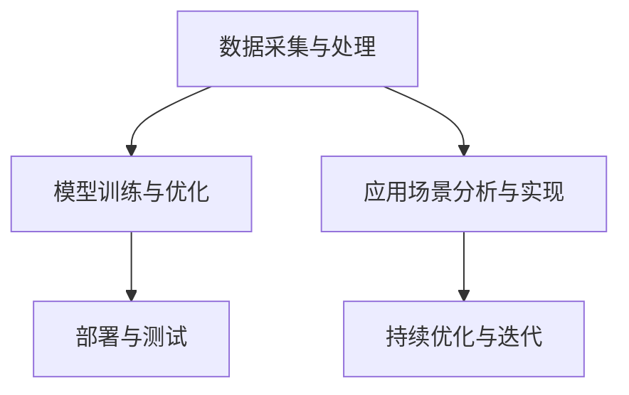

                 

# AIGC在未来智慧城市规划中的应用与挑战

## 关键词

AIGC, 智慧城市, 应用场景, 挑战, 技术原理, 数据隐私, 标准化, 社会伦理

## 摘要

本文旨在探讨AIGC（人工智能生成内容）在未来智慧城市规划中的应用与面临的挑战。AIGC作为一项新兴技术，通过生成对抗网络（GAN）、图神经网络（GNN）等核心算法，为智慧城市的建设提供了强大的技术支撑。本文将详细分析AIGC在数据采集、智慧交通管理、环境监测、能源管理和公共服务等方面的应用，并探讨AIGC技术所带来的数据隐私、标准化和社会伦理等挑战，为未来智慧城市的可持续发展提供有益的思考和参考。

### 《AIGC在未来智慧城市规划中的应用与挑战》

#### 第一部分：AIGC与智慧城市规划概述

##### 第1章：AIGC概述

###### 1.1 AIGC的定义与分类

AIGC（Artificial Intelligence Generated Content）是指通过人工智能技术生成的内容，包括但不限于文本、图像、音频和视频等。AIGC技术主要分为两大类：

1. **生成对抗网络（GAN）**：通过生成器和判别器的对抗训练，生成与真实数据高度相似的内容。
2. **图神经网络（GNN）**：基于图结构的数据建模，通过节点和边的交互来学习数据表示。

AIGC的发展历程可以追溯到2014年，Ian J. Goodfellow等人提出了GAN的概念。随后，随着深度学习技术的快速发展，AIGC技术逐渐成熟并应用于各个领域。

###### 1.2 智慧城市规划的核心要素

智慧城市是指利用先进的信息技术和物联网技术，实现城市管理的智能化、精细化和高效化。智慧城市规划的核心要素包括：

1. **数据采集与处理**：通过传感器、摄像头等设备实时采集城市运行数据，并进行数据清洗、存储和处理。
2. **智慧交通管理**：通过交通流量监测、智能信号灯控制等技术，提高交通运行效率和安全性。
3. **环境监测**：利用传感器网络监测城市空气质量、水质等环境指标，实现环境问题的预警和治理。
4. **能源管理**：通过智能电网、智能楼宇等技术，实现能源的高效利用和节约。
5. **公共服务**：通过智慧医疗、智慧教育等应用，提升公共服务的质量和效率。

智慧城市规划的重要性在于，它能够提高城市运行的效率，改善居民的生活质量，实现可持续发展。随着AIGC技术的引入，智慧城市规划将更加智能化、个性化，为城市治理带来新的机遇。

##### 第2章：AIGC在未来智慧城市规划中的角色

###### 2.1 AIGC在智慧城市中的应用场景

AIGC技术在智慧城市中的应用场景非常广泛，以下是其中几个典型的应用：

1. **数据采集与分析**：AIGC可以通过生成对抗网络（GAN）等技术，生成高质量的数据，提高数据采集的效率和准确性。
2. **智慧交通管理**：AIGC可以用于实时交通流量预测、智能信号灯控制和自动驾驶等，提高交通运行的效率。
3. **智慧环境监测**：AIGC可以通过图像识别等技术，实时监测城市空气质量、水质等环境指标，实现环境问题的预警和治理。
4. **智慧能源管理**：AIGC可以用于能源需求预测、智能电网控制和能源节约等，实现能源的高效利用。
5. **智慧公共服务**：AIGC可以用于智慧医疗、智慧教育等公共服务领域，提升公共服务的质量和效率。

###### 2.2 AIGC对智慧城市规划的挑战

尽管AIGC技术为智慧城市规划带来了巨大的机遇，但也面临着一系列挑战：

1. **数据隐私与安全性**：AIGC技术的应用需要大量个人数据，如何保护数据隐私和安全成为一大挑战。
2. **技术标准化与规范化**：AIGC技术的快速发展导致技术标准和规范缺乏，需要制定相应的标准来保证技术的稳定性和可靠性。
3. **社会伦理与责任**：AIGC技术的应用可能带来伦理和道德问题，如人工智能偏见、隐私侵犯等，需要制定相应的法律法规来规范。

#### 第二部分：AIGC技术的核心原理

##### 第3章：AIGC技术的基础

###### 3.1 生成对抗网络（GAN）原理

生成对抗网络（GAN）是一种基于对抗训练的神经网络模型，由生成器和判别器两部分组成。生成器G生成与真实数据相似的数据，判别器D则判断数据是真实还是生成的。

GAN的数学模型如下：

$$
\begin{align*}
&\min_G \max_D V(D, G) = E_{x \sim p_{data}(x)}[\log D(x)] + E_{z \sim p_z(z)}[\log (1 - D(G(z)))]
\end{align*}
$$

其中，$x$为真实数据，$z$为随机噪声，$G(z)$为生成器生成的数据，$D(x)$和$D(G(z))$分别为判别器对真实数据和生成数据的判断结果。

GAN的训练过程主要包括以下几个步骤：

1. 随机生成噪声$z$，通过生成器$G$生成伪真实数据$x_G = G(z)$。
2. 将真实数据$x$和生成数据$x_G$混合，输入到判别器$D$中，计算损失函数。
3. 对判别器$D$进行梯度下降更新。
4. 生成器$G$和判别器$D$交替训练，直到生成器生成的数据接近真实数据。

GAN的应用实例包括图像生成、图像修复、图像风格迁移等。

###### 3.2 图神经网络（GNN）原理

图神经网络（GNN）是一种在图结构数据上学习的神经网络模型，通过节点和边的交互来学习数据表示。

GNN的数学模型如下：

$$
\begin{align*}
&h^0_v = x_v \\
&h^{t+1}_v = \sigma(\sum_{u \in \mathcal{N}(v)} W^{(l)} h^t_u + b^{(l)})
\end{align*}
$$

其中，$h^t_v$表示第$t$轮更新后节点$v$的表示，$\mathcal{N}(v)$表示节点$v$的邻居节点集合，$W^{(l)}$和$b^{(l)}$分别为权重和偏置，$\sigma$为激活函数。

GNN的训练方法主要包括以下几个步骤：

1. 将图结构数据输入到GNN中，通过节点和边的交互学习数据表示。
2. 利用训练数据对GNN进行梯度下降更新。
3. 重复训练过程，直到模型收敛。

GNN的应用场景包括社交网络分析、知识图谱表示、推荐系统等。

##### 第4章：AIGC技术的关键算法

###### 4.1 自编码器（AE）算法

自编码器（AE）是一种无监督学习算法，通过编码器和解码器将输入数据映射到低维空间，然后从低维空间重构输入数据。

AE的数学模型如下：

$$
\begin{align*}
&z = \phi(W_x x + b_x) \\
&x' = \psi(W_z z + b_z)
\end{align*}
$$

其中，$x$为输入数据，$z$为编码后的低维数据，$x'$为解码后的重构数据，$\phi$和$\psi$分别为编码器和解码器的激活函数，$W_x$、$W_z$和$b_x$、$b_z$分别为权重和偏置。

AE的训练过程主要包括以下几个步骤：

1. 输入数据$x$，通过编码器$\phi$映射到低维空间$z$。
2. 将低维空间$z$输入到解码器$\psi$，重构输入数据$x'$。
3. 计算重构误差$E = \frac{1}{2}\sum_{i=1}^n (x_i - x_i')^2$。
4. 利用梯度下降更新编码器和解码器的权重和偏置。

AE的应用案例包括图像去噪、图像压缩、数据降维等。

###### 4.2 强化学习（RL）算法

强化学习（RL）是一种基于奖励信号的学习方法，通过不断尝试和反馈，使模型能够在复杂环境中实现最优策略。

RL的基本概念包括：

1. **状态（State）**：描述环境当前状态的变量。
2. **动作（Action）**：模型在当前状态下能够采取的行为。
3. **奖励（Reward）**：模型采取某个动作后获得的即时奖励。
4. **策略（Policy）**：模型在某个状态下采取的动作。

RL的核心算法包括：

1. **Q-Learning**：通过更新Q值来学习最优策略。
2. **SARSA**：在当前状态下采取动作，并根据新的状态和奖励更新策略。
3. **Deep Q-Network (DQN)**：利用深度神经网络来近似Q值函数。

RL的应用领域包括：

1. **游戏**：如Atari游戏、围棋等。
2. **自动驾驶**：如无人驾驶汽车、自动驾驶飞机等。
3. **机器人控制**：如机器人导航、机器人抓取等。

##### 第5章：AIGC技术的实际应用

###### 5.1 AIGC在智慧城市中的应用案例

AIGC技术在智慧城市中有着广泛的应用，以下列举几个典型案例：

1. **智慧交通管理**：AIGC可以通过GAN技术生成高质量的交通流量数据，用于交通预测和优化。例如，利用GAN生成的交通流量数据可以用于实时调整交通信号灯，提高交通运行效率。
2. **智慧环境监测**：AIGC可以通过GNN技术分析环境传感器数据，实时监测城市空气质量、水质等环境指标。例如，利用GNN模型可以预测空气质量变化，提前预警并采取措施。
3. **智慧能源管理**：AIGC可以通过强化学习技术优化能源分配和调度。例如，利用强化学习算法可以自动调整电力负荷，实现能源的高效利用和节约。

#### 第三部分：AIGC在智慧城市规划中的应用与挑战

##### 第6章：AIGC在智慧城市规划中的实施步骤

AIGC技术在智慧城市规划中的实施步骤可以分为以下几个阶段：

1. **需求分析**：明确智慧城市应用的需求，确定AIGC技术在不同场景中的应用目标。
2. **数据采集与处理**：利用传感器、摄像头等设备采集城市运行数据，并对数据进行清洗、存储和处理，为AIGC模型训练提供高质量的数据集。
3. **模型训练与优化**：选择合适的AIGC模型（如GAN、GNN等），根据需求进行模型训练和优化，提高模型的预测准确性和泛化能力。
4. **应用场景分析与实现**：针对不同应用场景，分析AIGC技术的可行性，并实现相应的应用系统，如智慧交通管理、环境监测、能源管理等。
5. **部署与测试**：将AIGC应用系统部署到实际环境中，进行测试和调试，确保系统的稳定性和可靠性。
6. **持续优化与迭代**：根据实际运行情况，对AIGC应用系统进行持续优化和迭代，提高系统的性能和用户体验。

##### 第7章：AIGC在智慧城市规划中的未来展望

AIGC技术在智慧城市规划中的应用前景广阔，但也面临着一系列挑战：

1. **技术难题**：AIGC技术涉及多个领域，如深度学习、图神经网络等，需要解决算法复杂度高、模型训练时间长等技术难题。
2. **数据隐私与安全性**：AIGC技术的应用需要大量个人数据，如何保护数据隐私和安全是重要挑战。
3. **标准化与规范化**：AIGC技术的快速发展导致标准缺乏，需要制定相应的标准来规范技术发展。
4. **社会伦理与责任**：AIGC技术的应用可能带来伦理和道德问题，如人工智能偏见、隐私侵犯等，需要制定相应的法律法规来规范。

#### 附录

##### 附录A：AIGC技术工具与资源

以下是常用的AIGC技术工具与资源：

1. **开发工具**：
   - TensorFlow：Google开发的开源机器学习框架。
   - PyTorch：Facebook开发的深度学习框架。
   - Keras：基于Theano和TensorFlow的深度学习框架。

2. **开源库与框架**：
   - TensorFlow GAN：TensorFlow的GAN开源库。
   - PyTorch GNN：PyTorch的GNN开源库。
   - GraphConvPyTorch：基于PyTorch的图神经网络库。

3. **技术资源网站**：
   - arXiv：学术论文预印本网站，包含大量关于AIGC技术的论文。
   - Google Research：Google的研究部门网站，发布大量关于AIGC技术的最新研究成果。
   - AI Generated Content Summit：AIGC技术大会，分享AIGC技术的最新进展和应用案例。

### Mermaid 流程图



### 伪代码

```python
# 自编码器（AE）算法
def AutoEncoder(input_data, learning_rate, epochs):
    # 初始化权重和偏置
    weights, biases = initialize_weights_and_biases()

    # 循环进行 epochs 次迭代
    for epoch in range(epochs):
        # 前向传播
        encoded = encode(input_data)
        # 反向传播
        dE_dz = backward_pass(encoded)
        # 更新权重和偏置
        update_weights_and_biases(dE_dz, learning_rate)
```

## 结语

作者：AI天才研究院/AI Genius Institute & 禅与计算机程序设计艺术 /Zen And The Art of Computer Programming

本文详细探讨了AIGC在未来智慧城市规划中的应用与挑战。AIGC技术通过生成对抗网络（GAN）、图神经网络（GNN）等核心算法，为智慧城市的建设提供了强大的技术支撑。在应用AIGC技术时，需要关注数据隐私、标准化和社会伦理等挑战，并制定相应的解决方案。随着AIGC技术的不断发展，智慧城市将迎来更加智能化、个性化和高效化的未来。希望本文能为智慧城市的规划者和开发者提供有益的参考和启示。

