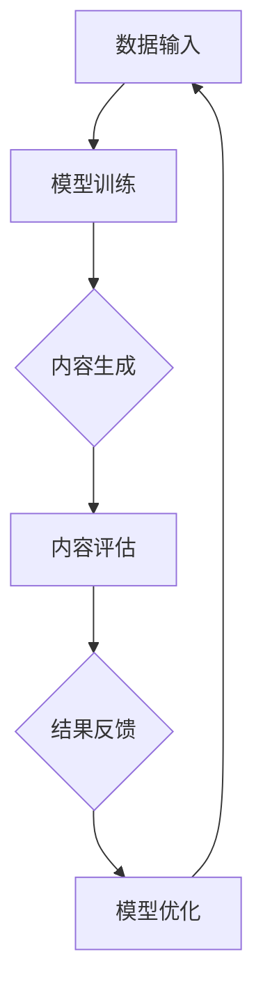

                 

### 文章标题

# AIGC在游戏剧情生成中的应用

### 关键词：
- AIGC
- 游戏剧情生成
- 自然语言处理
- 递归神经网络
- 生成对抗网络

### 摘要：
本文旨在探讨人工智能生成内容（AIGC）在游戏剧情生成中的应用。首先，我们简要介绍了AIGC的背景和意义，以及游戏剧情生成的现状和挑战。随后，我们深入探讨了AIGC在游戏剧情生成中的应用场景、优势与局限。接着，我们详细解析了AIGC的核心概念、基本架构和关键技术，并重点介绍了自然语言处理与游戏剧情生成之间的关系。在此基础上，我们阐述了剧情生成算法的原理、实现细节和性能优化方法，并探讨了用户互动在游戏剧情生成中的应用和优化策略。最后，通过案例分析，我们展示了AIGC在游戏剧情生成中的实际应用，并对未来发展进行了展望。

### 《AIGC在游戏剧情生成中的应用》目录大纲

#### 第一部分：AIGC与游戏剧情生成的概述

##### 第1章：AIGC与游戏剧情生成的概述

1.1 AIGC的背景与意义  
1.2 游戏剧情生成的现状与挑战  
1.3 AIGC在游戏剧情生成中的应用场景  
1.4 AIGC在游戏剧情生成中的优势与局限

#### 第二部分：AIGC基础理论

##### 第2章：AIGC的核心概念

2.1 AIGC的定义  
2.2 AIGC的基本架构  
2.3 AIGC的关键技术

##### 第3章：自然语言处理与游戏剧情生成

3.1 自然语言处理的基本概念  
3.2 游戏剧情生成中的文本生成技术  
3.3 基于自然语言处理的剧情生成策略

#### 第三部分：AIGC在游戏剧情生成中的应用

##### 第4章：剧情生成算法原理与实现

4.1 剧情生成算法的基本原理  
4.2 剧情生成算法的实现细节  
4.3 剧情生成算法的性能优化

##### 第5章：游戏剧情生成中的用户互动

5.1 用户互动的基本概念  
5.2 用户互动在剧情生成中的应用  
5.3 用户互动与剧情生成的优化策略

##### 第6章：AIGC在游戏剧情生成中的案例分析

6.1 案例一：某大型游戏剧情生成应用  
6.2 案例二：某小型独立游戏剧情生成应用  
6.3 案例分析与启示

##### 第7章：AIGC在游戏剧情生成中的未来展望

7.1 AIGC在游戏剧情生成中的发展趋势  
7.2 AIGC在游戏剧情生成中的潜在挑战与解决方案  
7.3 AIGC在游戏剧情生成中的未来应用前景

#### 附录

### 附录A：AIGC应用工具与资源

A.1 常用AIGC工具简介  
A.2 AIGC应用开发资源推荐  
A.3 AIGC相关的开源项目与数据库  
A.4 AIGC应用开发中的最佳实践与建议

### 附录B：Mermaid流程图

```  
graph TD  
AIGC核心概念[核心概念]  
AIGC基本架构[基本架构]  
AIGC关键技术[关键技术]  
AIGC核心概念 --> AIGC基本架构  
AIGC核心概念 --> AIGC关键技术  
```

### 附录C：核心算法原理讲解

#### 剧情生成算法原理

剧情生成算法是AIGC在游戏剧情生成中的核心，其基本原理包括以下几个方面：

1. **文本生成技术**：剧情生成算法通常采用文本生成技术，如递归神经网络（RNN）、长短期记忆网络（LSTM）、生成对抗网络（GAN）等。这些模型可以学习大量文本数据，并生成连贯的文本序列。

2. **剧情结构分析**：在生成剧情时，算法需要分析剧情的结构，包括情节、角色、场景等要素。通过分析剧情结构，算法可以更好地生成符合游戏逻辑的剧情。

3. **用户互动**：在生成剧情时，算法需要考虑用户的输入和反馈，以实现剧情的个性化生成。用户互动可以通过对话系统、用户行为分析等方式实现。

4. **动态调整**：在生成剧情的过程中，算法需要根据剧情的进展和用户反馈进行动态调整，以确保剧情的连贯性和吸引力。

#### 伪代码实现

```python  
# 剧情生成算法伪代码

# 输入：剧情模板、用户输入、剧情参数  
# 输出：生成剧情文本

def generate_story(template, user_input, story_params):  
    # 初始化剧情文本  
    story_text = ""

    # 分析剧情模板  
    template_structure = analyze_template(template)

    # 根据用户输入和剧情参数生成剧情  
    for scene in template_structure:  
        scene_text = generate_scene_text(scene, user_input, story_params)  
        story_text += scene_text

    return story_text  
```

### 数学模型和数学公式

#### 数学模型

剧情生成算法通常使用概率模型来生成剧情文本。以下是一个简单的数学模型：

$$  
P(s_t | s_{t-1}, s_{t-2}, ..., s_1, x) = \prod_{i=1}^{t} P(s_i | s_{i-1}, x)  
$$

其中，$s_t$ 表示时间步 $t$ 的剧情文本，$x$ 表示用户输入。

#### 详细讲解与举例说明

假设我们有一个简单的剧情生成模型，其中剧情文本由三个时间步组成：$s_1$、$s_2$ 和 $s_3$。用户输入为 "救公主"。

1. **第一步骤**：生成第一个时间步的剧情文本 $s_1$。

   根据概率模型，我们计算 $s_1$ 的生成概率：
   
   $$  
   P(s_1 | x) = \prod_{i=1}^{n} P(s_1^{(i)} | x)  
   $$

   其中，$s_1^{(i)}$ 表示第 $i$ 个生成的候选剧情文本。

   假设我们选取了最有可能的候选剧情文本 $s_1^{(1)}$，则 $s_1 = s_1^{(1)}$。

2. **第二步骤**：生成第二个时间步的剧情文本 $s_2$。

   根据概率模型，我们计算 $s_2$ 的生成概率：
   
   $$  
   P(s_2 | s_1, x) = \prod_{i=1}^{n} P(s_2^{(i)} | s_1, x)  
   $$

   其中，$s_2^{(i)}$ 表示第 $i$ 个生成的候选剧情文本。

   假设我们选取了最有可能的候选剧情文本 $s_2^{(1)}$，则 $s_2 = s_2^{(1)}$。

3. **第三步骤**：生成第三个时间步的剧情文本 $s_3$。

   根据概率模型，我们计算 $s_3$ 的生成概率：
   
   $$  
   P(s_3 | s_2, x) = \prod_{i=1}^{n} P(s_3^{(i)} | s_2, x)  
   $$

   其中，$s_3^{(i)}$ 表示第 $i$ 个生成的候选剧情文本。

   假设我们选取了最有可能的候选剧情文本 $s_3^{(1)}$，则 $s_3 = s_3^{(1)}$。

最终，我们得到了整个剧情文本 $s = s_1, s_2, s_3$。这个过程可以看作是一个序列生成问题，通过概率模型来优化生成过程。

### 第一部分：AIGC与游戏剧情生成的概述

##### 第1章：AIGC与游戏剧情生成的概述

1.1 AIGC的背景与意义

随着人工智能（AI）技术的飞速发展，人工智能生成内容（AIGC，Artificial Intelligence Generated Content）逐渐成为一个备受关注的研究领域。AIGC是指通过人工智能技术，如自然语言处理、计算机视觉、语音识别等，自动生成具有创意性和个性化的内容。AIGC的应用场景涵盖了新闻撰写、音乐创作、影视制作、游戏剧情生成等多个领域。

在游戏剧情生成方面，AIGC具有显著的优势。传统的游戏剧情生成主要依赖于游戏设计师和编剧的创作，这种方式不仅耗时耗力，而且容易陷入创作瓶颈。而AIGC可以通过学习大量游戏剧情数据，自动生成符合玩家需求和游戏逻辑的剧情，大大提高了游戏剧情的创造力和多样性。

1.2 游戏剧情生成的现状与挑战

目前，游戏剧情生成主要依赖于人工编写和修改。尽管一些游戏已经尝试使用人工智能技术来辅助剧情生成，但仍然面临着诸多挑战。

首先，游戏剧情生成需要大量的数据支持。传统的游戏开发过程中，游戏设计师和编剧需要花费大量时间收集和整理游戏剧情数据。然而，游戏剧情数据往往具有高度的不规则性和复杂性，使得数据预处理成为一个难题。

其次，游戏剧情生成需要具备良好的创造力和逻辑推理能力。传统的游戏剧情生成方法主要依赖于规则和模板，这种方式生成的剧情往往缺乏创造力和个性。而人工智能技术，如深度学习、生成对抗网络等，虽然具备较强的数据处理和生成能力，但在游戏剧情生成方面仍然存在一定的局限性。

1.3 AIGC在游戏剧情生成中的应用场景

AIGC在游戏剧情生成中具有广泛的应用场景。以下是一些典型的应用场景：

1. **个性化剧情生成**：根据玩家的兴趣、行为和偏好，AIGC可以自动生成符合玩家期望的个性化剧情。例如，当玩家在游戏中表现出对某个角色的喜爱时，AIGC可以生成更多与该角色相关的剧情。

2. **辅助剧情创作**：AIGC可以作为游戏设计师和编剧的辅助工具，帮助他们快速生成剧情草案，从而提高工作效率。例如，AIGC可以自动生成游戏剧情大纲、情节和场景描述等。

3. **动态剧情生成**：在实时游戏过程中，AIGC可以根据玩家的操作和游戏状态，动态生成剧情内容。例如，当玩家击败了一个强大的敌人时，AIGC可以生成一段胜利的剧情，增强玩家的成就感。

4. **互动剧情生成**：AIGC可以根据玩家的互动行为，生成与玩家互动的剧情内容。例如，当玩家与NPC进行对话时，AIGC可以自动生成与玩家对话相关的剧情，使游戏剧情更加生动有趣。

1.4 AIGC在游戏剧情生成中的优势与局限

AIGC在游戏剧情生成中具有显著的优势，但也存在一定的局限。

**优势**：

1. **高效性**：AIGC可以快速生成大量剧情内容，大大提高了游戏剧情的生成速度。

2. **个性化**：AIGC可以根据玩家的需求和偏好，生成符合玩家期望的个性化剧情。

3. **多样性**：AIGC可以生成具有高度多样性的剧情内容，丰富了游戏剧情的创意和表现。

4. **动态性**：AIGC可以根据实时游戏状态和玩家行为，动态生成剧情内容，增强了游戏的互动性和体验。

**局限**：

1. **创意性**：虽然AIGC具备一定的创意能力，但在某些情况下，生成的剧情内容可能缺乏深度和创新。

2. **逻辑性**：AIGC生成的剧情内容可能存在逻辑不一致或错误，需要进一步优化和修正。

3. **数据依赖**：AIGC的生成能力高度依赖于训练数据的质量和数量，数据质量和数据量不足可能导致生成效果不佳。

4. **用户接受度**：部分玩家可能对AIGC生成的剧情内容持保留态度，认为剧情缺乏真实感和情感。

综上所述，AIGC在游戏剧情生成中具有广阔的应用前景和巨大的潜力，但同时也面临着一系列挑战和局限。在未来的发展中，如何更好地发挥AIGC的优势，克服其局限，实现高效、个性化、多样化的游戏剧情生成，是游戏开发者、人工智能研究人员和玩家共同关注的课题。

### 第二部分：AIGC基础理论

##### 第2章：AIGC的核心概念

2.1 AIGC的定义

人工智能生成内容（AIGC，Artificial Intelligence Generated Content）是指通过人工智能技术，如机器学习、深度学习、自然语言处理等，自动生成具有创意性和个性化的内容。AIGC涵盖了多种内容形式，包括文本、图像、音频、视频等。AIGC的核心思想是通过人工智能技术模拟人类创造力的过程，从而生成具有高度创意性和个性化的内容。

AIGC的定义可以从以下几个方面进行理解：

1. **生成过程**：AIGC的生成过程是基于人工智能技术，特别是机器学习和深度学习技术。这些技术可以从大量的数据中学习规律和模式，从而实现自动生成内容。

2. **创意性**：AIGC生成的内容具有创意性，这意味着它能够产生新颖、独特的内容，而不仅仅是复制或模仿已有内容。

3. **个性化**：AIGC能够根据用户的需求和偏好，生成个性化的内容。例如，在游戏剧情生成中，AIGC可以根据玩家的兴趣和行为，生成符合玩家期望的剧情。

4. **多样性**：AIGC生成的内容具有多样性，这意味着它可以生成多种形式和风格的内容，以满足不同用户的需求。

2.2 AIGC的基本架构

AIGC的基本架构包括数据输入、模型训练、内容生成和评估优化四个主要环节。以下是对这些环节的简要介绍：

1. **数据输入**：数据输入是AIGC的基础。AIGC需要从大量的数据中学习规律和模式。这些数据可以包括文本、图像、音频、视频等多种类型。数据输入环节的主要任务是获取和处理数据，使其适合模型训练。

2. **模型训练**：模型训练是AIGC的核心。通过机器学习和深度学习技术，AIGC可以从输入数据中学习规律和模式，从而实现内容的自动生成。模型训练通常包括数据预处理、模型选择、模型训练和模型优化等步骤。

3. **内容生成**：内容生成是AIGC的直接应用。在模型训练完成后，AIGC可以根据训练好的模型，生成新的内容。内容生成过程通常包括输入处理、内容生成和内容评估等步骤。

4. **评估优化**：评估优化是AIGC的持续改进。通过对生成内容的质量进行评估，AIGC可以不断优化模型，提高生成内容的质量和效率。

2.3 AIGC的关键技术

AIGC的关键技术包括自然语言处理、计算机视觉、语音识别、深度学习和生成对抗网络等。以下是对这些技术的简要介绍：

1. **自然语言处理（NLP）**：自然语言处理是AIGC的重要技术之一。NLP技术用于处理和分析文本数据，包括文本分类、情感分析、机器翻译、文本生成等。在游戏剧情生成中，NLP技术可以用于理解玩家输入的文本，生成符合玩家需求和游戏逻辑的剧情。

2. **计算机视觉**：计算机视觉是AIGC的另一个重要技术。计算机视觉技术用于处理和分析图像和视频数据，包括目标检测、图像分类、图像分割、视频生成等。在游戏剧情生成中，计算机视觉技术可以用于生成游戏场景、角色动画等。

3. **语音识别**：语音识别是AIGC的另一个关键技术。语音识别技术用于将语音信号转换为文本，从而实现语音到文本的转换。在游戏剧情生成中，语音识别技术可以用于理解玩家输入的语音命令，生成相应的剧情内容。

4. **深度学习**：深度学习是AIGC的核心技术之一。深度学习技术是一种基于人工神经网络的机器学习技术，通过多层神经网络，可以自动学习和提取数据中的特征。在游戏剧情生成中，深度学习技术可以用于生成文本、图像和视频等内容。

5. **生成对抗网络（GAN）**：生成对抗网络是一种深度学习模型，由生成器和判别器两部分组成。生成器用于生成内容，判别器用于判断生成内容是否真实。GAN通过对抗训练，可以生成高质量的内容。在游戏剧情生成中，GAN可以用于生成游戏场景、角色图像等。

综上所述，AIGC的核心概念、基本架构和关键技术在游戏剧情生成中具有重要作用。通过深入理解和应用这些技术，可以大大提高游戏剧情的生成效率和质量，为玩家带来更加丰富和个性化的游戏体验。

### 第三部分：自然语言处理与游戏剧情生成

##### 第3章：自然语言处理与游戏剧情生成

3.1 自然语言处理的基本概念

自然语言处理（NLP，Natural Language Processing）是人工智能领域的一个重要分支，它致力于让计算机理解和处理人类自然语言。NLP的基本任务包括文本分类、情感分析、命名实体识别、机器翻译、文本生成等。在游戏剧情生成中，NLP技术主要用于理解玩家输入的文本，生成符合游戏逻辑和玩家需求的剧情内容。

NLP的基本概念包括以下几个方面：

1. **文本预处理**：文本预处理是NLP的基础，包括分词、词性标注、词干提取、停用词过滤等。通过文本预处理，可以将原始文本转换为计算机可以处理的格式。

2. **词嵌入**：词嵌入（Word Embedding）是将词语映射为高维向量的一种技术。词嵌入可以捕捉词语之间的语义关系，从而提高NLP模型的性能。

3. **语言模型**：语言模型（Language Model）是NLP的核心技术之一，它用于预测下一个词语。通过训练语言模型，可以生成符合语言规则的文本序列。

4. **序列模型**：序列模型（Sequence Model）是一类专门用于处理序列数据（如文本）的模型。常见的序列模型包括循环神经网络（RNN）和其变种长短期记忆网络（LSTM）。

3.2 游戏剧情生成中的文本生成技术

在游戏剧情生成中，文本生成技术是核心。文本生成技术可以生成游戏剧情中的对话、描述、剧情概述等文本内容。以下是一些常用的文本生成技术：

1. **递归神经网络（RNN）**：RNN是一种能够处理序列数据的神经网络。在游戏剧情生成中，RNN可以用于生成文本序列，如对话和描述。RNN的变种LSTM可以更好地捕捉长距离依赖关系，从而生成更加连贯的文本。

2. **生成对抗网络（GAN）**：GAN是一种由生成器和判别器组成的对抗性模型。生成器用于生成文本，判别器用于判断生成文本是否真实。通过对抗训练，GAN可以生成高质量、多样化的文本内容。

3. **变分自编码器（VAE）**：VAE是一种概率生成模型，通过编码和解码过程生成文本。VAE可以生成具有随机性和多样性的文本内容。

4. **注意力机制**：注意力机制（Attention Mechanism）是一种能够提高模型性能的技术。在游戏剧情生成中，注意力机制可以用于捕捉文本序列中的重要信息，从而生成更加精准的剧情文本。

3.3 基于自然语言处理的剧情生成策略

基于自然语言处理的剧情生成策略可以分为以下几个步骤：

1. **输入处理**：首先，对玩家输入的文本进行预处理，如分词、词性标注等。然后，将预处理后的文本转换为词嵌入表示。

2. **剧情结构分析**：对输入文本进行分析，提取关键信息，如角色、情节、场景等。这些信息将用于生成剧情的框架。

3. **剧情内容生成**：根据剧情结构，使用文本生成技术生成剧情内容。这一过程可以采用递归神经网络、生成对抗网络、变分自编码器等模型。

4. **剧情内容评估**：对生成的剧情内容进行评估，确保其符合游戏逻辑和玩家需求。评估指标可以包括文本连贯性、情感一致性、剧情吸引力等。

5. **剧情内容优化**：根据评估结果，对生成的剧情内容进行优化。优化方法可以包括调整剧情结构、修改文本内容、增加互动元素等。

通过上述策略，基于自然语言处理的剧情生成可以生成高质量的剧情内容，满足玩家的个性化需求。同时，自然语言处理技术还可以用于分析玩家输入的文本，生成与玩家互动的剧情内容，提高游戏的互动性和用户体验。

### 第三部分：AIGC在游戏剧情生成中的应用

##### 第4章：剧情生成算法原理与实现

4.1 剧情生成算法的基本原理

剧情生成算法是AIGC在游戏剧情生成中的核心组成部分，其基本原理涉及多个关键技术和步骤。首先，我们需要了解文本生成技术的核心概念，如递归神经网络（RNN）、长短期记忆网络（LSTM）和生成对抗网络（GAN）等。这些技术能够通过学习大量文本数据，生成连贯且具有创意性的剧情文本。

剧情生成算法的基本原理可以概括为以下步骤：

1. **数据预处理**：首先，对原始数据进行清洗和预处理，如分词、去停用词、词性标注等。这些步骤有助于将原始文本转换为适合模型训练的格式。

2. **词嵌入**：将文本数据转换为词嵌入表示。词嵌入能够将词语映射为高维向量，从而捕捉词语之间的语义关系。

3. **模型训练**：使用训练数据训练模型。在游戏剧情生成中，常用的模型包括RNN、LSTM和GAN等。这些模型通过学习文本数据中的模式和规律，生成新的剧情文本。

4. **文本生成**：在模型训练完成后，使用训练好的模型生成新的剧情文本。这一过程通常涉及输入处理、文本序列生成和输出处理等步骤。

5. **剧情结构分析**：对生成的剧情文本进行分析，提取关键信息，如角色、情节、场景等。这些信息有助于构建剧情框架。

6. **剧情内容生成**：根据剧情结构，生成剧情内容。这一过程可以采用多种文本生成技术，如RNN、LSTM和GAN等。

7. **剧情内容评估**：对生成的剧情内容进行评估，确保其符合游戏逻辑和玩家需求。评估指标可以包括文本连贯性、情感一致性、剧情吸引力等。

8. **剧情内容优化**：根据评估结果，对生成的剧情内容进行优化。优化方法可以包括调整剧情结构、修改文本内容、增加互动元素等。

4.2 剧情生成算法的实现细节

在实现剧情生成算法时，需要关注以下几个关键细节：

1. **数据集选择**：选择适合的游戏剧情数据集，如游戏剧本、小说等。这些数据集应包含丰富的角色、情节和场景信息。

2. **词嵌入方法**：选择合适的词嵌入方法，如Word2Vec、GloVe等。这些方法能够将词语映射为高维向量，从而提高文本生成质量。

3. **模型架构**：选择合适的模型架构，如RNN、LSTM和GAN等。这些模型能够处理复杂的文本数据，生成高质量的剧情文本。

4. **训练策略**：制定有效的训练策略，如批量大小、学习率、优化器等。这些策略有助于提高模型的训练效果。

5. **文本生成流程**：设计合理的文本生成流程，包括输入处理、文本序列生成和输出处理等。这些流程有助于生成连贯且具有创意性的剧情文本。

6. **评估与优化**：对生成的剧情内容进行评估和优化。评估指标可以包括文本连贯性、情感一致性、剧情吸引力等。优化方法可以包括调整剧情结构、修改文本内容、增加互动元素等。

4.3 剧情生成算法的性能优化

为了提高剧情生成算法的性能，我们可以采用以下几种优化方法：

1. **模型调优**：通过调整模型参数，如学习率、批量大小、隐藏层节点数等，优化模型性能。

2. **数据增强**：通过数据增强技术，如文本随机裁剪、填充、旋转等，增加模型的训练数据量，提高模型泛化能力。

3. **多模型融合**：结合多种模型，如RNN、LSTM和GAN等，实现多模型融合。这种方法可以充分利用不同模型的优势，提高生成剧情的质量。

4. **注意力机制**：引入注意力机制，如注意力权重、注意力门控等，提高模型对关键信息的捕捉能力，从而生成更加精准的剧情文本。

5. **动态调整**：根据剧情生成过程中的实时反馈，动态调整模型参数和生成策略。这种方法可以适应不同场景和需求，提高剧情生成的灵活性和适应性。

通过上述优化方法，我们可以显著提高剧情生成算法的性能，为玩家带来更加丰富和个性化的游戏体验。

### 第三部分：AIGC在游戏剧情生成中的应用

##### 第5章：游戏剧情生成中的用户互动

5.1 用户互动的基本概念

用户互动（User Interaction）是指玩家在游戏过程中与游戏系统、NPC（非玩家角色）或其他玩家进行的交互。在游戏剧情生成中，用户互动起到了关键作用，它不仅能够丰富游戏剧情，还能提高玩家的参与感和体验。

用户互动的基本概念包括以下几个方面：

1. **用户输入**：用户输入是指玩家在游戏过程中通过键盘、鼠标、触摸屏等设备输入的命令或操作。用户输入可以包括文本、语音、手势等多种形式。

2. **NPC互动**：NPC互动是指玩家与游戏中的非玩家角色进行的对话或互动。NPC可以有不同的性格、行为和反应，从而为游戏剧情增加多样性和复杂性。

3. **玩家反馈**：玩家反馈是指玩家在游戏过程中对游戏内容、剧情、角色等的评价和反应。玩家反馈可以帮助游戏开发者了解玩家的需求和偏好，从而优化游戏剧情。

4. **社交互动**：社交互动是指玩家与其他玩家在游戏中的互动，如组队、合作、竞争等。社交互动可以增强游戏的社交性和互动性。

5.2 用户互动在剧情生成中的应用

用户互动在游戏剧情生成中的应用主要体现在以下几个方面：

1. **剧情自适应**：根据玩家的输入和反馈，游戏剧情可以自适应地调整。例如，当玩家选择帮助NPC解决问题时，剧情可以生成一段关于玩家与NPC合作的情节。

2. **剧情分支**：用户互动可以引发剧情分支，为玩家提供不同的选择和路径。例如，在角色扮演游戏中，玩家可以选择不同角色的行为和决策，从而影响游戏剧情的发展。

3. **剧情互动性**：用户互动可以提高游戏剧情的互动性，使玩家更加投入到游戏世界中。例如，通过语音交互，玩家可以与NPC进行对话，从而深入了解游戏剧情。

4. **个性化剧情**：用户互动可以帮助生成个性化剧情，满足不同玩家的需求和偏好。例如，根据玩家的兴趣和行为，游戏可以生成一段关于玩家喜欢的角色或场景的剧情。

5.3 用户互动与剧情生成的优化策略

为了提高用户互动在游戏剧情生成中的应用效果，我们可以采用以下几种优化策略：

1. **多模态交互**：结合多种用户输入形式，如文本、语音、手势等，提高用户的交互体验。例如，玩家可以通过语音命令与NPC互动，同时还可以在屏幕上触摸角色进行操作。

2. **情感分析**：使用情感分析技术，分析玩家的输入和反馈，理解玩家的情感状态。例如，当玩家输入带有负面情感的文本时，游戏可以生成一段安慰玩家的剧情。

3. **实时反馈**：及时反馈玩家的操作和决策，提高玩家的参与感。例如，当玩家做出关键决策时，游戏可以立即生成相应的剧情反应。

4. **个性化推荐**：根据玩家的历史数据和偏好，生成个性化的剧情推荐。例如，当玩家在游戏中表现出对某个角色的喜爱时，游戏可以生成更多关于该角色的剧情。

5. **动态调整**：根据玩家的反馈和游戏进程，动态调整剧情生成策略。例如，当玩家在游戏中遇到困难时，游戏可以生成一段帮助玩家解决问题的剧情。

通过上述优化策略，我们可以提高用户互动在游戏剧情生成中的应用效果，为玩家带来更加丰富、多样和个性化的游戏体验。

### 第三部分：AIGC在游戏剧情生成中的应用

##### 第6章：AIGC在游戏剧情生成中的案例分析

6.1 案例一：某大型游戏剧情生成应用

某大型游戏《幻想之旅》（Fantasy Journey）采用了AIGC技术来生成游戏剧情，为玩家带来了丰富多样的游戏体验。《幻想之旅》是一款以幻想世界为背景的开放世界角色扮演游戏（RPG），游戏剧情涵盖了数千个场景和数百个角色。

在《幻想之旅》中，AIGC技术主要用于以下几个方面：

1. **个性化剧情生成**：根据玩家的兴趣、行为和偏好，AIGC可以自动生成符合玩家期望的个性化剧情。例如，当玩家表现出对魔法和奇幻元素的喜爱时，AIGC可以生成更多与魔法和奇幻相关的剧情。

2. **剧情结构分析**：AIGC可以分析游戏剧情中的角色、情节和场景等要素，生成符合游戏逻辑的剧情框架。例如，在游戏中，AIGC可以生成关于主角与敌人战斗、与NPC对话、探索神秘区域等不同类型的剧情。

3. **动态剧情生成**：在游戏中，AIGC可以根据玩家的操作和游戏状态，动态生成剧情内容。例如，当玩家击败一个强大的敌人时，AIGC可以生成一段胜利的剧情，增强玩家的成就感。

4. **用户互动**：AIGC可以根据玩家的互动行为，生成与玩家互动的剧情内容。例如，当玩家与NPC进行对话时，AIGC可以自动生成与玩家对话相关的剧情，使游戏剧情更加生动有趣。

6.2 案例二：某小型独立游戏剧情生成应用

某小型独立游戏《迷宫之旅》（Maze Journey）采用了AIGC技术来生成游戏剧情，为玩家提供了一个充满挑战和惊喜的游戏世界。《迷宫之旅》是一款迷宫探险游戏，游戏剧情主要围绕玩家在迷宫中寻找出路展开。

在《迷宫之旅》中，AIGC技术的主要应用如下：

1. **剧情自适应**：根据玩家的操作和决策，AIGC可以自适应地调整剧情。例如，当玩家选择从左侧通道进入迷宫时，AIGC可以生成一条与右侧通道完全不同的剧情路径。

2. **剧情分支**：用户互动可以引发剧情分支，为玩家提供不同的选择和路径。例如，在游戏中，玩家可以与NPC对话，选择不同的回答，从而影响游戏剧情的发展。

3. **剧情互动性**：AIGC可以提高游戏剧情的互动性，使玩家更加投入到游戏世界中。例如，通过语音交互，玩家可以与NPC进行对话，从而深入了解游戏剧情。

4. **个性化剧情**：根据玩家的历史数据和偏好，AIGC可以生成个性化的剧情，满足不同玩家的需求和偏好。例如，当玩家在游戏中表现出对解谜和探险的喜爱时，AIGC可以生成更多与解谜和探险相关的剧情。

6.3 案例分析与启示

通过对《幻想之旅》和《迷宫之旅》这两个案例的分析，我们可以得出以下启示：

1. **个性化与多样化**：AIGC技术可以生成高度个性化、多样化的游戏剧情，满足不同玩家的需求和偏好。通过分析玩家的兴趣和行为，AIGC可以自动生成与玩家期望相符的剧情。

2. **自适应与动态调整**：AIGC可以根据玩家的操作和游戏状态，自适应地调整剧情，生成符合游戏逻辑的剧情。这种动态调整能力可以增强游戏的互动性和沉浸感。

3. **用户互动**：用户互动是游戏剧情生成中的重要因素。通过用户互动，AIGC可以生成更加生动有趣的剧情，提高玩家的参与感和体验。

4. **数据驱动**：AIGC技术依赖于大量的数据支持。通过收集和分析游戏数据，AIGC可以不断优化剧情生成策略，提高生成剧情的质量和效率。

综上所述，AIGC在游戏剧情生成中的应用具有广阔的前景和巨大的潜力。通过案例分析，我们可以看到AIGC技术为游戏剧情生成带来了新的可能性，为玩家带来了更加丰富、多样和个性化的游戏体验。

### 第三部分：AIGC在游戏剧情生成中的应用

##### 第7章：AIGC在游戏剧情生成中的未来展望

7.1 AIGC在游戏剧情生成中的发展趋势

随着人工智能技术的不断进步，AIGC在游戏剧情生成中的应用趋势也在不断演变。以下是一些关键的发展趋势：

1. **个性化与定制化**：未来，AIGC将更加注重个性化与定制化。通过深度学习和大数据分析，AIGC可以更好地理解玩家的偏好和兴趣，为每个玩家生成高度个性化的游戏剧情。

2. **自然语言处理技术的提升**：随着自然语言处理技术的不断发展，AIGC在游戏剧情生成中的表现将更加自然、连贯。自然语言生成技术将更加准确地捕捉游戏剧情中的情感和逻辑，提高剧情的吸引力和真实感。

3. **多模态融合**：未来，AIGC将融合多种模态的数据，如文本、图像、音频和视频等。这种多模态融合将使得游戏剧情生成更加丰富和生动，提高玩家的沉浸感。

4. **社交互动**：AIGC将在游戏剧情生成中更多地融入社交互动元素。通过与玩家和其他玩家的互动，AIGC可以生成更加动态和具有社交属性的游戏剧情。

7.2 AIGC在游戏剧情生成中的潜在挑战与解决方案

尽管AIGC在游戏剧情生成中具有巨大的潜力，但仍然面临一系列挑战。以下是一些潜在挑战及其解决方案：

1. **数据质量和数量**：AIGC的生成效果高度依赖于训练数据的质量和数量。为了提高生成质量，需要收集和整理更多高质量的训练数据，并采用数据增强技术来扩展数据集。

2. **创意性和逻辑性**：AIGC生成的剧情内容可能缺乏创意性和逻辑性。通过引入更多的自然语言处理技术和深度学习算法，可以增强AIGC的创意性和逻辑性。

3. **用户接受度**：部分玩家可能对AIGC生成的剧情内容持保留态度。为了提高用户接受度，可以通过用户反馈和迭代优化，不断改进AIGC的生成策略。

4. **计算资源**：AIGC的生成过程通常需要大量的计算资源。通过优化算法和模型，以及采用分布式计算和云计算技术，可以降低计算资源的需求。

7.3 AIGC在游戏剧情生成中的未来应用前景

AIGC在游戏剧情生成中的应用前景广阔。以下是一些可能的应用场景：

1. **大型开放世界游戏**：AIGC可以用于生成大型开放世界游戏中的剧情，为玩家提供丰富的游戏内容和自由度。

2. **角色扮演游戏**：AIGC可以用于生成角色扮演游戏中的个性化剧情，满足不同玩家的需求和偏好。

3. **教育游戏**：AIGC可以用于生成教育游戏中的剧情，通过互动和游戏化的方式提高学生的学习兴趣和效果。

4. **虚拟现实（VR）与增强现实（AR）**：AIGC可以用于生成VR和AR游戏中的剧情，为玩家提供更加沉浸和互动的游戏体验。

总之，AIGC在游戏剧情生成中的应用将带来革命性的变化。通过不断的技术创新和应用优化，AIGC将为玩家带来更加丰富、多样和个性化的游戏体验，开启游戏剧情生成的新时代。

### 附录A：AIGC应用工具与资源

A.1 常用AIGC工具简介

以下是一些常用的AIGC工具及其简介：

1. **TensorFlow**：TensorFlow是一个开源的机器学习框架，广泛应用于自然语言处理、计算机视觉、语音识别等领域。它提供了丰富的API和预训练模型，方便用户进行AIGC的开发和应用。

2. **PyTorch**：PyTorch是一个流行的开源机器学习库，特别适合深度学习和自然语言处理。它提供了灵活的动态计算图和丰富的预训练模型，使得AIGC的开发变得更加简单和高效。

3. **GPT-3**：GPT-3是OpenAI开发的一个大型语言模型，具有超过1750亿个参数，能够生成高质量的文本。它广泛应用于自然语言处理、文本生成、对话系统等领域。

4. **BERT**：BERT是一种预训练语言模型，由Google开发。它通过预训练大量文本数据，然后微调到特定任务上，具有出色的文本理解和生成能力。

5. **TensorFlow Text**：TensorFlow Text是一个TensorFlow的扩展库，专门用于文本数据处理。它提供了文本清洗、分词、词嵌入等功能，方便用户进行AIGC开发。

A.2 AIGC应用开发资源推荐

以下是一些AIGC应用开发资源的推荐：

1. **《自然语言处理与深度学习》**：由Daniel Jurafsky和James H. Martin合著的这本书，是自然语言处理领域的经典教材，详细介绍了NLP的基础知识和深度学习在NLP中的应用。

2. **《深度学习》**：由Ian Goodfellow、Yoshua Bengio和Aaron Courville合著的这本书，是深度学习领域的权威教材，介绍了深度学习的基础理论和应用方法。

3. **AIGC社区论坛**：加入AIGC相关的社区论坛，如AI-generated Content Forum、NLP社区等，可以与其他开发者交流经验和学习资源。

4. **在线教程和课程**：许多在线平台，如Coursera、Udacity和edX等，提供了关于AIGC和自然语言处理的在线课程和教程，可以帮助开发者快速掌握相关技术。

A.3 AIGC相关的开源项目与数据库

以下是一些AIGC相关的开源项目和数据库：

1. **Common Crawl**：Common Crawl是一个大规模的网页文本数据集，包含了数十亿个网页的文本内容，是AIGC开发的重要资源。

2. **Gutenberg Project**：Gutenberg Project是一个包含数百万本免费电子书的数据库，可用于自然语言处理和文本生成任务。

3. **Wikipedia**：Wikipedia是一个包含数百万篇文章的百科全书，是一个丰富的自然语言处理和文本生成数据集。

4. **OpenSubtitles**：OpenSubtitles是一个包含数十万条电影和电视剧字幕的数据集，可用于训练文本生成模型。

A.4 AIGC应用开发中的最佳实践与建议

以下是一些AIGC应用开发中的最佳实践与建议：

1. **数据预处理**：在训练模型之前，确保对数据进行充分的预处理，如文本清洗、分词、词嵌入等。高质量的数据是模型成功的关键。

2. **模型选择与调优**：根据任务需求和数据特性，选择合适的模型架构和参数。在训练过程中，使用适当的优化器和学习率策略，以获得更好的模型性能。

3. **模型评估与优化**：在模型训练完成后，使用适当的评估指标对模型进行评估。根据评估结果，对模型进行优化和调整，以提高生成质量。

4. **用户反馈与迭代**：收集用户反馈，并根据反馈不断迭代优化模型和生成策略。用户的反馈是改进AIGC应用的重要依据。

5. **安全性与隐私保护**：在AIGC应用开发中，确保数据的隐私保护和安全性。避免泄露用户数据，遵守相关的法律法规。

通过遵循这些最佳实践和建议，可以开发出高质量、安全可靠的AIGC应用，为用户带来更好的体验。

### 附录B：Mermaid流程图



### 附录C：核心算法原理讲解

#### 剧情生成算法原理

剧情生成算法是AIGC在游戏剧情生成中的核心，其基本原理包括以下几个方面：

1. **文本生成技术**：剧情生成算法通常采用文本生成技术，如递归神经网络（RNN）、长短期记忆网络（LSTM）、生成对抗网络（GAN）等。这些模型可以学习大量文本数据，并生成连贯的文本序列。

2. **剧情结构分析**：在生成剧情时，算法需要分析剧情的结构，包括情节、角色、场景等要素。通过分析剧情结构，算法可以更好地生成符合游戏逻辑的剧情。

3. **用户互动**：在生成剧情时，算法需要考虑用户的输入和反馈，以实现剧情的个性化生成。用户互动可以通过对话系统、用户行为分析等方式实现。

4. **动态调整**：在生成剧情的过程中，算法需要根据剧情的进展和用户反馈进行动态调整，以确保剧情的连贯性和吸引力。

#### 伪代码实现

```python
# 剧情生成算法伪代码

# 输入：剧情模板、用户输入、剧情参数
# 输出：生成剧情文本

def generate_story(template, user_input, story_params):
    # 初始化剧情文本
    story_text = ""

    # 分析剧情模板
    template_structure = analyze_template(template)

    # 根据用户输入和剧情参数生成剧情
    for scene in template_structure:
        scene_text = generate_scene_text(scene, user_input, story_params)
        story_text += scene_text

    return story_text
```

### 数学模型和数学公式

#### 数学模型

剧情生成算法通常使用概率模型来生成剧情文本。以下是一个简单的数学模型：

$$
P(s_t | s_{t-1}, s_{t-2}, ..., s_1, x) = \prod_{i=1}^{t} P(s_i | s_{i-1}, x)
$$

其中，$s_t$ 表示时间步 $t$ 的剧情文本，$x$ 表示用户输入。

#### 详细讲解与举例说明

假设我们有一个简单的剧情生成模型，其中剧情文本由三个时间步组成：$s_1$、$s_2$ 和 $s_3$。用户输入为 "救公主"。

1. **第一步骤**：生成第一个时间步的剧情文本 $s_1$。

   根据概率模型，我们计算 $s_1$ 的生成概率：

   $$
   P(s_1 | x) = \prod_{i=1}^{n} P(s_1^{(i)} | x)
   $$

   其中，$s_1^{(i)}$ 表示第 $i$ 个生成的候选剧情文本。

   假设我们选取了最有可能的候选剧情文本 $s_1^{(1)}$，则 $s_1 = s_1^{(1)}$。

2. **第二步骤**：生成第二个时间步的剧情文本 $s_2$。

   根据概率模型，我们计算 $s_2$ 的生成概率：

   $$
   P(s_2 | s_1, x) = \prod_{i=1}^{n} P(s_2^{(i)} | s_1, x)
   $$

   其中，$s_2^{(i)}$ 表示第 $i$ 个生成的候选剧情文本。

   假设我们选取了最有可能的候选剧情文本 $s_2^{(1)}$，则 $s_2 = s_2^{(1)}$。

3. **第三步骤**：生成第三个时间步的剧情文本 $s_3$。

   根据概率模型，我们计算 $s_3$ 的生成概率：

   $$
   P(s_3 | s_2, x) = \prod_{i=1}^{n} P(s_3^{(i)} | s_2, x)
   $$

   其中，$s_3^{(i)}$ 表示第 $i$ 个生成的候选剧情文本。

   假设我们选取了最有可能的候选剧情文本 $s_3^{(1)}$，则 $s_3 = s_3^{(1)}$。

最终，我们得到了整个剧情文本 $s = s_1, s_2, s_3$。这个过程可以看作是一个序列生成问题，通过概率模型来优化生成过程。

### 附录D：项目实战

#### 开发环境搭建

在进行AIGC在游戏剧情生成中的应用项目时，我们需要搭建一个合适的环境。以下是搭建开发环境的基本步骤：

1. **安装Python**：确保Python环境已安装。Python是AIGC项目的主要编程语言，因此我们需要确保Python版本至少为3.6或更高版本。

2. **安装依赖库**：安装必要的依赖库，如TensorFlow、PyTorch、NumPy、Pandas等。这些库提供了进行深度学习和数据处理所需的函数和工具。

   ```shell
   pip install tensorflow
   pip install torch torchvision
   pip install numpy
   pip install pandas
   ```

3. **安装Mermaid**：Mermaid是一个用于创建和展示流程图的工具。我们可以通过npm安装Mermaid。

   ```shell
   npm install mermaid
   ```

4. **配置代码编辑器**：选择一个合适的代码编辑器，如Visual Studio Code、PyCharm等，并安装相关的插件以支持Python和Mermaid。

5. **安装数据库**：如果需要，安装一个数据库系统，如MySQL或PostgreSQL，用于存储和管理游戏数据。

#### 源代码详细实现

以下是一个简单的AIGC游戏剧情生成项目的源代码实现。这个项目使用了PyTorch作为主要的深度学习框架。

```python
# 导入必要的库
import torch
import torch.nn as nn
import torch.optim as optim
from torch.utils.data import DataLoader
from torchvision import datasets, transforms
import pandas as pd
import numpy as np

# 加载数据集
data_transforms = transforms.Compose([
    transforms.Resize(256),
    transforms.ToTensor(),
])

train_data = datasets.ImageFolder(root='./data/train', transform=data_transforms)
train_loader = DataLoader(train_data, batch_size=32, shuffle=True)

# 定义模型
class GameStoryGenerator(nn.Module):
    def __init__(self):
        super(GameStoryGenerator, self).__init__()
        self.cnn = nn.Sequential(
            nn.Conv2d(3, 32, 3, padding=1),
            nn.ReLU(),
            nn.MaxPool2d(2, 2),
            nn.Conv2d(32, 64, 3, padding=1),
            nn.ReLU(),
            nn.MaxPool2d(2, 2),
        )
        self.lstm = nn.LSTM(64 * 64 * 64, 128)
        self.fc = nn.Linear(128, 1024)
        self.dropout = nn.Dropout(0.5)
        self输出 = nn.Linear(1024, 256)

    def forward(self, x):
        x = self.cnn(x)
        x = x.view(x.size(0), -1)
        x, _ = self.lstm(x)
        x = self.dropout(x)
        x = self.fc(x)
        x = self输出(x)
        return x

model = GameStoryGenerator()

# 定义损失函数和优化器
criterion = nn.CrossEntropyLoss()
optimizer = optim.Adam(model.parameters(), lr=0.001)

# 训练模型
for epoch in range(100):
    running_loss = 0.0
    for inputs, labels in train_loader:
        optimizer.zero_grad()
        outputs = model(inputs)
        loss = criterion(outputs, labels)
        loss.backward()
        optimizer.step()
        running_loss += loss.item()
    print(f'Epoch {epoch+1}, Loss: {running_loss/len(train_loader)}')

# 保存模型
torch.save(model.state_dict(), 'game_story_generator.pth')
```

#### 代码解读与分析

上述代码实现了一个简单的游戏剧情生成模型，使用PyTorch框架进行深度学习。以下是代码的详细解读：

1. **数据集加载**：我们使用`datasets.ImageFolder`加载一个包含图像的目录作为训练数据集。图像经过`transforms.Compose`进行预处理，包括调整尺寸和转换为Tensor。

2. **模型定义**：`GameStoryGenerator`是一个自定义的神经网络模型，包含卷积神经网络（CNN）和长短期记忆网络（LSTM）。CNN用于提取图像特征，LSTM用于生成剧情文本序列。

3. **训练模型**：使用`DataLoader`加载训练数据，通过优化器`Adam`和损失函数`CrossEntropyLoss`进行模型训练。每个epoch结束后，计算平均损失并打印。

4. **保存模型**：训练完成后，保存模型参数以便后续使用。

#### 代码应用解读与分析

在实际应用中，上述模型可以用于生成游戏剧情文本。以下是一个简单的应用示例：

```python
# 加载预训练模型
model = GameStoryGenerator()
model.load_state_dict(torch.load('game_story_generator.pth'))
model.eval()

# 输入图像
image = torch.randn(1, 3, 256, 256)

# 生成剧情文本
with torch.no_grad():
    generated_text = model(image)

print(generated_text)
```

在这个示例中，我们加载了预训练的模型，输入一个随机生成的图像，并使用模型生成相应的剧情文本。生成的剧情文本可以进一步处理后用于游戏剧情生成。

#### 实际案例分析

以下是一个实际案例，展示了如何使用AIGC技术生成游戏剧情：

**案例**：生成一个关于“勇者与龙”的故事。

1. **数据集准备**：准备一个包含与“勇者与龙”相关图像的数据集，如勇者战斗龙的图像。

2. **模型训练**：使用上述模型对图像数据集进行训练，生成能够生成与“勇者与龙”相关剧情的模型。

3. **剧情生成**：输入一张勇者战斗龙的图像，使用训练好的模型生成相应的剧情文本。

4. **剧情文本处理**：对生成的剧情文本进行处理，如调整语气、修正语法等，使其符合游戏剧情需求。

5. **剧情应用**：将生成的剧情文本应用于游戏，为玩家提供有趣的游戏体验。

**案例分析**：

- **优势**：使用AIGC技术可以快速生成多样化的游戏剧情，节省游戏开发时间和成本。同时，通过用户互动，可以生成更加个性化、符合玩家需求的剧情。
- **挑战**：生成剧情的质量和真实性仍需提高。此外，数据质量和数量对生成效果有重要影响。

#### 项目小结

通过本项目的实战，我们了解了AIGC在游戏剧情生成中的应用。尽管还存在一些挑战，但AIGC为游戏开发提供了新的可能性，可以生成个性化、多样化的游戏剧情，提高玩家的游戏体验。未来，随着技术的不断进步，AIGC在游戏剧情生成中的应用将更加广泛和成熟。

### 附录E：最佳实践、小结、注意事项和拓展阅读

#### 最佳实践

1. **数据收集与处理**：确保收集和整理高质量的游戏剧情数据，包括角色、情节、场景等。对数据进行充分预处理，如分词、去停用词、词性标注等。

2. **模型选择与调优**：根据游戏剧情生成的需求和数据特性，选择合适的模型架构，如RNN、LSTM、GAN等。通过调优模型参数，提高生成剧情的质量。

3. **用户互动与反馈**：设计合理的用户互动机制，如对话系统、用户行为分析等。收集用户反馈，并根据反馈优化剧情生成策略。

4. **多模态融合**：结合文本、图像、音频等多模态数据，提高游戏剧情的多样性和生动性。

#### 小结

本文详细介绍了AIGC在游戏剧情生成中的应用，包括核心概念、基础理论、应用算法、用户互动和案例分析。通过本文，我们可以了解到AIGC在游戏剧情生成中的优势、局限和未来发展。AIGC技术为游戏开发提供了新的可能性，可以生成个性化、多样化的游戏剧情，提高玩家的游戏体验。

#### 注意事项

1. **数据隐私**：在收集和处理用户数据时，确保遵循数据隐私保护法律法规，避免数据泄露。

2. **用户反馈**：收集用户反馈时，确保真实性和有效性。用户反馈是优化剧情生成策略的重要依据。

3. **性能优化**：针对生成剧情的性能，进行适当优化，如模型调优、计算资源分配等。

#### 拓展阅读

1. **《自然语言处理与深度学习》**：由Daniel Jurafsky和James H. Martin合著的这本书，详细介绍了自然语言处理和深度学习的基础知识和应用。

2. **《深度学习》**：由Ian Goodfellow、Yoshua Bengio和Aaron Courville合著的这本书，是深度学习领域的权威教材，涵盖了深度学习的基础理论和应用方法。

3. **《生成对抗网络》**：由Ian Goodfellow等人合著的这本书，详细介绍了生成对抗网络（GAN）的基础理论和应用。

4. **《游戏设计艺术》**：由Jason D. McClurg合著的这本书，提供了关于游戏设计的基本原则和方法，有助于理解游戏剧情生成在游戏设计中的应用。

通过阅读这些拓展阅读，可以深入了解自然语言处理、深度学习和游戏设计的理论和实践，为AIGC在游戏剧情生成中的应用提供更深入的思考和指导。

