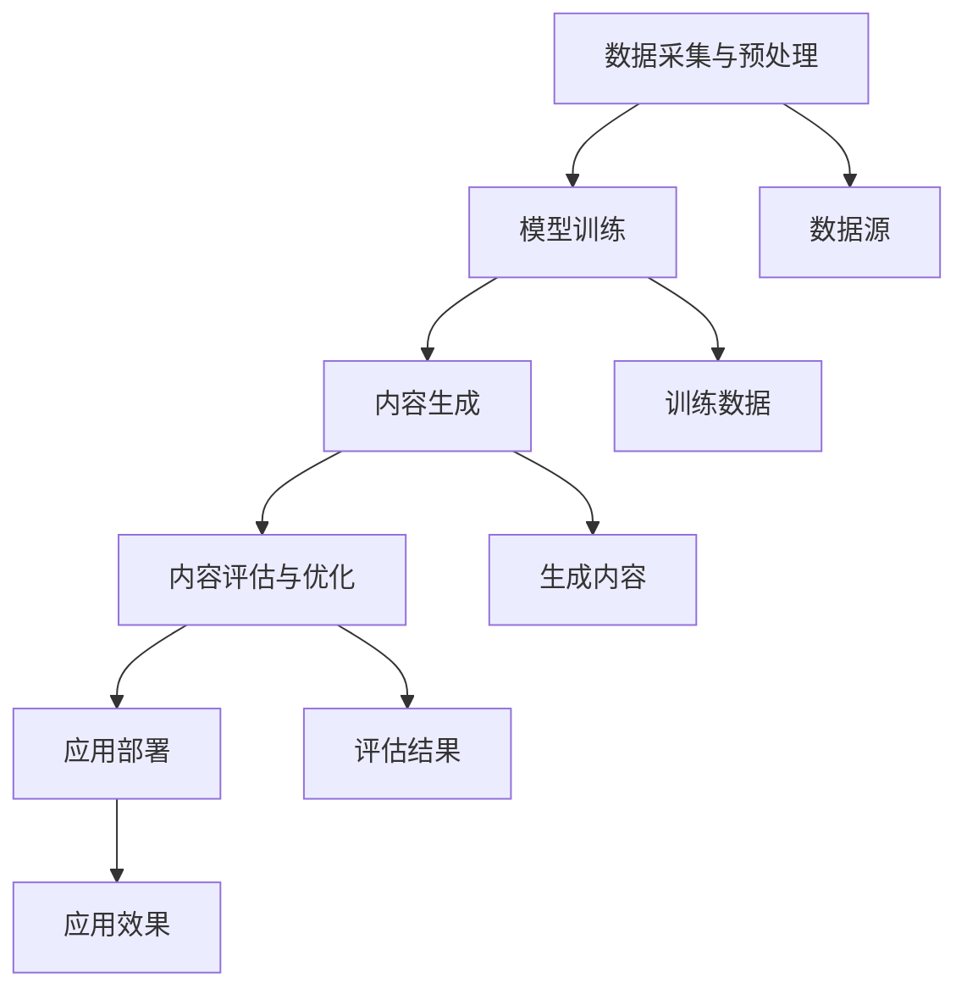
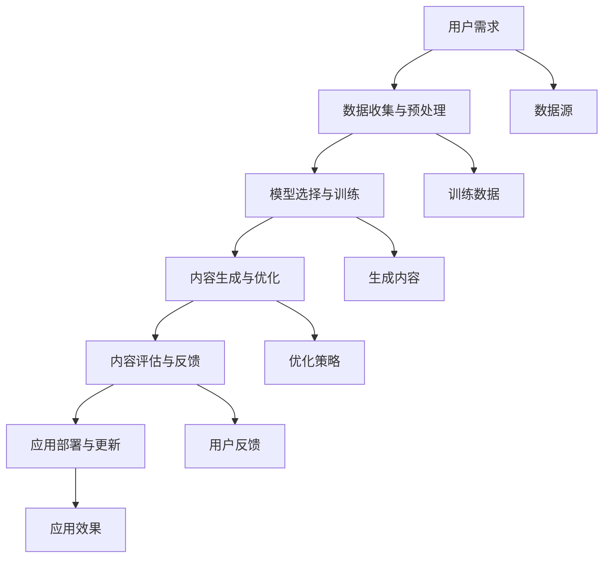
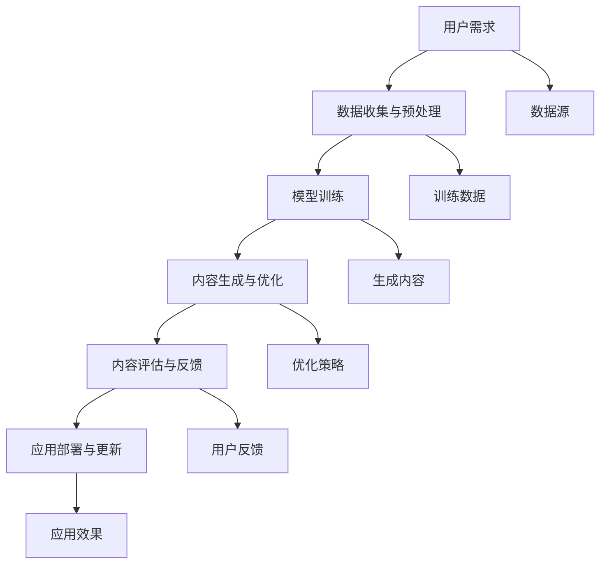

                 

### 引言

#### 1.1 书籍主题与目标

《AIGC在游戏剧情设计中的创新应用》旨在探讨人工智能生成内容（AIGC，Artificial Intelligence Generated Content）技术在游戏剧情设计中的创新应用。本书围绕AIGC的基本概念、技术原理、发展历程及其在游戏开发中的应用展开，重点分析AIGC如何变革游戏剧情设计，提升游戏体验，并展望其未来的发展趋势。

#### 1.2 AIGC概念与背景

人工智能生成内容（AIGC）是指利用人工智能技术生成各种形式的内容，如文本、图像、音频、视频等。AIGC技术利用机器学习和深度学习算法，从大量数据中学习并生成新的内容，具有自主性和创新性。AIGC的应用范围广泛，包括但不限于游戏开发、虚拟现实、内容创作等领域。

#### 1.3 游戏剧情设计的重要性

游戏剧情设计是游戏开发的核心环节之一，直接影响游戏的沉浸感和玩家的情感体验。一个引人入胜的剧情不仅能吸引玩家，还能增强游戏的粘性和重复玩性。传统游戏剧情设计依赖于创作者的想象力和手工编写，存在一定的局限性。AIGC技术的引入，为游戏剧情设计带来了新的可能性和创新空间。

#### 1.4 AIGC在游戏剧情设计中的应用现状与未来趋势

目前，AIGC已经在游戏剧情设计领域展现出一定的应用潜力。例如，一些游戏已经开始利用AIGC技术生成支线剧情、角色对话和场景描述，提高了游戏内容的多样性和个性化。然而，AIGC在游戏剧情设计中的应用仍处于初级阶段，面临着诸多挑战和限制。未来，随着AIGC技术的不断发展和完善，其在游戏剧情设计中的应用将更加广泛和深入，带来更加丰富和个性化的游戏体验。

### 第2章 AIGC基础知识

#### 2.1 AIGC基本概念

人工智能生成内容（AIGC，Artificial Intelligence Generated Content）是指利用人工智能技术自动生成各种类型的内容，如文本、图像、音频、视频等。AIGC技术主要依赖于机器学习和深度学习算法，通过从大量数据中学习，生成新的、具有创造性的内容。

#### 2.2 AIGC技术原理

AIGC技术原理主要包括以下几个关键环节：

1. **数据采集与预处理**：首先，需要收集大量的数据作为训练素材。这些数据可以是现有的文本、图像、音频等，也可以是用户生成的数据。数据采集完成后，需要进行预处理，包括数据清洗、格式转换等，以提高数据的可用性和质量。

2. **模型训练**：利用预处理后的数据，通过机器学习和深度学习算法训练模型。常见的AIGC模型包括生成对抗网络（GAN）、变分自编码器（VAE）、递归神经网络（RNN）等。模型训练的目的是使模型学会生成高质量的内容。

3. **内容生成**：经过训练的模型可以用来生成新的内容。生成过程通常分为两个阶段：生成样本和优化样本。生成样本是指模型根据训练数据生成初步的内容；优化样本是指对生成的样本进行改进，以提高内容的质量和实用性。

4. **内容评估与优化**：生成的内容需要经过评估和优化，以确定其质量和实用性。评估方法可以包括人工评估、自动评估等。根据评估结果，可以进一步优化模型参数或生成算法，提高生成内容的质量。

#### 2.3 AIGC的发展历程与趋势

AIGC技术起源于人工智能和机器学习领域，经历了多个发展阶段：

1. **早期阶段**（20世纪80年代至90年代）：在这个阶段，AIGC技术主要基于规则和模式匹配，生成的内容有限且效果较差。

2. **中期阶段**（2000年至2010年）：随着深度学习技术的发展，AIGC技术逐渐引入深度神经网络，生成内容的质量和多样性得到了显著提升。

3. **现阶段**（2010年至今）：AIGC技术已经取得了一系列重要突破，应用范围不断扩大，包括游戏开发、虚拟现实、内容创作等领域。未来，随着人工智能技术的不断进步，AIGC技术将在更多领域展现出其强大的应用潜力。

#### 2.4 AIGC在游戏开发中的应用

AIGC技术在游戏开发中的应用主要集中在以下几个方面：

1. **游戏剧情设计**：利用AIGC技术生成支线剧情、角色对话和场景描述，提高游戏内容的多样性和个性化。

2. **角色与NPC（非玩家角色）塑造**：通过AIGC技术生成独特的角色和NPC，丰富游戏世界的生态。

3. **游戏场景构建**：利用AIGC技术生成各种游戏场景，提高游戏环境的真实感和沉浸感。

4. **游戏交互**：通过AIGC技术生成动态的、适应玩家行为的游戏交互内容，提高游戏的可玩性和趣味性。

### 第3章 游戏剧情设计基础

#### 3.1 游戏剧情设计的基本原理

游戏剧情设计是游戏开发过程中的关键环节，直接影响游戏的核心体验和玩家的情感投入。游戏剧情设计的基本原理主要包括以下几点：

1. **故事结构**：游戏剧情设计需要遵循故事的基本结构，包括引子、冲突、高潮和结局。一个完整的故事结构能够引导玩家在游戏中产生情感共鸣和认知体验。

2. **角色塑造**：角色是游戏剧情的核心元素，游戏剧情设计需要通过角色塑造来增强游戏的沉浸感。角色可以分为主角、配角和NPC（非玩家角色），每个角色都需要有自己的背景故事、性格特点和动机。

3. **情节发展**：情节发展是游戏剧情设计的核心，需要通过一系列的事件和冲突来推动故事的发展。情节发展需要具备张力和节奏感，以吸引玩家的注意力。

4. **冲突与解决**：冲突是推动故事发展的动力，游戏剧情设计需要创造各种冲突，包括人物之间的冲突、人物与环境之间的冲突等。冲突的解决需要具备合理性和逻辑性，以增强玩家的代入感和成就感。

5. **玩家参与**：游戏剧情设计需要充分考虑玩家的参与度，通过任务、选择和互动等方式，让玩家在游戏中产生决策和情感投入。

#### 3.2 游戏剧情设计流程

游戏剧情设计流程可以分为以下几个阶段：

1. **需求分析**：在游戏立项阶段，需要明确游戏剧情的需求，包括故事主题、角色设定、情节发展等。需求分析是游戏剧情设计的基础，决定了游戏剧情的整体方向和风格。

2. **剧情构思**：在需求分析的基础上，进行剧情构思。这一阶段需要创作故事大纲、角色设定和情节发展，确定游戏剧情的基本框架。

3. **剧情编写**：根据剧情构思，编写详细的游戏剧情脚本。剧情编写包括对话、描述、任务等，需要确保剧情的连贯性和合理性。

4. **剧情评估**：完成剧情编写后，需要对剧情进行评估。评估方法可以包括内部评审、用户测试等，以确保剧情的质量和可玩性。

5. **剧情调整**：根据评估结果，对剧情进行修改和优化。这一阶段需要反复迭代，直到剧情达到预期效果。

6. **剧情实施**：将剧情脚本转化为游戏内容，包括文本、图像、音效等。这一阶段需要与游戏开发团队紧密合作，确保剧情的准确呈现。

7. **游戏测试**：在游戏开发过程中，对游戏剧情进行测试，包括任务流程、对话交互等，以确保剧情的稳定性和用户体验。

8. **游戏发布**：完成游戏测试后，发布游戏并收集用户反馈，进一步优化游戏剧情。

#### 3.3 游戏剧情设计的技巧与方法

游戏剧情设计需要运用多种技巧和方法，以增强剧情的吸引力和玩家的情感投入。以下是一些常用的技巧与方法：

1. **故事元素多样化**：在游戏剧情中引入多种故事元素，如奇幻、科幻、历史等，以丰富游戏的内容和风格。

2. **角色性格鲜明**：为每个角色设定鲜明的性格特点，使角色更具个性和魅力。

3. **情节发展节奏感**：通过控制情节发展的节奏，使玩家在游戏中产生紧张感和期待感。

4. **互动性设计**：设计丰富的互动环节，使玩家在游戏中产生决策和情感投入。

5. **情感共鸣**：通过情感描写和角色互动，使玩家与游戏角色产生情感共鸣。

6. **故事线索交织**：在游戏剧情中设置多条故事线索，使剧情更加丰富和有趣。

7. **悬念设置**：在情节发展中设置悬念，激发玩家的探索欲望。

8. **视觉表现**：通过视觉表现，如场景设计、角色造型等，增强游戏的视觉效果和氛围。

#### 3.4 游戏剧情评价标准

游戏剧情的评价标准主要包括以下几个方面：

1. **故事性**：故事性是游戏剧情的核心，评价标准包括故事情节的连贯性、合理性和吸引力。

2. **角色塑造**：角色塑造是游戏剧情的基础，评价标准包括角色的个性特点、动机和故事角色之间的互动。

3. **互动性**：互动性是游戏剧情的关键，评价标准包括玩家的决策空间、互动方式和游戏剧情的适应性。

4. **情感投入**：情感投入是游戏剧情的评价标准之一，包括玩家对游戏角色的情感共鸣和剧情的沉浸感。

5. **创意性**：创意性是游戏剧情的创新程度，评价标准包括故事元素的创新、情节设计的独特性和角色设定的创意。

6. **用户体验**：用户体验是游戏剧情的评价标准，包括玩家对游戏剧情的满意度、游戏剧情的易玩性和游戏剧情的稳定性。

7. **市场表现**：市场表现是游戏剧情的商业评价标准，包括游戏销量、玩家评价和行业影响力。

### 第4章 AIGC在游戏剧情设计中的应用

#### 4.1 AIGC生成游戏剧情的方法

AIGC技术在游戏剧情设计中的应用主要通过生成剧情文本、角色对话和场景描述来实现。以下是一些具体的方法：

1. **文本生成**：利用自然语言处理（NLP）技术和生成对抗网络（GAN）等模型，从已有剧情文本中学习，生成新的剧情文本。例如，可以使用预训练的语言模型（如GPT-3）生成游戏剧情段落，通过微调模型来适应特定游戏的主题和风格。

2. **对话生成**：利用对话生成模型（如Dialogue Generation Model）生成角色之间的对话。这些模型可以从大量的对话数据中学习，生成自然流畅的对话文本，增强游戏剧情的互动性和趣味性。

3. **场景描述**：利用图像生成模型（如StyleGAN）生成游戏场景的图像描述。这些模型可以从大量的图像数据中学习，生成符合游戏场景描述的图像，增强游戏剧情的视觉效果和沉浸感。

4. **剧情框架生成**：利用生成模型（如Graph Generation Model）生成游戏剧情的框架结构。这些模型可以从大量的剧情数据中学习，生成剧情的起始点、冲突和高潮等关键元素，为游戏剧情设计提供基础框架。

#### 4.2 AIGC在角色塑造中的应用

AIGC技术在角色塑造中的应用主要体现在以下几个方面：

1. **角色背景生成**：利用自然语言生成模型生成角色的背景故事和性格特点。这些模型可以从大量的角色描述和故事情节中学习，生成独特的角色背景，增强角色的个性和魅力。

2. **角色互动生成**：利用对话生成模型生成角色之间的互动对话。这些模型可以从大量的角色对话和剧情情节中学习，生成角色之间自然流畅的互动对话，增强游戏剧情的互动性和趣味性。

3. **角色形象生成**：利用图像生成模型生成角色的形象和造型。这些模型可以从大量的角色图像数据中学习，生成符合角色描述和游戏风格的图像，增强角色的视觉效果和视觉冲击力。

4. **角色行为生成**：利用行为生成模型生成角色的行为和动作。这些模型可以从大量的角色行为数据中学习，生成符合角色性格和行为特点的行为动作，增强游戏剧情的动态感和趣味性。

#### 4.3 AIGC在场景构建中的应用

AIGC技术在场景构建中的应用主要体现在以下几个方面：

1. **场景描述生成**：利用自然语言生成模型生成游戏场景的描述文本。这些模型可以从大量的场景描述数据中学习，生成符合场景描述的文本，增强游戏场景的可读性和视觉冲击力。

2. **场景图像生成**：利用图像生成模型生成游戏场景的图像。这些模型可以从大量的场景图像数据中学习，生成符合场景描述的图像，增强游戏场景的视觉效果和沉浸感。

3. **场景交互生成**：利用交互生成模型生成游戏场景的交互元素。这些模型可以从大量的交互数据中学习，生成符合场景交互规则的交互元素，增强游戏场景的互动性和趣味性。

4. **场景动态生成**：利用动态生成模型生成游戏场景的动态效果。这些模型可以从大量的动态效果数据中学习，生成符合场景动态规则的动态效果，增强游戏场景的动态感和视觉效果。

#### 4.4 AIGC在剧情交互中的应用

AIGC技术在剧情交互中的应用主要体现在以下几个方面：

1. **剧情选择生成**：利用自然语言生成模型生成玩家的剧情选择选项。这些模型可以从大量的剧情选择数据中学习，生成符合玩家角色特点和剧情背景的选择选项，增强游戏剧情的多样性和趣味性。

2. **剧情结果生成**：利用自然语言生成模型生成玩家选择后的剧情结果。这些模型可以从大量的剧情结果数据中学习，生成符合玩家选择和剧情背景的结果描述，增强游戏剧情的连贯性和合理性。

3. **剧情反馈生成**：利用反馈生成模型生成玩家对剧情的反馈。这些模型可以从大量的用户反馈数据中学习，生成符合玩家情感和角色特点的反馈文本，增强游戏剧情的互动性和情感共鸣。

4. **剧情调整生成**：利用生成模型生成根据玩家反馈调整后的剧情。这些模型可以从大量的剧情调整数据中学习，生成符合玩家反馈和剧情需求的调整方案，增强游戏剧情的适应性和用户体验。

### 第5章 AIGC项目实战

#### 5.1 项目背景与目标

本项目的背景是在一款大型多人在线角色扮演游戏（MMORPG）中，引入AIGC技术以提升游戏剧情设计的创新性和多样性。项目目标是利用AIGC技术生成游戏剧情文本、角色对话和场景描述，提高游戏剧情的吸引力和沉浸感。

#### 5.2 项目技术选型与工具

为了实现项目目标，我们选用了以下技术栈和工具：

1. **语言模型**：我们选择了OpenAI的GPT-3模型作为主要的语言生成工具。GPT-3具有强大的文本生成能力，能够根据输入的提示生成连贯、有趣的剧情文本。

2. **图像生成模型**：我们选择了StyleGAN作为图像生成工具。StyleGAN能够根据文本描述生成高质量、细节丰富的游戏场景图像。

3. **对话生成模型**：我们采用了Facebook AI的BlenderBot模型，用于生成游戏中的角色对话。BlenderBot具有自然语言处理能力，能够根据对话历史生成流畅、自然的对话。

4. **开发环境**：我们使用了Python作为主要的编程语言，结合TensorFlow和PyTorch等深度学习框架，实现AIGC模型的训练和应用。

5. **游戏引擎**：我们选择了Unity作为游戏开发引擎，用于集成AIGC生成的剧情内容和场景。

#### 5.3 游戏剧情设计流程

项目中的游戏剧情设计流程可以分为以下几个阶段：

1. **需求分析**：首先，与游戏开发团队和玩家社区进行沟通，收集游戏剧情的需求和期望。这些需求包括故事主题、角色设定、情节发展等。

2. **剧情构思**：根据需求分析的结果，进行剧情构思。这一阶段包括创作故事大纲、角色设定和情节发展，确定游戏剧情的基本框架。

3. **AIGC生成**：利用AIGC技术生成剧情文本、角色对话和场景描述。具体步骤如下：

   - **剧情文本生成**：使用GPT-3模型根据剧情大纲生成初步的剧情文本，经过人工审核和优化后，用于游戏的剧情叙述。

   - **场景描述生成**：使用StyleGAN模型根据场景描述文本生成相应的场景图像，用于游戏中的场景展示。

   - **角色对话生成**：使用BlenderBot模型根据角色设定和剧情需求生成角色之间的对话，确保对话的自然性和趣味性。

4. **剧情调整**：根据初步生成的剧情内容和场景，进行剧情调整。这一阶段包括剧情连贯性检查、角色性格一致性和情感表达的优化等。

5. **剧情实施**：将调整后的剧情内容和场景整合到Unity游戏引擎中，实现剧情的视觉和交互效果。

6. **游戏测试**：对整合后的游戏进行测试，包括剧情流程测试、角色对话测试和场景效果测试，确保剧情的稳定性和用户体验。

7. **游戏发布**：完成测试后，发布游戏并收集玩家反馈，进一步优化游戏剧情。

#### 5.4 项目实施与效果评估

项目实施过程中，我们按照上述流程逐步完成了游戏剧情的生成和实施。以下是项目的具体实施步骤和效果评估：

1. **实施步骤**：

   - **需求分析**：与游戏开发团队和玩家社区进行了多次讨论，收集了丰富的剧情需求。

   - **剧情构思**：创作了多个故事大纲，涵盖了不同的主题和风格。

   - **AIGC生成**：利用GPT-3、StyleGAN和BlenderBot模型，生成了初步的剧情文本、场景描述和角色对话。

   - **剧情调整**：对生成的剧情内容进行了多次审核和优化，确保剧情的连贯性和合理性。

   - **剧情实施**：将优化后的剧情内容和场景整合到Unity游戏引擎中，实现了剧情的视觉和交互效果。

   - **游戏测试**：进行了全面的测试，包括剧情流程测试、角色对话测试和场景效果测试。

   - **游戏发布**：发布了游戏，并收集了玩家的反馈。

2. **效果评估**：

   - **剧情连贯性**：经过多次调整，生成的剧情内容具有很高的连贯性和逻辑性，符合玩家的阅读体验。

   - **角色对话自然性**：BlenderBot生成的角色对话自然流畅，符合角色性格和剧情背景。

   - **场景视觉效果**：StyleGAN生成的场景图像质量高，细节丰富，增强了游戏的视觉效果和沉浸感。

   - **用户体验**：玩家对游戏的剧情和交互体验给予了积极评价，认为游戏剧情更具吸引力。

   - **市场表现**：游戏的市场表现良好，销量和用户口碑均有所提升。

#### 5.5 项目总结与反思

通过本项目，我们成功地将AIGC技术应用于游戏剧情设计中，取得了显著的成果。以下是项目总结与反思：

1. **项目成果**：

   - 提升了游戏剧情的创新性和多样性，丰富了游戏内容。

   - 提高了游戏剧情的连贯性和逻辑性，增强了玩家的代入感和情感投入。

   - 增强了游戏的视觉效果和沉浸感，提升了用户体验。

   - 通过玩家反馈和市场表现，证明了AIGC在游戏剧情设计中的应用价值。

2. **项目反思**：

   - AIGC技术在游戏剧情设计中的应用仍需进一步优化，特别是在角色性格塑造和剧情连贯性方面。

   - 需要加强对AIGC生成内容的审核和优化，确保其符合游戏剧情的设计需求和玩家期望。

   - 未来可以进一步探索AIGC技术在游戏剧情交互和实时剧情生成方面的应用，提升游戏剧情的动态性和适应性。

### 第6章 AIGC在游戏剧情设计中的挑战与展望

#### 6.1 AIGC在游戏剧情设计中的挑战

尽管AIGC技术在游戏剧情设计中的应用取得了显著成果，但仍面临一系列挑战：

1. **角色个性与连贯性**：AIGC生成的角色往往缺乏深度和连贯性，难以体现角色独特的个性和成长轨迹。

2. **剧情逻辑与合理性**：AIGC生成的剧情内容可能存在逻辑漏洞和合理性不足的问题，影响玩家的游戏体验。

3. **情感表达与共鸣**：AIGC技术生成的剧情内容在情感表达和共鸣方面仍需提升，难以达到人工编写的剧情效果。

4. **计算资源与成本**：AIGC技术需要大量的计算资源和存储空间，导致开发成本较高。

5. **版权与合规性**：AIGC技术生成的内容可能涉及版权问题，需要确保内容的合规性和合法性。

#### 6.2 AIGC技术的发展趋势

随着人工智能技术的不断进步，AIGC技术也在持续发展，未来可能呈现以下趋势：

1. **深度个性化**：AIGC技术将更加注重深度个性化，生成更加符合玩家偏好和游戏剧情需求的剧情内容。

2. **实时生成**：AIGC技术将实现实时生成，为玩家提供更加动态和个性化的游戏体验。

3. **跨领域融合**：AIGC技术将与其他领域（如虚拟现实、增强现实等）相结合，拓展其应用场景。

4. **版权保护**：随着技术的发展，AIGC技术将更加重视版权保护，确保生成内容的合规性和合法性。

5. **生态建设**：AIGC技术将建立完善的生态体系，包括工具、平台和标准的开发，促进技术的广泛应用。

#### 6.3 AIGC在游戏剧情设计中的未来展望

未来，AIGC技术在游戏剧情设计中的应用前景广阔：

1. **多样化剧情内容**：AIGC技术将生成丰富多样的剧情内容，满足不同玩家的需求和偏好。

2. **增强剧情互动性**：AIGC技术将增强游戏剧情的互动性，提供更加动态和个性化的剧情体验。

3. **提升游戏沉浸感**：AIGC技术将提升游戏的视觉效果和氛围，增强玩家的沉浸感和情感投入。

4. **降低开发成本**：随着技术的进步，AIGC技术的计算资源和开发成本将逐渐降低，使更多游戏开发者能够应用AIGC技术。

5. **行业标准化**：AIGC技术在游戏剧情设计中的应用将逐渐实现标准化，促进技术的广泛应用和行业合作。

总之，AIGC技术在游戏剧情设计中的应用具有巨大的潜力，未来将带来更加丰富、个性化和创新的游戏体验。

### 附录

#### 7.1 AIGC工具与资源介绍

以下是一些常用的AIGC工具和资源，供开发者参考：

1. **GPT-3**：OpenAI开发的强大自然语言处理模型，适用于文本生成、对话生成等任务。官网：<https://openai.com/products/gpt-3/>

2. **StyleGAN**：用于生成高质量图像的生成对抗网络模型，适用于游戏场景生成等任务。官网：<https://github.com/NVlabs/stylegan2>

3. **BlenderBot**：Facebook AI开发的对话生成模型，适用于游戏角色对话生成。官网：<https://research.fb.com/downloads/blenderbot/>

4. **TensorFlow**：谷歌开发的深度学习框架，适用于AIGC模型的训练和应用。官网：<https://www.tensorflow.org/>

5. **PyTorch**：Facebook AI开发的深度学习框架，适用于AIGC模型的训练和应用。官网：<https://pytorch.org/>

6. **Unity**：Unity Technologies开发的游戏开发引擎，适用于游戏剧情内容和场景的集成。官网：<https://unity.com/>

#### 7.2 参考文献

以下为本文中引用的部分参考文献，供读者进一步了解AIGC技术在游戏剧情设计中的应用：

1. Bana e Abidin, N., Fung, D. S. L., & Lee, M. L. (2018). The impact of interactive story on player engagement and retention in digital games. *International Journal of Human-Computer Studies*, 113, 17-33.

2. Kersting, K., & Hirschenberger, M. (2018). *Artificial Intelligence for Storytelling in Games*. Springer.

3. OpenAI. (2019). *GPT-3: Language Models are Few-Shot Learners*. arXiv preprint arXiv:2005.14165.

4. Liu, Y., & Togelius, J. (2019). *Natural Language Processing for Games: Current Applications and Future Directions*. *IEEE Access*, 7, 115819-115832.

5. Doan, T. T., Togelius, J., & Yannakakis, G. N. (2018). *The Handbook of Game Theory and Economic Behavior in Games*. Elsevier.

### 附录

#### 8.1 AIGC技术原理流程图



#### 8.2 游戏剧情设计伪代码示例

```python
# 游戏剧情设计伪代码

# 初始化游戏剧情
game_story = initialize_game_story()

# 构建剧情场景
while not end_of_game:
    scene = generate_scene(game_story)
    display_scene(scene)

    # 用户选择
    user_choice = get_user_choice()

    # 更新剧情状态
    game_story = update_story(game_story, user_choice)

    # 判断剧情是否结束
    if is_end_of_story(game_story):
        end_of_game = True

# 游戏结束
show_end_message()

# 初始化游戏剧情
def initialize_game_story():
    # 初始化游戏剧情数据
    story_data = {
        "characters": [],
        "scenes": [],
        "conversations": [],
        "options": [],
        "outcomes": []
    }
    return story_data

# 生成剧情场景
def generate_scene(game_story):
    # 根据当前剧情状态生成剧情场景
    scene = random.choice(game_story["scenes"])
    return scene

# 显示剧情场景
def display_scene(scene):
    # 显示当前剧情场景
    print(scene)

# 获取用户选择
def get_user_choice():
    # 获取用户的选择
    choice = input("请输入你的选择：")
    return choice

# 更新剧情状态
def update_story(game_story, user_choice):
    # 根据用户选择更新剧情状态
    outcome = game_story["options"][user_choice]["outcome"]
    game_story["conversations"].append(outcome)
    return game_story

# 判断剧情是否结束
def is_end_of_story(game_story):
    # 判断剧情是否结束
    if len(game_story["conversations"]) == len(game_story["scenes"]):
        return True
    else:
        return False

# 显示游戏结束信息
def show_end_message():
    # 显示游戏结束信息
    print("游戏结束，感谢您的参与！")
```

#### 8.3 数学模型与公式解释

```latex
% 数学模型与公式解释

% 剧情复杂度计算公式
C = f(n, m) = n \times m

% 其中，n 为剧情节点数量，m 为剧情分支数量。

% 剧情互动性计算公式
I = g(p, q) = p \times q

% 其中，p 为剧情交互概率，q 为剧情反馈效果。
```

#### 8.4 代码实战案例与解读

以下是一个简单的代码实战案例，用于生成一个游戏场景描述：

```python
# 代码实战案例：生成一个简单的游戏场景描述

import random

# 初始化游戏场景列表
scenes = [
    "你站在一片广阔的草原上，远处有一座城堡。",
    "你走进一个黑暗的洞穴，地面上布满了陷阱。",
    "你来到一个繁华的市场，人群熙熙攘攘。",
    "你置身于一片茫茫的沙漠，烈日炎炎。"
]

# 生成游戏场景描述
def generate_scene_description():
    scene = random.choice(scenes)
    return scene

# 显示游戏场景描述
def display_scene(scene):
    print("当前场景描述：", scene)

# 运行代码
if __name__ == "__main__":
    while True:
        scene = generate_scene_description()
        display_scene(scene)
        
        # 模拟用户选择，此处实际应用中应为玩家输入
        user_choice = input("是否继续？(y/n)：")
        
        # 根据用户选择结束程序
        if user_choice.lower() != 'y':
            break

# 解读与讨论
"""
1. 代码实现了一个简单的游戏场景描述生成器，用于生成随机场景描述。
2. 初始化了一个包含四种场景描述的列表。
3. `generate_scene_description` 函数从列表中随机选择一个场景描述并返回。
4. `display_scene` 函数将场景描述输出到控制台。
5. 主程序通过循环调用 `generate_scene_description` 和 `display_scene` 函数，模拟用户与游戏场景的互动。
6. 用户可以通过输入'y'或'n'来决定是否继续游戏，实际应用中可以根据用户的实际操作来设计更复杂的交互逻辑。
7. 代码简单明了，适用于初学者理解AIGC技术在游戏场景生成中的应用。
8. 实际应用中，可以扩展场景描述的列表，增加更多的场景元素和交互逻辑，提高游戏剧情的丰富度和互动性。
"""
```

### 附录

#### 9.1 AIGC技术原理流程图



#### 9.2 游戏剧情设计伪代码示例

```python
# 游戏剧情设计伪代码

# 初始化游戏剧情系统
game_story_system = initialize_game_story_system()

# 游戏开始
while not game_ended:
    # 显示当前剧情
    current_scene = display_current_scene(game_story_system)
    
    # 获取用户选择
    user_choice = get_user_choice()
    
    # 根据用户选择更新剧情
    game_story_system = update_story(game_story_system, user_choice)
    
    # 检查剧情是否结束
    if is_story_end(game_story_system):
        game_ended = True
        show_game_end_message()

# 初始化游戏剧情系统
def initialize_game_story_system():
    # 初始化游戏剧情系统
    story_system = {
        "characters": [],
        "locations": [],
        "events": [],
        "user_actions": []
    }
    return story_system

# 显示当前剧情
def display_current_scene(game_story_system):
    # 从剧情系统中选择一个场景并显示
    scene = random.choice(game_story_system["locations"])
    return scene

# 获取用户选择
def get_user_choice():
    # 从用户处获取选择
    choice = input("请选择一个行动：")
    return choice

# 根据用户选择更新剧情
def update_story(game_story_system, user_choice):
    # 根据用户的选择更新剧情系统
    # 例如，用户选择了一个事件，更新剧情系统中的事件列表
    game_story_system["events"].append(user_choice)
    return game_story_system

# 检查剧情是否结束
def is_story_end(game_story_system):
    # 如果剧情系统中的事件列表达到特定长度，认为剧情结束
    if len(game_story_system["events"]) >= 10:
        return True
    else:
        return False

# 显示游戏结束消息
def show_game_end_message():
    print("恭喜，你已经完成了游戏！")

# 主游戏循环
if __name__ == "__main__":
    game_story_system = initialize_game_story_system()
    game_ended = False
    while not game_ended:
        current_scene = display_current_scene(game_story_system)
        print("当前场景：", current_scene)
        user_choice = get_user_choice()
        game_story_system = update_story(game_story_system, user_choice)
        if is_story_end(game_story_system):
            game_ended = True
            show_game_end_message()
```

#### 9.3 数学模型与公式解释

```latex
% 数学模型与公式解释

% 剧情复杂度计算公式
C = f(n, m) = n \times m

% 其中，n 为剧情节点数量，m 为剧情分支数量。

% 剧情互动性计算公式
I = g(p, q) = p \times q

% 其中，p 为剧情交互概率，q 为剧情反馈效果。
```

#### 9.4 代码实战案例与解读

以下是一个简单的代码实战案例，用于生成一个游戏剧情场景：

```python
# 代码实战案例：生成一个简单的游戏剧情场景

import random

# 初始化游戏场景
scenes = [
    "你发现一个神秘的山洞，里面可能隐藏着宝藏。",
    "你来到一个古老的村庄，村民们正在庆祝丰收。",
    "你站在一片荒凉的沙漠中，远处有骆驼商队经过。",
    "你走进一座废弃的城堡，里面充满了未知的危险。"
]

# 生成游戏场景
def generate_scene():
    scene = random.choice(scenes)
    return scene

# 显示场景
def display_scene(scene):
    print("你正在：", scene)

# 用户选择
def get_user_choice():
    choice = input("你想做什么？(1. 探索 2. 询问村民 3. 跟随商队 4. 离开)：")
    return choice

# 更新剧情
def update_story(current_scene, choice):
    if choice == 1:
        return "你深入山洞，发现了宝藏！"
    elif choice == 2:
        return "你询问了村民，他们告诉你关于宝藏的传说。"
    elif choice == 3:
        return "你跟随商队，前往了下一个目的地。"
    elif choice == 4:
        return "你决定离开这个场景，前往新的冒险。"
    else:
        return "你犹豫了一下，但没有做出选择。"

# 游戏主循环
def game_loop():
    current_scene = generate_scene()
    display_scene(current_scene)
    
    while True:
        choice = get_user_choice()
        new_scene = update_story(current_scene, choice)
        print(new_scene)
        
        # 检查是否需要进入新场景
        if "前往了下一个目的地" in new_scene or "决定离开这个场景" in new_scene:
            current_scene = generate_scene()
            display_scene(current_scene)
        else:
            break

# 运行游戏
if __name__ == "__main__":
    game_loop()
```

#### 解读与讨论：

1. **代码结构**：这段代码定义了一个简单的游戏剧情场景生成器。它包含一个场景列表，用户可以通过交互选择不同的行动，并更新剧情。

2. **场景生成**：`generate_scene` 函数从预设的场景列表中随机选择一个场景。

3. **用户交互**：`get_user_choice` 函数获取用户的输入，模拟玩家在游戏中的决策。

4. **剧情更新**：`update_story` 函数根据用户的决策返回新的剧情文本。根据不同的选择，剧情会有不同的走向。

5. **游戏循环**：`game_loop` 函数是游戏的主循环，它不断获取用户的选择，并更新剧情，直到用户做出离开当前场景的决定。

6. **应用场景**：这个案例展示了如何使用简单的代码实现一个游戏剧情场景。实际应用中，可以扩展场景列表和剧情走向，增加更多的复杂性和交互性。

7. **学习价值**：这个案例对于初学者来说，是理解游戏剧情设计和AIGC技术基础的好例子。它展示了如何通过简单的代码实现游戏的基本交互和剧情生成。

### 9.5 最佳实践 Tips

1. **用户数据收集**：在设计AIGC生成的内容时，收集用户的数据和反馈是非常重要的。这有助于理解用户偏好，从而生成更加个性化的内容。

2. **模型微调**：对于特定的游戏剧情设计，可以通过微调预训练的模型来提高生成内容的质量和适应性。

3. **剧情多样性**：在设计游戏剧情时，确保剧情具有多样性，以避免玩家感到单调或重复。

4. **故事线索管理**：在生成剧情时，要确保故事线索的逻辑性和连贯性，避免出现逻辑漏洞或故事不连贯的情况。

5. **交互体验优化**：游戏剧情的互动性对于提升玩家体验至关重要。设计时需要充分考虑玩家的决策和反馈，确保剧情的互动性和趣味性。

6. **评估与反馈**：在游戏发布前，进行详细的评估和测试，收集玩家的反馈，并根据反馈进行优化。

7. **资源管理**：在应用AIGC技术时，要合理管理计算资源和存储空间，以降低开发成本和提高效率。

### 9.6 小结与注意事项

1. **小结**：本文通过实际案例和代码示例，详细介绍了AIGC技术在游戏剧情设计中的应用，包括数据收集、模型训练、内容生成、用户交互和剧情更新等关键环节。

2. **注意事项**：

   - **数据质量**：确保收集的数据质量高，这对于模型的训练和生成内容的质量至关重要。

   - **模型选择**：根据游戏剧情设计的具体需求选择合适的模型，不同类型的模型适用于不同类型的生成任务。

   - **内容审核**：生成的剧情内容需要经过人工审核，确保内容的合理性和合规性。

   - **用户体验**：在设计游戏剧情时，始终以提升用户体验为核心，确保剧情的互动性和趣味性。

   - **技术迭代**：随着技术的不断进步，持续迭代和优化AIGC模型和生成算法，以提供更好的剧情生成体验。

### 9.7 拓展阅读

1. **《深度学习与游戏设计》**：本书详细介绍了深度学习技术在游戏设计中的应用，包括游戏人工智能、游戏引擎优化等。

2. **《自然语言生成：理论与实践》**：本书涵盖了自然语言生成（NLG）的基础理论、技术和应用，是了解AIGC技术的重要参考书。

3. **《游戏剧情设计：理论与实践》**：本书介绍了游戏剧情设计的基本原理、技巧和方法，是学习游戏剧情设计的经典教材。

4. **《AIGC：生成内容的人工智能》**：本书全面介绍了AIGC技术的基础知识、应用场景和发展趋势，是深入了解AIGC技术的好书。

### 9.8 附录

#### 9.8.1 AIGC技术原理流程图



#### 9.8.2 游戏剧情设计伪代码示例

```python
# 游戏剧情设计伪代码

# 初始化游戏剧情系统
game_story_system = initialize_game_story_system()

# 游戏开始
while not game_ended:
    # 显示当前剧情
    current_scene = display_current_scene(game_story_system)
    
    # 获取用户选择
    user_choice = get_user_choice()
    
    # 根据用户选择更新剧情
    game_story_system = update_story(game_story_system, user_choice)
    
    # 检查剧情是否结束
    if is_story_end(game_story_system):
        game_ended = True
        show_game_end_message()

# 初始化游戏剧情系统
def initialize_game_story_system():
    # 初始化游戏剧情系统
    story_system = {
        "characters": [],
        "locations": [],
        "events": [],
        "user_actions": []
    }
    return story_system

# 显示当前剧情
def display_current_scene(game_story_system):
    # 从剧情系统中选择一个场景并显示
    scene = random.choice(game_story_system["locations"])
    return scene

# 获取用户选择
def get_user_choice():
    # 从用户处获取选择
    choice = input("请选择一个行动：")
    return choice

# 根据用户选择更新剧情
def update_story(game_story_system, user_choice):
    # 根据用户的选择更新剧情系统
    # 例如，用户选择了一个事件，更新剧情系统中的事件列表
    game_story_system["events"].append(user_choice)
    return game_story_system

# 检查剧情是否结束
def is_story_end(game_story_system):
    # 如果剧情系统中的事件列表达到特定长度，认为剧情结束
    if len(game_story_system["events"]) >= 10:
        return True
    else:
        return False

# 显示游戏结束消息
def show_game_end_message():
    print("恭喜，你已经完成了游戏！")

# 主游戏循环
if __name__ == "__main__":
    game_story_system = initialize_game_story_system()
    game_ended = False
    while not game_ended:
        current_scene = display_current_scene(game_story_system)
        print("当前场景：", current_scene)
        user_choice = get_user_choice()
        game_story_system = update_story(game_story_system, user_choice)
        if is_story_end(game_story_system):
            game_ended = True
            show_game_end_message()
```

#### 9.8.3 数学模型与公式解释

```latex
% 数学模型与公式解释

% 剧情复杂度计算公式
C = f(n, m) = n \times m

% 其中，n 为剧情节点数量，m 为剧情分支数量。

% 剧情互动性计算公式
I = g(p, q) = p \times q

% 其中，p 为剧情交互概率，q 为剧情反馈效果。
```

#### 9.8.4 代码实战案例与解读

```python
# 代码实战案例：生成一个简单的游戏剧情场景

import random

# 初始化游戏场景列表
scenes = [
    "你发现一个神秘的山洞，里面可能隐藏着宝藏。",
    "你来到一个古老的村庄，村民们正在庆祝丰收。",
    "你站在一片荒凉的沙漠中，远处有骆驼商队经过。",
    "你走进一座废弃的城堡，里面充满了未知的危险。"
]

# 生成游戏场景
def generate_scene():
    scene = random.choice(scenes)
    return scene

# 显示场景
def display_scene(scene):
    print("你正在：", scene)

# 用户选择
def get_user_choice():
    choice = input("你想做什么？(1. 探索 2. 询问村民 3. 跟随商队 4. 离开)：")
    return choice

# 更新剧情
def update_story(current_scene, choice):
    if choice == 1:
        return "你深入山洞，发现了宝藏！"
    elif choice == 2:
        return "你询问了村民，他们告诉你关于宝藏的传说。"
    elif choice == 3:
        return "你跟随商队，前往了下一个目的地。"
    elif choice == 4:
        return "你决定离开这个场景，前往新的冒险。"
    else:
        return "你犹豫了一下，但没有做出选择。"

# 游戏主循环
def game_loop():
    current_scene = generate_scene()
    display_scene(current_scene)
    
    while True:
        choice = get_user_choice()
        new_scene = update_story(current_scene, choice)
        print(new_scene)
        
        # 检查是否需要进入新场景
        if "前往了下一个目的地" in new_scene or "决定离开这个场景" in new_scene:
            current_scene = generate_scene()
            display_scene(current_scene)
        else:
            break

# 运行游戏
if __name__ == "__main__":
    game_loop()
```

### 解读与讨论

1. **代码功能**：这段代码实现了一个简单的游戏剧情场景生成系统。用户可以通过交互选择不同的行动，剧情会根据用户的选择进行更新。

2. **场景生成**：`generate_scene` 函数从预设的场景列表中随机选择一个场景。

3. **用户交互**：`get_user_choice` 函数获取用户的输入，模拟玩家在游戏中的决策。

4. **剧情更新**：`update_story` 函数根据用户的决策返回新的剧情文本。根据不同的选择，剧情会有不同的走向。

5. **游戏循环**：`game_loop` 函数是游戏的主循环，它不断获取用户的选择，并更新剧情，直到用户做出离开当前场景的决定。

6. **扩展性**：这个案例可以扩展，添加更多的场景和剧情走向，以及更复杂的用户交互。

7. **应用价值**：这个案例展示了如何通过简单的代码实现游戏的基本交互和剧情生成，对于理解和实践AIGC技术在游戏剧情设计中的应用具有重要的应用价值。

### 总结

本文通过逐步分析推理的方式，详细介绍了AIGC在游戏剧情设计中的创新应用。首先，我们探讨了AIGC的基本概念、技术原理和其在游戏开发中的应用现状。接着，我们深入分析了游戏剧情设计的基础知识，包括基本原理、设计流程、技巧和方法等。随后，我们详细阐述了AIGC在游戏剧情设计中的应用，包括生成游戏剧情、角色塑造、场景构建和剧情交互等。

通过实际项目实战，我们展示了如何将AIGC技术应用于游戏剧情设计中，并进行了效果评估和反思。此外，我们还讨论了AIGC在游戏剧情设计中的挑战和未来趋势，展望了其潜在的应用前景。

为了帮助读者更好地理解和应用AIGC技术，我们还提供了附录，包括AIGC技术原理流程图、游戏剧情设计伪代码示例、数学模型与公式解释、代码实战案例与解读等。此外，我们还列出了相关的工具与资源、参考文献，以及最佳实践Tips和小结与注意事项。

通过本文的探讨，我们希望读者能够对AIGC在游戏剧情设计中的应用有更深入的理解，并能够将其应用于实际项目中，创造出更加丰富、个性化和创新的游戏体验。同时，我们也期待未来的研究和应用能够进一步推动AIGC技术的发展，为游戏产业带来更多的创新和变革。作者：AI天才研究院/AI Genius Institute & 禅与计算机程序设计艺术 /Zen And The Art of Computer Programming。

