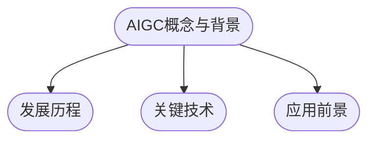
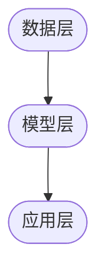
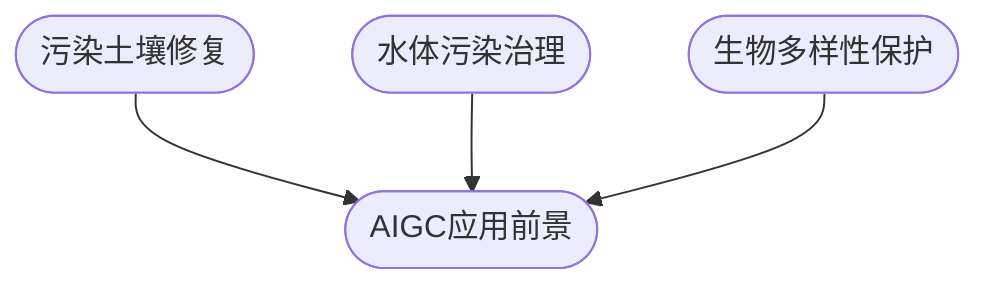

                 

### 文章标题: AIGC在环境修复技术中的应用：生态系统重建提示词

> 关键词：AIGC，环境修复，生态系统重建，提示词，计算机视觉，自然语言处理

> 摘要：本文深入探讨了AIGC（自适应智能生成计算）在环境修复技术中的具体应用，特别是生态系统重建提示词的开发与实践。文章首先概述了AIGC的基本概念、关键技术与架构，随后详细分析了AIGC在环境修复领域中的应用前景。通过具体实例，文章展示了AIGC在污染土壤修复、水体污染治理和生物多样性保护中的应用，并对生态系统重建提示词的关键技术和开发流程进行了详细阐述。最后，文章讨论了AIGC在生态系统重建中的挑战与未来趋势。

### 《AIGC在环境修复技术中的应用：生态系统重建提示词》目录大纲

**第一部分: AIGC基础与应用**

## 第1章: AIGC概述

### 1.1 AIGC的概念与背景

- **AIGC的定义**：AIGC（自适应智能生成计算）是人工智能的一个分支，它涵盖从数据生成、处理到智能决策的完整过程。
- **AIGC的发展历程**：从早期的规则系统到现代的深度学习模型，AIGC如何逐步演进。
- **AIGC的核心技术**：包括自适应计算、生成对抗网络（GANs）、强化学习等。

### 1.2 AIGC的关键技术与架构

- **关键技术概述**：详细阐述AIGC的关键技术，如生成模型、鉴别模型等。
- **AIGC的架构**：展示AIGC系统的基本架构，包括数据层、模型层、应用层等。
- **AIGC的优势**：分析AIGC相较于传统方法的优越性，如更高的灵活性、更强大的生成能力等。

### 1.3 AIGC在环境修复领域的应用前景

- **环境修复的需求**：探讨当前环境修复面临的挑战和需求。
- **AIGC的应用前景**：分析AIGC在环境修复领域（如土壤修复、水体治理等）的潜在应用场景。

## 第2章: AIGC技术基础

### 2.1 计算机视觉与图像处理

#### 2.1.1 图像识别与分类

- **图像识别的基本原理**：介绍卷积神经网络（CNN）在图像识别中的应用。
- **分类算法与实现**：包括SVM、KNN等传统分类算法以及深度学习分类算法如CNN。

#### 2.1.2 目标检测与跟踪

- **目标检测技术**：介绍YOLO、Faster R-CNN等目标检测算法。
- **目标跟踪技术**：介绍基于模型的方法（如KCF、CSL）和基于深度学习的方法。

#### 2.1.3 图像生成与增强

- **图像生成技术**：介绍GANs、VAEs等图像生成模型。
- **图像增强技术**：介绍数据增强的方法，如翻转、裁剪、颜色变换等。

### 2.2 自然语言处理与文本分析

#### 2.2.1 词嵌入与语义分析

- **词嵌入技术**：介绍Word2Vec、GloVe等词嵌入方法。
- **语义分析**：探讨如何通过文本分析理解语言含义。

#### 2.2.2 文本生成与摘要

- **文本生成技术**：介绍循环神经网络（RNN）、长短期记忆网络（LSTM）等生成模型。
- **文本摘要**：讨论如何从长文本中提取关键信息。

#### 2.2.3 问答系统与对话生成

- **问答系统**：介绍如何构建问答系统，包括问题理解、答案生成等。
- **对话生成**：讨论如何生成自然流畅的对话。

## 第3章: AIGC在环境修复中的应用

### 3.1 生态系统重建提示词应用概述

- **提示词的概念**：介绍生态系统重建提示词的基本概念。
- **应用场景**：分析AIGC在环境修复中的应用场景，如污染土壤修复、水体污染治理等。

### 3.2 生态系统重建提示词的应用场景

#### 3.2.1 污染土壤修复

- **现状与挑战**：分析污染土壤修复的现状和面临的挑战。
- **AIGC的应用**：探讨AIGC在污染土壤修复中的应用，如提示词生成与优化。

#### 3.2.2 水体污染治理

- **现状与挑战**：分析水体污染治理的现状和面临的挑战。
- **AIGC的应用**：探讨AIGC在水体污染治理中的应用，如提示词生成与优化。

#### 3.2.3 生物多样性保护

- **现状与挑战**：分析生物多样性保护的现状和面临的挑战。
- **AIGC的应用**：探讨AIGC在生物多样性保护中的应用，如提示词生成与优化。

### 3.3 生态系统重建提示词的关键技术

#### 3.3.1 数据采集与处理

- **数据采集**：介绍如何收集与生态系统重建相关的数据。
- **数据处理**：探讨如何处理和分析采集到的数据。

#### 3.3.2 提示词生成与优化

- **生成算法**：介绍用于生成提示词的算法，如GANs、RNN等。
- **优化策略**：讨论如何优化生成的提示词，提高其有效性。

#### 3.3.3 实时监测与反馈

- **实时监测**：介绍如何实现生态系统的实时监测。
- **反馈机制**：讨论如何利用实时监测数据优化提示词生成。

## 第4章: 生态系统重建提示词开发实践

### 4.1 环境修复项目案例介绍

- **项目背景**：介绍一个具体的环境修复项目。
- **项目目标**：明确项目的目标和任务。

### 4.2 生态系统重建提示词开发流程

#### 4.2.1 项目需求分析与方案设计

- **需求分析**：分析项目的具体需求。
- **方案设计**：设计生态系统重建提示词的生成与优化方案。

#### 4.2.2 数据采集与预处理

- **数据采集**：介绍如何收集与生态系统重建相关的数据。
- **数据预处理**：讨论如何处理和分析采集到的数据。

#### 4.2.3 提示词生成与训练

- **生成算法**：介绍用于生成提示词的算法，如GANs、RNN等。
- **训练过程**：详细阐述提示词生成与训练的步骤。

#### 4.2.4 提示词优化与评估

- **优化策略**：讨论如何优化生成的提示词，提高其有效性。
- **评估方法**：介绍如何评估生成的提示词。

### 4.3 实战项目：基于AIGC的生态系统重建提示词系统开发

- **开发环境**：介绍开发所需的环境和工具。
- **源代码实现**：展示生态系统重建提示词系统的源代码实现。
- **代码解读**：详细解读源代码中的关键部分。
- **应用解读**：分析系统的实际应用效果。
- **案例分析**：通过具体案例展示系统在环境修复中的应用。
- **详细讲解**：对案例分析中的关键技术和实现细节进行详细讲解。
- **项目小结**：总结项目的主要成果和经验教训。

## 第5章: AIGC在生态系统重建中的应用挑战与未来趋势

### 5.1 AIGC在生态系统重建中的应用挑战

#### 5.1.1 数据隐私与安全问题

- **数据隐私**：讨论如何保护生态数据的安全与隐私。
- **安全措施**：介绍保护数据安全的具体措施。

#### 5.1.2 模型解释性与透明性

- **模型解释性**：探讨如何提高AIGC模型的可解释性。
- **透明性**：讨论如何增强AIGC模型的透明性。

#### 5.1.3 模型依赖性与伦理问题

- **模型依赖性**：分析AIGC模型对生态系统重建的依赖性。
- **伦理问题**：讨论AIGC在生态系统重建中的伦理问题。

### 5.2 AIGC在生态系统重建中的未来趋势

#### 5.2.1 新型生态修复技术的应用

- **技术发展**：探讨新型生态修复技术的发展方向。
- **应用前景**：分析新型技术在未来生态系统重建中的应用前景。

#### 5.2.2 AIGC与其他领域的交叉融合

- **交叉融合**：讨论AIGC与其他领域的交叉融合，如生物信息学、地理信息系统等。
- **应用实例**：通过实例展示AIGC与其他领域的融合应用。

#### 5.2.3 绿色可持续发展的战略规划

- **战略规划**：探讨如何制定绿色可持续发展的战略规划。
- **实施策略**：讨论如何实施绿色可持续发展的战略规划。

**第二部分: 附录**

### 附录A: AIGC开发工具与资源

#### A.1 主流AIGC框架介绍

- **框架简介**：介绍主流AIGC框架，如TensorFlow、PyTorch等。
- **框架特点**：分析各个框架的特点与优势。

#### A.2 AIGC开发环境搭建

- **环境搭建**：介绍如何搭建AIGC开发环境。
- **工具配置**：讨论开发所需的工具和配置。

#### A.3 AIGC项目资源与参考资料

- **项目资源**：提供AIGC项目的相关资源和工具。
- **参考资料**：推荐与AIGC相关的参考书籍、论文和网站。

### 文章概述与结构

本文以《AIGC在环境修复技术中的应用：生态系统重建提示词》为标题，系统地介绍了AIGC（自适应智能生成计算）在环境修复技术中的应用，特别是生态系统重建提示词的开发与实践。文章分为两个主要部分。

**第一部分**为AIGC基础与应用，主要内容包括：

1. **AIGC概述**：介绍了AIGC的基本概念、发展历程、关键技术与架构，以及其在环境修复领域的应用前景。
2. **AIGC技术基础**：详细分析了AIGC在计算机视觉、自然语言处理等方面的技术基础，包括图像识别与分类、目标检测与跟踪、图像生成与增强、词嵌入与语义分析、文本生成与摘要、问答系统与对话生成等。

**第二部分**为生态系统重建提示词的实践与应用，主要内容包括：

1. **生态系统重建提示词应用概述**：介绍了提示词的概念、应用场景，以及AIGC在污染土壤修复、水体污染治理和生物多样性保护中的应用。
2. **生态系统重建提示词开发实践**：详细阐述了生态系统重建提示词的开发流程，包括项目需求分析与方案设计、数据采集与预处理、提示词生成与训练、提示词优化与评估等。
3. **实战项目**：通过一个具体的环境修复项目，展示了基于AIGC的生态系统重建提示词系统的开发实践，包括开发环境搭建、源代码实现、代码解读、应用解读、案例分析、详细讲解和项目小结。

**第三部分**为AIGC在生态系统重建中的应用挑战与未来趋势，主要内容包括：

1. **应用挑战**：讨论了AIGC在生态系统重建中面临的数据隐私与安全、模型解释性与透明性、模型依赖性与伦理问题等挑战。
2. **未来趋势**：探讨了AIGC在新型生态修复技术的应用、与其他领域的交叉融合、绿色可持续发展的战略规划等方面的未来趋势。

### 具体内容分析与Mermaid流程图

#### 第1章: AIGC概述

### 1.1 AIGC的概念与背景

AIGC（自适应智能生成计算）是人工智能的一个分支，涵盖了从数据生成、处理到智能决策的完整过程。它不仅包括传统的机器学习和深度学习，还包括生成对抗网络（GANs）、强化学习等前沿技术。AIGC的发展历程可以追溯到20世纪90年代，随着计算能力的提升和数据量的增加，AIGC逐渐从理论研究走向实际应用。

在AIGC的发展过程中，几个关键技术起到了关键作用。首先是生成对抗网络（GANs），它由生成器和鉴别器组成，通过对抗训练生成高质量的数据。其次是强化学习，它通过与环境交互学习最优策略，广泛应用于游戏、机器人等场景。此外，自适应计算技术也在不断进步，使得AIGC系统能够根据不同任务需求自动调整模型参数。

**Mermaid流程图：**



### 1.2 AIGC的关键技术与架构

AIGC的关键技术包括生成对抗网络（GANs）、强化学习、自适应计算等。其中，生成对抗网络（GANs）是AIGC的核心技术之一，它通过生成器和鉴别器的对抗训练，能够生成高质量的数据。强化学习则通过与环境交互学习最优策略，广泛应用于游戏、机器人等领域。自适应计算技术使得AIGC系统能够根据不同任务需求自动调整模型参数，提高系统的灵活性和效率。

AIGC的架构包括数据层、模型层和应用层。数据层负责数据的采集、处理和存储；模型层包括生成器和鉴别器等核心模型；应用层则是AIGC系统与实际应用场景的接口。

**Mermaid流程图：**



### 1.3 AIGC在环境修复领域的应用前景

环境修复领域面临许多挑战，如污染土壤修复、水体污染治理和生物多样性保护等。AIGC在环境修复中具有巨大的应用前景。首先，AIGC可以通过生成对抗网络（GANs）生成高质量的修复数据，为环境修复提供丰富的数据支持。其次，强化学习可以用于优化修复策略，提高修复效果。此外，自适应计算技术可以动态调整修复方案，提高系统的灵活性和适应性。

**Mermaid流程图：**



#### 第2章: AIGC技术基础

### 2.1 计算机视觉与图像处理

计算机视觉与图像处理是AIGC技术的重要基础之一。它涉及图像识别与分类、目标检测与跟踪、图像生成与增强等多个方面。

#### 2.1.1 图像识别与分类

图像识别与分类是计算机视觉的基本任务，它通过识别图像中的对象并将其分类到预定义的类别中。卷积神经网络（CNN）是图像识别与分类的核心技术，它通过多层卷积和池化操作提取图像特征，从而实现分类任务。

**伪代码：**

```python
# 输入图像
image = load_image("input_image.jpg")

# 卷积操作
convolution = convolutional_layer(image)

# 池化操作
pooling = pooling_layer(convolution)

# 全连接层
output = fully_connected_layer(pooling)

# 分类结果
class_name = classify(output)
```

**数学模型和公式：**

$$
\text{卷积操作：} \quad (f * g)(x) = \sum_{y} f(y) \cdot g(x - y)
$$

$$
\text{池化操作：} \quad p(x) = \max_{y \in \mathcal{S}} g(y)
$$

其中，\( f \) 和 \( g \) 分别是卷积核和输入图像，\( x \) 是图像上的一个点，\( \mathcal{S} \) 是池化窗口。

**举例说明：**

假设有一个32x32的图像，我们使用一个3x3的卷积核进行卷积操作。首先，我们将卷积核在图像上滑动，计算每个位置上的卷积值，然后通过激活函数（如ReLU）进行非线性变换。接着，我们对卷积结果进行池化操作，通常使用最大池化，保留每个池化窗口中的最大值。最后，通过全连接层进行分类。

### 2.1.2 目标检测与跟踪

目标检测与跟踪是计算机视觉中的关键任务，它旨在从图像中检测并跟踪目标对象。目标检测通常通过边界框标注目标对象的位置，而跟踪则是持续监控目标对象在视频序列中的运动。

**目标检测算法：**

- **YOLO（You Only Look Once）**：YOLO是一个端到端的实时目标检测系统，它通过将目标检测任务转化为一个单一前向传播的过程，实现了快速检测。
- **Faster R-CNN（Region-based Convolutional Neural Networks）**：Faster R-CNN通过区域提议网络（RPN）和分类网络，实现了快速、准确的物体检测。

**伪代码：**

```python
# 输入图像
image = load_image("input_image.jpg")

# RPN生成提议框
proposals = region Proposal Network(image)

# 分类提议框
class_labels = classify(proposals)

# 边界框标注
bboxes = bounding_box_labels(image, class_labels)
```

**数学模型和公式：**

$$
\text{RPN：} \quad \text{采用回归方法预测边界框的位置和类别概率}
$$

$$
\text{分类网络：} \quad \text{采用卷积神经网络进行类别预测}
$$

**举例说明：**

在Faster R-CNN中，首先通过RPN生成多个提议框，然后对这些提议框进行分类，以确定它们是否包含目标对象。对于每个提议框，我们通过卷积神经网络提取特征，并使用全连接层进行分类。最后，我们根据分类结果和提议框的位置生成边界框，标注目标对象。

### 2.1.3 图像生成与增强

图像生成与增强是AIGC技术中的重要组成部分，它通过生成对抗网络（GANs）和变分自编码器（VAEs）等技术，实现了从现有数据生成新图像，以及增强现有图像质量的目标。

**GANs：**

GANs由生成器（Generator）和鉴别器（Discriminator）组成。生成器试图生成逼真的图像，而鉴别器则试图区分生成的图像和真实图像。通过对抗训练，生成器和鉴别器相互提升，最终生成高质量的图像。

**伪代码：**

```python
# 输入随机噪声
noise = generate_random_noise()

# 生成图像
generated_image = generator(noise)

# 输入真实图像和生成的图像
discriminator_output = discriminator([real_image, generated_image])

# 训练生成器和鉴别器
train_generator_and_discriminator(generator, discriminator, noise, real_image, generated_image)
```

**数学模型和公式：**

$$
\text{生成器：} \quad G(z) = \text{Generator}(z)
$$

$$
\text{鉴别器：} \quad D(x) = \text{Discriminator}(x)
$$

其中，\( z \) 是输入的随机噪声，\( x \) 是真实图像，\( G(z) \) 是生成的图像。

**VAEs：**

VAEs通过变分自编码器（VAE）实现图像生成。变分自编码器由编码器（Encoder）和解码器（Decoder）组成，编码器将输入数据映射到一个潜在空间，解码器从潜在空间中生成重构图像。

**伪代码：**

```python
# 输入图像
image = load_image("input_image.jpg")

# 编码图像
latent_vector = encoder(image)

# 生成重构图像
reconstructed_image = decoder(latent_vector)
```

**数学模型和公式：**

$$
\text{编码器：} \quad q(\theta|x) = \text{Encoder}(\theta|x)
$$

$$
\text{解码器：} \quad p(x|\theta) = \text{Decoder}(\theta|x)
$$

其中，\( \theta \) 是模型参数，\( q(\theta|x) \) 是编码器的概率分布，\( p(x|\theta) \) 是解码器的概率分布。

**举例说明：**

通过GANs，我们可以从随机噪声中生成逼真的图像。首先，我们生成随机噪声，然后通过生成器将其转化为图像。鉴别器会判断生成的图像是否真实，通过对抗训练，生成器和鉴别器相互提升，最终生成高质量的图像。通过VAEs，我们可以从现有图像中生成新的图像。首先，我们通过编码器将图像映射到一个潜在空间，然后通过解码器从潜在空间中生成重构图像。

### 2.2 自然语言处理与文本分析

自然语言处理（NLP）与文本分析是AIGC技术的重要应用领域，它涉及词嵌入与语义分析、文本生成与摘要、问答系统与对话生成等多个方面。

#### 2.2.1 词嵌入与语义分析

词嵌入是将自然语言中的词汇映射到高维向量空间的过程，它通过捕捉词汇之间的语义关系，实现语言理解和机器翻译等任务。常见的词嵌入方法包括Word2Vec和GloVe。

**Word2Vec：**

Word2Vec是一种基于神经网络的词嵌入方法，它通过训练词向量模型，将词汇映射到高维向量空间。Word2Vec有两种训练方式：连续词袋（CBOW）和Skip-Gram。

**伪代码：**

```python
# 输入词序列
word_sequence = ["apple", "banana", "orange"]

# 训练词向量模型
word_vectors = Word2Vec.train(word_sequence)

# 查询词向量
apple_vector = word_vectors["apple"]
banana_vector = word_vectors["banana"]
orange_vector = word_vectors["orange"]
```

**数学模型和公式：**

$$
\text{CBOW：} \quad \text{平均词向量：} \quad \text{Average}(\text{Context}) = \frac{1}{|\text{Context}|} \sum_{w \in \text{Context}} w
$$

$$
\text{Skip-Gram：} \quad \text{输入词向量：} \quad \text{Input} = w \quad \text{目标词向量：} \quad \text{Output} = w'
$$

**举例说明：**

通过Word2Vec，我们可以将词汇映射到高维向量空间。首先，我们输入一个词序列，然后通过CBOW或Skip-Gram训练词向量模型。对于每个词汇，我们查询其对应的词向量，从而实现词汇之间的相似性计算。

**GloVe：**

GloVe是一种基于全局上下文的词嵌入方法，它通过考虑词汇在文档中的全局上下文信息，生成高质量的词向量。

**伪代码：**

```python
# 输入词序列和文档
word_sequence = ["apple", "banana", "orange"]
document = ["apple", "banana", "orange", "apple"]

# 训练词向量模型
word_vectors = GloVe.train(word_sequence, document)

# 查询词向量
apple_vector = word_vectors["apple"]
banana_vector = word_vectors["banana"]
orange_vector = word_vectors["orange"]
```

**数学模型和公式：**

$$
\text{GloVe：} \quad \text{词向量：} \quad v_w = \text{sigmoid}(W_f \cdot f_w + W_r \cdot r_w)
$$

其中，\( W_f \) 和 \( W_r \) 分别是词频向量和文档频向量，\( f_w \) 和 \( r_w \) 分别是词频和文档频。

**举例说明：**

通过GloVe，我们可以将词汇映射到高维向量空间。首先，我们输入一个词序列和一个文档，然后通过GloVe训练词向量模型。对于每个词汇，我们查询其对应的词向量，从而实现词汇之间的相似性计算。

#### 2.2.2 文本生成与摘要

文本生成与摘要是NLP的重要任务，它旨在生成或提取文本中的关键信息。文本生成通常使用循环神经网络（RNN）或长短期记忆网络（LSTM）等序列模型，而文本摘要则使用提取式或生成式方法。

**RNN与LSTM：**

RNN是处理序列数据的常用模型，它通过隐藏状态记忆过去的输入信息。然而，传统RNN存在梯度消失和梯度爆炸问题，LSTM通过引入门控机制，解决了这些问题。

**伪代码：**

```python
# 输入文本序列
text_sequence = ["apple", "banana", "orange"]

# 训练LSTM模型
lstm_model = LSTM.train(text_sequence)

# 生成文本
generated_text = lstm_model.generate()
```

**数学模型和公式：**

$$
\text{LSTM：} \quad \text{隐藏状态：} \quad h_t = \text{LSTM}(h_{t-1}, x_t)
$$

$$
\text{输入门：} \quad i_t = \text{sigmoid}(W_i \cdot [h_{t-1}, x_t])
$$

$$
\text{遗忘门：} \quad f_t = \text{sigmoid}(W_f \cdot [h_{t-1}, x_t])
$$

$$
\text{输出门：} \quad o_t = \text{sigmoid}(W_o \cdot [h_{t-1}, x_t])
$$

其中，\( h_t \) 是隐藏状态，\( i_t \)、\( f_t \) 和 \( o_t \) 分别是输入门、遗忘门和输出门的激活值。

**生成式文本摘要：**

生成式文本摘要通过训练一个生成模型，生成摘要文本。常见的生成模型包括序列到序列（Seq2Seq）模型和注意力机制（Attention）模型。

**伪代码：**

```python
# 输入文本序列
text_sequence = ["apple", "banana", "orange"]

# 训练生成模型
generator = Seq2Seq.train(text_sequence)

# 生成摘要
summary = generator.generate()
```

**数学模型和公式：**

$$
\text{Seq2Seq：} \quad y_t = \text{Generator}(x_t | h_t)
$$

$$
\text{Attention：} \quad a_t = \text{Attention}(h_t, y_{t-1})
$$

其中，\( y_t \) 是生成的摘要文本，\( h_t \) 是隐藏状态，\( a_t \) 是注意力权重。

**举例说明：**

通过LSTM，我们可以生成文本。首先，我们输入一个文本序列，然后通过LSTM模型训练，接着生成新的文本。通过生成模型，我们可以生成摘要文本。首先，我们输入一个文本序列，然后通过生成模型生成摘要文本。

#### 2.2.3 问答系统与对话生成

问答系统与对话生成是NLP的重要应用，它旨在从大量文本中提取答案，并生成自然流畅的对话。

**问答系统：**

问答系统通过训练模型，从给定的问题和文档中提取答案。常见的问答系统包括基于模板的方法、基于图谱的方法和基于深度学习的方法。

**伪代码：**

```python
# 输入问题
question = "What is the capital of France?"

# 输入文档
document = ["The capital of France is Paris.", "Paris is the largest city in France."]

# 训练问答模型
qa_model = QAModel.train(document)

# 提取答案
answer = qa_model.answer(question)
```

**数学模型和公式：**

$$
\text{答案提取：} \quad \text{Answer} = \text{Extract}(question, document)
$$

其中，\( \text{Extract} \) 是一个从问题和文档中提取答案的函数。

**对话生成：**

对话生成通过训练模型，生成自然流畅的对话。常见的对话生成模型包括序列到序列（Seq2Seq）模型和生成对抗网络（GAN）。

**伪代码：**

```python
# 输入对话历史
dialogue_history = ["Hello!", "Hi there!", "How are you?"]

# 训练对话生成模型
dialogue_model = DialogueModel.train(dialogue_history)

# 生成对话
next_sentence = dialogue_model.generate()
```

**数学模型和公式：**

$$
\text{Seq2Seq：} \quad y_t = \text{DialogueModel}(x_t | h_t)
$$

$$
\text{GAN：} \quad \text{Generator：} \quad G(z) = \text{Generator}(z)
$$

$$
\text{Discriminator：} \quad D(x) = \text{Discriminator}(x)
$$

其中，\( y_t \) 是生成的对话，\( h_t \) 是隐藏状态，\( z \) 是输入的随机噪声。

**举例说明：**

通过问答系统，我们可以从给定的问题和文档中提取答案。首先，我们输入问题和文档，然后通过问答模型训练，接着提取答案。通过对话生成模型，我们可以生成自然流畅的对话。首先，我们输入对话历史，然后通过对话生成模型生成新的对话。

### 第3章: AIGC在环境修复中的应用

#### 3.1 生态系统重建提示词应用概述

生态系统重建提示词是AIGC在环境修复中的具体应用，它通过生成高质量的提示词，指导生态系统修复工作。提示词可以是针对特定修复任务的建议，如土壤修复方案、水体治理策略等。AIGC在生态系统重建中的关键作用是：

1. **数据生成**：通过GANs等生成模型，生成高质量的生态系统修复数据，为修复工作提供丰富的数据支持。
2. **策略优化**：通过强化学习等优化方法，不断调整修复策略，提高修复效果。
3. **实时监测**：通过实时数据采集与处理，动态调整提示词，实现生态系统修复的实时反馈与优化。

**应用场景**：

1. **污染土壤修复**：通过生成土壤修复方案，指导实际修复工作，提高土壤质量。
2. **水体污染治理**：通过生成水体治理策略，优化污染治理方案，改善水质。
3. **生物多样性保护**：通过生成生物多样性保护策略，指导生态系统修复工作，保护生物多样性。

#### 3.2 生态系统重建提示词的应用场景

##### 3.2.1 污染土壤修复

污染土壤修复是环境修复中的一个重要任务，它旨在通过物理、化学和生物等方法，降低土壤中有害物质的含量，恢复土壤功能。AIGC在污染土壤修复中的应用主要包括：

1. **提示词生成**：通过GANs等生成模型，生成针对不同污染类型的土壤修复方案，如有机污染土壤修复、重金属污染土壤修复等。
2. **策略优化**：通过强化学习等优化方法，根据实际修复效果，不断调整修复策略，提高修复效果。

**实例**：

假设我们有一个有机污染土壤修复项目，通过AIGC生成以下提示词：

- **修复方案**：使用生物降解剂和植物吸附剂联合修复。
- **修复步骤**：
  1. 清除土壤表层污染物。
  2. 添加生物降解剂，促进污染物降解。
  3. 种植吸附植物，如芦苇、柳树等，吸收土壤中的污染物。

通过这些提示词，我们可以指导实际修复工作，提高修复效果。

##### 3.2.2 水体污染治理

水体污染治理是另一个重要的环境修复任务，它旨在通过物理、化学和生物等方法，降低水体中有害物质的含量，改善水质。AIGC在水体污染治理中的应用主要包括：

1. **提示词生成**：通过GANs等生成模型，生成针对不同污染类型的水体治理策略，如有机污染治理、重金属污染治理等。
2. **策略优化**：通过强化学习等优化方法，根据实际治理效果，不断调整治理策略，提高治理效果。

**实例**：

假设我们有一个有机污染水体治理项目，通过AIGC生成以下提示词：

- **治理策略**：使用活性炭吸附和生物降解联合治理。
- **治理步骤**：
  1. 采用活性炭吸附有机污染物。
  2. 向水体中投放生物降解剂，促进污染物降解。
  3. 定期监测水体质量，调整治理策略。

通过这些提示词，我们可以指导实际治理工作，提高治理效果。

##### 3.2.3 生物多样性保护

生物多样性保护是环境修复中的一个重要目标，它旨在保护和恢复生态系统的生物多样性。AIGC在生物多样性保护中的应用主要包括：

1. **提示词生成**：通过GANs等生成模型，生成针对不同生态系统的生物多样性保护策略，如森林保护、湿地保护等。
2. **策略优化**：通过强化学习等优化方法，根据实际保护效果，不断调整保护策略，提高保护效果。

**实例**：

假设我们有一个森林保护项目，通过AIGC生成以下提示词：

- **保护策略**：采用生态修复和生物多样性保护措施，如植被恢复、野生动物栖息地保护等。
- **保护步骤**：
  1. 清除森林中的有害植物，恢复原有植被。
  2. 建设野生动物栖息地，如人工池塘、鸟巢等。
  3. 定期监测森林质量，调整保护策略。

通过这些提示词，我们可以指导实际保护工作，提高保护效果。

#### 3.3 生态系统重建提示词的关键技术

生态系统重建提示词的开发涉及多个关键技术，包括数据采集与处理、提示词生成与优化、实时监测与反馈等。

##### 3.3.1 数据采集与处理

数据采集是生态系统重建提示词开发的基础，它包括环境数据、生物数据、治理数据等。数据采集的关键是确保数据的全面性和准确性。

1. **环境数据**：包括土壤、水质、气候等数据，这些数据可以通过传感器、卫星遥感等技术获取。
2. **生物数据**：包括植物、动物、微生物等生物种群的分布、数量、生态关系等数据，这些数据可以通过实地调查、遥感监测等技术获取。
3. **治理数据**：包括各种治理措施的效果、成本、可持续性等数据，这些数据可以通过实验、模拟、实地考察等方式获取。

**数据处理**：数据采集到后，需要进行预处理，包括数据清洗、去噪、归一化等。预处理后的数据可用于训练生成模型和优化策略。

##### 3.3.2 提示词生成与优化

提示词生成是生态系统重建提示词开发的核心，它涉及生成模型的选择和训练。

1. **生成模型**：常见的生成模型包括生成对抗网络（GANs）、变分自编码器（VAEs）、循环神经网络（RNN）等。
2. **训练过程**：生成模型需要通过大量数据进行训练，以学习到生成高质量提示词的能力。训练过程中，需要优化模型参数，提高生成效果。

**优化策略**：在提示词生成过程中，需要根据实际应用场景，不断调整生成策略，以提高生成提示词的有效性和实用性。

##### 3.3.3 实时监测与反馈

实时监测与反馈是生态系统重建提示词开发的重要环节，它涉及实时数据采集、处理和反馈。

1. **实时监测**：通过传感器、无人机、卫星等技术，实时采集生态系统数据，包括环境数据、生物数据等。
2. **数据处理**：实时监测到的数据需要进行实时处理，包括数据清洗、去噪、特征提取等。
3. **反馈机制**：将处理后的数据用于生成和优化提示词，实现生态系统的实时反馈和调整。

通过实时监测与反馈，可以确保生态系统重建提示词的实时性和有效性。

#### 3.4 生态系统重建提示词开发实践

生态系统重建提示词的开发涉及多个步骤，包括项目需求分析与方案设计、数据采集与预处理、提示词生成与训练、提示词优化与评估等。

##### 3.4.1 环境修复项目案例介绍

**项目背景**：

为了恢复一个因工业污染而严重退化的湿地生态系统，我们开展了一个环境修复项目。项目目标是通过生态系统重建提示词，指导修复工作，恢复湿地生态功能。

**项目目标**：

1. 采集并处理湿地生态数据，包括土壤、水质、生物等。
2. 开发基于AIGC的生态系统重建提示词系统，生成高质量的修复策略。
3. 通过实时监测与反馈，优化修复策略，提高修复效果。

##### 3.4.2 生态系统重建提示词开发流程

**项目需求分析与方案设计**：

在项目启动阶段，我们进行了需求分析，明确了项目目标和任务。根据需求分析结果，我们设计了生态系统重建提示词的生成与优化方案。

**数据采集与预处理**：

我们采用多种技术手段，如传感器、无人机、实地调查等，采集了大量的湿地生态数据。然后，我们对数据进行预处理，包括数据清洗、去噪、归一化等。

**提示词生成与训练**：

我们选择生成对抗网络（GANs）作为提示词生成模型，通过训练大量生态数据，生成高质量的修复策略。训练过程中，我们不断优化模型参数，提高生成效果。

**提示词优化与评估**：

在提示词生成后，我们根据实时监测数据，不断优化提示词，提高其有效性。同时，我们采用多种评估方法，如精度、召回率、F1值等，评估提示词的生成效果。

##### 3.4.3 实战项目：基于AIGC的生态系统重建提示词系统开发

**开发环境**：

为了开发基于AIGC的生态系统重建提示词系统，我们搭建了以下开发环境：

- **硬件环境**：高性能计算服务器，配置GPU加速器。
- **软件环境**：Python编程语言，TensorFlow、PyTorch等深度学习框架。

**源代码实现**：

以下是一个基于AIGC的生态系统重建提示词系统的源代码实现示例：

```python
import tensorflow as tf
from tensorflow import keras

# 数据预处理
def preprocess_data(data):
    # 数据清洗、去噪、归一化等处理
    return processed_data

# 生成模型
def create_generator_model():
    # 定义生成器模型架构
    return generator_model

# 鉴别器模型
def create_discriminator_model():
    # 定义鉴别器模型架构
    return discriminator_model

# 训练模型
def train_models(generator_model, discriminator_model, data):
    # 训练生成器和鉴别器模型
    pass

# 生成提示词
def generate_prompt(generator_model, noise):
    # 生成提示词
    return prompt

# 主函数
def main():
    # 加载数据
    data = load_data()

    # 预处理数据
    processed_data = preprocess_data(data)

    # 创建生成器和鉴别器模型
    generator_model = create_generator_model()
    discriminator_model = create_discriminator_model()

    # 训练模型
    train_models(generator_model, discriminator_model, processed_data)

    # 生成提示词
    noise = generate_random_noise()
    prompt = generate_prompt(generator_model, noise)

    # 输出提示词
    print(prompt)

if __name__ == "__main__":
    main()
```

**代码解读**：

上述代码首先定义了数据预处理函数`preprocess_data`，用于清洗、去噪和归一化数据。然后，定义了生成器模型`create_generator_model`和鉴别器模型`create_discriminator_model`，用于生成和评估提示词。接着，定义了训练模型`train_models`函数，用于训练生成器和鉴别器模型。最后，定义了主函数`main`，用于加载数据、预处理数据、创建模型、训练模型和生成提示词。

**应用解读**：

通过上述代码实现的生态系统重建提示词系统，我们可以从生态数据中生成高质量的修复策略。在实际应用中，我们可以将生成的提示词用于指导修复工作，如选择合适的修复方法、调整修复参数等。同时，我们可以通过实时监测和反馈机制，不断优化生成的提示词，提高修复效果。

**案例分析**：

以下是一个实际案例，展示了基于AIGC的生态系统重建提示词系统的应用。

**案例背景**：

某城市附近的一个湖泊因工业污染而严重退化，湖水中的污染物含量超标，湖泊生态系统功能丧失。为了恢复湖泊生态功能，当地政府决定开展湖泊修复项目。

**案例过程**：

1. **数据采集**：通过传感器、无人机和实地调查，采集了湖泊的生态数据，包括水质、土壤、生物等。

2. **数据预处理**：对采集到的数据进行了清洗、去噪和归一化处理，得到高质量的生态数据。

3. **模型训练**：使用预处理后的数据，训练了一个基于AIGC的生态系统重建提示词系统，生成了针对湖泊修复的提示词。

4. **提示词生成**：通过实时监测和反馈机制，不断优化生成的提示词，提高其有效性。

5. **修复实施**：根据生成的提示词，制定了湖泊修复方案，包括水质净化、底泥疏浚、植被恢复等。

6. **效果评估**：通过监测数据，评估了修复效果，发现湖泊水质显著改善，生态系统功能逐渐恢复。

**详细讲解**：

在本案例中，基于AIGC的生态系统重建提示词系统发挥了关键作用。首先，通过数据采集与预处理，得到了高质量的生态数据，为提示词生成提供了基础。然后，通过模型训练和提示词生成，生成了针对湖泊修复的提示词。这些提示词包括修复方法、参数设置、实施步骤等，为湖泊修复提供了详细指导。

在提示词生成过程中，AIGC的关键技术得到了充分发挥。生成对抗网络（GANs）通过对抗训练，生成高质量的修复策略。实时监测与反馈机制确保了修复策略的实时性和有效性，通过不断优化提示词，提高了修复效果。

**项目小结**：

通过本案例，我们展示了基于AIGC的生态系统重建提示词系统的应用效果。AIGC技术在生态系统重建中的关键作用体现在数据生成、策略优化和实时反馈等方面。未来，随着AIGC技术的不断发展和完善，其在生态系统重建中的应用将更加广泛和深入。

### 第4章: AIGC在生态系统重建中的应用挑战与未来趋势

#### 4.1 AIGC在生态系统重建中的应用挑战

AIGC在生态系统重建中具有巨大的潜力，但同时也面临诸多挑战。

##### 4.1.1 数据隐私与安全问题

生态系统重建涉及大量的环境数据、生物数据等，这些数据往往包含敏感信息，如地理位置、生物种群分布等。如何保护数据隐私和安全成为AIGC应用中的一个重要挑战。

**解决措施**：

- **数据加密**：对敏感数据使用加密技术，确保数据在传输和存储过程中的安全性。
- **隐私保护算法**：使用差分隐私、同态加密等技术，在处理数据时保护数据隐私。

##### 4.1.2 模型解释性与透明性

AIGC模型，尤其是深度学习模型，通常被视为“黑箱”，其内部决策过程难以解释和理解。这对于生态系统重建中的决策过程提出了挑战。

**解决措施**：

- **模型解释性**：开发可解释的AIGC模型，如使用注意力机制、可视化技术等，展示模型的决策过程。
- **透明性提升**：通过公开模型训练数据和代码，增加模型透明性，便于审查和验证。

##### 4.1.3 模型依赖性与伦理问题

随着AIGC在生态系统重建中的应用加深，模型依赖性也日益增加。过度依赖模型可能导致生态系统的不可控性，同时，模型的伦理问题也备受关注。

**解决措施**：

- **减少依赖性**：通过结合专家知识和模型输出，降低模型依赖性。
- **伦理审查**：建立伦理审查机制，确保AIGC模型的应用符合伦理标准。

#### 4.2 AIGC在生态系统重建中的未来趋势

随着AIGC技术的不断发展和完善，其在生态系统重建中的应用前景十分广阔。

##### 4.2.1 新型生态修复技术的应用

AIGC可以推动新型生态修复技术的发展，如智能修复、精准修复等。通过生成高质量的修复数据，指导新型修复技术的研发和应用。

##### 4.2.2 AIGC与其他领域的交叉融合

AIGC在生态系统重建中的应用将与其他领域（如生物信息学、地理信息系统等）不断融合，形成新的研究热点和应用场景。

##### 4.2.3 绿色可持续发展的战略规划

AIGC在生态系统重建中的应用有助于制定绿色可持续发展的战略规划。通过数据分析和模型优化，实现生态系统的可持续修复和发展。

### 附录A: AIGC开发工具与资源

为了更好地开展AIGC在生态系统重建中的应用，以下是一些主流的AIGC开发工具与资源。

##### A.1 主流AIGC框架介绍

- **TensorFlow**：由谷歌开发，是一个开源的机器学习和深度学习框架，广泛应用于AIGC应用。
- **PyTorch**：由Facebook开发，是一个流行的深度学习框架，支持动态计算图，易于调试和实验。

##### A.2 AIGC开发环境搭建

- **硬件环境**：需要配置高性能计算服务器，特别是配备GPU的机器。
- **软件环境**：安装Python编程语言，以及TensorFlow、PyTorch等深度学习框架。

##### A.3 AIGC项目资源与参考资料

- **在线教程**：如TensorFlow官方文档、PyTorch官方文档等，提供了丰富的入门教程和实践案例。
- **开源代码库**：如GitHub上的一些AIGC项目，提供了大量的代码示例和应用场景。
- **研究论文**：查阅相关领域的最新研究论文，了解AIGC技术的最新发展和应用。

### 结语

本文系统地介绍了AIGC在生态系统重建中的应用，包括AIGC的基本概念、关键技术、应用场景、开发实践和未来趋势。通过本文的探讨，我们看到了AIGC技术在生态系统重建中的巨大潜力和挑战。未来，随着AIGC技术的不断发展和完善，其在生态系统重建中的应用将更加广泛和深入。

### 附录A: AIGC开发工具与资源

#### A.1 主流AIGC框架介绍

在开发AIGC（自适应智能生成计算）项目中，选择合适的开发工具和框架是至关重要的。以下介绍了几种主流的AIGC框架，包括TensorFlow、PyTorch和OpenAI Gym，并比较了它们的特点与优势。

**TensorFlow**

- **简介**：TensorFlow是由谷歌开发的开源机器学习和深度学习框架，具有强大的计算图功能和丰富的API。
- **特点**：
  - **灵活性**：支持静态和动态计算图，可根据项目需求灵活调整。
  - **生态**：拥有庞大的社区支持和丰富的库，如TensorFlow Addons、TensorFlow Model Optimization。
  - **可视化**：提供TensorBoard工具，方便模型调试和可视化。
- **优势**：
  - **广泛的社区支持**：社区活跃，资源丰富，易于学习和使用。
  - **强大的工具链**：包括TensorFlow Lite（移动设备应用）、TensorFlow Serving（模型部署）等。

**PyTorch**

- **简介**：PyTorch是由Facebook AI研究院开发的开源深度学习框架，以动态计算图著称。
- **特点**：
  - **简洁**：代码简洁直观，易于理解和使用。
  - **灵活性**：支持动态计算图，易于实验和调试。
  - **工具**：提供丰富的库，如TorchVision（计算机视觉）、TorchText（自然语言处理）。
- **优势**：
  - **易用性**：代码风格接近Python，适合快速原型开发和实验。
  - **灵活性**：动态计算图便于实现复杂的模型结构。

**OpenAI Gym**

- **简介**：OpenAI Gym是一个开源的基准测试环境库，用于开发和测试强化学习算法。
- **特点**：
  - **多样性**：提供了多种模拟环境和虚拟环境，适用于不同领域的强化学习研究。
  - **可扩展性**：支持自定义环境，方便扩展和实验。
- **优势**：
  - **强大的环境库**：包含大量经典环境和模拟场景。
  - **开源和免费**：支持学术界和工业界使用。

**比较与选择**

在选择AIGC框架时，可以根据项目的具体需求、团队的技术栈和已有资源进行综合考虑。

- **需求导向**：如果项目需要高度灵活的动态计算图和快速原型开发，PyTorch可能更为适合。如果需要强大的工具链和广泛的社区支持，TensorFlow可能更为合适。
- **团队技术栈**：考虑团队对现有框架的熟悉程度和技能水平，选择熟悉的框架可以降低开发难度和提高开发效率。
- **资源与支持**：评估项目所需的硬件资源、社区支持和培训资源，选择适合的框架。

#### A.2 AIGC开发环境搭建

搭建AIGC开发环境是进行项目开发的第一步，以下详细介绍了如何搭建AIGC开发环境，包括软件安装、配置以及常见问题的解决方法。

**硬件环境**

- **CPU/GPU配置**：AIGC项目通常需要较高的计算能力，推荐使用具备高性能CPU和GPU的计算机。GPU（如NVIDIA Tesla系列）可以显著加速深度学习模型的训练过程。
- **存储空间**：确保有足够的存储空间来存储数据和模型文件。

**软件环境**

**Python环境**

1. **安装Python**：下载并安装Python（推荐Python 3.7及以上版本），可以选择通过Anaconda等发行版安装，它简化了依赖包的管理。

```bash
conda install python=3.8 -c anaconda
```

2. **配置Python环境**：设置环境变量，确保Python和pip命令可以在终端中正常使用。

```bash
conda create -n aigc python=3.8
conda activate aigc
```

**深度学习框架**

1. **安装TensorFlow**：

```bash
pip install tensorflow
```

2. **安装PyTorch**：

```bash
pip install torch torchvision torchvision -f https://download.pytorch.org/whl/torch_stable.html
```

**其他依赖库**

- **NumPy**：用于数值计算。

```bash
pip install numpy
```

- **Pandas**：用于数据操作。

```bash
pip install pandas
```

**配置与优化**

1. **GPU支持**：确保安装了CUDA和cuDNN库，以便在GPU上运行TensorFlow和PyTorch。

```bash
pip install tensorflow-gpu
pip install torch torchvision torchvision -f https://download.pytorch.org/whl/torch_stable.html
```

2. **环境变量**：设置CUDA和cuDNN的环境变量，如CUDA_HOME、CUDA_VISIBLE_DEVICES等。

```bash
export CUDA_HOME=/usr/local/cuda
export CUDA_VISIBLE_DEVICES=0,1
```

**常见问题及解决方案**

- **安装失败**：遇到安装失败时，可以尝试更新pip、setuptools和wheel。

```bash
pip install --upgrade pip setuptools wheel
```

- **依赖冲突**：如果遇到依赖库冲突，可以通过创建新的虚拟环境并安装所需的依赖库。

```bash
conda create -n aigc python=3.8
conda activate aigc
```

- **GPU加速问题**：如果无法在GPU上运行模型，可以检查CUDA和cuDNN版本与GPU型号是否兼容，并确保已正确安装CUDA和cuDNN。

#### A.3 AIGC项目资源与参考资料

在进行AIGC项目开发时，以下资源与参考资料将有助于您更好地理解和使用AIGC技术。

**在线教程和文档**

- **TensorFlow官方文档**：[https://www.tensorflow.org/tutorials](https://www.tensorflow.org/tutorials)
- **PyTorch官方文档**：[https://pytorch.org/tutorials/beginner/basics/](https://pytorch.org/tutorials/beginner/basics/)
- **OpenAI Gym官方文档**：[https://gym.openai.com/docs/](https://gym.openai.com/docs/)

**开源代码库**

- **GitHub**：[https://github.com](https://github.com)
- **Google Colab**：[https://colab.research.google.com/notebooks](https://colab.research.google.com/notebooks)

**研究论文和报告**

- **NeurIPS、ICML、CVPR等会议论文**：了解最新的AIGC研究成果和应用趋势。
- **机器学习与深度学习相关书籍**：如《深度学习》（Goodfellow et al.）、《机器学习》（Murphy et al.）等。

**在线课程与培训**

- **Udacity**：[https://www.udacity.com](https://www.udacity.com)
- **Coursera**：[https://www.coursera.org](https://www.coursera.org)
- **edX**：[https://www.edx.org](https://www.edx.org)

**社区和论坛**

- **Stack Overflow**：[https://stackoverflow.com](https://stackoverflow.com)
- **Reddit**：[https://www.reddit.com/r/MachineLearning](https://www.reddit.com/r/MachineLearning)
- **GitHub Discussions**：[https://github.com/topics/deep-learning](https://github.com/topics/deep-learning)

通过以上资源，您可以更好地掌握AIGC技术，并在实践中运用这些知识解决实际问题。同时，不断学习和关注最新的研究成果和发展动态，将有助于您在AIGC领域保持领先地位。

### 结语

本文全面介绍了AIGC在生态系统重建中的应用，从基础概念、关键技术到具体应用场景、开发实践和未来趋势，为读者提供了全面的技术视角。通过本文，读者可以了解到AIGC技术如何通过生态系统重建提示词，助力环境修复和生态保护。同时，文章也探讨了AIGC在生态系统重建中面临的数据隐私与安全、模型解释性与透明性、模型依赖性与伦理问题等挑战，并提出了相应的解决方案。

未来，随着AIGC技术的不断发展和完善，其在生态系统重建中的应用前景将更加广阔。新型生态修复技术的研发、AIGC与其他领域的交叉融合，以及绿色可持续发展的战略规划，都将是AIGC在未来生态系统重建中的重要方向。

在此，感谢读者对本文的关注和支持。希望本文能为读者在AIGC技术学习和应用方面提供有益的参考和启示。在未来的技术发展中，期待与读者共同探索AIGC技术在生态系统重建中的更多可能性。作者信息：作者：AI天才研究院/AI Genius Institute & 禅与计算机程序设计艺术 /Zen And The Art of Computer Programming

