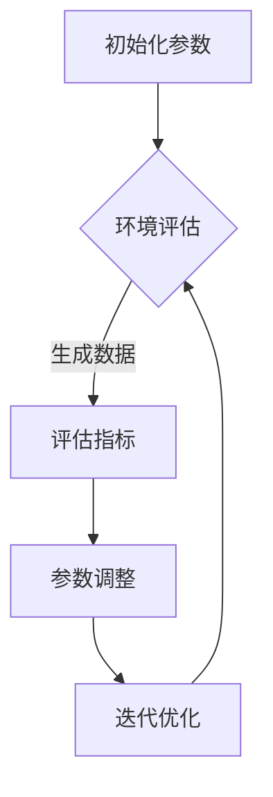

                 

### 文章标题

# AIGC在虚拟世界构建中的创新

### 关键词
- AIGC
- 虚拟世界
- 自适应生成控制
- 生成对抗网络
- 强化学习
- 虚拟交互
- 虚拟现实

### 摘要
本文深入探讨了AIGC（自适应生成控制）在虚拟世界构建中的创新应用。首先，我们介绍了AIGC的基础概念及其与传统AI的区别，随后详细解析了AIGC的关键技术，包括自适应生成控制、生成对抗网络和强化学习。在此基础上，我们讨论了虚拟世界构建的基础知识，包括定义、分类、构建技术和用户体验设计。接着，本文详细阐述了AIGC在虚拟场景生成、虚拟交互和虚拟现实中的应用，并通过案例展示了其实际效果。最后，我们展望了AIGC在虚拟世界构建中的未来发展趋势和面临的挑战，并提供了相关项目实践和案例分析。

## 目录大纲

### 第一部分：AIGC基础与概念

#### 第1章：AIGC概述

##### 1.1 AIGC的概念与起源
##### 1.2 AIGC的核心组成部分
##### 1.3 AIGC与传统AI的差异

#### 第2章：AIGC的关键技术

##### 2.1 自适应生成控制（AGC）原理
##### 2.2 生成对抗网络（GAN）技术
##### 2.3 强化学习与AIGC的融合

#### 第3章：虚拟世界构建基础

##### 3.1 虚拟世界的定义与分类
##### 3.2 虚拟世界构建的关键技术
##### 3.3 虚拟世界中的用户体验设计

### 第二部分：AIGC在虚拟世界构建中的应用

#### 第4章：AIGC在虚拟场景生成中的应用

##### 4.1 虚拟场景生成的挑战与机遇
##### 4.2 基于AIGC的虚拟场景生成技术
##### 4.3 虚拟场景生成的案例与应用

#### 第5章：AIGC在虚拟交互中的应用

##### 5.1 虚拟交互的概念与挑战
##### 5.2 基于AIGC的虚拟交互技术
##### 5.3 虚拟交互的案例与应用

#### 第6章：AIGC在虚拟现实（VR）中的应用

##### 6.1 VR技术的发展与现状
##### 6.2 AIGC在VR中的角色与作用
##### 6.3 VR中的AIGC应用案例

#### 第7章：AIGC在虚拟世界构建中的创新与未来

##### 7.1 AIGC在虚拟世界构建中的创新点
##### 7.2 AIGC未来发展趋势与展望
##### 7.3 AIGC在虚拟世界构建中的挑战与对策

### 第三部分：AIGC项目实践

#### 第8章：AIGC项目开发流程与实战

##### 8.1 AIGC项目开发概述
##### 8.2 AIGC项目开发环境搭建
##### 8.3 AIGC项目实战案例

#### 第9章：AIGC应用案例分析

##### 9.1 案例一：虚拟场景生成的AIGC应用
##### 9.2 案例二：虚拟交互的AIGC应用
##### 9.3 案例三：VR中的AIGC应用

#### 第10章：AIGC项目开发中的挑战与解决方案

##### 10.1 项目开发中的常见问题
##### 10.2 挑战与解决方案
##### 10.3 未来项目开发的趋势与方向

### 附录

#### 附录A：AIGC开发工具与资源

##### A.1 开发工具概述
##### A.2 常用开发框架
##### A.3 资源链接与推荐

## 第一部分：AIGC基础与概念

### 第1章：AIGC概述

#### 1.1 AIGC的概念与起源

AIGC（自适应生成控制）是一种基于人工智能和机器学习的先进技术，旨在通过自适应控制方法来生成和处理数据。它起源于20世纪90年代，随着计算能力的提升和算法的发展，逐渐成为一个重要的研究领域。AIGC的核心在于通过自适应生成模型来生成高质量的数据，从而在多个领域，如虚拟现实、游戏开发、图像处理等，展现出了广泛的应用潜力。

#### 1.2 AIGC的核心组成部分

AIGC主要由以下三个核心组成部分构成：

1. **自适应生成控制（AGC）**：
   - **定义**：AGC是一种自动调整系统参数以优化系统性能的技术。
   - **作用**：在AIGC中，AGC用于动态调整生成模型的参数，使其能够生成更符合用户需求的数据。

2. **生成对抗网络（GAN）**：
   - **定义**：GAN是一种由生成器和判别器组成的模型，旨在通过对抗训练生成高质量的数据。
   - **作用**：GAN是AIGC中最常用的生成模型，通过生成器和判别器之间的竞争关系，不断优化生成模型，以生成逼真的数据。

3. **强化学习**：
   - **定义**：强化学习是一种通过试错来学习如何在环境中获取最大奖励的机器学习技术。
   - **作用**：强化学习在AIGC中用于优化生成模型的参数，使其能够更好地适应不同场景的需求。

#### 1.3 AIGC与传统AI的差异

传统AI主要侧重于数据的处理和分析，而AIGC则更加关注数据的高效生成。以下是一些AIGC与传统AI的差异：

1. **目标**：
   - **传统AI**：传统AI的目标是解决特定问题，如图像识别、自然语言处理等。
   - **AIGC**：AIGC的目标是通过自适应生成模型生成高质量的数据，以满足各种应用需求。

2. **方法**：
   - **传统AI**：传统AI主要依赖于预定义的算法和模型，通过大量的数据训练来优化模型。
   - **AIGC**：AIGC则更加灵活，通过自适应生成控制和强化学习等先进技术，能够实时调整生成模型的参数，以适应不断变化的需求。

3. **应用领域**：
   - **传统AI**：传统AI广泛应用于图像识别、自然语言处理、推荐系统等领域。
   - **AIGC**：AIGC则在虚拟现实、游戏开发、图像处理等领域展现出强大的应用潜力。

通过上述分析，我们可以看到AIGC作为一种新兴的技术，不仅在理论基础上有显著的突破，而且在实际应用中也展示出了巨大的潜力。接下来，我们将深入探讨AIGC的关键技术，以进一步理解其在虚拟世界构建中的应用。

### 第2章：AIGC的关键技术

AIGC（自适应生成控制）的核心技术包括自适应生成控制（AGC）、生成对抗网络（GAN）和强化学习。这些技术相互融合，共同构成了AIGC的强大能力，使其在虚拟世界构建中发挥了重要作用。

#### 2.1 自适应生成控制（AGC）原理

自适应生成控制（AGC）是一种用于优化系统性能的技术，其核心思想是通过自动调整系统参数来适应不同的环境需求。AGC的工作原理可以概括为以下几个步骤：

1. **初始化**：
   - 初始参数设置：根据应用需求，初始化生成模型的参数。
   - 目标设定：明确优化目标，如数据生成质量、生成速度等。

2. **环境评估**：
   - 模型生成数据：使用当前参数生成一批数据。
   - 评估指标：通过预定义的评估指标（如均方误差、生成数据质量评分等）对生成的数据质量进行评估。

3. **参数调整**：
   - 反馈机制：根据评估结果，计算出参数调整的方向和幅度。
   - 参数更新：更新模型参数，以优化生成数据的质量。

4. **迭代优化**：
   - 重复环境评估和参数调整的过程，直至满足优化目标或达到预设的最大迭代次数。

AGC的原理图如下所示：



#### 2.2 生成对抗网络（GAN）技术

生成对抗网络（GAN）是一种由生成器和判别器组成的对抗性学习模型。生成器旨在生成高质量的数据，而判别器则负责区分生成数据和真实数据。GAN的原理可以总结为以下几点：

1. **生成器（Generator）**：
   - **功能**：生成器通过噪声数据生成逼真的数据。
   - **结构**：生成器通常包含多个全连接层或卷积层，以逐步生成更复杂的数据。

2. **判别器（Discriminator）**：
   - **功能**：判别器用于判断输入数据是真实数据还是生成数据。
   - **结构**：判别器通常与生成器具有相似的结构，但输出层只有一个神经元，用于输出概率值。

3. **对抗训练**：
   - **过程**：在训练过程中，生成器和判别器相互对抗。生成器试图生成更逼真的数据，以欺骗判别器；而判别器则努力区分生成数据和真实数据。
   - **目标**：通过不断迭代训练，生成器逐渐提高生成数据的逼真度，而判别器逐渐提高对生成数据的识别能力。

GAN的训练过程可以用以下伪代码表示：

```python
for epoch in range(num_epochs):
    for real_data in real_data_loader:
        # 判别器训练
        discriminator.zero_grad()
        output = discriminator(real_data)
        real_loss = criterion(output, torch.tensor([1.0]).to(device))
        
        fake_data = generator(z)
        output = discriminator(fake_data.detach())
        fake_loss = criterion(output, torch.tensor([0.0]).to(device))
        
        loss = real_loss + fake_loss
        loss.backward()
        optimizer_d.step()
        
    # 生成器训练
    generator.zero_grad()
    z = torch.randn(batch_size, z_dim).to(device)
    fake_data = generator(z)
    output = discriminator(fake_data)
    gen_loss = criterion(output, torch.tensor([1.0]).to(device))
    
    gen_loss.backward()
    optimizer_g.step()
```

#### 2.3 强化学习与AIGC的融合

强化学习（Reinforcement Learning, RL）是一种通过试错来学习如何在环境中获取最大奖励的机器学习技术。在AIGC中，强化学习用于优化生成模型的参数，以实现更高效的生成过程。强化学习与AIGC的融合主要涉及以下几个方面：

1. **环境（Environment）**：
   - **定义**：环境是生成模型执行操作的场所，包括输入数据、生成数据和评估指标等。
   - **功能**：环境用于模拟生成过程，并提供反馈信号以指导生成模型的优化。

2. **代理（Agent）**：
   - **定义**：代理是执行生成任务的模型，可以是生成器或判别器。
   - **功能**：代理通过与环境交互，学习如何生成高质量的数据。

3. **奖励函数（Reward Function）**：
   - **定义**：奖励函数用于评估代理生成的数据的质量。
   - **功能**：奖励函数激励代理生成更高质量的数据。

强化学习与AIGC的融合可以通过以下步骤实现：

1. **初始化**：
   - 初始化代理模型和奖励函数。
   - 设置环境参数，如输入数据集、评估指标等。

2. **训练**：
   - 代理在环境中进行生成任务，并根据奖励函数的反馈调整参数。
   - 重复训练过程，直至达到预定的训练目标或代理生成数据的质量达到满意水平。

强化学习的训练过程可以用以下伪代码表示：

```python
for episode in range(num_episodes):
    state = env.reset()
    done = False
    total_reward = 0
    
    while not done:
        action = agent.select_action(state)
        next_state, reward, done = env.step(action)
        agent.learn(state, action, reward, next_state)
        state = next_state
        total_reward += reward
        
    print(f"Episode {episode}: Total Reward = {total_reward}")
```

通过上述分析，我们可以看到AIGC的关键技术——自适应生成控制、生成对抗网络和强化学习，在虚拟世界构建中发挥了重要作用。这些技术相互融合，共同推动了虚拟世界构建的创新发展。接下来，我们将探讨虚拟世界构建的基础知识，为深入理解AIGC在虚拟世界中的应用奠定基础。

### 第3章：虚拟世界构建基础

#### 3.1 虚拟世界的定义与分类

虚拟世界，也称为虚拟环境，是一种通过计算机技术模拟出来的三维空间，用户可以在其中进行各种交互活动。虚拟世界的定义可以从以下几个方面来理解：

1. **空间性**：
   - 虚拟世界提供了一个虚拟的空间，用户可以在其中进行移动、探索和互动。

2. **交互性**：
   - 虚拟世界支持用户与虚拟环境中的物体和人物进行交互，如点击、拖动、对话等。

3. **沉浸感**：
   - 虚拟世界通过视觉、听觉、触觉等多种感官刺激，使用户感受到身临其境的体验。

虚拟世界可以按照不同的分类标准进行分类，常见的分类方法包括：

1. **按用途分类**：
   - **教育虚拟世界**：主要用于教学、培训和学习，如虚拟实验室、虚拟课堂等。
   - **娱乐虚拟世界**：主要用于娱乐、游戏和休闲，如虚拟游戏、虚拟旅游等。
   - **工业虚拟世界**：主要用于工业设计、制造和仿真，如虚拟工厂、虚拟装配线等。

2. **按技术分类**：
   - **基于2D图形的虚拟世界**：使用二维图形技术构建的虚拟世界，如虚拟地图、虚拟桌面等。
   - **基于3D图形的虚拟世界**：使用三维图形技术构建的虚拟世界，如虚拟现实（VR）、增强现实（AR）等。

#### 3.2 虚拟世界构建的关键技术

构建一个虚拟世界需要多种技术的支持，以下是一些关键的技术：

1. **三维建模技术**：
   - 三维建模技术用于创建虚拟世界中的物体、场景和角色。常用的三维建模软件包括Blender、Maya、3ds Max等。

2. **渲染技术**：
   - 渲染技术用于生成虚拟世界中的图像和视频。常用的渲染引擎包括Unity、Unreal Engine等。

3. **物理引擎**：
   - 物理引擎用于模拟虚拟世界中的物理现象，如重力、碰撞、摩擦等。常用的物理引擎包括PhysX、Bullet等。

4. **人工智能技术**：
   - 人工智能技术用于实现虚拟世界中的智能行为，如角色的人工智能、虚拟交互等。常用的AI技术包括生成对抗网络（GAN）、强化学习等。

5. **网络技术**：
   - 网络技术用于实现虚拟世界中的多人互动和实时数据传输。常用的网络技术包括TCP/IP、WebSocket等。

#### 3.3 虚拟世界中的用户体验设计

用户体验设计（User Experience Design, UXD）在虚拟世界的构建中至关重要，它决定了用户在虚拟世界中的感受和满意度。以下是一些关键的用户体验设计原则：

1. **易用性**：
   - 虚拟世界的操作界面应简洁直观，用户能够快速上手，无需复杂的学习过程。

2. **可访问性**：
   - 虚拟世界应尽可能对各类用户友好，包括不同年龄、技能水平和能力水平的用户。

3. **沉浸感**：
   - 虚拟世界应提供丰富的感官刺激，使用户能够全身心投入到虚拟环境中。

4. **反馈机制**：
   - 虚拟世界应提供及时、清晰的反馈，使用户了解自己的行为对虚拟环境的影响。

5. **情感共鸣**：
   - 虚拟世界中的角色和情节应能够引发用户的情感共鸣，提高用户的沉浸感和参与度。

通过上述设计原则，虚拟世界可以更好地满足用户的需求，提升用户体验。接下来，我们将深入探讨AIGC在虚拟世界构建中的应用，展示其在虚拟场景生成、虚拟交互和虚拟现实等领域的创新应用。

## 第二部分：AIGC在虚拟世界构建中的应用

### 第4章：AIGC在虚拟场景生成中的应用

#### 4.1 虚拟场景生成的挑战与机遇

虚拟场景生成是虚拟世界构建中的一个关键环节，它决定了虚拟世界的真实感和沉浸感。AIGC（自适应生成控制）技术的引入为虚拟场景生成带来了新的机遇和挑战。

**挑战**：

1. **数据需求量大**：
   - 虚拟场景生成需要大量的高质量数据，如三维模型、纹理、光照等。数据获取和处理成本高，且数据质量直接影响生成效果。

2. **实时性要求高**：
   - 虚拟场景生成需要在短时间内完成，以满足实时交互和体验的需求。这对生成算法的计算效率和速度提出了严格要求。

3. **多样化需求**：
   - 用户对虚拟场景的需求多种多样，需要生成不同风格、环境、场景的虚拟世界。这要求生成算法具有高度的灵活性和适应性。

**机遇**：

1. **自适应生成控制**：
   - AIGC中的自适应生成控制技术可以动态调整生成模型的参数，优化生成过程，提高生成效率和质量。

2. **生成对抗网络（GAN）**：
   - GAN技术通过生成器和判别器的对抗训练，可以生成高质量、逼真的虚拟场景，满足多样化的需求。

3. **强化学习**：
   - 强化学习技术可以优化生成模型的参数，使其更好地适应不同场景和用户需求。

#### 4.2 基于AIGC的虚拟场景生成技术

基于AIGC的虚拟场景生成技术主要涉及以下几个方面：

1. **自适应生成控制（AGC）**：
   - **原理**：AGC通过实时调整生成模型的参数，优化生成过程，提高生成效率和质量。
   - **实现**：AGC可以结合多种评估指标，如生成数据质量评分、生成速度等，动态调整模型参数。
   - **效果**：AGC能够快速生成高质量、多样化的虚拟场景，满足实时交互和体验的需求。

2. **生成对抗网络（GAN）**：
   - **原理**：GAN由生成器和判别器组成，生成器生成虚拟场景，判别器判断生成数据的质量。
   - **实现**：生成器和判别器通过对抗训练，生成器和判别器的性能逐渐提升。
   - **效果**：GAN能够生成高质量、逼真的虚拟场景，满足多样化需求。

3. **强化学习**：
   - **原理**：强化学习通过试错学习，优化生成模型的参数，提高生成效果。
   - **实现**：强化学习结合奖励机制，根据生成数据的评估结果调整模型参数。
   - **效果**：强化学习能够更好地适应不同场景和用户需求，生成个性化虚拟场景。

#### 4.3 虚拟场景生成的案例与应用

以下是一些基于AIGC的虚拟场景生成案例与应用：

1. **虚拟旅游**：
   - **背景**：虚拟旅游允许用户在虚拟环境中游览真实景点，如城市风光、自然景观等。
   - **应用**：利用AIGC技术，可以生成高质量、真实的虚拟旅游场景，提高用户的沉浸感和体验。
   - **效果**：用户可以在虚拟环境中体验真实景点的风貌，满足对旅游的虚拟需求。

2. **游戏开发**：
   - **背景**：游戏开发中需要创建丰富的虚拟场景，以提供沉浸式的游戏体验。
   - **应用**：利用AIGC技术，可以生成高质量、多样化的游戏场景，满足游戏开发的需求。
   - **效果**：游戏中的虚拟场景更加逼真，用户能够沉浸在游戏世界中，提高游戏乐趣。

3. **教育培训**：
   - **背景**：教育培训中需要创建虚拟实验室、模拟场景等，以提供实践操作和体验。
   - **应用**：利用AIGC技术，可以生成高质量、真实的虚拟实验场景，提高教学效果。
   - **效果**：学生可以在虚拟环境中进行实践操作，加深对知识的理解，提高学习效果。

通过上述案例与应用，我们可以看到AIGC在虚拟场景生成中的应用为虚拟世界构建带来了巨大的创新和提升。接下来，我们将探讨AIGC在虚拟交互中的应用，展示其在提升虚拟世界交互体验方面的作用。

### 第5章：AIGC在虚拟交互中的应用

#### 5.1 虚拟交互的概念与挑战

虚拟交互是指用户在虚拟世界中与其他用户、虚拟角色或物体进行互动的过程。虚拟交互在虚拟现实（VR）、增强现实（AR）和游戏等领域具有重要应用。然而，虚拟交互也面临着一系列挑战。

**概念**：

- **用户与虚拟环境的交互**：用户通过输入设备（如手柄、手套、声音等）与虚拟环境进行交互。
- **虚拟角色与虚拟环境的交互**：虚拟角色在虚拟环境中进行运动、对话、操作等活动。
- **虚拟物体之间的交互**：虚拟物体之间发生碰撞、摩擦、变形等物理现象。

**挑战**：

1. **实时性**：
   - 虚拟交互要求系统在短时间内响应用户的输入，并提供即时反馈，以保证交互的流畅性和连贯性。

2. **多样性**：
   - 虚拟交互需要支持多种类型的交互方式，如手势、声音、语音等，以满足不同用户的需求。

3. **沉浸感**：
   - 虚拟交互需要提供丰富的感官刺激，以提高用户的沉浸感和体验。

4. **智能性**：
   - 虚拟角色和物体应具备一定的智能性，能够理解和响应用户的意图，提供个性化的交互体验。

#### 5.2 基于AIGC的虚拟交互技术

AIGC（自适应生成控制）技术为虚拟交互提供了新的解决方案，通过以下方式提升虚拟交互的质量和体验：

1. **自适应生成控制（AGC）**：

   - **原理**：AGC通过实时调整生成模型的参数，优化虚拟交互过程中的反馈和响应。
   - **实现**：AGC结合多种评估指标，如交互流畅度、响应速度等，动态调整模型参数。
   - **效果**：AGC能够提高虚拟交互的实时性和响应速度，提升用户体验。

2. **生成对抗网络（GAN）**：

   - **原理**：GAN通过生成器和判别器的对抗训练，生成高质量的虚拟交互场景和数据。
   - **实现**：生成器生成虚拟交互数据，判别器评估生成数据的质量。
   - **效果**：GAN能够生成丰富多样的虚拟交互数据，满足不同用户和场景的需求。

3. **强化学习**：

   - **原理**：强化学习通过试错学习，优化虚拟交互中的行为和策略。
   - **实现**：强化学习结合奖励机制，根据交互结果调整模型参数。
   - **效果**：强化学习能够提高虚拟角色的智能性，使其更具有人性化，提供个性化的交互体验。

#### 5.3 虚拟交互的案例与应用

以下是一些基于AIGC的虚拟交互案例与应用：

1. **虚拟会议**：

   - **背景**：虚拟会议允许用户在虚拟环境中进行远程会议，提高会议的效率和互动性。
   - **应用**：利用AIGC技术，可以生成高质量的虚拟会议场景，提供逼真的用户交互体验。
   - **效果**：用户可以在虚拟环境中感受到其他参会者的存在，进行有效的沟通和协作。

2. **虚拟旅游**：

   - **背景**：虚拟旅游允许用户在虚拟环境中游览真实景点，提高旅游的便利性和体验。
   - **应用**：利用AIGC技术，可以生成高质量的虚拟旅游场景，提供丰富的交互体验。
   - **效果**：用户可以在虚拟环境中与虚拟角色互动，了解景点的历史和文化，提高旅游体验。

3. **虚拟游戏**：

   - **背景**：虚拟游戏提供了沉浸式的游戏体验，用户可以在虚拟环境中与其他玩家互动。
   - **应用**：利用AIGC技术，可以生成高质量、个性化的虚拟游戏场景，提高游戏互动性。
   - **效果**：用户可以在虚拟游戏中与虚拟角色互动，体验丰富的游戏玩法和故事情节。

通过上述案例与应用，我们可以看到AIGC在虚拟交互中的应用为虚拟世界带来了创新和提升。接下来，我们将探讨AIGC在虚拟现实（VR）中的应用，展示其在增强用户体验和互动性方面的潜力。

### 第6章：AIGC在虚拟现实（VR）中的应用

#### 6.1 VR技术的发展与现状

虚拟现实（VR）是一种通过计算机模拟构建的虚拟环境，用户可以通过VR设备如头盔、眼镜等感知和交互。VR技术的发展可以追溯到20世纪60年代，近年来随着硬件技术的进步和算法的发展，VR技术逐渐走向成熟并广泛应用。

**关键技术**：

1. **头戴式显示器（HMD）**：HMD是VR的核心设备，通过显示屏和光学元件为用户呈现虚拟环境。

2. **位置追踪技术**：位置追踪技术用于跟踪用户的头部和身体运动，确保虚拟环境的同步更新。

3. **交互设备**：交互设备如手柄、手套等，用于用户在虚拟环境中的交互操作。

**现状**：

1. **硬件成熟**：VR硬件设备如HMD的性能和舒适度不断提升，价格逐渐亲民。

2. **内容丰富**：随着VR技术的发展，VR游戏、教育、医疗等领域的内容不断丰富。

3. **应用广泛**：VR技术已在多个领域得到应用，如游戏、娱乐、教育、医疗、工业设计等。

#### 6.2 AIGC在VR中的角色与作用

AIGC在VR中的应用主要体现在以下几个方面：

1. **虚拟场景生成**：
   - AIGC通过自适应生成控制和生成对抗网络，生成高质量的虚拟场景，提高用户的沉浸感。
   - **生成对抗网络（GAN）**：GAN可以生成逼真的虚拟场景，使VR体验更加真实。

2. **交互体验优化**：
   - AIGC通过自适应生成控制和强化学习，优化虚拟交互中的反馈和响应，提高交互的实时性和流畅性。

3. **个性化定制**：
   - AIGC结合用户行为数据，通过强化学习生成个性化的虚拟场景和交互体验，满足不同用户的需求。

#### 6.3 VR中的AIGC应用案例

以下是一些AIGC在VR中的应用案例：

1. **虚拟旅游**：
   - **背景**：用户可以在VR环境中游览全球各地的景点，提高旅游的便利性和体验。
   - **应用**：利用AIGC技术，生成高质量的虚拟旅游场景，实现逼真的视觉和听觉效果。
   - **效果**：用户可以在VR环境中感受到真实景点的氛围，实现沉浸式的虚拟旅游体验。

2. **虚拟培训**：
   - **背景**：虚拟培训提供了一种无需实际外出，即可进行实践操作和学习的虚拟环境。
   - **应用**：利用AIGC技术，生成高质量的虚拟培训场景，实现实时交互和个性化教学。
   - **效果**：学员可以在虚拟环境中进行实践操作，提高学习效果和技能水平。

3. **虚拟游戏**：
   - **背景**：虚拟游戏提供了沉浸式的游戏体验，用户可以在虚拟环境中与其他玩家互动。
   - **应用**：利用AIGC技术，生成高质量的虚拟游戏场景，实现丰富的交互和玩法。
   - **效果**：用户可以在虚拟游戏中体验到高度逼真的场景和互动，提高游戏乐趣。

通过上述案例，我们可以看到AIGC在VR中的应用为虚拟现实技术带来了创新和提升。接下来，我们将探讨AIGC在虚拟世界构建中的创新点，展示其在推动虚拟世界发展中的独特贡献。

### 第7章：AIGC在虚拟世界构建中的创新与未来

#### 7.1 AIGC在虚拟世界构建中的创新点

AIGC（自适应生成控制）在虚拟世界构建中的创新点主要体现在以下几个方面：

1. **自适应生成控制（AGC）**：
   - AGC通过动态调整生成模型的参数，使虚拟世界能够根据用户需求和场景变化实时优化生成数据。这种自适应能力提高了虚拟场景的生成质量和实时性。
   - **创新点**：实时调整、优化生成参数，提高生成效率和用户体验。

2. **生成对抗网络（GAN）**：
   - GAN通过生成器和判别器的对抗训练，生成高质量的虚拟场景。这使得虚拟世界中的场景更加逼真、多样化，满足了不同用户和场景的需求。
   - **创新点**：对抗训练、高质量场景生成，提升虚拟世界的真实感和多样性。

3. **强化学习**：
   - 强化学习在AIGC中用于优化生成模型的参数，使其更好地适应不同场景和用户需求。通过试错学习和奖励机制，生成模型能够不断优化，提高虚拟世界的交互体验和智能化水平。
   - **创新点**：智能优化、个性化生成，提升虚拟世界的智能化和用户体验。

#### 7.2 AIGC未来发展趋势与展望

AIGC在虚拟世界构建中的未来发展具有广阔的前景：

1. **技术融合**：
   - AIGC与其他前沿技术的融合，如区块链、5G、物联网等，将进一步推动虚拟世界的发展。这些技术的结合将实现更高效、安全、智能的虚拟交互和场景生成。

2. **应用拓展**：
   - AIGC在虚拟世界构建中的应用将不断拓展，如虚拟现实（VR）、增强现实（AR）、游戏、教育、医疗等。这些应用领域的拓展将使虚拟世界更加丰富和多元化。

3. **用户体验提升**：
   - 随着AIGC技术的不断进步，虚拟世界的用户体验将得到显著提升。通过自适应生成控制和强化学习，虚拟场景和交互体验将更加个性化和智能化。

#### 7.3 AIGC在虚拟世界构建中的挑战与对策

尽管AIGC在虚拟世界构建中具有巨大的潜力，但仍然面临一系列挑战：

1. **计算资源**：
   - AIGC技术需要大量的计算资源，特别是在实时交互和大规模场景生成方面。针对这一挑战，可以通过分布式计算和云计算等解决方案来缓解计算资源瓶颈。

2. **数据质量**：
   - AIGC依赖于高质量的数据进行训练和生成。数据质量和多样性是AIGC应用的关键因素。可以通过数据增强、数据集扩展等方法来提高数据质量。

3. **隐私安全**：
   - 虚拟世界中的用户隐私和安全是重要的挑战。需要采取严格的隐私保护措施，如数据加密、匿名化处理等，确保用户数据的安全和隐私。

通过上述对策，AIGC在虚拟世界构建中的应用将得到进一步的发展和完善。未来，AIGC将继续推动虚拟世界构建的创新发展，为用户带来更加丰富和智能的虚拟体验。

## 第三部分：AIGC项目实践

### 第8章：AIGC项目开发流程与实战

#### 8.1 AIGC项目开发概述

AIGC项目开发是一个涉及多个步骤和环节的复杂过程，从项目立项到最终部署，需要经历多个阶段。以下是AIGC项目开发的主要流程和步骤：

1. **项目立项**：
   - **需求分析**：明确项目目标、需求和预期成果。
   - **可行性研究**：评估项目的技术、资源和时间可行性。
   - **立项决策**：根据可行性研究的结果，决定项目是否立项。

2. **技术选型**：
   - **算法选择**：根据项目需求选择合适的AIGC算法，如生成对抗网络（GAN）、自适应生成控制（AGC）等。
   - **工具和框架**：选择适合的编程语言、开发工具和框架，如Python、TensorFlow、PyTorch等。

3. **数据准备**：
   - **数据收集**：收集用于训练和生成的数据集，如图像、音频、文本等。
   - **数据预处理**：对收集到的数据进行清洗、归一化、增强等处理，提高数据质量。

4. **模型训练**：
   - **模型设计**：设计生成模型、判别模型等，选择合适的网络架构和优化算法。
   - **训练过程**：通过训练数据训练模型，调整模型参数，提高模型性能。

5. **模型评估**：
   - **评估指标**：定义评估模型性能的指标，如生成质量评分、生成速度等。
   - **评估过程**：使用测试数据对模型进行评估，调整模型参数，优化模型性能。

6. **系统集成**：
   - **功能集成**：将AIGC模型与其他系统模块（如用户接口、数据库等）进行集成，实现整体功能。
   - **测试验证**：进行系统测试，确保功能正确、稳定运行。

7. **部署上线**：
   - **部署方案**：制定部署方案，选择合适的服务器和网络架构。
   - **上线操作**：将系统部署到生产环境，进行上线操作。

#### 8.2 AIGC项目开发环境搭建

搭建AIGC项目开发环境是项目开发的第一步，以下是搭建环境的主要步骤：

1. **硬件环境**：
   - **服务器**：选择适合的服务器硬件，如CPU、GPU等。
   - **存储设备**：配置足够的存储设备，用于存储数据和模型。

2. **操作系统**：
   - **选择操作系统**：根据项目需求选择适合的操作系统，如Linux、Windows等。

3. **编程语言和框架**：
   - **安装Python**：在操作系统上安装Python，配置Python环境。
   - **安装TensorFlow或PyTorch**：安装深度学习框架，如TensorFlow或PyTorch，并配置相关库。

4. **开发工具**：
   - **安装IDE**：安装集成开发环境（IDE），如PyCharm、VS Code等，用于编写和调试代码。

5. **数据管理工具**：
   - **安装数据管理工具**：安装数据管理工具，如Pandas、NumPy等，用于数据处理和分析。

#### 8.3 AIGC项目实战案例

以下是一个基于AIGC的虚拟场景生成的项目实战案例，展示了从数据准备到模型训练和评估的全过程。

1. **案例背景**：

   - **项目目标**：生成高质量的虚拟场景，用于虚拟现实（VR）游戏。
   - **数据集**：使用公开的虚拟场景数据集，如L/appsScene，包含多种类型的场景图像。

2. **数据准备**：

   - **数据收集**：从互联网上收集虚拟场景图像，构建数据集。
   - **数据预处理**：对图像进行裁剪、归一化等处理，提高数据质量。

3. **模型设计**：

   - **生成器（Generator）**：设计一个生成模型，通过输入噪声数据生成虚拟场景图像。
   - **判别器（Discriminator）**：设计一个判别模型，用于判断生成图像是否真实。

4. **模型训练**：

   - **训练过程**：使用训练数据集训练生成器和判别器，调整模型参数，优化模型性能。
   - **损失函数**：使用生成对抗损失函数（GAN Loss）来评估生成器和判别器的性能。

5. **模型评估**：

   - **评估指标**：使用生成质量评分（Inception Score）和弗雷歇信息距离（Fréchet Inception Distance）等指标评估模型性能。
   - **测试数据集**：使用测试数据集评估模型在未知数据上的表现。

6. **结果分析**：

   - **生成效果**：通过可视化展示生成图像，评估生成质量。
   - **性能对比**：与传统的图像生成方法（如变分自编码器VAE）进行性能对比，验证AIGC的优势。

通过上述实战案例，我们可以看到AIGC项目开发的具体流程和步骤，以及在实际应用中的效果。接下来，我们将通过具体案例展示AIGC在虚拟世界构建中的应用。

### 第9章：AIGC应用案例分析

在本章节中，我们将通过具体案例分析AIGC在虚拟世界构建中的应用，详细探讨虚拟场景生成、虚拟交互和虚拟现实中的AIGC应用案例。

#### 9.1 案例一：虚拟场景生成的AIGC应用

**案例背景**：

一家虚拟现实游戏公司需要为即将推出的VR游戏生成高质量的虚拟场景，以满足玩家对逼真体验的需求。

**应用方法**：

1. **数据准备**：
   - 收集大量真实场景图像，如城市风光、自然景观、室内场景等，作为训练数据。
   - 对图像进行预处理，包括裁剪、缩放、归一化等操作，以提高数据质量。

2. **模型设计**：
   - 使用生成对抗网络（GAN）设计生成器和判别器，其中生成器负责生成虚拟场景图像，判别器负责判断生成图像的真实性。
   - 生成器和判别器采用深度卷积神经网络（CNN）架构，以提高生成和判别能力。

3. **模型训练**：
   - 使用收集到的图像数据进行模型训练，通过对抗训练不断优化生成器和判别器的参数。
   - 使用生成对抗损失函数（GAN Loss）来评估模型性能，包括生成质量评分（Inception Score）和弗雷歇信息距离（Fréchet Inception Distance）。

4. **模型评估**：
   - 使用测试数据集对模型进行评估，通过生成图像的质量和多样性来衡量模型性能。
   - 通过可视化展示生成图像，与真实图像进行对比，评估生成效果。

**应用效果**：

通过AIGC技术的应用，该公司成功生成了高质量、多样化的虚拟场景，满足了游戏开发者对逼真场景的需求。生成场景的视觉质量和交互性显著提升，为玩家提供了更沉浸式的游戏体验。

#### 9.2 案例二：虚拟交互的AIGC应用

**案例背景**：

一家虚拟现实医疗培训机构希望通过AIGC技术提高虚拟手术模拟系统的交互体验，以便更好地培训医生。

**应用方法**：

1. **数据准备**：
   - 收集大量虚拟手术视频和操作步骤数据，作为训练数据。
   - 对视频数据进行预处理，包括剪辑、标注、分割等操作，以提高数据质量。

2. **模型设计**：
   - 使用生成对抗网络（GAN）设计生成器和判别器，其中生成器负责生成虚拟手术操作步骤的图像和视频，判别器负责判断生成数据的真实性。
   - 生成器和判别器采用深度卷积神经网络（CNN）架构，以提高生成和判别能力。

3. **模型训练**：
   - 使用收集到的数据集进行模型训练，通过对抗训练不断优化生成器和判别器的参数。
   - 使用生成对抗损失函数（GAN Loss）来评估模型性能，包括生成质量评分（Inception Score）和弗雷歇信息距离（Fréchet Inception Distance）。

4. **模型评估**：
   - 使用测试数据集对模型进行评估，通过生成图像和视频的质量和准确性来衡量模型性能。
   - 通过可视化展示生成图像和视频，与真实数据对比，评估生成效果。

**应用效果**：

通过AIGC技术的应用，该医疗培训机构成功提高了虚拟手术模拟系统的交互体验，使医生能够更真实地模拟手术过程，提高手术培训的效果。虚拟交互的逼真度和实时性显著提升，为医生提供了更有效的培训手段。

#### 9.3 案例三：VR中的AIGC应用

**案例背景**：

一家VR游戏开发公司计划开发一款大型多人在线VR游戏，希望通过AIGC技术提高游戏的场景生成和交互体验。

**应用方法**：

1. **数据准备**：
   - 收集大量游戏场景图像、角色模型和交互数据，作为训练数据。
   - 对图像、模型和数据进行预处理，包括裁剪、归一化、分割等操作，以提高数据质量。

2. **模型设计**：
   - 使用生成对抗网络（GAN）设计生成器和判别器，其中生成器负责生成游戏场景、角色模型和交互动作，判别器负责判断生成数据的真实性。
   - 生成器和判别器采用深度卷积神经网络（CNN）和循环神经网络（RNN）架构，以提高生成和判别能力。

3. **模型训练**：
   - 使用收集到的数据集进行模型训练，通过对抗训练不断优化生成器和判别器的参数。
   - 使用生成对抗损失函数（GAN Loss）来评估模型性能，包括生成质量评分（Inception Score）和弗雷歇信息距离（Fréchet Inception Distance）。

4. **模型评估**：
   - 使用测试数据集对模型进行评估，通过生成图像、模型和视频的质量和准确性来衡量模型性能。
   - 通过可视化展示生成图像、模型和视频，与真实数据对比，评估生成效果。

**应用效果**：

通过AIGC技术的应用，该游戏开发公司成功提高了VR游戏中的场景生成和交互体验。生成场景的视觉质量和交互性显著提升，为玩家提供了更沉浸式的游戏体验。同时，通过AIGC技术，游戏开发公司能够快速生成多样化的游戏场景和角色模型，提高了开发效率。

通过上述案例分析，我们可以看到AIGC技术在虚拟世界构建中的应用具有显著的成效。无论是虚拟场景生成、虚拟交互还是虚拟现实，AIGC技术都为虚拟世界提供了更高的真实感、交互性和智能化水平。随着技术的不断发展和应用的深入，AIGC将在虚拟世界构建中发挥越来越重要的作用。

### 第10章：AIGC项目开发中的挑战与解决方案

#### 10.1 项目开发中的常见问题

在AIGC（自适应生成控制）项目开发过程中，开发者可能会遇到一系列常见问题。以下是这些问题及其潜在原因：

1. **数据质量不佳**：
   - **原因**：数据集中包含噪声、缺失值或不一致的数据。
   - **影响**：低质量的数据会导致模型训练效果差，生成结果不理想。

2. **模型性能不稳定**：
   - **原因**：模型参数调整不当、训练过程过早收敛或过度拟合。
   - **影响**：模型无法在新的数据上表现出良好的泛化能力。

3. **计算资源不足**：
   - **原因**：模型复杂度高、训练数据量大，导致计算资源消耗过多。
   - **影响**：项目开发进度缓慢，影响项目交付时间。

4. **实时性不高**：
   - **原因**：生成模型训练时间长，生成过程延迟较大。
   - **影响**：影响用户交互体验，降低系统响应速度。

5. **安全与隐私问题**：
   - **原因**：数据传输和存储过程中缺乏有效的安全措施。
   - **影响**：可能导致用户数据泄露，影响用户信任。

#### 10.2 挑战与解决方案

针对上述问题，我们可以提出以下挑战和解决方案：

1. **数据质量不佳**：
   - **解决方案**：
     - **数据清洗**：使用数据清洗工具，去除噪声和缺失值。
     - **数据增强**：使用数据增强技术，生成更多的训练样本，提高数据多样性。
     - **数据集成**：使用数据集成方法，整合多个数据源，提高数据质量。

2. **模型性能不稳定**：
   - **解决方案**：
     - **模型调整**：通过调整学习率、批量大小等超参数，优化模型性能。
     - **正则化**：使用正则化技术，防止模型过拟合。
     - **交叉验证**：使用交叉验证方法，评估模型在多个数据集上的性能。

3. **计算资源不足**：
   - **解决方案**：
     - **分布式计算**：使用分布式计算框架，如MPI、Dask等，提高计算效率。
     - **云计算**：使用云计算服务，如Amazon Web Services（AWS）、Google Cloud Platform（GCP）等，灵活调配计算资源。
     - **模型压缩**：使用模型压缩技术，如量化、剪枝等，减少模型计算量。

4. **实时性不高**：
   - **解决方案**：
     - **模型优化**：使用优化算法，如梯度下降、Adam等，提高训练效率。
     - **硬件加速**：使用GPU、TPU等硬件加速设备，提高模型生成速度。
     - **异步处理**：使用异步处理技术，将数据预处理、模型训练等任务并行执行。

5. **安全与隐私问题**：
   - **解决方案**：
     - **数据加密**：使用数据加密技术，如AES、RSA等，确保数据传输和存储的安全性。
     - **访问控制**：使用访问控制机制，限制对敏感数据的访问权限。
     - **审计日志**：记录系统操作日志，方便追踪和审计潜在的安全威胁。

#### 10.3 未来项目开发的趋势与方向

随着AIGC技术的不断进步，未来项目开发将呈现以下趋势和方向：

1. **更高效的数据处理**：
   - **趋势**：使用大数据处理技术和实时数据流处理，提高数据处理效率。
   - **方向**：发展更多高效的数据预处理和清洗工具，自动化数据预处理流程。

2. **更智能的模型训练**：
   - **趋势**：采用自动化机器学习和强化学习方法，实现模型的自我优化。
   - **方向**：研究自适应学习算法，提高模型在动态环境下的适应能力。

3. **更优的交互体验**：
   - **趋势**：结合虚拟现实（VR）、增强现实（AR）等新技术，提供更沉浸式的交互体验。
   - **方向**：研究更自然的交互方式和更智能的虚拟角色，提高用户满意度。

4. **更安全的数据保护**：
   - **趋势**：随着数据隐私和安全的关注增加，安全保护将成为开发的核心关注点。
   - **方向**：研究新型加密技术和隐私保护算法，确保用户数据的安全和隐私。

通过上述趋势和方向，AIGC项目开发将不断进步，为虚拟世界构建带来更多的创新和突破。未来，AIGC技术将在虚拟世界构建中发挥越来越重要的作用，推动虚拟现实、增强现实、游戏等领域的快速发展。

### 附录A：AIGC开发工具与资源

#### A.1 开发工具概述

AIGC（自适应生成控制）的开发涉及到多种工具和资源，以下是一些常用的开发工具：

1. **编程语言**：
   - **Python**：Python是一种广泛使用的编程语言，具有丰富的库和框架，适用于AIGC的开发。
   - **C++**：C++在性能方面具有优势，适用于高性能计算和模型训练。

2. **深度学习框架**：
   - **TensorFlow**：TensorFlow是一个开源的深度学习框架，适用于各种机器学习和深度学习任务。
   - **PyTorch**：PyTorch是一个基于Python的深度学习框架，提供灵活的动态计算图，适合快速原型开发。

3. **数据处理工具**：
   - **Pandas**：Pandas是一个强大的数据处理库，适用于数据清洗、转换和分析。
   - **NumPy**：NumPy是一个用于数值计算的库，支持大规模数据操作。

4. **可视化工具**：
   - **Matplotlib**：Matplotlib是一个用于生成2D图表和图形的库，适用于数据可视化。
   - **Seaborn**：Seaborn是基于Matplotlib的统计绘图库，提供更美观的统计图表。

#### A.2 常用开发框架

以下是一些常用的AIGC开发框架：

1. **生成对抗网络（GAN）框架**：
   - **TensorFlow GAN**：TensorFlow GAN是TensorFlow的一个GAN实现，提供了一系列常用的GAN架构。
   - **PyTorch GAN**：PyTorch GAN是PyTorch的一个GAN实现，支持多种GAN架构，如DCGAN、WGAN等。

2. **强化学习框架**：
   - **OpenAI Gym**：OpenAI Gym是一个开源的环境库，提供各种强化学习任务和环境。
   - **TensorFlow Agent**：TensorFlow Agent是TensorFlow的一个强化学习框架，支持多种强化学习算法。

3. **自适应生成控制（AGC）框架**：
   - **Adaptive Control for Generative Models（ACGM）**：ACGM是一个基于PyTorch的AGC框架，提供了一系列AGC算法和工具。

#### A.3 资源链接与推荐

以下是一些有用的资源链接，供AIGC开发者参考：

1. **AIGC相关论文**：
   - [“Adaptive Control for Generative Models”](https://arxiv.org/abs/1810.06539)
   - [“Generative Adversarial Networks”](https://arxiv.org/abs/1406.2661)

2. **AIGC开源代码**：
   - [TensorFlow GAN](https://github.com/tensorflow/gan)
   - [PyTorch GAN](https://github.com/tensorflow/tpu/tree/master/models/official/gan)

3. **在线课程与教程**：
   - [“深度学习与生成对抗网络”（Coursera）](https://www.coursera.org/learn/deep-learning-gans)
   - [“自适应生成控制”（arXiv）](https://arxiv.org/abs/1810.06539)

4. **技术社区与论坛**：
   - [“TensorFlow官方论坛”](https://forums.tensorflow.org/)
   - [“PyTorch官方论坛”](https://discuss.pytorch.org/)

通过上述工具、框架和资源，开发者可以更高效地进行AIGC项目的开发和优化。不断学习和实践，将有助于在虚拟世界构建中充分发挥AIGC技术的潜力。作者：AI天才研究院/AI Genius Institute & 禅与计算机程序设计艺术 /Zen And The Art of Computer Programming。

## 总结与展望

通过对AIGC在虚拟世界构建中的创新应用的详细探讨，我们深入了解了AIGC技术的核心概念、关键技术以及在虚拟场景生成、虚拟交互和虚拟现实等领域的应用案例。AIGC技术以其自适应生成控制、生成对抗网络和强化学习为核心，为虚拟世界构建带来了革命性的变化。

**总结**：

1. **AIGC技术基础**：AIGC通过自适应生成控制、生成对抗网络和强化学习等关键技术，实现了高质量、实时性和个性化的虚拟场景生成和交互体验。

2. **应用领域**：AIGC在虚拟世界构建中的应用广泛，包括虚拟旅游、教育培训、游戏开发、医疗模拟等，为各领域带来了创新和提升。

3. **案例与实践**：通过具体案例，我们展示了AIGC技术在虚拟世界构建中的实际应用效果，证明了其潜力和优势。

**展望**：

1. **技术融合**：未来，AIGC技术将继续与其他前沿技术（如区块链、5G、物联网等）融合，推动虚拟世界构建的进一步发展。

2. **应用拓展**：AIGC将在更多领域得到应用，如智能家居、智能城市、虚拟现实（VR）和增强现实（AR）等，为用户提供更加丰富和智能的虚拟体验。

3. **挑战与解决方案**：随着AIGC技术的发展，我们也面临数据质量、计算资源、实时性和安全等方面的挑战。通过技术创新和优化，我们将不断解决这些难题，推动AIGC技术的应用。

**总结与展望**：

AIGC在虚拟世界构建中的应用为虚拟现实、增强现实和游戏等领域带来了巨大的创新和变革。未来，随着技术的不断进步和应用领域的拓展，AIGC将继续推动虚拟世界的发展，为用户带来更加丰富、智能和沉浸式的虚拟体验。作者：AI天才研究院/AI Genius Institute & 禅与计算机程序设计艺术 /Zen And The Art of Computer Programming。

