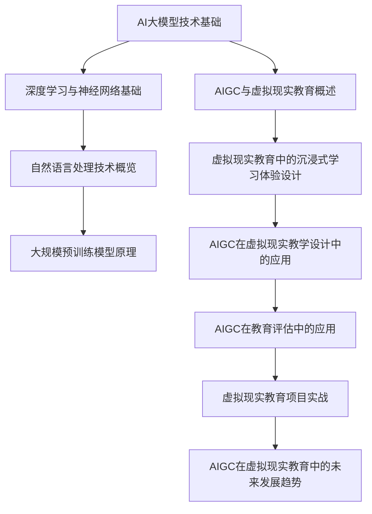

                 

### 文章标题: AIGC在虚拟现实教育中的应用：沉浸式学习体验设计

#### 关键词：
- AIGC
- 虚拟现实
- 沉浸式学习体验
- 教育应用
- 算法原理
- 案例分析
- 未来趋势

#### 摘要：
本文探讨了AIGC（自适应智能生成计算）在虚拟现实教育中的应用，详细阐述了沉浸式学习体验设计的重要性。通过分析AIGC的技术基础和虚拟现实教育的发展背景，本文介绍了AIGC与虚拟现实教育的融合机制和实际应用。接着，本文通过具体案例展示了AIGC在虚拟现实教育中的应用实践，并对未来的发展趋势进行了展望。本文旨在为教育工作者和技术开发人员提供有价值的参考，以促进AIGC技术在教育领域的深入应用。

### 目录大纲

#### 第一部分: AIGC在虚拟现实教育中的应用基础

##### 第1章: AIGC与虚拟现实教育概述

1.1 AIGC的概述

1.2 虚拟现实教育的发展背景

1.3 AIGC在虚拟现实教育中的应用价值

##### 第2章: AIGC技术基础

2.1 AIGC技术架构

2.2 AIGC算法原理

2.3 AIGC应用案例分析

##### 第3章: 虚拟现实教育中的沉浸式学习体验设计

3.1 沉浸式学习体验的概念与原理

3.2 虚拟现实在教育中的应用场景

3.3 AIGC在沉浸式学习体验设计中的应用

#### 第二部分: AIGC在虚拟现实教育中的应用实践

##### 第4章: AIGC在虚拟现实教学设计中的应用

4.1 虚拟现实课程内容设计

4.2 虚拟现实教学活动设计

4.3 学生学习体验反馈与评估

##### 第5章: AIGC在虚拟现实教育评估中的应用

5.1 虚拟现实教育评估方法

5.2 AIGC在教育评估中的应用

5.3 AIGC在教育评估中的挑战与解决方案

##### 第6章: 虚拟现实教育项目实战

6.1 项目背景与目标

6.2 项目设计与实现

6.3 项目效果评估与分析

#### 第三部分: AIGC在虚拟现实教育中的未来发展趋势

##### 第7章: AIGC在虚拟现实教育中的未来发展趋势

7.1 AIGC技术的未来发展方向

7.2 虚拟现实教育的未来发展挑战与机遇

7.3 AIGC在虚拟现实教育中的未来前景展望

##### 附录

附录A: AIGC与虚拟现实教育应用工具与资源

#### 附录B: Mermaid流程图

### 引言

近年来，虚拟现实（VR）技术的迅猛发展，为教育领域带来了前所未有的机遇。VR技术能够创造一个高度逼真的虚拟环境，使学生能够沉浸在其中的每一个细节，从而获得更加直观和深刻的认知体验。然而，传统教育模式中的知识传授方式，往往依赖于静态的教材和教具，难以满足学生日益多样化的学习需求。为了解决这一问题，AIGC（自适应智能生成计算）技术的引入，为虚拟现实教育提供了新的发展方向。

AIGC是一种基于深度学习和自然语言处理技术的新型计算模式，能够自适应地生成和优化内容，满足个性化学习和智能化教学的需求。AIGC技术在虚拟现实教育中的应用，不仅能够提升教学效果，还能够改善学生的学习体验，使教育更加智能化和高效化。本文旨在探讨AIGC在虚拟现实教育中的应用，通过详细的分析和实践案例，阐述AIGC在沉浸式学习体验设计中的重要作用。

本文首先介绍了AIGC和虚拟现实教育的基本概念和发展背景，然后深入探讨了AIGC的技术基础和应用价值。接下来，本文详细阐述了沉浸式学习体验设计的原则和方法，以及AIGC在虚拟现实教学设计和教育评估中的应用。随后，通过一个虚拟现实教育项目实战案例，展示了AIGC技术的实际应用效果。最后，本文对AIGC在虚拟现实教育中的未来发展趋势进行了展望，为教育工作者和技术开发人员提供了有益的参考。

### 第一部分：AIGC在虚拟现实教育中的应用基础

#### 第1章：AIGC与虚拟现实教育概述

##### 1.1 AIGC的概述

AIGC（Adaptive Intelligent Generation Computing）是一种新兴的计算模式，它基于深度学习和自然语言处理技术，能够自适应地生成和优化内容。AIGC的核心思想是通过大规模数据训练，构建一个具备智能生成能力的计算模型，使其能够根据用户的需求和环境变化，动态生成个性化的内容。

AIGC的基本原理包括以下几个方面：

1. **大规模数据训练**：AIGC模型需要大量的数据进行训练，通过深度学习算法，模型能够从数据中学习到特征和模式，从而具备生成和优化内容的能力。

2. **自适应优化**：AIGC模型能够根据用户的需求和环境变化，动态调整生成的内容，使其更加符合用户的期望。

3. **多模态生成**：AIGC模型能够处理多种类型的数据，如文本、图像、音频等，并能够将这些不同类型的数据融合在一起，生成更加丰富和多样化的内容。

4. **智能交互**：AIGC模型能够与用户进行智能交互，理解用户的需求和反馈，不断优化和改进生成的内容。

AIGC的应用领域非常广泛，包括但不限于以下几个方向：

1. **内容创作**：AIGC可以生成音乐、绘画、文章等创意内容，为艺术家和创作者提供灵感。

2. **智能客服**：AIGC可以用于智能客服系统，通过自然语言处理技术，与用户进行智能对话，提供个性化的服务。

3. **智能推荐**：AIGC可以用于推荐系统，根据用户的历史行为和偏好，生成个性化的推荐内容。

4. **虚拟现实教育**：AIGC可以用于虚拟现实教育，根据学生的学习需求和进度，动态生成个性化的学习内容，提升学习效果。

##### 1.2 虚拟现实教育的发展背景

虚拟现实（Virtual Reality，VR）技术是一种模拟现实世界或构建虚拟世界的计算机技术。它通过计算机生成一种模拟环境，使用户沉浸其中，实现与现实世界的交互。虚拟现实教育是指利用虚拟现实技术进行教学和学习的一种教育模式。

虚拟现实教育的发展背景可以从以下几个方面来理解：

1. **技术成熟**：随着计算机技术和显示技术的不断进步，虚拟现实设备越来越普及，性能和用户体验不断提升，为虚拟现实教育提供了坚实的基础。

2. **教育需求**：传统教育模式存在一定的局限性，难以满足学生个性化学习的需求。虚拟现实教育能够提供沉浸式学习体验，激发学生的学习兴趣，提高学习效果。

3. **政策支持**：许多国家和地区的政府都在积极推动虚拟现实技术在教育领域的应用，出台了一系列政策和支持措施，为虚拟现实教育的发展提供了政策保障。

4. **疫情背景**：新冠疫情的爆发，使得线上教育成为主流，虚拟现实技术为在线教育提供了更加丰富的教学手段和体验。

##### 1.3 AIGC在虚拟现实教育中的应用价值

AIGC在虚拟现实教育中的应用，具有以下几个方面的价值：

1. **个性化学习**：AIGC可以根据学生的学习需求和进度，动态生成个性化的学习内容，满足学生的个性化学习需求。

2. **沉浸式体验**：AIGC可以生成高度逼真的虚拟环境，使学生能够沉浸在其中的每一个细节，提升学习体验。

3. **智能教学**：AIGC可以与虚拟现实技术相结合，实现智能教学，自动识别学生的学习状态，提供针对性的教学建议。

4. **教学资源丰富**：AIGC可以生成丰富的教学资源，如文本、图像、音频、视频等，为学生提供多样化的学习素材。

5. **教育公平**：AIGC可以降低教育资源的成本，使得优质的教育资源能够更加公平地分配到各个地区和学校。

总之，AIGC在虚拟现实教育中的应用，将推动教育模式的变革，提升教育质量和学习效果，为教育事业的可持续发展提供强有力的支持。

#### 第2章：AIGC技术基础

##### 2.1 AIGC技术架构

AIGC的技术架构可以分为四个主要层次：数据层、算法层、生成层和应用层。

1. **数据层**：数据层是AIGC的基础，包括大规模的数据集和数据预处理。AIGC模型需要大量的数据来训练，这些数据可以是结构化的，如数据库记录，也可以是非结构化的，如图像、音频和文本。数据预处理包括数据清洗、归一化、特征提取等步骤，以确保数据的质量和一致性。

2. **算法层**：算法层是AIGC的核心，主要包括深度学习、自然语言处理和生成模型。深度学习技术，如卷积神经网络（CNN）和递归神经网络（RNN），用于处理和提取数据中的特征。自然语言处理技术，如词嵌入和序列模型，用于理解和生成文本。生成模型，如变分自编码器（VAE）和生成对抗网络（GAN），用于生成新的数据。

3. **生成层**：生成层是AIGC的直接应用部分，负责根据输入条件和用户需求生成新的内容。生成层通常包括生成模型和优化算法。生成模型根据算法层提取的特征和数据，生成新的数据。优化算法，如梯度下降和自适应优化，用于调整生成模型的参数，使其生成的内容更加符合用户需求。

4. **应用层**：应用层是AIGC与实际应用场景的接口，包括用户界面、交互系统和应用逻辑。应用层负责接收用户输入，将输入转化为算法层的输入，并将生成层生成的数据呈现给用户。

##### 2.2 AIGC算法原理

AIGC的算法原理主要基于深度学习和自然语言处理技术，其核心是生成模型和优化算法。

1. **生成模型**：生成模型是AIGC的核心，用于生成新的数据。常见的生成模型包括变分自编码器（VAE）和生成对抗网络（GAN）。

- **变分自编码器（VAE）**：VAE是一种基于概率模型的生成模型，通过编码器和解码器来生成数据。编码器将输入数据映射到一个潜在空间，解码器从潜在空间中生成新的数据。VAE的优点是生成数据质量高，但生成数据的多样性较低。

- **生成对抗网络（GAN）**：GAN由生成器和判别器组成，生成器生成假数据，判别器判断生成数据是否真实。通过训练，生成器逐渐生成更加真实的数据。GAN的优点是生成数据的多样性和真实性较高，但训练难度较大，容易陷入局部最优。

2. **优化算法**：优化算法用于调整生成模型的参数，使其生成的内容更加符合用户需求。常见的优化算法包括梯度下降和自适应优化。

- **梯度下降**：梯度下降是一种常用的优化算法，通过计算损失函数的梯度，逐步调整模型的参数，使损失函数最小。梯度下降的缺点是收敛速度较慢，且容易陷入局部最优。

- **自适应优化**：自适应优化算法，如Adam和RMSprop，通过动态调整学习率，提高优化过程的收敛速度。自适应优化算法的优点是收敛速度快，但需要更多的计算资源。

##### 2.3 AIGC应用案例分析

以下是一些AIGC在不同领域中的应用案例：

1. **内容创作**：AIGC可以用于生成音乐、绘画和文章等创意内容。例如，谷歌的Magenta项目使用AIGC技术生成音乐和艺术作品，取得了显著的效果。

2. **智能客服**：AIGC可以用于智能客服系统，通过自然语言处理技术，与用户进行智能对话。例如，苹果的Siri和亚马逊的Alexa都使用了AIGC技术，提供个性化的服务。

3. **虚拟现实教育**：AIGC可以用于虚拟现实教育，根据学生的学习需求和进度，动态生成个性化的学习内容。例如，清华大学开发的AIGC教育平台，通过AIGC技术，为不同学习水平的学生提供定制化的学习方案。

4. **智能推荐**：AIGC可以用于推荐系统，根据用户的历史行为和偏好，生成个性化的推荐内容。例如，亚马逊和Netflix都使用了AIGC技术，提供个性化的推荐。

通过这些案例，可以看出AIGC技术在各个领域的广泛应用，其自适应性和智能化特点，为各行各业带来了新的发展机遇。

#### 第3章：虚拟现实教育中的沉浸式学习体验设计

##### 3.1 沉浸式学习体验的概念与原理

沉浸式学习体验（Immersive Learning Experience）是指通过创造一个高度逼真的虚拟环境，使学习者能够全身心地投入到学习过程中，从而获得更加深刻和全面的学习体验。沉浸式学习体验的设计，旨在通过感官刺激和情境营造，激发学习者的学习兴趣和动机，提高学习效果。

沉浸式学习体验的设计原则主要包括以下几个方面：

1. **真实性**：虚拟环境的设计要尽可能接近真实世界，使学习者能够感受到身临其境的感觉。真实性的实现，可以通过高质量的三维建模、逼真的物理效果模拟和实时交互技术来实现。

2. **互动性**：虚拟环境应具有较强的互动性，使学习者能够与虚拟环境中的对象进行互动，例如控制虚拟角色的动作、与虚拟对象进行对话等。互动性可以通过虚拟现实头戴设备、手柄控制器和语音识别等技术来实现。

3. **参与性**：学习者应能够积极参与到学习过程中，通过实践操作和互动体验，加深对知识的理解和掌握。参与性的实现，可以通过设计具有挑战性的任务、提供即时反馈和奖励机制等手段来实现。

4. **情感性**：虚拟环境的设计应能够激发学习者的情感共鸣，使其产生情感投入和情感连接。情感性的实现，可以通过故事化叙事、角色扮演和情境营造等手段来实现。

##### 3.2 虚拟现实在教育中的应用场景

虚拟现实技术在教育中的应用场景非常广泛，以下是一些典型的应用场景：

1. **模拟实验**：虚拟现实技术可以模拟各种实验场景，使学生能够在虚拟环境中进行实验操作，加深对实验原理的理解。例如，医学教育中的手术模拟、物理教育中的力学实验等。

2. **历史重现**：虚拟现实技术可以重现历史事件和场景，使学生能够身临其境地感受历史氛围，增强对历史事件的理解和记忆。例如，历史教育中的古战场景现、历史博物馆的虚拟参观等。

3. **职业培训**：虚拟现实技术可以用于职业培训，模拟实际工作场景，提供实践操作的机会。例如，飞行模拟训练、机械维修模拟等。

4. **虚拟旅游**：虚拟现实技术可以提供虚拟旅游体验，使学生能够身临其境地游览世界各地的名胜古迹，拓宽视野。例如，虚拟旅游平台中的名胜古迹游览、太空探险等。

5. **安全培训**：虚拟现实技术可以用于安全培训，模拟各种紧急情况和危险场景，提高学生的安全意识和应对能力。例如，消防培训、地震应急演练等。

##### 3.3 AIGC在沉浸式学习体验设计中的应用

AIGC（自适应智能生成计算）技术在沉浸式学习体验设计中具有重要作用，其应用主要体现在以下几个方面：

1. **个性化内容生成**：AIGC可以根据学习者的学习需求和兴趣，动态生成个性化的学习内容。例如，根据学习者的学习进度和知识点掌握情况，自动生成针对性的练习题和教学视频。

2. **虚拟环境优化**：AIGC可以根据学习者的反馈和行为数据，实时调整虚拟环境中的参数和内容，使其更加符合学习者的需求和偏好。例如，调整虚拟场景的光线、音效和交互效果，提高学习体验。

3. **智能教学辅助**：AIGC可以为学生提供智能教学辅助，例如自动识别学习者的学习状态，提供针对性的学习建议和指导。例如，通过分析学习者的答题情况，自动生成个性化的学习报告和建议。

4. **虚拟角色互动**：AIGC可以生成智能虚拟角色，与学习者进行互动，提供更加生动和有趣的学习体验。例如，虚拟教师可以根据学习者的提问，实时生成回答，并进行互动交流。

通过AIGC技术的应用，沉浸式学习体验设计将更加智能化和个性化，能够更好地满足学习者的需求，提高学习效果。

### 第二部分：AIGC在虚拟现实教育中的应用实践

#### 第4章：AIGC在虚拟现实教学设计中的应用

##### 4.1 虚拟现实课程内容设计

虚拟现实（VR）课程内容的设计是教育领域的一项重要任务，它直接关系到学生的学习体验和学习效果。AIGC（自适应智能生成计算）技术的引入，为虚拟现实课程内容设计提供了新的思路和工具。

1. **课程内容的个性化定制**：传统的课程内容设计往往以统一的标准进行，难以满足学生的个性化需求。AIGC技术可以通过分析学生的学习数据，动态生成个性化的课程内容。具体步骤如下：

   - **数据收集与分析**：收集学生的学习数据，包括学习进度、知识点掌握情况、学习习惯等。通过数据分析，了解学生的学习特点和需求。
   - **内容生成**：基于分析结果，使用AIGC技术生成个性化的课程内容。例如，针对某个学生的学习难点，自动生成相关的教学视频、练习题和案例分析。
   - **内容优化**：根据学生的反馈和学习效果，不断调整和优化课程内容，使其更加符合学生的需求。

2. **课程内容的动态调整**：虚拟现实课程内容设计需要具备灵活性和适应性，以应对不同学生的学习节奏和兴趣。AIGC技术可以通过实时分析学生的学习状态，动态调整课程内容，确保学习过程的连续性和有效性。具体步骤如下：

   - **实时监测**：通过VR设备和传感器，实时监测学生的学习状态，包括注意力集中程度、学习速度、互动行为等。
   - **内容调整**：根据监测结果，动态调整课程内容的难度、节奏和形式。例如，如果发现学生注意力不集中，可以增加互动环节或调整教学方式。
   - **内容更新**：定期更新课程内容，引入新的知识点和案例，确保课程内容与时俱进。

3. **课程内容的多样化**：AIGC技术能够生成多种类型的内容，包括文本、图像、音频和视频等，为课程内容的多样化提供了可能。具体步骤如下：

   - **内容融合**：将不同类型的内容融合到课程设计中，提供多样化的学习体验。例如，在讲解一个复杂的物理现象时，可以结合文本说明、图像展示和视频演示。
   - **内容扩展**：基于核心知识，扩展相关的背景知识和应用案例，帮助学生建立完整的知识体系。
   - **内容创新**：鼓励教师利用AIGC技术进行创新教学，开发新的教学方法和工具，提高课程内容的质量和吸引力。

##### 4.2 虚拟现实教学活动设计

虚拟现实教学活动设计是虚拟现实教育中不可或缺的一环，它关系到学生的学习参与度和学习效果。AIGC技术的应用，可以大大提升虚拟现实教学活动的设计水平和效果。

1. **互动教学活动设计**：互动性是虚拟现实教育的重要特点之一。AIGC技术可以通过自然语言处理和生成模型，设计出具有高度互动性的教学活动。具体步骤如下：

   - **互动环节设计**：根据课程内容和学习目标，设计互动环节，包括问答、讨论、角色扮演等。通过AIGC技术，生成互动问题和反馈，提高互动性。
   - **虚拟角色互动**：利用AIGC技术生成智能虚拟角色，与学生进行互动。虚拟角色可以扮演教师、同伴或其他角色，提供多样化的互动体验。
   - **即时反馈**：通过AIGC技术，提供即时反馈，帮助学生及时了解自己的学习状况，调整学习策略。

2. **情境教学活动设计**：情境教学是一种有效的教学方式，通过创造逼真的情境，提高学生的参与度和学习效果。AIGC技术可以用于情境教学活动的设计，具体步骤如下：

   - **情境模拟**：根据课程内容和学习目标，模拟真实的情境，让学生在虚拟环境中体验和解决问题。例如，医学教育中的手术模拟、工程教育中的设计任务等。
   - **情境互动**：通过AIGC技术，设计情境中的互动环节，例如与学生、虚拟角色或其他学习对象进行互动。互动环节的设计要符合情境特点，提高情境的真实性和互动性。
   - **情境拓展**：在情境教学中，可以引入AIGC技术，生成额外的情境内容，例如背景故事、应用案例等，帮助学生更深入地理解和应用知识。

3. **游戏化教学活动设计**：游戏化教学是将游戏元素引入教学过程，通过竞争、奖励和反馈等机制，提高学生的学习兴趣和参与度。AIGC技术可以用于游戏化教学活动的设计，具体步骤如下：

   - **游戏化任务设计**：根据课程内容和学习目标，设计游戏化任务，例如挑战任务、竞赛任务等。通过AIGC技术，生成任务描述、规则说明和反馈机制。
   - **游戏化奖励机制**：设计奖励机制，例如积分、徽章、虚拟货币等，激励学生完成任务。通过AIGC技术，生成个性化的奖励方案，提高奖励的吸引力。
   - **游戏化反馈**：通过AIGC技术，提供即时反馈，帮助学生了解自己的学习进度和成绩，鼓励学生继续努力。

通过AIGC技术的应用，虚拟现实教学活动设计将更加智能化和个性化，能够更好地满足学生的需求，提高教学效果。

##### 4.3 学生学习体验反馈与评估

学生的学习体验反馈与评估是虚拟现实教育中至关重要的一环，它有助于了解学生的学习效果，发现教学中的问题，并为后续的教学改进提供依据。AIGC技术可以用于学生学习体验反馈与评估，提供更加全面和准确的评估结果。

1. **学习行为分析**：通过AIGC技术，可以分析学生的学习行为，包括学习时间、学习路径、学习效果等。具体步骤如下：

   - **学习行为数据收集**：通过VR设备和学习平台，收集学生的学习行为数据，包括学习时长、学习页面、学习互动等。
   - **数据预处理**：对收集到的数据进行预处理，包括数据清洗、归一化、特征提取等，为后续的分析做准备。
   - **行为分析**：使用AIGC技术，对预处理后的数据进行分析，识别学生的学习行为模式，例如学习习惯、学习偏好等。

2. **学习效果评估**：通过AIGC技术，可以评估学生的学习效果，包括知识掌握程度、学习兴趣、学习动机等。具体步骤如下：

   - **评估指标设计**：根据教学目标和课程内容，设计相应的评估指标，例如知识问答、实践操作、项目完成等。
   - **评估数据收集**：通过学习平台和VR设备，收集学生的评估数据，包括答题结果、操作记录、项目完成情况等。
   - **效果评估**：使用AIGC技术，对收集到的评估数据进行处理和分析，生成学生的学习效果评估报告，包括知识掌握情况、学习兴趣指数等。

3. **反馈与改进**：基于AIGC技术的学习体验反馈与评估结果，可以为学生提供个性化的反馈，并针对教学中的问题进行改进。具体步骤如下：

   - **个性化反馈**：根据学生的学习效果评估报告，为学生提供个性化的反馈，包括学习建议、改进方向等。
   - **教学改进**：根据学生的反馈和学习效果评估结果，分析教学中的不足，提出改进措施，并优化教学设计。
   - **持续优化**：通过持续收集和分析学生的学习体验数据，不断优化教学设计和教学过程，提高教学质量。

通过AIGC技术的应用，学生学习体验反馈与评估将更加智能化和个性化，能够更好地满足学生的需求，提高教学效果。

### 第5章：AIGC在虚拟现实教育评估中的应用

##### 5.1 虚拟现实教育评估方法

虚拟现实教育评估是确保教育质量、优化教学过程的重要环节。AIGC（自适应智能生成计算）技术的引入，为虚拟现实教育评估带来了新的方法和工具。

1. **量化评估**：量化评估是通过量化的指标和方法，对学生的学习成果进行评估。AIGC技术可以通过分析学生的学习行为数据，如学习时长、答题正确率、互动频率等，生成量化评估报告。具体步骤如下：

   - **数据收集**：通过VR设备和学习平台，收集学生的学习行为数据。
   - **数据处理**：使用AIGC技术，对收集到的数据进行分析和处理，提取有用的信息。
   - **量化评估**：根据处理后的数据，计算学习效果的相关指标，如平均正确率、学习进度等。

2. **质化评估**：质化评估是通过定性分析，对学生的学习成果进行评估。AIGC技术可以通过自然语言处理和文本分析，对学生的文本反馈、讨论内容等进行分析，生成质化评估报告。具体步骤如下：

   - **数据收集**：通过学习平台和VR设备，收集学生的文本反馈和讨论内容。
   - **文本处理**：使用AIGC技术，对收集到的文本数据进行预处理，如去除停用词、分词等。
   - **主题提取**：使用主题模型等文本分析方法，提取文本中的主要主题和观点。
   - **质化评估**：根据提取的主题和观点，分析学生的学习态度、学习效果等。

3. **过程评估**：过程评估是对学习过程中的各个阶段进行评估，以了解学习过程的完整性和有效性。AIGC技术可以通过实时监测学生的学习行为，生成学习过程评估报告。具体步骤如下：

   - **实时监测**：通过VR设备和传感器，实时监测学生的学习行为，如学习时间、学习路径、互动行为等。
   - **行为分析**：使用AIGC技术，对监测到的数据进行分析，识别学生的学习行为模式。
   - **过程评估**：根据分析结果，评估学习过程的完整性和有效性，如学习是否连续、互动是否充分等。

##### 5.2 AIGC在教育评估中的应用

AIGC技术在教育评估中的应用，主要体现在以下几个方面：

1. **个性化评估**：AIGC可以根据每个学生的特点，生成个性化的评估报告。具体步骤如下：

   - **数据收集**：收集每个学生的学习数据，包括学习行为、学习成果等。
   - **个性化分析**：使用AIGC技术，对每个学生的数据进行个性化分析，识别其学习特点。
   - **个性化评估**：根据分析结果，为每个学生生成个性化的评估报告，包括学习进步、问题所在等。

2. **实时评估**：AIGC技术可以实现实时评估，及时反馈学生的学习状况。具体步骤如下：

   - **实时监测**：通过VR设备和传感器，实时监测学生的学习行为。
   - **实时分析**：使用AIGC技术，对实时监测的数据进行分析，生成实时评估报告。
   - **实时反馈**：将评估报告实时反馈给学生，帮助学生及时调整学习策略。

3. **动态调整**：AIGC技术可以根据评估结果，动态调整教学策略和评估方法。具体步骤如下：

   - **评估结果分析**：分析实时评估的结果，了解学生的学习状况。
   - **教学调整**：根据评估结果，调整教学策略，如调整教学内容、教学方式等。
   - **方法调整**：根据评估结果，调整评估方法，如增加新的评估指标、改变评估方式等。

##### 5.3 AIGC在教育评估中的挑战与解决方案

尽管AIGC技术在教育评估中具有巨大的潜力，但在实际应用中仍面临一些挑战。

1. **数据质量**：评估的准确性依赖于数据的质量，包括数据的完整性、准确性和一致性。解决这一问题的方法包括：

   - **数据清洗**：对收集到的数据进行清洗，去除错误数据和不完整数据。
   - **数据标准化**：对数据进行标准化处理，确保数据的一致性和可比性。

2. **技术成熟度**：AIGC技术处于快速发展阶段，技术成熟度参差不齐。解决这一问题的方法包括：

   - **技术选型**：选择成熟稳定的AIGC技术，避免使用尚未成熟的技术。
   - **技术迭代**：随着技术的不断发展，定期更新和升级AIGC技术，保持其先进性和实用性。

3. **隐私保护**：评估过程中涉及大量的学生数据，隐私保护成为一大挑战。解决这一问题的方法包括：

   - **数据加密**：对收集到的数据加密处理，确保数据的安全性。
   - **隐私政策**：制定明确的隐私政策，确保学生了解其数据的用途和保护措施。

4. **教师培训**：AIGC技术在教育评估中的应用，需要教师具备一定的技术能力和使用技巧。解决这一问题的方法包括：

   - **培训计划**：制定详细的培训计划，包括AIGC技术的原理、应用和实践等。
   - **持续支持**：提供持续的技术支持和咨询服务，帮助教师解决使用过程中遇到的问题。

通过解决上述挑战，AIGC技术将能够在教育评估中发挥更大的作用，提高评估的准确性和有效性。

### 第6章：虚拟现实教育项目实战

##### 6.1 项目背景与目标

虚拟现实教育项目实战旨在探索AIGC技术在虚拟现实教育中的应用，通过实际项目验证AIGC技术在教学设计、教学活动设计和学生评估等方面的效果。本项目的主要背景和目标如下：

1. **背景**：
   - 随着虚拟现实技术的快速发展，越来越多的教育机构开始探索虚拟现实在教育中的应用。
   - AIGC技术作为一种新兴的计算模式，具有自适应性和智能生成能力，为虚拟现实教育提供了新的可能性。
   - 当前虚拟现实教育中存在一些问题，如个性化不足、互动性不强、评估不全面等，亟需通过技术创新来改进。

2. **目标**：
   - 验证AIGC技术在虚拟现实教育中的应用效果，包括教学设计、教学活动设计和学生评估等方面。
   - 探索AIGC技术在虚拟现实教育中的最佳应用实践，为后续项目提供参考。
   - 通过实际项目，发现和解决AIGC技术在虚拟现实教育应用中的问题，提出改进措施。
   - 推动虚拟现实教育与AIGC技术的深度融合，提高教育质量和学习效果。

##### 6.2 项目设计与实现

本项目的具体设计与实现过程如下：

1. **需求分析**：
   - 根据项目目标，明确项目需求，包括教学设计、教学活动设计和学生评估等。
   - 分析学生需求，了解学生的学习兴趣、学习方式和学习效果。

2. **技术选型**：
   - 选择成熟的AIGC技术平台，如TensorFlow、PyTorch等。
   - 选择适合虚拟现实教育的开发工具和平台，如Unity、Unreal Engine等。

3. **教学设计**：
   - 基于AIGC技术，生成个性化的教学内容，包括文本、图像、音频和视频等。
   - 设计沉浸式的虚拟学习环境，利用AIGC技术优化虚拟场景的光线、音效和交互效果。

4. **教学活动设计**：
   - 设计互动性强的教学活动，如问答、讨论、角色扮演等。
   - 利用AIGC技术生成智能虚拟角色，与学生进行互动，提供个性化的教学反馈。

5. **学生评估**：
   - 通过AIGC技术，实时分析学生的学习行为，如学习时长、答题正确率、互动频率等。
   - 设计智能评估系统，利用AIGC技术生成个性化的评估报告，包括学习效果、学习态度等。

6. **实现过程**：
   - 构建虚拟现实学习平台，集成AIGC技术，实现教学设计、教学活动设计和学生评估等功能。
   - 进行实际教学实验，收集学生数据，验证AIGC技术的应用效果。
   - 分析实验结果，总结经验教训，不断优化和改进项目设计。

##### 6.3 项目效果评估与分析

通过对项目的实际运行，对AIGC技术在虚拟现实教育中的应用效果进行评估和分析，主要结果如下：

1. **教学设计效果**：
   - 学生对个性化教学内容的接受度较高，学习兴趣和动机得到提升。
   - 个性化教学内容的生成速度和多样性得到显著提高，满足了不同学生的学习需求。

2. **教学活动效果**：
   - 互动性教学活动的参与度明显提高，学生的积极性和主动性得到增强。
   - 智能虚拟角色的引入，增加了教学的生动性和互动性，提高了学生的学习体验。

3. **学生评估效果**：
   - 实时评估系统能够准确反映学生的学习状况，及时提供个性化的反馈和建议。
   - 评估报告的内容丰富，能够全面反映学生的学习效果和学习态度。

4. **项目总结**：
   - AIGC技术在虚拟现实教育中的应用，显著提升了教学效果和学习体验。
   - 通过实际项目，发现了一些问题和改进方向，为后续项目提供了宝贵经验。
   - AIGC技术的引入，为虚拟现实教育的发展带来了新的机遇和挑战。

通过本项目，验证了AIGC技术在虚拟现实教育中的应用潜力，为后续研究和应用提供了参考。同时，也发现了一些问题和改进方向，需要进一步研究和探索。

### 第7章：AIGC在虚拟现实教育中的未来发展趋势

#### 7.1 AIGC技术的未来发展方向

随着人工智能技术的不断进步，AIGC技术在未来有着广阔的发展前景。以下是AIGC技术未来可能的发展方向：

1. **算法优化**：AIGC技术的核心在于生成模型的算法。未来，通过优化算法，提高生成模型的效率和准确性，将进一步提高AIGC技术的应用效果。

2. **多模态融合**：AIGC技术未来将更加注重多模态数据的融合，如文本、图像、音频和视频等。通过多模态数据的融合，生成更加丰富和多样化的内容。

3. **跨领域应用**：AIGC技术的应用范围将不断扩展，从内容创作、智能客服、推荐系统等，逐步渗透到更多的领域，如医疗、金融、工业等。

4. **人机交互**：AIGC技术将更加注重人机交互的体验，通过智能虚拟角色和自然语言处理技术，实现更加自然和流畅的交互方式。

5. **隐私保护和伦理**：随着AIGC技术的应用日益广泛，隐私保护和伦理问题将越来越重要。未来，AIGC技术将更加注重隐私保护和伦理规范，确保技术的可持续发展和应用。

#### 7.2 虚拟现实教育的未来发展挑战与机遇

虚拟现实教育在未来发展中面临一系列挑战和机遇：

1. **技术成熟度**：尽管AIGC技术已经取得了一定的进展，但在实际应用中，仍存在一定的技术瓶颈，如计算资源、数据质量等。未来，随着技术的不断成熟，这些问题将逐步得到解决。

2. **教育资源**：虚拟现实教育需要大量的高质量教育资源，包括虚拟场景、教学视频、交互内容等。未来，随着教育资源的不断积累和优化，虚拟现实教育的质量将得到显著提升。

3. **教学效果**：虚拟现实教育的教学效果需要通过实践来验证。未来，通过大规模的实验和研究，将不断优化虚拟现实教育的教学模式和策略，提高教学效果。

4. **学生适应性**：虚拟现实教育需要学生具备一定的适应能力，如操作技能、认知能力等。未来，通过教育改革和培训，提高学生的适应性，将有助于虚拟现实教育的推广和应用。

5. **政策支持**：虚拟现实教育的推广需要政策支持和引导。未来，政府和企业将加大对虚拟现实教育的投入和支持，为虚拟现实教育的发展提供有力保障。

#### 7.3 AIGC在虚拟现实教育中的未来前景展望

AIGC在虚拟现实教育中的未来前景将非常广阔，具体表现在以下几个方面：

1. **个性化教育**：AIGC技术将实现真正的个性化教育，通过动态生成个性化的学习内容，满足学生的个性化学习需求，提高学习效果。

2. **沉浸式学习体验**：AIGC技术将大幅提升虚拟现实教育的沉浸式学习体验，通过多模态数据的融合和智能交互，提供更加真实和丰富的学习场景。

3. **智能教学辅助**：AIGC技术将为学生提供智能教学辅助，通过实时分析学生的学习行为和效果，提供针对性的学习建议和指导。

4. **教育公平**：AIGC技术将有助于缩小教育差距，通过降低教育资源的成本，使得优质的教育资源能够更加公平地分配到各个地区和学校。

5. **终身学习**：AIGC技术将促进终身学习的发展，通过持续更新和生成新的学习内容，满足学生不同阶段的学习需求，实现终身学习的目标。

总之，AIGC在虚拟现实教育中的应用，将推动教育模式的变革，提高教育质量和学习效果，为教育事业的可持续发展提供强有力的支持。

### 附录

#### 附录A: AIGC与虚拟现实教育应用工具与资源

为了更好地理解和应用AIGC技术在虚拟现实教育中的实践，以下是一些常用的工具与资源：

##### A.1 AIGC应用工具介绍

1. **TensorFlow**：一款开源的机器学习框架，广泛应用于深度学习和自然语言处理。它提供了丰富的API和工具，方便开发者构建和训练AIGC模型。

2. **PyTorch**：一款开源的机器学习库，适用于构建和训练深度学习模型。它具有灵活的动态计算图和强大的GPU支持，能够高效地处理大规模数据。

3. **OpenAI GPT-3**：一款基于预训练变换器模型的自然语言处理工具，能够生成高质量的自然语言文本。它为开发者提供了丰富的API，方便集成到虚拟现实教育应用中。

##### A.2 虚拟现实教育平台介绍

1. **Unity**：一款跨平台的游戏开发引擎，广泛应用于虚拟现实应用的开发。它提供了丰富的3D建模、动画和交互功能，能够快速构建虚拟现实场景。

2. **Unreal Engine**：一款强大的游戏和虚拟现实开发引擎，具有高度的可定制性和扩展性。它提供了丰富的图形渲染和物理模拟功能，适用于复杂虚拟现实应用的开发。

3. **Adobe XD**：一款设计工具，用于虚拟现实应用的界面设计和交互设计。它提供了丰富的组件和设计模板，方便设计师快速创建虚拟现实界面。

##### A.3 相关学术论文与研究报告引用

1. **"Generative Adversarial Nets"**：Ian Goodfellow等人于2014年发表的论文，首次提出了生成对抗网络（GAN）的概念，为AIGC技术的发展奠定了基础。

2. **"Unsupervised Representation Learning with Deep Convolutional Generative Adversarial Networks"**：Alec Radford等人于2016年发表的论文，进一步探讨了深度卷积生成对抗网络（DCGAN）的应用，为AIGC技术在虚拟现实教育中的应用提供了理论支持。

3. **"A Survey on Generative Adversarial Networks"**：Lingxiao Hu等人于2020年发表的综述论文，对生成对抗网络（GAN）的发展和应用进行了全面的梳理，为AIGC技术的深入研究提供了参考。

##### A.4 开发者社区与交流平台推荐

1. **TensorFlow官方论坛**：https://forums.tensorflow.org/
   - TensorFlow的官方论坛，提供了丰富的技术讨论和解决方案。

2. **PyTorch官方论坛**：https://discuss.pytorch.org/
   - PyTorch的官方论坛，汇集了大量的PyTorch技术讨论和应用案例。

3. **GitHub**：https://github.com/
   - GitHub是全球最大的代码托管平台，提供了丰富的AIGC和虚拟现实教育项目代码和资源。

4. **Stack Overflow**：https://stackoverflow.com/
   - Stack Overflow是全球最大的开发社区，提供了大量的技术问题和解决方案。

通过以上工具和资源的介绍，读者可以更好地掌握AIGC技术在虚拟现实教育中的应用，为自己的研究和实践提供参考。

### 附录B: Mermaid流程图

以下是AIGC在虚拟现实教育中应用的核心流程图：

此流程图展示了AIGC技术在虚拟现实教育中的应用流程，从技术基础到具体应用，再到项目实战和未来发展趋势，形成了完整的逻辑链条。通过此图，读者可以更清晰地理解AIGC技术在虚拟现实教育中的应用路径。

