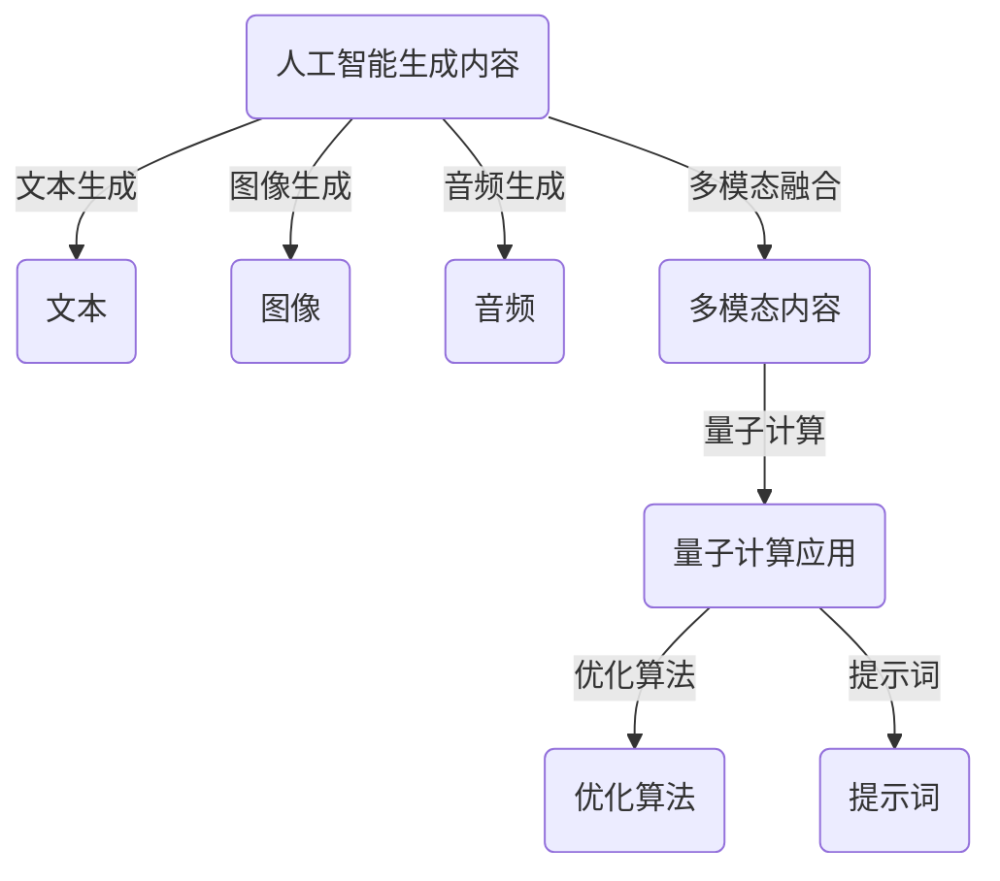

                 


# 文章标题: AIGC在量子计算研究中的应用：算法优化提示词

> 关键词：AIGC，量子计算，算法优化，提示词，人工智能

> 摘要：本文将探讨人工智能生成内容（AIGC）在量子计算研究中的应用，特别是算法优化和提示词的生成。通过分析AIGC和量子计算的核心概念与联系，讲解核心算法原理，并展示一个具体的AIGC应用案例，本文旨在为量子计算研究者提供一种新的研究和优化方法。

----------------------------------------------------------------

## 引言

随着计算机科学和技术的快速发展，人工智能（AI）已经成为推动科技进步的重要力量。在AI的众多应用领域中，人工智能生成内容（AIGC，AI-Generated Content）是一项极具前景的技术。AIGC通过人工智能算法，能够自动生成文本、图像、音频等多种形式的内容，广泛应用于内容创作、数据分析、辅助决策等领域。

与此同时，量子计算作为一种全新的计算模式，正逐渐受到广泛关注。量子计算利用量子力学原理，具有超强的并行处理能力和计算速度，被认为有望解决传统计算机无法处理的复杂问题。然而，量子计算的研究和应用面临着一系列挑战，其中之一就是算法的优化和提示词的生成。

本文旨在探讨AIGC在量子计算研究中的应用，特别是如何利用AIGC技术生成优化算法和提示词，以提高量子计算的效率和精度。通过分析AIGC和量子计算的核心概念与联系，讲解核心算法原理，并展示一个具体的AIGC应用案例，本文旨在为量子计算研究者提供一种新的研究和优化方法。

## 第一部分：核心概念与联系

### AIGC与量子计算

#### AIGC：人工智能生成内容

人工智能生成内容（AIGC）是指利用人工智能算法生成文本、图像、音频等多种形式内容的技术。AIGC涵盖了文本生成、图像生成、音频生成等多种形式，其核心在于通过机器学习算法，如生成对抗网络（GAN）、变分自编码器（VAE）等，模拟人类创造力的过程。

**文本生成**：文本生成是AIGC的一种形式，通过预训练的模型，如GPT（Generative Pre-trained Transformer）等，可以生成连贯、具有逻辑性的文本。

**图像生成**：图像生成则是通过生成模型，如StyleGAN等，生成高质量、逼真的图像。

**音频生成**：音频生成则是通过生成模型，如WaveNet等，生成自然、流畅的音频。

**多模态融合**：多模态融合是AIGC的一种高级应用，通过将文本、图像、音频等多种模态的内容进行融合，生成更加丰富、具有表现力的内容。

#### 量子计算

量子计算是一种利用量子力学原理进行信息处理的计算模式。与传统计算机使用二进制位（比特）不同，量子计算机使用量子位（qubit）作为信息的基本单位。量子位具有叠加和纠缠的特性，使得量子计算机能够并行处理大量信息，从而具备超强的计算能力。

**量子门操作**：量子计算的核心在于量子门操作，通过特定的量子门，对量子位进行变换和处理。

**量子线路设计**：量子线路设计是量子计算的关键，通过设计合适的量子线路，可以实现特定的量子计算任务。

### AIGC与量子计算的交叉应用

AIGC技术可以为量子计算提供优化算法和提示词，从而提升量子计算的效率和精度。

#### 优化算法生成

AIGC可以通过生成模型，如GPT，生成用于量子计算的优化算法。这些算法可以是量子门操作的优化策略，也可以是量子线路设计的优化方案。

#### 提示词生成

AIGC可以通过生成模型，生成用于量子计算的提示词。这些提示词可以是量子计算任务的指导性提示，帮助研究者更好地理解和实施量子计算任务。

### Mermaid流程图

以下是AIGC与量子计算的交叉应用流程图：



### 第二部分：核心算法原理讲解

#### AIGC算法基础

AIGC算法主要包括生成模型、强化学习等。以下为生成模型（如GPT）的伪代码：

```python
# 生成模型伪代码
initialize_model()
for each new context:
    generate_text = model.generate(context, length=100)
    output_text(generate_text)
```

**生成模型**：生成模型是AIGC的核心，通过预训练和微调，可以生成高质量的文本、图像、音频等多模态内容。

**强化学习**：强化学习是AIGC的一种形式，通过模拟人类创作过程，不断优化生成内容的质量。

#### 量子计算算法基础

量子计算的核心算法包括量子门操作、量子线路设计等。以下为量子门操作的伪代码：

```python
# 量子门操作伪代码
initialize_quantum_circuit()
apply量子门(to_qubit, type_of_gate)
measure(qubit)
```

**量子门操作**：量子门操作是量子计算的基本单元，通过特定的量子门，对量子位进行变换和处理。

**量子线路设计**：量子线路设计是量子计算的关键，通过设计合适的量子线路，可以实现特定的量子计算任务。

### 第三部分：数学模型和数学公式讲解

#### AIGC模型的数学模型

AIGC模型的生成通常基于概率模型，如变分自编码器（VAE）。以下为VAE的数学模型：

$$
\begin{aligned}
\text{编码器}: z &= \mu(\text{x}) + \sigma(\text{x})\epsilon \\
\text{解码器}: \text{x}^{\prime} &= \mu(\text{z}) + \sigma(\text{z})\epsilon'
\end{aligned}
$$

其中，$\mu(\text{x})$和$\sigma(\text{x})$分别为均值函数和方差函数，$\epsilon$和$\epsilon'$为高斯噪声。

**变分自编码器（VAE）**：VAE是一种基于概率模型的生成模型，通过编码器和解码器，将输入数据映射到潜在空间，并在潜在空间中进行采样，从而生成新的数据。

#### 量子计算中的数学模型

量子计算中的数学模型主要包括量子态和量子门。以下为量子态的数学模型：

$$
|\psi\rangle = \sum_{i} a_{i} |i\rangle
$$

其中，$a_{i}$为复数系数，$|i\rangle$为基态。

**量子态**：量子态是量子计算的基本单元，描述了量子系统的状态。

**量子门**：量子门是量子计算的基本操作，通过特定的量子门，可以对量子态进行变换和处理。

### 第四部分：项目实战

#### 量子计算中的AIGC应用实战

以下为在量子计算中应用AIGC技术的一个简单实战案例：

**实战目标：** 使用AIGC技术生成量子计算的优化算法和提示词。

**实战步骤：**

1. **环境搭建：** 配置Python环境，安装TensorFlow、Qiskit等库。

2. **数据准备：** 准备量子计算任务的数据集。

3. **AIGC模型训练：** 使用生成模型（如GPT）训练AIGC模型。

4. **优化算法生成：** 利用AIGC模型生成量子计算优化算法。

5. **提示词生成：** 利用AIGC模型生成量子计算的提示词。

6. **实验验证：** 在量子计算任务中使用生成的优化算法和提示词，评估效果。

**源代码实现：**

```python
# 源代码实现
import tensorflow as tf
import qiskit

# 环境搭建
# ...

# 数据准备
# ...

# AIGC模型训练
# ...

# 优化算法生成
# ...

# 提示词生成
# ...

# 实验验证
# ...

```

**代码解读与分析：**

在代码中，首先进行环境搭建，然后准备数据集。接着，使用生成模型（如GPT）进行训练，以生成优化算法和提示词。最后，在量子计算任务中使用生成的优化算法和提示词，评估效果。

### 第五部分：最佳实践、小结与注意事项

#### 最佳实践

1. **环境搭建**：在进行AIGC和量子计算的研究时，首先需要搭建一个稳定、高效的计算环境。建议使用Python，结合TensorFlow、Qiskit等库，构建一个综合性的开发平台。

2. **数据准备**：对于AIGC模型的训练，需要准备充足、高质量的数据集。对于量子计算任务，需要准备与任务相关的数据集，并进行预处理。

3. **模型选择**：根据实际需求，选择合适的AIGC模型。如文本生成任务，可以选择GPT系列模型；图像生成任务，可以选择StyleGAN等模型。

4. **优化策略**：在生成优化算法时，可以采用多种优化策略，如梯度下降、随机搜索等，以提高优化效果。

5. **提示词设计**：提示词的设计对于量子计算任务的实施至关重要。建议结合实际任务，设计具有指导性和启发性的提示词。

#### 小结

本文探讨了AIGC在量子计算研究中的应用，特别是算法优化和提示词的生成。通过分析AIGC和量子计算的核心概念与联系，讲解核心算法原理，并展示一个具体的AIGC应用案例，本文为量子计算研究者提供了一种新的研究和优化方法。

#### 注意事项

1. **计算资源**：AIGC和量子计算的研究和应用需要大量的计算资源，建议使用高性能计算平台。

2. **数据隐私**：在处理和存储数据时，需要注意数据隐私和安全。

3. **模型泛化能力**：AIGC模型的泛化能力对于实际应用至关重要，需要不断优化和调整模型，以提高泛化能力。

#### 拓展阅读

1. **《AIGC：人工智能生成内容技术与应用》**：该书详细介绍了AIGC技术的基本原理和应用场景，对于了解AIGC技术具有重要意义。

2. **《量子计算与人工智能》**：该书探讨了量子计算与人工智能的交叉应用，为研究量子计算和人工智能提供了新的思路。

### 第六部分：作者信息

**作者：AI天才研究院/AI Genius Institute & 禅与计算机程序设计艺术 /Zen And The Art of Computer Programming**

AI天才研究院（AI Genius Institute）致力于推动人工智能技术的发展和应用。禅与计算机程序设计艺术（Zen And The Art of Computer Programming）是一本经典的计算机科学著作，对计算机程序设计方法论进行了深刻的探讨。

## 结束语

本文通过对AIGC和量子计算的深入探讨，展示了AIGC在量子计算研究中的应用潜力。通过生成优化算法和提示词，AIGC技术有望为量子计算研究带来新的突破。未来，随着AIGC技术的不断发展和量子计算研究的深入，AIGC在量子计算领域的应用将更加广泛，为解决复杂的科学问题和现实挑战提供新的可能。让我们共同期待这一激动人心的技术发展！

