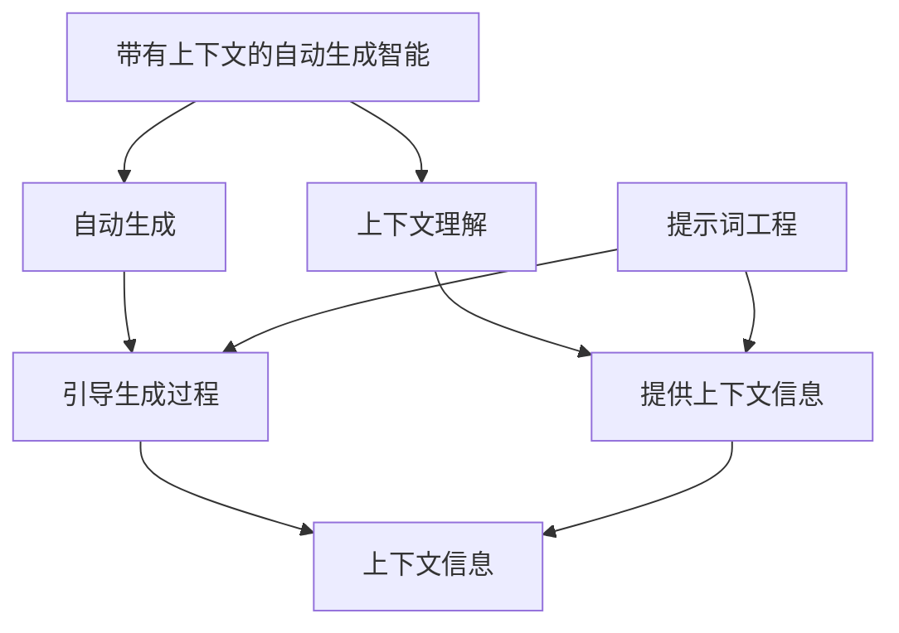
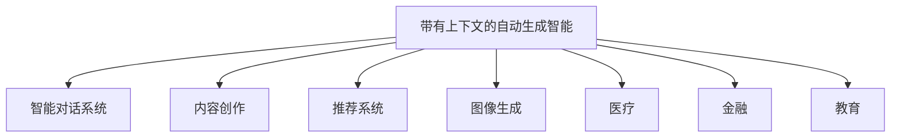

                 

### 文章标题

### AIGC提示词工程：构建智能对话系统的核心技术

> 关键词：AIGC、提示词工程、智能对话系统、上下文理解、生成对抗网络

> 摘要：本文深入探讨了AIGC（带有上下文的自动生成智能）与提示词工程的关系，从基本概念、架构设计、应用到未来发展趋势等多个角度，全面解析了如何构建高效的智能对话系统。文章旨在为读者提供清晰、系统的理解，帮助其在实际项目中更好地应用AIGC技术。

## 第I部分: AIGC基本概念与架构设计

### 第1章: AIGC基础理论

#### 1.1 AIGC的定义与核心概念

##### 1.1.1 AIGC的定义

AIGC，即“带有上下文的自动生成智能”（Auto-Generative Intelligence with Context），是一种新兴的AI技术，它结合了自动生成与上下文理解，能够基于输入的上下文信息生成高质量的内容。

##### 1.1.2 AIGC的核心概念

AIGC的核心概念包括：

1. **自动生成**：指AI系统能够根据给定的输入生成内容，如文本、图像、音频等。
2. **上下文理解**：指AI系统能够理解输入内容的上下文信息，从而生成更加相关和准确的内容。

#### 1.1.3 AIGC与提示词工程的关系

提示词工程是AIGC的重要组成部分。提示词是指用于引导模型生成目标内容的关键词或句子。在AIGC中，提示词不仅能够引导生成过程，还能提供上下文信息，帮助模型更好地理解和生成内容。

##### 1.1.4 AIGC的架构设计

AIGC的架构通常包括以下几个主要组件：

1. **数据采集与预处理**：收集相关的数据，并进行预处理，如去噪、标准化等。
2. **模型训练**：使用收集到的数据训练生成模型和上下文理解模型。
3. **生成与优化**：基于输入的上下文信息和提示词，生成目标内容，并进行优化。

### 1.2 AIGC的发展历程

AIGC的发展历程可以分为以下几个阶段：

1. **早期探索**：研究者开始探索如何将生成模型与上下文理解结合，以生成更高质量的内容。
2. **生成对抗网络（GAN）**：GAN的出现标志着AIGC的一个重要里程碑，它通过对抗训练生成高质量的内容。
3. **上下文生成模型**：如BERT、GPT等，这些模型能够更好地理解和生成上下文信息。
4. **多模态AIGC**：随着多模态数据的兴起，研究者开始探索如何在AIGC中整合多种数据类型，如文本、图像、音频等。

### 1.3 AIGC的应用场景

AIGC在多个领域具有广泛的应用，包括：

1. **智能对话系统**：如智能客服、智能问答等，能够根据用户的提问生成准确的回答。
2. **内容创作**：如自动生成文章、故事、音乐等，为内容创作者提供辅助。
3. **推荐系统**：通过上下文信息生成个性化的推荐内容。
4. **图像生成**：如自动生成图像、艺术作品等。

#### 1.3.1 AIGC与提示词工程的关系架构

以下是AIGC与提示词工程的关系架构图：

### 1.4 AIGC的优势与挑战

##### 1.4.1 AIGC的优势

1. **生成内容的高质量**：AIGC能够生成与上下文信息高度相关的内容，提高了生成内容的质量。
2. **上下文理解能力**：AIGC能够理解输入的上下文信息，从而生成更加准确和相关的结果。
3. **多模态整合**：AIGC能够整合多种数据类型，如文本、图像、音频等，提高了模型的泛化能力。

##### 1.4.2 AIGC的挑战

1. **计算资源需求**：AIGC需要大量的计算资源进行训练和推理，这对硬件设施提出了较高的要求。
2. **数据隐私问题**：在收集和处理数据时，需要关注数据隐私和安全问题。
3. **模型可解释性**：AIGC模型的决策过程通常较为复杂，难以解释，这可能会影响其应用。

### 1.5 AIGC的应用现状

目前，AIGC已经在多个领域得到应用，如智能对话系统、内容创作、推荐系统等。随着技术的不断发展，AIGC的应用范围将越来越广泛。

### 1.6 AIGC的未来发展趋势

未来，AIGC将在以下几个方面得到进一步发展：

1. **模型效率的提升**：研究者将致力于提高AIGC模型的效率，以降低计算资源需求。
2. **多模态整合**：随着多模态数据的不断增长，AIGC将能够更好地整合多种数据类型，提高生成内容的质量。
3. **应用场景的拓展**：AIGC将在更多领域得到应用，如医疗、金融等。

#### 1.6.1 AIGC的应用拓展

以下是AIGC在不同领域应用拓展的Mermaid流程图：

### 1.7 小结

AIGC作为一项新兴的AI技术，具有广阔的应用前景。通过本文的介绍，读者应该对AIGC的基本概念、架构设计及其应用有了初步的了解。在接下来的章节中，我们将深入探讨AIGC在提示词工程中的具体应用，以及如何构建高效的智能对话系统。

---

**参考文献：**

1. Vinyals, O., & Le, Q. V. (2015). A Neural Conversational Model. arXiv preprint arXiv:1506.03099.
2. Zaremba, W., Sutskever, I., & Salakhutdinov, R. (2014). Sequence to sequence learning with neural networks. In Advances in neural information processing systems (pp. 1217-1225).
3. Goodfellow, I., Pouget-Abadie, J., Mirza, M., Xu, B., Warde-Farley, D., Ozair, S., ... & Bengio, Y. (2014). Generative adversarial nets. Advances in neural information processing systems, 27.

---

**作者：AI天才研究院/AI Genius Institute & 禅与计算机程序设计艺术 /Zen And The Art of Computer Programming**

